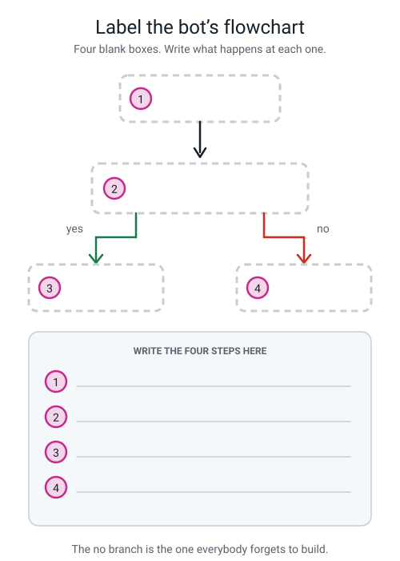
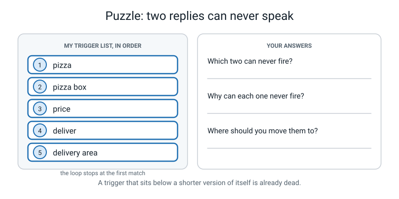
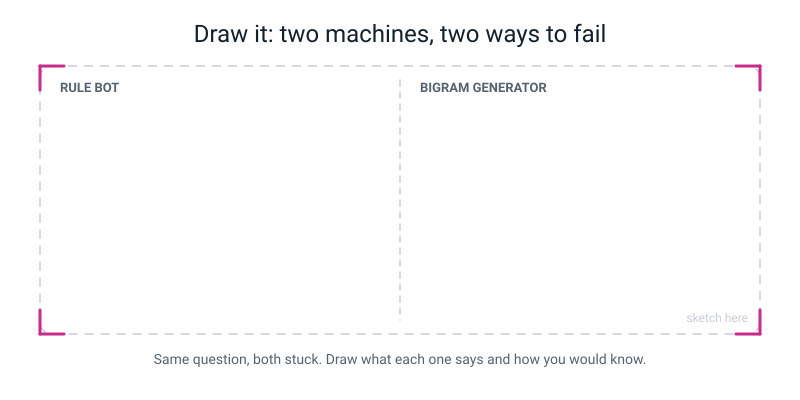

# Workbook — Week 30: Build a Chatbot in Scratch

**Name:** ________________________________  **Date:** ______________

[📖 Read the chapter first](../student-guide/week-30.md) · [Course Home](../README.md)

---

## ✅ Warm-Up (5 min)

Five quick questions about **last week** — dice and hallucinations. Notebook closed.

**W1.** Why does **greedy** generation go round in a circle? One sentence, and make the word *same* do the work.

________________________________________________________________

**W2.** Name two words in the bus table that greedy can **never** produce. ______________ , ______________

**W3.** What is a **hallucination**? And name the one thing it is **not**.

________________________________________________________________

**W4.** Our bigram table's **context** is ______ word. A large chatbot's is about ______________. Which problem does the bigger one fix, and which does it not?

________________________________________________________________

**W5.** Fill both columns for `amma takes the bus to the market .` — reads well: ______ · true to corpus: ______

Why is that combination the dangerous one? ______________________________________

---

## ✍️ Practice Set A — Understand It

These questions check that you know the words and the steps. Use the chapter if you need it.

**A1. Fill in the blanks.**

(a) n tokens in a row is an ____________.

(b) A bigram gives ______ word of memory. A trigram gives ______.

(c) The reply a rule-based bot gives when nothing in its list matches is the ____________.

(d) The loop stops at the ____________ match, which means the ____________ of the list is a rule in itself.

(e) Rule of thumb: no trigger shorter than ______ letters.

---

**A2. Multiple choice.** Circle **one**. A 40-token corpus gives 39 bigrams. How many **trigrams**?

| | | |
|---|---|---|
| **A** | 40 | |
| **B** | 39 | |
| **C** | 38 | |
| **D** | 37 | |

Write the general rule: an n-gram gives ______________ groups from 40 tokens.

---

**A3. True or false — and explain.**

(a) The more I use my Scratch bot, the better it will get.  **T / F**

Because: ________________________________________________________

(b) When the fallback fires, the bot has failed.  **T / F**

Because: ________________________________________________________

(c) A trigram table would have prevented `amma takes the bus to the market .`  **T / F**

Because: ________________________________________________________

---

**A4. Match the pairs.** Write the letter in the box.

| Term | | | Example |
|---|---|---|---|
| 1. n-gram | ☐ | **A** | `open` matches "how do I open the box" and gives opening hours |
| 2. trigram | ☐ | **B** | "I don't know that one — try asking about toppings" |
| 3. fallback | ☐ | **C** | The group `(to, the)`, which sees two words back |
| 4. false match | ☐ | **D** | Nothing matched, but the bot *does* know the answer under a different wording |
| 5. gap | ☐ | **E** | n tokens in a row, with n − 1 words of memory |

---

**A5. Label the diagram.** Write what happens at each of the four blank boxes.

*Figure W30.1 — Four boxes, a yes branch and a no branch. Name them, then follow one message all the way through.*

1 ________________________________________________________________

2 ________________________________________________________________

3 ________________________________________________________________

4 ________________________________________________________________

---

**A6. Be the bot.** Here is a school-office bot. Walk the list yourself, strictly and stupidly.

Start at row 1. Take the **first** match. Stop.

| Row | TRIGGER | REPLY |
|---:|---|---|
| 1 | homework | Homework club is Wednesday, 3:30pm, room 12. |
| 2 | home time | School finishes at 3:15pm. |
| 3 | lunch | Lunch is 12:30 to 1:15. Hot food in the main hall. |
| 4 | school bus | Buses leave from the front gate at 3:25pm. |

**(i) `what time is home time`**

| i | Trigger | Contains it? | What happens |
|---:|---|---|---|
| 1 | homework | | |
| 2 | | | |

Bot says: ____________________________________  Label: ______________

**(ii) `is there a lunchbox rule`**

| i | Trigger | Contains it? | What happens |
|---:|---|---|---|
| 1 | | | |
| 2 | | | |
| 3 | | | |

Bot says: ____________________________________  Label: ______________

Why did that happen? ____________________________________________

**(iii) `what is the moon made of`**

Bot says: ____________________________________  Label: ______________

Is (iii) a pass or a failure? ______  Why? ______________________________

---

## ✍️ Practice Set B — Use It

These questions put the ideas to work on bots that are going wrong. Write your answer on the lines.

**B1.** Your bot works perfectly on turn 1 and gives a proper answer. Then every single turn after that, it says nothing at all, no matter what you type.

Which of the three causes is it? ______________________________________

The fix: ________________________________________________________

---

**B2.** You type one question and the bot gives you the **right answer** and then, two seconds later, *"I don't know that one."*

Which cause is it? ____________________________________________

The fix: ________________________________________________________

---

**B3. Here is a situation. What would go wrong and why?** A student adds a trigger of just `is` at the **top** of a ten-item list, thinking it will help catch more questions.

(a) What happens to almost every question they type?

________________________________________________________________

(b) Why? Give two example questions that would now match row 1 by accident.

________________________________________________________________

(c) Two different fixes: ________________________________________________

---

**B4. Here is a situation. What would go wrong and why?** A hospital puts a **learned generator** on its front page to answer *"what medicine should I take?"*

(a) What does it do when it does not know?

________________________________________________________________

(b) Why is that worse here than it would be on a story-writing website?

________________________________________________________________

(c) What would you build instead? Describe it in two lines.

________________________________________________________________

________________________________________________________________

---

**B5.** Your triggers are `open` and `opening time`, in that order, with two different replies.

(a) Which reply can **never** fire? ____________________________

(b) **Prove** it. What would a question have to contain, and why is that impossible?

________________________________________________________________

________________________________________________________________

(c) The fix: ______________________________________________________

(d) What does the fix **cost**? Name one question that used to work and now does not.

________________________________________________________________

---

## 🧩 Puzzle of the Week

### Two Replies That Can Never Speak

This puzzle is about a trigger list and the order of its rows.

*Figure W30.2 — Five triggers in order. Two of them can never fire, because first match wins.*

Here is a trigger list, in the order it sits in the bot:

| Row | TRIGGER |
|---:|---|
| 1 | pizza |
| 2 | pizza box |
| 3 | price |
| 4 | deliver |
| 5 | delivery area |

Remember: the loop walks from the top and **stops at the first match**.

**(a)** Exactly **two** of these five can never fire. Which two?

Row ______ and Row ______

**(b)** For each one, say what a question would have to contain and why that is impossible.

Row ______: ______________________________________________________

Row ______: ______________________________________________________

**(c)** Rewrite the list in an order where **all five** can fire.

| Row | TRIGGER |
|---:|---|
| 1 | |
| 2 | |
| 3 | |
| 4 | |
| 5 | |

**(d)** Write the general rule you just used, in one line.

________________________________________________________________

---

## 🤔 Think Deeper

These two questions ask you to make a choice and explain it. Use full sentences.

**T1.** You have now built one machine from each family — one that **learned** and one that was **told**. Write a paragraph: which failure mode would you rather have, and why? Then answer the harder half — if you chose the generator, say exactly **how** you would check it; if you chose the rule bot, say what you are **giving up**.

________________________________________________________________

________________________________________________________________

________________________________________________________________

________________________________________________________________

________________________________________________________________

---

**T2.** Design a **layered** bot for one of these: a doctor's surgery, a school office, or a game's help chat. Pick one. Which questions go to hand-written rules, which to a learned generator, and which straight to a human? Your reasoning must hinge on **what it costs to be wrong**.

My setting: ____________________________

________________________________________________________________

________________________________________________________________

________________________________________________________________

________________________________________________________________

---

## 🛠️ Build It

### The Human Language Model — finish all three parts

This section is where you finish your project and record your work. Tick each step as you go.

**Step checklist — tick as you go:**

- ☐ **1.** Part 1: tidy up your Week 28 tally sheet so somebody else could read it. Both checks ticked.
- ☐ **2.** Part 2: your Week 29 traces, greedy run, and the hallucination with FALSE stamped on it.
- ☐ **3.** Part 3: take your bot from five trigger/reply pairs up to **ten**, on your own topic.
- ☐ **4.** Specific triggers **above** general ones. No trigger shorter than four letters.
- ☐ **5.** A fallback in the bot's own voice, marked against the three jobs.
- ☐ **6.** One reply that uses a sentence your **bigram generator** actually produced.
- ☐ **7.** Test five different questions in a row, without stopping the program.
- ☐ **8.** Complete the ten-question log. At least two questions you know it will fail.
- ☐ **9.** **Save twice.** File → Save to your computer, into a named folder. Then File → Save now, or a photo.
- ☐ **10.** Write the three-sentence comparison.

### Part 3a — my Trigger Planning Sheet

**My bot's topic:** ____________________________  **Bot's name:** ______________

| # | TRIGGER | REPLY | Order matters here? Why? |
|---:|---|---|---|
| 1 | | | |
| 2 | | | |
| 3 | | | |
| 4 | | | |
| 5 | | | |
| 6 | | | |
| 7 | | | |
| 8 | | | |
| 9 | | | |
| 10 | | | |

**Which of my replies is a sentence my bigram generator produced?** Row ______

### Part 3b — my fallback

**My fallback, word for word:**

________________________________________________________________

| The three jobs | How mine does it | ☐ |
|---|---|---|
| Does it **admit** it doesn't know? | | ☐ |
| Does it avoid **pretending**? | | ☐ |
| Does it **steer** to what I can answer? | | ☐ |

### Part 3c — my Ten-Question Log

> **Rules:** write all ten questions down **before** you type them. At least two must be ones you know it will fail. Write the bot's **exact words**. Do not fix the bot while logging.

| # | I typed | The bot said (exact words) | Match? | Sensible? | Label |
|---:|---|---|---|---|---|
| 1 | | | | | |
| 2 | | | | | |
| 3 | | | | | |
| 4 | | | | | |
| 5 | | | | | |
| 6 | | | | | |
| 7 | | | | | |
| 8 | | | | | |
| 9 | | | | | |
| 10 | | | | | |

**Labels:** `correct` · `gap` · `false match` · `honest fallback`

**Score:** ______ sensible out of 10.

**For every failure — could you tell instantly that it had failed?** ☐ yes ☐ no

**Now look at last week's score sheet, row with the FALSE stamp. Could you tell instantly that one had failed?** ☐ yes ☐ no

### Part 3d — the repeat bug

**Which of the three causes did my bot have?** ______________________________

**The exact symptom I saw:**

________________________________________________________________

**What I did to fix it:**

________________________________________________________________

**How I proved it was fixed:** ________________________________________

### Part 3e — where my work is saved

| Copy | Where it is | ☐ done |
|---|---|---|
| `.sb3` file (File → Save to your computer) | folder: ______________________ | ☐ |
| Second copy (File → Save now, **or** a photo of the blocks + both lists) | ______________________ | ☐ |

> **⚠️ Watch out:** a browser tab is **not** a saved file. Every year somebody loses three weeks of work to a closed tab.

### Part 3f — the three-sentence comparison

Compare how the rule-based bot fails with how the bigram generator fails. **One real example of each, from your own log and your own score sheet.** Not from the book.

Sentence 1 (how the **rule bot** fails, with your example):

________________________________________________________________

Sentence 2 (how the **generator** fails, with your example):

________________________________________________________________

Sentence 3 (the difference that actually matters):

________________________________________________________________

---

## 🎨 Draw It

This page is for showing your two machines in one picture.

Draw the two machines side by side, both stuck on the same question, and show what each one does about it.

*Figure W30.3 — Two machines, two completely different ways to fail. One half each.*

> **💡 What a good answer looks like:** the same question written across the top — *"What is the moon made of?"* — with an arrow going down into both halves. **Left half:** your rule bot, its trigger list drawn as a short numbered ladder with a big **✗** at the bottom of it, and a speech bubble with your actual fallback in it. Under that, a label: **"failed loudly — I knew straight away."** **Right half:** the tally table, a bag of slips, and a speech bubble with a fluent sentence in it, stamped **FALSE**. Under that: **"failed silently — I only found out by checking."** Then the two things that earn the marks: a note on the left saying **"can only say 10 things"** and one on the right saying **"can answer anything"** — because the honest drawing shows that the **dangerous** machine is also the **useful** one. And somewhere across the bottom, the sentence: **"annoying beats dangerous, but only if you know which one you have."**

---

## 📊 Self-Check

This table is for you to rate how well you can do each thing. Tick one box in each row.

| I can… | 😀 easily | 🙂 with a bit of help | 😕 not yet |
|---|---|---|---|
| Build a working Scratch chatbot from two lists and an ask-and-wait loop | ☐ | ☐ | ☐ |
| Write a fallback that admits, doesn't pretend, and steers | ☐ | ☐ | ☐ |
| Diagnose which of the three causes gave me the repeat bug, and fix it | ☐ | ☐ | ☐ |
| Explain why the order of the trigger list is a rule in itself | ☐ | ☐ | ☐ |
| Compare the two failure modes with a real example of each | ☐ | ☐ | ☐ |
| Say what an n-gram, a trigram and a fallback are | ☐ | ☐ | ☐ |

---

## ✅ Answers

This section is for checking your work after you have finished. Open it only when you are done.

Check your answers

### Warm-Up

**W1.** Because it makes the **same** choice on the **same** row every time, so once it returns to a word it has already visited it must repeat that whole path for ever.

**W2.** Any two of `amma`, `market`, `shop`, `goes`, `is`, `very`, `late`, `my`, `take`, `takes`, `town`, `run`, `like`, `it`, `and`, `i`, `.` — **17 of the 20 words**. Greedy from `the` can only ever reach `the`, `bus` and `to`.

**W3.** When an AI produces something that **sounds right but isn't true**. And it is **not a lie** (lying needs an intention, and there is nothing in a tally sheet that could hold one) and **not a bug** (every step obeyed every rule).

**W4.** **One** word · about **a hundred thousand** words. The bigger one fixes **forgetting** — no more losing track of who the sentence is about, no more crude loops. It does **not** fix **truth**, because the world is not in the window and no step anywhere checks reality.

**W5.** Reads well **✓** · true **✗**. That is the dangerous combination because **it is the one you would believe.** The obviously broken outputs are harmless — you never trust them. This one carries no warning at all.

---

### Practice Set A

**A1.** (a) **n-gram** · (b) **1**, **2** · (c) **fallback** · (d) **first**, **order** · (e) **four**

**A2. C — 38.** The general rule: an n-gram gives **40 − (n − 1)** groups. So 39 bigrams, 38 trigrams, 37 four-grams. Same logic as tokens − 1: a group of n tokens cannot start in the last n − 1 positions, because it would run off the end.

**A3.**

(a) **False.** There is no block anywhere in the project that changes the lists — go and look. The only `add` blocks run **once**, at the green flag.

Its knowledge came from a person typing, which is what makes it **rule-based** rather than machine learning. (You *could* add a block that pushes a new trigger on when nothing matches. The hard part isn't adding the trigger — it's deciding what the **reply** should be.)

(b) **False**, and getting this the right way round is the most valuable thing in the week. The fallback firing is the bot **succeeding at being honest**. Compare it with last week's generator: faced with something it didn't know, it produced a fluent, confident falsehood and you had to go and check the corpus to catch it. **Annoying beats dangerous.**

(c) **False.** Check it step by step: `(amma, takes) → the`, `(takes, the) → bus`, `(the, bus) → to`, `(bus, to) → the`, `(to, the) → market`, `(the, market) → .` **Every step legal.** At the deciding moment the two visible words are `to the`, and `amma` is **four** words further back — still completely invisible. You would need a **7-gram** to fix it.

**A4.** 1 → **E** · 2 → **C** · 3 → **B** · 4 → **A** · 5 → **D**

**A5.**

1. **You type something.** (`ask … and wait`, and what you typed lands in `answer`.)
2. **Walk the trigger list from the top — does `answer` contain item `i` of triggers?** (The `repeat until` loop with the `contains` check inside it.)
3. **Yes: say the reply at the same position, set `matched` to 1, and stop walking.**
4. **No, all the way to the bottom: say the fallback.** (`if matched = 0`.)

The **no** branch is the one everybody forgets to build, and without it the bot either goes silent or repeats whatever it said last time.

**A6.**

**(i) `what time is home time`**

| i | Trigger | Contains it? | What happens |
|---:|---|---|---|
| 1 | homework | no | `change i by 1` |
| 2 | home time | **yes** | say reply 2, `matched` = 1, stop |

Bot says: *School finishes at 3:15pm.* Label: **correct.**

(Note that `homework` and `home time` are safe together — neither one is contained inside the other, so neither is dead.)

**(ii) `is there a lunchbox rule`**

| i | Trigger | Contains it? | What happens |
|---:|---|---|---|
| 1 | homework | no | i → 2 |
| 2 | home time | no | i → 3 |
| 3 | lunch | **yes** | say reply 3, stop |

Bot says: *Lunch is 12:30 to 1:15. Hot food in the main hall.* Label: **false match.**

**Why:** the letters `lunch` really are inside the word `lunchbox`, and `contains` looks anywhere in the text and knows nothing about meaning. Nothing is broken — it did exactly what you told it.

**(iii) `what is the moon made of`**

It walks all four rows, matches nothing, `matched` stays 0, so the fallback fires: *"I don't know that one — try asking about homework, home time, lunch or the school bus."* Label: **honest fallback.**

**It is a pass, not a failure.** It genuinely did not know, it said so, and it told you where to go instead. Compare that with last week's generator, which would have produced a confident sentence about the moon.

---

### Practice Set B

**B1.** **Cause 1: `set i to 1` and `set matched to 0` are sitting ABOVE the `forever` block**, so they only ever run once. After a turn that found a match, `matched` is parked at 1 and `i` is left part-way down the list. So the `repeat until` exits before checking anything, and `if matched = 0` is false too, so the bot says **nothing at all**. (If turn 1 had found no match, `i` would be parked past the end of the list and `matched` at 0, and you would get the **fallback on every turn** instead.)

**The fix:** drag both `set` blocks **inside** the forever loop, directly under `ask and wait`.

**B2.** **Cause 2: `set matched to 1` is missing from inside the `if`.** So the loop says the right reply, then carries on walking to the bottom of the list, and at the end `matched` is still 0 — so the fallback fires as well. (The other symptom of the same bug: a question containing **two** trigger words gets two replies stacked on top of each other.)

**The fix:** add `set matched to 1` immediately after the `say`, still **inside** the `if`.

**B3.**

(a) **Almost every question gets reply 1**, whatever it was about.

(b) Because the letters `is` appear inside an enormous number of ordinary questions. Two examples: *"where **is** the bus"* and *"**is** there lunch"* — and it is worse than that, because `is` also hides inside whole words: *"what time do you close th**is** week"* matches too.

(c) Two fixes: **lengthen it** (to something like `is it open`), or **demote it** below all the specific triggers. Best of all, do both. And then the rule: **no trigger shorter than four letters, specific above general.**

**B4.**

(a) It **invents** — fluently, confidently, in exactly the same voice it uses when it is right. There is no step anywhere in it that checks reality, and no wobble in its voice when it crosses from true to false.

(b) Because the **cost of being wrong** is enormous, and because the claim is exactly the dangerous kind: **specific, checkable and consequential.** On a story website a made-up sentence is the product. Here it could hurt someone, and the person asking is the least able to spot the error.

(c) A **layered** design. Something like: *"Hand-written, doctor-approved answers for the twenty commonest questions, so the wording is exactly right every time. Anything else goes straight to a human, with a clear button to press — and no generator anywhere near a question about medicine."* Full credit for putting the rules where the stakes are highest and a human where the rules run out.

**B5.**

(a) The **`opening time`** reply — row 2.

(b) A question would have to contain the phrase **"opening time"** but **not** contain the word **"open"** — and that is impossible, because "opening time" has "open" inside it. So row 1 always matches first and the loop stops before row 2 is ever looked at. It was not deleted. It was **demoted**.

(c) **Swap them**, so `opening time` sits above `open`. Then *"what are your opening times"* reaches row 1, and *"are you open on Sunday"* falls through to row 2. Both work.

(d) The swap itself costs nothing — which is worth noticing, because it is unusually cheap. **Lengthening** a trigger is what costs you something. If instead you had fixed the earlier `open` problem by changing it to `what time do you open`, then *"are you open on Sunday?"* would stop matching altogether. **Every tightening loses something**, and that is the same tighten-versus-loosen trade-off from Week 8.

---

### 🧩 Puzzle of the Week

**(a) Rows 2 and 5** — `pizza box` and `delivery area`.

**(b)**

**Row 2 (`pizza box`):** a question would have to contain "pizza box" but not "pizza". Impossible — "pizza" is inside "pizza box", so row 1 always grabs it first.

**Row 5 (`delivery area`):** a question would have to contain "delivery area" but not "deliver". Impossible — "deliver" is inside "delivery", which is inside "delivery area", so row 4 always grabs it first.

**(c) A working order — specific above general:**

| Row | TRIGGER |
|---:|---|
| 1 | pizza box |
| 2 | pizza |
| 3 | price |
| 4 | delivery area |
| 5 | deliver |

Check it: *"how big is the pizza box"* → row 1 ✓. *"do you do pizza"* → row 1 does not match, row 2 does ✓. *"what is your delivery area"* → row 4 ✓. *"do you deliver"* → row 4 does not match, row 5 does ✓. All five are now reachable.

**(d) The rule:** **if one trigger contains another, the longer one must sit higher.** (Equivalently: specific above general. Otherwise the shorter one swallows every question the longer one was for.)

**Worth noticing:** you fixed two dead replies without writing a single new block. You changed the **order**, and the order was already a rule — you just hadn't been using it on purpose.

---

### 🤔 Think Deeper

**T1.** **Both answers can earn full marks**, and what is being marked is whether you engaged with **visibility**.

*"The rule bot, because at least you know"* is exactly right — and the honest second half is naming what you give up: it can only say ten things, it cannot handle any phrasing you did not think of, and it will fall back on perfectly reasonable questions like "hello".

*"The generator, because it's far more useful and I'll just check it"* is **also** exactly right — provided you say **how** you would check. A good answer names a method: *"I check anything specific — names, dates, numbers, page references — against a source I already trust, and I never hand in a claim I have not checked."* Without the *how*, this answer is just optimism.

What does **not** earn marks is *"they both get things wrong."* That flattening is the exact thing this week exists to prevent. The finding is not that one is better. It is that **their failures look completely different, and only one kind announces itself.**

**T2.** There is no single right design. A strong answer has all three layers and hangs the reasoning on cost. For example, a **doctor's surgery**:

**Hand-written rules** for opening hours, the address, how to book, how to order a repeat prescription, and what to do out of hours. Why: high volume, the answer never changes, and the wording needs to be exactly right every time — you want the *same* sentence, not a fluent guess.

**A learned generator** for nothing medical at all, and possibly for rewording the rule-based answers more simply, or translating them. Why: the phrasing can vary safely; the content is still the approved content.

**Straight to a human**, with an obvious button, for anything about symptoms, medicines, dosages, or a specific patient. Why: the cost of being wrong is a person being harmed, and the person asking is the least able to spot an error.

Full credit for saying out loud that the layers exist **because the two kinds of system fail differently** — which is what you proved with your own two machines this week.

---

### 🛠️ Build It

Your bot and your topic are your own, so here is a full-credit reference on the five-trigger PizzaBot, plus what is being looked for in each part.

**The reference log** (triggers: 1 `pineapple` · 2 `topping` · 3 `price` · 4 `deliver` · 5 `open`):

| # | I typed | The bot said | Match? | Sensible? | Label |
|---:|---|---|---|---|---|
| 1 | `hello` | I don't know that one… | no | **✗** | **gap** — no greeting trigger |
| 2 | `what toppings do you have` | Cheese, mushroom, paneer, corn. | yes | ✓ | correct |
| 3 | `HOW MUCH IS A LARGE` | I don't know that one… | no | **✗** | **gap** — it knows the price, but this question never says the word |
| 4 | `what is the price` | Medium 250. Large 400. | yes | ✓ | correct |
| 5 | `do you have pineapple as a topping` | Pineapple on pizza? Delicious. | yes | ✓ | correct — proves row order works |
| 6 | `do you deliver to my house` | We deliver within 5 km. | yes | ✓ | correct |
| 7 | `what time do you open` | Open 11am to 11pm, every day. | yes | ✓ | correct |
| 8 | `how do i open it` | Open 11am to 11pm, every day. | yes | **✗** | **false match** |
| 9 | `what is the moon made of` | I don't know that one… | no | ✓ | **honest fallback** |
| 10 | `are you a robot` | I don't know that one… | no | ✓ | **honest fallback** |

**Score: 7 sensible out of 10.** Three failures: two **gaps** (rows 1 and 3) and one **false match** (row 8).

**The observation that carries the week:** in **all three** failures you could tell at once that something had gone wrong. Rows 1 and 3 announce it in words; row 8 gives opening hours to a question about a box, which is visibly off-topic. **Every failure in this log was visible** (usually, not always: a plausible on-topic wrong answer could slip past). Set that against last week's row 2, which read perfectly and was false.

**The fixes, if you have time:** row 1 — add a trigger `hello`. Row 3 — add a trigger `how much` pointing at the *same* reply as `price` (two triggers, one reply, is perfectly normal). Row 8 — change `open` to `what time do you open`, and then notice the cost: *"when are you open?"* no longer matches. **There is no setting that gets both.**

**The three-sentence comparison — three levels of answer.**

**Full marks:**

> *"When my Scratch bot doesn't know something, it says 'I don't know that one, try asking about toppings' — like it did when I asked what the moon is made of. When my bigram generator doesn't know something, it makes it up: it told me 'i run to town' when nobody in my story runs to town. The difference that matters is that I could see the bot failing straight away, and I only found the generator's mistake because I went back and checked the story."*

**Solid, but missing the sharpest point:**

> *"My bot says 'I don't know that one' when nothing matches, like with 'what is the moon made of'. My generator invented 'i run to town', which wasn't true. The bot is more honest but it can only say ten things, while the generator can make up new sentences."*

Correct, with real examples — but it never says that one failure is **visible** and the other is not. Ask yourself: *which mistake would I have missed?*

**Not yet:**

> *"The bot fails because it doesn't have enough triggers. The generator fails because it's random. They both get things wrong."*

No examples, and "they both get things wrong" is exactly the flattening the week exists to prevent. Go back to your two sheets and quote one real example from each.

---

### 🎨 Draw It

There is no single right drawing. A full-credit one has the **same question** feeding both halves, each machine's actual output written in a speech bubble, and the two labels **failed loudly** / **failed silently**.

The thing that separates a good drawing from a correct one is that it is **fair to both machines**: the rule bot labelled *"can only say 10 things"* and the generator labelled *"can answer anything"*. If your drawing makes the generator look simply bad, it has told the wrong story — the whole point is that the more dangerous machine is also the far more useful one, which is exactly why knowing which one you are talking to matters at all.

---

[⬅ Week 29 workbook](week-29.md) · [📖 Week 30 chapter](../student-guide/week-30.md) · [Course Home](../README.md) · [Week 31 workbook ➡](week-31.md) · [Glossary](../../glossary.md)
