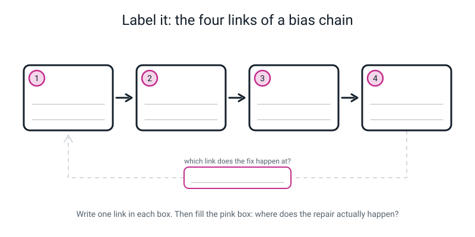
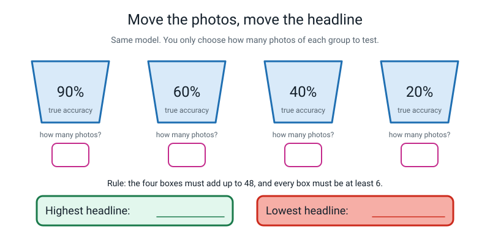
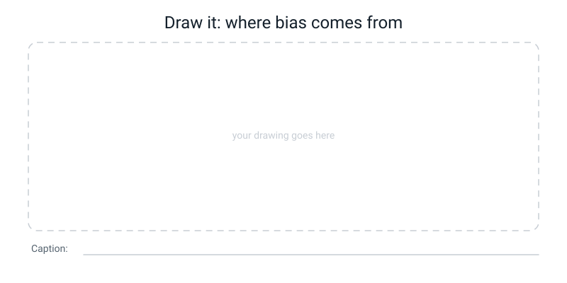

# Workbook — Week 31: Who Is Missing From the Photos?

**Name: ________________________________     Date: ______________________**

[📖 Read the chapter first](../student-guide/week-31.md) · [Course Home](../README.md)

> **What you need:** a pen, a calculator (or long division and some nerve), one envelope, and something to stick it shut with.
> **How long:** about 50 minutes. **Rule of the week:** every percentage must have its division written next to it.

---

## ✅ Warm-Up (5 min)

*Five quick ones from last week, before we start anything new. No notes.*

**1.** A chatbot chooses its next word by ______________________ which words followed each other in the text it was trained on.

________________________________________________

**2.** True or false: a chatbot looks up the answer in a database of facts before replying.

**TRUE / FALSE**, because ____________________________________________

**3.** Why does an invented answer come out sounding exactly as confident as a true one?

________________________________________________

________________________________________________

**4.** In your Scratch chatbot, which parts did *you* have to write out by hand?

________________________________________________

**5.** If a word pair never appeared anywhere in the training text, how many counts does the machine have for it? What does it have to do instead?

________________________________________________

---

## ✍️ Practice Set A — Understand It

### A1 — Fill in the blanks

> **bias** — when a model works noticeably ________________ for some group of inputs than for others, in a way that ________________.

A model does not have opinions. What a model has is ________________.

```
   WHAT IT SAW A LOT OF   →   it ____________________
   WHAT IT SAW A LITTLE   →   it ____________________
   WHAT IT NEVER SAW      →   it ____________________
```

### A2 — Multiple choice

Group A scores **80%**. Group B scores **55%**. Which of these is written correctly?

- [ ] **(a)** The gap is 25%.
- [ ] **(b)** The gap is 25 percentage points.
- [ ] **(c)** The gap is 45%.
- [ ] **(d)** The gap is 25 percents.

Now explain, in one sentence, what is wrong with the answer you did *not* tick from (a) and (b):

________________________________________________

### A3 — True or false, and explain

**(i)** A model can only be biased if the people who built it were unfair on purpose.

**TRUE / FALSE** — because ____________________________________________

**(ii)** If a model is bad at photos taken by lamplight, a faster computer would help.

**TRUE / FALSE** — because ____________________________________________

**(iii)** The overall accuracy of a test can be changed without changing the model at all.

**TRUE / FALSE** — because ____________________________________________

### A4 — Match the pairs

Draw a line, or write the letter in the box.

| Term | | | What it means |
|---|---|---|---|
| **1.** bias | ☐ | **A** | Deliberately testing group by group, with the groups chosen first |
| **2.** accuracy gap | ☐ | **B** | The system fails to recognise somebody who really is there |
| **3.** fairness audit | ☐ | **C** | The model is much worse for one group than another |
| **4.** false reject | ☐ | **D** | Best group's accuracy minus worst group's, in percentage points |

### A5 — Label the diagram

Write one link of the bias chain in each box. Then fill in the pink box at the bottom: **which link does the repair actually happen at?**


*Figure W31.1 — Four links, one loop back. Fill in all five.*

### A6 — Vocabulary in your own words *(page W31.5)*

One sentence each. Not copied from the chapter — **your** words.

| Word | Your sentence |
|---|---|
| **bias** | ________________________________________ |
| **accuracy gap** | ________________________________________ |
| **fairness audit** | ________________________________________ |
| **false reject** | ________________________________________ |

---

## ✍️ Practice Set B — Use It

### B1 — The school gate *(page W31.3)*

A face scanner at the school gate marks attendance. The company advertises **"98% accurate"**.

An independent test finds it wrongly marks a **present** student **absent** — a false reject — at these rates:

| Group | False reject rate |
|---|---:|
| Students overall | 2% |
| Students wearing a headscarf | 8% |

There are **180 days** in the school year.

**(a)** Wrongly marked absent in one year. Show the multiplication.

```
   average:  ________ × 180 = ________ days      headscarf: ________ × 180 = ________ days
```

**(b)** The difference in one year, then over four years of school.

```
   one year:  ________ − ________ = ________ days
   4 years:   average ________ × 4 = ________   ·   headscarf ________ × 4 = ________
              difference over 4 years = ________ − ________ = ________ days
```

**(c)** The school has **600 students**, and every wrong mark takes a member of staff about **4 minutes** to notice and correct.

```
   600 × 0.02 = ______ wrong marks/day  →  ______ × 4 = ______ minutes/day
   ______ × 180 = ______ minutes/year   →  ______ ÷ 60 = ______ hours
```

**(d)** Name **three harms** here that are not the number itself.

1. ________________________________________________
2. ________________________________________________
3. ________________________________________________

**(e)** The company says the gap is "only 6 percentage points". Reply in two sentences, using at least two of your own numbers.

________________________________________________

________________________________________________

**(f)** Where does "98% accurate" come from, and what does it hide?

________________________________________________

### B2 — What would go wrong?

A hospital builds an AI that looks at an X-ray and flags a broken bone. It was trained on **40,000 X-rays of adults**. It scores 96% overall and everyone is delighted. The hospital now installs it in the **children's** department.

**(a)** What do you predict will happen, and why?

________________________________________________

**(b)** What one number would you demand to see before it is switched on?

________________________________________________

**(c)** Whose fault is it if a child's broken arm is missed? Give the honest answer, not the comfortable one.

________________________________________________

### B3 — What would go wrong?

A company must publish an accuracy figure for its photo-naming app. **They get to choose their own test set.** They know the app is excellent in daylight and poor by lamplight.

**(a)** What will they choose, and what number will they publish?

________________________________________________

**(b)** Will they have lied? Explain your answer carefully.

________________________________________________

**(c)** Write the one rule that would stop this trick working.

________________________________________________

### B4 — The grid the condition table could not see *(page W31.7)*

Each batch of 12 WhatIsIt? photos was actually **4 mugs, 4 spoons and 4 forks**. Here is the full grid.

| | mug | spoon | fork | batch total |
|---|---:|---:|---:|---:|
| A — daylight | 4/4 | 4/4 | 3/4 | 11/12 |
| B — lamplight | 3/4 | 2/4 | 2/4 | 7/12 |
| C — in a hand | 3/4 | 1/4 | 1/4 | 5/12 |
| D — patterned | 3/4 | 2/4 | 1/4 | 6/12 |
| **class total** | ____/16 | ____/16 | ____/16 | 29/48 |

**(a)** Fill in the three column totals, then turn each into a percentage. Show the division.

```
   mug:    ____ ÷ 16 = __________  →  ______%
   spoon:  ____ ÷ 16 = __________  →  ______%
   fork:   ____ ÷ 16 = __________  →  ______%
```

**(b)** Check your work two ways:

```
   ____ + ____ + ____ = ____   (should be 29)      16 × 3 = ____   (should be 48)
```

**(c)** What does this grid show that the four-condition table could **not**?

________________________________________________

________________________________________________

### B5 — Price the fix *(page W31.6)*

WhatIsIt? has **200 training photos** and **0** of them show an object held in a hand. How many held-in-a-hand photos must they add so that held-in-a-hand is **25%** of the training set?

```
   Let x = the number of photos to add.

        x / (200 + x) = 0.25
                    x = 0.25 × (200 + x)
                    x = ______ + ______x
        ______x = ______
              x = ______ ÷ ______
              x = ____________   →   round UP to ________ photos

   Check: ________ out of ________ = ________ = ________%   ✓
```

Now the sentence that stings. How much **extra** would it have cost them to shoot the original 200 photos across all four conditions in the first place?

________________________________________________

---

## 🧩 Puzzle of the Week

### Move the photos, move the headline


*Figure W31.2 — You may not change the model. You may only choose how many photos of each group to test.*

A model has four groups. Their **true accuracies never change**:

| Group | True accuracy |
|---|---:|
| 1 | 90% |
| 2 | 60% |
| 3 | 40% |
| 4 | 20% |

You must test **exactly 48 photos**, with **at least 6 photos in every group**.

**(a)** Choose the numbers that make the headline as **HIGH** as possible.

```
   g1: ____ × 0.90 = ______   g2: ____ × 0.60 = ______
   g3: ____ × 0.40 = ______   g4: ____ × 0.20 = ______
   total: ____ photos, ______ correct  →  ______ ÷ 48 = ______%
```

**(b)** Now choose the numbers that make the headline as **LOW** as possible.

```
   g1: ____ × 0.90 = ______   g2: ____ × 0.60 = ______
   g3: ____ × 0.40 = ______   g4: ____ × 0.20 = ______
   total: ____ photos, ______ correct  →  ______ ÷ 48 = ______%
```

**(c)** How far apart are your two headlines? Mind the unit.

```
   ________ − ________ = ________ ______________________
```

**(d)** In one sentence: what does that distance prove about the overall accuracy number?

________________________________________________

---

## 🤔 Think Deeper

**1.** Nobody at WhatIsIt? was unkind to anybody. They took 183 photos in daylight because it was daytime. So — **is anyone to blame?** Argue *both* sides, then say where you land and why. Write a paragraph.

________________________________________________

________________________________________________

________________________________________________

________________________________________________

**2.** Twelve photos per group is not many. If one photo out of twelve had gone the other way, that group's score would move by more than 8 points. **So how much should we trust a 50-point gap measured on twelve photos each — and how much should we trust a 3-point one?** Write a paragraph, and give a rule you would actually use.

________________________________________________

________________________________________________

________________________________________________

________________________________________________

---

## 🛠️ Build It

### Page W31.1 — The 48-photo audit, properly

**The checklist. Tick as you go.**

- [ ] Write the fraction for each batch
- [ ] Write the division out, decimal and all, for each batch
- [ ] Round each to **one** decimal place
- [ ] Work out the overall accuracy by **adding the corrects and dividing once**
- [ ] Name the best group and the worst group
- [ ] Write the gap **with the unit spelled out in words**

The scored test set — 48 photos the model had never seen, twelve in each condition:

| Batch | Condition | Correct | Total |
|---|---|---:|---:|
| A | Bright daylight, plain table | 11 | 12 |
| B | Lamplight, indoors, evening | 7 | 12 |
| C | Object held in a hand | 5 | 12 |
| D | Busy patterned cloth | 6 | 12 |

**(a) The four divisions. Every line, in full.**

```
   A:  11 ÷ 12 = ____________  × 100 = __________  →  ______%
   B:  ___ ÷ 12 = ____________  × 100 = __________  →  ______%
   C:  ___ ÷ 12 = ____________  × 100 = __________  →  ______%
   D:  ___ ÷ 12 = ____________  × 100 = __________  →  ______%
```

| Batch | Condition | Fraction | Decimal | Percentage |
|---|---|---|---|---:|
| A | Bright daylight | | | |
| B | Lamplight | | | |
| C | Held in a hand | | | |
| D | Patterned cloth | | | |

**(b) The overall accuracy.**

```
   correct = ____ + ____ + ____ + ____ = ________
   total   = 12 × 4 = ________

   ________ ÷ ________ = ______________  →  ________%
```

**(c) The accuracy gap.**

```
   best group  = ______________________  at  ________%
   worst group = ______________________  at  ________%

   accuracy gap = ________ − ________ = ________ ______________________
                                                (write the unit in words)
```

**(d)** Should WhatIsIt? put the overall figure on their website? Give **two** reasons.

________________________________________________

________________________________________________

**(e)** Write the **one line** WhatIsIt? must put in their instructions. It must name a specific situation and carry a number.

________________________________________________

### Page W31.2 — The trace

Here is the training data at last. **200 photos.**

| Condition | Training photos | Share of 200 | Test accuracy | One sentence: why? |
|---|---:|---:|---:|---|
| Bright daylight | 183 | ______% | ______% | |
| Lamplight | 17 | ______% | ______% | |
| Held in a hand | **0** | ______% | ______% | |
| Patterned background | **0** | ______% | ______% | |

Every sentence must be in this exact shape:

> *"[Condition] scored [x]% **because** only [n] of the 200 training photos were [that condition]."*

**(a)** Describe the relationship between the two number columns, in one sentence.

________________________________________________

**(b)** Both "held in a hand" and "patterned background" had **zero** training photos. So why did they score differently? Give your best reason, and then say why you might not want to make too much of the difference.

________________________________________________

________________________________________________

### Page W31.4 — Your own groups, and your dated prediction

**Do this from memory of how you took your training photos. Do not go and look at them.** That is not laziness — it is the whole point. Whether your memory is right is one of the things Week 33 will measure.

| # | Group I will test in Week 33 | Why I suspect it | What I remember about my training photos |
|---|---|---|---|
| 1 | | *(my control — matches training)* | |
| 2 | | | |
| 3 | | | |
| 4 | | | |

```
   ┌──────────────────────────────────────────────────────────┐
   │  MY SEALED PREDICTION                                    │
   │                                                          │
   │  I predict the WORST group will be:                      │
   │  ______________________________________________          │
   │                                                          │
   │  Because: ____________________________________           │
   │  ______________________________________________          │
   │  ______________________________________________          │
   │                                                          │
   │  Signed ____________________  Date ________________      │
   └──────────────────────────────────────────────────────────┘
```

- [ ] Four groups named, and group 1 is a control
- [ ] **One** named worst group — not "the hard one", a name
- [ ] A reason that mentions **how the photos were taken**
- [ ] Signed and dated
- [ ] Copy it onto a slip, put the slip in an envelope, seal it
- [ ] Write **OPEN IN WEEK 33** on the front, in large letters
- [ ] Put it somewhere you will actually find it

---

## 🎨 Draw It

Draw the four-link bias chain **for something in your own life** — a photo app, a voice assistant, a game, a school system. Four boxes, three arrows, and the dashed arrow showing where the fix goes. Put a real number in link 2 if you can guess one, and mark it with a `?`.


*Figure W31.3 — Four boxes, three arrows, one dashed arrow going back.*

> **What a good answer looks like:** four boxes reading *(1)* "I only ever say 'play music' to it in a quiet room" → *(2)* "so it has heard almost no noisy-kitchen speech from me `?`" → *(3)* "it learns quiet-room speech" → *(4)* "my little brother shouting in the kitchen never gets understood" — plus a dashed arrow from box 4 back to box 1, labelled **"the fix is here: use it in the kitchen on purpose"**. A caption underneath naming who gets the bad answers.
>
> A weak answer draws four boxes with no numbers, no named person in box 4, and the dashed arrow pointing at box 3.

---

## 📊 Self-Check

Tick one box per row. Be honest — this page is for you, not for marking.

| I can… | 😀 easily | 🙂 with a bit of help | 😕 not yet |
|---|:---:|:---:|:---:|
| Work out each group's accuracy and show the division | ☐ | ☐ | ☐ |
| Write an accuracy gap in **percentage points**, and say why not percent | ☐ | ☐ | ☐ |
| Trace a measured gap back to a specific count in the training data | ☐ | ☐ | ☐ |
| Explain why the groups must be chosen before anyone sees the results | ☐ | ☐ | ☐ |
| Explain why bias is a count and not an attitude | ☐ | ☐ | ☐ |
| Say why the overall accuracy is the weaker of the two numbers | ☐ | ☐ | ☐ |
| Write a specific, reasoned prediction about my own model | ☐ | ☐ | ☐ |

---

## ✅ Answers

<details>
<summary>Check your answers</summary>

### Warm-Up

**1.** By **counting** which words followed each other. A word-pair model stores counts from its training text and picks a likely next word from them.

**2.** **FALSE.** It has no database of facts and it does not look anything up. It continues text using counts of what usually follows what. That is exactly why it can produce a fluent sentence that is completely made up.

**3.** Because both are produced by **the same machinery**. There is no separate "how sure am I?" channel inside it — nothing that makes a made-up sentence come out wobbly. A likely-*looking* sentence is what it was built to make, and an invented page number looks exactly as likely as a real one.

**4.** You wrote the **patterns to look for** and the **list of replies** yourself. Every clever-sounding answer was a reply *you* typed. That is why it felt smart in the areas you had covered and fell over the moment you went outside them.

**5.** **Zero counts.** It has nothing to go on for that pair, so it has to fall back on something else — a shorter pattern, a more common word, or a default. What it will *not* do is tell you it is stuck.

### A1

*worse* … *matters*. What a model has is **counts**.

```
   WHAT IT SAW A LOT OF   →   it gets good at
   WHAT IT SAW A LITTLE   →   it stays shaky
   WHAT IT NEVER SAW      →   it has no idea
```

### A2

**(b)** is correct: **25 percentage points.**

What is wrong with (a) "25%": somebody can ask *"25% of what?"* and there is no answer. Nothing is being taken as a fraction of anything. You subtracted two percentages, and the difference between two percentages is measured in **points**. (For the record, (c) is just wrong arithmetic and (d) is not a unit at all.)

### A3

**(i) FALSE.** Bias is a **count**, not an intention. You can produce a badly biased model with nothing but a cheerful person in a hurry photographing 183 things on a sunny afternoon. And the honest other half: *"nobody meant it"* does not make the harm any smaller for the person it lands on. Intent and impact are two different questions, and we are measuring impact.

**(ii) FALSE.** The model has seen **zero** lamplight photos. Processing zero examples faster still gives you zero examples. The fix is at link 1 of the chain — go and take lamplight photos. A faster computer helps you train more quickly; it cannot invent data you never collected.

**(iii) TRUE**, and this is the important one. Change how many photos of each condition you test and the overall figure moves — 60.4% became 76.0% with the model untouched. The per-group table is a property of the **model**. The overall number is a property of your **test**.

### A4

**1 → C** · **2 → D** · **3 → A** · **4 → B**

### A5 — the labelled chain

1. **Who got photographed** — somebody decided what to collect, usually by convenience.
2. **The training data is lopsided** — 183 daylight, 17 lamplight, 0 and 0. Nobody notices, because nobody counted.
3. **The model learns what it saw** — brilliant in daylight, lost by lamplight. Not a malfunction; learning from examples *is* copying the examples.
4. **Somebody gets bad answers** — a real person, and always the one who was missing from step 1.

**Pink box: the fix happens at link 1.** You do not repair a biased model by making the model cleverer. You go back and take the photographs nobody took.

### A6 — Vocabulary

| Word | A correct answer looks like |
|---|---|
| **bias** | When a model is much worse for one group than another because it saw far fewer examples of that group. Not the model being mean. |
| **accuracy gap** | The best group's accuracy minus the worst group's, in percentage points. Here: 91.7 − 41.7 = 50.0 points. |
| **fairness audit** | Deliberately testing a model group by group, with the groups chosen *first*, to find out who it fails. |
| **false reject** | When a system fails to recognise somebody who really is there — like a student marked absent while standing at the gate. |

### B1 — The school gate

**(a)**

```
   average student:    0.02 × 180 = 3.6 days
   headscarf student:  0.08 × 180 = 14.4 days
```

**(b)**

```
   one year:  14.4 − 3.6 = 10.8 days
   4 years:   average 3.6 × 4 = 14.4   ·   headscarf 14.4 × 4 = 57.6
              difference over 4 years = 57.6 − 14.4 = 43.2 days
```

Put that in human units: **57.6 days is more than eleven school weeks** of being marked absent while sitting in the classroom.

**(c)**

```
   600 × 0.02 = 12 wrong marks/day  →  12 × 4 = 48 minutes/day
   48 × 180 = 8,640 minutes/year    →  8,640 ÷ 60 = 144 hours  ≈ 18 working days
```

The system was sold to *save* administrative time. On its own published numbers it creates **144 hours a year of new admin work** — and only if every error gets noticed and corrected, which it will not.

**(d)** Any three of:

1. **An automatic message goes to a parent.** The child says they were there. The parent has to choose between believing their child and believing the school's computer, and that argument happens at home, repeatedly, with no way to settle it.
2. **The record follows the student** into reports and references — and in some places attendance figures have legal consequences for families.
3. **The burden of proof flips.** Normally the school proves absence; now the child must prove presence, to a busy adult, against a machine with a good track record. A child who loses that argument every week stops trying.
4. **It lands on one identifiable group**, so the same students carry it again and again — which from the inside looks a lot like being singled out.

**(e)** For example:

> Six percentage points means a student who wears a headscarf is wrongly marked absent 14.4 days a year against 3.6 — four times as often, and 57.6 days across four years of school. A difference that lands on one identifiable group, sends a letter to their parents every time, and follows them into their record is not "only" anything.

**(f)** It is the **overall average**. It hides the fact that the errors are not spread evenly: one identifiable group carries **four times** the load. Same trick as the voice assistant's 93% — an average with a person hidden inside it.

### B2 — The X-ray

**(a)** It will be noticeably worse on children, and possibly much worse. Children's bones are different — softer, still growing, with growth plates that can look like cracks and cracks that bend instead of snapping. The model saw **zero** children's X-rays, so it has never learned any of that. The chain again: who got X-rayed → the data is all adults → the model learns adults → children get bad answers.

**(b)** **The accuracy on children's X-rays, measured on children's X-rays it has never seen** — reported separately, with the count of how many were tested. The 96% overall figure is useless here, because it is a fact about a test made entirely of adults.

**(c)** The hospital's, and the honest version is uncomfortable: **it is whoever decided to switch it on for a group it had never been tested on.** "Nobody meant it" is true and does not help the child. And notice the good news buried in it — if it is somebody's responsibility, then somebody can fix it, by measuring first.

### B3 — Choosing your own test set

**(a)** They will stack the test set with daylight photos and publish something like **76%** instead of 60.4%. Same app, same weaknesses, bigger number.

**(b)** **No, they will not have lied** — and that is exactly what makes this difficult. Every number is arithmetically correct. What they have done is *choose which true number to publish*, and let the reader assume it applies everywhere. You can mislead somebody completely without ever writing down anything false.

**(c)** Any of these, and the first is the strongest:

> **Publish the per-group table, not one number** — every group, with its own count and its own accuracy.

Also acceptable: *"the groups and the number of photos in each must be decided and written down before any testing happens"*, or *"an independent person chooses the test set"*.

### B4 — The class grid

**(a)**

```
   mug:    13 ÷ 16 = 0.8125  →  81.3%
   spoon:   9 ÷ 16 = 0.5625  →  56.3%
   fork:    7 ÷ 16 = 0.4375  →  43.8%
```

**(b)** 13 + 9 + 7 = **29** ✓ and 16 × 3 = **48** ✓

**(c)** The mug holds up everywhere (81.3%) while spoon and fork both collapse — and **that has nothing to do with the lighting at all.** A mug is a chunky round shape with a handle. A spoon and a fork are both thin shiny metal objects of roughly the same length and outline. As soon as conditions get hard, the model falls back on "long thin shiny thing" and cannot separate the two.

The condition table blamed the light. The grid says there is *also* a spoon-versus-fork problem, present in **every** condition including bright daylight. **That is why an audit uses a grid and not a list.**

### B5 — Price the fix

```
   Let x = the number of photos to add.

        x / (200 + x) = 0.25
                    x = 0.25 × (200 + x)
                    x = 50 + 0.25x
            x − 0.25x = 50
                0.75x = 50
                    x = 50 ÷ 0.75
                    x = 66.67   →   round UP to 67 photos

   Check: 67 out of (200 + 67) = 67/267 = 0.251 = 25.1%   ✓ just over 25%
```

Always round **up**. 66 photos would leave you just under target, and the whole point of the number is to reach it.

**And the extra cost of doing it properly the first time: nothing at all.** Taking the original 200 photographs across four conditions instead of one would have cost the same 200 photographs. Sixty-seven extra photos is the price of a shortcut that saved zero time.

### Puzzle — Move the photos

**(a) Highest headline.** Put the minimum 6 in every group, then dump all 24 spare photos into the **best** group.

```
   g1: 30 × 0.90 = 27.0   g2: 6 × 0.60 = 3.6
   g3:  6 × 0.40 =  2.4   g4: 6 × 0.20 = 1.2
   48 photos, 34.2 correct  →  34.2 ÷ 48 = 0.7125  →  71.3%
```

**(b) Lowest headline.** Same idea, but dump the 24 spare photos into the **worst** group.

```
   g1:  6 × 0.90 =  5.4   g2: 6 × 0.60 = 3.6
   g3:  6 × 0.40 =  2.4   g4: 30 × 0.20 = 6.0
   48 photos, 17.4 correct  →  17.4 ÷ 48 = 0.3625  →  36.3%
```

**(c)** 71.3 − 36.3 = **35.0 percentage points**.

**(d)** The model never changed. The four group accuracies never changed. **A number that a tester can move 35 points with a decision made by hand is not describing the model — it is describing the tester.** So the overall accuracy can never be the headline on its own; the per-group table has to be beside it.

*(Bonus, if you spotted it: the honest "headline" for this model does not exist as one number. The only honest report is 90 / 60 / 40 / 20, with a gap of 70.0 percentage points.)*

### Think Deeper 1 — Is anyone to blame?

There is no single right answer. A full-marks paragraph does three things: gives the strongest version of **both** sides, keeps *intent* and *impact* separate, and then commits.

**The "nobody is to blame" side.** There is no unkindness anywhere in 183, 17, 0, 0. Somebody photographed what was in front of them, at the time they were free. Nobody chose to exclude anybody, and demanding they should have foreseen it is demanding they be experts before they had any results.

**The "somebody is to blame" side.** The harm is real whether or not anybody meant it — the person in a dim kitchen gets a wrong answer, and "we didn't mean it" does not turn the light on. And there *was* a moment where a choice existed: **they tested it and reported one average.** Splitting the number up costs an afternoon and would have found the hole immediately. Choosing not to look is a decision too.

**A strong landing:** *"Nobody is to blame for the gap appearing. Somebody is responsible for not measuring it, and somebody is responsible for what happens next. Blame is the wrong tool anyway — the fix is not an apology, it is 67 photographs."*

### Think Deeper 2 — How much can twelve photos prove?

**The measurement.** With twelve photos, one photo changing side moves that group by 1/12, which is 8.3 points. So any gap smaller than about eight or nine points could be produced by pure luck.

**But a 50-point gap is not luck.** For 91.7% and 41.7% to really be the same underlying accuracy, six photos would have to have fallen the wrong way by chance in one specific batch. That is far too much of a coincidence to build a story on.

**The rule to actually use:** **small samples can spot big gaps but not small ones.**

- Gap of 50 points on twelve photos each → believe it, and say "twelve photos" out loud.
- Gap of 3 points on twelve photos each → claim nothing. Go and take more photos.

And the honest sentence that belongs on any poster: *"twelve photos per group, so this is a strong hint rather than a final number."* Writing that down is part of doing the audit properly, not an apology for it.

### Build It — W31.1

**(a)**

```
   Batch A  (daylight)      11 ÷ 12 = 0.916666...  × 100 = 91.666...  →  91.7%
   Batch B  (lamplight)      7 ÷ 12 = 0.583333...  × 100 = 58.333...  →  58.3%
   Batch C  (held in hand)   5 ÷ 12 = 0.416666...  × 100 = 41.666...  →  41.7%
   Batch D  (patterned)      6 ÷ 12 = 0.500000     × 100 = 50.000     →  50.0%
```

So the table reads: A **11/12 = 0.9167 = 91.7%** · B **7/12 = 0.5833 = 58.3%** · C **5/12 = 0.4167 = 41.7%** · D **6/12 = 0.5000 = 50.0%**.

**(b)**

```
   correct = 11 + 7 + 5 + 6 = 29
   total   = 12 × 4 = 48

   29 ÷ 48 = 0.604166...  →  60.4%
```

**(c)**

```
   best group  = Batch A, bright daylight  at  91.7%
   worst group = Batch C, held in a hand   at  41.7%

   accuracy gap = 91.7 − 41.7 = 50.0 percentage points
```

**"50.0%" is marked wrong here**, and it is worth being firm about: 50.0% would mean "half of something", and there is nothing it is half of.

**(d)** No. Two reasons, and you need at least the first:

1. It **hides a group that gets a wrong answer nearly six times out of ten** — and that group is a person holding something up to the camera, which is the most natural way in the world to use this app.
2. It is **not even a stable number.** Thirty daylight photos and six of each other condition gives 36.5 correct out of 48, which is 76.0%. Same model, same objects, **60.4% or 76.0% depending only on a decision the tester made.**

**(e)** Any answer of this shape:

> *Do not use this app to name an object you are holding, or in anything dimmer than daylight. In those situations it is wrong more often than it is right.*

Marks are for **a specific situation and a number**, not for style. "Be careful using this app" scores zero — it warns nobody about anything.

### Build It — W31.2 (the trace)

| Condition | Training photos | Share of 200 | Test accuracy | Verdict |
|---|---:|---:|---:|---|
| Bright daylight | 183 | 91.5% | 91.7% | Well covered → works |
| Lamplight | 17 | 8.5% | 58.3% | Barely covered → shaky |
| Held in a hand | **0** | 0.0% | 41.7% | Never seen → fails |
| Patterned background | **0** | 0.0% | 50.0% | Never seen → fails |

The shares: 183 ÷ 200 = 0.915 → 91.5% · 17 ÷ 200 = 0.085 → 8.5% · 0 ÷ 200 = 0% (twice).

**The four sentences:**

- *Daylight scored 91.7% because 183 of the 200 training photos were taken in daylight.*
- *Lamplight scored 58.3% because there were only 17 lamplight photos out of 200.*
- *Held-in-a-hand scored 41.7% because there were zero training photos with a hand in them, so the model has never seen fingers wrapped around an object.*
- *Patterned background scored 50.0% because there were zero patterned backgrounds, so all those extra edges are brand new to it.*

**(a)** Accuracy rises and falls with the training count almost exactly: 183 photos gives 91.7%, 17 photos gives 58.3%, and zero photos gives 41.7% and 50.0%. Said strongly: **the gap in the results is the same shape as the gap in the data.**

**(b)** A genuine judgement question — any reasoned answer earns full marks. The best answer: a hand does **two** things at once. It adds a large new region of skin-coloured pixels with strong edges, **and** it hides part of the object. A patterned cloth only adds distraction; it does not cover the object up.

And the reason not to make too much of it: with twelve photos, one photo is 8.3 points. 41.7 versus 50.0 is a single photo's difference, which is well inside luck. **Report both, claim neither is worse.**

### Build It — W31.4 (your prediction)

There is no single right answer — this is your model. Mark the **shape** against this worked example:

| Group | Why I suspect it | What I remember |
|---|---|---|
| 1. Bright daylight at the kitchen table *(control)* | Matches how I took nearly everything | Almost all of them |
| 2. Lamplight in the evening | I do not think I took any at night | Maybe none |
| 3. Object held in my hand | I always put things down to photograph them | Probably zero |
| 4. On a patterned cloth | Everything was on the same plain table | Probably zero |

> **Prediction (sealed):** *"I predict the worst group will be **held in a hand**, because I always put the object down on the table before taking the photo, so my model has probably never seen fingers — and fingers cover up part of the object."*

**Full marks require:** four named groups, one of which is a **control**; a **single** named worst group; and a reason that refers to **how the photos were taken**, not to how hard the task looks.

**No marks for:** "I predict it will be worst at the hard one" *(which one?)* or "I predict it will be about 80%" *(that is not a group)*.

**And one warning about Week 33.** In the reference audit we will work through, this exact prediction turns out to be **wrong** — lamplight is worse than held-in-a-hand, because the person had actually taken 22 held-in-a-hand photos without remembering. **That is not a problem with the prediction. It is the best thing that can happen**, and Week 33 is built around reporting it.

### Draw It

Marked on four things, not on neatness:

- [ ] Four boxes, in the right order, with an arrow between each
- [ ] Box 2 contains a **count** — even a guessed one, marked `?`
- [ ] Box 4 names **a real person** who gets the bad answers, not "users"
- [ ] The dashed arrow goes back to **box 1**, and says what you would actually do

If the dashed arrow points at box 3, you have drawn "make the model cleverer", which is the misconception this whole week exists to remove. Move it to box 1 and write what you would go and collect.

</details>

---

[⬅ Week 30 workbook](week-30.md) · [📖 Week 31 chapter](../student-guide/week-31.md) · [Course Home](../README.md) · [Week 32 workbook ➡](week-32.md) · [Glossary](../../glossary.md)
