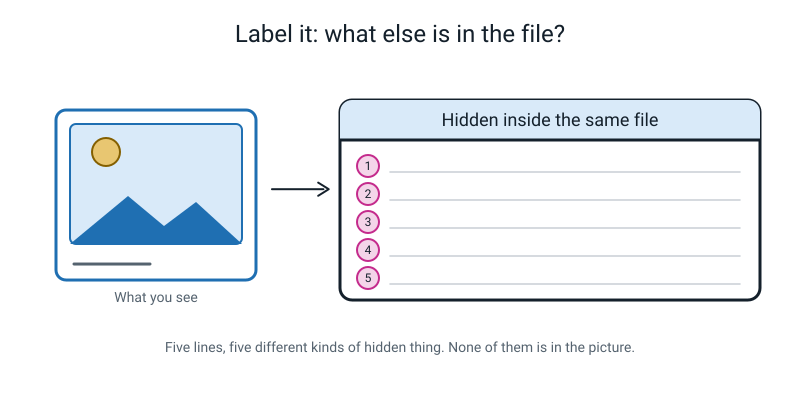
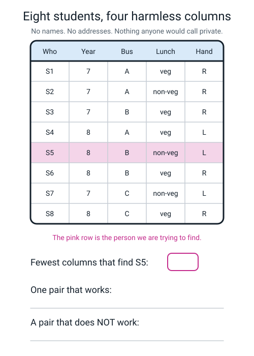
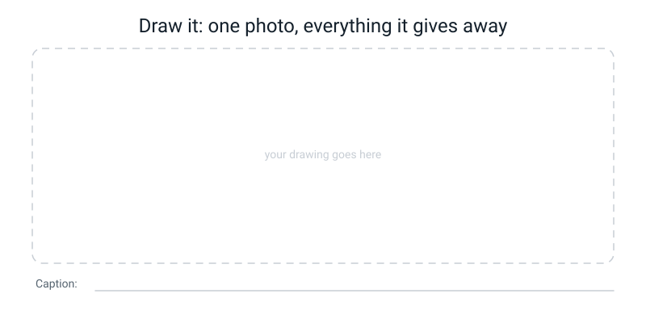

# Workbook — Week 32: Your Data, Fakes, and Trusting Too Much

**Name: ________________________________     Date: ______________________**

[📖 Read the chapter first](../student-guide/week-32.md) · [Course Home](../README.md)

> **What you need:** a pen, one real reference source that is **not** an AI (an atlas, an encyclopedia, a textbook, or a reference site you trust), and access to three of your own photo files.
> **How long:** about 50 minutes. **Rule of the week:** every verdict needs a named source. "I checked" scores zero.

---

## ✅ Warm-Up (5 min)

*Five quick ones from last week. No notes.*

**1.** Bias in a model is a ______________________, not an attitude.

**2.** Group A scores 74%. Group B scores 41%. The gap is ________ ______________________.

**3.** Name the four links of the bias chain, in order.

________________________ → ________________________ → ________________________ → ________________________

**4.** A voice assistant is "93% accurate". What is the one question you must always ask?

________________________________________________

**5.** Why do you write your prediction down *before* you test, instead of afterwards?

________________________________________________

---

## ✍️ Practice Set A — Understand It

This set checks that you know the words and ideas from the chapter.

### A1 — Fill in the blanks

> **personal data** — any information that is about an ______________________ person, **or that could be ______________________ with other information to identify them.**

> **metadata** — the ______________________ information a file carries about ______________________: when it was made, on what ______________________, and often exactly ______________________.

The word for working out who an "anonymous" record belongs to, by putting harmless facts together, is ______________________.

### A2 — Multiple choice

You are sent a shocking video. Which is the **best** first move?

- [ ] **(a)** Zoom in on the hands and the teeth to look for glitches.
- [ ] **(b)** Ask an AI chatbot whether the video is real.
- [ ] **(c)** Tap the account that posted it and check when it was created and what else it has posted.
- [ ] **(d)** Share it with a "is this real?" caption so other people can check.

Now say what is wrong with **each** of the three you did not tick.

- ________________________________________________
- ________________________________________________
- ________________________________________________

### A3 — True or false, and explain

**(i)** Once the names are removed from a file, nobody can work out who anyone is.

**TRUE / FALSE** — because ____________________________________________

**(ii)** A photo's location information is stored by the app, not inside the photo file.

**TRUE / FALSE** — because ____________________________________________

**(iii)** Automation bias is a fault in the machine.

**TRUE / FALSE** — because ____________________________________________

### A4 — Match the pairs

| Term | | | What it means |
|---|---|---|---|
| **1.** personal data | ☐ | **A** | Believing the machine over your own judgement |
| **2.** metadata | ☐ | **B** | A real person made to appear to say something they never said |
| **3.** deepfake | ☐ | **C** | Facts that identify a person, sometimes only in combination |
| **4.** over-trust | ☐ | **D** | Accepting an answer without checking, because it sounded sure |
| **5.** automation bias | ☐ | **E** | The hidden notes a file keeps about itself |

### A5 — Label the diagram

Write **one** hidden thing on each of the five lines. Five *different kinds* of thing — not five kinds of location.


*Figure W32.1 — None of these five is in the picture. All five travel with the file.*

### A6 — Vocabulary in your own words *(page W32.5)*

| Word | Your sentence |
|---|---|
| **personal data** | ________________________________________ |
| **metadata** | ________________________________________ |
| **deepfake** | ________________________________________ |
| **over-trust** | ________________________________________ |
| **automation bias** | ________________________________________ |

---

## ✍️ Practice Set B — Use It

This set makes you use the ideas on real products, real claims and a real video.

### B1 — Audit a real product's data map *(page W32.1)*

Pick **one AI product you actually use** — not one you have heard of. A short-video app, a music recommender, a game, a keyboard that predicts words, a chatbot.

**Product: ______________________________________**

> **Mark every guess with a `?`.** You cannot know most of this for certain, and *that is the finding*. An honest guess clearly labelled beats a confident invention every time.

| # | Question | Your answer |
|---|---|---|
| 1 | What does it collect **from you**? | |
| 2 | What does it collect **from other people, about you**? | |
| 3 | Could you opt out of some of it and still use it? Which parts **could you not** opt out of? | |
| 4 | Who is **affected but was never asked**? | |
| 5 | What happens when it is wrong — small harm, big harm, and **who finds out**? | |

### B2 — Fact-check three confident answers *(page W32.2)*

Three statements, all in the same confident voice. Check **all three** against a real source. **Check the one you think is true first.**

> **1.** "A hexagon has six sides, and its interior angles add up to 720 degrees."
>
> **2.** "Sachin Tendulkar scored 100 international centuries. His first came in 1990 and his hundredth in 2012."
>
> **3.** "Mount Kilimanjaro is the highest mountain in Africa, at 6,895 metres, and it stands in Kenya."

| # | TRUE or FALSE? | What the real source says | Source I used (be exact) |
|---|---|---|---|
| 1 | | | |
| 2 | | | |
| 3 | | | |

**(a)** What did the false one have in common with the true ones?

________________________________________________

**(b)** Why could you not just ask an AI whether it was sure?

________________________________________________

### B3 — Sort the data, then break the claim *(page W32.3)*

A school app collects: *full name · student ID · date of birth · home postcode · photo of face · daily arrival time · lunch choice · test scores · medical allergies · parent phone number · bus route · favourite colour.*

**(a)** Sort all twelve into the three columns.

| Clearly personal | Personal in combination | Not personal on its own |
|---|---|---|
| | | |
| | | |
| | | |
| | | |
| | | |
| | | |

**(b)** The school says: *"we removed the names, so the file is anonymous."* **Break that claim.** Name the columns you would use and show roughly how many people are left at each step.

________________________________________________

________________________________________________

**(c)** Pick the **three most sensitive** items and give one specific way each could be misused.

1. ________________________________________________
2. ________________________________________________
3. ________________________________________________

**(d) What would go wrong?** The school builds a model to predict *"who will be late tomorrow"* and feeds it every column. Name **two columns it must be forbidden from using**, and say why.

________________________________________________

________________________________________________

### B4 — The athlete video *(page W32.4)*

A video reaches you: a famous athlete announcing they are quitting. Posted **11 minutes ago**, by an account with **40 followers** created **last week**. It has **90,000 shares**.

**(a)** Write each check as an **action** — something you would actually do with your thumb, not a principle.

| # | Check | What I would actually do |
|---|---|---|
| 1 | Source | |
| 2 | When | |
| 3 | Who else has it | |
| 4 | What was around it | |

**(b)** Give **two signals of a fake here that need no pixels at all.** Show the arithmetic for one of them.

1. ________________________________________________
2. ________________________________________________

**(c)** You find no other source anywhere. Does that **prove** it is fake? What do you actually do?

________________________________________________

**(d)** Your friend has already forwarded it to thirty people. Write them a message.

________________________________________________

________________________________________________

### B5 — What would go wrong?

**(a)** A busy nurse asks an AI assistant for a medicine dose for a child. It answers immediately, in a confident voice, with a specific number. Name the two things going wrong at once here, and one habit that would catch it.

________________________________________________

________________________________________________

**(b)** A class makes a "joke" deepfake video of their teacher saying something silly. Everyone in the room knows it is a joke. What goes wrong, and what is the rule that costs you nothing?

________________________________________________

________________________________________________

---

## 🧩 Puzzle of the Week

This puzzle is for working with a small table of students, one column at a time.

### Eight students, four harmless columns


*Figure W32.2 — No names. No addresses. Nothing anyone would call private.*

| Who | Year | Bus | Lunch | Hand |
|---|---|---|---|---|
| S1 | 7 | A | veg | R |
| S2 | 7 | A | non-veg | R |
| S3 | 7 | B | veg | R |
| S4 | 8 | A | veg | L |
| **S5** | **8** | **B** | **non-veg** | **L** |
| S6 | 8 | B | veg | R |
| S7 | 7 | C | non-veg | L |
| S8 | 8 | C | veg | R |

**(a)** Does any **single** column identify S5 on its own? Show how many people are left for each one.

```text
   Year = 8        →  ____ people left
   Bus = B         →  ____ people left
   Lunch = non-veg →  ____ people left
   Hand = L        →  ____ people left
```

**(b)** What is the **smallest number of columns** that identifies S5? ________

**(c)** Name **every** pair of columns that works.

________________________________________________

**(d)** Name a pair that does **not** work, and say who else it leaves in.

________________________________________________

**(e)** In the town of 800, "Year 7" did the most work of any single fact. Here, "Year 8" is the **weakest** column. Why? What does that tell you about which facts identify people?

________________________________________________

---

## 🤔 Think Deeper

These two questions are for slower thinking. Write a full paragraph for each.

**1.** Make the canteen dataset **genuinely** anonymous. Say exactly what you would delete, bucket or blur — then say **which question it can no longer answer.** Is the trade worth it? Write a paragraph.

________________________________________________

________________________________________________

________________________________________________

________________________________________________

**2.** Fakes make false things believable **and** true things deniable. **Which of those two does more damage?** Name a specific person harmed in each case, then say what evidence would change your mind.

________________________________________________

________________________________________________

________________________________________________

________________________________________________

---

## 🛠️ Build It

This section is for looking at the hidden information in three of your own photos.

### The metadata investigation

**The checklist.** Tick each box as you finish it.

- [ ] Choose **three** photos: one taken outdoors, one indoors, one that arrived through a chat app
- [ ] Open each one's details — **Mac:** Preview → Tools → Show Inspector → **i** tab, then **GPS**. **Windows:** right-click → Properties → Details
- [ ] Fill in the table below. Write "none" where there is nothing — that is a result, not a blank
- [ ] For any photo with coordinates, paste them into a map and write what is there
- [ ] Work out **which photo carried the least**, and why

| | Photo 1 (outdoors) | Photo 2 (indoors) | Photo 3 (via chat app) |
|---|---|---|---|
| Date and time | | | |
| Device | | | |
| Camera settings | | | |
| Location? | | | |
| What the map shows | | | |
| Anything else | | | |

**Which photo carried the least, and why do you think that is?**

________________________________________________

**One thing you now know about yourself that you did not put in the picture on purpose:**

________________________________________________

### The card

Write the four provenance checks **in your own words** on a small card. Not on this page — on a real card, and put it somewhere you will see it.

- [ ] Card written
- [ ] Card is somewhere real, not in this book

```text
   1. ________________________________________
   2. ________________________________________
   3. ________________________________________
   4. ________________________________________
   and: ______________________________________
```

---

## 🎨 Draw It

This section is for drawing what a photo shows and what it carries without showing.

Draw **one photo you might really post**, and label everything in it — and attached to it — that you did not mean to share. Aim for at least ten labels. Put the invisible ones (the metadata) in a box off to the side with an arrow, because they are not *in* the picture.


*Figure W32.3 — Ten or more labels. The invisible ones go in a box to the side.*

> **What a good answer looks like:** a rough sketch of you in front of a house, with arrows to: your face · the house number on the gate · your school badge · a neighbour's number plate · a reflection in the window · the plants (country and season) · the shadow (time of day). Then a separate box joined by a dashed arrow, labelled **"inside the file, invisible"**, containing: GPS 19.0760 N 72.8777 E · 14 March, 16:42 · phone make and model.
>
> A weak answer labels only the face and the background, and puts the GPS *in* the picture — which is the one thing it definitely is not.

---

## 📊 Self-Check

Use this table to see how sure you feel about each skill. Tick one box per row.

| I can… | 😀 easily | 🙂 with a bit of help | 😕 not yet |
|---|:---:|:---:|:---:|
| Re-identify a person from a few "anonymous" facts, and say which fact did the work | ☐ | ☐ | ☐ |
| Name three things a photo file carries besides the image | ☐ | ☐ | ☐ |
| Find the metadata on a real file, by myself | ☐ | ☐ | ☐ |
| List the four provenance checks, and say why pixel-spotting fails | ☐ | ☐ | ☐ |
| Define automation bias and name one habit that defends against it | ☐ | ☐ | ☐ |
| Fact-check a claim against a named, independent source | ☐ | ☐ | ☐ |
| Say when it *is* fine to trust an AI answer | ☐ | ☐ | ☐ |

---

## ✅ Answers

This section is for checking your work after you have finished. Open it only when you are done.

<details>
<summary>Check your answers</summary>

### Warm-Up

**1.** A **count**. The model saw far fewer examples of one group; nobody had to be unkind.

**2.** 74 − 41 = **33 percentage points.** Not 33%, because "33% of what?" has no answer.

**3.** Who got photographed → the training data is lopsided → the model learns what it saw → somebody real gets bad answers. **The fix is at link 1.**

**4.** **"93% — for whom?"** A single accuracy number is an average, and every average hides somebody.

**5.** Because a guess made afterwards is worthless — you could pick whichever group made you look right, or quietly drop the batch that came out badly. Writing it first turns a demonstration into a test.

### A1

*identifiable* … *combined*. Metadata: *hidden* … *itself* … *device* … *where*. The word is **re-identification**.

### A2

**(c)** is correct.

- **(a)** fails because generators fix their visible flaws every few months and your eyes do not get an upgrade. "I can tell" is exactly how people get fooled.
- **(b)** fails because it will answer in the same confident voice using the same machinery. You need a source that does not come from the thing you are checking.
- **(d)** fails because sharing it *is* spreading it. Adding "is this real?" does not undo the reach — plenty of people will only read the video.

### A3

**(i) FALSE.** Names are the easy part. Year group + postcode area + bus route + days late took us from 600 students to one, with no name anywhere. Combinations identify people.

**(ii) FALSE.** It is stored **inside the file**. Which is exactly why it matters: send the file, send all of it. (Many chat apps strip it on the way through — which is good for you and is also why the demo photo has to be transferred by cable or as an email attachment.)

**(iii) FALSE.** Automation bias is a fact about **people** — our habit of believing a screen over our own judgement, especially when tired or rushed. The machine's error rate is a completely separate thing. Which is why a *usually-right* machine is more dangerous than a useless one: the useless one gets ignored.

### A4

**1 → C** · **2 → E** · **3 → B** · **4 → D** · **5 → A**

### A5 — the labelled file

Five different kinds: **(1)** the date and time, to the minute · **(2)** the device — make and model of the phone · **(3)** the camera settings — exposure, flash, which lens · **(4)** the location, latitude and longitude, often to about five metres · **(5)** the edit history — often just that it was edited, and with which app.

Also acceptable in place of one of those: the owner's name (if the phone fills it in), or the file's original filename.

### A6 — Vocabulary

| Word | A correct answer looks like |
|---|---|
| **personal data** | Information about a person you can identify — including facts that only identify them when several are put together. |
| **metadata** | The hidden notes a file keeps about itself: when it was made, on what device, and often exactly where. |
| **deepfake** | A photo, video or voice of a real person doing or saying something they never did, made by an AI. |
| **over-trust** | Accepting an AI's answer without checking, because it sounded sure. |
| **automation bias** | The human habit of believing the machine over your own judgement — like following the satnav into a river. |

### B1 — The data map

Marked on **structure and honesty**, not on being right. A full-marks answer for a short-video app:

| Question | A full-marks answer |
|---|---|
| **1. From you** | Every video I watch and for how long, what I skip, what I re-watch, what I search, what I like and comment, my rough location `?`, my device and screen size, and the times of day I am on it. |
| **2. From others, about you** | Who I message, and therefore who my friends are; anything my friends' contact lists say about me `?`; other people's videos that I happen to appear in. |
| **3. Opt out?** | Some of it — I can turn off precise location. **Not the core of it:** watch history *is* the product, so opting out of that means the app cannot work. `?` |
| **4. Affected but never asked** | Everyone who appears in the background of a video. Every creator whose video was used to work out what people like me watch. My friends, whose contact details reached the app through me. |
| **5. When it is wrong** | Small harm: I get shown something boring. Big harm: it learns I linger on something upsetting and shows me more of it. **Who finds out? Usually nobody** — from the outside that just looks like engagement. |

**Full marks for `?` marks.** "I think it collects location but I'm not sure" is better work than stating it flatly. And question 4 is the one that teaches most: **most AI systems affect far more people than use them, and those people were never asked at all.**

### B2 — Fact-check

| # | Verdict | The check |
|---|---|---|
| **1** | **TRUE** | No source needed — check it with arithmetic. A polygon's interior angles total (n − 2) × 180. For n = 6: 4 × 180 = **720**. ✓ |
| **2** | **TRUE** | An encyclopedia or cricket reference confirms 100 international centuries, the first in 1990 and the hundredth in March 2012. |
| **3** | **FALSE — twice over** | Kilimanjaro *is* the highest mountain in Africa, but it is **5,895 m**, not 6,895, and it is in **Tanzania**, not Kenya. An atlas settles both in about twenty seconds. |

**A named source is required for each.** "I checked" scores zero; "I checked in the atlas on page 44" scores full.

**(a)** Everything except the truth. Statement 3 is the same length and the same confident tone as the other two; it contains a **genuinely correct claim** (Kilimanjaro *is* Africa's highest), a specific-looking number, and a country right next door to the correct one. **Specific facts are exactly where invention happens most freely**, because a specific fact is rare in the training text and its *shape* is trivially easy to fake.

**(b)** Because it may well confirm itself in the same confident voice, using the same machinery that produced the error. You need a source that does not come from the thing you are checking — and ideally two that do not copy each other.

### B3 — Sort the data, break the claim

**(a)**

| Clearly personal | Personal in combination | Not personal on its own |
|---|---|---|
| Full name | Home postcode | Favourite colour |
| Student ID | Daily arrival time | Lunch choice |
| Date of birth | Bus route | |
| Photo of face | Test scores | |
| Medical allergies | | |
| Parent phone number | | |

Two placements worth arguing about out loud. **Test scores** sit in the middle because a score alone identifies nobody, but "the student who got 98% in Year 7 maths" usually identifies exactly one. **Lunch choice** looks harmless and mostly is — until you notice that a consistent halal, kosher or vegetarian choice can reveal a family's religion. **Almost nothing stays in column three once you combine it with something else.**

**(b)** Take **postcode + date of birth**. In a school of 600, perhaps 40 students live in one small postcode area; of those, the number born on one exact date is nearly always zero or one. Add bus route to confirm. **No name required** — and both of those look like harmless background columns to whoever published the file.

**(c)** One specific misuse each:

1. **Medical allergies.** Leaked school data reaching an insurer or a future employer turns a childhood allergy into a reason to charge more or hire somebody else — and the person is never told that was the reason.
2. **Face photo + daily arrival time.** Together they tell somebody what a child looks like and exactly when and where they will be. Either alone is general information; together they are an opportunity.
3. **Parent phone number + student name.** A scammer calls saying "there has been an incident with [correct name] and we need a payment now". The correct name is what makes it work; the number is what delivers it.

**(d)** Any two of these, with the reason:

| Forbidden | Why |
|---|---|
| **Medical allergies** | Nothing to do with lateness. Health data repurposed into a discipline-adjacent prediction starts shaping how a child is treated for reasons nobody can see. |
| **Home postcode** | A strong stand-in for family income. The model learns "children from poorer areas are late" and flags them in advance — punishing a child for where they live, dressed up as a prediction. |
| **Photo of face** | Not needed for the task at all. **If a column is not needed, collecting it is the harm.** |
| **Test scores** | Links lateness to academic performance and quietly builds a "problem student" profile that follows a child around. |

The principle worth memorising: **use the smallest number of columns that does the job.** Bus route and past arrival times are enough.

### B4 — The athlete video

**(a)** As actions:

1. **Source.** Tap the posting account: join date, post count, whether it has ever posted about this sport. Then check the athlete's own verified account and the club's. A retirement is announced there, or it is not happening.
2. **When.** 11 minutes old, 90,000 shares, 40 followers. That is **90,000 ÷ 40 = 2,250 shares per follower.** Not organic.
3. **Who else has it.** Search the athlete's name in a news app sorted by newest; check two outlets **not owned by the same company**.
4. **What was around it.** Screenshot one clear frame and reverse-image-search it. Look for the same footage with different audio, or from an older press conference about something else entirely.

**(b)** Two signals, no pixels:

1. **A week-old account with 40 followers.** Real news about a famous person breaks from the person, their club, or a journalist with a reputation to lose — not from an account with no history.
2. **90,000 shares in 11 minutes from 40 followers** — 2,250 per follower. The spread is wildly out of proportion to the source, which means either coordinated pushing or content engineered to be maximally shareable. Both are reasons to slow down.

*(A third, if you want it: nobody else is reporting it.)*

**(c)** **No — strong evidence, not proof**, and this is the hardest idea in the week. Silence everywhere else after eleven minutes is hard to explain if the video is real, because real news propagates fast and from several directions at once. But **absence of evidence is not evidence of absence**; it is possible, rarely, to be genuinely first.

So the correct action is not "declare it fake". It is **do not share it, and wait.** Waiting an hour costs nothing. Sharing a fake costs your credibility and helps it reach the next 90,000 people.

**(d)** Something like this:

> Hey — I looked into that clip and I can't find it anywhere except one account that was made last week, and none of the sports sites have it, which is strange for news this big. I'm not saying it's definitely fake, but I'd wait an hour before believing it. Might be worth putting a "not confirmed yet" on the group chat, since a lot of people have it now.

Why it is worded that way: no accusation, no *"I can't believe you fell for that"*, an actual reason instead of an assertion, an admission of uncertainty, and an easy face-saving next step. **People who feel corrected dig in. People who feel included in the investigation help you.**

### B5 — What would go wrong

**(a)** Two things at once. **Over-trust:** the answer is accepted because it sounded sure, and a specific number is exactly the kind of thing that gets invented most freely. **Automation bias:** she is busy and tired, which is precisely when a screen beats a person's own judgement. And the stakes are high and hard to undo — situation 1 on the card.

The habit: **when it is a specific fact that matters, look it up somewhere that is not the thing that told you.** In a hospital that means the official dosing reference, every time, no exceptions for being in a hurry.

**(b)** The joke is fine right up until the clip leaves the room — and clips always leave the room. After two forwards, nobody attached to it knows it was a joke; they just have a recording of a real person saying something. It is also the teacher's face and voice, being used without asking.

**The rule that costs you nothing: do not make a fake of a real person without asking them**, even when you are certain nobody would find out.

### Puzzle — Eight students

**(a)** No single column works.

```text
   Year = 8        →  4 people left  (S4, S5, S6, S8)
   Bus = B         →  3 people left  (S3, S5, S6)
   Lunch = non-veg →  3 people left  (S2, S5, S7)
   Hand = L        →  3 people left  (S4, S5, S7)
```

**(b) Two columns.**

**(c)** Three pairs work:

- **Year + Lunch** — Year 8 gives S4, S5, S6, S8; of those only S5 is non-veg.
- **Bus + Lunch** — Bus B gives S3, S5, S6; of those only S5 is non-veg.
- **Bus + Hand** — Bus B gives S3, S5, S6; of those only S5 is left-handed.

**(d)** Any of these, with the leftovers named:

- **Year + Bus** leaves S5 **and S6**.
- **Year + Hand** leaves S5 **and S4**.
- **Lunch + Hand** leaves S5 **and S7**.

**(e)** Because **Year only has two possible values here** (7 or 8), so knowing it can at best halve the table. Bus has three values, and Lunch and Hand split the table unevenly, so each of those cuts harder.

In the town of 800 there were *five* year groups plus adults, so "Year 7" removed 680 people. Same column, completely different power.

> **The rule: how much a fact narrows things down depends on how many different values it can take, and how unevenly they are spread.** Which is exactly why you cannot judge whether a column is "safe to publish" just by looking at how private it *feels*.

### Think Deeper 1 — Genuinely anonymous

There is no single right answer; a full-marks paragraph names a specific change **and** the specific question that is now unanswerable.

A strong answer: *"I would replace exact dates of birth with just the year, replace the postcode with 'north of the river / south of the river', delete handedness and lunch choice entirely, and round the lateness column to 'none / some / a lot'. Now the file cannot identify anybody. It also cannot answer the question it was collected for — 'how many vegetarian lunches do we need on Tuesdays in Year 7?' — because I deleted the lunch column. So the school has to choose: know the answer, or protect the students. I would keep the lunch column but publish only totals per year group, never row by row, because a total answers the question and a row identifies a person."*

That last sentence is the professional move: **publish the answer, not the data.**

### Think Deeper 2 — Which harm is worse

Both answers can earn full marks. What is being marked is whether you name a **specific person** in each case and offer something that could change your mind.

- **"False things believable" is worse:** name somebody who loses their job, or is threatened, over a video of something they never did. It reaches people who have no way to check.
- **"True things deniable" is worse:** name somebody caught on genuine video doing real harm, who simply says "deepfake" and walks away — and now every real recording of anything is arguable. This harm **grows over time** and reaches people who never see a fake at all.

**What would change your mind** is the important part. A good answer: *"if it turned out that most people, when shown proof a video was genuine, still believed the 'deepfake' claim, I'd switch to the second answer — because that means evidence has stopped working, and everything else depends on evidence working."*

### Build It — the metadata investigation

There is no fixed answer, but a correct investigation looks like this:

- **Photo 1 (outdoors, from your own camera roll):** date and time to the minute, phone make and model, camera settings, **and usually latitude and longitude**. The map will show a street, a park, or your own house.
- **Photo 2 (indoors):** the same, but the location may be less exact or missing — phones often struggle for a fix indoors.
- **Photo 3 (via a chat app):** usually **almost nothing.** Often the location is gone, sometimes the device too, and the filename has been replaced.

**Which carried the least, and why:** the one that came through the chat app. Most messaging apps strip metadata as the photo passes through. **Say the honest double-edged thing about that:** it is genuinely good for your privacy, and it is also why the photo for this lesson had to be moved by cable or as an email attachment.

**"One thing you now know that you did not put in the picture on purpose"** — full marks for anything specific: *"it says I was in the park at 16:42 on 14 March"*, *"it names my phone model"*, *"it shows I edited it"*.

**The card.** Full marks for four checks in your own words, plus the fifth question:

1. Who posted it **first**? (Not who sent it to me.)
2. **When**, and how fast did it spread?
3. **Who else** has it — two sources that do not copy each other?
4. **What was around it** — does this footage exist elsewhere, with different audio?
5. **Who benefits if I believe this and pass it on** — and does it happen to be something I wanted to be true?

### Draw It

Marked on three things:

- [ ] At least seven labels **inside** the picture, all of them specific things (a house number, a badge, a number plate, a reflection, a shadow) rather than "background"
- [ ] The metadata in a **separate** box with a dashed arrow, clearly marked as invisible and attached to the file
- [ ] At least one label naming **somebody else** who did not agree to be in it — a neighbour's car, a passer-by, a window

If everything is inside the picture, you have drawn the hook and missed the twist: the most revealing part of that photo is the part you cannot see.

</details>

---

[⬅ Week 31 workbook](week-31.md) · [📖 Week 32 chapter](../student-guide/week-32.md) · [Course Home](../README.md) · [Week 33 workbook ➡](week-33.md) · [Glossary](../../glossary.md)
