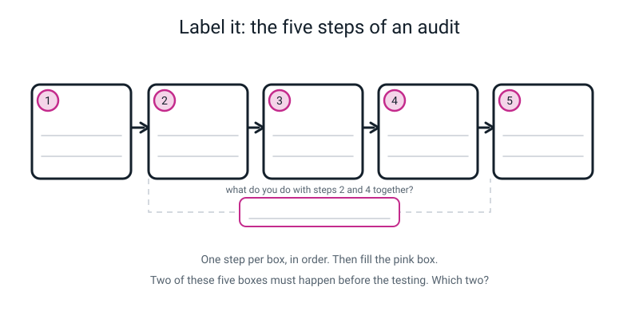
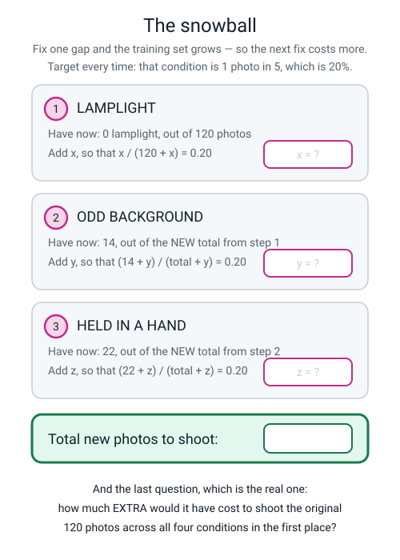
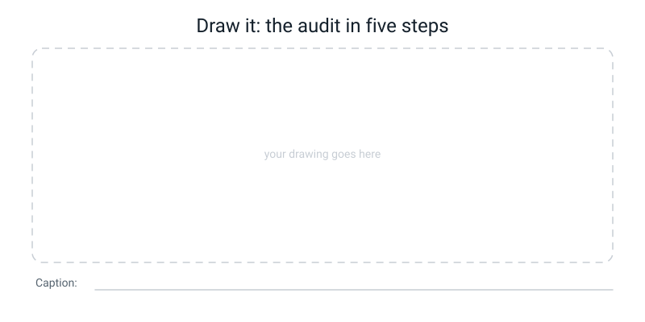

# Workbook — Week 33: Audit Your Own Model

**Name: ________________________________     Date: ______________________**

[📖 Read the chapter first](../student-guide/week-33.md) · [Course Home](../README.md)

> **What you need:** your Week 17 model file `baseline-v1.tm`, your four folders of twelve photos, the **sealed Week 31 envelope**, a **pen** (not a pencil), a calculator, a ruler, one large sheet of paper for the poster, and coloured pens.
> **How long:** 45–60 minutes for the poster. **Rule of the week:** one attempt per photo, in pen, and the number you report must be true.

---

## ✅ Warm-Up (5 min)

*Five quick ones from last week. No notes.*

**1.** "Year 7 + postcode area 3 + left-handed" contains no name. Is it personal data? ____________ because ____________________________________________

**2.** Name three things a photo file carries besides the picture.

________________________ · ________________________ · ________________________

**3.** The four provenance checks are:

1. ________________________ 2. ________________________ 3. ________________________ 4. ________________________

**4.** Define automation bias in one sentence, and say where the flaw lives.

________________________________________________

**5.** You find no other source anywhere for a shocking video. Does that prove it is fake? What do you do?

________________________________________________

---

## ✍️ Practice Set A — Understand It

### A1 — Fill in the blanks

> **attribution** — saying where something ______________________ and who ______________________.

> **misinformation** — false information spreading, ______________________ or not anyone meant to deceive.

> **disinformation** — false information spread ______________________.

You can create misinformation out of nothing but ______________________ sentences, by choosing which one to say ______________________.

### A2 — Multiple choice

Your audit came out: daylight 91.7%, held-in-a-hand 66.7%, odd background 58.3%, lamplight 33.3%, overall 62.5%. Which is the honest headline for your poster?

- [ ] **(a)** "My model is 91.7% accurate."
- [ ] **(b)** "My model is 62.5% accurate."
- [ ] **(c)** "91.7% in daylight, 33.3% in lamplight — a gap of 58.4 percentage points, on 48 unseen photos."
- [ ] **(d)** "My model is quite accurate but not perfect."

Now say what is wrong with each of the three you did not tick.

- ________________________________________________
- ________________________________________________
- ________________________________________________

### A3 — True or false, and explain

**(i)** Batch A scored 8 out of 8, so the model is perfect in that condition.

**TRUE / FALSE** — because ____________________________________________

**(ii)** If you retrain with 30 new photos, you can test the new model on a fresh set of photos and compare.

**TRUE / FALSE** — because ____________________________________________

**(iii)** Once you open the envelope, you may correct your prediction if it was nearly right.

**TRUE / FALSE** — because ____________________________________________

### A4 — Match the pairs

| Term | | | What it means |
|---|---|---|---|
| **1.** attribution | ☐ | **A** | False information spread deliberately |
| **2.** misinformation | ☐ | **B** | Best group's accuracy minus worst group's, in points |
| **3.** disinformation | ☐ | **C** | Saying where something came from and who made it |
| **4.** accuracy gap | ☐ | **D** | Testing group by group, with the groups chosen first |
| **5.** fairness audit | ☐ | **E** | False information spreading, whether or not anyone meant it |

### A5 — Label the diagram

One audit step per box, in order. Then fill in the pink box: **what do you do with steps 2 and 4 together?** And answer the question underneath: **which two boxes must happen before any testing?**


*Figure W33.1 — Five steps. The order is not negotiable.*

### A6 — Vocabulary in your own words *(page W33.8)*

| Word | Your sentence | An example from **your own** work |
|---|---|---|
| **attribution** | ______________________ | ______________________ |
| **misinformation** | ______________________ | ______________________ |
| **disinformation** | ______________________ | ______________________ |

**And one line:** why can true sentences still mislead somebody?

________________________________________________

---

## ✍️ Practice Set B — Use It

### B1 — Somebody else's audit, all the way through

Aisha trained a three-class model — **hair clip · pencil · rubber** — and audited it on **48 photos** it had never seen.

| Batch | Condition | Correct | Total |
|---|---|---:|---:|
| A | Bright daylight, plain desk | 11 | 12 |
| B | Lamplight, after dark | 6 | 12 |
| C | Held in a hand | 8 | 12 |
| D | Odd, patterned background | 3 | 12 |

**(a)** The four divisions, in full.

```
   A:  11 ÷ 12 = ____________  →  ______%      B:  ___ ÷ 12 = ____________  →  ______%
   C:  ___ ÷ 12 = ____________  →  ______%      D:  ___ ÷ 12 = ____________  →  ______%
```

**(b)** The overall accuracy. **Add the corrects and divide once.**

```
   ____ + ____ + ____ + ____ = ______      12 × 4 = ______
   ______ ÷ ______ = ____________  →  ______%
```

**(c)** The gap.

```
   best  = ______________ at ______%       worst = ______________ at ______%
   ACCURACY GAP = ______ − ______ = ______ ______________________
```

**(d)** Aisha's sealed prediction said **"lamplight will be worst."** Was she right? Write the verdict the way it must go on a poster.

________________________________________________

### B2 — Trace it, then price it

Aisha counted her training data: **140 photos.**

| Condition | Training photos | Share of 140 | Test accuracy |
|---|---:|---:|---:|
| Bright daylight | 96 | ______% | ______% |
| Lamplight | 12 | ______% | ______% |
| Held in a hand | 32 | ______% | ______% |
| Odd background | **0** | ______% | ______% |

**(a)** Write the trace sentence for her worst group, in the four-part shape.

________________________________________________

**(b)** Price the fix. Target: odd-background photos are **1 in 5** of the training set, which is 20%.

```
   Let x = odd-background photos to add.

        x / (140 + x) = 0.20
                    x = ______ + ______x
                ______x = ______
                    x = ______ ÷ ______ = ______ photos

   Check: ______ out of ______ = ______ = ______%   ✓
```

**(c)** Spread across her three classes, that is ______ hair clip, ______ pencil, ______ rubber.

**(d)** How would she know the fix actually worked? Be exact.

________________________________________________

### B3 — What would go wrong?

Aisha adds her 35 photos, retrains, and tests the new model on **48 brand-new photos** she shot that evening. The new overall figure is 71%, so she writes "the fix worked" on her poster.

**(a)** What is wrong with this, and what should she have done instead?

________________________________________________

**(b)** Name one thing that might have got **worse** that she would now never find out about.

________________________________________________

### B4 — What would go wrong?

A student puts **one** number on their poster, in the biggest letters on the page: **"91.7% accurate."** It is completely true — it is the daylight figure.

**(a)** Somebody reads only that, goes home, and uses the app in a dim room. Whose fault is the misunderstanding, and why?

________________________________________________

**(b)** Which word from this week describes what the poster has created? What would make it the *other* word?

________________________________________________

### B5 — Fix the warning sign *(practice for page W33.7)*

Each of these lines is useless. Rewrite it so it names a **specific use** and carries a **measured number**. Use these results: daylight 11/12, lamplight 4/12, in a hand 8/12, odd background 7/12, overall 30/48.

| ❌ What they wrote | ✅ Your rewrite |
|---|---|
| "Don't use it in bad light" | |
| "It's not perfect" | |
| "Don't use it for important things" | |

---

## 🧩 Puzzle of the Week

### The snowball


*Figure W33.2 — Fix one gap and the training set grows, so the next fix costs more.*

Rohan has **120 training photos**: 84 daylight, 22 held in a hand, 14 odd background, **0 lamplight**. He wants **every** weak condition to reach **20%** of the training set, fixed one at a time — and each time, the total has grown.

**(a)** Fix 1 — lamplight, 0 photos now, out of 120.

```
   x / (120 + x) = 0.20   →   0.80x = ______   →   x = ______ photos
   NEW TOTAL = 120 + ______ = ______
```

**(b)** Fix 2 — odd background, 14 photos now, out of your new total.

```
   (14 + y) / (______ + y) = 0.20   →   14 + y = ______ + 0.20y
   0.80y = ______   →   y = ______ photos
   NEW TOTAL = ______ + ______ = ______
```

**(c)** Fix 3 — held in a hand, 22 photos now, out of your new total.

```
   (22 + z) / (______ + z) = 0.20   →   22 + z = ______ + 0.20z
   0.80z = ______   →   z = ______ photos
   NEW TOTAL = ______ + ______ = ______
```

**(d)** Total new photographs to shoot: ______ + ______ + ______ = ____________

**(e)** How much **extra** would it have cost to shoot the original 120 across all four conditions in the first place?

________________________________________________

**(f) The sting in the tail.** After all three fixes, work out what share lamplight actually is. Is it still 20%? What does that tell you about fixing things one at a time?

```
   lamplight = ______ out of ______ = ____________ = ______%
```

________________________________________________

---

## 🤔 Think Deeper

**1.** Your model is 91.7% in daylight and 33.3% in lamplight. **Is it fairer to publish it with a warning, or not to publish it at all?** There is no clean answer. Argue both, then commit — and say who is helped and who is risked by your choice.

________________________________________________

________________________________________________

________________________________________________

________________________________________________

**2.** **How many photos would be enough to be sure?** Say honestly what you can and cannot claim from twelve photos per group, and write the one sentence that belongs on any poster made from a small sample.

________________________________________________

________________________________________________

________________________________________________

________________________________________________

---

## 🛠️ Build It

### Page W33.1 — Count your own training data

**Do this before you test anything.** Every photo goes into exactly one bucket. Tally marks. Work in blocks of ten.

| Condition | Tally | Count | Share (count ÷ total × 100) |
|---|---|---:|---:|
| Bright daylight, plain surface | | | ______% |
| Lamplight / after dark | | | ______% |
| Held in a hand | | | ______% |
| Odd, patterned background | | | ______% |
| **TOTAL** | | | 100% |

- [ ] The four counts add up to my training-set size
- [ ] The four shares add up to 100% (±0.1 for rounding)
- [ ] **Smallest bucket circled** — I found this before any testing

**My smallest bucket is ______________________ with ______ photos.**

**If a photo could go in two buckets,** say which choice you made and why:

________________________________________________

### Page W33.2 — The 48-row scoring sheet

**Three rules, said out loud before you start:** one attempt per photo · write the row **before** the next photo goes in · write the confidence **even when it is right**.

```
  #  bat  TRUE label      model said      conf%  ✓/✗       #  bat  TRUE label      model said      conf%  ✓/✗
 --- ---  --------------  --------------  -----  ---      --- ---  --------------  --------------  -----  ---
  1   A   ______________  ______________  _____  ___       25   C   ______________  ______________  _____  ___
  2   A   ______________  ______________  _____  ___       26   C   ______________  ______________  _____  ___
  3   A   ______________  ______________  _____  ___       27   C   ______________  ______________  _____  ___
  4   A   ______________  ______________  _____  ___       28   C   ______________  ______________  _____  ___
  5   A   ______________  ______________  _____  ___       29   C   ______________  ______________  _____  ___
  6   A   ______________  ______________  _____  ___       30   C   ______________  ______________  _____  ___
  7   A   ______________  ______________  _____  ___       31   C   ______________  ______________  _____  ___
  8   A   ______________  ______________  _____  ___       32   C   ______________  ______________  _____  ___
  9   A   ______________  ______________  _____  ___       33   C   ______________  ______________  _____  ___
 10   A   ______________  ______________  _____  ___       34   C   ______________  ______________  _____  ___
 11   A   ______________  ______________  _____  ___       35   C   ______________  ______________  _____  ___
 12   A   ______________  ______________  _____  ___       36   C   ______________  ______________  _____  ___
 13   B   ______________  ______________  _____  ___       37   D   ______________  ______________  _____  ___
 14   B   ______________  ______________  _____  ___       38   D   ______________  ______________  _____  ___
 15   B   ______________  ______________  _____  ___       39   D   ______________  ______________  _____  ___
 16   B   ______________  ______________  _____  ___       40   D   ______________  ______________  _____  ___
 17   B   ______________  ______________  _____  ___       41   D   ______________  ______________  _____  ___
 18   B   ______________  ______________  _____  ___       42   D   ______________  ______________  _____  ___
 19   B   ______________  ______________  _____  ___       43   D   ______________  ______________  _____  ___
 20   B   ______________  ______________  _____  ___       44   D   ______________  ______________  _____  ___
 21   B   ______________  ______________  _____  ___       45   D   ______________  ______________  _____  ___
 22   B   ______________  ______________  _____  ___       46   D   ______________  ______________  _____  ___
 23   B   ______________  ______________  _____  ___       47   D   ______________  ______________  _____  ___
 24   B   ______________  ______________  _____  ___       48   D   ______________  ______________  _____  ___
```

- [ ] 48 rows filled, in pen, no gaps
- [ ] A confidence number on **every** row, right answers included
- [ ] Any row I had to re-test is **annotated**, not tidied away
- [ ] Interesting wrong answers **starred** for the poster

### Page W33.3 — Accuracy, overall, and the gap

| Batch | Condition | Correct | Total | Fraction | Decimal | Percentage |
|---|---|---:|---:|---|---|---:|
| A | Bright daylight | | 12 | | | ______% |
| B | Lamplight | | 12 | | | ______% |
| C | Held in a hand | | 12 | | | ______% |
| D | Odd background | | 12 | | | ______% |

```
   overall  =  (____ + ____ + ____ + ____) ÷ 48  =  __________  =  ______%

   best group  = ______________________  at  ______%
   worst group = ______________________  at  ______%

   ACCURACY GAP  =  ______  −  ______  =  ______ ______________________
                                                (unit, in words)
```

### Page W33.4 — Prediction vs result

**Open the envelope now. Not before.** Tear it yourself.

```
   I PREDICTED the worst group would be: _________________________________

   Because: ______________________________________________________________

   THE WORST GROUP ACTUALLY WAS: _______________________ at ______%

   My prediction was:      RIGHT   /   WRONG        (circle one, in pen)

   What I got wrong about my own data: ___________________________________

   ______________________________________________________________________
```

- [ ] Circled in pen
- [ ] **Not** rewritten, not softened, no "nearly"

### Page W33.5 — The trace, and the fix priced

**(a)** Draw an arrow on page W33.3, from your worst percentage back to the count on W33.1 that explains it. Then write the sentence:

> *"______________ scored ______% **probably because** only ______ of my ______ training photos were ______________."*

**(b)** Price the fix. Target: your worst condition is **1 in 5** of the training set, which is 20%.

```
   Worst condition: ______________     Photos of it now: ______ of ______

   Let x = photos to add.

        x / (______ + x) = 0.20
                      x = ______ + 0.20x
                  0.80x = ______
                      x = ______ photos      (round UP if it is not whole)

   Check: ______ out of ______ = __________ = ______%   ✓

   Spread across my three classes: ______ / ______ / ______
```

**(c)** How I would know the fix worked:

```
   Re-run the IDENTICAL four batches — the same 48 photos — and publish both
   columns, before and after. I want my worst group above ______% and the gap
   below ______ percentage points, AND my best group no worse than ______%.
```

### Page W33.6 — The Fairness Audit Poster

**Six blocks and a red strip. Marked on completeness, not beauty.**

**Block 1 — the data map of a real AI product you use.** Mark every guess `?`.

| Stage | Your answer |
|---|---|
| What data goes in | |
| What it predicts (input → output) | |
| Who is helped **most** | |
| Who is helped **least** | |
| Who is affected **but was never asked** | |
| What goes wrong — small harm, big harm, **who finds out** | |

**Block 2 — attribution and permission.** One paragraph. It must say: who took the photos, when, of what, whose hands or faces appear, whether they agreed, and one thing you will **not** publish.

________________________________________________

________________________________________________

________________________________________________

**Blocks 3–6 — copy across, neatly.**

- [ ] **Block 3:** the training counts from W33.1, with the smallest circled
- [ ] **Block 4:** the results grid from W33.3, with the worst bar circled and **at least one full division visible**
- [ ] **Block 5:** the prediction from W33.4, reported RIGHT or WRONG in the **same size letters** as everything else
- [ ] **Block 6:** the fix from W33.5, with the algebra and the named retest
- [ ] **The red strip:** W33.7, below, and it is the boldest thing on the page

### Page W33.7 — The warning sign, final version

Write it **for a real person** — imagine your cousin is about to use this to name things in her kitchen tonight. Plain words. Three limits. A number on each.

```
   ┌──────────────────────────────────────────────────────────────┐
   │  DO NOT USE THIS MODEL FOR…                                  │
   │                                                              │
   │  1. …____________________________________________________    │
   │     It was right ______ times out of ______. That is ______%. │
   │                                                              │
   │  2. …____________________________________________________    │
   │     It was right ______ times out of ______. That is ______%. │
   │                                                              │
   │  3. …____________________________________________________    │
   │     It was right ______ times out of ______. That is ______%. │
   │                                                              │
   │  Measured on ______ photos the model had never seen.          │
   │  Tested ______________ by ______________.                     │
   └──────────────────────────────────────────────────────────────┘
```

- [ ] Three lines, three specific uses, three measured numbers
- [ ] The footer says how many unseen photos, the date, and who tested it
- [ ] Somebody who has never heard the word "model" could understand every line

---

## 🎨 Draw It

Draw **your own results grid as bars**, by hand, with a ruler. Four bars, one per condition, labelled with the percentage on top and the **training count** underneath. Circle the worst bar. Then draw a **dashed** bar showing where you hope your worst group gets to after the fix — and label it "hoped for, not measured".


*Figure W33.3 — Four solid bars, one dashed. The dashed one is a hope, not a result.*

> **What a good answer looks like:** a baseline drawn with a ruler; four bars in height order left to right or in batch order, each with its percentage above it and its training count below (84, 22, 14, 0); the shortest bar circled with the words "worst group" beside it; a double-headed arrow between the tallest and shortest tops labelled **"58.4 percentage points"**; and a fifth, dashed bar next to the worst one labelled *"hoped for: 66.7% after 30 more lamplight photos — NOT MEASURED YET."*
>
> A weak answer draws four bars with no counts underneath — which means a reader can see the gap but cannot see *why* it is there.

---

## 📊 Self-Check

| I can… | 😀 easily | 🙂 with a bit of help | 😕 not yet |
|---|:---:|:---:|:---:|
| Count my own training data into four buckets, before testing | ☐ | ☐ | ☐ |
| Score photos honestly — one attempt, in pen, confidence every row | ☐ | ☐ | ☐ |
| Compute per-condition accuracy with the division shown | ☐ | ☐ | ☐ |
| Report the gap in **percentage points** | ☐ | ☐ | ☐ |
| Report my prediction honestly, right **or** wrong | ☐ | ☐ | ☐ |
| Trace my worst group back to a count in my own data | ☐ | ☐ | ☐ |
| Price the fix in photographs, with the algebra | ☐ | ☐ | ☐ |
| Name the retest that would prove the fix worked | ☐ | ☐ | ☐ |
| Write a warning sign where all three lines carry a number | ☐ | ☐ | ☐ |

---

## ✅ Answers

<details>
<summary>Check your answers</summary>

### Warm-Up

**1.** **Yes.** Personal data includes facts that identify somebody **in combination**, even with no name attached. Those three together usually leave exactly one person.

**2.** Any three of: the date and time · the device make and model · the camera settings · the exact location (latitude and longitude) · whether it was edited.

**3.** Who posted it **first** · **when**, and how fast it spread · **who else** has it · **what was around it** (reverse-search a frame). And the fifth: who benefits if I pass it on?

**4.** *"Automation bias is the habit of trusting a machine's answer more than your own judgement, especially when you are tired or rushed."* **The flaw is in the person, not the machine** — which is why a usually-right machine is more dangerous than a useless one.

**5.** **No — strong evidence, not proof.** Absence of evidence is not evidence of absence. So you **do not share it, and you wait.**

### A1

*came from* … *made it*. Misinformation: *whether*. Disinformation: *deliberately* / *on purpose*. And: out of nothing but **true** sentences, by choosing which one to say **loudest**.

### A2

**(c)** is correct — it names two conditions, gives the gap with its unit, and says how many unseen photos it came from.

- **(a)** is true and misleading: it is the best of four numbers, quoted as if it were all of them. **That is misinformation made out of a true sentence.**
- **(b)** is also true, and it is the **weaker** number, because you can move it just by choosing how many photos of each condition to test. It is a fact about your test, not your model.
- **(d)** has no numbers in it at all, so it tells a reader nothing. "Not perfect" is true of everything ever built.

### A3

**(i) FALSE.** 8 out of 8 means **you did not find the mistake yet**, with eight photos. Eight is a small number. Write it as *"8 out of 8 — but that is only 8 photos."* Never let a 100% stand naked next to a count that small.

**(ii) FALSE**, and this is the one people get wrong. You must re-run the **identical** test set — the same 48 photos — and publish both columns side by side. Swap the test and you have swapped a measured number for a hopeful one, and you can no longer tell whether the model improved or the new photos were easier.

**(iii) FALSE.** **"Nearly right" is not a category.** If you could change it after reading the results, it was never a prediction — it was a summary of the results with a hat on. Circle one, in pen, and write the honest sentence about what you got wrong.

### A4

**1 → C** · **2 → E** · **3 → A** · **4 → B** · **5 → D**

### A5 — the labelled steps

**1 COUNT** the training photos, by condition · **2 PREDICT** the worst group, and seal it · **3 TEST** twelve photos in each of four conditions · **4 TRACE** the worst group back to a count · **5 PRICE** the fix in actual photos, with the algebra.

**Pink box:** you **compare** them — the sealed prediction against the measured result — **and report it either way, right or wrong.**

**Which two must happen before any testing?** **Steps 1 and 2** — the count and the sealed prediction. If either happens after the results are in, you have not measured anything, you have selected a story.

### A6 — Vocabulary

| Word | A correct answer | Example from your own work |
|---|---|---|
| **attribution** | Saying where something came from and who made it | "4 photos with my brother's hand, with his permission, 2 September" |
| **misinformation** | False information spreading, whether or not anyone meant to deceive | Saying "my model is 91.7% accurate" and leaving out the 33.3% |
| **disinformation** | False information spread deliberately | Saying that *knowing* the lamplight number, because the poster looks better |

**The line to look for:** *"You can create misinformation using only true sentences, by choosing which true sentence to say loudest."*

### B1 — Aisha's audit

**(a)**

```
   A:  11 ÷ 12 = 0.916666...  →  91.7%      B:  6 ÷ 12 = 0.500000     →  50.0%
   C:   8 ÷ 12 = 0.666666...  →  66.7%      D:  3 ÷ 12 = 0.250000     →  25.0%
```

**(b)**

```
   11 + 6 + 8 + 3 = 28        12 × 4 = 48
   28 ÷ 48 = 0.583333...  →  58.3%
```

**(c)**

```
   best  = A, bright daylight   at 91.7%
   worst = D, odd background    at 25.0%

   ACCURACY GAP = 91.7 − 25.0 = 66.7 percentage points
```

**(d)** She predicted **lamplight**. Lamplight came third at 50.0%; the worst was **odd background** at 25.0%. So:

> **MY PREDICTION WAS WRONG.** I said lamplight; the worst group was odd background, at 25.0%. What I got wrong about my own data: I had 12 lamplight photos, but **zero** patterned backgrounds — every single training photo was on the same plain desk, and I had never even thought of that as a condition.

Written in the same size letters as everything else. That paragraph is the most valuable thing on her poster.

### B2 — Trace and price

The shares: 96 ÷ 140 = 0.6857 → **68.6%** · 12 ÷ 140 = 0.0857 → **8.6%** · 32 ÷ 140 = 0.2286 → **22.9%** · 0 ÷ 140 = **0.0%**. *(68.6 + 8.6 + 22.9 = 100.1 — that extra 0.1 is rounding, and saying so is part of being honest.)*

Read the two number columns together: **96 → 91.7% · 32 → 66.7% · 12 → 50.0% · 0 → 25.0%.** The accuracy follows the count straight down.

**(a)** *"Odd background scored 25.0% probably because 0 of my 140 training photos had a patterned background."*

**(b)**

```
   Let x = odd-background photos to add.

        x / (140 + x) = 0.20
                    x = 0.20 × (140 + x)
                    x = 28 + 0.20x
                0.80x = 28
                    x = 28 ÷ 0.80
                    x = 35 photos

   Check: 35 out of (140 + 35) = 35/175 = 0.20 = 20%   ✓
```

**(c)** 35 does not divide by 3, so: **12 hair clip, 12 pencil, 11 rubber** (or any split within one of each other — say which you chose).

**(d)** *"Re-run the **identical** 48 photos and publish both columns, before and after. I want odd background above 58.3% and the gap below 30 percentage points, **and** daylight no worse than 91.7%."*

### B3 — The retrain

**(a)** She changed **two** things at once: the model *and* the test. So the jump from 58.3% to 71% might be a better model, or it might be an easier set of photos, and there is now no way on earth to tell which. **She should have re-run the identical 48 photos** and published both columns side by side.

**(b)** **Daylight might have got worse.** Adding 35 patterned-background photos shifts what the model pays attention to, and a condition that was excellent can slip a few points. That is a real thing, it is called a **trade-off**, and it is genuinely interesting — but with a brand-new test set she can never see it, because she has nothing to compare against.

### B4 — One number on the poster

**(a)** **The student's fault.** They chose the layout. If the flattering number is in the biggest letters and the true limits are absent, they designed the misunderstanding. "They should have read properly" does not survive the follow-up question: *read what? You didn't write it down.*

**(b)** It has created **misinformation** — a false belief produced by a true sentence, with nobody lying. It becomes **disinformation** the moment the student does it **knowing** the lamplight number, because the poster looks better that way.

### B5 — Fix the warning sign

| ❌ What they wrote | ✅ A full-marks rewrite |
|---|---|
| "Don't use it in bad light" | "…naming anything in lamplight. It was right **4 times out of 12**, which is **33.3%**." |
| "It's not perfect" | "…anything where a wrong answer costs something. Overall it was right **30 times out of 48**, which is **62.5%**." |
| "Don't use it for important things" | "…deciding on your own. In lamplight it was right only **33.3%** of the time, and on an odd background only **58.3%** — against 91.7% in daylight. Check it yourself." |

Every rewrite must contain a **specific use** and a **number**. "Be careful" scores zero, because it warns nobody about anything in particular.

### Puzzle — The snowball

**(a) Fix 1 — lamplight.**

```
   x / (120 + x) = 0.20   →   x = 24 + 0.20x   →   0.80x = 24   →   x = 30
   NEW TOTAL = 120 + 30 = 150       Check: 30/150 = 0.20 ✓
```

**(b) Fix 2 — odd background (14 now, out of 150).**

```
   (14 + y) / (150 + y) = 0.20   →   14 + y = 30 + 0.20y
   0.80y = 16   →   y = 20
   NEW TOTAL = 150 + 20 = 170       Check: 34/170 = 0.20 ✓
```

**(c) Fix 3 — held in a hand (22 now, out of 170).**

```
   (22 + z) / (170 + z) = 0.20   →   22 + z = 34 + 0.20z
   0.80z = 12   →   z = 15
   NEW TOTAL = 170 + 15 = 185       Check: 37/185 = 0.20 ✓
```

**(d)** 30 + 20 + 15 = **65 new photographs.**

**(e)** **Nothing at all.** Shooting the original 120 across four conditions instead of mostly one would have cost the same 120 photographs. **Sixty-five extra photos is the price of a shortcut that saved zero time.** That is the single most useful sentence in this puzzle.

**(f) The sting.**

```
   lamplight = 30 out of 185 = 0.1622 = 16.2%
```

**No — it has slipped back below 20%**, because the total grew underneath it while lamplight stayed at 30. Fixing things one at a time is a treadmill: every fix dilutes the previous one.

**What it tells you:** plan all the fixes **together**, not one after another. If you want all four conditions at 20% of a set, work out the final total you want first, then say how many of each you need — rather than solving three separate equations and hoping. *(If you want the harder version: to have lamplight, odd background and held-in-hand each at 20% of the final total, with 84 daylight photos fixed, the final total must be 84 ÷ 0.4 = 210 — so 42 of each of the three conditions, meaning 42 lamplight, 28 more odd-background and 20 more held-in-hand: 90 photos, not 65.)*

### Think Deeper 1 — Publish with a warning, or not at all?

There is no clean answer and you should not be given one. Full marks needs both sides plus a commitment.

**Publish with a warning:** it helps the people it works for — 9 times out of 10 in daylight is genuinely useful — and it is honest. **The risk:** the people who do not read warnings. And notice *who* those people are: people in a hurry, which is exactly when automation bias bites hardest.

**Do not publish:** nobody is misled. **But nobody is helped either**, including the person it would have worked well for.

**Where most professionals land:** publish, with the limitation built into **the product itself** — the app refuses to answer in low light, rather than putting a note in the instructions. A student who gets as far as *"the warning should be in the app, not on the poster"* has arrived somewhere real.

### Think Deeper 2 — How many photos is enough?

**Nobody knows for sure, and that is the honest answer, not a dodge.** It depends on how varied the group is, how similar your classes are to each other, and how big a difference you are trying to detect — and those three things interact in ways professional researchers still argue about. There is no number to look up.

What people actually do is a **loop**, not a formula: test, look at the size of the gap, add data, retest, watch whether the gap closes.

**What you can and cannot claim from twelve photos per group:**

- One photo changing side moves a group by 1/12, which is **8.3 points**. So a gap of one to three photos (8 to 25 points) could easily be pure luck with groups this small.
- A **58-point** gap (seven photos) is very unlikely to be luck. Claim it.
- A **3-point** gap: claim nothing, go and take more photos.

**The sentence that belongs on the poster:** *"Twelve photos per group, so this is a strong hint rather than a final number."* Writing that down is part of the audit, not an apology for it.

### Build It — how it is marked

**W33.1 (count).** The four counts must sum to your training-set total; the shares must sum to 100% (±0.1). **A zero anywhere is a finding, not a mistake — circle it.** The correct follow-on sentence is *"so I expect ______ to be my worst group."*

**W33.2 (scoring sheet).** Not a right-answer page — a procedure page. It is correct when: 48 rows filled in pen with no gaps and no erasures; a confidence number on every row including the right ones; batch letters running in blocks A, A, A… B, B, B… matching the folders; and the ticks per batch matching the counts you carry to W33.3. **Any re-tested row must be annotated, not tidied away** — write "row 17 re-tested, treat as unreliable" and carry on. Naming it beats hiding it.

**W33.3 (accuracy and gap).** Three common errors to check yourself for:

- Writing the gap as "58.4%". It is **percentage points**.
- Rounding 0.9167 to 92%. **One decimal place**, every time.
- Working out the overall figure as the **average of the four percentages.** With four equal batches of 12 that happens to give the same answer — but make one batch 30 photos and the two methods disagree. **Add the corrects and divide once. That always works.**

**W33.4 (prediction).** This is the only page where the mark does not depend on the answer. **Full credit for any honestly reported comparison, right or wrong.** Zero credit for a blank, a hedge ("sort of right"), or a prediction visibly rewritten afterwards. The sentence *"what I got wrong about my own data"* is the one that matters most — a good one names a **count**.

**W33.5 (trace and fix).** The trace sentence needs all four parts: condition + percentage + "because" + a count out of your training total. Reject anything with no number in it, and reject anything blaming the model, the camera or the software rather than the count. The fix needs a whole number of photos, **rounded up**, with the check line, and a retest naming the **identical** batches.

**W33.6 (poster).** Marked on completeness, not beauty. The row that earns the marks in Block 1 is **"affected but never asked"** — most AI systems affect far more people than use them. Block 2 needs: who took them, when, of what, whose hands or faces appear, whether they agreed, and **one thing you will not publish.** That last clause is the strongest move on the page. A model answer:

> "120 photos, all taken by me on my own phone, 14 March, of my own spoon, toothbrush and comb. Batch C for the test contains my brother's hand in 4 photos — he said yes on 2 September and knows they are only for this school project. No photos from the internet. No other person's face in any photo. One photo (row 39) has a neighbour's window reflected in the spoon, so I am **not** putting that one on the poster."

**W33.7 (warning sign).**

| | |
|---|---|
| **Not yet** | Fewer than three lines, or any line with no number in it |
| **Good** | Three lines, three numbers, each naming a specific use |
| **Excellent** | Good, plus the footer — how many unseen photos, the date, who tested it — and written in words a person who has never heard of a model would understand |

### Draw It

Marked on four things:

- [ ] Four bars, drawn against a ruled baseline, in a sensible order
- [ ] Every bar labelled with its **percentage above** and its **training count below**
- [ ] The worst bar **circled**, and the gap arrowed and labelled **in percentage points**
- [ ] A **dashed** bar for the hoped-for result, explicitly labelled "not measured yet"

If the dashed bar is drawn solid, you have published a hope as a result — which is the exact mistake this whole week is built to prevent.

</details>

---

[⬅ Week 32 workbook](week-32.md) · [📖 Week 33 chapter](../student-guide/week-33.md) · [Course Home](../README.md) · [Week 34 workbook ➡](week-34.md) · [Glossary](../../glossary.md)
