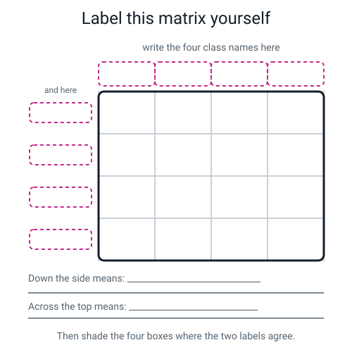
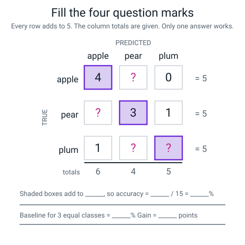
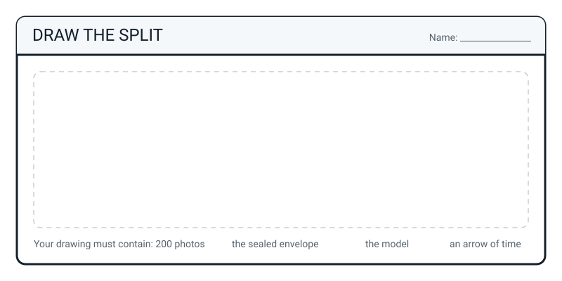

# Workbook — Week 34: The AI Fair Booth, Part 1: Build It and Test It Honestly

**Name:** ________________________________  **Date:** ______________

[📖 Student Guide — Week 34](../student-guide/week-34.md) · [Course Home](../README.md) · [Workbook — Week 35 ➡](week-35.md)

> **This week's homework is assembly, not new thinking.** Everything you made in class goes into the booth folder, laid out so a stranger who has never met you could pick it up and understand your project. About **50 minutes**.

---

## ✅ Warm-Up (5 min)

*Five quick questions from Week 33 — auditing your own model. Answers are at the bottom.*

**1.** In Week 33 you shot four batches of ten photos to audit your model. Name any **two** of the four conditions.

`____________________________`  and  `____________________________`

**2.** Your model scores 90% in one condition and 40% in another. Fill in the blank with the **correct unit**:

> The gap is 50 ____________________________.

**3.** True or false: *"a bias gap means something in the model is broken."*

**T / F** — because ______________________________________________

**4.** Which of these is a **named group**, the kind a bias report needs?

- (a) "It's a bit worse sometimes"
- (b) "Rubbish photographed under a lamp after dark"
- (c) "Hard photos"
- (d) "It struggles with lighting"

My answer: ______

**5.** "Collect more data" is not a plan. Write down the **two** things that turn it into one.

(i) ____________________________  (ii) ____________________________

---

## ✍️ Practice Set A — Understand It

These questions check that you understand the ideas behind the booth test.

**A1. Fill in the blanks.**

A **held-out set** is photos you hide __________________ training, which the model
__________________ sees. You keep them so you can __________________ the model
honestly afterwards. Once a photo has been in the training pile, there is no way to
make a model __________________ it.

---

**A2. Multiple choice.** With four roughly equal classes, what would you score by guessing with your eyes shut?

- (a) 0%
- (b) 25%
- (c) 50%
- (d) 100%

My answer: ______   Because ______________________________________________

---

**A3. True or false, and explain.**

> *"I uploaded all 50 photos per class, but I'm only going to test on ten of them, and I promise not to look at the answers first. That's the same as holding them out."*

**T / F**

Explain in two sentences — and make sure one of them says *who* has to not have seen the photos:

____________________________________________________________________

____________________________________________________________________

---

**A4. Match the pairs.** Draw a line, or write the letter in the box.

| The thing | | What it's for |
|---|---|---|
| 1. The fraction `30/40` | ______ | (a) The form a stranger at a fair understands instantly |
| 2. The decimal `0.75` | ______ | (b) Tells you which class it's bad at, and what it says instead |
| 3. The percentage `75%` | ______ | (c) Tells you the **size** of the test |
| 4. The baseline `25%` | ______ | (d) Forces you to actually do the division |
| 5. The confusion matrix | ______ | (e) Tells you whether the score means anything at all |

---

**A5. Label the diagram.** Below is an empty confusion matrix. Write your own four class names down the side and across the top, write what each direction means, then shade the four boxes where the two labels agree.


*Figure W34.1 — Empty grid, empty labels. Write the two directions in before any number goes anywhere.*

---

**A6. Spot the error.** A student writes this on their poster:

```text
   My model got 30 out of 40 = 75%.
   Guessing would be 25%.
   So my model is 50% better than guessing.
```

The arithmetic is right. **One word is wrong.** Circle it above and write the correct sentence:

____________________________________________________________________

---

## ✍️ Practice Set B — Use It

These questions let you use the ideas on new numbers.

**B1.** A friend says: *"My model is 95% accurate."* Write down the **two** questions you ask before you decide whether to be impressed.

(i) ____________________________________________________________

(ii) ___________________________________________________________

---

**B2.** Compute these three. **Show the division**, not just the answer.

| Fraction | The division, written out | Decimal | Percentage |
|---|---|---|---|
| 18 / 24 | | | |
| 33 / 60 | | | |
| 7 / 8 | | | |

---

**B3. What would go wrong, and why?** Maya's booth has four classes. She collects **60** photos of `bottle`, **60** of `jumper`, **60** of `lunchbox` — and **8** of `other`, because she got bored.

(a) Compute the balance check `(biggest − smallest) ÷ biggest` as a percentage:

`____________________________________________`

(b) The target is under 20%. Did she pass? ______

(c) Name **one specific thing** that will go wrong at the fair because of this, and say what a visitor will see:

____________________________________________________________________

____________________________________________________________________

---

**B4. What would go wrong, and why?** Tom is proud: his model scored **100%** on his test.

(a) Write down the **most likely** explanation:

____________________________________________________________________

(b) What is the very first question you'd ask him?

____________________________________________________________________

(c) Suppose it turns out he tested on 4 photos, one per class, and got all four. Write one sentence explaining why "100%" is a weaker claim than "30 out of 40":

____________________________________________________________________

---

**B5.** Read this row from a confusion matrix. The true class is `landfill`.

```text
                    said recycling   said compost   said landfill   said other
   was landfill            3              1              6              0
```

(a) How many landfill photos were there in total? ______

(b) What is the accuracy for landfill, as a fraction, a decimal and a percentage?

`____________  ____________  ____________`

(c) Write the one-sentence finding, **in the right direction**. Both class names must appear, and the order matters:

____________________________________________________________________

---

## 🧩 Puzzle of the Week — The Missing Matrix

Someone has spilled squash on a confusion matrix. Four boxes are gone. But you can get every single one back, because you know two things: **every row adds to 5**, and the column totals survived.


*Figure W34.2 — Four cells given, four missing. Every row total is 5, so the rest is arithmetic.*

Fill in the four question marks. Work in this order — one of them is forced, then the next one becomes forced, and so on.

|  | said apple | said pear | said plum | row total |
|---|---|---|---|---|
| **was apple** | 4 | ______ | 0 | 5 |
| **was pear** | ______ | 3 | 1 | 5 |
| **was plum** | 1 | ______ | ______ | 5 |
| **column total** | 6 | 4 | 5 | **15** |

Then finish these:

```text
   The shaded (diagonal) boxes add to ______

   ACCURACY   fraction  ______ / 15
              decimal   ______ ÷ ______ = ______        (show the division!)
              percentage ______ %

   BASELINE for 3 equal classes = ______ %
   GAIN = ______ − ______ = ______ percentage points
```

**Bonus:** which class is the model worst at, and what does it get confused with? ____________________

---

## 🤔 Think Deeper

These two questions have no single right answer. Write a paragraph for each.

**T1.** You have five more minutes of camera time. Should you spend it taking **more training photos** or **more held-out photos**? There is no single right answer — the defence is the point. Write a paragraph.

____________________________________________________________________

____________________________________________________________________

____________________________________________________________________

____________________________________________________________________

____________________________________________________________________

---

**T2.** Your held-out photos were shot on the **same day**, on the **same table**, as your training photos. Why is that a *weaker* test than photos shot a week later in a different room? And what would you change next time? Write a paragraph.

____________________________________________________________________

____________________________________________________________________

____________________________________________________________________

____________________________________________________________________

____________________________________________________________________

---

## 🛠️ Build It — The Booth Folder, Pages W34-1 to W34-8

*Everything below goes into the booth folder. Neatly. A stranger has to be able to read it.*

### W34-1 — The brief (5 min)

```text
   In my house, ______________________________________ happens about ______ times a week.

   It annoys ______________________ most.

   MY FOUR CLASSES (real words, and the fourth is always `other`):

      1 ________________  2 ________________  3 ________________  4  other

   THE INPUT: one ______________________________________ of one __________________

   THE BASELINE:  ______ classes, roughly equal  →  1 / ______  =  ______ %

   ┌──────────────────────────────────────────────────────────────────────┐
   │  THE SUCCESS BAR                                                     │
   │  I will call this useful if it beats ________ %                       │
   │  Written on ____________ (date), BEFORE anything was trained.         │
   │  Signed ________________     Witnessed by ________________            │
   └──────────────────────────────────────────────────────────────────────┘

   IF IT'S RIGHT: __________________________________________________________

   IF IT'S WRONG: __________________________________________________________
                  Is anybody hurt?  ________
```

### W34-2 — The counts table and the balance check (5 min)

| class | total photos | held out (20%) | left to train on |
|---|---|---|---|
| | | | |
| | | | |
| | | | |
| `other` | | | |
| **TOTAL** | | | |

```text
   BALANCE CHECK   (biggest − smallest) ÷ biggest

        ( ______ − ______ ) ÷ ______  =  ______  =  ______ %

   Target: under 20%.    Did I pass?  ______

   If I failed, my fix is: ______ more photos of ______________, then retrain.
```

### W34-3 — Model file record card (3 min)

```text
   ┌──────────────────────────────────────────────────────────────────────┐
   │  filename:  ____________________________                            │
   │  folder:    ____________________________                            │
   │  saved on:  ____________________________                            │
   │  size:      ____________________________                            │
   │                                                                      │
   │  TRAINED ON:      ______ photos, ______ per class, default settings   │
   │  NOT TRAINED ON:  the ______ photos in the sealed envelope            │
   │                   ← this is the line that matters                     │
   └──────────────────────────────────────────────────────────────────────┘
```

### W34-4 — The scoring sheet (5 min)

*Copy up neatly from class if it got messy. One row per held-out photo. One attempt each. No retakes.*

| # | true label | model said | top % | ✓ / ✗ | notes |
|---|---|---|---|---|---|
| 1 | | | | | |
| 2 | | | | | |
| 3 | | | | | |
| 4 | | | | | |
| 5 | | | | | |
| 6 | | | | | |
| 7 | | | | | |
| 8 | | | | | |
| 9 | | | | | |
| 10 | | | | | |
| … | *(continue to 40 on the back)* | | | | |

```text
   TICKS COUNTED:  ⃝ ______        HIGHEST CONFIDENCE WHILE WRONG: ______ %
```

### W34-5 — Accuracy three ways (7 min)

```text
   FRACTION      ______ / ______

   DECIMAL       ______ ÷ ______

                 working:  ______ × 0. ____ = ______
                           remainder ______ ;  ______ ÷ ______ = 0. ____
                           so the decimal is  0. ____

                 CHECK by simplifying:  ______ / ______  =  ______ / ______  =  0. ____

   PERCENTAGE    0. ____ × 100  =  ______ %

   BASELINE      ______ %

   GAIN          ______ − ______  =  ______ PERCENTAGE POINTS
                                        ↑ write the word "points". Not "%".

   DID I BEAT MY BAR OF ______ % ?     YES / NO

   If NO, the honest sentence is:
   ____________________________________________________________________
```

### W34-6 — The confusion matrix and the finding (10 min)

|  | said ______ | said ______ | said ______ | said ______ | row total |
|---|---|---|---|---|---|
| **was ______** | | | | | |
| **was ______** | | | | | |
| **was ______** | | | | | |
| **was ______** | | | | | |
| **column total** | | | | | |

```text
   THREE CHECKS I DID MYSELF:

      □ every row adds to the number of held-out photos in that class
      □ all sixteen boxes add to ______  (my total held-out count)
      □ the diagonal adds to ______, which MATCHES my tick count on W34-4

   PER-CLASS ACCURACY

      ______________  ______ of ______  =  ______ %
      ______________  ______ of ______  =  ______ %
      ______________  ______ of ______  =  ______ %
      ______________  ______ of ______  =  ______ %

   MY ONE-SENTENCE FINDING (both class names, in the right direction):

   "My model is worst at ________________ — ______ out of ______ — and when it gets
    ________________ wrong it usually says ________________."
```

### W34-7 — Data card draft (12 min)

```text
   1  WHAT IS IT?        ______________________________________________________

   2  HOW MANY?          ______ photos, ______ classes, ______ per class

   3  WHO COLLECTED IT?  ______________________________________________________

   4  PERMISSION         Who did I ask? ____________  When? ____________
                         What did they say? ______________________________
                         Are there any faces in any photo? ______ (I checked all ______)

   5  WHAT'S IN IT       ______________________________________________________
                         ______________________________________________________

   6  WHAT'S **NOT** IN IT   ← the box adults read first. Be uncomfortable and specific.
                         ______________________________________________________
                         ______________________________________________________
                         ______________________________________________________

   7  KNOWN LIMITS       held-out accuracy ______ / ______ = ______ %, baseline ______ %
                         worst class: ______________ at ______ %

   8  DO NOT USE FOR     ______________________________________________________
                         ______________________________________________________
```

### W34-8 — Reflection (3 min)

**(a)** Which step today could **not** be undone, and why?

____________________________________________________________________

____________________________________________________________________

**(b)** Write the exact sentence you'd say to a stranger at the fair. It needs **four** parts: the fraction, the percentage, the baseline, and the failure.

____________________________________________________________________

____________________________________________________________________

---

## 🎨 Draw It

Draw the split — the whole journey of your 200 photos, from the camera to the score. Your drawing must contain: **200 photos**, **the sealed envelope**, **the model**, and **an arrow of time** showing which happened first.


*Figure W34.3 — Draw the split. Two hundred photos, one envelope, one model — and the order matters.*

> **What a good answer might look like:** a timeline running left to right. On the left, a big pile labelled `200 photos`. An arrow splits it into two piles: `160` going right into a box labelled `MODEL — training`, and `40` going *down* into a sealed envelope with a date on it. The envelope has a dashed line round it saying **"the model never sees these"**. Then further right, the envelope reopens and its 40 photos go *into* the finished model, with an arrow coming out to `30/40 = 75%`. The key thing a good drawing shows is that **the envelope arrow leaves before the training box** — the order is the whole point, and a drawing where the envelope comes off the end of training is drawing the mistake.

---

## 📊 Self-Check

*Be honest. This page is for you, not for a mark.*

| I can... | 😀 | 🙂 | 😕 |
|---|---|---|---|
| Write a brief with a real annoyance, four classes, the baseline and a success bar chosen **before** training | | | |
| Explain why splitting **after** training cannot be repaired | | | |
| Train and save a model, and then **find the actual file** on the disk | | | |
| Report accuracy as a fraction, a decimal **and** a percentage, showing the division | | | |
| Say the baseline every time I say an accuracy, and use the word **points** for the gain | | | |
| Build a confusion matrix by hand and check the rows, the total and the diagonal | | | |
| Read the biggest off-diagonal box and say the finding **in the right direction** | | | |

Anything at 😕? Write the week number here and go back to that project: ______________

---

## ✅ Answers

Cover this part until you have finished the pages above. Then open it to check your work.

<details>
<summary>Check your answers</summary>

### Warm-Up

**1.** Any two of: **`control`** (same conditions as training) · **`new-lighting`** (a lamp, after dark) · **`new-hands`** (somebody else holding the items) · **`new-background`** (a different room). The point of all four is that they're **new photos taken after training, on purpose** — you are trying to find the failure, not avoid it.

**2.** **percentage points.** 90 − 40 = 50 percentage points. "50%" is wrong because it doesn't say 50% *of what* — and subtracting two percentages always gives points.

**3.** **False.** Nothing broke. No bug, no crash. The model learned exactly what it was shown, and what it was shown was skewed. That's why bias is the **default outcome** of learning from examples, not bad luck and not anybody being unkind.

**4.** **(b).** A named group has to be reproducible: a stranger must be able to break your model using only your sentence. "Rubbish photographed under a lamp after dark" passes that test. (a), (c) and (d) tell a visitor nothing they could go and check.

**5.** (i) **a number** — how many photos, worked out with arithmetic, not guessed. (ii) **how you'll check the fix worked** — retrain, then rerun the **identical** batch. (Without the identical batch you can't tell whether the fix worked or the new photos were just easier.)

---

### Practice Set A

**A1.** hide **before** training · the model **never** sees them · so you can **measure** the model honestly · no way to make a model **un-see** it.

**A2.** **(b) 25%.** Four classes → one in four → 1/4 = 0.25 = 25%. If you said 50% you were thinking of two classes. (Three classes → 33.3%.)

**A3.** **False.** Two sentences, and the first one must name *who*:

> "The held-out set is about what the **model** saw during training, not about what **I** remember. Those ten photos were in the upload, so they trained the model, and there's no way to make a model un-see a photo."

This is the single most common version of this mistake, and it feels careful, which is what makes it dangerous.

**A4.** 1 → **(c)** · 2 → **(d)** · 3 → **(a)** · 4 → **(e)** · 5 → **(b)**

Worth noticing *why* each one exists: the fraction stops "95%" hiding the fact that it was 19 out of 20; the decimal catches you dividing upside down (any decimal above 1.00 is a flipped division); the percentage is for strangers; the baseline is what turns a number into a measurement; and the matrix is the only one that tells you what to *do* next.

**A5.** Down the side = **what the photo actually was** (the true label). Across the top = **what the model said** (the prediction). The four shaded boxes are the **diagonal**, top-left to bottom-right — where the two labels agree. Those are the ones it got right, and adding them up and dividing by the total gives your accuracy.

A common wrong answer swaps the two directions. That matters enormously: "three landfill photos were called recycling" and "three recycling photos were called landfill" are completely different statements, and only one of them is true about your model.

**A6.** The wrong word is **"better"** — or more precisely, the missing unit. Correct sentence:

> "So my model is **50 percentage points** above guessing."

Not "50% better". 75 − 25 = 50 **points**. (If you wanted a "better" claim you'd have to divide, not subtract, and 75 ÷ 25 = 3, so it would be "three times as good as guessing" — which is a different and much shakier claim. Stick to points.)

---

### Practice Set B

**B1.** (i) **"Out of how many?"** — 19/20 and 950/1000 are wildly different claims wearing the same percentage. (ii) **"What's the baseline?"** — 95% is impressive against 25% and worthless against 94%.

These two questions are point 6 of the Level 2 gate in two weeks' time. Practise them until they're automatic.

**B2.**

| Fraction | The division, written out | Decimal | Percentage |
|---|---|---|---|
| 18 / 24 | 24 × 0.7 = 16.8 ; 18 − 16.8 = 1.2 ; 1.2 ÷ 24 = 0.05 ; 0.7 + 0.05 = 0.75. **Check:** 18/24, divide both by 6 → 3/4 | **0.75** | **75%** |
| 33 / 60 | 60 × 0.5 = 30 ; 33 − 30 = 3 ; 3 ÷ 60 = 0.05 ; 0.5 + 0.05 = 0.55. **Check:** 33/60, divide both by 3 → 11/20 = 55/100 | **0.55** | **55%** |
| 7 / 8 | 8 × 0.8 = 6.4 ; 7 − 6.4 = 0.6 ; 0.6 ÷ 8 = 0.075 ; 0.8 + 0.075 = 0.875 | **0.875** | **87.5%** |

Every one of those decimals is below 1.00. If yours came out above 1, you divided upside down — **you cannot get more right than you attempted.**

**B3.**

(a) `(60 − 8) ÷ 60 = 52 ÷ 60`. Working: 60 × 0.8 = 48 ; 52 − 48 = 4 ; 4 ÷ 60 = 0.0667 ; 0.8 + 0.0667 = **0.867 = 86.7%**

(b) **No.** 86.7% against a target of under 20% is a severe failure — the worst kind of class imbalance.

(c) The model barely saw `other` — only 8 photos, of which 20% (rounding to 2) get held out, leaving about 6 to train on. So it is likely to learn **not to bet on `other`**. What a visitor sees: they hold up their car keys, and the booth confidently says `lunchbox` at 74%, because "confidently say one of the three big classes" is almost always the winning strategy for a model trained like this. And the held-out `other` accuracy will be measured on 2 photos, which is not a measurement at all.

Her fix: about **50 more `other` photos**, then retrain. And she should write the failed balance check on her data card — it's a **finding**, not a secret.

**B4.**

(a) Most likely: **he tested on photos the model trained on.** A model that had done nothing but memorise its training images scores 100% on them. Second most likely: the test was tiny (4 photos).

(b) **"Were any of those test photos in the training pile?"** (Or, equally good: "out of how many?")

(c) Because "100%" out of 4 photos is **4 out of 4**, and one lucky photo swings that number by 25 points. "30 out of 40" has 40 attempts behind it, written down as they happened, so it's much harder for luck to fake. The **fraction is the honesty** — it shows the size of the test, and a bare percentage hides whether it came from 4 photos or 400.

**B5.**

(a) `3 + 1 + 6 + 0 = ` **10** photos.

(b) Fraction **6/10** · decimal `6 ÷ 10 = ` **0.6** · percentage **60%**

(c) > *"My model is worst at **landfill** — 6 out of 10 — and when it gets landfill wrong it usually says **recycling** (3 of its 4 mistakes)."*

The direction is the whole information. "It got four wrong" is nearly useless. "**Landfill** gets called **recycling**" tells a visitor what to hold up to break it, tells you what photos would fix it, and proves you actually looked.

---

### Puzzle of the Week — The Missing Matrix

Work in forced order. Each step makes the next one forced.

```text
   STEP 1   Row "apple" must add to 5:   4 + ? + 0 = 5   →   apple→pear = 1

   STEP 2   Column "pear" must total 4:  1 + 3 + ? = 4   →   plum→pear  = 0

   STEP 3   Row "pear" must add to 5:    ? + 3 + 1 = 5   →   pear→apple = 1

   STEP 4   Row "plum" must add to 5:    1 + 0 + ? = 5   →   plum→plum  = 4
```

The finished matrix:

|  | said apple | said pear | said plum | row total |
|---|---|---|---|---|
| **was apple** | **4** | 1 | 0 | 5 |
| **was pear** | 1 | **3** | 1 | 5 |
| **was plum** | 1 | 0 | **4** | 5 |
| **column total** | 6 | 4 | 5 | **15** |

**Two checks that prove it:** column apple = 4 + 1 + 1 = **6** ✓ · column plum = 0 + 1 + 4 = **5** ✓ · all nine boxes = 15 ✓

```text
   Diagonal = 4 + 3 + 4 = 11

   ACCURACY   fraction   11 / 15
              decimal    11 ÷ 15
                         15 × 0.7 = 10.5 ; 11 − 10.5 = 0.5 ; 0.5 ÷ 15 = 0.0333
                         0.7 + 0.0333 = 0.7333
              percentage 0.7333 × 100 = 73.3%

   BASELINE for 3 equal classes = 1/3 = 33.3%
   GAIN = 73.3 − 33.3 = 40.0 PERCENTAGE POINTS
```

**Bonus:** it's a tie for worst class — **pear** at 3/5 = 60%, and that's the only class below 4. Its mistakes are split evenly (1 apple, 1 plum), so the honest sentence names the tie rather than inventing a pattern:

> *"It's worst at pear — 3 out of 5 — and its two mistakes go one each way, so I can't tell yet what it's confusing pear with. I'd need more pear photos to find out."*

That last clause — *I can't tell yet, and here's what would tell me* — is a better answer than making up a story from two data points. Notice also that with only 5 photos per class, **one photo moves any per-class number by 20 points.** A 15-photo test is a weak measurement, and saying so is part of reporting it.

---

### Think Deeper

**T1 — more training photos or more held-out photos?**

There is genuinely no right answer, and the defence is what's being marked. A strong answer picks a side and prices it:

> **For more held-out photos:** "My test is 40 photos. One photo is worth 2.5 percentage points, and with only 40 photos a 75% score could easily be 10 or more points off the model's true accuracy either way (roughly 62% to 88%). Doubling the held-out set to 80 halves how much one photo can move the number. I'd rather have a slightly worse model that I know the true score of than a slightly better model I'm guessing about."

> **For more training photos:** "40 photos per class is thin. My `coriander` class is at 50%, which is barely above guessing, and the most likely reason is that 40 photos of a yellow powder don't cover enough angles and lighting. More training photos might actually make the model better, and a better model is worth more than a more precise measurement of a bad one."

The best answers notice the trade explicitly: **more held-out = a more reliable measurement of a possibly worse model. More training = a possibly better model, measured less well.** A weak answer just says "more training, obviously" with no number and no acknowledgement that anything was given up.

**T2 — why same-day held-out photos are a weaker test.**

Because everything except the object is the same: the same table, the same tablecloth, the same lamp, the same window, the same hands, the same camera, the same time of day. So the model can succeed by recognising *the situation* rather than *the object*. If the pattern it learned includes "there's a beige tablecloth in the bottom third of the frame," a same-day test can't catch that, because the tablecloth is in the test photos too.

A week later, in a different room, the situation changes and the object doesn't. That's a **harder and more honest exam.** If it still does well, you've learned something real. If it collapses, you've learned something even more useful — you've found out that your model learned the kitchen, not the rubbish.

What I'd change: shoot the held-out batch on a **different day, in a different room, with somebody else holding the items**, and write on the data card that I did. (That's most of the way to the bias test in Week 35, which is exactly the point.)

---

### Build It — W34-1 to W34-8

Your answers are your own, so here is a **model version** of each page and, more usefully, the marking points.

**W34-1 — the brief.** Complete when all seven are present: a specific annoyance **with a frequency and a person** · four class names in real words · `other` present · the input named · the baseline as a fraction *and* a percentage · a success bar written *before* training · consequences both ways.

> *"The wrong bin gets used about 4 times a week. It annoys Mum most. Classes: `recycling`, `compost`, `landfill`, `other`. Input: a webcam photo of one piece of rubbish. Baseline: 1/4 = 25%. **I will call it useful if it beats 50%.** Right → the correct bin gets named. Wrong → a pot in the food bin. Annoying, nobody hurt."*

**Common problems and the fix:** classes named `Class 1`/`Class 2` → rename them, real words only · no `other` → add it, and take 50 photos · a bar written after the score was known → that one can't be fixed, so **write down that it happened**, which is itself honest, and pre-register properly next time.

**W34-2 — the counts and the balance check.**

```text
   class        total  heldout(20%)  train        BALANCE CHECK
   recycling      50        10         40         (biggest − smallest) ÷ biggest
   compost        50        10         40       = (50 − 50) ÷ 50 = 0%   ✓ under 20%
   landfill       50        10         40
   other          50        10         40         a REAL failing example:
   ──────────   ─────   ─────────    ─────        (60 − 12) ÷ 60 = 0.8 = 80%  ✗
   TOTAL         200        40        160         fix: 48 more `other`, retrain
```

**W34-3 — the record card.** The line that earns the credit is the last one:

```text
   filename: booth-v1.tm     folder: Downloads/     saved: <today>
   trained on:     160 photos, 40 per class, default settings
   NOT trained on: the 40 photos in the sealed envelope     ← this line
```

If you couldn't fill in the folder, you didn't actually find the file, and Teachable Machine has no autosave. Go and find it now, before anything else.

**W34-4 / W34-5 — the sheet and accuracy three ways.** 40 rows of `# · true · predicted · top % · ✓/✗`, e.g. `2  recycling  landfill  61  ✗`. Ticks counted: **30**.

```text
   FRACTION     30 / 40
   DECIMAL      30 ÷ 40 :  40 × 0.7 = 28 → remainder 2 ; 2 ÷ 40 = 0.05 ; 0.7 + 0.05 = 0.75
                CHECK: 30/40 = 3/4 = 0.75   ✓
   PERCENTAGE   0.75 × 100 = 75%
   BASELINE     25%
   GAIN         75 − 25 = 50 PERCENTAGE POINTS
```

Marking points, in order: the division **written out** · the simplify check · the baseline present at all · the word **"points"**.

**W34-6 — the matrix and the finding.**

```text
                        PREDICTED
                   rec   com   lan   oth
   TRUE  rec        9     0     1     0     = 10
         com        1     8     1     0     = 10
         lan        3     1     6     0     = 10
         oth        1     0     2     7     = 10
                   ──    ──    ──    ──
                   14     9    10     7     = 40
```

Checks: every row adds to 10 ✓ · all sixteen boxes add to 40 ✓ · diagonal 9 + 8 + 6 + 7 = **30**, matching the tick count ✓

Per-class: recycling **90%** · compost **80%** · landfill **60%** · other **70%**.
And `(90 + 80 + 60 + 70) ÷ 4 = 300 ÷ 4 = 75%`, which matches the overall — **because all four classes have exactly 10 photos.** If your classes were different sizes it won't match, and then the overall is the one to trust.

The finding:

> *"My model is worst at **landfill** — 6 out of 10 — and when it gets landfill wrong it usually says **recycling** (3 of the 4 mistakes)."*

"75%" tells a visitor nothing they can act on. "It seems to call shiny landfill things recycling" tells them what to hold up, tells you what photos would fix it, and proves you looked. *(If two classes tie for worst, say so, and name the biggest single off-diagonal box instead of inventing a pattern.)*

**W34-7 — the data card.** All eight boxes filled. Model answers for the two that get skipped:

> **Box 4, Permission.** *"The rubbish is our household's. I asked Mum on Saturday 14th and she said yes. No faces appear in any photo — I checked all 200."*
>
> **Box 6, What's NOT in it** *(the box adults read first)*. *"No photos after dark — all 200 shot between 10am and 4pm. Nothing squashed or dirty. One kitchen, one table, one tablecloth, one person's hands. No glass at all."*

Box 7 reads: *30/40 = 75% on held-out photos; baseline 25%; worst class landfill at 60%.*
Box 8 is a draft of next week's sign: *"DO NOT USE THIS FOR a real recycling bin, anything in a dark kitchen, or glass — I have no glass photos at all."*

The marking point on box 6 is **specificity**. "Some limitations may apply" earns nothing. "No glass at all" earns everything, because a visitor can go and test it in four seconds.

**W34-8 — reflection.**

**(a)** > *"Splitting before training. Once a photo has trained the model, no score from it can tell learning from memorising, and there's no repair except collecting new photos."*

**(b)** Four parts — fraction, percentage, baseline, failure:

> *"It got 30 out of 40 photos right that it had never seen — 75%, against 25% for blind guessing. It's worst at landfill, six out of ten, and it usually calls those recycling."*

If your sentence has only the percentage in it, it isn't finished. Go back for the other three.

---

### Draw It

There's no single right drawing, but there is one thing that makes a drawing **wrong**: if the envelope arrow comes off the *end* of the training box, you have drawn the mistake instead of the method. The envelope must branch off **before** the photos reach the model, and the arrow of time has to make that visible at a glance.

The best drawings also label the envelope with something like *"the model never sees these"* and put the **date** on it — because in class the date on the envelope wasn't decoration, it was evidence.

</details>

---

[⬅ Week 33 workbook](week-33.md) · [📖 Week 34 chapter](../student-guide/week-34.md) · [Course Home](../README.md) · [Week 35 workbook ➡](week-35.md) · [Glossary](../../glossary.md)
