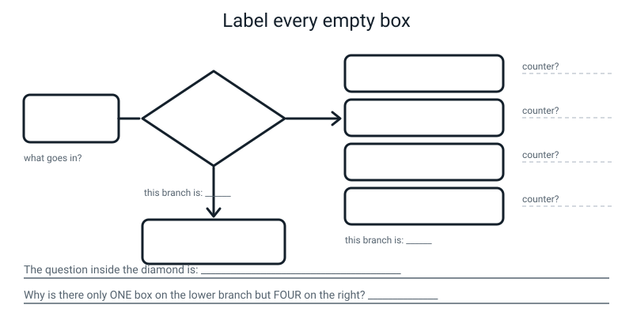
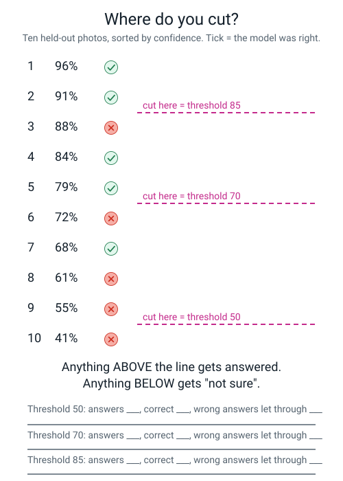
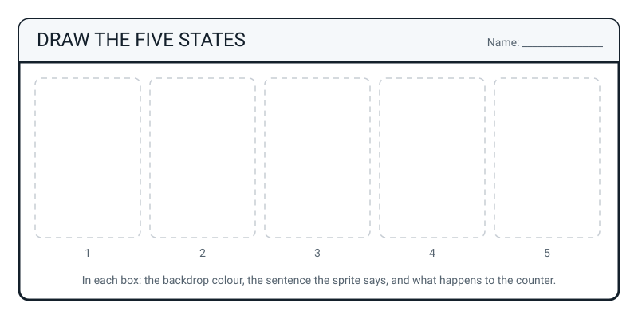

# Workbook — Week 35: The AI Fair Booth, Part 2: The App, the Report, the Demo

**Name:** ________________________________  **Date:** ______________

[📖 Student Guide — Week 35](../student-guide/week-35.md) · [Course Home](../README.md) · [Workbook — Week 36 ➡](week-36.md)

> **About 60 minutes of writing — plus three rehearsals out loud.** At least two of those to a real live human who is allowed to interrupt you. Standing up. Timed. **Reading it silently in your head does not count, and you will be able to tell.**
>
> If time runs out, **W35-4 and W35-7 are the two you cannot drop.**

---

## ✅ Warm-Up (5 min)

*Five quick questions from Week 34. Answers are at the bottom.*

**1.** Why did the envelope have to be sealed **before** the browser was opened? One sentence.

____________________________________________________________________

**2.** Fill in all three forms plus the baseline for a model that got 26 photos right out of 40:

`fraction ____________  decimal ____________  percentage ____________  baseline ____________`

**3.** A model scores 68% against a baseline of 25%. Write the gain **with its unit**:

____________________________________________________________________

**4.** In a confusion matrix, what does **down the side** mean, and what does **across the top** mean?

Down the side: ____________________  Across the top: ____________________

**5.** True or false: *"a model that scores 100% on its test is the best possible outcome."*

**T / F** — because ______________________________________________

---

## ✍️ Practice Set A — Understand It

**A1. Fill in the blanks.**

Every time the model looks at a photo it produces __________ numbers that always add
up to __________. The __________________ one wins, and that is all "the prediction" is.
So a model with no threshold is incapable of __________________.

---

**A2. Multiple choice.** Your Scratch app has four classes. How many **states** does it have?

- (a) Three — one per real class
- (b) Four — one per class
- (c) Five — four classes plus "not sure"
- (d) Six — four classes, "not sure", and an error state

My answer: ______   Because ______________________________________________

---

**A3. True or false, and explain.**

> *"Adding a threshold made my model less accurate, because now it gets fewer right."*

**T / F**

Explain in two sentences. One of them must say what actually changed and what didn't:

____________________________________________________________________

____________________________________________________________________

---

**A4. Match the pairs.** Which state does each object trigger? Write `other` or `not sure` in the middle column, then give the reason.

| The object | Which state? | Why |
|---|---|---|
| A car key | ____________ | |
| A squashed carton with a foil lid half on | ____________ | |
| A clean tin can | ____________ | |
| A photo taken so blurry the model scores 31, 25, 23, 21 | ____________ | |
| A TV remote (which was in your `other` training photos) | ____________ | |

---

**A5. Label the diagram.** Below is the threshold flowchart with everything rubbed out. Fill in every empty box, write the question that goes inside the diamond, and answer the question underneath.


*Figure W35.1 — One input, one diamond, two branches. The diamond is where the threshold lives.*

---

**A6. Spot the bug.** Here is a student's Scratch script. It has **one** structural mistake that means three of the four classes have no threshold at all. Circle it and say what's wrong.

```
   forever
       ask [Prediction? 1-4] and wait
       set [choice v] to (answer)
       ask [Confidence %?] and wait
       set [conf v] to (answer)

       if <(choice) = [1]> then
           if <(conf) > (threshold)> then
               say [RECYCLING - blue bin.]
           else
               say [Not sure.]
           end
       end

       if <(choice) = [2]> then
           say [COMPOST - green bin.]
       end

       if <(choice) = [3]> then
           say [LANDFILL - black bin.]
       end

       if <(choice) = [4]> then
           say [I do not recognise that.]
       end
   end
```

What's wrong: ______________________________________________________

The fix, in one sentence: ____________________________________________

---

## ✍️ Practice Set B — Use It

**B1.** Your extension reports confidence as `0.61`. You set `threshold` to `70`.

(a) What will your app say, every single time, forever? ____________________

(b) Why? ______________________________________________________

(c) Write the two-minute fix: ______________________________________

---

**B2.** A model scores **85%** in normal light and **48%** under a lamp.

(a) The gap, with the correct unit: ____________________________

(b) The training set was 144 daylight and 36 lamplight photos. You want lamplight to be at least **one third**. Show the algebra:

```
        L  ≥  1/3 × ( ______ + L )

       ______  ≥  ______ + L

       ______  ≥  ______

        L  ≥  ______

   CHECK:  ______ ÷ ( ______ + ______ ) = ______ ÷ ______ = ______ = ______ %

   I already have ______, so photos still to take = ______ − ______ = ______
```

(c) After you retrain, why must you rerun the **identical** batch and not a fresh one?

____________________________________________________________________

---

**B3. What would go wrong, and why?** Jo builds her app on Route A. She forgets the change-detection guard and the `wait` block. She holds up one tin can for three seconds.

(a) What does the sprite do? ______________________________________

(b) What does the counter say at the end? ______________________________

(c) A visitor asks what "37" means. Write the honest answer — and say what the counter was **actually counting**:

____________________________________________________________________

____________________________________________________________________

---

**B4. What would go wrong, and why?** Ali decides to leave the lamplight result off his poster, because it "makes the project look bad", and just says "it works really well."

(a) What happens the first time a visitor asks *"when does it fail?"*

____________________________________________________________________

(b) Name **two** things Ali has actually lost by hiding it:

(i) ____________________________________________________________

(ii) ___________________________________________________________

---

**B5.** Rewrite each banned sentence so it says the same thing honestly. You must use at least one of **training**, **model**, **pattern**, or a number.

| ❌ What they said | ✅ Your rewrite |
|---|---|
| "It's basically magic." | |
| "It just knows what a can is." | |
| "It's really smart." | |
| "Obviously it uses AI." | |
| "It understands rubbish." | |

---

## 🧩 Puzzle of the Week — The Threshold Detective

Here are ten held-out photos, sorted by the confidence the model gave. A tick means the model was **right**.


*Figure W35.2 — Ten results from 96% down to 41%. Three candidate thresholds. Which one would you ship?*

| # | confidence | right? |
|---|---|---|
| 1 | 96% | ✓ |
| 2 | 91% | ✓ |
| 3 | 88% | ✗ |
| 4 | 84% | ✓ |
| 5 | 79% | ✓ |
| 6 | 72% | ✗ |
| 7 | 68% | ✓ |
| 8 | 61% | ✗ |
| 9 | 55% | ✗ |
| 10 | 41% | ✗ |

Anything **above** the threshold gets answered. Anything at or below gets "not sure". Fill in the table:

| threshold | answers given | of those, correct | accuracy of the answers given | wrong answers let through | correct answers refused |
|---|---|---|---|---|---|
| **50** | | | | | |
| **70** | | | | | |
| **85** | | | | | |
| **90** | | | | | |

**The three questions:**

**(a)** What is the **lowest** threshold that lets **zero** wrong answers through? ____________

**(b)** What does that threshold cost you? Give a number: ______________________________

**(c)** Photo #3 was **88% confident and wrong.** Write one sentence saying what that single row proves:

____________________________________________________________________

---

## 🤔 Think Deeper

**T1.** Your threshold is 70. Somebody says: *"just set it to 95 — then it's basically never wrong."* Write a paragraph explaining why that's a trade and not an improvement, using numbers from the puzzle above.

____________________________________________________________________

____________________________________________________________________

____________________________________________________________________

____________________________________________________________________

____________________________________________________________________

---

**T2.** Route B has a human in the loop — you type the prediction in. Somebody at the fair says that's cheating. Write a paragraph answering them properly. (Don't just say "no it isn't". Say what the machine does, what you do, and what you wrote down about it.)

____________________________________________________________________

____________________________________________________________________

____________________________________________________________________

____________________________________________________________________

____________________________________________________________________

---

## 🛠️ Build It — Pages W35-1 to W35-8

### W35-1 — The five-state table (5 min)

*Fill this in to match the app you **actually built**, not the one in the book.*

| State | Backdrop | What the sprite says (exact words) | Counter |
|---|---|---|---|
| | | | |
| | | | |
| | | | |
| `other` | | | |
| **not sure** | | | |

```
   CHECK:  □ FIVE rows, not four
           □ every row changes something VISIBLE
           □ the counter changes on exactly the three real classes
           □ the two "no bin" sentences are DIFFERENT from each other
           □ the "not sure" sentence quotes the actual confidence number
```

### W35-2 — The threshold, written out (6 min)

```
   set [threshold v] to ( ______ )

   if < ( ______ )  ______  ( ______ ) > then

       say ______________________________________________________

   else

       ... the ______ class behaviours go in HERE, inside the else ...

   end
```

**The units check.** Look at what your own screen actually showed you:

```
   My confidence reads as ____________  ( a whole number / a decimal )

   So my threshold is ____________

   I checked this by ______________________________________________
```

**Route:** A / B     **Why:** ______________________________________________

### W35-3 — The four bias sheets, tidied (8 min)

| condition | correct | fraction | the division | decimal | percentage |
|---|---|---|---|---|---|
| `control` | ______ /10 | | | | |
| `new-hands` | ______ /10 | | | | |
| `new-background` | ______ /10 | | | | |
| `new-lighting` | ______ /10 | | | | |

```
   BEST condition:  ______________  at ______ %
   WORST condition: ______________  at ______ %
```

### W35-4 — The bias report (12 min) ★ cannot be dropped

```
   1  THE GAP

      ______ %  −  ______ %  =  ______ ____________________
                                          ↑ the UNIT is a mark on its own


   2  THE NAMED GROUP  (a stranger must be able to break it using only this sentence)

      "It fails on ______________________________________________________"


   3  THE CHAIN  — four links, and link 2 must end in a NUMBER

      a) MY COLLECTION HABIT
         ____________________________________________________________

      b) SO THE DATA IS SKEWED
         ______ of my ______ training photos are ______________,
         only ______ are ______________.   ( ______ % vs ______ % )

      c) SO THE MODEL LEARNED
         ____________________________________________________________

      d) SO WHO GETS BAD PREDICTIONS
         ____________________________________________________________

      And the honest line: ______________________________________________


   4  THE PRICED FIX  (show the algebra)

      I want ______________ to be at least ______ of my training photos,
      keeping all ______ of my ______________ photos.

           L  ≥  ______ × ( ______ + L )
          ______  ≥  ______
           L  ≥  ______        (round UP if it isn't a whole number: ______)

      CHECK:  ______ ÷ ______ = ______ = ______ %   ✓

      I already have ______, so photos still to take = ______

      Then I will: ______________________________________________________
      And I will rerun the ______________________ batch, because ______________
      ____________________________________________________________________

      What might happen to my BEST number after the fix? ______________________


   5  HIGHEST CONFIDENCE WHILE WRONG

      ______ % on a photo of a ______________ that it called ______________

      Why that number matters, in one line:
      ____________________________________________________________________
```

### W35-5 — The final data card (8 min)

*Boxes 1 to 6 are last week's, finished. Boxes 7 and 8 now carry real numbers.*

```
   7  KNOWN LIMITS

      held-out:   ______ of ______ = ______ %.  Baseline ______ %,
                  so a gain of ______ percentage points.
      worst class: ______________, ______ of ______, usually called ______________
      worst condition: ______________, ______ %, a gap of ______ percentage
                  points from the ______ % control
      highest confidence while wrong: ______ %

   8  DO NOT USE THIS FOR

      · ____________________________________________________________
      · ____________________________________________________________
      · ____________________________________________________________

   ROUTE  (required)
      Route ______ : ______________________________________________________
      because ____________________________________________________________
```

### W35-6 — The DO NOT USE sign, drafted (4 min)

*Draft it here first. Then it goes on poster paper in marker.*

```
   ┌──────────────────────────────────────────────────────────────────────┐
   │                                                                      │
   │        D O   N O T   U S E   T H I S   F O R                          │
   │                                                                      │
   │   ·  ______________________________________________________          │
   │                                                                      │
   │   ·  ______________________________________________________          │
   │      ( ______ % correct — I measured it )                             │
   │                                                                      │
   │   ·  ______________________________________________________          │
   │      ( I have ______ photos of this at all )                          │
   │                                                                      │
   └──────────────────────────────────────────────────────────────────────┘

   THE THREE REQUIREMENTS — tick them off:
      □ at least one MEASURED limit, with the number attached
      □ at least one ABSENT category (something with zero photos)
      □ it is physically the BIGGEST text on my booth
```

### W35-7 — The demo script and the rehearsal log (10 min) ★ cannot be dropped

```
   1  THE ANNOYANCE                                          30 s
      ____________________________________________________________
      ____________________________________________________________

   2  IT WORKS                                                60 s
      ____________________________________________________________
      ____________________________________________________________

   3  HOW IT LEARNED  ★                                       90 s
      ____________________________________________________________
      ____________________________________________________________
      ____________________________________________________________
      ____________________________________________________________
      (must contain: TRAINING · MODEL · a photo count · "nobody wrote a rule")

   4  HOW GOOD IT IS                                          60 s
      ____________________________________________________________
      ____________________________________________________________
      (must contain: the fraction · the percentage · the baseline)

   5  WHERE IT FAILS  ★                                       45 s
      ____________________________________________________________
      ____________________________________________________________
      (must contain: a number · a named group · a DEMONSTRATION, not a description)

   6  THE INVITATION                                          15 s
      ____________________________________________________________
                                                            ───────
                                                     TOTAL   300 s = 5:00
```

**The rehearsal log.** Three rows. Fill one in per rehearsal, straight afterwards.

| # | who I did it to | time | banned words | was the failure actually SHOWN? |
|---|---|---|---|---|
| 1 | | | | |
| 2 | | | | |
| 3 | | | | |

```
   Did the time come DOWN across the three runs?   ______
   Did the banned-word count come DOWN?            ______
   The one thing I'll change for the fair:  ______________________________
```

### W35-8 — The six question-bank answers (8 min)

*In your own words. **Every answer must contain a number you measured.** If an answer has no number in it, it isn't finished — go and find it, it's on one of your own sheets.*

**1. "But how does it actually know?"** *(must contain **training** and **model**, and zero banned words)*

____________________________________________________________________

____________________________________________________________________

**2. "Couldn't you just write an if-then rule?"** *(must name the rule you tried and why it broke)*

____________________________________________________________________

____________________________________________________________________

**3. "What happens when it's wrong?"**

____________________________________________________________________

**4. "Is my photo going to Google?"** *(be precise, not reassuring)*

____________________________________________________________________

____________________________________________________________________

**5. "How much better than guessing?"** *(fraction, percentage, baseline, points)*

____________________________________________________________________

____________________________________________________________________

**6. "Should a council use this?"** *(say no, and give the number)*

____________________________________________________________________

____________________________________________________________________

---

## 🎨 Draw It

Draw the five states of your own app — one per box. In each box show: the **backdrop colour**, the **sentence** the sprite says, and **what happens to the counter**.


*Figure W35.3 — Five states, five columns. Draw what the booth shows in each one.*

> **What a good answer might look like:** five little screens in a row. Boxes 1–3 each have a different coloured backdrop, a bin name in capitals, and a small `+1` in the corner. Box 4 (`other`) is white, says "I don't recognise that — I only know 3 kinds of rubbish", and has `no change` in the corner. Box 5 (`not sure`) is also white but has a big `?` on it, says "Not sure — only 61% confident", and `no change`. The thing that makes a drawing **good** rather than decorative is that boxes 4 and 5 look **visibly different from each other** — because they *are* different, and a visitor has to be able to tell which one fired without asking you.

---

## 📊 Self-Check

| I can... | 😀 | 🙂 | 😕 |
|---|---|---|---|
| Build a Scratch app where each of the four classes does something **visibly different** | | | |
| Add a confidence threshold and **demonstrate the "not sure" case on purpose** | | | |
| Explain the difference between the `other` class and "not sure" in one sentence | | | |
| Check the confidence **units** (`61` vs `0.61`) before debugging anything else | | | |
| Compute a bias gap and say it in **percentage points** | | | |
| Name my failing group in a sentence a stranger could reproduce | | | |
| Price a fix with the algebra shown, and say how I'd check it worked | | | |
| Deliver the five-minute demo, standing, with **zero banned words** | | | |

Anything at 😕? Week number to go back to: ______________

---

## ✅ Answers

<details>
<summary>Check your answers</summary>

### Warm-Up

**1.** So the model **never saw** those photos — which is the only thing that makes the score a measurement rather than a memory test. (There is no way to make a model un-see a photo, so it can't be done afterwards.)

**2.** `fraction 26/40` · `decimal 0.65` · `percentage 65%` · `baseline 25%`

Working: 40 × 0.6 = 24 ; 26 − 24 = 2 ; 2 ÷ 40 = 0.05 ; 0.6 + 0.05 = **0.65**. Check by simplifying: 26/40 = 13/20 = 65/100 ✓

**3.** **43 percentage points.** (68 − 25 = 43.) Not "43%". Subtracting two percentages gives points.

**4.** Down the side = **what the photo actually was** (the true label). Across the top = **what the model said** (the prediction). Swapping them makes every finding say the opposite of the truth.

**5.** **False.** 100% is usually a **symptom**, not a triumph — the two most likely causes are that the test photos were in the training pile, or that the test was tiny. A model doing a genuinely hard job gets things wrong sometimes; that's what "hard" means.

---

### Practice Set A

**A1.** **four** numbers · add up to **100** · the **biggest** one wins · incapable of **hesitating**.

**A2.** **(c) five.** Four classes plus "not sure", because "not sure" is not a class — no class produces it. The model can't say it. Your app says it, by refusing to pass on a weak winner.

**A3.** **False.**

> "My model didn't change at all — it still gets exactly the same number right on the same 40 photos. What changed is that the app now refuses to *repeat* the guesses that won by too little, so it says fewer wrong things out loud, and it stops giving a few correct answers as well."

The key distinction: the **model's** accuracy is untouched. What the threshold changes is the accuracy **of the answers the app chooses to give** — which goes up — and the number of answers it gives — which goes down. That's a trade, not a loss.

**A4.**

| The object | Which state? | Why |
|---|---|---|
| A car key | **`other`** | The model saw keys, hands and the bare table in its 50 `other` training photos. It is being **confident** that this is none of your three bins. |
| A squashed carton with a foil lid | **not sure** | It looks part-way between recycling and landfill, so the four numbers come out close together and nothing wins by enough. |
| A clean tin can | *neither* — this is `recycling` | Trick row. A clear example of a real class triggers that class, at high confidence. |
| Blurry, scores 31/25/23/21 | **not sure** | 31 is the biggest, so `recycling` "wins" — but 31 is nowhere near 70. The app refuses. |
| A TV remote (in your `other` photos) | **`other`** | Same as the car key: the model has been trained to recognise this as none-of-these. |

If you put `other` for the squashed carton, look at the cause again: `other` needs the model to be *sure*. The carton makes it unsure. Different cause, different state.

**A5.** Filled in, left to right:

- **Input box:** the winning confidence number (and the label that won)
- **Inside the diamond:** *"Is the winning confidence above 70?"*
- **Lower branch (the "no" branch):** one box — *"Say: Not sure — only __% confident. Name no bin. Counter unchanged."*
- **Right branch (the "yes" branch):** four boxes — `recycling` (+1) · `compost` (+1) · `landfill` (+1) · `other` (no change)
- **Why one box on one side and four on the other?** Because there is only **one way to be unsure** — you don't know, and which class *nearly* won doesn't matter. There are **four ways to be sure**, one per class. The shape of the flowchart is telling you something true about the problem.

**A6.** **The threshold check is *inside* the first `if`.** So only `choice = 1` (recycling) has a threshold at all. Classes 2, 3 and 4 will happily announce a 31%-confident guess at full volume.

**The fix:** the threshold check must **wrap** all four class blocks. One threshold `if` on the outside; the four class `if`s go inside it; the "not sure" line goes in its `else`:

```
   if <(conf) < (threshold)> then
       say [Not sure - only __%.]
   else
       if <(choice) = [1]> then ... end
       if <(choice) = [2]> then ... end
       if <(choice) = [3]> then ... end
       if <(choice) = [4]> then ... end
   end
```

Build the threshold **first**, before any of the four behaviours exist, and it can never end up in the wrong place.

---

### Practice Set B

**B1.**

(a) It will say **"not sure"**, every single time, forever.

(b) Because `0.61 > 70` is **never true**. The extension is reporting a decimal between 0 and 1; your threshold is on a 0–100 scale. The comparison can't ever fire, so the app takes the `else` branch every time.

(c) `say (image label confidence)` once. Look at the number on screen. If it says `0.61`, set `threshold` to `0.7`. If it says `61`, set `threshold` to `70`. **Two minutes, and you must do this before you debug anything else** — it is the number one bug of this whole lesson, and it looks exactly like a broken model.

**B2.**

(a) `85% − 48% = ` **37 percentage points.**

(b)

```
        L  ≥  1/3 × ( 144 + L )
       3L  ≥  144 + L
       2L  ≥  144
        L  ≥  72

   CHECK:  72 ÷ (144 + 72) = 72 ÷ 216 = 0.3333 = 33.3%   ✓  exactly a third

   Already have 36, so photos still to take = 72 − 36 = 36
```

*(A neat check on the check: 72 is exactly half of 144, and one third of a whole means half of the rest. That relationship is worth spotting — it means "one third of the total" is always "half as many as everything else".)*

(c) Because otherwise you cannot separate **"the fix worked"** from **"the new photos were easier."** If you score 70% on a *different* batch, you have no idea which of those two things happened. Same test before and after is the only comparison that means anything.

**B3.**

(a) The sprite repeats the same line over and over, as fast as the laptop allows, because the `forever` loop re-fires the matching `if` on every single pass and there's nothing telling it "you already said this".

(b) Something like **37** — some large, meaningless number. (The exact value depends on the laptop's speed, which is itself a clue that it can't be measuring anything real.)

(c) > *"It doesn't mean 37 items. It means the loop ran 37 times while a can was in front of the camera. `count` was counting **loop passes while an item was visible**, not items sorted. One can showed up as 37. I've fixed it with a change-detection guard so it only counts when the label actually changes."*

This is the same bug you debugged on paper in Week 30, wearing a different costume. The fix is `wait (0.5) seconds` plus `if <not <(image label) = (last)>>`.

**B4.**

(a) He has nothing to say. He'll say something like "um, it's pretty good" — and at that exact moment the visitor stops believing **everything else** he told them, including the parts that were true. Hiding one number costs you the credibility of all of them.

(b) (i) **The best object on his booth.** Twenty stalls will have a demo that works; nobody else can say "here is exactly who I fail, here's the number, here's what fixing it costs". (ii) **The chance to say "nothing broke"** — that the model learned exactly what it was shown, which is the single most grown-up sentence available to him and is genuinely interesting to adults.

**B5.** Model rewrites — yours will differ, but every one must contain training, model, pattern, or a number:

| ❌ What they said | ✅ Your rewrite |
|---|---|
| "It's basically magic." | "It found a pattern in 160 labelled photos." |
| "It just knows what a can is." | "It matches a new photo against the pattern it found. It has never seen a can — it's seen numbers that came from photos of cans." |
| "It's really smart." | "It gets 30 out of 40 right on photos it had never seen, against a 25% baseline." |
| "Obviously it uses AI." | *(delete "obviously")* "It's a classifier I trained on 200 photos I took myself." |
| "It understands rubbish." | "It produces four numbers that add up to 100, and the biggest one wins. It doesn't understand anything." |

---

### Puzzle of the Week — The Threshold Detective

| threshold | answers given | of those, correct | accuracy of the answers given | wrong answers let through | correct answers refused |
|---|---|---|---|---|---|
| **50** | 9 (#1–9) | 5 | 5 ÷ 9 = 0.556 = **55.6%** | **4** (#3, 6, 8, 9) | 0 |
| **70** | 6 (#1–6) | 4 | 4 ÷ 6 = 0.667 = **66.7%** | **2** (#3, 6) | 1 (#7) |
| **85** | 3 (#1–3) | 2 | 2 ÷ 3 = 0.667 = **66.7%** | **1** (#3) | 3 (#4, 5, 7) |
| **90** | 2 (#1–2) | 2 | 2 ÷ 2 = 1.0 = **100%** | **0** | 3 (#4, 5, 7) |

*How to read the table off the list:* "above the threshold" means strictly greater, so threshold 70 answers #1–6 (confidences 96, 91, 88, 84, 79, 72) and refuses #7–10 (68, 61, 55, 41). The five ticks overall are #1, 2, 4, 5, 7.

**(a)** **88.** Photo #3 was 88% confident and wrong, and "above the threshold" means strictly greater, so a threshold of exactly 88 already cuts it off (88 is not above 88). Any higher threshold, such as 89 or 90, also lets zero wrong through, but 88 is the lowest.

**(b)** It costs you **almost your whole booth.** At threshold 90 the app answers only **2 of the 10 photos** — it says "not sure" eight times out of ten. And it refuses **3 answers it would have got right** (#4, #5 and #7). You bought perfection by refusing to be useful.

That is the real shape of every threshold decision. There is no setting where you win both. **Higher threshold = more right when it speaks, speaks less often.**

**(c)** > *"Photo 3 was 88% confident and wrong. That single row proves confidence is guess **strength**, not a hit rate — the model prefers one class strongly and is still wrong, because nothing inside it ever checks the answer against reality. The only thing that measured correctness was me, with a pencil."*

That's why #3 is the most useful row in the whole table, and why the highest-confidence-while-wrong number goes on your poster, **large**.

---

### Think Deeper

**T1 — "just set it to 95".**

A strong answer uses the puzzle's own numbers:

> "At threshold 90 the app is right 2 out of 2 — a perfect 100% — and it also refuses to answer 8 photos out of 10, three of which it would have got right. So it's 'never wrong' in the same way that a shop that's always closed never sells anything faulty. Meanwhile at 70 it answers 6 times, is right 4 of those, and lets 2 wrong answers through. Neither setting is better; they're different trades. Higher threshold means more right when it speaks, and speaking much less often. What matters is which cost you'd rather pay, and for a bin sorter I'd rather answer more often and be wrong sometimes, because being wrong just means a pot in the wrong bin. If this were a medical model I'd choose the opposite, and I'd say so."

Marking points: **uses actual numbers** · names the trade in both directions · notices that the right answer depends on **what happens when it's wrong**.

**T2 — "Route B is cheating".**

> "The guess is the machine's. The typing is mine. The model runs on this laptop, looks at the photo through the webcam, and produces four numbers that add to 100 — I don't choose those numbers and I can't change them. What I do is read the winner off the screen and type `2` into Scratch, because I decided not to upload my model to a public web link. That was a real privacy choice, made with an adult, and it's written on this sign and on my data card. The stall that uploaded their model to a public address didn't make a choice about it at all — they just clicked the button. Route A and Route B are both honest. What would be dishonest is not telling you which one I did."

Marking points: names **exactly** what the machine does and what the human does · names the privacy reason · points at the sign · does **not** get defensive, and specifically doesn't claim Route B is *better* — only that it's disclosed.

---

### Build It — W35-1 to W35-8

**W35-1 — the five-state table.** Model version, and the marking points are in the checklist on the page itself:

| State | Backdrop | What the sprite says | Counter |
|---|---|---|---|
| `recycling` | blue | "RECYCLING — blue bin, please." | +1 |
| `compost` | green | "COMPOST — green bin." | +1 |
| `landfill` | grey | "LANDFILL — black bin. Could you reuse it?" | +1 |
| `other` | white | "I don't recognise that. I only know 3 kinds of rubbish." | no change |
| **not sure** | white + big `?` | "Not sure — only 61% confident." | no change |

In order of importance: **five** rows not four · each row changes something *visible* · the counter changes on exactly the three real classes · the two no-bin sentences are **different from each other** · the "not sure" row quotes the actual number rather than just saying "not sure".

**W35-2 — the threshold.**

```
   set [threshold v] to (70)

   if <(conf) < (threshold)> then
       say (join [Not sure - only ] (join (conf) [%.]))
   else
       ... the four class behaviours ...
   end
```

Units check — both of these are correct answers, and which one is right depends on your own screen:

> "My confidence reads as **61**, a whole number, so my threshold is **70**."
> "My confidence reads as **0.61**, a decimal, so my threshold is **0.7**."

Full credit needs the threshold check **wrapping** the four behaviours, not sitting beside them or inside one of them (see A6), and a units line that matches what you actually saw.

**W35-3 / W35-4 — the bias sheets and the report.** Model version, using the numbers from the student guide:

| Condition | Correct | Fraction | Decimal | Percentage |
|---|---|---|---|---|
| `control` | 9 | 9/10 | 9 ÷ 10 = 0.9 | **90%** |
| `new-hands` | 8 | 8/10 | 0.8 | 80% |
| `new-background` | 6 | 6/10 | 0.6 | 60% |
| **`new-lighting`** | **4** | **4/10** | **0.4** | **40%** ← worst |

```
   1  THE GAP        90% − 40% = 50 PERCENTAGE POINTS

   2  NAMED GROUP    "It fails on rubbish photographed under a lamp after dark."

   3  THE CHAIN
      a) I only shot in the afternoon, because that's when I was free
      b) 138 of my 160 training photos are daylight; only 22 are lamplight (86% vs 14%)
      c) it learned daylight patterns and never learned lamplight ones
      d) anyone using it in the evening, under a lamp, or in winter — which for
         a kitchen bin is most of the time it actually matters
      And: NOTHING BROKE. The model learned exactly what it was shown.

   4  THE PRICED FIX   lamplight to be at least 1/3, keeping all 138 daylight
         L ≥ 1/3 × (138 + L)  →  3L ≥ 138 + L  →  2L ≥ 138  →  L ≥ 69
         CHECK: 69 ÷ 207 = 0.333… = 33.3%   ✓
         already have 22  →  47 more photos to take
         then retrain, and rerun the IDENTICAL lamplight batch
         my 90% control number might drop slightly — that's a real trade-off,
         and I'd report it rather than hide it

   5  HIGHEST CONFIDENCE WHILE WRONG
         88% on a lamplight photo of a carton it called `compost`.
         Why it matters: confidence is guess strength, not a hit rate.
```

*(If you set a different target — say "half" instead of "a third" — the **method** is what's marked, not the target. Half would be `L ≥ 138`, so 116 more photos. Both are correct if the algebra is shown.)*

**W35-5 — the data card.** The three boxes that were still drafts last week:

> **Box 5, What's in it.** *"160 training photos: 138 daylight, 22 lamplight, 0 dark. 92 held in a hand, 68 on the table. One kitchen, one tablecloth, one photographer."*
>
> **Box 7, Known limits.** *"30 of 40 held-out photos = 75%. Baseline 25%, so a gain of 50 percentage points. Worst class: landfill, 6 of 10, usually called recycling. Worst condition: lamplight, 40%, a gap of 50 percentage points from the 90% control. Highest confidence while wrong: 88%."*
>
> **Box 8, Do not use this for.** *"A real recycling bin; anything photographed after dark; glass — there is no glass in my training data at all."*

Required if you used Route B: one line naming the route and the reason. *"Route B: the model runs on this laptop and I type the prediction, because I chose not to upload the model."*

**W35-6 — the sign.** All three requirements are marked: a **measured** limit with the number attached (40% under a lamp) · an **absent** category (glass — zero photos) · physically the biggest text on the booth. A sign saying only "do not use for important things" scores **nothing**, because it tells a visitor nothing they could check.

**W35-7 — the script and the log.** All six segments, in order, within five minutes: annoyance 30s · it works 60s · **how it learned 90s** · how good it is 60s · **where it fails 45s** · the invitation 15s. The two starred ones are the ones people cut when they overrun, and they're the two worth the most.

Model version of the two starred segments:

> **How it learned (90s).** *"I took 200 photos of our rubbish and typed the right answer next to each one. Nobody wrote a rule — I tried that first, and 'shiny' catches the tin can **and** the crisp packet. The program looked at 160 of those photos and found its own pattern. That part is called **training**, and what comes out is the **model** — the guessing machine. This is the data card; it says exactly what's in those 200 photos and what isn't."*
>
> **Where it fails (45s).** *"It's 90% in normal light and 40% under a lamp. That's a 50 percentage point gap, and it's because 138 of my 160 training photos were daylight. Watch —"* [turns the lamp on, holds up the carton, lets it get it wrong] *"— and see that? 88% confident, and wrong."*

**Reading the log:** a good log shows the time coming **down** and the banned-word count coming **down** across the three runs. If the time went **up** in run two, that's usually a *good* sign — it means you stopped reading and started explaining. If it went up in run three, that's a bad sign.

**W35-8 — the six answers.** Every one must contain a number you measured.

| Question | The shape of a good answer |
|---|---|
| "How does it actually know?" | It doesn't know anything. It saw **160 labelled photos** and found which patterns of light and dark went with which answer, then matches new photos against those patterns. Must contain **training** and **model**; must contain **none** of the six banned phrases. |
| "Why not just write an if-then rule?" | Tried it. "Shiny" catches the can *and* the crisp packet, which is landfill. Then you add a rule, then another, and each one interacts with all the rest — **rule explosion**. Week 10's number: 258 rules and still wrong. |
| "What if it's wrong?" | A yoghurt pot goes in the wrong bin. Annoying, nobody hurt — and that's *why* I picked this problem rather than something medical. Then point at the DO NOT USE sign. |
| "Is my photo going to Google?" | Route B: *"Nothing has left this laptop, including the model. I type the prediction in myself, and that sign says so."* Route A: *"My photos never left this laptop — training happened in the browser — but the finished model is on a Google link, and I decided that with an adult."* Precision matters more than reassurance. |
| "How much better than guessing?" | *"Baseline for four classes is 25%. Mine is 75% — 30 out of 40 photos it had never seen. That's a **50 percentage point** gain, and here's the sheet so you can see it was 40 photos and not 4,000."* |
| "Should a council use this?" | *"No, and here's the number: 40% under a lamp. A bin sensor in a dark kitchen would be wrong more than half the time. To make it usable I'd need 47 more lamplight photos, a retrain, and the identical test rerun — and the daylight number might drop when I do."* |

---

### Draw It

The one thing that makes this drawing **wrong** is drawing four boxes instead of five, or drawing boxes 4 and 5 identically. Those two states have different causes and a visitor must be able to tell them apart at a glance — so the drawing has to make them look different too. A big `?` on the "not sure" screen is the simplest way, and quoting the actual confidence number in the sentence is the other.

</details>

---

[⬅ Week 34 workbook](week-34.md) · [📖 Week 35 chapter](../student-guide/week-35.md) · [Course Home](../README.md) · [Week 36 workbook ➡](week-36.md) · [Glossary](../../glossary.md)
