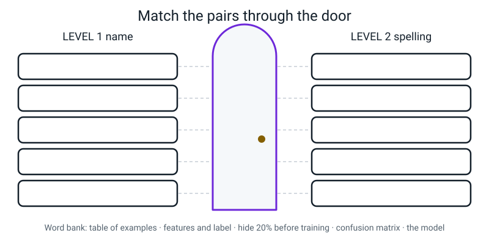
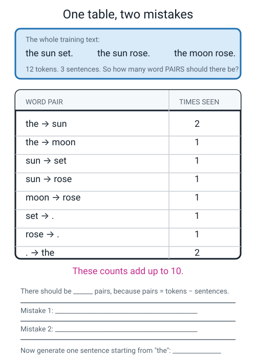
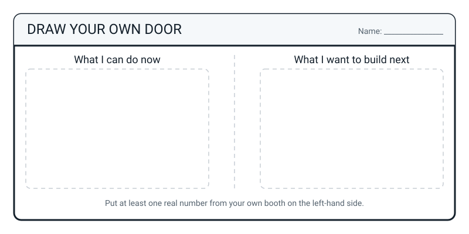

# Workbook — Week 36: Showcase Day: Prove It, Present It, Celebrate It

**Name:** ________________________________  **Date:** ______________

[📖 Student Guide — Week 36](../student-guide/week-36.md) · [Course Home](../README.md) · [⬅ Workbook — Week 35](week-35.md)

> **No new content this week.** About **50 minutes**, not counting the assessment paper itself. **W36-8 and W36-9 are the two that matter** — the rest is recording.
>
> The practice sets below are **revision**, not the paper. Different numbers, same ideas. Do them *before* the paper if you can.

---

## ✅ Warm-Up (5 min)

*Five quick questions from Week 35. Answers are at the bottom.*

**1.** Your app's four confidences are `31, 25, 23, 21` and your threshold is 70. What does the app say?

____________________________________________________________________

**2.** In one sentence each: what is `other`, and what is "not sure"?

`other`: ____________________________________________________________

"not sure": _________________________________________________________

**3.** A model is 88% in daylight and 51% under a lamp. Write the gap **with its unit**:

____________________________________________________________________

**4.** Your extension reports confidence as `0.83` and your threshold is `70`. What happens, and what's the fix?

____________________________________________________________________

**5.** Name **two** of the six banned phrases, and what you'd say instead.

| ❌ Banned | ✅ Instead |
|---|---|
| | |
| | |

---

## ✍️ Practice Set A — Understand It

**A1. Fill in the blanks.**

The assessment is __________ items worth __________ marks. Part A is __________
multiple choice. Parts B and C together are __________ of the 60 marks, and they are
all about __________________ and __________________. A calculator is allowed, but
the __________________ must be written down.

---

**A2. Multiple choice.** A model gets **21 correct out of 28** held-out photos. As a decimal and a percentage that is:

- (a) 0.75 and 75%
- (b) 0.70 and 70%
- (c) 1.33 and 133%
- (d) 0.21 and 21%

My answer: ______

Show the division: ___________________________________________________

Show the simplify check: ______________________________________________

---

**A3. True or false, and explain.**

> *"If I tick 'not yet' on the Level 2 gate, I've failed Level 1."*

**T / F**

Explain in two sentences. One of them must say what makes a "not yet" **complete**:

____________________________________________________________________

____________________________________________________________________

---

**A4. Match the pairs.** Which weeks do you go back to?

| If this is a "not yet" | | Go back to |
|---|---|---|
| 1. I can't tell rule-based from learned-from-examples | ______ | (a) W19, W20, W21, W22 |
| 2. I can't say what a leaky feature is | ______ | (b) W1, W2, W3 |
| 3. I get muddled about splitting before training | ______ | (c) W31, W32, W33 |
| 4. I can't hand-compute a 3×3 filter cell | ______ | (d) W11, W12, W13, W14 |
| 5. I can't trace a bias chain to a countable number | ______ | (e) W23, W24, W25, W26 |
| 6. I can't build a bigram table | ______ | (f) W28, W29, W30 |

---

**A5. Label the diagram.** Write the Level 1 name on the left and its Level 2 spelling on the right, matching them through the door. Word bank underneath the figure.


*Figure W36.1 — Five boxes each side of the door. Match what you can do now to what it becomes next level.*

---

**A6. Spot the error.** Here is a score tally from a student's paper:

```
   Part A  14 / 20      Part B  15 / 24      Part C   9 / 16
   TOTAL   48 / 60      BAND  42-52
   The band's instruction:  "solid"
```

The arithmetic is right and the band is right. **One thing is wrong.** Say what, and write it properly:

____________________________________________________________________

____________________________________________________________________

---

## ✍️ Practice Set B — Use It

**B1.** A report claims: *"Our model is 97% accurate at spotting damaged parcels."*

Write down, in order, the first **three** things you would ask for:

(i) ____________________________________________________________

(ii) ___________________________________________________________

(iii) __________________________________________________________

---

**B2.** A model was trained on **240 daylight** and **30 lamplight** photos. It scores **88%** in daylight and **46%** under a lamp.

(a) The gap, with the correct unit: ____________________________

(b) You want lamplight to be at least **one quarter** of the training data, keeping all 240 daylight photos. Show the algebra and **round up**:

```
        L  ≥  1/4 × ( ______ + L )

       ______  ≥  ______ + L

       ______  ≥  ______

        L  ≥  ______   →  round UP to ______

   CHECK:  ______ ÷ ______ = ______ = ______ %

   Already have ______, so photos still to take = ______
```

(c) One sentence on why you round **up** and not to the nearest whole number:

____________________________________________________________________

---

**B3. What would go wrong, and why?** A student trains on all **420** photos (200 shirts, 200 shorts, 20 caps), then tests on 15 photos picked at random **from those same 420**, and gets 14 right. The test set was 7 shirts, 7 shorts, 1 cap. They write: *"93% accurate. Ready for the school shop."*

(a) The one flaw that **cannot** be repaired afterwards:

____________________________________________________________________

(b) Compute the balance check `(biggest − smallest) ÷ biggest` as a percentage:

____________________________________________________________________

(c) Compute the real baseline for that 15-photo test set (always guess the most common class):

____________________________________________________________________

(d) Why is the cap class's accuracy meaningless here? Give a number:

____________________________________________________________________

---

**B4. What would go wrong, and why?** A student marks their own paper *after* two adults have clapped at their booth and told them it was brilliant.

(a) Name the specific thing likely to go wrong with the marking:

____________________________________________________________________

(b) Why does the order "paper before applause" fix it? Note this isn't about being dishonest on purpose:

____________________________________________________________________

---

**B5.** Write the DO NOT USE line for the shirts-and-shorts model in B3. It must name one **absent** category and one **measured** number.

> **DO NOT USE THIS FOR:** _______________________________________

____________________________________________________________________

____________________________________________________________________

---

## 🧩 Puzzle of the Week — The Broken Bigram Table

A learner has read three short sentences and built a table of word pairs. The table has **two mistakes** in it, and you can find them both from arithmetic alone.


*Figure W36.2 — Three sentences, eight pairs, and a total of ten where it should be nine. Two rows are wrong.*

**The whole training text:**

```
   the sun set.      the sun rose.      the moon rose.
```

**The learner's table:**

| word pair | times seen |
|---|---|
| the → sun | 2 |
| the → moon | 1 |
| sun → set | 1 |
| sun → rose | 1 |
| moon → rose | 1 |
| set → . | 1 |
| rose → . | 1 |
| . → the | 2 |

**Step 1 — how many pairs *should* there be?**

```
   tokens:    ______        sentences:  ______

   pairs = tokens − sentences = ______ − ______ = ______

   The learner's counts add up to ______, which is ______ too many.
```

**Step 2 — find the two mistakes.**

Mistake 1: ___________________________________________________________

Mistake 2: ___________________________________________________________

**Step 3 — the corrected table.** Add the chance column, and check every group sums to 100%.

| word pair | times seen | chance |
|---|---|---|
| the → sun | ______ | ______ |
| the → moon | ______ | ______ |
| sun → set | ______ | ______ |
| sun → rose | ______ | ______ |
| moon → rose | ______ | ______ |
| set → . | ______ | ______ |
| rose → . | ______ | ______ |

**Step 4 — generate one sentence starting from `the`.** For each step, write whether it was **forced** (only one option) or **random** (more than one), and what you drew.

```
   from "the"  →  options: ______________  ( forced / random )  →  drew ____________
   from "____" →  options: ______________  ( forced / random )  →  drew ____________
   from "____" →  options: ______________  ( forced / random )  →  drew ____________

   MY SENTENCE:  ________________________________________
```

**Bonus:** how many *different* sentences can this table possibly produce? ____________

---

## 🤔 Think Deeper

**T1.** Your held-out accuracy came from **40** photos. How would your confidence in that number change if it had come from **400**? And what would stay **exactly the same**? Write a paragraph.

____________________________________________________________________

____________________________________________________________________

____________________________________________________________________

____________________________________________________________________

____________________________________________________________________

---

**T2.** Your model is 75%. A professional model on a similar task might be 97%. Name **three** things the professional team has that you don't — and say which of the three you could actually get. Write a paragraph.

____________________________________________________________________

____________________________________________________________________

____________________________________________________________________

____________________________________________________________________

____________________________________________________________________

---

## 🛠️ Build It — Pages W36-4 to W36-9

*(W36-1, W36-2 and W36-3 are the paper itself — Part A's answer grid, Part B's 8 short answers, and Part C's 4 debug problems. Those get done in the paper sitting, closed book, with "not sure" written beside every guess.)*

### W36-4 — Score tally (5 min)

```
   Part A  ______ / 20        Part B  ______ / 24        Part C  ______ / 16

   TOTAL   ______ / 60

   BAND    ______________________

   THE BAND'S INSTRUCTION, COPIED OUT IN MY OWN HAND:

   ____________________________________________________________________

   ____________________________________________________________________
```

**Items I marked "not sure" AND got right** *(these are the ones to revisit first — luck ran out for somebody else on some other test):*

| item | topic | week to go back to |
|---|---|---|
| | | |
| | | |
| | | |

**Every wrong item, with its week number:**

| item | what the right answer was | week |
|---|---|---|
| | | |
| | | |
| | | |
| | | |
| | | |

### W36-5 — Showcase record (5 min)

```
   Demo time:  ______ min ______ s        Banned words counted:  ______

   Notes in my hand at any point?  YES / NO

   Did I demonstrate the failure, or only describe it?  ____________________

   WHICH OF THE SIX BANK QUESTIONS WERE ACTUALLY ASKED:

      □ "But how does it actually know?"
      □ "Couldn't you just write an if-then rule?"
      □ "What happens when it's wrong?"
      □ "Is my photo going to Google?"
      □ "How much better than guessing?"
      □ "Should a council use this?"

   AN UNREHEARSED QUESTION, WRITTEN DOWN WORD FOR WORD:

      "___________________________________________________________"

   How I answered it:

      _________________________________________________________________

      _________________________________________________________________

   Was I happy with that answer?  ______   If not, what I'd say next time:

      _________________________________________________________________
```

### W36-6 — The break-it log, completed (5 min)

| # | what they showed it | model said | conf | fooled? | my guess why |
|---|---|---|---|---|---|
| 1 | | | | | |
| 2 | | | | | |
| 3 | | | | | |
| 4 | | | | | |
| 5 | | | | | |
| 6 | | | | | |

```
   END OF SHOWCASE:  ______ attempts,  ______ successful fools.

   THE SINGLE MOST USEFUL THING A VISITOR FOUND:

   ____________________________________________________________________

   ____________________________________________________________________

   What that tells me about my DATA (not my model):

   ____________________________________________________________________

   Does this change my DO NOT USE sign for version 2?   YES / NO
   If yes, the new line is: _____________________________________________
```

> **⚠️ Watch out:** a log with three successful fools is a **better** artefact than a log with none. None means nobody really tried.

### W36-7 — The six-outcome checklist (12 min)

*Tick honestly. Three legal answers per box: **yes**, **no**, **not yet**. Every "not yet" gets a week number.*

**Outcome 1 — Rules vs learned from examples** *(W1, W2, W3)*

| | yes / no / not yet | week |
|---|---|---|
| I can define AI in one sentence without using "smart" or "brain" | | |
| I can sort a system into rule-based / machine learning / generative and give my reason | | |
| I can handle a **hard case** — a system that could be two of those — and defend my call | | |
| I can explain why every AI today is narrow, with an example | | |
| I can name a real product that is a **stack** of a learned part feeding a rule-based part | | |

**Outcome 2 — Build a real dataset by hand** *(W4, W5, W6, W11, W12)*

| | yes / no / not yet | week |
|---|---|---|
| I can turn a pile of real things into rows and columns and say what one row is | | |
| I can label a column as number / category / text / image / time and say why it matters | | |
| I can spot missing, duplicate and impossible values, and I know not to silently delete or invent | | |
| I can point at the features and the label in any table | | |
| I can tell a useful feature from a useless one from a **leaky** one | | |
| I can write a data card covering what, how much, from whom, with what permission, and **what's not in it** | | |

**Outcome 3 — Train and honestly measure a classifier** *(W15, W16, W17, W20)*

| | yes / no / not yet | week |
|---|---|---|
| I have trained a working three-class Teachable Machine model | | |
| I split my photos **before** training, and I can say what ratio I chose and why | | |
| I can compute accuracy as a fraction, a decimal and a percentage, showing the division | | |
| I always state the **baseline** next to the accuracy | | |
| I can build a confusion matrix by hand and read the off-diagonal cells | | |
| I can say what a 62% confidence score means — and what it does *not* mean | | |

**Outcome 4 — Memorizing vs generalizing** *(W19, W21, W22)*

| | yes / no / not yet | week |
|---|---|---|
| I can explain in my own words why testing on training examples is cheating | | |
| I can look at a training/test accuracy pair and say whether it is overfitting, underfitting or healthy | | |
| **I have personally made a model that scored well on its own photos and failed on new ones** | | |
| I know that repeatedly tweaking based on the test score leaks the test set | | |

**Outcome 5 — How machines see and read** *(W23–W26, W28–W30)*

| | yes / no / not yet | week |
|---|---|---|
| I can explain an image as a grid of numbers, and RGB as three stacked grids | | |
| I can hand-compute one output cell of a 3×3 filter, including the `ABS` | | |
| I can say how big the output of a 3×3 filter on an *n*×*n* image will be | | |
| I can tokenize a sentence and say why punctuation and case matter | | |
| I can build a bigram table and use it to generate a new sentence | | |
| I can explain why a chatbot can be fluent and completely wrong at once | | |

**Outcome 6 — Fair, private, honest** *(W31, W32, W33)*

| | yes / no / not yet | week |
|---|---|---|
| I have run a bias test on **my own** model and computed a gap in percentage points | | |
| I can trace a biased prediction back through all four links to a countable gap in the data | | |
| I can name the personal data in a dataset and say who is harmed if it leaks | | |
| I can state three situations where I should not trust an AI's answer, and what to do instead | | |
| **I have said out loud, to a real person, something my own model is bad at** | | |

```
   The two BOLD items are the two nobody can fake or revise for.
   Are both of them true about me?   ______

   Total "not yets": ______     Do all of them have a week number?  ______
```

### W36-8 — The six-point Level 2 gate (8 min) ★

```
   1  I scored 42+ on the assessment — OR I fixed what I missed and can now
      explain it without notes.
      ______________________   week if not yet: ______

   2  I have a trained model of my own that I can show someone, and a held-out
      accuracy I computed BY HAND.
      ______________________   week if not yet: ______
      my model file: ____________  my number: ______ / ______ = ______ %

   3  I have finished the capstone and presented it to an adult for five minutes
      without saying "magic".
      ______________________   week if not yet: ______
      banned words on the day: ______   (one is still a yes)

   4  Somebody asked me "but how does it know?" and I answered with training,
      examples and a pattern — not a shrug.
      ______________________   week if not yet: ______

   5  I can name, unprompted, one group of inputs my own model handles badly,
      AND the number of photos it would take to fix it, AND how I'd check the
      fix worked.       ← ALL THREE parts are required
      ______________________   week if not yet: ______
      group: ____________________  photos: ______  check: ________________

   6  When I hear "95% accurate", my first two questions are "out of how many?"
      and "what's the baseline?" — automatically, before I decide whether to
      be impressed.
      ______________________   week if not yet: ______


   ┌──────────────────────────────────────────────────────────────────────┐
   │  A gate with two "not yets" and two week numbers is a COMPLETED gate. │
   │  A gate with six ticks and no examples is an unfinished one.          │
   └──────────────────────────────────────────────────────────────────────┘

   MY PLAN FOR THE NEXT FORTNIGHT — one project per weekend, not the reading:

      weekend 1:  redo Week ______ 's project — ______________________________
      weekend 2:  redo Week ______ 's project — ______________________________
```

### W36-9 — The letter to yourself (15 min) ★

*One page, by hand. Then seal it, date the envelope, and don't open it until you finish Level 2.*

It must contain **two** things:

1. One thing you want to **build**.
2. One thing you want to be able to **do** that you can't do yet.

```
   Dear me,

   Today's date: ______________

   ____________________________________________________________________

   ____________________________________________________________________

   ____________________________________________________________________

   ____________________________________________________________________

   ____________________________________________________________________

   ____________________________________________________________________

   ____________________________________________________________________

   ____________________________________________________________________

   ____________________________________________________________________

   ____________________________________________________________________

                                              Signed ____________________

   ┌──────────────────────────────────────────────────────────────────────┐
   │   SEALED  ____________ (date)                                        │
   │   DO NOT OPEN UNTIL I HAVE FINISHED LEVEL 2                           │
   └──────────────────────────────────────────────────────────────────────┘
```

> **💡 Try this if you get stuck:** answer one question instead. *What would you build if nobody was going to mark it?*

---

## 🎨 Draw It

Draw your own door. On the left: what you can do now. On the right: what you want to build next. **At least one real number from your own booth must appear on the left-hand side.**


*Figure W36.3 — Your own door. What you can do now on the left; what you want to build next on the right.*

> **What a good answer might look like:** on the left, four or five small sketches with labels — a stack of photos labelled `200, mine`, an envelope labelled `40 sealed`, a little grid labelled `confusion matrix, drawn by hand`, and a number written large: `30/40 = 75%, baseline 25%`. On the right, something you can't do yet, drawn as a wish rather than a plan — a bigger dataset, a model that reads handwriting, an app on a phone — with a note underneath saying what's missing. The thing that makes it a **door** rather than two lists is drawing something *crossing* it: an arrow, or the same idea appearing on both sides with a different name. The best versions put a small `?` on the right-hand side and are honest that it's a question, not a promise.

---

## 📊 Self-Check

| I can... | 😀 | 🙂 | 😕 |
|---|---|---|---|
| Complete a closed-book assessment and write "not sure" beside every guess | | | |
| Deliver a five-minute demo to a real audience, standing, with **no notes** | | | |
| Answer a question nobody rehearsed with me, including with "I don't know, and here's how I'd find out" | | | |
| Invite a stranger to break my model and write down what they did | | | |
| State my held-out accuracy as a fraction **and** a percentage, plus the baseline, **without being asked** | | | |
| Say my bias gap in percentage points with a named group | | | |
| Tick "not yet" honestly and put a week number next to it | | | |
| Ask "out of how many?" and "what's the baseline?" **before** deciding whether to be impressed | | | |

Anything at 😕? That's a "not yet" on the gate. Week number: ______________

---

## ✅ Answers

<details>
<summary>Check your answers</summary>

### Warm-Up

**1.** **"Not sure — only 31% confident."** No bin named, counter unchanged. `recycling` "won" with 31, but 31 is nowhere near 70, so the app refuses to pass the guess on. *(Note the four numbers add to 100: 31 + 25 + 23 + 21 = 100 ✓)*

**2.** `other` is a **class** the **model** predicts — it has real training photos, and picking it means the model is *confident* this is none of your three bins. "Not sure" is an **app decision** — the model didn't say it; your app refused to repeat a winner that won by too little.

**3.** **37 percentage points.** (88 − 51 = 37.) Not "37%".

**4.** The app says **"not sure" every single time, forever** — even on a 99%-confident answer. Your app's test is `if <(conf) < (threshold)>`, and `0.83 < 70` is **always** true, because the extension is reporting a decimal between 0 and 1 while your threshold sits on a 0–100 scale. The comparison can never come out false.

**The fix:** `say (image label confidence)` once, look at the raw number on screen, and set `threshold` to `0.7` to match. Two minutes — and you do this **before** debugging anything else, because a units mismatch looks exactly like a broken model.

**5.** Any two of the six:

| ❌ Banned | ✅ Instead |
|---|---|
| "magic" | "it found a pattern in 160 labelled photos" |
| "it just knows" | "it matches a new photo against that pattern" |
| "it's smart" | "it gets 30 out of 40 right on photos it has never seen" |
| "it thinks" | "it produces four numbers that add to 100 and the biggest wins" |
| "it understands" | "it has never seen a bin — it has seen numbers that came from photos" |
| "obviously" | *(delete it)* |

---

### Practice Set A

**A1.** **32** items worth **60** marks · Part A is **20** multiple choice · Parts B and C are **40** of the 60 (two thirds) · about **explaining** and **fixing** · the **division** must be written down.

**A2.** **(a) 0.75 and 75%.** Take both roads, and check they agree.

```
   ROAD 1 - do the division
        28 x 0.7  = 19.6
        21 - 19.6 = 1.4          (the remainder)
        1.4 / 28  = 0.05
        0.7 + 0.05 = 0.75

   ROAD 2 - simplify first (the check)
        21 and 28 both divide by 7
        21 / 7 = 3 ,  28 / 7 = 4
        so 21/28 = 3/4 = 0.75    <- both roads agree

   PERCENTAGE   0.75 x 100 = 75%
```

Where the three wrong answers come from:

| Wrong answer | Where it comes from | How to catch it |
|---|---|---|
| **0.70 and 70%** | Estimating instead of dividing — "21 out of 28 feels like about 70%" | Road 2. 3/4 is not 0.70. |
| **1.33 and 133%** | `28 ÷ 21` — the division **upside down** | Accuracy can never exceed 1.00. You cannot get more right than you attempted. |
| **0.21 and 21%** | Reading the 21 and sticking a decimal point in front of it | It never divided by anything, so it can't be an accuracy. |

**A3.** **False.**

> "A 'not yet' means I know exactly what the question is asking, I know I can't do it yet, and I know where to go and get it. What makes it **complete** is a week number written next to it — with one it's a plan, and without one it's just a mood."

Being able to assess your own understanding is genuinely rarer than a good score. A gate with two "not yets" and two week numbers is a **completed** gate.

**A4.** 1 → **(b)** W1, W2, W3 · 2 → **(d)** W11–W14 · 3 → **(a)** W19–W22 · 4 → **(e)** W23–W26 · 5 → **(c)** W31–W33 · 6 → **(f)** W28–W30

**A5.**

| Level 1 name | Level 2 spelling |
|---|---|
| A table of examples | `pandas.DataFrame` |
| Features and a label | `X` and `y` |
| "Hide 20% before training" | `train_test_split(X, y, test_size=0.2)` |
| Your paper confusion matrix | `confusion_matrix(y_test, y_pred)` |
| The model | `model.fit(...)` then `model.predict(...)` |

Look hard at `test_size=0.2`. That is your sealed envelope, written down as one number, in a library millions of people use — and it's `0.2` for exactly the reason you pulled ten photos out of every fifty.

**Not one new *idea* in the right-hand column.** Only spelling.

**A6.** The band's **instruction** hasn't been copied out — only the word "solid". The full instruction is:

> *"42–52: Solid. The gate is open. Finish the booth, then Level 2."*

Why it matters: a circled band is a *label*. An instruction is a **next action**. The whole point of the four bands is that every one of them tells you what to do, and if you only copy the adjective you've thrown away the useful half.

---

### Practice Set B

**B1.** In order:

(i) **"Out of how many?"** — 97% out of 30 parcels and 97% out of 30,000 are completely different claims.
(ii) **"What's the baseline?"** — if 96% of parcels arrive undamaged, then "always say undamaged" scores 96%, and their 97% is worth **one percentage point**.
(iii) **"Were the test parcels in the training data?"** — if yes, the number measures memory, not learning, and nothing else on the page can be trusted either.

*(Also excellent as a third: "what's the per-class accuracy?" — because the whole point of the system is catching the rare damaged ones, and the headline number will happily hide a 20% score on exactly those.)*

**B2.**

(a) `88% − 46% = ` **42 percentage points.**

(b)

```
        L  ≥  1/4 × ( 240 + L )
       4L  ≥  240 + L
       3L  ≥  240
        L  ≥  80        (already a whole number, so no rounding needed)

   CHECK:  80 ÷ (240 + 80) = 80 ÷ 320 = 0.25 = 25%   ✓

   Already have 30, so photos still to take = 80 − 30 = 50
```

(c) Because the requirement says **at least** one quarter. If the algebra had given, say, 79.5, then 79 photos would land *just under* a quarter and fail the requirement — so you always round **up**. (Here it came out exactly 80, so nothing to round, but the habit is what's being marked.)

**B3.**

(a) **The test photos were training photos.** The 15 came from the same 420, so there is no held-out set at all. A model that had done nothing but memorise those 420 images would also score about 93% here — so the number cannot tell learning from memorising, and there is no way to make a model un-see a photo.

(b) `(200 − 20) ÷ 200 = 180 ÷ 200 = ` **0.9 = 90%.** The target is under 20%. This is a severe imbalance.

(c) The test set is 7 shirts, 7 shorts, 1 cap. Always guessing "shirt" gets 7 of 15:

```
   7 ÷ 15 :  15 × 0.4 = 6 ;  7 − 6 = 1 ;  1 ÷ 15 = 0.0667 ;  0.4 + 0.0667 = 0.4667
   so the baseline is 46.7%
```

So the claimed 93% is **46.3 percentage points** above a do-nothing strategy — on a test that was never a test.

(d) Because the cap class was measured by **one single photo**. That makes cap accuracy either **0% or 100%**, with nothing in between, and either way the headline barely moves. And the caps were the class with only 20 training photos — the one *everything* will fail on — so the test is blindest exactly where it most needs to see.

**B4.**

(a) They will **mark generously** — giving themselves the benefit of the doubt on half-answers, not writing "not sure" beside guesses, and quietly deciding a wrong answer was "basically right".

(b) It isn't dishonesty. It's just how people work: after praise, a wrong answer *feels* like a small thing. Marking first, while the answers are still cold, means the diagnosis survives — and the celebration is better afterwards anyway, because it's landing on something real.

**B5.**

> **DO NOT USE THIS FOR:** stocking the school shop, or identifying any item of uniform that is not a shirt, shorts or a cap. It has seen **20 cap photos**, and it has never been tested on a single photo it did not train on.

Both marks: an **absent category** (every other uniform item — jumpers, ties, PE bags) and a **measured number** (20) a stranger could go and check.

---

### Puzzle of the Week — The Broken Bigram Table

**Step 1.**

```
   the·sun·set·.  =  4 tokens
   the·sun·rose·. =  4 tokens
   the·moon·rose·.=  4 tokens
   ─────────────────────────
   tokens:   12        sentences:  3

   pairs = tokens − sentences = 12 − 3 = 9
```

*(Why "minus sentences"? Because within a sentence of 4 tokens there are only 3 gaps between neighbours, and you never count a pair **across** a full stop.)*

The learner's counts add up to `2+1+1+1+1+1+1+2 = ` **10**, which is **1 too many.** That mismatch is the signal that something is wrong — and notice it's only *one* out even though there are *two* mistakes, because they pull in opposite directions.

**Step 2 — the two mistakes.**

**Mistake 1: the `. → the` row must not exist at all.** Pairs are not counted across a full stop — a sentence ending is not followed by anything. Deleting that row removes **2**, taking the total from 10 down to 8.

**Mistake 2: `rose → .` is undercounted.** `rose` ends sentence 2 *and* sentence 3, so it happened **twice**, not once. Correcting it adds **1**.

```
   10  −  2  +  1  =  9   ✓  matches the expected count
```

**Step 3 — the corrected table.**

| word pair | times seen | chance |
|---|---|---|
| the → sun | 2 | 2/3 = 66.7% |
| the → moon | 1 | 1/3 = 33.3% |
| sun → set | 1 | 1/2 = 50% |
| sun → rose | 1 | 1/2 = 50% |
| moon → rose | 1 | 1/1 = 100% |
| set → . | 1 | 1/1 = 100% |
| rose → . | 2 | 2/2 = 100% |

Check every group sums to 100%: `the` 66.7 + 33.3 = 100 ✓ · `sun` 50 + 50 = 100 ✓ · `moon` 100 ✓ · `set` 100 ✓ · `rose` 100 ✓
And the counts sum to `2+1+1+1+1+1+2 = 9` ✓

**Step 4 — generating.** One possible run:

```
   from "the"   →  options: sun (2/3) or moon (1/3)  →  RANDOM  →  drew "sun"
                   (three slips in a bag: sun, sun, moon)
   from "sun"   →  options: set (1/2) or rose (1/2)  →  RANDOM  →  drew "rose"
                   (a coin flip)
   from "rose"  →  options: "." only                 →  FORCED  →  "."

   MY SENTENCE:  the sun rose.
```

Two random draws, one forced step. **That is exactly why the same prompt gives you a different answer each time** — nothing is broken, there's a bag of slips at every branch point.

**Bonus:** the branches are `the` (2 ways) × then either `sun` (2 ways) or `moon` (1 way), and after that everything is forced. So: `the sun set.` · `the sun rose.` · `the moon rose.` = **3 sentences**, and all three are already in the training text.

That's worth noticing: with a table this small, the generator **cannot say anything new.** It only starts producing sentences the corpus never contained when the table gets big enough for the branches to combine in fresh ways — and that's also the moment it starts producing sentences that are fluent and false.

---

### Think Deeper

**T1 — 40 photos vs 400.**

> "With 40 photos, one photo is worth 2.5 percentage points. So my 75% is really 'somewhere around 75' — if two photos had gone the other way it would read 70%, and if two had gone my way it would read 80%. With 400 photos, one photo is worth 0.25 points, so the number stops wobbling and I could trust the second digit. What would stay **exactly the same** is the **method**: split before training, one attempt per photo, write it down as it happens, report the fraction and the baseline, build the matrix. Ten times the photos makes the number sharper. It doesn't make the method any different, and it wouldn't rescue the method if the method were wrong."

Marking points: **quantifies** what one photo is worth · says the method is unchanged · doesn't claim 400 photos would make a bad model good.

*(This is the seed of **sample size**, which Level 2 makes formal.)*

**T2 — three things a professional team has.**

The three worth having:

1. **Hundreds of thousands of photos**, not 200. — *Could I get this? No, not by myself.*
2. **Thousands of different photographers, rooms, cameras and lighting conditions.** This is the big one, and it's why their model doesn't have a 50-point lighting gap. — *Could I get this? Partly — I could get more variety even with the same number of photos, which is cheap and would help my worst condition.*
3. **A test set collected by somebody else entirely**, so nobody on the team could accidentally bias it. — *Could I get this? **Yes**, and almost for free — I could ask a friend to shoot my held-out batch without telling them what my classes look like.*

A strong answer picks out that **number 3 is the one you can actually get**, and that it's free. A weak answer just says "they have more data and better computers", which is true and unactionable.

---

### Build It — W36-4 to W36-9

These pages are records of what actually happened, so there is no right answer — only a **true** one. Here is what "complete" looks like for each.

**W36-4 — score tally.** Complete when the three part-scores add to the total, the band is right, **and the band's instruction is copied out in your own handwriting** — not just circled. See A6 for why.

Two marking habits worth keeping forever: write the **week number** in the margin of every wrong item, and put a small star next to every item you marked "not sure" **and got right**. Those starred ones are the first to revisit, because the luck ran out for somebody else on somebody else's test.

**W36-5 — showcase record.** Complete when it contains: the demo time in minutes and seconds · the banned-word count · which of the six bank questions were actually asked · at least one **unrehearsed** question written down word for word · one line on how you answered it. Model version:

> *"4 min 40 s. One banned word ('it just knows' — I stopped and restarted the sentence). Asked: how does it know, what if it's wrong, how much better than guessing, should a council use it. Unrehearsed: 'what if you photographed rubbish in another country?' — I said probably badly, because all 200 of my photos are one kitchen and one tablecloth, and I'd test it before claiming anything."*

Notice that answer reasons **from the data card**. That's the top-band move: you don't need to have thought about the question before if you know what's in your own data.

**W36-6 — the break-it log.** Complete when "my guess why" is filled in on **at least one row**. Logging the fool is *recording*; explaining it from your data card is the **skill**. Model version:

```
   #  what they showed it     model said   conf  fooled?  my guess why
   ─  ─────────────────────   ──────────   ────  ───────  ──────────────────────────
   1  a car key               other         71    no      the other class did its job
   2  a squashed can          landfill      58    YES     all my cans were round
   3  a glass jar             recycling     83    YES     I have NO glass photos
   4  a banana peel in a bag  recycling     64    YES     two classes in one photo

   END OF FAIR: 4 attempts, 3 successful fools.
   Most useful thing a visitor found: the glass jar — it is confident and wrong on a
   whole category that isn't in my data at all. That goes on the sign in version 2.
```

Row 3 is the best row on that log. It's confident (83%), wrong, and the reason is a **countable fact about the data** — zero glass photos — which means the fix is obvious and priced.

**W36-7 — the checklist.** No right answer, only a true one. What gets checked: for every tick, *can you show where?* (Outcome 3's "confusion matrix by hand" and Outcome 6's "gap in percentage points" both have a physical page you can point at.) For every "not yet", is there a **week number**? And the two bold items — Week 18 and today — are the two that can't be faked. If either is untrue, that's the most important finding on the page.

**A full sheet of ticks with no examples is a red flag, not a triumph.** One honest "not yet" is worth more than a full sheet.

**W36-8 — the gate.** What a **completed** answer looks like, point by point:

| # | Complete looks like |
|---|---|
| 1 | "Yes, 47" — **or** "Not yet, 38. Going back to W20 and W22 and redoing the accuracy project." |
| 2 | "Yes — `booth-v1.tm`, 30/40 = 75%, worked out on paper on the scoring sheet." |
| 3 | "Yes — today, to two adults, one banned word." *(One is still a yes.)* |
| 4 | "Yes — I said it saw 160 labelled photos and found a pattern, and I named training and model." |
| 5 | "Yes — lamplight, 40% vs 90%, 50 points; 47 more lamplight photos; then rerun the identical batch." **All three parts required.** |
| 6 | "Yes" **only if it happened reflexively.** If somebody had to prompt you, the honest answer is "not yet — W20." |

**W36-9 — the letter.** Not marked, and nobody reads it unless you offer. It just has to contain one thing you want to **build** and one thing you want to be able to **do** that you can't do yet. Sealed, dated, opened after Level 2.

---

### Draw It

The one thing that turns two lists into a **door** is something crossing it — an arrow, or the same idea written twice with different names. And the left-hand side must have a real number on it: not "I can measure models" but "30/40 = 75%, baseline 25%, and I can hand you the sheet."

</details>

---

## 🎉 That's Level 1

Thirty-six weeks. One model. Two hundred photos you took yourself. Forty held-out scores written in pencil, one at a time, when it was boring. A confusion matrix drawn by hand. A bias gap you went looking for **on purpose**, and then printed in marker in the biggest letters on your own table. And a five-minute demo delivered to strangers without once saying **magic**.

**Keep the folder.** All eleven artefacts, in one wallet, on a shelf. The very first thing you'll do in Level 2 is reproduce that hand-computed accuracy in about three lines of Python — and the moment the computer prints `0.75` and it matches the number you worked out with a pencil in Week 34 is honestly the best moment in the whole of Level 2.

It only works if the folder still exists.

---

[⬅ Week 35 workbook](week-35.md) · [📖 Week 36 chapter](../student-guide/week-36.md) · [Course Home](../README.md) · [Capstone ➡](../projects/capstone.md) · [Glossary](../../glossary.md)
