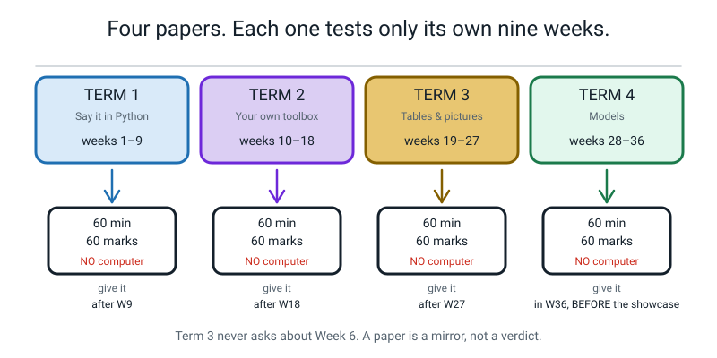
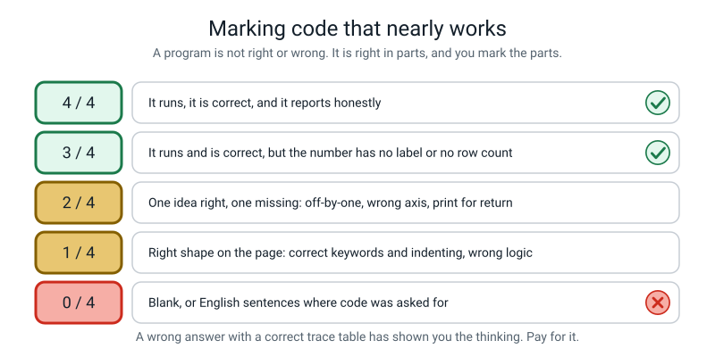

# ✅ Assessments — How To Use The Four Term Tests

[⬅ Course home](../README.md) · [Term 1](term-1-test.md) · [Term 2](term-2-test.md) · [Term 3](term-3-test.md) · [Term 4](term-4-test.md) · [Projects](../projects/project-ideas.md) · [Capstone](../projects/capstone.md)

---

> ### In one sentence
>
> **These four papers are mirrors, not verdicts — their whole job is to show you which week did not
> stick, in time to do something about it.**

---

## 🧑‍🏫 For the teacher, in two minutes

**You do not need to know Python to run or mark these tests.** That is not a slogan; it is a design
constraint, and here is how it is met.

1. There are **four papers**, one per nine-week term. Each is **60 minutes** and **60 marks**.
2. Each paper only tests **its own nine weeks**. Term 3 never asks about Week 6, and nothing from after
   the term appears anywhere. This has been checked against the
   [syntax ladder](../README.md#-the-syntax-ladder) line by line.
3. Every paper has the same five sections:

   | | Section | Marks | What it is really testing |
   |---|---|:--:|---|
   | 🅰️ | 12 multiple choice | 12 | Do they know what the words mean |
   | 🅱️ | 6 "what does this print?" | 18 | **Can they run code in their head** |
   | 🅲 | 4 "find and fix the bug" | 12 | **Can they read a traceback** |
   | 🅳 | 3 "write the code" | 12 | Can they produce working Python from a spec |
   | 🅴 | 1 extended question | 6 | Can they read a result honestly, or spot a data harm |

4. **Every code block on every paper, and in every answer key, was actually run** on Python 3.10 with
   numpy, pandas, matplotlib and scikit-learn, and the real output pasted in. Nothing is estimated. So
   when a student says *"but it prints 40.0!"* you can say, with total confidence, *"no — it prints
   40.00, and here is the run."*
5. Every paper carries its own **marking scheme** and a **full answer key** in collapsible `<details>`
   blocks. The key explains **why each wrong option was tempting** and **decodes every error message
   into plain English**, so you can answer "but why isn't it (c)?" and "what does *concatenate* mean?"
   with no preparation.
6. The extended question is marked with a **4-level rubric**, and every paper includes a **model level-4
   answer** so you can see the ceiling.

> **⚠️ Watch out — read this before the first paper.** These are **practice** tests. Nothing is gated on
> them. A student who scores 34 out of 60 and then goes back and redoes Week 24 has had a better term
> than one who scores 52 and closes the folder. Say that out loud before you hand the first one out, and
> mean it.

---

## ⛔ Why there is no computer allowed

This is the one instruction students argue about, so here is the answer to give them.

**A programmer who can only find out what code does by running it cannot debug.** Debugging *is*
predicting: you look at a line, you say "this should give me 15", you run it, you get 12, and the gap
between those two numbers is the bug. If you have no prediction, there is no gap, and you are reduced to
changing things at random until the error goes away — which is how people spend four hours on a
five-minute problem.

Section B exists to build the prediction habit. Section C exists to build the reading habit. Both
collapse the moment there is a keyboard in the room.

**Two practical consequences:**

- **Set a real timer and let it be quiet.** These papers are demanding to read. Sixty minutes with no
  interruption is the whole design.
- **Trace tables and drawings on the rough paper EARN MARKS.** That is written into every marking
  scheme: correct working with a wrong final answer is worth 1 mark of the 3, every time. Tell them
  before they start. It changes how they behave for the whole hour.

---

## 📅 When to give each one



*Figure A.1 — Each test covers only its own nine weeks. Give it in the first lesson after the term ends.*

| Test | Covers | Give it | Why then |
|---|---|---|---|
| [**Term 1**](term-1-test.md) | Weeks 1–9 | The lesson after Week 9 | Week 9 is already a checkpoint week, so the paper lands on a review rather than cold. And Week 9 introduces `def`, so a paper the week after can finally ask a function question |
| [**Term 2**](term-2-test.md) | Weeks 10–18 | The lesson after Week 18 | Week 18 rewrites eight Term-1 loops as array one-liners. The paper checks whether the *why* survived the fun |
| [**Term 3**](term-3-test.md) | Weeks 19–27 | The lesson after Week 27 | This is the arithmetic-heavy paper and it **must** be sat before the capstone build starts, because D2 and E1 are exactly what goes wrong in a capstone |
| [**Term 4**](term-4-test.md) | Weeks 28–36 | Any time in Week 36, **before** the showcase | Week 36 already schedules an assessment slot |

**Three scheduling notes that matter more than they look:**

- **The paper always comes before the applause.** In Week 36, sit the paper *before* the showcase. A
  student who has just been clapped at by two adults will not mark themselves honestly. That is not a
  character flaw, it is just how people work, so design around it.
- **Do not give a test in the same sitting as a lab.** These weeks already run 60–75 minutes. A
  60-minute paper needs its own slot, or the whole of a lesson with nothing else in it.
- **Do not give Term 3's paper and Week 29 in the same fortnight.** Term 3's paper ends with a chart that
  lies. Week 29 ends with a student proud of a model that scored well. Those two need space between them,
  for the same reason the course README warns about weeks 29 and 33.

---

## 🕐 Running the test — the whole procedure

**The day before:**

1. Print the paper **up to and including Section E**, and **stop there.** The Marking Scheme and the
   Answer Key are on the same file, below the `---` `---` divider. Do not photocopy past it.
2. Print two sheets of blank paper per student. Actual blank paper, not lined. Trace tables want space.
3. Read the paper yourself, all the way through, with the answer key open. Twenty minutes. You are not
   learning Python; you are finding out which two questions your student will complain about, so you can
   be ready to say "answer the part you do understand" instead of improvising.

**On the day:**

```
   ┌──────────────────────────────────────────────────────────────────────┐
   │  THE FIVE-MINUTE SET-UP                                              │
   │                                                                      │
   │  1.  Laptops closed and pushed to the far side of the room.          │
   │      Phones in a different room. This is not a trust issue; it is    │
   │      an "I could just check" issue, and it is irresistible.          │
   │                                                                      │
   │  2.  Read the "WHAT IS ALLOWED" box out loud, including the reason   │
   │      for the no-computer rule. Twenty seconds.                       │
   │                                                                      │
   │  3.  Say these two sentences and then stop talking:                  │
   │        "If you get stuck, answer the part you DO understand."        │
   │        "Your rough paper earns marks. Show me the working even       │
   │         when you know the answer is wrong."                          │
   │                                                                      │
   │  4.  Set a visible timer for 60 minutes. Say "twenty minutes left"   │
   │      once, at twenty minutes left, and nothing else.                 │
   │                                                                      │
   │  5.  Collect the rough paper WITH the paper. It is evidence and it   │
   │      is worth marks.                                                 │
   └──────────────────────────────────────────────────────────────────────┘
```

**During:** say nothing. A student looking stuck is genuinely hard to watch, and a stuck question is
data. The one thing you may repeat, as often as needed, is *"answer the part you do understand."*

**Afterwards, in the same lesson if you can:** hand back the papers unmarked and mark **Section A out
loud, together**, straight from the `<details>` blocks. They are written to be read aloud to a child by
an adult who has never programmed. That fifteen minutes is worth more than anything you will do alone
with a red pen.

---

## 🧮 How to mark it

### The one rule that governs all of it

> **A program is not right or wrong. It is right in parts, and you mark the parts.**



*Figure A.2 — The partial-credit ladder for a 4-mark "write the code" question. Almost nobody scores 0 and almost nobody scores 4. The interesting marking all happens in the middle.*

### Section A — 12 marks

One mark per question, no half marks, two letters circled scores zero. Use the table at the top of each
paper's Marking Scheme; it lists the answer and the week for all twelve.

Then do the thing that actually matters: **count the "not sure" notes.** A right answer marked "not
sure" is a lucky guess, and a lucky guess is a hole that walks into the next term with you. Treat those
questions as if they were wrong when you fill in the remediation table.

### Section B — 18 marks · "what does this print?"

**Three marks per question, on this ladder. It is the same on all four papers.**

| | Marks |
|---|:--:|
| Every line correct, in the right order, with the right punctuation and decimal places | **3** |
| One line wrong, everything else right | **2** |
| Two lines wrong, or the right values in the wrong order | **1** |
| A visible trace table or drawing with correct intermediate values, even if the final answer is wrong | **1, always** |
| Nothing usable | 0 |

**Four habits, and the first three are where marking goes wrong:**

| Habit | Why |
|---|---|
| **Be strict about punctuation that carries meaning.** | A list prints `[45, 62]` **with commas**. A numpy array prints `[45 62]` **without**. Telling those apart at a glance is a taught skill (Week 17). A student who writes commas round array output has not got it. Take the line. |
| **Be strict about decimal places.** | `40.00` and `40.0` are different answers. `:.2f` means *exactly two*, and that is Week 3's whole lesson. Same for `4875.0` vs `4875` — a mean is a division and division gives a float. |
| **Be generous about whitespace.** | Real numpy pads columns so they line up: `[ 8400 10200  7600]`. A student writing single spaces has the answer right. **Give the mark.** |
| **Require the `dtype:` line on pandas output.** | It is worth the third mark, and it is where the `float64`-instead-of-`int64` bug announces itself. This is deliberately fussy and it is the reason a student will one day understand why their whole-number column is printing decimals. |

### Section C — 12 marks · "find and fix the bug"

**Three marks per bug, and the three are independent:**

| | | Marks |
|---|---|:--:|
| **1** | **The meaning** — what Python is telling you, in their own words | 1 |
| **2** | **The line** — which line has to change | 1 |
| **3** | **The fix** — the corrected line, written out in full | 1 |

A student can explain the error beautifully, point at the wrong line, and still score 2. Mark each part
on its own.

**Three rules that keep this honest:**

1. **"It's a typo" or "it's spelled wrong" scores 0 for part 1.** The mark is for saying what Python
   *did* — went looking for a name, failed to find one. That mental model is what lets them debug the
   harder version, where the name is spelled perfectly and the box was made somewhere else.
2. **From Term 2 onwards, the line that crashes is often not the line that is wrong.** Term 2's C4,
   Term 3's C1 and C4, Term 4's C3 are all this. The mark is for pointing at the *cause*. If a student
   names only the crash line, ask them one question — *"is that line doing anything unreasonable?"* —
   and mark what they say next.
3. **Withhold the fix mark for any fix that makes the error go away by inventing or deleting data.**
   Padding a short array with a zero. Deleting a row so two lengths match. Filling a missing age with 0.
   Each of those runs clean and each of them lies. The honest fix is: go and find out, or drop the row
   **and write it in the cleaning log**. This is the most important marking rule on this page and it is
   the one most likely to feel harsh.

### Section D — 12 marks · "write the code"

**Four marks per question, awarded against four named rows** listed in each paper's marking scheme.
Award each row on its own merits. Do not mark holistically, and do not run the code — you do not need to.

**Never withhold a row because a different row failed.** A student whose `range` is off by one but whose
accumulator, counter and formatting are all correct has earned **3 of 4**. That is the right mark, and it
is the mark that keeps them working.

**Things that are always full marks, whatever else happened:**

- Different but sensible variable names.
- A different but equivalent construction — an explicit loop where a comprehension was expected, `steps - 5000`
  instead of an array of 5000s, `>=` with a reversed chain instead of `<`.
- Better code than the model answer. It happens. Say so out loud.

**Things that always cost the row, however tempting:**

- `print` where `return` was asked for. *"Your function told the screen; it did not tell the program."*
- A group average with no group size. Week 15 and Week 24 both made this a rule, not a preference.
- A score with no words saying **which rows** it was measured on. That is the entire point of Term 4.
- A chart missing any of its three labels, or a title that names a topic instead of stating a finding.

### Section E — 6 marks · the extended question

Do **not** count points. Read the whole answer, decide which of the four levels it best fits, then
convert:

| Level | Marks | What it means |
|---|:--:|---|
| **4 · Exceptional** | 6 | Could be handed to the adult in the scenario unchanged |
| **3 · Proficient** | 5 | A paragraph a stranger could follow, main idea correct |
| **2 · Developing** | 3–4 | Right instincts, no mechanism and no arithmetic |
| **1 · Beginning** | 1–2 | A fragment, or a feeling with no reasoning |
| — | 0 | Nothing usable |

A level 3 does **not** require every rubric row at level 3. Take the best overall fit. A student who
nails one row brilliantly and misses another is a 3, not a 2.

**And in Terms 3 and 4, the arithmetic is not optional.** "The gap is small" is level 2. "The gap is
`74.4 − 72.9 = 1.5` marks, which is 1.5 out of 100" is level 3. The division has to be on the page.

---

## 📊 What the scores mean

Each paper is out of 60. Same bands on all four.

| Score | Band | What it actually means | What to do next |
|:--:|---|---|---|
| **0–23** | 🔴 Not yet | The code has not been typed. Almost always the *labs* were read rather than done. You cannot learn to program by reading, any more than you can learn to swim by reading | **Redo the term's two hands-on weeks** — the 🟩 lab and the 🟨 project, at the keyboard, from a blank file. Not the chapters. Then re-sit Sections B and C only |
| **24–35** | 🟠 Can read it, cannot write it | Section A is fine and Section D is thin. They recognise code; they cannot yet produce it. This is the commonest band and it is completely normal in Terms 1 and 2 | Use the remediation table below. Pick the **two** weakest weeks and retype their `💻 Type This` sections **from the spec, without looking**. Then re-sit Section D only |
| **36–47** | 🟢 Solid | The term worked. There will be one or two specific holes and the table below will name them | Fix the **one** weakest week. Carry on. Take a project from [project-ideas.md](../projects/project-ideas.md) |
| **48–60** | 🔵 Could teach it | Genuinely strong, including the extended question | Carry on, and pick a ⭐⭐⭐ project. Then hand them the answer key and let them mark somebody else's paper — it is the fastest way to make a strong student stronger |

> **The number is not the result. What happens next is the result.** A **29** that turns into *"I'm
> redoing Week 24's Mess Detective this weekend"* is a better term than a **51** that turns into
> nothing at all.

**Three other readings of the same numbers, each more useful than the total:**

```
   Section A high, Sections C+D low   →  learned the words, not the thinking.
                                        Fix: retype worked examples from the spec.
                                        Reading more chapters will not help.

   Section A low, Sections C+D high   →  can program, has not learned the names.
                                        Fix: the 📓 vocabulary boxes. This is the
                                        easier problem, and much rarer.

   Section C near zero, rest fine     →  NOBODY HAS EVER SAT WITH THEM WHILE THEY
                                        READ A TRACEBACK OUT LOUD.
                                        Fix: do that, this week, once. It is the
                                        single highest-value 20 minutes in Level 2.

   Arithmetic marks lost everywhere   →  not a maths problem; a WORKING problem.
                                        Fix: one rule — never write an answer
                                        without the division above it.
```

> **🧑‍🏫 The row to take most seriously is the third one.** A student who lost most of Section C does not
> have four separate problems. They have one problem: no adult has ever read a traceback aloud with
> them. Figure T1.2 on the Term 1 paper is the whole method — last line first, then the line number,
> then your own code. Twenty minutes fixes it, and it fixes it permanently.

---

## 🔧 The remediation table

Find the question they lost the mark on. Revisit that week. **One week at a time.** Nine weeks of
revision means nothing gets fixed.

The **"do this specifically"** column names an *activity*, never a chapter. Re-reading was never the
problem.

### Term 1 — Weeks 1–9

| Lost the mark on | The idea | Revisit | Do this specifically |
|---|---|---|---|
| A1, A2, D1 | `print`, quotes turning arithmetic off, comments, `"=" * 20` | **Week 1** | Retype all three Week-1 files by hand, no pasting, and cause three fresh errors on purpose |
| A3, A4, A5, B1, **C2** | Variables, types, `int()`, what `+` does to text vs numbers | **Week 2** | Redo the `"5" + 5` investigation and write the explanation in their own words, out loud, to you |
| A6, A7, B2, D1 | f-strings, `:.2f`, `//` and `%` | **Week 3** | Rebuild `receipt.py` from the spec with no reference, then check `3 × 5 + 2 = 17` by hand |
| A8, **C2**, D3 | `input()` is always text; converting at the door | **Week 4** | Reproduce the silent `1212` bug deliberately, photograph the screen, then fix it |
| A9, A10, **C1**, **C3** | `==` vs `=`, `if`/`else`, indentation owning the block | **Week 5** | Predict eight booleans on paper before running any of them; explain every miss |
| A11, **B3**, D3, **E1** | `elif` chains stop at the first `True`; `and` / `or` / `not` | **Week 6** | Find why the grade chain gives everyone a B, reorder it, prove the fix with a 5-value table |
| A12, **B4**, **C4**, D2 | `for`, `range` with a step, the accumulator | **Week 7** | Write the `range` values out longhand for six different calls before running any of them |
| **B5** | `while`, `break`, `continue`, and trace tables | **Week 8** | Trace `guess.py` on paper for three fake inputs, then run it and compare line by line |
| **B6**, D3 | `def`, calling, and `return` vs `print` | **Week 9** | Take one Week-8 file, turn a repeated block into a function, and prove the output is identical |
| Section C overall | **Reading a traceback.** Last line first | **Weeks 1–9, the Bug Log** | Read all of their own Bug Log entries aloud to an adult, one at a time |

### Term 2 — Weeks 10–18

| Lost the mark on | The idea | Revisit | Do this specifically |
|---|---|---|---|
| A1, A2, **B1**, D1 | Parameters, defaults, keyword args, `None` from a missing `return` | **Week 10** | Find the missing-`return` bug again, then write the two-column *print vs return* table from memory |
| A3, A4, **B2**, **C1** | Lists, index 0, `len − 1`, `.append` returning `None` | **Week 11** | Cause an `IndexError` on purpose, then cause the silent version (`range(1, len(x))`) and compare |
| A5, A6, **B3**, **C3** | Slicing, `sorted` vs `.sort`, importing your own file | **Week 12** | Take the ruler out of the tin: rename `stats.py` and read both errors that result |
| A7, **B4**, **C2** | Dictionaries, `KeyError`, `.get` with a fallback | **Week 13** | Cause a `KeyError`, then fix it **two** ways, and write one sentence on when each is honest |
| A8, **B4**, **B5**, D2 | `items()`, `in`, comprehensions, `enumerate` from 0 | **Week 14** | Rewrite three of their own loops as comprehensions and prove the output is byte-identical |
| A9, **B5**, D2 | Filtering, `sum`, `max(d, key=d.get)`, reporting the row count | **Week 15** | Run `max(counts)` and `max(counts, key=counts.get)` on their own data and explain the difference |
| A10, **E1** | CSV round trip; everything comes back as **text** | **Week 16** | Save and reload their own 30 records, then add two `sleep_hours` together and watch it join |
| A11, **B6**, **C4** | `np.array`, `.shape`, `.dtype` | **Week 17** | Predict the shape and dtype of six arrays before running anything; explain every miss |
| A12, **B6**, D3 | Elementwise maths, `arange`, `zeros`, no loops | **Week 18** | Redo three of the eight loop rewrites, and check each output character by character |

### Term 3 — Weeks 19–27

| Lost the mark on | The idea | Revisit | Do this specifically |
|---|---|---|---|
| A1, A2, **B1**, **C1** | `arr[r, c]`, `arr[:, 0]`, `axis=0` down vs `axis=1` across | **Week 19** | The rainfall grid again, on graph paper, with row 1 hand-checked before any code runs |
| A3, **B2** | Masks: look first, use second; the answer is shorter than the question | **Week 20** | Print the mask on its own before every use, for six different comparisons |
| A4, A5, **B3**, D1 | DataFrames, the index, `shape`, `head`, `info` | **Week 21** | Build a fresh 10-row frame about their own week and write out what every line of `info()` says |
| A6, A7, **B4**, **C2**, D1 | `loc` by label, `iloc` by position, boolean filters, `sort_values` | **Week 22** | The `loc`/`iloc` trap on a custom index — same call, two different rows, explained in writing |
| A8, A9, **B5**, **C3**, D2 | `isna().sum()`, `fillna` **with a reason**, `astype` | **Week 23** | Repair the broken 12-row table again and produce the numbered cleaning log, reasons and all |
| A10, **B5**, **B6**, D2 | `drop_duplicates`, `.str` tidying, derived columns, `groupby` with counts | **Week 24** | Run Mess Detective's pipeline in the **wrong** order on purpose and compare both group means |
| A11, **C4**, D3 | `fig, ax`, three labels, `savefig`, a title that states a finding | **Week 25** | Rewrite the titles of all three of their charts so each one states a checkable finding |
| A12, D3 | The question chooses the chart; `value_counts()` before `bar` | **Week 26** | Do `ax.bar(df["club"], df["score"])` on purpose, look at the 38 bars, then fix it |
| A12, **B6**, **E1** | Truncated axes, `set_ylim`, `corr` is not a cause | **Week 27** | Rebuild the lie-and-fix pair and write out the arithmetic of the exaggeration |

### Term 4 — Weeks 28–36

| Lost the mark on | The idea | Revisit | Do this specifically |
|---|---|---|---|
| A1, A2, A3, **B1**, **B2** | `X` and `y`, double brackets, shapes, the distance formula | **Week 28** | Compute one distance on paper, then in numpy, and match it to 2 dp |
| A4, A5, A6, **B3**, **C1**, D1 | kNN, `fit`/`predict`, the split, `random_state`, **which score you may quote** | **Week 29** | The physical deck of cards, cut once. Then run the same model with ten seeds and write down the spread |
| A7, A8, **B4**, D2 | Accuracy, the confusion matrix, scaling on train only, `stratify` | **Week 30** | Draw a confusion matrix by hand from a printed prediction list, then check it against the code |
| A9, **B5**, **C2**, D2 | Trees, `max_depth`, `export_text`, `feature_importances_` | **Week 31** | Read a depth-3 tree's rules aloud as English sentences, then find one row it gets wrong |
| A10, A11, **B6**, **C3**, **C4**, D3 | `LinearRegression`, slope in real units, MAE in the target's units, R² | **Week 32** | Fit a line by hand through six points with a ruler, then with sklearn, and compare `m` and `c` |
| A12, **C4**, **E1** | RMSE, the depth curve, **the overfitting cliff** | **Week 33** | Rebuild the depth curve and mark the parting point with `axvline`. This is the most important lesson in the level |
| **E1** | Reading a results table honestly and writing the one sentence | **Week 34–35** | Rewrite their own capstone results table so every number names the rows it came from |
| **E1** writing | Explaining it to a real adult | **Week 36** | Deliver the five-minute demo to somebody who has never seen it |

---

## 🪞 A one-page record sheet

Photocopy this, one per test. Filling it in takes five minutes and is worth more than the score.

```
   ┌───────────────────────────────────────────────────────────────────────┐
   │  LEVEL 2 · TERM ____ TEST        date __________                      │
   │                                                                       │
   │  Section A  ____ / 12      "not sure" notes:  ____                    │
   │  Section B  ____ / 18      trace tables drawn:  ____ of 6             │
   │  Section C  ____ / 12      of these, MEANING marks:  ____ of 4        │
   │  Section D  ____ / 12                                                 │
   │  Section E  ____ /  6      level awarded:  1   2   3   4              │
   │  ────────────────────                                                 │
   │  TOTAL      ____ / 60      band:  🔴   🟠   🟢   🔵                     │
   │                                                                       │
   │  THE THREE QUESTIONS I GOT WRONG THAT ANNOYED ME MOST                 │
   │     1. Q____   because ______________________________________         │
   │     2. Q____   because ______________________________________         │
   │     3. Q____   because ______________________________________         │
   │                                                                       │
   │  THE ERROR MESSAGE I STILL CANNOT EXPLAIN:                            │
   │     ________________________________________________________          │
   │                                                                       │
   │  THE ONE WEEK I AM GOING BACK TO:  Week ____                          │
   │  WHAT I WILL ACTUALLY DO (an activity, not "revise"):                  │
   │     ________________________________________________________          │
   │  BY WHEN:  __________                                                 │
   │                                                                       │
   │  One thing I can write in Python today that I could not write         │
   │  nine weeks ago:                                                      │
   │     ________________________________________________________          │
   └───────────────────────────────────────────────────────────────────────┘
```

**Two boxes on that sheet are unusual, and both are deliberate.**

- **"trace tables drawn: ___ of 6."** Count them. A student scoring 11 out of 18 on Section B *with*
  six trace tables is in a completely different position from one scoring 11 with none. The first has a
  method and needs practice. The second is guessing, and practice will not help until the method
  arrives.
- **"of these, MEANING marks: ___ of 4."** The Section C meaning marks are the single best predictor of
  whether a student will be able to work alone next term. If they scored 4 lines and 4 fixes but 1
  meaning, they are pattern-matching fixes they do not understand, and that stops working in about
  three weeks.

---

## ⚠️ Six mistakes teachers make with these papers

| Mistake | Why it happens | Do this instead |
|---|---|---|
| **Letting the laptop stay open** | It feels cruel to make a child predict output they could check in four seconds | Close it. The predicting **is** the skill. Read the reason out loud so it does not feel arbitrary |
| **Marking it alone and handing back a number** | It is faster, and it feels like proper marking | Mark Section A **out loud together**. The `<details>` blocks are written to be read aloud by an adult who does not know Python |
| **Giving 0 for code that nearly works** | The program did not run, so it feels like a fail | Use the four named rows in the marking scheme. Off-by-one plus everything else right is **3 of 4**. Figure A.2 is on this page for a reason |
| **Accepting a fix that deletes data** | It makes the error go away, and the error going away looks like understanding | Term 2 C4, Term 3 C3, Term 4 C3 all have a tempting dishonest fix. Withhold the mark and name why. This is the most important marking decision in the level |
| **Reteaching all nine weeks** | It feels thorough | Pick **one** week from the remediation table. Nine weeks of revision means nothing gets fixed |
| **Skipping Section E because it is slow to mark** | It is 6 marks and takes ten minutes to read properly | Section E is the only part that looks like real work. If you must cut something, cut Section A and keep E |

---

## ❓ Questions a teacher actually asks

<details>
<summary><b>"I don't understand the Python in one of these questions myself. What do I do?"</b></summary>

Open the answer key for that question. Every one is written for an adult who has never programmed, and:

- every **wrong option** is explained, including *why it was tempting*
- every **error message is decoded into plain English** — "`concatenate` means join end to end, `str` is
  text, `int` is a whole number, so the message says: I can only join text to text"
- every **code block was actually run**, with its real output pasted underneath

If you want a second explanation in different words, the week's teacher-guide file has the same idea with
a worked example and an analogy. `teacher-guide/week-11.md` for lists, `week-23.md` for cleaning,
`week-33.md` for overfitting.

**And there is a stronger move available to you.** Say to the student: *"I don't know this one. Read me
the answer key and tell me whether you believe it."* That is not a failure of authority. It is the most
honest thing that will happen in the lesson, and a 12-year-old explaining `None` to an adult has learned
it permanently.
</details>

<details>
<summary><b>"Can they use their own .py files? They wrote them."</b></summary>

No, and here is the reason to give them: *code you can copy is not code you can write.*

Every Section D question is deliberately a small variation on something they built in class — the pizza
receipt, the stats toolkit, the filter, the full model cycle. If the file is open they will copy it and
learn nothing. If it is closed they will reconstruct it, get one thing wrong, and find out exactly which
part they had memorised rather than understood.

Afterwards, absolutely. Comparing their exam answer against the file they wrote in Week 3 is one of the
best ten minutes available.
</details>

<details>
<summary><b>"My student wrote something that works but isn't what the answer key says. Full marks?"</b></summary>

**Almost always yes**, and say so out loud, because it matters more than the mark.

Full marks, no discussion:

| They wrote | Key says | Verdict |
|---|---|---|
| `steps - 5000` | an array of five 5000s | ✅ better. Say so |
| an explicit loop with `.append` | a list comprehension | ✅ same result, more lines |
| `if age >= 60: return 80` first, chain reversed | `if age < 5` chain | ✅ if the boundaries are right |
| `range(12, 26, 3)` | `range(12, 25, 3)` | ✅ identical values. Better understanding |
| `counts.plot.bar(ax=ax)` | `ax.bar(counts.index, counts.values)` | ✅ works — but ask where they found it, because this course never taught it |

**The two exceptions**, and both are about the *idea* rather than the code:

1. `//` where `/` was needed, when the numbers happen to divide exactly. `480 // 8` is 60 and correct by
   luck. Show them `470 // 8` = 58 when the truth is 58.75.
2. `is` instead of `==`. It happens to work on small numbers and it means something else entirely.

**And if they used syntax from a later week** — a `lambda`, a `try`/`except`, an f-string trick — do not
punish it and do not celebrate it. Say: *"Nice. Where did you find that? We meet it properly in Week 15.
Can you explain it to me?"* If they can explain it, they have earned it. If they cannot, they have found
the most useful thing that will happen to them all term.
</details>

<details>
<summary><b>"Section B takes them forever. Are these papers too long?"</b></summary>

Sixty minutes for 60 marks is one minute a mark, and it has been paced so that Section B takes about 18
minutes and Section C about 12. If a student is spending 35 minutes on Section B, the diagnosis is not
"the paper is long" — it is **no trace table**.

Watch for it directly: a student running code in their head with no paper is holding four values in
working memory and re-deriving them for every line. It is exhausting and it is slow and it is why they
run out of time. The fix is one sheet of paper and thirty seconds of instruction, and it makes Section B
about twice as fast **and** more accurate.

If you genuinely need to shorten a paper for a student who needs more time, cut **Section A**. Twelve
recognition questions are the least informative twelve marks on the page.
</details>

<details>
<summary><b>"Should I let them retake it?"</b></summary>

Not the whole paper, and not soon. Do this instead:

1. Mark it, fill in the record sheet, pick **one** week from the remediation table.
2. They do the named activity — an activity, at the keyboard, not a re-read.
3. **Two weeks later**, give them only the sections they lost most in. Section C and D of the same paper
   is a 25-minute re-sit and it tells you everything.

A full immediate retake mostly measures how well they remember the paper. A partial re-sit two weeks
later measures whether the fix worked, which is the only thing you wanted to know.
</details>

<details>
<summary><b>"How do these relate to the reference-module assessment and the capstone?"</b></summary>

Three different instruments, three different jobs:

| | What it is | When | What it measures |
|---|---|---|---|
| **These four papers** | 60 min, 60 marks, no computer, one term each | after weeks 9, 18, 27 and in week 36 | Can they read and write Python **in their head** |
| [**The capstone**](../projects/capstone.md) | 3 weeks, a real question, their own 100 rows | weeks 34–36 | Can they do the whole job, badly-behaved data and all |
| [**assessment.md**](../../assessment.md) | The Level 2 reference assessment, from the module set | any time after week 33 | Whether the level as a whole landed, in the module set's own format |

**Use the four papers to find holes, and the capstone to find out whether it was worth it.** They are not
in competition and no student should sit all three in the same fortnight.
</details>

<details>
<summary><b>"My student says the answer key is wrong."</b></summary>

Take it seriously and check, in this order:

1. **Read the output block in the key.** Every one is a real run. If they disagree with it, one of you
   has misread something and it is usually a decimal place or a comma.
2. **Check their Python version.** These papers were run on **Python 3.10**. Two things genuinely differ
   on other versions: older Pythons do not add `Did you mean: 'total'?` to a `NameError`, and pandas 2.x
   labels `value_counts()` output `Name: count` where pandas 1.5 labels it `Name: house`. Neither changes
   any answer; both change the exact characters. **Give the mark.**
3. **If it still disagrees, they win.** Write it in the margin, and tell them that finding a mistake in a
   textbook is a better afternoon than getting the question right.
</details>

<details>
<summary><b>"They lost every mark in Section C on all four papers. What do I actually do?"</b></summary>

One thing, once, and it takes twenty minutes.

Sit next to them. Open any file with an error in it — one of their own, ideally, from the Bug Log. Then
**you read the traceback out loud** while they point at the parts, in this order:

```
   1.  the LAST line          →  "what kind of problem is this?"
   2.  the line NUMBER        →  "where do I look?"
   3.  your own quoted code   →  "what is on that line?"
   4.  everything else        →  ignore it. If the path says site-packages,
                                 it is the library's machinery, not your bug.
```

Then swap: they read the next one to you.

That is the whole intervention. Figure T1.2 on the Term 1 paper is a picture of it. Nothing else in this
level pays back twenty minutes like that does, and no amount of re-reading chapters substitutes for it,
because reading a traceback is a **performance**, not a fact.
</details>

---

## 🔑 The Six Things This Page Is Really Saying

1. **Nothing is gated on these papers.** They exist to find holes early enough to fix them.
2. **No computer, and there is a reason.** Predicting output is debugging. A keyboard removes the skill
   being measured.
3. **Mark the parts, not the program.** Four named rows per Section D question, and a trace table is
   always worth a mark.
4. **A fix that invents or deletes data is not a fix.** This is the marking rule that carries the most
   weight in Level 2, and it is the one that shows up again in every capstone.
5. **Every band ends in an instruction, and every remediation row names an activity.** Re-reading was
   never the problem.
6. **If Section C is empty, read a traceback aloud with them this week.** It is the highest-value twenty
   minutes in the whole level.

---

[⬅ Course home](../README.md) · [Term 1](term-1-test.md) · [Term 2](term-2-test.md) · [Term 3](term-3-test.md) · [Term 4](term-4-test.md) · [Projects ➡](../projects/project-ideas.md)
