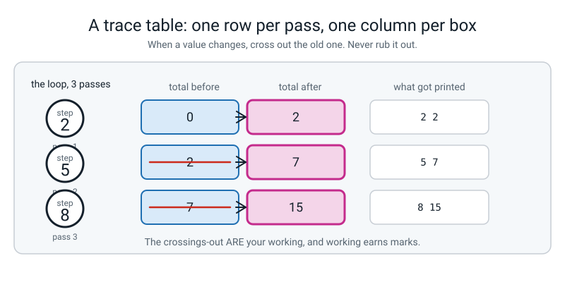
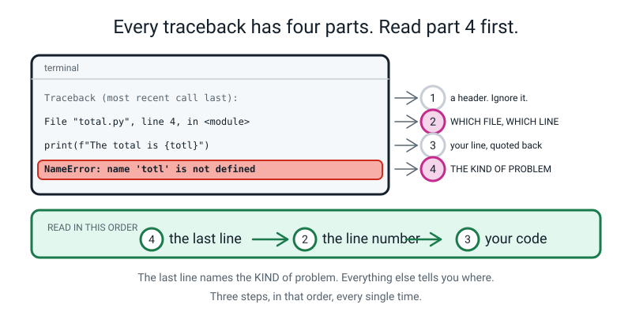

# 📝 Term 1 Practice Test — Weeks 1–9

[⬅ Assessments home](README.md) · [Course home](../README.md) · [Term 2 test ➡](term-2-test.md)

---

```
   ┌──────────────────────────────────────────────────────────────────────┐
   │                                                                      │
   │   AI ACADEMY · LEVEL 2 BUILDER                                       │
   │   TERM 1 PRACTICE TEST — Say It In Python                            │
   │   Covers Weeks 1–9. Nothing later appears anywhere on this paper.    │
   │                                                                      │
   │   TIME ALLOWED   60 minutes                                          │
   │   TOTAL MARKS    60                                                  │
   │                                                                      │
   │   Section A   12 multiple choice        1 mark each     12 marks     │
   │   Section B    6 "what does this print" 3 marks each    18 marks     │
   │   Section C    4 find-and-fix-the-bug   3 marks each    12 marks     │
   │   Section D    3 write-the-code         4 marks each    12 marks     │
   │   Section E    1 extended question      6 marks          6 marks     │
   │                                                                      │
   │   ⛔  NO COMPUTER. THIS PAPER IS DONE WITH A PENCIL.                 │
   │                                                                      │
   │      That is not meanness. A programmer who can only find out what   │
   │      code does by running it is a programmer who cannot debug.       │
   │      Today you run the code in your head, on paper, like a person.   │
   │                                                                      │
   │   INSTRUCTIONS                                                       │
   │   · Write in pencil. Answer every question.                          │
   │   · Section A: circle ONE letter. A guess costs nothing.             │
   │   · If you guess, write "not sure" beside it. This matters even      │
   │     when the guess turns out right.                                  │
   │   · Section B: write EVERY line of output, on separate lines, in     │
   │     order. Show your trace table if it helps — it earns marks.       │
   │   · Section C: you must do THREE things — say what Python is         │
   │     telling you, point at the line, and write the fixed line.        │
   │   · Section D: indentation counts. Four spaces. Every time.          │
   │   · Section E: a paragraph, not a list.                              │
   │                                                                      │
   │   WHAT IS ALLOWED                                                    │
   │   ✅  Pencil, pen, eraser, ruler                                     │
   │   ✅  Two blank sheets of rough paper — use them for trace tables    │
   │   ✅  A calculator for arithmetic only                               │
   │   ❌  A COMPUTER. No Python, no phone, no editor, no terminal.       │
   │   ❌  The student guide, the workbook, the glossary, your notes      │
   │   ❌  Your own week-1-to-9 .py files                                 │
   │   ❌  A search engine, a chatbot, another person                     │
   │                                                                      │
   └──────────────────────────────────────────────────────────────────────┘
```

> **🧑‍🏫 Teacher, read this once before you hand the paper out.** You do not need to know any Python to
> run this test. Set a timer for 60 minutes. Read the "what is allowed" box out loud — especially the
> **no computer** line, and the reason for it. Then say nothing until the timer goes. The full answer
> key at the bottom of this file contains the **real output of every code block on this paper**, run on
> Python 3.10. Students must not see that page. Marking guidance is in [assessments/README.md](README.md).

---

## 📐 The two skills this paper is really testing

Before you start, look at these two pictures. They are the two techniques you need, and they are worth
more marks than anything you can memorise.



*Figure T1.1 — How to answer a "what does this print?" question. One column per box, one row per pass. When a box changes, cross out the old value — do not rub it out. The crossings-out are your working, and working earns marks.*



*Figure T1.2 — Every traceback has four parts. Read the **last line first**: it names the kind of problem. Then read the line number. Then look at the line of your code that Python printed back at you.*

---

# 🅰️ Section A — Multiple Choice

*12 questions · 1 mark each · circle ONE letter · the week each question comes from is in brackets*

---

**A1.** [W1] What does this line print?

```python
print(3 + 4, "3 + 4")
```

- (a) `7 7`
- (b) `3 + 4 3 + 4`
- (c) `7 3 + 4`
- (d) `73 + 4`

---

**A2.** [W1] Which statement about a `#` comment is true?

- (a) Python runs it more slowly than a normal line
- (b) Python ignores it completely — it is there for humans
- (c) It prints to the screen in a different colour
- (d) You need one on every line or Python complains

---

**A3.** [W2] After these two lines, what is in the box called `score`?

```python
score = 7
score = score + 3
```

- (a) `7`, because the box was already filled
- (b) `10`
- (c) `7 + 3` stored as text
- (d) Nothing — you cannot use `score` on both sides

---

**A4.** [W2] `print(type(9 / 3))` prints `<class 'float'>`. Why is it not `<class 'int'>`?

- (a) Because 9 and 3 are both odd numbers
- (b) Because `type()` always reports `float`
- (c) Because `/` in Python always hands back a decimal, even when the division comes out exact
- (d) Because the answer 3 is too small to be an `int`

---

**A5.** [W2] `age = "12"`. Which of these gives you the **number** twelve?

- (a) `int(age)`
- (b) `float("12")` and nothing else
- (c) `type(age)`
- (d) `age * 1`

---

**A6.** [W3] What does this print?

```python
print(f"{2 / 3:.2f}")
```

- (a) `0.666666666666`
- (b) `0.67`
- (c) `0.66`
- (d) `2/3`

---

**A7.** [W3] You have 17 slices and 5 friends. Which pair of expressions gives **whole slices each** and **slices left over**, in that order?

- (a) `17 / 5` and `17 * 5`
- (b) `17 % 5` and `17 // 5`
- (c) `17 // 5` and `17 % 5`
- (d) `17 ** 5` and `17 / 5`

---

**A8.** [W4] A program asks `answer = input("Age? ")` and the human types `12`. What is in `answer`?

- (a) The number 12
- (b) The text `"12"`
- (c) Nothing until you press Enter twice
- (d) The number 12, unless it is bigger than 100

---

**A9.** [W5] Which line is a **comparison** — a question with a `True` or `False` answer — and not an instruction to put something in a box?

- (a) `total = 50`
- (b) `total == 50`
- (c) `total += 50`
- (d) `total = total`

---

**A10.** [W5] A block is "owned by" an `if` because of…

- (a) the colon at the end of the `if` line
- (b) the word `then`
- (c) the indentation — the four spaces in front of it
- (d) the order the lines were typed

---

**A11.** [W6] An `if / elif / elif / else` chain is checked…

- (a) all at once, and the best match wins
- (b) top to bottom, stopping at the **first** condition that is `True`
- (c) bottom to top
- (d) top to bottom, and every `True` branch runs

---

**A12.** [W7] `for step in range(2, 11, 3):` — how many times does the block run?

- (a) 3 times
- (b) 4 times
- (c) 9 times
- (d) 11 times

---

# 🅱️ Section B — What Does This Print?

*6 questions · 3 marks each · 18 marks*

**Write every line of output, on its own line, in the right order.** If a program produces no output,
write **"no output"**. If it crashes, write the **name of the error** and say which line crashes.

> **💡 Use a trace table** (Figure T1.1). One column per variable. It is the difference between
> guessing and knowing, and the trace table itself earns marks even when the final answer is wrong.

---

**B1.** [W1, W2, W3]

```python
price = "40"
count = 3
print(price * count)
print(int(price) * count)
total = int(price) * count
print(f"Total: {total} rupees")
print(f"Each: {total / count:.2f}")
```

*Four lines of output. Line 1 is the one people get wrong.*

```
   1. ________________________________
   2. ________________________________
   3. ________________________________
   4. ________________________________
```

---

**B2.** [W3]

```python
slices = 17
friends = 5
print(slices / friends)
print(slices // friends)
print(slices % friends)
print(2 ** 5)
print(friends * "* ")
```

*Five lines of output.*

```
   1. ________________________________
   2. ________________________________
   3. ________________________________
   4. ________________________________
   5. ________________________________
```

---

**B3.** [W6]

```python
marks = 72
if marks > 90:
    print("A")
elif marks > 50:
    print("B")
elif marks > 70:
    print("C")
else:
    print("D")
print("Done")
```

*Two lines of output. Then answer the extra question.*

```
   1. ________________________________
   2. ________________________________
```

**A student says "72 is more than 70, so it should print C." In one sentence, say why it does not.**

________________________________________________________________

---

**B4.** [W7]

```python
total = 0
for step in range(2, 11, 3):
    total += step
    print(step, total)
print("End:", total)
```

*Four lines of output.*

```
   1. ________________________________
   2. ________________________________
   3. ________________________________
   4. ________________________________
```

---

**B5.** [W8]

```python
count = 0
tries = 0
while tries < 6:
    tries += 1
    if tries == 3:
        continue
    if tries == 5:
        break
    count += tries
print(tries, count)
```

*One line of output. Show your trace table — it is worth 2 of the 3 marks.*

```
   Output: ________________________________
```

---

**B6.** [W9]

```python
def bus_fare():
    fare = 12
    print("working it out")
    return fare * 2

answer = bus_fare()
print(answer)
print(bus_fare())
```

*Four lines of output. Count the "working it out" lines carefully.*

```
   1. ________________________________
   2. ________________________________
   3. ________________________________
   4. ________________________________
```

---

# 🅲 Section C — Find and Fix the Bug

*4 questions · 3 marks each · 12 marks*

For every one of these you must do **three** things:

| | | Marks |
|---|---|:--:|
| **1** | **Say what Python is telling you**, in your own words. Not the error's name copied out — what it *means*. | 1 |
| **2** | **Point at the line** that has to change. Give its number. | 1 |
| **3** | **Write the fixed line out in full.** | 1 |

---

**C1.** [W5] This program was meant to check whether somebody is twelve.

```python
1  age = 12
2  if age = 12:
3      print("You are twelve")
4  else:
5      print("You are not twelve")
```

Python refuses to run it at all and prints:

```text
  File "check.py", line 2
    if age = 12:
       ^^^^^^^^
SyntaxError: invalid syntax. Maybe you meant '==' or ':=' instead of '='?
```

**1. What is Python telling you?** ______________________________________________

**2. Line number:** ______

**3. The fixed line:** ______________________________________________

---

**C2.** [W2, W4] This program was meant to announce a score.

```python
1  goals = 4
2  print("Goals scored: " + goals)
```

```text
Traceback (most recent call last):
  File "goals.py", line 2, in <module>
    print("Goals scored: " + goals)
TypeError: can only concatenate str (not "int") to str
```

**1. What is Python telling you?** ______________________________________________

**2. Line number:** ______

**3. The fixed line — give TWO different correct fixes:**

Fix A: ______________________________________________

Fix B: ______________________________________________

---

**C3.** [W5] This program was meant to print `Pass`.

```python
1  score = 88
2  if score > 50:
3  print("Pass")
```

```text
  File "pass.py", line 3
    print("Pass")
    ^
IndentationError: expected an indented block after 'if' statement on line 2
```

**1. What is Python telling you?** ______________________________________________

**2. Line number:** ______

**3. The fixed line:** ______________________________________________

---

**C4.** [W7, W9] This program was meant to total the numbers 1, 2, 3, 4.

```python
1  total = 0
2  for score in range(1, 5):
3      total += score
4  print(f"The total is {totl}")
```

```text
Traceback (most recent call last):
  File "total.py", line 4, in <module>
    print(f"The total is {totl}")
NameError: name 'totl' is not defined. Did you mean: 'total'?
```

**1. What is Python telling you?** ______________________________________________

**2. Line number:** ______

**3. The fixed line:** ______________________________________________

**Bonus (0 marks, but answer it): once fixed, what number does it print?** ______

---

# 🅳 Section D — Write the Code

*3 questions · 4 marks each · 12 marks*

Write real Python. **Indentation counts** — four spaces, every time. You may not use anything from
after Week 9 (so: no lists, no function parameters).

---

**D1.** [W1, W3] Write a program that prints a pizza receipt.

It must:
- store the price of a whole pizza (480 rupees) and the number of slices (8) in two named boxes
- work out the price per slice
- print a heading line `PIZZA RECEIPT`, then a line of exactly **20** equals signs
- print the whole price, the number of slices, and the price per slice **to exactly 2 decimal places**

```
   ________________________________________________________

   ________________________________________________________

   ________________________________________________________

   ________________________________________________________

   ________________________________________________________

   ________________________________________________________

   ________________________________________________________

   ________________________________________________________

   ________________________________________________________
```

---

**D2.** [W7] Write a program that uses **one `for` loop and `range` with a step** to add up the five
numbers **12, 15, 18, 21, 24**, counts how many there were, and prints the total and the average to
2 decimal places.

You must not type the numbers out one at a time. The loop and `range` must produce them.

```
   ________________________________________________________

   ________________________________________________________

   ________________________________________________________

   ________________________________________________________

   ________________________________________________________

   ________________________________________________________

   ________________________________________________________

   ________________________________________________________
```

---

**D3.** [W4, W6, W9] Write a **function** called `ticket_price` that takes no parameters. Inside, it
asks the human their age, and **returns** the right price from this table:

| Age | Price |
|---|---|
| under 5 | 0 |
| 5 to 12 | 60 |
| 13 to 59 | 150 |
| 60 and over | 80 |

Then, **outside** the function, call it and print the price in a sentence.

```
   ________________________________________________________

   ________________________________________________________

   ________________________________________________________

   ________________________________________________________

   ________________________________________________________

   ________________________________________________________

   ________________________________________________________

   ________________________________________________________

   ________________________________________________________

   ________________________________________________________

   ________________________________________________________

   ________________________________________________________
```

---

# 🅴 Section E — The Extended Question

*1 question · 6 marks · about 12 minutes · write a paragraph, not a list*

---

**E1.** [W5, W6, W8] A sports club has **60 free places** at a summer camp. Hundreds of children want
one. A volunteer with one term of Python writes `place.py` to decide who gets offered a place:

```python
age = int(input("Age? "))
distance = int(input("How many km from the club? "))
if age >= 10 and distance <= 5:
    print("OFFERED")
else:
    print("WAITING LIST")
```

The club chairman is delighted. He says:

> *"Brilliant. It's a computer program, so nobody can accuse us of playing favourites. Same two
> questions for everybody, same answer every time."*

Write a paragraph answering **all four** of these:

1. **Trace one specific child through this code** and say exactly what gets printed. Choose a child
   who is *right on a boundary* and give their two numbers.
2. This chain uses `and`. **Name a group of children this program can never offer a place to**, and
   explain — using the word `and` — why the code shuts them out.
3. The chairman says the program cannot play favourites. **Name one thing a person chose**, that is
   sitting inside this program, that the program itself cannot see.
4. Suggest **one change** to the code, say what it fixes, and say honestly **what it makes worse**.

```
   ______________________________________________________________________

   ______________________________________________________________________

   ______________________________________________________________________

   ______________________________________________________________________

   ______________________________________________________________________

   ______________________________________________________________________

   ______________________________________________________________________

   ______________________________________________________________________

   ______________________________________________________________________

   ______________________________________________________________________

   ______________________________________________________________________

   ______________________________________________________________________
```

---

---
---

# 📊 Marking Scheme

**Total: 60 marks.** Mark Section A first — it is fast, and the pattern of wrong answers tells you
exactly where to look in Sections B–E.

## Section A — 12 marks

| Q | Answer | Mark | Week |
|:--:|:--:|:--:|:--:|
| A1 | **(c)** | 1 | W1 |
| A2 | **(b)** | 1 | W1 |
| A3 | **(b)** | 1 | W2 |
| A4 | **(c)** | 1 | W2 |
| A5 | **(a)** | 1 | W2 |
| A6 | **(b)** | 1 | W3 |
| A7 | **(c)** | 1 | W3 |
| A8 | **(b)** | 1 | W4 |
| A9 | **(b)** | 1 | W5 |
| A10 | **(c)** | 1 | W5 |
| A11 | **(b)** | 1 | W6 |
| A12 | **(a)** | 1 | W7 |

No half marks. Two letters circled scores 0.

## Section B — 18 marks

**3 marks per question. The general rule, which applies to all six:**

| | Marks |
|---|:--:|
| Every line correct, in the right order, with the right spelling and the right number of decimal places | 3 |
| One line wrong, everything else right | 2 |
| Two lines wrong, or right values in the wrong order | 1 |
| A visible trace table with correct intermediate values, even if the final output is wrong | **1, always** |
| Nothing usable | 0 |

**Per question:**

| Q | The real output | Marks | The trap |
|:--:|---|:--:|---|
| **B1** | `404040` / `120` / `Total: 120 rupees` / `Each: 40.00` | 3 | Line 1. `"40" * 3` repeats the *text* three times. It is not 120. |
| **B2** | `3.4` / `3` / `2` / `32` / `* * * * * ` | 3 | Line 1 must be `3.4`, not `3`. Line 5 is five stars each followed by a space. |
| **B3** | `B` / `Done` + the sentence | 2 + 1 | The chain stops at the **first** `True`. `elif marks > 70` is never reached for 72. |
| **B4** | `2 2` / `5 7` / `8 15` / `End: 15` | 3 | `range(2, 11, 3)` is 2, 5, 8 — it stops **before** 11. |
| **B5** | `5 7` | 1 + 2 | Trace table is worth 2 here. `continue` skips the add; `break` leaves `tries` at 5. |
| **B6** | `working it out` / `24` / `working it out` / `24` | 3 | The function runs **twice**, so `working it out` appears twice. |

**B3's sentence (1 mark):** any wording that says the chain **stops at the first `True`**, so once
`marks > 50` matched, the later `elif` was never even looked at. "Because 50 comes first" earns the
mark. "Because B is right" does not.

> **🧑‍🏫 Be strict about `3.4` vs `3` in B2, and about `40.00` vs `40.0` in B1.** These are not fussy
> points. `/` giving a decimal is Week 2's headline, and `:.2f` giving *exactly* two places is
> Week 3's. A student who writes `40.0` has not understood the format spec.

## Section C — 12 marks

**3 marks per bug: 1 for the meaning, 1 for the line, 1 for the fix.** The three marks are
independent — a student can explain the error beautifully, point at the wrong line, and still get 2.

| Q | 1 · Meaning (1 mark) | 2 · Line (1 mark) | 3 · Fix (1 mark) |
|:--:|---|:--:|---|
| **C1** | Python could not even *read* line 2 as a sentence. `=` puts a value in a box; an `if` needs a question, and the question mark is `==`. | 2 | `if age == 12:` |
| **C2** | You cannot glue a number onto text with `+`. `+` means *join* for two strings and *add* for two numbers, and it refuses to guess which one you meant. | 2 | A: `print("Goals scored: " + str(goals))` · B: `print(f"Goals scored: {goals}")` — **both** needed for the mark |
| **C3** | The `if` on line 2 promised a block, and line 3 did not step in. The four spaces are what make a line belong to the `if`. | 3 | `    print("Pass")` — indented four spaces |
| **C4** | Python looked for a box called `totl` and there isn't one. The name on line 4 does not match the name that was created on line 1. | 4 | `print(f"The total is {total}")` |

**C4 bonus (0 marks):** it prints `The total is 10`.

**Marking rules for Section C, and these matter:**

- **"It's a typo" is worth the meaning mark only if they say *what* Python did about it** — looked for
  a name, didn't find one. Half the class will write "spelling mistake" and stop. That is 0 for part 1.
- **Accept `if age is 12:`? No.** It happens to run, and it happens to be right for small numbers, and
  it is not what was taught. Mark it wrong and explain why in the feedback.
- **C3: accept any indentation of 2, 3, 4 or 8 spaces** as long as it is *consistent and non-zero*.
  Four is the house standard; a student who indents 2 has understood the idea. Write "use 4" beside it.
- **C2 needs both fixes** for its one mark. One fix alone = 0 for part 3. That looks harsh; it is
  deliberate, because "convert it" and "use an f-string" are two different mental models and Week 4
  taught both.

## Section D — 12 marks

**4 marks per question. This is where partial credit does the most work.** Mark against the four
rows below, and give the mark for *the row*, not for the whole program being perfect.

### D1 — 4 marks

| Row | Mark for | Marks |
|---|---|:--:|
| Two named boxes | `pizza_price = 480` and `slices = 8` (any sensible names) | 1 |
| The division | `pizza_price / slices`, using `/` not `//` | 1 |
| The `"=" * 20` line | A line of 20 equals signs made by multiplying a string, not typed out | 1 |
| Formatting | At least one f-string, and `:.2f` on the per-slice price | 1 |

**A model answer:**

```python
pizza_price = 480                       # rupees for the whole pizza
slices = 8                              # how many slices we cut it into
price_per_slice = pizza_price / slices  # / gives a decimal, which is what money needs
print("PIZZA RECEIPT")                  # the heading
print("=" * 20)                         # 20 equals signs, without typing 20 of them
print(f"Whole pizza: {pizza_price} rupees")
print(f"Slices: {slices}")
print(f"Per slice: {price_per_slice:.2f} rupees")
```

```text
PIZZA RECEIPT
====================
Whole pizza: 480 rupees
Slices: 8
Per slice: 60.00 rupees
```

### D2 — 4 marks

| Row | Mark for | Marks |
|---|---|:--:|
| `range` with a step | `range(12, 25, 3)` — the stop must be **25**, not 24 | 1 |
| Accumulator | `total = 0` **before** the loop, `total += minutes` **inside** it | 1 |
| Counter | A `count` that goes up once per pass, and is used in the division | 1 |
| Output | Total and average printed, average with `:.2f` | 1 |

**A model answer:**

```python
total = 0                                  # the accumulator starts empty
count = 0                                  # so does the counter
for minutes in range(12, 25, 3):           # 12, 15, 18, 21, 24 — stop is 25, not 24
    total += minutes                       # add this one on
    count += 1                             # and tally that we saw one
average = total / count                    # / because we want a decimal
print(f"Total: {total} minutes")
print(f"Days: {count}")
print(f"Average: {average:.2f} minutes")
```

```text
Total: 90 minutes
Days: 5
Average: 18.00 minutes
```

> **⚠️ The `range(12, 24, 3)` mistake will be everywhere.** It produces 12, 15, 18, 21 — four numbers,
> total 66, average 16.50. Give the accumulator, counter and output marks; withhold the `range` mark.
> That is 3 out of 4 and it is the right mark.

### D3 — 4 marks

| Row | Mark for | Marks |
|---|---|:--:|
| `def` and call | `def ticket_price():` with a correctly indented body, and a call **outside** it | 1 |
| Input conversion | `int(input(...))` — asking and converting in one move | 1 |
| The chain | `if / elif / elif / else` in an order that actually works, with correct boundaries | 1 |
| `return` | `return` (not `print`) for all four prices, and the returned value printed by the caller | 1 |

**A model answer:**

```python
def ticket_price():                            # no parameters — Week 10 has those
    age = int(input("How old are you? "))      # ask, and convert at the door
    if age < 5:                                # under 5
        return 0
    elif age < 13:                             # 5 to 12
        return 60
    elif age < 60:                             # 13 to 59
        return 150
    else:                                      # 60 and over
        return 80

price = ticket_price()                         # call it, catch what it hands back
print(f"Your ticket costs {price} rupees")
```

Run four times, typing `3`, `9`, `30`, `70`:

```text
How old are you? Your ticket costs 0 rupees
How old are you? Your ticket costs 60 rupees
How old are you? Your ticket costs 150 rupees
How old are you? Your ticket costs 80 rupees
```

> **🧑‍🏫 The commonest D3 answer prints instead of returning.** It gives the right numbers on screen
> and it is still missing a quarter of the question, because the caller gets `None` and cannot use the
> answer for anything. Award the first three rows, withhold the fourth, and write on the paper: *"your
> function tells the screen; it does not tell the program."* That sentence is Week 10's whole lesson,
> arriving one week early and for free.

## Section E — 6 marks, marked with the rubric below

Award a level for the whole answer, then convert:

| Level | Marks |
|---|:--:|
| 4 · Exceptional | 6 |
| 3 · Proficient | 5 |
| 2 · Developing | 3–4 |
| 1 · Beginning | 1–2 |
| Nothing usable | 0 |

### E1 rubric

| | **1 · Beginning** | **2 · Developing** | **3 · Proficient** | **4 · Exceptional** |
|---|---|---|---|---|
| **Tracing the code** | No trace, or a wrong output | Traces a child but picks an easy case (age 14, 2 km) | Traces a child **on a boundary** — age 10 exactly, or 5 km exactly — with both numbers and the exact printed word | Traces two children one step apart (age 9 and age 10, both 1 km) and shows that one line of code separates them |
| **Reading `and`** | Does not mention `and` | Says `and` is strict, no example | Names a real group — 9-year-olds, or anyone 6 km away — and says `and` needs **both** sides `True`, so failing either one is enough | Also notices that `or` would have let both groups in, and that the volunteer's choice of `and` was itself a decision nobody voted on |
| **What a person chose** | "It's fair" or "it's unfair" with no reason | Says a human wrote the code | Names a specific chosen thing: the number **10**, the number **5**, or the decision to ask about distance *at all* | Names the **stand-in**: distance in km is a stand-in for "can get here", and a child 3 km away with no way to travel fails at a thing the program never measures |
| **The change and its cost** | No change suggested | A change with no cost named | A concrete change (widen to 6 km, drop the age floor, add an `elif` for a "maybe" pile) **and** a named cost | Prices the cost in the currency that matters — there are only 60 places, so letting more children through the `if` does not create places, it just moves the disappointment somewhere less visible |
| **Writing** | One fragment | A list of words | A paragraph a stranger could follow | A paragraph you could hand to the chairman unchanged |

A level 3 does **not** require all five rows at level 3. Take the best overall fit. A student who nails
the stand-in idea and forgets to trace a boundary child is still a 3.

### A model level-4 answer (about 210 words)

> Take two children who live on the same street, 1 km from the club. Asha is 10 and Ravi is 9. Asha's
> run prints `OFFERED`. Ravi's prints `WAITING LIST`, because `age >= 10` is `False` for him, and
> `and` needs **both** sides to be `True`, so the `5` in the distance question never even gets looked
> at. That is the group the program can never offer a place to: every single 9-year-old in the town,
> however close they live and however much they want to come. The volunteer could have written `or`
> instead, and then Ravi would be in — so the word `and` was a decision, and nobody voted on it. The
> chairman says the program cannot play favourites, but somebody chose the number 10 and somebody
> chose the number 5, and both numbers are sitting inside line 3 where nobody can see them. Worse,
> distance in kilometres is only a **stand-in** for "can actually get here" — a child 3 km away with
> no bus and no bike passes the test and still cannot come, and the program has no idea. I would
> change `distance <= 5` to `distance <= 8`. That rescues the children just outside the ring. But it
> does not create a single extra place: there are still only 60, so all I have really done is move the
> disappointment from the code to whoever has to choose between the 200 children who now say `OFFERED`.

---

# ✅ Full Answer Key

> **🧑‍🏫 Do not photocopy this page for students until after the test is marked.** Every distractor is
> explained, because "why the wrong answer was tempting" is where the learning lives. **Every code
> block in this key was run on Python 3.10 and the output pasted in unedited.**

<details>
<summary><b>A1 — (c) · W1</b></summary>

**(c) `7 3 + 4` is right.** `print` was given two things separated by a comma, so it prints two things
separated by a space. The first, `3 + 4`, has no quotes round it, so Python does the sum: `7`. The
second is inside quotes, so it is text, and Python prints the characters exactly.

```python
print(3 + 4, "3 + 4")
```

```text
7 3 + 4
```

- **(a) is wrong** because quotes turn off the arithmetic. Inside quotes, `+` is just a `+` shape.
- **(b) is wrong** for the mirror-image reason — outside quotes, Python cannot help doing the sum.
- **(d) is wrong** because the comma inside `print` puts a **space** between the two things. Gluing
  them together with no space would need `+`, and `+` would then refuse (see C2).

**Week 1's whole point in one line:** the quotes decide the job.
</details>

<details>
<summary><b>A2 — (b) · W1</b></summary>

**(b) is right.** Python throws the whole rest of the line away the moment it sees a `#`. That is what
makes comments safe to write anything in.

- **(a) is wrong** — Python never even reads it, so there is nothing to slow down.
- **(c) is wrong** — comments produce **no output at all**. Your *editor* colours them grey; that is
  the editor being helpful, not the program doing something.
- **(d) is wrong** — Python is happy with zero comments. Your reader is not, which is a different
  problem and the reason this course insists on them.
</details>

<details>
<summary><b>A3 — (b) · W2</b></summary>

**(b) `10` is right.** The name goes on the left, **always**. So Python does the right-hand side first
— it looks in the `score` box, finds 7, adds 3, gets 10 — and *then* puts 10 into `score`, painting
over the 7.

```python
score = 7
score = score + 3
print(score)
```

```text
10
```

- **(a) is wrong** because `=` is not a promise, it is an instruction: *put this in that box*. Boxes
  can be refilled as often as you like.
- **(c) is wrong** — nothing is stored as text here. Neither 7 nor 3 has quotes round it.
- **(d) is wrong**, and this is the tempting one, because in maths `score = score + 3` is nonsense.
  In Python `=` does not mean "is equal to". The question mark is `==`. That is A9.
</details>

<details>
<summary><b>A4 — (c) · W2</b></summary>

**(c) is right.** `/` is the "give me a decimal" divide. It hands back a `float` every single time,
even when the answer has nothing after the dot.

```python
print(9 / 3)
print(type(9 / 3))
```

```text
3.0
<class 'float'>
```

- **(a) is wrong** — odd and even have nothing to do with it. `8 / 4` is also `2.0`.
- **(b) is wrong** — `type(9)` reports `<class 'int'>` quite happily. It is the `/` that made a float.
- **(d) is wrong** — `int` has no size limit that matters here.

**Why it is on the paper:** in Week 7 students divide a total by a count and get `18.0` when they
wanted `18`. This is the reason, and `:.2f` or `//` is the answer, depending on what you meant.
</details>

<details>
<summary><b>A5 — (a) · W2</b></summary>

**(a) `int(age)` is right.** `int()` takes text that looks like a whole number and hands back the
whole number itself.

```python
age = "12"
print(int(age), type(int(age)))
```

```text
12 <class 'int'>
```

- **(b) is wrong** in the "and nothing else" part. `float("12")` gives `12.0`, which *is* a number, so
  the first half of (b) is fine — but `int(age)` also works, so "and nothing else" makes the whole
  option false. Read the whole option.
- **(c) is wrong** — `type()` **tells you about** a value; it never changes one. It hands back a
  description, not a number.
- **(d) is wrong**, and this one is genuinely nasty: `"12" * 1` gives `'12'`, still text. Multiplying
  a string by 1 gives you one copy of the string. It looks like it worked and it did not.
</details>

<details>
<summary><b>A6 — (b) · W3</b></summary>

**(b) `0.67` is right.** `:.2f` means *show exactly two digits after the dot, rounded*. Two thirds is
0.6666…, and rounding at the second place gives `0.67`.

```python
print(f"{2 / 3:.2f}")
```

```text
0.67
```

- **(a) is wrong** — that is what you get with no format spec at all. `:.2f` exists precisely to stop
  that landing on a receipt.
- **(c) is wrong** because `:.2f` **rounds**, it does not chop. The third digit is a 6, so the second
  digit goes up.
- **(d) is wrong** — there are no quotes round `2 / 3`, so Python does the division.

**The thing to say out loud:** `:.2f` changes what the **reader** sees. The number in the box is still
0.6666…. Week 4's `round()` is the one that changes the number itself.
</details>

<details>
<summary><b>A7 — (c) · W3</b></summary>

**(c) is right, in that order.** `//` is the whole-number divide — how many complete lots of 5 fit
into 17. `%` is what is left over after you take those out.

```python
print(17 // 5)
print(17 % 5)
```

```text
3
2
```

Three slices each, two left in the box. Check it: `3 * 5 + 2 = 17`. ✅

- **(a) is wrong** — `17 / 5` is `3.4`, and you cannot hand somebody 3.4 slices from a box of whole
  slices. `17 * 5` is 85 and means nothing here.
- **(b) is wrong** only in the **order**. Both operators are right; they are the wrong way round. This
  is the single most common Week 3 slip, and it costs the mark, because on a receipt the two numbers
  land in different places.
- **(d) is wrong** — `17 ** 5` is 1,419,857. `**` is "to the power of".
</details>

<details>
<summary><b>A8 — (b) · W4</b></summary>

**(b) the text `"12"` is right.** `input()` **always** hands back text. Always. It does not look at
what was typed and guess.

```python
answer = input("Age? ")
print(type(answer))
```

Typing `12`:

```text
Age? 12
<class 'str'>
```

- **(a) is wrong** and it is the mistake that makes Week 4's silent `1212` bug. If you then write
  `answer + answer` you get `'1212'`, not `24`, and Python does not complain, because gluing two
  strings is a perfectly reasonable thing to want.
- **(c) is wrong** — one Enter is all it takes.
- **(d) is wrong** — there is no size rule. It is text at 12 and text at 12,000.

**The habit Week 4 drills:** convert at the door. `age = int(input("Age? "))`.
</details>

<details>
<summary><b>A9 — (b) · W5</b></summary>

**(b) `total == 50` is right.** Two equals signs ask a question and hand back `True` or `False`. One
equals sign gives an order.

```python
total = 50
print(total == 50)
print(total == 51)
```

```text
True
False
```

- **(a) is wrong** — one `=`. That is the instruction *put 50 in the box called total*. It answers
  nothing.
- **(c) is wrong** — `+=` is also an instruction. It means *make the box 50 bigger*.
- **(d) is wrong** — `total = total` is an instruction too. A useless one: it takes what is in the box
  and puts it back in the box. Python runs it without complaint.
</details>

<details>
<summary><b>A10 — (c) · W5</b></summary>

**(c) the indentation is right.** In Python, whitespace is not decoration. The four spaces are the
only thing that says "this line belongs to that `if`".

```python
temperature = 35
if temperature > 30:
    print("hot")          # indented — belongs to the if
print("done")             # not indented — runs whatever happens
```

```text
hot
done
```

- **(a) is wrong**, but only just. The colon **announces** that a block is coming — leave it out and
  you get a `SyntaxError`. What the colon does *not* do is say which lines are in the block. That is
  the indentation's job, and C3 is exactly what happens when the colon is there and the indentation
  is not.
- **(b) is wrong** — Python has no `then`. Some other languages do.
- **(d) is wrong** — order matters for *when* things run, not for *who owns* them.
</details>

<details>
<summary><b>A11 — (b) · W6</b></summary>

**(b) top to bottom, stopping at the first `True`.** As soon as one condition matches, its block runs
and Python jumps past every remaining `elif` and the `else` without reading them.

```python
marks = 95
if marks > 50:
    print("pass")
elif marks > 90:
    print("outstanding")
```

```text
pass
```

95 is over 90, and `outstanding` never printed. **The chain was in the wrong order and there is no
error message.** That is Week 6's headline.

- **(a) is wrong** — Python does not compare the branches to find a best match. There is no "best".
  There is only "first".
- **(c) is wrong** — it reads downwards, like you do.
- **(d) is wrong** — exactly **one** branch of an `if/elif/else` chain runs. Never two.
</details>

<details>
<summary><b>A12 — (a) · W7</b></summary>

**(a) 3 times.** `range(2, 11, 3)` starts at 2, steps by 3, and stops **before** 11: so 2, 5, 8. The
next one would be 11, which is not allowed in.

```python
for step in range(2, 11, 3):
    print(step)
```

```text
2
5
8
```

- **(b) 4 is wrong** — that is the answer if you think 11 is included. It is not. `range` never
  includes its stop number. This is the same off-by-one as Week 11's slicing, arriving early.
- **(c) 9 is wrong** — that is `11 − 2`, forgetting the step.
- **(d) 11 is wrong** — that would be `range(11)`, which is a different call.

**The reliable way to check on paper:** write the numbers out. Start at the first, keep adding the
step, stop the moment you reach or pass the stop number. Then count them.
</details>

<details>
<summary><b>B1 — the four lines, and the trap on line 1 · W1, W2, W3</b></summary>

```python
price = "40"
count = 3
print(price * count)
print(int(price) * count)
total = int(price) * count
print(f"Total: {total} rupees")
print(f"Each: {total / count:.2f}")
```

**Real output:**

```text
404040
120
Total: 120 rupees
Each: 40.00
```

**Line by line:**

| Line | Why |
|---|---|
| `404040` | `price` is **text** — look at the quotes on line 1. Text times 3 means *three copies of the text*, glued together. No arithmetic happened at all. |
| `120` | `int(price)` turns `"40"` into `40`, and now `*` is multiplication. |
| `Total: 120 rupees` | `total` holds the number 120. The f-string drops it into the sentence. |
| `Each: 40.00` | `120 / 3` is `40.0` — a decimal, because `/` always gives one. `:.2f` then pads it to exactly two places: `40.00`. |

> **🧑‍🏫 If a student asks "why is it 40.00 and not 40.0?"** — because `:.2f` means *exactly two
> digits after the point*. Not "up to two". Not "at least two". Exactly two. That is what makes it
> safe for money.
</details>

<details>
<summary><b>B2 — five lines, five different operators · W3</b></summary>

```python
slices = 17
friends = 5
print(slices / friends)
print(slices // friends)
print(slices % friends)
print(2 ** 5)
print(friends * "* ")
```

**Real output:**

```text
3.4
3
2
32
* * * * * 
```

| Line | Operator | Reading it out loud |
|---|---|---|
| `3.4` | `/` | "17 shared between 5, allowing bits of slices" |
| `3` | `//` | "how many **whole** slices each" |
| `2` | `%` | "how many left in the box" |
| `32` | `**` | "2 multiplied by itself 5 times" |
| `* * * * * ` | `*` on a string | "the two characters `*` and space, five times over" |

The last line ends with a space, because the string being repeated is `"* "` — a star **and** a space.
Accept it written either with or without the trailing space visible; a pencil cannot show it.

**The check that catches a wrong `//` or `%`:** `3 * 5 + 2 = 17`. The whole-number answer times the
divisor, plus the remainder, must give you back the number you started with. Every time.
</details>

<details>
<summary><b>B3 — the chain that stops early · W6</b></summary>

```python
marks = 72
if marks > 90:
    print("A")
elif marks > 50:
    print("B")
elif marks > 70:
    print("C")
else:
    print("D")
print("Done")
```

**Real output:**

```text
B
Done
```

**The walk-through, exactly as Python does it:**

1. `marks > 90` → is 72 more than 90? **`False`.** Skip the block.
2. `marks > 50` → is 72 more than 50? **`True`.** Run the block: print `B`. **Now jump to the end of
   the whole chain.**
3. `elif marks > 70` — **never looked at.** Python is already past it.
4. `else` — never looked at either.
5. `print("Done")` is not indented, so it is not part of the chain. It always runs.

**The sentence (1 mark):** the chain stops at the first `True`, and `marks > 50` was `True`, so the
`marks > 70` question was never asked.

**Why this is on the paper:** this chain has no error and no crash and gives a wrong grade to every
single student between 71 and 90. It is Week 6's whole lesson: **a correct-looking chain in the wrong
order fails silently.** The fix is to put the strictest test first:

```python
marks = 72
if marks > 90:
    print("A")
elif marks > 70:
    print("C")
elif marks > 50:
    print("B")
else:
    print("D")
```

```text
C
```
</details>

<details>
<summary><b>B4 — range with a step, plus an accumulator · W7</b></summary>

```python
total = 0
for step in range(2, 11, 3):
    total += step
    print(step, total)
print("End:", total)
```

**Real output:**

```text
2 2
5 7
8 15
End: 15
```

**The trace table — this is what students should have on their rough paper:**

| Pass | `step` | `total` before | `total += step` | printed |
|:--:|:--:|:--:|:--:|---|
| 1 | 2 | 0 | 0 + 2 = **2** | `2 2` |
| 2 | 5 | 2 | 2 + 5 = **7** | `5 7` |
| 3 | 8 | 7 | 7 + 8 = **15** | `8 15` |
| — | — | 15 | loop is over | `End: 15` |

Two things to notice, and both are marked:

- **`range(2, 11, 3)` gives three numbers, not four.** 2, 5, 8. The next would be 11, and 11 is the
  stop, so it is not allowed in.
- **`print("End:", total)` is outside the loop** — no indentation — so it happens once, at the end,
  not once per pass. If it were indented, you would get three `End:` lines.
</details>

<details>
<summary><b>B5 — the trace table IS the answer · W8</b></summary>

```python
count = 0
tries = 0
while tries < 6:
    tries += 1
    if tries == 3:
        continue
    if tries == 5:
        break
    count += tries
print(tries, count)
```

**Real output:**

```text
5 7
```

**The trace table. There is no way to get this right without one.**

| Check `tries < 6` | `tries` after `+= 1` | `tries == 3`? | `tries == 5`? | `count += tries` | `count` now |
|:--:|:--:|:--:|:--:|---|:--:|
| 0 < 6 ✅ | 1 | no | no | 0 + 1 | **1** |
| 1 < 6 ✅ | 2 | no | no | 1 + 2 | **3** |
| 2 < 6 ✅ | 3 | **yes → `continue`** | not reached | **skipped** | 3 |
| 3 < 6 ✅ | 4 | no | no | 3 + 4 | **7** |
| 4 < 6 ✅ | 5 | no | **yes → `break`** | **skipped** | 7 |
| — | | | | loop abandoned | |

So `tries` is 5 and `count` is 7.

**The two words, side by side — this is the point of the question:**

| | What it does | Where you end up |
|---|---|---|
| `continue` | Abandons **this** trip round the loop | Back at the `while` condition, going round again |
| `break` | Abandons **the whole loop** | On the first line *after* the loop |

**Two wrong answers worth recognising:**

- **`6 21`** — the student ignored both `continue` and `break` and let the loop run to `tries = 6`,
  adding every number: 1+2+3+4+5+6 = 21. No output mark; **1 mark** if the trace table is there and
  correct as far as pass 2.
- **`5 10`** — the student honoured `break` but treated `continue` as if it did nothing, so 3 got added
  as well: 1+2+3+4 = 10. This is the near-miss, and it is the more encouraging one, because the harder
  keyword landed. **2 marks:** the trace mark plus one for `break`. Write `continue` in the margin.

> **🧑‍🏫 If a student asks "does `tries < 6` ever become False?"** — no, and that is worth saying out
> loud. This loop never runs out naturally. It is stopped from the inside, by `break`, at 5. A loop
> whose exit lives in the middle of its own body is exactly the loop you have to trace.
</details>

<details>
<summary><b>B6 — a function called twice runs twice · W9</b></summary>

```python
def bus_fare():
    fare = 12
    print("working it out")
    return fare * 2

answer = bus_fare()
print(answer)
print(bus_fare())
```

**Real output:**

```text
working it out
24
working it out
24
```

**Why there are two `working it out` lines.** `def` does not *run* anything. It writes the recipe down
and gives it a name. The body runs once per **call**, and there are two calls:

| Line | What happens |
|---|---|
| `def bus_fare():` | Recipe stored under the name `bus_fare`. **Nothing printed.** |
| `answer = bus_fare()` | Call #1. Body runs → prints `working it out`, hands back 24. `answer` now holds 24. |
| `print(answer)` | Prints `24`. No call, so no `working it out`. |
| `print(bus_fare())` | Call #2. Body runs again → prints `working it out`, hands back 24, which `print` then prints. |

**The two ways students lose marks here:**

1. **Only one `working it out`.** They read `def` as "run this now" and think the printing happened at
   definition time. It did not.
2. **Getting the order wrong** — putting both `working it out` lines first and then both `24`s. Python
   finishes each statement completely before starting the next one.

**The distinction to name out loud:** `print` inside a function talks to the **screen**. `return`
talks to the **program**. This function does both, and they are two different jobs.
</details>

<details>
<summary><b>C1 — SyntaxError, one equals sign · W5</b></summary>

```python
age = 12
if age = 12:
    print("You are twelve")
else:
    print("You are not twelve")
```

**Real error, exactly as Python 3.10 prints it:**

```text
  File "check.py", line 2
    if age = 12:
       ^^^^^^^^
SyntaxError: invalid syntax. Maybe you meant '==' or ':=' instead of '='?
```

**1 · What Python is telling you (1 mark).** *"I could not even read line 2 as a sentence."* This is a
`SyntaxError`, which is different in kind from every other error on this paper: **nothing ran at all**.
There is no "Traceback (most recent call last)" line, because there was no journey through the program
to trace. Python read the file, could not make sense of line 2, and stopped before executing a single
instruction.

The specific complaint: an `if` needs a **question**, and `=` is not a question, it is an order.

**2 · Line (1 mark).** Line 2. Python says so, and the `^^^^^^^^` carets sit under the exact part it
choked on.

**3 · The fix (1 mark).**

```python
if age == 12:
```

**Fixed, it runs:**

```text
You are twelve
```

- **Do not accept `if age is 12:`.** It happens to work here and it is not what `is` means. Mark it
  wrong, and say why: `is` asks "are these the very same object", which is a different question that
  gives surprising answers on bigger numbers.
- **`:=`** is real Python (the "walrus"), which is why the message mentions it. It is **not** in this
  course, at any level. If a student uses it, ask where they found it — that conversation is worth
  more than the mark.

> **🐞 If you see this error:** the single most useful habit in the whole of Term 1 — **read the last
> line of the message first.** It names the *kind* of problem. Then read the line number. Then look at
> your own line, which Python has helpfully quoted back at you. Three steps, in that order, every time.
</details>

<details>
<summary><b>C2 — TypeError, gluing a number onto text · W2, W4</b></summary>

```python
goals = 4
print("Goals scored: " + goals)
```

**Real traceback:**

```text
Traceback (most recent call last):
  File "goals.py", line 2, in <module>
    print("Goals scored: " + goals)
TypeError: can only concatenate str (not "int") to str
```

**1 · What Python is telling you (1 mark).** `+` has **two jobs**, and it picks which one by looking at
what is on either side of it:

| Left | Right | What `+` does |
|---|---|---|
| number | number | adds them |
| text | text | joins them end to end |
| text | number | **refuses** |

It refuses on purpose rather than guessing, because both guesses are defensible: did you want
`"Goals scored: 4"` or did you want an error because you meant to add? Python will not choose for you.

*Decoding the words:* `concatenate` means "join end to end". `str` is text. `int` is a whole number.
So the message reads: *"I can only join text to text, and that thing on the right is a whole number."*

**2 · Line (1 mark).** Line 2.

**3 · The fix — BOTH are needed for the mark.**

```python
goals = 4
print("Goals scored: " + str(goals))    # Fix A: turn the number into text first
print(f"Goals scored: {goals}")         # Fix B: let an f-string do it for you
```

```text
Goals scored: 4
Goals scored: 4
```

Both are correct. Fix B is what this course uses from Week 3 onwards, because it stays readable when
there are four values in the sentence instead of one. But Fix A is the one that explains **why** the
error happened, so a student who can only produce Fix B has half the understanding.

> **⚠️ Watch out — the mirror-image bug has no error message.** If both sides are text, `+` joins them
> happily. That is the Week 4 `1212` bug: `input()` gives you text, you add two of them, and you get
> `'1212'` instead of `24` with no complaint whatsoever. **A `TypeError` is a good day.** The silent
> version is the bad day.
</details>

<details>
<summary><b>C3 — IndentationError, the block that never stepped in · W5</b></summary>

```python
score = 88
if score > 50:
print("Pass")
```

**Real error:**

```text
  File "pass.py", line 3
    print("Pass")
    ^
IndentationError: expected an indented block after 'if' statement on line 2
```

**1 · What Python is telling you (1 mark).** *"Line 2 promised me a block and line 3 did not step in."*
The colon at the end of line 2 is a promise: *something belongs to this `if`, and it is coming next.*
The only way a line can say "I belong to that `if`" is by being indented. Line 3 starts hard against
the left margin, so it belongs to nobody, and the promise was broken.

Notice how good this particular message is: it names the error, gives the line that is wrong (3),
**and** the line that made the promise (2). Two line numbers. Read both.

**2 · Line (1 mark).** Line 3 is the line to change. Accept "line 2" **only** with an explanation that
the `if` is where the promise was made — but the edit happens on line 3.

**3 · The fix (1 mark).**

```python
    print("Pass")
```

**Fixed, it runs:**

```text
Pass
```

- **Accept 2, 3, 4 or 8 spaces**, as long as it is consistent. Four is the house rule and this course
  uses four everywhere. Write "use 4" beside a 2-space answer; do not take the mark.
- **A tab is not four spaces.** It looks identical on screen and Python 3 treats mixing them as an
  error. If a student's answer is a tab, that is fine on paper — but say the sentence out loud,
  because it will cost them an evening at some point this year.
- **`IndentationError` is a kind of `SyntaxError`**, which is why there is no "Traceback" header:
  nothing ran.
</details>

<details>
<summary><b>C4 — NameError, and the box that was never made · W7, W9</b></summary>

```python
total = 0
for score in range(1, 5):
    total += score
print(f"The total is {totl}")
```

**Real traceback:**

```text
Traceback (most recent call last):
  File "total.py", line 4, in <module>
    print(f"The total is {totl}")
NameError: name 'totl' is not defined. Did you mean: 'total'?
```

**1 · What Python is telling you (1 mark).** *"You asked me for a box called `totl`. I looked. There
isn't one."*

That phrasing matters, and it is what the mark is for. Python does not know you meant `total`. It has
no idea what you meant. It has a shelf of boxes with names written on them, you asked for a name that
is not on the shelf, and it stopped. Python 3.10 and later are kind enough to suggest the closest
name it *can* see — `Did you mean: 'total'?` — but that is a courtesy, not the diagnosis.

**"It's a spelling mistake" alone does not earn this mark.** The mark is for saying what Python
*did*: went looking for a name, failed to find it. That mental model is what lets a student debug the
much harder version of this error later, where the name is spelled perfectly and the box was made
inside a function.

**2 · Line (1 mark).** Line 4. Note that this is a **runtime** error, not a syntax error — lines 1, 2
and 3 all ran perfectly, `total` really does hold 10 by the time line 4 blows up. That is why there is
a `Traceback` header here and there was not on C1 or C3.

**3 · The fix (1 mark).** Change `totl` to `total` on line 4. Here is the whole thing, fixed and run:

```python
total = 0
for score in range(1, 5):
    total += score
print(f"The total is {total}")
```

```text
The total is 10
```

because `range(1, 5)` is 1, 2, 3, 4 — stopping **before** 5 — and 1 + 2 + 3 + 4 = 10.

> **🧑‍🏫 If a student asks "why didn't Python just fix it, since it knew?"** — best question of the
> term. Because it does not know. It found the closest spelling on the shelf. If the shelf also held
> a box called `tots`, or if the student genuinely meant a different variable, guessing would silently
> produce the wrong answer, and a wrong answer with no error is the worst outcome in programming. So
> Python suggests and refuses. That is the right trade, and it is worth two minutes of class time.
</details>

<details>
<summary><b>D1 — the pizza receipt, marked · W1, W3</b></summary>

**The model answer, run:**

```python
pizza_price = 480                       # rupees for the whole pizza
slices = 8                              # how many slices we cut it into
price_per_slice = pizza_price / slices  # / gives a decimal, which is what money needs
print("PIZZA RECEIPT")                  # the heading
print("=" * 20)                         # 20 equals signs, without typing 20 of them
print(f"Whole pizza: {pizza_price} rupees")
print(f"Slices: {slices}")
print(f"Per slice: {price_per_slice:.2f} rupees")
```

```text
PIZZA RECEIPT
====================
Whole pizza: 480 rupees
Slices: 8
Per slice: 60.00 rupees
```

**The four marks, and what a real script looks like:**

| Mark | Earned by | Commonly lost by |
|---|---|---|
| Named boxes | Two variables with readable names | Doing `print(480 / 8)` — no boxes at all. **0 for this row**, and say why: the next person to change the price has to hunt through the printing code. |
| `/` division | `pizza_price / slices` | `//`, giving `60` — which is *right here by luck*, because 480 ÷ 8 is exact. Withhold the mark and show them `470 // 8` = 58, when the true answer is 58.75. |
| `"=" * 20` | Multiplying a string | Typing twenty `=` characters by hand. It produces identical output. **Withhold the mark** — Week 7 taught this on purpose, and a hand-typed line of 19 is a bug nobody spots. |
| `:.2f` | `{price_per_slice:.2f}` | Plain `{price_per_slice}`, printing `60.0`. One decimal place is not a price. |

**Accepted variations, all full marks:** different names (`whole_price`, `n_slices`), different
wording in the sentences, an extra `print("=" * 20)` at the bottom, and using `round(price_per_slice, 2)`
**instead of** `:.2f` — because `round(60.0, 2)` is `60.0` and prints as `60.0`, that one actually
loses the formatting mark. Worth a five-second explanation while handing back: `round` changes the
number, `:.2f` changes what the reader sees, and money needs the second one.
</details>

<details>
<summary><b>D2 — the loop, the accumulator and the off-by-one · W7</b></summary>

**The model answer, run:**

```python
total = 0                                  # the accumulator starts empty
count = 0                                  # so does the counter
for minutes in range(12, 25, 3):           # 12, 15, 18, 21, 24 — stop is 25, not 24
    total += minutes                       # add this one on
    count += 1                             # and tally that we saw one
average = total / count                    # / because we want a decimal
print(f"Total: {total} minutes")
print(f"Days: {count}")
print(f"Average: {average:.2f} minutes")
```

```text
Total: 90 minutes
Days: 5
Average: 18.00 minutes
```

**Hand-check, which students should also write down:** 12 + 15 + 18 + 21 + 24 = 90. And 90 ÷ 5 = 18. ✅

**The one mistake that will be on most papers,** and exactly what it produces:

```python
total = 0
count = 0
for minutes in range(12, 24, 3):    # WRONG — 24 is the stop, so 24 never arrives
    total += minutes
    count += 1
average = total / count
print(f"Total: {total} minutes")
print(f"Days: {count}")
print(f"Average: {average:.2f} minutes")
```

```text
Total: 66 minutes
Days: 4
Average: 16.50 minutes
```

Four numbers instead of five. **Give 3 of the 4 marks** — the accumulator, the counter and the output
rows are all correct and all worth having. Withhold the `range` row. Then write the rule on the paper:

> **`range`'s stop number is a wall, not a stepping stone.** To include 24, the wall goes at 25.

**Also accepted for full marks:** `range(12, 26, 3)`, `range(12, 27, 3)` — anything from 25 to 27 gives
the same five numbers, because the next value after 24 would be 27. A student who spots that has
understood `range` better than one who memorised "stop plus one".

**Not accepted:** computing the average as `total // count`. That gives `18`, which happens to be
right, and would give `16` for the four-number version. `//` throws away exactly the part of an
average that makes it an average.
</details>

<details>
<summary><b>D3 — the function that hands a value back · W4, W6, W9</b></summary>

**The model answer, run four times:**

```python
def ticket_price():                            # no parameters — Week 10 has those
    age = int(input("How old are you? "))      # ask, and convert at the door
    if age < 5:                                # under 5
        return 0
    elif age < 13:                             # 5 to 12
        return 60
    elif age < 60:                             # 13 to 59
        return 150
    else:                                      # 60 and over
        return 80

price = ticket_price()                         # call it, catch what it hands back
print(f"Your ticket costs {price} rupees")
```

Typing `3`, then `9`, then `30`, then `70`:

```text
How old are you? Your ticket costs 0 rupees
How old are you? Your ticket costs 60 rupees
How old are you? Your ticket costs 150 rupees
How old are you? Your ticket costs 80 rupees
```

**The boundaries, which is where the marks live.** Test all five of these on any answer you are
marking:

| Age typed | Should return | Which condition catches it |
|:--:|:--:|---|
| 4 | 0 | `age < 5` ✅ |
| **5** | **60** | `age < 5` ❌ → `age < 13` ✅ |
| **12** | **60** | `age < 13` ✅ |
| **13** | **150** | `age < 13` ❌ → `age < 60` ✅ |
| **60** | **80** | all three ❌ → `else` |

The two that catch people: **12 must be 60**, and **13 must be 150**. If the student wrote
`elif age < 12:` then a 12-year-old — the exact age of the person sitting this paper — pays 150. Ask
them out loud what *they* would pay. It lands.

**The three answers you will actually see:**

**1. `print` instead of `return`** — the commonest by a mile.

```python
def ticket_price():
    age = int(input("How old are you? "))
    if age < 5:
        print(0)                    # ← prints, does not return
    ...
price = ticket_price()
print(f"Your ticket costs {price} rupees")
```

```text
How old are you? 0
Your ticket costs None rupees
```

The `0` appears on screen — from inside the function — and then `price` holds `None`, because a
function with no `return` hands back `None`. **3 marks out of 4.** Write on the paper: *"your function
told the screen; it did not tell the program."*

**2. The chain the wrong way round.**

```python
    if age < 60:
        return 150
    elif age < 13:
        return 60
```

Every child under 13 now pays 150, and there is no error. This is B3's lesson in a new costume.
Withhold the chain mark; give the other three.

**3. `input()` with no `int()`.**

```python
def ticket_price():
    age = input("How old are you? ")     # ← no int()
    if age < 5:
        return 0
    return 150

price = ticket_price()
print(price)
```

```text
How old are you? 
Traceback (most recent call last):
  File "ticket.py", line 7, in <module>
    price = ticket_price()
  File "ticket.py", line 3, in ticket_price
    if age < 5:
TypeError: '<' not supported between instances of 'str' and 'int'
```

Real traceback, real error — and notice it has **two** `File` lines, because the crash happened inside
a function that was called from the main part of the program. Read them bottom-up: the bottom one is
where it broke, the one above is who asked for it. Withhold the conversion mark. This is Week 4's whole
point and Python catches it for you — which, as C2 said, is a good day.

**Accepted variations, full marks:** using `>=` and reversing the order (`if age >= 60: return 80` …),
returning through a variable (`price = 60` then one `return price` at the end), and any prompt wording.
</details>

<details>
<summary><b>E1 — the summer camp program, and the four things to say · W5, W6, W8</b></summary>

```python
age = int(input("Age? "))
distance = int(input("How many km from the club? "))
if age >= 10 and distance <= 5:
    print("OFFERED")
else:
    print("WAITING LIST")
```

**Real runs, all four typed in for real:**

| Typed | Output |
|---|---|
| `10` then `5` | `Age? How many km from the club? OFFERED` |
| `9` then `1` | `Age? How many km from the club? WAITING LIST` |
| `14` then `6` | `Age? How many km from the club? WAITING LIST` |

**1 · A boundary child (the trace).** The two exact-boundary children are the interesting ones:

- **Age 10, distance 5 km** → `10 >= 10` is `True`, `5 <= 5` is `True`, both sides `True`, so `and`
  is `True` → **`OFFERED`**. Both `>=` and `<=` include the boundary. Change either to `>` or `<` and
  this child is out.
- **Age 9, distance 1 km** → `9 >= 10` is `False`. `and` needs both, so it is already over →
  **`WAITING LIST`**, even though this child lives closer than almost anybody.

**2 · The group that can never get in.** *Every 9-year-old in the town*, at any distance. And
separately, *every child more than 5 km away*, at any age. `and` means both sides must be `True`, so
failing **either** question is enough to be refused, and there is no partial credit for being brilliant
on the other one. If the volunteer had written `or`, both groups would be in — so the choice of the
word `and` was itself a decision, made by one person, in one afternoon, and never discussed.

**3 · What a person chose, that the program cannot see.** Three good answers, and the third is the
best:

| The chosen thing | Why the program cannot see it |
|---|---|
| The number **10** | It is typed into line 3 as if it were a fact about the world |
| The number **5** | Same. Nobody wrote down why 5 and not 6 |
| **Asking about distance at all** | Distance in km is a **stand-in** for "can actually get here". A child 3 km away with no bus, no bike and no adult free at 9am passes the test and still cannot come. A child 7 km away whose mum drives past the club every morning fails it and could come easily. The program measures the stand-in and reports it as if it had measured the real thing. |

**4 · A change, and its honest cost.**

| Change | Fixes | Makes worse |
|---|---|---|
| `distance <= 8` | Rescues the ring of children just outside 5 km | **Does not create places.** There are 60. More `OFFERED` messages means the same 60 places and more disappointment, now hidden behind a word that sounded like a promise |
| Drop `age >= 10` | Lets the 9-year-olds in | If the camp genuinely needs 10-year-old strength or attention span for its activities, some of those children have a bad week |
| Add `elif` for a "maybe" pile | Stops the program pretending certainty it does not have | Somebody now has to do that work by hand, and the program's job was to save that work |
| Ask "can you get here?" instead of km | Measures the real thing | The answer is a human's opinion, typed by a parent, and it is now gameable |

**The three sentences that separate a level 4 from a level 3:**

1. There are only 60 places, so **nothing in the code creates capacity.** Every change just moves who
   is disappointed and how visibly.
2. `and` was a **choice**, and `or` was available.
3. Distance is a **stand-in**, and stand-ins agree with the real thing in the middle and disagree at
   the edges — which is exactly where the arguments will be.

> **🧑‍🏫 If a student writes "the program is biased":** that is true and it is not yet an argument. Push
> for the mechanism: *which line, which number, which child?* A student who can point at line 3 and
> name Ravi has done something a great many adults cannot.
</details>

---

## 🔑 What This Test Was Checking

| If they lost marks in… | The idea that has not landed | Go back to |
|---|---|---|
| A1, A2, D1 | `print`, quotes, comments, `"=" * 20` | **Week 1** |
| A3, A4, A5, B1, **C2** | Variables, types, `int()`, what `+` does to text | **Week 2** |
| A6, A7, B2, D1 | f-strings, `:.2f`, `//` and `%` | **Week 3** |
| A8, **C2**, D3 | `input()` is always text; converting at the door | **Week 4** |
| A9, A10, **C1**, **C3** | `==` vs `=`, `if`/`else`, indentation owning the block | **Week 5** |
| A11, **B3**, D3, **E1** | `elif` chains stop at the first `True`; `and` / `or` / `not` | **Week 6** |
| A12, **B4**, **C4**, D2 | `for`, `range` with a step, the accumulator | **Week 7** |
| **B5** | `while`, `break`, `continue` — and trace tables | **Week 8** |
| **B6**, D3 | `def`, calling, and `return` vs `print` | **Week 9** |
| Section C overall | **Reading a traceback.** Last line first, then the line number | **Weeks 1–9, the Bug Log** |

> **The most important row in this table is the last one.** A student who lost marks across all four
> Section C questions does not have four separate problems. They have one: nobody has sat with them
> while they read a traceback out loud. Do that this week. Figure T1.2 is the whole method.

---

[⬅ Assessments home](README.md) · [Term 2 test ➡](term-2-test.md)
