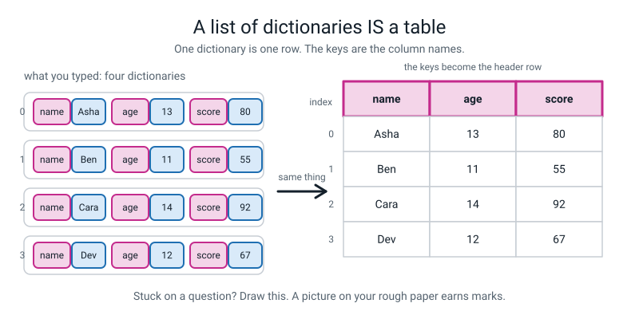
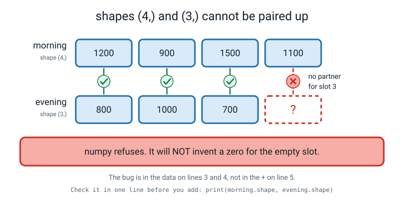

# 📝 Term 2 Practice Test — Weeks 10–18

[⬅ Term 1 test](term-1-test.md) · [Assessments home](README.md) · [Course home](../README.md) · [Term 3 test ➡](term-3-test.md)

---

```
   ┌──────────────────────────────────────────────────────────────────────┐
   │                                                                      │
   │   AI ACADEMY · LEVEL 2 BUILDER                                       │
   │   TERM 2 PRACTICE TEST — Build Your Own Toolbox                      │
   │   Covers Weeks 10–18. Nothing later appears anywhere on this paper.   │
   │   Weeks 1–9 syntax may appear, but is never the thing being tested.  │
   │                                                                      │
   │   TIME ALLOWED   60 minutes                                          │
   │   TOTAL MARKS    60                                                  │
   │                                                                      │
   │   Section A   12 multiple choice        1 mark each     12 marks     │
   │   Section B    6 "what does this print" 3 marks each    18 marks     │
   │   Section C    4 find-and-fix-the-bug   3 marks each    12 marks     │
   │   Section D    3 write-the-code         4 marks each    12 marks     │
   │   Section E    1 extended question      6 marks          6 marks     │
   │                                                                      │
   │   ⛔  NO COMPUTER. THIS PAPER IS DONE WITH A PENCIL.                 │
   │                                                                      │
   │      Six of these questions are about `None` and about off-by-one.   │
   │      Both are things you can only get right by holding the state in  │
   │      your head. A computer would answer them for you and you would   │
   │      learn nothing.                                                  │
   │                                                                      │
   │   INSTRUCTIONS                                                       │
   │   · Write in pencil. Answer every question.                          │
   │   · Section A: circle ONE letter. Write "not sure" beside a guess.   │
   │   · Section B: write EVERY line of output, in order. A list prints   │
   │     with its square brackets and its commas — copy them.            │
   │   · Section C: three things — what Python is telling you, the line,  │
   │     and the fixed line written out in full.                          │
   │   · Section D: indentation counts. Four spaces.                      │
   │   · Section E: a paragraph, not a list.                              │
   │                                                                      │
   │   WHAT IS ALLOWED                                                    │
   │   ✅  Pencil, pen, eraser, ruler                                     │
   │   ✅  Two blank sheets of rough paper — use them for trace tables    │
   │   ✅  A calculator for arithmetic only                               │
   │   ❌  A COMPUTER. No Python, no phone, no editor, no terminal.       │
   │   ❌  The student guide, the workbook, the glossary, your notes      │
   │   ❌  Your own stats.py — even though you wrote it                   │
   │   ❌  A search engine, a chatbot, another person                     │
   │                                                                      │
   └──────────────────────────────────────────────────────────────────────┘
```

> **🧑‍🏫 Teacher, read this once before you hand the paper out.** You do not need to know any Python.
> Set a timer for 60 minutes and read the "what is allowed" box out loud. **Every code block on this
> paper and in the answer key was run on Python 3.10 with numpy 1.26, and the real output pasted in.**
> Two things students will complain about, and both are deliberate: a list prints `[45, 62]` **with**
> the brackets, and a numpy array prints `[45 62]` with **no** commas. Marks depend on that difference,
> because it is how you tell in one glance which kind of thing you are holding.

---

## 📐 The one picture this whole term was building towards



*Figure T2.1 — A list of dictionaries **is** a table. One dictionary is one row. The keys are the column names. Every question in Sections B, D and E is somewhere on this picture — so if you get stuck, draw it.*

> **💡 Try this before you answer anything in Section B.** On your rough paper, draw the boxes. A list
> is numbered slots starting at **0**. A dictionary is key → value pairs with no numbers at all. When a
> question mixes them, draw both. A picture on your rough paper earns marks even when the final answer
> is wrong.

---

# 🅰️ Section A — Multiple Choice

*12 questions · 1 mark each · circle ONE letter · the week each question comes from is in brackets*

---

**A1.** [W10] A function's body runs, prints something, and reaches the end without a `return`. What
does the **caller** get back?

- (a) The last thing the function printed
- (b) `0`
- (c) `None`
- (d) An error

---

**A2.** [W10] Given `def journey_cost(km, rate=12):`, which call is **wrong**?

- (a) `journey_cost(5)`
- (b) `journey_cost(5, 20)`
- (c) `journey_cost(rate=8, km=10)`
- (d) `journey_cost(rate=8)`

---

**A3.** [W11] `scores = [45, 62, 71, 88]`. Which of these gives the **last** score?

- (a) `scores[4]`
- (b) `scores[len(scores)]`
- (c) `scores[-1]`
- (d) `scores[last]`

---

**A4.** [W11] What does `scores.append(93)` hand back?

- (a) The new list
- (b) The number 93
- (c) The new length
- (d) `None` — it changes `scores` in place and returns nothing

---

**A5.** [W12] `marks = [55, 70, 88, 91, 64]`. What is `marks[1:3]`?

- (a) `[70, 88, 91]`
- (b) `[70, 88]`
- (c) `[55, 70, 88]`
- (d) `[1, 2]`

---

**A6.** [W12] What is the difference between `sorted(marks)` and `marks.sort()`?

- (a) There is none; they are two spellings of the same thing
- (b) `sorted()` hands back a **new** sorted list and leaves `marks` alone; `.sort()` rearranges `marks` itself and hands back `None`
- (c) `sorted()` only works on numbers; `.sort()` works on anything
- (d) `.sort()` hands back a new list; `sorted()` changes the original

---

**A7.** [W13] `player = {"name": "Meera", "runs": 48}`. Which line gives `0` instead of crashing?

- (a) `player["overs"]`
- (b) `player.get("overs", 0)`
- (c) `player[0]`
- (d) `player.overs`

---

**A8.** [W14] `rows` is a list of dictionaries, each with a `"score"` key. What does
`[r["score"] for r in rows]` produce?

- (a) A new list holding just the scores
- (b) The total of the scores
- (c) A dictionary of scores
- (d) Nothing — it only works inside a `for` loop

---

**A9.** [W15] `counts = {"Falcons": 5, "Hawks": 9, "Owls": 2, "Tigers": 4}`. What does `max(counts)`
hand back, and why?

- (a) `Hawks`, because 9 is the biggest number
- (b) `9`, the biggest value
- (c) `Tigers`, because `max` on a dictionary looks at the **keys** and Tigers is last alphabetically
- (d) An error, because you cannot use `max` on a dictionary

---

**A10.** [W16] You wrote a CSV with `sleep_hours` of `7.5`, then read it back with `csv.DictReader`.
What kind of thing is `row["sleep_hours"]`?

- (a) A `float`, because that is what it was when you saved it
- (b) A `str` — the text `"7.5"`
- (c) An `int`, rounded to 8
- (d) It depends on how the file was opened

---

**A11.** [W17] `steps = np.array([4200, 5100, 3800])`. What does `steps.shape` print?

- (a) `3`
- (b) `(3,)`
- (c) `(1, 3)`
- (d) `(3, 1)`

---

**A12.** [W18] `numbers = [1, 2, 3]` and `arr = np.array([1, 2, 3])`. What is the difference between
`numbers * 2` and `arr * 2`?

- (a) No difference — both give `[2, 4, 6]`
- (b) `numbers * 2` gives `[1, 2, 3, 1, 2, 3]`; `arr * 2` gives `[2 4 6]`
- (c) `numbers * 2` gives `[2, 4, 6]`; `arr * 2` is an error
- (d) Both are errors; you need a loop

---

# 🅱️ Section B — What Does This Print?

*6 questions · 3 marks each · 18 marks*

**Write every line of output, on its own line, in the right order.** Copy the punctuation exactly:
a list prints with `[` `]` and commas; a dictionary prints with `{` `}` and colons; a numpy array
prints with `[` `]` and **no** commas.

If a program crashes, write the **name of the error** and say which line crashes.

---

**B1.** [W10]

```python
def total_cost(price, count=2):
    return price * count

def show_cost(price, count=2):
    print(price * count)

print(total_cost(50))
print(total_cost(50, 4))
print(total_cost(count=3, price=10))
print(show_cost(50))
```

*Five lines of output. The last call produces **two** of them.*

```
   1. ________________________________
   2. ________________________________
   3. ________________________________
   4. ________________________________
   5. ________________________________
```

---

**B2.** [W11]

```python
scores = [45, 62, 71, 88]
print(scores[0], scores[-1])
print(len(scores))
scores.append(93)
print(scores)
scores = scores.append(100)
print(scores)
```

*Four lines of output. The last one is the whole question.*

```
   1. ________________________________
   2. ________________________________
   3. ________________________________
   4. ________________________________
```

**In one sentence: what happened to the list on the second-to-last line?**

________________________________________________________________

---

**B3.** [W12]

```python
marks = [55, 70, 88, 91, 64]
print(marks[1:3])
print(marks[2:])
print(sorted(marks))
print(marks)
marks.sort()
print(marks)
```

*Five lines of output.*

```
   1. ________________________________
   2. ________________________________
   3. ________________________________
   4. ________________________________
   5. ________________________________
```

---

**B4.** [W13, W14]

```python
player = {"name": "Meera", "runs": 48, "team": "Blue"}
print(player["name"])
print(player.get("overs", 0))
print("runs" in player)
print("wickets" in player)
player["overs"] = 4
print(len(player))
print(player)
```

*Six lines of output. The last one must be written with its braces and quotes.*

```
   1. ________________________________
   2. ________________________________
   3. ________________________________
   4. ________________________________
   5. ________________________________
   6. ________________________________
```

---

**B5.** [W14, W15]

```python
rows = [
    {"name": "Asha", "age": 13, "score": 80},
    {"name": "Ben", "age": 11, "score": 55},
    {"name": "Cara", "age": 14, "score": 92},
    {"name": "Dev", "age": 12, "score": 67},
]
older = [r for r in rows if r["age"] > 12]
print(len(older))
scores = [r["score"] for r in older]
print(scores)
print(sum(scores))
print(sum(scores) / len(scores))
for position, row in enumerate(older):
    print(position, row["name"])
```

*Six lines of output.*

```
   1. ________________________________
   2. ________________________________
   3. ________________________________
   4. ________________________________
   5. ________________________________
   6. ________________________________
```

---

**B6.** [W17, W18]

```python
import numpy as np

steps = np.array([4200, 5100, 3800])
print(steps.shape)
print(steps.dtype)
print(steps * 2)
bonus = np.arange(3)
print(bonus)
print(steps + bonus)
print(np.zeros((2, 3)))
```

*The last one takes **two** lines. Seven lines of output in total.*

```
   1. ________________________________
   2. ________________________________
   3. ________________________________
   4. ________________________________
   5. ________________________________
   6. ________________________________
   7. ________________________________
```

---

# 🅲 Section C — Find and Fix the Bug

*4 questions · 3 marks each · 12 marks*

| | | Marks |
|---|---|:--:|
| **1** | **Say what Python is telling you**, in your own words — what it *means*, not the error name copied out. | 1 |
| **2** | **Point at the line** that has to change. Give its number. | 1 |
| **3** | **Write the fixed line out in full.** | 1 |

---

**C1.** [W11] This was meant to print all four scores.

```python
1  scores = [45, 62, 71, 88]
2  for i in range(1, len(scores) + 1):
3      print(scores[i])
```

It prints three numbers, and then:

```text
62
71
88
Traceback (most recent call last):
  File "scores.py", line 3, in <module>
    print(scores[i])
IndexError: list index out of range
```

**1. What is Python telling you?** ______________________________________________

**2. Line number:** ______

**3. The fixed line:** ______________________________________________

**Extra (1 of the 3 marks is here): why did `45` never print at all?**

________________________________________________________________

---

**C2.** [W13] This was meant to print a bowling line.

```python
1  player = {"name": "Meera", "runs": 48}
2  print(f"{player['name']} bowled {player['overs']} overs")
```

```text
Traceback (most recent call last):
  File "bowl.py", line 2, in <module>
    print(f"{player['name']} bowled {player['overs']} overs")
KeyError: 'overs'
```

**1. What is Python telling you?** ______________________________________________

**2. Line number:** ______

**3. The fixed line — give TWO different correct fixes, and say when you would use each:**

Fix A: ______________________________________________

Fix B: ______________________________________________

---

**C3.** [W12] Two files, in the same folder.

`stats.py`:

```python
1  def mean(numbers):
2      return sum(numbers) / len(numbers)
3
4  def highest(numbers):
5      return sorted(numbers)[-1]
```

`main.py`:

```python
1  import stats
2
3  scores = [45, 62, 71, 88]
4  print(stats.mean(scores))
5  print(stats.median(scores))
```

```text
66.5
Traceback (most recent call last):
  File "main.py", line 5, in <module>
    print(stats.median(scores))
AttributeError: module 'stats' has no attribute 'median'. Did you mean: 'mean'?
```

**1. What is Python telling you?** ______________________________________________

**2. Which file has to change, and roughly where?** ______________________________________________

**3. Explain in one sentence why line 4 worked and line 5 did not:**

________________________________________________________________

---

**C4.** [W17, W18] This was meant to add up two halves of a day's sales.

```python
1  import numpy as np
2
3  morning = np.array([1200, 900, 1500, 1100])
4  evening = np.array([800, 1000, 700])
5  total = morning + evening
6  print(total)
```

```text
Traceback (most recent call last):
  File "sales.py", line 5, in <module>
    total = morning + evening
ValueError: operands could not be broadcast together with shapes (4,) (3,)
```

**1. What is Python telling you?** ______________________________________________

**2. Which line is the real problem — 5, or one of 3 and 4? Say which, and why.**

________________________________________________________________

**3. What ONE thing would you print, before line 5, to catch this next time?**

________________________________________________________________

---

# 🅳 Section D — Write the Code

*3 questions · 4 marks each · 12 marks*

Write real Python. **Indentation counts.** You may not use anything from after Week 18 (so: no
pandas, no DataFrames).

---

**D1.** [W10] Write a function called `journey_cost` that:

- takes **two** parameters: `km`, and `rate` with a **default of 12**
- **returns** the cost, which is `km * rate`
- is then called three times and printed: once with only `km = 5`, once with `km = 5` and `rate = 20`,
  and once using **keyword arguments in the wrong order** — `rate` first, then `km` — with `rate = 8`
  and `km = 10`

```
   ________________________________________________________

   ________________________________________________________

   ________________________________________________________

   ________________________________________________________

   ________________________________________________________

   ________________________________________________________

   ________________________________________________________
```

**Write the three numbers it prints:** ______ ______ ______

---

**D2.** [W14, W15] Here is a list of five snack records. **Copy nothing** — just write the code that
goes underneath it.

```python
snacks = [
    {"name": "samosa", "price": 20, "veg": True},
    {"name": "roll", "price": 45, "veg": False},
    {"name": "vada", "price": 18, "veg": True},
    {"name": "burger", "price": 60, "veg": False},
    {"name": "idli", "price": 25, "veg": True},
]
```

Write code that:

1. builds a new list of only the snacks costing **less than 30**, using a **comprehension with a filter**
2. prints how many rows survived **and** how many there were to start with, in one sentence
3. builds a list of just the prices of the surviving snacks, using a second comprehension
4. prints the total and the average price of the survivors, the average to 2 decimal places

```
   ________________________________________________________

   ________________________________________________________

   ________________________________________________________

   ________________________________________________________

   ________________________________________________________

   ________________________________________________________

   ________________________________________________________

   ________________________________________________________
```

---

**D3.** [W17, W18] Here is a Week 7 loop that doubles every step count:

```python
steps = [4200, 5100, 3800, 6400, 5500]
doubled = []
for one_day in steps:
    doubled.append(one_day * 2)
print(doubled)
```

Rewrite the whole thing using **numpy**, with **no `for` loop anywhere**, so that it also:

- prints the array's `shape` and its `dtype`
- prints the doubled steps
- prints how far above or below a goal of **5000 steps every day** each day was
  (a negative number means short of the goal)

```
   ________________________________________________________

   ________________________________________________________

   ________________________________________________________

   ________________________________________________________

   ________________________________________________________

   ________________________________________________________

   ________________________________________________________

   ________________________________________________________
```

---

# 🅴 Section E — The Extended Question

*1 question · 6 marks · about 12 minutes · write a paragraph, not a list*

---

**E1.** [W13, W14, W16] For the Week 16 Record Store project, a student collected data about **thirty
real classmates** and saved it. Here is her code and the file it produced.

```python
import csv

rows = [
    {"name": "Asha", "sleep_hours": 7.5, "snack": "samosa", "late": "yes"},
    {"name": "Ben", "sleep_hours": 6.0, "snack": "roll", "late": "yes"},
    {"name": "Cara", "sleep_hours": 9.0, "snack": "idli", "late": "no"},
]

with open("class.csv", "w", newline="") as f:
    writer = csv.DictWriter(f, fieldnames=["name", "sleep_hours", "snack", "late"])
    writer.writeheader()
    for row in rows:
        writer.writerow(row)
```

`class.csv`, opened in a text editor:

```text
name,sleep_hours,snack,late
Asha,7.5,samosa,yes
Ben,6.0,roll,yes
Cara,9.0,idli,no
```

She loads it back and does some arithmetic:

```python
with open("class.csv") as f:
    reader = csv.DictReader(f)
    loaded = [r for r in reader]

print(loaded[0]["sleep_hours"] + loaded[1]["sleep_hours"])
```

It prints:

```text
7.56.0
```

She emails `class.csv` to herself so she can work on it at home, and puts a copy on a shared class
drive so her group can help.

Write a paragraph answering **all four** of these:

1. **Explain the `7.56.0`.** What kind of thing is `loaded[0]["sleep_hours"]`, why, and what would you
   have to write instead to get `13.5`?
2. Name **one column in this file that should not be there**, and say what it would let a stranger do
   that the other columns would not.
3. She says *"it's fine, it's only three columns and everybody knows each other anyway."* Give **one
   specific reason** that is not fine, involving a named person in the file.
4. Describe **one change to the file** and **one change to where she keeps it** that would let her
   still answer her question. Then say what her charts lose because of your change.

```
   ______________________________________________________________________

   ______________________________________________________________________

   ______________________________________________________________________

   ______________________________________________________________________

   ______________________________________________________________________

   ______________________________________________________________________

   ______________________________________________________________________

   ______________________________________________________________________

   ______________________________________________________________________

   ______________________________________________________________________

   ______________________________________________________________________

   ______________________________________________________________________
```

---

---
---

# 📊 Marking Scheme

**Total: 60 marks.**

## Section A — 12 marks

| Q | Answer | Mark | Week |
|:--:|:--:|:--:|:--:|
| A1 | **(c)** | 1 | W10 |
| A2 | **(d)** | 1 | W10 |
| A3 | **(c)** | 1 | W11 |
| A4 | **(d)** | 1 | W11 |
| A5 | **(b)** | 1 | W12 |
| A6 | **(b)** | 1 | W12 |
| A7 | **(b)** | 1 | W13 |
| A8 | **(a)** | 1 | W14 |
| A9 | **(c)** | 1 | W15 |
| A10 | **(b)** | 1 | W16 |
| A11 | **(b)** | 1 | W17 |
| A12 | **(b)** | 1 | W18 |

No half marks. Two letters circled scores 0.

## Section B — 18 marks

**3 marks per question, on the same ladder as Term 1:**

| | Marks |
|---|:--:|
| Every line correct, in order, punctuation included | 3 |
| One line wrong | 2 |
| Two lines wrong, or right values in the wrong order | 1 |
| A visible drawing or trace table with correct intermediate state | **1, always** |
| Nothing usable | 0 |

| Q | The real output | Marks | The trap |
|:--:|---|:--:|---|
| **B1** | `100` / `200` / `30` / `100` / `None` | 3 | `show_cost` prints **and then** `print()` prints its `None` |
| **B2** | `45 88` / `4` / `[45, 62, 71, 88, 93]` / `None` + sentence | 2 + 1 | `scores = scores.append(100)` destroys the list |
| **B3** | `[70, 88]` / `[88, 91, 64]` / `[55, 64, 70, 88, 91]` / `[55, 70, 88, 91, 64]` / `[55, 64, 70, 88, 91]` | 3 | Line 4 shows the original **unchanged**; line 5 shows it changed |
| **B4** | `Meera` / `0` / `True` / `False` / `4` / `{'name': 'Meera', 'runs': 48, 'team': 'Blue', 'overs': 4}` | 3 | `len` of a dict counts **keys**, and `overs` went on the **end** |
| **B5** | `2` / `[80, 92]` / `172` / `86.0` / `0 Asha` / `1 Cara` | 3 | `86.0` not `86`. `enumerate` starts at **0**, not 1 |
| **B6** | `(3,)` / `int64` / `[ 8400 10200  7600]` / `[0 1 2]` / `[4200 5101 3802]` / `[[0. 0. 0.]` / ` [0. 0. 0.]]` | 3 | No commas in array output. `np.zeros` gives `0.` with a dot |

**B2's sentence (1 mark):** any wording saying `.append` hands back `None`, so assigning its result
**replaced the list with nothing** and the list is now gone for good. "It broke" earns 0.

> **🧑‍🏫 Marking numpy output on paper — be sensible about spacing.** Real numpy pads columns so they
> line up: `[ 8400 10200  7600]`. A student who writes `[8400 10200 7600]` has the answer right. **Give
> the mark.** What you must *not* give the mark for is `[8400, 10200, 7600]` with commas — that is a
> list, not an array, and telling them apart at a glance is exactly what Week 17 was for. Explain it,
> take the line.

## Section C — 12 marks

| Q | 1 · Meaning (1 mark) | 2 · Line (1 mark) | 3 · Fix / extra (1 mark) |
|:--:|---|:--:|---|
| **C1** | You asked for a slot that does not exist. A 4-item list has slots 0, 1, 2, 3 — and the loop asked for slot 4. | 2 | The extra part: `45` never printed because the loop started at `i = 1`, skipping slot 0. Fix: `for i in range(len(scores)):` or `for score in scores:` |
| **C2** | You asked the dictionary for a key called `overs` and there isn't one. Dictionaries do not have a "nothing there" value — they refuse. | 2 | **Both** needed: A `player.get('overs', 0)` for *"a missing value is genuinely 0"*; B `player["overs"] = 4` for *"the data was incomplete and I have now filled it in"* |
| **C3** | Python found the **file** `stats.py` and imported it fine — line 4 proves that. It then looked inside for something called `median` and there is nothing with that name in the file. | `stats.py` — add a `median` function | Line 4 worked because `mean` **is** in `stats.py`; line 5 failed because `median` was never written. Not a path problem, not a typo — a **missing tool in the tin** |
| **C4** | The two arrays are different lengths, so numpy cannot line them up slot by slot, and it refuses to guess which slot has no partner. | **Lines 3 and 4 are the real problem** — line 5 is only where it shows up. One of the two datasets is missing a value | `print(morning.shape, evening.shape)` — the most-checked thing in Level 2 |

**Marking rules:**

- **C1's extra mark is genuinely separate.** A student can fix the crash (`range(len(scores))`) and
  never notice that `45` was silently missing. That is the interesting half of the bug: the crash was
  loud, the skipped item was silent, and the silent one is worse.
- **C3: do not accept "the file is in the wrong folder".** Line 4 printed `66.5`, which is proof the
  file was found. This is the distinction Week 12 drills: `ModuleNotFoundError` = *cannot find the
  file*; `AttributeError` = *found the file, cannot find the thing inside it*. A student who mixes
  these up will lose an hour of their life at some point this year.
- **C4: accept "line 4" alone** if they explain that the evening data has only three values and one is
  missing. Do **not** accept "line 5" alone — the addition is innocent. It is the classic Level 2
  debugging move: the line that crashes is often not the line that is wrong.

## Section D — 12 marks

### D1 — 4 marks

| Row | Mark for | Marks |
|---|---|:--:|
| Signature | `def journey_cost(km, rate=12):` — default on the **second** parameter | 1 |
| `return` | `return km * rate`, not `print` | 1 |
| Three calls | Positional, positional-pair, and **keyword-out-of-order** all present | 1 |
| The three numbers | `60`, `100`, `80` | 1 |

```python
def journey_cost(km, rate=12):      # rate has a default; km does not
    return km * rate                # hand the answer back, do not print it

print(journey_cost(5))              # rate falls back to 12
print(journey_cost(5, 20))          # 20 overrides the default
print(journey_cost(rate=8, km=10))  # names given, so order stops mattering
```

```text
60
100
80
```

### D2 — 4 marks

| Row | Mark for | Marks |
|---|---|:--:|
| The filter | `[s for s in snacks if s["price"] < 30]` — comprehension, `< 30` strictly | 1 |
| Row counts | Prints **both** the survivors and the original count | 1 |
| The second comprehension | `[s["price"] for s in cheap]` — pulling one field out | 1 |
| Total and average | `sum(prices)` and an average with `:.2f` | 1 |

```python
snacks = [                                            # given in the question
    {"name": "samosa", "price": 20, "veg": True},
    {"name": "roll", "price": 45, "veg": False},
    {"name": "vada", "price": 18, "veg": True},
    {"name": "burger", "price": 60, "veg": False},
    {"name": "idli", "price": 25, "veg": True},
]

cheap = [s for s in snacks if s["price"] < 30]        # keep only the rows that pass
print(f"Rows kept: {len(cheap)} out of {len(snacks)}")

prices = [s["price"] for s in cheap]                  # pull one field out of each row
print(prices)
print(f"Total: {sum(prices)}")
print(f"Average: {sum(prices) / len(prices):.2f}")
```

```text
Rows kept: 3 out of 5
[20, 18, 25]
Total: 63
Average: 21.00
```

> **🧑‍🏫 The row-count mark is not a formatting mark.** Week 15's rule is *every filtered answer is
> reported with the number of rows it came from*, because "average price 21" from three rows and from
> three hundred are different claims. A student who prints only the average has answered the maths and
> missed the lesson.

### D3 — 4 marks

| Row | Mark for | Marks |
|---|---|:--:|
| No loop | `np.array([...])` built directly; **not one `for`** anywhere | 1 |
| `shape` and `dtype` | Both printed | 1 |
| Doubling | `steps * 2` — one operation on the whole array | 1 |
| The goal comparison | An array of 5000s, or `steps - 5000`, giving negatives for short days | 1 |

```python
import numpy as np

steps = np.array([4200, 5100, 3800, 6400, 5500])
goal = np.array([5000, 5000, 5000, 5000, 5000])

print(steps.shape)          # (5,) — five days, one row
print(steps.dtype)          # int64 — whole numbers
print(steps * 2)            # every value doubled, no loop
print(steps - goal)         # negative = short of the goal
print(np.arange(5))         # the day numbers, 0 to 4
```

```text
(5,)
int64
[ 8400 10200  7600 12800 11000]
[ -800   100 -1200  1400   500]
[0 1 2 3 4]
```

**`steps - 5000` gets full marks too** and is better code — one number broadcast against five. Say so
when handing back; do not withhold anything from the student who wrote out the five 5000s, because that
version is what Week 18 actually taught first.

## Section E — 6 marks, marked with the rubric below

| Level | Marks |
|---|:--:|
| 4 · Exceptional | 6 |
| 3 · Proficient | 5 |
| 2 · Developing | 3–4 |
| 1 · Beginning | 1–2 |
| Nothing usable | 0 |

### E1 rubric

| | **1 · Beginning** | **2 · Developing** | **3 · Proficient** | **4 · Exceptional** |
|---|---|---|---|---|
| **The `7.56.0`** | "It's broken" | Says the numbers got joined | Says `DictReader` hands back **text**, so `+` joined two strings, and gives the fix: `float(...)` on both | Also names it as the **silent** kind of bug — no traceback, a plausible-looking answer — and points out that `int()` would have crashed on `"7.5"` |
| **The column** | No column named | Names `name` with no consequence | Names `name` and says it makes every row traceable to one real child | Explains that with `name` removed the rows are still **re-identifiable** — 30 classmates, and "the one who eats idli and is always late" is one person |
| **Why it is not fine** | "Privacy" as a bare word | A general worry | Names a real person in the file and a real consequence — Ben slept 6 hours and is marked late; that is a row a teacher or a parent could act on | Also notices she **never asked**, and that a shared class drive means the audience is not the group she pictured |
| **The two changes** | None | A change with no cost named | A change to the file (drop `name`, or replace with `student_01`) **and** to storage (keep it off the shared drive; one copy, one folder, deleted after) **and** what the charts lose | Prices the loss exactly: without `name` she can no longer fix a typo in one row or ask that person a follow-up question, so the cleaning log becomes the only memory the project has |
| **Writing** | One fragment | A list of words | A paragraph a stranger could follow | A paragraph she could hand to the head of year unchanged |

### A model level-4 answer (about 230 words)

> The `7.56.0` is not a maths mistake, it is a **type** mistake, and it is the dangerous kind because
> nothing crashed. `csv.DictReader` hands everything back as text — a CSV file is just characters, so
> `7.5` comes back as the string `"7.5"` — and `+` on two strings joins them end to end. To get 13.5
> she needs `float(loaded[0]["sleep_hours"]) + float(loaded[1]["sleep_hours"])`. `int()` would have
> crashed on `"7.5"`, which would honestly have been better, because a crash tells you and `7.56.0`
> just sits there looking like a number. The column that should not be there is `name`. Every other
> column is a fact; `name` is what turns a fact into a fact **about Ben**. And Ben is the reason this is
> not fine: his row says six hours of sleep and late, and that is exactly the sort of row a teacher or
> a parent could do something about, and he never agreed to it. Even taking `name` out is not enough —
> in a class of thirty, "the one who eats idli and is never late" is one person, so the rows stay
> re-identifiable. I would replace `name` with `student_01` … `student_30`, keep the key on paper at
> home, keep the file in one folder on one machine and take it off the shared drive. What she loses is
> real: she can no longer go back and ask Cara whether nine hours was a typo, so from now on the
> cleaning log is the project's only memory of what each row meant.

---

# ✅ Full Answer Key

> **🧑‍🏫 Do not photocopy this page for students until after the test is marked.** Every distractor is
> explained. **Every code block below was run on Python 3.10 / numpy 1.26 and the output pasted in
> unedited.**

<details>
<summary><b>A1 — (c) · W10</b></summary>

**(c) `None` is right.** A function with no `return` still hands something back — it hands back
Python's word for *no value*.

```python
def show_cost(price):
    print(price * 2)

answer = show_cost(50)
print(answer)
```

```text
100
None
```

Two lines. The `100` came from inside the function talking to the screen. The `None` is what the
function gave the **program**.

- **(a) is wrong**, and it is the belief that causes the bug. `print` writes on the screen. The screen
  is not a variable. Nothing that goes to the screen ever comes back.
- **(b) is wrong** — `None` is not `0`. `0` is a number you can add. `None` is not.
- **(d) is wrong** — no error at all, which is the problem. The error comes *later*, when you try to
  use the `None` for something, and by then you are three lines away from the cause.

**The sentence for the wall:** `print` tells the screen; `return` tells the program.
</details>

<details>
<summary><b>A2 — (d) · W10</b></summary>

**(d) `journey_cost(rate=8)` is the wrong one.** `km` has no default, so the caller **must** supply it.

```python
def journey_cost(km, rate=12):
    return km * rate

print(journey_cost(rate=8))
```

```text
Traceback (most recent call last):
  File "j.py", line 4, in <module>
    print(journey_cost(rate=8))
TypeError: journey_cost() missing 1 required positional argument: 'km'
```

Read the message: *missing 1 required positional argument: 'km'*. Python names the exact parameter.

- **(a) is fine** — `rate` falls back to 12. `5 * 12 = 60`.
- **(b) is fine** — 20 overrides the default. `5 * 20 = 100`.
- **(c) is fine, and it is the interesting one.** Once you name the parameters, the order stops
  mattering: `journey_cost(rate=8, km=10)` is `10 * 8 = 80`. That is what keyword arguments are *for*.
</details>

<details>
<summary><b>A3 — (c) · W11</b></summary>

**(c) `scores[-1]` is right.** Minus one means "one back from the end".

```python
scores = [45, 62, 71, 88]
print(scores[-1])
print(scores[3])
```

```text
88
88
```

- **(a) `scores[4]` is wrong** — a 4-item list has slots 0, 1, 2 and 3. There is no slot 4. This is
  C1's error.
- **(b) `scores[len(scores)]` is wrong for every list of every length**, and it is worth saying that
  out loud. `len` is 4, and slot 4 does not exist. The last valid index is always `len - 1`.
- **(d) is wrong** — there is no such thing as `last`. Python would go looking for a variable called
  `last` and raise `NameError`.
</details>

<details>
<summary><b>A4 — (d) · W11</b></summary>

**(d) `None` is right.** `.append` is a **change-it-in-place** method. It rearranges the list you
already have and hands back nothing.

```python
scores = [45, 62]
result = scores.append(93)
print(scores)
print(result)
```

```text
[45, 62, 93]
None
```

- **(a) is wrong**, and this is the belief behind the single most destructive one-line bug of Week 11:
  `scores = scores.append(93)` puts `None` into `scores` and the list is gone. See B2.
- **(b) and (c) are wrong** — nothing useful comes back. Not the item, not the length.

**The two families, and it is worth writing this table in the notebook:**

| Family | Example | Hands back | Original |
|---|---|---|---|
| Changes it in place | `scores.append(x)`, `scores.sort()` | `None` | changed |
| Builds a new one | `sorted(scores)`, `scores[1:3]` | the new thing | untouched |
</details>

<details>
<summary><b>A5 — (b) · W12</b></summary>

**(b) `[70, 88]` is right.** A slice takes slots from the start number **up to but not including** the
stop number. So `1:3` is slots 1 and 2 — two items.

```python
marks = [55, 70, 88, 91, 64]
print(marks[1:3])
print(len(marks[1:3]))
```

```text
[70, 88]
2
```

**The arithmetic that never fails:** the length of `marks[a:b]` is `b - a`. Here `3 - 1 = 2`. Two items.

- **(a) is wrong** — that is `marks[1:4]`, three items, the mistake of treating the stop as included.
- **(c) is wrong** — that starts at 0, not 1.
- **(d) is wrong** — a slice hands back the **values** in those slots, not the slot numbers.

**Why Python does it this way:** so that `marks[:2]` and `marks[2:]` split the list perfectly in two
with no overlap and nothing lost. Try it: `[55, 70]` and `[88, 91, 64]`.
</details>

<details>
<summary><b>A6 — (b) · W12</b></summary>

**(b) is right.**

```python
marks = [55, 70, 88, 91, 64]
new = sorted(marks)
print(new)
print(marks)              # untouched
print(marks.sort())       # None
print(marks)              # now changed
```

```text
[55, 64, 70, 88, 91]
[55, 70, 88, 91, 64]
None
[55, 64, 70, 88, 91]
```

- **(a) is wrong** — they differ in *both* things that matter: what they hand back, and what they do to
  your data.
- **(c) is wrong** — both sort numbers, and both sort text.
- **(d) is wrong** — it is exactly backwards, and it is the commonest answer from a student who has
  read the words but never run both lines.

**Which to use, and this course's answer:** `sorted()`, almost always. Your raw data has an order, that
order is sometimes information — the order you collected it in — and `.sort()` destroys it with no way
back. `sorted()` costs a bit of memory and keeps your options open.
</details>

<details>
<summary><b>A7 — (b) · W13</b></summary>

**(b) `player.get("overs", 0)` is right.** `.get` takes a key and a fallback, and hands back the
fallback instead of crashing.

```python
player = {"name": "Meera", "runs": 48}
print(player.get("overs", 0))
print(player.get("runs", 0))
```

```text
0
48
```

Notice the second line: when the key **is** there, `.get` hands back the real value and the fallback is
ignored.

- **(a) is wrong** — that is C2. Square brackets on a missing key raise `KeyError`.
- **(c) is wrong** — dictionaries have no slot numbers. `player[0]` is asking for a key called `0`,
  and there isn't one, so it also raises `KeyError: 0`.
- **(d) is wrong** — `player.overs` is dot syntax for something else entirely, and gives
  `AttributeError: 'dict' object has no attribute 'overs'`.

> **🧑‍🏫 If a student asks "so should I always use `.get`?"** No, and this is worth two minutes.
> `.get` is right when a missing value genuinely *means* something — nought overs bowled. It is wrong
> when the key missing means your **data is broken**, because then `.get` hides the breakage behind a
> fake zero and your averages go quietly wrong. Square brackets crash loudly, and a loud crash on
> broken data is a gift.
</details>

<details>
<summary><b>A8 — (a) · W14</b></summary>

**(a) a new list holding just the scores.** A comprehension reads left to right as: *"the thing I want,
for every row in the rows"*.

```python
rows = [{"score": 80}, {"score": 55}, {"score": 92}]
print([r["score"] for r in rows])
```

```text
[80, 55, 92]
```

The long way, which does exactly the same thing:

```python
rows = [{"score": 80}, {"score": 55}, {"score": 92}]
scores = []
for r in rows:
    scores.append(r["score"])
print(scores)
```

```text
[80, 55, 92]
```

- **(b) is wrong** — no adding happens. That is `sum([r["score"] for r in rows])`, which is 227.
- **(c) is wrong** — the square brackets say *list*. A dictionary needs braces.
- **(d) is wrong** — a comprehension stands on its own anywhere a value can go.
</details>

<details>
<summary><b>A9 — (c) · W15</b></summary>

**(c) `Tigers`, because `max` looks at the keys.** This is the most valuable single question on this
paper, because the wrong answer looks completely right.

```python
counts = {"Falcons": 5, "Hawks": 9, "Owls": 2, "Tigers": 4}
print(max(counts))
print(max(counts, key=counts.get))
```

```text
Tigers
Hawks
```

`max(counts)` walks the **keys** — the four team names — and compares them as words. F, then H, then
O, then T. `Tigers` wins the alphabet. **The numbers 5, 9, 2 and 4 are never looked at.**

`max(counts, key=counts.get)` says: *go through the keys, but judge each one by what `counts.get` says
about it.* Now the numbers decide, and `Hawks` wins with 9.

- **(a) is wrong** in its *reason*, which is the whole point. `Hawks` is the right answer to a
  different question. If the teams had been named alphabetically in count order you would never have
  found out.
- **(b) is wrong** — you get the key, not the value. `counts[max(counts, key=counts.get)]` is 9.
- **(d) is wrong** — no error at all. **That is the danger.** A confident wrong answer with no warning
  is the worst failure mode in this level, and this is your cleanest example of one.
</details>

<details>
<summary><b>A10 — (b) · W16</b></summary>

**(b) a `str` — the text `"7.5"`.** A CSV file is characters on a disk. There is nowhere in it to
record that `7.5` was a decimal and `yes` was a word.

```python
with open("class.csv") as f:
    reader = csv.DictReader(f)
    loaded = [r for r in reader]

print(loaded[0])
print(type(loaded[0]["sleep_hours"]))
```

```text
{'name': 'Asha', 'sleep_hours': '7.5', 'snack': 'samosa', 'late': 'yes'}
<class 'str'>
```

Look at the quotes round `'7.5'` in that dictionary. They are the tell.

- **(a) is wrong**, and it is the mistake that produces `7.56.0`. Saving a float writes the characters
  `7`, `.`, `5`. Reading them back gives you the characters.
- **(c) is wrong** — nothing rounds anything. `int("7.5")` would in fact crash:
  `ValueError: invalid literal for int() with base 10: '7.5'`.
- **(d) is wrong** — the mode you open the file in has no effect on this.

**The habit Week 16 drills: convert on the way in.** `float(row["sleep_hours"])`, on the line that
loads the row, every time.
</details>

<details>
<summary><b>A11 — (b) · W17</b></summary>

**(b) `(3,)` is right.** `shape` is always a tuple — a thing in round brackets — even for one dimension.
The lonely comma is Python's way of saying "this bracket holds exactly one item and is not just a
bracket round a 3".

```python
import numpy as np
print(np.array([4200, 5100, 3800]).shape)
print(np.array([[4200, 5100, 3800]]).shape)
```

```text
(3,)
(1, 3)
```

- **(a) `3` is wrong**, though the instinct is fine. `shape` never gives a bare number, because then
  you could not tell one dimension from two.
- **(c) `(1, 3)` is wrong** — that is a **2-D** array with one row and three columns. Look at the
  double square brackets that make it. Different shape, different rules, and it will matter enormously
  in Week 19.
- **(d) `(3, 1)` is wrong** — three rows, one column. A tall array, not a wide one.

**`.shape` is the most-checked thing in this level.** When something goes wrong from Week 17 to Week 36,
print the shape first. Ninety per cent of the time the answer is right there.
</details>

<details>
<summary><b>A12 — (b) · W18</b></summary>

**(b) is right, and this is the difference the whole of Week 18 exists to make visible.**

```python
import numpy as np
numbers = [1, 2, 3]
arr = np.array([1, 2, 3])
print(numbers * 2)
print(arr * 2)
```

```text
[1, 2, 3, 1, 2, 3]
[2 4 6]
```

| | `*` means | Result |
|---|---|---|
| list | repeat the list | `[1, 2, 3, 1, 2, 3]` — six items |
| array | multiply every number | `[2 4 6]` — three items |

Same symbol, entirely different job, decided by what is on the left. Exactly like `+` in Week 2.

- **(a) is wrong** — `numbers * 2` does not touch the numbers. It touches the *list*.
- **(c) is wrong** — the array version is the one that works the way you hoped.
- **(d) is wrong** — you needed a loop for the list in Week 7. Week 18's point is that with an array
  you never need that loop again.

**And notice the punctuation, because it is free information:** commas mean list, no commas mean array.
</details>

<details>
<summary><b>B1 — five lines from four calls · W10</b></summary>

```python
def total_cost(price, count=2):
    return price * count

def show_cost(price, count=2):
    print(price * count)

print(total_cost(50))
print(total_cost(50, 4))
print(total_cost(count=3, price=10))
print(show_cost(50))
```

**Real output:**

```text
100
200
30
100
None
```

| Call | What happens | Prints |
|---|---|---|
| `total_cost(50)` | `count` falls back to 2 → returns 100 → `print` prints it | `100` |
| `total_cost(50, 4)` | 4 overrides the default → returns 200 | `200` |
| `total_cost(count=3, price=10)` | Names given, so the reversed order is fine → `10 * 3` | `30` |
| `print(show_cost(50))` | **Two lines.** `show_cost` prints `100` from inside itself. It has no `return`, so it hands back `None`, and the outer `print` prints `None`. | `100` then `None` |

**The last call is the whole question.** Cover the two function bodies and look at them again:
`total_cost` **returns**, `show_cost` **prints**. Wrapping a printing function in another `print` is how
`None` shows up on a screen and confuses everybody for twenty minutes.
</details>

<details>
<summary><b>B2 — the one-line bug that deletes your data · W11</b></summary>

```python
scores = [45, 62, 71, 88]
print(scores[0], scores[-1])
print(len(scores))
scores.append(93)
print(scores)
scores = scores.append(100)
print(scores)
```

**Real output:**

```text
45 88
4
[45, 62, 71, 88, 93]
None
```

**The sentence (1 mark).** `.append` changes the list **and hands back `None`**. So
`scores = scores.append(100)` did two things in one line: it added 100 to the list, and then it threw
the whole list away and put `None` in the box instead. **The 100 was added to a list nobody can reach
any more.**

Proof that it really did both:

```python
scores = [45, 62]
scores.append(100)         # the working way
print(scores)
scores = scores.append(7)  # the destructive way
print(scores)
```

```text
[45, 62, 100]
None
```

**How to recognise the family without memorising it:** if a method **changes the thing you called it
on**, it hands back `None`. `append`, `sort`. If it **builds a new thing**, it hands the new thing back.
`sorted`, a slice. Never assign the result of the first family.

> **🐞 If you see this error:** the crash usually comes *later* —
> `TypeError: 'NoneType' object is not subscriptable` on the next line that says `scores[0]`. Read that
> message as *"you are treating a nothing as if it were a list"*, then look **upwards** for the line
> that put `None` in there. The crash and the cause are rarely neighbours.
</details>

<details>
<summary><b>B3 — slices and sorts, and which ones touch your data · W12</b></summary>

```python
marks = [55, 70, 88, 91, 64]
print(marks[1:3])
print(marks[2:])
print(sorted(marks))
print(marks)
marks.sort()
print(marks)
```

**Real output:**

```text
[70, 88]
[88, 91, 64]
[55, 64, 70, 88, 91]
[55, 70, 88, 91, 64]
[55, 64, 70, 88, 91]
```

| Line | Result | Why |
|---|---|---|
| `marks[1:3]` | `[70, 88]` | Slots 1 and 2. Stop 3 not included. Length = 3 − 1 = 2 |
| `marks[2:]` | `[88, 91, 64]` | No stop means "to the end" |
| `sorted(marks)` | `[55, 64, 70, 88, 91]` | A **new** list, sorted |
| `marks` | `[55, 70, 88, 91, 64]` | **Unchanged.** This is the line the question exists for |
| after `.sort()` | `[55, 64, 70, 88, 91]` | Now the original really has been rearranged, for good |

**Lines 4 and 5 side by side are the answer to A6.** Line 4 proves `sorted` left the original alone.
Line 5 proves `.sort()` did not. And the original order — 55, 70, 88, 91, 64 — is gone, with no undo.
</details>

<details>
<summary><b>B4 — dictionaries: brackets, `.get`, `in`, and `len` · W13, W14</b></summary>

```python
player = {"name": "Meera", "runs": 48, "team": "Blue"}
print(player["name"])
print(player.get("overs", 0))
print("runs" in player)
print("wickets" in player)
player["overs"] = 4
print(len(player))
print(player)
```

**Real output:**

```text
Meera
0
True
False
4
{'name': 'Meera', 'runs': 48, 'team': 'Blue', 'overs': 4}
```

| Line | Result | The idea |
|---|---|---|
| `player["name"]` | `Meera` | Look up by key. No quotes in the output, because `print` of a bare string shows the characters |
| `player.get("overs", 0)` | `0` | Key missing → hand back the fallback instead of crashing |
| `"runs" in player` | `True` | `in` on a dictionary asks about **keys**, never values |
| `"wickets" in player` | `False` | No such key |
| `player["overs"] = 4` | *(nothing)* | Square brackets on the **left** of `=` **create** the key. Same syntax that crashed in C2 when read |
| `len(player)` | `4` | Four **keys**. `len` counts keys, not characters, not values |
| `print(player)` | the whole dict | Single quotes, `key: value`, comma-space, in insertion order — `overs` **last**, because it was added last |

**Two marks are lost here most often:**

1. **`"Blue" in player` intuition.** Students expect `in` to search values. It does not. Ask them what
   `"Meera" in player` gives — it is `False`, and that surprises everybody once.
2. **The exact spelling of line 6.** Single quotes, not double, because that is how Python chooses to
   display strings. A student who writes double quotes has understood the dictionary. **Give the mark**
   and mention the quotes in passing.
</details>

<details>
<summary><b>B5 — filter, pull out a field, and enumerate from zero · W14, W15</b></summary>

```python
rows = [
    {"name": "Asha", "age": 13, "score": 80},
    {"name": "Ben", "age": 11, "score": 55},
    {"name": "Cara", "age": 14, "score": 92},
    {"name": "Dev", "age": 12, "score": 67},
]
older = [r for r in rows if r["age"] > 12]
print(len(older))
scores = [r["score"] for r in older]
print(scores)
print(sum(scores))
print(sum(scores) / len(scores))
for position, row in enumerate(older):
    print(position, row["name"])
```

**Real output:**

```text
2
[80, 92]
172
86.0
0 Asha
1 Cara
```

**The filter, row by row — do this on paper:**

| Row | `age` | `age > 12`? | Kept? |
|---|:--:|:--:|:--:|
| Asha | 13 | `True` | ✅ |
| Ben | 11 | `False` | ❌ |
| Cara | 14 | `True` | ✅ |
| **Dev** | **12** | **`False`** | **❌** |

**Dev is the question.** 12 is not more than 12. `>` is strict. If the question had said "12 and over"
the code would need `>= 12`, and then three rows survive: `[80, 92, 67]`, total 239, average
`79.66666666666667`. Entirely different findings from one character.

**Three details each worth a mark's worth of attention:**

- **`86.0`, not `86`.** `172 / 2` uses `/`, which always gives a decimal. Week 2, still true.
- **`enumerate` starts at 0.** `0 Asha`, `1 Cara`. Not 1 and 2.
- **`enumerate` walks the *filtered* list.** Asha was row 0 in `rows` too, but Cara was row 2 there and
  is row 1 here. Position numbers belong to the list you are looping over, not to the original data —
  which is why a filtered report should quote names, not row numbers.
</details>

<details>
<summary><b>B6 — arrays: shape, dtype, and maths with no loop · W17, W18</b></summary>

```python
import numpy as np

steps = np.array([4200, 5100, 3800])
print(steps.shape)
print(steps.dtype)
print(steps * 2)
bonus = np.arange(3)
print(bonus)
print(steps + bonus)
print(np.zeros((2, 3)))
```

**Real output:**

```text
(3,)
int64
[ 8400 10200  7600]
[0 1 2]
[4200 5101 3802]
[[0. 0. 0.]
 [0. 0. 0.]]
```

| Line | Result | The idea |
|---|---|---|
| `steps.shape` | `(3,)` | One dimension, three values. The lonely comma is deliberate |
| `steps.dtype` | `int64` | Whole numbers. No decimals were typed, so none are stored |
| `steps * 2` | `[ 8400 10200  7600]` | Every value doubled. **No loop.** Note the padding — numpy lines the columns up |
| `np.arange(3)` | `[0 1 2]` | Like `range(3)`, but it is an array you can do maths on |
| `steps + bonus` | `[4200 5101 3802]` | **Slot by slot.** 4200+0, 5100+1, 3800+2 |
| `np.zeros((2, 3))` | two rows of `0.` | 2 rows × 3 columns. Note the **dots**: `np.zeros` gives `float64`, not `int64` |

**Two things students get wrong here, and both are worth the class time:**

1. **Commas.** Arrays print `[0 1 2]`. Lists print `[0, 1, 2]`. In marking, accept a student who did
   not reproduce numpy's column padding; do not accept commas.
2. **The dots in `np.zeros`.** `0.` is `0.0` with the trailing zero not bothered with. `np.zeros`
   makes floats because you almost always want to put decimals in it later. If you genuinely want
   whole numbers there is `np.zeros((2, 3), dtype=int)` — **which is not in this course**, so do not
   teach it, but you now know the answer if a student asks.
</details>

<details>
<summary><b>C1 — IndexError, plus the item that vanished silently · W11</b></summary>

```python
scores = [45, 62, 71, 88]
for i in range(1, len(scores) + 1):
    print(scores[i])
```

**Real output — three numbers, then the crash:**

```text
62
71
88
Traceback (most recent call last):
  File "scores.py", line 3, in <module>
    print(scores[i])
IndexError: list index out of range
```

**1 · What Python is telling you (1 mark).** *"You asked me for a slot that isn't there."* The list has
four values in slots **0, 1, 2, 3**. The loop's `range(1, 5)` produced 1, 2, 3, 4 — and on the fourth
trip it asked for slot 4.

**2 · Line (1 mark).** The crash is on line 3, and line 3 is fine. **The line to change is line 2.**
Accept either number *with* the explanation; accept "line 3" alone only if they then fix line 2.

**3 · The extra mark — why `45` never printed.** Because the loop started at `i = 1`, so slot 0 was
never asked for. **This is the more dangerous half of the bug.** The `IndexError` is loud and you fix
it in ten seconds. The missing first value is silent, and if the loop had been `range(1, len(scores))`
there would have been no crash at all — just an average computed from three numbers instead of four,
reported with total confidence.

**The fix, three ways, all correct:**

```python
scores = [45, 62, 71, 88]

for i in range(len(scores)):     # 0, 1, 2, 3 — the safe pattern
    print(scores[i])

print("---")

for score in scores:             # better: no index to get wrong at all
    print(score)
```

```text
45
62
71
88
---
45
62
71
88
```

**The rule to put in the Bug Log:** valid indexes are always `0` to `len - 1`. So `range(len(thing))`
is right and `range(1, len(thing) + 1)` is always wrong, for every list, of every length.
</details>

<details>
<summary><b>C2 — KeyError, and the two honest fixes · W13</b></summary>

```python
player = {"name": "Meera", "runs": 48}
print(f"{player['name']} bowled {player['overs']} overs")
```

**Real traceback:**

```text
Traceback (most recent call last):
  File "bowl.py", line 2, in <module>
    print(f"{player['name']} bowled {player['overs']} overs")
KeyError: 'overs'
```

**1 · What Python is telling you (1 mark).** *"You asked this dictionary for a key called `overs`.
There is no such key."* Notice the message: it does not say the value was empty or zero. There is no
such thing as an empty key in a dictionary. The key either exists or it does not, and asking for one
that does not is an error, not a blank.

**2 · Line (1 mark).** Line 2.

**3 · Both fixes, and they mean different things (1 mark, both required):**

```python
player = {"name": "Meera", "runs": 48}

# Fix A — "a missing value here genuinely means zero"
print(f"{player['name']} bowled {player.get('overs', 0)} overs")

# Fix B — "the data was incomplete; I have now filled it in"
player["overs"] = 4
print(f"{player['name']} bowled {player['overs']} overs")
```

```text
Meera bowled 0 overs
Meera bowled 4 overs
```

**Which fix is right depends entirely on the world, not on the code.**

| Situation | The honest fix |
|---|---|
| Meera batted and never bowled. Zero overs is the truth | **A** — `.get('overs', 0)` |
| Meera bowled four overs and somebody forgot to write it down | **B** — add the real value |
| You have no idea which of those it is | **Neither.** Leave the crash in, go and find out, and write what you found in the cleaning log |

That third row is Week 23's whole lesson arriving early, and it is worth saying out loud: `.get` with a
fallback is a **decision about your data**, and every decision about your data goes in the log.

> **⚠️ Watch out:** if Meera really did bowl four overs and you use `.get('overs', 0)`, your bowling
> averages are now silently wrong and nothing will ever tell you. The `KeyError` was the last chance
> anybody had to notice.
</details>

<details>
<summary><b>C3 — AttributeError: the file was found, the tool was not in it · W12</b></summary>

`stats.py`:

```python
def mean(numbers):
    return sum(numbers) / len(numbers)

def highest(numbers):
    return sorted(numbers)[-1]
```

`main.py`:

```python
import stats

scores = [45, 62, 71, 88]
print(stats.mean(scores))
print(stats.median(scores))
```

**Real output:**

```text
66.5
Traceback (most recent call last):
  File "main.py", line 5, in <module>
    print(stats.median(scores))
AttributeError: module 'stats' has no attribute 'median'. Did you mean: 'mean'?
```

**1 · What Python is telling you (1 mark).** *"I found your `stats` file and I opened it. I then looked
inside it for something called `median` and there is nothing with that name."*

The `66.5` on the first line is the proof, and it is the whole question. **The import worked.** The
file was found, the folder was right, the terminal was in the right place. What is missing is a
function.

**2 · What has to change (1 mark).** `stats.py` — a `median` function has to be written and added to it.
Nothing in `main.py` is wrong.

**3 · Why line 4 worked and line 5 did not (1 mark).** `mean` **is** in `stats.py`. `median` is not.
The tin was found; the ruler is in it; there was never a protractor.

**The distinction to drill, because it saves hours:**

| Error | What it means | Where to look |
|---|---|---|
| `ModuleNotFoundError: No module named 'stats'` | Cannot find the **file** | Are both files in the same folder? Is the terminal in that folder? Run `ls` |
| `AttributeError: module 'stats' has no attribute 'median'` | Found the file, cannot find the **thing inside** | Open `stats.py` and read the `def` lines. Check the spelling |

And the near-miss that catches everybody once, `import stats.py`:

```python
import stats.py
```

```text
Traceback (most recent call last):
  File "main.py", line 1, in <module>
    import stats.py
ModuleNotFoundError: No module named 'stats.py'; 'stats' is not a package
```

**You import the name, not the filename.** `import stats`, never `import stats.py`. The `.py` is how
the disk names the file; the name Python uses is what is left when you take it off.

**The fix — add a `median` function to `stats.py`. `main.py` does not change at all:**

```python
# stats.py, with the missing tool added
def mean(numbers):
    return sum(numbers) / len(numbers)

def highest(numbers):
    return sorted(numbers)[-1]

def median(numbers):
    ordered = sorted(numbers)
    middle = len(ordered) // 2
    if len(ordered) % 2 == 1:
        return ordered[middle]
    else:
        return (ordered[middle - 1] + ordered[middle]) / 2
```

**Now run `main.py` again — unchanged — and both lines work:**

```text
66.5
66.5
```

Both lines now print `66.5` — and for a four-item list they agree, which is a coincidence worth pointing
at, not a proof. `[45, 62, 71, 88]`: mean = 266 ÷ 4 = 66.5, median = (62 + 71) ÷ 2 = 66.5. Add one value
and they part company immediately.
</details>

<details>
<summary><b>C4 — shapes that do not fit, and the line that is not the problem · W17, W18</b></summary>

```python
import numpy as np

morning = np.array([1200, 900, 1500, 1100])
evening = np.array([800, 1000, 700])
total = morning + evening
print(total)
```

**Real traceback:**

```text
Traceback (most recent call last):
  File "sales.py", line 5, in <module>
    total = morning + evening
ValueError: operands could not be broadcast together with shapes (4,) (3,)
```



*Figure T2.2 — What `shapes (4,) (3,)` actually means. Adding two arrays pairs them up slot by slot. The fourth value in `morning` has nobody to pair with, so numpy stops. It will not invent a zero for you, and that refusal is a kindness.*

**1 · What Python is telling you (1 mark).** *"You asked me to add two rows of numbers slot by slot, and
they are not the same length."* One has four slots, one has three. numpy could have quietly used a zero
for the missing one — and then your total for day four would be 1100 when the real answer is unknown.
It refuses instead.

*Decoding the vocabulary:* **operands** = the two things either side of the `+`. **broadcast** =
numpy's word for lining two arrays up so they can be combined. `(4,)` and `(3,)` are the two shapes,
printed in the order they appear in the code.

**2 · Which line is really wrong (1 mark).** **Lines 3 and 4** — the data. Line 5 is an innocent
bystander; it is simply where the mismatch became visible. Somebody collected four mornings and three
evenings. Either an evening reading is missing, or a morning reading was recorded twice. **The bug is
in the world, not in the arithmetic**, and no edit to line 5 can fix it honestly.

This is the single most transferable idea in Section C: **the line that crashes is often not the line
that is wrong.**

**3 · What to print before line 5 (1 mark).**

```python
import numpy as np                                   # the whole thing, with the check added
morning = np.array([1200, 900, 1500, 1100])
evening = np.array([800, 1000, 700])
print(morning.shape, evening.shape)                  # <-- the one line that saves you
```

```text
(4,) (3,)
```

One line, one second, and it turns a confusing crash into an obvious data problem.

**The dishonest "fix" to name and refuse.** A student who writes:

```python
evening = np.array([800, 1000, 700, 0])     # ← invented a zero
```

has made the error go away and invented a measurement. Day four's evening sales are now recorded as
zero rupees, which is a claim about the world that nobody checked. If a zero is genuinely the truth, it
goes in **with a line in the cleaning log saying who confirmed it.** Otherwise the honest options are:
drop day four from both arrays and say so, or go and find the missing number.
</details>

<details>
<summary><b>D1 — the function with a default · W10</b></summary>

```python
def journey_cost(km, rate=12):      # rate has a default; km does not
    return km * rate                # hand the answer back, do not print it

print(journey_cost(5))              # rate falls back to 12
print(journey_cost(5, 20))          # 20 overrides the default
print(journey_cost(rate=8, km=10))  # names given, so order stops mattering
```

```text
60
100
80
```

**Check the arithmetic:** 5 × 12 = 60. 5 × 20 = 100. 10 × 8 = 80. ✅

**The three ways this loses marks:**

**1. The default on the wrong parameter.**

```python
def journey_cost(km=12, rate):
    return km * rate
```

```text
  File "j.py", line 1
    def journey_cost(km=12, rate):
                            ^^^^
SyntaxError: non-default argument follows default argument
```

A real error, and a useful one: **parameters with defaults must come last.** Otherwise a call like
`journey_cost(5)` would be ambiguous about which box the 5 goes in. Withhold the signature mark.

**2. `print` instead of `return`.** Prints `60`, `None`, `100`, `None`, `80`, `None` — **six** lines
instead of three, alternating. Withhold the `return` mark, give the rest.

**3. Only two calls, or the keyword call written positionally.** `journey_cost(8, 10)` gives 80 too —
by luck, because 8 × 10 and 10 × 8 are the same. Withhold the calls mark and say why: the numbers went
into the *wrong boxes* and the multiplication hid it. Change the function to `km * rate + 5` and the
luck evaporates.
</details>

<details>
<summary><b>D2 — the filter, and the row count that must go with it · W14, W15</b></summary>

```python
snacks = [
    {"name": "samosa", "price": 20, "veg": True},
    {"name": "roll", "price": 45, "veg": False},
    {"name": "vada", "price": 18, "veg": True},
    {"name": "burger", "price": 60, "veg": False},
    {"name": "idli", "price": 25, "veg": True},
]

cheap = [s for s in snacks if s["price"] < 30]        # keep only the rows that pass
print(f"Rows kept: {len(cheap)} out of {len(snacks)}")

prices = [s["price"] for s in cheap]                  # pull one field out of each row
print(prices)
print(f"Total: {sum(prices)}")
print(f"Average: {sum(prices) / len(prices):.2f}")

for position, snack in enumerate(cheap):              # optional, and nice
    print(position, snack["name"], snack["price"])
```

```text
Rows kept: 3 out of 5
[20, 18, 25]
Total: 63
Average: 21.00
0 samosa 20
1 vada 18
2 idli 25
```

**Hand-check:** 20 + 18 + 25 = 63, and 63 ÷ 3 = 21. ✅

**The filter, row by row:**

| Snack | Price | `< 30`? |
|---|:--:|:--:|
| samosa | 20 | ✅ |
| roll | 45 | ❌ |
| vada | 18 | ✅ |
| burger | 60 | ❌ |
| idli | 25 | ✅ |

**Full marks also for** doing it with an explicit loop and `.append` instead of a comprehension — the
comprehension row is about the filter being *correct*, not about the syntax being fashionable. But say
this while handing back: the comprehension is one line, and one line has fewer places to hide a bug
than four.

**No marks for** printing `Average: 21.00` with no row count. Week 15's rule, and it is not
decoration: "average price 21" from three rows and "average price 21" from three hundred are two
completely different claims about the world, and only one of them is worth acting on.
</details>

<details>
<summary><b>D3 — the loop that becomes one line · W17, W18</b></summary>

**What it replaces — the Week 7 way, run for comparison:**

```python
steps = [4200, 5100, 3800, 6400, 5500]
doubled = []
for one_day in steps:
    doubled.append(one_day * 2)
print(doubled)
```

```text
[8400, 10200, 7600, 12800, 11000]
```

**The numpy version:**

```python
import numpy as np

steps = np.array([4200, 5100, 3800, 6400, 5500])
goal = np.array([5000, 5000, 5000, 5000, 5000])

print(steps.shape)          # (5,) — five days, one row
print(steps.dtype)          # int64 — whole numbers
print(steps * 2)            # every value doubled, no loop
print(steps - goal)         # negative = short of the goal
print(np.arange(5))         # the day numbers, 0 to 4
```

```text
(5,)
int64
[ 8400 10200  7600 12800 11000]
[ -800   100 -1200  1400   500]
[0 1 2 3 4]
```

**Read the goal line out loud, because that is the mark:** day 1 was 800 steps **short**, day 2 was 100
**over**, day 3 was 1200 short, day 4 was 1400 over, day 5 was 500 over. Two short days, three over.
Negative means short. That is what the minus sign is telling you, and a student who wrote `goal - steps`
has every sign backwards and should be asked which way round they read it.

**`steps - 5000` is better and also full marks:**

```python
import numpy as np
steps = np.array([4200, 5100, 3800, 6400, 5500])
print(steps - 5000)                                  # one number spread against five
```

```text
[ -800   100 -1200  1400   500]
```

Identical output. One number spread against five — this is what numpy calls broadcasting, and it is the
*working* version of the thing that failed in C4. It works here because one lonely number can pair with
anything; it failed there because 4 and 3 cannot pair with each other.

**No marks lost for** typing the five 5000s out; that is what Week 18 taught first and it is honest,
readable code.

**Marks lost for** any `for` loop at all. If there is a loop, the question has been answered in the
Week 7 language, and the whole point of the question was that eight loops from Term 1 no longer need to
exist.
</details>

<details>
<summary><b>E1 — the CSV, the silent bug, and thirty real classmates · W13, W14, W16</b></summary>

**The round trip, run for real:**

```python
import csv

rows = [
    {"name": "Asha", "sleep_hours": 7.5, "snack": "samosa", "late": "yes"},
    {"name": "Ben", "sleep_hours": 6.0, "snack": "roll", "late": "yes"},
    {"name": "Cara", "sleep_hours": 9.0, "snack": "idli", "late": "no"},
]

with open("class.csv", "w", newline="") as f:
    writer = csv.DictWriter(f, fieldnames=["name", "sleep_hours", "snack", "late"])
    writer.writeheader()
    for row in rows:
        writer.writerow(row)

with open("class.csv") as f:
    reader = csv.DictReader(f)
    loaded = [r for r in reader]

print(loaded[0])
print(type(loaded[0]["sleep_hours"]))
print(loaded[0]["sleep_hours"] + loaded[1]["sleep_hours"])
```

```text
{'name': 'Asha', 'sleep_hours': '7.5', 'snack': 'samosa', 'late': 'yes'}
<class 'str'>
7.56.0
```

And the file itself, which is the evidence:

```text
name,sleep_hours,snack,late
Asha,7.5,samosa,yes
Ben,6.0,roll,yes
Cara,9.0,idli,no
```

**Part 1 — the `7.56.0`.** It is a `str`, and you can see why by looking at the file: a CSV is
characters, and there is nowhere in it to write down "this one was a decimal". So `7.5` was saved as
three characters and comes back as three characters. `+` on two strings joins them, so `"7.5" + "6.0"`
is `"7.56.0"`.

The fix:

```python
# add this to the bottom of the loading code above
print(float(loaded[0]["sleep_hours"]) + float(loaded[1]["sleep_hours"]))
```

```text
13.5
```

**And the detail that separates a 4 from a 3:** this bug is **silent**. There is no traceback, and
`7.56.0` looks vaguely like a number, so it can survive into a chart. `int()` would have crashed —

```python
# add this to the bottom of the loading code above
print(int(loaded[0]["sleep_hours"]))
```

```text
Traceback (most recent call last):
  File "load.py", line 3, in <module>
    print(int(loaded[0]["sleep_hours"]))
ValueError: invalid literal for int() with base 10: '7.5'
```

— and a crash would have been the better outcome. `float()` is the right converter here **because the
data has decimals in it**, not because it is friendlier.

**Part 2 — the column that should not be there.** `name`. Every other column is a fact about a night's
sleep. `name` is the column that turns a fact into a fact **about Ben**. Take it out and you have
research; leave it in and you have a file about identifiable children.

**Part 3 — why "everybody knows each other anyway" is not fine.** Point at a row. **Ben: six hours of
sleep, and late.** That is a row a form tutor could act on, or a parent could be shown, or another
student could screenshot. He gave a classmate one number in a corridor; he did not agree to a file. And
the reach has changed: it is on a **shared class drive**, so the audience is no longer her study group,
it is everybody with the link, for as long as the drive exists.

**Part 4 — the two changes, and the honest cost.**

| Change | Why | What it costs |
|---|---|---|
| Replace `name` with `student_01` … `student_30`, key kept on paper at home | Rows stay linkable *by her* for cleaning, and by nobody else | She cannot glance at the file and remember who is who |
| Take it off the shared drive; one copy, one folder, one machine, deleted when the project is marked | The audience goes back to being the one she pictured | Her group cannot help with the cleaning any more |

**And the loss she must state, because it is the mark:** without `name` she cannot go back to Cara and
ask whether nine hours was a typo or a real Sunday lie-in. **The cleaning log becomes the project's
only memory of what each row meant.** That is the trade, it is a real trade, and Week 23 is about to
make her very glad she wrote the log.

> **🧑‍🏫 If a student says "but the data is anonymous now, so it's fine":** the strongest thing you can
> do is say the sentence *"the one who eats idli and is never late"* and watch the room work it out.
> Three columns and thirty classmates is enough to identify most people in the file. Dropping the name
> column is necessary, and it is not sufficient, and knowing the difference is most of what data
> privacy actually is.
</details>

---

## 🔑 What This Test Was Checking

| If they lost marks in… | The idea that has not landed | Go back to |
|---|---|---|
| A1, A2, **B1**, D1 | Parameters, defaults, keyword args, `None` from a missing `return` | **Week 10** |
| A3, A4, **B2**, **C1** | Lists, index 0, `len − 1`, `.append` returning `None` | **Week 11** |
| A5, A6, **B3**, **C3** | Slicing, `sorted` vs `.sort`, `import` from your own file | **Week 12** |
| A7, **B4**, **C2** | Dictionaries, `KeyError`, `.get` with a fallback | **Week 13** |
| A8, **B4**, **B5**, D2 | `items()`, `in`, comprehensions, `enumerate` from 0 | **Week 14** |
| A9, **B5**, D2 | Filtering, `sum`, `max(d, key=d.get)`, reporting the row count | **Week 15** |
| A10, **E1** | CSV round trip; everything comes back as text | **Week 16** |
| A11, **B6**, **C4** | `np.array`, `.shape`, `.dtype` | **Week 17** |
| A12, **B6**, D3 | Elementwise maths, `arange`, `zeros`, no loops | **Week 18** |
| Section C overall | Reading a traceback, and **the line that crashes is not always the line that is wrong** | **Weeks 10–18, the Bug Log** |

> **The row to look hardest at is `None`.** A1, B1, B2 and half of D1 are all the same idea wearing four
> costumes: a function that prints does not hand anything back, and a method that changes your data
> hands back nothing. A student who lost marks on three of those four does not need three lessons.
> They need one afternoon, one sheet of paper, and the two-family table from the A4 key.

---

[⬅ Term 1 test](term-1-test.md) · [Assessments home](README.md) · [Term 3 test ➡](term-3-test.md)
