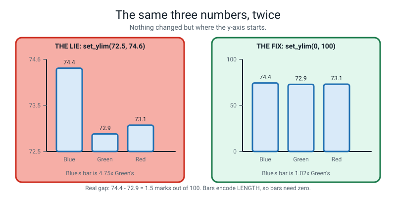

# 📝 Term 3 Practice Test — Weeks 19–27

[⬅ Term 2 test](term-2-test.md) · [Assessments home](README.md) · [Course home](../README.md) · [Term 4 test ➡](term-4-test.md)

---

```
   ┌──────────────────────────────────────────────────────────────────────┐
   │                                                                      │
   │   AI ACADEMY · LEVEL 2 BUILDER                                       │
   │   TERM 3 PRACTICE TEST — Real Tables, Honest Pictures                │
   │   Covers Weeks 19–27. Nothing later appears anywhere on this paper.   │
   │   Weeks 1–18 syntax may appear, but is never the thing being tested. │
   │                                                                      │
   │   TIME ALLOWED   60 minutes                                          │
   │   TOTAL MARKS    60                                                  │
   │                                                                      │
   │   Section A   12 multiple choice        1 mark each     12 marks     │
   │   Section B    6 "what does this print" 3 marks each    18 marks     │
   │   Section C    4 find-and-fix-the-bug   3 marks each    12 marks     │
   │   Section D    3 write-the-code         4 marks each    12 marks     │
   │   Section E    1 extended question      6 marks          6 marks     │
   │                                                                      │
   │   ⛔  NO COMPUTER. THIS PAPER IS DONE WITH A PENCIL.                 │
   │                                                                      │
   │      This is the arithmetic-heavy paper. Wherever you divide,        │
   │      WRITE THE DIVISION DOWN. "27.0" on its own scores less than     │
   │      "(24 + 31 + 0) ÷ 3 = 55 ÷ 3 = 18.33".                          │
   │                                                                      │
   │   INSTRUCTIONS                                                       │
   │   · Write in pencil. Answer every question.                          │
   │   · Section A: circle ONE letter. Write "not sure" beside a guess.   │
   │   · Section B: write EVERY line of output, in order. When pandas     │
   │     prints a Series it also prints its name and dtype — write those. │
   │   · Section C: three things — what Python is telling you, the line,  │
   │     and the fixed line written out in full.                          │
   │   · Section D: indentation counts. Every chart needs three labels.   │
   │   · Section E: a paragraph, not a list. Show the arithmetic.         │
   │                                                                      │
   │   WHAT IS ALLOWED                                                    │
   │   ✅  Pencil, pen, eraser, ruler with millimetres                     │
   │   ✅  Two blank sheets of rough paper, and graph paper if you like    │
   │   ✅  A calculator — but the division must still be written out      │
   │   ❌  A COMPUTER. No Python, no phone, no editor, no terminal.       │
   │   ❌  The student guide, the workbook, the glossary, your notes      │
   │   ❌  Your own cleaning logs from weeks 23 and 24                    │
   │   ❌  A search engine, a chatbot, another person                     │
   │                                                                      │
   └──────────────────────────────────────────────────────────────────────┘
```

> **🧑‍🏫 Teacher, read this once before you hand the paper out.** You do not need to know pandas. Set a
> timer for 60 minutes and read the "what is allowed" box out loud. **Every code block on this paper and
> in the answer key was run on Python 3.10 with numpy 1.26, pandas 1.5 and matplotlib 3.7, and the real
> output pasted in.**
>
> **One thing to say out loud before they start.** Two questions on this paper produce a *different
> answer* depending only on the **order** you do things in, with no error message either way. That is
> the whole of Term 3 in one sentence, and if a student notices it unprompted, tell them so.

---

## 📐 The picture to draw when you get stuck


*Figure T3.1 — `axis=0` walks **down**, giving one answer per **column**. `axis=1` walks **across**, giving one answer per **row**. Before you compute anything, count the answers you expect. If you expected 3 and got 4, you picked the wrong axis — and there will be no error message to tell you.*

> **💡 Try this on every array question.** Write the shape first. `(3, 3)` means three rows, three
> columns. Then write "how many answers do I expect?" **before** you do any arithmetic. That one line
> catches nearly every axis mistake, and it earns marks even when the arithmetic then goes wrong.

---

# 🅰️ Section A — Multiple Choice

*12 questions · 1 mark each · circle ONE letter · the week each question comes from is in brackets*

---

**A1.** [W19] `rain` has shape `(3, 3)` — three cities down, three months across. How many numbers does
`rain.mean(axis=0)` hand back, and what is each one?

- (a) 1 number — the mean of everything
- (b) 3 numbers — one mean per **column** (one per month)
- (c) 3 numbers — one mean per **row** (one per city)
- (d) 9 numbers — one per cell

---

**A2.** [W19] What does `rain[:, 0]` give you?

- (a) The first row
- (b) The whole first **column**
- (c) The single value in row 0, column 0
- (d) An error — you need two numbers

---

**A3.** [W20] `marks` is an array of 6 values. `mask = marks > 60` is `True` four times. How long is
`mask`, and how long is `marks[mask]`?

- (a) `mask` is 4 long, `marks[mask]` is 4 long
- (b) `mask` is 6 long, `marks[mask]` is 6 long
- (c) `mask` is 6 long, `marks[mask]` is 4 long
- (d) `mask` is 4 long, `marks[mask]` is 6 long

---

**A4.** [W21] A DataFrame's **index** is…

- (a) the first column of your data
- (b) the row labels — not one of the columns
- (c) the list of column names
- (d) the number of rows

---

**A5.** [W21] `df.shape` prints `(4, 3)`. What does that mean?

- (a) 4 columns and 3 rows
- (b) 4 rows and 3 columns
- (c) 4 rows, 3 of which are complete
- (d) 12 cells arranged 4 by 3, but you cannot tell which way round

---

**A6.** [W22] A DataFrame has index `[3, 2, 1, 0]` and its first column is `name`, holding
`Asha, Ben, Cara, Dev` in that order. What do `df.loc[1, "name"]` and `df.iloc[1, 0]` give?

- (a) Both give `Ben`
- (b) Both give `Cara`
- (c) `loc` gives `Cara`, `iloc` gives `Ben`
- (d) `loc` gives `Ben`, `iloc` gives `Cara`

---

**A7.** [W22] Which line keeps **only the rows** where age is over 12?

- (a) `df.loc["age" > 12]`
- (b) `df[df["age"] > 12]`
- (c) `df["age"] > 12`
- (d) `df.sort_values("age")`

---

**A8.** [W23] `df.isna().sum()` hands back…

- (a) `True` or `False` for the whole table
- (b) One count of missing values **per column**
- (c) The total number of missing values, as one number
- (d) The rows that have missing values

---

**A9.** [W23] You fill 12 missing ages with `df["age"].fillna(12)`. What must go in the cleaning log?

- (a) Nothing — the code is the log
- (b) That you filled them, and **why 12**
- (c) Only the number of rows changed
- (d) The time you did it

---

**A10.** [W24] `df.groupby("house")["runs"].mean()` gives Red an average of `51.0`. What does that
number **not** tell you?

- (a) Which house it belongs to
- (b) How many rows the average came from
- (c) What column was averaged
- (d) Whether the numbers were runs

---

**A11.** [W25] Which three lines turn a chart from a decoration into evidence?

- (a) `figsize`, `dpi` and `bbox_inches`
- (b) `set_title`, `set_xlabel` and `set_ylabel`
- (c) `plot`, `bar` and `scatter`
- (d) `legend`, `set_ylim` and `savefig`

---

**A12.** [W26, W27] You want to know whether hours of practice go with higher scores. Which chart, and
what does the number `r` from `df["hours"].corr(df["score"])` **not** prove?

- (a) A histogram; `r` does not prove the data is normal
- (b) A bar chart; `r` does not prove the bars are the right height
- (c) A scatter plot; `r` does not prove that practice **causes** the higher score
- (d) A line chart; `r` does not prove the line is straight

---

# 🅱️ Section B — What Does This Print?

*6 questions · 3 marks each · 18 marks*

**Write every line of output, in order.** For pandas, copy the shape of the printout: a Series prints
its index down the left, then a `Name:` line, then a `dtype:` line. Write all of them.

---

**B1.** [W19]

```python
import numpy as np

rain = np.array([[12, 40, 5],
                 [8, 33, 2],
                 [20, 51, 9]])
print(rain.shape)
print(rain[1, 2])
print(rain[:, 0])
print(rain.sum(axis=1))
```

*Four lines of output.*

```
   1. ________________________________
   2. ________________________________
   3. ________________________________
   4. ________________________________
```

**Before you compute line 4: how many numbers should it hand back, and why?**

________________________________________________________________

---

**B2.** [W20]

```python
import numpy as np

marks = np.array([45, 62, 71, 88, 39, 95])
mask = marks > 60
print(mask)
print(marks[mask])
print(len(marks[mask]))
print(marks.min(), marks.max())
print(np.round(marks / 100, 2))
```

*Five lines of output.*

```
   1. ________________________________
   2. ________________________________
   3. ________________________________
   4. ________________________________
   5. ________________________________
```

---

**B3.** [W21]

```python
import pandas as pd

df = pd.DataFrame({
    "day": ["Mon", "Tue", "Wed", "Thu"],
    "steps": [4200, 5100, 3800, 6400],
    "screen_min": [95, 120, 60, 150],
})
print(df.shape)
print(df["steps"])
print(df["steps"].mean())
```

*The middle one takes **six** lines. Eight lines of output in total.*

```
   1. ________________________________
   2. ________________________________
   3. ________________________________
   4. ________________________________
   5. ________________________________
   6. ________________________________
   7. ________________________________
   8. ________________________________
```

---

**B4.** [W22] This DataFrame has a **custom index**. Look at it carefully.

```python
import pandas as pd

df = pd.DataFrame({
    "name": ["Asha", "Ben", "Cara", "Dev"],
    "age": [13, 11, 14, 12],
    "score": [80, 55, 92, 67],
}, index=[3, 2, 1, 0])

print(df.loc[1, "name"])
print(df.iloc[1, 0])
print(df.loc[3, "score"])
print(df.iloc[3, 2])
older = df[df["age"] > 12]
print(len(older))
print(df.sort_values("score").iloc[0]["name"])
```

*Six lines of output.*

```
   1. ________________________________
   2. ________________________________
   3. ________________________________
   4. ________________________________
   5. ________________________________
   6. ________________________________
```

---

**B5.** [W23, W24] Read the `house` column carefully — the spellings are not all the same.

```python
import pandas as pd
import numpy as np

df = pd.DataFrame({
    "house": ["Blue", "blue ", "Red", "Red", "Blue"],
    "runs": [24, 24, 51, np.nan, 33],
})
print(df.isna().sum())
df["house"] = df["house"].str.strip().str.title()
print(df.groupby("house")["runs"].mean())
print(df.groupby("house")["runs"].count())
```

*Write all three printouts in full, including their `dtype:` lines.*

```
   ________________________________________________________

   ________________________________________________________

   ________________________________________________________

   ________________________________________________________

   ________________________________________________________

   ________________________________________________________

   ________________________________________________________

   ________________________________________________________

   ________________________________________________________

   ________________________________________________________

   ________________________________________________________
```

**Red's mean is a whole number and Blue's is not. In one sentence, say why — and say how many rows
Red's mean actually came from.**

________________________________________________________________

---

**B6.** [W24, W27]

```python
import pandas as pd

df = pd.DataFrame({
    "hours": [0.5, 1.0, 1.5, 2.0, 2.5, 3.0],
    "score": [52, 58, 61, 70, 74, 81],
})
df["score_per_hour"] = df["score"] / df["hours"]
print(df["score_per_hour"].round(1))
print(round(df["hours"].corr(df["score"]), 3))
print(df["score"].max() - df["score"].min())
```

*The first takes **eight** lines. Ten lines of output in total.*

```
   1. ________________________________
   2. ________________________________
   3. ________________________________
   4. ________________________________
   5. ________________________________
   6. ________________________________
   7. ________________________________
   8. ________________________________
   9. ________________________________
  10. ________________________________
```

**`score_per_hour` falls from 104.0 to 27.0. Does that mean practising more makes you worse? Explain
in one sentence.**

________________________________________________________________

---

# 🅲 Section C — Find and Fix the Bug

*4 questions · 3 marks each · 12 marks*

| | | Marks |
|---|---|:--:|
| **1** | **Say what Python is telling you**, in your own words. | 1 |
| **2** | **Point at the line** that has to change. Give its number. | 1 |
| **3** | **Write the fixed line out in full.** | 1 |

---

**C1.** [W19] This was meant to print the first month's rainfall for all three cities.

```python
1  import numpy as np
2
3  rain = np.array([[12, 40, 5],
4                   [8, 33, 2],
5                   [20, 51, 9]])
6  for city in range(1, 4):
7      print(rain[city, 0])
```

```text
8
20
Traceback (most recent call last):
  File "rain.py", line 7, in <module>
    print(rain[city, 0])
IndexError: index 3 is out of bounds for axis 0 with size 3
```

**1. What is Python telling you?** ______________________________________________

**2. Line number:** ______

**3. The fixed line:** ______________________________________________

**Why did `12` never print?** ______________________________________________

---

**C2.** [W21, W22] This was meant to print the average age.

```python
1  import pandas as pd
2
3  df = pd.DataFrame({
4      "name": ["Asha", "Ben", "Cara"],
5      "age": [13, 11, 14],
6  })
7  print(df["Age"].mean())
```

The traceback is **twenty lines long**. Here it is, with the library's own file paths shortened:

```text
Traceback (most recent call last):
  File ".../pandas/core/indexes/base.py", line 3802, in get_loc
    return self._engine.get_loc(casted_key)
  File "pandas/_libs/index.pyx", line 138, in ...IndexEngine.get_loc
  File "pandas/_libs/hashtable_class_helper.pxi", line 5745, in ...get_item
KeyError: 'Age'

The above exception was the direct cause of the following exception:

Traceback (most recent call last):
  File "ages.py", line 7, in <module>
    print(df["Age"].mean())
  File ".../pandas/core/frame.py", line 3807, in __getitem__
    indexer = self.columns.get_loc(key)
  File ".../pandas/core/indexes/base.py", line 3804, in get_loc
    raise KeyError(key) from err
KeyError: 'Age'
```

**1. What is Python telling you?** ______________________________________________

**2. Line number — and this is the real question: how did you find it in twenty lines?**

________________________________________________________________

**3. The fixed line:** ______________________________________________

---

**C3.** [W23] This was meant to force the ages to whole numbers.

```python
1  import pandas as pd
2  import numpy as np
3
4  df = pd.DataFrame({
5      "name": ["Asha", "Ben", "Cara"],
6      "age": [13, np.nan, 14],
7  })
8  df["age"] = df["age"].astype(int)
9  print(df)
```

The last two lines of the traceback:

```text
    raise IntCastingNaNError(
pandas.errors.IntCastingNaNError: Cannot convert non-finite values (NA or inf) to integer
```

**1. What is Python telling you?** ______________________________________________

**2. Line number:** ______

**3. What has to happen BEFORE line 8, and what must you write down when you do it?**

________________________________________________________________

---

**C4.** [W25] This was meant to draw a line chart.

```python
1  import matplotlib.pyplot as plt
2
3  days = [1, 2, 3, 4]
4  steps = [4200, 5100, 3800, 6400]
5
6  ax = plt.subplots(figsize=(6, 4))
7  ax.plot(days, steps, marker="o")
```

```text
Traceback (most recent call last):
  File "chart.py", line 7, in <module>
    ax.plot(days, steps, marker="o")
AttributeError: 'tuple' object has no attribute 'plot'
```

**1. What is Python telling you?** ______________________________________________

**2. Line number:** ______

**3. The fixed line:** ______________________________________________

---

# 🅳 Section D — Write the Code

*3 questions · 4 marks each · 12 marks*

Write real Python. You may not use anything from after Week 27 (so: no scikit-learn, no models).

---

**D1.** [W21, W22] Write code that builds this table as a DataFrame and then interrogates it.

| day | steps | screen_min |
|---|---|---|
| Mon | 4200 | 95 |
| Tue | 5100 | 120 |
| Wed | 3800 | 60 |
| Thu | 6400 | 150 |
| Fri | 5500 | 110 |

It must:
1. build the DataFrame and print its `shape`
2. keep only the days with **more than 5000 steps**, and print how many survived out of how many
3. print those surviving days sorted by `steps`, **highest first**
4. print Wednesday's `day` using `loc`, and Wednesday's `steps` using `iloc`

```
   ________________________________________________________

   ________________________________________________________

   ________________________________________________________

   ________________________________________________________

   ________________________________________________________

   ________________________________________________________

   ________________________________________________________

   ________________________________________________________

   ________________________________________________________

   ________________________________________________________
```

---

**D2.** [W23, W24] Here is a broken six-row table. **Copy nothing** — write the cleaning code that goes
underneath it.

```python
import pandas as pd
import numpy as np

df = pd.DataFrame({
    "house": ["Blue", "blue ", " BLUE", "Red", "red", "Red "],
    "runs": [24, 31, np.nan, 51, 51, 40],
})
```

Write code that, **in the right order**:

1. prints the shape before anything happens, and the missing-value count per column
2. tidies the four spellings of each house name into one
3. fills the hole in `runs`, then forces `runs` to whole numbers
4. removes duplicate rows, prints the shape after, and prints the mean runs per house **with the row
   count for each house**

**The order of steps 2 and 4 matters and there is no error message either way.** Get it right.

```
   ________________________________________________________

   ________________________________________________________

   ________________________________________________________

   ________________________________________________________

   ________________________________________________________

   ________________________________________________________

   ________________________________________________________

   ________________________________________________________

   ________________________________________________________

   ________________________________________________________

   ________________________________________________________
```

---

**D3.** [W25, W26] You have this DataFrame of nine students and their clubs:

```python
df = pd.DataFrame({
    "club": ["chess", "music", "art", "chess", "art", "art", "music", "chess", "art"],
    "score": [78, 65, 71, 82, 69, 74, 60, 88, 77],
})
```

Write code that draws and **saves** a bar chart of **how many students are in each club**. It must:

- count the rows per club with the right one-line tool
- make the figure and the drawing box in the pattern this course uses
- carry all **three** labels, and the title must state a **finding**, not a topic
- be saved to a PNG file

```
   ________________________________________________________

   ________________________________________________________

   ________________________________________________________

   ________________________________________________________

   ________________________________________________________

   ________________________________________________________

   ________________________________________________________

   ________________________________________________________

   ________________________________________________________
```

**Write the title you chose:** ______________________________________________

---

# 🅴 Section E — The Extended Question

*1 question · 6 marks · about 12 minutes · write a paragraph, not a list. Show your arithmetic.*

---

**E1.** [W24, W25, W27] A school newsletter is going to print a chart. Here is the real table it came
from, printed straight from pandas:

```text
   house  mean_score  students
0   Blue        74.4        14
1  Green        72.9        12
2    Red        73.1        12
```

The student who made the chart wrote this:

```python
fig, ax = plt.subplots(figsize=(6, 4))
ax.bar(df["house"], df["mean_score"])
ax.set_ylim(72.5, 74.6)
ax.set_title("Blue House pulls clear")
ax.set_xlabel("House")
ax.set_ylabel("Mean score")
fig.savefig("houses.png", dpi=120, bbox_inches="tight")
```

On the printed chart, **Blue's bar is nearly five times as tall as Green's.** The Blue House captain
posts it with the caption *"proof that Blue works harder"*.

Write a paragraph answering **all four** of these:

1. **Do the arithmetic.** What is the real gap between Blue and Green, in marks? Write it as a share of
   the 100-mark scale. Then explain, with numbers, how one line of code turned that gap into a bar
   nearly five times taller.
2. Name the **one line** that does the exaggerating, and write the change that fixes it.
3. The table has a `students` column. **Name one thing the chart hides** that this column reveals, and
   one thing that neither the chart nor the table can tell you.
4. Rewrite the **title** so it is honest, and say what the captain's caption would have to become.

```
   ______________________________________________________________________

   ______________________________________________________________________

   ______________________________________________________________________

   ______________________________________________________________________

   ______________________________________________________________________

   ______________________________________________________________________

   ______________________________________________________________________

   ______________________________________________________________________

   ______________________________________________________________________

   ______________________________________________________________________

   ______________________________________________________________________

   ______________________________________________________________________
```

---

---
---

# 📊 Marking Scheme

**Total: 60 marks.**

## Section A — 12 marks

| Q | Answer | Mark | Week |
|:--:|:--:|:--:|:--:|
| A1 | **(b)** | 1 | W19 |
| A2 | **(b)** | 1 | W19 |
| A3 | **(c)** | 1 | W20 |
| A4 | **(b)** | 1 | W21 |
| A5 | **(b)** | 1 | W21 |
| A6 | **(c)** | 1 | W22 |
| A7 | **(b)** | 1 | W22 |
| A8 | **(b)** | 1 | W23 |
| A9 | **(b)** | 1 | W23 |
| A10 | **(b)** | 1 | W24 |
| A11 | **(b)** | 1 | W25 |
| A12 | **(c)** | 1 | W26, W27 |

No half marks. Two letters circled scores 0.

## Section B — 18 marks

**3 marks per question, on the same ladder as Terms 1 and 2.** For pandas printouts, use this rule:

| | Marks |
|---|:--:|
| The **numbers** all correct and in the right order | 2 of the 3 |
| The **shape of the printout** also right — index down the left, `Name:` line, `dtype:` line | the 3rd |
| Numbers right, `dtype` line missing or wrong | 2 |
| Correct working visible (a drawn grid, a written division) but wrong answer | **1, always** |

| Q | The real output | Marks | The trap |
|:--:|---|:--:|---|
| **B1** | `(3, 3)` / `2` / `[12  8 20]` / `[57 43 80]` + the "3, one per row" sentence | 2 + 1 | `axis=1` gives one per **row**, so three answers, not three columns |
| **B2** | `[False  True  True  True False  True]` / `[62 71 88 95]` / `4` / `39 95` / `[0.45 0.62 0.71 0.88 0.39 0.95]` | 3 | The mask is 6 long; the selection is 4 long |
| **B3** | `(4, 3)` then the 6-line Series then `4875.0` | 3 | The Series prints its index 0–3, plus `Name: steps` and `dtype: int64` |
| **B4** | `Cara` / `Ben` / `80` / `67` / `2` / `Ben` | 3 | `loc[1]` is the row **labelled** 1; `iloc[1]` is the row in **position** 1 |
| **B5** | see key — `Red 51.0`, `Blue 27.0`, counts `Blue 3`, `Red 1` + the sentence | 2 + 1 | Red's mean came from **one** row, because `groupby` skips the `NaN` |
| **B6** | `104.0 / 58.0 / 40.7 / 35.0 / 29.6 / 27.0` + Series lines / `0.994` / `29` + the sentence | 2 + 1 | Dividing a score by hours makes the number fall automatically — it is an artefact, not a finding |

**B1's sentence (1 mark):** "3 numbers, one per row, because `axis=1` walks across." Both the count and
the direction needed.

**B5's sentence (1 mark):** must say that `groupby` **skipped the missing value**, so Red's `51.0` is
the average of **one** row out of two. Saying "because of the NaN" without the row count = 0.

**B6's sentence (1 mark):** must say the fall is arithmetic, not evidence — dividing by a bigger number
gives a smaller answer whatever the scores do. A student who notices that `corr` is `0.994` (strongly
**up**) while `score_per_hour` falls has earned the mark twice over.

> **🧑‍🏫 Be generous about numpy's column padding, strict about commas and dtypes.** `[12 8 20]` gets the
> mark; `[12, 8, 20]` does not, because commas mean list. And a pandas Series without its `dtype:` line
> loses the third mark, because that line is where Week 21 said the `float64`-instead-of-`int64` bug
> announces itself.

## Section C — 12 marks

| Q | 1 · Meaning (1 mark) | 2 · Line (1 mark) | 3 · Fix / extra (1 mark) |
|:--:|---|:--:|---|
| **C1** | You asked for row 3 of a 3-row array. The rows are numbered 0, 1, 2. The message even names the axis: `axis 0` is the row direction. | 6 | `for city in range(3):` — and `12` never printed because the loop started at 1, skipping row 0 |
| **C2** | There is no column called `Age`. There is one called `age`. Column names are **case-sensitive**. | 7 | The method mark: **read from the bottom**, and skip every `File` line whose path is inside pandas. The only line about *your* file is `File "ages.py", line 7`. Fix: `print(df["age"].mean())` |
| **C3** | You cannot turn a missing value into a whole number, because there is no whole number that means "I don't know". | 8 | `df["age"] = df["age"].fillna(12)` **before** line 8 — and a line in the cleaning log saying what you filled and **why** |
| **C4** | `plt.subplots()` hands back **two** things and you caught them both in one box, so `ax` is holding a pair, and a pair has no `.plot`. | 6 | `fig, ax = plt.subplots(figsize=(6, 4))` |

**Marking rules:**

- **C2's real mark is the method, not the answer.** Any student can spot `Age` vs `age` in a two-line
  file. The skill being tested is *navigating a twenty-line traceback*, and the answer is: last line
  names the problem, and the only `File` line that matters is the one naming a file **you** wrote.
  Accept "I looked for the line that wasn't in pandas" — that is exactly right.
- **C3: no marks for `.fillna(0)` with no justification.** Filling an unknown age with 0 creates a
  newborn in your data and drags every average down. Any *stated, defensible* value earns the mark —
  the class median, the year-group age, 12 — as long as the reason is written. **The reason is the mark.**
- **C4: do not accept `ax = plt.subplots()[1]`.** It runs. It is also unreadable, and it throws away
  `fig`, which you need for `savefig`. Mark it wrong and show the two-name version.

## Section D — 12 marks

### D1 — 4 marks

| Row | Mark for | Marks |
|---|---|:--:|
| The frame | `pd.DataFrame({...})` with three named columns, and `shape` printed | 1 |
| The filter | `df[df["steps"] > 5000]` — strictly greater | 1 |
| Row counts + sort | Both counts printed **and** `sort_values("steps", ascending=False)` | 1 |
| `loc` and `iloc` | Wednesday by label with `loc`, and by position with `iloc` | 1 |

```python
import pandas as pd

df = pd.DataFrame({
    "day": ["Mon", "Tue", "Wed", "Thu", "Fri"],
    "steps": [4200, 5100, 3800, 6400, 5500],
    "screen_min": [95, 120, 60, 150, 110],
})
print(df.shape)
print(df.head())

busy = df[df["steps"] > 5000]                                  # keep the rows that pass
print(f"Days over 5000 steps: {len(busy)} out of {len(df)}")
print(busy.sort_values("steps", ascending=False))               # highest first

print(df.loc[2, "day"], df.iloc[2, 1])                          # Wed, by label then by position
```

```text
(5, 3)
   day  steps  screen_min
0  Mon   4200          95
1  Tue   5100         120
2  Wed   3800          60
3  Thu   6400         150
4  Fri   5500         110
Days over 5000 steps: 3 out of 5
   day  steps  screen_min
3  Thu   6400         150
4  Fri   5500         110
1  Tue   5100         120
Wed 3800
```

### D2 — 4 marks

| Row | Mark for | Marks |
|---|---|:--:|
| Before-state | Shape printed, and `df.isna().sum()` | 1 |
| Tidying text | `.str.strip().str.title()`, **strip before title** | 1 |
| `fillna` then `astype(int)` | In that order, with a stated fill value | 1 |
| **Order and reporting** | `drop_duplicates()` **after** the tidying, shape after, and the group means **with counts** | 1 |

```python
import pandas as pd
import numpy as np

df = pd.DataFrame({
    "house": ["Blue", "blue ", " BLUE", "Red", "red", "Red "],
    "runs": [24, 31, np.nan, 51, 51, 40],
})

print("shape before:", df.shape)
print(df.isna().sum())

df["house"] = df["house"].str.strip().str.title()   # STEP 1 — tidy the text first
df["runs"] = df["runs"].fillna(0)                   # STEP 2 — fill the hole, on purpose
df["runs"] = df["runs"].astype(int)                 # STEP 3 — now it can be whole numbers
df = df.drop_duplicates()                           # STEP 4 — only now do duplicates match

print("shape after:", df.shape)
print(df.groupby("house")["runs"].mean().round(2))
print(df.groupby("house")["runs"].count())
```

```text
shape before: (6, 2)
house    0
runs     1
dtype: int64
shape after: (5, 2)
house
Blue    18.33
Red     45.50
Name: runs, dtype: float64
house
Blue    3
Red     2
Name: runs, dtype: int64
```

> **🧑‍🏫 This is the single most important mark on the paper. Read the next box before you mark it.**

**The order really changes the answer.** Run with `drop_duplicates()` **first**, before the text is
tidied:

```text
shape after dedup-first: (6, 2)
house
Blue    18.33
Red     47.33
Name: runs, dtype: float64
house
Blue    3
Red     3
Name: runs, dtype: int64
```

**Red is 45.50 one way and 47.33 the other.** Nothing crashed. No warning. The rows `Red 51` and
`red 51` are the *same match recorded twice*, and until `.str.title()` has made them spell the same,
`drop_duplicates` cannot see that. So the wrong order leaves a phantom innings in the data and lifts
Red's average by nearly two runs.

**Award the fourth mark only for the right order.** Then show the student both outputs side by side —
this is the moment Term 3 lands.

### D3 — 4 marks

| Row | Mark for | Marks |
|---|---|:--:|
| The count | `df["club"].value_counts()` — not a raw column | 1 |
| The pattern | `fig, ax = plt.subplots(figsize=(6, 4))` and `ax.bar(counts.index, counts.values)` | 1 |
| Three labels | `set_title`, `set_xlabel`, `set_ylabel` — all three | 1 |
| Title states a finding + saved | Title says what the chart *shows*, and `fig.savefig(...)` is there | 1 |

```python
import matplotlib.pyplot as plt
import pandas as pd

df = pd.DataFrame({
    "club": ["chess", "music", "art", "chess", "art", "art", "music", "chess", "art"],
    "score": [78, 65, 71, 82, 69, 74, 60, 88, 77],
})

counts = df["club"].value_counts()          # one number per club — the bar chart's raw material
print(counts)

fig, ax = plt.subplots(figsize=(6, 4))      # one figure, one drawing box
ax.bar(counts.index, counts.values)         # names along the bottom, counts up the side
ax.set_title("Art has twice as many members as music")
ax.set_xlabel("Club")
ax.set_ylabel("Number of students")
fig.savefig("clubs.png", dpi=120, bbox_inches="tight")
print("saved clubs.png")
```

```text
art      4
chess    3
music    2
Name: club, dtype: int64
saved clubs.png
```

**The title mark, judged strictly:**

| Title | Mark | Why |
|---|:--:|---|
| `"Art has twice as many members as music"` | ✅ | A finding. 4 and 2. You can check it against the chart |
| `"Club membership"` | ❌ | A topic. It names the subject and says nothing |
| `"Bar chart of clubs"` | ❌ | Describes the *chart*, not the *world* |
| `"Art is the biggest club, with 4 of the 9 students"` | ✅ | A finding with its denominator. Better than the model answer |

**No marks lost for** `ax.bar(counts.index, counts.values)` being written as `counts.plot.bar(ax=ax)` —
except that this course never taught that, so ask where they found it.

**Marks lost for** `ax.bar(df["club"], df["score"])`. It runs, draws **nine** bars stacked into three
columns, and means nothing. No error, no warning. A bar chart needs **one number per category**, which
means you must summarise first.

## Section E — 6 marks, marked with the rubric below

| Level | Marks |
|---|:--:|
| 4 · Exceptional | 6 |
| 3 · Proficient | 5 |
| 2 · Developing | 3–4 |
| 1 · Beginning | 1–2 |
| Nothing usable | 0 |

### E1 rubric

| | **1 · Beginning** | **2 · Developing** | **3 · Proficient** | **4 · Exceptional** |
|---|---|---|---|---|
| **The arithmetic** | No numbers | "The gap is small" with no figure | States the gap as **1.5 marks**, and as **1.5 out of 100**, with the subtraction visible | Also computes the axis fraction: the axis is only 2.1 marks tall, Blue fills 1.9 of it and Green 0.4, so `1.9 ÷ 0.4 = 4.75` — the exaggeration is quantified, not just named |
| **The guilty line** | Not identified | Blames the chart in general | Names `ax.set_ylim(72.5, 74.6)` and gives the fix `ax.set_ylim(0, 100)` | Also notes that the y label says "Mean score" with **no scale**, so a reader has no way to know 74 is out of 100 |
| **What is hidden** | Nothing named | "It hides some data" | Uses `students`: Blue's average came from **14** rows and the others from 12, so the three bars are not equally solid. Names one thing neither shows — the spread inside each house, or *why* | Also notices the averages are within one and a half marks of each other on samples of 12–14, which is well inside the noise you would expect from swapping two students between houses |
| **Honest title and caption** | None | A vaguer title | A title stating the real finding — "The three houses are within 1.5 marks of each other" — and a caption that drops the causal claim | The caption is rewritten as something the data *can* support, and the student says explicitly that "works harder" is a **cause** claim that no bar chart of averages can ever make |
| **Writing** | One fragment | A list of words | A paragraph a stranger could follow | A paragraph the newsletter could print unchanged, as a correction |

### A model level-4 answer (about 240 words)

> The real gap is **74.4 − 72.9 = 1.5 marks**, which on a 100-mark scale is **1.5 out of 100, or 0.015
> of the whole thing**. The reason it looks enormous is `ax.set_ylim(72.5, 74.6)`. That axis is only
> **2.1 marks tall**, and the bars are drawn from its bottom, so Blue's bar is `74.4 − 72.5 = 1.9`
> marks long and Green's is `72.9 − 72.5 = 0.4` marks long. `1.9 ÷ 0.4 = 4.75`, and that is exactly the
> "nearly five times taller" you can see — a picture of 4.75 standing in for a difference of 1.5. The
> fix is one line: `ax.set_ylim(0, 100)`, and while I am there the y label should say "Mean score (out
> of 100)", because "Mean score" alone gives the reader no scale to judge 74 against. The `students`
> column shows what the chart hides: Blue's average came from **14** students and the other two from
> **12**, so the bars are not equally trustworthy, and moving two good students from Green to Blue would
> move both averages by more than 1.5 marks. What neither the chart nor the table can tell you is the
> spread inside each house, or anything about *why*. So the honest title is **"The three houses are
> within 1.5 marks of each other"**. And the caption cannot say "proof that Blue works harder", because
> "works harder" is a **cause** and this is three averages. It could say: *"Blue's mean was 1.5 marks
> above Green's, from 14 students against 12."* That is all it says.

---

# ✅ Full Answer Key

> **🧑‍🏫 Do not photocopy this page for students until after the test is marked.** **Every code block
> below was run on Python 3.10 / numpy 1.26 / pandas 1.5 / matplotlib 3.7 and the output pasted in
> unedited.**

<details>
<summary><b>A1 — (b) · W19</b></summary>

**(b) 3 numbers, one mean per column.** `axis=0` is the **down** direction. It walks down each column,
collapsing the three rows into one answer, and does that once per column.

```python
import numpy as np
rain = np.array([[12, 40, 5], [8, 33, 2], [20, 51, 9]])
print(rain.mean(axis=0))
print(rain.mean(axis=1))
```

```text
[13.33333333 41.33333333  5.33333333]
[19.         14.33333333 26.66666667]
```

Hand-check the first one: column 0 is 12, 8, 20. `40 ÷ 3 = 13.333…`. ✅

- **(c) is the answer to `axis=1`**, and it is the most common wrong answer, because "axis 0" *sounds*
  like "the first thing, the rows". The reliable way to remember it: **`axis=0` is the axis you
  collapse.** You collapse the rows, so what survives is one answer per column.
- **(a) is `rain.mean()`** with no axis — the mean of all nine numbers, which is 20.0.
- **(d) is wrong** — there is no operation that leaves nine means.

**The habit that makes this impossible to get wrong:** before you run it, say *"I expect three answers,
one per month"*, and then check that three came back with the right labels. If your three answers are
about cities and you said months, you picked the wrong axis. **There is no error message for this.**
</details>

<details>
<summary><b>A2 — (b) · W19</b></summary>

**(b) the whole first column.** The colon means *all of them*. So `rain[:, 0]` reads "every row, column
0".

```python
import numpy as np
rain = np.array([[12, 40, 5], [8, 33, 2], [20, 51, 9]])
print(rain[:, 0])
print(rain[0, :])
print(rain[0, 0])
```

```text
[12  8 20]
[12 40  5]
12
```

- **(a) is `rain[0, :]`** — the colon on the other side. Look at the two outputs: `[12 8 20]` walks
  **down** the left edge; `[12 40 5]` walks **across** the top.
- **(c) is `rain[0, 0]`**, a single number.
- **(d) is wrong** — a colon *is* a legal thing to put in one of the two positions. That is the whole
  point of it.

**The reading order is always the same: `[rows, columns]`.** Row first. It is the same order as `shape`.
</details>

<details>
<summary><b>A3 — (c) · W20</b></summary>

**(c) the mask is 6 long, the selection is 4 long.** A mask is always the same shape as the data it
came from — one yes-or-no per value. Using it as a filter then keeps only the yeses, so the answer is
shorter.

```python
import numpy as np
marks = np.array([45, 62, 71, 88, 39, 95])
mask = marks > 60
print(mask, len(mask))
print(marks[mask], len(marks[mask]))
```

```text
[False  True  True  True False  True] 6
[62 71 88 95] 4
```

- **(a) is wrong** — the mask has to be 6 long, or it could not line up with the data.
- **(b) is wrong** — if `marks[mask]` were 6 long the filter would not have filtered anything.
- **(d) is wrong** in both halves.

**The two-step mental model Week 20 drills: look first, use second.** `marks > 60` is the *looking* —
it produces a yes/no answer for every value. `marks[mask]` is the *using*. Printing the mask on its own
before you use it is the cheapest debugging habit in Term 3, and it costs one line.
</details>

<details>
<summary><b>A4 — (b) · W21</b></summary>

**(b) the row labels, and it is not one of your columns.** Every DataFrame has one, whether you asked
for one or not.

```python
import pandas as pd
df = pd.DataFrame({"day": ["Mon", "Tue"], "steps": [4200, 5100]})
print(df)
print(df.index)
print(df.shape)
```

```text
   day  steps
0  Mon   4200
1  Tue   5100
RangeIndex(start=0, stop=2, step=1)
(2, 2)
```

Look at `shape`: `(2, 2)`. Two rows, two columns — `day` and `steps`. **The `0` and `1` down the left
are not a third column.** They are the index, and they are why `df.shape` says 2 and not 3.

- **(a) is wrong** — the first column is `day`, which is data.
- **(c) is wrong** — that is `df.columns`.
- **(d) is wrong** — that is `len(df)`.

**Why it matters, one week later:** in Week 22 `df.loc` picks by index **label** and `df.iloc` by
**position**. While the index is 0, 1, 2, 3 they agree and you cannot tell them apart. The moment you
sort or filter, the labels stay stuck to their rows and the positions renumber — and they disagree.
That is B4.
</details>

<details>
<summary><b>A5 — (b) · W21</b></summary>

**(b) 4 rows and 3 columns.** Rows first, always. Same order as `arr[rows, columns]` in Week 19, and
the same order as `np.zeros((rows, cols))` in Week 18.

```python
import pandas as pd, numpy as np
df = pd.DataFrame({"name": ["Asha", "Ben", "Cara", "Dev"],
                   "age": [13, np.nan, 14, 12],
                   "score": [80, 55, 92, 67]})
print(df.shape)
print(len(df))
print(len(df.columns))
```

```text
(4, 3)
4
3
```

- **(a) is wrong** — it is exactly backwards, and it is the mistake that turns into an axis error a
  week later.
- **(c) is wrong** — `shape` counts rows, complete or not. A row with a hole in it is still a row. To
  find the holes you need `df.isna().sum()`, and here it would report `age  1`.
- **(d) is wrong** — you absolutely can tell which way round. Rows first.
</details>

<details>
<summary><b>A6 — (c) · W22</b></summary>

**(c) `loc` gives `Cara`, `iloc` gives `Ben`.** This is the trap Week 22 exists for.

```python
import pandas as pd
df = pd.DataFrame({"name": ["Asha", "Ben", "Cara", "Dev"],
                   "age": [13, 11, 14, 12],
                   "score": [80, 55, 92, 67]}, index=[3, 2, 1, 0])
print(df)
print(df.loc[1, "name"])
print(df.iloc[1, 0])
```

```text
   name  age  score
3  Asha   13     80
2   Ben   11     55
1  Cara   14     92
0   Dev   12     67
Cara
Ben
```

Read the printed frame. The **label** `1` is on Cara's row — third one down. The **position** `1` is
Ben — second one down, because positions start at 0.

- **(a) and (b) are wrong** because they assume the two agree. They agree only when the index happens
  to be 0, 1, 2, 3 in order, which is the default and which lulls everybody.
- **(d) is wrong** — it has them the wrong way round.

**The memory hook:** `loc` = **label**. `iloc` = **integer position** (the `i` is the giveaway).

> **🧑‍🏫 If a student asks "why would anyone have a weird index?"** Because you get one for free the
> moment you filter or sort. `df[df["age"] > 12]` keeps rows 3 and 1 with their original labels
> attached, so the filtered frame's index is `[3, 1]` — and `iloc[0]` and `loc[0]` now mean completely
> different things, and `loc[0]` raises `KeyError` because there is no row labelled 0 any more.
</details>

<details>
<summary><b>A7 — (b) · W22</b></summary>

**(b) `df[df["age"] > 12]`.** Two steps in one line: the inside builds a yes/no answer per row, and the
outer brackets keep the yeses. It is Week 20's mask, wearing a DataFrame's clothes.

```python
import pandas as pd
df = pd.DataFrame({"name": ["Asha", "Ben", "Cara", "Dev"], "age": [13, 11, 14, 12]})
print(df["age"] > 12)
print(df[df["age"] > 12])
```

```text
0     True
1    False
2     True
3    False
Name: age, dtype: bool
   name  age
0  Asha   13
2  Cara   14
```

Notice the index of the result: `0` and `2`. **The labels came with the rows.** There is no row labelled
1 in that filtered frame.

- **(a) is wrong** — `"age" > 12` compares the *word* "age" to 12 and raises
  `TypeError: '>' not supported between instances of 'str' and 'int'`.
- **(c) is wrong** — that is the mask on its own. Four `True`/`False` values, no rows.
- **(d) is wrong** — sorting rearranges; it never removes.
</details>

<details>
<summary><b>A8 — (b) · W23</b></summary>

**(b) one count per column.** `isna()` makes a whole grid of `True`/`False`, then `.sum()` adds each
column up — and in Python `True` counts as 1.

```python
import pandas as pd, numpy as np
df = pd.DataFrame({"name": ["Asha", "Ben", "Cara", "Dev"],
                   "age": [13, np.nan, 14, 12],
                   "score": [80, 55, 92, 67]})
print(df.isna().sum())
```

```text
name     0
age      1
score    0
dtype: int64
```

One line per column, and the answer is `age: 1`.

- **(a) is wrong** — you get a number per column, not one verdict.
- **(c) is `df.isna().sum().sum()`** — sum it twice and you get the grand total, `1`. Occasionally
  useful; not what was asked.
- **(d) is wrong** — that is `df[df.isna().any(axis=1)]`, which is **not in this course**.

**Why this is the first line you run on any new table:** the number tells you how much of your table is
a guess before you have made a single chart. And it is a *per-column* number because holes cluster —
one column with 40 holes is a different problem from 40 columns with one each.
</details>

<details>
<summary><b>A9 — (b) · W23</b></summary>

**(b) that you filled them, and why 12.** The *why* is the mark and the *why* is the whole lesson.

```python
import pandas as pd, numpy as np
df = pd.DataFrame({"name": ["Asha", "Ben", "Cara"], "age": [13, np.nan, 14]})
print(df["age"].mean())            # before
df["age"] = df["age"].fillna(12)
print(df["age"].mean())            # after
```

```text
13.5
13.0
```

**Filling changed the answer by half a year, from one row.** That is why it goes in the log. A stranger
reading `13.0` has no way to know that half a year of it was invented by you, on a Tuesday, on the basis
of a guess.

- **(a) is wrong**, and it is the tempting one, because the code *is* a record of what happened. It is
  not a record of **why**. `fillna(12)` does not say whether 12 was the class median, the year group's
  age, or the first number you thought of. Those are three different projects.
- **(c) is not enough** — the count without the reason.
- **(d) is irrelevant.**

**The one-line format Week 23 asks for:**

```text
3. age: filled 12 missing values with 12 — the median of the 28 rows that were present. Affects mean age.
```

*What* + *how many* + *what with* + *why* + *what it changes*. Five things, one line.
</details>

<details>
<summary><b>A10 — (b) · W24</b></summary>

**(b) how many rows the average came from.** A `groupby` mean is a single number standing in front of a
crowd of unknown size, and it looks identical whether the crowd is 1 or 1,000.

```python
import pandas as pd, numpy as np
df = pd.DataFrame({"house": ["Blue", "Blue", "Red", "Red", "Blue"],
                   "runs": [24, 24, 51, np.nan, 33]})
print(df.groupby("house")["runs"].mean())
print(df.groupby("house")["runs"].count())
```

```text
house
Blue    27.0
Red     51.0
Name: runs, dtype: float64
house
Blue    3
Red     1
Name: runs, dtype: int64
```

**`Red 51.0` came from one innings.** Blue's 27.0 came from three. Printed on their own, the two numbers
look equally solid, and Red looks twice as good as Blue.

- **(a), (c) and (d) are all wrong** because the printout *does* tell you those things: the house is
  down the left, the column name is on the `Name: runs` line, and the units are the column's meaning.

**The rule Week 24 makes non-negotiable: never report a group average without its group size.** One
extra line of code, and it is the difference between a finding and a rumour.
</details>

<details>
<summary><b>A11 — (b) · W25</b></summary>

**(b) `set_title`, `set_xlabel`, `set_ylabel`.** Without them, a chart is a shape. With them, it is a
claim somebody can check.

```python
import matplotlib.pyplot as plt
days = [1, 2, 3, 4]
steps = [4200, 5100, 3800, 6400]

fig, ax = plt.subplots(figsize=(6, 4))
ax.plot(days, steps, marker="o")
ax.set_title("Steps jumped on Thursday")
ax.set_xlabel("Day of the week (1 = Monday)")
ax.set_ylabel("Steps counted")
fig.savefig("steps.png", dpi=120, bbox_inches="tight")
print("saved steps.png")
```

```text
saved steps.png
```

- **(a) is wrong** — `figsize`, `dpi` and `bbox_inches` change how big and how sharp the picture is.
  A beautiful unlabelled chart is still a decoration.
- **(c) is wrong** — those choose the *shape* of the chart, which is Week 26's question. A perfectly
  chosen scatter with no axis labels tells you nothing about what is on the axes.
- **(d) is wrong** — `legend` is only needed once there are two series, `set_ylim` is the honesty
  question in Week 27, and `savefig` writes the file. All useful, none of them the three.

**And the title rule this course keeps repeating: the title states a *finding*, not a *topic*.** "Steps
jumped on Thursday", not "Steps chart".
</details>

<details>
<summary><b>A12 — (c) · W26, W27</b></summary>

**(c) a scatter plot, and `r` does not prove practice causes the score.**

```python
import pandas as pd
df = pd.DataFrame({"hours": [0.5, 1.0, 1.5, 2.0, 2.5, 3.0],
                   "score": [52, 58, 61, 70, 74, 81]})
print(round(df["hours"].corr(df["score"]), 3))
```

```text
0.994
```

`0.994` is about as strong as a relationship in real data ever gets, and it still does not say which way
the arrow points, or whether there is an arrow at all. Three explanations fit that number equally well:

| Story | Fits `r = 0.994`? |
|---|---|
| Practising more raises the score | ✅ |
| Being good at it already makes practice enjoyable, so good students practise more | ✅ |
| Students with quiet homes both practise more **and** score higher, and the quiet home is doing the work | ✅ |

The number cannot tell them apart. **Nothing you can compute from these two columns can.**

- **(a) is wrong** — a histogram shows the spread of **one** column. It cannot show a relationship
  between two.
- **(b) is wrong** — a bar chart compares separate categories, and `hours` is a number, not a category.
- **(d) is wrong** — a line chart is for something changing over an ordered sequence, usually time. And
  `r` genuinely *is* about how straight the relationship is, so that half of (d) is true, which makes it
  the best-designed wrong answer on the paper.

**The question decides the chart:** comparison → bar. Spread → histogram. **Relationship → scatter.**
</details>

<details>
<summary><b>B1 — the 2-D array, and counting the answers before you compute them · W19</b></summary>

```python
import numpy as np

rain = np.array([[12, 40, 5],
                 [8, 33, 2],
                 [20, 51, 9]])
print(rain.shape)
print(rain[1, 2])
print(rain[:, 0])
print(rain.sum(axis=1))
```

**Real output:**

```text
(3, 3)
2
[12  8 20]
[57 43 80]
```

**The grid, with the answers written in the margins — draw this:**

```
                Jan   Feb   Mar        sum(axis=1)  →  one per ROW
        City A |  12    40     5   |        57
        City B |   8    33     2   |        43
        City C |  20    51     9   |        80
               ---------------------
   mean(axis=0)  13.3  41.3   5.3      ↑ one per COLUMN
```

| Line | Output | Why |
|---|---|---|
| `rain.shape` | `(3, 3)` | Three rows, three columns |
| `rain[1, 2]` | `2` | Row 1, column 2. Counting from 0, that is City B's March |
| `rain[:, 0]` | `[12  8 20]` | Every row, column 0 — the whole January column |
| `rain.sum(axis=1)` | `[57 43 80]` | One total per **row** |

**The sentence (1 mark):** three numbers, one per row, because `axis=1` walks **across**.

**Hand-check the sums**, which is the habit Week 19 insists on: `12 + 40 + 5 = 57` ✅ ·
`8 + 33 + 2 = 43` ✅ · `20 + 51 + 9 = 80` ✅

**And the wrong-axis version, so you can see what a silent failure looks like:**

```python
import numpy as np

rain = np.array([[12, 40, 5],
                 [8, 33, 2],
                 [20, 51, 9]])
print(rain.sum(axis=0))
```

```text
[ 40 124  16]
```

Three answers again. **Same count, completely different meaning** — those are monthly totals, not city
totals. No error, no warning, and if your labels say "City A, City B, City C" you have just published
January's total as City A's year. Counting the answers does not save you here; **checking that the
answers match the labels** does.
</details>

<details>
<summary><b>B2 — the mask, and why the answer is shorter than the question · W20</b></summary>

```python
import numpy as np

marks = np.array([45, 62, 71, 88, 39, 95])
mask = marks > 60
print(mask)
print(marks[mask])
print(len(marks[mask]))
print(marks.min(), marks.max())
print(np.round(marks / 100, 2))
```

**Real output:**

```text
[False  True  True  True False  True]
[62 71 88 95]
4
39 95
[0.45 0.62 0.71 0.88 0.39 0.95]
```

**Lay the mask under the data — this is the whole idea:**

```
   marks   45      62     71     88     39      95
   mask    False   True   True   True   False   True
           ↓                                    
   kept    (drop)  62     71     88     (drop)  95
```

| Line | Output | The idea |
|---|---|---|
| `mask` | six `True`/`False` | **Same length as the data.** One verdict per value |
| `marks[mask]` | `[62 71 88 95]` | Only the `True` slots. Four of the six |
| `len(...)` | `4` | The count. Always report it |
| `marks.min(), marks.max()` | `39 95` | Two numbers, one line, separated by a space by the comma in `print` |
| `np.round(marks / 100, 2)` | `[0.45 0.62 ...]` | Divide **all six**, round **all six**. One line, no loop |

**Two details worth a mark's worth of attention:**

- **The two spaces in `[False  True ...]`.** numpy pads to line the columns up, because `False` is
  five characters and `True` is four. On paper, a student who wrote single spaces has the answer right.
- **`marks / 100` gives floats, so `0.45` not `0.45000001`.** And `np.round(x, 2)` rounds every value
  in the array at once. The last value is `0.95`, from `95 / 100`, exactly.
</details>

<details>
<summary><b>B3 — a DataFrame, one column, and the printout's furniture · W21</b></summary>

```python
import pandas as pd

df = pd.DataFrame({
    "day": ["Mon", "Tue", "Wed", "Thu"],
    "steps": [4200, 5100, 3800, 6400],
    "screen_min": [95, 120, 60, 150],
})
print(df.shape)
print(df["steps"])
print(df["steps"].mean())
```

**Real output:**

```text
(4, 3)
0    4200
1    5100
2    3800
3    6400
Name: steps, dtype: int64
4875.0
```

**Eight lines, and the middle six are all one `print`.** Anatomy of that Series printout:

| Part | What it is |
|---|---|
| `0 1 2 3` down the left | The **index** — the row labels, carried over from the DataFrame |
| `4200 5100 3800 6400` | The values |
| `Name: steps` | Which column this Series came from |
| `dtype: int64` | The kind of number inside |

**Do not let students skip the `dtype:` line.** It is where Week 21's most confusing bug announces
itself: if one value in the column had been missing, the whole column would come back as `float64` and
print `4200.0`, `5100.0` — whole numbers wearing decimal points, for no reason a beginner can see. The
`dtype` line is the explanation, and it is always there if you read it.

**The mean, hand-checked:** `4200 + 5100 + 3800 + 6400 = 19500`, and `19500 ÷ 4 = 4875.0`. ✅
It prints `4875.0`, not `4875`, because a mean is a division and division always gives a float. Week 2,
still true fourteen weeks later.

**And `shape` is `(4, 3)`, not `(4, 4)`.** The index does not count as a column. See A4.
</details>

<details>
<summary><b>B4 — loc against iloc, on a shuffled index · W22</b></summary>

```python
import pandas as pd

df = pd.DataFrame({
    "name": ["Asha", "Ben", "Cara", "Dev"],
    "age": [13, 11, 14, 12],
    "score": [80, 55, 92, 67],
}, index=[3, 2, 1, 0])

print(df.loc[1, "name"])
print(df.iloc[1, 0])
print(df.loc[3, "score"])
print(df.iloc[3, 2])
older = df[df["age"] > 12]
print(len(older))
print(df.sort_values("score").iloc[0]["name"])
```

**Real output:**

```text
Cara
Ben
80
67
2
Ben
```

**The frame, printed, because you cannot answer this without it:**

```text
   name  age  score
3  Asha   13     80
2   Ben   11     55
1  Cara   14     92
0   Dev   12     67
   ↑
   the index — labels 3, 2, 1, 0, NOT positions
```

| Line | Output | Reading |
|---|---|---|
| `df.loc[1, "name"]` | `Cara` | The row **labelled** 1. Third row down |
| `df.iloc[1, 0]` | `Ben` | The row in **position** 1, column in position 0. Second row down |
| `df.loc[3, "score"]` | `80` | Row labelled 3 = Asha, whose score is 80 |
| `df.iloc[3, 2]` | `67` | Position 3 = the last row = Dev, column 2 = `score` |
| `len(older)` | `2` | Asha (13) and Cara (14). Dev is exactly 12, and `>` is strict |
| `sort_values("score").iloc[0]["name"]` | `Ben` | Sorted ascending, the lowest score is 55 — Ben's |

**The two pairs to point at:**

- **`loc[1]` is Cara, `iloc[1]` is Ben.** Same number, two different rows, no error either way. This is
  the whole reason `loc` and `iloc` are two words.
- **`loc[3]` is Asha, `iloc[3]` is Dev.** They are at opposite ends of the frame.

**And the last line is worth its own note.** After `sort_values`, the *positions* renumber but the
*labels* stay stuck to their rows. So `iloc[0]` reliably means "the first row of whatever I am now
holding". `loc[0]` would give you Dev — the row labelled 0 — no matter how many times you sort.
`iloc` follows the sort. `loc` follows the row.
</details>

<details>
<summary><b>B5 — the average that came from one row · W23, W24</b></summary>

```python
import pandas as pd
import numpy as np

df = pd.DataFrame({
    "house": ["Blue", "blue ", "Red", "Red", "Blue"],
    "runs": [24, 24, 51, np.nan, 33],
})
print(df.isna().sum())
df["house"] = df["house"].str.strip().str.title()
print(df.groupby("house")["runs"].mean())
print(df.groupby("house")["runs"].count())
```

**Real output:**

```text
house    0
runs     1
dtype: int64
house
Blue    27.0
Red     51.0
Name: runs, dtype: float64
house
Blue    3
Red     1
Name: runs, dtype: int64
```

**The table after `.str.strip().str.title()`, with the arithmetic in the margin:**

| row | house (tidied) | runs |
|:--:|---|:--:|
| 0 | Blue | 24 |
| 1 | Blue | 24 |
| 2 | Red | 51 |
| 3 | **Red** | **NaN** |
| 4 | Blue | 33 |

- **Blue:** `(24 + 24 + 33) ÷ 3 = 81 ÷ 3 = 27.0`, from **3** rows.
- **Red:** `51 ÷ 1 = 51.0`, from **1** row. There are two Red rows in the table. `groupby` **skipped the
  missing one entirely** — it did not treat it as 0, it simply did not count it.

**The sentence (1 mark):** Red's `51.0` is not a whole number by coincidence. It is a whole number
because it is one single innings, unaveraged — and the second Red row was silently dropped by
`groupby` because its value was missing.

**Why `27.0` has a `.0` and `51.0` does too:** the `dtype` is `float64`, because the column contains a
`NaN` and `NaN` is a float. One missing value turns the whole column decimal. That is the `dtype` line
earning its place again.

> **⚠️ Watch out — this is the shape of a real published mistake.** Print those two `groupby` lines next
> to each other and Red looks like the better house by a mile. Print only the first one — which is what
> almost everybody does — and there is nothing on the screen to tell you that 51.0 is one innings and
> 27.0 is three. **Always print the `count` next to the `mean`.** It is one extra line and it is the
> difference between a finding and an embarrassment.

**And notice `.str.strip()` came first.** `" BLUE".title()` is `" Blue"` — with the space still on the
front, and `" Blue"` is not the same string as `"Blue"`. Strip, then title. Every time.
</details>

<details>
<summary><b>B6 — the derived column that falls for arithmetic reasons · W24, W27</b></summary>

```python
import pandas as pd

df = pd.DataFrame({
    "hours": [0.5, 1.0, 1.5, 2.0, 2.5, 3.0],
    "score": [52, 58, 61, 70, 74, 81],
})
df["score_per_hour"] = df["score"] / df["hours"]
print(df["score_per_hour"].round(1))
print(round(df["hours"].corr(df["score"]), 3))
print(df["score"].max() - df["score"].min())
```

**Real output:**

```text
0    104.0
1     58.0
2     40.7
3     35.0
4     29.6
5     27.0
Name: score_per_hour, dtype: float64
0.994
29
```

**Hand-check two of them:** `52 ÷ 0.5 = 104.0` ✅ · `61 ÷ 1.5 = 40.666…`, which `.round(1)` shows as
`40.7` ✅

**The sentence (1 mark), and this is the most important idea on the paper after E1.** No. `score_per_hour`
falls because **you divided by a bigger number each time**, and the scores did not grow anything like
fast enough to keep up. Look at both columns:

| hours | score | score ÷ hours |
|:--:|:--:|:--:|
| 0.5 | 52 | 104.0 |
| 3.0 | 81 | 27.0 |

Hours went up **six times**. Score went up by a factor of `81 ÷ 52 = 1.56`. Anything divided by a
six-times-bigger number, when it only got 1.56 times bigger itself, must fall. **The falling column is
arithmetic, not evidence.**

And the direct measurement says the exact opposite: `corr` is **0.994**, which is about as strongly
"more hours goes with higher scores" as real data ever gets.

> **🧑‍🏫 This is the single most useful thing to say out loud when handing this paper back.** A derived
> column can point the other way from the thing it was derived from, and both numbers are correct. The
> question you must always ask of a "per something" column is: *did I want the total, or the rate?* If
> the answer is "the total went up", then a rate that went down is not a rebuttal — it is a different
> question, and reporting it as a rebuttal is how people mislead each other with true numbers.

**And `0.994` still does not mean practice causes the score.** See A12.
</details>

<details>
<summary><b>C1 — IndexError on axis 0, and the row that vanished · W19</b></summary>

```python
import numpy as np

rain = np.array([[12, 40, 5],
                 [8, 33, 2],
                 [20, 51, 9]])
for city in range(1, 4):
    print(rain[city, 0])
```

**Real output — two numbers, then the crash:**

```text
8
20
Traceback (most recent call last):
  File "rain.py", line 7, in <module>
    print(rain[city, 0])
IndexError: index 3 is out of bounds for axis 0 with size 3
```

**1 · What Python is telling you (1 mark).** *"You asked for row 3. There are three rows and they are
numbered 0, 1, 2."* And read the rest of the message, because numpy is being unusually helpful:
**`for axis 0`** tells you it is the **row** direction, and **`with size 3`** tells you how many there
are. Every number you need to fix it is in that one line.

**2 · Line (1 mark).** The crash is on line 7; **the line to change is line 6**, the `range`. Accept
either with the explanation.

**3 · The fix, and the second half of the bug.**

```python
import numpy as np

rain = np.array([[12, 40, 5],
                 [8, 33, 2],
                 [20, 51, 9]])

for city in range(3):        # 0, 1, 2
    print(rain[city, 0])
```

```text
12
8
20
```

**`12` never printed because the loop started at 1**, so row 0 — City A — was never asked for. Exactly
the same pair of bugs as Term 2's C1: one loud, one silent, and the silent one is worse. If the loop
had been `range(1, 3)` there would have been no crash at all, and City A would simply have been missing
from the report.

**The better fix, which removes the index entirely:**

```python
import numpy as np

rain = np.array([[12, 40, 5],
                 [8, 33, 2],
                 [20, 51, 9]])
print(rain[:, 0])
```

```text
[12  8 20]
```

One line, no loop, no off-by-one possible. This is Week 19's actual answer to the question, and a
student who wrote it should get full marks and a note saying so.
</details>

<details>
<summary><b>C2 — a twenty-line traceback, and how to read it in five seconds · W21, W22</b></summary>

```python
import pandas as pd

df = pd.DataFrame({
    "name": ["Asha", "Ben", "Cara"],
    "age": [13, 11, 14],
})
print(df["Age"].mean())
```

**The real traceback is twenty lines.** Here it is again, and this time with the only two lines that
matter marked:

```text
Traceback (most recent call last):
  File ".../pandas/core/indexes/base.py", line 3802, in get_loc      ← pandas' own code, ignore
    return self._engine.get_loc(casted_key)                          ← ignore
  File "pandas/_libs/index.pyx", line 138, in ...get_loc             ← ignore
  File "pandas/_libs/hashtable_class_helper.pxi", line 5745, in ...  ← ignore
KeyError: 'Age'

The above exception was the direct cause of the following exception:

Traceback (most recent call last):
  File "ages.py", line 7, in <module>                                ← ★ YOUR FILE. THE LINE.
    print(df["Age"].mean())                                          ← ★ YOUR CODE
  File ".../pandas/core/frame.py", line 3807, in __getitem__         ← ignore
    indexer = self.columns.get_loc(key)                              ← ignore
  File ".../pandas/core/indexes/base.py", line 3804, in get_loc      ← ignore
    raise KeyError(key) from err                                     ← ignore
KeyError: 'Age'                                                      ← ★ THE PROBLEM
```

**1 · What Python is telling you (1 mark).** *"You asked for a column called `Age`. There isn't one.
There is one called `age`."* Column names are **case-sensitive**, and pandas does not guess.

**2 · The method — this is the real mark.** Two rules, and they work on every long traceback for the
rest of your life:

| Rule | Why |
|---|---|
| **Read the last line first** | It names the *kind* of problem. `KeyError: 'Age'` — a name that was looked up and not found |
| **Find the only `File` line that names a file YOU wrote** | Everything with `pandas/` or `site-packages/` in the path is the library's own machinery. It is not broken. You are holding it wrong |

Here that is `File "ages.py", line 7`. **One line out of twenty.**

The `The above exception was the direct cause of the following exception` in the middle means "pandas
caught an inner error and re-raised a friendlier one". You can ignore the whole first half.

**3 · The fix (1 mark).**

```python
import pandas as pd

df = pd.DataFrame({
    "name": ["Asha", "Ben", "Cara"],
    "age": [13, 11, 14],
})
print(df["age"].mean())
```

```text
12.666666666666666
```

**The cheapest habit that prevents this entirely:** `print(df.columns)` the moment you load any table.

```python
import pandas as pd

df = pd.DataFrame({
    "name": ["Asha", "Ben", "Cara"],
    "age": [13, 11, 14],
})
print(df.columns)
```

```text
Index(['name', 'age'], dtype='object')
```

Five seconds, and you never guess a column name again. Real CSV files arrive with `Age`, `age`,
`AGE`, ` age` and `Age ` — all five, sometimes in the same file — and this is why Week 24 taught
`.str.strip()`.

> **🐞 If you see this error:** a `KeyError` from pandas is **always** a name that is not there, and it
> is always one of exactly four things. Check them in this order, because they are in order of how often
> they are the answer:
>
> | | Check | How |
> |:--:|---|---|
> | 1 | **Capitals** — `Age` is not `age` | `print(df.columns)` |
> | 2 | **A hidden space** — `"age "` is not `"age"` | `print(list(df.columns))` — the quotes make the space visible |
> | 3 | **A typo** — `agee`, `ag` | `print(df.columns)` |
> | 4 | **The column genuinely is not there** — you are reading the wrong file, or the header row was skipped | `print(df.head())` |
>
> Every one of the four is found by printing the column names, which is why that is the first line you
> should run after `read_csv` on any file you did not type yourself.
</details>

<details>
<summary><b>C3 — you cannot make a whole number out of "I don't know" · W23</b></summary>

```python
import pandas as pd
import numpy as np

df = pd.DataFrame({
    "name": ["Asha", "Ben", "Cara"],
    "age": [13, np.nan, 14],
})
df["age"] = df["age"].astype(int)
print(df)
```

**Real error, last two lines:**

```text
    raise IntCastingNaNError(
pandas.errors.IntCastingNaNError: Cannot convert non-finite values (NA or inf) to integer
```

**1 · What Python is telling you (1 mark).** *"One of these values is missing, and there is no whole
number that means 'missing'."* `NaN` — "not a number" — is a **float-only** idea. `int64` has no room
for it: every single one of its slots must hold an actual integer. So pandas refuses, rather than
silently choosing 0, or −1, or 2147483647.

*Decoding the words:* **non-finite** covers `NaN` (missing) and `inf` (infinity). **NA** is pandas' word
for a hole.

**2 · Line (1 mark).** Line 8.

**3 · What has to happen first, and what you must write down (1 mark).** Fill the hole **first** — and
put it in the cleaning log.

```python
import pandas as pd
import numpy as np

df = pd.DataFrame({
    "name": ["Asha", "Ben", "Cara"],
    "age": [13, np.nan, 14],
})

print("missing ages:", df["age"].isna().sum())
df["age"] = df["age"].fillna(12)      # 12 = the median age of the rows we have
df["age"] = df["age"].astype(int)
print(df)
print(df["age"].dtype)
```

```text
missing ages: 1
   name  age
0  Asha   13
1   Ben   12
2  Cara   14
int64
```

**The cleaning-log line that must accompany it:**

```text
2. age: 1 missing value filled with 12 (median of the 2 rows present) so the column could be
   made int64. This invents half a year of Ben's age. Affects mean age: 13.5 → 13.0.
```

**Why the log line, not just the code.** Look at Ben's row. It now says `12`, in the same font, in the
same column, as Asha's real 13. **There is nothing on the screen that distinguishes a measurement from
a guess.** The log is the only thing that does, and in three weeks you will not remember.

> **🧑‍🏫 If a student writes `.fillna(0)`:** ask them out loud how old a person aged 0 is. It is the
> fastest way to make the point. A zero in an age column is not a missing value, it is a newborn, and
> it drags the mean down for everyone. `fillna(0)` is right for *runs scored* and wrong for *age*, and
> the difference is not in the code — it is in what the column means.
</details>

<details>
<summary><b>C4 — plt.subplots hands back two things · W25</b></summary>

```python
import matplotlib.pyplot as plt

days = [1, 2, 3, 4]
steps = [4200, 5100, 3800, 6400]

ax = plt.subplots(figsize=(6, 4))
ax.plot(days, steps, marker="o")
```

**Real traceback:**

```text
Traceback (most recent call last):
  File "chart.py", line 7, in <module>
    ax.plot(days, steps, marker="o")
AttributeError: 'tuple' object has no attribute 'plot'
```

**1 · What Python is telling you (1 mark).** *"The thing you called `ax` is a pair, and a pair does not
know how to plot."*

`plt.subplots()` hands back **two** things at once: the **figure** (the whole sheet of paper) and the
**axes** (the box you draw inside). Catching them in one name puts the pair itself in that name.

```python
import matplotlib.pyplot as plt
print(type(plt.subplots(figsize=(6, 4))))
```

```text
<class 'tuple'>
```

**2 · Line (1 mark).** The crash is line 7; **line 6 is the line to change.** Same pattern as C1 and as
Term 2's C4: *the line that crashes is often not the line that is wrong.* By the third time a student
meets this, it should be the first thing they check.

**3 · The fix (1 mark).**

```python
fig, ax = plt.subplots(figsize=(6, 4))
ax.plot(days, steps, marker="o")
ax.set_title("Steps jumped on Thursday")
ax.set_xlabel("Day of the week (1 = Monday)")
ax.set_ylabel("Steps counted")
fig.savefig("steps.png", dpi=120, bbox_inches="tight")
print("saved steps.png")
```

```text
saved steps.png
```

**Two names, and you need both.** `ax` is where you draw. `fig` is what you save. A student who writes
`ax = plt.subplots()[1]` has made the error go away and thrown `fig` in the bin, and then cannot save
the chart — which matters, because in this course a chart that only appeared in a window is a chart
nobody else will ever see.

**The sentence for the wall:** `fig` is the paper, `ax` is the box you draw in. Always
`fig, ax = plt.subplots(...)`.
</details>

<details>
<summary><b>D1 — build, filter, sort, and pick two ways · W21, W22</b></summary>

```python
import pandas as pd

df = pd.DataFrame({
    "day": ["Mon", "Tue", "Wed", "Thu", "Fri"],
    "steps": [4200, 5100, 3800, 6400, 5500],
    "screen_min": [95, 120, 60, 150, 110],
})
print(df.shape)
print(df.head())

busy = df[df["steps"] > 5000]
print(f"Days over 5000 steps: {len(busy)} out of {len(df)}")
print(busy.sort_values("steps", ascending=False))

print(df.loc[2, "day"], df.iloc[2, 1])
```

```text
(5, 3)
   day  steps  screen_min
0  Mon   4200          95
1  Tue   5100         120
2  Wed   3800          60
3  Thu   6400         150
4  Fri   5500         110
Days over 5000 steps: 3 out of 5
   day  steps  screen_min
3  Thu   6400         150
4  Fri   5500         110
1  Tue   5100         120
Wed 3800
```

**The filter, day by day:** Mon 4200 ❌ · Tue 5100 ✅ · Wed 3800 ❌ · Thu 6400 ✅ · Fri 5500 ✅ — three of
five.

**Three things to notice while marking, all worth a sentence to the student:**

1. **The sorted frame's index is `3, 4, 1`.** Out of order, and that is correct — the **labels came
   with the rows**. Nothing renumbered. That is what an index is for.
2. **`df.loc[2, "day"]` and `df.iloc[2, 1]` happen to agree here**, because this frame's index is the
   default 0–4. Say so. Then ask what would happen after the sort. (`busy.loc[2, "day"]` raises
   `KeyError: 2` — there is no row labelled 2 in `busy`.)
3. **`ascending=False`** is the only way to get highest-first. A student who sorted ascending and
   printed it backwards has done more work for a worse result.

**Common lost marks:**

| What they wrote | Mark | Why |
|---|:--:|---|
| `df[df["steps"] >= 5000]` | ✗ filter row | "More than 5000" is `>`. Nothing here is exactly 5000, so the *answer* is the same — but the code says something different from the question, and one day that will matter |
| Printed only `len(busy)` | ✗ counts row | Week 15's rule again: three out of **five** is the claim. Three on its own is not |
| Used `df["day"][2]` instead of `loc` | ✗ loc/iloc row | It works. It is also neither `loc` nor `iloc`, and Week 22's whole point is knowing which of the two you are asking for |
</details>

<details>
<summary><b>D2 — the cleaning pipeline, and why the ORDER changes the answer · W23, W24</b></summary>

**The right order, run for real:**

```python
import pandas as pd
import numpy as np

df = pd.DataFrame({
    "house": ["Blue", "blue ", " BLUE", "Red", "red", "Red "],
    "runs": [24, 31, np.nan, 51, 51, 40],
})

print("shape before:", df.shape)
print(df.isna().sum())

df["house"] = df["house"].str.strip().str.title()   # STEP 1 — tidy the text FIRST
df["runs"] = df["runs"].fillna(0)                   # STEP 2 — fill the hole, on purpose
df["runs"] = df["runs"].astype(int)                 # STEP 3 — now it can be whole numbers
df = df.drop_duplicates()                           # STEP 4 — only NOW do duplicates match

print("shape after:", df.shape)
print(df.groupby("house")["runs"].mean().round(2))
print(df.groupby("house")["runs"].count())
```

```text
shape before: (6, 2)
house    0
runs     1
dtype: int64
shape after: (5, 2)
house
Blue    18.33
Red     45.50
Name: runs, dtype: float64
house
Blue    3
Red     2
Name: runs, dtype: int64
```

**The table, before and after, so you can see where the row went:**

| # | house (raw) | runs (raw) | → house | → runs | survives? |
|:--:|---|:--:|---|:--:|:--:|
| 0 | `Blue` | 24 | Blue | 24 | ✅ |
| 1 | `blue ` | 31 | Blue | 31 | ✅ |
| 2 | `" BLUE"` | `NaN` | Blue | 0 | ✅ |
| 3 | `Red` | 51 | Red | 51 | ✅ |
| 4 | `red` | 51 | **Red** | **51** | ❌ **duplicate of row 3** |
| 5 | `Red ` | 40 | Red | 40 | ✅ |

Six rows in, five out. **Blue:** `(24 + 31 + 0) ÷ 3 = 55 ÷ 3 = 18.33`. **Red:** `(51 + 40) ÷ 2 = 91 ÷ 2
= 45.50`.

**Now the wrong order — `drop_duplicates()` first, before the text is tidied:**

```python
import pandas as pd
import numpy as np

df = pd.DataFrame({
    "house": ["Blue", "blue ", " BLUE", "Red", "red", "Red "],
    "runs": [24, 31, np.nan, 51, 51, 40],
})

df = df.drop_duplicates()                           # dedup BEFORE tidying
print("shape after dedup-first:", df.shape)
df["house"] = df["house"].str.strip().str.title()
df["runs"] = df["runs"].fillna(0).astype(int)
print(df.groupby("house")["runs"].mean().round(2))
print(df.groupby("house")["runs"].count())
```

```text
shape after dedup-first: (6, 2)
house
Blue    18.33
Red     47.33
Name: runs, dtype: float64
house
Blue    3
Red     3
Name: runs, dtype: int64
```

**Red is 45.50 one way and 47.33 the other.**

| | Right order | Wrong order |
|---|:--:|:--:|
| Rows after cleaning | **5** | 6 |
| Red's mean | **45.50** | 47.33 |
| Red's row count | **2** | 3 |
| Error message | none | **none** |

`"Red"` and `"red"` are different strings. `drop_duplicates` compares strings, so before `.str.title()`
has been applied it cannot see that rows 3 and 4 are **the same innings written down twice**. Run it
first and the phantom innings survives, and it lifts Red's average by 1.83 runs.

**Award the fourth mark only for the right order.** Then put the two outputs side by side in front of
the student. Two things happen: they see that a pipeline is a *sequence*, not a bag of steps; and they
see what a silent wrong answer actually looks like on a screen. That is worth more than the mark.

**The general rule to write in the notebook:**

> **Tidy the text before you count anything.** Strip, then title, then compare. Duplicates, `groupby`,
> `value_counts` and joins all work by comparing strings **exactly**, and " BLUE" is not "Blue".

**Marks not lost for** `df["runs"].fillna(0).astype(int)` on one line — that is the same thing, chained,
and it is fine. **Marks not lost for** choosing a different fill value **if the reason is written**:
`fillna(0)` says "this player scored nothing", which for runs is a defensible reading. `fillna(df["runs"].mean())`
says "assume they were average", which is also defensible and changes the answer. Either earns the mark;
neither earns it silently.
</details>

<details>
<summary><b>D3 — the bar chart, and a title that says something · W25, W26</b></summary>

```python
import matplotlib.pyplot as plt
import pandas as pd

df = pd.DataFrame({
    "club": ["chess", "music", "art", "chess", "art", "art", "music", "chess", "art"],
    "score": [78, 65, 71, 82, 69, 74, 60, 88, 77],
})

counts = df["club"].value_counts()          # one number per club
print(counts)

fig, ax = plt.subplots(figsize=(6, 4))      # one figure, one drawing box
ax.bar(counts.index, counts.values)         # names along the bottom, counts up the side
ax.set_title("Art has twice as many members as music")
ax.set_xlabel("Club")
ax.set_ylabel("Number of students")
fig.savefig("clubs.png", dpi=120, bbox_inches="tight")
print("saved clubs.png")
```

```text
art      4
chess    3
music    2
Name: club, dtype: int64
saved clubs.png
```

**Check the title against the numbers:** art 4, music 2. `4 = 2 × 2`. The title is true, checkable, and
about the world. ✅

**The one that will be on several papers, and it produces no error:**

```python
ax.bar(df["club"], df["score"])
```

Nine bars, crammed into three columns, drawn on top of each other. matplotlib did exactly what it was
asked. A bar chart needs **one number per category**, and a raw column is one number per **row**. You
must summarise first — `value_counts()` for counts, `groupby(...).mean()` for averages. **Withhold the
count mark**; the other three rows can still be earned.

**`.index` and `.values`, and the annoying inconsistency:**

```python
import pandas as pd

df = pd.DataFrame({
    "club": ["chess", "music", "art", "chess", "art", "art", "music", "chess", "art"],
})
counts = df["club"].value_counts()
print(list(counts.index))
print(list(counts.values))
```

```text
['art', 'chess', 'music']
[4, 3, 2]
```

`.index` has **no** `s`. `.values` **has** an `s`. Getting it wrong gives
`AttributeError: 'Series' object has no attribute 'value'` — which at least names the thing you got
wrong. There is no logic to the inconsistency; it is just how it is.

**And note the order.** `value_counts()` sorts biggest-first for you, so the bars come out in a sensible
order without being asked. That is a real convenience and it is also a thing to be aware of: the x axis
is in *count* order, not alphabetical order, and if you later draw a second chart alphabetically the two
will not line up.
</details>

<details>
<summary><b>E1 — the newsletter chart, with the arithmetic done · W24, W25, W27</b></summary>

**The table:**

```text
   house  mean_score  students
0   Blue        74.4        14
1  Green        72.9        12
2    Red        73.1        12
```

**Part 1 — the arithmetic, all of it, run:**

```python
gap = 74.4 - 72.9
print(f"real gap: {gap:.1f} marks")
print(f"as a share of the 100-mark scale: {gap / 100:.3f}")

lo, hi = 72.5, 74.6
print("axis height:", round(hi - lo, 1), "marks")
for name, v in [("Blue", 74.4), ("Green", 72.9), ("Red", 73.1)]:
    print(f"{name}: bar length {v - lo:.1f} of {hi - lo:.1f}  =  {(v - lo) / (hi - lo) * 100:.1f}% of the axis")
print("Blue bar / Green bar =", round((74.4 - lo) / (72.9 - lo), 2))
```

```text
real gap: 1.5 marks
as a share of the 100-mark scale: 0.015
axis height: 2.1 marks
Blue: bar length 1.9 of 2.1  =  90.5% of the axis
Green: bar length 0.4 of 2.1  =  19.0% of the axis
Red: bar length 0.6 of 2.1  =  28.6% of the axis
Blue bar / Green bar = 4.75
```

**So: a real difference of 1.5 marks out of 100 is drawn as a bar 4.75 times taller.** That is the whole
trick, and it needs no dishonest numbers at all. Every value on the chart is correct.



*Figure T3.2 — The same three numbers, twice. Nothing was changed except where the y-axis starts. The bar on the left is 4.75 times taller than its neighbour; the real difference is 1.5 marks out of 100.*

**Part 2 — the guilty line and the fix.**

```python
ax.set_ylim(72.5, 74.6)      # ← this line, and only this line
```

```python
ax.set_ylim(0, 100)          # the fix
ax.set_ylabel("Mean score (out of 100)")     # and while you are there
```

The second change matters more than it looks. `"Mean score"` alone gives the reader nothing to judge
74 against. Out of 100? Out of 80? Out of 74.6? A **bar chart's y-axis must start at zero**, because a
bar's meaning is its *length*, and a length measured from a moved baseline is not a length any more.

> **🧑‍🏫 The honest use of `set_ylim`, so you can answer "so it's always wrong?"** No. `set_ylim` is
> right and often necessary on a **line chart of a value over time** — a temperature trace between 20
> and 22 degrees genuinely does not need 0 on the axis, because a line's meaning is its *slope*, not
> its distance from the bottom. The rule is about the mark, not the function: **bars encode length, so
> bars need zero. Lines encode change, so lines do not.**

**Part 3 — what the chart hides, and what nothing here can tell you.**

| Hidden by the chart, revealed by the table | Why it matters |
|---|---|
| Blue's average came from **14** students; Green's and Red's from **12** | The three bars are not equally solid. Moving two strong students from Green to Blue would shift both averages by **more** than the 1.5-mark gap |

| Not in the chart **or** the table | Why it matters |
|---|---|
| The **spread** inside each house | Blue could be fourteen students all on 74, or seven on 95 and seven on 54. Same mean, completely different house |
| Anything about **why** | Three averages cannot contain a cause. Not one |

**Part 4 — the honest title and the honest caption.**

| | Dishonest | Honest |
|---|---|---|
| **Title** | `"Blue House pulls clear"` | `"The three houses are within 1.5 marks of each other"` |
| **Caption** | *"proof that Blue works harder"* | *"Blue's mean was 1.5 marks above Green's, from 14 students against 12."* |

**Why the caption cannot be rescued.** "Works harder" is a **cause**. The chart contains three averages
of scores. There is no column called effort, nothing was held constant, nobody was assigned to a house
at random, and a 1.5-mark gap on samples of 12 to 14 is well inside what you would get by shuffling a
few students around. The honest caption is dull, and being dull is the price of being true.

> **🧑‍🏫 If a student says "but the chart is not lying, all the numbers are right":** that is exactly
> the point of Week 27 and it is worth agreeing with them out loud first. **Nobody lied.** Every number
> on that chart is correct, the axis is labelled, and the numbers are printed. And a reader will still
> walk away believing something false, because a reader reads *bar heights*, not axis limits. That is
> what makes it worth learning — the dishonest chart is the one made entirely of true things.
</details>

---

## 🔑 What This Test Was Checking

| If they lost marks in… | The idea that has not landed | Go back to |
|---|---|---|
| A1, A2, **B1**, **C1** | `arr[r, c]`, `arr[:, 0]`, `axis=0` down vs `axis=1` across | **Week 19** |
| A3, **B2** | Masks: look first, use second. The answer is shorter than the question | **Week 20** |
| A4, A5, **B3**, D1 | DataFrames, the index, `shape`, `head`, `info`, one column as a Series | **Week 21** |
| A6, A7, **B4**, **C2**, D1 | `loc` by label, `iloc` by position, boolean filters, `sort_values` | **Week 22** |
| A8, A9, **B5**, **C3**, D2 | `isna().sum()`, `fillna` **with a reason in the log**, `astype` | **Week 23** |
| A10, **B5**, **B6**, D2 | `drop_duplicates`, `.str` tidying, derived columns, `groupby` **with counts** | **Week 24** |
| A11, **C4**, D3 | `fig, ax`, three labels, `savefig`, a title that states a finding | **Week 25** |
| A12, D3 | The question chooses the chart. `value_counts()` before `bar` | **Week 26** |
| A12, **B6**, **E1** | Truncated axes, `set_ylim`, `corr` is not a cause | **Week 27** |
| **D2** and **E1** together | **The same data, two answers, no error message.** Order matters; axis limits matter | **Weeks 23–27** |

> **The last row is the one to act on.** D2 and E1 are the same lesson twice: in a real data project the
> dangerous mistakes do not crash. They produce a number that is slightly wrong, or a picture that is
> technically true and completely misleading, and nothing on the screen objects. A student who got both
> of those marks has learned the thing Term 3 exists to teach. A student who got neither should redo
> Week 24's Mess Detective and Week 27's lie-and-fix pair before starting the capstone — not because
> they will fail Term 4 otherwise, but because the capstone is thirty hours of exactly this.

---

[⬅ Term 2 test](term-2-test.md) · [Assessments home](README.md) · [Term 4 test ➡](term-4-test.md)
