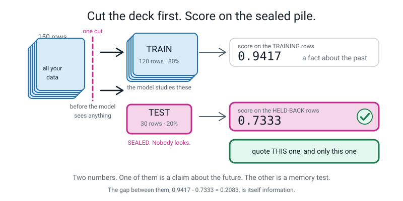
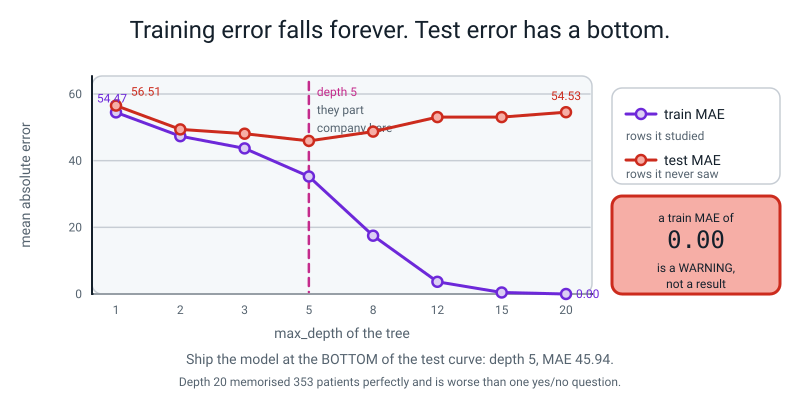

# 📝 Term 4 Practice Test — Weeks 28–36

[⬅ Term 3 test](term-3-test.md) · [Assessments home](README.md) · [Course home](../README.md) · [Projects](../projects/project-ideas.md)

---

```
   ┌──────────────────────────────────────────────────────────────────────┐
   │                                                                      │
   │   AI ACADEMY · LEVEL 2 BUILDER                                       │
   │   TERM 4 PRACTICE TEST — Three Lines That Predict                    │
   │   Covers Weeks 28–36. Nothing later appears anywhere on this paper.   │
   │   Weeks 1–27 syntax may appear, but is never the thing being tested. │
   │                                                                      │
   │   TIME ALLOWED   60 minutes                                          │
   │   TOTAL MARKS    60                                                  │
   │                                                                      │
   │   Section A   12 multiple choice        1 mark each     12 marks     │
   │   Section B    6 "what does this print" 3 marks each    18 marks     │
   │   Section C    4 find-and-fix-the-bug   3 marks each    12 marks     │
   │   Section D    3 write-the-code         4 marks each    12 marks     │
   │   Section E    1 extended question      6 marks          6 marks     │
   │                                                                      │
   │   ⛔  NO COMPUTER. THIS PAPER IS DONE WITH A PENCIL.                 │
   │                                                                      │
   │      Every number you are asked to read on this paper came out of a  │
   │      real model on a real split. Your job is not to compute them.    │
   │      Your job is to say what they MEAN, and to notice when a         │
   │      beautiful number is a lie.                                      │
   │                                                                      │
   │   INSTRUCTIONS                                                       │
   │   · Write in pencil. Answer every question.                          │
   │   · Section A: circle ONE letter. Write "not sure" beside a guess.   │
   │   · Section B: write EVERY line of output, in order. Shapes come in  │
   │     round brackets with a comma.                                     │
   │   · Section C: three things — what Python is telling you, the line,  │
   │     and the fixed line written out in full.                          │
   │   · Section D: indentation counts. Any score you report must say     │
   │     WHICH ROWS it was measured on.                                   │
   │   · Section E: a paragraph, not a list. Show the arithmetic.         │
   │                                                                      │
   │   WHAT IS ALLOWED                                                    │
   │   ✅  Pencil, pen, eraser, ruler with millimetres                     │
   │   ✅  Two blank sheets of rough paper, and graph paper if you like    │
   │   ✅  A calculator — but every division must be written out          │
   │   ❌  A COMPUTER. No Python, no phone, no editor, no terminal.       │
   │   ❌  The student guide, the workbook, the glossary, your notes      │
   │   ❌  Your own capstone notebook                                     │
   │   ❌  A search engine, a chatbot, another person                     │
   │                                                                      │
   └──────────────────────────────────────────────────────────────────────┘
```

> **🧑‍🏫 Teacher, read this once before you hand the paper out.** You do not need to know any machine
> learning. Set a timer for 60 minutes and read the "what is allowed" box out loud. **Every number,
> every traceback and every printout on this paper and in the answer key came from a real run on Python
> 3.10 with scikit-learn, and was pasted in unedited.**
>
> **The two things to say out loud before they start.** First: on this paper, *the model is the easy
> part*. Three lines. The marks are in reading the result honestly. Second: **sit this paper before the
> Week 36 showcase, not after.** A student who has just been clapped at by two adults cannot mark
> themselves honestly, and that is not a character flaw — it is just how people work, so design around
> it.

---

## 📐 The one picture behind every question on this paper



*Figure T4.1 — Every model in Level 2 is this one picture. Cut the deck **before** the model sees anything. Fit on the big pile. Score on the sealed pile. You get two numbers, and **only one of them is a claim you are allowed to make about the future.***

> **💡 Try this on every question in Sections B and D.** Write down, in the margin, *which rows was this
> number measured on?* If the answer is "the ones it trained on", the number is a fact about the past
> and nothing else. That one question is worth more than every formula on this paper.

---

# 🅰️ Section A — Multiple Choice

*12 questions · 1 mark each · circle ONE letter · the week each question comes from is in brackets*

---

**A1.** [W28] In `X` and `y`, which is which?

- (a) `X` is the answers, `y` is the measurements
- (b) `X` is the measurements you took (the features), `y` is the one column you want back (the label)
- (c) `X` is the training rows, `y` is the test rows
- (d) `X` is numbers and `y` is words, always

---

**A2.** [W28] `df["bpm"]` and `df[["bpm"]]` are different. How?

- (a) They are the same; the extra brackets are decoration
- (b) One bracket gives a **Series** with shape `(n,)`; two brackets give a **DataFrame** with shape `(n, 1)`
- (c) One bracket gives a list; two brackets give a dictionary
- (d) Two brackets sort the column

---

**A3.** [W28] Which line computes the **distance** between two rows `a` and `b`?

- (a) `(a - b).sum()`
- (b) `np.sqrt((a - b).sum())`
- (c) `np.sqrt(((a - b) ** 2).sum())`
- (d) `((a - b) ** 2).sum() ** 2`

---

**A4.** [W29] What does `k` mean in `KNeighborsClassifier(n_neighbors=3)`?

- (a) How many times the model trains
- (b) How many columns it looks at
- (c) How many of the closest known examples get a vote
- (d) How many classes there are

---

**A5.** [W29] Why does `train_test_split` need `random_state=42`?

- (a) 42 is the best value; other numbers work less well
- (b) It shuffles before it cuts, and fixing the shuffle means you get the **same cut every run** — so when a score changes you know it was your change, not a friendlier deal
- (c) It makes the model more accurate
- (d) Without it, the split is not random at all

---

**A6.** [W29] Your model scores **0.98** on the rows it trained on and **0.73** on the rows it never
saw. Which number goes in your report?

- (a) 0.98, because it is your model's best performance
- (b) The average of the two, 0.855
- (c) 0.73, because it is the only one measured on rows the model had never seen
- (d) Both, without saying which is which

---

**A7.** [W30] Why must `StandardScaler` be fitted on `X_train` **only**?

- (a) It runs faster that way
- (b) Because fitting it on everything lets facts about the test rows leak into the training, so your test score stops being honest
- (c) Because the test rows have a different number of columns
- (d) It doesn't matter; either is fine

---

**A8.** [W30] In a confusion matrix, what sits on the diagonal from top-left to bottom-right?

- (a) The mistakes
- (b) The rows the model got **right**
- (c) The class names
- (d) The confidence scores

---

**A9.** [W31] What is the one thing a decision tree can do that kNN cannot?

- (a) Predict a category
- (b) Score higher
- (c) Print the actual rules it learned, so a human can read them aloud
- (d) Handle more than two features

---

**A10.** [W32] A `LinearRegression` on hours-of-revision against marks reports
`model.coef_` = `[8.01]`. Say that out loud.

- (a) "The model is 8.01 accurate"
- (b) "About 8 marks more, for each extra hour of revision"
- (c) "8.01% of students improved"
- (d) "The line starts at 8.01"

---

**A11.** [W32] `mean_absolute_error` comes out as `5.04` on a marks-out-of-100 target. What does that
mean?

- (a) The model is 5.04% wrong
- (b) On average the model's guess is about **5 marks** away from the truth, either side
- (c) 5.04 rows were predicted wrongly
- (d) The model explains 5.04 of the variation

---

**A12.** [W33] A tree with `max_depth=20` has a **training** MAE of `0.00` and a **test** MAE of
`54.53`. What have you built?

- (a) A perfect model
- (b) A model that has memorised the training rows and learned nothing usable
- (c) A model that needs more depth
- (d) A bug — 0.00 is impossible

---

# 🅱️ Section B — What Does This Print?

*6 questions · 3 marks each · 18 marks*

**Write every line of output, in order.** Shapes come in round brackets with a comma: `(150, 4)`,
`(150,)`. Arrays print with no commas.

---

**B1.** [W28]

```python
import pandas as pd
from sklearn.datasets import load_iris

iris = load_iris()
print(iris.data.shape)
print(iris.target.shape)

flowers = pd.DataFrame(iris.data, columns=iris.feature_names)
flowers["species"] = iris.target

X = flowers[["petal length (cm)", "petal width (cm)"]]
y = flowers["species"]
print(X.shape)
print(y.shape)
print(type(flowers["petal width (cm)"]).__name__)
print(type(flowers[["petal width (cm)"]]).__name__)
```

*Six lines of output.*

```
   1. ________________________________
   2. ________________________________
   3. ________________________________
   4. ________________________________
   5. ________________________________
   6. ________________________________
```

---

**B2.** [W28] Distance, by hand and in numpy. `iris.data[0, 2:4]` is `[1.4 0.2]` and
`iris.data[65, 2:4]` is `[4.4 1.4]`.

```python
import numpy as np
from sklearn.datasets import load_iris

iris = load_iris()
flower_a = iris.data[0, 2:4]
flower_b = iris.data[65, 2:4]
diff = flower_a - flower_b
print(diff)
print((diff ** 2).sum())
print(round(np.sqrt((diff ** 2).sum()), 2))
```

*Three lines of output. Line 2 is not the tidy number you expect — write exactly what Python prints,
and then explain it.*

```
   1. ________________________________
   2. ________________________________
   3. ________________________________
```

**Why is line 2 not exactly `10.44`?**

________________________________________________________________

---

**B3.** [W29]

```python
from sklearn.datasets import load_iris
from sklearn.model_selection import train_test_split
from sklearn.neighbors import KNeighborsClassifier

iris = load_iris()
X = iris.data[:, 0:2]        # the two SEPAL columns only
y = iris.target

X_train, X_test, y_train, y_test = train_test_split(
    X, y, test_size=0.2, random_state=42
)
print(X_train.shape, X_test.shape)

model = KNeighborsClassifier(n_neighbors=1)
model.fit(X_train, y_train)

train_score = model.score(X_train, y_train)
test_score = model.score(X_test, y_test)
print(round(train_score, 4))
print(round(test_score, 4))
print(round(train_score - test_score, 4))
```

*Four lines of output. The two shapes are the free marks; the three scores are the question. The real
scores are `0.9417` and `0.7333`.*

```
   1. ________________________________
   2. ________________________________
   3. ________________________________
   4. ________________________________
```

**With `k = 1`, a model normally scores exactly `1.0` on its own training rows. This one scored
`0.9417`. Give one honest reason why.**

________________________________________________________________

---

**B4.** [W30] The same sepals-only split, but with `stratify=y` and `k = 5`.

```python
# --- setup, so this block runs on its own -------------------------------
from sklearn.datasets import load_iris
from sklearn.model_selection import train_test_split
from sklearn.neighbors import KNeighborsClassifier
from sklearn.metrics import accuracy_score, confusion_matrix

iris = load_iris()
X, y = iris.data[:, 0:2], iris.target
X_train, X_test, y_train, y_test = train_test_split(
    X, y, test_size=0.2, random_state=42, stratify=y)
model = KNeighborsClassifier(n_neighbors=5).fit(X_train, y_train)

pred = model.predict(X_test)
print(round(accuracy_score(y_test, pred), 4))
print(confusion_matrix(y_test, pred))
print(list(iris.target_names))
```

The real output is:

```text
0.7333
[[10  0  0]
 [ 0  5  5]
 [ 0  3  7]]
['setosa', 'versicolor', 'virginica']
```

**Answer these four instead of copying the output.**

- (a) Show the division that produces `0.7333`. **(1 mark)**

  ______________________________________________

- (b) Which class did the model get **completely right**, and how many of them were there? **(½ mark)**

  ______________________________________________

- (c) Which two classes does it confuse, and in which direction more? **(1 mark)**

  ______________________________________________

- (d) `stratify=y` was used. What did it guarantee, and where in the matrix can you see it? **(½ mark)**

  ______________________________________________

---

**B5.** [W31]

```python
from sklearn.datasets import load_iris
from sklearn.model_selection import train_test_split
from sklearn.tree import DecisionTreeClassifier, export_text

iris = load_iris()
X, y = iris.data, iris.target
X_train, X_test, y_train, y_test = train_test_split(
    X, y, test_size=0.2, random_state=42
)
tree = DecisionTreeClassifier(max_depth=2, random_state=42)
tree.fit(X_train, y_train)

print(round(tree.score(X_test, y_test), 4))
print(export_text(tree, feature_names=iris.feature_names))
print(tree.feature_importances_.round(3))
```

The real output is:

```text
0.9667
|--- petal length (cm) <= 2.45
|   |--- class: 0
|--- petal length (cm) >  2.45
|   |--- petal length (cm) <= 4.75
|   |   |--- class: 1
|   |--- petal length (cm) >  4.75
|   |   |--- class: 2

[0. 0. 1. 0.]
```

**Answer these three instead of copying the output.**

- (a) Write the tree's rules as **three English sentences** a gardener could follow. **(1½ marks)**

  ______________________________________________

  ______________________________________________

  ______________________________________________

- (b) The importances are `[0. 0. 1. 0.]`. Which measurements did the tree **ignore completely**, and
  how many is that? **(1 mark)**

  ______________________________________________

- (c) A flower has petal length **4.8 cm**. Which class does this tree say, and is that a confident
  answer? **(½ mark)**

  ______________________________________________

---

**B6.** [W32]

```python
import numpy as np
from sklearn.linear_model import LinearRegression
from sklearn.metrics import mean_absolute_error, r2_score

hours = np.array([[0.5], [1.0], [1.5], [2.0], [2.5], [3.0]])
score = np.array([52, 58, 61, 70, 74, 81])

model = LinearRegression()
model.fit(hours, score)

print(model.coef_.round(2))
print(round(model.intercept_, 2))

pred = model.predict(hours)
print(pred.round(2))
print(round(mean_absolute_error(score, pred), 2))
print(round(r2_score(score, pred), 4))
print(round(model.predict([[4.0]])[0], 1))
```

*Six lines of output. The real values are: slope `11.54`, intercept `45.8`, MAE `0.92`, R² `0.988`.*

```
   1. ________________________________
   2. ________________________________
   3. ________________________________  (the six predictions, roughly)
   4. ________________________________
   5. ________________________________
   6. ________________________________  (show your arithmetic)
```

**Line 6 is a prediction for 4 hours, which is outside every row the model was given. Write the number,
then write one sentence saying why you should not trust it.**

________________________________________________________________

---

# 🅲 Section C — Find and Fix the Bug

*4 questions · 3 marks each · 12 marks*

| | | Marks |
|---|---|:--:|
| **1** | **Say what Python is telling you**, in your own words. | 1 |
| **2** | **Point at the line** that has to change. Give its number. | 1 |
| **3** | **Write the fixed line out in full.** | 1 |

---

**C1.** [W29] This was meant to guess the mood of one new song.

```python
1  import numpy as np
2  from sklearn.neighbors import KNeighborsClassifier
3
4  songs = np.array([[90, 4], [128, 3], [75, 5], [140, 3], [110, 4], [95, 6]])
5  mood = np.array(["calm", "hype", "calm", "hype", "hype", "calm"])
6
7  model = KNeighborsClassifier(n_neighbors=3)
8  model.fit(songs, mood)
9
10 guess = model.predict([120, 3])
11 print(guess)
```

```text
ValueError: Expected 2D array, got 1D array instead:
array=[120   3].
Reshape your data either using array.reshape(-1, 1) if your data has a single feature or array.reshape(1, -1) if it contains a single sample.
```

**1. What is Python telling you?** ______________________________________________

**2. Line number:** ______

**3. The fixed line:** ______________________________________________

---

**C2.** [W31] This was meant to print a tree's rules.

```python
1  from sklearn.datasets import load_iris
2  from sklearn.model_selection import train_test_split
3  from sklearn.tree import DecisionTreeClassifier, export_text
4
5  iris = load_iris()
6  X_train, X_test, y_train, y_test = train_test_split(
7      iris.data, iris.target, test_size=0.2, random_state=42
8  )
9  tree = DecisionTreeClassifier(max_depth=3, random_state=42)
10 print(export_text(tree, feature_names=iris.feature_names))
```

```text
sklearn.exceptions.NotFittedError: This DecisionTreeClassifier instance is not fitted yet. Call 'fit' with appropriate arguments before using this estimator.
```

**1. What is Python telling you?** ______________________________________________

**2. What line is MISSING, and where exactly does it go?** ______________________________________________

**3. Write that line out in full:** ______________________________________________

---

**C3.** [W32] This was meant to fit a line through six revision sessions.

```python
1  import numpy as np
2  from sklearn.linear_model import LinearRegression
3
4  hours = np.array([[0.5], [1.0], [1.5], [2.0], [2.5], [3.0]])
5  score = np.array([52, 58, 61, 70, 74])
6
7  model = LinearRegression()
8  model.fit(hours, score)
```

```text
ValueError: Found input variables with inconsistent numbers of samples: [6, 5]
```

**1. What is Python telling you?** ______________________________________________

**2. Which line is the REAL problem — 8, or one of 4 and 5? Say which, and why.**

________________________________________________________________

**3. What must you do before you touch the code at all?**

________________________________________________________________

---

**C4.** [W32, W33] This was meant to score a model that predicts a **number**.

```python
1  from sklearn.datasets import load_diabetes
2  from sklearn.model_selection import train_test_split
3  from sklearn.tree import DecisionTreeRegressor
4  from sklearn.metrics import accuracy_score
5
6  data = load_diabetes()
7  X_train, X_test, y_train, y_test = train_test_split(
8      data.data, data.target, test_size=0.2, random_state=42
9  )
10 model = DecisionTreeRegressor(max_depth=3, random_state=42)
11 model.fit(X_train, y_train)
12 pred = model.predict(X_test)
13 print(accuracy_score(y_test, pred))
```

```text
ValueError: Classification metrics can't handle a mix of multiclass and continuous targets
```

**1. What is Python telling you?** ______________________________________________

**2. Line number:** ______

**3. Name TWO metrics that ARE right for this job, and say what each one's units are.**

________________________________________________________________

---

# 🅳 Section D — Write the Code

*3 questions · 4 marks each · 12 marks*

Write real Python. **Any score you print must say which rows it was measured on.**

---

**D1.** [W28, W29] Write a complete program that:

1. loads iris and takes **only the two sepal columns** as `X`, with `iris.target` as `y`, printing both
   shapes
2. splits 80/20 with a fixed `random_state`, and prints both halves' shapes
3. fits a `KNeighborsClassifier` with `k = 5` on the training half only
4. prints **both** scores with labels saying which rows each was measured on, prints the gap, and prints
   which of the two you are allowed to quote

```
   ________________________________________________________

   ________________________________________________________

   ________________________________________________________

   ________________________________________________________

   ________________________________________________________

   ________________________________________________________

   ________________________________________________________

   ________________________________________________________

   ________________________________________________________

   ________________________________________________________

   ________________________________________________________

   ________________________________________________________
```

---

**D2.** [W30, W31] Starting from D1's split, **change one line** to use a decision tree of depth 3
instead of kNN, and then report it properly.

Write the code that:

1. makes the tree instead of the kNN — say clearly which line you changed
2. predicts the held-back rows
3. prints the accuracy **and** the confusion matrix, with the class names printed underneath so a
   reader can label the rows
4. prints the tree's learned rules and its feature importances

```
   ________________________________________________________

   ________________________________________________________

   ________________________________________________________

   ________________________________________________________

   ________________________________________________________

   ________________________________________________________

   ________________________________________________________

   ________________________________________________________
```

---

**D3.** [W32] Here are twenty revision sessions. **Copy nothing** — write the code underneath.

```python
hours = np.array([[0.5], [0.5], [1.0], [1.0], [1.5], [1.5], [2.0], [2.0],
                  [2.5], [2.5], [3.0], [3.0], [3.5], [3.5], [4.0], [4.0],
                  [4.5], [4.5], [5.0], [5.0]])
marks = np.array([44, 52, 49, 61, 58, 55, 71, 63, 66, 76, 74, 68,
                  81, 72, 79, 88, 84, 77, 91, 83])
```

Write code that:

1. splits 75/25 with a fixed `random_state` and prints both shapes
2. fits a `LinearRegression` on the training rows
3. prints the slope and the intercept, and writes the slope out **in real units** in a comment
4. prints MAE **in marks** and R², both measured on the **held-back** rows

```
   ________________________________________________________

   ________________________________________________________

   ________________________________________________________

   ________________________________________________________

   ________________________________________________________

   ________________________________________________________

   ________________________________________________________

   ________________________________________________________

   ________________________________________________________
```

---

# 🅴 Section E — The Extended Question

*1 question · 6 marks · about 12 minutes · write a paragraph, not a list. Show the arithmetic.*

---

**E1.** [W29, W33] A student runs a bake-off on a medical dataset that ships with scikit-learn. The
target is a number: **how much a patient's illness progressed over a year.** The numbers in that
column run from **25 to 346**, and their average is **152.1**.

He fits eight decision trees on **one** fixed 80/20 split, changing only `max_depth`, and prints the
average error (MAE) on both piles. This is his real output:

```text
depth  train MAE  test MAE
    1      54.47     56.51
    2      47.33     49.37
    3      43.68     48.10
    5      35.25     45.94
    8      17.50     48.72
   12       3.66     53.07
   15       0.46     53.06
   20       0.00     54.53
```

He writes this in his report:

> **"I tried eight models and the best one was depth 20. Its average error is 0.00, which means it gets
> every single patient exactly right. I would use this model in a hospital."**

Write a paragraph answering **all four** of these:

1. **He has read the wrong column.** Say which column he read, which one he should have read, and name
   the depth that is genuinely best, with its number.
2. **Explain the `0.00`** — what did the depth-20 tree actually do, and why does a tree get to do that?
   Use the words *training* and *memorise*.
3. **Do the arithmetic that makes it worse.** Compare depth 20's test error against depth 1's. Then
   compare the best test error against the range of the target column, and say in a sentence whether
   this model would be useful in a hospital at all.
4. Say what **one sentence** should go in his report instead, and what **one extra thing** he should
   have drawn.

```
   ______________________________________________________________________

   ______________________________________________________________________

   ______________________________________________________________________

   ______________________________________________________________________

   ______________________________________________________________________

   ______________________________________________________________________

   ______________________________________________________________________

   ______________________________________________________________________

   ______________________________________________________________________

   ______________________________________________________________________

   ______________________________________________________________________

   ______________________________________________________________________
```

---

---
---

# 📊 Marking Scheme

**Total: 60 marks.**

## Section A — 12 marks

| Q | Answer | Mark | Week |
|:--:|:--:|:--:|:--:|
| A1 | **(b)** | 1 | W28 |
| A2 | **(b)** | 1 | W28 |
| A3 | **(c)** | 1 | W28 |
| A4 | **(c)** | 1 | W29 |
| A5 | **(b)** | 1 | W29 |
| A6 | **(c)** | 1 | W29 |
| A7 | **(b)** | 1 | W30 |
| A8 | **(b)** | 1 | W30 |
| A9 | **(c)** | 1 | W31 |
| A10 | **(b)** | 1 | W32 |
| A11 | **(b)** | 1 | W32 |
| A12 | **(b)** | 1 | W33 |

No half marks. Two letters circled scores 0.

## Section B — 18 marks

**3 marks per question.** B4 and B5 are split into parts, so mark those part by part. B1, B2, B3 and B6
use the usual ladder:

| | Marks |
|---|:--:|
| Every line correct, in order | 3 |
| One line wrong | 2 |
| Two lines wrong | 1 |
| Correct working visible but wrong answer | **1, always** |

| Q | The real output | Marks | The trap |
|:--:|---|:--:|---|
| **B1** | `(150, 4)` / `(150,)` / `(150, 2)` / `(150,)` / `Series` / `DataFrame` | 3 | `y` is `(150,)` — one comma, no second number. Two brackets give a DataFrame |
| **B2** | `[-3.  -1.2]` / `10.440000000000003` / `3.23` + the sentence | 2 + 1 | Line 2 is **not** `10.44`. Floating-point arithmetic |
| **B3** | `(120, 2) (30, 2)` / `0.9417` / `0.7333` / `0.2083` + the sentence | 2 + 1 | The gap is `0.9417 − 0.7333`, positive this time |
| **B4** | (a) `22 ÷ 30 = 0.7333` (b) setosa, 10 (c) versicolor↔virginica, versicolor worse (d) equal class counts, 10 per row | 1 + ½ + 1 + ½ | (c): 5 versicolor misread as virginica, 3 the other way |
| **B5** | (a) three sentences (b) three ignored (c) class 2, not confident | 1½ + 1 + ½ | (b) — `0.` three times means **three** measurements unused |
| **B6** | `[11.54]` / `45.8` / `[51.57 57.34 63.11 68.89 74.66 80.43]` / `0.92` / `0.988` / `92.0` + the sentence | 2 + 1 | Line 1 is an **array** in brackets, not a bare number |

**B2's sentence (1 mark):** must say the computer stores decimals in binary and `0.1`-style numbers
cannot be stored exactly, so a tiny error appears at the fifteenth decimal place. "It's a rounding
thing" earns the mark; "it's a bug" does not.

**B3's sentence (1 mark):** accept either honest reason — (i) seven of the 120 training flowers share
*identical* sepal measurements with a flower of a different species, so the nearest neighbour at
distance zero gives the wrong answer; or (ii) throwing away the petal columns threw away the ability to
tell some rows apart at all. Both are correct and (i) is the better answer.

**B6's sentence (1 mark):** must say 4.0 hours is **outside the range the model was given** (0.5 to
3.0), so the line is being stretched into territory where nothing was measured. Bonus credit, no extra
mark, for noticing that 92.0 is still under 100 and so at least not impossible — the same line at 6
hours would predict over 100 marks on a 100-mark test.

## Section C — 12 marks

| Q | 1 · Meaning (1 mark) | 2 · Line (1 mark) | 3 · Fix (1 mark) |
|:--:|---|:--:|---|
| **C1** | `predict` always wants a **table of rows**, even when there is only one row. You gave it a single line of numbers. | 10 | `guess = model.predict([[120, 3]])` — double brackets |
| **C2** | The tree has never been trained, so it has no rules to print. `export_text` asked it what it learned and it has not learned anything. | A `fit` line is missing, **between lines 9 and 10** | `tree.fit(X_train, y_train)` |
| **C3** | You gave 6 rows of measurements and 5 answers. Every row must have exactly one answer. | **Lines 4 and 5 — the data.** Line 8 is where it shows up, not what is wrong | Go and find the missing sixth mark; **do not delete a row to make the numbers match** |
| **C4** | `accuracy_score` counts exact matches, and you cannot ask "did it get it exactly right" of a number like `142.7`. This model predicts a number, not a category. | 13 | Any two of: `mean_absolute_error` (units: the target's own units) · `r2_score` (no units, 0 to 1) · `np.sqrt(mean_squared_error(...))` = RMSE (the target's units) |

**Marking rules:**

- **C1 is the most-quoted error in the level.** If a student cannot explain it by now, the fix is not a
  reteach — it is one minute with Figure T4.1 and the sentence *"`predict` answers a table of
  questions; one question is a table with one row."*
- **C2's mark is the *placement*.** "Add a fit line" without saying it goes **before** `export_text` is
  half an answer. The order — make it, fit it, use it — is the whole pattern of the library.
- **C3: withhold the third mark for "delete the sixth row of `hours`".** That makes the error go away
  and silently throws away a real measurement. The honest answers are: find the missing mark, or drop
  the sixth session from **both** arrays **and write it in the cleaning log**. Either earns the mark if
  the log is mentioned.
- **C4: "use `r2_score`" alone is not two metrics.** And a student who names MAE but cannot say its
  units has missed the reason MAE exists.

## Section D — 12 marks

### D1 — 4 marks

| Row | Mark for | Marks |
|---|---|:--:|
| `X` and `y` | `iris.data[:, 0:2]` and `iris.target`, both shapes printed | 1 |
| The split | `train_test_split(X, y, test_size=0.2, random_state=42)`, both shapes printed | 1 |
| Fit and score | Fitted on `X_train, y_train` only; **both** scores computed | 1 |
| **Labelled honestly** | Each score printed with words saying which rows, plus the gap, plus which one is quotable | 1 |

```python
from sklearn.datasets import load_iris
from sklearn.model_selection import train_test_split
from sklearn.neighbors import KNeighborsClassifier

iris = load_iris()
X = iris.data[:, 0:2]                 # the two sepal columns only
y = iris.target

print("X shape:", X.shape)
print("y shape:", y.shape)

X_train, X_test, y_train, y_test = train_test_split(
    X, y, test_size=0.2, random_state=42
)
print("train:", X_train.shape, " test:", X_test.shape)

model = KNeighborsClassifier(n_neighbors=5)
model.fit(X_train, y_train)           # the TRAINING half only

train_score = model.score(X_train, y_train)
test_score = model.score(X_test, y_test)
print("score on the TRAINING rows:", round(train_score, 4))
print("score on the HELD-BACK rows:", round(test_score, 4))
print("the gap:", round(train_score - test_score, 4))
print("the number I am allowed to quote:", round(test_score, 4))
```

```text
X shape: (150, 2)
y shape: (150,)
train: (120, 2)  test: (30, 2)
score on the TRAINING rows: 0.825
score on the HELD-BACK rows: 0.8
the gap: 0.025
the number I am allowed to quote: 0.8
```

> **🧑‍🏫 The fourth mark is the whole point of Term 4 and it is not a formatting mark.** A program that
> prints `0.825` and `0.8` with no words attached is a program whose author will one day put the wrong
> one in a report, because two bare numbers on a screen look identical in importance. Withhold the mark
> and write the reason.

### D2 — 4 marks

| Row | Mark for | Marks |
|---|---|:--:|
| One line changed | `DecisionTreeClassifier(max_depth=3, random_state=42)` in place of the kNN, **and they say so** | 1 |
| Predict + accuracy | `tree.predict(X_test)` and `accuracy_score(y_test, pred)` | 1 |
| Confusion matrix + names | Matrix printed **and** `iris.target_names` printed so the rows can be labelled | 1 |
| Rules + importances | `export_text(...)` with `feature_names`, and `feature_importances_` | 1 |

```python
# --- setup, so this block runs on its own -------------------------------
from sklearn.datasets import load_iris
from sklearn.model_selection import train_test_split

iris = load_iris()
X, y = iris.data[:, 0:2], iris.target          # the two SEPAL columns only
X_train, X_test, y_train, y_test = train_test_split(
    X, y, test_size=0.2, random_state=42, stratify=y)

from sklearn.tree import DecisionTreeClassifier, export_text
from sklearn.metrics import accuracy_score, confusion_matrix

# the ONE line that changed:
tree = DecisionTreeClassifier(max_depth=3, random_state=42)
tree.fit(X_train, y_train)
pred = tree.predict(X_test)

print("accuracy:", round(accuracy_score(y_test, pred), 4))
print(confusion_matrix(y_test, pred))
print(list(iris.target_names))
print(export_text(tree, feature_names=iris.feature_names[0:2]))
print("importances:", tree.feature_importances_.round(3))
```

With `stratify=y` on the split, the real output is:

```text
accuracy: 0.6667
[[10  0  0]
 [ 2  3  5]
 [ 0  3  7]]
['setosa', 'versicolor', 'virginica']
|--- sepal length (cm) <= 5.45
|   |--- sepal width (cm) <= 2.80
|   |   |--- sepal length (cm) <= 4.95
|   |   |   |--- class: 0
|   |   |--- sepal length (cm) >  4.95
|   |   |   |--- class: 1
|   |--- sepal width (cm) >  2.80
|   |   |--- class: 0
|--- sepal length (cm) >  5.45
|   |--- sepal length (cm) <= 6.15
|   |   |--- sepal width (cm) <= 3.45
|   |   |   |--- class: 1
|   |   |--- sepal width (cm) >  3.45
|   |   |   |--- class: 0
|   |--- sepal length (cm) >  6.15
|   |   |--- sepal width (cm) <= 2.40
|   |   |   |--- class: 1
|   |   |--- sepal width (cm) >  2.40
|   |   |   |--- class: 2

importances: [0.787 0.213]
```

**Do not withhold marks for a different accuracy number.** Whether the student used `stratify=y` changes
the score, and the paper did not insist. Mark the **shape** of the answer: did they change one line, did
they score on the test rows, did they print the class names next to the matrix, did they ask the tree
what it learned.

> **⚠️ The comparison worth making out loud.** The tree scores **0.6667** here where the kNN scored
> **0.7333** on the same two columns. Swapping in a fancier-sounding model made it **worse**, and that
> is a completely normal result. A student who noticed it and said so has done something more valuable
> than a student whose number happened to be higher.

### D3 — 4 marks

| Row | Mark for | Marks |
|---|---|:--:|
| The split | `test_size=0.25`, fixed `random_state`, both shapes printed | 1 |
| Fit + slope + intercept | `LinearRegression()` fitted on train, `coef_` and `intercept_` printed | 1 |
| **Slope in real units** | A comment or a printed sentence saying "about 8 marks per extra hour" | 1 |
| MAE + R² on the test rows | Both, computed against `y_test`, MAE named in marks | 1 |

```python
import numpy as np
from sklearn.model_selection import train_test_split
from sklearn.linear_model import LinearRegression
from sklearn.metrics import mean_absolute_error, r2_score

hours = np.array([[0.5], [0.5], [1.0], [1.0], [1.5], [1.5], [2.0], [2.0],
                  [2.5], [2.5], [3.0], [3.0], [3.5], [3.5], [4.0], [4.0],
                  [4.5], [4.5], [5.0], [5.0]])
marks = np.array([44, 52, 49, 61, 58, 55, 71, 63, 66, 76, 74, 68,
                  81, 72, 79, 88, 84, 77, 91, 83])

X_train, X_test, y_train, y_test = train_test_split(
    hours, marks, test_size=0.25, random_state=42
)
print("train:", X_train.shape, " test:", X_test.shape)

model = LinearRegression()
model.fit(X_train, y_train)

print("slope    :", model.coef_.round(2))    # +8.01 MARKS per extra HOUR of revision
print("intercept:", round(model.intercept_, 2))   # 48.05 marks at zero hours

pred = model.predict(X_test)                 # the HELD-BACK rows
print("predicted:", pred.round(1))
print("real     :", y_test)
print("MAE :", round(mean_absolute_error(y_test, pred), 2), "marks")
print("R2  :", round(r2_score(y_test, pred), 4))
```

```text
train: (15, 1)  test: (5, 1)
slope    : [8.01]
intercept: 48.05
predicted: [52.1 84.1 80.1 52.1 68.1]
real     : [44 77 88 52 66]
MAE : 5.04 marks
R2  : 0.8581
```

**The third mark, judged strictly:**

| What they wrote | Mark |
|---|:--:|
| `# +8.01 marks per extra hour of revision` | ✅ |
| `print(f"Each extra hour is worth about {model.coef_[0]:.1f} marks")` | ✅ — better |
| `# slope = 8.01` | ❌ — that is the number repeated, not the meaning |
| `# the slope is how steep the line is` | ❌ — true of every slope; says nothing about marks or hours |

**MAE must be named in marks.** `MAE: 5.04` is a number. `MAE: 5.04 marks` is a finding a parent can
understand: *"on a test out of 100, the model's guess is usually about 5 marks out."*

## Section E — 6 marks, marked with the rubric below

| Level | Marks |
|---|:--:|
| 4 · Exceptional | 6 |
| 3 · Proficient | 5 |
| 2 · Developing | 3–4 |
| 1 · Beginning | 1–2 |
| Nothing usable | 0 |

### E1 rubric

| | **1 · Beginning** | **2 · Developing** | **3 · Proficient** | **4 · Exceptional** |
|---|---|---|---|---|
| **The right column** | Agrees with him, or just says "he's wrong" | Says he should look at test, no depth named | Names the **train** column as the one he read, the **test** column as the one that counts, and picks **depth 5** with **45.94** | Also notes that depths 2 and 3 are within 3 of depth 5, so "depth 5" is a choice not a discovery, and a simpler tree may still be the one to ship |
| **Explaining the 0.00** | "It's overfitting" as a bare word | Says it memorised, no mechanism | Says a deep enough tree can keep splitting until each training row sits alone in its own leaf, so it can recite every training answer perfectly, and that is why train MAE hits exactly 0.00 | Also says the mechanism is *why* the number is **suspicious rather than impressive**: 0.00 is only reachable by memorising, so seeing it is a warning light, not a result |
| **The arithmetic** | No numbers | One comparison | Depth 20's test MAE (**54.53**) is **worse than depth 1's** (56.51 — nearly as bad), and the best test MAE of 45.94 is compared against the 25–346 range | Computes it: 45.94 against a range of `346 − 25 = 321` is about **14% of the whole span**, and against a mean of 152.1 it is about **30%**, then concludes plainly that this is nowhere near hospital-usable |
| **What to write, what to draw** | No replacement sentence | A vaguer sentence | A one-sentence report line quoting the **test** MAE with its units and the split, **and** says he should have drawn the train-and-test curves against depth on one pair of axes | Also says where the vertical line goes — at the depth where the two curves part company — and that the picture is the evidence for the choice, not decoration |
| **Writing** | One fragment | A list of words | A paragraph a stranger could follow | A paragraph a doctor could read and correctly decide not to use the model |

### A model level-4 answer (about 250 words)

> He has read the **train MAE** column, which is the model's score on the rows it was given the answers
> to. The column that counts is **test MAE**, and read down that one the best model is **depth 5** with
> **45.94** — not depth 20. The `0.00` is not accuracy, it is memorisation: a tree with 20 levels can
> keep splitting until nearly every training patient is sitting alone in their own leaf, and then it can
> recite each of those answers back perfectly. So `0.00` is not a triumph, it is a **warning light** —
> the only way to reach it is to memorise, and a memoriser has learned nothing it can carry to a new
> patient. The arithmetic proves that. On the held-back patients, depth 20 is **54.53**, which is
> **worse than depth 1** at 56.51 by almost nothing — twenty levels of tree bought him nothing over a
> single yes/no question. And even the best model is not good: the target runs from 25 to 346, a span of
> `346 − 25 = 321`, so an average miss of 45.94 is `45.94 ÷ 321 = 0.143`, about **14% of the entire
> range**, and against the average patient value of 152.1 it is `45.94 ÷ 152.1 = 0.30`, **30% out**. I
> would not put that near a hospital. His report should say: *"Best model: a depth-5 decision tree, MAE
> 45.94 on the 20% of patients held back before training — about 30% of a typical value, which is too
> large to act on."* And he should have plotted train MAE and test MAE against depth on one pair of
> axes, with a dashed vertical line at depth 5 where the two curves part company.

---

# ✅ Full Answer Key

> **🧑‍🏫 Do not photocopy this page for students until after the test is marked.** **Every number,
> printout and traceback below came from a real run on Python 3.10 with scikit-learn, pasted in
> unedited.**

<details>
<summary><b>A1 — (b) · W28</b></summary>

**(b) `X` is the features, `y` is the label.** Level 1's two words, finally spelled out in code.

```python
import pandas as pd
from sklearn.datasets import load_iris

iris = load_iris()
flowers = pd.DataFrame(iris.data, columns=iris.feature_names)
flowers["species"] = iris.target

X = flowers[["petal length (cm)", "petal width (cm)"]]   # what you measured
y = flowers["species"]                                    # what you want back
print(X.shape, y.shape)
```

```text
(150, 2) (150,)
```

`X` is a **table**: 150 rows, 2 columns. `y` is a **single line**: 150 answers, one per row.

- **(a) is wrong** — it is exactly backwards, and it is worth catching now, because swapping them gives
  you a model that predicts petal length from species and nobody notices for an hour.
- **(c) is wrong** — that is `X_train` and `X_test`, which is a **different** cut, made **later**, and
  in the other direction. `X`/`y` splits the table **left to right** (measurements | answer).
  `train`/`test` splits it **top to bottom** (rows it studies | rows it never sees).
- **(d) is wrong** — `y` is numbers in this very example (0, 1, 2). Either can be either.

**The one-line test:** if you covered up a column and wanted the machine to fill it in, that column is
`y`. Everything you would still be able to see is `X`.
</details>

<details>
<summary><b>A2 — (b) · W28</b></summary>

**(b) one bracket = Series `(n,)`, two brackets = DataFrame `(n, 1)`.**

```python
# --- setup, so this block runs on its own -------------------------------
import pandas as pd
from sklearn.datasets import load_iris

iris = load_iris()
flowers = pd.DataFrame(iris.data, columns=iris.feature_names)
flowers["species"] = iris.target

print(flowers["petal width (cm)"].shape,  type(flowers["petal width (cm)"]).__name__)
print(flowers[["petal width (cm)"]].shape, type(flowers[["petal width (cm)"]]).__name__)
```

```text
(150,) Series
(150, 1) DataFrame
```

**Why it matters, in one sentence:** every `fit` and `predict` in scikit-learn wants `X` to be a
**table** — two directions. A Series has one direction, so single brackets on `X` is the cause of the
most-quoted error in this level (C1).

- **(a) is wrong** — the shapes are different, so the library treats them differently.
- **(c) is wrong** — neither is a list or a dictionary. Both are pandas objects.
- **(d) is wrong** — nothing sorts.

**The way to remember it:** the **inner** brackets are a **list of column names**. `[["a", "b"]]` is
"give me the table containing these two columns", and `[["a"]]` is the same request with a list of one.
`["a"]` is "give me that one column, on its own".
</details>

<details>
<summary><b>A3 — (c) · W28</b></summary>

**(c) `np.sqrt(((a - b) ** 2).sum())`.** Four steps, in this order: subtract, square, add up, square
root.

```python
import numpy as np
from sklearn.datasets import load_iris

iris = load_iris()
a = iris.data[0, 2:4]      # [1.4 0.2]
b = iris.data[65, 2:4]     # [4.4 1.4]
print("subtract:", a - b)
print("square  :", (a - b) ** 2)
print("add up  :", ((a - b) ** 2).sum())
print("sqrt    :", np.sqrt(((a - b) ** 2).sum()))
```

```text
subtract: [-3.  -1.2]
square  : [9.   1.44]
add up  : 10.440000000000003
sqrt    : 3.2310988842807027
```

- **(a) is wrong**, and the reason is the point of the squaring. `(a - b).sum()` here is
  `-3.0 + -1.2 = -4.2`. **The two differences cancelled each other out**, and a distance can never be
  negative. Squaring makes every difference positive before they are added.
- **(b) is wrong** — it takes the square root of the raw sum, skipping the squaring. Here that is
  `np.sqrt(-4.2)`, which numpy answers with `nan` and a `RuntimeWarning: invalid value encountered in
  sqrt`. A silent `nan` in your distances is a bad afternoon.
- **(d) is wrong** — squaring at the end instead of square-rooting. That undoes nothing and makes the
  number enormous.

**And it is just Pythagoras.** Two measurements make a right-angled triangle; the distance is the
hypotenuse. Three measurements makes a longer sum and the same idea. So does four, which is why the code
works unchanged on all of iris.
</details>

<details>
<summary><b>A4 — (c) · W29</b></summary>

**(c) how many of the closest known examples get a vote.**

```python
from sklearn.datasets import load_iris
from sklearn.model_selection import train_test_split
from sklearn.neighbors import KNeighborsClassifier

iris = load_iris()
X, y = iris.data[:, 0:2], iris.target
X_train, X_test, y_train, y_test = train_test_split(X, y, test_size=0.2, random_state=42)

for k in [1, 5, 25]:
    m = KNeighborsClassifier(n_neighbors=k).fit(X_train, y_train)
    print(k, round(m.score(X_train, y_train), 4), round(m.score(X_test, y_test), 4))
```

```text
1 0.9417 0.7333
5 0.825 0.8
25 0.8083 0.8667
```

**Read those two columns as one story** (`k`, then train, then test). As `k` goes up the **training**
score goes steadily **down** — 0.9417, 0.825, 0.8083 — and the **test** score goes steadily **up** —
0.7333, 0.8, 0.8667. At `k = 1` the model listens to a single neighbour, which is as close to memorising
as kNN gets, and it pays for that with the worst performance on flowers it has never seen. Asking more
neighbours makes it worse at reciting and better at its job. **That trade is what `k` controls**, and it
is Week 33's overfitting cliff in miniature, four weeks early.

- **(a) is wrong** — kNN does not really "train" at all in the usual sense. `fit` just stores the
  training rows. All the work happens at `predict` time, when it measures distances.
- **(b) is wrong** — the number of columns is `X.shape[1]`, and it has nothing to do with `k`.
- **(d) is wrong** — there are three classes here whatever `k` is.

> **🧑‍🏫 If a student asks "so what is the best `k`?"** There is no answer in general, which is why
> Week 30 makes them plot accuracy against `k` from 1 to 25 and *choose* one with a written reason. The
> honest habits: an odd `k` avoids tied votes with two classes, and `k` bigger than about the square
> root of your training rows starts smoothing away things you wanted.
</details>

<details>
<summary><b>A5 — (b) · W29</b></summary>

**(b) it fixes the shuffle so you get the same cut every run.**

`train_test_split` **must** shuffle, because iris arrives sorted by species — the first fifty rows are
all setosa. Cut the last 20% off that unshuffled and your test pile is thirty virginica and nothing
else, so your score tells you nothing about the other two species.

Shuffling needs randomness, and randomness without a fixed seed means a different answer every run.
Here is the sepals-only iris with `k = 5`, changing **nothing but the seed**:

```text
random_state=0   test score = 0.6667
random_state=1   test score = 0.8667
random_state=2   test score = 0.7333
random_state=3   test score = 0.7333
random_state=4   test score = 0.9000
random_state=5   test score = 0.8667
random_state=6   test score = 0.7333
random_state=7   test score = 0.6333
random_state=8   test score = 0.6333
random_state=9   test score = 0.8333

lowest : 0.6333
highest: 0.9000
spread : 0.2667
```

**Same data. Same model. Same code. Scores from 0.6333 to 0.9000.** If you change something in your
model and the score goes up, you cannot tell whether your change helped or whether you got a friendlier
deal — *unless the deal is nailed down.*

- **(a) is wrong** and worth killing off firmly. 42 is a joke from a novel. `random_state=7` and
  `random_state=1234` are equally good. What matters is that it does not change between runs.
- **(c) is wrong** — it changes *which* rows land where, not how well the model learns.
- **(d) is wrong** — without it, the split is *more* random, not less: a fresh random one each time.

**The rule for the capstone: pick one `random_state`, write it down, and never change it again.** The
moment you start trying different seeds until the score looks good, you are choosing your test set to
flatter you, and the number stops meaning anything.
</details>

<details>
<summary><b>A6 — (c) · W29</b></summary>

**(c) 0.73, because it is the only one measured on rows the model had never seen.**

```python
# --- setup, so this block runs on its own -------------------------------
from sklearn.datasets import load_iris
from sklearn.model_selection import train_test_split
from sklearn.neighbors import KNeighborsClassifier

iris = load_iris()
X, y = iris.data[:, 0:2], iris.target
X_train, X_test, y_train, y_test = train_test_split(X, y, test_size=0.2, random_state=42)

model = KNeighborsClassifier(n_neighbors=1).fit(X_train, y_train)
print("TRAINING rows :", round(model.score(X_train, y_train), 4))
print("HELD-BACK rows:", round(model.score(X_test, y_test), 4))
print("the gap       :", round(model.score(X_train, y_train) - model.score(X_test, y_test), 4))
```

```text
TRAINING rows : 0.9417
HELD-BACK rows: 0.7333
the gap       : 0.2083
```

**A score on training rows is a fact about the past.** The model was handed those answers. Asking it
those questions again measures its memory, not its judgement. The only honest claim about what happens
to a *new* flower is the score on flowers it never saw.

- **(a) is wrong**, and it is the single most common dishonest number in real published work. Quoting
  the training score is not a small exaggeration; it is answering a different question.
- **(b) is wrong** — averaging an honest number with a dishonest one gives a dishonest number.
- **(d) is wrong** in the "without saying which" part. Reporting **both**, clearly labelled, is
  actually the best practice, because the **gap** is itself information — `0.2083` here says the model
  is leaning on memory. What loses the mark is printing two bare numbers and letting the reader pick.

**The sentence for the report:** *"73% on the 30 rows held back before training."* Percentage, then how
many rows, then when they were hidden. All three, every time.
</details>

<details>
<summary><b>A7 — (b) · W30</b></summary>

**(b) because fitting on everything leaks facts about the test rows into the training.**

`StandardScaler().fit(X)` computes the **mean and spread** of each column. If you fit it on the whole
dataset, those two numbers were computed partly from the test rows — so the moment you scale your
training data, information about the sealed pile is already baked in.

The honest order, and it is only three lines:

```python
# --- setup, so this block runs on its own -------------------------------
from sklearn.datasets import load_iris
from sklearn.model_selection import train_test_split
from sklearn.neighbors import KNeighborsClassifier

iris = load_iris()
X, y = iris.data[:, 0:2], iris.target
X_train, X_test, y_train, y_test = train_test_split(X, y, test_size=0.2, random_state=42)

from sklearn.preprocessing import StandardScaler

scaler = StandardScaler()
scaler.fit(X_train)                     # learn mean and spread from TRAIN only
X_train_scaled = scaler.transform(X_train)
X_test_scaled = scaler.transform(X_test)    # apply the SAME numbers to test
```

**And the thing that makes leakage dangerous:** it does not crash, does not warn, and makes your score
go **up**. It feels like success.

- **(a) is wrong** — the speed difference is nothing.
- **(c) is wrong** — both halves have the same columns. Different columns would give
  `ValueError: X has 2 features, but StandardScaler is expecting 4 features as input.`
- **(d) is wrong** — it matters more than almost anything else on this paper.

**Why scale at all?** Because distance adds up **squares**. Put a column measured in thousands next to
one measured in units and the thousands column drowns the other completely — a 300-step difference
squared is 90,000, and a 2-hour difference squared is 4. The small column may as well not exist. Scaling
puts every column on the same footing so each gets an equal say.
</details>

<details>
<summary><b>A8 — (b) · W30</b></summary>

**(b) the rows the model got right.**

```text
                    PREDICTED
                setosa  versicolor  virginica
   setosa   [[   10          0           0    ]
A  versico   [    0          5           5    ]
C  virgin    [    0          3           7    ]]
T
U
A
L
```

Real numbers from the sepals-only run. **Diagonal: 10, 5, 7 — that is 22 right.** Everything off the
diagonal is a mistake, and *where* it sits tells you which mistake.

```python
# --- setup, so this block runs on its own -------------------------------
from sklearn.datasets import load_iris
from sklearn.model_selection import train_test_split
from sklearn.neighbors import KNeighborsClassifier
from sklearn.metrics import accuracy_score, confusion_matrix

iris = load_iris()
X, y = iris.data[:, 0:2], iris.target
X_train, X_test, y_train, y_test = train_test_split(
    X, y, test_size=0.2, random_state=42, stratify=y)
model = KNeighborsClassifier(n_neighbors=5).fit(X_train, y_train)
pred = model.predict(X_test)

print(round(accuracy_score(y_test, pred), 4))
print(confusion_matrix(y_test, pred))
```

```text
0.7333
[[10  0  0]
 [ 0  5  5]
 [ 0  3  7]]
```

`22 ÷ 30 = 0.7333`. **The accuracy is just the diagonal divided by everything.**

- **(a) is wrong** — the mistakes are the off-diagonal cells.
- **(c) is wrong** — the class names are not in the matrix at all, which is why you must print
  `iris.target_names` next to it. A confusion matrix with no labels is unreadable, and that costs a
  mark in Section D.
- **(d) is wrong** — no confidence anywhere. Just counts.

**Read it as a sentence, always: "row is truth, column is guess."** So the `5` in row 2, column 3 is
*"five flowers that really were versicolor and the model called virginica."*
</details>

<details>
<summary><b>A9 — (c) · W31</b></summary>

**(c) print the actual rules it learned.** No other model in Level 2 can do this.

```python
# --- setup, so this block runs on its own -------------------------------
from sklearn.datasets import load_iris
from sklearn.model_selection import train_test_split
from sklearn.neighbors import KNeighborsClassifier

iris = load_iris()
X_train, X_test, y_train, y_test = train_test_split(
    iris.data, iris.target, test_size=0.2, random_state=42)

from sklearn.tree import DecisionTreeClassifier, export_text
tree = DecisionTreeClassifier(max_depth=2, random_state=42).fit(X_train, y_train)
print(export_text(tree, feature_names=iris.feature_names))
```

```text
|--- petal length (cm) <= 2.45
|   |--- class: 0
|--- petal length (cm) >  2.45
|   |--- petal length (cm) <= 4.75
|   |   |--- class: 1
|   |--- petal length (cm) >  4.75
|   |   |--- class: 2
```

**A human wrote none of that.** The tree found 2.45 and 4.75 by itself, from 120 training flowers. And
you can read it out to somebody who has never seen a computer: *"If the petal is shorter than 2.45 cm,
it's a setosa."*

- **(a) is wrong** — kNN predicts categories perfectly well.
- **(b) is wrong**, and it is worth proving. On the two sepal columns the kNN scored **0.7333** and a
  depth-3 tree scored **0.6667**. The readable model was the **worse** model. That is normal, and
  choosing between them is a real decision with a real trade-off.
- **(d) is wrong** — both handle any number of features.

**Why "readable" is worth paying for.** If a model refuses a person something, "the algorithm said so"
is not an answer anybody should accept. A tree gives you *"because your petal length was 4.9, which is
above 4.75."* That is a sentence you can argue with, and being able to argue with it is most of what
fairness needs.
</details>

<details>
<summary><b>A10 — (b) · W32</b></summary>

**(b) "about 8 marks more, for each extra hour of revision."**

```python
# --- setup, so this block runs on its own -------------------------------
import numpy as np
from sklearn.model_selection import train_test_split
from sklearn.linear_model import LinearRegression
from sklearn.metrics import mean_absolute_error

hours = np.array([[0.5], [0.5], [1.0], [1.0], [1.5], [1.5], [2.0], [2.0],
                  [2.5], [2.5], [3.0], [3.0], [3.5], [3.5], [4.0], [4.0],
                  [4.5], [4.5], [5.0], [5.0]])
marks = np.array([44, 52, 49, 61, 58, 55, 71, 63, 66, 76, 74, 68,
                  81, 72, 79, 88, 84, 77, 91, 83])
X_train, X_test, y_train, y_test = train_test_split(
    hours, marks, test_size=0.25, random_state=42)
model = LinearRegression().fit(X_train, y_train)

model = LinearRegression().fit(X_train, y_train)
print("slope    :", model.coef_.round(2))
print("intercept:", round(model.intercept_, 2))
```

```text
slope    : [8.01]
intercept: 48.05
```

A slope always has **units**, and they are always *the y units per one x unit*. Here y is **marks** and
x is **hours**, so the slope is **marks per hour**: `+8.01 marks per extra hour of revision`.

The intercept has units too: `48.05` **marks**, at zero hours — the line's answer for somebody who did
no revision at all. That may or may not be believable, and it is worth saying so, because there is no
row in the data with zero hours.

- **(a) is wrong** — a slope is not an accuracy. This model's accuracy-like number is `r2_score`.
- **(c) is wrong** — nothing here is a percentage of students.
- **(d) is wrong** — that is the **intercept**, `48.05`. `coef_` is the steepness, `intercept_` is where
  it starts.

**The habit Week 32 drills: never say a slope without its two units.** "The slope is 8.01" is a number.
"Each extra hour of revision goes with about 8 more marks" is a finding, and a parent can act on it.

> **🧑‍🏫 And say the careful word: *goes with*, not *causes*.** This is a line through twenty observed
> sessions, not an experiment. It is Week 27's warning arriving in new clothes.
</details>

<details>
<summary><b>A11 — (b) · W32</b></summary>

**(b) on average the guess is about 5 marks away from the truth, either side.**

```python
# --- setup, so this block runs on its own -------------------------------
import numpy as np
from sklearn.model_selection import train_test_split
from sklearn.linear_model import LinearRegression
from sklearn.metrics import mean_absolute_error

hours = np.array([[0.5], [0.5], [1.0], [1.0], [1.5], [1.5], [2.0], [2.0],
                  [2.5], [2.5], [3.0], [3.0], [3.5], [3.5], [4.0], [4.0],
                  [4.5], [4.5], [5.0], [5.0]])
marks = np.array([44, 52, 49, 61, 58, 55, 71, 63, 66, 76, 74, 68,
                  81, 72, 79, 88, 84, 77, 91, 83])
X_train, X_test, y_train, y_test = train_test_split(
    hours, marks, test_size=0.25, random_state=42)
model = LinearRegression().fit(X_train, y_train)

pred = model.predict(X_test)
print("predicted:", pred.round(1))
print("real     :", y_test)
print("MAE :", round(mean_absolute_error(y_test, pred), 2), "marks")
```

```text
predicted: [52.1 84.1 80.1 52.1 68.1]
real     : [44 77 88 52 66]
MAE : 5.04 marks
```

Check it by hand, which is exactly what makes MAE worth teaching:

| predicted | real | miss | size of miss |
|---:|---:|---:|---:|
| 52.1 | 44 | +8.1 | 8.1 |
| 84.1 | 77 | +7.1 | 7.1 |
| 80.1 | 88 | −7.9 | 7.9 |
| 52.1 | 52 | +0.1 | 0.1 |
| 68.1 | 66 | +2.1 | 2.1 |

`(8.1 + 7.1 + 7.9 + 0.1 + 2.1) ÷ 5 = 25.3 ÷ 5 = 5.06` — and 5.04 once you use the unrounded
predictions. **The word "absolute" is why the signs are thrown away**: a miss of +8 and a miss of −8 are
equally wrong, and if you kept the signs they would cancel and you would report an error of nearly zero
on a bad model.

- **(a) is wrong** — MAE has **the units of the thing itself**, always. Marks here. Minutes on a journey
  model. Rupees on a shopping model. It is not a percentage, and that is the whole reason it is the
  friendliest metric in this course.
- **(c) is wrong** — no rows are counted. It is an average size of miss.
- **(d) is wrong** — that is `r2_score`, which here is `0.8581`.

**Say it out loud to a parent and it works:** *"on a test out of 100, my model's guess is usually about
five marks out."* Nobody needs any of this explained to them.
</details>

<details>
<summary><b>A12 — (b) · W33</b></summary>

**(b) a model that has memorised the training rows and learned nothing usable.** This is the most
important idea in Level 2 and it has a number and a picture.

```text
depth  train MAE  test MAE
    1      54.47     56.51
    2      47.33     49.37
    3      43.68     48.10
    5      35.25     45.94     ← best on the rows it never saw
    8      17.50     48.72
   12       3.66     53.07
   15       0.46     53.06
   20       0.00     54.53     ← "perfect" on the rows it studied, WORSE than depth 1 on new ones
```

**Read the two columns as one story.** Train MAE falls all the way to zero — smoothly, encouragingly,
every single step. Test MAE falls to depth 5 and then **turns round and climbs back up**. From depth 5
onwards, every extra level makes the model better at reciting and worse at its job.

A tree with 20 levels can go on splitting until nearly every training patient sits alone in a leaf. Then
it can recite each of their answers perfectly. That is what `0.00` is: **a memorised list**, not a
learned rule.

- **(a) is wrong** — the perfection is only on the rows it was given the answers to.
- **(c) is wrong** — more depth is the disease, not the cure.
- **(d) is wrong** — `0.00` is completely achievable and completely worthless, and that is exactly what
  makes it worth learning about. **A perfect score is a warning light, not a result.**

**The sentence to remember:** a training score that climbs while the test score falls is memorising,
not learning.
</details>

<details>
<summary><b>B1 — X, y and the double brackets · W28</b></summary>

```python
import pandas as pd
from sklearn.datasets import load_iris

iris = load_iris()
print(iris.data.shape)
print(iris.target.shape)

flowers = pd.DataFrame(iris.data, columns=iris.feature_names)
flowers["species"] = iris.target

X = flowers[["petal length (cm)", "petal width (cm)"]]
y = flowers["species"]
print(X.shape)
print(y.shape)
print(type(flowers["petal width (cm)"]).__name__)
print(type(flowers[["petal width (cm)"]]).__name__)
```

**Real output:**

```text
(150, 4)
(150,)
(150, 2)
(150,)
Series
DataFrame
```

| Line | Output | Why |
|---|---|---|
| `iris.data.shape` | `(150, 4)` | 150 flowers, 4 measurements each |
| `iris.target.shape` | `(150,)` | 150 answers. **One direction** — the lonely comma |
| `X.shape` | `(150, 2)` | Two columns chosen out of the four |
| `y.shape` | `(150,)` | Still one direction |
| single brackets | `Series` | One column, on its own |
| double brackets | `DataFrame` | A **table** that happens to have one column in it |

**The two shapes to say out loud, because everything in Term 4 depends on them:**

> **`X` is always `(rows, columns)`. `y` is always `(rows,)`.**

If your `X` ever prints `(150,)`, you handed a single column where a table was wanted, and `fit` is
about to refuse — see C1. If your `y` ever prints `(150, 1)`, you used double brackets where you wanted
one, and scikit-learn will usually cope but warn at you.

**And notice `iris.feature_names` did the work.** Building the DataFrame with `columns=iris.feature_names`
is what makes `flowers[["petal length (cm)", "petal width (cm)"]]` readable. The alternative,
`iris.data[:, 2:4]`, is the same two columns with the names thrown away — and in three weeks you will
not remember which columns 2 and 3 were.
</details>

<details>
<summary><b>B2 — the distance, and the number that is not quite 10.44 · W28</b></summary>

```python
import numpy as np
from sklearn.datasets import load_iris

iris = load_iris()
flower_a = iris.data[0, 2:4]
flower_b = iris.data[65, 2:4]
diff = flower_a - flower_b
print(diff)
print((diff ** 2).sum())
print(round(np.sqrt((diff ** 2).sum()), 2))
```

**Real output:**

```text
[-3.  -1.2]
10.440000000000003
3.23
```

**The hand-check, which every student should have done on paper:**

| Step | Working | Result |
|---|---|---|
| Subtract | `1.4 − 4.4 = −3.0`, `0.2 − 1.4 = −1.2` | `[-3.  -1.2]` |
| Square | `(−3)² = 9`, `(−1.2)² = 1.44` | `[9.   1.44]` |
| Add | `9 + 1.44` | `10.44` |
| Square root | `√10.44` | `3.2310…` → `3.23` |

**The sentence (1 mark).** The computer stores decimals in **binary**, and `1.2` cannot be written
exactly in binary any more than one third can be written exactly in decimal. So `1.4 − 4.4` is not
exactly `−3.0`, `(−1.2)²` is not exactly `1.44`, and the tiny errors show up at the fifteenth decimal
place as `10.440000000000003`.

Proof, run for real:

```python
print(1.4 - 4.4)
print((1.4 - 4.4) ** 2)
print(0.2 - 1.4)
print((0.2 - 1.4) ** 2)
```

```text
-3.0000000000000004
9.000000000000002
-1.2
1.44
```

So `1.4 - 4.4` is not exactly `-3.0`, squaring that gives `9.000000000000002` instead of `9`, and adding
`1.44` to it lands on `10.440000000000003`. **The second difference was fine** — `0.2 - 1.4` really is
exactly `-1.2` in binary. It only takes one of them to spoil the total.

**This is not a bug and it is not something you can fix.** Every computer that has ever been built does
this, in every language. What you do about it is **round when you display**, exactly as line 3 does with
`round(..., 2)`.

> **⚠️ Watch out — the one place this genuinely bites.** Never write `if some_decimal == 10.44:`. It
> will be `False` for reasons you cannot see. Compare with `<` or `>`, or round both sides first. This
> is the same lesson as Week 3's `:.2f`: what you show and what is stored are two different things.

**And notice `[-3.  -1.2]` prints with a bare dot after the 3.** That is numpy saying "this is a float
whose fractional part is zero" — `-3.` means `-3.0`. Students copying it on paper should write `-3.` or
`-3.0`; both get the mark.
</details>

<details>
<summary><b>B3 — the split, and the gap that is finally positive · W29</b></summary>

```python
from sklearn.datasets import load_iris
from sklearn.model_selection import train_test_split
from sklearn.neighbors import KNeighborsClassifier

iris = load_iris()
X = iris.data[:, 0:2]        # the two SEPAL columns only
y = iris.target

X_train, X_test, y_train, y_test = train_test_split(
    X, y, test_size=0.2, random_state=42
)
print(X_train.shape, X_test.shape)

model = KNeighborsClassifier(n_neighbors=1)
model.fit(X_train, y_train)

train_score = model.score(X_train, y_train)
test_score = model.score(X_test, y_test)
print(round(train_score, 4))
print(round(test_score, 4))
print(round(train_score - test_score, 4))
```

**Real output:**

```text
(120, 2) (30, 2)
0.9417
0.7333
0.2083
```

| Line | Output | Reading |
|---|---|---|
| shapes | `(120, 2) (30, 2)` | 80% of 150 is 120; 20% is 30. Both still have 2 columns |
| train score | `0.9417` | It gets 113 of the 120 rows it studied right |
| test score | `0.7333` | It gets 22 of the 30 rows it never saw right |
| the gap | `0.2083` | **21 percentage points** of the difference between memory and judgement |

**Why the sepals only?** Because iris with all four measurements is too easy, and an easy dataset hides
the lesson. Throw away the two best columns and keep the two worst, and the gap becomes visible.

**The sentence (1 mark) — why `k = 1` did not score exactly 1.0 on its own training rows.** Normally it
must: the nearest neighbour to a training flower is *itself*, at distance zero, so it votes for its own
answer. But **seven of the 120 training flowers share their exact sepal measurements with a flower of a
different species.** `(6.3, 2.5)` in this table is both a virginica *and* a versicolor. So the nearest
neighbour at distance zero is a **different flower with a different answer**, and the model gets it
wrong.

**Throw away two columns and you throw away the ability to tell some rows apart at all.** That is the
honest reason, and it is worth more than the mark. On the full four-column iris, `k = 1` does score
exactly `1.0` on its training rows.

> **🧑‍🏫 If a student remembers that in Week 29 the gap was *negative* (−0.0333) and asks why it is
> positive here:** that run used all four columns and `k = 5`, on a test pile of only thirty rows where
> a single flower is worth 3.3 percentage points. Both runs are real. **A thirty-row test set is a short
> ruler**, and the honest conclusion from a small negative gap is "these two numbers are the same", not
> "the test score is higher".
</details>

<details>
<summary><b>B4 — the confusion matrix, read out loud · W30</b></summary>

```python
# --- setup, so this block runs on its own -------------------------------
from sklearn.datasets import load_iris
from sklearn.model_selection import train_test_split
from sklearn.neighbors import KNeighborsClassifier
from sklearn.metrics import accuracy_score, confusion_matrix

iris = load_iris()
X, y = iris.data[:, 0:2], iris.target
X_train, X_test, y_train, y_test = train_test_split(
    X, y, test_size=0.2, random_state=42, stratify=y)
model = KNeighborsClassifier(n_neighbors=5).fit(X_train, y_train)

pred = model.predict(X_test)
print(round(accuracy_score(y_test, pred), 4))
print(confusion_matrix(y_test, pred))
print(list(iris.target_names))
```

**Real output** (sepals only, `k = 5`, `stratify=y`):

```text
0.7333
[[10  0  0]
 [ 0  5  5]
 [ 0  3  7]]
['setosa', 'versicolor', 'virginica']
```

**The matrix with its labels written on, which is the first thing to do with any confusion matrix:**

```
                          PREDICTED
                   setosa   versicolor   virginica    row total
        setosa   [   10          0            0    ]     10
ACTUAL  versicolor[    0          5            5    ]     10
        virginica [    0          3            7    ]     10
```

**(a) The division — 1 mark.** The diagonal is the right answers: `10 + 5 + 7 = 22`. There are 30 test
rows. `22 ÷ 30 = 0.7333`. **The division must be visible for the mark.**

**(b) Completely right — ½ mark.** **setosa**, all **10** of them. Row 1 is `10 0 0` — not one setosa
was ever mistaken for anything else. That is real: setosa's sepals genuinely do sit apart from the
others.

**(c) The confusion — 1 mark.** **versicolor and virginica**, in **both** directions, and worse for
versicolor:

| | Mistake | How many |
|---|---|:--:|
| Row 2, col 3 | versicolor called virginica | **5** |
| Row 3, col 2 | virginica called versicolor | **3** |

So versicolor got **5 right out of 10** and virginica got **7 out of 10**. Same overall accuracy, very
different experience depending on which flower you are. **This is the whole reason the matrix exists** —
`0.7333` on its own hides the fact that one class is a coin flip.

**(d) `stratify=y` — ½ mark.** It guaranteed that the class mix in the test pile matches the class mix
in the whole dataset. iris is exactly a third of each, so the test pile must be exactly a third of
each. **You can see it in the row totals: 10, 10, 10.** Without `stratify` those could easily have been
7, 12 and 11, and then a bad score on one class would be partly bad luck about how many of it turned up.

> **🧑‍🏫 If a student asks why anyone would not use `stratify`:** on a big balanced dataset it makes
> almost no difference. On a small one, or one where a class is rare, it matters enormously — with 100
> rows and 8 of a rare class, an unstratified 20% test pile might get 0 of them, and then your score
> says nothing at all about the class you probably cared about most.
</details>

<details>
<summary><b>B5 — the tree's rules, read as English · W31</b></summary>

```python
# --- setup, so this block runs on its own -------------------------------
from sklearn.datasets import load_iris
from sklearn.model_selection import train_test_split

iris = load_iris()
X_train, X_test, y_train, y_test = train_test_split(
    iris.data, iris.target, test_size=0.2, random_state=42)
from sklearn.tree import DecisionTreeClassifier, export_text

tree = DecisionTreeClassifier(max_depth=2, random_state=42)
tree.fit(X_train, y_train)
print(round(tree.score(X_test, y_test), 4))
print(export_text(tree, feature_names=iris.feature_names))
print(tree.feature_importances_.round(3))
```

**Real output** (all four columns this time):

```text
0.9667
|--- petal length (cm) <= 2.45
|   |--- class: 0
|--- petal length (cm) >  2.45
|   |--- petal length (cm) <= 4.75
|   |   |--- class: 1
|   |--- petal length (cm) >  4.75
|   |   |--- class: 2

[0. 0. 1. 0.]
```

**(a) Three English sentences — 1½ marks, half a mark each.** Any wording that keeps the numbers and the
order:

1. *"If the petal is 2.45 cm long or shorter, it is a **setosa**."*
2. *"Otherwise, if the petal is 4.75 cm long or shorter, it is a **versicolor**."*
3. *"Otherwise it is a **virginica**."*

**Insist on the word "otherwise".** A tree is a chain, exactly like Week 6's `if/elif/else`, and reading
the second rule without "otherwise" makes it wrong — a 2.0 cm petal satisfies "4.75 or shorter" too, and
it is a setosa.

**Class 0 / 1 / 2 map to setosa / versicolor / virginica**, from `iris.target_names`. A student who
wrote "class 0" instead of "setosa" gets the mark but should be told: nobody outside your file knows what
class 0 is.

**(b) Ignored measurements — 1 mark.** `[0. 0. 1. 0.]` lines up with the four columns in order:

| Position | Column | Importance |
|:--:|---|:--:|
| 0 | sepal length | **0.** |
| 1 | sepal width | **0.** |
| 2 | **petal length** | **1.** |
| 3 | petal width | **0.** |

**Three measurements were ignored completely** — both sepals *and* petal width. The tree got 96.67% on
flowers it had never seen using **one number**.

This is a real finding and worth a minute of class time: three of the four things you painstakingly
measured turned out to be unnecessary. It also explains why B3's sepals-only run was so much worse —
Week 29 deliberately threw away the only column that mattered.

**(c) A petal of 4.8 cm — ½ mark.** Walk it: `4.8 <= 2.45`? No. `4.8 <= 4.75`? No. So →
**class 2, virginica**.

**And it is not a confident answer.** 4.8 is `0.05` cm past the boundary — half a millimetre. A slightly
squashed petal, a slightly different ruler, a different person measuring, and this flower flips to
versicolor. **A tree gives you an answer, never a margin**, so the 4.79 flower and the 6.9 flower come
back looking equally certain. That is Level 1's confidence lesson, arriving with a mechanism attached.
</details>

<details>
<summary><b>B6 — the line, its slope, and the prediction you should not trust · W32</b></summary>

```python
import numpy as np
from sklearn.linear_model import LinearRegression
from sklearn.metrics import mean_absolute_error, r2_score

hours = np.array([[0.5], [1.0], [1.5], [2.0], [2.5], [3.0]])
score = np.array([52, 58, 61, 70, 74, 81])

model = LinearRegression()
model.fit(hours, score)

print(model.coef_.round(2))
print(round(model.intercept_, 2))

pred = model.predict(hours)
print(pred.round(2))
print(round(mean_absolute_error(score, pred), 2))
print(round(r2_score(score, pred), 4))
print(round(model.predict([[4.0]])[0], 1))
```

**Real output:**

```text
[11.54]
45.8
[51.57 57.34 63.11 68.89 74.66 80.43]
0.92
0.988
92.0
```

| Line | Output | Reading it |
|---|---|---|
| `coef_` | `[11.54]` | **In brackets** — it is an array, one slope per feature. `+11.54 marks per extra hour` |
| `intercept_` | `45.8` | `45.8` marks predicted at zero hours |
| `predict(hours)` | six values | The line's answer at each of the six x values it was given |
| MAE | `0.92` | The guess is usually about **1 mark** out |
| R² | `0.988` | The line explains 98.8% of the up-and-down in the scores |
| `predict([[4.0]])` | `92.0` | `45.8 + 11.54 × 4 = 45.8 + 46.16 = 91.96` → `92.0` ✅ |

**`y = mx + c` is all this is.** `m` is `11.54`, `c` is `45.8`. The same equation from maths class, with
the two numbers found by the computer instead of by eye.

**Why `coef_` has square brackets and `intercept_` does not.** There is one slope **per feature**, so
`coef_` is an array — with two features it would be `[3.4 -0.8]`. There is only ever **one** intercept,
so it is a bare number. Getting this wrong gives
`TypeError: unsupported format string passed to numpy.ndarray.__format__` when you try to `:.2f` it, and
the fix is `model.coef_[0]`.

**The sentence (1 mark) — why you should not trust `92.0`.** Because **4.0 hours is outside every row
the model was given.** The data runs from 0.5 to 3.0 hours. The line was fitted inside that window and
then stretched a full hour past the last real observation, and nothing in the data says the relationship
keeps going straight out there. In real life it will not: people get tired, and marks stop at 100.

Push it further and the absurdity becomes arithmetic:

```python
# --- setup, so this block runs on its own -------------------------------
import numpy as np
from sklearn.linear_model import LinearRegression
from sklearn.metrics import mean_absolute_error, r2_score

hours = np.array([[0.5], [1.0], [1.5], [2.0], [2.5], [3.0]])
score = np.array([52, 58, 61, 70, 74, 81])
model = LinearRegression().fit(hours, score)

print(round(model.predict([[6.0]])[0], 1))
```

```text
115.1
```

**115 marks on a test out of 100.** The model has no idea 100 is the ceiling, because nobody told it and
nothing in the six rows implied it.

> **🧑‍🏫 The word for this is extrapolation, and it is the single easiest way to embarrass yourself with
> a model.** The safe rule for the capstone: **only predict inside the range you collected.** If you
> must go outside it, say so out loud in the report, in the same sentence as the number.
</details>

<details>
<summary><b>C1 — Expected 2D array: the most-quoted error in Level 2 · W29</b></summary>

```python
import numpy as np
from sklearn.neighbors import KNeighborsClassifier

songs = np.array([[90, 4], [128, 3], [75, 5], [140, 3], [110, 4], [95, 6]])
mood = np.array(["calm", "hype", "calm", "hype", "hype", "calm"])

model = KNeighborsClassifier(n_neighbors=3)
model.fit(songs, mood)

guess = model.predict([120, 3])
print(guess)
```

**Real traceback, last three lines:**

```text
ValueError: Expected 2D array, got 1D array instead:
array=[120   3].
Reshape your data either using array.reshape(-1, 1) if your data has a single feature or array.reshape(1, -1) if it contains a single sample.
```

**1 · What Python is telling you (1 mark).** *"`predict` wants a **table** of rows, and you gave it one
row loose."*

**2D means a table** — two directions, rows and columns. **1D means a single line.** `predict` is built
to answer thousands of questions at once, and one question is just a table with one row in it. So the
brackets go: **outer for the table, inner for the row.**

**2 · Line (1 mark).** Line 10. Note that `fit` on line 8 was **fine** — `songs` is already a proper
2-D table, which you can see from the double brackets in line 4.

**3 · The fix (1 mark).**

```python
# --- setup, so this block runs on its own -------------------------------
import numpy as np
from sklearn.neighbors import KNeighborsClassifier

songs = np.array([[90, 4], [128, 3], [75, 5], [140, 3], [110, 4], [95, 6]])
mood = np.array(["calm", "hype", "calm", "hype", "hype", "calm"])
model = KNeighborsClassifier(n_neighbors=3).fit(songs, mood)

guess = model.predict([[120, 3]])
print(guess)
```

```text
['hype']
```

**Ignore the "Reshape your data" advice in the message.** `array.reshape(1, -1)` works and is what a
professional would write when the data is already an array. For a hand-typed single row, **double
brackets is clearer and shorter**, and it is what this course uses everywhere.

**And notice the answer comes back in brackets too:** `['hype']`, not `'hype'`. You asked a table of one
question, so you got a list of one answer. To use it in a sentence you want `guess[0]`.

**The smaller cousin, worth showing:**

```python
# --- setup, so this block runs on its own -------------------------------
import numpy as np
from sklearn.neighbors import KNeighborsClassifier

songs = np.array([[90, 4], [128, 3], [75, 5], [140, 3], [110, 4], [95, 6]])
mood = np.array(["calm", "hype", "calm", "hype", "hype", "calm"])
model = KNeighborsClassifier(n_neighbors=3).fit(songs, mood)

model.predict(120)
```

```text
ValueError: Expected 2D array, got scalar array instead:
array=120.
```

A **scalar** is a single bare number. Same fix, one more level of brackets: `model.predict([[120, 3]])`.

> **🐞 If you see this error:** count your brackets and count your dimensions. `X` is `(rows, columns)`.
> One row is `(1, columns)`. Both numbers must be there.
</details>

<details>
<summary><b>C2 — NotFittedError: make it, fit it, use it · W31</b></summary>

```python
# --- setup, so this block runs on its own -------------------------------
from sklearn.datasets import load_iris
from sklearn.model_selection import train_test_split

iris = load_iris()
X_train, X_test, y_train, y_test = train_test_split(
    iris.data, iris.target, test_size=0.2, random_state=42)
from sklearn.tree import DecisionTreeClassifier, export_text

tree = DecisionTreeClassifier(max_depth=3, random_state=42)
print(export_text(tree, feature_names=iris.feature_names))
```

**Real error, last line:**

```text
sklearn.exceptions.NotFittedError: This DecisionTreeClassifier instance is not fitted yet. Call 'fit' with appropriate arguments before using this estimator.
```

**1 · What Python is telling you (1 mark).** *"This tree has never been trained, so it has no rules to
print."*

Line 9 **made** a tree. Making one does not teach it anything — it is an empty machine with the settings
you chose (`max_depth=3`) and no knowledge whatsoever. `export_text` asked it what it learned, and the
honest answer is nothing.

**This is a very polite error and it names its own fix**, which is worth pointing out: *"Call 'fit' with
appropriate arguments before using this estimator."* Not all errors do that.

**2 · The missing line, and where (1 mark).** A `fit` call is missing, and it must go **between lines 9
and 10** — after the tree exists, before anything asks it a question.

**"Add a fit line" without saying where is half the answer.** The order is the whole pattern:

```
   MAKE IT           →       FIT IT              →      USE IT
   DecisionTree...()         .fit(X_train, y_train)     .predict() / .score() / export_text()
```

**3 · The line (1 mark).**

```python
# --- setup, so this block runs on its own -------------------------------
from sklearn.datasets import load_iris
from sklearn.model_selection import train_test_split

iris = load_iris()
X_train, X_test, y_train, y_test = train_test_split(
    iris.data, iris.target, test_size=0.2, random_state=42)
from sklearn.tree import DecisionTreeClassifier, export_text
tree = DecisionTreeClassifier(max_depth=3, random_state=42)

tree.fit(X_train, y_train)                     # <-- THE MISSING LINE
print(export_text(tree, feature_names=iris.feature_names))
```

**Fixed, it runs:**

```text
|--- petal length (cm) <= 2.45
|   |--- class: 0
|--- petal length (cm) >  2.45
|   |--- petal length (cm) <= 4.75
|   |   |--- petal width (cm) <= 1.65
|   |   |   |--- class: 1
|   |   |--- petal width (cm) >  1.65
|   |   |   |--- class: 2
|   |--- petal length (cm) >  4.75
|   |   |--- petal width (cm) <= 1.75
|   |   |   |--- class: 1
|   |   |--- petal width (cm) >  1.75
|   |   |   |--- class: 2
```

**And this error belongs to a family.** Week 30 met the identical message with one word changed:
`This StandardScaler instance is not fitted yet.` Week 33 meets it again as
`This DecisionTreeRegressor instance is not fitted yet.` **Every machine in this library — model or
not — follows make it, fit it, use it.** Learn the pattern once and you have learned four errors.
</details>

<details>
<summary><b>C3 — 6 rows and 5 answers, and the fix that is not a code fix · W32</b></summary>

```python
import numpy as np
from sklearn.linear_model import LinearRegression

hours = np.array([[0.5], [1.0], [1.5], [2.0], [2.5], [3.0]])
score = np.array([52, 58, 61, 70, 74])

model = LinearRegression()
model.fit(hours, score)
```

**Real error, last line:**

```text
ValueError: Found input variables with inconsistent numbers of samples: [6, 5]
```

**1 · What Python is telling you (1 mark).** *"You gave me 6 rows of measurements and 5 answers. Every
row needs exactly one answer."*

**`samples` means rows.** The two numbers are printed **in the order they were passed in**: `X` first
with 6, `y` second with 5. That ordering is free information — it tells you which one is short.

**2 · The real problem (1 mark).** **Lines 4 and 5 — the data.** Line 8 is where it shows up, not what
is wrong. This is Term 2's C4 and Term 3's C1 and C4 for the third time: *the line that crashes is
often not the line that is wrong.*

Somebody recorded six revision sessions and only five marks. Either a mark is missing, or a session was
written down twice.

**3 · What to do before touching the code (1 mark).** **Go and find out which.** Look at the original
notebook, the register, the paper the numbers came from.

**Because the two possible truths need opposite fixes:**

| What actually happened | The honest fix |
|---|---|
| The sixth session happened and its mark was never written down | Find the mark, add it. If it genuinely cannot be found, **drop that session from both arrays** and write it in the cleaning log |
| The sixth session was recorded twice by mistake | Delete the duplicate from `hours`. Log it |
| You have no idea | **Leave the crash in and go and look.** A crash is the last thing that will ever remind you |

**The fix that must not earn the mark:**

```python
hours = np.array([[0.5], [1.0], [1.5], [2.0], [2.5]])    # ← deleted a real measurement
```

It makes the error go away in four seconds. It also silently throws away a session that really happened,
and no reader of the report will ever know. **Withhold the mark**, and if the student argues, ask which
of the two possible truths their deletion assumed. They cannot answer, because they did not check.

**The general principle, and it is the last time this paper says it:** an inconsistent-length error is
almost never an arithmetic problem. **It is a bug in the world**, and the code cannot fix it honestly
without a decision, and every decision goes in the log.
</details>

<details>
<summary><b>C4 — the wrong ruler for the job · W32, W33</b></summary>

```python
# --- setup, so this block runs on its own -------------------------------
import numpy as np
from sklearn.datasets import load_diabetes
from sklearn.model_selection import train_test_split
from sklearn.tree import DecisionTreeRegressor

data = load_diabetes()
X_train, X_test, y_train, y_test = train_test_split(
    data.data, data.target, test_size=0.2, random_state=42)
model = DecisionTreeRegressor(max_depth=3, random_state=42).fit(X_train, y_train)
pred = model.predict(X_test)

from sklearn.tree import DecisionTreeRegressor
from sklearn.metrics import accuracy_score

model = DecisionTreeRegressor(max_depth=3, random_state=42)
model.fit(X_train, y_train)
pred = model.predict(X_test)
print(accuracy_score(y_test, pred))
```

**Real error, last line:**

```text
ValueError: Classification metrics can't handle a mix of multiclass and continuous targets
```

**1 · What Python is telling you (1 mark).** *"`accuracy_score` counts exact matches, and you cannot ask
'did it get it exactly right' about a number."*

**Accuracy is a classification word.** It divides "how many exactly right" by "how many altogether", and
that only makes sense when the answer is one of a handful of labels. Here the model predicts things like
`142.7` and the truth is `137.0`. Is that right? Almost. Exactly right? No. **Accuracy has no way to say
"almost".** So the honest answer is that accuracy is the wrong ruler, and scikit-learn refuses rather
than reporting 0.0.

*Decoding the words:* **continuous** = a number that can take any value in a range. **multiclass** = one
of several labels. The message is telling you it found one of each and they do not belong together.

**2 · Line (1 mark).** Line 13. Lines 1–12 are all correct; the model is fine.

**3 · Two right metrics, with their units (1 mark).** Any **two** of these three:

| Metric | What it says | Units |
|---|---|---|
| `mean_absolute_error(y_test, pred)` | The average size of the miss | **The target's own units** — marks, minutes, rupees |
| `np.sqrt(mean_squared_error(y_test, pred))` — RMSE | Same idea, but big misses hurt more | **The target's own units** |
| `r2_score(y_test, pred)` | How much of the up-and-down the model explains. 1.0 perfect, 0.0 no better than always guessing the mean | **None** — a bare fraction |

Run for real on this exact model and split:

```python
# --- setup, so this block runs on its own -------------------------------
import numpy as np
from sklearn.datasets import load_diabetes
from sklearn.model_selection import train_test_split
from sklearn.tree import DecisionTreeRegressor

data = load_diabetes()
X_train, X_test, y_train, y_test = train_test_split(
    data.data, data.target, test_size=0.2, random_state=42)
model = DecisionTreeRegressor(max_depth=3, random_state=42).fit(X_train, y_train)
pred = model.predict(X_test)

import numpy as np
from sklearn.metrics import mean_absolute_error, mean_squared_error, r2_score
print(f"MAE : {mean_absolute_error(y_test, pred):.2f}")
print(f"RMSE: {np.sqrt(mean_squared_error(y_test, pred)):.2f}")
print(f"R2  : {r2_score(y_test, pred):.3f}")
```

```text
MAE : 48.10
RMSE: 59.60
R2  : 0.329
```

**RMSE (59.60) is larger than MAE (48.10), and it always is.** Squaring the misses before averaging
makes a single enormous miss count for much more than several small ones. Report both when you care
whether the errors are evenly spread or whether there is one disaster hiding in them.

> **🧑‍🏫 The one-line rule for the capstone.** Look at your `y` column. **Words or a handful of labels
> → accuracy and a confusion matrix. A number → MAE, RMSE and R².** Getting this wrong is not a small
> error; it means you have not decided what question you are asking.
</details>

<details>
<summary><b>D1 — the full cycle, with both scores labelled · W28, W29</b></summary>

```python
from sklearn.datasets import load_iris
from sklearn.model_selection import train_test_split
from sklearn.neighbors import KNeighborsClassifier

iris = load_iris()
X = iris.data[:, 0:2]                 # the two sepal columns only
y = iris.target

print("X shape:", X.shape)
print("y shape:", y.shape)

X_train, X_test, y_train, y_test = train_test_split(
    X, y, test_size=0.2, random_state=42
)
print("train:", X_train.shape, " test:", X_test.shape)

model = KNeighborsClassifier(n_neighbors=5)
model.fit(X_train, y_train)           # the TRAINING half only

train_score = model.score(X_train, y_train)
test_score = model.score(X_test, y_test)
print("score on the TRAINING rows:", round(train_score, 4))
print("score on the HELD-BACK rows:", round(test_score, 4))
print("the gap:", round(train_score - test_score, 4))
print("the number I am allowed to quote:", round(test_score, 4))
```

```text
X shape: (150, 2)
y shape: (150,)
train: (120, 2)  test: (30, 2)
score on the TRAINING rows: 0.825
score on the HELD-BACK rows: 0.8
the gap: 0.025
the number I am allowed to quote: 0.8
```

**The arithmetic of the split:** `150 × 0.2 = 30` test rows, so 120 train rows. Both still have 2
columns, because splitting cuts **rows**, never columns.

**The gap is 0.025 here** — two and a half percentage points, and there are only 30 test rows, so a
single flower is worth 3.3 points. **This gap is smaller than one flower.** The honest reading is "these
two numbers are the same", and `k = 5` is doing its job of not memorising. Compare B3, where `k = 1` on
the same columns gave a gap of `0.2083`.

**The four things that lose marks:**

| Mistake | What happens | Mark |
|---|---|:--:|
| `model.fit(X, y)` — fitting on everything | Then `model.score(X_test, y_test)` is scoring on rows the model already studied. **No error.** The number is meaningless and looks great | ✗ fit row |
| Only one score printed | Usually the training one, because it is the first thing you think of | ✗ honesty row |
| Two bare numbers, no words | `0.825` then `0.8`. Nothing on the screen says which is which | ✗ honesty row |
| No `random_state` | Runs fine, different answer every time, and nothing they conclude is reproducible | ✗ split row |

> **⚠️ The first row of that table is the one to watch for.** `model.fit(X, y)` followed by
> `model.score(X_test, y_test)` produces a lovely high number, no warning, no crash. It is the exact
> shape of the dishonest 100% from Week 29, and it is the single easiest way to accidentally lie in a
> capstone report. **The whole reason `X_train` has a different name is so that you notice.**
</details>

<details>
<summary><b>D2 — one line changed, and the model got worse · W30, W31</b></summary>

```python
# --- setup, so this block runs on its own -------------------------------
from sklearn.datasets import load_iris
from sklearn.model_selection import train_test_split
from sklearn.neighbors import KNeighborsClassifier
from sklearn.metrics import accuracy_score, confusion_matrix

iris = load_iris()
X, y = iris.data[:, 0:2], iris.target
X_train, X_test, y_train, y_test = train_test_split(
    X, y, test_size=0.2, random_state=42, stratify=y)
model = KNeighborsClassifier(n_neighbors=5).fit(X_train, y_train)

from sklearn.tree import DecisionTreeClassifier, export_text
from sklearn.metrics import accuracy_score, confusion_matrix

# the ONE line that changed:
tree = DecisionTreeClassifier(max_depth=3, random_state=42)
tree.fit(X_train, y_train)
pred = tree.predict(X_test)

print("accuracy:", round(accuracy_score(y_test, pred), 4))
print(confusion_matrix(y_test, pred))
print(list(iris.target_names))
print(export_text(tree, feature_names=iris.feature_names[0:2]))
print("importances:", tree.feature_importances_.round(3))
```

**Real output** (sepals only, split with `stratify=y`):

```text
accuracy: 0.6667
[[10  0  0]
 [ 2  3  5]
 [ 0  3  7]]
['setosa', 'versicolor', 'virginica']
|--- sepal length (cm) <= 5.45
|   |--- sepal width (cm) <= 2.80
|   |   |--- sepal length (cm) <= 4.95
|   |   |   |--- class: 0
|   |   |--- sepal length (cm) >  4.95
|   |   |   |--- class: 1
|   |--- sepal width (cm) >  2.80
|   |   |--- class: 0
|--- sepal length (cm) >  5.45
|   |--- sepal length (cm) <= 6.15
|   |   |--- sepal width (cm) <= 3.45
|   |   |   |--- class: 1
|   |   |--- sepal width (cm) >  3.45
|   |   |   |--- class: 0
|   |--- sepal length (cm) >  6.15
|   |   |--- sepal width (cm) <= 2.40
|   |   |   |--- class: 1
|   |   |--- sepal width (cm) >  2.40
|   |   |   |--- class: 2

importances: [0.787 0.213]
```

**Two things about this output are the actual lesson.**

**1. The tree is WORSE than the kNN.** `0.6667` against the kNN's `0.7333` on the identical two columns
and the identical split. Twenty-two right became twenty. Swapping in a model with a more impressive name
made it worse. **This is normal**, and a student who wrote a sentence saying so has done something more
valuable than a student whose number was higher.

And look at row 2: `2 3 5`. The tree now gets versicolor wrong **seven times out of ten** and even
mislabels two of them as setosa, which the kNN never did.

**2. `importances: [0.787 0.213]`** — with the petals thrown away, the tree leans mostly on sepal length
and uses sepal width for the rest. Compare B5, where with all four columns available the importances
were `[0. 0. 1. 0.]` — **petal length alone, and 96.67% accuracy.** Same algorithm, same settings. The
difference is entirely which columns it was allowed to see.

> **🧑‍🏫 The sentence worth saying out loud when handing this back.** *"You fix a model by changing the
> data, far more often than by changing the model."* Week 29 threw away the two columns that mattered,
> and no amount of choosing between kNN and trees can get that information back. Two lines of the tree's
> printed rules tell you that, and no other model in this course would have told you at all.

**Marks are for the shape of the answer, not the number.** Accept any accuracy — with or without
`stratify`, with any `max_depth` the student states. What must be there: one line changed, scored on the
**test** rows, the class names printed **next to** the matrix, and the tree asked what it learned.

**The commonest lost mark: a confusion matrix with no class names.** A bare grid of nine numbers is
unreadable. Which row is which? `print(list(iris.target_names))` is one line, and without it the matrix
is a decoration.
</details>

<details>
<summary><b>D3 — the line, in real units, on the held-back rows · W32</b></summary>

```python
import numpy as np
from sklearn.model_selection import train_test_split
from sklearn.linear_model import LinearRegression
from sklearn.metrics import mean_absolute_error, r2_score

hours = np.array([[0.5], [0.5], [1.0], [1.0], [1.5], [1.5], [2.0], [2.0],
                  [2.5], [2.5], [3.0], [3.0], [3.5], [3.5], [4.0], [4.0],
                  [4.5], [4.5], [5.0], [5.0]])
marks = np.array([44, 52, 49, 61, 58, 55, 71, 63, 66, 76, 74, 68,
                  81, 72, 79, 88, 84, 77, 91, 83])

X_train, X_test, y_train, y_test = train_test_split(
    hours, marks, test_size=0.25, random_state=42
)
print("train:", X_train.shape, " test:", X_test.shape)

model = LinearRegression()
model.fit(X_train, y_train)

print("slope    :", model.coef_.round(2))         # +8.01 MARKS per extra HOUR
print("intercept:", round(model.intercept_, 2))   # 48.05 marks at zero hours

pred = model.predict(X_test)                      # the HELD-BACK rows
print("predicted:", pred.round(1))
print("real     :", y_test)
print("MAE :", round(mean_absolute_error(y_test, pred), 2), "marks")
print("R2  :", round(r2_score(y_test, pred), 4))
```

```text
train: (15, 1)  test: (5, 1)
slope    : [8.01]
intercept: 48.05
predicted: [52.1 84.1 80.1 52.1 68.1]
real     : [44 77 88 52 66]
MAE : 5.04 marks
R2  : 0.8581
```

**The line, written as maths a 12-year-old already knows:**

> **marks = 8.01 × hours + 48.05**

Same `y = mx + c`. The computer found `m` and `c` from fifteen training sessions.

**Hand-check the MAE, which is the point of the metric:**

| predicted | real | miss | absolute |
|---:|---:|---:|---:|
| 52.1 | 44 | +8.1 | 8.1 |
| 84.1 | 77 | +7.1 | 7.1 |
| 80.1 | 88 | −7.9 | 7.9 |
| 52.1 | 52 | +0.1 | 0.1 |
| 68.1 | 66 | +2.1 | 2.1 |

`(8.1 + 7.1 + 7.9 + 0.1 + 2.1) ÷ 5 = 25.3 ÷ 5 = 5.06`, and `5.04` on the unrounded values.

**Now say all three numbers out loud, which is what the fourth mark is for:**

| Number | The sentence |
|---|---|
| slope `8.01` | *"Each extra hour of revision goes with about 8 more marks."* |
| MAE `5.04` | *"On a test out of 100, the guess is usually about 5 marks out."* |
| R² `0.8581` | *"The line explains about 86% of the up-and-down in the marks."* |

**Three honesty notes to write on any paper that got the numbers but not the caveats:**

1. **Five test rows is a very short ruler.** One unusual session moves the MAE by a mark. Report the
   number *with* the row count: *"MAE 5.04 marks on 5 held-back sessions."*
2. **"Goes with", not "causes".** These are twenty observed sessions, not an experiment. Nobody was
   assigned a number of hours at random.
3. **Do not predict outside 0.5 to 5.0 hours.** The line at 10 hours says
   `8.01 × 10 + 48.05 = 128.15` marks, on a test out of 100.

**The mark students most often lose is the third row — the slope in real units.** `# slope = 8.01` is
the number written twice. `# +8.01 marks per extra hour of revision` is a finding. The difference is
the two units, and the two units are the whole reason anybody outside the room would care.
</details>

<details>
<summary><b>E1 — the 0.00 that means nothing, with all the arithmetic · W29, W33</b></summary>

**The real run, in full:**

```python
import numpy as np
from sklearn.datasets import load_diabetes
from sklearn.model_selection import train_test_split
from sklearn.tree import DecisionTreeRegressor
from sklearn.metrics import mean_absolute_error

data = load_diabetes()
X_train, X_test, y_train, y_test = train_test_split(
    data.data, data.target, test_size=0.2, random_state=42
)

print("depth  train MAE  test MAE")
for depth in [1, 2, 3, 5, 8, 12, 15, 20]:
    tree = DecisionTreeRegressor(max_depth=depth, random_state=42)
    tree.fit(X_train, y_train)
    tr = mean_absolute_error(y_train, tree.predict(X_train))
    te = mean_absolute_error(y_test, tree.predict(X_test))
    print(f"{depth:>5}  {tr:>9.2f}  {te:>8.2f}")
```

```text
depth  train MAE  test MAE
    1      54.47     56.51
    2      47.33     49.37
    3      43.68     48.10
    5      35.25     45.94
    8      17.50     48.72
   12       3.66     53.07
   15       0.46     53.06
   20       0.00     54.53
```



*Figure T4.2 — The overfitting cliff, drawn from the real numbers above. Training error falls forever, which is why it is not evidence. Test error has a **bottom**, and the bottom is the model you ship. The dashed line marks depth 5.*

---

**Part 1 — he read the wrong column.**

He read **train MAE** — the score on the rows the model was handed the answers to. The column that
counts is **test MAE**, on the 20% of patients held back before training. Read down that column and the
best model is **depth 5, with a test MAE of 45.94.** Depth 20 is the **worst but one** in that column.

> **The level-4 extra:** depth 2 is 49.37 and depth 3 is 48.10 — within about 3 of depth 5's 45.94.
> Given that a test pile is a short ruler, "depth 5 is best" is a *choice*, not a discovery, and a
> reasonable person could ship the depth-3 tree because it is simpler and its rules can actually be
> read out loud.

**Part 2 — what the 0.00 actually is.**

A decision tree splits its data into smaller and smaller groups. Every extra level of depth doubles how
many groups it can make. Given 20 levels, it can go on splitting until **nearly every training patient
is sitting alone in their own leaf** — and then, asked about a training patient, it walks down to that
patient's private leaf and reads back the one answer stored there. **Perfectly. Every time.**

That is what `0.00` is: **a memorised list**, not a learned rule. It is exactly as impressive as a
student who has memorised last year's answer sheet.

> **The level-4 extra:** this is why `0.00` is a **warning light rather than a result.** There is no
> honest route to a zero training error on messy medical data. So seeing one tells you, before you look
> at anything else, that the model has memorised — and you should distrust every other number it
> produces.

**Part 3 — the arithmetic, and it is brutal.**

```python
print("depth 20 test MAE:", 54.53)
print("depth  1 test MAE:", 56.51)
print("difference       :", round(56.51 - 54.53, 2))
print()
target_range = 346 - 25
print("target range     :", target_range)
print("best MAE / range :", round(45.94 / target_range, 3))
print("best MAE / mean  :", round(45.94 / 152.1, 3))
```

```text
depth 20 test MAE: 54.53
depth  1 test MAE: 56.51
difference       : 1.98

target range     : 321
best MAE / range : 0.143
best MAE / mean  : 0.302
```

| Comparison | Number | What it means |
|---|---|---|
| Depth 20 vs depth 1 on test | `56.51 − 54.53 = 1.98` | **Twenty levels of tree bought him 2 units over a single yes/no question.** Nothing |
| Best MAE against the range | `45.94 ÷ 321 = 0.143` | The typical miss is about **14% of the entire span** of the column |
| Best MAE against the average | `45.94 ÷ 152.1 = 0.302` | The typical miss is about **30% of a typical patient's value** |

**Would it be useful in a hospital? No.** A prediction that is routinely 30% out about how a patient's
illness will progress is not a prediction anybody should act on. Saying that plainly — with the division
written down — is the difference between a school project and a piece of honest work.

**Part 4 — what to write, and what to draw.**

**The one sentence for the report:**

> *"Best model: a depth-5 decision tree, MAE 45.94 on the 20% of patients held back before training —
> about 30% of a typical value, which is too large to act on."*

Four things in one sentence: which model, which number, **which rows**, and what the number means in
context.

**The one extra thing he should have drawn:** the picture above — train MAE and test MAE plotted against
depth on **one** pair of axes, with a dashed vertical line where they part company.

```python
fig, ax = plt.subplots(figsize=(7, 4))
ax.plot(depths, train_errors, marker="o", label="train MAE")
ax.plot(depths, test_errors, marker="o", label="test MAE")
ax.axvline(5, linestyle="--")
ax.set_title("Test error bottoms out at depth 5, then climbs")
ax.set_xlabel("max_depth of the tree")
ax.set_ylabel("Mean absolute error")
ax.legend()
fig.savefig("depth_curve.png", dpi=120, bbox_inches="tight")
```

**Why the picture and not just the table.** In the table, the turn is eight numbers you have to compare
by eye. In the picture it is a **shape**, and the shape is unmistakable — one line falling forever, one
line with a bottom in it. Nobody who has seen that shape once ever quotes a training score again.

> **🧑‍🏫 If a student says "but depth 20 IS the best model, on the training data":** agree with them,
> completely, and then ask the question that ends it. *"Which patients do you want it to work on — the
> ones already in the file, or the next one through the door?"* The training rows already have their
> answers written next to them. Nobody needs a model for those.
</details>

---

## 🔑 What This Test Was Checking

| If they lost marks in… | The idea that has not landed | Go back to |
|---|---|---|
| A1, A2, A3, **B1**, **B2** | `X` and `y`, double brackets, shapes, the distance formula | **Week 28** |
| A4, A5, A6, **B3**, **C1**, D1 | kNN, `fit`/`predict`, the split, `random_state`, **which score you may quote** | **Week 29** |
| A7, A8, **B4**, D2 | Accuracy, the confusion matrix, scaling on train only, `stratify` | **Week 30** |
| A9, **B5**, **C2**, D2 | Trees, `max_depth`, `export_text`, `feature_importances_` | **Week 31** |
| A10, A11, **B6**, **C3**, **C4**, D3 | `LinearRegression`, slope in real units, MAE in the target's units, R² | **Week 32** |
| A12, **C4**, **E1** | RMSE, the depth curve, **the overfitting cliff** | **Week 33** |
| **E1** overall | Reading a results table honestly and writing the one sentence | **Weeks 33–35** |
| Section C overall | Reading a traceback, and **the line that crashes is not the line that is wrong** | **the Bug Log, all year** |

> **Two rows matter more than the rest, and they are A6 and A12.** They are the same idea twice: a score
> measured on rows the model already studied is a fact about the past, and a perfect score is a warning
> light. Everything else on this paper is technique you can look up. **Those two are the reason anybody
> should trust a number you produce**, and they are what Level 2 was for.
>
> If a student lost A6 **and** A12 **and** most of E1, do not reteach nine weeks. Sit down with the
> depth table in the E1 key, cover the `train MAE` column with your hand, and ask them which model they
> would ship. Then uncover it. That takes four minutes and it is the whole lesson.

---

[⬅ Term 3 test](term-3-test.md) · [Assessments home](README.md) · [Projects ➡](../projects/project-ideas.md) · [Capstone ➡](../projects/capstone.md)
