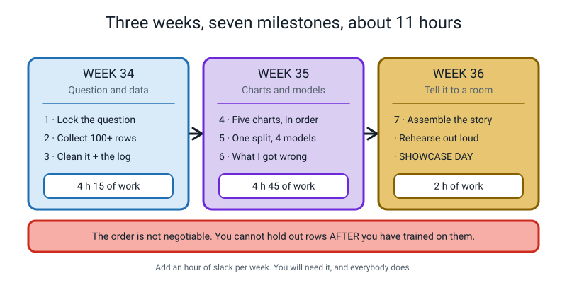
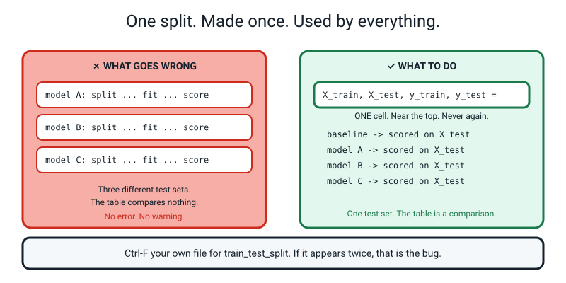
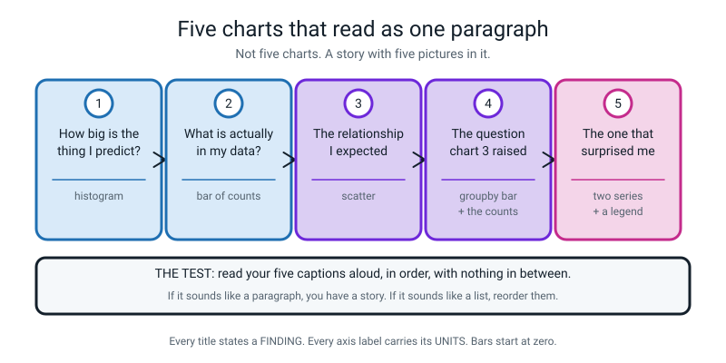
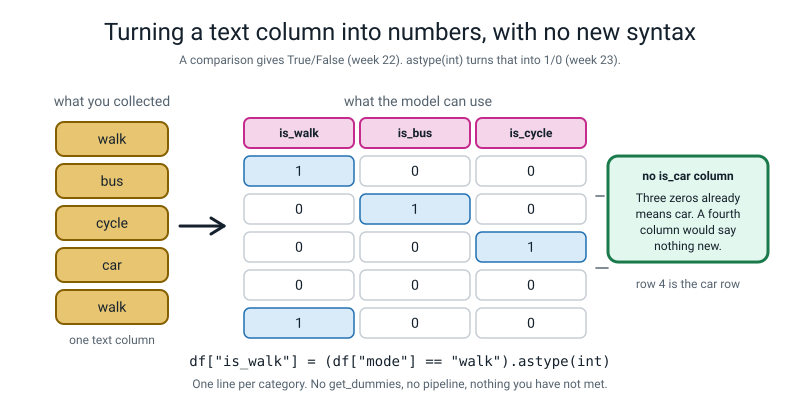
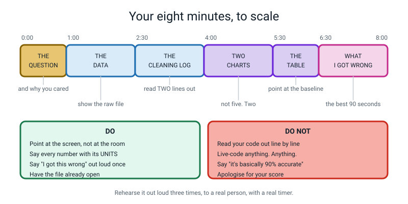
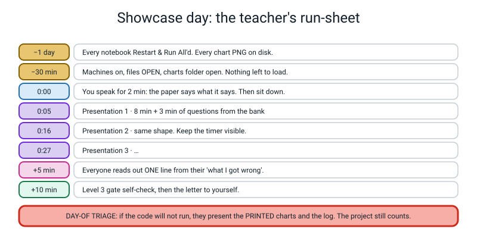

# 🎪 The Level 2 Capstone — Data Detective

### *Weeks 34, 35 and 36. Three weeks. One question you care about. One hundred rows you collected yourself. One number you are willing to defend out loud.*

[⬅ The worked example](worked-example-project.md) · [Fifty project ideas](project-ideas.md) · [Course home](../README.md) · [Assessments](../assessments/README.md)

---

> ### In one sentence
>
> **You are going to show up in front of a room with a question, a messy table you built by hand, a
> cleaning log, five charts, four models on one honest split, and a page titled "what I got wrong" —
> and you are going to be able to defend every number on it.**

---

## 🧑‍🏫 Teacher: what you actually have to do

Read this box and you can run all three weeks. You do not need to know Python and you do not need to
know machine learning.

1. **You are a producer, not an expert.** Your five jobs are: keep them on the milestone schedule,
   refuse to let them skip the raw-file rule, ask *"out of how many?"* about every number, run the
   showcase, and mark the rubric.
2. **The single most useful sentence you can say all term** is: **"out of how many?"** It works on every
   claim in every project, you never need to understand the code to ask it, and nine times out of ten
   they will not know and going to find out is where the learning is.
3. **The second most useful is:** *"which rows was that number measured on?"* If they cannot answer from
   the code in front of them, the number does not go in the report.
4. **There is a hard rule and it is the only one you must enforce yourself:** `data/raw.csv` is written
   once and **never edited again**. Every repair happens in code, in a script that can be re-run. Check
   this in Week 34 and check it again in Week 36.
5. **Nothing here needs the internet.** No accounts, no uploads, no API keys. Every dataset is one the
   student typed. That is deliberate and it makes the privacy conversation easy.
6. **If the code does not run on the day, the project still counts.** The day-of triage is at the bottom
   of this page. A printed chart and a cleaning log is a presentation.



*Figure C.1 — The three weeks. The order is not negotiable, for one reason: you cannot hold out rows after you have already trained on them.*

---

# 🪝 The Brief

Somebody near you is about to make a decision with something at stake, and they have no data. They have
a strong opinion, three stories, and a budget.

Maybe it is *how many snacks to order for Friday club*. Maybe it is *whether to move cricket practice
earlier because kids keep arriving late*. Maybe it is *which of two after-school clubs to keep*. Maybe it
is your own mum, deciding what time you have to leave for school.

**You are going to be the one who turns up with a table.**

Not a table somebody handed you. A table **you built, one row at a time, about something in your own
life** — 100+ rows of it. Then a cleaning log, five charts, four models, and one honest sentence about
how sure you are.

```
   ┌────────────────────────────────────────────────────────────────────┐
   │                                                                    │
   │   THE FOUR THINGS THAT MAKE THIS A REAL PROJECT                    │
   │                                                                    │
   │   1.  The data is YOURS. You collected it. You know what every     │
   │       row means, because you were there when it happened.          │
   │                                                                    │
   │   2.  Every change you made to it is written down with a reason.   │
   │       Anyone can rerun your work and land in the same place.       │
   │                                                                    │
   │   3.  The score you report is measured on rows the model never     │
   │       saw. Once. You do not get to try again.                      │
   │                                                                    │
   │   4.  There is a section, in your own handwriting, titled          │
   │       "what I got wrong". And it is not empty.                     │
   │                                                                    │
   └────────────────────────────────────────────────────────────────────┘
```

## Why this is the shape it is

Every week of Level 2 built one piece of one thing. **This is the thing.**

| Weeks | The piece they gave you | Where it shows up in the capstone |
|:--:|---|---|
| 1–9 | Variables, types, f-strings, loops, `if`, `def`, **and tracebacks** | Every file. You will read a lot of tracebacks |
| 10–16 | Functions with parameters, lists, dicts, the CSV round trip | `helpers.py`, the collection script, `raw.csv` |
| 17–20 | numpy arrays, masks, `axis` | `np.abs`, the derived columns |
| 21–24 | DataFrames, cleaning, `groupby`, **the log** | Milestone 3 |
| 25–27 | Five chart types, labels, honest axes, `corr` | Milestone 4 |
| 28–30 | `X`, `y`, the split, scaling, leakage | Milestone 5 |
| 31–33 | Trees, lines, MAE/RMSE/R², **the overfitting cliff** | Milestone 5 and 6 |

And here is the professional truth underneath it, which the [worked example](worked-example-project.md)
measured in an actual timesheet: **the model is about 6% of the work.** The other 94% is the question,
the collecting, the cleaning log, the charts, and knowing what you got wrong. Almost nobody teaches the
94%. You are about to build it.

---

# 📝 The Planning Worksheet

**Fill this in on paper, in Week 34, before you write a line of code.** Photocopy it. It is the single
highest-value page in the capstone, and every year the students who skip it lose two hours in Week 35
that they cannot get back.

```
   ┌──────────────────────────────────────────────────────────────────────────┐
   │  DATA DETECTIVE — PLANNING WORKSHEET                                     │
   │  Name ______________________   Date signed ______________                │
   │                                                                          │
   │  1. MY QUESTION, in one sentence, ending in a question mark              │
   │     ___________________________________________________________________  │
   │                                                                          │
   │  2. WHY I CARE. A real moment, with a date, when this mattered.          │
   │     ___________________________________________________________________  │
   │                                                                          │
   │  3. WHAT I THINK THE ANSWER IS.  ⚠️ WRITE THIS NOW. Before you look.      │
   │     ___________________________________________________________________  │
   │     ___________________________________________________________________  │
   │                                                                          │
   │  4. ONE ROW OF MY TABLE IS ONE  ______________________________           │
   │     (one journey? one day? one song? one innings? Be exact.)             │
   │                                                                          │
   │  5. MY TARGET COLUMN — the one I want to predict                         │
   │     name: __________   is it a NUMBER or a CATEGORY? ______________      │
   │     units: __________   range I expect: from ______ to ______            │
   │                                                                          │
   │  6. MY FEATURE COLUMNS — at least four. For EACH one, answer the test.   │
   │                                                                          │
   │     name          units      how I measure it        Could I know this   │
   │                                                      BEFORE the target   │
   │                                                      happened?  Y / N    │
   │     ___________   ________   ____________________    ______              │
   │     ___________   ________   ____________________    ______              │
   │     ___________   ________   ____________________    ______              │
   │     ___________   ________   ____________________    ______              │
   │     ___________   ________   ____________________    ______              │
   │                                                                          │
   │     ⚠️ ANY "N" IN THAT LAST COLUMN IS LEAKAGE. Cross the column out.     │
   │                                                                          │
   │  7. ANY 1-TO-5 SCALE I AM USING, DEFINED IN WORDS                        │
   │     1 means ____________________  5 means ____________________          │
   │                                                                          │
   │  8. HOW I GET 100+ ROWS                                                  │
   │     rows per sitting: ______  sittings: ______  total: ______            │
   │     when I will do them: ____________________________________            │
   │                                                                          │
   │  9. WHOSE DATA IS IT?  ______________________________________            │
   │     Did I ask?  Y / N.  When, and what did they say?                     │
   │     ___________________________________________________________________  │
   │     Are there NAMES in my file?  Y / N.  If Y, replace with codes NOW.   │
   │                                                                          │
   │ 10. WHAT WOULD A WRONG PREDICTION COST A REAL PERSON?                    │
   │     ___________________________________________________________________  │
   │                                                                          │
   │  ────────────────────────────────────────────────────────────────────    │
   │  TEACHER SIGN-OFF before Milestone 2 begins:  ____________              │
   └──────────────────────────────────────────────────────────────────────────┘
```

## The four tests your question must pass

```
   TEST 1 — THE CARE TEST
   Will you still want the answer in four weeks?
        ✅ "How much of my day actually goes on screens?"
        ❌ "Something about the weather I guess."

   TEST 2 — THE 100-ROW TEST
   Can you honestly get 100+ rows in about two hours, without
   asking for permission you cannot get?
        ✅ 120 journeys from your own family's week
        ❌ 100 classmates' exam marks

   TEST 3 — THE TARGET TEST
   Is there ONE column you would like to predict from the others?
        ✅ minutes (a number)   ·   late / on-time (a category)
        ❌ "I just want to explore"  ← that is a chart project, not this

   TEST 4 — THE HONEST-FEATURE TEST     ⚠️ this is the one that sinks projects
   Could you know every feature BEFORE the target happened?
        ✅ predicting journey time from distance, mode, rain
        ❌ predicting journey time from "what time I arrived"
                                        ← that IS the answer
```

**Test 4 feels wonderful while you are getting it wrong.** Your model scores 0.99 and you feel like a
genius, and then you notice one of your columns already contains the answer. Week 30 called it
**leakage**. Line 6 of the worksheet is there to catch it before you collect anything.

## Question shapes that work well

| Question | Target | Features you would collect | 100 rows in… | Watch out for |
|---|---|---|:--:|---|
| **How long does my journey to school take?** | `minutes` | distance, mode, rain, departure hour | 5/day × 20 days, or a family's trips | You need real variety in mode. 100 identical walks teach nothing |
| **How long will I actually watch this video?** | `watch_minutes` | duration, category, time of day, who recommended it | 100 over two weeks | Be honest. Rounding 3 min up to 5 is data corruption |
| **What does a cricket innings score?** | `runs` | overs faced, position, ground, first/second innings | 100 from your own scorebook | Scorebooks have gaps. Gaps are a **finding**, log them |
| **How much does a shop trip cost?** | `total_rupees` | number of items, had-a-list, day, store | 100 receipts over a month (ask first!) | Prices drift. Put the date range in the data card |
| **Will the bus be late?** | `late` (category) | scheduled time, rain, day, route | 100 over 5 weeks | Two classes → you MUST state the majority-class baseline |
| **How long does a chore take?** | `minutes` | chore type, who did it, days since last time, helpers | 100 over three weeks | Get every family member's permission first, in writing |

> 🔑 **Strong recommendation: pick a NUMBER target.** All three of your models — kNN, decision tree,
> linear regression — work on numbers, and all three of your metrics (MAE, RMSE, R²) apply. A category
> target is allowed, and the sidebar in Milestone 5 tells you what changes, but linear regression cannot
> do it and you will have one fewer model.

## Questions to avoid, and why

| Don't | Why not |
|---|---|
| Anything predicting a **person's** mood, ability, honesty or worth | You cannot measure it, the labels are not real things, and somebody gets hurt |
| Anything **medical** | *"Is this rash bad?"* has a wrong answer that hurts somebody, and you cannot test it honestly |
| Anything needing **other people's marks, money or messages** | You cannot get honest permission and you should not try |
| Anything from a **downloaded dataset** | The whole point is that you were there when every row was written. A downloaded file is somebody else's capstone |
| Anything needing **more than 3 hours of collecting** | You have three weeks and six other things to do in them |

---

# 💻 Your Code Must Do These Five Things

Everything else is a preference. **These five are the spec, and the rubric checks all five directly.**

```
   ┌──────────────────────────────────────────────────────────────────────────┐
   │  THE FIVE-THING SPEC                                                     │
   │                                                                          │
   │  1.  IT READS raw.csv AND NEVER WRITES TO IT.                            │
   │      Your cleaning script opens data/raw.csv and saves data/clean.csv.   │
   │      Deleting clean.csv and re-running must give you clean.csv back,     │
   │      identical. Test that. Actually delete it and actually re-run.       │
   │                                                                          │
   │  2.  IT SPLITS ONCE, AND SAYS SO.                                        │
   │      train_test_split appears EXACTLY ONCE in your whole project, with   │
   │      random_state set to a number you wrote down. Search your files for  │
   │      the words "train_test_split". If you find two, that is the bug.    │
   │                                                                          │
   │  3.  IT PRINTS A BASELINE BEFORE IT PRINTS A MODEL.                      │
   │      A number target: always guess the training mean.                    │
   │      A category target: always guess the commonest class.                │
   │      If no model beats it, your project's finding is that no model       │
   │      beats it, and that is a real finding. Say it.                       │
   │                                                                          │
   │  4.  EVERY SCORE IT PRINTS SAYS WHICH ROWS AND WHAT UNITS.               │
   │      Not "2.70". "test MAE 2.70 minutes, on the 23 rows held back        │
   │      before training". A bare number is not a result.                    │
   │                                                                          │
   │  5.  IT RUNS TOP TO BOTTOM, FROM CLEAN, WITH NO ERRORS.                  │
   │      Close everything. Open a fresh terminal. Run every script in        │
   │      order. If anything breaks, it is not finished — however good the    │
   │      numbers were the last time you looked.                             │
   └──────────────────────────────────────────────────────────────────────────┘
```



*Figure C.2 — Spec item 2, drawn. Three models that each split their own data have three different test sets, so the results table is not a comparison of anything. There is no error message for this.*

---

# 📅 WEEK 34 — Question and Data

**Three milestones, about 4 h 15 in total.** Roughly 60 min in class and the rest as homework across the
week. The collecting is the long part and it cannot be rushed on the Sunday night.

## ☐ Milestone 1 — Lock the question (45 min, in class)

Fill in the planning worksheet above. Then set up the folder, exactly like this:

```text
my-capstone/
├── data/
│   ├── raw.csv          <- written ONCE. Never edited. Ever.
│   └── clean.csv        <- created by clean.py. Deletable and rebuildable.
├── charts/              <- five PNGs land here
├── notes/
│   ├── plan.md          <- the worksheet, typed up
│   ├── cleaning-log.md  <- numbered, with a reason per line
│   └── diary.md         <- what went wrong while collecting
├── helpers.py           <- the one report() function
├── clean.py             <- raw.csv  ->  clean.csv
├── charts.py            <- clean.csv -> five PNGs
├── model.py             <- ONE split, baseline + three models
├── depth_curve.py       <- the overfitting chart, on your data
└── worst5.py            <- the five predictions it got most wrong
```

**Copy-paste template — `notes/plan.md`:**

```markdown
# DATA DETECTIVE — <your title, which is a QUESTION>

## The question
<one sentence, ending in a question mark>

## Why I care
<a real moment, with a date>

## My prediction, written on <date>, BEFORE collecting anything
<what I think the answer will be, and roughly how big>

## One row of my table is one
<one journey / one day / one innings / one song>

## The columns

| column | what it means | units | how I measure it | known before the target? |
|---|---|---|---|:--:|
| km | road distance door to gate | kilometres | phone map, once per route | yes |
| mode | how I travelled | walk/bus/cycle/car | I was there | yes |
| rain | was it raining when I left | 0 or 1 | out of the window | yes |
| depart_hour | hour I left the house | 7, 8 or 9 | the kitchen clock | yes |
| **minutes** | **TARGET: door to gate** | **minutes** | **two clock readings** | **— it IS the target** |

## Data card
- **Who collected it:** me
- **Over what dates:** <first> to <last>
- **How many rows:** <n>
- **Whose data is in it:** <me / my family, who said yes on _____>
- **Names in the file:** none. <or: replaced with person_A ... person_D, key kept on paper>
- **Known measurement error:** I read the clock to the nearest minute, so every row is +/- 30 seconds
- **What a wrong prediction would cost:** <one real sentence>
```

## ☐ Milestone 2 — Collect 100+ rows (120 min, homework, spread over the week)

**This is the longest milestone and it cannot be compressed.** Start it the day Milestone 1 is signed off.

**Copy-paste template — the paper sheet.** Print 30 of these before you collect anything. Filling in
paper first and typing later is faster and more honest than trying to type in the moment.

```
   ┌───────┬────────┬────────┬───────┬────────┬─────────┬──────────────────┐
   │ row # │  date  │   km   │ mode  │  rain  │ depart  │  minutes (TARGET)│
   ├───────┼────────┼────────┼───────┼────────┼─────────┼──────────────────┤
   │       │        │        │       │        │         │                  │
   │       │        │        │       │        │         │                  │
   │       │        │        │       │        │         │                  │
   └───────┴────────┴────────┴───────┴────────┴─────────┴──────────────────┘
```

**Copy-paste template — `notes/diary.md`.** One line every time something goes wrong. This file is
worth a rubric mark and it takes ten seconds a day.

```markdown
# Collection diary

- **12 May** — forgot to write the departure time for two journeys. Left them BLANK
  rather than guessing. Rows 14 and 15.
- **13 May** — realised "cycle" and "bike" are the same thing and I had used both.
  Will fix in cleaning, NOT in raw.csv.
- **15 May** — Dad drove me and I did not know the distance, so I used the same km
  as the walking route. This is WRONG and it is in the file. Row 41.
- **17 May** — three journeys in one day because of a dentist trip. Kept all three.
```

**Four rules for collecting, and the fourth is the one everybody breaks:**

| Rule | Why |
|---|---|
| **Write it down as it happens** | A row you remembered on Sunday is a row you invented |
| **Leave blanks blank** | A blank means *I don't know*. A guessed number means *I know*, and it is a lie. Cleaning can handle a blank; it cannot detect a guess |
| **Keep the awkward rows** | The dentist day, the day the bus broke down, the 27-minute walk. Those are your five worst predictions in Milestone 6, and they are the most interesting page in your report |
| **Get 10+ of every category value** | If `car` appears three times, no model can learn anything about cars, and you will not find out until Milestone 5 |

Then type it into a spreadsheet, export as `data/raw.csv`, and **write-protect it in your head.** From
this moment it is read-only.

> **⚠️ Watch out — the number one Week 34 failure.** A student collects 60 rows because "that's probably
> enough". It is not, and the reason is arithmetic they already know: a 20% test set of 60 rows is **12
> rows**, so one row is worth **8.3 percentage points**, and nothing they conclude will be
> distinguishable from luck. At 120 rows the test set is 24 and one row is 4.2 points. **Every extra row
> you collect makes your conclusion sharper**, and this is the only milestone where extra effort has a
> guaranteed payoff.

## ☐ Milestone 3 — Clean it, and log every change (90 min, in class)

**First, look at the file you actually produced.** Here are the first twelve rows of the real
`data/raw.csv` used throughout this page — 112 rows, and there are already four things wrong with it:

```text
km,mode,rain,depart_hour,minutes
5.3,car,1,8,13
4.9,bus,1,9,14
1.1,bus,0,7,9
3.8,walk,1,8,25
4.0,bus,0,7,14
4.8,walk,0,8,240        <- line 7:  a stray zero. 240 minutes for a 4.8 km walk
3.4,bus,,8,14           <- line 8:  blank rain. Interrupted mid-row
2.8,Cycle,0,9,9         <- line 9:  "Cycle" with a capital C
2.3,cycle,0,8,12
2.8,walk,0,8,18
5.8,walk,0,7,23
2.6,car,1,8,19
```

And further down there are ` cycle` with a leading space (line 15), `CYCLE` in shouty capitals
(line 24), another blank `rain` (line 16), and one **exact duplicate row** — lines 22 and 61 are the
same 2.0 km car journey typed twice.

**Copy-paste template — `clean.py`.** Delete the blocks you do not need. Keep every `print`: they are
how you find out what is wrong.

```python
# clean.py -- data/raw.csv  ->  data/clean.csv
# raw.csv is NEVER edited. Every repair lives here, so it can be re-run.
import pandas as pd

df = pd.read_csv("data/raw.csv")

# ---- LOOK FIRST. Change nothing until you have printed all of this.
print("shape before:", df.shape)
print()
print("--- missing values per column")
print(df.isna().sum())
print()
print("--- what kind is each column?")
print(df.dtypes)
print()
print("--- every spelling of every text column")
for column in df.columns:
    if df[column].dtype == "object":
        print(df[column].value_counts())
        print()
print("--- the numbers: are any of them impossible?")
print(df.describe().round(2))
print()
print("duplicate rows:", df.duplicated().sum())
print()

# ---- REPAIR 1. Tidy the text FIRST. Always first. See note 5 in the log.
df["mode"] = df["mode"].str.strip().str.lower()
print("modes after tidying:")
print(df["mode"].value_counts())
print()

# ---- REPAIR 2. Impossible values. LOOK at them before you change them.
bad = df[df["minutes"] > 90]
print("rows with an impossible journey time:", len(bad))
print(bad)
df.loc[df["minutes"] > 90, "minutes"] = 24      # a stray zero. See note 2.
print()

# ---- REPAIR 3. Missing values. A DECISION, and it goes in the log.
print("missing rain values:", df["rain"].isna().sum())
df["rain"] = df["rain"].fillna(0)               # the diary says both were dry
df["rain"] = df["rain"].astype(int)             # now it can be whole numbers again
print()

# ---- REPAIR 4. Missing TARGET. Those rows cannot be used. Drop and COUNT.
before = len(df)
df = df[df["minutes"].notna()]
print("rows dropped for a missing target:", before - len(df))

# ---- REPAIR 5. Duplicates. LAST, once the text is tidy.
df = df.drop_duplicates()

print()
print("shape after :", df.shape)
print("mean journey time after cleaning:", round(df["minutes"].mean(), 2), "minutes")
df.to_csv("data/clean.csv", index=False)
print("wrote data/clean.csv")
```

**Its real output, in full:**

```text
shape before: (112, 5)

--- missing values per column
km             0
mode           0
rain           2
depart_hour    0
minutes        0
dtype: int64

--- what kind is each column?
km             float64
mode            object
rain           float64
depart_hour      int64
minutes          int64
dtype: object

--- every spelling of every text column
walk      36
bus       27
cycle     24
car       22
Cycle      1
 cycle     1
CYCLE      1
Name: mode, dtype: int64

--- the numbers: are any of them impossible?
           km    rain  depart_hour  minutes
count  112.00  110.00       112.00   112.00
mean     3.38    0.26         7.77    15.88
std      1.50    0.44         0.60    22.01
min      0.70    0.00         7.00     2.00
25%      2.08    0.00         7.00    11.00
50%      3.45    0.00         8.00    14.00
75%      4.60    1.00         8.00    17.25
max      6.00    1.00         9.00   240.00

duplicate rows: 1

modes after tidying:
walk     36
bus      27
cycle    27
car      22
Name: mode, dtype: int64

rows with an impossible journey time: 1
    km  mode  rain  depart_hour  minutes
5  4.8  walk   0.0            8      240

missing rain values: 2

rows dropped for a missing target: 0

shape after : (111, 5)
mean journey time after cleaning: 14.0 minutes
wrote data/clean.csv
```

**Five things in that output, and each one is a log entry waiting to be written.**

| What the output says | What it means |
|---|---|
| `rain    2` in `isna().sum()` | Two blank cells. And look two lines down: **`rain` came in as `float64`** even though every value typed was 0 or 1. Two holes did that, because `NaN` is a decimal-only idea |
| `cycle 24 · Cycle 1 · cycle 1 · CYCLE 1` | **Four spellings of one mode.** `value_counts()` reported five modes where there are four, and nothing else would ever have told you |
| `max  240.00` and `std 22.01` in `describe()` | 240 minutes for a 4.8 km walk. And look at the standard deviation: **22.01** on a column whose real spread is about 5. One value did that |
| `mean  15.88` before, `14.0` after | **That one stray zero was moving the mean of the target column by 1.88 minutes** — and the whole model's error is about 2.7 minutes. This is the single best argument for `describe()` in the level |
| `duplicate rows: 1` | One journey typed twice. Nobody noticed while typing; `drop_duplicates()` noticed in a millisecond |

> **⚠️ Watch out — `df[df["minutes"].notna()]` is the one line here that is not on the syntax ladder.**
> `.notna()` is simply the opposite of `.isna()` from Week 23. It is the only new thing in this whole
> template. If you would rather not use it, drop those rows by hand the way you would drop duplicates,
> and log the row numbers.

### The cleaning log — copy this shape exactly

Every line needs **five** things: *what* column, *how many* rows, *what you did*, **why**, and *what it
changed*. A log entry with no **why** is a list, not a log. Here is the real log for the output above.

```markdown
# Cleaning log — data/raw.csv (112 rows) -> data/clean.csv (111 rows)
Every repair lives in clean.py and can be re-run. raw.csv has not been edited.

1. **mode** — 4 spellings ("cycle", "Cycle", " cycle", "CYCLE") reduced to 1 with
   `.str.strip().str.lower()`. **Why:** value_counts() reported FIVE modes where
   there are four, and groupby and drop_duplicates both compare strings exactly, so
   " cycle" is not "cycle". **Changed:** cycle count 24 -> 27. Nothing numeric.
   **Done FIRST, on purpose** — see note 5.

2. **minutes, row 5 (CSV line 7)** — 240 minutes for a 4.8 km walk. Changed to 24.
   **Why:** I checked my diary and it was a 24-minute walk. I typed an extra zero.
   I did NOT use the mean or the median, because this is a known typo with a known
   right answer and a mean would have hidden that.
   **Changed:** mean minutes 15.88 -> 14.00, and the standard deviation 22.01 -> 5.37.
   **ONE stray zero in ONE row out of 112 was moving the average of the thing I am
   trying to predict by 1.88 minutes, and my model's whole error is 2.7 minutes.**

3. **rain, rows 6 and 14 (CSV lines 8 and 16)** — blank, filled with 0.
   **Why:** I was interrupted mid-row both times. I checked the collection diary and
   both days are logged as dry, so 0 is the truth here and not a guess.
   ALSO: those two blanks made the whole `rain` column come back as float64, so I
   had to `.astype(int)` AFTER filling them. Not before — you cannot turn a missing
   value into a whole number.
   **Changed:** 2 of 111 rows; rain dtype float64 -> int64.

4. **1 exact duplicate row removed** with drop_duplicates() — CSV lines 22 and 61,
   the same 2.0 km car journey. **Why:** I typed one journey twice. Leaving it in
   counts one journey as two and quietly inflates every score.
   **Changed:** 112 rows -> 111.

5. **NOTE ON ORDER.** Repair 4 has to come AFTER repair 1. "Cycle" and "cycle" are
   different strings, so drop_duplicates() cannot see two rows are the same journey
   until the text is tidy. Here it happened to find the same 1 row either way,
   because my duplicate was a car journey — but it would NOT have if the duplicate
   had been one of the three odd cycle spellings.

6. **0 rows dropped for a missing target.** Every row has a `minutes` value.
   **Why this line exists anyway:** so a reader knows I checked.

## What I did NOT do
I did not remove any row for being "weird". The three-journeys-in-one-day dentist day
is still in there. The awkward rows are the interesting ones — and three of them turn
up again in my five worst predictions.

## The uncomfortable one, which needed no code
Row 41 in raw.csv: Dad drove me and I did not know the road distance, so I wrote the
km from the WALKING route. That number is wrong, it is in the file, and no amount of
cleaning code can find it, because it is not impossible — it is just untrue. It is in
the collection diary for 15 May and I am not hiding it.
```

> **🧑‍🏫 Log entry 2 is the one to read out loud to the whole class.** One typo — a stray zero, in one
> row out of 112 — was moving the mean of the target column by **1.88 minutes**, when the whole model's
> error is about 2.7 minutes. That is the entire argument for `describe()` and for cleaning, delivered
> in one number.
>
> And the last section is the one to praise. **A wrong value that is not impossible cannot be found by
> any code.** The only thing that catches it is a collection diary and the honesty to reproduce it. If a
> student's log has nothing uncomfortable in it, the log is not finished.

### ✅ Week 34 evidence checklist

```
   ☐  notes/plan.md, signed and dated, with the PREDICTION filled in
   ☐  data/raw.csv exists, has 100+ data rows, and has not been edited since it
      was written
   ☐  notes/diary.md has at least three entries
   ☐  clean.py runs, prints shape before and after, and writes data/clean.csv
   ☐  notes/cleaning-log.md has a numbered entry per repair, each with a WHY
   ☐  Deleting data/clean.csv and re-running clean.py brings it back identical
   ☐  Every category value appears at least 10 times   (check with value_counts)
```

---

# 📅 WEEK 35 — Charts and Models

**Three milestones, about 4 h 45.** Milestone 5 is the hardest thing in Level 2 and it is 120 minutes.
Do not start it at 9pm.

## ☐ Milestone 4 — Five charts that tell a story (105 min)



*Figure C.3 — The five charts, in the order that makes them a story instead of a gallery.*

**Copy-paste template — `charts.py`.** Five charts, in this order, each answering the question the one
before it raised.

```python
# charts.py -- five charts in NARRATIVE order. Each title states a FINDING.
import matplotlib.pyplot as plt
import pandas as pd

df = pd.read_csv("data/clean.csv")

# --- 1. HOW BIG IS THE THING I AM PREDICTING?   -> histogram
fig, ax = plt.subplots(figsize=(6, 4))
ax.hist(df["minutes"], bins=10)
ax.set_title("Most journeys take 10-18 minutes; a tail runs out to 27")
ax.set_xlabel("Journey time (minutes)")
ax.set_ylabel("Number of journeys")
fig.savefig("charts/1_target_spread.png", dpi=120, bbox_inches="tight")

# --- 2. WHAT IS ACTUALLY IN MY DATA?            -> bar of counts
counts = df["mode"].value_counts()
print(counts)
fig, ax = plt.subplots(figsize=(6, 4))
ax.bar(counts.index, counts.values)
ax.set_title("Walking is my commonest mode: 36 of 111 journeys")
ax.set_xlabel("Mode of travel")
ax.set_ylabel("Number of journeys")
fig.savefig("charts/2_mode_counts.png", dpi=120, bbox_inches="tight")

# --- 3. THE RELATIONSHIP I EXPECTED             -> scatter
print("corr(km, minutes) =", round(df["km"].corr(df["minutes"]), 3))
fig, ax = plt.subplots(figsize=(6, 4))
ax.scatter(df["km"], df["minutes"])
ax.set_title("Longer journeys take longer, but the spread is wide (r = 0.62)")
ax.set_xlabel("Distance (km)")
ax.set_ylabel("Journey time (minutes)")
fig.savefig("charts/3_km_vs_minutes.png", dpi=120, bbox_inches="tight")

# --- 4. THE QUESTION CHART 3 RAISED             -> groupby bar, WITH THE COUNTS
means = df.groupby("mode")["minutes"].mean().sort_values()
sizes = df.groupby("mode")["minutes"].count()
print(means.round(2))
print(sizes)
fig, ax = plt.subplots(figsize=(6, 4))
ax.bar(means.index, means.values)
ax.set_ylim(0, 25)                    # bars encode LENGTH, so bars start at zero
ax.set_title("Walking averages 17.4 min; the car averages 11.2 (n = 36 and 21)")
ax.set_xlabel("Mode of travel")
ax.set_ylabel("Mean journey time (minutes)")
fig.savefig("charts/4_mode_means.png", dpi=120, bbox_inches="tight")

# --- 5. THE ONE THAT SURPRISED ME               -> two series, so it needs a legend
dry = df[df["rain"] == 0]
wet = df[df["rain"] == 1]
print("dry n =", len(dry), " mean", round(dry["minutes"].mean(), 2))
print("wet n =", len(wet), " mean", round(wet["minutes"].mean(), 2))
fig, ax = plt.subplots(figsize=(6, 4))
ax.scatter(dry["km"], dry["minutes"], marker="o", label=f"dry (n={len(dry)})")
ax.scatter(wet["km"], wet["minutes"], marker="s", label=f"wet (n={len(wet)})")
ax.set_title("Wet journeys average 2.3 minutes longer (n = 29 wet, 82 dry)")
ax.set_xlabel("Distance (km)")
ax.set_ylabel("Journey time (minutes)")
ax.legend()
fig.savefig("charts/5_rain_effect.png", dpi=120, bbox_inches="tight")
print("saved 5 charts to charts/")
```

**Real output:**

```text
walk     36
bus      27
cycle    27
car      21
Name: mode, dtype: int64
corr(km, minutes) = 0.617
mode
car      11.19
bus      12.41
cycle    13.19
walk     17.44
Name: minutes, dtype: float64
mode
bus      27
car      21
cycle    27
walk     36
Name: minutes, dtype: int64
dry n = 82  mean 13.39
wet n = 29  mean 15.72
saved 5 charts to charts/
```

**Notice three things about that output, because they all become chart captions:**

- **`corr(km, minutes) = 0.617`.** Positive and real, and nowhere near 1.0. Longer journeys take longer,
  and distance is nothing like the whole story — which is exactly what chart 4 goes looking for.
- **The group means come with `count()` next to them.** Car's 11.19 minutes is from **21** journeys;
  walking's 17.44 is from **36**. Week 24's rule: never a group mean without its group size.
- **`car` has only 21 rows.** Worth flagging in the caption. That is the smallest group and the least
  trustworthy bar.

### The caption test

Write one sentence under each chart. Then **read all five aloud, in order, with nothing in between.**

> *"Most of my journeys take 10 to 18 minutes, with a tail out to 27. Walking is what I do most — 36 of
> my 111 journeys. Longer journeys do take longer, but only loosely: r is 0.62, so distance is not the
> whole story. What distance was hiding is the mode: walking averages 17.4 minutes and the car 11.2,
> from 36 and 21 journeys. And rain adds about 2.3 minutes on top of all of that, at every distance."*

**If that sounds like a paragraph, you have a story. If it sounds like a list, reorder your charts.**

## ☐ Milestone 5 — ⚠️ One split, four models, one table (120 min) — *the hardest milestone*

### Step 1 — text columns into numbers, by hand



*Figure C.4 — Your `mode` column is words, and models only eat numbers. Three lines of Week 22 and Week 23 syntax fix it.*

```python
df["is_walk"] = (df["mode"] == "walk").astype(int)
df["is_bus"] = (df["mode"] == "bus").astype(int)
df["is_cycle"] = (df["mode"] == "cycle").astype(int)
```

**One line per category, minus one.** There is deliberately no `is_car` column: three zeros already
means car, so a fourth column would say nothing new.

> **🧑‍🏫 If a student has met `pd.get_dummies` somewhere:** it does exactly this in one line and it is
> **not** in Level 2, on purpose. Doing it by hand costs three lines and makes the 0/1 columns visible,
> which is the point. Let them use it if they can explain the output; ask where they found it.

### Step 2 — `helpers.py`, written once and used by everything

**Copy-paste template — `helpers.py`:**

```python
# helpers.py -- ONE report function, used by every model. Written once, in Week 34.
import numpy as np
from sklearn.metrics import mean_absolute_error, r2_score


def report(name, model, X_train, y_train, X_test, y_test, units="minutes"):
    """Print one row of the results table for one model. Nothing clever in here."""
    train_pred = model.predict(X_train)
    test_pred = model.predict(X_test)
    train_mae = mean_absolute_error(y_train, train_pred)
    test_mae = mean_absolute_error(y_test, test_pred)
    test_r2 = r2_score(y_test, test_pred)
    worst = np.abs(y_test - test_pred).max()          # Week 33's extra line
    print(f"{name:<22} train MAE {train_mae:6.2f}   test MAE {test_mae:6.2f}   "
          f"test R2 {test_r2:6.3f}   worst miss {worst:6.2f} {units}")
    return test_mae


def baseline_mae(y_train, y_test, units="minutes"):
    """The stupidest possible model: always guess the TRAINING mean.
    Every real model has to beat this number or it has learned nothing."""
    guess = y_train.mean()
    always_guess = [guess] * len(y_test)              # the same number, once per test row
    mae = mean_absolute_error(y_test, always_guess)
    worst = np.abs(y_test - guess).max()
    print(f"{'baseline: always ' + str(round(guess, 1)):<22} train MAE   ----   "
          f"test MAE {mae:6.2f}   test R2  0.000   worst miss {worst:6.2f} {units}")
    return mae
```

**Why one function and not four print statements.** Because if each model prints its own score in its own
way, you cannot be sure they were measured the same way — and you will not find out until somebody asks
you in the showcase. One function, one format, four calls.

### Step 3 — `model.py`

**Copy-paste template — `model.py`:**

```python
# model.py -- ONE split, a baseline, three models, one results table.
import pandas as pd
from sklearn.model_selection import train_test_split
from sklearn.preprocessing import StandardScaler
from sklearn.neighbors import KNeighborsRegressor
from sklearn.tree import DecisionTreeRegressor, export_text
from sklearn.linear_model import LinearRegression
from helpers import report, baseline_mae

df = pd.read_csv("data/clean.csv")
print("shape:", df.shape)

# --- text -> numbers, BY HAND. A comparison gives True/False (week 22);
#     astype(int) turns that into 1/0 (week 23).
df["is_walk"] = (df["mode"] == "walk").astype(int)
df["is_bus"] = (df["mode"] == "bus").astype(int)
df["is_cycle"] = (df["mode"] == "cycle").astype(int)
# NOTE: no is_car column. "all three zeros" already means car.
print(df[["mode", "is_walk", "is_bus", "is_cycle"]].head(6))

FEATURES = ["km", "rain", "depart_hour", "is_walk", "is_bus", "is_cycle"]
X = df[FEATURES]                      # TWO brackets = a table
y = df["minutes"]                     # ONE bracket = one column
print("X shape:", X.shape, " y shape:", y.shape)

# --- THE SPLIT. Made here, once, and never made again anywhere in this project.
X_train, X_test, y_train, y_test = train_test_split(
    X, y, test_size=0.2, random_state=42)
print("train:", X_train.shape, " test:", X_test.shape)
print("one test row is worth", round(100 / len(X_test), 2), "% of the test set")

print()
print("=" * 78)
baseline_mae(y_train, y_test)                                   # beat this or go home

lin = LinearRegression().fit(X_train, y_train)
report("linear regression", lin, X_train, y_train, X_test, y_test)

tree = DecisionTreeRegressor(max_depth=3, random_state=42).fit(X_train, y_train)
report("tree, depth 3", tree, X_train, y_train, X_test, y_test)

scaler = StandardScaler().fit(X_train)                          # TRAIN ROWS ONLY
X_train_s = scaler.transform(X_train)
X_test_s = scaler.transform(X_test)
knn = KNeighborsRegressor(n_neighbors=5).fit(X_train_s, y_train)
report("kNN k=5, scaled", knn, X_train_s, y_train, X_test_s, y_test)
print("=" * 78)

print()
print("slope, in real units, one line per feature:")
for i, name in enumerate(FEATURES):
    coef = lin.coef_[i]
    print(f"   {name:<14} {coef:+7.2f} minutes")
print(f"   intercept      {lin.intercept_:+7.2f} minutes")

print()
print(export_text(tree, feature_names=FEATURES))
print("tree importances:")
for i, name in enumerate(FEATURES):
    imp = tree.feature_importances_[i]
    print(f"   {name:<14} {imp:.3f}")
```

> **💡 Try this:** both of those loops walk **two** lists side by side — the feature names, and the
> numbers the model produced. `enumerate` from Week 14 gives you the position `i` along with the name,
> and `[i]` fetches the matching number out of the second list. Nothing in this template is off the
> syntax ladder, and that is on purpose: you can read every line of it.

**Real output, in full:**

```text
shape: (111, 5)
   mode  is_walk  is_bus  is_cycle
0   car        0       0         0
1   bus        0       1         0
2   bus        0       1         0
3  walk        1       0         0
4   bus        0       1         0
5  walk        1       0         0
X shape: (111, 6)  y shape: (111,)
train: (88, 6)  test: (23, 6)
one test row is worth 4.35 % of the test set

==============================================================================
baseline: always 14.0  train MAE   ----   test MAE   3.74   test R2  0.000   worst miss   9.00 minutes
linear regression      train MAE   2.57   test MAE   2.97   test R2  0.314   worst miss   9.50 minutes
tree, depth 3          train MAE   2.50   test MAE   2.92   test R2  0.405   worst miss   8.00 minutes
kNN k=5, scaled        train MAE   2.25   test MAE   2.70   test R2  0.508   worst miss   7.60 minutes
==============================================================================

slope, in real units, one line per feature:
   km               +2.10 minutes
   rain             +1.98 minutes
   depart_hour      +0.48 minutes
   is_walk          +8.57 minutes
   is_bus           +2.92 minutes
   is_cycle         +3.86 minutes
   intercept        -1.82 minutes

|--- km <= 2.85
|   |--- is_walk <= 0.50
|   |   |--- rain <= 0.50
|   |   |   |--- value: [8.33]
|   |   |--- rain >  0.50
|   |   |   |--- value: [11.50]
|   |--- is_walk >  0.50
|   |   |--- km <= 1.70
|   |   |   |--- value: [10.25]
|   |   |--- km >  1.70
|   |   |   |--- value: [16.00]
|--- km >  2.85
|   |--- is_walk <= 0.50
|   |   |--- depart_hour <= 8.50
|   |   |   |--- value: [14.70]
|   |   |--- depart_hour >  8.50
|   |   |   |--- value: [9.67]
|   |--- is_walk >  0.50
|   |   |--- km <= 4.35
|   |   |   |--- value: [17.29]
|   |   |--- km >  4.35
|   |   |   |--- value: [23.90]

tree importances:
   km             0.569
   rain           0.018
   depart_hour    0.036
   is_walk        0.377
   is_bus         0.000
   is_cycle       0.000
```

### Step 4 — the results table you actually hand in

| Model | train MAE (88 rows) | **test MAE (23 rows never seen)** | test R² | worst single miss | vs baseline |
|---|:--:|:--:|:--:|:--:|:--:|
| *baseline — always guess 14.0 min* | — | **3.74 min** | 0.000 | 9.00 min | — |
| linear regression | 2.57 | **2.97 min** | 0.314 | 9.50 min | −0.77 min |
| tree, depth 3 | 2.50 | **2.92 min** | 0.405 | 8.00 min | −0.82 min |
| **kNN k=5, scaled** | 2.25 | **2.70 min** | 0.508 | 7.60 min | **−1.04 min** |

**Metric: mean absolute error, in minutes.** Split: 88 train / 23 test, `random_state=42`, made once in
`model.py` line 22. **One test row is worth 4.35% of the test set.**

**Say the four sentences out loud, because they are what the table means:**

1. *"Always guessing 14 minutes is wrong by 3.74 minutes on average."*
2. *"My best model is wrong by 2.70 minutes on average — a whole minute better than guessing."*
3. *"Its worst single miss was 7.6 minutes, which is a bus I would have missed."*
4. *"The train and test MAEs are 2.25 and 2.70, so it is leaning on memory a little, but not much."*

### Step 5 — reading the models out loud

**The line, in real units.** This is where a regression stops being maths and becomes a sentence:

| Feature | Slope | Say it out loud |
|---|:--:|---|
| `km` | **+2.10** | *"Every extra kilometre adds about 2.1 minutes."* |
| `rain` | **+1.98** | *"Rain adds about 2 minutes, whatever the distance."* |
| `is_walk` | **+8.57** | *"Walking adds about 8.6 minutes compared with going by car."* |
| `is_cycle` | **+3.86** | *"Cycling adds about 3.9 minutes compared with the car."* |
| `depart_hour` | **+0.48** | *"Half a minute per hour later. Almost nothing — but see below."* |

**And the tree's rules, as English:** *"If it's under 2.85 km and I'm not walking and it isn't raining,
about 8 minutes. If it's over 2.85 km and I am walking and it's over 4.35 km, about 24 minutes."*

**The importances are the finding nobody expects.** `is_bus` and `is_cycle` are both exactly `0.000` —
the tree never used either. It got its answer from `km` (0.569) and `is_walk` (0.377) alone. That does not
mean bus and cycle are meaningless; it means that once the tree knows the distance and whether you are
walking, bus and cycle look the same to it.

### 🔀 Sidebar — if your target is a CATEGORY instead of a number

Four things change and nothing else does:

| | Number target | Category target |
|---|---|---|
| The split | `train_test_split(X, y, test_size=0.2, random_state=42)` | add **`stratify=y`** so both halves keep the class mix |
| The baseline | always guess the training **mean** | always guess the **commonest class**. Compute it: `df["late"].value_counts()`, biggest ÷ total |
| The models | `LinearRegression`, `DecisionTreeRegressor`, `KNeighborsRegressor` | `DecisionTreeClassifier`, `KNeighborsClassifier`, and… **only two.** Linear regression cannot predict a category |
| The metric | MAE, RMSE, R² | `accuracy_score`, **plus a `confusion_matrix` with the class names printed next to it** |

**And one extra thing you must do that a number target does not need:** compute the accuracy **per
class** from the confusion matrix, by hand, with the divisions shown. One overall accuracy hides as many
different accuracies as you have classes. The [worked example](worked-example-project.md#8️⃣-the-result-honestly)
shows 84% hiding a 76.9% and a 91.7%.

## ☐ Milestone 6 — What I got wrong, and who it costs (60 min)

### Step 1 — the depth curve, on your own data

**Copy-paste template — `depth_curve.py`:**

```python
# depth_curve.py -- the most important chart in Level 2, on YOUR data.
import matplotlib.pyplot as plt
import pandas as pd
from sklearn.model_selection import train_test_split
from sklearn.tree import DecisionTreeRegressor
from sklearn.metrics import mean_absolute_error

df = pd.read_csv("data/clean.csv")
df["is_walk"] = (df["mode"] == "walk").astype(int)
df["is_bus"] = (df["mode"] == "bus").astype(int)
df["is_cycle"] = (df["mode"] == "cycle").astype(int)
FEATURES = ["km", "rain", "depart_hour", "is_walk", "is_bus", "is_cycle"]
X, y = df[FEATURES], df["minutes"]
X_train, X_test, y_train, y_test = train_test_split(
    X, y, test_size=0.2, random_state=42)          # the SAME split as model.py

depths = list(range(1, 16))
train_errors = []
test_errors = []
for d in depths:
    t = DecisionTreeRegressor(max_depth=d, random_state=42).fit(X_train, y_train)
    train_errors.append(mean_absolute_error(y_train, t.predict(X_train)))
    test_errors.append(mean_absolute_error(y_test, t.predict(X_test)))
    print(f"depth {d:>2}   train MAE {train_errors[-1]:5.2f}   test MAE {test_errors[-1]:5.2f}")

best = depths[test_errors.index(min(test_errors))]
print("lowest test MAE at depth", best, "=", round(min(test_errors), 2), "minutes")

fig, ax = plt.subplots(figsize=(7, 4))
ax.plot(depths, train_errors, marker="o", label="train MAE (rows it studied)")
ax.plot(depths, test_errors, marker="o", label="test MAE (rows it never saw)")
ax.axvline(best, linestyle="--")
ax.set_title(f"Test error bottoms out at depth {best}, then climbs")
ax.set_xlabel("max_depth of the tree")
ax.set_ylabel("Mean absolute error (minutes)")
ax.legend()
fig.savefig("charts/depth_curve.png", dpi=120, bbox_inches="tight")
print("saved charts/depth_curve.png")
```

**Real output:**

```text
depth  1   train MAE  3.73   test MAE  3.29
depth  2   train MAE  2.97   test MAE  3.64
depth  3   train MAE  2.50   test MAE  2.92
depth  4   train MAE  1.99   test MAE  2.96
depth  5   train MAE  1.45   test MAE  3.06
depth  6   train MAE  1.08   test MAE  3.10
depth  7   train MAE  0.62   test MAE  2.87
depth  8   train MAE  0.44   test MAE  3.10
depth  9   train MAE  0.26   test MAE  2.69
depth 10   train MAE  0.13   test MAE  2.98
depth 11   train MAE  0.03   test MAE  3.00
depth 12   train MAE  0.03   test MAE  3.00
depth 13   train MAE  0.03   test MAE  3.00
depth 14   train MAE  0.03   test MAE  3.00
depth 15   train MAE  0.03   test MAE  3.00
lowest test MAE at depth 9 = 2.69 minutes
```

> **🧑‍🏫 Read this box before a student panics that their curve is "wrong".**
>
> **The train column is textbook.** It falls from 3.73 all the way to **0.03** — the deep trees have very
> nearly memorised all 88 training journeys. That half of the lesson is perfect, and it is the half that
> matters.
>
> **The test column is a mess, and that is the truth.** It bounces between 2.69 and 3.64 with no clean U
> in it. The script says "lowest at depth 9", and **depth 9 is not really the best model** — it is the
> luckiest one, because with 23 test rows one journey moves the MAE by about 0.12 minutes and the whole
> range of that column is a handful of journeys.
>
> **The honest thing to write is this**, and it is worth more marks than a pretty curve:
>
> > *"My training error falls to 0.03 minutes by depth 11, which means the deep trees have memorised my
> > 88 training journeys almost exactly. My test error does not have a clean bottom: it moves between
> > 2.69 and 3.64 with no pattern I trust, because 23 test rows is too short a ruler. So I am not
> > choosing depth 9 just because the script printed it. I chose depth 3, because it is in the region
> > where the two curves have not parted company yet, and because its rules are short enough to read
> > aloud."*
>
> A student who writes that has understood Week 33 far better than one who got a tidy curve.

### Step 2 — the five worst predictions, inspected by hand

**Copy-paste template — `worst5.py`:**

```python
# worst5.py -- look at the five predictions the model got MOST wrong, by hand.
import pandas as pd
from sklearn.model_selection import train_test_split
from sklearn.preprocessing import StandardScaler
from sklearn.neighbors import KNeighborsRegressor

df = pd.read_csv("data/clean.csv")
df["is_walk"] = (df["mode"] == "walk").astype(int)
df["is_bus"] = (df["mode"] == "bus").astype(int)
df["is_cycle"] = (df["mode"] == "cycle").astype(int)
FEATURES = ["km", "rain", "depart_hour", "is_walk", "is_bus", "is_cycle"]
X, y = df[FEATURES], df["minutes"]
X_train, X_test, y_train, y_test = train_test_split(
    X, y, test_size=0.2, random_state=42)          # the SAME split

scaler = StandardScaler().fit(X_train)
knn = KNeighborsRegressor(n_neighbors=5).fit(scaler.transform(X_train), y_train)
pred = knn.predict(scaler.transform(X_test))

look = X_test.copy()
look["mode"] = df.loc[X_test.index, "mode"]        # put the readable column back
look["real"] = y_test
look["guess"] = pred.round(1)
look["miss"] = (look["guess"] - look["real"]).round(1)
look["size_of_miss"] = look["miss"].abs()          # Week 35

worst = look.sort_values("size_of_miss", ascending=False).head(5)
print(worst[["km", "mode", "rain", "depart_hour", "real", "guess", "miss"]].to_string())
print()
print("mean size of miss over all 23 test rows:", round(look["size_of_miss"].mean(), 2), "minutes")
print("biggest single miss                    :", round(look["size_of_miss"].max(), 2), "minutes")
```

**Real output:**

```text
     km   mode  rain  depart_hour  real  guess  miss
64  1.8   walk     1            7     8   15.6   7.6
4   4.0    bus     0            7    14    8.2  -5.8
18  6.0  cycle     0            7    18   14.0  -4.0
81  0.8   walk     0            7     8   12.0   4.0
0   5.3    car     1            8    13   17.0   4.0

mean size of miss over all 23 test rows: 2.7 minutes
biggest single miss                    : 7.6 minutes
```

**Now do the grown-up part: look at those five rows and propose a mechanism.** Not "the model is not
perfect". A *reason*.

> *"The worst miss is row 64: a 1.8 km walk in the rain that really took 8 minutes and my model guessed
> 15.6. Looking at it, three of my five worst misses left at 7 o'clock, and all three took **less** time
> than the model expected. I think 7am journeys are faster because the roads are emptier, and my
> `depart_hour` column has a slope of only +0.48 minutes so it is not carrying that. If I did this again
> I would collect a `traffic` column, or split 7am out as its own 0/1 feature the way I did with `walk`."*

**That paragraph is the single most grown-up thing in the whole capstone**, and it takes fifteen minutes.

### Step 3 — the three templates for Milestone 6

**Copy-paste template — the "what I got wrong" section.** At least **three** admissions, each with a
number in it.

```markdown
## What I got wrong

1. **<the thing>.** <what happened, with the number.> <what it cost.>
2. **<the thing>.** ...
3. **<the thing>.** ...

## How sure am I about <my headline number>?
My test set is **<n> rows**, so one row moves my MAE by about <0.1 x> minutes.
<If you ran the seed lottery: the spread across 10 seeds was ___ to ___.>
So my honest claim is: **<a range, not a point>**.
```

**Copy-paste template — the ethics paragraph.** Four sentences, and the last one is the hard one.

```markdown
## Whose data is this, and what would being wrong cost?

Whose: <me / my family. Who said yes, and when.>
Names in the file: <none / replaced with codes, key on paper at home.>
The worst error in my test set was **<n> minutes**, on <which row, described>.
Who would pay for that: <a role, not "users". "Me, standing at a bus stop watching
it leave" is a real answer. "It would be inconvenient" is not.>
Would I let somebody make a real decision with this? <yes / no> — because <reason>.
What would have to change for that answer to flip: <one specific thing>.
```

### ✅ Week 35 evidence checklist

```
   ☐  Five PNGs in charts/, each with a title stating a FINDING and axis labels
      carrying UNITS
   ☐  The five captions, read aloud in order, sound like a paragraph
   ☐  train_test_split appears EXACTLY ONCE in the whole project (search for it)
   ☐  A baseline number is printed BEFORE any model
   ☐  Three models, all scored by the SAME report() function
   ☐  Every score printed with its metric, its units, and which rows
   ☐  charts/depth_curve.png exists, and the train column reaches near zero
   ☐  The five worst predictions printed, with a MECHANISM proposed in writing
   ☐  "What I got wrong" has three numeric admissions
   ☐  The ethics paragraph names a person or a role, not "users"
```

---

# 📅 WEEK 36 — Tell It To A Room

**About 2 hours of work, then the showcase.**

## ☐ Milestone 7 — Assemble it as a story (60 min)

Put it together in this order. This is a **narrative**, not a folder.

| Section | What goes in it | Where it came from |
|:--:|---|---|
| 1 | The question, in one sentence, and why you cared | `notes/plan.md` |
| 2 | Your prediction, quoted from the dated worksheet | Milestone 1 |
| 3 | The data: how many rows, over what dates, the data card | Milestone 2 |
| 4 | The cleaning log, numbered, with the before/after shape | Milestone 3 |
| 5 | The five charts, in order, each with its caption | Milestone 4 |
| 6 | The results table, with the baseline as its first row | Milestone 5 |
| 7 | The model read out loud: slopes in units, or the tree's rules | Milestone 5 |
| 8 | The depth curve and what it does and does not tell you | Milestone 6 |
| 9 | The five worst predictions and the mechanism you propose | Milestone 6 |
| 10 | **What I got wrong** | Milestone 6 |
| 11 | Whose data, and what being wrong would cost | Milestone 6 |
| 12 | What I would do with three more weeks | new, 5 minutes |

**Then run the five-thing spec, for real:**

```bash
rm data/clean.csv
python3 clean.py
python3 charts.py
python3 model.py
python3 depth_curve.py
python3 worst5.py
grep -rn "train_test_split" *.py
```

That last line is the honesty check. **It should print three lines** — `model.py`, `depth_curve.py`,
`worst5.py` — and all three must have **the same `test_size` and the same `random_state`**. If they
differ, three of your numbers are about three different test sets and your table is not a comparison.

> **💡 Try this — the one-file version, if your teacher would rather have a notebook.** Everything above
> works identically in JupyterLab: one cell per script, in the same order, with the split in **one** cell
> near the top. Then **Restart & Run All** and watch it go green from top to bottom. That is the same
> check as the six commands above.

## 🎤 Presenting It — how a 12-year-old talks to a room about code



*Figure C.5 — Eight minutes, drawn to scale. Notice how little of it is about the model, and that the last 90 seconds — "what I got wrong" — is the biggest single block.*

### The eight minutes, minute by minute

| Time | What you say | The one sentence to have ready |
|---|---|---|
| **0:00–1:00** | **The question, and a real moment.** | *"Last term I missed the bus three times and I wanted to know how long it actually takes to get to school."* |
| **1:00–2:30** | **The data.** Open `raw.csv` on the screen and scroll it. Say the row count and the dates. | *"111 journeys, logged as they happened between the 4th and the 28th of May. I was there for every one."* |
| **2:30–4:00** | **The cleaning log.** Read **two** entries out loud, and make one of them the uncomfortable one. | *"Entry 3: one stray zero in one row moved the average of the thing I was predicting by two minutes."* |
| **4:00–5:30** | **Two charts. Not five.** The one that shows the shape, and the one that surprised you. | *"This is the one that surprised me. Rain adds about two minutes at every distance."* |
| **5:30–6:30** | **The table.** Point at the **baseline row first**, then at the model you chose. | *"Guessing 14 minutes every time is wrong by 3.74 minutes. My best model is wrong by 2.70."* |
| **6:30–8:00** | **What you got wrong.** The biggest block on purpose. | *"My test set is 23 journeys, so one journey moves my number by a tenth of a minute, and I cannot pin it down tighter than about 2.5 to 3 minutes."* |

### Six rules for the person standing up

| | Rule | Why |
|:--:|---|---|
| 1 | **Have every file already open.** Terminal in the right folder. Charts folder open. Nothing to load. | The ten seconds of silence while something loads is where nerves win |
| 2 | **Point at the screen, not at the room.** Say *"look at this row"* and put your finger on it. | It gives you somewhere to put your hands and it makes the audience follow you |
| 3 | **Never read your code out line by line.** Show what it *produced*. | Nobody has ever been convinced by hearing a `for` loop read aloud |
| 4 | **Say every number with its units and its denominator.** *"2.70 minutes, on 23 journeys."* | This is the habit the whole level was for, and an adult in the room will notice you have it |
| 5 | **Say "I got this wrong" out loud, once, on purpose.** | It is the sentence that makes the room trust everything else you said |
| 6 | **When you do not know, say "I don't know, and here is how I would find out."** | It is a better answer than a guess, and it is true |

### 🚫 The banned sentences

| Do not say | Say instead |
|---|---|
| *"It's basically 90% accurate."* | *"MAE 2.70 minutes on the 23 journeys it never saw."* |
| *"The AI figured out that…"* | *"The model found that longer journeys take longer, which I already knew."* |
| *"It proves that rain makes journeys slower."* | *"In my 111 journeys, wet ones averaged 2.3 minutes longer. I did not run an experiment, so I cannot say rain caused it."* |
| *"Sorry, my score isn't very good."* | *"My model beats guessing by one minute per journey, and I can tell you exactly how sure I am about that."* |
| *"It's 100% accurate."* | Go back to Milestone 5. Something is leaking |
| *"There aren't really any ethical issues, it's just my own data."* | *"It is my own data, which is why it was safe to learn on. The same code about a person's mood would not have been."* |

### The question bank — rehearse all eight out loud

Somebody in the room will ask one of these. Have the answer ready as a **sentence**, not as a search.

1. **"How many rows was that measured on?"** → *"23 held back before I trained anything. One row is 4.35% of that."*
2. **"Did the model see those rows during training?"** → *"No. The split is on line 22 of `model.py`, made once, before anything was fitted."*
3. **"What would a stupid model score?"** → *"3.74 minutes. Always guess 14. Mine gets to 2.70."*
4. **"Which feature mattered most?"** → *"Distance, at 0.569 importance, then whether I was walking at 0.377. Bus and cycle were 0.000 — the tree never used them."*
5. **"So does rain cause slower journeys?"** → *"I can't say cause. Wet journeys averaged 2.3 minutes longer across 29 wet and 82 dry."*
6. **"What did you get wrong?"** → have three ready, with numbers. This is the easiest question on the list if you did Milestone 6.
7. **"Would you use this for real?"** → *"For deciding when to leave, yes, with a buffer, because my worst miss was 7.6 minutes. For anything with a consequence, no."*
8. **"What would you do next?"** → *"Collect 300 rows so one test row is 1% instead of 4.35%, and add a traffic column."*

### Nerves — five things that genuinely help

1. **Rehearse out loud, three times, to a real person, with a real timer.** Reading it in your head is
   not rehearsing. Your mouth has to have done it.
2. **Write your first sentence on a card and read it.** The first fifteen seconds are the only ones that
   feel impossible.
3. **Have a chart on the screen before you start talking.** Then the room is looking at it and not at you.
4. **Take a slow breath before you answer any question.** Silence is fine. Guessing is not.
5. **Know that your worst number is your strongest moment.** Nobody in that room expects a 12-year-old to
   say *"my test set is too small to pin this down"*, and it is the most impressive thing you will say.

---

# ✅ The Build Checklist

Print this. Tick it. **The rubric checks exactly these things**, so an unticked box is a lost mark.

```
   ┌──────────────────────────────────────────────────────────────────────────┐
   │  DATA DETECTIVE — BUILD CHECKLIST            Name ____________________   │
   │                                                                          │
   │  ── THE FIVE-THING SPEC ──────────────────────────────────────────────   │
   │  ☐  raw.csv exists, has 100+ rows, and has not been edited since it     │
   │     was written                                                          │
   │  ☐  Deleting clean.csv and re-running clean.py brings it back identical  │
   │  ☐  train_test_split appears EXACTLY ONCE, with random_state set        │
   │     (I searched my files. I found ____ occurrences, all identical.)      │
   │  ☐  A baseline is printed BEFORE any model                               │
   │  ☐  Every score printed says its metric, its UNITS, and WHICH ROWS      │
   │  ☐  Every script runs top to bottom from clean, no errors               │
   │                                                                          │
   │  ── THE QUESTION AND THE DATA ────────────────────────────────────────   │
   │  ☐  plan.md has a question ending in a question mark                    │
   │  ☐  My PREDICTION is written down and dated BEFORE I collected          │
   │  ☐  Every feature passed the honest-feature test (no leakage)           │
   │  ☐  Every 1-to-5 scale is defined in words                              │
   │  ☐  Every category value appears 10+ times                              │
   │  ☐  No names in the file                                                │
   │  ☐  diary.md has 3+ entries                                             │
   │                                                                          │
   │  ── THE CLEANING ────────────────────────────────────────────────────    │
   │  ☐  shape printed before AND after                                       │
   │  ☐  The log is NUMBERED and every line has a WHY                        │
   │  ☐  At least one log line is uncomfortable                              │
   │  ☐  The text was tidied BEFORE duplicates were removed, and I said so   │
   │  ☐  Rows dropped are counted, not just dropped                          │
   │                                                                          │
   │  ── THE CHARTS ──────────────────────────────────────────────────────    │
   │  ☐  Five charts, saved as PNGs                                          │
   │  ☐  Every title states a FINDING, not a topic                           │
   │  ☐  Every axis label carries its UNITS                                  │
   │  ☐  Bars start at zero                                                  │
   │  ☐  Two series anywhere -> there is a legend                            │
   │  ☐  Any group average is reported WITH its group size                   │
   │  ☐  The five captions, read aloud in order, sound like a paragraph      │
   │                                                                          │
   │  ── THE MODELS ──────────────────────────────────────────────────────    │
   │  ☐  Three genuinely different models                                     │
   │  ☐  All four rows (baseline + 3) scored by the SAME report() function   │
   │  ☐  Train AND test score for every model                                │
   │  ☐  The scaler was fitted on X_train ONLY                               │
   │  ☐  The slope or the tree rules translated into a real-world sentence   │
   │  ☐  depth_curve.png exists and I can say what it does NOT tell me       │
   │                                                                          │
   │  ── THE HONEST PART ─────────────────────────────────────────────────    │
   │  ☐  Three numeric admissions in "what I got wrong"                      │
   │  ☐  Test-set size stated, and the value of ONE row stated               │
   │  ☐  The five worst predictions inspected, with a MECHANISM proposed     │
   │  ☐  My headline claim is a RANGE, not a point                           │
   │  ☐  The ethics paragraph names a person or a role, not "users"          │
   │  ☐  I did not delete any bad result from my table                       │
   │                                                                          │
   │  ── THE SHOWCASE ────────────────────────────────────────────────────    │
   │  ☐  Rehearsed out loud 3 times, to a person, with a timer               │
   │  ☐  All eight questions in the bank answered out loud                   │
   │  ☐  Every file open before I start                                       │
   │  ☐  Charts printed on paper as a backup                                  │
   └──────────────────────────────────────────────────────────────────────────┘
```

---

# 🧑‍🏫 The Showcase Run-Sheet



*Figure C.6 — The whole of showcase day, including what to do when something breaks.*

## The day before

| | |
|---|---|
| ☐ | **Every student runs their whole project from clean, in front of you.** Six commands, five minutes each. This is the single most valuable thirty minutes of the week |
| ☐ | **Every chart printed on paper.** Not "backed up" — *printed*. This is your entire disaster plan and it costs nothing |
| ☐ | **Every notebook Restart-&-Run-All'd** if they used Jupyter |
| ☐ | **The question bank handed out** and answered out loud, by every student, to you or to each other |
| ☐ | **You read each plan.md** so you know each question before they say it. Two minutes each |

## Thirty minutes before

| | |
|---|---|
| ☐ | Machines **on**, terminals **in the right folder**, `charts/` **open**, `raw.csv` **open in an editor** |
| ☐ | A visible timer somewhere everybody can see |
| ☐ | Chairs arranged so the presenter can point at a screen and still see the room |
| ☐ | Water. Genuinely — a dry mouth is 40% of presentation nerves |

## The run-sheet itself

| Time | What happens | Your job |
|---|---|---|
| **0:00** | **You speak for two minutes**, then sit down | Say three things: what they built, that the number is not the point, and that the "what I got wrong" section is the part to listen for. Then stop talking |
| **0:02** | Presenter 1 sets up | Nothing. Do not help unless asked |
| **0:05** | **Presentation 1 — 8 minutes** | Watch the timer. Do not interrupt, ever, even for a mistake |
| **0:13** | **Questions — 3 minutes** | Ask **question 1** from the bank first, every single time: *"how many rows was that measured on?"* Then let the room ask |
| **0:16** | Presentation 2 | Same shape. Same first question |
| **0:27** | Presentation 3 | … |
| **+5 min** | **The round.** Everybody reads out **one line** from their own "what I got wrong" | This is the best five minutes of the day. Say nothing while it happens |
| **+10 min** | **The Level 3 gate self-check**, then the letter to yourself | Hand out the sheets and go quiet |

## What to say to the visiting adults, before they come in

> *"They have each built a data project from nothing: collected about a hundred rows by hand, cleaned it
> in code with a written log, drawn five charts, and trained three models. **Please do not ask them how
> accurate it is as though a higher number were better.** Ask them how many rows they tested on, and ask
> them what they got wrong. Those are the questions they have worked hardest to be able to answer, and
> the accuracy is the least interesting thing on the page."*

That paragraph, read out in the corridor, changes the whole event. Without it, every adult in the room
asks the accuracy question and every student learns that accuracy was what mattered.

## Day-of triage

Something will break. Here is what to do about each thing, in order of likelihood.

| What broke | What you do, in 30 seconds |
|---|---|
| **The code will not run at all** | **They present the printed charts and the cleaning log.** The project still counts and the rubric is unaffected — seven of the eight rubric rows are about thinking, not execution. Say out loud: *"the code not running today is a fact about today"* |
| **A chart will not display** | The PNG is on disk. Open the `charts/` folder and show the file. This is why you printed them |
| **`ModuleNotFoundError: No module named 'pandas'`** | Wrong Python, or a different terminal. Skip it. Printed charts. Debug tomorrow, not now |
| **`FileNotFoundError: data/clean.csv`** | The terminal is in the wrong folder. `cd` into the project folder. Ten seconds |
| **They freeze in the first fifteen seconds** | Ask them the *first* question from the bank, out loud, as a lifeline: *"how many rows did you collect?"* Nobody freezes on a number they know |
| **They run over eight minutes** | At 8:00 say *"finish the sentence"*, then *"and what did you get wrong?"* — which gets you the best part and closes it |
| **An adult asks something they cannot answer** | You answer, once: *"that's a good question and it's outside what a hundred rows can tell us."* Then move on. Protect them |
| **Somebody's score is much lower than everybody else's** | Say the sentence, to the room: *"a harder question with an honest answer is worth more than an easy one with a good number."* Then ask them what made their question hard |
| **Somebody's score is 1.00 or 0.00 error** | Do not celebrate it. Ask, gently: *"which of your columns could you not have known before the thing you were predicting happened?"* That is a teaching moment, not an accusation, and it is the last lesson of the level |

---

# 📊 The Rubric

Score each of the **eight rows 1–4**. Total out of 32.

**8–14 = Beginning · 15–21 = Developing · 22–28 = Proficient · 29–32 = Exceptional.**

| Criterion | **1 · Beginning** | **2 · Developing** | **3 · Proficient** | **4 · Exceptional** |
|---|---|---|---|---|
| **1. Question and data design** | No stated question, or a topic instead of a question. Columns chosen after collecting | A question is stated; 3–4 columns; the target is identifiable but not named as such | One-sentence question ending in `?`; **4+ features and a named target**; a data card with units and the measurement method; the honest-feature test applied to every column | A **dated prediction written before collecting**; every column defended as something a person could really measure; the unit-of-a-row stated exactly; known measurement error acknowledged up front |
| **2. Data collection** | Under 60 rows, or rows recalled from memory rather than logged | 60–99 rows, or 100+ with almost no variety (one category value dominates) | **100+ rows logged as they happened**; every category value appears 10+ times; numeric features genuinely spread; `raw.csv` saved and untouched | 150+ rows **with a collection diary** logging what went wrong; deliberately awkward rows kept and defended; blanks left blank rather than guessed, and said so |
| **3. Cleaning and the log** | No cleaning, or cleaning done by editing the spreadsheet | Some cleaning in pandas; a list of *what* was changed but not *why*; no before/after shape | Missing values, dtypes, duplicates and spellings all handled **in code**; a **numbered log with a reason per line**; before/after `shape` printed; `clean.csv` rebuildable | Each decision **names the alternative it rejected** ("median not mean, because of the 240-minute typo"); the order dependency noticed and explained; **at least one entry admits a repair that was probably wrong**; the log alone would let a stranger reproduce the table |
| **4. Charts** | Fewer than five, or charts with no titles or labels | Five charts, labelled, but in arbitrary order and with topic-titles ("Distance vs Time") | Five charts, **correct type for each question**, titles that state a **finding**, axis labels **with units**, bars from zero, one-sentence caption each | The five captions **read aloud as one paragraph** that answers the question; at least one chart exists *because* an earlier chart raised the question; small-*n* groups flagged in the caption |
| **5. Modelling honesty** | Scored on the training rows, or split more than once, or no baseline | One split but no `random_state`; models scored with different ad-hoc code; baseline missing | **One split, `random_state` set, made once**; a **baseline** plus three genuinely different models; **one `report()` function used for all four**; the scaler fitted on `X_train` only | The test set is **provably untouched** (a reader can verify by searching the files); test-set size **and the value of one row** stated; scaled-vs-unscaled measured rather than assumed |
| **6. Results and interpretation** | A single number with no metric name and no units | A results table, but only test scores, and the metric unnamed | Metric **named with units** in every header; **train and test** score for every model; the gap identified and named; a stated choice of model | The chosen model is justified against the highest-scoring one **on grounds other than score** (readability, robustness, noise); a slope or a tree rule translated into a plain-English sentence about the real world |
| **7. What I got wrong** | Absent, or "it could be improved" | One vague admission; no numbers | **Three specific admissions with numbers**; test-set size and one-row worth stated; any tuning on the test set acknowledged | The **five worst predictions inspected by hand with a mechanism proposed** for the pattern; a limitation traced back to a specific choice in Milestone 1 or 2; the headline claim stated as a **range** |
| **8. Whose data, and what it costs** | Not attempted, or "no ethical issues here" | Mentions privacy in general terms | Names **who** is in the data, whether they consented, **the worst error in the test set as a number**, and who would pay for it — by role, not "users" | Answers whether they would let somebody decide with this, and **what would have to change to flip that answer**; identifies a group the data under-represents and **predicts the direction of the error** for them |

> **🧑‍🏫 Three marking rules that matter more than the descriptors.**
>
> 1. **Row 5 is the one to be strictest about.** Search their files for `train_test_split` yourself. If it
>    appears twice with different arguments, row 5 is a **1**, regardless of how good everything else is,
>    because none of their numbers compare to each other. Then show them, and let them fix it.
> 2. **Rows 7 and 8 are worth as much as rows 5 and 6 together.** That is deliberate. Anybody can call
>    `.fit()`. Writing down what you got wrong, with a number, is the thing this level exists to teach.
> 3. **Do not reward a high score.** There is no row for accuracy anywhere in this rubric and that is not
>    an oversight. A student with MAE 2.70 minutes and a range-shaped claim beats a student with MAE 0.4
>    minutes and a leak, every time.

---

# ⚠️ Six Common Capstone Mistakes

| Mistake | What it looks like | The fix |
|---|---|---|
| **Only 60 rows** | "That's probably enough" | It is not. 60 rows means a 12-row test set means one row is 8.3 points. **Go and collect 40 more.** Nothing else in the project pays back as reliably |
| **Editing `raw.csv`** | The spreadsheet is open and being tidied by hand | Every hand edit is a change nobody can see, reproduce or undo. **Close it.** Repairs go in `clean.py` |
| **Splitting more than once** | `train_test_split` in three files with three different arguments | One split, one file, imported or repeated **identically**. `grep -rn "train_test_split" *.py` and read all three lines |
| **A leaky feature** | The score is 0.99 and it feels wonderful | Line 6 of the worksheet. For every column: *"could I have known this before the target happened?"* One "no" and the column goes |
| **Five hours on colours** | Beautiful charts, twenty minutes on the split | The rubric has no row for colours. **Finish the five-thing spec before you change a single colour** |
| **Deleting the bad result** | The table has three rows and there were four models | Every model you fitted goes in the table, including the one that lost. **This is the one thing in the whole level that is about character rather than technique** |

---

# 🔑 The Six Things The Capstone Proves

1. **You can take a question you care about and turn it into a hundred rows of your own data.**
2. **You can clean somebody's mess — including your own — and write it down so a stranger could redo it.**
3. **You can turn a table into five pictures that argue for something.**
4. **You can train three models on one honest split and put them in a table that actually compares them.**
5. **You can say how sure you are, as a range, with the arithmetic to back it up.**
6. **You can stand in front of a room and say "here is what I got wrong."**

**Number 6 is the one.** The other five are technique and technique can be looked up. Number 6 is why
anybody should ever believe a number you produce, and you now have it.

---

## 🎓 And then the door

You started this year with an empty file and no idea what `print` meant.

You are finishing it with a folder that contains a question, a hundred rows you collected yourself, a
cleaning log a stranger could follow, five labelled charts, three trained models on one honest split, and
a page titled "what I got wrong" that has real numbers in it.

**Level 3 is behind the next door, and it is about neural networks.** Bigger models, more layers, and a
whole new set of ways to fool yourself. Every single one of them is defended against by exactly the six
things on the list above.

Take the letter you are about to write to yourself and put it somewhere you will find it again.

---

[⬅ The worked example](worked-example-project.md) · [Fifty project ideas](project-ideas.md) · [Course home](../README.md) · [Assessments](../assessments/README.md)
