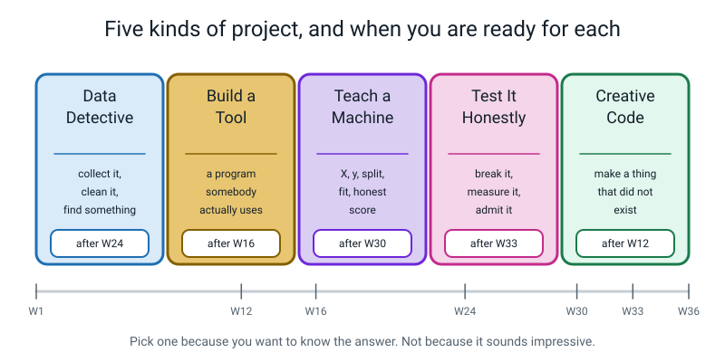
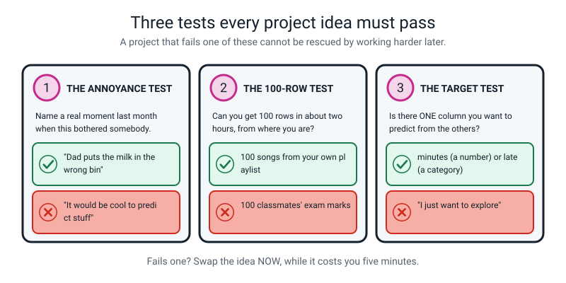

# 🛠️ Fifty Project Ideas — Level 2 Builder

[⬅ Course home](../README.md) · [The worked example ➡](worked-example-project.md) · [The capstone ➡](capstone.md) · [Assessments](../assessments/README.md)

---

> ### In one sentence
>
> **Fifty things you could actually build this year, in Python, on your own machine — pick one, and pick
> it because you genuinely want to know the answer.**

---

## 🪝 How to use this page

This is a **menu**, not a list of homework. Nothing here is compulsory. You will do maybe four or five
of these across the whole year, plus the [capstone](capstone.md) at the end.

The projects are sorted into five kinds:

| | Category | What you do | Earliest week it makes sense |
|---|---|---|---|
| 🕵️ | [**Data Detective**](#️-data-detective) | Collect data by hand, clean it, find something real in it | After **Week 24** |
| 🔧 | [**Build a Tool**](#-build-a-tool) | Write a program that somebody in your house actually uses | After **Week 16** |
| 🤖 | [**Teach a Machine**](#-teach-a-machine) | `X`, `y`, split, fit, and an honest score | After **Week 30** |
| 🔬 | [**Test It Honestly**](#-test-it-honestly) | Break a model on purpose, measure it, and admit what you found | After **Week 33** |
| 🎨 | [**Creative Code**](#-creative-code) | Make something that did not exist before | After **Week 12** |



*Figure P.1 — The five categories, with the earliest week each one makes sense.*

**The difficulty stars mean exactly this:**

| | Meaning |
|---|---|
| ⭐ | One sitting. Under 200 lines. Nothing in it will surprise you |
| ⭐⭐ | Two or three sittings, and **one thing in it will go wrong the first time** |
| ⭐⭐⭐ | Needs a plan on paper before you type. More than one day. Expect a real bug that costs you an hour |

**The "syntax it uses" line is a promise.** Every project on this page can be built with nothing but the
constructs already on the [syntax ladder](../README.md#-the-syntax-ladder) by the week named. If a project
says *best after Week 16*, then nothing in it needs pandas, matplotlib or scikit-learn. You are never
being asked to go and find something on the internet.

---

## ⚠️ Four rules, and they are rules, not preferences

> **1. Never build anything that classifies a person.** Their mood, their age, their gender, how clever
> or trustworthy or attractive they look. You cannot collect a fair sample, the labels are not real
> things, and somebody gets hurt. Objects, sounds, plants, buses, prices, songs, your own habits: yes.
> Judgements about people: no.
>
> **2. Ask before you use somebody else's data, and write down that you asked.** Their receipts, their
> bedtime, their chore times, their marks. One line in your data card: *"I asked Mum on 4 March and she
> said yes to the shopping receipts."*
>
> **3. Nothing medical.** *"Is this mole bad?"* has a wrong answer that hurts somebody, and you cannot
> test it honestly. This includes the "predict my mood from my sleep" idea, which sounds harmless and is
> not.
>
> **4. No names in the file.** If a project needs to tell rows apart, use `student_01`, `friend_03`,
> `shop_B`. Keep the key on paper, at home, and not in the folder. You will lose the ability to go back
> and check one row, and that is the price.

---

## 💡 Before you pick: the three tests



*Figure P.2 — Run any idea through all three before you type a line. A project that fails one of these cannot be rescued by working harder later.*

```
   TEST 1 — THE ANNOYANCE TEST
   Can you name a real moment in the last month when this
   bothered somebody in your house?
        ✅ "We argued about whose turn the bins were, twice."
        ❌ "It would be cool to predict stuff."

   TEST 2 — THE 100-ROW TEST
   Can you honestly get about 100 rows in two hours, from where
   you actually are, without asking for permission you can't get?
        ✅ 120 songs off your own playlist page
        ❌ 100 classmates' exam marks

   TEST 3 — THE TARGET TEST   (only for 🤖 and 🔬 projects)
   Is there ONE column you'd like to predict from the others?
        ✅ minutes (a number)  ·  late / on-time (a category)
        ❌ "I just want to explore"  ← that's a 🕵️ project, and
                                       that is completely fine
```

> **💡 Try this if you are stuck choosing.** Write down the **last three things that annoyed you**, in
> plain English, with a date. Then read this page looking only for those three. It works far better than
> reading all fifty and picking the one that sounds most impressive.

---

# 🕵️ Data Detective

*Ten projects where you collect the data yourself, clean it, and find something real. **Best after Week 24** — you need `groupby`, the cleaning log, and the row count. Add charts once you have Week 26.*

---

### 1. The Bus That Lies

> *The timetable says 8:14. Log a hundred real arrivals and find out what it actually means.*

| | |
|---|---|
| **Difficulty** | ⭐⭐ |
| **Time** | 2 hours of code, spread over 4–5 weeks of logging |
| **Best after** | Week 24 (Week 26 to chart it) |
| **Syntax it uses** | `pd.DataFrame` · `read_csv` / `to_csv` · `isna().sum()` · derived column · `groupby("day")["late_min"].mean()` · `value_counts()` |

**You will learn:** how to design a data-collection sheet before you collect anything, why a derived
column (`late_min = actual − scheduled`) is where all the meaning lives, and how one number per group
hides its group size.

**Steps:**

1. Design the paper sheet **first**: date, day of week, scheduled time, actual time, raining yes/no,
   which bus. Six columns, no more. Print 25 copies.
2. Log every trip for a month. Write the time as `08:17`, always with the leading zero, because
   inconsistent formats are the single biggest cleaning cost you can avoid for free.
3. Type it into a CSV. Then load it with `read_csv`, print `shape` and `isna().sum()`, and start a
   numbered cleaning log for every hole and every impossible value.
4. Build the derived column `late_min`. Print the mean, the min, the max, and — this is the project —
   `value_counts()` of how often it was **early**, because a bus that is early is worse than one that is
   late.
5. `groupby("day")` and `groupby("raining")`, and report **every** average with its row count.

**Done well looks like:** a sentence with three numbers in it — *"Over 41 logged trips the 8:14 arrived a
mean of 4.2 minutes late, but it was **early** 6 times, and all 6 were Mondays (n=8)."* — plus a cleaning
log where every line has a reason. A mean with no row count and no cleaning log is a rumour.

---

### 2. Where Did My Saturday Go?

> *Log every 15-minute block of one weekend, then find out what you actually do with your life.*

| | |
|---|---|
| **Difficulty** | ⭐⭐ |
| **Time** | 90 minutes of code, 2 weekends of logging |
| **Best after** | Week 24 |
| **Syntax it uses** | list of dicts → `pd.DataFrame` · `.str.strip().str.title()` · `value_counts()` · `groupby("category")["minutes"].sum()` |

**You will learn:** that a **controlled vocabulary** is not fussiness — if you write `phone`, `Phone`,
`on phone` and `phone ` you get four categories for one activity, and Week 24's `.str` chain is the
only thing that saves you.

**Steps:**

1. Write your list of allowed categories **first**, on paper, and keep it to eight: `sleep`, `school`,
   `homework`, `screen`, `outside`, `food`, `chores`, `other`.
2. Log two full weekend days in 15-minute blocks. 64 blocks a day, 128 rows. That is your 100.
3. Type it in, then deliberately test your discipline: run `df["category"].value_counts()` and count how
   many categories you actually have. If it is more than eight, you slipped, and the `.str` chain is your
   fix — log it.
4. `groupby("category")["minutes"].sum()`, sorted. Convert to hours and to a percentage of the 24 hours.
5. Write the one paragraph that hurts: which category surprised you, and by how many minutes.

**Done well looks like:** the percentages add to 100 (check it — they usually do not the first time, and
finding the missing 45 minutes is the best part), and one honest sentence about the surprise. *"I thought
screen was about 2 hours. It was 5 hours 15, which is 22% of the weekend."*

---

### 3. The Pocket Money Audit

> *A hundred transactions of your own money, and the honest answer to "where does it all go?"*

| | |
|---|---|
| **Difficulty** | ⭐⭐ |
| **Time** | 2 hours of code, 6+ weeks of logging (start early) |
| **Best after** | Week 24 |
| **Syntax it uses** | `read_csv` · `astype(int)` · `fillna` with a logged reason · derived `running_total` column · `groupby` · `sort_values` |

**You will learn:** why money data is nearly always stored as text and has to be converted at the door,
and what a **running total** column shows that a `groupby` cannot.

**Steps:**

1. One row per transaction: date, what, category (five allowed categories, decided in advance), amount
   in, amount out.
2. Log everything for six weeks, including the 5-rupee ones. **Especially** the 5-rupee ones — they are
   the finding.
3. Load it. `df.info()` will almost certainly show `amount_out` as `object`, because one row has a `₹`
   in it or a comma. Fix it, log it, `astype(int)`.
4. Build a `running_total` column by hand with a `for` loop and an accumulator (Week 7's skill, used for
   real), and print the lowest point it ever reached.
5. `groupby("category")["amount_out"].sum()` **and** `.count()`. Report both. The category with the most
   money and the category with the most transactions are usually not the same one, and that is the
   interesting part.

**Done well looks like:** two rankings side by side — by total spent and by number of transactions — with
one sentence naming the gap between them. *"Snacks was only ₹340 of ₹1,910 but it was 41 of the 96
transactions."*

---

### 4. Same Task, Different Person

> *Give four people the same instruction and measure how differently they do it.*

| | |
|---|---|
| **Difficulty** | ⭐⭐ |
| **Time** | 2 hours over two afternoons |
| **Best after** | Week 24 |
| **Syntax it uses** | `pd.DataFrame` · `groupby("person")` with `.mean()`, `.min()`, `.max()`, `.count()` · derived `spread` column |

**You will learn:** that a **measuring instruction** is part of your data, and that two people following
"a handful of rice" produce numbers 40% apart — which is why every dataset needs a written definition of
every column.

**Steps:**

1. Pick something measurable and harmless: how long to tie a shoelace, how many steps to walk a fixed
   route, grams in "a handful", seconds to write the alphabet.
2. Write the instruction on a card, word for word. This card goes in your data card at the end.
3. Get four people to do it **ten times each** — 40 rows. Log person (as `person_A`…`person_D`, rule 4),
   attempt number, and the measurement.
4. `groupby("person")` for mean, min, max and count. Build a `spread` column = max − min per person.
5. Now the finding: is the **variation between people** bigger or smaller than the **variation within one
   person across ten tries**? Compute both. Say which, with numbers.

**Done well looks like:** the between-vs-within comparison done as arithmetic, not as an opinion, plus
the instruction card reproduced in full. This is the smallest project on the page that teaches a genuinely
hard idea.

---

### 5. The Homework Clock

> *How long you THINK homework will take, versus how long it actually takes. Fifty pairs.*

| | |
|---|---|
| **Difficulty** | ⭐⭐ |
| **Time** | 90 minutes of code, 5–6 weeks of logging |
| **Best after** | Week 24 (Week 26 for the scatter) |
| **Syntax it uses** | `pd.DataFrame` · derived `error_min` and `ratio` columns · `groupby("subject")` · `ax.scatter` · `df["a"].corr(df["b"])` |

**You will learn:** the difference between an **error** (`actual − guess`) and a **ratio**
(`actual ÷ guess`), and why the ratio is the honest one when the jobs are different sizes.

**Steps:**

1. Every time homework is set, write down your **guess in minutes before you start**. Then time it. Two
   numbers per row, plus subject and date.
2. Fifty rows takes about five weeks. Do not go back and edit a guess. Ever. That is the whole project.
3. Build both columns: `error_min = actual − guess`, and `ratio = actual / guess`.
4. Mean error, mean ratio, and `groupby("subject")` on both — with counts.
5. Scatter `guess` against `actual`, and draw the line where they would be equal by plotting `guess`
   against `guess` as a second series with a legend. Every dot above that line is an underestimate.

**Done well looks like:** the scatter with the equal-line on it, and a sentence with a ratio in it.
*"Across 52 tasks I underestimated 44 of them, and my median ratio was 1.6 — so I should multiply every
guess by about 1.5."* A project that changes what you do next week is a good project.

---

### 6. Playlist Autopsy

> *A hundred and twenty songs from your own library, and what they say about your taste.*

| | |
|---|---|
| **Difficulty** | ⭐⭐ |
| **Time** | 2.5 hours (typing 120 rows is most of it) |
| **Best after** | Week 24 (Week 26 for the histogram) |
| **Syntax it uses** | `pd.DataFrame` · `describe()` · `value_counts()` · `ax.hist(bins=...)` · `groupby("decade")` · `drop_duplicates()` |

**You will learn:** what a **histogram** shows that an average destroys, and why `describe()` is the
first thing you run on any numeric column.

**Steps:**

1. Six columns, typed by hand from your own library page: title, artist, year, length in seconds, times
   played, genre (from a list of six you decide in advance).
2. 120 rows. Yes, by hand. It takes 45 minutes and it is the reason you will know this dataset better
   than any dataset you download.
3. `drop_duplicates()` first — you will have typed at least one song twice. Print the shape before and
   after and say which row went.
4. `describe()` on `length_sec` and `times_played`. Then a histogram of each, with 8 bins. Look at the
   shape and describe it in words before you compute anything else.
5. Derive a `decade` column from `year` using `//` (Week 3, used for real: `year // 10 * 10`), then
   `groupby("decade")` for count and mean plays.

**Done well looks like:** the histogram of `times_played` and a sentence about its **shape**, not its
average. Play counts are almost always lopsided — a handful of songs played 200 times and a long tail
played twice — and the mean sits in a gap where no song actually lives. Saying that out loud is the
finding.

---

### 7. The Great Snack Price Survey

> *One basket of five items, priced in five shops. Where does your money go furthest, and by how much?*

| | |
|---|---|
| **Difficulty** | ⭐⭐ |
| **Time** | 2 hours of code, one afternoon of walking |
| **Best after** | Week 24 (Week 26 for the grouped bars) |
| **Syntax it uses** | `pd.DataFrame` · `.str.strip().str.title()` · `groupby("shop")["price"].sum()` · `sort_values` · `ax.bar` |

**You will learn:** that a **basket total** is a fair comparison and a single item price is not, and that
tidying shop names is the difference between five shops and nine.

**Steps:**

1. Choose five items you can find everywhere and describe them exactly — *"500 ml plain water"*, not
   *"water"*. The exactness is the project.
2. Visit five shops. 25 rows. Write shop, item, price, and **date** (prices drift).
3. Type it in, and deliberately type the shop names sloppily, the way you would in a hurry. Then fix them
   with `.str.strip().str.title()` and prove with `value_counts()` that you now have exactly five.
4. `groupby("shop")["price"].sum()` for the basket totals, sorted. Then `groupby("item")` for the
   biggest price spread per item — `max()` minus `min()`.
5. Bar chart of basket totals with all three labels and a title stating the finding.

**Done well looks like:** the cheapest and dearest basket named with the **gap in rupees and as a
percentage** (`(dear − cheap) / cheap`), plus the one item whose price varies most. And an honest sentence
about what 25 rows cannot tell you: this is one date, one basket, and one afternoon.

---

### 8. The Bedtime and the Morning After

> *A hundred nights of your own sleep, and whether it shows up anywhere you can measure.*

| | |
|---|---|
| **Difficulty** | ⭐⭐⭐ |
| **Time** | 2.5 hours of code, 14 weeks of logging — **start this in Week 14** |
| **Best after** | Week 24 (Week 27 for the correlation) |
| **Syntax it uses** | `read_csv` · `fillna` with a logged reason · derived `hours_slept` from two times · `groupby` · `ax.scatter` · `corr` |

**You will learn:** how slowly real data arrives, why gaps in a self-logged dataset are themselves a
finding, and that a correlation is not a cause even when you desperately want it to be.

**Steps:**

1. Four columns you can honestly get every day: date, lights-off time, wake time, and **one measurable
   morning number** — steps before 9am, minutes late to breakfast, number of times you hit snooze.
   **Not "mood on a scale of 1 to 5"**, because you cannot measure that reliably and rule 3 applies.
2. Log every night. You will miss nights. Do not backfill from memory — leave the hole. The holes are
   data.
3. Compute `hours_slept` from the two times. This is fiddlier than it looks because of midnight, and
   getting it right is a real piece of work. Hand-check three rows.
4. `isna().sum()`, then decide what to do with the gaps and **write the reason down**. Report how many
   nights you actually logged out of how many nights there were.
5. Scatter `hours_slept` against your morning number, compute `corr`, and then write the paragraph about
   the four things that could explain it other than sleep.

**Done well looks like:** a completion rate stated honestly (*"87 of 98 nights, 89%"*), a midnight
calculation you hand-checked, and a paragraph that refuses to claim a cause. The refusal is the mark of
a good project, not a weak one.

---

### 9. The Scorebook Rescue

> *A real cricket or football scorebook, with real gaps, turned into a clean table you can trust.*

| | |
|---|---|
| **Difficulty** | ⭐⭐⭐ |
| **Time** | 3 hours |
| **Best after** | Week 24 |
| **Syntax it uses** | `read_csv` · `isna().sum()` · `fillna` · `astype(int)` · `drop_duplicates()` · `.str` tidying · `groupby` with `count()` |

**You will learn:** the single most useful professional skill in this level — taking somebody else's
messy paper record and producing a table plus a written log that a stranger could re-derive.

**Steps:**

1. Find a real scorebook: a club's, a school team's, your own. Ask, and write down that you asked. 100+
   innings or matches.
2. Type it **exactly as written**, including the mess. Blank cells stay blank. `dnb` stays `dnb`. Do not
   tidy while typing — that is the trap, because then you have no record of what you changed.
3. Save that file as `raw.csv` and **never touch it again.** Every later step writes a new file.
4. Now clean, one repair at a time, numbering each in the log: name spellings, blanks that mean zero
   versus blanks that mean *did not bat*, impossible values, duplicate rows.
5. Produce the table nobody had before: `groupby("player")` for innings count, total runs, mean and best
   — **with the count next to every mean**, and a note on who was excluded for having fewer than five
   innings.

**Done well looks like:** two files (`raw.csv` untouched, `clean.csv` derived) and a numbered log where
line 4 says *"blank in `runs` for rows 12, 31, 58: cross-checked against `how_out` — all three read
`dnb`, so these are NOT zeros and were dropped from batting averages, not filled."* That single line is
worth more than the whole rest of the project.

---

### 10. Which Bin? The Household Waste Census

> *A hundred items from your own bins, sorted, counted, and one uncomfortable finding.*

| | |
|---|---|
| **Difficulty** | ⭐⭐ |
| **Time** | 2 hours of code, one week of logging |
| **Best after** | Week 24 (Week 26 for the bars) |
| **Syntax it uses** | `pd.DataFrame` · controlled vocabulary via `.str` · `value_counts()` · `groupby("bin")` · `ax.bar` · a hand-built confusion tally |

**You will learn:** how to build a **category** column that survives contact with reality, and how to
count disagreements between two people as a table.

**Steps:**

1. Decide your bins in advance — `recycling`, `compost`, `landfill` — and write a one-line rule for each.
2. For one week, log every item: what it was, which bin **you** would put it in, and which bin it
   **actually went in**. 100 items happens fast.
3. Tidy the item names into categories (`plastic bottle`, `paper`, `food`, …) and prove with
   `value_counts()` that you have a small fixed set.
4. Count the disagreements as a 3×3 tally: rows are where it went, columns are where you say it should
   have gone. This is a confusion matrix, built by hand, four weeks before Week 30 teaches you the name.
5. Name the **one** item type that gets it wrong most, and write the one-sentence rule that would fix it.

**Done well looks like:** a 3×3 tally with row and column totals, the disagreement rate as a fraction and
a percentage with the division shown, and a rule specific enough to put on a label. *"14 of 103 items
went to the wrong bin, 13.6%. Nine of the 14 were soft plastic. Rule: if it scrunches and stays
scrunched, landfill."*

---

# 🔧 Build a Tool

*Ten programs somebody in your house will actually use. **Best after Week 16** — you need functions, lists, dicts and the CSV round trip. Nothing here needs pandas.*

---

### 11. The Split-the-Bill Machine

> *Six people, one restaurant bill, and nobody arguing about who had the extra naan.*

| | |
|---|---|
| **Difficulty** | ⭐ |
| **Time** | 90 minutes |
| **Best after** | Week 16 |
| **Syntax it uses** | `def` with parameters and a default · `input()` in a `while` loop · list of dicts · `f"{x:.2f}"` · `sum()` |

**You will learn:** that money formatting is a real requirement, not a nicety, and that a tool for other
people has to survive being used wrongly.

**Steps:**

1. Write `add_item()` as a function that asks for a dish, a price and who shared it, and returns a dict.
2. Loop with `while` until the user types `done`. Store the dicts in a list.
3. Write `total_for(person, items)` — a function with two parameters that returns one number.
4. Add a `service_percent=10` **default parameter** so the caller can override it, and apply it per
   person, not to the total, because those are different numbers when people share unevenly.
5. Print a per-person receipt with `:.2f`, and **assert to yourself** that the per-person totals add up to
   the bill by printing both and comparing.

**Done well looks like:** the totals reconcile to the paisa, and typing `banana` where a price was
expected does not crash it. Show it to whoever pays for dinner. If they use it twice, you have built a
tool.

---

### 12. The Homework Timer With a Memory

> *Times your homework, and keeps every session in a CSV so you can prove what you did.*

| | |
|---|---|
| **Difficulty** | ⭐⭐ |
| **Time** | 2 hours |
| **Best after** | Week 16 |
| **Syntax it uses** | `input()` · `while` · `def` · `import csv` · `with open(..., "a")` · `csv.DictWriter` · `csv.DictReader` |

**You will learn:** the difference between opening a file to **write** (which destroys it) and to
**append** (which does not) — a distinction that costs everybody one dataset, once.

**Steps:**

1. Ask for subject and estimated minutes. Then wait for the user to press Enter twice, at start and at
   finish, and ask them to read the clock. (No `datetime` in this level — the human is the clock, and
   that is fine.)
2. Append one row to `sessions.csv` with `DictWriter`. Write the header **only if the file is new**,
   which means checking whether it exists — think about how, and expect this to be the hard part.
3. Read the whole file back with `DictReader` and print a summary: total sessions, total minutes, mean
   minutes. Remember everything comes back as **text**.
4. Add a `report()` function that groups by subject using a dictionary of running totals — Week 15's
   `group_count` pattern, applied to your own data.
5. Add the honest column: `estimate` next to `actual`, and print the mean ratio.

**Done well looks like:** running it four times produces four rows and one header, not four headers. And
after two weeks of real use, `report()` tells you something you did not know.

---

### 13. The Flashcard Grinder

> *Asks you the ones you keep getting wrong, more often than the ones you know.*

| | |
|---|---|
| **Difficulty** | ⭐⭐ |
| **Time** | 2.5 hours |
| **Best after** | Week 16 |
| **Syntax it uses** | list of dicts · `d.get(k, 0)` · `random.randint` · `while` with `break` · `sorted(rows, key=...)` · CSV round trip |

**You will learn:** how to store **state between runs** — the whole reason a CSV exists — and how to sort
a list of records by a field with a named key function.

**Steps:**

1. Type 25 cards as a list of dicts: `question`, `answer`, `asked`, `right`.
2. The asking loop: pick a card, ask, compare (lowercase and strip both sides), update `asked` and
   `right`, and let `q` quit with `break`.
3. Save the counts back to CSV at the end. Load them at the start. Now the program remembers you.
4. Weight the picking: build a list where each card appears `1 + (asked − right)` times, and pick from
   that. A card you have missed three times appears four times.
5. Print a leaderboard sorted by accuracy, using a named key function, with the "never asked" cards
   listed separately rather than shown as 0%.

**Done well looks like:** on the third run, the cards you have been getting wrong come up noticeably more
often, and you can point at the line of code that makes that happen. Handling "never asked" separately
instead of as 0% is the detail that separates a tool from a demo.

---

### 14. Pocket Money Forecaster

> *Given what you get and what you spend, when will you actually have enough for the thing?*

| | |
|---|---|
| **Difficulty** | ⭐ |
| **Time** | 75 minutes |
| **Best after** | Week 16 |
| **Syntax it uses** | `def` with defaults · `while` with an accumulator · `f"{x:.2f}"` · `//` and `%` · list building |

**You will learn:** that a `while` loop is the right shape for "keep going until a condition is met, and
tell me how many times it took" — which no `for` loop can do.

**Steps:**

1. Ask for: the target price, what you have now, weekly income, and typical weekly spend.
2. `weeks_needed()` — a function that loops week by week, accumulating, and **returns** the number of
   weeks. Guard against the case where spend ≥ income, which never terminates. That guard is the project.
3. Print the week-by-week table, and use `//` and `%` to say the answer as "3 months and 2 weeks".
4. Add a `saving_rate` default parameter — what fraction of income you commit — and print three scenarios
   side by side.
5. Add the sentence nobody wants: what you would have to cut, in rupees per week, to halve the wait.

**Done well looks like:** entering a spend bigger than your income prints an honest message instead of
hanging forever. Every infinite loop in the world is this bug, and catching it once teaches it for good.

---

### 15. The Fair Chore Roulette

> *Assigns chores at random, and keeps a record so nobody gets the bins twice in a row.*

| | |
|---|---|
| **Difficulty** | ⭐⭐ |
| **Time** | 2 hours |
| **Best after** | Week 16 |
| **Syntax it uses** | lists · dicts of counts · `random.randint` · `while` with `continue` · `max(d, key=d.get)` · CSV round trip |

**You will learn:** why "random" and "fair" are different words, and how to measure fairness in your own
program instead of assuming it.

**Steps:**

1. Two lists: people, chores. One dict of dicts recording how many times each person has had each chore.
2. Assign at random. Then add the rule: if this person had this chore last week, `continue` and draw
   again. Cap the retries so it cannot loop forever.
3. Save the history to CSV so next week's run knows about this week.
4. **Audit your own program.** Run the assignment 500 times in a loop and count. Print the counts per
   person per chore. Is it flat? It will not be, and finding out why is the whole project.
5. Use `max(counts, key=counts.get)` to name who has had the worst chore most, and print it every week.
   A program that reports on its own unfairness is doing something most software does not.

**Done well looks like:** the 500-run audit table printed, with a sentence explaining the lumps. The
"never the same twice in a row" rule *makes* the distribution uneven, and noticing that is a genuinely
sophisticated observation.

---

### 16. The Grade Converter Nobody Can Argue With

> *Marks in, letter out, every boundary tested, every edge case written down.*

| | |
|---|---|
| **Difficulty** | ⭐ |
| **Time** | 75 minutes |
| **Best after** | Week 16 (buildable after Week 12) |
| **Syntax it uses** | `def` returning a value · `if`/`elif`/`else` in the right order · `int(input())` · a list of test cases · `for` over the list |

**You will learn:** **boundary testing** — that the interesting inputs are always 49, 50 and 51, never 73
— and how to write your own test list so the program proves itself.

**Steps:**

1. Get the real boundaries from a real place: your school's, or an exam board's. Write them on paper.
2. `grade_for(mark)` — a function returning a string. Get the chain order right, then get the `>=` versus
   `>` right, which is a separate decision.
3. Write a list of test pairs — `[(0, "F"), (49, "F"), (50, "E"), (51, "E"), ...]` — hitting **every
   boundary from both sides**.
4. Loop over the tests, compare, and print `PASS` or `FAIL` per row with a final tally. Your program now
   checks itself.
5. Handle the two nasty inputs: a mark of 101, and a mark of −3. Decide what each should do and write the
   reason in a comment.

**Done well looks like:** every one of your boundary tests passes, and the test list has both sides of
every boundary in it. Then hand it to somebody and ask them to break it. When they do — and they will,
with `50.5` — add that case and its test.

---

### 17. The Packing List That Asks Questions

> *Answers six questions about your trip and prints the list you would have forgotten.*

| | |
|---|---|
| **Difficulty** | ⭐⭐ |
| **Time** | 2 hours |
| **Best after** | Week 16 |
| **Syntax it uses** | dicts mapping condition → list · `input()` · `if`/`and`/`or` · list comprehension with a filter · `sorted()` · `with open(..., "w")` |

**You will learn:** how to keep your **rules separate from your code** — the difference between fifty
`if` statements and one dictionary you can edit without touching the logic.

**Steps:**

1. Build the rules as a dict: `{"cold": ["coat", "gloves"], "swimming": ["towel", "goggles"], ...}` —
   twelve conditions, each with a list.
2. Ask the six questions. Collect the `True` conditions into a list.
3. Build the packing list with a comprehension over the rules dict, keeping only the conditions that
   fired.
4. Add the always-items, then remove duplicates and sort. Print it numbered with `enumerate`.
5. Write it out to `packing.txt` with `with open`, one item per line with a `[ ]` tick box, so it can be
   printed and used.

**Done well looks like:** adding a thirteenth condition means editing **one dictionary entry** and
nothing else. If it means writing another `if`, go back to step 1 — that is the lesson.

---

### 18. Recipe Scaler for 3 People or 30

> *Type a recipe once. Get it for any number of people, in sensible units, without a calculator.*

| | |
|---|---|
| **Difficulty** | ⭐⭐ |
| **Time** | 2 hours |
| **Best after** | Week 16 |
| **Syntax it uses** | list of dicts · `def` with parameters · `round(x, 2)` and `f"{x:.1f}"` · `//` and `%` for unit conversion · CSV round trip |

**You will learn:** the difference between `round()` (which changes the number) and `:.1f` (which changes
what the reader sees), and why a recipe needs the first one — because 2.7 eggs is not a thing.

**Steps:**

1. Type one real recipe as a list of dicts: `item`, `quantity`, `unit`, `serves`.
2. `scale(items, people)` — returns a new list with quantities multiplied by `people / serves`.
3. Handle units properly: 1,400 g should print as "1.4 kg", 90 minutes as "1 h 30 min". `//` and `%` do
   both.
4. Handle countable things: eggs, chillies, slices. These must round **up** to whole numbers, and doing
   that with `//` and a condition (no `math.ceil` in this level) is a neat little puzzle.
5. Save the scaled version to CSV, and print it as an aligned table.

**Done well looks like:** scaling for 30 people gives a printable list where nothing says `2.66 eggs` and
nothing says `1400 g`. Cook something with it. That is the test.

---

### 19. The Reading Streak Tracker

> *Logs what you read, works out your streak, and refuses to lie to you about it.*

| | |
|---|---|
| **Difficulty** | ⭐⭐ |
| **Time** | 2 hours |
| **Best after** | Week 16 |
| **Syntax it uses** | CSV round trip · `sorted(rows, key=...)` · `for` with `enumerate` · `while`/`break` · dict of counts · `sum()` |

**You will learn:** that a **streak** is a genuinely interesting algorithm — walk the sorted rows, count
consecutive days, reset on a gap — and that you cannot compute it without deciding what "consecutive"
means.

**Steps:**

1. One row per session: date, book, pages, minutes. Append to CSV.
2. Load, sort by date, then walk the list with a counter that resets when two dates are not consecutive.
   You will need a rule for "consecutive" — decide it and write it in a comment.
3. Print current streak, longest streak, and the date the longest one broke.
4. `groupby`-by-hand with a dict: total pages and minutes per book, plus pages per minute.
5. The honest feature: print **days logged out of days elapsed** as a fraction. A 12-day streak inside a
   90-day period is a different claim from a 12-day streak in 14 days.

**Done well looks like:** the streak survives a gap correctly (test it by putting a fake gap in the CSV),
and the completion fraction is printed next to it whether you like the number or not.

---

### 20. Release Your Own `stats` Library

> *Take the toolbox you wrote in Week 12 and turn it into something a stranger could use.*

| | |
|---|---|
| **Difficulty** | ⭐⭐⭐ |
| **Time** | 3 hours |
| **Best after** | Week 16 |
| **Syntax it uses** | `def` with defaults and keyword args · `return` · `import` your own module · a test file with `for` over test cases · `with open` for the README |

**You will learn:** what makes code *usable by someone else* — a name that says what it does, a
docstring, sensible behaviour on an empty list, and a test file that proves it.

**Steps:**

1. Start from your Week 12 `stats.py` and add four more: `mode`, `range_of`, `percent_of`, `normalize`.
   Ten functions total.
2. Decide, for each one, what happens on an **empty list**. Crash? Return `None`? There is no right
   answer, but there is a right *process*: choose, document it, and be consistent across all ten.
3. Write `test_stats.py`: for every function, a list of `(input, expected)` pairs including the nasty ones
   — one item, all identical, negative numbers, an even-length list for `median`.
4. Run the tests. Fix what fails. Then **add a test for the bug you just fixed**, which is what
   professionals actually do.
5. Write `README.md` by hand: what it is, how to import it, one worked example per function with its real
   output pasted in.

**Done well looks like:** somebody else can `from stats import median`, use it correctly from your README
alone, and not be surprised by anything. And `test_stats.py` prints `28 passed, 0 failed`. Keep this
file. You will use it in the capstone.

---

# 🤖 Teach a Machine

*Ten projects with `X`, `y`, a split and an honest score. **Best after Week 30.** Every one of these has to report the score on rows the model never saw, and say so.*

---

### 21. Hype or Chill? The Playlist Classifier

> *Teach a model to tell your workout songs from your homework songs, using numbers only.*

| | |
|---|---|
| **Difficulty** | ⭐⭐ |
| **Time** | 3 hours |
| **Best after** | Week 30 |
| **Syntax it uses** | `pd.DataFrame` · `X = df[["a","b","c"]]` · `train_test_split(stratify=y)` · `KNeighborsClassifier` · `StandardScaler` fitted on train only · `accuracy_score` · `confusion_matrix` |

**You will learn:** why **scaling matters** the moment one feature is in the hundreds (bpm) and another is
in single digits (energy 1–5), and how to prove it by running the same model twice.

**Steps:**

1. 100 songs, six columns typed by hand: bpm, length in seconds, your energy rating 1–5, how loud it
   feels 1–5, year, and the label `hype` or `chill`. **You** label them, before you build anything.
2. `X` and `y`, both shapes printed. Split 80/20 with `stratify=y` and a fixed `random_state`, and print
   the class counts in both halves.
3. Fit kNN unscaled. Report **both** scores. Then scale — fitting the scaler on `X_train` only — and run
   it again. Put the four numbers in a table.
4. Sweep `k` from 1 to 25, plot accuracy against `k`, and choose one **with a written reason**.
5. Print the confusion matrix with the class names, and go and look at the songs it got wrong. Play them.
   They are usually genuinely borderline, and that is the most interesting paragraph in your write-up.

**Done well looks like:** the scaled/unscaled table showing a real difference, a chosen `k` with a reason,
and a paragraph about three specific songs it got wrong and why you now think your own labels were shaky
on two of them.

---

### 22. Will the Bus Be Late?

> *Your logged bus data from project 1, turned into a prediction — and an honest baseline.*

| | |
|---|---|
| **Difficulty** | ⭐⭐ |
| **Time** | 2.5 hours (if you already have the data) |
| **Best after** | Week 30 |
| **Syntax it uses** | `read_csv` · derived binary label · `train_test_split(stratify=y)` · `KNeighborsClassifier` · `DecisionTreeClassifier` · `accuracy_score` · `confusion_matrix` · `value_counts()` |

**You will learn:** the **majority-class baseline** — the single most important number in any
classification project, and the one almost everybody forgets.

**Steps:**

1. Derive `late` from `late_min` with a threshold you choose and justify. Write down who chose it: you.
2. **Before any model**, run `df["late"].value_counts()` and compute the baseline: what accuracy do you
   get by always guessing the commoner answer? Write that number down. It is what you have to beat.
3. `X` from the honest features only — day of week, raining, which bus, scheduled hour. **Not** the actual
   arrival time. That is the answer.
4. Fit kNN and a depth-3 tree on one fixed split. Both scores each. Results table.
5. Compare every model against the baseline. If nothing beats it, **say so**, in the title of your
   write-up.

**Done well looks like:** the baseline stated first, in bold, before any model. *"68% of my 41 trips were
late, so always guessing 'late' scores 68%. My best model scored 71% on 9 held-back trips — which is two
trips, and nine is far too few to tell those apart."* That paragraph is worth more than a model that
scores 90%.

---

### 23. How Long Will This Journey Take?

> *A number, not a category. Predict minutes, and report the error in minutes.*

| | |
|---|---|
| **Difficulty** | ⭐⭐ |
| **Time** | 3 hours |
| **Best after** | Week 32 |
| **Syntax it uses** | `pd.DataFrame` · `LinearRegression` · `coef_` / `intercept_` · `mean_absolute_error` · `r2_score` · `ax.scatter` |

**You will learn:** how to say a slope out loud in real units, and why **MAE in minutes** is the only
metric anybody outside the room cares about.

**Steps:**

1. 100 journeys, logged by you or your family: distance, mode (walk/bus/car/cycle as separate numbers or
   separate models), raining, departure hour, and minutes taken.
2. Split, fit a line, and print the slope **with both units**: *"+2.8 minutes per extra kilometre."*
3. MAE on the held-back rows, in minutes. Then say the sentence: *"my model's guess is usually about 4
   minutes out."*
4. Scatter predicted against actual, with the equal-line drawn, labelled, and a legend.
5. Find your worst prediction and go and remember that journey. There is almost always a reason, and the
   reason is a column you did not collect.

**Done well looks like:** the MAE named in minutes, the slope named in minutes-per-kilometre, and a
paragraph about the worst miss that names the missing column. *"The 22-minute miss was the day of the
market. I have no `market_day` column, and I should have."*

---

### 24. Guess the Subject From the Marks

> *Given a row of marks, which subject was it? A three-class problem with a readable answer.*

| | |
|---|---|
| **Difficulty** | ⭐⭐ |
| **Time** | 2.5 hours |
| **Best after** | Week 31 |
| **Syntax it uses** | `pd.DataFrame` · `DecisionTreeClassifier(max_depth=3)` · `export_text` · `feature_importances_` · `confusion_matrix` · `accuracy_score` |

**You will learn:** what `feature_importances_` is for — finding out that three of the five things you
carefully collected were never used at all.

**Steps:**

1. 100+ rows of your **own** past marks (rule 4: your marks, nobody else's): mark out of 100, minutes
   spent revising, whether it was a test or homework, position in the term, and the subject as the label.
2. Split, fit a depth-3 tree, report both scores.
3. `export_text` and write the rules out as English sentences. Read them to somebody.
4. `feature_importances_` — name the columns it ignored completely, and say what that means about your
   data rather than about the tree.
5. Try depth 1, 3 and 6 on the same split. Put the three train/test pairs in a table and pick one.

**Done well looks like:** the tree's rules written as English, an honest note about which features were
ignored, and a depth chosen from the table rather than from hope. And the sentence a lot of students skip:
*"three classes with 34, 31 and 38 rows, so the baseline is 38%."*

---

### 25. The Coin Sorter

> *Diameter and weight in, coin value out. The cleanest dataset you will ever collect.*

| | |
|---|---|
| **Difficulty** | ⭐ |
| **Time** | 2 hours, plus a kitchen scale |
| **Best after** | Week 30 |
| **Syntax it uses** | `np.array` or `pd.DataFrame` · `train_test_split` · `KNeighborsClassifier` · `accuracy_score` · `confusion_matrix` · `ax.scatter` |

**You will learn:** what a genuinely **separable** problem looks like — and what it feels like when a
model gets 100% and that is honestly fine.

**Steps:**

1. Measure 100 real coins with a ruler and a kitchen scale: diameter in mm, weight in g, thickness if
   your ruler is good enough. Value is the label. Five or six classes.
2. Scatter diameter against weight, coloured by value, before you model anything. You will see the
   answer with your eyes, and that is the point.
3. Split, fit kNN, report both scores. It will be very high. Do not be suspicious for the wrong reason —
   check the *split* was honest and then accept it.
4. Now break it: keep **only** weight, refit, and watch which coins start colliding. Print the confusion
   matrix and name the pair.
5. Test it on five coins you did not measure at all. Type their measurements in and see.

**Done well looks like:** the scatter that shows the answer visually, a near-perfect score you can defend,
and the one-column version that fails — with the confusion matrix naming exactly which two coins are
indistinguishable by weight alone.

---

### 26. Ripe or Not?

> *Bananas, tomatoes or avocados. Three numbers you can measure, and one label only you can give.*

| | |
|---|---|
| **Difficulty** | ⭐⭐ |
| **Time** | 3 hours over a week |
| **Best after** | Week 30 |
| **Syntax it uses** | `pd.DataFrame` · `train_test_split(stratify=y)` · `KNeighborsClassifier` · `DecisionTreeClassifier` · `export_text` · `confusion_matrix` |

**You will learn:** that **labelling is the hard part** — you have to decide what "ripe" means before you
look at a single fruit, and write it down, or your labels drift over the week and your model learns your
drift.

**Steps:**

1. Write the labelling rule on a card **first**. *"Ripe = I would eat it today. Not ripe = I would wait."*
   Sign and date it. This card is the most important object in the project.
2. Collect: days since bought, softness on a 1–5 scale you define, colour score 1–5 you define, weight in
   g. 60–80 fruit over a week or two, from whatever the house buys.
3. Split with `stratify=y` and report the class counts.
4. Fit kNN and a depth-2 tree. The tree's rules will be readable — write them out. *"If softness is above
   3 and days since bought is above 4, ripe."*
5. Re-label ten fruit **without looking at your original labels** and count how often you disagree with
   yourself. That number is a ceiling on how good any model can be.

**Done well looks like:** the self-disagreement rate measured and reported next to the model's accuracy.
If you disagree with yourself 15% of the time, a model scoring 85% is at the ceiling and there is nothing
left to fix in the code — the fix is a better labelling rule. Very few people ever measure this. Do it.

---

### 27. Which House Wins Sports Day?

> *Last year's results, this year's teams, and a model that is honest about how little it knows.*

| | |
|---|---|
| **Difficulty** | ⭐⭐ |
| **Time** | 2.5 hours |
| **Best after** | Week 31 |
| **Syntax it uses** | `read_csv` · `groupby` for derived features · `train_test_split` · `DecisionTreeClassifier` · `accuracy_score` · `value_counts()` for the baseline |

**You will learn:** why **small data** is the real limit in most school projects, and how to say that in a
way that is honest rather than defeated.

**Steps:**

1. Get real event results — a school's, a club's — with permission recorded. One row per event: event
   type, number of entrants per house, and which house won.
2. Derive features with `groupby`: each house's win rate in that event type so far, and its total entrants.
   Be careful — a feature computed from the whole dataset **leaks the future** into your training rows.
   Think hard about this step; it is the project.
3. Baseline first: `value_counts()` on the winner column. If Blue won 45% of everything, that is your
   number to beat.
4. Split, fit a shallow tree, report both scores, and print the rules.
5. Write the paragraph about `n`. With 60 events and four houses you have about 15 examples per class,
   and a 20% test set is **12 events**. One event is 8 percentage points.

**Done well looks like:** the leakage question addressed explicitly — either avoided or admitted — and a
sentence quantifying how little a 12-row test set can tell you. A project that concludes *"I cannot
answer this with 60 events"* and proves it arithmetically has succeeded.

---

### 28. The Homework-Time Predictor

> *Turn project 5's data into something that actually tells you when to start.*

| | |
|---|---|
| **Difficulty** | ⭐⭐ |
| **Time** | 2.5 hours |
| **Best after** | Week 32 |
| **Syntax it uses** | `read_csv` · `LinearRegression` · `DecisionTreeRegressor` · `mean_absolute_error` · `r2_score` · `coef_` |

**You will learn:** how to compare a **line** and a **tree** on one fixed split, and how to decide which
to use when the numbers are close.

**Steps:**

1. Use your 50+ rows from The Homework Clock. `X` from subject (as numbers), pages or questions set, your
   own guess, and day of week. `y` is actual minutes.
2. One split, fixed seed, used for everything from here on.
3. Fit `LinearRegression`. Report MAE in minutes, R², and the slope on your own guess — *"for every
   minute I guess, it actually takes 1.4."*
4. Fit `DecisionTreeRegressor(max_depth=3)` on the **same** split. Same two metrics.
5. Results table with the metric named and the row count. Then choose, and defend the choice — including
   the possibility that you pick the *worse-scoring* one because you can read its rules.

**Done well looks like:** a results table where every number says which rows it came from, and a choice
defended in two sentences. If the line is better by 0.3 minutes on 13 test rows, the honest conclusion is
"these are the same" and you should pick on other grounds.

---

### 29. The Watering Oracle

> *Does this plant need water? Three numbers, one label, and a real object on a windowsill.*

| | |
|---|---|
| **Difficulty** | ⭐⭐ |
| **Time** | 2 hours of code, 3 weeks of logging |
| **Best after** | Week 30 |
| **Syntax it uses** | `pd.DataFrame` · `train_test_split(stratify=y)` · `KNeighborsClassifier` · `DecisionTreeClassifier(max_depth=2)` · `export_text` · `confusion_matrix` |

**You will learn:** that a model whose mistakes are **not equally bad** needs its confusion matrix read
carefully — overwatering kills a plant faster than underwatering, and accuracy does not know that.

**Steps:**

1. Every day, for three plants: days since last watered, pot weight in g (a kitchen scale on the pot),
   soil feel 1–5, and the label — did you water it? 60–80 rows.
2. Split, fit, report both scores.
3. Depth-2 tree, rules written out. They will be something like *"if days since watered is above 4 and
   soil feel is below 2, water it."* Test that rule with your own hands.
4. Read the confusion matrix by **cost**, not by count: how many times did it say water when it should
   not have (bad) versus not water when it should have (recoverable)?
5. Write the warning label. *"DO NOT USE THIS FOR: any plant other than the three it learned on. It has
   never seen a cactus."*

**Done well looks like:** the two kinds of mistake counted separately and named, and a written label
saying what the model must not be used for. The plants are still alive.

---

### 30. Spot the Rerun

> *Given an episode's numbers, is it from the first season or the last? A surprisingly hard easy problem.*

| | |
|---|---|
| **Difficulty** | ⭐⭐ |
| **Time** | 2.5 hours |
| **Best after** | Week 31 |
| **Syntax it uses** | `pd.DataFrame` · `X = df[[...]]` · `train_test_split` · `DecisionTreeClassifier` · `feature_importances_` · `accuracy_score` · `ax.hist` |

**You will learn:** how to find out whether your features contain the answer **at all**, using histograms
before you model — the cheapest hour you will ever spend.

**Steps:**

1. 100 episodes of one show, typed from its episode list: runtime in seconds, number of named characters
   in the title, title length in characters, episode number within season, season as the label (or
   `early`/`late` as two classes).
2. **Before modelling**, histogram each feature separately for the two classes. If the two histograms sit
   on top of each other, that feature has nothing in it, and you now know before wasting an hour.
3. Baseline from `value_counts()`.
4. Split, fit a depth-3 tree, both scores, and `feature_importances_`.
5. Write the honest conclusion. Often it is: *"runtime carries almost all the signal because the show got
   30 seconds shorter after season 3, and that is a fact about the broadcaster, not about the show."*

**Done well looks like:** the pre-modelling histograms, the baseline, and a conclusion that explains *why*
the winning feature won in terms of the real world. That last sentence is what turns a score into
knowledge.

---

# 🔬 Test It Honestly

*Ten projects where the point is to break something, measure it, and admit what you found. **Best after Week 33.** These are the projects that make you a better programmer than the score-chasers.*

---

### 31. The Overfitting Cliff, On Your Own Data

> *Build a model that scores a perfect zero error and is completely useless. On purpose.*

| | |
|---|---|
| **Difficulty** | ⭐⭐ |
| **Time** | 2 hours |
| **Best after** | Week 33 |
| **Syntax it uses** | `DecisionTreeRegressor(max_depth=d)` in a loop · `mean_absolute_error` on train **and** test · `ax.plot` two series · `ax.legend()` · `ax.axvline(x, linestyle="--")` |

**You will learn:** the single most important picture in Level 2, drawn from data you collected yourself
rather than from a built-in dataset.

**Steps:**

1. Take any of your own ⭐⭐ datasets with a numeric target — journey minutes, homework minutes, runs.
2. One fixed split. Never change it.
3. Loop `max_depth` from 1 to 15. For each, fit and record **both** MAEs in two lists.
4. Plot both against depth, one pair of axes, legend, three labels. Add `axvline` where the test curve
   bottoms out.
5. Write down the depth where train MAE first reaches 0.00, and the test MAE at that depth. Then write
   the sentence about what those two numbers mean together.

**Done well looks like:** the two-curve chart saved as a PNG, the parting point marked and named, and a
paragraph that says *"at depth 12 my training error was 0.00 and my test error was the worst of all
sixteen models."* Print this chart. Put it on a wall.

---

### 32. The k Sweep

> *Twenty-five models, one chart, and a chosen k you can defend in a sentence.*

| | |
|---|---|
| **Difficulty** | ⭐ |
| **Time** | 90 minutes |
| **Best after** | Week 33 |
| **Syntax it uses** | `KNeighborsClassifier(n_neighbors=k)` in a loop · `accuracy_score` on train and test · `ax.plot` two series · `ax.legend()` |

**You will learn:** that `k = 1` is a memoriser and very large `k` is a shrug, and that the best `k` is
found by looking rather than by guessing.

**Steps:**

1. Any classification dataset you already have. One fixed split, `stratify=y`.
2. Loop `k` from 1 to 25. Record train and test accuracy in two lists.
3. Plot both. Label everything. Mark your chosen `k` with `axvline`.
4. Write down what happens at `k = 1` and at `k = 25`, in words, and explain **why** each end behaves as
   it does.
5. Now the honest bit: your test set is small. Compute how many rows one percentage point is worth, and
   say whether the peak in your chart is real or noise.

**Done well looks like:** a chosen `k` with a written reason **and** an honest note about whether the peak
is distinguishable from its neighbours. *"k=7 scored 0.867 and k=9 scored 0.833, but my test set is 30
rows, so that gap is one flower. I chose 7 because it is the middle of a flat region, not because it was
highest."* That is a professional sentence.

---

### 33. The Seed Lottery

> *Run the same model ten times, changing nothing but the shuffle, and report the spread.*

| | |
|---|---|
| **Difficulty** | ⭐ |
| **Time** | 60 minutes |
| **Best after** | Week 33 (buildable after Week 29) |
| **Syntax it uses** | `train_test_split(random_state=i)` inside a `for` loop · `accuracy_score` · `sum()`, `min()`, `max()` · `ax.bar` |

**You will learn:** how much of any single reported accuracy is luck — and it is far more than anybody
admits.

**Steps:**

1. Fix everything: dataset, features, model, `k`. The only thing that varies is `random_state`.
2. Loop `random_state` from 0 to 9. Record the test score each time.
3. Print all ten, then the lowest, the highest, and the spread. Bar-chart them.
4. Compute the mean of the ten and compare it to the single score you would have reported from
   `random_state=42`.
5. Write the paragraph. Then go back to every project you have already finished and check whether you
   quoted a single number.

**Done well looks like:** a spread stated in percentage points, and a rule you now follow. On sepals-only
iris with `k=5` the ten scores run from 0.6333 to 0.9000 — **26.7 percentage points** — and knowing that
changes how you read every accuracy anybody ever quotes at you, forever.

---

### 34. Leakage Hunt: Build a 99% Model That Is Worthless

> *Include the answer in your features on purpose, watch the score soar, then find it and remove it.*

| | |
|---|---|
| **Difficulty** | ⭐⭐ |
| **Time** | 2 hours |
| **Best after** | Week 33 |
| **Syntax it uses** | `X = df[[...]]` with and without a leaky column · `train_test_split` · any classifier · `accuracy_score` · `feature_importances_` |

**You will learn:** what **leakage** feels like from the inside — which is the only way to recognise it in
your own work later, because from the outside it feels exactly like success.

**Steps:**

1. Take a dataset where you know the answer's origin. Add a column that secretly contains it: predicting
   `late` from a `minutes_late` column, or predicting the subject from a column that is the subject
   spelled differently.
2. Fit it. Report the score. Enjoy it for one minute — 0.99, sometimes 1.00.
3. Now catch yourself. Print `feature_importances_` for a tree. One feature will be at 0.98 and the rest
   near zero. **That pattern is the alarm.**
4. Remove the leaky column, refit, and report the real score. It will drop a lot.
5. Write the checklist you will use from now on: for every feature, *"would I know this BEFORE the thing
   I am predicting happened?"* Go through your own past projects with it.

**Done well looks like:** both scores side by side with the leak named, and a five-line checklist you
actually use afterwards. A student who has felt a 0.99 evaporate never forgets it.

---

### 35. The Column Ablation Study

> *Drop one feature at a time and find out which ones were doing anything.*

| | |
|---|---|
| **Difficulty** | ⭐⭐ |
| **Time** | 2 hours |
| **Best after** | Week 33 |
| **Syntax it uses** | a list of column names · a `for` loop building `X` from all-but-one · one fixed split · `accuracy_score` or `mean_absolute_error` · an aligned results table |

**You will learn:** that measuring a feature's value is a **controlled experiment** — change exactly one
thing per run — and that `feature_importances_` and ablation sometimes disagree, which is interesting.

**Steps:**

1. Fix the split, the model and the seed. Write them at the top of the file so you cannot drift.
2. Baseline: all features. Record the score.
3. Loop over your feature names. For each, build `X` from every column **except** that one, fit, score.
4. Print an aligned table: feature removed, score, and the drop from baseline. Sort by the drop.
5. Compare that ordering with `feature_importances_` from a tree on the full feature set. Where they
   disagree, write a sentence about why — usually two features carry the same information, so removing
   either costs nothing while the tree had to pick one.

**Done well looks like:** the sorted table, and a paragraph on any disagreement with
`feature_importances_`. The finding that a column you spent two hours collecting made no measurable
difference is a real result, and reporting it is what makes you trustworthy.

---

### 36. Scaled or Not: Does It Matter Here?

> *The same model twice, differing by three lines, and an honest answer about whether they mattered.*

| | |
|---|---|
| **Difficulty** | ⭐ |
| **Time** | 90 minutes |
| **Best after** | Week 33 (buildable after Week 30) |
| **Syntax it uses** | `StandardScaler().fit(X_train)` then `.transform()` · one fixed split · `KNeighborsClassifier` · `DecisionTreeClassifier` · `accuracy_score` |

**You will learn:** that scaling changes kNN a lot and a decision tree hardly at all — and **why**, which
is a genuinely satisfying piece of understanding.

**Steps:**

1. Pick a dataset where the columns have wildly different sizes: bpm (60–180) next to a 1–5 rating.
2. One fixed split. Fit kNN unscaled, score. Then scale — fitting on `X_train` only — and score again.
3. Do the identical pair with a `DecisionTreeClassifier`.
4. Four numbers in a 2×2 table: model × scaled. Look at it.
5. Explain the pattern. kNN measures **distances**, and a distance adds up squares, so a column in the
   hundreds drowns one in single digits. A tree only ever asks *"is this value above that threshold?"*,
   and that question does not care what units it is in.

**Done well looks like:** the 2×2 table and a paragraph explaining the pattern with the word *squares* in
it. Then the punchline: also run the scaler fitted on **all** the data and show that your test score goes
*up*, and name that as leakage rather than improvement.

---

### 37. How Few Rows Can I Get Away With?

> *Train on 20 rows, then 40, then 60, and watch the score climb. Then watch it stop climbing.*

| | |
|---|---|
| **Difficulty** | ⭐⭐ |
| **Time** | 2 hours |
| **Best after** | Week 33 |
| **Syntax it uses** | slicing `X_train[:n]` in a loop · one fixed test set · `accuracy_score` or MAE · `ax.plot` · `ax.legend()` |

**You will learn:** what a **learning curve** is, and the answer to the question every project asks:
*would more data have helped?*

**Steps:**

1. One fixed split. The test set never changes — that is what makes this experiment valid.
2. Loop `n` over 10, 20, 30 … up to your full training size. Each time, fit on the **first `n` rows only**
   of the training set, and score on the same test set.
3. Plot the test score against `n`. Label everything.
4. Find the point where the curve flattens. Say what it means: past that point, collecting more rows of
   the same kind would not have helped.
5. If it has **not** flattened by the end of your data, say that too — and it is the more useful finding,
   because it tells you exactly what to do next.

**Done well looks like:** the curve, the flattening point named, and a recommendation. *"It was still
climbing at 80 rows, so more data would help. It flattened for the tree at 50 but not for kNN, and I
think that is because..."* — the sentence that starts "and I think that is because" is the project.

---

### 38. The Baseline Nobody Bothered With

> *Beat these two stupid models. If you cannot, your clever model has told you nothing.*

| | |
|---|---|
| **Difficulty** | ⭐ |
| **Time** | 90 minutes |
| **Best after** | Week 33 |
| **Syntax it uses** | `value_counts()` · `df["y"].mean()` · `mean_absolute_error` against a constant · `accuracy_score` against a constant · a results table |

**You will learn:** how to build the two baselines by hand, without any model at all, and why every real
results table has one at the top.

**Steps:**

1. For a category target: the **majority-class** baseline. `value_counts()`, divide the biggest by the
   total. That is what "always guess the commonest answer" scores.
2. For a number target: the **mean** baseline. Predict the training mean for every test row and compute
   MAE against it. This is exactly what an R² of 0.0 means.
3. Build both by hand, with the division written out. No model, no sklearn.
4. Now add your real models to the same table, on the same split, with the same metric.
5. Compute each model's **improvement over baseline**, as a number and as a percentage of the baseline.

**Done well looks like:** a results table whose **first row is the baseline** and whose last column is the
improvement. And if a model is below baseline, it stays in the table. Deleting a bad result is the one
thing in this whole level you must not do.

---

### 39. The Per-Class Fairness Audit

> *Your model's accuracy is 82%. For whom?*

| | |
|---|---|
| **Difficulty** | ⭐⭐ |
| **Time** | 2 hours |
| **Best after** | Week 33 |
| **Syntax it uses** | `confusion_matrix` · row sums by hand or with `.sum(axis=1)` · `value_counts()` · `ax.bar` · percentage-point arithmetic |

**You will learn:** that one overall accuracy hides as many different accuracies as you have classes, and
how to compute each one from the confusion matrix by hand.

**Steps:**

1. Take any classifier you have built. Print the confusion matrix and the class names.
2. For each class, compute its own accuracy: the diagonal cell divided by that row's total. **Write every
   division out.**
3. Print a table: class, test rows, correct, per-class accuracy. Then the overall accuracy underneath.
4. Compute the **gap in percentage points** between your best and worst class. Say "percentage points",
   not "percent" — they are different words and adults get this wrong constantly.
5. Look at the class counts. If your worst class also has the fewest rows, you have found the cause, and
   the fix is data, not code.

**Done well looks like:** a per-class table with every division visible, a gap stated in percentage
points, and a sentence connecting the worst class to its row count. *"Overall 0.7333. But versicolor was
5 of 10 (50%) and setosa was 10 of 10 (100%) — a 50 percentage point gap on ten rows each."*

---

### 40. The Cleaning Log Replication Test

> *Hand your log to a friend, have them redo your cleaning, and see if you land in the same place.*

| | |
|---|---|
| **Difficulty** | ⭐⭐ |
| **Time** | 2 hours, plus a willing friend |
| **Best after** | Week 33 (buildable after Week 24) |
| **Syntax it uses** | `read_csv` on the same `raw.csv` · the whole cleaning pipeline · `df.shape` · `df.equals(other)` is **not** in this level, so compare column by column with `==` and `.sum()` |

**You will learn:** whether your cleaning log is actually a log, or just a list of things you vaguely
remember doing. This is the most professional project on this page.

**Steps:**

1. Pick a project where you have `raw.csv` and a numbered cleaning log. Give the friend both — **and
   nothing else**. No code.
2. They write their own cleaning script from your log alone. You are not allowed to help. Write down
   every question they ask you, because every question is a hole in your log.
3. Compare the two clean tables: shape first, then column by column. Count the cells that differ.
4. For every difference, find the log line that was ambiguous and rewrite it. *"Filled missing ages"*
   becomes *"Filled the 3 missing ages with 12, the median of the 28 present rows, because..."*
5. Have them redo it from the rewritten log. Count the differences again.

**Done well looks like:** two numbers — differences before the log rewrite, differences after — and a
rewritten log. If the second number is zero, your work is **reproducible**, and that word means something
real that almost nobody your age has ever demonstrated.

---

# 🎨 Creative Code

*Ten projects where you make a thing that did not exist. **Best after Week 12** for most of them. No data collection, no models, no apologising for having fun.*

---

### 41. The ASCII Art Machine

> *Turn any word into a poster made of characters, with borders, banners and shading.*

| | |
|---|---|
| **Difficulty** | ⭐⭐ |
| **Time** | 2.5 hours |
| **Best after** | Week 12 |
| **Syntax it uses** | dicts mapping letter → list of strings · `"=" * n` · nested `for` · `for` over items · f-strings · `with open(..., "w")` |

**You will learn:** how a dictionary of lists lets you build a font, and why printing **row by row across
all letters** is the whole trick — it is your first taste of thinking in two dimensions.

**Steps:**

1. Design one letter on 5×5 graph paper. Store it as a list of five strings.
2. Do six letters. Store them in a dict: `{"A": [...], "B": [...]}`.
3. The key insight: to print a word you loop over the five **rows** on the outside and the letters on the
   inside. Get this wrong once, look at what happens, then get it right.
4. Add a `border()` function with a `char="*"` default parameter, and a `banner()` that centres text
   inside it.
5. Save the poster to a text file. Print it out. Put it on a door.

**Done well looks like:** a word of six letters printed correctly with a border, and the row-major loop
that you can explain out loud. Then extend the alphabet, one letter at a time, forever.

---

### 42. The Terminal Dice Casino

> *Five games, one bank balance that persists, and a house edge you can measure.*

| | |
|---|---|
| **Difficulty** | ⭐⭐ |
| **Time** | 3 hours |
| **Best after** | Week 16 |
| **Syntax it uses** | `random.randint` · `while` with `break` · `def` per game · dict of game names → functions is **not** in this level, so use an `if`/`elif` menu · CSV for the bank balance |

**You will learn:** that you can **measure the fairness of your own game** by simulating it 10,000 times —
your first Monte Carlo experiment, with nothing but a loop and a counter.

**Steps:**

1. Write `roll()` returning `random.randint(1, 6)`. Then five game functions, each taking a bet and
   returning a win or loss amount.
2. A menu loop with `if`/`elif`, a bank balance, and a `while` that ends when the balance hits zero or
   the player quits.
3. Save the balance to CSV so it survives between runs.
4. **The real project:** write a separate file that plays each game 10,000 times with a fixed bet and no
   human, and prints the average outcome per game. Some of your games are unfair and you do not yet know
   which.
5. Fix the unfair ones by changing the payouts until the average is near zero, and print the measured
   average next to each game in the menu. A casino that publishes its own edge.

**Done well looks like:** the 10,000-run table with average outcomes near zero, and one game where you can
say *"I thought this one was fair and it was losing 0.4 per play, and here is why."*

---

### 43. Choose Your Own Adventure, With a Save File

> *A branching story with fifteen rooms, an inventory, and a save that survives quitting.*

| | |
|---|---|
| **Difficulty** | ⭐⭐⭐ |
| **Time** | 4 hours |
| **Best after** | Week 16 |
| **Syntax it uses** | dict of dicts for the rooms · lists for the inventory · `"item" in inventory` · `input()` · `while True` with `break` · `d.get(k, default)` · CSV or text save file |

**You will learn:** how to keep your **story separate from your engine** — one dict of rooms and about
forty lines of loop that can run any story, including one somebody else writes.

**Steps:**

1. Map fifteen rooms on paper first, with arrows. Do not skip this; a story graph in your head is a story
   graph with a dead end in it.
2. Encode it: `rooms = {"hall": {"desc": "...", "north": "kitchen", "item": "key"}, ...}`
3. The engine: show the description, list the available exits with a comprehension over the room's keys,
   read a command, move. Use `.get()` for exits so an invalid direction gives a message instead of a
   `KeyError`.
4. Inventory as a list, with a locked door that checks `"key" in inventory`.
5. Save and load: write the current room and inventory to a file, and offer to resume on start-up.

**Done well looks like:** somebody else plays it to the end without you sitting next to them, and every
room is reachable — which you should **prove** with a loop that walks every exit of every room and reports
any room nothing points at. That check is more impressive than the story.

---

### 44. The Name Generator That Follows Rules

> *Invented words that sound like they could be real, because they obey a pattern you chose.*

| | |
|---|---|
| **Difficulty** | ⭐⭐ |
| **Time** | 2 hours |
| **Best after** | Week 12 |
| **Syntax it uses** | lists of syllables · `random.randint` · list indexing · `for` · `sorted()` · a set-free duplicate check with `in` · `with open(..., "w")` |

**You will learn:** that "random" plus "rules" is where generated things start feeling designed, and how
to check for duplicates without the `set` you have not been taught.

**Steps:**

1. Three lists: starts, middles, ends. Twelve of each. Choose them by ear from a language or a genre you
   like.
2. `make_name()` — picks one from each and returns the joined string.
3. Add rules: no three vowels in a row, no name shorter than four letters, must not already be in your
   list. Each rule is a condition and a `continue`.
4. Generate 100 unique names — using `in` against a growing list to reject duplicates — and save them
   sorted to a file.
5. Measure your own generator: how many attempts did it take to get 100 uniques? That number tells you
   how much variety your syllable lists actually contain, and it is usually a shock.

**Done well looks like:** 100 genuinely different names, no duplicates, every rule enforced, and the
attempts-per-unique number reported. If it took 400 attempts, your lists are too small — and now you know
that as a fact, not a feeling.

---

### 45. The Grid Maze

> *A maze drawn with characters, a player who moves, walls that stop them, and an exit.*

| | |
|---|---|
| **Difficulty** | ⭐⭐⭐ |
| **Time** | 4 hours |
| **Best after** | Week 14 |
| **Syntax it uses** | list of lists (or list of strings) · nested `for` · two index variables · `if` on bounds · `while True` with `break` · `input()` |

**You will learn:** how to think in `[row][column]`, which is the single most transferable idea in this
category — it is the same thinking as `arr[1, 2]` in Week 19 and `df.iloc[1, 2]` in Week 22.

**Steps:**

1. Draw the maze on paper as a grid of `#` and `.`. Type it as a list of strings.
2. Print it with the player's `@` drawn at their position. This means rebuilding one row as a string each
   time — a slice, a character, another slice.
3. Movement: read `w`/`a`/`s`/`d`, compute the target square, and **check it before moving** — inside the
   grid, and not a wall. Two conditions, and getting the order right matters because checking the wall of
   a square outside the grid crashes.
4. Add a move counter and an exit square that ends the loop with a message.
5. Add one thing that makes it a game: a key to collect, a monster that moves randomly, a torch radius
   that hides everything more than two squares away.

**Done well looks like:** you cannot walk through a wall and you cannot walk off the edge — test both
deliberately, at every edge — and the move counter is printed at the end. Row-and-column indexing is now
in your hands, three weeks before Week 19 needs it.

---

### 46. Spirograph Without a Turtle

> *Mathematical curves drawn with matplotlib, saved as PNGs, and genuinely beautiful.*

| | |
|---|---|
| **Difficulty** | ⭐⭐ |
| **Time** | 2 hours |
| **Best after** | Week 25 |
| **Syntax it uses** | `np.arange` · `ax.plot` · `ax.set_title` · `fig.savefig` · `fig, axes = plt.subplots(2, 3)` · a `for` loop over parameters |

> **⚠️ Watch out — this is the one project on the page that needs two things the course never taught
> you:** `np.sin(t)` and `np.cos(t)`, which work exactly like `np.sqrt(t)` from Week 28 (give them an
> array, get an array back), and `ax.set_aspect("equal")`, which stops a circle looking like an egg.
> That is the whole list. Everything else is Week 25.

**You will learn:** that a chart library is a **drawing** library, and that array maths lets you compute
ten thousand points with no loop at all.

**Steps:**

1. Build `t = np.arange(0, 20, 0.01)` — two thousand values with one line.
2. Compute `x` and `y` from `t` with sines and cosines at different frequencies. Plot. Look at it.
3. Turn the frequencies into a function's parameters, and loop over five combinations, saving five PNGs
   with the parameters **in the filename** so you can find the one you liked.
4. Use `fig, axes = plt.subplots(2, 3)` to put six variations on one sheet, each with its parameters as
   its title.
5. Add a `ax.set_aspect("equal")` and turn the axes off, and it stops looking like a chart and starts
   looking like art.

**Done well looks like:** a six-panel sheet of variations, saved at `dpi=200`, with the parameters
readable so you can reproduce any of them. Give one to somebody. And notice, out loud, that you drew two
thousand points and never wrote a loop over them.

---

### 47. The Poem Machine

> *Word banks, a shape you choose, and lines that sometimes land.*

| | |
|---|---|
| **Difficulty** | ⭐ |
| **Time** | 90 minutes |
| **Best after** | Week 12 |
| **Syntax it uses** | lists of words · `random.randint` · f-strings with slots · `for` over a range · `"—" * n` · `with open` |

**You will learn:** how a **template with slots** separates structure from content, which is exactly the
same idea as an f-string and exactly the same idea as a function's parameters.

**Steps:**

1. Five word banks: nouns, verbs, adjectives, places, times. Fifteen words each, chosen by you and not by
   a website.
2. Write three templates as f-strings with slots, and a `fill(template_number)` function.
3. Generate twenty poems. Read them. Most are rubbish and about two are unexpectedly good, and noticing
   *which* is the interesting part.
4. Add a shape rule: a five-line poem where line lengths go short-long-short-long-short, enforced by
   counting words.
5. Save your ten favourites to a file with a rule at the top saying which templates and banks made them,
   so you could remake them.

**Done well looks like:** ten poems you would actually show somebody, and a written note about which
template produced the best ones and your theory about why. Then go and add a word bank and see if your
theory survives.

---

### 48. The Terminal Chart Printer

> *Bar charts made of characters, before you are allowed matplotlib.*

| | |
|---|---|
| **Difficulty** | ⭐⭐ |
| **Time** | 2 hours |
| **Best after** | Week 15 |
| **Syntax it uses** | dicts of label → number · `max(d, key=d.get)` · `"█" * n` · `f"{label:>10}"` alignment · `round()` · `for` over `.items()` |

**You will learn:** what a chart library is actually **doing** — scaling a number to a length — and
right-alignment in f-strings, which is what makes any printed table readable.

**Steps:**

1. Start from a dict of counts you already have from any project.
2. Find the biggest with `max(d, key=d.get)`, then scale every value so the biggest bar is 40 characters:
   `length = round(value / biggest * 40)`.
3. Print each row as an aligned label, the bar, and the number. Getting the alignment right with
   `f"{label:>12}"` is most of the work and all of the polish.
4. Add a header with the title and a footer with the total and the row count — because Week 15's rule
   applies to your own chart library too.
5. Make it a function in your `stats` library: `bar_chart(counts, width=40)`, with a default.

**Done well looks like:** a chart that lines up perfectly whatever the label lengths, with its total and
row count printed underneath. Then use it inside every terminal program you write for the rest of the
year, because it is genuinely useful.

---

### 49. The Number-Pattern Explorer

> *Collatz, primes, triangles and perfect numbers, with the answer printed and the picture drawn.*

| | |
|---|---|
| **Difficulty** | ⭐⭐ |
| **Time** | 2.5 hours |
| **Best after** | Week 25 |
| **Syntax it uses** | `while` with a condition · `%` · `//` · lists built with `append` · `max()` · `ax.plot` and `ax.scatter` · `ax.set_title` |

**You will learn:** that a `while` loop whose end you cannot predict is a completely different animal from
a `for` loop — and that some questions in mathematics genuinely have no known answer.

**Steps:**

1. Write `collatz_length(n)`: while `n` is not 1, halve it if even and do `3n + 1` if odd, counting steps.
   Return the count.
2. Run it for every `n` from 1 to 1,000 and store the lengths in a list. Print the `n` with the longest
   chain and how long it was.
3. Scatter `n` against chain length. It is one of the strangest pictures in mathematics and you will have
   drawn it yourself.
4. Do the same for something else: count primes below `n`, or find every perfect number under 10,000, or
   plot how many divisors each number has.
5. Write the honest paragraph: nobody has proved that Collatz always terminates. Your `while` loop is
   trusting an unproven conjecture, and if you found an `n` that never reached 1 you would be famous.

**Done well looks like:** the scatter plot, the record-holder named, and the paragraph about the
conjecture. And the realisation that your program would run forever on a counterexample — which is the
first genuinely deep thing a `while` loop can teach you.

---

### 50. Album Cover Generator

> *One number in, one piece of geometric art out, reproducible forever.*

| | |
|---|---|
| **Difficulty** | ⭐⭐ |
| **Time** | 3 hours |
| **Best after** | Week 26 |
| **Syntax it uses** | `random.randint` with a seeded loop · `np.arange` · `ax.bar` / `ax.scatter` / `ax.plot` used as drawing tools · `fig, axes = plt.subplots` · `fig.savefig` |

**You will learn:** the idea of a **seed** producing a reproducible result — the same idea as
`random_state` in Week 29, met somewhere it is fun instead of somewhere it is serious.

**Steps:**

1. Write `cover(seed)`: set your randomness from the seed, then draw. Same seed, same picture, every time.
   Prove it by generating seed 7 twice and comparing the files.
2. Draw with chart functions used as art: `ax.bar` for stripes, `ax.scatter` for stars, `ax.plot` for
   mountains. Turn the axes off.
3. Restrict yourself to **four colours** and one shape family per cover. Constraint is what makes design
   look deliberate.
4. Generate a 3×3 grid of nine covers with `plt.subplots(3, 3)`, each titled with its seed.
5. Pick your favourite seed, regenerate it alone at `dpi=300`, and print it.

**Done well looks like:** nine covers on one sheet, each labelled with a seed that reproduces it exactly,
and one printed at full size. And you can now explain what `random_state=42` is doing in Week 29, because
you built it.

---

## 📋 The three things every project hands in

Whichever of the fifty you pick, these three things are what turn it from "some code" into a project.
They are the same three the [capstone](capstone.md) asks for, and doing them on a small project first is
the entire point.

```
   ┌──────────────────────────────────────────────────────────────────────┐
   │  1.  THE CODE, THAT RUNS.                                            │
   │      One folder. A README saying how to run it. Comments on every    │
   │      line for weeks 1–18, and on every non-obvious line after that. │
   │                                                                      │
   │  2.  THE NUMBERS, WITH THEIR DENOMINATORS.                           │
   │      Never "82%". Always "82%, which is 41 of 50 rows".              │
   │      Never a group mean without its group size.                      │
   │      Never a model score without saying WHICH ROWS it was            │
   │      measured on.                                                    │
   │                                                                      │
   │  3.  THE PAGE TITLED "WHAT I GOT WRONG".                             │
   │      Not "improvements for next time". What you actually got         │
   │      wrong, with the number attached, and what it cost.              │
   │      This page is the difference between homework and work.          │
   └──────────────────────────────────────────────────────────────────────┘
```

> **🧑‍🏫 Teacher: the fastest way to raise the quality of any project on this page** is to ask one
> question, out loud, when they show you the result: **"out of how many?"** Nine times out of ten they
> will not know, and going to find out is where the learning is. It works on every single project in
> every single category.

---

## 🔑 Six Things This Page Is Really Saying

1. **Pick a project because you want the answer**, not because it sounds impressive. The three tests in
   Figure P.2 exist to enforce that.
2. **Every project here is buildable with the syntax you already have.** Nothing on this page needs you
   to go and find something on the internet.
3. **The 🔬 category is the one that makes you good.** Nobody's first instinct is to spend two hours
   proving their own model is worse than they thought. Everybody's second instinct should be.
4. **Data collection is most of the work, and it is not the boring part.** It is where the decisions live
   — what counts as a row, what counts as ripe, who chose the threshold.
5. **A project that concludes "I cannot answer this with 60 rows", and proves it arithmetically, has
   succeeded.** An honest negative result is a result.
6. **Never delete a bad number from a results table.** Everything else on this page is technique. That
   one is character.

---

[⬅ Course home](../README.md) · [The worked example ➡](worked-example-project.md) · [The capstone ➡](capstone.md) · [Assessments](../assessments/README.md)
