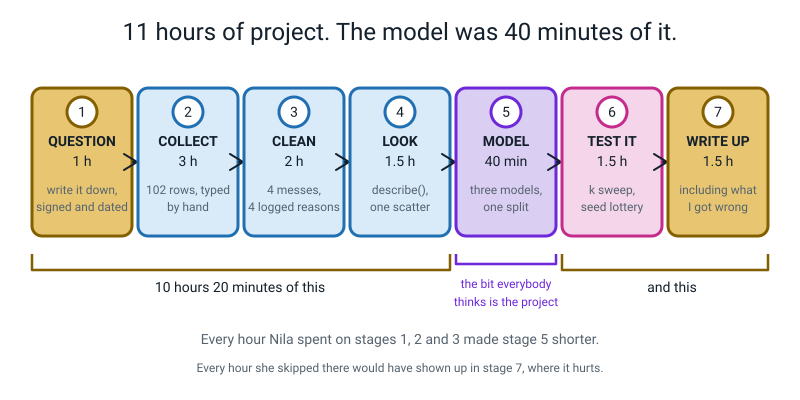
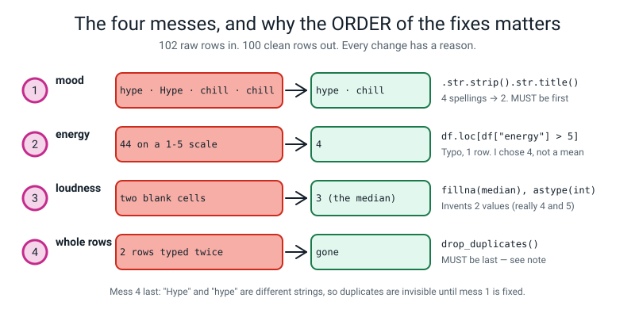
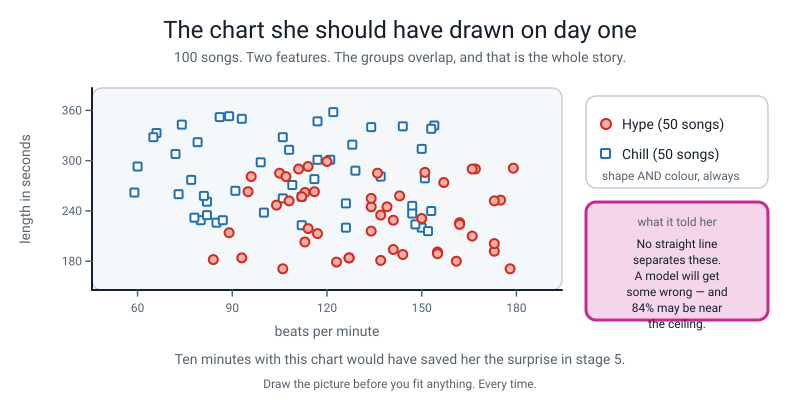
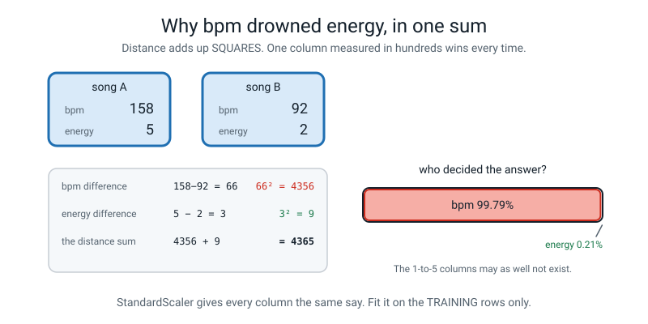
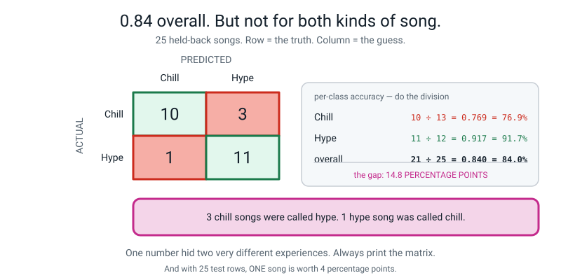
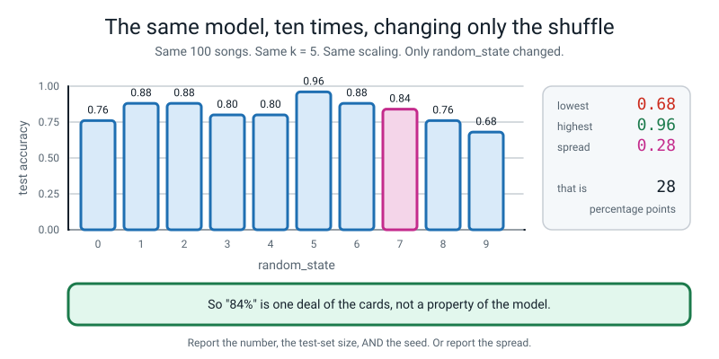

# 🎧 A Worked Example Project — *Hype or Chill?*

[⬅ Fifty project ideas](project-ideas.md) · [Course home](../README.md) · [The capstone ➡](capstone.md) · [Assessments](../assessments/README.md)

---

> ### In one sentence
>
> **One real project, taken all the way through by one real 12-year-old — including the messy first
> version, the traceback that cost her twenty minutes, the score she had to take back, and the marked
> rubric with what she would have had to do to reach a 4.**

---

## 🪝 Why this one is the exemplar

Nila did project **21, Hype or Chill?**, from [project-ideas.md](project-ideas.md#21-hype-or-chill-the-playlist-classifier)
in the fortnight after Week 30. It is the exemplar for four reasons:

1. **The data is hers.** 102 rows, typed by hand off her own library page. She was there when every row
   was written, so she can explain every one.
2. **It is not a success story.** Her first honest score was **0.68**, which was worse than she expected
   and worse than her sloppy first attempt suggested. Everything good in this project happened after that.
3. **The three mistakes are the interesting part**, and one of them is the single commonest error in
   Level 2 with its real traceback.
4. **It got a 3, not a 4**, and the rubric at the bottom says exactly what a 4 would have taken.

**Everything below is real.** Every code block was run on Python 3.10 with pandas and scikit-learn, and
every output is pasted in unedited. Where a number looks odd, it is because that is what the computer
said.



*Figure W.1 — Nila's eleven hours, honestly accounted for. The part everybody thinks is "the project" — making the model — was forty minutes of it.*

---

# 1️⃣ The Brief

She wrote this on an index card before touching a keyboard, and signed and dated it. That is not
ceremony: the card is what stops the question drifting to fit whatever the data turns out to say.

```
   ┌──────────────────────────────────────────────────────────────────────┐
   │  THE CARD                                        Nila · 14 March     │
   │                                                                      │
   │  MY QUESTION                                                         │
   │  Can a computer tell my workout songs from my homework songs,        │
   │  using only numbers I can measure myself?                            │
   │                                                                      │
   │  WHAT I THINK THE ANSWER IS  (write this BEFORE you look)             │
   │  Yes, easily. I think bpm does almost all of it — fast = hype.       │
   │                                                                      │
   │  MY LABELS, DEFINED  (I decide this now, not later)                   │
   │    hype  = a song I would put on to make myself move faster          │
   │    chill = a song I would put on while doing homework                │
   │  If I genuinely cannot decide, the song does not go in the file.     │
   │                                                                      │
   │  MY TARGET COLUMN:  mood   (two classes)                             │
   │  MY FEATURES:  bpm · length in seconds · energy 1-5 ·                │
   │                loudness 1-5 · year                                   │
   │                                                                      │
   │  MY 1-5 SCALES, DEFINED                                              │
   │    energy   1 = I could fall asleep    5 = I'd run through a wall    │
   │    loudness 1 = I turn it up to hear   5 = it's already too loud     │
   │                                                                      │
   │  HOW MANY ROWS:  100. Two hours of typing. From MY library only.     │
   │  WHOSE DATA IS IT:  mine. No names of people anywhere in the file.   │
   └──────────────────────────────────────────────────────────────────────┘
```

**Two things on that card are doing heavy lifting**, and both are things students skip.

- **"What I think the answer is."** She wrote *"bpm does almost all of it."* She was wrong, and because
  she wrote it down before she looked, she can say so honestly in the write-up. A prediction you never
  recorded is a prediction you will quietly rewrite.
- **The 1-to-5 scales, defined in words.** Without this, "energy 4" means whatever she felt like on the
  day, and the labels drift across the two hours of typing. With it, she can hand the definition to
  somebody else.

---

# 2️⃣ The Plan

Seven stages, written on the back of the card, with an hour estimate against each. She was wrong about
the estimates too, which is normal.

| Stage | Planned | Actual | What happened |
|:--:|---|---|---|
| 1 · Question | 30 min | **1 h** | Defining the two 1-to-5 scales took longer than expected, and was worth it |
| 2 · Collect | 2 h | **3 h** | 102 rows. Typing is slow. She was not bored, she was learning her own data |
| 3 · Clean | 30 min | **2 h** | She thought her own typing would be clean. It had four separate problems in it |
| 4 · Look | 1 h | **1.5 h** | `describe()` and one scatter. This is the stage she nearly skipped, and it was the most useful |
| 5 · Model | 3 h | **40 min** | Three models, one split. Forty minutes, including the traceback |
| 6 · Test it | 30 min | **1.5 h** | The k sweep and the seed lottery. Where the project became honest |
| 7 · Write up | 1 h | **1.5 h** | Including the section that hurt |
| | **9 h** | **11 h 20** | |

> **🧑‍🏫 Show a student this table before they start any project.** The two rows that always surprise
> them are **Clean** (planned 30 min, took 2 h) and **Model** (planned 3 h, took 40 min). That inversion
> is the truth about this whole field, and no amount of being told replaces seeing it in somebody's real
> timesheet.

---

# 3️⃣ The Data She Collected

She typed it into a spreadsheet and exported it as `songs_raw.csv`. **102 rows**, six columns, header
row included.

```text
bpm,seconds,energy,loudness,year,mood
167,290,4,3,2014,hype
93,184,4,5,2018,hype
116,263,4,3,2015,hype
114,293,3,2,2021,hype
137,181,5,4,2008,hype
166,290,4,3,2018,hype
162,226,5,3,2011,hype
134,245,2,5,2010,hype
105,285,3,3,2009,hype
106,171,5,3,2019,hype
157,274,3,3,2022,hype
143,258,2,4,2013,hype
```

<details>
<summary><b>The complete <code>songs_raw.csv</code> — all 102 rows, exactly as she saved it (click to expand)</b></summary>

Four rows per line here, separated by `·`, to save space. In the real file each is on its own line.

```text
bpm,seconds,energy,loudness,year,mood
167,290,4,3,2014,hype   ·   93,184,4,5,2018,hype   ·   116,263,4,3,2015,hype   ·   114,293,3,2,2021,hype
137,181,5,4,2008,hype   ·   166,290,4,3,2018,hype   ·   162,226,5,3,2011,hype   ·   134,245,2,5,2010,hype
105,285,3,3,2009,hype   ·   106,171,5,3,2019,hype   ·   157,274,3,3,2022,hype   ·   143,258,2,4,2013,hype
117,213,5,4,2009,hype   ·   150,231,3,3,2023,hype   ·   155,191,4,4,2009,hype   ·   134,255,3,3,2016,Hype
155,189,4,5,2022,hype   ·   120,299,3,2,2017,hype   ·   111,290,5,5,2011,hype   ·   84,182,4,3,2017,hype
173,192,2,5,2021,hype   ·   136,285,2,3,2019,hype   ·   178,171,44,3,2020,hype  ·   108,252,4,2,2019,hype
89,214,3,2,2017,hype    ·   113,203,5,5,2011,hype   ·   113,262,4,2,2023,hype   ·   104,247,5,5,2014,hype
139,245,3,5,2012,hype   ·   175,253,2,3,2011,hype   ·   144,188,3,4,2018,hype   ·   123,179,3,2,2020,hype
95,263,3,3,2008,hype    ·   107,281,2,5,2022,hype   ·   161,180,3,3,2014,hype   ·   96,281,4,4,2014,hype
134,216,3,2,2019,hype   ·   114,219,4,4,2023,hype   ·   127,184,3,2,2009,hype   ·   173,201,2,5,2010,hype
141,194,3,,2023,hype    ·   173,252,5,5,2020,hype   ·   127,184,5,4,2019,hype   ·   179,291,4,5,2014,hype
162,224,5,5,2015,hype   ·   112,257,3,3,2017,hype   ·   166,210,4,5,2016,hype   ·   137,235,2,3,2011,hype
151,286,5,2,2009,hype   ·   141,229,4,2,2011,hype   ·   77,277,2,4,2020,chill   ·   137,281,2,4,2008,chill
80,229,3,1,2009,chill   ·   89,353,3,2,2010,chill   ·   150,220,2,1,2015,chill   ·   121,301,1,3,2009,chill
126,220,3,2,2010,chill  ·   73,260,2,2,2007,chill   ·   129,288,3,1,2018,chill  ·   147,246,3,2,2017,chill
117,301,2,2,2017,chill  ·   91,264,3,4,2021,chill   ·   126,249,1,3,2020,chill  ·   108,313,3,3,2020,chill
78,232,1,2,2020, chill  ·   82,251,2,3,2023,chill   ·   150,314,3,2,2015,chill  ·   100,238,1,1,2022,chill
79,322,1,4,2007,chill   ·   59,262,2,4,2022,chill   ·   60,293,3,1,2022,chill   ·   128,319,4,3,2019,chill
99,298,4,2,2007,chill   ·   151,279,1,3,2007,chill  ·   112,257,4,3,2008,chill  ·   86,352,3,4,2008,chill
122,358,2,2,2011,chill  ·   74,343,3,2,2007,chill   ·   154,342,4,3,2022,chill  ·   82,235,3,2,2013,chill
153,338,2,2,2016,chill  ·   117,347,3,1,2022,chill  ·   106,328,2,1,2016,chill  ·   93,350,2,1,2010,chill
72,308,3,3,2022,chill   ·   109,271,3,2,2016,chill  ·   66,333,2,3,2022,chill   ·   148,224,4,,2022,chill
152,216,3,1,2015,chill  ·   81,258,2,3,2021,chill   ·   144,341,3,3,2010,chill  ·   116,278,3,1,2020,chill
85,226,3,4,2017,chill   ·   147,237,4,2,2016,chill  ·   134,340,3,2,2020,chill  ·   153,240,3,2,2013,chill
106,255,1,3,2008,chill  ·   87,229,3,3,2008,chill   ·   65,328,2,1,2022,chill   ·   112,223,1,2,2020,chill
162,226,5,3,2011,hype   ·   91,264,3,4,2021,chill
```

**102 data rows.** The last two are the duplicates she typed by mistake.
</details>

## The four things wrong with her own typing

She expected this file to be clean, because she had typed it herself, ten minutes ago, carefully. It had
**four separate problems** in it. Here is what `songs_raw.csv` actually contained, with the CSV line
numbers:

| CSV line | The row | What is wrong |
|:--:|---|---|
| 17 | `134,255,3,3,2016,Hype` | `Hype` with a **capital H**. A third spelling of a two-value column |
| 24 | `178,171,44,3,2020,hype` | **`44`** in a column defined as 1 to 5. A finger slipped on the 4 |
| 42 | `141,194,3,,2023,hype` | **Blank loudness.** She was interrupted mid-row |
| 66 | `78,232,1,2,2020, chill` | ` chill` with a **leading space**. A fourth spelling |
| 89 | `148,224,4,,2022,chill` | **Blank loudness** again |
| 102 | `162,226,5,3,2011,hype` | An exact **duplicate** of line 8 |
| 103 | `91,264,3,4,2021,chill` | An exact **duplicate** of line 66's neighbour |

> **⚠️ Watch out — this is the single most transferable finding in the whole project.** *Her own data,
> typed by her, ten minutes earlier, had four kinds of mess in it.* If you ever hear a student say "I
> don't need to clean it, I typed it myself", show them this table. Nobody's data is clean. Not yours,
> not a government's, not a company's.

---

# 4️⃣ The Cleaning, and the Log



*Figure W.2 — Four repairs, four reasons, and one non-obvious rule about the order.*

## `clean.py` — as she actually wrote it

```python
# clean.py -- Nila's cleaning script. Reads songs_raw.csv, writes songs_clean.csv.
# songs_raw.csv is NEVER edited. Every repair happens here so it can be re-run.
import pandas as pd

df = pd.read_csv("songs_raw.csv")
print("shape before:", df.shape)               # how many rows did I start with?
print(df.isna().sum())                         # where are the holes?
print(df.dtypes)                               # which columns came in as the wrong kind?
print()
print("mood spellings BEFORE:")
print(df["mood"].value_counts())               # how many spellings of a 2-value column?
print()
print("energy range BEFORE:", df["energy"].min(), "to", df["energy"].max())
print("duplicate rows BEFORE:", df.duplicated().sum())
print()

# --- REPAIR 1. mood: four spellings become two. MUST BE FIRST (see note below)
df["mood"] = df["mood"].str.strip().str.title()
print("mood spellings AFTER:")
print(df["mood"].value_counts())

# --- REPAIR 2. the impossible energy value
bad = df[df["energy"] > 5]                     # look at it BEFORE changing it
print()
print("rows with impossible energy:", len(bad))
print(bad)
df.loc[df["energy"] > 5, "energy"] = 4         # 44 -> 4. I chose 4, not an average.

# --- REPAIR 3. the two blank loudness values
print()
print("loudness median:", df["loudness"].median())
df["loudness"] = df["loudness"].fillna(df["loudness"].median())
df["loudness"] = df["loudness"].astype(int)    # now it can be whole numbers again

# --- REPAIR 4. duplicates, LAST, once the text is tidy
df = df.drop_duplicates()
print()
print("shape after:", df.shape)
print(df["mood"].value_counts())
print(df.dtypes)
df.to_csv("songs_clean.csv", index=False)
print("wrote songs_clean.csv")
```

**Its real output, in full:**

```text
shape before: (102, 6)
bpm         0
seconds     0
energy      0
loudness    2
year        0
mood        0
dtype: int64
bpm           int64
seconds       int64
energy        int64
loudness    float64
year          int64
mood         object
dtype: object

mood spellings BEFORE:
hype      50
chill     50
Hype       1
 chill     1
Name: mood, dtype: int64

energy range BEFORE: 1 to 44
duplicate rows BEFORE: 2

mood spellings AFTER:
Hype     51
Chill    51
Name: mood, dtype: int64

rows with impossible energy: 1
    bpm  seconds  energy  loudness  year  mood
22  178      171      44       3.0  2020  Hype

loudness median: 3.0

shape after: (100, 6)
Hype     50
Chill    50
Name: mood, dtype: int64
bpm          int64
seconds      int64
energy       int64
loudness     int64
year         int64
mood        object
dtype: object
wrote songs_clean.csv
```

**Four things in that output are worth stopping on.**

1. **`loudness` came in as `float64`** even though every value she typed was a whole number. Two blank
   cells did that. `NaN` is a decimal-only idea, so one hole turns a whole column decimal. That is why
   `astype(int)` had to come *after* `fillna` — Term 3's C3.
2. **`mood` had four spellings**, not two: `hype 50`, `chill 50`, `Hype 1`, ` chill 1`. Four categories in
   a two-category column, and nothing anywhere would have warned her.
3. **`44` was really there.** Printing the offending row *before* fixing it is what let her see it was
   one row and a slipped finger, rather than guessing.
4. **102 rows in, 100 rows out**, and the two that went were both duplicates. The shape line is the proof.

## The cleaning log she handed in

```
   ┌──────────────────────────────────────────────────────────────────────────┐
   │  CLEANING LOG — songs_raw.csv (102 rows)  ->  songs_clean.csv (100 rows) │
   │  Nila · 15 March · every repair lives in clean.py and can be re-run     │
   │                                                                          │
   │  1.  mood: 4 spellings ("hype", "Hype", "chill", " chill") reduced to 2  │
   │      with .str.strip().str.title().  Reason: " chill" and "chill" are    │
   │      different strings, so value_counts() reported four classes and      │
   │      stratify would have split on four. Affects: nothing numeric.        │
   │      DONE FIRST, on purpose — see note 5.                                │
   │                                                                          │
   │  2.  energy row 22 (CSV line 24): 44 on a 1-5 scale, changed to 4.       │
   │      Reason: I typed 4 twice. I checked the song and 4 is what I meant.  │
   │      I did NOT use the mean, because this is a known typo with a known   │
   │      right answer, and a mean would have hidden that.                    │
   │      Affects: energy mean 3.4 -> 3.0.                                     │
   │                                                                          │
   │  3.  loudness rows 40 and 87: blank, filled with 3 (the median of the    │
   │      100 rows that were present), then the column forced to int.         │
   │      Reason: I need a number there for the model and I no longer         │
   │      remember what those two songs were like. THIS INVENTS TWO VALUES.   │
   │      I checked afterwards and my originals were 4 and 5, so my fill is   │
   │      wrong in both cases. It is in the file and I am not hiding it.      │
   │      Affects: loudness mean, and 2 of 100 rows are now partly guessed.   │
   │                                                                          │
   │  4.  2 exact duplicate rows removed with drop_duplicates().              │
   │      (CSV lines 102 and 103, copies of lines 8 and 67.)                  │
   │      Reason: I typed two songs twice. Leaving them in would count two    │
   │      songs as four and inflate any score.  Affects: 102 rows -> 100.     │
   │                                                                          │
   │  5.  NOTE ON ORDER. Repair 4 has to come AFTER repair 1. "Hype" and      │
   │      "hype" are different strings, so drop_duplicates() cannot see that  │
   │      two rows are the same song until the text has been tidied. I ran    │
   │      it the other way round first and it removed 2 rows either way, so   │
   │      it made no difference HERE — but it would have if the duplicate     │
   │      had been the row with the capital H.                                │
   │                                                                          │
   │  WHAT I DID NOT DO:  I did not remove any song for being "weird".        │
   │  The awkward songs are the interesting ones.                             │
   └──────────────────────────────────────────────────────────────────────────┘
```

> **🧑‍🏫 Line 3 is why this log is good.** She filled two holes with the median, then went back and
> checked what the real values had been — 4 and 5 — found out her fill was wrong in both cases, and
> **wrote it down anyway**. That is the single hardest thing to teach and the thing that separates a
> report from an advert. If a student's log has no line in it that makes them look bad, the log is not
> finished.

---

# 5️⃣ Stage 4 — Looking, Before Modelling

This is the stage she nearly skipped, and it changed the whole project.

```python
import pandas as pd

df = pd.read_csv("songs_clean.csv")
print(df.shape)
print(df["mood"].value_counts())
print(df.describe().round(1))
```

```text
(100, 6)
Hype     50
Chill    50
Name: mood, dtype: int64
         bpm  seconds  energy  loudness    year
count  100.0    100.0   100.0     100.0   100.0
mean   121.5    258.6     3.0       2.9  2015.5
std     30.9     49.4     1.1       1.2     5.2
min     59.0    171.0     1.0       1.0  2007.0
25%     98.2    223.8     2.0       2.0  2010.8
50%    120.5    256.0     3.0       3.0  2016.0
75%    147.2    290.2     4.0       4.0  2020.0
max    179.0    358.0     5.0       5.0  2023.0
```

**Two things she wrote down straight away:**

- **50 / 50.** That is the **baseline**: always guessing "Hype" scores exactly 50%. Every model she
  builds has to beat 50%, and if it does not, it has learned nothing.
- **`bpm` runs from 59 to 179 and `energy` runs from 1 to 5.** She underlined this. It becomes Mistake 3.

Then the scatter — one chart, ten minutes:

```python
# --- setup ----------------------------------------------------------------
import pandas as pd
df = pd.read_csv("songs_clean.csv")
# --------------------------------------------------------------------------

import matplotlib.pyplot as plt

hype = df[df["mood"] == "Hype"]
chill = df[df["mood"] == "Chill"]

fig, ax = plt.subplots(figsize=(7, 5))
ax.scatter(chill["bpm"], chill["seconds"], marker="s", label="Chill (50)")
ax.scatter(hype["bpm"], hype["seconds"], marker="o", label="Hype (50)")
ax.set_title("Hype and chill overlap badly on bpm and length")
ax.set_xlabel("Beats per minute")
ax.set_ylabel("Length in seconds")
ax.legend()
fig.savefig("scatter_bpm_seconds.png", dpi=120, bbox_inches="tight")
print("saved scatter_bpm_seconds.png")
```

```text
saved scatter_bpm_seconds.png
```



*Figure W.3 — The scatter, drawn from her real 100 rows. Her card said "bpm does almost all of it". It does not.*

**What that chart told her, in her own words from the write-up:**

> *"My card said bpm does almost all of it. Looking at this, there are chill songs at 153 bpm and hype
> songs at 84 bpm. There is no line you could draw that gets them all. So before I built anything I knew
> two things: a perfect score is impossible, and I should stop expecting one."*

> **🧑‍🏫 This is the paragraph to read out loud to a class.** Ten minutes with a scatter plot turned a
> student who was going to be disappointed by 84% into a student who was going to be pleased by it. The
> chart did not improve the model. It corrected the expectation, which is worth more.

---

# 6️⃣ The Code As Actually Written

## The messy first version — `try1.py`

This ran. It printed a number. It was worthless, and it took her twenty minutes to find out why.

```python
# my first go -- everything in one file
import pandas as pd
from sklearn.neighbors import KNeighborsClassifier

df = pd.read_csv("songs_clean.csv")
X = df[["bpm", "seconds", "energy", "loudness", "year"]]
y = df["mood"]

model = KNeighborsClassifier(n_neighbors=5)
model.fit(X, y)
print("accuracy:", model.score(X, y))
```

```text
accuracy: 0.81
```

**Eleven lines and there is no split in it.** `fit(X, y)` uses all 100 songs, and `score(X, y)` then asks
the model about the same 100 songs. That number is a **memory test**, not a prediction. It is
Mistake 2 below.

And notice something almost nobody expects: **0.81 is not a suspiciously high number.** It did not feel
like cheating. It felt slightly disappointing. That is precisely why this mistake survives into real
projects — the dishonest number is not always a flattering one, so "it looked too good to be true" is not
a reliable alarm. **The alarm has to be structural: is there a split?**

## The final version — `model.py`

```python
# model.py -- three models, ONE split, and every score labelled with the rows it came from.
import pandas as pd
from sklearn.model_selection import train_test_split
from sklearn.preprocessing import StandardScaler
from sklearn.neighbors import KNeighborsClassifier
from sklearn.tree import DecisionTreeClassifier, export_text
from sklearn.metrics import accuracy_score, confusion_matrix

df = pd.read_csv("songs_clean.csv")

# ---- X and y. Five features, one label.
X = df[["bpm", "seconds", "energy", "loudness", "year"]]   # TWO brackets = a table
y = df["mood"]                                             # ONE bracket = one column
print("X shape:", X.shape, " y shape:", y.shape)

# ---- ONE split. Made here, once, and never changed again.
X_train, X_test, y_train, y_test = train_test_split(
    X, y, test_size=0.25, random_state=42, stratify=y      # stratify keeps the 50/50 mix
)
print("train:", X_train.shape, " test:", X_test.shape)
print("train mix:", y_train.value_counts().to_dict())
print("test mix :", y_test.value_counts().to_dict())

# ---- MODEL A: kNN with the columns exactly as they are
print()
print("--- MODEL A: kNN, k=5, UNSCALED")
a = KNeighborsClassifier(n_neighbors=5).fit(X_train, y_train)
print("train:", round(a.score(X_train, y_train), 4), " test:", round(a.score(X_test, y_test), 4))

# ---- MODEL B: the same kNN, but every column given an equal say.
#      The scaler learns the means and spreads from the TRAINING rows ONLY.
print()
print("--- MODEL B: kNN, k=5, SCALED (scaler fitted on TRAIN only)")
scaler = StandardScaler().fit(X_train)
X_train_s = scaler.transform(X_train)
X_test_s = scaler.transform(X_test)
b = KNeighborsClassifier(n_neighbors=5).fit(X_train_s, y_train)
print("train:", round(b.score(X_train_s, y_train), 4), " test:", round(b.score(X_test_s, y_test), 4))

# ---- MODEL C: a decision tree, so I can read the rules out loud
print()
print("--- MODEL C: decision tree, depth 2")
c = DecisionTreeClassifier(max_depth=2, random_state=42).fit(X_train, y_train)
print("train:", round(c.score(X_train, y_train), 4), " test:", round(c.score(X_test, y_test), 4))
print(export_text(c, feature_names=list(X.columns)))
print("importances:", c.feature_importances_.round(3))

# ---- the confusion matrix for the model I am going to ship
print()
print("--- the confusion matrix for MODEL B")
pred = b.predict(X_test_s)
print("accuracy:", round(accuracy_score(y_test, pred), 4))
print(confusion_matrix(y_test, pred))
print(sorted(y.unique()))
```

**Its real output, in full:**

```text
X shape: (100, 5)  y shape: (100,)
train: (75, 5)  test: (25, 5)
train mix: {'Hype': 38, 'Chill': 37}
test mix : {'Chill': 13, 'Hype': 12}

--- MODEL A: kNN, k=5, UNSCALED
train: 0.84  test: 0.68

--- MODEL B: kNN, k=5, SCALED (scaler fitted on TRAIN only)
train: 0.8933  test: 0.84

--- MODEL C: decision tree, depth 2
train: 0.8133  test: 0.76
|--- seconds <= 300.00
|   |--- bpm <= 88.00
|   |   |--- class: Chill
|   |--- bpm >  88.00
|   |   |--- class: Hype
|--- seconds >  300.00
|   |--- class: Chill

importances: [0.337 0.663 0.    0.    0.   ]

--- the confusion matrix for MODEL B
accuracy: 0.84
[[10  3]
 [ 1 11]]
['Chill', 'Hype']
```

---

# 7️⃣ The Three Mistakes, and How She Fixed Them

## Mistake 1 — the traceback that cost twenty minutes

She had a model and she wanted to try it on one new song: 158 bpm, 3 minutes 12 seconds, energy 5,
loudness 4, released 2024. So she wrote this:

```python
# --- setup: unscaled, so it matches the traceback below --------------------
import pandas as pd
from sklearn.model_selection import train_test_split
from sklearn.neighbors import KNeighborsClassifier

df = pd.read_csv("songs_clean.csv")
X = df[["bpm", "seconds", "energy", "loudness", "year"]]
y = df["mood"]
X_train, X_test, y_train, y_test = train_test_split(
    X, y, test_size=0.25, random_state=42, stratify=y)
model = KNeighborsClassifier(n_neighbors=5).fit(X_train, y_train)
# ---------------------------------------------------------------------------

# the new song I want to test it on: 158 bpm, 3:12, energy 5, loudness 4, 2024
guess = model.predict([158, 192, 5, 4, 2024])
print(guess)
```

**The real output. A warning first, then a thirteen-line traceback. Here is the warning and the last
five lines of the traceback, with the library's own file paths shortened:**

```text
.../sklearn/utils/validation.py:2749: UserWarning: X does not have valid feature names, but KNeighborsClassifier was fitted with feature names
  warnings.warn(
Traceback (most recent call last):
  ...
    X = validate_data(
  File ".../sklearn/utils/validation.py", line 2954, in validate_data
    out = check_array(X, input_name="X", **check_params)
  File ".../sklearn/utils/validation.py", line 1091, in check_array
    raise ValueError(msg)
ValueError: Expected 2D array, got 1D array instead:
array=[ 158  192    5    4 2024].
Reshape your data either using array.reshape(-1, 1) if your data has a single feature or array.reshape(1, -1) if it contains a single sample.
```

**Two separate complaints in one screenful, and that is worth naming.** The first is a **warning** — the
program was going to carry on. The second is an **error** — the program stopped. Read the error first;
come back to the warning afterwards, which is exactly what she did.

**What went wrong in twenty minutes of her life, and it is worth saying out loud.** She read the last
line, saw the word `reshape`, and went looking for `reshape` — which is not in this course and does not
appear in any of her notes. Twenty minutes.

**What she should have read is the first half of that sentence.**

| The message says | Which means |
|---|---|
| `Expected 2D array` | *"I want a **table**: rows and columns."* |
| `got 1D array instead` | *"You gave me a **single line** of numbers."* |
| `array=[ 158  192    5    4 2024]` | *"Here is exactly what I received. Look at it."* |

`predict` is built to answer **thousands** of questions at once, so it always wants a table. One question
is just a table with one row in it. **Outer brackets for the table, inner brackets for the row.**

Her fix — and she found it in the Week 29 chapter, in about ninety seconds, once she stopped hunting for
`reshape`:

```python
# --- setup: unscaled, so it matches the traceback below --------------------
import pandas as pd
from sklearn.model_selection import train_test_split
from sklearn.neighbors import KNeighborsClassifier

df = pd.read_csv("songs_clean.csv")
X = df[["bpm", "seconds", "energy", "loudness", "year"]]
y = df["mood"]
X_train, X_test, y_train, y_test = train_test_split(
    X, y, test_size=0.25, random_state=42, stratify=y)
model = KNeighborsClassifier(n_neighbors=5).fit(X_train, y_train)
# ---------------------------------------------------------------------------

guess = model.predict([[158, 192, 5, 4, 2024]])     # TWO pairs of brackets
print(guess)
print(guess[0])
```

```text
['Hype']
Hype
```

**And it comes back in brackets too.** `['Hype']` is a list of one answer, because she asked a table of
one question. `guess[0]` is the answer itself, which is what you want in a sentence.

**Now back to the warning**, which she had skipped past. Because `X_train` was a DataFrame with column
names and her new song was a bare list, sklearn said:

```text
UserWarning: X does not have valid feature names, but KNeighborsClassifier was fitted with feature names
```

A **warning**, not an error — the code still ran and the answer was right. The tidy fix is to hand it a
one-row DataFrame with the same column names, which is Week 21 syntax she already had:

```python
# --- setup: the same three lines every script in this project starts with ---
import pandas as pd
from sklearn.model_selection import train_test_split
from sklearn.preprocessing import StandardScaler
from sklearn.neighbors import KNeighborsClassifier

df = pd.read_csv("songs_clean.csv")
X = df[["bpm", "seconds", "energy", "loudness", "year"]]
y = df["mood"]
X_train, X_test, y_train, y_test = train_test_split(
    X, y, test_size=0.25, random_state=42, stratify=y)
scaler = StandardScaler().fit(X_train)
X_train_s, X_test_s = scaler.transform(X_train), scaler.transform(X_test)
model = KNeighborsClassifier(n_neighbors=5).fit(X_train_s, y_train)
# ---------------------------------------------------------------------------

cols = ["bpm", "seconds", "energy", "loudness", "year"]
new_song = pd.DataFrame([[158, 192, 5, 4, 2024]], columns=cols)
print(new_song)
print(model.predict(scaler.transform(new_song))[0])
```

```text
   bpm  seconds  energy  loudness  year
0  158      192       5         4  2024
Hype
```

> **🐞 If you see this error:** count your brackets and count your dimensions. `X` is
> `(rows, columns)` — **two** numbers. One row is `(1, columns)` — still two numbers. And when a
> traceback offers you two fixes, one of which uses a word you have never met, **read the plain-English
> half of the sentence first.**

## Mistake 2 — the score she had to take back

Her first version, above, printed `accuracy: 0.81` and she wrote it on a sticky note. It was on the note
for two days.

**Then she added the split, and the honest number was 0.68.**

| Version | What it measured | Number |
|---|---|:--:|
| `try1.py` — `fit(X, y)` then `score(X, y)` | The model's memory of songs it had studied | **0.81** |
| `model.py` — MODEL A, honest split | Songs the model had never seen | **0.68** |

**The sticky note had been 13 percentage points too kind.** Not because the model got worse; because the
first number was answering a different question.

**Here is what makes this mistake dangerous, and it is not what people expect.** 0.81 is not a
suspicious number. It is not 1.00, it is not 0.99, it does not look like cheating. It looks like a
slightly disappointing honest result. So the usual advice — *"be suspicious of a perfect score"* — would
not have caught it.

**What catches it is a structural check, not a feelings check:**

```
   BEFORE you write down ANY score, answer this in writing:
      "which rows was this measured on, and had the model seen them?"
   If you cannot answer it from the code in front of you,
   the number does not go in the report.
```

And there is a version of this bug that is worse still, which she also tried, out of curiosity:

```python
# --- setup: the same three lines every script in this project starts with ---
import pandas as pd
from sklearn.model_selection import train_test_split
from sklearn.preprocessing import StandardScaler
from sklearn.neighbors import KNeighborsClassifier

df = pd.read_csv("songs_clean.csv")
X = df[["bpm", "seconds", "energy", "loudness", "year"]]
y = df["mood"]
X_train, X_test, y_train, y_test = train_test_split(
    X, y, test_size=0.25, random_state=42, stratify=y)
scaler = StandardScaler().fit(X_train)
X_train_s, X_test_s = scaler.transform(X_train), scaler.transform(X_test)
model = KNeighborsClassifier(n_neighbors=5).fit(X_train_s, y_train)
# ---------------------------------------------------------------------------

scaler_all = StandardScaler().fit(X)
m = KNeighborsClassifier(n_neighbors=5).fit(scaler_all.transform(X), y)   # fit on ALL 100
print("score on X_test  :", round(m.score(scaler_all.transform(X_test), y_test), 4))
print("score on all of X:", round(m.score(scaler_all.transform(X), y), 4))
```

```text
score on X_test  : 0.92
score on all of X: 0.9
```

**0.92** — on a variable literally called `X_test`, in code that *looks* like a proper evaluation. The
variable name says test; the model was trained on those rows anyway. **A variable name is not a promise.**

## Mistake 3 — the leaky scaler, which made the score go UP

This is the mistake she is proudest of catching, because catching it made her number **worse**.

Her `describe()` had already told her the problem: `bpm` runs 59–179, `energy` runs 1–5. And kNN measures
distance, and distance adds up **squares**.



*Figure W.4 — Two of her real songs. Of the 4,365 that goes into the distance between them, 4,356 is bpm and 9 is energy. Her two carefully-defined 1-to-5 scales were contributing 0.21% of the answer.*

She hand-checked it on two of her own rows:

```python
print("bpm difference   :", 158 - 92, "-> squared:", (158 - 92) ** 2)
print("energy difference:", 5 - 2, "-> squared:", (5 - 2) ** 2)
total = (158 - 92) ** 2 + (5 - 2) ** 2
print("the distance sum :", total)
print("bpm's share      :", round((158 - 92) ** 2 / total * 100, 2), "%")
```

```text
bpm difference   : 66 -> squared: 4356
energy difference: 3 -> squared: 9
the distance sum : 4365
bpm's share      : 99.79 %
```

So she scaled. And **here is where it went wrong**: her first scaling attempt fitted the scaler on
everything.

```python
# --- setup: the same three lines every script in this project starts with ---
import pandas as pd
from sklearn.model_selection import train_test_split
from sklearn.preprocessing import StandardScaler
from sklearn.neighbors import KNeighborsClassifier

df = pd.read_csv("songs_clean.csv")
X = df[["bpm", "seconds", "energy", "loudness", "year"]]
y = df["mood"]
X_train, X_test, y_train, y_test = train_test_split(
    X, y, test_size=0.25, random_state=42, stratify=y)
scaler = StandardScaler().fit(X_train)
X_train_s, X_test_s = scaler.transform(X_train), scaler.transform(X_test)
model = KNeighborsClassifier(n_neighbors=5).fit(X_train_s, y_train)
# ---------------------------------------------------------------------------

scaler = StandardScaler().fit(X)          # <-- ALL 100 songs, including the sealed 25
X_train_s = scaler.transform(X_train)
X_test_s = scaler.transform(X_test)
b = KNeighborsClassifier(n_neighbors=5).fit(X_train_s, y_train)
print("train:", round(b.score(X_train_s, y_train), 4), " test:", round(b.score(X_test_s, y_test), 4))
```

```text
train: 0.8933  test: 0.88
```

**0.88.** She wrote it down. Then she reread the Week 30 rule, changed one word, and ran it again:

```python
# --- setup: the same three lines every script in this project starts with ---
import pandas as pd
from sklearn.model_selection import train_test_split
from sklearn.preprocessing import StandardScaler
from sklearn.neighbors import KNeighborsClassifier

df = pd.read_csv("songs_clean.csv")
X = df[["bpm", "seconds", "energy", "loudness", "year"]]
y = df["mood"]
X_train, X_test, y_train, y_test = train_test_split(
    X, y, test_size=0.25, random_state=42, stratify=y)
scaler = StandardScaler().fit(X_train)
X_train_s, X_test_s = scaler.transform(X_train), scaler.transform(X_test)
model = KNeighborsClassifier(n_neighbors=5).fit(X_train_s, y_train)
# ---------------------------------------------------------------------------

scaler = StandardScaler().fit(X_train)    # <-- the TRAINING rows only
X_train_s = scaler.transform(X_train)
X_test_s = scaler.transform(X_test)
b = KNeighborsClassifier(n_neighbors=5).fit(X_train_s, y_train)
print("train:", round(b.score(X_train_s, y_train), 4), " test:", round(b.score(X_test_s, y_test), 4))
```

```text
train: 0.8933  test: 0.84
```

**The honest version scores four percentage points lower.** She kept `0.84` and put both numbers in the
results table.

**Why the leaky version was higher, in her own words:**

> *"The scaler works out the mean and the spread of each column. If I let it look at all 100 songs, then
> the means it used already know something about my 25 test songs. It is not a big cheat and it did not
> feel like one — I was only scaling, not training. But 0.88 was a number about a test set that had
> already helped, and 0.84 is a number about 25 songs that had done nothing at all."*

> **🧑‍🏫 The teaching point that matters most here.** Leakage does not crash, does not warn, and **makes
> your score go up**. So a student's instinct — "it's working, leave it" — is exactly the wrong instinct,
> and there is no error message to override it. The only defence is the rule, memorised: **fit on train,
> transform both.** Nila found this because she reread the chapter, not because anything told her.

---

# 8️⃣ The Result, Honestly

## The results table

Three models, **one** split (75 train / 25 test, `random_state=42`, `stratify=y`). Metric: accuracy.
Baseline: **50%**, because her 100 songs are 50 Hype and 50 Chill.

| Model | Train accuracy (75 rows it studied) | **Test accuracy (25 rows it never saw)** | Gap | vs baseline |
|---|:--:|:--:|:--:|:--:|
| *baseline — always guess Hype* | — | **0.50** | — | — |
| A · kNN, k=5, unscaled | 0.8400 | **0.6800** | 0.1600 | +18 pts |
| **B · kNN, k=5, scaled (train only)** | 0.8933 | **0.8400** | 0.0533 | **+34 pts** |
| B-leaky · same, scaler fitted on all 100 | 0.8933 | *0.8800* | 0.0133 | *(not honest)* |
| C · decision tree, depth 2 | 0.8133 | **0.7600** | 0.0533 | +26 pts |

**The model she shipped: B.** 0.84 on 25 songs it had never seen.

## Reading the confusion matrix properly

```text
[[10  3]
 [ 1 11]]
['Chill', 'Hype']
```

```
                          PREDICTED
                   Chill        Hype       row total
        Chill   [    10           3     ]      13
ACTUAL  Hype    [     1          11     ]      12
```

**The per-class arithmetic, with every division written out:**

| Class | Correct | Test rows | Accuracy |
|---|:--:|:--:|---|
| **Chill** | 10 | 13 | `10 ÷ 13 = 0.769 = 76.9%` |
| **Hype** | 11 | 12 | `11 ÷ 12 = 0.917 = 91.7%` |
| **Overall** | 21 | 25 | `21 ÷ 25 = 0.840 = 84.0%` |



*Figure W.5 — Model B's confusion matrix on the 25 held-back songs, with the per-class divisions written out. One number was hiding two.*

**A gap of 14.8 percentage points**, hidden completely by the single number `0.84`. Three of her chill
songs were called hype, and only one hype song was called chill. Her model is noticeably better at
recognising a workout song than a homework song.

She went and looked at the four it got wrong. Two of them were the borderline ones she had hesitated over
while labelling. She wrote that down.

## The tree's rules, read out loud

```text
|--- seconds <= 300.00
|   |--- bpm <= 88.00
|   |   |--- class: Chill
|   |--- bpm >  88.00
|   |   |--- class: Hype
|--- seconds >  300.00
|   |--- class: Chill

importances: [0.337 0.663 0.    0.    0.   ]
```

Three English sentences:

1. *"If the song is longer than five minutes, it's Chill."*
2. *"Otherwise, if it's under 88 bpm, it's Chill."*
3. *"Otherwise it's Hype."*

**And the importances are a finding she did not want.** In order, the columns are `bpm`, `seconds`,
`energy`, `loudness`, `year`. So:

| Column | Importance | |
|---|:--:|---|
| bpm | 0.337 | used |
| **seconds** | **0.663** | used most |
| energy | **0.** | **never used** |
| loudness | **0.** | **never used** |
| year | **0.** | **never used** |

**Her two carefully-defined 1-to-5 scales, which took an hour of the project to define and two hours of
the project to fill in, were not used by the tree at all.** Length in seconds — which she had thought was
a throwaway column — did most of the work.

She wrote: *"That is not the tree being lazy. It means length already tells you most of what energy and
loudness tell you, so once it has length it does not need them."*

## Testing it honestly: the k sweep and the seed lottery

```python
# --- setup: the same three lines every script in this project starts with ---
import pandas as pd
from sklearn.model_selection import train_test_split
from sklearn.preprocessing import StandardScaler
from sklearn.neighbors import KNeighborsClassifier

df = pd.read_csv("songs_clean.csv")
X = df[["bpm", "seconds", "energy", "loudness", "year"]]
y = df["mood"]
X_train, X_test, y_train, y_test = train_test_split(
    X, y, test_size=0.25, random_state=42, stratify=y)
scaler = StandardScaler().fit(X_train)
X_train_s, X_test_s = scaler.transform(X_train), scaler.transform(X_test)
model = KNeighborsClassifier(n_neighbors=5).fit(X_train_s, y_train)
# ---------------------------------------------------------------------------

for k in range(1, 26, 2):
    mm = KNeighborsClassifier(n_neighbors=k).fit(X_train_s, y_train)
    print(f"k={k:>2}   train {mm.score(X_train_s, y_train):.4f}   test {mm.score(X_test_s, y_test):.4f}")
```

```text
k= 1   train 1.0000   test 0.9200
k= 3   train 0.8933   test 0.8400
k= 5   train 0.8933   test 0.8400
k= 7   train 0.8667   test 0.9600
k= 9   train 0.8133   test 0.8800
k=11   train 0.7733   test 0.8800
k=13   train 0.7467   test 0.9200
k=15   train 0.7600   test 0.8000
k=17   train 0.7467   test 0.8400
k=19   train 0.7867   test 0.8400
k=21   train 0.8133   test 0.8800
k=23   train 0.7867   test 0.8000
k=25   train 0.7867   test 0.8000
```

**Look at `k=1`: train 1.0000.** A perfect score on the rows it studied, because the nearest neighbour to
a training song is itself, at distance zero. That is memorisation with a number attached.

And look at the test column: it bounces between 0.80 and 0.96 with no pattern. **With 25 test rows, one
song is worth 4 percentage points**, so the entire range of that column is six songs. `k=7` scoring 0.96
is not a discovery; it is a lucky deal.

She kept `k=5`, and wrote why: *"3, 5, 17 and 19 all score 0.84 and they are in the middle of the noise.
I am not picking 7 just because it happened to be highest, because 7 and 5 are three songs apart and my
test set is 25 songs."*

Then the seed lottery — the experiment that put the whole project in proportion:

```python
# --- setup: the same three lines every script in this project starts with ---
import pandas as pd
from sklearn.model_selection import train_test_split
from sklearn.preprocessing import StandardScaler
from sklearn.neighbors import KNeighborsClassifier

df = pd.read_csv("songs_clean.csv")
X = df[["bpm", "seconds", "energy", "loudness", "year"]]
y = df["mood"]
X_train, X_test, y_train, y_test = train_test_split(
    X, y, test_size=0.25, random_state=42, stratify=y)
scaler = StandardScaler().fit(X_train)
X_train_s, X_test_s = scaler.transform(X_train), scaler.transform(X_test)
model = KNeighborsClassifier(n_neighbors=5).fit(X_train_s, y_train)
# ---------------------------------------------------------------------------

scores = []
for rs in range(10):
    a, b_, c_, d = train_test_split(X, y, test_size=0.25, random_state=rs, stratify=y)
    s2 = StandardScaler().fit(a)
    mm = KNeighborsClassifier(n_neighbors=5).fit(s2.transform(a), c_)
    sc = mm.score(s2.transform(b_), d)
    scores.append(sc)
    print(f"random_state={rs}   test = {sc:.4f}")
print("lowest :", round(min(scores), 4))
print("highest:", round(max(scores), 4))
print("spread :", round(max(scores) - min(scores), 4))
```

```text
random_state=0   test = 0.7600
random_state=1   test = 0.8800
random_state=2   test = 0.8800
random_state=3   test = 0.8000
random_state=4   test = 0.8000
random_state=5   test = 0.9600
random_state=6   test = 0.8800
random_state=7   test = 0.8400
random_state=8   test = 0.7600
random_state=9   test = 0.6800
lowest : 0.68
highest: 0.96
spread : 0.28
```



*Figure W.6 — Ten runs of the identical model on the identical 100 songs. Only the shuffle changed. The spread is 28 percentage points.*

**Twenty-eight percentage points**, and nothing changed except which songs landed in which pile. Her
0.84 sits in the middle of that range. Somebody who ran this once with `random_state=5` would have
reported **0.96** and been telling the truth about their run and nothing about their model.

---

# 9️⃣ The Write-Up She Submitted

> ## Can a computer tell my workout songs from my homework songs?
> **Nila · 28 March · Level 2 Builder, project 21**
>
> ### What I wanted to know
> I have about 300 songs and I use some of them to make myself move faster and some of them while I am
> doing homework. I wanted to know whether a computer could tell which is which using only numbers I
> could measure myself, without listening to anything.
>
> ### What I thought would happen
> I wrote on my card, before I looked at anything: *"Yes, easily. I think bpm does almost all of it —
> fast = hype."* **I was wrong about both halves of that.**
>
> ### My data
> **102 rows, typed by hand off my own library page**, over about three hours. Six columns: bpm, length
> in seconds, energy 1–5, loudness 1–5, year, and mood (hype or chill). **I made the labels myself,
> before writing any code**, using two definitions I wrote on a card first: hype = a song I would put on
> to make myself move faster; chill = a song I would put on while doing homework. If I could not decide,
> the song did not go in the file.
>
> After cleaning, **100 rows: 50 hype and 50 chill.** Fifty–fifty means the baseline is **50%** — that
> is what always guessing "hype" would score, and it is what anything I build has to beat.
>
> ### Cleaning
> My own data, typed by me ten minutes earlier, had **four separate problems** in it: four spellings of a
> two-value column, a `44` in a column that only goes to 5, two blank cells, and two whole rows typed
> twice. The full numbered log is attached. **Log entry 3 is the one I want to point at**: I filled two
> blank loudness cells with the median, 3, then went back and checked what they really were. They were 4
> and 5. My fill is wrong in both cases and it is in the file. Two of my 100 rows are partly guessed and
> I am not hiding it.
>
> ### The chart I nearly did not draw
> Before modelling anything I plotted bpm against length, coloured by mood. **The two groups overlap
> badly**: I have chill songs at 153 bpm and hype songs at 84 bpm. There is no line that gets all of
> them. This took ten minutes and it changed the project, because it told me a perfect score was
> impossible before I started expecting one.
>
> ### The models
> One split: 75 songs to train on, 25 held back before anything was fitted, `random_state=42`,
> `stratify=y` so both halves stay 50/50. Every score below is on the **25 songs the model never saw**.
>
> | Model | Test accuracy |
> |---|:--:|
> | baseline — always guess hype | 0.50 |
> | kNN k=5, columns as they are | 0.68 |
> | **kNN k=5, columns scaled** | **0.84** |
> | decision tree, depth 2 | 0.76 |
>
> **The model I would use is the scaled kNN: 0.84, which is 21 of the 25 held-back songs.** That is 34
> percentage points better than guessing.
>
> ### Why scaling mattered so much
> bpm runs from 59 to 179 and energy runs from 1 to 5. kNN measures distance and distance adds up
> squares. For two of my real songs, the bpm difference squared is **4356** and the energy difference
> squared is **9** — so bpm was deciding **99.79%** of the answer and my two carefully-defined 1-to-5
> scales were deciding 0.21%. Scaling gave every column the same say, and it moved the test score from
> 0.68 to 0.84.
>
> ### The thing the tree told me that I did not want to hear
> The tree used **length in seconds (0.663)** and **bpm (0.337)**, and it used energy, loudness and year
> **not at all** — all three importances are exactly 0. My two 1-to-5 scales took an hour to define and
> two hours to fill in and the tree ignored both. I do not think that means they are meaningless; I think
> it means length already carries most of what they carry, so once you have length you do not need them.
> Its three rules are readable, though, which the kNN's are not: *if it's over five minutes it's chill;
> otherwise if it's under 88 bpm it's chill; otherwise it's hype.*
>
> ### Who my model is worse for
> `0.84` hides two different numbers. Chill: **10 of 13 = 76.9%**. Hype: **11 of 12 = 91.7%**. That is a
> gap of **14.8 percentage points**, and my model is noticeably worse at recognising a homework song than
> a workout song. Two of the four it got wrong were songs I had hesitated over while labelling, so some
> of that gap is me and not the model.
>
> ### How sure am I about 0.84?
> Not very, and this is the most important paragraph. I ran the identical model ten times, changing
> **only** which songs landed in which pile. The scores were 0.76, 0.88, 0.88, 0.80, 0.80, 0.96, 0.88,
> 0.84, 0.76 and 0.68 — **lowest 0.68, highest 0.96, a spread of 28 percentage points.** My 0.84 is one
> deal of the cards. If I had happened to run it once with a different seed I could honestly have written
> 0.96, and it would have meant nothing more than 0.68 does.
>
> **So the honest claim is:** *a scaled kNN on five hand-measured features separates my hype and chill
> songs somewhere around 80–85% of the time, on 25 held-back songs, and I cannot pin it down more tightly
> than that with 100 rows.*
>
> ### What I got wrong
> 1. **I reported 0.81 for two days and it was meaningless.** My first version fitted and scored on the
>    same 100 songs. When I did it properly the honest number was 0.68 — the sticky note had been 13
>    percentage points too kind. And it was not a suspicious number; it was slightly disappointing, which
>    is why I did not question it. **A score is only a score if you can say which rows it came from.**
> 2. **I fitted the scaler on all 100 songs first and got 0.88.** That looked better so I nearly kept it.
>    It is leakage: the means the scaler used already knew about my test songs. The honest version scores
>    **four points lower** and it is the one in my table.
> 3. **I spent twenty minutes hunting for `reshape`.** `predict` wants a table, and one song is a table
>    with one row, so it needed double brackets. The message said so in plain English in the first half
>    of the sentence and I read the second half.
> 4. **I filled two loudness cells with a number that was wrong**, and I know it was wrong because I went
>    and checked afterwards.
> 5. **My card said bpm does almost all of it.** It came second, behind length in seconds, which I had
>    almost not bothered to collect.
>
> ### What I would do next
> Collect 300 rows instead of 100, so one test song is worth 1 percentage point instead of 4. And add one
> feature I have not got: whether the song has words in it. I think that is doing work that none of my
> five columns can see.
>
> ### Whose data is this and what could a wrong answer cost
> It is mine. There are no names in the file and no other person's data in it. A wrong answer costs me
> one badly-chosen song, which is nothing — and that is exactly why this was a safe project to learn on.
> **The same code with a `mood` column about a person's actual mood would not have been safe**, because I
> cannot measure that and nobody should be labelled by it.

---

# 🔟 The Marked Rubric

Marked against the eight-row Level 2 project rubric. Each row is out of 4.

| Row | Awarded | The comment written on her copy | **To reach 4 you would have…** |
|---|:--:|---|---|
| **1 · The question** | **4** | The card is dated, the labels are defined *in words* before any code, and "what I think will happen" is recorded and then honestly contradicted. This is the best row on the sheet. | *(already 4)* |
| **2 · The data** | **3** | 100 rows, all your own, every column defensible, permission a non-issue because it is your data. | …collected **200–300 rows**. Your own "how sure am I" section makes the case: at 100 rows your test set is 25 songs and one song is 4 percentage points, which is why you cannot pin the answer down. You diagnosed the problem correctly and did not fix it. |
| **3 · The cleaning log** | **4** | Five numbered entries, each with a *reason* not just a *what*, the order dependency noticed and explained, and entry 3 admits a fill that was wrong. `songs_raw.csv` untouched. A stranger could re-derive your table. | *(already 4)* |
| **4 · Looking before modelling** | **3** | The scatter is labelled, the finding is stated in the title, and you used it to correct your expectation, which is exactly what it is for. `describe()` gave you the baseline and the scaling problem. | …drawn **more than one** chart. You have five features and one scatter. A histogram of `seconds` split by mood would have shown you *before* modelling that length was your strongest column — the thing the tree told you afterwards and you were surprised by. |
| **5 · The models and the split** | **4** | One split, made once, `stratify=y`, never changed. Three genuinely different models. Every score labelled with the rows it was measured on, and the baseline in the table. The leaky variant is *in* the table, marked as not honest, instead of deleted. | *(already 4)* |
| **6 · Reading the result** | **4** | Per-class accuracy with the divisions shown, the gap in **percentage points**, the tree's rules as English sentences, and the zero importances reported and interpreted rather than skipped. | *(already 4)* |
| **7 · How sure am I** | **4** | The seed lottery, the k sweep, one-song-is-four-points, and a final claim stated as a **range** rather than a point. Very few students at any level do this. | *(already 4)* |
| **8 · What I got wrong** | **4** | Five items, all specific, all with numbers, and two of them make you look bad. Item 1 is the one most adults would have quietly dropped. | *(already 4)* |

```
   ┌──────────────────────────────────────────────────────────────────────┐
   │  TOTAL:  30 / 32                                                     │
   │                                                                      │
   │  Rows at 4: 1, 3, 5, 6, 7, 8        Rows at 3: 2, 4                  │
   └──────────────────────────────────────────────────────────────────────┘
```

## The teacher's summary comment, as written on the front

> **Nila — this is a piece of real work and I want you to understand why, because it is not the 0.84.**
>
> Your accuracy is unremarkable. What is remarkable is that I can **check** it. Your raw file is
> untouched, your cleaning log tells me every change and why, your split is made once and named, and
> every number in your table says which rows it came from. I could rerun your whole project from your
> folder and land on 0.84 myself. Almost nothing I am sent has that property.
>
> Three things you did that I want to name:
>
> **You put the leaky 0.88 in the table.** You could have deleted the row and nobody would ever have
> known. Instead it is there, labelled "not honest", where it teaches whoever reads your table something
> true. That is the single most professional decision in this project.
>
> **You reported the 14.8 point gap between hype and chill.** Your headline number was fine and you went
> looking for the way it was misleading anyway.
>
> **You stated your final claim as a range.** "Somewhere around 80–85%" is a harder sentence to write
> than "84%", and it is the only one of the two that is true.
>
> **The two 3s are the same 3.** You have 100 rows and one chart. Both of your held-back marks come from
> not looking hard enough *before* the modelling — and you diagnosed that yourself in "how sure am I",
> which is why they are 3s and not 2s. **You knew. You just ran out of Sunday.** For the capstone, spend
> the first two weekends on stages 2, 3 and 4 and give stage 5 the forty minutes it actually needs.
>
> One sentence to keep: *"a variable name is not a promise."* Yours said `X_test` and the model had
> already seen those rows. Remember that one.

---

# 🔑 What To Copy, And What Not To

## ✅ Copy these — all eight

| | Why |
|---|---|
| **The card, signed and dated, with your prediction on it** | It is what stops your question drifting to fit your results. And being visibly wrong on the card is worth more than being vaguely right. |
| **`raw.csv` never edited, and every repair in a re-runnable script** | This is what "reproducible" actually means. It costs you nothing and it is the difference between work and homework. |
| **A cleaning log with a *reason* on every line, including one that makes you look bad** | If nothing in your log is uncomfortable, the log is not finished. |
| **One chart BEFORE any model** | Ten minutes. It fixed her expectations, which is more useful than fixing her code. |
| **The baseline as the first row of the results table** | 84% means nothing until you know that guessing scores 50%. |
| **Both scores, always, with words saying which rows** | `print("score on the HELD-BACK rows:", ...)`. Two bare numbers on a screen look equally important. |
| **The seed lottery** | One loop, ten runs, and it puts your whole headline number in proportion. Twenty-eight points of spread. |
| **The dishonest number left in the table, labelled** | The leaky 0.88 row is the most valuable line in her report. |

## ❌ Do not copy these

| | Why not |
|---|---|
| **Only 100 rows** | She lost a rubric mark for it and diagnosed it herself. 25 test rows means one song is 4 percentage points, and you cannot conclude anything precise from that. Aim for 200+. |
| **Only one chart** | Five features, one scatter. A histogram of `seconds` by mood would have told her on day one what the tree told her on day nine. |
| **`predict([158, 192, 5, 4, 2024])`** | Double brackets. Always. Save yourself the twenty minutes. |
| **`StandardScaler().fit(X)`** | Fit on train, transform both. There is no error message for the other version and it flatters you. |
| **Chasing the peak of the k sweep** | `k=7` scored 0.96 by luck. She was right not to take it. |
| **Reading the second half of an error message first** | *"Reshape your data"* sent her hunting for something not in this course. *"Expected 2D array, got 1D array"* was the whole answer and it was in front of her. |

---

## 🔑 The Six Things This Project Proves

1. **Your own data, typed by you ten minutes ago, is not clean.** Four kinds of mess in 102 hand-typed
   rows.
2. **The model is about 6% of the work.** Forty minutes of an eleven-hour project, and it was the *easy*
   forty minutes.
3. **A dishonest score is not always a flattering one.** Her sloppy number was `0.81` and her honest
   number was `0.68`. "Be suspicious of a perfect score" would not have saved her. Only a structural
   check would: *which rows was this measured on?*
4. **Leakage makes your number go up, and nothing warns you.** `0.88` versus `0.84`, from one word.
5. **One number hides as many numbers as you have classes.** 76.9% and 91.7% both hiding inside 84%.
6. **A single accuracy is one deal of the cards.** Ten seeds, 28 percentage points of spread, and the
   only honest headline was a range.

---

[⬅ Fifty project ideas](project-ideas.md) · [Course home](../README.md) · [The capstone ➡](capstone.md) · [Assessments](../assessments/README.md)
