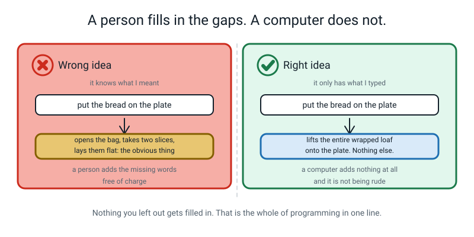
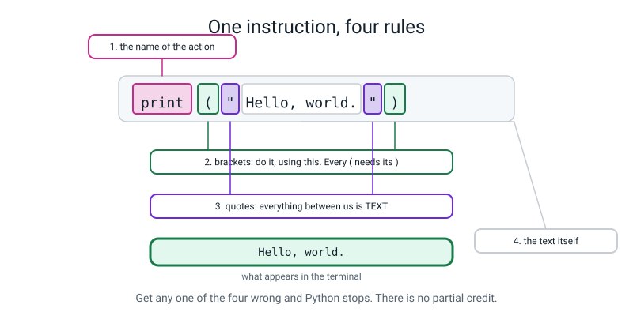
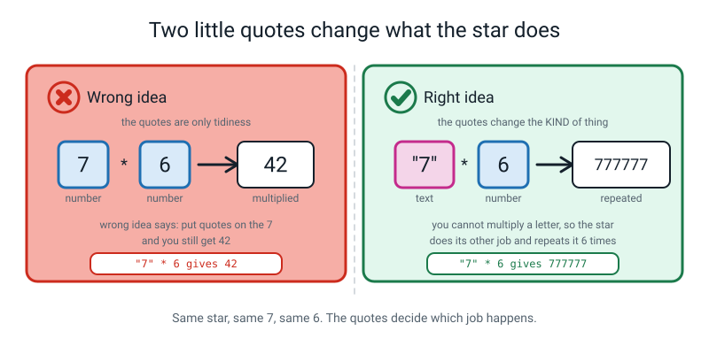
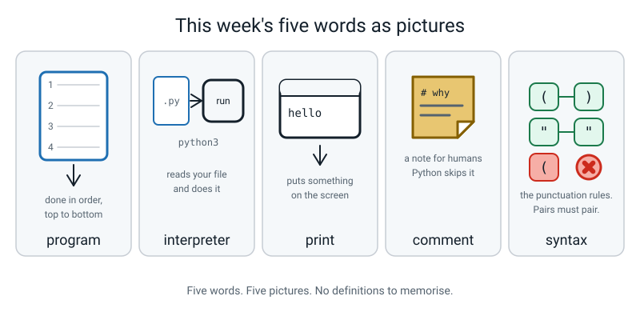

# Week 1 — Make the Computer Say Something

[⬅ Start Here](../README.md) · [Course Home](../README.md) · [Next ➡](week-02.md) · [Workbook](../workbook/week-01.md)

---

> ### This week in one sentence
> **A program is a list of instructions in a file, run top to bottom, and the computer does exactly what you typed — including the part you didn't mean.**
>
> **By the end of this chapter you will be able to:**
> - **Run a `.py` file** from the terminal and read the output that appears underneath
> - Use **`print()`** to show text and the result of arithmetic, and explain why `"7" * 6` is not `7 * 6`
> - Say in one sentence **why the computer is literal** rather than smart
> - Read a **`NameError`** caused by a typo and name the misspelled word from the message alone
>
> **New syntax:** `print("text")` · `# comment` · `+ - * /` · `print(a, b, c)`
>
> **Reading time:** about 25 minutes. **Homework:** about 60 minutes.

---

## 🪝 Start Here

Last year you trained a machine to tell apples from oranges. You built an app in Scratch by dragging blocks around. You know what a feature is, what a label is, and why a model gets things wrong.

You have never written a line of code.

That changes in about ten minutes. But first, a sandwich.

---

Imagine I am a robot standing in your kitchen. I am a **brilliant** robot in exactly one way: I will do precisely what you tell me, instantly, without complaining or getting bored. And I am a **terrible** robot in exactly one way: I know nothing at all. I have never seen bread. I do not know what a sandwich is. I have no common sense whatsoever.

You write me six instructions. Number one says:

> **Put the bread on the plate.**

So I pick up the entire loaf — still sealed in its plastic wrapper — and I place it carefully on the plate. Then I fold my hands and wait.

> "Number two?"

You did not say *open the bag*. You did not say *take out two slices*. You didn't need to, because any human on earth would know that. I am not a human.


*Figure 1.1 — The instruction was not wrong. It was incomplete, and a computer cannot complete it for you.*

Here is the part that matters, and I want to be really clear about it because it shapes the whole year:

> **I wasn't being annoying. I was being accurate.**

Every single thing I did was allowed by what you wrote. That is what a computer is like. Not clever. Not stupid. **Literal.**

And here is the genuinely good news buried inside that. Because it is literal, it is completely **predictable**. If you can work out what you actually said, you can always work out what it will do. There is no luck in this. Nothing here is magic, and nothing here is unfair.

---

## 🧠 The Big Idea

> **📌 About the code in this section.** The blocks below are **illustrations, not files**. They show you the shape of one idea, and each one carries on from the one above it — the `import` lines and the data are typed once, in the first block that needs them. **The complete, runnable file is in 💻 Type This.** If you copy a block from this section on its own and Python says `NameError`, that is why, and nothing is broken.

### 1. A program is a list of instructions in a file

**The plain explanation.** A **program** is a list of instructions, written down in a file, that a computer performs one after another from the top of the file to the bottom.

> **Program** — a list of instructions in a file, performed one at a time, from the top to the bottom.

That is the whole definition. Nothing is hidden behind it.

**The analogy.** A recipe is a program. So is a knitting pattern, or the instructions on a flat-pack wardrobe. The only difference is that a human following a recipe *fills in the gaps* — "add the eggs" quietly means "crack them first" — and a computer fills in nothing at all.

**The concrete version.** A Python file is a plain text file whose name ends in `.py`. That's it. That's the whole of what makes it a Python file.

```
hello.py       ← a Python file
pizza_maths.py ← another one
hello.txt      ← not a Python file
```

A file full of Python is just text sitting on a disk. It doesn't *do* anything by existing. Something has to read it and carry out the instructions, the way I read your sandwich list and carried it out. That something is a program already living on your laptop.

> **Interpreter** — the program that reads your Python file and actually does what it says. On your laptop it is called `python3`.

So the shape of every single thing you do this year is the same three steps, and then round again:


*Figure 1.2 — This loop is the whole of programming. You will go round it about forty times today and about four thousand times this year.*

Two warnings about that loop, and both of them will bite you today.

> **⚠️ Watch out:** **saving is not automatic.** If you change the file and run it without saving, you will see the *old* answer and conclude the computer is broken. In VS Code, an unsaved file has a **filled dot** next to its name in the tab. When the dot goes away, you're saved. Get in the habit of glancing at the dot.

> **⚠️ Watch out:** **running does not change the file.** Nothing the terminal prints is stored anywhere. Output is a shout, not a note.

### 2. Two windows, and knowing which one you're in

**The plain explanation.** You will live in two windows all year, and they do completely different jobs.

| Window | What it's for | What it looks like |
|---|---|---|
| **The editor** | Where you **write** instructions and save them | A page of text, with a filename in a tab at the top |
| **The terminal** | Where you **run** the file and read what came out | A mostly-black rectangle with a little prompt waiting |

**The analogy.** The editor is your notebook. The terminal is you reading the notebook out loud to somebody who then does what it says. Writing in the notebook changes nothing in the world. Reading it out loud does.

**The concrete version.** In the terminal you type one line:

```bash
python3 hello.py
```

Read that out loud as: *"Python, take the file called hello dot py, and do what it says."*

Then Python's answer appears **underneath** what you typed.


*Figure 1.3 — What you type and what it prints. The `>` prompt is not part of the answer — it is the terminal saying "go on then".*

> **💡 Try this:** name the two windows out loud every time you switch. It sounds silly. It solves about a third of all confusion in the first month, because an enormous number of beginner problems are really *"I typed a Python line into the terminal"* or *"I typed a terminal command into the editor"*.

### 3. `print()` — the first instruction, taken apart

**The plain explanation.** There is one instruction you learn today, and it is the most useful one there is.

> **print** — the instruction that puts something on the screen.

Here is the smallest complete Python program that does something you can see:

```python
print("Hello, world.")
```

```text
Hello, world.
```

**The analogy.** `print` is a torch, not a product. Nobody's finished app is a list of printed lines. But from Week 5 onwards, `print` is how you find every bug you will ever write — you shine it into your program and see what the computer is actually holding.

**The concrete version.** That one line has **four separate parts**, and every one of them is a rule you will use for the rest of your life.


*Figure 1.4 — Four pieces, four rules. Get one wrong and Python stops. There is no partial credit.*

| Piece | What it is | The rule |
|---|---|---|
| `print` | The name of a built-in action: "show this on the screen" | Spelled exactly, **all lowercase**. `Print` is a different word and Python has never heard of it. |
| `(` and `)` | The brackets that mean "do it, using this" | Never optional. Every `(` needs its `)`. |
| `"` and `"` | Quote marks, meaning "the stuff between us is text" | Must match. Open with `"`, close with `"`. |
| `Hello, world.` | The text itself | Anything at all. Spaces, punctuation, whatever. |

**The quotes are not decoration.** This is the sentence to hold on to. They are the difference between *text* and *a name*.

- `print("Hello")` shows the five letters H-e-l-l-o.
- `print(Hello)` means *"go and find the thing called Hello and show me that"* — and since nothing called `Hello` exists, Python stops and complains.

### 4. Arithmetic — and the surprise that runs all year

**The plain explanation.** Python does maths with the four symbols you already know: `+ - * /`. The star `*` means times. The slash `/` means divide.

```python
print(3 * 450)
print(1350 / 5)
print(8 - 3)
```

```text
1350
270.0
5
```

Stop on that middle line. **`270.0`, not `270`.** Every time you use `/`, Python hands back a number with a decimal point on it, even when the answer comes out exactly. That is deliberate: `/` means "share it out", and sharing often makes a fraction, so Python always leaves room for one.

For today: **"the slash leaves a dot."** Next week it gets a proper name.

**Now the surprise.** Predict these two before you read on. Write your guesses down.

```python
print(7 * 6)
print("7" * 6)
```

```text
42
777777
```

**The same `*` did two completely different jobs.**

- `7 * 6` — two **numbers**. Multiply them. Forty-two.
- `"7" * 6` — a piece of **text** and a number. There is no sensible way to multiply the *letter* seven, so `*` does the other thing it knows how to do with text: it **repeats** it. Six copies of the character `7`, stuck together, making the six-character text `777777`.


*Figure 1.5 — Same star, same 7, same 6. The quotes decide which job happens.*

Here is the full comparison table. Cover the middle column and predict it.

| You type | It prints | Why |
|---|---|---|
| `print(2 + 2)` | `4` | Two numbers. Add them. |
| `print("2 + 2")` | `2 + 2` | Quotes, so it's text. Just show the characters. |
| `print("2" + "2")` | `22` | Two texts. Stick them together. |
| `print("ab" * 3)` | `ababab` | Text and a number. Repeat it. |
| `print(3 * "ab")` | `ababab` | Same thing, either way round. |

**Why this is worth twenty minutes and not two.** Your instinct is that quotes are just tidiness, like a hat on a word. This one example proves the quotes change what the whole line *means*. Once you have felt that, next week's lesson on types is a formality instead of a fight.

One more thing `print` can do, and you will use it constantly today: **give it several things separated by commas** and it shows them all, with a space where each comma was.

```python
print("Slices:", 8 * 2)
```

```text
Slices: 16
```

That's the comma's whole job: *"and also show this, with a space in between."*

### 5. Comments, and why errors are the useful part

**The plain explanation.** Anything after a `#` on a line, Python completely ignores.

> **Comment** — a note in your file, after a `#`, that Python skips over completely, written so a human can understand *why* the code does what it does.

```python
# pizza_maths.py - four sums I am not going to do in my head.

print(3 * 450)        # 3 pizzas at 450 rupees each
print(1350 / 5)       # that total split between 5 friends
```

That sounds useless. It's the opposite. It's how you leave notes for the human who reads this later — and the human who reads this later is **you**, in two weeks, having forgotten everything.

Two habits to start today, because habits are cheap now and expensive later:

1. **Every file starts with a comment saying what the file is for.** Filename, a dash, then the purpose.
2. **A good comment says *why*, not *what*.** `print(1350 / 5)  # divide 1350 by 5` is a waste of ink — anyone can read that off the line. `# that total split between 5 friends` is worth having.

**Now the important half of this section.** There is one more word you need:

> **Syntax** — the spelling and punctuation rules of a language. Get the syntax wrong and you haven't written an odd sentence; you have written no sentence at all.

*"Dog the ate ."* is not a strange sentence in English. It is not a sentence. Python is far stricter about this than English, because it cannot guess.

So you will get things wrong. Constantly. Today. And when you do, Python prints a block of text called a **traceback**.

> **Traceback** — the block of text Python prints when it gives up, saying where it stopped and why.

Here is a real one. I misspelled `print` as `prnt` on line 3:

```text
Traceback (most recent call last):
  File "/Users/you/ai-academy/level2/hello.py", line 3, in <module>
    prnt("Hello, world.")
NameError: name 'prnt' is not defined. Did you mean: 'print'?
```

**Read it from the bottom up.** Always. Every time. Three steps:

```
┌──────────────────────────────────────────────────────────────┐
│  HOW TO READ A TRACEBACK                                     │
│                                                              │
│  1. LAST line  → what went wrong, in words                   │
│     "NameError: name 'prnt' is not defined"                   │
│                                                              │
│  2. The "line N" bit → where to look                         │
│     "line 3"                                                 │
│                                                              │
│  3. Go to that line. Fix ONE thing. Run it again.            │
└──────────────────────────────────────────────────────────────┘
```


*Figure 1.6 — The last line is a sentence, not a wall of red. On modern Python it even guesses the fix.*

A `NameError` means one exact thing: **"you used a name and I have never heard of it."** Almost always a typo.

> **An error message is not the computer telling you off. It is the computer telling you where it got stuck. It is the most helpful thing on the screen.**

You will read that sentence in this book about thirty more times. It is the difference between somebody who debugs and somebody who freezes.

---

## 💻 Type This

Two files. **Type them. Do not paste them.** Your fingers are learning something your eyes cannot — where the brackets live, that a quote has a partner. That knowledge arrives in your hands after a few hundred lines, and it never arrives at all if you paste.

### Step 1 — make the file

In your editor: **File → New File**, then **File → Save As**, and name it `hello.py`. Make sure it lands in your `ai-academy/level2` folder.

### Step 2 — type two lines and a comment

```python
# hello.py - my first Python program.

print("Hello, world.")
print("My name is Ramana.")
```

Put **your own** name in line 4. It matters more than you'd think.

| Line | What it does |
|---|---|
| 1 | A comment. Python ignores it completely. It is there for you. |
| 2 | A blank line. Also ignored. It's there so the file breathes. |
| 3 | Shows the text `Hello, world.` on the screen. |
| 4 | Shows another line, **underneath** the first, because Python works top to bottom. |

### Step 3 — save it, then run it

Press **Cmd-S** (Mac) or **Ctrl-S** (Windows). Check the dot in the tab has gone.

Then, in the **terminal** — not the editor:

```bash
python3 hello.py
```

```text
Hello, world.
My name is Ramana.
```

You just gave a computer an instruction and it obeyed. Two instructions, two lines out, in the order you wrote them. Swap lines 3 and 4 and they come out the other way round. Top to bottom. Always.

### Step 4 — break it on purpose

Change `print` on line 3 to `prnt`. Save. Run.

```text
Traceback (most recent call last):
  File "/Users/you/ai-academy/level2/hello.py", line 3, in <module>
    prnt("Hello, world.")
NameError: name 'prnt' is not defined. Did you mean: 'print'?
```

**Read the last line out loud.** Then find the line number. Then go to line 3, change **one** thing, save, and run again.

Then write it in your **Bug Log** — a landscape sheet with three columns that lives at the front of your folder all year:

| What I saw | What it meant | What I changed |
|---|---|---|
| `NameError: name 'prnt' is not defined` | Python doesn't know a word called prnt — I spelled print wrong | Fixed the spelling on line 3 |

### Step 5 — a second file, and the prediction habit

New file, saved as `pizza_maths.py`. **Before you run each line, say out loud what you think it will print.** This is the single highest-value habit in the whole course, and being wrong is the useful part — a wrong guess shows you what you *believe*, and then you can fix the belief instead of the line.

```python
# pizza_maths.py - four sums I am not going to do in my head.

print(3 * 450)        # 3 pizzas at 450 rupees each
print(1350 / 5)       # that total split between 5 friends
print(8 - 3)          # slices left after I eat 3
print("7" * 6)        # NOT seven times six
```

Save. Run.

```bash
python3 pizza_maths.py
```

```text
1350
270.0
5
777777
```

Two lines to stop on.

**`270.0`.** You said 270 and you were right — that *is* two hundred and seventy. The slash always leaves a decimal point on the answer.

**`777777`.** You almost certainly predicted 42. So did everybody. Six sevens in a row, **because of the quotes**. They don't decorate the seven. They change what the seven *is*.

### Step 6 — the finished second file, with the comma trick added

Add one last line and run the whole thing:

```python
# pizza_maths.py - four sums I am not going to do in my head.

print(3 * 450)                     # 3 pizzas at 450 rupees each
print(1350 / 5)                    # that total split between 5 friends
print(8 - 3)                       # slices left after I eat 3
print("7" * 6)                     # NOT seven times six
print("Slices in 2 pizzas:", 8 * 2)   # text AND a number, one print, one comma
```

```text
1350
270.0
5
777777
Slices in 2 pizzas: 16
```

That last line is the shape you will use for the next three weeks: a bit of text saying what the number *means*, then the number, worked out by the computer rather than by you.

---

## 🔍 Worked Examples

### Worked Example 1 — Friday snacks (food)

I want to know what Friday's snacks cost, and I want the computer to do every sum.

```python
# snack_bill.py - what Friday's snacks cost, worked out by the computer.

print("--- FRIDAY SNACKS ---")   # a heading, just text
print("Samosas at 25 each:", 6 * 25)      # 6 samosas, 25 rupees each
print("Juice at 40 each:", 3 * 40)        # 3 juices, 40 rupees each
print("Everything:", 6 * 25 + 3 * 40)     # both lots added
print("Split 4 ways:", (6 * 25 + 3 * 40) / 4)   # brackets so the sum happens first
print("Stars for a border:", "*" * 20)    # text repeated, NOT multiplied
```

```text
--- FRIDAY SNACKS ---
Samosas at 25 each: 150
Juice at 40 each: 120
Everything: 270
Split 4 ways: 67.5
Stars for a border: ********************
```

**Three things worth noticing.**

The last line shows a **space** after the colon in every printed line, and I never typed one. That's the comma doing its job.

`(6 * 25 + 3 * 40) / 4` needed the brackets. Without them, Python does times before divide, exactly like in maths class, and `6 * 25 + 3 * 40 / 4` would give `180.0` — a completely different and wrong answer. Try both.

`"*" * 20` gives twenty stars, not a number, because of the quotes. The same rule as `"7" * 6`, doing something genuinely useful for once.

### Worked Example 2 — One over of cricket (sport)

```python
# cricket_over.py - one over of cricket, printed by a computer.

print("Balls in an over:", 6)             # just a number, shown as it is
print("Runs if every ball is a four:", 6 * 4)      # numbers, so it multiplies
print("Runs if every ball is a six:", 6 * 6)       # numbers again
print("Scorebook marks for six sixes:", "6" * 6)   # QUOTES, so it repeats
print("Balls in 20 overs:", 20 * 6)       # a whole T20 innings
print("Overs in 90 balls:", 90 / 6)       # the slash leaves a dot
```

```text
Balls in an over: 6
Runs if every ball is a four: 24
Runs if every ball is a six: 36
Scorebook marks for six sixes: 666666
Balls in 20 overs: 120
Overs in 90 balls: 15.0
```

**Look at lines 3 and 4 of the output.** `6 * 6` is `36` — thirty-six runs, which is what six sixes actually scores. `"6" * 6` is `666666` — which is what a scorer's book *looks like* when somebody hits six sixes. Both are useful. Both come from the same `*`. Only the quotes tell them apart.

And `90 / 6` printed `15.0`, not `15`. Fifteen overs exactly, with a decimal point on it anyway, because that is what `/` always does.

### Worked Example 3 — How much school there actually is (school)

```python
# school_week.py - how much school there actually is.

print("=== MY SCHOOL WEEK ===")            # a heading
print("Lessons a day:", 7)                 # 7 lessons every day
print("Lessons a week:", 7 * 5)            # five days of them
print("Minutes a week in lessons:", 7 * 5 * 50)    # each lesson is 50 minutes
print("Hours a week in lessons:", 7 * 5 * 50 / 60) # 60 minutes in an hour
print("Lessons left after today:", 7 * 5 - 7)      # take one day off
print("=" * 22)                            # a border made of text
```

```text
=== MY SCHOOL WEEK ===
Lessons a day: 7
Lessons a week: 35
Minutes a week in lessons: 1750
Hours a week in lessons: 29.166666666666668
Lessons left after today: 28
======================
```

**That fourth number is horrible, and that's the honest answer.** `1750 / 60` is not a neat number, so Python shows every digit it has room for — seventeen of them. It looks absurd and it is completely correct.

You may badly want to make it stop. That is **Week 3**, and it takes one extra character. For now, notice that a computer will happily hand you a number that is right and unreadable at the same time, and that "unreadable" is a real problem even when "wrong" isn't.

---

## 🐞 When It Breaks

Every message below came from really running a broken version of this week's code. Yours will show a longer file path; everything after the path is identical.

Errors are not failure. They are the normal noise of programming, and reading them is a skill that puts you ahead of most beginners in about a week.

### Break 1 — a misspelled name

```python
# hello.py - my first Python program.

prnt("Hello, world.")
print("My name is Ramana.")
```

```text
Traceback (most recent call last):
  File "/Users/you/ai-academy/level2/hello.py", line 3, in <module>
    prnt("Hello, world.")
NameError: name 'prnt' is not defined. Did you mean: 'print'?
```

**What Python is telling you.** *"On line 3 you used a name, `prnt`, and I have never heard of it."* That's all `NameError` ever means. It has even guessed the fix for you — that `Did you mean: 'print'?` is Python being kind.

**The fix.** Go to line 3. Put the `i` back. Save. Run.

> **🐞 If you see this error:** notice that `My name is Ramana.` never printed either, even though line 4 was perfect. Python stopped the moment it got stuck, and everything below the problem simply never happened.

### Break 2 — a bracket that never closed

```python
print("Hello, world."
print("Second line")
```

```text
  File "/Users/you/ai-academy/level2/oops.py", line 1
    print("Hello, world."
         ^
SyntaxError: '(' was never closed
```

**What Python is telling you.** *"I couldn't even read this file."* Notice what is **missing** from the top: there is no `Traceback (most recent call last):`. That is a real and useful difference. A `SyntaxError` is found *before the program runs at all* — Python couldn't understand the file, so it never started. A `NameError` happens *while* it is running, which is why lines above it had already printed.

**The fix.** Add the `)` at the end of line 1. Then count: every `(` needs exactly one `)`.

### Break 3 — a quote with no partner

```python
print("Hello, world.)
```

```text
  File "/Users/you/ai-academy/level2/oops.py", line 1
    print("Hello, world.)
          ^
SyntaxError: unterminated string literal (detected at line 1)
```

**What Python is telling you.** *"You opened a quote and never closed it."* It kept reading, looking for the other quote, and ran out of line.

**The fix.** Add the closing `"` before the `)`. Quotes come in pairs, always.

> **🐞 If you see this error:** the `^` marker sits under the quote that was **opened and never closed**, so look there first. The bracket error can be sneakier: a missing `)` is sometimes only noticed on a *later* line, so if the line in the message looks fine, check the line above it.

### The whole clinic, for reference

| What you see | What it means | The fix |
|---|---|---|
| `NameError: name 'prnt' is not defined` | You used a name I've never heard of | Fix the spelling on the line in the message |
| `NameError: name 'Print' is not defined` | Same. Capital P. Python is case-sensitive | Make it lowercase |
| `NameError: name 'Hello' is not defined` | The quotes are missing, so `Hello` was read as a *name* | Put the quotes back |
| `SyntaxError: '(' was never closed` | I couldn't read the file at all | Add the `)`. Count them |
| `SyntaxError: unterminated string literal` | Same: unreadable | Add the closing `"` |
| `IndentationError: unexpected indent` | This line starts with spaces and I wasn't expecting any | Delete the spaces at the start of the line |
| `SyntaxError: invalid syntax` | That isn't Python | Look at the character the `^` points at, and the one before it |
| `ZeroDivisionError: division by zero` | You asked me to share something between zero people | Change the zero. This one is real maths, not a typo |
| `can't open file '...helo.py'` | There is no file with that name here | You mistyped the name **in the terminal**. Type `ls` to see the real names |
| Nothing happens, or you see the old answer | Not an error. **The file wasn't saved** | Look for the dot in the editor tab. Save, then run |

---

## 🎲 What We Did In Class

### The Literal Robot

Six numbered instructions for making a sandwich, written in two minutes, no help allowed. Then read out one at a time while the teacher followed each one as catastrophically literally as they honestly could.

| You said | They did |
|---|---|
| "Put the bread on the plate" | The whole loaf, still in the wrapper |
| "Cut the bread" | One single cut, straight through the wrapper, at a random angle |
| "Put butter on it" | Put the whole unopened butter tub on top |
| "Spread the butter" | Rubbed a hand across the closed tub |
| "Put the two slices together" | Held two slices next to each other and kept holding them |
| "Eat it" | Picked up the plate and mimed biting the plate |


*Figure 1.7 — The gap between what you said and what you meant is where every bug lives.*

**The three questions afterwards, and the answers:**

- *Which of your six instructions was wrong?* **None of them.** They were **incomplete**. The robot did exactly what each one said.
- *Rewrite instruction one so even the robot can't get it wrong.* Something like: *"Open the bread bag. Take out two slices. Put them flat on the plate, not touching."* Three clauses is where most people land. Two usually isn't enough.
- *Is it possible to write instructions a robot can't get wrong?* Yes, but they get long and fussy — **and that fussiness is what code looks like.**

### At the keyboard

1. `hello.py` — two `print` lines and a comment. Typed, saved, run. It worked.
2. `print` deliberately misspelled to `prnt`. Traceback read out loud, **last line first**. Bug Log row 1.
3. `pizza_maths.py` — four sums, each one predicted out loud before Enter was pressed. `270.0` and `777777` both discussed.
4. `print(Hello)` with the quotes taken off, giving `NameError: name 'Hello' is not defined`. Bug Log row 2.
5. `about_me.py` written from scratch: a comment, four `print` lines, at least one sum the computer did, and one line printing text and a number together with a comma.

Here is a finished `about_me.py` to compare against — not to copy:

```python
# about_me.py - four facts about me, printed by a computer.

print("My name is Ramana.")             # a line of text
print("I am in Year 7.")                # another line of text
print("Days I have been alive, roughly:", 12 * 365)   # text and a sum together
print("Hours of sleep this week:", 8 * 7)             # let the computer multiply
```

```text
My name is Ramana.
I am in Year 7.
Days I have been alive, roughly: 4380
Hours of sleep this week: 56
```

**The test on that file:** is `4380` anywhere in the *source*? It shouldn't be. If you typed the answer, the computer did no work.

### Break it on purpose, three ways

Then three deliberate breaks, one at a time, each one run, read aloud and logged:

```text
NameError: name 'prnt' is not defined. Did you mean: 'print'?
SyntaxError: '(' was never closed
SyntaxError: unterminated string literal (detected at line 3)
```

### The prediction game

| Line | Real output |
|---|---|
| `print(4 + 3 * 2)` | `10` |
| `print("ab" * 3)` | `ababab` |
| `print(10 / 4)` | `2.5` |
| `print(2 + 2, "2 + 2")` | `4 2 + 2` |

```text
10
ababab
2.5
4 2 + 2
```

`10`, not `14` — times comes before plus, exactly as in maths class. `(4 + 3) * 2` is `14`. And the last line printed `4`, then a space where the comma was, then five characters of text.

---

## 💬 Talk About It

**1. "The computer told me off. Did I break it?"**

*Hint:* you cannot break anything with the kind of lines you type this week. Not once, not on purpose. (Later in the year you will meet code that can delete files, and we will treat that with respect when it arrives.) Python reads your file, decides it doesn't understand line 3, prints a message, and stops. Your file is fine, the laptop is fine, Python is fine. Think about what that means for how much you should be willing to experiment.

**2. "Why do I have to type it? Why can't I paste it?"**

*Hint:* there are two answers and the second is the real one. The first is that your fingers are learning where the punctuation lives. The second is sneakier: if you paste, you never make the typo — which means you never read the traceback, which means **you never learn to debug.** Ask yourself which of those two skills matters more in Week 30.

**3. "`print` is a terrible name. Why is it called that?"**

*Hint:* it is a genuinely bad name and we are stuck with it for historical reasons. In the 1960s and 70s, a computer's output really did come out on a roll of paper, on a machine called a teletype, and the instruction that sent text to it was called `print`. The paper went. The name stayed. Can you think of another word in a device you use that's a leftover from hardware that no longer exists? (Try: the "floppy disk" save icon. Or "dialling" a number.)

---

## ⚠️ Don't Get Tricked

### Trick 1 — "the quotes are just tidiness"


*Figure 1.8 — Same star, same 7, same 6, two completely different answers.*

| ❌ Wrong | ✅ Right |
|---|---|
| "`"7" * 6` is 42, same as `7 * 6`. The quotes are just to look neat." | "`"7" * 6` is `777777`. The quotes make it text, and you cannot multiply a letter — so `*` repeats it instead." |

The reframe: the quotes are **not around** the seven, they **change what the seven is**.

### Trick 2 — "the computer will work out what I meant"

| ❌ Wrong | ✅ Right |
|---|---|
| "But it's *obvious* what I meant!" | "It has nothing except what I typed. Whatever I left out, it will not fill in." |

When you catch yourself thinking "but it's obvious", say the words **"whole loaf on the plate"** and go back and read your own line character by character.

### Trick 3 — "an error message means I'm bad at this"

| ❌ Wrong | ✅ Right |
|---|---|
| A wall of red text appears, so I stop typing and wait to be rescued. | "Right — read the last line. What's the line number? Go there. Change one thing. Run again." |

This is the dangerous one, because it is silent. Notice that your homework this week is literally *"go and cause three error messages."* **An error you caused on purpose cannot be evidence that you're bad at this.**

### Trick 4 — "changing the file changes the answer"

| ❌ Wrong | ✅ Right |
|---|---|
| I edited line 3, ran it, and got the same wrong answer. Python is broken. | I edited line 3 and **didn't save it**, so Python ran the old version. Look at the dot in the tab. |

Editing and saving are two different actions, and only one of them the computer can see.

---

## 🌍 Where You've Seen This

1. **Every app you have ever used** is a file of instructions run top to bottom by something. Yours is four lines long; the ones on your phone are millions. The idea does not change.
2. **A microwave's "add 30 seconds" button** is a tiny literal program. It adds thirty seconds. It does not check whether your food is hot. It cannot.
3. **The autocomplete that annoys you** — when your phone changes a name to a word — is a computer being literal about a rule somebody wrote. It isn't guessing what you meant. It's applying a rule to what you typed.
4. **A vending machine that takes your money and gives nothing** followed its instructions exactly. Somebody left out a step, the way you left out "open the bag".
5. **Error messages you have already been ignoring for years.** "File not found." "Connection refused." Those are tracebacks' well-dressed cousins, and they follow the same rule: the last line is the useful one.
6. **A recipe that says "season to taste"** is a program with a step no computer could ever run. Notice how much of a recipe assumes a human is reading it.

---

## 🧭 Where This Fits

Everything you do this year is one pipeline: a question goes in one end, and an answer you can
**defend** comes out the other. Here it is after one week. Almost all of it is dashed, which is the
honest picture — and by Week 36 every box will be solid.


*Figure 1.0 — The pipeline after Week 1. Gold is where you are. Dashed is not yet. The strip along the
bottom is the seven threads this course keeps returning to.*

| | |
|---|---|
| **The mental model you now own** | A program is **a list of instructions in a file, run top to bottom.** The computer does exactly what you typed — including the part you did not mean. There is no cleverness in the middle. |
| **The one question it answers** | *"Why did it do that?"* — because you can now read your own file from the top and follow it, line by line, the way Python does. |
| **What it plugs into** | Nothing yet — this is the first tile. But it plugs into everything: every table, chart and model later this year is a file of instructions run top to bottom. |
| **What carries forward** | Week 2 puts **names on boxes** so you can keep a value. Week 3 makes printing readable. By Week 21 the same top-to-bottom file is loading a real table of data. |
| **Spiral thread** | 🧰 **Toolcraft** — the seventh thread, and the only one lit for the next nine weeks. Weeks 1–9 build the tool. The six AI threads restart in Week 10, when you first hold a dataset. |

> **💡 Try this:** copy the five stage names onto the inside cover of your notebook, in pencil, with
> lots of space under each. You will fill them in all year, and the version you draw yourself is worth
> far more than the one I drew for you.

---

## 🔑 Remember This

- **A program is a list of instructions in a file, done top to bottom.** No exceptions until Week 5.
- **The computer is not clever and not stupid. It is literal** — and therefore completely predictable, which is genuinely good news.
- **Two windows.** You *write* in the editor. You *run* in the terminal. Knowing which one you're in solves a third of all confusion.
- **Quotes change what a thing IS**, not just how it looks. `7 * 6` is `42`; `"7" * 6` is `777777`.
- **`/` always leaves a decimal point** on the answer, whether it needed one or not.
- **Read the LAST line of a traceback first.** Then find the line number. Then change **one** thing.
- **An error message is the most helpful thing on the screen.** It is not a telling-off.

### Syntax reminder card

```python
print("some text")             # show text on the screen
print(2 + 2)                   # show the answer to a sum: 4
print("2 + 2")                 # show the characters:      2 + 2
print("Total:", 5 * 20)        # text AND a number, one space where the comma was
print()                        # a completely blank line

# this whole line is a note for humans; Python ignores it
print(6 * 7)                   # a comment can also sit on the end of a line

# the four operators
#   +  add          -  subtract
#   *  times        /  divide   (always gives a decimal point)
```

---

## 📓 New Words


*Figure 1.9 — This week's five words, drawn.*

| Word | What it means | Example |
|---|---|---|
| **program** | A list of instructions in a file, performed one at a time from the top to the bottom | `hello.py` with two `print` lines in it |
| **interpreter** | The program that reads your Python file and actually does what it says | `python3 hello.py` — `python3` is the interpreter |
| **print** | The instruction that puts something on the screen | `print("Hello, world.")` shows `Hello, world.` |
| **comment** | A note in your file, after a `#`, that Python skips over completely | `# 3 pizzas at 450 rupees each` |
| **syntax** | The spelling and punctuation rules of a language. Break them and Python can't read the line at all | A missing `)` gives `SyntaxError: '(' was never closed` |

---

## 📤 Your Homework

Go to **[the Week 1 workbook](../workbook/week-01.md)**. About **60 minutes** in total.

| Section | What to do | Time |
|---|---|---|
| **Warm-Up** | Five quick questions from Level 1 | 5 min |
| **Predict the Output** | Four short snippets. Write your guess **before** you run each one | 10 min |
| **Practice A & B** | Read six pieces of code, then write five of your own — ending with a 15-line party planner | 20 min |
| **Fix the Broken Program** | One 8-line file with three planted bugs and their real error messages | 10 min |
| **Build It** | Three files by hand — `hello_you.py`, `sums.py`, `literal.py` — plus your first three **Bug Log** rows | 15 min |

**The one rule that matters more than the work: type everything by hand. Nothing gets pasted, all year.**

> **💡 Try this on the Predict-the-Output page:** **I want you to get some of them wrong.** A wrong guess you then corrected is worth more than eight right ones, because it means you found out something you didn't know. If you get every single one right, the questions were too easy and next week's will be harder.

> **⚠️ Watch out on the Bug Log:** copy the **last line** of each error out **exactly, character for character**. Then write what it meant **in your own words** — not the words on the screen, yours. "It said something about a name" is not searchable. `NameError: name 'prnt' is not defined` is.

---

[⬅ Start Here](../README.md) · [Course Home](../README.md) · [Week 2 ➡](week-02.md) · [📓 Workbook — Week 1](../workbook/week-01.md) · [Glossary](../../glossary.md)
