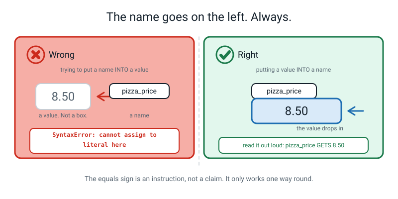
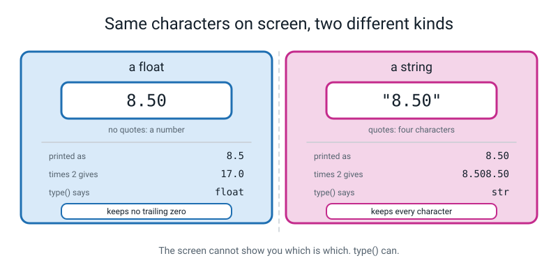
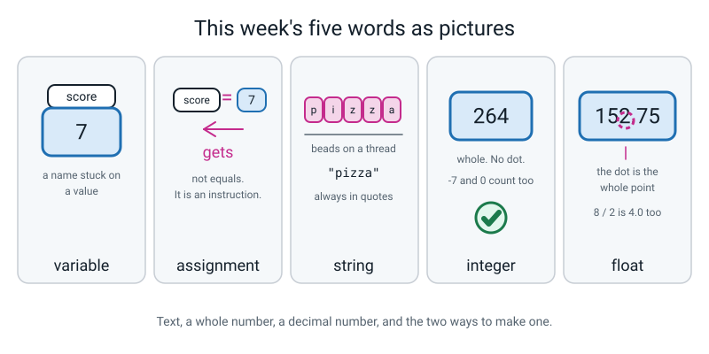

# Week 2 — Boxes With Names On: Variables and Types

[⬅ Week 1](week-01.md) · [Course Home](../README.md) · [Next ➡](week-03.md) · [Workbook](../workbook/week-02.md)

---

> ### This week in one sentence
> **A variable is a named box holding one value, and the value's type decides what `+` even means.**
>
> **By the end of this chapter you will be able to:**
> - Store a value in a **well-named variable** and reuse it later without retyping it
> - Name the **type** of any value using `type()`, and say what each of the four kinds is for
> - **Predict whether `+` will add or glue**, given the types of the things on either side
> - Convert deliberately between text and numbers with `int()` and `float()`, and read the **`TypeError`** that appears when you don't
>
> **New syntax:** `name = value` · `type(x)` · `int("12")` · `float("3.5")`
>
> **Reading time:** about 25 minutes. **Homework:** about 60 minutes.

---

## 🪝 Start Here

Last week, every number you used you had to type out fresh every single time you wanted it.

Suppose you had written a pizza bill. Four lines, and `8.50` appeared in all four of them. Now the shop puts the price up to `9.75`. You go hunting through the file changing `8.50` to `9.75` in four different places — and you miss one.

Everyone misses one. That is not a personal failing; it is what happens to human beings who have to keep four copies of a fact in step.

---

Here is the fix, and it is a cardboard box.

Picture three tubs on a table. The first has a sticky note on the outside reading `pizza_price`. Open it, and inside is a slip of paper with `8.50` written on it.

**That's it. That's a variable.** A name, stuck on the outside of a place where one value lives.

When somebody asks *"what's `pizza_price`?"* you don't guess. You find the box with that label on it, open it, and read what's inside.

Now the shop puts the price up. So I take out the `8.50` slip, **screw it up, and drop it on the floor**, and put a new slip in reading `9.75`.

Same box. Same label. Different thing inside.

And now the question that actually matters: **where is the 8.50?**

It's on the floor. Gone. Nothing anywhere remembers it. **There is no undo.**


*Figure 2.1 — Put a new value in a box and the old one is simply not there any more. This catches absolutely everybody at least once.*

That's half of today. The other half is stranger, and it is about the *slip of paper* rather than the box. Because it turns out that **what kind of thing is written on the slip** changes what the computer is allowed to do with it — and you already met that last week without having a word for it.

`7 * 6` was `42`. `"7" * 6` was `777777`. Today you learn why.

---

## 🧠 The Big Idea

> **📌 About the code in this section.** The blocks below are **illustrations, not files**. They show you the shape of one idea, and each one carries on from the one above it — the `import` lines and the data are typed once, in the first block that needs them. **The complete, runnable file is in 💻 Type This.** If you copy a block from this section on its own and Python says `NameError`, that is why, and nothing is broken.

### 1. A variable is a name stuck on a value

**The plain explanation.**

> **Variable** — a name you attach to a value so you can use the value later without typing it out again.

In Python, making that box looks like this:

```python
pizza_price = 8.50
```

**The analogy.** Look at the picture below very carefully, because which part is which matters:

- The **box** is a place in the computer's memory where one value sits.
- The **name** is a label stuck on the outside so you can find that box again.
- Asking for `pizza_price` means *"open the box with that label on it and give me whatever is in there right now."*


*Figure 2.2 — The name is a label on the outside. The value is what's inside. They are two different things.*

**The concrete version.** Here is a whole file, and it shows both halves — putting a value in, and then putting a different one in.

```python
# boxes.py - one box, two different values in it.

pizza_price = 8.50            # put 8.50 into the box labelled pizza_price
print(pizza_price)            # look inside the box

pizza_price = 9.75            # the shop put the price up
print(pizza_price)            # same label, different contents
```

```text
8.5
9.75
```

**And this is the whole reason variables are worth a lesson: you write the number once.** Change one line, and everything that used the name is instantly right. Last week you'd have changed four lines and missed one.

> **💡 Try this:** notice `8.50` printed as `8.5`. Python did not remember that you typed a trailing zero — it stored the *number*, and the number eight-point-five has no trailing zero. That looks wrong on a price, and it is next week's entire opening problem. It takes one character to fix.

### 2. `=` is not "equals". It is "gets".

**The plain explanation.** Read every assignment out loud, always, as **"pizza_price *gets* 8.50."**

Never "pizza_price equals 8.50".

That habit matters far more than it sounds, because `=` in Python is **not** the equals sign from maths class.

| | In maths | In Python |
|---|---|---|
| What it is | A **claim** about the world | An **instruction**: put the right into the left |
| Which way round | Both. `x = 5` and `5 = x` say the same | **One** way only. The name goes left |

> **Assignment** — putting a value into a name, with `=`. Read it as "gets".

**The analogy.** `=` is not a pair of scales balancing. It is an arrow pointing left: *fetch the thing on the right, drop it in the box named on the left.*

**The concrete version.** Write it the other way round and Python refuses, in words:


*Figure 2.3 — You cannot put something *into* the number 8.50. That isn't a box, it's a value.*

```python
8.50 = pizza_price
```

```text
  File "/Users/you/ai-academy/level2/oops.py", line 1
    8.50 = pizza_price
    ^^^^
SyntaxError: cannot assign to literal here. Maybe you meant '==' instead of '='?
```

Read the last line: *"you can't put something into the number 8.50."*

**Naming.** There are rules Python enforces, and rules only humans care about. Both matter.

| Python enforces this | Good | Bad, and what happens |
|---|---|---|
| Start with a letter or `_` | `score2` | `2score` → `SyntaxError: invalid decimal literal` |
| Letters, digits and `_` only | `top_score` | `top score` → `SyntaxError: invalid syntax` |
| Capitals matter | `score` and `Score` are two **different boxes** | assuming they're the same → `NameError` |
| Not one of Python's own words | `class_size` | `class = 30` → `SyntaxError: invalid syntax` |

Only humans care about these three, and they matter enormously anyway: **`snake_case`** (all lowercase, words joined with underscores — `pizza_price`, not `PizzaPrice` and definitely not `pp`); **say what the thing *is***, not what type it is (`slice_count`, never `num1`); and **a name is a promise** — if you call something `total`, it had better be a total.

> **⚠️ Watch out:** `x`, `data2` and `thing` are all perfectly legal names and all three are bad. **In two weeks you will be a stranger reading your own file. Name things for that stranger.**

### 3. Four kinds of value, and `type()` is the torch

**The plain explanation.** Every value in Python has a **kind**, and the kind decides what the operators mean.

> **Type** — the kind of thing a value is, which decides what you are allowed to do with it and what the operators mean.

Four kinds is all you need. Plain English first, Python's abbreviation second.

| Plain English | Python name | Holds | Examples |
|---|---|---|---|
| Text | `str` (short for **string**) | Characters, always in quotes | `"pizza"`, `"264"`, `""` |
| Whole number | `int` (short for **integer**) | Whole numbers, no quotes, no dot | `264`, `0`, `-7` |
| Decimal number | `float` | Numbers with a decimal point | `152.75`, `8.5`, `-0.25` |
| Yes-or-no | `bool` | Exactly two possible values | `True`, `False` |

> **String** — a piece of text. Called a string because it is a *string of characters*, threaded like beads.
> **Integer** — a whole number, no fractional part. `-7` is an integer: it means *whole*, not *positive*.
> **Float** — a number with a decimal point. That dot is the only difference between a float and an int.


*Figure 2.4 — Text is a row of characters. A whole number has no dot. A decimal number has one, and the dot is the whole point.*

**The analogy.** Imagine four differently-shaped holes in a toy: a square, a circle, a triangle, a slot. The *shape* of the block decides which hole it fits and what happens when you push it. Python's types are the shapes.

**The concrete version.** You never have to guess which kind you're holding, because there is an instruction that tells you. It's called `type` and you use it exactly like `print`.

```python
# types_tour.py - what kind of thing is each value?

player = "Rohit"                        # text, so it goes in quotes
print(player, type(player))             # print the value, then its type

runs = 264                              # a whole number, no quotes, no dot
print(runs, type(runs))

strike_rate = 152.75                    # a number with a decimal point
print(strike_rate, type(strike_rate))

is_captain = False                      # one of exactly two values
print(is_captain, type(is_captain))
```

```text
Rohit <class 'str'>
264 <class 'int'>
152.75 <class 'float'>
False <class 'bool'>
```

**Read `<class 'str'>` as "this is a string."** The word `class` is Python's general word for "kind of thing" and it is completely safe to ignore this year.

Now the pair to look at hardest. Two lines, almost identical:

```python
print(8.50, type(8.50))
print("8.50", type("8.50"))
```

```text
8.5 <class 'float'>
8.50 <class 'str'>
```

**Same four characters in the file. Completely different kinds of thing.** And look what else happened: the float **lost** its trailing zero and the string **kept** it. That is the single best illustration of the week.

> **⚠️ Watch out:** you cannot tell types apart by looking at the screen. Two things can print identically and behave completely differently. **`type()` is the only torch you have.** Don't argue with Python about what type something is — ask it.

### 4. What `+` actually does depends on both sides

**The plain explanation.** `+` does two entirely different jobs depending on what is on either side of it.

```python
print(5 + 5)          # two numbers  -> arithmetic
print("5" + "5")      # two strings  -> glue them together
```

```text
10
55
```

**The analogy.** `+` between two numbers is a calculator. `+` between two pieces of text is a glue stick. It's the same symbol wearing two different hats, and what decides the hat is the **type** of what's on each side.


*Figure 2.5 — Two numbers: it adds. Two texts: it glues. One of each: it stops.*

**The concrete version — and this is the centre of the whole week.** What happens if you mix them?

```python
# collision.py
print("5" + 5)
```

```text
Traceback (most recent call last):
  File "/Users/you/ai-academy/level2/collision.py", line 2, in <module>
    print("5" + 5)
TypeError: can only concatenate str (not "int") to str
```

> **TypeError** — "the things on either side don't go together." Right names, wrong kinds of thing.

**Translate that message before you do anything else.** "Concatenate" is a big word for "glue end to end". So it is saying: *"the glue job only works on text, and you handed me a number."*

**Now the question that matters. Why didn't Python just sort it out?** It's obviously five and five.

Because there are **two** obvious answers and they are miles apart:

- Did you want `10`? Treat the text `"5"` as a number and add.
- Did you want `"55"`? Treat the number `5` as text and glue.

Both are completely reasonable. Python has no way to know which you meant. So instead of picking one and being wrong half the time, **it stops and makes you say.**


*Figure 2.6 — Both answers were available. That is exactly why Python would not choose for you.*

Some other languages *do* guess. Here is what that costs. A shop's website stores a jumper's price as text, `"100"`, and the delivery charge as a number, `50`. The language quietly glues them, and the customer's total comes out as **10050** instead of **150**. Nothing crashes. No red text. The page looks completely normal, and the first person to find out is somebody's parent staring at a bank statement three weeks later.

> **A crash is a bug you find in four seconds. A guess is a bug you find in four weeks.**

That sentence is the real lesson of Week 2. The error message is **good news**.

### 5. Converting on purpose: `int()` and `float()`

**The plain explanation.** You mend the collision by saying which of the two answers you meant.

```python
# two_fixes.py - the same collision, mended two different ways.

print(int("5") + 5)      # make the text into a number, THEN add
print("5" + "5")         # make both sides text, THEN glue
```

```text
10
55
```

**Two fixes. Two different right answers. And *you* chose which.** Python didn't take a decision away from you — it handed one to you.

> **Converting** — turning a value of one kind into an equivalent value of another kind, deliberately.

**The analogy.** `int()` and `float()` are doorways, not disguises. Something walks through and comes out genuinely changed.

**The concrete version.**

```python
# convert.py - swapping a value from one type into another on purpose.

print(int("12"))         # text "12" -> the number 12
print(float("3.5"))      # text "3.5" -> the number 3.5
print(float(12))         # whole number 12 -> 12.0
print(int(3.9))          # 3.9 -> 3   (it CHOPS, it does not round)
print(type(int("12")))   # proof it really is an int now
```

```text
12
3.5
12.0
3
<class 'int'>
```

**Three things to hold on to, all of which will trip you up once.**

**`int(3.9)` is `3`, not `4`.** `int()` **chops off** everything after the point; it does not round. If you expected `4`, that is a completely reasonable expectation — but `int()` does "take the whole-number part", not "find the nearest whole number". The proper rounding tool arrives in Week 4.

**`int("3.5")` fails**, and so does **`int("twelve")`**, both with the same error type:

```text
ValueError: invalid literal for int() with base 10: '3.5'
ValueError: invalid literal for int() with base 10: 'twelve'
```

`int()` will only accept text that spells out a *whole* number. For `"3.5"`, use `float("3.5")` instead, and it works.

> **TypeError vs ValueError** — this is the distinction most likely to catch you out.
>
> **`"5" + 5` is a TypeError**: the *kinds themselves* don't go together.
>
> **`int("twelve")` is a ValueError**: you gave `int()` the right *kind* of thing (text), but that particular *value* is impossible to convert.
>
> One line: **ValueError means right kind, impossible value. TypeError means wrong kind entirely.**

---

## 💻 Type This

One file, built in five steps. Type it — no pasting, all year.

### Step 1 — make the file and put one value in a box

New file, **Save As** `types_tour.py`.

```python
# types_tour.py - what kind of thing is each value?

player = "Rohit"                        # text, so it goes in quotes
print(player, type(player))             # print the value, then its type
```

| Line | What it does |
|---|---|
| 3 | `player` **gets** the text `"Rohit"`. Say it out loud as "gets". |
| 4 | Prints **two** things with a comma between them: what's in the box, then what kind of thing that is. |

Save. Run.

```bash
python3 types_tour.py
```

```text
Rohit <class 'str'>
```

### Step 2 — add a whole number

*Add this to the file you started in Step 1:*

```python
runs = 264                              # a whole number, no quotes, no dot
print(runs, type(runs))
```

```text
Rohit <class 'str'>
264 <class 'int'>
```

**Predict before you run.** Did you say `int`? No quotes, no dot, so it is a whole number.

### Step 3 — add a decimal, and a yes-or-no

*Add this to the same file:*

```python
strike_rate = 152.75                    # a number with a decimal point
print(strike_rate, type(strike_rate))

is_captain = False                      # one of exactly two values
print(is_captain, type(is_captain))
```

```text
Rohit <class 'str'>
264 <class 'int'>
152.75 <class 'float'>
False <class 'bool'>
```

Four values. Four kinds. Python told you each one without you having to guess.

> **⚠️ Watch out:** `False` has a **capital F**. Lowercase `false` gives `NameError: name 'false' is not defined. Did you mean: 'False'?` — because to Python, `false` is just a name it has never heard of.

### Step 4 — break it with a capital letter

*Change line 4 only,* from `print(player, type(player))` to `print(Player, type(player))` — capital P on the first one.

```text
Traceback (most recent call last):
  File "/Users/you/ai-academy/level2/types_tour.py", line 4, in <module>
    print(Player, type(player))
NameError: name 'Player' is not defined. Did you mean: 'player'?
```

**Read the last line. Now: is that a spelling mistake?**

Every letter is correct. The only thing wrong is that one of them is a **capital**. To Python, `Player` and `player` are two completely different names — two completely different boxes, and only one of them exists.

This is the single most annoying error in programming, because **your eyes read the word, not the letters**, and a capital P is basically invisible when you're hunting for a typo.

> **💡 Try this:** the only reliable way to find it is to read the name out loud **one character at a time**, saying "capital" where there is one. *"Capital-P, l, a, y, e, r."* Saying "capital" out loud is what makes you see it.

Fix it. Run. Bug Log row.

### Step 5 — the collision, and both fixes

*Add these two lines at the bottom of the same file:*

```python
print("5" + "5")
print("5" + 5)
```

```text
...
False <class 'bool'>
55
Traceback (most recent call last):
  File "/Users/you/ai-academy/level2/types_tour.py", line 15, in <module>
    print("5" + 5)
TypeError: can only concatenate str (not "int") to str
```

**Two things happened.** `"5" + "5"` printed `55` — right there above the red. Two texts, glued. Then `"5" + 5` stopped the program.

Now mend it, **both ways**:

```python
print(int("5") + 5)      # make the text into a number, THEN add
print("5" + "5")         # make both sides text, THEN glue
```

```text
10
55
```

Bug Log row — and this one gets **both** fixes written in the third column, because both are correct and choosing between them was your job.

### The finished file

```python
# types_tour.py - what kind of thing is each value?

player = "Rohit"                        # text, so it goes in quotes
print(player, type(player))             # print the value, then its type

runs = 264                              # a whole number, no quotes, no dot
print(runs, type(runs))

strike_rate = 152.75                    # a number with a decimal point
print(strike_rate, type(strike_rate))

is_captain = False                      # one of exactly two values
print(is_captain, type(is_captain))

print("5" + "5")                        # two texts, so + glues:  55
print(int("5") + 5)                     # text made into a number: 10
```

```text
Rohit <class 'str'>
264 <class 'int'>
152.75 <class 'float'>
False <class 'bool'>
55
10
```

---

## 🔍 Worked Examples

### Worked Example 1 — One lunch, in named boxes (food)

Every number appears exactly once. That is the discipline of the week.

```python
# lunchbox.py - one lunch, in named boxes.

sandwich_price = 2.50        # pounds for one sandwich
apple_price = 0.25           # pounds for one apple
apples = 2                   # how many apples I take
days = 5                     # days I do this in a week

daily_cost = sandwich_price + apple_price * apples   # one day's lunch
weekly_cost = daily_cost * days                      # a whole week

print("One day :", daily_cost)
print("One week:", weekly_cost)
print("Type of daily_cost:", type(daily_cost))
print("Type of days      :", type(days))
```

```text
One day : 3.0
One week: 15.0
Type of daily_cost: <class 'float'>
Type of days      : <class 'int'>
```

**Two things worth stopping on.** `daily_cost` came out as `3.0` — a **float** — even though three pounds is a whole number of pounds. Because one of the things in the sum was a float, and **whenever a float touches an int in arithmetic, the answer is a float.** And `apple_price * apples` happened **before** the `+`, exactly as in maths class.

**The payoff test.** Change `days` from 5 to 4. How many lines did you edit? **One.** Two printed figures changed:

```text
One day : 3.0
One week: 12.0
```

### Worked Example 2 — One player's season (sport)

This one shows all four kinds in one file.

```python
# batting.py - one player's season, in named boxes.

player = "Meera"             # text, so it goes in quotes
runs = 264                   # a whole number
matches = 8                  # a whole number
strike_rate = 152.75         # a number with a decimal point
is_captain = False           # one of exactly two values

average = runs / matches     # runs divided by matches

print(player, "played", matches, "matches")
print("Runs   :", runs)
print("Average:", average)
print("Types  :", type(player), type(runs), type(strike_rate), type(is_captain))
print("Type of average:", type(average))
```

```text
Meera played 8 matches
Runs   : 264
Average: 33.0
Types  : <class 'str'> <class 'int'> <class 'float'> <class 'bool'>
Type of average: <class 'float'>
```

**`264 / 8` is exactly 33, and it still came out as `33.0`, a float** — because **`/` always gives a float**, whether the answer needed one or not. That is last week's "the slash leaves a dot", and now it has a name.

### Worked Example 3 — Three marks that arrived as text (school)

This is the real-world shape of the whole lesson. Numbers typed into a form arrive as **text**, and you have to convert them at the door.

```python
# marks.py - three marks that arrived as text, turned into numbers.

maths_text = "78"            # text, exactly as it came off a form
science_text = "84"          # text again
english_text = "71"          # and again

print("What I was handed:", maths_text, type(maths_text))

maths = int(maths_text)      # text -> whole number
science = int(science_text)
english = int(english_text)

print("After converting :", maths, type(maths))

total = maths + science + english        # now + really adds
average = total / 3                      # three subjects

print("Total  :", total)
print("Average:", average)
print("Glued instead of added:", maths_text + science_text + english_text)
```

```text
What I was handed: 78 <class 'str'>
After converting : 78 <class 'int'>
Total  : 233
Average: 77.66666666666667
Glued instead of added: 788471
```

**Look at the first two lines of output.** They print the *same characters*, `78`. Only the type differs. The screen cannot tell you which is which; `type()` can.

**And look at the last line.** `"78" + "84" + "71"` is `788471`. Not a total, not close to one — and **nothing crashed**, because three strings glue together perfectly happily. Python refuses the *mixed* case because it is guessable, and lets three strings through because you might genuinely have meant to glue text.

> **💡 Try this:** the ugly `77.66666666666667` will bother you. It should. Making that print as `77.67` is next week, and it takes three characters.

---

## 🐞 When It Breaks

Every message came from really running a broken version of this week's code.

### Break 1 — the mixed `+`

```python
print("5" + 5)
```

```text
Traceback (most recent call last):
  File "/Users/you/ai-academy/level2/oops.py", line 1, in <module>
    print("5" + 5)
TypeError: can only concatenate str (not "int") to str
```

**What Python is telling you.** *"The glue-things-together job only works on text, and you gave me a number."*

**The fix — and there are two, and you must choose.** `int("5") + 5` gives `10`. `"5" + "5"` gives `55`. Which one is right depends entirely on what you were trying to do, and Python cannot know that.

> **🐞 If you see this error:** put `print(type(...))` on the line *above* the broken one, with each side inside it. This is the single most useful debugging move in the whole language. If a `TypeError` says something is a `str` and you are certain it's a number, `type()` settles the argument in four seconds.

### Break 2 — the invisible capital letter

```python
pizza_price = 8.50
print(Pizza_price)
```

```text
Traceback (most recent call last):
  File "/Users/you/ai-academy/level2/oops.py", line 2, in <module>
    print(Pizza_price)
NameError: name 'Pizza_price' is not defined. Did you mean: 'pizza_price'?
```

**What Python is telling you.** *"I've never heard of that name."* Which is true — `Pizza_price` and `pizza_price` are different boxes, and only one of them was ever filled.

**The fix.** Match the case exactly. Read the name aloud one character at a time to spot it.

### Break 3 — used before it exists

```python
print(total)
total = 17.0
```

```text
Traceback (most recent call last):
  File "/Users/you/ai-academy/level2/oops.py", line 1, in <module>
    print(total)
NameError: name 'total' is not defined
```

**What Python is telling you.** Same complaint, completely different cause. **Python runs top to bottom**, so on line 1 the box called `total` genuinely does not exist yet — it gets made on line 2, one instant too late. And there's no `Did you mean:` this time, because there was nothing close enough to guess.

**The fix.** Swap the lines. Assign it *above* the line that uses it.

### The whole clinic, for reference

| What you see | What it means | The fix |
|---|---|---|
| `TypeError: can only concatenate str (not "int") to str` | The glue job only works on text, and you gave me a number | Choose: `int("5") + 5` → `10`, or `"5" + "5"` → `55` |
| `TypeError: unsupported operand type(s) for -: 'str' and 'int'` | You cannot subtract a number from text at all | There is no "glue" version of minus. Convert: `int("5") - 5` |
| `NameError: name 'Pizza_price' is not defined` | A capital letter. Different name, different box | Match the case exactly |
| `NameError: name 'total' is not defined` | You used it **above** the line that assigns it | Move the assignment up |
| `NameError: name 'false' is not defined` | Python's yes/no values are `True` and `False`, capitalised | Capitalise it |
| `ValueError: invalid literal for int() ...: 'twelve'` | Right kind of thing, impossible value | That text genuinely isn't a number. Fix the text |
| `ValueError: invalid literal for int() ...: '3.5'` | Same, and more surprising. `int()` wants a *whole* number | Use `float("3.5")` |
| `SyntaxError: cannot assign to literal here` | You can't put something *into* a number | Swap the sides. The name goes left |
| `SyntaxError: invalid syntax` (caret on the second word) | A space in the name: `pizza price = 8.50` | Join it: `pizza_price` |
| `TypeError: 'int' object is not callable` | You asked me to run something that isn't a machine | You named a variable `print`. Never reuse Python's names |

---

## 🎲 What We Did In Class

### The three tubs

Three tubs on a table, a pad of sticky notes, and slips of paper.

1. A note reading `pizza_price` on tub one, a slip reading `8.50` inside. The note is the **name**; the slip is the **value**.
2. The `8.50` slip taken out, screwed up, dropped; `9.75` put in. *Where's the 8.50?* **Gone. Nothing remembers it.**
3. The note **peeled off** tub one and pressed onto empty tub two. The name isn't the box — it's a label, and labels move.

Then the game, **"What's In The Box?"** — a sequence of moves narrated as lines of Python:

| The move, said out loud | What's in each box afterwards |
|---|---|
| "a gets 5" | `a` = 5 |
| "b gets 3" | `a` = 5, `b` = 3 |
| "a gets b" | `a` = **3**, `b` = 3 — *and where's the 5?* Gone. |
| "b gets 10" | `a` = **3**, `b` = 10 — *did `a` change? Why not?* |

**That last row is the subtle one and it catches adults.** `a gets b` copied the **value** that was in `b` at that moment. It did **not** tie the two boxes together, so changing `b` afterwards leaves `a` alone. (There is a runnable proof of this in Trick 4 below.)

### At the keyboard

1. `types_tour.py` typed line by line, with the **type predicted out loud** before every run.
2. The capital-letter bug planted on line 4: `NameError: name 'Player' is not defined`.
3. `"5" + "5"` then `"5" + 5`. The `TypeError` read out loud, translated, then mended both ways.
4. `pocket_money.py` from scratch: three named boxes of your own numbers, two computed values, one `type()`, **no number typed twice.**
5. The type quiz (twelve values, guessed on paper first) and the conversion drills, including two deliberate `ValueError`s.

Here is the finished `pocket_money.py` to compare against:

```python
# pocket_money.py - one week of pocket money, stored in named boxes.

weekly_money = 5.50               # pounds I get each week
weeks_saved = 6                   # how many weeks I have been saving
spent = 12.75                     # pounds I have already spent

saved = weekly_money * weeks_saved    # 5.50 * 6
left = saved - spent                  # what is actually still there

print("Saved so far:", saved)
print("Spent:", spent)
print("Left:", left)
print("Type of saved:", type(saved))
print("Type of weeks_saved:", type(weeks_saved))
```

```text
Saved so far: 33.0
Spent: 12.75
Left: 20.25
Type of saved: <class 'float'>
Type of weeks_saved: <class 'int'>
```

### The type quiz — all twelve

| Value | Type | Prints as | | Value | Type | Prints as |
|---|---|---|---|---|---|---|
| `42` | `int` | `42` | | `8.50` | `float` | `8.5` |
| `42.0` | **`float`** | `42.0` | | `"8.50"` | `str` | `8.50` |
| `"42"` | `str` | `42` | | `-7` | `int` | `-7` |
| `True` | `bool` | `True` | | `0` | `int` | `0` |
| `4 + 2` | `int` | `6` | | `""` | `str` | *(nothing)* |
| `4 / 2` | **`float`** | `2.0` | | `"4" * 2` | **`str`** | `44` |

**The four that catch almost everyone.** `42.0` is a **float** — the `.0` is not decoration, it changes the kind. `4 / 2` is `2.0`, a **float**, because division always leaves a decimal point. `"4" * 2` is `"44"`, a **string** — last week's `"7" * 6` all over again. And `8.50` prints as `8.5` while `"8.50"` prints as `8.50`: **the string keeps the trailing zero and the number doesn't.**

---

## 💬 Talk About It

**1. "Why can't Python just work out that `"5" + 5` means ten?"**

*Hint:* because it doesn't necessarily mean ten. It might mean `"55"`. Think about which is worse for a shop: a website that crashes on the checkout page, or a website that quietly charges somebody £10,050. Then ask which of those two you find out about faster.

**2. "What's the difference between `8.5` and `"8.5"` if they look the same on screen?"**

*Hint:* everything, and the screen is lying to you. Try halving each of them. One works and one gives a `TypeError`. Then ask: is there **anything** you can put on a screen that would let a person tell them apart? (There isn't. That's why `type()` exists.)

**3. "Which is the right kind for money — `int` or `float`?"** *(Nobody fully agrees, and that's the point.)*

*Hint:* three camps, all used by real professionals. **Float** — 8.50 is obviously a decimal, and for a pizza order it's fine. **Whole pence** — store `850`, not `8.50`, and divide by 100 only when printing, because tiny inexactnesses add up and being three pence out is a very serious problem in a bank. **A special decimal type** built exactly for this, slower and fiddlier. What is *not* in dispute: pick one, write down which, and never let one half of a program think in pounds while the other half thinks in pence. We use floats this year because our sums are small — and now you know what we're choosing not to worry about.

---

## ⚠️ Don't Get Tricked

### Trick 1 — "`=` means equals"


*Figure 2.7 — The wrong side and the right side. `=` is an instruction, not a claim.*

| ❌ Wrong | ✅ Right |
|---|---|
| `8.50 = pizza_price` — "these two are equal, so either order is fine." | `pizza_price = 8.50` — "pizza_price **gets** 8.50. The name goes on the left." |

The cure is not an explanation, it's a habit: **read every `=` out loud as "gets"**, every time, for about four repetitions. Then it sticks for good.

### Trick 2 — "the quotes are just tidiness"


*Figure 2.8 — Identical in the file. Completely different in behaviour.*

| ❌ Wrong | ✅ Right |
|---|---|
| "`8.50` and `"8.50"` are the same thing written two ways." | "One's a `float` and one's a `str`. Double the float and you get `17.0`; double the string and you get `8.508.50`." |

### Trick 3 — "`int()` rounds"

| ❌ Wrong | ✅ Right |
|---|---|
| `int(3.9)` is `4`, because 3.9 is nearly 4. | `int(3.9)` is `3`. It **chops off** everything after the point. Proper rounding is `round()`, and that's Week 4. |

`int(-3.9)` is `-3`, by the way — chopping, not rounding, in both directions.

### Trick 4 — "assigning one box to another ties them together"

| ❌ Wrong | ✅ Right |
|---|---|
| After `b = a`, changing `a` changes `b` too, because they're linked. | `b = a` copied the **value that was in `a` at that instant**. Nothing is linked. Change `a` afterwards and `b` doesn't move. |

```python
a = 5
b = a
a = 9
print(a, b)
```

```text
9 5
```

---

## 🌍 Where You've Seen This

1. **Every form you have ever filled in on a website.** Your age goes into a box, typed as characters. Somewhere behind the page, a programmer had to turn `"12"` into `12` before anything could be added to it. That conversion is exactly `int(input(...))` — which is Week 4.
2. **A spreadsheet cell showing `#VALUE!`.** That is a `TypeError` in a suit. You put text where a formula wanted a number, and the spreadsheet refused rather than guessing.
3. **Phone numbers stored as text on purpose.** A phone number looks like a number and must never be treated as one — the leading zero matters, and you'd never add two together. `"0771..."` keeps the zero; `0771...` as a number would lose it.
4. **A shopping site showing `£8.5`.** Somebody stored a float and printed it raw. Next week you'll know how to fix that in three characters.
5. **Autocorrect changing a name.** A box got the wrong value put in it and the old one is gone with no undo. Same box, new slip.
6. **The settings screen on any app.** Every switch is a `bool`, every text field a `str`, every "how many minutes?" an `int` — and somebody had to name all those boxes.

---

## 🔑 Remember This

- **A variable is a name stuck on a value.** The name is the label; the value is what's inside. Two different things.
- **Read `=` as "gets", never "equals".** It's an instruction, and it only works one way round: name on the left.
- **Assign again and the old value is gone.** No undo. Nothing anywhere remembers it.
- **Every value has a type**, and the type decides what the operators mean. Four kinds: `str`, `int`, `float`, `bool`.
- **You cannot see a type. You can only see characters.** `type()` is the only torch.
- **`+` adds numbers and glues text. Mix them and Python stops** — because both answers were possible and it will not choose for you.
- **A crash is a bug you find in four seconds. A guess is a bug you find in four weeks.**
- **`/` always gives a float**, and a float touching an int in a sum always gives a float.

### Syntax reminder card

```python
pizza_price = 8.50          # pizza_price GETS 8.50   (name on the LEFT)
pizza_price = 9.75          # same box, new value. The 8.50 is gone for good.

print(type(8.50))           # <class 'float'>   a number with a dot
print(type(264))            # <class 'int'>     a whole number
print(type("pizza"))        # <class 'str'>     text, always in quotes
print(type(False))          # <class 'bool'>    True or False, capitalised

print(5 + 5)                # 10   two numbers -> add
print("5" + "5")            # 55   two texts   -> glue
# print("5" + 5)            # TypeError: it will not guess which you meant

print(int("12"))            # 12    text -> whole number
print(float("3.5"))         # 3.5   text -> decimal number
print(int(3.9))             # 3     CHOPS. Does not round.
```

---

## 📓 New Words


*Figure 2.9 — This week's five words, drawn.*

| Word | What it means | Example |
|---|---|---|
| **variable** | A name attached to a value, so you can use the value later without typing it again | `pizza_price = 8.50`, then `print(pizza_price)` |
| **assignment** | Putting a value into a name, with `=`. Read it as "gets" | `runs = 264` is "runs gets 264" |
| **string** (`str`) | A piece of text — a string of characters, always in quotes | `"Rohit"`, `"264"`, `"8.50"`, `""` |
| **integer** (`int`) | A whole number, with no decimal point. Can be negative | `264`, `0`, `-7` |
| **float** | A number with a decimal point. The dot is the whole point | `152.75`, `8.5`, `2.0` (from `4 / 2`) |

---

## 📤 Your Homework

Go to **[the Week 2 workbook](../workbook/week-02.md)**. About **60 minutes** in total.

| Section | What to do | Time |
|---|---|---|
| **Warm-Up** | Five quick questions from Week 1 | 5 min |
| **Predict the Output** | Four snippets. Guess **before** you run | 10 min |
| **Practice A & B** | Six reading questions on names and types, then five you write yourself | 20 min |
| **Fix the Broken Program** | A tuck-shop bill with three planted bugs and their real error messages | 10 min |
| **Build It** | The `"5" + 5` write-up, plus `my_kit.py` with no number typed twice | 15 min |

**The write-up is the part I actually care about.** Three things have to be in it. **What Python refused to do**, with the exact last line of the error copied character for character. **Why refusing is safer than guessing** — and for that one I want a *consequence*, something that goes wrong in the world, not just "it might be wrong". And **both correct answers**, with the line of code that produces each, plus one sentence on which you'd want if this were a real shopping bill.

Five or six sentences. Worth more than all the exercises put together, because if you can explain why an error message is good news you will never be frightened of one again.

> **💡 Try this:** before you start the exercises, go back to your Week 1 files and **rename every value into a well-named variable**, so no number is typed twice. Then change one price and count how many lines you had to edit. It should be one. That ten-minute job is the most convincing argument for variables there is, and no amount of reading replaces it.

---

[⬅ Week 1](week-01.md) · [Course Home](../README.md) · [Week 3 ➡](week-03.md) · [📓 Workbook — Week 2](../workbook/week-02.md) · [Glossary](../../glossary.md)
