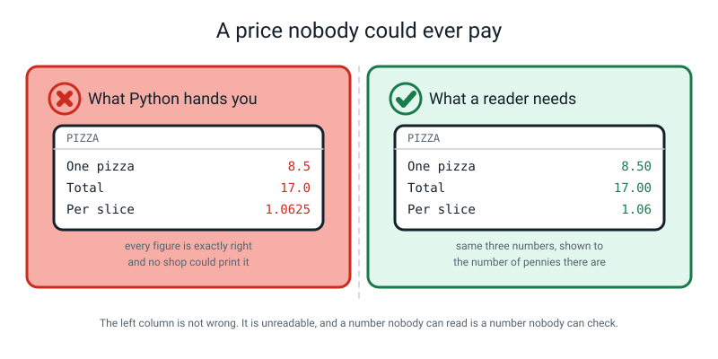
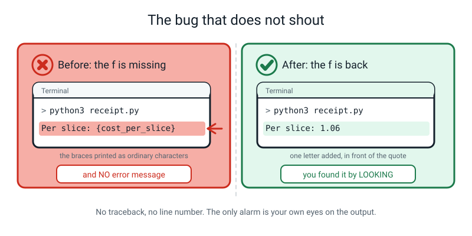
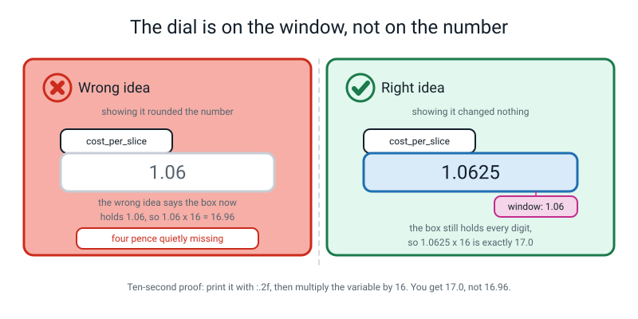
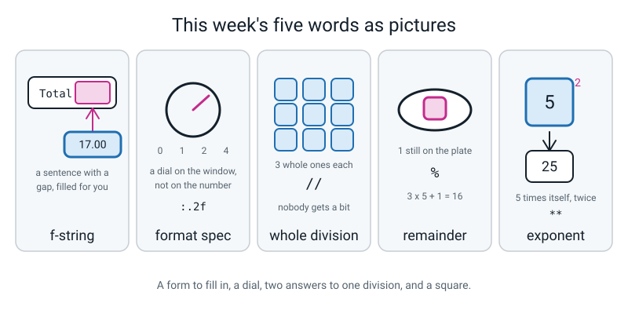

# Week 3 — Printing Like a Pro: f-strings and Real Maths

[⬅ Week 2](week-02.md) · [Course Home](../README.md) · [Next ➡](week-04.md) · [Workbook](../workbook/week-03.md)

---

> ### This week in one sentence
> **An f-string drops a value straight into a sentence, and `:.2f` decides how many decimals a reader gets to see.**
>
> **By the end of this chapter you will be able to:**
> - Build a sentence with an **f-string** instead of gluing pieces together with `+` or commas
> - Control **how many decimal places** are shown, with a format specifier
> - Use **`//` and `%`** to answer "how many whole ones, and how many left over?"
> - Explain why a **money figure must show exactly two decimal places**
> - Build **`receipt.py`** end to end, so that it runs and reads correctly out loud
>
> **New syntax:** `f"..."` · `f"{x:.2f}"` · `//` and `%` · `**`
>
> **Reading time:** about 25 minutes. **Homework:** about 60 minutes.

---

## 🪝 Start Here

Go and find a real till receipt. A drawer, a coat pocket, the bottom of a shopping bag. Any one will do.

Now read the last two digits of every price on it.

`.99` · `.50` · `.00` · `.25`

**Every single one has two digits after the dot.** Even the ones that are whole pounds — look, there's one that is three pounds exactly and the shop has still printed `3.00`.

Why bother? Why not just print `3`?

The first answers people give are "it looks neater" and "so the column lines up", and both are true. But there is a better reason underneath, and it is the reason this week exists.

> **A price is not really a decimal number. It is a whole number of pennies.**

Three pounds is three hundred pennies. And three hundred pennies, written in pounds, is `3.00`. Writing `3.0` stops at tenths of a pound (ten-pence steps), so it cannot show the pennies at all. Writing `3` doesn't mention pennies either.

So two decimal places on money is not decoration. It is the number of pennies, and it is how you show that you know what you are counting.

---

Now. Last week, you printed a price.

```python
print(8.50)
```

```text
8.5
```

Eight pounds fifty, and Python printed `8.5`. Would you accept that on a receipt?

No. Neither would I. And it gets worse.

```python
print(17.0 / 16)
```

```text
1.0625
```

That is the cost of one slice of pizza, if two pizzas cost seventeen pounds and each is cut into eight slices. One pound and six hundred and twenty-five ten-thousandths of a pound.

**Nobody has ever paid that.** You couldn't. It does not exist as an amount of money.


*Figure 3.1 — Same three numbers, twice. Only one of them is a receipt.*

And here is the part I actually want you to notice. **That number is not wrong.** It is exactly right. It is the honest answer to the division. The problem is that it is **unreadable** — and a number nobody can read is a number nobody can check.

Today you get two things that fix that, and then two more that answer the question a pizza actually raises at the table: *how many whole slices does everybody get, and how many are left over?*

---

## 🧠 The Big Idea

> **📌 About the code in this section.** The blocks below are **illustrations, not files**. They show you the shape of one idea, and each one carries on from the one above it — the `import` lines and the data are typed once, in the first block that needs them. **The complete, runnable file is in 💻 Type This.** If you copy a block from this section on its own and Python says `NameError`, that is why, and nothing is broken.

### 1. An f-string is a fill-in-the-blanks form

**The plain explanation.** Last week, printing a sentence with a value in it meant commas:

```python
total = 17.0
print("Total:", total)
```

```text
Total: 17.0
```

That works, and it has two annoyances that get worse fast. You cannot control the spacing — the comma always puts exactly one space, whether you wanted one or not. And you cannot control how the number *looks*.

Here is the better way, and it turns on **one letter**.

> **f-string** — a piece of text with an `f` in front of the opening quote, where anything inside `{curly braces}` gets replaced by the value of whatever is in the braces.

```python
name = "Ramana"
runs = 347
matches = 9
print(f"{name} scored {runs} runs in {matches} matches.")
```

```text
Ramana scored 347 runs in 9 matches.
```

**The analogy.** It is a **fill-in-the-blanks form**. You write the sentence once, with gaps in it. Python goes and finds the box with each name on it and drops the value into its gap. Change a variable, run again, and the sentence fills itself in with the new value.


*Figure 3.2 — Write the sentence once with blanks. Python fills the blanks from the boxes.*

**The concrete version.** Take the line apart. There are four things in it and every one is doing a job.

| Piece | What it is | The rule |
|---|---|---|
| `f` | The letter that turns quotes into a **form** | Goes immediately before the opening quote. No space. |
| `"` and `"` | Ordinary quote marks | Same as always. They must match. |
| `{` and `}` | A **gap** — "fetch the value of what's in here" | Braces come in pairs, like quotes and brackets. |
| `name` | A real variable name, inside the braces | The braces do **not** protect you. Misspell it and you get a `NameError`. |

> **💡 Try this:** say the letter out loud as you type it. *"Eff, quote."* It sounds ridiculous. Do it anyway, for three weeks, and you will never lose the letter again — and in a minute you'll see exactly why losing it is worse than you think.

### 2. Forget the `f` and nothing shouts at you

**The plain explanation.** This is the most important thing in the chapter, so it gets its own section.

Watch what happens when the `f` is missing.

```python
runs = 347
matches = 9
print("Average: {runs / matches}")
```

```text
Average: {runs / matches}
```

**No error. No traceback. No red text.**

Python printed the curly braces. As characters. Because without the `f`, that is all they are — two ordinary symbols in the middle of a piece of text. The program ran perfectly and did exactly what you asked, which was *"print these characters."*


*Figure 3.3 — The left-hand program did not crash. That is what makes it dangerous.*

**The analogy.** Every bug you have met so far has been a **smoke alarm**: loud, immediate, and it tells you which room. This one is a **slow leak**. Nothing goes off. The only way you find it is by walking round and looking.

**Why this matters more than it looks.** In Weeks 1 and 2, your method was: *is there red text? Then read the last line.* That method has just stopped being enough.

> **A new first question, and it stays with you for the rest of the year: read your output. Does it make sense?**

Ask that **before** you ask whether there is an error. Three of this week's bugs produce no error at all.

And this is not a beginner's problem you grow out of. In Week 30 you will train a model that reports 97% accuracy, and the only thing standing between you and believing a wrong number will be exactly this habit.

### 3. `:.2f` is a dial on the window, not on the number

**The plain explanation.** Inside the braces you can put a colon and then an instruction about **how to display** the value.

> **Format specifier** — the part after the `:` inside an f-string's braces, which controls how the value is shown. `:.2f` means "show it as a decimal number with exactly two places."

Read `:.2f` out loud as **"dot two eff"**, and unpack it:

| Character | What it means |
|---|---|
| `:` | "Here comes an instruction about how to show this" |
| `.2` | "Two places" |
| `f` | "As a decimal number" |

Three characters, three jobs, and now it is not magic.

```python
cost_per_slice = 1.0625

print(f"Cost per slice: {cost_per_slice}")        # raw
print(f"Cost per slice: {cost_per_slice:.2f}")    # 2 decimal places
print(f"Cost per slice: {cost_per_slice:.1f}")    # 1 decimal place
print(f"Cost per slice: {cost_per_slice:.0f}")    # no decimal places
print(f"Total: {17.0:.2f}")                       # money always gets 2
```

```text
Cost per slice: 1.0625
Cost per slice: 1.06
Cost per slice: 1.1
Cost per slice: 1
Total: 17.00
```

**The analogy.** The number sits in its box, all of it, every digit. `:.2f` is a **dial on the window you look through**. Turning the dial changes what you see. It does not reach inside the box.


*Figure 3.4 — The stored value never changes. `:.2f` is a dial on the window, not on the number.*

**The concrete version — and this is the ten-second proof.** People do not believe the dial story until they see this.

```python
cost_per_slice = 1.0625
print(f"{cost_per_slice:.2f}")
print(cost_per_slice * 16)
```

```text
1.06
17.0
```

**Think about what that second line means.** If `:.2f` had really rounded the number down to `1.06`, then `1.06 × 16` would be **16.96** — you'd have lost four pence. It came out as exactly seventeen.

So the number in the box is still all of `1.0625`. Every digit. **The `:.2f` only changed the window.**

Two more facts you will need:

- **`:.2f` on a whole number works.** `f"{8:.2f}"` gives `8.00`. Handy for money.
- **`:.2f` on *text* fails**, and the wording is unusual: `ValueError: Unknown format code 'f' for object of type 'str'`. Translated: *"you asked me to show this as a decimal number, and it's text."*

> **⚠️ Watch out:** because you are choosing what a reader is allowed to see, you can use this to be **misleading**. Showing somebody `1.06` when the number is really `1.0625` is telling them something very slightly untrue in a helpful way. That is fine, and it is what every receipt in the world does. But it *is* a choice, and in Week 27 we spend a whole lesson on people who make that choice dishonestly.

### 4. `//` and `%` — whole ones, and what's left over

**The plain explanation.** Sixteen slices. Five friends. Deal them out, one at a time, round the table, like cards.

You end up with three on each plate and **one slice still in your hand**.

Those are **two different numbers**, and Python has a separate operator for each.

> **Integer division** (`//`) — divide and throw away the fraction, keeping only the whole part. *"How many whole ones each?"*
>
> **Remainder** (`%`) — what is left over after taking out as many whole ones as you can. *"How many are still on the plate?"*

```python
slices = 16
friends = 5

print(slices / friends)      # true division
print(slices // friends)     # whole ones each
print(slices % friends)      # left over on the plate
```

```text
3.2
3
1
```

**The analogy.** `16 / 5` is `3.2`, and `3.2` is a perfectly correct answer to a question nobody asked. **Show me 0.2 of a slice.** You cannot hand that to a friend. `3` each and `1` on the plate is what actually happens in a room with pizza in it.


*Figure 3.5 — `3.2` slices is not a thing you can hand to a friend. `3` each and `1` on the plate is.*

**The concrete version — and do this check out loud, every time.**

> **whole ones × how many people + leftovers = the total**
>
> `3 × 5 + 1 = 16` ✓

The whole ones times the number of people, plus the leftovers, gets you back to where you started. **Always.** If it doesn't, one of your two numbers is wrong and you now know to go looking.

`%` is called **modulo** if you meet the word elsewhere, but *remainder* is the word to learn, because it is what it means. It answers a whole family of questions:

| Question | The sum | Answer |
|---|---|---|
| How many whole hours in 7325 seconds? | `7325 // 3600` | `2` |
| And how many seconds are left after that? | `7325 % 3600` | `125` |
| How many whole tens in 47? | `47 // 10` | `4` |
| What's the units digit of 47? | `47 % 10` | `7` |
| Is 18 an even number? | `18 % 2` | `0`, so yes |

Here is the hardest sum of the week, in full, because it catches everybody once:

```python
total_seconds = 7325
hours = total_seconds // 3600        # 7325 / 3600 = 2 remainder 125
rest = total_seconds % 3600          # 125 seconds still to account for
minutes = rest // 60                 # 125 / 60 = 2 remainder 5
seconds = rest % 60                  # 5 seconds
print(f"{total_seconds} seconds = {hours} h {minutes} m {seconds} s")
```

```text
7325 seconds = 2 h 2 m 5 s
```

> **⚠️ Watch out:** you must take the remainder **before** the next division. Writing `minutes = total_seconds // 60` gives `122`, not `2`, because it counts *all* the minutes in 7325 seconds — including the 120 already inside the two hours. `%` is what removes them.

> **🐞 If you see this error:** `ZeroDivisionError: integer division or modulo by zero`. Same problem as ordinary division by zero, **different wording**. "Modulo" is the posh name for remainder. Don't let the new words throw you.

### 5. `**` — to the power of

**The plain explanation.** Two stars means "to the power of".

> **Exponent** — how many times a number is multiplied by itself. `5 ** 2` is five squared; `2 ** 3` is two cubed.

```python
print(5 ** 2)
print(2 ** 3)
print(2 ** 10)
print(10 ** 0)
```

```text
25
8
1024
1
```

**The analogy.** One star is "times". Two stars is "times itself, that many times". `2 * 10` is twenty. `2 ** 10` is 2, 4, 8, 16, 32, 64, 128, 256, 512, **1024** — and that number will keep turning up all year, because computers count in twos, which is why memory sizes come in lumps of 1024 (people often still call 1024 bytes a "kilobyte", though strictly a kilobyte is 1000 bytes and 1024 is a *kibibyte*).

**The concrete version — why a pizza lesson needs it.** A pizza is a **circle**, and the area of a circle is π times the radius **squared**. Which means two stars and a `:.2f` settle the "is the big one better value?" argument with arithmetic instead of opinions.

```python
# area_compare.py - is the big pizza actually better value?

small_radius = 15                # cm
big_radius = 20                  # cm
small_price = 8.50               # pounds
big_price = 13.00                # pounds

small_area = 3.14159 * small_radius ** 2
big_area = 3.14159 * big_radius ** 2

print(f"Small: {small_area:.2f} sq cm for {small_price:.2f}")
print(f"Big  : {big_area:.2f} sq cm for {big_price:.2f}")
print(f"Small: {small_area / small_price:.2f} sq cm per pound")
print(f"Big  : {big_area / big_price:.2f} sq cm per pound")
```

```text
Small: 706.86 sq cm for 8.50
Big  : 1256.64 sq cm for 13.00
Small: 83.16 sq cm per pound
Big  : 96.66 sq cm per pound
```

**The big one wins, by about 16%** — and the reason is the `** 2`. Going from 15 cm to 20 cm is only a third bigger *across*, but it is nearly **twice the area**, because area grows with the square. That is a genuinely surprising fact about the world, arrived at with two lines of code.

> **⚠️ Watch out:** `*` and `**` are completely different **and neither one errors**. `3.14159 * r * 2` runs happily and gives `94.2477`, which is not an area of anything. **Count the stars**, then look at the answer and ask whether it is the size you'd expect.

---

## 💻 Type This

One file, `receipt.py`, built in four steps. **Predict the output of every step before you run it.** Type it — no pasting, all year.

### Step 1 — the total

New file, **Save As** `receipt.py`.

```python
# receipt.py - step 1: what did the pizza actually cost?

pizza_price = 8.50                     # price of one pizza, in pounds
pizzas = 2                             # how many we ordered
total = pizza_price * pizzas           # 8.50 * 2

print("Total:", total)                 # comma-separated, the Week 1 way
```

Save. Run.

```bash
python3 receipt.py
```

```text
Total: 17.0
```

**Seventeen point zero. Right number, wrong receipt.** Notice this step uses the Week 1 comma on purpose, so you can feel the difference in a minute.

### Step 2 — cost per slice, and the f-string arrives

*Add this to the file you started in Step 1.* You will need `slices_per_pizza` too, so put it **up with the other inputs** at the top.

```python
slices_per_pizza = 8                   # how many slices the shop cuts each into
```

Then at the bottom:

```python
slices = pizzas * slices_per_pizza     # 2 * 8 = 16
cost_per_slice = total / slices        # 17.0 / 16

print(f"Slices: {slices}")
print(f"Cost per slice: {cost_per_slice}")
```

Say **"eff"** out loud as you type each one. Save, predict, run.

```text
Total: 17.0
Slices: 16
Cost per slice: 1.0625
```

**Two things just happened and both matter.**

First: that sentence came out with **no comma anywhere**. You wrote `Slices: ` and then a gap, and Python filled the gap.

Second: there it is. `1.0625`. The number from the start of the chapter — except now it is *your* number, computed from *your* four inputs. And it is not a price.

### Step 3 — the dial

*Add these two lines to the same file:*

```python
print(f"Cost per slice: {cost_per_slice:.2f}")
print(f"Total: {total:.2f}")
```

```text
Cost per slice: 1.06
Total: 17.00
```

**Now the proof, straight away.** Add one throwaway line at the bottom:

```python
print(cost_per_slice * 16)
```

```text
17.0
```

Not `16.96`. **The number never changed.** Delete that line now; it was only there to prove a point.

Then try the dial at other settings, purely to watch it move. *Three more throwaway lines:*

```python
print(f"{cost_per_slice:.1f}")
print(f"{cost_per_slice:.0f}")
print(f"{cost_per_slice:.4f}")
```

```text
1.1
1
1.0625
```

**Which of those four would you put on a receipt?** `.2f`, because money is a whole number of pennies. `.0f` loses six pence on every slice. `.4f` is completely honest and completely unreadable. Delete these three too.

### Step 4 — whole slices each, and the leftover

*Add `friends = 5` up with the other inputs*, then at the bottom:

```python
each = slices // friends               # 16 // 5 = 3 whole slices each
left_over = slices % friends           # 16 % 5 = 1 slice left on the plate

print(f"Each gets    : {each} slices")
print(f"Left over    : {left_over} slice")
```

```text
Each gets    : 3 slices
Left over    : 1 slice
```

**Do the check out loud.** Three each, five friends — fifteen. Plus the one on the plate. **Sixteen.** Does that match `slices`? Yes. Both numbers are right.

**Now test it.** Change `friends` to 6 and predict *before* running.

```text
Each gets    : 2 slices
Left over    : 4 slice
```

Check: 2 × 6 + 4 = 16 ✓ — **and `4 slice` reads wrong.** English wants "slices" there. You have found a real bug, and fixing it properly needs an `if`, which is Week 5. Write it in the margin and leave it.

Then `friends = 4`:

```text
Each gets    : 4 slices
Left over    : 0 slice
```

Check: 4 × 4 + 0 = 16 ✓ **Zero left over is an answer, not a failure.** It divided perfectly, and `%` told you so by handing you nothing. Set `friends` back to 5.

### The finished file

```python
# receipt.py - a pizza receipt that reads like a real one.

pizza_price = 8.50                      # what one pizza costs, in pounds
pizzas = 2                              # how many pizzas we ordered
slices_per_pizza = 8                    # how many slices the shop cuts each into
friends = 5                             # how many people are sharing

total = pizza_price * pizzas            # 8.50 * 2 = 17.0
slices = pizzas * slices_per_pizza      # 2 * 8 = 16
cost_per_slice = total / slices         # 17.0 / 16 = 1.0625
each = slices // friends                # 16 // 5 = 3 whole slices each
left_over = slices % friends            # 16 % 5 = 1 slice left on the plate

print("----- PIZZA RECEIPT -----")
print(f"Pizzas       : {pizzas} at {pizza_price:.2f} each")
print(f"Total        : {total:.2f}")
print(f"Slices       : {slices}")
print(f"Per slice    : {cost_per_slice:.2f}")
print(f"Sharing      : {friends} friends")
print(f"Each gets    : {each} slices")
print(f"Left over    : {left_over} slice")
print("-------------------------")
```

```text
----- PIZZA RECEIPT -----
Pizzas       : 2 at 8.50 each
Total        : 17.00
Slices       : 16
Per slice    : 1.06
Sharing      : 5 friends
Each gets    : 3 slices
Left over    : 1 slice
-------------------------
```


*Figure 3.6 — Four inputs at the top of the file. Everything else was computed.*

**Now read it out loud**, slowly, as if you were reading a receipt to a customer. Does it sound like a real receipt? That is the actual test — not whether it runs, but whether a person would accept it.

**And one last move, which is the point of the whole file.** Change `pizza_price` to `9.50`. How many lines do you edit?

**One.** And three printed figures change:

```text
----- PIZZA RECEIPT -----
Pizzas       : 2 at 9.50 each
Total        : 19.00
Slices       : 16
Per slice    : 1.19
Sharing      : 5 friends
Each gets    : 3 slices
Left over    : 1 slice
-------------------------
```

One edit. Three numbers. **That** is what naming things is for, and now you can feel it instead of being told it.

---

## 🔍 Worked Examples

### Worked Example 1 — Packing samosas for the school fair (food)

The kitchen made a hundred samosas. Trays hold twelve. How many full trays, and what does one samosa cost to make?

```python
# samosa_trays.py - packing samosas into trays for the school fair.

samosas = 100                          # how many the kitchen made
per_tray = 12                          # how many fit on one tray
cost_of_ingredients = 42.75            # pounds spent on everything

full_trays = samosas // per_tray       # how many trays we can fill completely
loose = samosas % per_tray             # how many are left over on the counter
cost_each = cost_of_ingredients / samosas   # what one samosa cost to make

print("--- SAMOSA STALL ---")
print(f"Made         : {samosas} samosas")
print(f"Per tray     : {per_tray}")
print(f"Full trays   : {full_trays}")
print(f"Loose        : {loose}")
print(f"Cost each    : {cost_each:.2f}")
print(f"Raw cost each: {cost_each}")
```

```text
--- SAMOSA STALL ---
Made         : 100 samosas
Per tray     : 12
Full trays   : 8
Loose        : 4
Cost each    : 0.43
Raw cost each: 0.4275
```

**Three things worth stopping on.**

**The check:** 8 × 12 + 4 = 100 ✓. Eight full trays and four samosas sitting on the counter. Both numbers are useful — the trays go out to the stall, the loose ones tell you whether it's worth opening a ninth tray.

**`Cost each` shows `0.43` and `Raw cost each` shows `0.4275`** — from the *same variable*, on two consecutive lines. That is the dial and the box, printed side by side. Nothing was rounded; one window is narrower than the other.

**`0.43`, not `0.42`.** `0.4275` shown to two places rounds **up**, because the third digit is a 7. `:.2f` does round for display — it just doesn't touch what's in the box.

### Worked Example 2 — A season on a scorecard (sport)

```python
# batting_card.py - one season, printed like a scorecard.

player = "Meera"                       # whose season this is
runs = 347                             # runs scored across the season
matches = 9                            # matches played
balls_faced = 254                      # balls she faced altogether

average = runs / matches               # runs per match, as a true division
whole_runs = runs // matches           # whole runs per match
spare_runs = runs % matches            # runs that do not divide evenly
overs = balls_faced // 6               # 6 balls in an over
spare_balls = balls_faced % 6          # balls left in an unfinished over

print("===== BATTING CARD =====")
print(f"Player  : {player}")
print(f"Matches : {matches}")
print(f"Runs    : {runs}")
print(f"Average : {average:.2f}")
print(f"That is {whole_runs} whole runs a match, with {spare_runs} left over")
print(f"Faced   : {balls_faced} balls = {overs} overs and {spare_balls} balls")
print(f"Raw average: {average}")
```

```text
===== BATTING CARD =====
Player  : Meera
Matches : 9
Runs    : 347
Average : 38.56
That is 38 whole runs a match, with 5 left over
Faced   : 254 balls = 42 overs and 2 balls
Raw average: 38.55555555555556
```

**Look at the last line first.** The raw average is `38.55555555555556` — sixteen digits nobody wants. Every scorecard in the world prints `38.56`, and now you know it takes four characters.

**Two different questions, two different operators, and both are right.** `347 / 9` is `38.56` — that is an average of runs per match, and it is *supposed* to be a fraction, because an average is not a thing you can count. `347 // 9` is `38` with `5` left over — that is not an average, it is an accounting of the actual runs. Check: 38 × 9 + 5 = 347 ✓

**And `254 balls = 42 overs and 2 balls`** is the same pair of operators doing an entirely different job. Check: 42 × 6 + 2 = 254 ✓ Any cricket scorer writes it exactly that way, as `42.2 overs`, and the `.2` there means *two balls*, not two tenths — which is a real thing about the world that `//` and `%` describe perfectly.

### Worked Example 3 — Costing a school trip honestly (school)

Forty-seven students, minibuses that hold nine, and a bill somebody has to actually pay.

```python
# school_trip.py - a trip to the museum, costed honestly.

students = 47                          # how many are actually coming
seats_per_bus = 9                      # seats in one minibus
coach_hire = 180.00                    # pounds to hire the minibuses
tickets_each = 6.25                    # museum ticket price per student

full_buses = students // seats_per_bus     # buses that go out completely full
left_standing = students % seats_per_bus   # students who need one more bus
tickets_total = tickets_each * students    # all the museum tickets
grand_total = coach_hire + tickets_total   # everything the trip costs
cost_each = grand_total / students         # what to ask each family for

print("======= MUSEUM TRIP =======")
print(f"Students     : {students}")
print(f"Full buses   : {full_buses} of {seats_per_bus} seats")
print(f"Still to seat: {left_standing}")
print(f"Tickets      : {tickets_total:.2f}")
print(f"Minibuses    : {coach_hire:.2f}")
print(f"Grand total  : {grand_total:.2f}")
print(f"Each family  : {cost_each:.2f}")
print(f"Raw figure   : {cost_each}")
```

```text
======= MUSEUM TRIP =======
Students     : 47
Full buses   : 5 of 9 seats
Still to seat: 2
Tickets      : 293.75
Minibuses    : 180.00
Grand total  : 473.75
Each family  : 10.08
Raw figure   : 10.079787234042554
```

**The `%` answer is the important one here, and it is only `2`.** Five buses hold forty-five. Two students are left standing on the pavement — so you need a **sixth** bus, for two people. That is exactly the kind of fact `%` is for: it is not a rounding problem, it is a *"somebody is not getting on"* problem, and the number 2 is what tells you.

**`Minibuses : 180.00`.** `coach_hire` is `180.00` in the file and would print as `180.0` without the dial. On a bill sent to forty-seven families, `180.0` looks like a typing mistake. `:.2f` on a whole number is not pointless — it is what makes a column of money look like money.

**And `Each family : 10.08` from a raw `10.079787234042554`.** Ten pounds and eight pence is an amount a parent can hand over. The raw figure is honest and unusable. Notice, though, that 47 × £10.08 is £473.76 — a **penny more** than the real total, because everybody rounded up by a fraction. That is a genuine and very common problem in real billing systems, it is not a bug in your code, and nobody at this school will care about one penny. But you should know it is there.

---

## 🐞 When It Breaks

Every message below came from really running a broken version of this week's code.

**This week is different from the last two**, and here is the difference: the first two breaks produce **no error message at all**. So the debugging routine gains a new step at the very top.

> **Step 0, new this week: read your output. Does it make sense?** Ask that before you ask whether there is red text.

### Break 1 — the missing `f` (silent)

```python
total = 17.0
slices = 16
cost_per_slice = total / slices
print(f"Slices: {slices}")
print("Cost per slice: {cost_per_slice}")
```

```text
Slices: 16
Cost per slice: {cost_per_slice}
```

**What Python is telling you.** Nothing. It has no complaint. Without the `f`, `{cost_per_slice}` is sixteen ordinary characters (the fourteen letters of the name plus the two braces), and Python printed all sixteen, exactly as instructed.

**The fix.** Put the `f` back before the opening quote. **Nothing on screen will point you at it** — you have to notice that the output is silly. Log this one in your Bug Log with a note in the third column saying **"no error message"**, because that is the lesson.

### Break 2 — the dot goes missing (also silent)

```python
total = 17.0
print(f"Total: {total:2f}")
```

```text
Total: 17.000000
```

**What Python is telling you.** Again, nothing. Six decimal places instead of two, and no complaint anywhere.

**Why.** Without the dot, the `2` is not "two places" any more — it means something completely different about **width**, and the number of decimals falls back to Python's default, which is six.

**The fix.** Put the dot back. `{total:.2f}`.

> **🐞 If you see this error:** you won't. That is the point of these two. Ask yourself: if you had **predicted** `17.00` before pressing Enter, how long would it have taken you to spot `17.000000`? About half a second. Predicting is not a school ritual — it is the tool that catches silent bugs.

### Break 3 — a typo inside the braces (this one does shout)

```python
name = "Ramana"
runs = 347
print(f"{nme} scored {runs}")
```

```text
Traceback (most recent call last):
  File "/Users/you/ai-academy/level2/oops.py", line 3, in <module>
    print(f"{nme} scored {runs}")
NameError: name 'nme' is not defined. Did you mean: 'name'?
```

**What Python is telling you.** *"I've never heard of `nme`."* The braces do **not** protect the name inside them. A name in braces is a real name and it has to be spelled exactly.

**The fix.** Fix the spelling. Python has already guessed it for you.

> **💡 Try this when an f-string breaks:** read out loud **only what is between the braces**, as if it were a line of its own. That one move finds most f-string bugs in about four seconds, because it lets you see the name and the specifier separately instead of as one wall of punctuation.

### The whole clinic, for reference

| What you see | What it means | The fix |
|---|---|---|
| `Average: {runs / matches}` — **and no error** | The braces were printed as ordinary characters | The `f` is missing before the opening quote |
| `Total: 17.000000` — **and no error** | Six decimals instead of two | The dot is missing: `{total:2f}` should be `{total:.2f}` |
| `94.2477` where you expected `706.86` — **and no error** | The wrong arithmetic ran, correctly | One star instead of two. Count the stars |
| `NameError: name 'nme' is not defined. Did you mean: 'name'?` | A typo **inside** the braces | Fix the spelling. Braces don't protect names |
| `ValueError: Unknown format code 'f' for object of type 'str'` | You asked for a decimal display and it's text | Make it a number first: `float(total)` — or find out why it was text |
| `SyntaxError: f-string: expecting '}'` | I couldn't finish reading this f-string | A missing `}`. Braces come in pairs |
| `SyntaxError: f-string: invalid syntax` | There is nonsense inside the braces | Read what's between the braces on its own |
| `ZeroDivisionError: integer division or modulo by zero` | You tried to share between zero people | Change the zero. Note the **different wording** from plain `/` |
| `TypeError: unsupported operand type(s) for ** or pow(): 'str' and 'int'` | You cannot raise text to a power | Drop the quotes, or `float(radius_cm) ** 2` |

> **Python version note.** The exact wording of f-string `SyntaxError`s and of `%`-by-zero errors changed in newer Python versions (newer versions say `integer modulo by zero` for `%`, and Python 3.12 and later reword several f-string messages). If yours reads slightly differently from the table, the meaning is the same.

**The sentence for this week: not every bug shouts. Some of them just sit there looking wrong.**

---

## 🎲 What We Did In Class

### The receipt on the table

A real till receipt, face up, and the job of reading the last two digits of every price. They were all two digits. Then the reason: **a price is a whole number of pennies**, and `3.00` says three hundred pennies while `3.0` stops at tenths of a pound and cannot show pennies.

Then `print(8.50)` giving `8.5`, and `print(17.0 / 16)` giving `1.0625` — a number that is exactly right and completely unpayable.

### Sixteen slices, five plates

Sixteen paper slices and six plates. The slices dealt out one at a time, round the table, like cards. Three on each plate, one still in your hand, and the spare plate for the leftover.

| The board said | Meaning |
|---|---|
| `16 / 5 = 3.2` | share it out perfectly, cutting slices up |
| `16 // 5 = 3` | how many **whole** ones each |
| `16 % 5 = 1` | how many **left over** |

Then the check, out loud: **3 × 5 + 1 = 16.** Back where we started.

Rounds worth redoing at home with counters, because the last two are the ones that break people's mental models:

| Slices | Friends | Each (`//`) | Over (`%`) | Check |
|---|---|---|---|---|
| 12 | 4 | 3 | 0 | 3 × 4 + 0 = 12 ✓ — *zero is an answer* |
| 20 | 3 | 6 | 2 | 6 × 3 + 2 = 20 ✓ |
| 5 | 5 | 1 | 0 | 1 × 5 + 0 = 5 ✓ |
| **7** | **10** | **0** | **7** | 0 × 10 + 7 = 7 ✓ — *nobody gets a whole one, and that's correct* |

### At the keyboard

1. `receipt.py`, steps 1 and 2, typed line by line with every output predicted first. `1.0625` on the screen.
2. **The `f` deleted from one line**, on purpose. Output printed the braces. **No error message anywhere.** Bug Log row, with "no error message" written in the third column.
3. Step 3 — `:.2f` on the per-slice cost and the total. Then the ten-second proof: `cost_per_slice * 16` giving `17.0` and not `16.96`.
4. The dial run at `.1f`, `.0f` and `.4f`, and the question *"which one goes on a receipt?"*
5. Step 4 — `//` and `%`, with the check said out loud. `friends` changed to 6 and then 4, predicting first each time.
6. **The dot deleted** from `{total:.2f}`, giving `Total: 17.000000`. Silent bug number two. Bug Log row.
7. The finished receipt read out loud, then `pizza_price` changed to `9.50` — **one edit, three figures changed.**

---

## 💬 Talk About It

**1. "Why not just use commas? They worked last week."**

*Hint:* they still work, and you may keep using them. They have exactly two limits and both bite quickly. A comma always puts exactly one space, so you cannot write `Total:£17.00` with no gap and you cannot line a column up. And — much more important — with a comma there is **nowhere to put `:.2f`**. `print("Total:", 17.0)` will always give you `17.0` and there is no room in that line to ask for anything else. Think about what that means: the f-string exists mostly so that there is *somewhere to put the instruction*.

**2. "So `:.2f` can be used to hide things?"**

*Hint:* yes, and it is worth being clear-eyed about it rather than pretending otherwise. Every time you choose how many decimals to show, you are choosing what a reader is allowed to see. Usually that is a kindness — nobody wants `1.0625` on a receipt. Now think of a case where it is not: a test score shown as `71%` when it is really `70.6%`, and the grade boundary is at 71. Who is harmed, and would they agree it was a kindness? The rule professionals use is **round for display, never for storage.**

**3. "How many decimal places *should* a number have?"** *(Nobody fully agrees, and that's the point.)*

*Hint:* for pounds and pence it is settled — two, because that is how many pennies there are (other currencies differ: the yen has no decimals at all). Everywhere else it is a judgement, and the principle is *"show as many digits as your measurement actually justifies, and not one more."* If you measured a room with a tape marked in centimetres, writing `4.2735 m` is a lie dressed up as precision — you never knew that. The genuinely contentious case is percentages: a survey of 500 people reporting `48.6%` support is claiming a precision it does not have. Some statisticians will tell you flatly that the extra decimal is misleading; others say it is harmless because the reader can see the sample size. **Both camps contain serious people.** What everyone agrees on: never invent precision you did not measure.

---

## ⚠️ Don't Get Tricked

### Trick 1 — "`:.2f` rounds the number"


*Figure 3.7 — The dial moved. The number did not.*

| ❌ Wrong | ✅ Right |
|---|---|
| "After `f"{cost_per_slice:.2f}"`, the variable holds `1.06`." | "It still holds `1.0625`. All of it. `:.2f` changed the **window**, not the number." |

The proof takes ten seconds and settles it for good: print it as `1.06`, then print the variable times 16. You get `17.0`, not `16.96`. **If it had really rounded, you would have lost four pence.**

### Trick 2 — "the braces are part of the text"

| ❌ Wrong | ✅ Right |
|---|---|
| `print("Total: {total}")` — "the braces will get filled in." | `print(f"Total: {total}")` — **the `f` is what makes braces mean anything.** Without it they are two ordinary characters. |

The cure is not understanding, it is a ritual: **say "eff" out loud as you type it.** Three weeks of that and the letter never goes missing again.

### Trick 3 — "`//` is just `/` with the decimals chopped off, so they're the same"

| ❌ Wrong | ✅ Right |
|---|---|
| "`16 // 5` is `3` because `3.2` loses the `.2`. Same sum, tidier." | "They answer **different questions about the world.** `/` asks *share it out perfectly, even if you have to cut things up.* `//` asks *how many whole ones can each person actually be handed?*" |

For positive numbers the arithmetic does line up, so this one feels harmless. It isn't, because it makes you reach for the wrong one. An average of runs per match genuinely should be `38.56`; a number of slices genuinely should not be `3.2`. And the two operators come apart completely once negatives are involved — `-7 // 2` is `-4`, not `-3`, because `//` rounds *down* rather than towards zero. Check it with the rule: `-4 × 2 + 1 = -7`, and `-7 % 2` really is `1`.

### Trick 4 — "one star, two stars, near enough"

| ❌ Wrong | ✅ Right |
|---|---|
| `3.14159 * radius_cm * 2` — "that's pi r squared." | `3.14159 * radius_cm ** 2` — **two stars.** One star gives `94.2477`, which is not an area. |

Neither version errors. Both run happily. The only thing that catches it is looking at the answer and asking whether a 15 cm pizza could possibly have an area of 94 square centimetres. (It could not — that's about the size of a coaster.)

---

## 🌍 Where You've Seen This

1. **Every price you have ever seen.** `£3.00`, `£12.50`, `₹450.00`. Two decimals, in pounds, dollars and rupees alike, including on whole amounts. That is a `:.2f` somewhere in somebody's code, and it is why the column lines up.
2. **A petrol pump.** Fuel is priced to *three* decimals — `1.489` a litre — because a tenth of a penny per litre matters when you're selling millions of litres. Different job, different dial setting, same idea.
3. **"3 items, 2 bags"** on a self-checkout screen. Somewhere behind that screen is a `//` working out how many bags fill up completely, and a `%` working out what's left for the last one.
4. **A cricket score of `42.2 overs`.** That `.2` is not two tenths of an over — it is **two balls**, straight out of `254 % 6`. A scorer's notation and a remainder are the same idea.
5. **A progress bar that says "38% complete".** Somebody chose one decimal place or none. `38.4671%` is more honest and would make the bar look broken.
6. **A video timestamp, `2:14:05`.** Hours, minutes, seconds out of a single number of seconds — exactly the `//` and `%` chain from earlier in the chapter, running every time you scrub a video.
7. **A "sold out" message when a shop has 3 of something and you ask for 4.** Somewhere a program compared what you wanted with what was left over.

---

## 🧭 Where This Fits

Here is the year again: one pipeline, a question at the left, an answer you can **defend** at the
right. Week 3 keeps you in the same gold box as last week — and that is deliberate. This box is worth
four weeks, because everything later in the pipeline gets **read by a human** at the end.


*Figure 3.0 — The pipeline after Week 3. Gold is where you are. Dashed is not yet. The strip along the
bottom is the seven threads this course keeps returning to.*

| | |
|---|---|
| **The mental model you now own** | An f-string is **a sentence with holes in it** that you drop values into. A format spec like `:.2f` is a dial on the hole: it decides how many decimals a reader is allowed to see. It changes the **display**, never the value. |
| **The one question it answers** | *"How do I make my output read like a sentence instead of a pile of numbers?"* — plus its grown-up twin, *"how many decimals is it honest to show?"* |
| **What it plugs into** | Weeks 1 and 2 together: `print()` from Week 1, and the named boxes from Week 2 that it now reads its values out of. Without names there would be nothing to put in the holes. |
| **What carries forward** | Week 4's formatted About-Me card. Week 20's `np.round` doing this to a whole array at once. And every chart caption from Week 25 to the end of the year. |
| **Spiral thread** | 🧰 **Toolcraft** — still lit alone. Rounding for a reader will *become* an honesty question later, in the 📊 evaluation weeks. This week it is just craft. |

> **💡 Try this:** add one word under the gold tile on your notebook map: **reader**. From Week 3 on,
> every program you write has an audience, and `:.2f` is the first tool you own for being kind to them.

---

## 🔑 Remember This

- **An f-string is a fill-in-the-blanks form.** Write the sentence once with gaps; Python drops the values in.
- **The `f` is not optional, and forgetting it produces NO error.** The braces just print. This is the first bug of the year the computer will not find for you.
- **New first question, from now on: read your output. Does it make sense?** Ask it *before* you ask about red text.
- **`:.2f` changes what you SEE, not what it IS.** The box still holds every digit.
- **Money gets exactly two decimals**, because a price is a whole number of pennies.
- **`//` is "how many whole ones each". `%` is "how many left over".** Different questions, not two spellings of one sum.
- **The check, every time: whole ones × how many people + leftovers = the total.** If it doesn't come back, one of your two numbers is wrong.
- **Count the stars.** `*` and `**` are different and neither one errors.

### Syntax reminder card

```python
runs = 347
matches = 9
cost = 1.0625

print(f"Runs: {runs}")              # Runs: 347        the f is the whole trick
print("Runs: {runs}")               # Runs: {runs}     NO f, NO error, WRONG

print(f"{cost:.2f}")                # 1.06     two decimal places
print(f"{cost:.1f}")                # 1.1      one
print(f"{cost:.0f}")                # 1        none
print(f"{8:.2f}")                   # 8.00     works on whole numbers too
print(f"{cost}")                    # 1.0625   the box never changed

print(16 / 5)                       # 3.2   share it out, fractions allowed
print(16 // 5)                      # 3     how many WHOLE ones each
print(16 % 5)                       # 1     how many LEFT OVER
#   check:  3 * 5 + 1 = 16   ✓

print(5 ** 2)                       # 25    five squared  (TWO stars)
print(5 * 2)                        # 10    five times two (ONE star)
```

---

## 📓 New Words


*Figure 3.8 — This week's five words, drawn.*

| Word | What it means | Example |
|---|---|---|
| **f-string** | Text with an `f` before the opening quote, where anything in `{braces}` is replaced by its value | `f"Total: {total}"` → `Total: 17.0` |
| **format specifier** | The bit after the `:` inside the braces, controlling how a value is shown | `f"{1.0625:.2f}"` → `1.06` |
| **integer division** (`//`) | Divide and keep only the whole part — "how many whole ones each?" | `16 // 5` → `3` |
| **remainder** (`%`) | What is left after taking out all the whole ones — "how many still on the plate?" | `16 % 5` → `1` |
| **exponent** (`**`) | How many times a number is multiplied by itself | `5 ** 2` → `25` |

---

## 📤 Your Homework

Go to **[the Week 3 workbook](../workbook/week-03.md)**. About **60 minutes** in total.

| Section | What to do | Time |
|---|---|---|
| **Warm-Up** | Five quick questions from Week 2 | 5 min |
| **Predict the Output** | Four snippets of f-strings and dials. Guess **before** you run | 10 min |
| **Practice A & B** | Six reading questions, then five you write — including ten `//` and `%` pairs, each with its check | 20 min |
| **Fix the Broken Program** | A café bill with three planted bugs, and **only one of them produces an error** | 10 min |
| **Build It** | `receipt.py`, finished properly, with **your own** number of friends | 15 min |

**Two rules on `receipt.py` that I will actually check.** **Every printed line that shows a value uses an f-string** — if there is a comma inside a `print`, it comes back. And **every line has a comment that says *why*, not *what*.** `# 8.50 times 2` is a waste of ink; `# what two pizzas cost altogether` is worth having.

**Then the last thing, and it is the real test: read your receipt out loud.** Not to me — to yourself, or to whoever is in the room. Does it sound like a real receipt? If any line sounds odd, that is a bug, and it is a bug nothing on the screen is going to tell you about.

> **⚠️ Watch out on the `//` and `%` page:** for every single row, write the check — whole ones times the count, plus the leftovers, back to the total. If it doesn't come back to the total, **one of your two numbers is wrong and you get to find it yourself.** That is the whole reason the check exists.

> **💡 Try this for your Bug Log:** you need one new entry minimum. If nothing breaks by accident, **break it on purpose** — take an `f` off a line and log a bug with **no error message at all**. That will be the most interesting row on the page, and it is the row you will still be thinking about in Week 30.

---

[⬅ Week 2](week-02.md) · [Course Home](../README.md) · [Week 4 ➡](week-04.md) · [📓 Workbook — Week 3](../workbook/week-03.md) · [Glossary](../../glossary.md)
