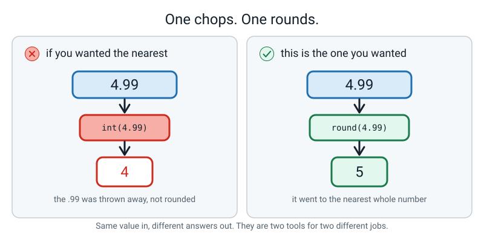
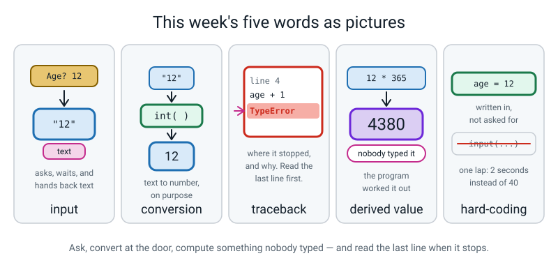

# Week 4 — The About-Me Bot

[⬅ Week 3](week-03.md) · [Course Home](../README.md) · [Next ➡](week-05.md) · [Workbook](../workbook/week-04.md)

---

> ### This week in one sentence
> **`input()` always hands you text, so you must convert it yourself — and Python tells you exactly where you forgot.**
>
> **By the end of this chapter you will be able to:**
> - Ask the human a question with **`input()`** and convert the answer **in the same breath**
> - Say why `input()` handing back text is a **design choice**, not a nuisance
> - Compute two **derived numbers** from raw answers and print them in a formatted card
> - Read three real **tracebacks** without help, by starting at the last line
> - Say why **hard-coding** a value while you are debugging is faster than retyping six answers
>
> **New syntax:** `input("prompt")` · `int(input("Age? "))` · `str(x)` · `round(x, 2)`
>
> **Reading time:** about 30 minutes. **Homework:** about 60 minutes.

---

## 🪝 Start Here

Here is a program I wrote. Three lines. It asks how many minutes of screen time you get in a day, and tells you how many minutes that is in a whole year.

```python
# hook.py - a bot with exactly one thing wrong with it.

minutes = input("Minutes of screen time a day? ")   # ask the human
print("In a whole year that is:")                   # announce the answer
print(minutes * 365)                                # 365 days in a year
```

**Before you read on, work out the answer on paper.** 120 minutes a day, 365 days a year. Roughly forty thousand? If you need help: 100 × 365 = 36,500, and 20 × 365 = 7,300, so **43,800**.

Now here is what really happened when I typed `120`:

```text
Minutes of screen time a day? 120
In a whole year that is:
120120120120120120120120120120120120120120120120120120120120…
```

…and it keeps going. **1,095 characters** of it.

Three questions, and sit with each one.

**One: did my program crash?** No. Look at it. It ran, it finished, it came back to the prompt quite happily. There is no red text anywhere.

**Two: is the answer right?** No. It isn't off by a bit — it isn't a number at all.

**Three, and this is the one that matters: how would you ever have known?** If you hadn't worked out 43,800 on paper first — if I had just shown you the screen — would you have spotted it?


*Figure 4.1 — Same symbol, two completely different jobs. Neither of these produced an error message.*

Hold on to this for the next hour: **a program that runs is not the same thing as a program that works.**

Today you build a bot that interviews people. By the end of it you will have crashed it three times on purpose, and I promise you the crashes are the **easy** problems. This one — the one that ran perfectly and lied to me — is the hard kind.

And the reason it happened is one single fact about that middle line.

---

## 🧠 The Big Idea

This section explains why `input()` gives you text, how to convert it, and how to read the errors you get when you forget. Read it once, then type the code in the next section.

> **📌 About the code in this section.** The blocks below are **illustrations, not files**. They show you the shape of one idea, and each one carries on from the one above it — the `import` lines and the data are typed once, in the first block that needs them. **The complete, runnable file is in 💻 Type This.** If you copy a block from this section on its own and Python says `NameError`, that is why, and nothing is broken.

### 1. What `input()` actually does

**The plain explanation.** `input()` is a **function** — a named action Python already knows how to do, which you trigger by writing its name followed by round brackets.

> **input** — a built-in function that shows a prompt, waits for the human to type something and press Enter, and hands back what they typed.

Three things happen, in this order. Be able to say all three.

1. **It prints the question** — whatever you put inside the brackets. That text is called the **prompt**.
2. **It stops the program dead.** Completely. Nothing is counting down, nothing times out. If you go and make a cup of tea it will still be sitting there when you get back.
3. **When you press Enter, it hands back whatever you typed.**

**The analogy.** `input()` is a hatch in a wall. You slide a question out; a hand posts something back in. The hatch is not fussy — whatever gets posted in, it passes to you.

**The concrete version.** One line, and try it:

```python
# hello_you.py - the smallest program that talks back.

name = input("What is your name? ")   # ask, wait, put the answer in the box called name
print(f"Hello, {name}!")              # print a sentence with the answer dropped into it
```

```text
What is your name? Ramana
Hello, Ramana!
```

The `Ramana` appears on the same line as the question because the terminal echoes your keystrokes as you type them. It is you typing, not the program printing.

Two small habits worth having from today:

- **Put a space at the end of the prompt.** `input("What is your name? ")` — that trailing space stops the answer being jammed against the question mark. One character, and every run looks deliberate.
- **`input()` always needs its brackets**, even with nothing in them. `input` on its own is the *name* of the function; `input()` is you actually running it.


*Figure 4.2 — Three different answers went in. Three pieces of text came out. The tag on each card is the whole of this week.*

### 2. It is always text — and that is a choice, not an accident

**The plain explanation.** **`input()` always hands back text. Always. No exceptions.** Even when the human types `12`.

Python's word for text is `str`, short for **string** — a string of characters, like beads on a thread. When you see `<class 'str'>` on the screen, Python is saying *"this is text."*

**The concrete version.** These four lines are the most valuable four lines of the week. Type them and run them:

```python
# type_test.py - two lines that show what input() really hands you.

age = input("Age? ")        # deliberately NOT converted
print(age, type(age))       # what is it, really?
print(age * 2)              # what does * 2 do to text?
print(int(age) * 2)         # and now the same thing, converted first
```

Typing `12`:

```text
Age? 12
12 <class 'str'>
1212
24
```

Look at line 3 of the output. **`1212`.** Not 24. Because `age` holds the *text* `"12"`, and in Python `*` does two completely different jobs depending on what is on its left:

| Left-hand side | `* 2` means | Result |
|---|---|---|
| a number, `12` | multiply | `24` |
| text, `"12"` | repeat it, twice over | `"1212"` |

That is not a bug in Python. `"ha" * 3` giving `"hahaha"` is genuinely useful, and in Week 7 you will use it to draw divider lines in one character instead of forty.

But it means **a forgotten conversion does not always crash. Sometimes it quietly lies to you** — and that is the hardest kind of bug there is.

**Now the fair question: why doesn't `input()` just notice that `12` looks like a number?**

Because sometimes it isn't one.

Imagine a program that asks for a postcode and somebody types `0121`. If Python helpfully turned that into a number, the zero at the front would vanish — and for a postcode that zero is the whole point. Same for a phone number, a bank card, a house number written `07`.

Python cannot tell "digits that are a quantity" from "digits that are a name". **You can.**

So it hands you the characters exactly as typed and lets you say what they mean.

> **💡 Try this:** some languages *do* guess. You may have heard people complain that JavaScript adds `"5"` and `5` and gets `"55"`. That is what guessing looks like from the inside. Python's answer is: I would rather stop and ask.


*Figure 4.3 — The left-hand panel is my hook program. Python did precisely what the file said.*

### 3. Convert at the door

**The plain explanation.** You mend it by saying which kind of thing you meant.

> **conversion** (also called *casting*) — turning a value of one kind into the matching value of another kind, on purpose, using `int()`, `float()` or `str()`.

| You write | You get | Note |
|---|---|---|
| `int("12")` | `12` | text → whole number |
| `float("1.52")` | `1.52` | text → decimal number |
| `str(12)` | `"12"` | number → text |
| `int("1.52")` | **it stops** | `"1.52"` is not a whole number written down |
| `int(1.52)` | `1` | chops the decimal off — does **not** round |
| `round(1.52)` | `2` | rounds properly |
| `round(4.9868768, 2)` | `4.99` | rounds to two decimal places |

**Where the conversion goes.** This is the habit to install today. You can write it in two lines:

```python
age_text = input("Age? ")     # this is text
age = int(age_text)           # and now it is a number
```

…or you can write it as one:

```python
age = int(input("Age? "))     # ask, and convert, in the same breath
```

Both work. **The one-line version is the one to learn.**

Here is the reason. In the two-line version there is a moment, exactly one line long, where a box called `age` is holding text. That moment is where everybody forgets.

**The analogy.** Convert at the *door*. The second you take the value off the human, change it into what you actually want. Then for the whole rest of the program it is a number and you never think about it again. Carry text around in your program and you have to remember, on every single line, that it isn't a number yet.

Read the one-liner from the inside out, which is the order Python does it in. The numbers show the order:

```text
        age = int( input("Age? ") )
                        └──────┘      1. ask the human, get back the text "12"
                   └──────────────┘   2. hand that text to int(), get back the number 12
        └────────────────────────┘    3. put the number 12 in the box called age
```

> **⚠️ Watch out:** **brackets close in the reverse order they opened.** `int(input("Age? "))` has *two* closing brackets at the end, and your editor may already have put one there for you. Miss one and you get a `SyntaxError` saying `'(' was never closed`. See Break 3.


*Figure 4.4 — Convert at the door, or spend the rest of the program remembering that you didn't.*

### 4. `int()` chops. `round()` rounds. They are different tools.

**The plain explanation.** Two of the rows in that table catch absolutely everybody, so they get their own section.

**`int()` on text with a decimal point fails.** `int("1.52")` does not give you `1` — it stops the program. Python would rather refuse than throw away information you might have wanted. If you genuinely want the whole part of typed text, do it in two steps: `int(float("1.52"))`.

**`int()` on a number chops; `round()` rounds.** `int(3.9)` is `3`. `round(3.9)` is `4`.

**The analogy.** `int()` is a pair of scissors: it cuts at the dot and throws the rest in the bin. `round()` is a magnet: it pulls the value to the nearest whole number.

**The concrete version.** Real run:

```python
# chop_or_round.py - two tools, two jobs.

height_ft = 4.9868768                # 1.52 metres, in feet

print(int(height_ft))                # scissors: cut at the dot
print(round(height_ft))              # magnet: go to the nearest whole one
print(round(height_ft, 2))           # magnet, but keep 2 decimal places
print(round(height_ft, 1))           # and 1 decimal place
```

```text
4
5
4.99
5.0
```

`round(x, 2)` is the one you will want most, because two decimal places is what money, heights and averages look like on a page.


*Figure 4.5 — Same value in, different answers out. Ask yourself which job you are doing before you pick.*

> **💡 Try this:** run `print(round(2.5))`. It is `2`, not 3. So is `round(4.5)` — it's `4`. Python uses a rule called *round half to even*, because always rounding `.5` upwards pushes every total in your data slightly too high. School maths teaches "always up" because you are usually rounding one number, not a million of them. Both rules are defensible; the important thing is knowing which one your tool uses.

### 5. Derived values — the actual point of the project

**The plain explanation.**

> **derived value** — a number the program worked out, which the human never typed.

This is the whole difference between a *form* and a *program*. A form collects six answers and shows you six answers. **A program collects six answers and tells you something you did not know.**

"You have been alive about 4,380 days" is not one of the six answers. Nobody typed 4,380.

**The analogy.** A form is a photocopier. A program is somebody who reads your answers and then *thinks* about them.

**The concrete version.** Two answers in, three facts out:

```python
# derived.py - two answers, three facts nobody typed.

age = 12                 # the human typed this
screen_minutes = 120     # and this

age_days = age * 365                        # nobody typed this
screen_minutes_year = screen_minutes * 365  # or this
screen_hours_year = round(screen_minutes * 365 / 60, 1)   # or this

print(f"Alive about {age_days} days.")
print(f"Screens cost you {screen_minutes_year} minutes a year.")
print(f"That is {screen_hours_year} hours.")
```

```text
Alive about 4380 days.
Screens cost you 43800 minutes a year.
That is 730.0 hours.
```

Seven hundred and thirty hours. Nobody typed that. **That is why the program is worth writing.**


*Figure 4.6 — Two answers went in. Three facts came out. The three at the bottom are the whole reason the program exists.*

### 6. Tracebacks are a gift — and hard-coding buys you time to read them

**The plain explanation.**

> **traceback** — the block of text Python prints when it gives up, saying where it stopped and why.

Every traceback has the same three parts, always in the same order:

```text
Traceback (most recent call last):
  File "about_me.py", line 4, in <module>          <-- (1) WHERE
    next_year = age + 1                            <-- (2) THE LINE ITSELF
TypeError: can only concatenate str (not "int") to str   <-- (3) WHAT AND WHY
```

**Read the last line first.** This is the single most useful habit in the whole course, and it feels wrong, because English reads top to bottom. The stuff at the top is the route Python took to get there. **The bottom line is what actually went wrong.**

Four steps, in this order, every single time:

1. **Last line.** Two halves, split by a colon: the error *type* and the *message*.
2. **Line number.** Go there.
3. **Read the line above it too.** A mistake on one line is often reported on a later one (a value of the wrong type is found where it is used). Modern Python points an unclosed bracket back at the line where it opened, but the habit is the same.
4. **Change one thing. Run again.** One thing. If you change three things and it works, you have learnt nothing and you still have two mysteries.

The five error types you will meet this week:

| Type | What Python means, in English |
|---|---|
| `SyntaxError` | "I could not even read this." Nothing ran at all. |
| `NameError` | "You used a name I have never seen." A typo, or used before it existed. |
| `TypeError` | "Right names, wrong kinds of thing." `"12" + 1`. |
| `ValueError` | "Right kind of thing, impossible value." `int("twelve")`. |
| `EOFError` | "You asked me to read input and there was nobody there." The program was run the wrong way. |

Note the difference between the middle two, because it trips up adults as well:

- `int("twelve")` → **`ValueError`.** You gave `int()` text, which is exactly the right *kind* of thing. It just cannot use *that* text.
- `"12" + 1` → **`TypeError`.** Text and a number are different kinds of thing, and `+` will not mix them.

**A traceback is a gift.** It hands you the file, the line number, the exact line, the category of mistake and a sentence about it. Compare that with a program that prints `120120120…` and says nothing.

**Now the second half of this section, and it is a working habit rather than a piece of Python.**

> **hard-coding** — writing a value straight into the program instead of asking for it.

Hard-coding is usually a criticism. Today it is a technique.

You will change today's program and re-run it about thirty times. Every run with `input()` in place costs you six typed answers — about forty seconds of typing, and forty seconds of nothing to think about.

Thirty runs is twenty minutes of your life spent typing your own name. So: **write the six answers straight into the program first. Swap in `input()` at the very end, once the arithmetic and the card already work.** This isn't a shortcut. It is what people who do this for a living actually do — you shrink the loop.


*Figure 4.7 — The loop is the job. Anything you can do to make one lap faster, do.*

---

## 💻 Type This

In this section you build the whole bot, one small step at a time, and run it after every step. Some of the steps contain a mistake on purpose, and each one says so.

One file, `about_me.py`, built in five steps. **Type it. No pasting, all year.**

### Step 1 — the six answers, hard-coded

New file, **Save As** `about_me.py`.

```python
# about_me.py - the About-Me Bot.
# Stage 1: the six answers are hard-coded so we can run it after every change.

name = "Ramana"          # text, so it stays inside quotes
city = "Bengaluru"       # text
age = 12                 # a whole number, so an int
height_m = 1.52          # has a decimal point, so a float
screen_minutes = 120     # whole minutes of screen time per day, an int
fav_number = 7           # a whole number, an int

print("Name:", name)                        # print takes several things, comma separated
print("City:", city)
print("Age:", age)
print("Height in metres:", height_m)
print("Screen minutes per day:", screen_minutes)
print("Favourite number:", fav_number)
```

Save. Run.

```bash
python3 about_me.py
```

```text
Name: Ramana
City: Bengaluru
Age: 12
Height in metres: 1.52
Screen minutes per day: 120
Favourite number: 7
```

Notice there are **no quotes** round the `12` or the `1.52` — those are numbers. There are quotes round `Ramana` and `Bengaluru`, because those are text. That difference is about to matter.

### Step 2 — the derived numbers, and your first traceback of the day

*Add this to the bottom of the file you started in Step 1 — and type `Round` with a capital R, exactly as printed. This mistake is on purpose.*

```python
# --- derived values: computed, never typed ---------------------------
age_days = age * 365                        # rough days alive, ignoring leap years
screen_minutes_year = screen_minutes * 365  # minutes of screen time in one year
height_ft = Round(height_m * 3.28084, 2)    # metres to feet, rounded to 2 decimals

print("age in days:", age_days)
print("screen minutes per year:", screen_minutes_year)
print("height in feet:", height_ft)
```

Run it. The six lines from Step 1 print fine, and then:

```text
Traceback (most recent call last):
  File "/Users/you/ai-academy/level2/about_me.py", line 21, in <module>
    height_ft = Round(height_m * 3.28084, 2)    # metres to feet, rounded to 2 decimals
NameError: name 'Round' is not defined. Did you mean: 'round'?
```

**Read the last line.** Not the top. The bottom.

`NameError` — "you used a name I have never heard of." And it even says which one: `Round`. And then, because Python is being genuinely kind here, it says *"Did you mean: round?"*

Capital R. That is the entire problem.

Python is **case-sensitive**, which means `Round` and `round` are two different words to it, as different as `dog` and `cat`.

Fix the R. Run again:

```text
age in days: 4380
screen minutes per year: 43800
height in feet: 4.99
```

**Now check the program against your paper.** 12 × 365 = 4,380 ✔. 120 × 365 = 43,800 — the number you predicted at the top of this chapter ✔. 1.52 × 3.28084 = 4.9868… → 4.99 ✔.

**The program agreeing with your paper is the only reason to trust it.** Bug Log row.

### Step 3 — the card, and a bug with no error message

*Delete the nine plain `print` lines at the bottom. Replace them with this — and leave the `f` off the Name line, exactly as printed. This mistake is also on purpose.*

```python
# --- the card --------------------------------------------------------
print("========================================")   # 40 equals signs, typed out
print("             PROFILE CARD")                  # spaces push the title along
print("========================================")
print("  Name    : {name}")                         # <-- the f is missing here
print(f"  City    : {city}")
print(f"  Age     : {age} years")
print(f"  Height  : {height_m:.2f} m  ({height_ft:.2f} ft)")
print("----------------------------------------")   # 40 hyphens, a divider
print("  THINGS YOU DID NOT TELL ME")
print(f"  You have been alive about {age_days} days.")
print(f"  Screens cost you {screen_minutes_year} minutes a year.")
print(f"  Your favourite number cubed is {fav_number ** 3}.")
print("========================================")
```

Run it:

```text
========================================
             PROFILE CARD
========================================
  Name    : {name}
  City    : Bengaluru
  Age     : 12 years
  Height  : 1.52 m  (4.99 ft)
----------------------------------------
  THINGS YOU DID NOT TELL ME
  You have been alive about 4380 days.
  Screens cost you 43800 minutes a year.
  Your favourite number cubed is 343.
========================================
```

**Second bug. And notice: no traceback.** It ran. It printed a card. One line of that card is wrong and Python said nothing at all.

Compare the Name line with the City line. What is different? … Yes. There is no `f` before the quote.

That little `f` is the switch that turns the curly braces on.

Without it, `{name}` is just six characters — a curly bracket, n, a, m, e, a curly bracket — and `print` printed exactly those characters, faithfully.

Add the `f`. Run again. Now the line reads `  Name    : Ramana`.

**Two bugs so far. One crashed and told me exactly what was wrong. One didn't crash at all and I had to notice. Which was easier?**

Bug Log row — and this one says **"no error message"** where the error text would go.

### Step 4 — now, at last, we can ask

The arithmetic works and the card looks like a card. **Now** we swap in the questions. This is the last thing we do, not the first.

*Replace the six hard-coded lines at the top with these six:*

```python
# --- 1. the six answers ----------------------------------------------
name = input("1. Your name?                 ")                  # text, no conversion
city = input("2. Your city?                 ")                  # text, no conversion
age = int(input("3. Your age in years?         "))              # whole number -> int()
height_m = float(input("4. Your height in metres?     "))       # decimal -> float()
screen_minutes = int(input("5. Screen minutes per day?    "))    # whole number -> int()
fav_number = int(input("6. Your favourite number?     "))       # whole number -> int()
```

Notice what happened on the age line and *didn't* happen on the name line: `int(` … `)` wrapped round the `input`. **A name is text and stays text. An age is a number and gets converted at the door.** And a height gets `float`, because 1.52 has a decimal point in it.

Run it. Answer `Ramana`, `Bengaluru`, `12`, `1.52`, `120`, `7`. The card comes out identical to Step 3's.

### Step 5 — break it on purpose, then prove it with `type()`

*Change line 13 only. Take the `int(` and its closing `)` off the screen-time line so it reads:*

```python
screen_minutes = input("5. Screen minutes per day?    ")          # BUG: no int() here
```

**Predict before you run.** Is it going to crash, or is it going to run? And if it runs, which line of the card will be wrong?

Run it, answering the same six things:

```text
========================================
             PROFILE CARD
========================================
  Name    : Ramana
  City    : Bengaluru
  Age     : 12 years
  Height  : 1.52 m  (4.99 ft)
----------------------------------------
  THINGS YOU DID NOT TELL ME
  You have been alive about 4380 days.
  Screens cost you 120120120120120120120120120…120 minutes a year.
  Your favourite number cubed is 343.
========================================
```

There is the hook, back again, in your own program.

Now — how do you **prove** what is wrong, instead of guessing? Ask Python what it thinks it is holding. *Add one line just above the derived block:*

```python
print(type(screen_minutes))     # a temporary line, just to find the bug
```

Run again. Somewhere in the middle of the output:

```text
<class 'str'>
```

**There it is. `str`.** Python is telling you in three letters that the thing it is about to multiply by 365 is text.

That is not a guess and it is not a feeling — it is the answer.

> **🐞 If you see this error:** or rather, if a *number* behaves oddly and there is **no** error, the first move is always `print(type(x))`. It is one line long and it is the most useful debugging trick you will learn this year.

Put the `int()` back, run it, check the number against 43,800. Then **delete the `print(type(...))` line.** Diagnostic lines come out when the diagnosis is done.

Bug Log row.

### The finished file

```python
# about_me.py - the About-Me Bot. Six questions in, one profile card out.
# Every input() hands back TEXT, so numbers are converted the moment they arrive.

print("========================================")   # 40 equals signs, typed out
print("  ABOUT-ME BOT - six quick questions")
print("========================================")

# --- 1. the six answers ----------------------------------------------
name = input("1. Your name?                 ")                  # text, no conversion
city = input("2. Your city?                 ")                  # text, no conversion
age = int(input("3. Your age in years?         "))              # whole number -> int()
height_m = float(input("4. Your height in metres?     "))       # decimal -> float()
screen_minutes = int(input("5. Screen minutes per day?    "))    # whole number -> int()
fav_number = int(input("6. Your favourite number?     "))       # whole number -> int()

# --- 2. derived values: computed, never typed ------------------------
age_days = age * 365                        # rough days alive, ignoring leap years
screen_minutes_year = screen_minutes * 365  # minutes of screen time in one year
height_ft = round(height_m * 3.28084, 2)    # metres to feet, rounded to 2 decimals

# --- 3. the card -----------------------------------------------------
print("========================================")
print("             PROFILE CARD")
print("========================================")
print(f"  Name    : {name}")                # f before the quote turns on {}
print(f"  City    : {city}")
print(f"  Age     : {age} years")
print(f"  Height  : {height_m:.2f} m  ({height_ft:.2f} ft)")
print("----------------------------------------")
print("  THINGS YOU DID NOT TELL ME")
print(f"  You have been alive about {age_days} days.")
print(f"  Screens cost you {screen_minutes_year} minutes a year.")
print(f"  Your favourite number cubed is {fav_number ** 3}.")
print("========================================")
```

The real run, answering `Ramana`, `Bengaluru`, `12`, `1.52`, `120`, `7`:

```text
========================================
  ABOUT-ME BOT - six quick questions
========================================
1. Your name?                 Ramana
2. Your city?                 Bengaluru
3. Your age in years?         12
4. Your height in metres?     1.52
5. Screen minutes per day?    120
6. Your favourite number?     7
========================================
             PROFILE CARD
========================================
  Name    : Ramana
  City    : Bengaluru
  Age     : 12 years
  Height  : 1.52 m  (4.99 ft)
----------------------------------------
  THINGS YOU DID NOT TELL ME
  You have been alive about 4380 days.
  Screens cost you 43800 minutes a year.
  Your favourite number cubed is 343.
========================================
```

And a second real run with completely different answers — `Meera`, `Pune`, `15`, `1.65`, `200`, `8`:

```text
========================================
  ABOUT-ME BOT - six quick questions
========================================
1. Your name?                 Meera
2. Your city?                 Pune
3. Your age in years?         15
4. Your height in metres?     1.65
5. Screen minutes per day?    200
6. Your favourite number?     8
========================================
             PROFILE CARD
========================================
  Name    : Meera
  City    : Pune
  Age     : 15 years
  Height  : 1.65 m  (5.41 ft)
----------------------------------------
  THINGS YOU DID NOT TELL ME
  You have been alive about 5475 days.
  Screens cost you 73000 minutes a year.
  Your favourite number cubed is 512.
========================================
```

Check it by hand, because that is the habit: 15 × 365 = 5,475 ✔ · 200 × 365 = 73,000 ✔ · 1.65 × 3.28084 = 5.4133… → 5.41 ✔ · 8 × 8 × 8 = 512 ✔.

---

## 🔍 Worked Examples

These are finished programs that use the same ideas in new places: food, sport and school. Read each one, then check its numbers on paper.

### Worked Example 1 — The pizza order slip (food)

Three questions, three derived numbers. Note the `float` on the tip, because a tip can be 12.5%.

```python
# pizza_bot.py - three questions in, one order slip out.

slice_price = 45                                     # rupees for one slice

name = input("Whose order is this?  ")               # text, no conversion needed
slices = int(input("How many slices?      "))        # a whole number -> int()
tip_percent = float(input("Tip, as a %?          "))  # can have a decimal -> float()

food_total = slices * slice_price                    # derived: nobody typed this
tip = round(food_total * tip_percent / 100, 2)       # derived: the tip in rupees
grand_total = round(food_total + tip, 2)             # derived: what to actually pay

print("------------------------------")
print(f"  Order for : {name}")                       # the f turns the braces on
print(f"  Slices    : {slices} at {slice_price} each")
print(f"  Food       = {food_total} rupees")
print(f"  Tip ({tip_percent:.1f}%) = {tip:.2f} rupees")
print("------------------------------")
print(f"  TO PAY     = {grand_total:.2f} rupees")
print("------------------------------")
```

Answering `Meera`, `3`, `12.5`:

```text
Whose order is this?  Meera
How many slices?      3
Tip, as a %?          12.5
------------------------------
  Order for : Meera
  Slices    : 3 at 45 each
  Food       = 135 rupees
  Tip (12.5%) = 16.88 rupees
------------------------------
  TO PAY     = 151.88 rupees
------------------------------
```

**Check it on paper.** 3 × 45 = 135 ✔. 12.5% of 135 is 16.875, and `round(…, 2)` gives 16.88 ✔. 135 + 16.88 = 151.88 ✔.

**The one to notice:** if `tip_percent` had used `int()` instead of `float()`, typing `12.5` would stop the program with a `ValueError`. The conversion you choose is a promise about what answers you will accept.

### Worked Example 2 — One innings (sport)

Two derived numbers, both of which need division, and division is where a missing `int()` gets *caught* instead of hidden.

```python
# strike_rate.py - one innings in, two numbers nobody typed out.

batter = input("Batter's name? ")                    # text stays text
runs = int(input("Runs scored?   "))                 # whole number -> int()
balls = int(input("Balls faced?   "))                # whole number -> int()

strike_rate = round(runs / balls * 100, 2)           # derived: runs per 100 balls
overs_faced = round(balls / 6, 1)                    # derived: 6 balls make an over
runs_per_over = round(runs / (balls / 6), 2)         # derived: the run rate

print("==============================")
print(f"  Batter      : {batter}")
print(f"  Scored      : {runs} off {balls} balls")
print(f"  That is     : {overs_faced} overs faced")
print("------------------------------")
print(f"  Strike rate : {strike_rate:.2f}")
print(f"  Run rate    : {runs_per_over:.2f} per over")
print("==============================")
```

Answering `Rohit`, `84`, `52`:

```text
Batter's name? Rohit
Runs scored?   84
Balls faced?   52
==============================
  Batter      : Rohit
  Scored      : 84 off 52 balls
  That is     : 8.7 overs faced
------------------------------
  Strike rate : 161.54
  Run rate    : 9.69 per over
==============================
```

**The one to notice:** take the `int()` off the `runs` line and this program does **not** print nonsense — it stops, with `TypeError: unsupported operand type(s) for /: 'str' and 'int'`. There is no "repeat this text" meaning for `/`, so Python has to complain. **`*` hides a missing conversion; `/` exposes it.** That is exactly why the screen-time bug in the hook was so hard to spot.

### Worked Example 3 — A report line (school)

Three marks in, three derived numbers out, and one of them can go negative.

```python
# report_bot.py - three marks in, a report line out.

pass_mark = 35                                       # the school's pass mark

student = input("Student name?    ")                 # text, no conversion
maths = int(input("Maths mark?      "))              # whole number -> int()
science = int(input("Science mark?    "))            # whole number -> int()
english = int(input("English mark?    "))            # whole number -> int()

total = maths + science + english                    # derived: nobody typed this
average = round(total / 3, 2)                        # derived: three subjects
above_pass = round(average - pass_mark, 2)           # derived: how far above the pass mark

print("========================================")
print(f"  REPORT FOR {student}")
print("========================================")
print(f"  Maths   : {maths}")
print(f"  Science : {science}")
print(f"  English : {english}")
print("----------------------------------------")
print(f"  Total   : {total} out of 300")
print(f"  Average : {average:.2f}")
print(f"  That is {above_pass:.2f} marks above the pass mark of {pass_mark}.")
print("========================================")
```

Answering `Anika`, `78`, `84`, `71`:

```text
Student name?    Anika
Maths mark?      78
Science mark?    84
English mark?    71
========================================
  REPORT FOR Anika
========================================
  Maths   : 78
  Science : 84
  English : 71
----------------------------------------
  Total   : 233 out of 300
  Average : 77.67
  That is 42.67 marks above the pass mark of 35.
========================================
```

**Check it:** 78 + 84 + 71 = 233 ✔. 233 ÷ 3 = 77.666666… → 77.67 ✔. 77.67 − 35 = 42.67 ✔.

**The one to notice:** the last line is honest but not very smart. Give it three marks of 10 and it will happily print *"That is -25.00 marks above the pass mark"*, which is a sentence no human would write. Making the program say **"below"** when the number is negative needs a decision — and a decision is exactly what next week is.

---

## 🐞 When It Breaks

Every message below came from really running a broken version of this week's code. Only the folder path in the `File` line will differ on your machine.

**Errors are not failure. The number of errors you hit this week is mostly a measure of how much code you wrote.** Somebody with no errors this week wrote nothing this week.

### Break 1 — the wrong conversion

```python
height_m = int(input("4. Your height in metres?     "))
print(height_m)
```

Typing `1.52`:

```text
4. Your height in metres?     1.52
Traceback (most recent call last):
  File "/Users/you/ai-academy/level2/oops.py", line 1, in <module>
    height_m = int(input("4. Your height in metres?     "))
ValueError: invalid literal for int() with base 10: '1.52'
```

**What Python is telling you.** *"You handed me text, which is the right kind of thing — but I cannot turn* that *text into a whole number, because `1.52` isn't one."*

**The fix.** `float` instead of `int`. A height in metres has a decimal point in it, and `int()` would have thrown the `.52` away even if it had worked.

### Break 2 — the missing conversion

```python
age = input("Age? ")
print("Next year you will be", age + 1)
```

Typing `12`:

```text
Age? 12
Traceback (most recent call last):
  File "/Users/you/ai-academy/level2/oops.py", line 2, in <module>
    print("Next year you will be", age + 1)
TypeError: can only concatenate str (not "int") to str
```

**What Python is telling you.** "Concatenate" is a long word for "glue end to end". So: *"the left-hand thing is text, so `+` means glue — and I cannot glue a number onto text."*

**The fix.** `age = int(input("Age? "))`. Then it prints `Next year you will be 13`.

> **🐞 If you see this error:** the mistake is **not** on the line the traceback names. Line 2 is where Python gave up. The mistake is on the line that filled `age`. Go and look at the input lines as a column and check every numeric one has a conversion wrapped round it.

### Break 3 — one bracket short

```python
minutes = int(input("Minutes? ")
print(minutes * 365)
```

```text
  File "/Users/you/ai-academy/level2/oops.py", line 1
    minutes = int(input("Minutes? ")
                 ^
SyntaxError: '(' was never closed
```

**What Python is telling you.** *"I got to the end still waiting for a closing bracket."* And notice: **nothing ran at all.** No question was asked. A `SyntaxError` means Python could not even read the file.

**The fix.** One more `)` at the end. `int(input(...))` opens two brackets and must close two. Count the openers out loud, then count the closers.

> **⚠️ Watch out:** your editor probably typed a `)` for you when you typed `int(`. So when you then type your own, you end up with `))` — which is right! And sometimes you delete one because it looks like too many, which is how this error happens.

### The whole clinic, for reference

| What you see | What it means | The fix |
|---|---|---|
| `ValueError: invalid literal for int() with base 10: 'twelve'` | Right kind of thing, impossible value | Nothing is wrong with the code. Run it again and type `12` |
| `ValueError: invalid literal for int() with base 10: '12.5'` | `"12.5"` is not a whole number written down | `float(input(...))`, or `int(float(input(...)))` if you truly want the whole part |
| `ValueError: invalid literal for int() with base 10: ''` | Empty quotes mean *nothing at all was typed* | Run again and type something. Guarding against it needs `if`, which is Week 5 |
| `ValueError: could not convert string to float: 'one point five'` | The `float()` version of the same story | Type `1.5` |
| `TypeError: can only concatenate str (not "int") to str` | Something is text that should be a number, and `+` won't mix them | `int()` round the `input()` that filled it |
| `TypeError: unsupported operand type(s) for /: 'str' and 'int'` | You asked me to divide text | Same fix. Note that `*` did **not** complain and `/` did |
| `NameError: name 'nme' is not defined. Did you mean: 'name'?` | A typo, probably inside an f-string's braces | Fix the spelling. Believe Python's guess |
| `NameError: name 'Round' is not defined. Did you mean: 'round'?` | A capital letter. Python is case-sensitive | Lower-case `r`. Every built-in function in this course is all lower-case |
| `SyntaxError: '(' was never closed` | A `)` is missing, usually on `int(input(...))` | Add it. And nothing ran, so there is no output to look at |
| `SyntaxError: unterminated string literal` | A quote opened and never closed | Add the missing `"`. Check the line above the caret as well |
| `EOFError: EOF when reading a line` | "You asked me to read from the human and nobody was there" | Run it from the terminal: `python3 about_me.py` |
| **No error, and a number is 1,095 characters long** | Nothing is wrong as far as Python is concerned. `*` repeated some text | `print(type(x))` above it. If it says `<class 'str'>`, you have found it |
| **No error, and a card line reads `{name}`** | `print` printed exactly the characters you gave it | Add the missing `f` before the opening quote |

---

## 🎲 What We Did In Class

Missed it, or want to redo it at home? This is the whole lesson.

### The hook, on paper first

`hook.py` — three lines. Work out 120 × 365 on paper **before** running it. Then run it and watch 1,095 characters of `120120120…` fill the screen. Three questions: did it crash (no) · is it right (no) · how would you have known (only because of the paper).

### The four-line experiment

`type_test.py`, with all three outputs predicted out loud before running:

```text
Age? 12
12 <class 'str'>
1212
24
```

Then one extra line added at the bottom, and deleted again afterwards:

```python
print(int("1.52"))     # add this at the bottom - watch what happens
```

```text
Traceback (most recent call last):
  File "type_test.py", line 7, in <module>
    print(int("1.52"))
ValueError: invalid literal for int() with base 10: '1.52'
```

Last line first. `ValueError`. Right kind of thing, impossible value. `float` is what we wanted.

### The bot, in four stages

| Stage | What we added | What broke |
|---|---|---|
| 1 | Six hard-coded answers, six plain `print` lines | nothing |
| 2 | Three derived values | `Round` with a capital R → `NameError`, and Python guessed the fix |
| 3 | The card, with borders and f-strings | the missing `f` → **no error**, and one card line printed `{name}` |
| 4 | `input()` on all six lines, converting as we went | the missing `int()` on line 13 → **no error**, and 1,095 characters of nonsense |

Then the diagnostic that ended the argument:

```python
print(type(screen_minutes))     # a temporary line, just to find the bug
```

```text
<class 'str'>
```

And then we deleted that line, because a diagnosis is finished once you have made it.

### Make it yours

Six questions of your own, at least one taking a decimal (so at least one `float`), and **at least two derived numbers you would actually want to know.** Some to steal:

| Derived value | How |
|---|---|
| hours of screen time a year | `screen_minutes * 365 / 60` |
| how many 90-minute films that is | `screen_minutes * 365 / 90` |
| your age in hours | `age * 365 * 24` |
| your height in centimetres | `height_m * 100` |
| your favourite number squared and cubed | `fav_number ** 2` and `fav_number ** 3` |
| days until you are 18 | `(18 - age) * 365` |

**Work out on paper what each one should be before you run it.**

### The three bugs that went in the Bug Log

1. `NameError: name 'Round' is not defined. Did you mean: 'round'?` — a capital letter.
2. **No error message.** One card line printed `{name}` — the `f` was missing.
3. **No error message.** The screen-time line printed 1,095 characters — the `int()` was missing, and `print(type(...))` proved it.

---

## 💬 Talk About It

These questions are for talking through with a parent, a friend or your teacher. There is no single right answer, and the hints only start you off.

**1. "Why doesn't `input()` just work out that `12` is a number? It's obviously a number."**

*Hint:* it looks obvious because you already know what the question was. Python doesn't. Think about a program that asks for a postcode and somebody types `0121`. What happens to that zero if Python "helpfully" makes it a number? Then find two more things that look like numbers and must not be treated as ones.

**2. "Why is `"12" * 2` allowed at all? It's a stupid thing to do."**

*Hint:* it isn't, and you will use it in three weeks. What would `"=" * 40` give you? Compare that with the forty equals signs you typed by hand today. Then ask the sharper question: the awkwardness isn't that repeating text is allowed, it's that **one symbol has two jobs and the *type* on its left decides which**, silently. Is there a version of Python that could have both without the trap?

**3. "Would you rather have a program that crashes or one that gives a wrong answer?"** *(Nobody fully agrees, and that is the point.)*

*Hint:* list what a crash gives you — it is more than you think. A file, a line number, a category, a sentence. Now list what `120120120…` gave you. Then find the exception: name a machine where stopping is the *dangerous* outcome, and say who would have to decide that. Notice which of today's two bugs was harder to find.

---

## ⚠️ Don't Get Tricked

These are mistakes that catch many learners. Each table shows the wrong belief next to the right one.

### Trick 1 — "I converted it, so it's fine"


*Figure 4.8 — Left, a missing conversion and no complaint. Right, the same line with the conversion in place.*

| ❌ Wrong | ✅ Right |
|---|---|
| "I put `int()` on line 11, so my program converts things now." | Conversion happens to **one value, on one line.** There is no global setting. Read your input lines as a column and check every numeric one has its own wrapper. |

The student who gets caught by this converts `age` correctly on line 11 and then writes `screen_minutes = input(...)` two lines later, and is genuinely surprised.

### Trick 2 — "`int()` rounds"

| ❌ Wrong | ✅ Right |
|---|---|
| `int(4.99)` is `5`, because 4.99 is nearly 5. | `int(4.99)` is `4`. It **chops off** everything after the point. `round(4.99)` is `5`. |

`int(-3.9)` is `-3`, by the way — chopping, not rounding, in both directions.

### Trick 3 — "the error is on the line the traceback names"

| ❌ Wrong | ✅ Right |
|---|---|
| "It says line 2, so I'll change line 2." | `line 2` means "line 2 is where Python **gave up**", which is not the same as "line 2 is wrong". A value that was wrongly left as text on line 1 makes Python complain on line 2, where it is used. **Always read the line above as well.** |

### Trick 4 — "a program that runs is a program that works"

| ❌ Wrong | ✅ Right |
|---|---|
| "No red text, so it's finished." | Two of today's three bugs produced **no error at all.** Running and working are different things, and only one of them is your job. |

---

## 🌍 Where You've Seen This

The ideas from this week are hiding in things you already use. Here are six places to spot them.

1. **Every form you have ever filled in on a website.** Your age goes in as characters. Somewhere behind the page, a programmer had to convert `"12"` into `12` before anything could be added to it — and if they forgot, something on that page is quietly wrong.
2. **A fitness app telling you "you walked 1,200,000 steps this year".** Nobody typed that. It is a derived value: today's steps, multiplied. Every number in every summary screen you have ever seen was worked out from smaller ones.
3. **A phone number stored as text on purpose.** It looks like a number and must never be treated as one — the leading zero matters and you'd never add two together. This is the postcode argument, in your pocket.
4. **A price showing as `£8.5` instead of `£8.50`.** Somebody printed a raw number where `round(x, 2)` and `:.2f` were needed. Once you have seen it you will see it everywhere.
5. **A game asking "how many players?" and then breaking on `two`.** That is `ValueError` in a nice jumper. Real programs check the answer before converting it — and you get the tool for that next week.
6. **An error box that says "something went wrong".** Somebody had a perfectly good traceback with a file, a line and a reason, and replaced it with four useless words. When you write your own programs, **keep the traceback.** It is the most helpful thing on the screen.

---

## 🧭 Where This Fits

This section shows where this week sits in the whole course and what it connects to.

Same pipeline, same five stages, and the gold tile has not moved for four weeks. That is because this
week is the one that **finishes** it. Weeks 1, 2 and 3 each handed you one tool; today all three turn
up in the same program, and a real person types into it.


*Figure 4.0 — The pipeline after Week 4. Gold is where you are. Dashed is not yet. The strip along the
bottom is the seven threads this course keeps returning to.*

| | |
|---|---|
| **The mental model you now own** | `input()` **always** hands back text — even when the human typed `12`. So you convert it the moment you receive it: **ask, convert, then use.** When you forget, the traceback tells you the exact line you forgot on. |
| **The one question it answers** | *"Why did my two numbers glue together instead of adding up?"* Because they were never numbers. They were text wearing a number costume. |
| **What it plugs into** | Weeks 1–3 all at once — a file that runs top to bottom, named boxes to keep answers in, f-strings to print them nicely — plus Week 2's type rule, which is suddenly not theoretical at all. |
| **What carries forward** | Week 5 starts asking questions *of* the converted value. Week 16 meets the identical rule when a CSV file hands back text. Week 23 converts a whole column in one line with `astype`. |
| **Spiral thread** | 🧰 **Toolcraft** — the last tile of the toolcraft-only run is now behind you in spirit, though five more weeks of craft come first. The six AI threads wake up in Week 10. |

> **💡 Try this:** on your notebook map, put a small tick in the corner of the first tile. Four weeks,
> one box, and you can now write a program that talks to a human and does not fall over. Next week the
> gold jumps down to the box underneath.

---

## 🔑 Remember This

These are the ideas to keep from this week, followed by a card of the syntax you used.

- **`input()` always hands back text.** Always. Even when the human types `12`.
- **Convert at the door.** `age = int(input("Age? "))`, on one line, so no box ever holds text that should be a number.
- **`*` on text repeats it.** `"120" * 365` is 1,095 characters and no error message. `/` on text crashes — which makes `*` the dangerous one.
- **`int()` chops, `round()` rounds.** Different tools for different jobs. `round(x, 2)` is the one you'll want most.
- **A derived value is one the program worked out.** It is the only reason to write a program instead of a form.
- **Read the last line of a traceback first**, then the line number, then the line above it. Change one thing. Run again.
- **Hard-code while you debug.** Shrinking the loop is not laziness; it is the job.
- **A program that runs is not a program that works.**

### Syntax reminder card

```python
name = input("Your name? ")           # ALWAYS hands back text
age = int(input("Age? "))             # ask and convert in the same breath
height = float(input("Height in m? ")) # float, because 1.52 has a dot in it

print(type(age))                      # <class 'int'>   the debugging torch
print(type(name))                     # <class 'str'>

print(int("12"))                      # 12      text -> whole number
print(float("1.52"))                  # 1.52    text -> decimal number
print(str(12))                        # "12"    number -> text
# print(int("1.52"))                  # ValueError: not a whole number written down

print(int(4.99))                      # 4       CHOPS at the dot
print(round(4.99))                    # 5       nearest whole number
print(round(4.9868768, 2))            # 4.99    two decimal places

age_days = age * 365                  # a DERIVED value - nobody typed it
print(f"Alive about {age_days} days") # the f is what turns the braces on
```

---

## 📓 New Words

These are the five words you met this week. Each one has a picture and an example.


*Figure 4.9 — This week's five words, drawn.*

| Word | What it means | Example |
|---|---|---|
| **input** | A built-in function that prints a prompt, waits for the human, and hands back what they typed — as text | `name = input("Your name? ")` |
| **conversion** | Turning a value of one kind into another on purpose, with `int()`, `float()` or `str()` | `int("12")` gives the number `12` |
| **traceback** | The block of text Python prints when it gives up, saying where it stopped and why | `NameError: name 'Round' is not defined` |
| **derived value** | A number the program worked out, which nobody typed | `age_days = age * 365` → `4380` |
| **hard-coding** | Writing a value straight into the program instead of asking for it | `age = 12` while you are still debugging |

---

## 📤 Your Homework

Go to **[the Week 4 workbook](../workbook/week-04.md)**. About **60 minutes** in total.

| Section | What to do | Time |
|---|---|---|
| **Warm-Up** | Five quick questions from Week 3 | 5 min |
| **Predict the Output** | Four snippets. Write your guess **before** you run | 10 min |
| **Practice A & B** | Six reading questions, then five you write yourself | 20 min |
| **Fix the Broken Program** | A screen-time report with three planted bugs | 10 min |
| **Build It** | Finish the About-Me Bot, plus the Bug Log | 15 min |

**The Bug Log is the page I will read first.** Three tracebacks that **you actually caused** — not three copied off this page. Real ones, from your own program, pasted in exactly as they appeared, and next to each one, in your own words, what Python was trying to tell you and what one thing you changed.

And here is the part that matters most. **One of your three has to be a bug with no error message at all.** Something that ran, printed, and was wrong. Go and cause one on purpose if you have to.

> **💡 Try this:** before you start, open Week 3's file and add one `input()` to it so it asks for a number instead of having one typed in. Then run it and see whether it still works. If it doesn't, you have found this week's lesson in your own old code, which is the best possible place to find it.

---

[⬅ Week 3](week-03.md) · [Course Home](../README.md) · [Week 5 ➡](week-05.md) · [📓 Workbook — Week 4](../workbook/week-04.md) · [Glossary](../../glossary.md)
