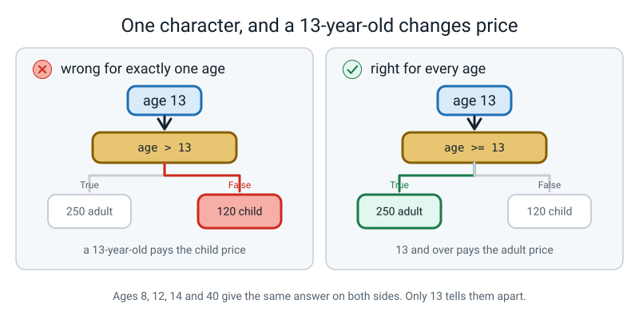
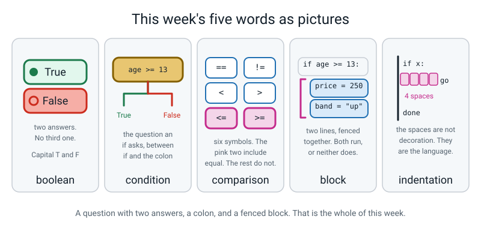

# Week 5 — Questions With Yes/No Answers

[⬅ Week 4](week-04.md) · [Course Home](../README.md) · [Next ➡](week-06.md) · [Workbook](../workbook/week-05.md)

---

> ### This week in one sentence
> **A comparison is a question whose answer is `True` or `False`; `if` runs a block of code only when the answer is `True`.**
>
> **By the end of this chapter you will be able to:**
> - Write a comparison and **predict `True` or `False` before you run it**
> - Use **`if` / `else`** to choose between two blocks of code
> - Explain what **indentation** does in Python, and why it is not decoration
> - Tell **`=` from `==`** and say what each one is for
> - Read the `SyntaxError` Python gives you for `=` inside an `if`, and use its suggestion
>
> **New syntax:** `==` and `!=` · `<` `>` `<=` `>=` · `if condition:` · `else:`
>
> **Reading time:** about 30 minutes. **Homework:** about 60 minutes.

---

## 🪝 Start Here

Stand up. You are going to be a program for five minutes.

Imagine a fork taped on the floor in front of you: one path coming in, splitting into two. **Left is labelled `True`. Right is labelled `False`.**

I say a sentence. Every sentence is a question with a yes-or-no answer. If the answer is yes, walk **left**. If the answer is no, walk **right**. You have to actually walk. No pointing.

> **Your age is 12 or more.**

Walk it. Then come back to the start.

> **Your age is more than 12.**

Walk that one too — and **read it again, slowly, before you move.**

If you are 12, you just walked two different ways for two sentences that sound almost identical. The first is `True`. The second is `False`. Twelve is not *more than* twelve.

Now some quick ones, walking each:

> **Your name is Ramana.** · **Your name is not Ramana.** · **You have more than two siblings.** · **7 times 8 is 56.** · **7 times 8 is 54.** · **The word "apple" comes before "banana" in a dictionary.** · **It is raining.**

Sit down. Here is what just happened, and it is the whole of today.

**Every single sentence had exactly two possible answers.** Not three. Not "maybe". Not "it depends". Just yes or no — and in Python those two answers have names: **`True`** and **`False`**, with capital letters.

**And the second thing.** Standing on that fork, you *did different things depending on the answer*. Every program you have written so far runs every line, top to bottom, in the same order, every single time. Last week's bot asks the same six questions and prints the same shaped card, always.

Today your program grows a fork in it, and **two different people running it will see two different things happen.**

That is a bigger deal than it sounds. It is the difference between a machine that plays a recording and a machine that answers you.


*Figure 5.1 — One question, two branches. Which one runs depends on the answer.*

---

## 🧠 The Big Idea

> **📌 About the code in this section.** The blocks below are **illustrations, not files**. They show you the shape of one idea, and each one carries on from the one above it — the `import` lines and the data are typed once, in the first block that needs them. **The complete, runnable file is in 💻 Type This.** If you copy a block from this section on its own and Python says `NameError`, that is why, and nothing is broken.

### 1. A question with only two answers

**The plain explanation.**

> **boolean** — a value that is either `True` or `False`. There is nothing else it can be.

Capital T, capital F. `true` with a small t is not a thing in Python, and using it gives you `NameError: name 'true' is not defined. Did you mean: 'True'?`.

You almost never type `True` yourself. You **produce** booleans by comparing two things.

> **comparison operator** — a symbol that compares two values and hands back `True` or `False`.

There are six, and you already know all six from maths.

| Operator | Read it as | Example | Answer |
|---|---|---|---|
| `==` | "is equal to" | `7 == 7` | `True` |
| `!=` | "is not equal to" | `7 != 3` | `True` |
| `<` | "is less than" | `3 < 5` | `True` |
| `>` | "is greater than" | `3 > 5` | `False` |
| `<=` | "is less than or equal to" | `5 <= 5` | `True` |
| `>=` | "is greater than or equal to" | `3 >= 5` | `False` |

Only two need explaining. `!=` is "not equal" — the exclamation mark means "not", a convention nearly every programming language uses. And `==` is the one that matters, which is section 2.

**The analogy.** A comparison is a judge, not a builder. It looks at two things and announces a verdict. It changes nothing at all.

**The concrete version.** Type this and **predict all eight answers out loud before you run it.** Write your predictions down so you can mark yourself.

```python
# compare_drills.py - eight questions that have True or False answers.

my_age = 12          # the student's age
pass_mark = 35       # the school's pass mark, out of 100
mark = 42            # one student's mark

print(my_age >= 12)        # is 12 at least 12?
print(my_age > 12)         # is 12 bigger than 12?
print(mark >= pass_mark)   # did they pass?
print(mark == 42)          # is the mark exactly 42?
print(mark != 42)          # is the mark anything OTHER than 42?
print(mark < 35)           # did they fail?
print("apple" < "banana")  # does "apple" come first in the dictionary?
print("cat" == "Cat")      # is a capital C the same as a small c?
```

```text
True
False
True
True
False
False
True
False
```

**Getting all eight right means the exercise was too easy.** Three are worth stopping on.

**Line 2. `12 > 12` is `False`.** "Greater than" does not include equal. If you got that wrong you are in extremely good company, because that one mistake sits behind more bugs than almost anything else in programming. If you want "greater than or the same as", you have to say `>=`.

**Line 7. `"apple" < "banana"` is `True`.** Comparisons work on text too, and they compare alphabetically — near enough. Strictly, Python compares character by character using each character's number in a big standard table, which means **all capital letters sort before all small letters**. So `"Zebra" < "apple"` is *also* `True`, which surprises everybody.

**Line 8. `"cat" == "Cat"` is `False`.** Case matters, always. This will bite you the first time you compare something a human typed: they will type `Yes` and your program will be looking for `yes`.

Two more useful facts:

- `7 == 7.0` is **`True`.** A whole number and a decimal that mean the same amount are equal, because Python compares the *value*, not the type.
- `7 == "7"` is **`False`.** A number and text are never equal, however identical they look on screen. This is Week 4, coming back.


*Figure 5.2 — `>` and `>=` differ for exactly one value. That value is the one worth testing.*

### 2. `=` is a delivery. `==` is a verdict.

**The plain explanation.** This is the single most common confusion in all of programming, and the reason is that maths uses one symbol for both jobs.

- **`=` is a delivery.** `age = 12` puts 12 into the box called `age`. It **changes** something. It hands back nothing.
- **`==` is a verdict.** `age == 12` looks in the box, looks at 12, and reports `True` or `False`. It changes **nothing**. It just tells you.

**The analogy.** One van, one judge. The van carries something somewhere. The judge announces an answer and goes home.

Only one of them belongs inside an `if`, because an `if` needs to be *told* something.


*Figure 5.3 — One van, one judge. Only one of them belongs inside an `if`.*

**The concrete version.** If you write `if age = 12:` — one equals sign — Python stops you:

```text
  File "/Users/you/ai-academy/level2/ticket_price.py", line 8
    if age = 13:
       ^^^^^^^^
SyntaxError: invalid syntax. Maybe you meant '==' or ':=' instead of '='?
```

**Python names the fix in its own message.** It says `'=='`. (It also mentions `':='`, which is a real but rarely-used operator this course never touches — ignore that half of the sentence. I am telling you it is there so it doesn't worry you, not so you learn it.)

**And here is why Python is strict about it, which is worth knowing.** In some older languages, `if age = 12:` is completely **legal**. It quietly sets `age` to 12 and then, because 12 counts as "yes", takes the branch. Every time. For everybody.

Think about what that program does to a fifteen-year-old. They get *set to 12* and charged the child price. Everyone becomes 12.

That bug is famous, it has cost real money, and Python's designers decided to make the line impossible to write. **When it stops you, it isn't being fussy — it is the only language in the room that noticed.**

### 3. The colon and the four spaces

**The plain explanation.** Here is the shape of a decision. Three pieces of punctuation carry all of the meaning.

```python
# fever.py - one question, one decision.

temperature = 38.0          # degrees Celsius

if temperature > 37.5:              # the condition, then a COLON
    print("You have a fever.")      # indented 4 spaces = inside the if
    print("Rest and drink water.")  # still indented = still inside
print("Report finished.")           # not indented = runs every time
```

```text
You have a fever.
Rest and drink water.
Report finished.
```

Now change **one number.** Make the temperature `36.4` and run it again — and predict first. How many lines?

```text
Report finished.
```

**One line.** Two of them vanished, and nothing was deleted.

The anatomy, named piece by piece:

```
        if temperature > 37.5:
        ▲        ▲          ▲
        │        │          └── the COLON. It means "the block starts on the next line."
        │        └── the CONDITION. Anything that produces True or False.
        └── the keyword.

            print("You have a fever.")      ◄── 4 spaces in. INSIDE the if.
            print("Rest and drink water.")  ◄── still 4 spaces in. Still inside.
        print("Report finished.")           ◄── back to the margin. ALWAYS runs.
```

> **condition** — the `True`-or-`False` question an `if` asks. It sits between the word `if` and the colon.
> **block** — a group of lines that belong together, marked by all being indented the same amount.
> **indentation** — the spaces at the start of a line. In Python they are not decoration; they decide what belongs inside what.

**The thing to say out loud, more than once: in most languages the indent is a courtesy to human readers and the computer ignores it. In Python the indent *is* the syntax.** There are no curly brackets, no `end` keyword, no `begin`. The spaces are it.

**The analogy.** The indent is a fence. Everything inside the fence belongs to the `if`. Everything outside it belongs to nobody, so it always runs. Move the fence and you change the program — even though you have not changed a single word.

**The concrete version — do this, it takes ten seconds and it is the whole lesson.** With `temperature = 36.4`, push the last line four spaces to the right so it lines up with the other two:

```python
temperature = 36.4

if temperature > 37.5:
    print("You have a fever.")
    print("Rest and drink water.")
    print("Report finished.")
```

Run it. Here is the entire output:

```text
```

**Nothing at all.** No error. No output. The program ran perfectly and printed nothing, and the only thing that changed was four spaces.

That is why indentation is not decoration. Put it back.


*Figure 5.4 — Same four instructions, both times. Only the fence moved — and the right-hand version prints nothing at all for an eight-year-old.*

**How many spaces?** Python only requires that every line in one block uses **the same** amount. One would work. Eleven would work. **Four is the convention that essentially all Python in the world uses**, and your editor will do it for you when you press Enter after a colon — let it. The rule to learn is not "count four spaces", it is **"press Enter after the colon and start typing."**

> **⚠️ Watch out:** three spaces on one line and four on the next is an error, and **the error message will not use the word "spaces".** When an indentation error appears, stop reading the words and look at the **left edge** of the file. Cover the code with a sheet of paper so only the first four characters of each line show. The problem becomes visible in about a second.

### 4. `else`, and why both branches always exist

**The plain explanation.** `else` means "and otherwise". It gets a colon, it gets its own indented block, and it does **not** get a condition of its own — because it means "everything the `if` didn't catch".

```python
if age >= 13:
    price = 250
else:
    price = 120
```

**Exactly one of those two lines runs.** Never both. Never neither.

**The analogy.** A fork in a road, and then the two roads join again. Whichever way you went, you carry on down the same road afterwards.

Two things about that rejoining that people miss:

**One: the paths join.** After the `if/else` is finished, everything at the outer indentation runs regardless of which branch was taken. That is why `print(f"Price : {price}")` sits at the margin.

**Two: without an `else`, a variable may never get created.** This is a real trap and it produces a confusing error:

```python
age = int(input("How old are you? "))

if age >= 13:
    price = 250

print(f"Price : {price} rupees")
```

Type `14` and it works fine:

```text
How old are you? 14
Price : 250 rupees
```

Type `8` and:

```text
How old are you? 8
Traceback (most recent call last):
  File "/Users/you/ai-academy/level2/ticket_price.py", line 6, in <module>
    print(f"Price : {price} rupees")
NameError: name 'price' is not defined. Did you mean: 'print'?
```

`price` was never created, because the only line that would have created it sits inside a block that did not run. **The error is on line 6, and the mistake is the missing `else`.**

> **💡 Try this:** you are allowed an `if` with no `else`, and it is completely normal — "if there's a fever, print a warning" needs no otherwise. But when the `if` is **setting a value**, either give it an `else`, or set a default *before* the `if`. Both are fine; having neither is the trap.


*Figure 5.5 — Look at the bottom of this figure: the two branches join, and the print line after them runs whichever way you went.*

### 5. Testing: the edge, not the middle

**The plain explanation.** Here is the whole week's program. It is deliberately small — two prices, one question.

```python
# ticket_price.py - version 1. One question in, one price out.

child_price = 120        # rupees, for anyone under 13
adult_price = 250        # rupees, for 13 and over

age = int(input("How old are you? "))   # text arrives, int() turns it into a number

if age >= 13:                 # the condition - a question with a True/False answer
    price = adult_price       # these two lines only run when the answer is True
    band = "adult"
else:                         # everything the condition missed lands here
    price = child_price       # these two lines only run when the answer is False
    band = "child"

print(f"Band  : {band}")      # runs every time - it is not indented
print(f"Price : {price} rupees")
```

Five real runs:

| Type this | Real output |
|---|---|
| `8` | `Band  : child` / `Price : 120 rupees` |
| `12` | `Band  : child` / `Price : 120 rupees` |
| `13` | `Band  : adult` / `Price : 250 rupees` |
| `14` | `Band  : adult` / `Price : 250 rupees` |
| `40` | `Band  : adult` / `Price : 250 rupees` |

One of them exactly as it appears on the screen:

```text
How old are you? 13
Band  : adult
Price : 250 rupees
```

**Five out of five. So the program is right, yes? Let's find out how much that actually proves.**

Change **one character**. `age >= 13` becomes `age > 13`. Now, **before you run anything**, go through the five rows and say which of them will change.

The answer is **one row: age 13.**

| Age | With `>= 13` | With `> 13` |
|---|---|---|
| 8 | 120 | 120 |
| 12 | 120 | 120 |
| **13** | **250** | **120** ← the only change |
| 14 | 250 | 250 |
| 40 | 250 | 250 |

**Four of five tests passed on a program that is wrong.** If you had only tested 8 and 40 — which honestly is what most people do, one small one and one big one — you would have shipped it.

**The analogy.** A fence has a gate. If you want to know whether the gate is in the right place, you stand next to the gate. Walking around the middle of the field tells you nothing.

> **The rule, and it is worth writing in your notebook: whenever you write a number in a condition, test that number and the one just below it.** Twelve and thirteen. Thirty-four and thirty-five. Not the middle. The edge.


*Figure 5.6 — An off-by-one always hides on the boundary. Test either side of it, every time.*

---

## 💻 Type This

Two files this week. `compare_drills.py` from section 1, and then `ticket_price.py`, built in three passes.

### Step 1 — the input half, with no decision at all

New file, **Save As** `ticket_price.py`.

```python
# ticket_price.py - version 1. One question in, one price out.

child_price = 120        # rupees, for anyone under 13
adult_price = 250        # rupees, for 13 and over

age = int(input("How old are you? "))   # text arrives, int() turns it into a number

print(f"You said you are {age}.")       # just checking the input half works
```

```text
How old are you? 13
You said you are 13.
```

**Why two named prices at the top instead of writing `120` and `250` further down?** Because the price now appears exactly **once** in the file. When the cinema puts prices up you change one line, and there is no chance of changing one of two places and leaving the other.

And notice the `int()`. That is last week's habit, and it matters more than usual today: in a moment we are going to compare `age` with 13, and **you cannot compare text with a number.**

### Step 2 — the fork, with one equals sign

*Delete the last print line. Add this — with **one** equals sign on the `if` line, exactly as printed. This mistake is on purpose.*

```python
if age = 13:
    price = adult_price
    band = "adult"
else:
    price = child_price
    band = "child"

print(f"Band  : {band}")
print(f"Price : {price} rupees")
```

Run it:

```text
  File "/Users/you/ai-academy/level2/ticket_price.py", line 8
    if age = 13:
       ^^^^^^^^
SyntaxError: invalid syntax. Maybe you meant '==' or ':=' instead of '='?
```

**Three things, in this order.**

**One: where is the "How old are you?" question?** It didn't ask. It didn't run at all. **Not one single line of that program executed.** That is what a `SyntaxError` means — Python couldn't even *read* the file, so it never got as far as doing anything. Every other error you have seen happened partway through a running program. This one happens before the start.

**Two: read me the last line.** `SyntaxError: invalid syntax. Maybe you meant '==' or ':=' instead of '='?`

**Three: Python has just told you the fix.** It's in the message.

Now fix it — and notice this is **two** changes, not one. We want "thirteen and over", so:

```python
if age >= 13:                 # the condition - a question with a True/False answer
    price = adult_price       # these two lines only run when the answer is True
    band = "adult"
else:                         # everything the condition missed lands here
    price = child_price       # these two lines only run when the answer is False
    band = "child"
```

Run it on `13`, then on `12`:

```text
How old are you? 13
Band  : adult
Price : 250 rupees
```

```text
How old are you? 12
Band  : child
Price : 120 rupees
```

Bug Log row.


*Figure 5.7 — A `SyntaxError` means nothing ran at all. The carets mark the spot; the last line names the fix.*

### Step 3 — the sneaky one

*Take the two print lines at the bottom and push them four spaces to the right, so they line up with `price = child_price`. Predict what happens, then run it with `14`, then with `8`.*

With `14` — and this is the **whole** output, nothing has been left out:

```text
How old are you? 14
```

It asked the question and printed **absolutely nothing.** No error, no complaint, no card.

Then with `8`:

```text
How old are you? 8
Band  : child
Price : 120 rupees
```

So: **it works perfectly for eight-year-olds and prints nothing at all for everybody else.** No error message. The program is broken for most of the human race and Python is entirely happy about it.

Why? Because the two print lines are inside the `else` block now, and `14 >= 13` was `True`, so the `else` never ran.

**That is the second time in two weeks that the worst bug was the one that didn't crash.** Move them back to the margin.

Bug Log row — and this one says **"no error message"** in the left-hand column.

### Step 4 — the five-row test table

Run the finished program five times and fill this in. **The prediction column gets written before you press Enter.** That is the whole point of the table.

| Age I typed | Price I predicted | Price it printed | Same? |
|---|---|---|---|
| 8 | | | |
| 12 | | | |
| 13 | | | |
| 14 | | | |
| 40 | | | |

Then do the boundary experiment from section 5: change `>=` to `>`, predict which single row changes, run all five again, and check.

### The finished file

```python
# ticket_price.py - version 1. One question in, one price out.

child_price = 120        # rupees, for anyone under 13
adult_price = 250        # rupees, for 13 and over

age = int(input("How old are you? "))   # text arrives, int() turns it into a number

if age >= 13:                 # the condition - a question with a True/False answer
    price = adult_price       # these two lines only run when the answer is True
    band = "adult"
else:                         # everything the condition missed lands here
    price = child_price       # these two lines only run when the answer is False
    band = "child"

print(f"Band  : {band}")      # runs every time - it is not indented
print(f"Price : {price} rupees")
```

All five real runs, complete:

```text
How old are you? 8
Band  : child
Price : 120 rupees
```
```text
How old are you? 12
Band  : child
Price : 120 rupees
```
```text
How old are you? 13
Band  : adult
Price : 250 rupees
```
```text
How old are you? 14
Band  : adult
Price : 250 rupees
```
```text
How old are you? 40
Band  : adult
Price : 250 rupees
```

---

## 🔍 Worked Examples

### Worked Example 1 — Free delivery (food)

The condition sets **two** things in each branch, and one of them is a whole sentence built with an f-string.

```python
# delivery.py - one basket total in, one delivery charge out.

free_from = 500          # rupees. Spend this much and delivery is free.
delivery_fee = 40        # rupees, otherwise

basket = int(input("Basket total in rupees? "))   # text arrives, int() makes it a number

if basket >= free_from:            # the question: is it 500 or more?
    charge = 0                     # runs only when the answer is True
    note = "Free delivery!"
else:                              # everything the condition missed
    charge = delivery_fee          # runs only when the answer is False
    note = f"Spend {free_from - basket} more for free delivery."

to_pay = basket + charge           # derived: nobody typed this

print(f"Basket   : {basket} rupees")     # at the margin, so it always runs
print(f"Delivery : {charge} rupees")
print(f"To pay   : {to_pay} rupees")
print(note)
```

The boundary pair first — 499 and 500:

```text
Basket total in rupees? 499
Basket   : 499 rupees
Delivery : 40 rupees
To pay   : 539 rupees
Spend 1 more for free delivery.
```
```text
Basket total in rupees? 500
Basket   : 500 rupees
Delivery : 0 rupees
To pay   : 500 rupees
Free delivery!
```

And two more for reassurance:

```text
Basket total in rupees? 640
Basket   : 640 rupees
Delivery : 0 rupees
To pay   : 640 rupees
Free delivery!
```
```text
Basket total in rupees? 120
Basket   : 120 rupees
Delivery : 40 rupees
To pay   : 160 rupees
Spend 380 more for free delivery.
```

**Look at the 499 row.** *"Spend 1 more for free delivery"* — and paying 40 rupees to avoid paying 40 rupees is an interesting decision for the customer. That sentence only appears because the `else` branch computed `free_from - basket` for itself. **A branch can do work, not just set a number.**

### Worked Example 2 — Can you ride? (sport)

This one takes a **decimal**, so it needs `float()`, and it tests the boundary at `139.5` as well as at `139` and `140`.

```python
# can_you_ride.py - one height in, one verdict out.

min_height_cm = 140      # centimetres. The rule painted on the sign at the ride.

height_cm = float(input("How tall are you, in cm? "))   # can be 139.5, so float()

if height_cm >= min_height_cm:          # the question: is it 140 or more?
    verdict = "You can ride."           # runs only when the answer is True
    gap = 0                             # nothing missing
else:                                   # everything else
    verdict = "Not tall enough - sorry."
    gap = round(min_height_cm - height_cm, 1)   # derived: how much is missing

print(f"Height : {height_cm:.1f} cm")   # at the margin, so it always runs
print(f"Rule   : {min_height_cm} cm and over")
print(verdict)
print(f"Short by : {gap} cm")
```

Four real runs — the boundary pair, then the half-centimetre case, then reassurance:

```text
How tall are you, in cm? 139
Height : 139.0 cm
Rule   : 140 cm and over
Not tall enough - sorry.
Short by : 1.0 cm
```
```text
How tall are you, in cm? 140
Height : 140.0 cm
Rule   : 140 cm and over
You can ride.
Short by : 0 cm
```
```text
How tall are you, in cm? 139.5
Height : 139.5 cm
Rule   : 140 cm and over
Not tall enough - sorry.
Short by : 0.5 cm
```
```text
How tall are you, in cm? 152
Height : 152.0 cm
Rule   : 140 cm and over
You can ride.
Short by : 0 cm
```

**Now notice the silly bit.** When you *can* ride, it still prints `Short by : 0 cm`, which is a line no human would write. It is not wrong; it is daft. Getting rid of it means printing a different *number of lines* depending on the answer, which needs a second decision inside the first one — and that is next week.

**Write that down as a thing you wanted and couldn't have.** Noticing the limit of your tools is most of how you learn what the next tool is for.

### Worked Example 3 — Pass or fail (school)

The smallest honest version of this week, and the test values are chosen on purpose.

```python
# pass_fail.py - one mark in, one verdict out.

pass_mark = 35                              # the school's pass mark

mark = int(input("Mark out of 100? "))      # text arrives, int() makes it a number

if mark >= pass_mark:                       # the question: is it 35 or more?
    verdict = "Pass"                        # runs only when the answer is True
else:                                       # everything else
    verdict = "Fail"                        # runs only when the answer is False

print(f"Mark    : {mark}")                  # not indented, so it always runs
print(f"Verdict : {verdict}")
```

```text
Mark out of 100? 34
Mark    : 34
Verdict : Fail
```
```text
Mark out of 100? 35
Mark    : 35
Verdict : Pass
```
```text
Mark out of 100? 100
Mark    : 100
Verdict : Pass
```
```text
Mark out of 100? 0
Mark    : 0
Verdict : Fail
```

**Look at which four values were chosen.** 34 and 35 — the boundary pair. Then 100 and 0 as reassurance. That is the habit from section 5, applied without being told.

> **💡 Try this:** change `pass_mark` to `40` and re-run 34 and 35. Both fail now. Then ask yourself: **how many lines did you have to edit?** One. That is the payoff of naming the number at the top.

---

## 🐞 When It Breaks

Every message below came from really running a broken version of this week's code.

This is the first week where **the spaces at the front of a line can break your program**, so two of the three errors below are about something you literally cannot see. That is not your fault, and there is a technique for it.

### Break 1 — one equals sign

```python
age = 12

if age = 12:
    print("child")
else:
    print("adult")
```

```text
  File "/Users/you/ai-academy/level2/a.py", line 3
    if age = 12:
       ^^^^^^^^
SyntaxError: invalid syntax. Maybe you meant '==' or ':=' instead of '='?
```

**What Python is telling you.** *"I could not read this line. You wrote a delivery where a question belongs."*

**The fix.** Two equals signs. **Python names the fix in the message** — believe it, and ignore the `':='` half.

**And notice what did not happen.** Nothing printed. Not even a first line. A `SyntaxError` means the file was never read, so no line of it ran.

> **🐞 If you see this error:** here is a three-second test that sorts errors into two very different families. **Ask: did *anything* print?** If nothing at all printed — not even the first line — it is a `SyntaxError` and Python never read your file. If something printed first, the program was running and stopped partway.

### Break 2 — the block that never arrived

```python
age = 12

if age >= 13:
print("adult")
```

```text
  File "/Users/you/ai-academy/level2/b.py", line 4
    print("adult")
    ^
IndentationError: expected an indented block after 'if' statement on line 3
```

**What Python is telling you.** *"You promised me a block and then didn't indent anything."* The colon on line 3 was a promise; line 4 did not deliver.

**The fix.** Indent line 4 four spaces. Easiest way: put the cursor at the very start of the line and press Tab once.

Notice that the message names **line 3** as the cause while pointing at **line 4**. That is Python being helpful, not confusing: the promise was made on one line and broken on the next.

### Break 3 — comparing text with a number

```python
age = input("How old are you? ")     # BUG: no int()

if age >= 13:
    print("adult")
else:
    print("child")
```

Typing `14`:

```text
How old are you? 14
Traceback (most recent call last):
  File "/Users/you/ai-academy/level2/d.py", line 3, in <module>
    if age >= 13:
TypeError: '>=' not supported between instances of 'str' and 'int'
```

**What Python is telling you.** *"You asked me to compare text with a number. Those two don't have an order between them."*

**The fix.** `age = int(input("How old are you? "))`.

**This is Week 4's bug appearing in a Week 5 line.** The mistake is on line 1 and the complaint is about line 3. Last week a missing `int()` sometimes hid; this week it comes out into the open, because comparing is stricter than multiplying.

### The whole clinic, for reference

| What you see | What it means | The fix |
|---|---|---|
| `SyntaxError: invalid syntax. Maybe you meant '==' ...` | One `=` inside an `if` | Two equals signs. Nothing ran at all |
| `SyntaxError: expected ':'` with a `^` at the end of the line | This line needed a colon | Add it. Python points at exactly where it wanted it |
| `IndentationError: expected an indented block after 'if' statement on line 3` | You promised a block and didn't indent | Indent the next line four spaces |
| `IndentationError: unindent does not match any outer indentation level` pointing at `else:` | This line lines up with nothing above it | `else` must sit at **exactly** the same distance from the left edge as its `if` |
| `IndentationError: unexpected indent` | This line is indented and has nothing to be inside | Delete the leading spaces |
| `TypeError: '>=' not supported between instances of 'str' and 'int'` | You compared text with a number | `int()` round the `input()` |
| `NameError: name 'price' is not defined. Did you mean: 'print'?` | You printed a box that was never created | Add the `else`, or set a default before the `if`. The mistake is **not** on the line named |
| `SyntaxError: invalid syntax` with `^^^^` under `else:` | An `else` with no `if` above it | Check the `if` exists and sits at the same indentation |
| `NameError: name 'true' is not defined. Did you mean: 'True'?` | Lower-case `t` | `True` and `False` are capitalised in Python. Always |
| **No error, no output at all** | Every `print` is inside a block that did not run | Move them back to the margin. **Look at the left edge, not at the words** |
| **No error, and everybody gets the same price** | The condition is always True or always False | Print the condition itself on the line before: `print(age >= 13)` |
| **No error, and a 13-year-old is charged as a child** | `>` where `>=` was meant | One character. And it is *only* visible at the boundary |

> **🐞 If you see an indentation error:** stop reading the code as English. **Look at the left edge.** Cover the text with a sheet of paper so only the first four characters of each line show. If it still looks right, your file has a mix of tabs and spaces — use your editor's *Convert Indentation to Spaces* on the whole file.

---

## 🎲 What We Did In Class

### The Human if/else

A fork taped on the floor. Left `True`, right `False`. Conditions called out one at a time, and you physically walked the branch:

> your age is 12 or more · your age is more than 12 · your name is Ramana · your name is not Ramana · you have more than two siblings · 7 times 8 is 56 · 7 times 8 is 54 · "apple" comes before "banana" · it is raining

Then the question that mattered: *"'is 12 or more' and 'is exactly 12' agreed for you. Give me an age where they disagree."* (Any age above 12. A 15-year-old is twelve-or-more, and is not twelve.)

### The eight comparisons, predicted first

`compare_drills.py`, with all eight written down on paper **before** running:

```text
True
False
True
True
False
False
True
False
```

The two that catch people: `12 > 12` is `False`, and `"cat" == "Cat"` is `False`.

### The fever demo

`fever.py` at `38.0` prints three lines. At `36.4` it prints one. And with the last `print` pushed four spaces right at `36.4`, it prints **nothing at all** — no error, no output, only four spaces changed.

### `ticket_price.py` in three passes

| Pass | What we did | What broke |
|---|---|---|
| 1 | Prices named at the top, `int(input(...))`, one plain print | nothing |
| 2 | The `if`/`else` fork, written with **one** equals sign | `SyntaxError`, and nothing ran at all — Python named the fix |
| 3 | The two print lines pushed four spaces right | **no error**, and no output for anyone aged 13 or over |

### The five ages, and the boundary experiment

| Age I typed | Price I predicted | Price it printed | Same? |
|---|---|---|---|
| 8 | 120 | 120 | ✔ |
| 12 | 120 | 120 | ✔ |
| 13 | 250 | 250 | ✔ |
| 14 | 250 | 250 | ✔ |
| 40 | 250 | 250 | ✔ |

Then `>=` became `>`, and **only the age-13 row changed** — 250 became 120. Four of five tests passed a broken program.

### The two bugs that went in the Bug Log

1. `SyntaxError: invalid syntax. Maybe you meant '==' or ':=' instead of '='?` — one `=` where two were needed, and **nothing ran at all**.
2. **No error message.** The program asked the age and then printed nothing, because both print lines had ended up indented inside the `else`.

---

## 💬 Talk About It

**1. "Python uses spaces where most languages use curly brackets. Is that a good idea?"**

*Hint:* two honest halves. For it: in a bracket language you can lay code out so it *looks* like three lines are inside the `if` while the brackets say only one is — so the shape on the page can lie to you. Python makes that impossible. Against it: whitespace is invisible, and today you produced a bug with no error and no output that you could only find by covering the code with paper. Which invisible problem would you rather have? Programmers argue about this genuinely and permanently.

**2. "`ticket_price.py` decides what a person pays from one number. Name somebody the rule treats badly."**

*Hint:* be specific rather than general. Somebody whose thirteenth birthday is today, and who was a child yesterday for reasons nothing to do with them. A 12-year-old taller than the ticket seller. A 30-year-old with no money. The point isn't that the rule is wrong — a cinema has to draw a line *somewhere* — it's that **any single number creates a boundary, and there are always real people standing on it.**

**3. "Which is worse — a program that crashes, or one that prints nothing?"** *(This one has no settled answer.)*

*Hint:* a crash is loud, located and categorised. Silence is indistinguishable from "there was nothing to say" — which is sometimes a perfectly valid answer. So crashing looks like the winner. But it depends entirely on **who is on the other end.** If it's you, five seconds after typing the code, crashing is obviously better. If it's a stranger who would lose their work, maybe not. Then the uncomfortable part: "refuses to crash" is exactly how a system ends up quietly wrong for six months.

---

## ⚠️ Don't Get Tricked

### Trick 1 — "`>` and `>=` are basically the same"


*Figure 5.8 — The same age, the same program, one character different. Only one value in the whole world tells them apart.*

| ❌ Wrong | ✅ Right |
|---|---|
| "`age > 13` and `age >= 13` do the same thing — it's one character." | They differ for **exactly one value**: 13. That is not a small difference; it is a wrong answer for one specific person, and four out of five tests will not find it. |

### Trick 2 — "the indentation is just to make it look nice"

| ❌ Wrong | ✅ Right |
|---|---|
| "The spaces are for humans. Python ignores them." | **The spaces are the language.** Move one `print` four spaces right and the program stops printing anything at all — with no error. |

Almost everybody arrives with this belief, because it is true of every other written thing you have ever done. The cure isn't an explanation, it's the ten-second demo in section 3. Do it.

### Trick 3 — "`else` needs a condition too"

| ❌ Wrong | ✅ Right |
|---|---|
| `else age < 13:` | `else:` — just the word and a colon. It means "everything I haven't already caught". |

Here is the real argument for it: if you *had* to write a condition on the `else`, it would have to be the exact opposite of the `if` — and you would have to keep those two in step for ever. Change the `if` from 13 to 12, forget the `else`, and now some ages match neither. **`else` means you never have to.**

### Trick 4 — "five passing tests means my program is right"

| ❌ Wrong | ✅ Right |
|---|---|
| "It worked on 8, 12, 13, 14 and 40, so it works." | "It worked **on those five values.** Four of those five also pass on a program that charges a 13-year-old wrongly." A test tells you about the value you tested and nothing else. |

---

## 🌍 Where You've Seen This

1. **The "are you 13 or over?" box on every sign-up page.** One condition, two outcomes. Somebody wrote `age >= 13` and somebody else had to decide whether it was `>` or `>=`.
2. **Free delivery over ₹500.** Exactly Worked Example 1, on a site you have used, including the slightly cruel *"spend ₹1 more"* message.
3. **The height bar at the entrance to a theme-park ride.** A physical `if`. And the boundary problem is right there in painted metal: somebody is always standing on the line.
4. **A password box that says "at least 8 characters".** `len(password) >= 8`, which is a comparison you'll be able to write yourself in Week 11.
5. **A game showing "You win!" or "You lose."** One condition, two branches, and the branches rejoin at "Play again?".
6. **Your phone dimming the screen when the battery drops below 20%.** A condition being checked over and over — which is a loop, and that's Week 7 and Week 8.
7. **A spellchecker not flagging "Cat" but flagging "cta".** `"cat" == "Cat"` is `False`, so a case-insensitive comparison had to be *chosen* by somebody. Getting that wrong is one of the most common bugs in real software.

---

## 🔑 Remember This

- **A boolean is a value with only two possibilities:** `True` or `False`, capitalised.
- **A comparison is a judge.** It looks at two values, reports a verdict, and changes nothing.
- **`12 > 12` is `False`.** "Greater than" does not include equal. That's what `>=` is for.
- **`=` delivers, `==` judges.** Only one of them belongs inside an `if`, and Python names the fix if you get it wrong.
- **The colon says "a block starts on the next line."** Forget it and Python stops immediately.
- **Indentation is the syntax, not decoration.** Four spaces, consistently, and let your editor do it.
- **`else` takes no condition** — it catches everything the `if` missed, and exactly one branch always runs.
- **Test the boundary, and the value just below it.** Everything in the middle is reassurance.
- **When nothing prints and there is no error, look at the left edge of the file, not at the words.**

### Syntax reminder card

```python
print(12 >= 12)      # True     "or equal to" INCLUDES equal
print(12 > 12)       # False    "greater than" does not
print(12 != 13)      # True     != means "not equal to"
print("cat" == "Cat")  # False  a capital C is a different character
print(7 == 7.0)      # True     same value, different type
print(7 == "7")      # False    a number is never equal to text

age = int(input("Age? "))     # convert at the door - you cannot compare text with 13

if age >= 13:                 # condition, then a COLON
    price = 250               # 4 spaces in = inside the if
    band = "adult"            # still 4 spaces in = still inside
else:                         # no condition. Just a colon.
    price = 120               # 4 spaces in = inside the else
    band = "child"

print(f"{band}: {price}")     # at the margin = runs whichever way you went
```

---

## 📓 New Words


*Figure 5.9 — This week's five words, drawn.*

| Word | What it means | Example |
|---|---|---|
| **boolean** | A value that is either `True` or `False`, and nothing else | `12 >= 12` produces `True` |
| **condition** | The `True`-or-`False` question an `if` asks, between the word `if` and the colon | `age >= 13` |
| **comparison operator** | A symbol that compares two values and hands back a boolean | `==` `!=` `<` `>` `<=` `>=` |
| **block** | A group of lines that belong together, marked by being indented the same amount | the two lines under `if age >= 13:` |
| **indentation** | The spaces at the start of a line. In Python they decide what belongs inside what | four spaces means "inside the `if`" |

---

## 📤 Your Homework

Go to **[the Week 5 workbook](../workbook/week-05.md)**. About **60 minutes** in total.

| Section | What to do | Time |
|---|---|---|
| **Warm-Up** | Five quick questions from Week 4 | 5 min |
| **Predict the Output** | Four snippets. Write your guess **before** you run | 10 min |
| **Practice A & B** | Six reading questions, then five you write yourself | 20 min |
| **Fix the Broken Program** | A sleep checker with three planted bugs | 10 min |
| **Build It** | `ticket_price.py`, the five-row test table, and the Bug Log | 15 min |

**Two things I care most about.**

**The eight booleans get predicted on paper before you run anything.** Pencil first, keyboard second, and write your score at the top of the page. If you get eight out of eight, tell me, because it means the page was too easy — I would rather you got six and learnt two things.

**The test table's "predicted" column gets filled in before you press Enter.** Then, at the bottom, change `>=` to `>`, run all five again, and write down **which single row changed.** That one row is the whole of section 5.

> **💡 Try this:** open last week's `about_me.py` and make it *react* to one of the answers instead of just printing it. "You watch more screen than I do" or "that's a big favourite number". One `if`, one `else`, and suddenly the bot has an opinion.

---

[⬅ Week 4](week-04.md) · [Course Home](../README.md) · [Week 6 ➡](week-06.md) · [📓 Workbook — Week 5](../workbook/week-05.md) · [Glossary](../../glossary.md)
