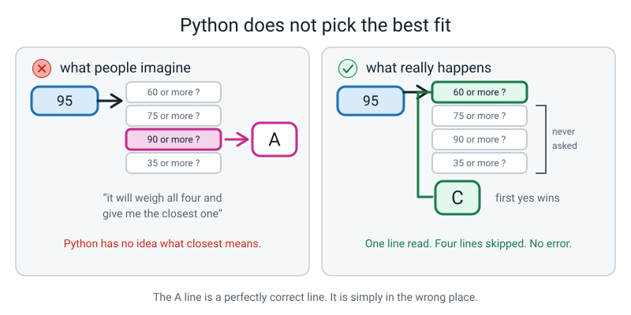
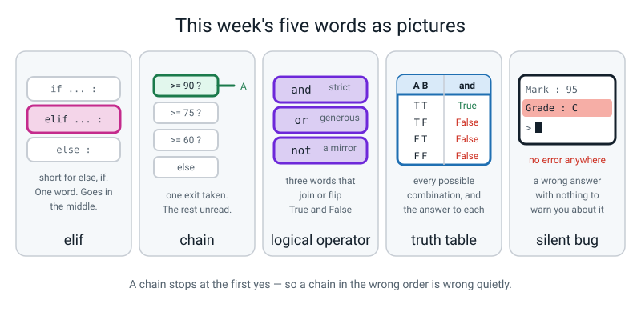

# Week 6 — More Than Two Doors: elif, and, or, not

[⬅ Week 5](week-05.md) · [Course Home](../README.md) · [Next ➡](week-07.md) · [Workbook](../workbook/week-06.md)

---

> ### This week in one sentence
> **An `if`/`elif`/`else` chain checks in order and stops at the first `True` — which is exactly how a correct-looking chain hides a wrong answer.**
>
> **By the end of this chapter you will be able to:**
> - Build an `if`/`elif`/`else` **chain** with four branches
> - Explain why **reordering** the branches changes the answer, with a worked example
> - Combine two conditions with **`and`**, **`or`** and **`not`**, and predict the result
> - Fill in the **truth tables** for `and` and `or` from scratch
> - Find a chain that awards everyone the same grade, fix it, and **prove** the fix with test values
>
> **New syntax:** `elif condition:` · `and` · `or` · `not`
>
> **Reading time:** about 30 minutes. **Homework:** about 60 minutes.

---

## 🪝 Start Here

I wrote you a grading program. You give it a mark out of a hundred and it gives you a letter grade. A is 90 and up, B is 75, C is 60, D is 35, and below that is an F.

Take a card. It says **95**.

Before we run anything: what grade should 95 be?

An A. Obviously.

Here is the real run:

```text
Mark out of 100? 95
Mark  : 95
Grade : C
```

Read it twice.

Run it again. Same answer: `C`.

Try 80. `C`. Try 62. `C`. Try 50 — `D`. Try 20 — `F`.

Now let's be precise about what we've got, because "it's broken" isn't precise enough to fix anything.

**Did it crash?** No. There is no red text anywhere. It ran five times, cleanly, and gave five answers.

**Is it always printing C?** No — 50 got a D and 20 got an F. **So parts of it are working.**

**Which marks are wrong?** 95 should be an A. 80 should be a B. 62 genuinely should be a C, so that one is right. So: **everybody who scored 60 or more gets a C, and nothing else does.**

And here is the thing to say out loud, because it has a name and you will meet it for the rest of your life.

> **silent bug** — a mistake that produces a wrong answer without producing any error message.

Python isn't confused. It isn't complaining. It isn't hiding anything. **It did exactly what the file said. The file says the wrong thing, and only a human can tell.**

Nobody is going to tell you what's wrong with this program. You are going to find it. And the tool you are going to use is your finger.


*Figure 6.1 — One mark walks in at the top and stops at the first gate that says yes. It never sees the gates below.*

---

## 🧠 The Big Idea

> **📌 About the code in this section.** The blocks below are **illustrations, not files**. They show you the shape of one idea, and each one carries on from the one above it — the `import` lines and the data are typed once, in the first block that needs them. **The complete, runnable file is in 💻 Type This.** If you copy a block from this section on its own and Python says `NameError`, that is why, and nothing is broken.

### 1. `elif` — the chain

**The plain explanation.** Last week's `if`/`else` gave you two doors. Two doors is not how anything real works. A cinema has infants, children, adults and seniors. A report card has A, B, C, D and F.

> **elif** — short for "else, if". It adds another condition to a chain, checked only if everything above it was `False`.
> **chain** — a run of `if` / `elif` / `elif` / … / `else` that belongs together. Exactly one branch of it runs.

`elif` sits between the `if` and the `else`, you can have as many as you like, and each one gets its own condition and its own colon.

```python
if mark >= 90:
    grade = "A"
elif mark >= 75:
    grade = "B"
elif mark >= 60:
    grade = "C"
elif mark >= 35:
    grade = "D"
else:
    grade = "F"
```

**The three rules of a chain, and they are the whole idea.** Be able to say all three.

1. **Python checks the conditions strictly from top to bottom.**
2. **The moment one is `True`, that branch runs and the whole rest of the chain is skipped.** Not "the best match" — the **first** match.
3. **Exactly one branch runs.** Never two. Never zero, if there is an `else` on the end.

Rule two is the one that matters, and the wording has to be exact. **Python does not pick the condition that fits best. Python has no idea what "best" means.** It picks the first one that says `True`, and then it stops looking. Full stop.

**The analogy.** A **queue of bouncers at one door.** Everybody who arrives walks up to bouncer number one. If bouncer one says yes, in you go — and bouncers two, three and four **never see you at all.** They don't get a vote. They don't know you existed.

Compare that with writing four separate `if` statements. Four separate `if`s are four separate doors with four separate bouncers, and **one person can walk through all four of them.** That is a genuinely different program:

```python
# four_doors.py - four separate ifs, not a chain.

mark = 95

if mark >= 90:
    grade = "A"
if mark >= 75:
    grade = "B"
if mark >= 60:
    grade = "C"

print(grade)
```

```text
C
```

A 95 walked through all three doors, and each one set `grade`, so you end up with whatever the **last** one set. A chain guarantees "exactly one branch". Separate `if`s guarantee nothing.

### 2. Every `elif` carries a condition you never typed

**The plain explanation.** This is the piece that makes the whole thing click, and it is worth being slow about.

Trace `mark = 62` through the chain in section 1:

- `62 >= 90`? No. Move on.
- `62 >= 75`? No. Move on.
- `62 >= 60`? **Yes.** → `grade = "C"`. **Stop.** The `>= 35` test and the `else` are never looked at.

Now notice what you did **not** have to write. You wrote `elif mark >= 60:`. You did **not** write `elif mark >= 60 and mark < 75:`. And yet the C branch correctly refuses to take a mark of 80.

Why? **Because you only ever reach that line if the two lines above it both said no.** So by the time Python is asking `mark >= 60`, it already knows the mark is under 75 and under 90.

**Every `elif` silently carries "…and nothing above me was true."** You never type it. Python adds it for free.

**The analogy.** It is like being at the back of a queue for the last three seats. You don't have to check whether the people in front of you got in — the fact that you're still standing there means they did not.

This is the single best argument for a chain over four separate `if`s, and it is worth saying as a sentence: **a chain lets you write one boundary per branch instead of two, and a boundary you do not write is a boundary you cannot get wrong.**


*Figure 6.2 — The dashed row is real. Python adds it for free, every time. That is why you never write "and less than 75".*

### 3. The order trap — the bug this whole week is built on

**The plain explanation.** Here is the program from the hook, in full. There is nothing wrong with it as far as Python is concerned. It runs perfectly. It is also wrong for everybody who passed.

```python
# grade.py - version 1. It runs without an error. It is also wrong.

mark = int(input("Mark out of 100? "))   # text in, whole number out

if mark >= 60:            # bouncer 1
    grade = "C"
elif mark >= 75:          # bouncer 2
    grade = "B"
elif mark >= 90:          # bouncer 3
    grade = "A"
elif mark >= 35:          # bouncer 4
    grade = "D"
else:                     # everybody else
    grade = "F"

print(f"Mark  : {mark}")
print(f"Grade : {grade}")
```

Five real runs:

```text
Mark out of 100? 95
Mark  : 95
Grade : C
```
```text
Mark out of 100? 80
Mark  : 80
Grade : C
```
```text
Mark out of 100? 62
Mark  : 62
Grade : C
```
```text
Mark out of 100? 50
Mark  : 50
Grade : D
```
```text
Mark out of 100? 20
Mark  : 20
Grade : F
```

**Now trace it with your finger.** Finger on the **first** condition. Not the second. The first. Read it out loud with the real number substituted in:

> "Is **95** sixty or more?" — Yes. → `grade = "C"` → **stop.**

So: does Python ever look at the line that says `>= 90`?

**No. Never. Not once. Not for any mark at all.** Think about that. Is there **any** number you could type that would reach that line?

There isn't. Any mark of 90 or more is also 60 or more, so bouncer one always catches it first. Those two branches — B and A — are code that can never, ever run. There is a name for that: **dead code.** It sits right there in the file, looking completely reasonable, and it is decoration.

**That is why this bug is so good. Nothing is wrong with the A line. The A line is perfect. The problem is entirely in what order the lines are in** — and no amount of staring at any single line will show you that.

**The fix, said as a rule rather than as a change:**

> **In a chain of overlapping conditions, put the most restrictive test first. For a chain of `>=` tests, that means the highest threshold at the top.**

```python
# grade.py - version 2. Highest threshold first, so each mark meets the right bouncer.

mark = int(input("Mark out of 100? "))   # text in, whole number out

if mark >= 90:            # bouncer 1 - the strictest test goes first
    grade = "A"
elif mark >= 75:          # bouncer 2 - only sees marks under 90
    grade = "B"
elif mark >= 60:          # bouncer 3 - only sees marks under 75
    grade = "C"
elif mark >= 35:          # bouncer 4 - only sees marks under 60
    grade = "D"
else:                     # everybody who got under 35
    grade = "F"

print(f"Mark  : {mark}")
print(f"Grade : {grade}")
```

The same five marks, run again, side by side with the broken version:

| Mark typed | Broken chain says | Fixed chain says | Different? |
|---|---|---|---|
| **95** | `C` | **`A`** | **yes** |
| **80** | `C` | **`B`** | **yes** |
| 62 | `C` | `C` | no |
| 50 | `D` | `D` | no |
| 20 | `F` | `F` | no |

**Look at the 62 row.** The broken and the fixed program agree. If you had tested only 62 and 50, you would have concluded the program was fine.

**Only 95 and 80 prove anything.** The other three answer identically on both versions, so running them tells you nothing at all about whether the fix worked. **A test that passes on both the broken and the correct version has told you nothing** — and that sentence is worth carrying for the rest of the year.


*Figure 6.3 — Nothing changed but the order of the questions. The three below the first one are never looked at.*

### 4. Coverage: no gaps, no overlaps

**The plain explanation.** Whenever you write a chain, check two things. It takes a minute and it catches nearly everything.

1. **No gaps.** Is every possible input handled? An `else` at the end guarantees this. Without one, some input falls off the end and **no branch runs at all** — and if that branch was the only place a variable got set, you get a `NameError` on a later, innocent-looking line.
2. **No wrong overlaps.** For each input, is the **first** matching branch the one you want?

**The concrete version.** Here is the coverage check for the fixed chain, written as a table. **A dash means "Python never even asked"**, because a branch above already matched.

| Mark | `>=90`? | `>=75`? | `>=60`? | `>=35`? | Branch taken | Right? |
|---|---|---|---|---|---|---|
| 100 | ✓ | — | — | — | A | ✔ |
| 90 | ✓ | — | — | — | A | ✔ boundary |
| 89 | ✗ | ✓ | — | — | B | ✔ |
| 75 | ✗ | ✓ | — | — | B | ✔ boundary |
| 74 | ✗ | ✗ | ✓ | — | C | ✔ |
| 60 | ✗ | ✗ | ✓ | — | C | ✔ boundary |
| 59 | ✗ | ✗ | ✗ | ✓ | D | ✔ |
| 35 | ✗ | ✗ | ✗ | ✓ | D | ✔ boundary |
| 34 | ✗ | ✗ | ✗ | ✗ | F | ✔ |
| 0 | ✗ | ✗ | ✗ | ✗ | F | ✔ |

Writing the **dashes** rather than a tick or a cross is worth doing, because it is the moment you see that most of the chain is skipped most of the time. For a mark of 100, Python read **one** condition out of four.

**The analogy.** Five bands and four boundaries, like a ruler with four marks on it. Every number from 0 to 100 lands in exactly one band. The values worth testing are the **pairs either side of each mark** — 89 and 90, 74 and 75, 59 and 60, 34 and 35. That is last week's rule, four times over.


*Figure 6.4 — Five bands, four boundaries, and every mark from 0 to 100 in exactly one band.*

### 5. `and`, `or`, `not` — three small words

**The plain explanation.** Real conditions are rarely one comparison. "Can I go out?" depends on the homework being done **and** it not raining.

> **logical operator** — a word (`and`, `or`, `not`) that combines or flips booleans.

| Operator | `True` when… | How to remember it |
|---|---|---|
| `A and B` | **both** are `True` | strict. Everything must pass. |
| `A or B` | **at least one** is `True` | generous. One is enough. |
| `not A` | `A` is `False` | a mirror. It flips. |

**The analogies, and they are worth keeping:**

- **`and` is ordering a pizza for two picky people.** Both have to approve the topping. One veto kills it.
- **`or` is a cricket team with two selectors.** If *either* selector likes you, you're in.
- **`not` is a mirror.** Whatever you show it, it shows the opposite.

> **truth table** — a table listing every possible combination of inputs to an operator, and the answer for each.

These never change and are worth memorising. There are only six rows in the world:

| A | B | `A and B` | `A or B` |
|---|---|---|---|
| `True` | `True` | **`True`** | **`True`** |
| `True` | `False` | `False` | **`True`** |
| `False` | `True` | `False` | **`True`** |
| `False` | `False` | `False` | `False` |

| A | `not A` |
|---|---|
| `True` | `False` |
| `False` | `True` |

**The concrete version.** Three one-line programs settle all six rows. **Predict each before you run it.**

```python
print(True and True, True and False, False and True, False and False)
```
```text
True False False False
```

```python
print(True or True, True or False, False or True, False or False)
```
```text
True True True False
```

```python
print(not True, not False)
```
```text
False True
```

**`and` says yes once out of four.** It is strict. **`or` says yes three times out of four.** It is generous. That pair of counts — one and three — is the fastest way to check you have written the tables the right way round.

**One warning about `or` that catches everybody.** Look at the first answer on the `or` line: **`True or True` is `True`.** In English, "you can have tea or coffee" means one, not both. In Python, `or` means *at least one, **and both is absolutely fine.*** Say that out loud; it is not obvious.


*Figure 6.5 — `and` says yes once out of four. `or` says yes three times out of four. `not` just flips.*

### 6. Real conditions, brackets, and the `or` trap

**The plain explanation.** Now with real comparisons instead of bare `True`s. Cricket team eligibility: a player must be **at least 13**, have played **at least 5 matches**, and **not** be injured.

```python
# team_check.py - three conditions joined into one answer.

age = 14           # how old the player is
matches = 7        # how many matches they have played
injured = False    # True if they are hurt right now

print(age >= 13)            # old enough?
print(matches >= 5)         # played enough?
print(not injured)          # not injured? (not flips True to False and back)
print(age >= 13 and matches >= 5 and not injured)   # all three at once
```

```text
True
True
True
True
```

Now the player twists an ankle. Change one line to `injured = True` and run the last line again:

```text
False
```

**One `False` anywhere in an `and` chain sinks the whole thing.** That is the strict one.

**Which happens first?** When you mix them, Python works in this order: **comparisons, then `not`, then `and`, then `or`.**

```python
print(True or False and False)
```
```text
True
```

Because `and` binds tighter, that is `True or (False and False)` = `True or False` = `True`. If you meant the other one, you have to write the brackets:

```python
print((True or False) and False)
```
```text
False
```

**Same words, same order, different answers.** The only difference is brackets.

> **The rule for your own sanity: whenever you mix `and` with `or`, put brackets in — even when you do not need them.** Not because Python needs them, but because a person reading your program should not have to know the precedence table.

**And now the trap that catches everybody exactly once.** This one produces a `True`-looking answer that has nothing to do with your question:

```python
# or_trap.py - a bug that prints something instead of crashing.
answer = "maybe"

print(answer == "yes" or "y")             # WRONG - and it does not crash
print(answer == "yes" or answer == "y")   # RIGHT - both sides are full comparisons
```

```text
y
False
```

**The first line printed the letter `y`.** You asked a yes/no question and got a letter back.

Here is why. `answer == "yes"` is `False`. Then Python works out `False or "y"`. Python's `or` does not hand back `True` or `False` — **it hands back the first side that counts as a yes**, and any non-empty piece of text counts as a yes. So the whole expression *is* `"y"`.

And inside an `if`, `"y"` counts as a yes:

```python
answer = "maybe"

if answer == "yes" or "y":      # WRONG
    print("You said yes!")
else:
    print("Not a yes.")
```

```text
You said yes!
```

**The branch runs no matter what the user typed.** A silent bug, and a very good one.

> **The rule: every side of an `or` must be a complete comparison.** `answer == "yes" or answer == "y"`, spelled out in full, both times.

---

## 💻 Type This

`grade.py`, in four passes. **Save the broken version separately as `grade_broken.py` before you fix it** — you will want to run them side by side, and comparing them is the point.

### Step 1 — the broken chain, traced by finger before it is touched

New file, **Save As** `grade_broken.py`, and type the version from section 3 exactly, wrong order and all.

Run it on all five marks: 95, 80, 62, 50, 20. You should get `C`, `C`, `C`, `D`, `F`.

Now, **on paper, not on the screen**, fill in this table for all five. Put a **dash** — not a cross — wherever Python never even asked the question.

| Mark | `>=60`? | `>=75`? | `>=90`? | `>=35`? | Branch | Should be | Right? |
|---|---|---|---|---|---|---|---|
| 95 | | | | | | | |
| 80 | | | | | | | |
| 62 | | | | | | | |
| 50 | | | | | | | |
| 20 | | | | | | | |

Two questions when you've finished it. **How many dashes are in the 95 row?** (Three.) **So how much of that five-branch chain did Python actually read?** (One line.)

And: **look at the 62 row. It says "right" — but is it right for the right reason?** No. It got a C because C was the first branch, not because it deserved a C. **The broken chain gives 100 a C too.**

### Step 2 — reorder it, and prove it

*Save the file again as `grade.py`. Now move the whole `>= 90` branch to the top, then `>= 75`, then `>= 60`, then `>= 35`.* **Two lines move together each time** — the condition and the line under it.

**Move them; don't retype them.** Cut and paste, so you can be certain nothing has changed except the order. If you retype five branches and it still fails, you won't know which bug you are looking at.

The result:

```python
# grade.py - version 2. Highest threshold first, so each mark meets the right bouncer.

mark = int(input("Mark out of 100? "))   # text in, whole number out

if mark >= 90:            # bouncer 1 - the strictest test goes first
    grade = "A"
elif mark >= 75:          # bouncer 2 - only sees marks under 90
    grade = "B"
elif mark >= 60:          # bouncer 3 - only sees marks under 75
    grade = "C"
elif mark >= 35:          # bouncer 4 - only sees marks under 60
    grade = "D"
else:                     # everybody who got under 35
    grade = "F"

print(f"Mark  : {mark}")
print(f"Grade : {grade}")
```

Run all five again, predicting each out loud first:

```text
Mark out of 100? 95
Mark  : 95
Grade : A
```

and then, in turn: `80 → B`, `62 → C`, `50 → D`, `20 → F`.

**Five out of five.** And the thing to write down: **62, 50 and 20 gave the same answer before and after.** Three of the five tests could not tell the two programs apart.

### Step 3 — the boundaries, and one character

**Five out of five, so we're finished, yes?** Let's check the edges, the same way as last week. **What are the four numbers where the grade changes?**

90, 75, 60, 35. So the interesting tests are those four and the one below each: 89, 90, 74, 75, 59, 60, 34, 35. Do four of them, predicting first:

| Mark | Grade |
|---|---|
| 90 | `A` |
| 89 | `B` |
| 35 | `D` |
| 34 | `F` |

All four right. **Now break one on purpose.** Change the first line from `>= 90` to `> 90` — the same one-character change as last week.

**Before you run: which of those eight boundary tests changes?**

Only 90. Run it:

```text
Mark out of 100? 90
Mark  : 90
Grade : B
```

**A mark of exactly ninety gets a B, and every other test you could possibly run still passes.** Put the equals sign back.

Bug Log row — and it is a silent one, so the "error" column says *no error message.*

### Step 4 — `and`, and half a comparison

*Add this at the bottom of the file. You get a star if you scored ninety or more **and** you handed the work in on time — written the way English says it, which is wrong.*

```python
on_time = True

if mark >= 90 and <= 100:
    print("Star!")
```

Run it:

```text
  File "/Users/you/ai-academy/level2/grade.py", line 21
    if mark >= 90 and <= 100:
                      ^^
SyntaxError: invalid syntax
```

**Read the last line.** `SyntaxError` — Python couldn't even read it. And look where the carets are: **under the `<=`.**

Here is the rule. **Each side of an `and` has to be a complete comparison, with both of its ends.** `<= 100` is only half a question — less than or equal to a hundred, but **what** is? Python has no idea. In English you are allowed to leave the subject out and everyone follows along. Python is not a person.

Fix it to what we actually meant:

```python
on_time = True                      # did the work arrive on time?

if mark >= 90 and on_time:          # both must be true
    print("Star!")
```

Three real runs. With `on_time = True`, typing 95:

```text
Mark out of 100? 95
Mark  : 95
Grade : A
Star!
```

Now change the file to `on_time = False` and type 95 again:

```text
Mark out of 100? 95
Mark  : 95
Grade : A
```

No star. And back to `on_time = True`, typing 80:

```text
Mark out of 100? 80
Mark  : 80
Grade : B
```

No star either. **One `False` anywhere in an `and` sinks the whole thing.**

Bug Log row.

---

## 🔍 Worked Examples

### Worked Example 1 — The tuck-shop discount (food)

Four bands, `>=` tests, **highest threshold first**, and two derived numbers.

```python
# tuck_shop.py - one basket total in, one discount band out.

total = int(input("Basket total in rupees? "))    # whole rupees -> int()

if total >= 300:              # bouncer 1 - the strictest test first
    percent_off = 15
    band = "gold"
elif total >= 200:            # bouncer 2 - only sees totals under 300
    percent_off = 10
    band = "silver"
elif total >= 100:            # bouncer 3 - only sees totals under 200
    percent_off = 5
    band = "bronze"
else:                         # everybody under 100
    percent_off = 0
    band = "none"

discount = round(total * percent_off / 100, 2)    # derived: rupees off
to_pay = round(total - discount, 2)               # derived: what to actually pay

print(f"Total    : {total} rupees")
print(f"Band     : {band} ({percent_off}% off)")
print(f"Discount : {discount:.2f} rupees")
print(f"To pay   : {to_pay:.2f} rupees")
```

Both sides of every boundary — 99/100, 199/200, and 300:

```text
Total    : 99 rupees
Band     : none (0% off)
Discount : 0.00 rupees
To pay   : 99.00 rupees
```
```text
Total    : 100 rupees
Band     : bronze (5% off)
Discount : 5.00 rupees
To pay   : 95.00 rupees
```
```text
Total    : 199 rupees
Band     : bronze (5% off)
Discount : 9.95 rupees
To pay   : 189.05 rupees
```
```text
Total    : 200 rupees
Band     : silver (10% off)
Discount : 20.00 rupees
To pay   : 180.00 rupees
```
```text
Total    : 300 rupees
Band     : gold (15% off)
Discount : 45.00 rupees
To pay   : 255.00 rupees
```

**Check the arithmetic:** 5% of 100 is 5 ✔. 10% of 200 is 20 ✔. 15% of 300 is 45 ✔.

**Now the interesting question.** A basket of 199 pays 189.05. A basket of 200 pays 180.00. **Spend one rupee more and pay nine rupees less.** That is not a bug — it is what happens whenever you turn a number into a band. Every boundary you draw does something odd to the people standing on it.

### Worked Example 2 — One innings (sport)

A chain for the verdict, plus a separate `if` with an `and` in it — because "not out" is a completely different question from "how big was the score".

```python
# innings.py - one score in, one verdict out, with a bonus that needs `and`.

runs = int(input("Runs scored?        "))          # whole number -> int()
balls = int(input("Balls faced?        "))         # whole number -> int()
out = input("Were you out? (yes/no) ")             # text, exactly as typed

if runs >= 100:               # bouncer 1 - strictest first
    verdict = "century"
elif runs >= 50:              # bouncer 2 - only sees scores under 100
    verdict = "half century"
elif runs >= 25:              # bouncer 3 - only sees scores under 50
    verdict = "solid start"
else:                         # everybody under 25
    verdict = "early out"

strike_rate = round(runs / balls * 100, 2)         # derived: runs per 100 balls

# A "not out fifty" is worth saying out loud - both halves must be true.
if runs >= 50 and out == "no":
    print("*** NOT OUT ***")

print(f"Score       : {runs} off {balls}")
print(f"Verdict     : {verdict}")
print(f"Strike rate : {strike_rate:.2f}")
```

```text
Runs scored?        112
Balls faced?        89
Were you out? (yes/no) yes
Score       : 112 off 89
Verdict     : century
Strike rate : 125.84
```
```text
Runs scored?        64
Balls faced?        40
Were you out? (yes/no) no
*** NOT OUT ***
Score       : 64 off 40
Verdict     : half century
Strike rate : 160.00
```
```text
Runs scored?        27
Balls faced?        33
Were you out? (yes/no) yes
Score       : 27 off 33
Verdict     : solid start
Strike rate : 81.82
```
```text
Runs scored?        6
Balls faced?        11
Were you out? (yes/no) yes
Score       : 6 off 11
Verdict     : early out
Strike rate : 54.55
```

And the boundary — exactly 50, not out:

```text
Runs scored?        50
Balls faced?        44
Were you out? (yes/no) no
*** NOT OUT ***
Score       : 50 off 44
Verdict     : half century
Strike rate : 113.64
```

**Two things to notice.**

**The `and` earns its keep.** Take away the `out == "no"` half and a batter who was bowled for 112 gets a "NOT OUT" banner. Take away the `runs >= 50` half and every 3-run innings that ended not out gets one too. Both halves are doing work.

**And there is an honest flaw.** Type `No` with a capital N and the banner does not appear, because `"No" == "no"` is `False`. The tool for that is `.lower()`, which flattens text to small letters before comparing — `out.lower() == "no"`. Use it if you like; what a *method* actually is comes later. **The program has this flaw. Saying so is better than pretending the prompt solves it.**

### Worked Example 3 — The attendance report (school)

A chain on a **derived** value, which is the shape most real programs have: work out a number, then band it.

```python
# attendance.py - days present in, one report line out.

term_days = 60                                        # school days in the term

present = int(input("Days present out of 60? "))      # whole number -> int()

percent = round(present / term_days * 100, 1)         # derived: nobody typed this

if percent >= 95:             # bouncer 1 - strictest first
    band = "excellent"
    note = "Nothing to worry about."
elif percent >= 90:           # bouncer 2 - only sees under 95
    band = "good"
    note = "Fine, but watch it."
elif percent >= 80:           # bouncer 3 - only sees under 90
    band = "concern"
    note = "A letter goes home."
else:                         # everybody under 80
    band = "serious concern"
    note = "A meeting is arranged."

print(f"Present : {present} of {term_days} days")
print(f"That is : {percent:.1f}%")
print(f"Band    : {band}")
print(note)
```

Both sides of two boundaries, plus the ends:

```text
Present : 60 of 60 days
That is : 100.0%
Band    : excellent
Nothing to worry about.
```
```text
Present : 57 of 60 days
That is : 95.0%
Band    : excellent
Nothing to worry about.
```
```text
Present : 56 of 60 days
That is : 93.3%
Band    : good
Fine, but watch it.
```
```text
Present : 54 of 60 days
That is : 90.0%
Band    : good
Fine, but watch it.
```
```text
Present : 53 of 60 days
That is : 88.3%
Band    : concern
A letter goes home.
```
```text
Present : 47 of 60 days
That is : 78.3%
Band    : serious concern
A meeting is arranged.
```

**The interesting bit is finding the boundary at all.** The thresholds are 95, 90 and 80 — but you type *days*, not percentages. So the boundary pairs are 57/56 and 54/53, and you have to work them out: 95% of 60 is 57, and 90% of 60 is 54.

**That is a real testing skill.** The number in your condition is not always the number the human types, and the values worth testing are the ones either side of the boundary **in the units the human uses.**

---

## 🐞 When It Breaks

Every message below came from really running a broken version of this week's code.

Something different about this week: **most of its bugs have no error message at all.** Five of the twelve rows in the clinic table below are silent. That is not bad luck — it is what `elif` bugs are like, because every individual line in a broken chain is a correct line.

### Break 1 — an `elif` after the `else`

```python
mark = 62

if mark >= 90:
    grade = "A"
else:
    grade = "F"
elif mark >= 75:
    grade = "B"
print(grade)
```

```text
  File "/Users/you/ai-academy/level2/a.py", line 7
    elif mark >= 75:
    ^^^^
SyntaxError: invalid syntax
```

**What Python is telling you.** *"An `elif` turned up where I wasn't expecting one."* The `else` means "everything left over", so there is nothing that can come after it.

**The fix.** Move the `elif` **above** the `else`. Nothing comes after an `else` — it is always last.

### Break 2 — half a comparison

```python
mark = 62

if mark >= 60 and <= 74:
    print("C")
```

```text
  File "/Users/you/ai-academy/level2/c.py", line 3
    if mark >= 60 and <= 74:
                      ^^
SyntaxError: invalid syntax
```

**What Python is telling you.** *"That's only half a comparison."* The carets land exactly on the `<=`.

**The fix.** Spell both sides out: `if mark >= 60 and mark <= 74:`. Or, more neatly, `if 60 <= mark <= 74:` — Python lets you write a range the way maths does.

> **💡 Try this:** if you *can* write `60 <= mark <= 74`, why did the grade chain not need it? Because the chain supplies the upper bound for free (section 2). **A number you don't write is a number you can't get wrong.**

### Break 3 — the chain with a gap in it

```python
mark = int(input("Mark out of 100? "))

if mark >= 90:
    grade = "A"
elif mark >= 75:
    grade = "B"

print(f"Grade : {grade}")
```

Typing `95` it works fine. Typing `62`:

```text
Mark out of 100? 62
Traceback (most recent call last):
  File "/Users/you/ai-academy/level2/d.py", line 8, in <module>
    print(f"Grade : {grade}")
NameError: name 'grade' is not defined
```

**What Python is telling you.** *"You're printing a box that was never filled."*

**The fix.** Add an `else` on the end. Always.

**The error is on line 8 and the mistake is the missing `else`.** A chain without an `else` has a gap in it **by definition** — some input matches nothing, no branch runs, and nothing gets set. Even `else: grade = "???"` is better than nothing, because `???` in the output is a message from you to future-you.

### The whole clinic, for reference

| What you see | What it means | The fix |
|---|---|---|
| `SyntaxError: invalid syntax` with `^^^^` under `elif` | An `elif` after the `else`, or an `elif` with no `if` above it | The `else` is always last, and every chain starts with an `if` |
| `SyntaxError: invalid syntax` with `^` under `&&` | `&&` is not a Python word | Python spells it `and`. Likewise `or`, not `\|\|`, and `not`, not `!` |
| `SyntaxError: expected ':'` on `else if mark >= 75:` | Python's spelling is `elif`, one word | `elif`. No space |
| `SyntaxError: invalid syntax` with `^^` under `<=` | Half a comparison — the subject is missing | `mark >= 60 and mark <= 74`, or `60 <= mark <= 74` |
| `SyntaxError: expected ':'` at the end of a long condition | The colon fell off while you were editing | Add it. Python points at the exact character |
| `IndentationError: unindent does not match any outer indentation level` pointing at `elif` | This `elif` lines up with nothing | **`if`, every `elif` and the `else` must all sit at exactly the same distance from the left edge** |
| `NameError: name 'grade' is not defined` on the final `print` | A chain with no `else`, and an input that matched nothing | Add an `else` |
| **No error, and everybody who passes gets a C** | It ran the first branch that said yes | Reorder: highest threshold first. **This is the whole lesson** |
| **No error, and one branch never runs whatever you type** | Dead code — a branch fully covered by one above it | Trace a value that *should* reach it and find which line catches it first |
| **No error, and a mark of exactly 90 gets a B** | `> 90` where `>= 90` was meant | One character. And *only* the value 90 reveals it |
| **No error, and a branch runs whatever the user types** | `or` handed back a piece of text, and text counts as a yes | `answer == "yes" or answer == "y"`. Every side of an `or` must be a full comparison |
| **No error, and `No` misses the "not out" banner** | `"No" == "no"` is `False` — case always matters | Type it in small letters, or use `out.lower() == "no"`, which flattens the text before comparing |

> **🐞 If there is no error message at all:** reading the code will not find an ordering bug, because every individual line is correct. **Tracing** will. Four steps, and do them out loud:
>
> 1. Put a **finger** on the first condition. Not the second. The first.
> 2. Say the condition **with the real number substituted in** — not "if mark is 60 or more" but "**is 95 sixty or more?**"
> 3. Say the answer, then move the finger: down one if it was no, **out of the chain entirely** if it was yes.
> 4. Whatever line the finger lands on, that is the answer, whether you like it or not.
>
> Out loud matters, because silent tracing lets your brain skip to what it expected. Substituting the number matters, because "is mark 60 or more" can be nodded at, and "**is 95 sixty or more?**" cannot.

---

## 🎲 What We Did In Class

### The hook, in silence

The broken `grade.py`, five index cards — 95, 80, 62, 50, 20 — handed over one at a time. Every mark of 60 or more came out as a `C`. No error. No warning. 50 got a `D` and 20 got an `F`, which is what proved the program wasn't simply broken all over.

Then four questions: did it crash (no) · is it C for everything (no) · which marks are wrong (everything 60 and up) · **which of those five results would a correct program also give?** (62, 50 and 20 — three of five.)

### The queue of bouncers

Three rules, written up and said back:

```
   1.  Python checks the conditions from TOP to BOTTOM.
   2.  The FIRST one that is True wins. Everything below it is skipped completely.
   3.  Exactly ONE branch runs. Never two. Never none, if there's an else.
```

Then the trace of 95 with a finger, out loud: *"Is 95 sixty or more? Yes. Grade C. **Stop.**"* And the question that lands it: **is there any mark at all that reaches the `>= 90` line?** No. Those two branches are **dead code**.

### Fix it, then prove it

The four branches cut and pasted into the right order — highest threshold first — and all five marks run again: `A`, `B`, `C`, `D`, `F`.

Then the boundary check: 90 → `A`, 89 → `B`, 35 → `D`, 34 → `F`. Then `>= 90` broken to `> 90` on purpose, and only **one** test out of eight noticed: a mark of exactly 90 came out as `B`.

### Truth tables from memory, laptop closed

Both tables written from memory first, then checked with three one-line programs:

```text
True False False False
True True True False
False True
```

The row nearly everybody gets wrong is `True or True`. In English "tea or coffee" means one. In Python `or` means **at least one, and both is fine.**

Then the precedence pair, predicted first:

```python
print(True or False and False)      # True
print((True or False) and False)    # False
```

Same words, same order. **Only the brackets differ.**

### The `and` that came out as a `SyntaxError`

```python
if mark >= 90 and <= 100:
```

```text
SyntaxError: invalid syntax
```

with the carets under the `<=`. Each side of an `and` needs to be a whole question. Fixed to `if mark >= 90 and on_time:`, then run three ways: 95 with `on_time = True` gets a star, 95 with `on_time = False` doesn't, and 80 doesn't either.

### The two bugs that went in the Bug Log

1. **No error message.** A mark of 90 came out as a `B`, because `> 90` had been written instead of `>= 90`. Every other test still passed.
2. `SyntaxError: invalid syntax`, carets under the `<=` in `if mark >= 90 and <= 100:`. Each side of an `and` has to be a complete comparison.

---

## 💬 Talk About It

**1. "Why doesn't Python just work out which branch I meant?"**

*Hint:* look at the broken chain from Python's point of view. It is a perfectly sensible program that says "anyone with sixty or more gets a C". Nothing in the file says the A branch was *supposed* to be reachable. To spot the bug, Python would have to know that grades are meant to be ordered, that higher marks should get better letters, and that you didn't intend two branches to be unreachable — and all three of those live in your head, not in the file. Then the harder question: could a tool warn you that a branch can **never** run? (Some tools for other languages do exactly that. Why might that be difficult, and what would you lose if it did?)

**2. "The grade chain draws four lines. One student got 89, another got 90."**

*Hint:* how different is what those two people know? One mark out of a hundred. How different is what the report card says about them? A whole grade. Is there a way to write this program that doesn't have that problem — **as long as the output is a letter?** Work at it until you're sure the answer is no. Then: what are the two honest things a program could do instead?

**3. "Is a silent bug worse than a crash?"** *(Say yes, and then say why that answer is too easy.)*

*Hint:* a crash tells you it happened. A silent bug survives — into your homework, into the grades that got printed, into next term. Run the broken chain on a real class of thirty and thirty wrong grades go out and nobody finds out. But push on the "almost": name a machine where **stopping** is the dangerous outcome. Then find the thing that is true without any qualification at all: a silent bug is worse **for the person who has to find it**, and while you are testing, that person is you.

---

## ⚠️ Don't Get Tricked

### Trick 1 — "Python picks the branch that fits best"


*Figure 6.6 — Left: what people imagine. Right: what actually happens. One line read, four skipped, no error.*

| ❌ Wrong | ✅ Right |
|---|---|
| "95 is closest to 90, so it takes the A branch." | Python checks **top to bottom** and takes the **first** `True`. It has no idea what "closest" means. |

The way this shows up: a student sees the A branch not running and starts editing the `elif mark >= 90:` line — which is completely correct. The question that redirects it: **before Python can even look at that line, what has to have happened?** (Every line above it must have said no.) **And did they?**

### Trick 2 — "`or` means one or the other, not both"

| ❌ Wrong | ✅ Right |
|---|---|
| `True or True` is `False`, because you can't have both. | `True or True` is `True`. Python's `or` means **at least one, and both is fine.** English "or" is often exclusive; Python's never is. |

### Trick 3 — "I can write a condition the way I'd say it"

| ❌ Wrong | ✅ Right |
|---|---|
| `if mark >= 60 and <= 74:` | `if mark >= 60 and mark <= 74:` — or `if 60 <= mark <= 74:`. **Each side of an `and` is a whole question with both of its ends.** |

English lets you drop the subject in the second half and everybody follows. Python gives you a `SyntaxError` with the carets on the `<=`.

### Trick 4 — "five passing tests prove the fix"

| ❌ Wrong | ✅ Right |
|---|---|
| "All five marks come out right now, so the reorder worked." | **Only 95 and 80 prove anything.** 62, 50 and 20 give identical answers on the broken and the fixed version, so they proved nothing at all. |

A test that passes on both the broken and the correct version has told you nothing. Say it twice; it comes back in a much bigger form in Week 29.

---

## 🌍 Where You've Seen This

1. **Every report card you have ever been given.** A number turned into a letter by a chain of thresholds — and the boundary problem is right there in the paper: somebody got 89.
2. **Your phone's battery icon.** Full, fine, charge soon, charge **now** — four bands off one number, and somebody had to choose the boundaries and put them in the right order.
3. **Discount tiers on a shopping site.** Spend 300 and get 15% off, spend 199 and get 5%. Worked Example 1 is a real screen you have seen, including the one-rupee cliff.
4. **A game's difficulty rating, or a star rating out of five.** Same shape: a number in, a band out.
5. **An air-quality or UV index — "good, moderate, unhealthy".** A chain of thresholds published by a government, argued about by scientists, because **where the boundaries go is a decision, not a discovery.**
6. **A cinema's ticket page with infant / child / adult / senior prices.** Notice those use `<` rather than `>=`, so the **lowest** threshold has to go first. The rule isn't "highest number at the top" — it is **"most restrictive first"**, and which number that is depends on which way the comparison points.
7. **Any "did you mean yes?" box that accepts your answer no matter what you type.** Somebody wrote `if answer == "yes" or "y":` and never found out.

---

## 🧭 Where This Fits

Same box as last week, and the gold will stay there for a while: *choices and loops* is a big tile. Week
5 gave you one question with two answers. Week 6 gives you a **queue** of questions — and the order you
put them in turns out to be part of the answer.


*Figure 6.0 — The pipeline after Week 6. Gold is where you are, white-and-solid is done, dashed is not
yet. The strip along the bottom is the seven threads this course keeps returning to.*

| | |
|---|---|
| **The mental model you now own** | An `if`/`elif`/`else` chain is checked **in order** and stops at the **first** `True`. So the order you ask the questions in is part of the answer — and a wrong order still runs perfectly happily, with no error at all. |
| **The one question it answers** | *"Why does my grade chain give everybody an A?"* Because the first question was too easy to pass, and nothing below it ever got asked. |
| **What it plugs into** | Week 5's single `if`/`else`, stretched into a chain that can now be **wrong quietly** — which is a new and more grown-up kind of bug than a traceback. |
| **What carries forward** | Week 8's loop conditions. Week 15's row filters. And Week 31's **decision tree**, which is nothing more mysterious than a stack of yes/no questions asked in a particular order. |
| **Spiral thread** | 🧰 **Toolcraft** — lit alone still. Keep the phrase *"most restrictive first"* somewhere safe; you will want it again in Week 31. |

> **💡 Try this:** under the gold tile on your map, write **order matters** and underline it twice. It is
> the first bug this year that Python will not warn you about, and spotting those yourself is the skill
> the rest of the map is built on.

---

## 🔑 Remember This

- **`elif` is short for "else, if".** One word, no space, its own condition, its own colon.
- **A chain checks top to bottom and stops at the first `True`.** Not the best match. The **first** match.
- **Exactly one branch of a chain runs** — never two, and never zero if there is an `else`.
- **Order from most restrictive to least.** For `>=` tests that means highest threshold first; for `<` tests it means lowest first.
- **Every `elif` carries "and nothing above me was true" for free.** That is why you write one boundary per branch instead of two.
- **Always put an `else` on the end.** A chain without one has a gap in it by definition.
- **`and` is strict — True in one row of four. `or` is generous — True in three of four**, including the both-True row.
- **Every side of an `or` must be a complete comparison.** `answer == "yes" or "y"` runs for every input.
- **When you mix `and` with `or`, write the brackets** even when Python doesn't need them.
- **A test that passes on both the broken and the fixed version has told you nothing.**

### Syntax reminder card

```python
if mark >= 90:            # strictest test FIRST
    grade = "A"
elif mark >= 75:          # only ever sees marks under 90
    grade = "B"
elif mark >= 60:          # only ever sees marks under 75
    grade = "C"
else:                     # always put one on. It is the no-gaps guarantee.
    grade = "F"

print(True and True, True and False, False and True, False and False)
# True False False False        and: strict. One row out of four.

print(True or True, True or False, False or True, False or False)
# True True True False          or: generous. Three rows out of four.

print(not True, not False)
# False True                    not: a mirror.

print(age >= 13 and matches >= 5 and not injured)   # every side a full comparison
print((True or False) and False)                    # brackets when you mix them

# if answer == "yes" or "y":         WRONG - runs for every input
if answer == "yes" or answer == "y":  # RIGHT - both sides spelled out
    print("yes")
```

---

## 📓 New Words


*Figure 6.7 — This week's five words, drawn.*

| Word | What it means | Example |
|---|---|---|
| **elif** | Short for "else, if" — another condition in a chain, checked only if everything above it was `False` | `elif mark >= 75:` |
| **chain** | A run of `if` / `elif` / … / `else` that belongs together. Exactly one branch runs | the five-branch grade chain |
| **logical operator** | A word that combines or flips booleans: `and`, `or`, `not` | `age >= 13 and not injured` |
| **truth table** | A table of every possible combination of inputs to an operator, and the answer for each | `and` is `True` in one row out of four |
| **silent bug** | A mistake that gives a wrong answer with no error message at all | a 95 coming out as a `C` |

---

## 📤 Your Homework

Go to **[the Week 6 workbook](../workbook/week-06.md)**. About **60 minutes** in total.

| Section | What to do | Time |
|---|---|---|
| **Warm-Up** | Five quick questions from Week 5 | 5 min |
| **Predict the Output** | Four snippets. Some produce **no error at all**, so "what do you expect" means "what will it print" | 10 min |
| **Practice A & B** | Six reading questions, then five you write yourself | 20 min |
| **Fix the Broken Program** | A library fine calculator with three planted bugs | 10 min |
| **Build It** | Trace the broken grade chain, fix it, and **prove** the fix | 15 min |

**Three things I am marking hardest.**

**The truth tables get written from memory with the laptop shut**, and then checked by running four one-line programs. If you get the `True or True` row wrong you are in extremely normal company — it is the one everybody misses.

**In the trace table, put a dash — not a cross — wherever Python never even asked the question.** The dashes are the lesson.

**And then put the broken answers and the fixed answers side by side and circle the rows that prove the fix.** Not all five of them do. Tell me which ones told you nothing, and why.

> **💡 Try this:** lay four condition cards out on a table in an order you choose in secret, then get somebody else to work out what grade a mark of 80 comes out as. Building a chain where everybody gets a D on purpose is a better test of whether you understand this than fixing mine.

---

[⬅ Week 5](week-05.md) · [Course Home](../README.md) · [Week 7 ➡](week-07.md) · [📓 Workbook — Week 6](../workbook/week-06.md) · [Glossary](../../glossary.md)
