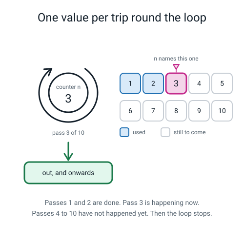
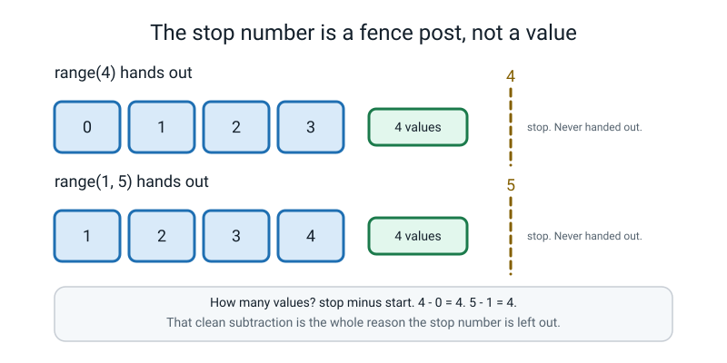
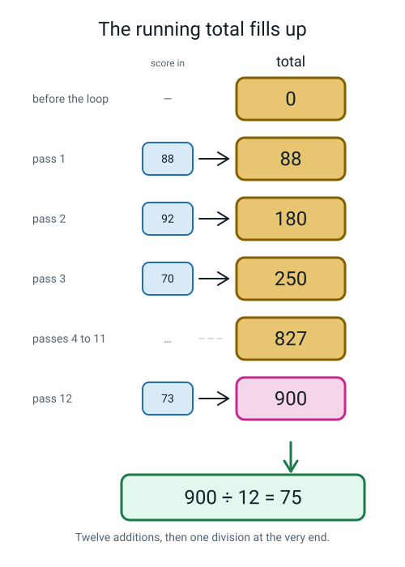
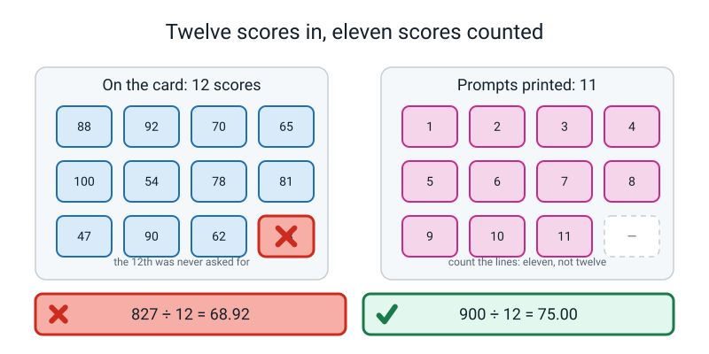
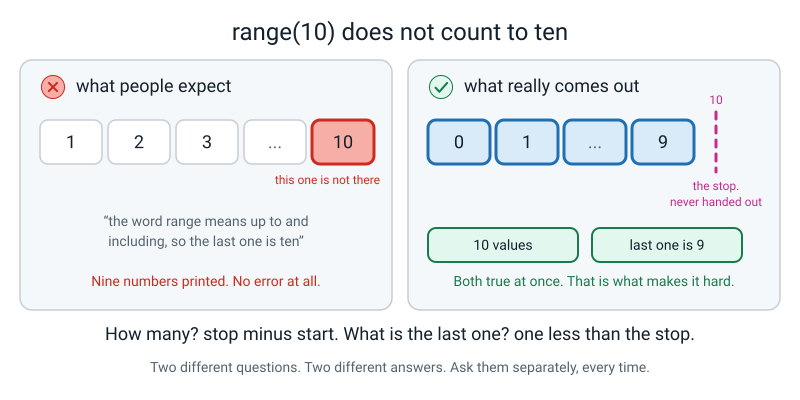
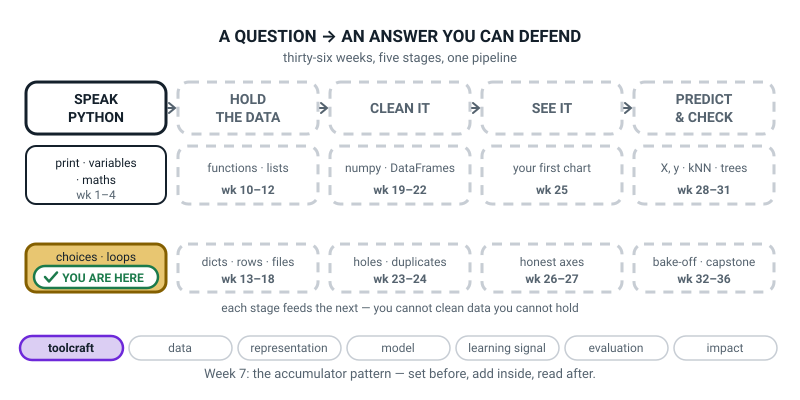
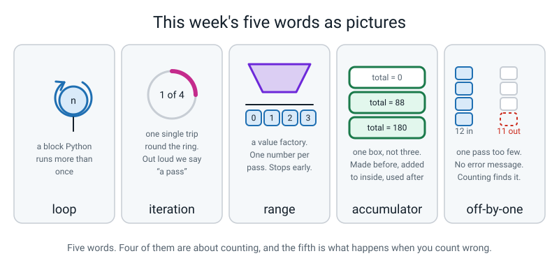

# Week 7 — Doing It 100 Times Without Typing It 100 Times

[⬅ Week 6](week-06.md) · [Course Home](../README.md) · [Next ➡](week-08.md) · [Workbook](../workbook/week-07.md)

---

> ### This week in one sentence
> **A `for` loop repeats a block once per item, and an accumulator variable carries a running total across the repeats.**
>
> **By the end of this chapter you will be able to:**
> - Write a `for` loop over `range()` and **predict exactly how many times it runs** before you run it
> - Explain why `range(4)` gives 0, 1, 2, 3 and **not** 1, 2, 3, 4
> - Build an **accumulator** that totals a set of numbers, then divide to get an average
> - Hand-check that average **on paper**, showing the division, and match it to the program's answer
> - Find an **off-by-one** bug by counting output lines against input items — twelve in, eleven out
>
> **New syntax:** `for i in range(n):` · `range(start, stop, step)` · `total += x` · `"=" * 20` · `print(x, end=" ")`
>
> **Reading time:** about 30 minutes. **Homework:** about 60 minutes.

---

## 🪝 Start Here

Here is a job. I want the seven times table on the screen. Seven ones are seven, all the way to seven tens are seventy. Ten lines, exactly like this:

```text
7 x 1 = 7
```

You already know everything you need. `print`, a bit of text, some maths.

**You have sixty seconds. Go.**

...

Sixty seconds is up. How many did you get? Four? Five? Your hands were getting bored somewhere around `7 x 4 = 28`, weren't they.

Now the real question. **How long would the thirteen times table take?** The same. Another minute, from scratch, with a fresh chance to typo in every line.

And the thirteen times table **up to a hundred**? A hundred lines. Ten minutes of typing, minimum. A hundred separate chances to type `13 x 47 = 611` when the answer is 611 — or 610, or 6111, and nothing on earth will tell you which one you got wrong.

Here is the whole thing, done properly:

```python
for n in range(1, 11):             # n takes 1, 2, 3 ... 10  (stops BEFORE 11)
    print(f"7 x {n} = {7 * n}")    # indented, so this line belongs to the loop
```

```text
7 x 1 = 7
7 x 2 = 14
7 x 3 = 21
7 x 4 = 28
7 x 5 = 35
7 x 6 = 42
7 x 7 = 49
7 x 8 = 56
7 x 9 = 63
7 x 10 = 70
```

**Count the `print` lines in the file. There is one.** Count the lines that came out. There are ten.

And now do the thing that makes this week worth a week. **Change the 7 to a 13.** One character. Run it again. The thirteen times table, all ten rows, correct. Change `11` to `101` and you have the thirteen times table up to a hundred, in the time it took to type three digits.

> **loop** — a block of code that Python runs more than once.

This is the week programs stop being the same length as the job they do. Everything until now has been one line of code per thing that happens. From today, **three lines of code can do a hundred things** — and that changes what a program *is*.


*Figure 7.1 — The hub is the counter. Each trip round, it holds exactly one of the values `range` handed out. Passes 1 and 2 are done; pass 3 is happening; passes 4 to 10 have not happened yet.*

---

## 🧠 The Big Idea

> **📌 About the code in this section.** The blocks below are **illustrations, not files**. They show you the shape of one idea, and each one carries on from the one above it — the `import` lines and the data are typed once, in the first block that needs them. **The complete, runnable file is in 💻 Type This.** If you copy a block from this section on its own and Python says `NameError`, that is why, and nothing is broken.

### 1. `i` is a box **Python** fills in, not one you fill in

**The plain explanation.** Look at the letter `n` on the first line of that loop. It is a **variable** — a box with a name on it, exactly like `pizza_price` in Week 2. But there is one difference, and it is the only new idea in the first half of this week:

> **You do not put anything in this box. Python does. Once per pass.**

First pass, Python puts 1 in it and runs the indented line. Comes back. Puts 2 in it. Runs the indented line. Comes back. Puts 3 in. And on, until it runs out of values — and then it stops **on its own** and carries on with whatever comes after the loop.

You never write `n = 1`. You never write `n = n + 1`. If you catch yourself typing either of those, something has gone wrong in your head about what the `for` line is *for*.

> **iteration** — one single run through the block. Ten numbers came out above, so there were ten iterations. Out loud, "iteration" and "pass" mean the same thing, and "pass" is the shorter word.

**The analogy.** A **cup on a table, and a stack of cards face down beside it.** Python takes the top card and drops it in the cup. You read what is in the cup and do the job. Python **takes that card out** and drops the next one in. There is only ever *one* thing in the cup. That is why you cannot get at pass one's number during pass two — it is gone. When the cards run out, the loop stops. Nobody told it to stop; it ran out.

**The concrete version.** Six parts to that one line, and a student who can name all six can debug it. A student who has memorised its shape cannot.

| Part | What it is | What happens if you get it wrong |
|---|---|---|
| `for` | The keyword that starts a loop | Nothing else starts a loop. There is no other spelling |
| `n` | **A variable Python fills in for you.** You choose the name; Python chooses the value, once per pass | Any legal name works. `for row`, `for score`, `for day` — all fine, and usually better than `i` |
| `in` | A keyword. It sits between the name and the values | Leave it out and you get a `SyntaxError` |
| `range(1, 11)` | Where the values come from | Give it text instead of a number and you get a `TypeError` |
| `:` | The colon. "The indented block below belongs to me" | Leave it out and you get `SyntaxError: expected ':'` |
| the indent | Four spaces. **Indentation is how Python knows what to repeat** | Get it wrong and either nothing repeats, or the wrong thing does |

**And the indent is not decoration.** In Python it is the actual grammar. Here is the proof. Two programs; the only difference between them is four spaces:

```python
total = 0
for n in range(1, 4):
    total += n
    print(f"inside : total is {total}")
print(f"outside: total is {total}")
```

```text
inside : total is 1
inside : total is 3
inside : total is 6
outside: total is 6
```

**Three lines from the indented `print`. One line from the `print` at the margin.** Move a line out of the indent and it stops being part of the loop.

### 2. `range` stops **before** the number you give it

**The plain explanation.** Where do the numbers come from? From `range`.

> **range** — a value factory. You tell it where to start, where to stop, and how big a step to take, and it hands out one whole number per pass.

And now the thing that catches every single person who learns to program. Type this and count what comes out:

```python
for n in range(4):
    print(n)
```

```text
0
1
2
3
```

**How many numbers?** Four. **What is the last one?** Three.

Both of those are true at the same time, and that is exactly what makes it hard. `range(4)` hands out **four values, and the last one is 3.** It starts at zero, and it stops *before* the number you gave it.

Say it out loud: **"range stops before the number you give it."** Say it again, and this time say it like you are annoyed about it. It is worth the theatre — this one sentence saves you an hour of confusion in about three weeks.

**Now — why?** Because it is not random, and knowing the reason is what makes it stick.

**Because it makes counting a subtraction.** `range(a, b)` hands out exactly `b - a` values. Every time. No exceptions.

- `range(1, 11)` → 11 − 1 = **ten** values
- `range(0, 4)` → 4 − 0 = **four** values
- `range(3, 20)` → 20 − 3 = **seventeen** values

You never have to think "the difference, plus one". If `range` included the stop number, then *every single count in every program in the world* would be "the difference, plus one" — and **that** plus-one would be the thing everybody got wrong instead. They moved the problem to the place where it is easiest to remember.

**The analogy.** A **fence**. If you want four fence panels, you count up to the fifth post and stop there. The fifth post is where you stop; it is not a panel. The stop number in `range` is a post, not a panel.


*Figure 7.2 — The stop number is a fence post you count up to, not a value you get handed. That is what makes the count a clean subtraction.*

**The concrete version — all three forms of `range`, run for real.** There is a third number you can give it, and it is the size of the step:

```python
# steps.py - range with a third number: the step.

print("Counting in tens:")
for n in range(0, 101, 10):        # start 0, stop before 101, step 10
    print(n, end=" ")              # end=" " puts a space instead of a new line
print()                            # a bare print() ends the line

print("Counting in threes:")
for n in range(3, 31, 3):          # 3, 6, 9 ... 30
    print(n, end=" ")
print()

print("Counting backwards:")
for n in range(10, 0, -1):         # a negative step counts DOWN
    print(n, end=" ")
print()
```

```text
Counting in tens:
0 10 20 30 40 50 60 70 80 90 100 
Counting in threes:
3 6 9 12 15 18 21 24 27 30 
Counting backwards:
10 9 8 7 6 5 4 3 2 1 
```

Two new tools appeared there, and they are tools rather than ideas, so here they are in one line each:

- **`end=" "`** — normally `print` finishes by moving to a new line. `end=" "` tells it to finish with a space instead, so the next `print` carries on the same line.
- **A bare `print()`** with nothing in it just ends the line. That is how you build one line out of many prints.

**Two special cases that look like bugs and are not:**

```python
for n in range(3, 3):      # start equals stop
    print(n)
for n in range(10, 1):     # stop is BELOW start, with no negative step
    print(n)
print("(nothing at all)")
```

```text
(nothing at all)
```

**Both print nothing whatsoever.** Zero passes, and no error message. `3 − 3 = 0` values, and `1 − 10 = −9` values, which is also none. **If your loop produces no output at all, check this first.**

### 3. The accumulator — the most reused shape in all of programming

**The plain explanation.** Printing ten rows is nice. But suppose you want the **total** of twelve scores, not just to look at them. Where does the total live?

Not in the loop's counter — that gets refilled every pass and the old value is gone. So you need your own box, and you need it to **survive** from one pass to the next.

> **accumulator** — a variable created **before** a loop and updated **inside** it, so that after the loop it holds a result built from every single pass.

```python
# running_total.py - an accumulator, with the running total shown every pass.

total = 0                                  # the accumulator. Set up BEFORE the loop.

for n in range(1, 6):                      # n takes 1, 2, 3, 4, 5
    total += n                             # add this n to the running total
    print(f"after adding {n}, total = {total}")

print(f"final total = {total}")            # NOT indented - runs once, at the end
```

```text
after adding 1, total = 1
after adding 2, total = 3
after adding 3, total = 6
after adding 4, total = 10
after adding 5, total = 15
final total = 15
```

Check it by hand: 1 + 2 + 3 + 4 + 5 = 15 ✔

**`total += n` is new and it needs its own sentence.** It means, exactly: *take what is in `total`, add `n` to it, and put the answer back in `total`.* It is a shortcut for `total = total + n`, and the two are **identical in every way**. The shortcut is just shorter, and the variable's name appears once instead of twice, so you cannot write `total = totl + n` and lose ten minutes to it.

**Look at the middle column of that output. One, three, six, ten, fifteen.** That is **not five totals. That is one box, five times.** Same box. The number in it changes.

**The analogy.** **One cup and a handful of coins.** Drop a coin in, count: one. Drop another in, count: three. Another: six. There is **one cup**. You are not lining up five cups; you are changing what is in the one you have.

> **⚠️ Watch out:** three rules for an accumulator, and **every accumulator bug you will ever have is one of these three.**
>
> 1. **Set it up before the loop.** `total = 0` goes *above* the `for`, at the margin.
> 2. **Update it inside the loop**, in the indent.
> 3. **Use it after the loop**, at the margin. Divide there. Print the answer there.


*Figure 7.3 — One box, twelve additions, one division at the very end. The box is not twelve boxes; it is one box whose contents change.*

**Here are the two ways to break it, and neither one gives you an error message.**

**Break 1 — the set-up goes inside the loop.**

```python
total = 0
for n in range(1, 6):
    total = 0          # <-- reset INSIDE the loop: wipes the total every pass
    total += n
print(total)
```

```text
5
```

That should be fifteen. It said five. **Trace it:** first pass, `n` is 1, and the *first* thing that happens is `total` being set to 0. So whatever was in there from last time is gone. Every pass. So at the end it holds just the last number.

**Break 2 — the division goes inside the loop.**

```python
total = 0
for n in range(1, 6):
    total += n
    average = total / 5      # <-- divided INSIDE the loop
    print(f"average so far: {average:.2f}")
```

```text
average so far: 0.20
average so far: 0.60
average so far: 1.20
average so far: 2.00
average so far: 3.00
```

Five averages, and **only the last one is real.** It divided before it had finished adding.

Neither of those is an error as far as Python is concerned. They are Week 6's silent bugs wearing new clothes, and the cure is the same one: **predict the answer before you run, then look at whether the output makes sense.**

### 4. `"=" * 20`, and a loop inside a loop

**`"=" * 20` is a gift and it takes twenty seconds.**

```python
print("=" * 20)
print("=" * 40)
```

```text
====================
========================================
```

`*` between two numbers means multiply. **`*` between a piece of text and a number means "repeat that text that many times."** In Week 4 you drew a border by holding down the equals key and counting. Never again. Want it longer? Change the number.

Two things to watch, and both are `TypeError`s:

- `"=" * "20"` — you cannot repeat text a *text* number of times. The count has to be a number.
- `"=" + 20` — `+` glues text to text. It will not glue a number on.

**And now a loop inside a loop.** There is no new syntax at all — it is two `for` loops, the second one indented inside the first. The only thing you need is the arithmetic:

```python
lines = 0
for row in range(1, 4):
    for col in range(1, 5):
        lines += 1
print(f"3 rows x 4 columns = {lines} passes of the inner block")
```

```text
3 rows x 4 columns = 12 passes of the inner block
```

**The inner loop runs all the way through, every single time the outer loop takes one step.** Three outer passes × four inner passes = twelve passes of the innermost line.

**The analogy.** A **clock**. The minute hand goes all the way round — sixty steps — for every *one* step of the hour hand. The minute hand is the inner loop.

For a 9 × 9 grid that is 81 numbers, printed by **one** `print`.

### 5. Off-by-one — the bug this whole week is built on

**The plain explanation.**

> **off-by-one** — a loop that runs one time too many or one time too few. Almost always a `range` boundary, and **almost always silent**.

Here is the shape you will meet today. Somebody wants to print the numbers 1 to 10:

```python
# Goal: print the numbers 1 to 10.
for n in range(1, 10):
    print(n, end=" ")
print()
```

```text
1 2 3 4 5 6 7 8 9 
```

**Nine numbers. No error.** The fix is `range(1, 11)`. And notice: the only reason you can tell it is wrong at all is that somebody wrote the goal in a comment.

Here is the nastier shape. You have twelve scores on a card and you want to label them 1 to 12, so you very reasonably write `range(1, 12)`. That hands out 1 through 11. **Eleven prompts appear for twelve scores, and the program divides by twelve anyway.**

**And here is what makes it so good a bug: the version that reads better in English is the wrong one.** The sentence in your head is "score 1 of 12", and 1 and 12 are the two numbers in that sentence, and `range(1, 12)` is the thing your fingers want to type. `range(1, 13)` will feel wrong for the first fifty times.


*Figure 7.4 — Nothing crashed. The card still has a number on it, and the average is quietly wrong. The only tool that finds this is counting.*

> **💡 Try this:** the cure is a habit, not a rule. **Count the output lines and compare them with the number of things that went in.** Twelve numbers on the card, eleven prompts on the screen. That comparison takes four seconds and it is the single most valuable reflex in this week.

**Reading the code will not find it.** `for i in range(1, 12):` is a perfectly good line of Python. There is nothing to *see*. There is only something to **count**.

---

## 💻 Type This

Two programs, built up in small steps. Save everything in your `level2` folder.

### Step 1 — the border, before anything else

New file, **Save As** `seven_times.py`. Type exactly this much, and run it before typing anything else:

```python
# seven_times.py - the 7 times table, printed by a loop.

print("=" * 20)                    # 20 equals signs, made by multiplying text
```

```text
====================
```

**Twenty equals signs, and you typed one.** That is `"=" * 20`.

### Step 2 — the title and the table

*Add these lines under what you already have.*

```python
# seven_times.py - the 7 times table, printed by a loop.

print("=" * 20)                    # 20 equals signs, made by multiplying text
print("  THE 7 TIMES TABLE")
print("=" * 20)

for n in range(1, 11):             # n takes 1, 2, 3 ... 10  (stops BEFORE 11)
    answer = 7 * n                 # work out this row's answer
    print(f"7 x {n} = {answer}")   # print one row per pass

print("=" * 20)
```

**Before you run it: how many rows will come out?** Say the number out loud. Ten — because 11 − 1 = 10.

```text
====================
  THE 7 TIMES TABLE
====================
7 x 1 = 7
7 x 2 = 14
7 x 3 = 21
7 x 4 = 28
7 x 5 = 35
7 x 6 = 42
7 x 7 = 49
7 x 8 = 56
7 x 9 = 63
7 x 10 = 70
====================
```

> **⚠️ Watch out:** **count the rows on the screen before you move on.** Ten rows, last one `7 x 10 = 70`. If there are only nine and the last one reads `7 x 9 = 63`, your `for` line says `range(1, 10)` — and the off-by-one has arrived early. Do not just fix it: notice **how** you found it. You counted.

### Step 3 — the grid, with a loop inside a loop

One table is ten rows. A whole grid is nine tables side by side — **eighty-one numbers, printed by one `print`.**

New file, `tables.py`:

```python
# tables.py - a 9 x 9 times-table grid, printed with a loop inside a loop.

print("   ", end="")                       # 3 blank spaces to clear the row-label column
for col in range(1, 10):                    # 1..9 across the top
    print(f"{col:>4}", end="")              # :>4 means "right-aligned in 4 characters"
print()                                     # end the header line

print("   +" + "-" * 36)                    # 9 columns x 4 characters = 36 dashes

for row in range(1, 10):                    # OUTER loop: one pass per row
    print(f"{row:>2} |", end="")            # the row label, then a bar
    for col in range(1, 10):                # INNER loop: 9 passes for THIS row
        print(f"{row * col:>4}", end="")     # one product, right-aligned in 4
    print()                                 # end this row's line
```

```text
      1   2   3   4   5   6   7   8   9
   +------------------------------------
 1 |   1   2   3   4   5   6   7   8   9
 2 |   2   4   6   8  10  12  14  16  18
 3 |   3   6   9  12  15  18  21  24  27
 4 |   4   8  12  16  20  24  28  32  36
 5 |   5  10  15  20  25  30  35  40  45
 6 |   6  12  18  24  30  36  42  48  54
 7 |   7  14  21  28  35  42  49  56  63
 8 |   8  16  24  32  40  48  56  64  72
 9 |   9  18  27  36  45  54  63  72  81
```

**Three things to look at, in this order:**

1. **`end=""`.** Finish with *nothing*, so the next print carries on the same line. That is how nine numbers end up on one row.
2. **The bare `print()` at the bottom.** That is what ends the row. Look at how far in it is: it lines up with the **inner** `for`, which means it belongs to the **outer** loop. It happens once per row, not once per number.
3. **`:>4`.** "Right-align this in four characters." Same family as `:.2f` from Week 3 — an instruction about how to *show* a value. It is what makes the columns stack.

> **💡 Try this:** move that bare `print()` one level deeper, so it lines up with the inner `print`. Run it. **Eighty-one lines, one number each.** Then move it back. Indentation is not decoration; it is the program.

### Step 4 — the accumulator, for real

New file, `scores.py`. This one reads twelve scores and totals them, and it prints the running total on **every single pass**, because you want to *watch the box fill up*.

```python
# scores.py - total and average twelve scores with an accumulator.

HOW_MANY = 12                              # how many scores we are going to read

print("=" * 34)
print("  SCORE TOTALLER")
print("=" * 34)

total = 0                                  # the accumulator. Empty before the loop.

for i in range(1, HOW_MANY + 1):           # i takes 1, 2, 3 ... 12
    score = int(input(f"Score {i} of {HOW_MANY}: "))   # text in, whole number out
    total += score                         # add this score to the running total
    print(f"   running total after {i} scores: {total}")

average = total / HOW_MANY                 # one division, AFTER the loop

print("-" * 34)
print(f"  Scores added : {HOW_MANY}")
print(f"  Total        : {total}")
print(f"  Average      : {average:.2f}")
print("-" * 34)
```

**Notice `HOW_MANY + 1`.** You want twelve passes labelled 1 to 12, and `range(a, b)` hands out `b - a` values, so you need `range(1, 13)` — which is `range(1, HOW_MANY + 1)`.

Run it with these twelve scores, and **tick each one off with a pencil as you type it**: 88 92 70 65 100 54 78 81 47 90 62 73

```text
==================================
  SCORE TOTALLER
==================================
Score 1 of 12: 88
   running total after 1 scores: 88
Score 2 of 12: 92
   running total after 2 scores: 180
Score 3 of 12: 70
   running total after 3 scores: 250
Score 4 of 12: 65
   running total after 4 scores: 315
Score 5 of 12: 100
   running total after 5 scores: 415
Score 6 of 12: 54
   running total after 6 scores: 469
Score 7 of 12: 78
   running total after 7 scores: 547
Score 8 of 12: 81
   running total after 8 scores: 628
Score 9 of 12: 47
   running total after 9 scores: 675
Score 10 of 12: 90
   running total after 10 scores: 765
Score 11 of 12: 62
   running total after 11 scores: 827
Score 12 of 12: 73
   running total after 12 scores: 900
----------------------------------
  Scores added : 12
  Total        : 900
  Average      : 75.00
----------------------------------
```

### Step 5 — shut the laptop and prove it

**This is the part that matters, and it happens with a pencil.**

The program says the average is seventy-five. **Prove it.** Nine hundred divided by twelve, on paper, showing your working. Not a number you remember — the division.

```text
  900 ÷ 12

  12 × 70 = 840          70 is close, but too small
  900 − 840 = 60         sixty left over
  60 ÷ 12 = 5            five more
  70 + 5 = 75            ✔

  Check backwards:  12 × 75 = 840 + 60 = 900  ✔
```

Seventy-five. Same as the program.

**Now — what have you actually proved?** You have proved that the program agrees with you **on this data**. That is not the same as proving the program is right. It is much better than nothing and much worse than a guarantee. Hold on to that, because in about a minute you are going to meet a version of this program that gets it wrong.

### Step 6 — change one character on purpose

*In `scores.py`, change `range(1, HOW_MANY + 1)` to `range(1, HOW_MANY)`.* Save it. Run it with the same twelve numbers off the card, ticking each one off as you type.

```text
==================================
  SCORE TOTALLER
==================================
Score 1 of 12: 88
   running total after 1 scores: 88
Score 2 of 12: 92
   running total after 2 scores: 180
Score 3 of 12: 70
   running total after 3 scores: 250
Score 4 of 12: 65
   running total after 4 scores: 315
Score 5 of 12: 100
   running total after 5 scores: 415
Score 6 of 12: 54
   running total after 6 scores: 469
Score 7 of 12: 78
   running total after 7 scores: 547
Score 8 of 12: 81
   running total after 8 scores: 628
Score 9 of 12: 47
   running total after 9 scores: 675
Score 10 of 12: 90
   running total after 10 scores: 765
Score 11 of 12: 62
   running total after 11 scores: 827
----------------------------------
  Scores added : 12
  Total        : 827
  Average      : 68.92
----------------------------------
```

**Stop. Look at the card in your hand.**

- **Did it crash?** No.
- **How many numbers were on the card?** Twelve.
- **How many did it ask for?** Count the prompts on the screen. Eleven.
- **So what is still in your hand, un-ticked?** `73`. It was never asked for.

And look at the report. It says **`Scores added : 12`**, which is a lie — but it is a lie *you* wrote, because that line just prints `HOW_MANY`, and `HOW_MANY` is still twelve. **The program is not lying on purpose. It genuinely does not know how many scores it read. Nobody asked it to keep track.**

One character. `HOW_MANY + 1` became `HOW_MANY`. **No error message, and the average is wrong by more than six marks.** If those were real people's marks, every one of them would have been reported six marks too low, and the only way anybody would ever find out is if somebody counted.

Put the `+ 1` back. Run it once more and check **two** things: twelve prompts, and the average is 75.00 again.

**Then write both of today's bugs in your Bug Log** — the one with a message and the one without.

### The complete finished program

```python
# scores.py - total and average twelve scores with an accumulator.

HOW_MANY = 12                              # how many scores we are going to read

print("=" * 34)
print("  SCORE TOTALLER")
print("=" * 34)

total = 0                                  # the accumulator. Empty before the loop.

for i in range(1, HOW_MANY + 1):           # i takes 1, 2, 3 ... 12
    score = int(input(f"Score {i} of {HOW_MANY}: "))   # text in, whole number out
    total += score                         # add this score to the running total
    print(f"   running total after {i} scores: {total}")

average = total / HOW_MANY                 # one division, AFTER the loop

print("-" * 34)
print(f"  Scores added : {HOW_MANY}")
print(f"  Total        : {total}")
print(f"  Average      : {average:.2f}")
print("-" * 34)
```

---

## 🔍 Worked Examples

### Worked Example 1 — The samosa stall (food)

A price list from a loop, then a week of spending through an accumulator.

```python
# samosas.py - a price list printed by a loop, then a week's spending totalled.

PRICE = 12                                  # one samosa costs 12 rupees

print("=" * 30)
print("  SAMOSA STALL - 12 each")
print("=" * 30)
print("  how many      cost")

for how_many in range(1, 11):               # 1, 2, 3 ... 10  (stops BEFORE 11)
    cost = PRICE * how_many                 # this row's cost
    print(f"{how_many:>10}  {cost:>8} rupees")

print("=" * 30)

DAYS = 7                                    # a week of lunch money
spent = 0                                   # the accumulator. Empty before the loop.

for day in range(1, DAYS + 1):              # 1, 2, 3 ... 7
    samosas = int(input(f"Day {day}: how many samosas? "))
    spent += PRICE * samosas                # add today's cost to the running total
    print(f"   spent so far: {spent} rupees")

average = spent / DAYS                      # one division, AFTER the loop

print("-" * 30)
print(f"  Days            : {DAYS}")
print(f"  Total spent     : {spent} rupees")
print(f"  Average per day : {average:.2f} rupees")
print("-" * 30)
```

Typing 2, 1, 3, 0, 2, 4, 2 across the week:

```text
==============================
  SAMOSA STALL - 12 each
==============================
  how many      cost
         1        12 rupees
         2        24 rupees
         3        36 rupees
         4        48 rupees
         5        60 rupees
         6        72 rupees
         7        84 rupees
         8        96 rupees
         9       108 rupees
        10       120 rupees
==============================
Day 1: how many samosas? 2
   spent so far: 24 rupees
Day 2: how many samosas? 1
   spent so far: 36 rupees
Day 3: how many samosas? 3
   spent so far: 72 rupees
Day 4: how many samosas? 0
   spent so far: 72 rupees
Day 5: how many samosas? 2
   spent so far: 96 rupees
Day 6: how many samosas? 4
   spent so far: 144 rupees
Day 7: how many samosas? 2
   spent so far: 168 rupees
------------------------------
  Days            : 7
  Total spent     : 168 rupees
  Average per day : 24.00 rupees
------------------------------
```

**Hand-check.** 2 + 1 + 3 + 0 + 2 + 4 + 2 = 14 samosas. 14 × 12 = 168 ✔. And 168 ÷ 7: 7 × 20 = 140, 168 − 140 = 28, 28 ÷ 7 = 4, so 24 ✔

**Two things worth noticing.**

**Look at Day 4.** The running total did not move, because zero samosas cost zero rupees. `spent += 0` is a real pass that changes nothing — and it still counts as one of the seven. **A pass that does nothing visible is still a pass.**

**And look at the price list.** The whole thing came out of one `print`, and if the samosa price goes up to 15 you change **one character** and the whole list is right again. That is the reason for the loop, and it is not the typing.

### Worked Example 2 — Six overs (sport)

Two accumulators at once: a running total, and a **counter** that only moves when a test passes.

```python
# overs.py - runs off every over, totalled, averaged and counted.

OVERS = 6                                   # six overs in this spell

print("=" * 32)
print("  BOWLING SPELL - 6 OVERS")
print("=" * 32)

runs_given = 0                              # accumulator 1: the running total
maidens = 0                                 # accumulator 2: a counter of 0-run overs

for over in range(1, OVERS + 1):            # 1, 2, 3, 4, 5, 6
    runs = int(input(f"Over {over} of {OVERS}: runs given away? "))
    runs_given += runs                      # add this over to the running total
    if runs == 0:                           # a maiden over: nobody scored
        maidens += 1                        # a counter only counts when a test passes
    print(f"   runs given away so far: {runs_given}")

average = runs_given / OVERS                # one division, AFTER the loop

print("-" * 32)
print(f"  Overs bowled  : {OVERS}")
print(f"  Runs given    : {runs_given}")
print(f"  Runs per over : {average:.2f}")
print(f"  Maiden overs  : {maidens} of {OVERS}")
print("-" * 32)
```

Typing 8, 12, 0, 6, 10, 12:

```text
================================
  BOWLING SPELL - 6 OVERS
================================
Over 1 of 6: runs given away? 8
   runs given away so far: 8
Over 2 of 6: runs given away? 12
   runs given away so far: 20
Over 3 of 6: runs given away? 0
   runs given away so far: 20
Over 4 of 6: runs given away? 6
   runs given away so far: 26
Over 5 of 6: runs given away? 10
   runs given away so far: 36
Over 6 of 6: runs given away? 12
   runs given away so far: 48
--------------------------------
  Overs bowled  : 6
  Runs given    : 48
  Runs per over : 8.00
  Maiden overs  : 1 of 6
--------------------------------
```

**Hand-check.** 8 + 12 = 20, + 0 = 20, + 6 = 26, + 10 = 36, + 12 = 48 ✔. And 48 ÷ 6 = 8 ✔. One over went for nothing, so one maiden ✔

**The interesting bit is `maidens`.** It is an accumulator built exactly the same way — made before the loop, updated inside, reported after — but it goes up by **one** instead of by the score, and only when the `if` says yes. **A counter is an accumulator that adds 1.** Once you see that, you have the shape for the rest of the year.

### Worked Example 3 — The reading challenge (school)

A chart made with a **step**, and a loop that has to work out its own numbers.

```python
# reading.py - a milestone chart made with a step, then ten days of pages totalled.

print("=" * 32)
print("  READING CHALLENGE")
print("=" * 32)

for pages in range(50, 501, 50):        # 50, 100, 150 ... 500  (stops before 501)
    stars = "*" * (pages // 50)         # one star per 50 pages - text multiplied
    print(f"{pages:>4} pages  {stars}")

print("=" * 32)

DAYS = 10                               # ten days of reading
total_pages = 0                         # accumulator 1: the running total
big_days = 0                            # accumulator 2: a counter of 30-page days

for day in range(1, DAYS + 1):          # 1, 2, 3 ... 10
    pages = int(input(f"Day {day:>2}: pages read? "))
    total_pages += pages                # add today's pages to the running total
    if pages >= 30:                     # a big day?
        big_days += 1                   # the counter only moves when the test passes
    print(f"   running total: {total_pages} pages")

average = total_pages / DAYS            # one division, AFTER the loop

print("-" * 32)
print(f"  Days             : {DAYS}")
print(f"  Pages read       : {total_pages}")
print(f"  Average per day  : {average:.2f}")
print(f"  Days of 30+      : {big_days} of {DAYS}")
print("-" * 32)
```

Typing 24, 31, 18, 40, 35, 12, 28, 45, 22, 25:

```text
================================
  READING CHALLENGE
================================
  50 pages  *
 100 pages  **
 150 pages  ***
 200 pages  ****
 250 pages  *****
 300 pages  ******
 350 pages  *******
 400 pages  ********
 450 pages  *********
 500 pages  **********
================================
Day  1: pages read? 24
   running total: 24 pages
Day  2: pages read? 31
   running total: 55 pages
Day  3: pages read? 18
   running total: 73 pages
Day  4: pages read? 40
   running total: 113 pages
Day  5: pages read? 35
   running total: 148 pages
Day  6: pages read? 12
   running total: 160 pages
Day  7: pages read? 28
   running total: 188 pages
Day  8: pages read? 45
   running total: 233 pages
Day  9: pages read? 22
   running total: 255 pages
Day 10: pages read? 25
   running total: 280 pages
--------------------------------
  Days             : 10
  Pages read       : 280
  Average per day  : 28.00
  Days of 30+      : 4 of 10
--------------------------------
```

**Hand-check.** 280 ÷ 10 = 28 exactly ✔. And the big days are 31, 40, 35 and 45 — four of them ✔

**Three things to notice, and the first one is a `range` puzzle worth solving.**

**Why `range(50, 501, 50)` and not `range(50, 500, 50)`?** Because 500 is a milestone you want on the chart, and `range` **stops before** its second number. `range(50, 500, 50)` would give you 50 up to 450 and quietly lose the top row. Ten rows, not nine — count them.

**The stars are `"=" * 20` doing real work.** `"*" * (pages // 50)` gives one star per fifty pages: at 50 pages that is `50 // 50` = 1 star; at 500 it is 10. `//` is Week 3's whole-number division, and it is exactly right here because half a star is not a thing.

**And `{day:>2}` is why the prompts line up.** Day 1 through Day 9 get a space in front so they sit under Day 10. Same tool as the grid.

---

## 🐞 When It Breaks

Every message below came from really running a broken version of this week's code. Only the folder in the `File` line will be different on your machine.

**And something to say out loud before you read them: most of this week's bugs have no error message at all.** That is not bad luck. It is what loop bugs are like, because a loop that runs the wrong number of times is still a perfectly legal loop.

### Break 1 — the colon fell off

```python
for row in range(1, 10)
    print(row)
```

```text
  File "/Users/you/ai-academy/level2/tables.py", line 1
    for row in range(1, 10)
                           ^
SyntaxError: expected ':'
```

**What Python is telling you.** *"I read that whole line, got to the end, and there was no colon."*

**Where to look.** At the little `^`. It is pointing at the exact character position where Python wanted something. It is not guessing and it is not being vague.

**The fix.** Add the `:`. One character.

And notice something friendly: **nothing ran at all.** No output, no partial results. A `SyntaxError` means Python could not even read the file, so it never started — which makes it the cheapest kind of mistake there is, because nothing wrong has happened yet.

### Break 2 — a box that was never made

```python
for n in range(1, 6):
    total += n
print(total)
```

```text
Traceback (most recent call last):
  File "/Users/you/ai-academy/level2/c.py", line 2, in <module>
    total += n
NameError: name 'total' is not defined
```

**What Python is telling you.** *"You asked me to add to a box that does not exist."*

`+=` means "add to what is **already** in there", and on the very first pass there was nothing in there, because nobody made the box.

**The fix.** `total = 0` above the `for`, at the margin. **That is accumulator rule one**, and this is the error message that enforces it.

### Break 3 — no message at all, and one line too few

```python
# Goal: print the numbers 1 to 10.
for n in range(1, 10):
    print(n, end=" ")
print()
```

```text
1 2 3 4 5 6 7 8 9 
```

**What Python is telling you.** *Nothing.* There is no error, no warning, no colour. Python did exactly what the file said.

**Why reading will not find this.** Look at `for n in range(1, 10):`. Is anything wrong with that line? No. It is a completely correct, ordinary, useful line of Python, and there are thousands of programs that mean exactly that. The number **ten** exists only in your head — and, in this case, in a comment.

**The fix.** `range(1, 11)`.

> **🐞 If you see no error message at all:** stop reading and start **counting**. Two numbers, out loud:
>
> 1. **How many things went in?** Say the number before you run anything.
> 2. **How many lines came out?** Point at each one with your finger and count.
>
> If those two numbers differ, you have found the bug's fingerprint before you have found the bug — and that is the right order. *Then* look at the `range`.

### The whole clinic, for reference

| What you see | What it means | The fix |
|---|---|---|
| `SyntaxError: expected ':'` with `^` at the end of the `for` line | The colon is missing | Add it. The `^` marks the exact spot |
| `IndentationError: expected an indented block after 'for' statement on line 1` | "You told me to repeat something and gave me nothing to repeat" | Indent the line under the `for` four spaces |
| `IndentationError: unindent does not match any outer indentation level` | "This line lines up with nothing I know about" | Mixed indent widths, usually from pasting. Delete the leading spaces and retype them |
| `NameError: name 'total' is not defined` on `total += n` | The accumulator was never created, or was created *below* the loop | `total = 0` above the `for`, at the margin |
| `TypeError: 'str' object cannot be interpreted as an integer` on the `for` line | "`range` needs a number and you gave it text" | `count = int(input(...))`. Convert at the door, as in Week 4 |
| `TypeError: can't multiply sequence by non-int of type 'str'` | "Repeat text a *text* number of times?" | `"=" * 20`, not `"=" * "20"`. Take the quotes off the number |
| `TypeError: can only concatenate str (not "int") to str` | "`+` glues text to text. That is a number" | Use `*` to repeat text |
| `TypeError: unsupported operand type(s) for +=: 'int' and 'str'` on `total += score` | "You are adding text to a number" | `score = int(input(...))`. Input is **always** text |
| `ZeroDivisionError: division by zero` on the average line | Exactly what it says | The count was 0. Check the `range` — it may have handed out no values |
| **No error, and the loop prints nothing at all** | Python ran the loop zero times, which is not a mistake to it | `range(3, 3)` or `range(10, 1)`. Count the values: `stop - start`. Zero or negative means no passes |
| **No error, and the total is the last number only** | `total = 0` is *inside* the loop, so it is wiped every pass | Move it above the `for` |
| **No error, and there is one output line too few** | The classic off-by-one | Count the output lines against what went in. Then look at the `range` |
| **No error, and five averages appear instead of one** | The division is inside the loop | Move it below, at the margin. **Set up before, add inside, divide after** |
| **No error, and every number is on its own line instead of in a grid** | The row-ending bare `print()` is indented into the *inner* loop | Move it out one level, so it lines up with the inner `for` |

---

## 🎲 What We Did In Class

*If you missed the lesson, you can do the whole of this at home in about forty minutes.*

### The typing race

Sixty seconds to type the seven times table by hand. Four or five lines got done. Then the questions: how long for the thirteen times table (the same again), and how long up to a hundred (ten minutes, with typos).

Then the loop, in two lines. Ten rows out of one `print`. Then **the 7 changed to a 13** — one character — and the whole table changed with it.

The sentence that came out of it: **a loop saves mistakes, not milliseconds.** Ten `print` lines and a loop that prints ten lines take about the same time to *run*. The loop is faster to write, faster to change, and — the one that actually matters — **impossible to get wrong in ten different places.**

### The box Python refills

`n` is a variable, but you never set it. Python does, once per pass, from `range`.

Then the counting exercise, run for real:

```python
for n in range(4):
    print(n)
```

```text
0
1
2
3
```

**Four numbers. Last one three.** Both true at once. Said out loud twice: *"range stops before the number you give it."*

Then the reason, because it is not random: **`range(a, b)` hands out exactly `b - a` values.** No plus-one to remember, ever.

### The accumulator, and two silent mistakes made on purpose

`running_total.py`, with the total printed on every pass: 1, 3, 6, 10, 15. **One box, five times** — not five totals.

Then the teacher broke it twice, deliberately, and neither break produced an error message:

```python
total = 0
for n in range(1, 6):
    total = 0          # <-- in the wrong place, on purpose
    total += n
print(total)
```

```text
5
```

Should be fifteen. Said five. Traced pass one out loud: *"first thing that happens is `total` gets set to zero — so what was in it from last time?"* Gone. Every pass. Ends up holding only the last one.

Then the same mistake wearing a different hat — the division moved **inside** — which printed five averages, only the last of which meant anything.

Out of both of them, the three rules, said back from memory: **set up before · add inside · use after.**

### One mistake that *did* have a message

```python
for row in range(1, 10)
    print(row)
```

```text
SyntaxError: expected ':'
```

Last line first. Python wanted a colon, and the `^` pointed at exactly where. **One character, and the file never ran at all.**

### The grid, and the twelve scores

`tables.py` — the 9 × 9 grid, eighty-one numbers from one `print`, with `end=""`, a bare `print()` at the end of each row, and `:>4` to make the columns stack. Then the experiment: move the bare `print()` one level deeper and get eighty-one lines, one number each. Then move it back.

`scores.py` — twelve scores off an index card, ticked off one at a time with a pencil, running total printed every pass, ending at `Total: 900` and `Average: 75.00`.

### The long division, laptop shut

```text
  900 ÷ 12
  12 × 70 = 840
  900 − 840 = 60
  60 ÷ 12 = 5
  70 + 5 = 75  ✔
```

Then the honest question: what does that prove? That the program agrees with you **on these twelve numbers.** Not that it is right in general.

### The planted bug, found by counting

`range(1, HOW_MANY + 1)` became `range(1, HOW_MANY)`. The same twelve numbers went in off the card. Eleven prompts appeared. **A number was still in the hand, un-ticked.** Total 827, average 68.92, `Scores added : 12` printed cheerfully, and **no error message anywhere**.

Four questions did all the work: *did it crash?* (no) · *how many are on the card?* (twelve) · *how many did it ask for?* (eleven) · *so what is in your hand?* (73).

### The two Bug Log entries

1. `SyntaxError: expected ':'` with the `^` at the end of the `for` line. Python read the whole line and found no colon. **The file never ran at all.** Fix: added the `:`.
2. **No error message.** It asked for eleven scores when twelve were on the card, and the average came out as 68.92 instead of 75. `range(1, 12)` hands out 1 to 11. **The version that reads better in English is the wrong one.** Fix: `range(1, 13)`. Found only by ticking numbers off a card and having one left over.

---

## 💬 Talk About It

**1. "A loop isn't faster to run than typing the lines out. So what is it actually for?"**

*Hint:* time both. Ten `print` lines and a loop that prints ten lines finish in about the same fraction of a second, so speed is genuinely not the answer. Now think about the moment you changed the 7 to a 13. How many edits was that? How many would it have been by hand, and what happens if you miss one? Then push further: how long is your loop when it prints ten rows, and how long when it prints ten *thousand*? A program whose length does not depend on how much work it does lets you **think** about ten thousand rows — which you could not do if you had to type them.

**2. "Why does `range` start at zero and stop early? Nobody counts like that."**

*Hint:* do not settle for "that's just how it is". Work out `b - a` for four different ranges and see whether the count is ever anything other than a plain subtraction. Then imagine the alternative: `range` includes both ends, so every count in every program becomes "the difference, plus one". Which of those two plus-ones would you rather have to remember, in every program, for the rest of your life? And there is a second reason arriving in Week 11 that you cannot see yet — so today, zero looks like a wart, and in five weeks it will look like a plan.

**3. "Could Python have caught my off-by-one for me?"** *(Say no, and then say why that is more interesting than it sounds.)*

*Hint:* what would Python have to know? `range(1, 12)` is a completely ordinary, correct thing to write, and there are thousands of programs that mean exactly that. The number twelve existed only in your head and on an index card. So for Python to warn you, it would have to know your **intention**, and your intention is not in the file. This is the same shape as Week 6's ordering bug: a perfectly good program that simply is not the program you meant. Then the good part: what *could* be automated is the **check** you did by hand. Who has to decide to write that check?

---

## ⚠️ Don't Get Tricked

### Trick 1 — "`range(10)` counts to ten"


*Figure 7.5 — Left: what the word "range" makes people expect. Right: what actually comes out. Ten values, and the last one is nine, both at the same time.*

| ❌ Wrong | ✅ Right |
|---|---|
| `range(10)` hands out 1, 2, 3 … 10 | It hands out 0, 1, 2 … **9**. Ten values, and the last one is 9 |

This is not stupidity; it is what the word "range" means in English. The cure is a **number, not an explanation**: run `for n in range(10): print(n, end=" ")` and count the numbers out loud with a finger. Then ask yourself two separate questions — *how many?* (ten) and *what is the last one?* (nine) — because they are two questions with two different answers, and mashing them together is the whole difficulty.

### Trick 2 — "I have to set `i` myself"

| ❌ Wrong | ✅ Right |
|---|---|
| `i = 0` above the loop, or `i = i + 1` inside it | **Python fills the counter, once per pass, from `range`.** You never assign to it |

Both of those lines are harmless — nothing crashes — and that is what makes them worth mentioning, because a harmless line can still mean your mental model is wrong. The test: cover the loop body with your hand and find the line where `i` gets its value. **There isn't one.** It comes from the `for` line.

### Trick 3 — "the total printed six times, so there are six totals"

| ❌ Wrong | ✅ Right |
|---|---|
| Twelve running totals on screen means twelve boxes called `total` | **There is one box. It changes twelve times.** |

Put a coin in a cup, then another, then another, counting out loud: one, three, six. **There is one cup.** If you believe there are twelve boxes, you will eventually write `total = 0` inside the loop to "make a fresh one" — and that is Break 1, which prints the last number and says nothing about it.

### Trick 4 — "the program agreed with my paper, so the program is right"

| ❌ Wrong | ✅ Right |
|---|---|
| "900 ÷ 12 = 75 on paper and the program said 75.00, so it works" | It works **on these twelve numbers**. The eleven-score version would also have agreed with a hand-check of *eleven* numbers |

The hand-check is not a proof; it is an **independent source of truth**, and that is a different and very valuable thing. Without it you have nothing to hold the program to, and a confidently wrong program wins every argument. With it, you at least get to notice when something is off. **Notice what actually caught the missing score: not the arithmetic. The pencil ticks on the card.**

---

## 🌍 Where You've Seen This

1. **A scoreboard totalling up an innings.** One accumulator, one number added per ball, one total on the screen. Exactly `scores.py`, with better graphics.
2. **Your step counter's weekly average.** Seven numbers in, one accumulator, one division at the very end. If it divided *inside* the loop you would see the average jump around all week, and it does not.
3. **The loading bar on a game download.** A loop over a known number of chunks, with a running total of how much has arrived. `47 of 120` is a counter and a `HOW_MANY`.
4. **A shopping basket subtotal.** Every time you add something, one accumulator goes up. The screen shows the running total, exactly like the pass-by-pass print you built.
5. **Every price list, timetable and league table on the internet.** Nobody types those rows. Something loops over the data and prints one row per pass — which is why the site can have ten rows today and ten thousand tomorrow without anybody rewriting it.
6. **The "page 1 of 47" line at the bottom of a website.** Somebody wrote a loop with a boundary in it, and somebody, somewhere, has shipped one that says "page 1 of 46" and lost the last page. Off-by-one is not a school bug; it is a *famous* professional bug.

---

## 🧭 Where This Fits

Everything you do this year is one pipeline: a question goes in one end, and an answer you can
**defend** comes out the other. Something changed on the map this week. The first tile of stage one has
gone plain white — printing, variables and maths are behind you now — and you are standing in the
second tile, the one where loops live.



*Figure 7.0 — The pipeline after Week 7. White means done, gold means you are standing in it, dashed
means not yet. The strip along the bottom is the seven threads this course keeps returning to.*

| | |
|---|---|
| **The mental model you now own** | A `for` loop **repeats one block of code once per item**. And an **accumulator** is how a value survives the repeats: you set it up *before* the loop, add to it *inside* the loop, and read it *after* the loop has finished. Three places, in that order, every single time. |
| **The one question it answers** | *"How do I total twelve numbers without writing twelve lines?"* — one accumulator and one loop. Three lines that work for twelve numbers, and the same three lines for twelve thousand. |
| **What it plugs into** | Week 2 gave you the variable you accumulate *into* — the loop would have nowhere to put the running total without it. Week 5 gave you a condition you can test *inside* the loop, so a loop can count only the items that pass. |
| **What carries forward** | Week 12 points this same loop at a **list**. Week 14 points it at the **rows of a table**. Week 18 deletes about eight of these loops and replaces them with one line of array maths — and you will only appreciate that trade because you wrote the eight yourself first. |
| **Spiral thread** | 🧰 **Toolcraft** — still the only pill lit, and it stays that way until Week 10. Weeks 1–9 build the tool. The six AI threads restart the moment you are holding real data. |

> **💡 Try this:** on your own pencil copy of the map, write **set · add · read** underneath the loops
> tile. That is the accumulator, in three words, and you will still be using it in Week 32.

---

## 🔑 Remember This

- **A `for` loop repeats the indented block once per value.** The indent *is* the loop's body — move a line out of it and it stops repeating.
- **The counter is a box Python refills.** You never set it, and you never add one to it.
- **`range(a, b)` hands out exactly `b - a` values, and never the stop number.** `range(4)` gives four values ending at 3.
- **Two different questions:** *how many?* (stop minus start) and *what is the last one?* (one less than the stop). Ask them separately.
- **An accumulator: set up before the loop · add inside · use after.** Every accumulator bug is one of those three in the wrong place.
- **`total += n` is exactly `total = total + n`.** Shorter, and only one place to typo.
- **`"=" * 20` repeats text.** The count must be a number, not `"20"`.
- **In a loop inside a loop, the inner one runs all the way through on every pass of the outer one.** 4 × 3 = 12.
- **Loop bugs are usually silent, so count — do not read.** How many went in, how many came out.
- **A hand-check on paper is not a proof, but it is an independent source of truth** — and it is the only reason you can ever catch a program that is confidently wrong.

### Syntax reminder card

```python
for n in range(4):                 # 0 1 2 3        - four values, last is 3
    print(n)

for n in range(1, 11):             # 1 2 3 ... 10   - 11 - 1 = ten values
    print(n)

for n in range(0, 101, 10):        # 0 10 20 ... 100  - the third number is the STEP
    print(n, end=" ")              # end=" " keeps it on one line
print()                            # a bare print() ends the line

for n in range(10, 0, -1):         # 10 9 8 ... 1   - a negative step counts down
    print(n, end=" ")

# range(3, 3) and range(10, 1) both hand out NOTHING. No error. No passes.

total = 0                          # 1. SET UP   - before the loop, at the margin
for n in range(1, 6):
    total += n                     # 2. ADD      - inside the loop, in the indent
average = total / 5                # 3. USE      - after the loop, at the margin

count = 0                          # a counter is an accumulator that adds 1
for n in range(1, 11):
    if n % 2 == 0:
        count += 1                 # only when the test passes

print("=" * 20)                    # twenty equals signs
print("-" * 34)                    # thirty-four dashes
# print("=" * "20")                WRONG - TypeError. The count must be a number.

for row in range(1, 4):            # OUTER: 3 passes
    for col in range(1, 5):        # INNER: 4 passes, every time
        print(f"{row * col:>4}", end="")   # :>4 right-aligns in 4 characters
    print()                        # indented to the OUTER loop: once per row
```

---

## 📓 New Words


*Figure 7.6 — This week's five words, drawn.*

| Word | What it means | Example |
|---|---|---|
| **loop** | A block of code Python runs more than once | `for n in range(10):` |
| **iteration** | One single run through the block. Out loud: "a pass" | Ten numbers came out, so there were ten iterations |
| **range** | A value factory. Hands out one whole number per pass, and **stops before** its stop number | `range(1, 11)` → ten values, 1 to 10 |
| **accumulator** | A variable made **before** a loop and updated **inside** it, so it ends up holding a result built from every pass | `total = 0`, then `total += score` |
| **off-by-one** | A loop that runs one time too many or too few. Nearly always a `range` boundary, and nearly always silent | `range(1, 12)` where `range(1, 13)` was meant |

---

## 📤 Your Homework

Go to **[the Week 7 workbook](../workbook/week-07.md)**. About **60 minutes** in total.

| Section | What to do | Time |
|---|---|---|
| **Warm-Up** | Five quick questions from Week 6 | 5 min |
| **Predict the Output** | Four snippets. Two of them have **no error at all**, so "what do you expect" means "what will it print, exactly" | 10 min |
| **Practice A & B** | Six reading questions, then five you write yourself | 20 min |
| **Fix the Broken Program** | A step counter with three planted bugs — one loud, one that stops it partway, one silent | 10 min |
| **Build It** | The stepped times-table grid, the twelve scores, and the **hand-check** | 15 min |

**Three things I am marking hardest.**

**Page one is with the laptop shut.** Seven ranges. For each one, write down every value it hands out **and** how many there are. *Then* open the laptop and check yourself. If you get one wrong it will be a stop value, and you are in extremely normal company.

**The hand-check needs the working, not the answer.** I want to see `12 × 70 = 840`, and the sixty left over, and where the five comes from. A number on its own gets no credit, even if it is 75.

**At least one Bug Log entry must have no error message.** You have seen two of those this week.

> **💡 Try this:** the habit that costs two seconds and saves an hour. **Every single time you write a `range`, say out loud how many values it hands out before you run it.** `range(1, 13)` — "twelve values, one to twelve". That's it. That's the whole habit, and it is the one that stops off-by-one bugs from ever reaching your program.

---

[⬅ Week 6](week-06.md) · [Course Home](../README.md) · [Week 8 ➡](week-08.md) · [📓 Workbook — Week 7](../workbook/week-07.md) · [Glossary](../../glossary.md)
