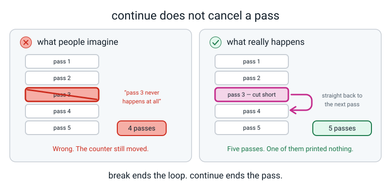
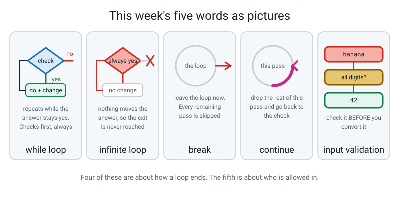

# Week 8 — Guess & Grade

[⬅ Week 7](week-07.md) · [Course Home](../README.md) · [Next ➡](week-09.md) · [Workbook](../workbook/week-08.md)

---

> ### This week in one sentence
> **A `while` loop repeats until its condition goes `False`, which is how a program waits for a human to get it right.**
>
> **By the end of this chapter you will be able to:**
> - Write a `while` loop that stops when a condition becomes `False`, and name its **three parts**
> - Use **`break`** to leave a loop early and **`continue`** to skip one pass
> - Generate a random whole number in a chosen range, knowing that **both ends are included**
> - Reject bad input without the program crashing — typing `banana` gets a message, not a traceback
> - **Stop a runaway loop with Ctrl+C** and explain calmly why it happened
>
> **New syntax:** `while condition:` · `break` · `continue` · `random.randint(a, b)`
>
> **Reading time:** about 35 minutes. **Homework:** about 70 minutes — the longest of the term.

---

## 🪝 Start Here

I have written a number on a piece of paper and folded it. It is between one and a hundred, including both ends.

Guess it. Every time you guess I will say "higher" or "lower". **And I am counting your guesses.**

Most people start at 50. Some start at 1. Both are interesting.

Say you guessed 50 and I said *higher*. **How many numbers are still possible?** Fifty — 51 up to 100. Now guess 75 and I say *lower*: twenty-four left (51 up to 74), about half again.

**Every good guess halves what is left.** Watch:

```text
   100 numbers → 50 → 25 → 13 → 7 → 4 → 2 → 1
     guess 1     2    3    4    5   6   7
```

**Seven.** Seven halvings takes a hundred down to one, so a hundred numbers can *always* be caught in seven guesses. Never eight. Which is why the game you are about to write gives the player exactly seven — **enough if you are clever, not enough if you are careless.** That is what makes a game fair.

Now here is the bit that stops you just using last week's loop.

Last week every loop was `for something in range(...)`, and **every one of those knew how many times it would go round before it started.** Twelve scores: twelve passes. Nine rows: nine passes. That is why a `for` loop can never run forever by accident — the number of passes is decided before the first one happens.

**So how many passes does this guessing game need?**

You have no idea. It might be one, if they are lucky. It might be seven. **You cannot write down the number of passes, because it does not exist yet — it depends on what a human does.**

So you need a different kind of loop. One that does not count, but **waits.**


*Figure 8.1 — Set up, check, do-and-change, back to the check. The `no` exit is the only way out, and only the CHANGE step can get you there.*

---

## 🧠 The Big Idea

> **📌 About the code in this section.** The blocks below are **illustrations, not files**. They show you the shape of one idea, and each one carries on from the one above it — the `import` lines and the data are typed once, in the first block that needs them. **The complete, runnable file is in 💻 Type This.** If you copy a block from this section on its own and Python says `NameError`, that is why, and nothing is broken.

### 1. Last week's loop counted. This week's loop waits.

**The plain explanation.**

> **while loop** — repeats a block for as long as a condition stays `True`, checking the condition **before** every pass.

```python
# countdown.py - a while loop, and the three parts every one of them needs.

countdown = 3                      # 1. SET UP  - before the loop

while countdown > 0:               # 2. CHECK   - asked BEFORE every pass
    print(countdown)
    countdown -= 1                 # 3. CHANGE  - this is what ends the loop

print("Liftoff!")                  # not indented, so it runs once, at the end
```

```text
3
2
1
Liftoff!
```

Read the `while` line out loud as English. *"While countdown is greater than zero, do this."* There is no trick in the word.

But be much more precise than English is, because English is vague and this is not. Python does **exactly** this: **check the condition. If it is `True`, run the whole indented block. Then come back and check again.** Check, run, check, run, check — and the first time the check says `False`, it stops and carries on below.

**The concrete version — trace it, and count two different things.**

| Check | `countdown` before | `countdown > 0`? | Prints | `countdown` after |
|---|---|---|---|---|
| 1 | 3 | `True` | `3` | 2 |
| 2 | 2 | `True` | `2` | 1 |
| 3 | 1 | `True` | `1` | 0 |
| 4 | 0 | **`False`** | — | the loop ends |

**How many times did it print?** Three. **How many times did it *check*?** Four.

> **A `while` loop always checks one more time than it runs.** The last check is the one that ends it.

**And one more thing, which matters more than it looks.** The condition is asked **before** the pass, never during it. If `countdown` becomes 0 halfway through the body, **the rest of the body still runs.** Python does not interrupt a pass in the middle to re-check.

**The analogy.** A **staircase**. The rule is: *"while there are steps left, go up one."* You say the rule out loud, look, decide, climb. Then you say the rule again. Four steps means five sayings of the rule — and the fifth one is where you say "no" and stop.

### 2. Every `while` loop needs three things, and missing one is a bug

```text
   ┌──────────────────────────────────────────────┐
   │  1. SET UP    countdown = 3                  │   before the loop
   │  2. CHECK     while countdown > 0:           │   the condition
   │  3. CHANGE        countdown -= 1             │   inside the loop
   └──────────────────────────────────────────────┘
        Miss 1 → NameError.  Miss 3 → INFINITE LOOP.
```

- **Miss the set up** and you get `NameError: name 'countdown' is not defined` on the `while` line, because Python cannot check a box that does not exist.
- **Miss the change** and the condition's answer can never alter, so it stays `True` forever. That is the next section.

**The change step is entirely your job.** Python will not do it for you and it will not warn you. Look at the file: what is moving `countdown` towards zero? The `countdown -= 1` line, **and nothing else.**

**And the change does not have to be arithmetic.** In `guess.py` the change is *a new guess arriving from the keyboard*. In the replay loop it is *a flag being flipped from `True` to `False`*. What matters is that **something inside the body can move the condition towards `False`.**

> **💡 Try this:** the two-second habit that prevents most of this week's trouble. Every time you finish typing a `while` line, say out loud *"and the thing that ends this loop is…"* and **point at the line.** If your finger hovers, you have just written an infinite loop and you know it **before** you press Enter.

### 3. `for` or `while`? One question decides it

**Can you say the number of repeats out loud before you start? If yes, `for`. If no, `while`.**

| Situation | Loop | Why |
|---|---|---|
| Print the 7 times table, 1 to 10 | `for` | Exactly ten rows, known in advance |
| Total up twelve scores off a card | `for` | Exactly twelve |
| Keep asking until the human types a number | `while` | **No idea** how many bad tries they will make |
| A guessing game until they win or run out | `while` | Depends entirely on their guesses |
| Print a 9 × 9 grid | `for` inside a `for` | 81, known in advance |

Everything in this week's project that **waits for a human** is a `while`. Everything that **counts** is a `for`. Both appear in the project, and that is deliberate.

### 4. The infinite loop, and how to stop it

**This is the section to read twice.**

```python
# runaway.py - ON PURPOSE. The CHANGE line is missing, so this never stops.

countdown = 3

while countdown > 0:
    print(countdown)
    # the line that changes countdown is missing
```

`countdown` is 3 before the loop and it is still 3 after every pass, so `countdown > 0` is `True` **forever**. It prints `3`, and then `3`, and then `3`, as fast as the computer can manage — thousands of lines a second, far too fast to read.

> **infinite loop** — a loop whose condition never becomes `False`, so it never ends on its own.

**To stop it: hold `Ctrl` and press `C` in the terminal window.**

On a Mac it is **Ctrl**, not Command. This is one of the very few places where a Mac uses Ctrl, and it catches people — in a panic, Command+C just copies something and it feels like the machine has stopped responding.

Here is what you see (this is a real traceback, from a real interrupted run):

```text
3
3
3
^C
Traceback (most recent call last):
  File "/Users/you/ai-academy/level2/runaway.py", line 6, in <module>
    print(countdown)
KeyboardInterrupt
```

**Read that traceback carefully, because it is a friendly one.**

- `^C` is the terminal showing you that it received your interrupt.
- The `File` and line number tell you **where the program was when you stopped it** — which is nearly always inside the runaway loop, and is therefore a genuine clue.
- **`KeyboardInterrupt` is not a bug in your code. It means "a human stopped me."** It is the one traceback in this whole course that means you did something *right*.

**Three things to know, in this order:**

1. **It is not dangerous.** Nothing is broken, nothing is lost, no file is damaged. A loop printing text is the least harmful thing a computer can do.
2. **It is not rare.** Every programmer alive does this, and most of them still do it occasionally after twenty years.
3. **The fix is always the same question:** *what in the body was supposed to move the condition, and why didn't it?*


*Figure 8.2 — With nothing in the body moving the condition, the `no` exit can never be reached. Ctrl+C is a door in the wall.*

> **⚠️ Watch out:** after a runaway loop your terminal will be full of thousands of identical lines, and anything useful from *before* the loop is now far above. `Ctrl+L` clears the screen, or close the terminal tab and open a new one. **That is housekeeping, not a defeat.**

### 5. `break` and `continue` — two words that change the flow

> **break** — leave the loop immediately. Skip every remaining pass.
> **continue** — skip the rest of *this* pass only, and go straight back to the check.

The difference is the thing people get wrong, so here are both, run for real.

**`break` — stop as soon as you have found what you want:**

```python
for n in range(1, 100):
    if n * n > 500:
        print(f"the first square over 500 is {n} x {n} = {n * n}")
        break
```

```text
the first square over 500 is 23 x 23 = 529
```

Check it: 22 × 22 = 484, which is not over 500; 23 × 23 = 529, which is ✔ That loop was set up to do ninety-nine passes and it did twenty-three, because as soon as it had the answer there was no reason to carry on. Without the `break` it would print seventy-six more lines, all of them useless.

**`continue` — skip the ones you do not care about:**

```python
for n in range(1, 11):
    if n % 2 == 0:
        continue              # even? skip the print, go to the next n
    print(n, end=" ")
print()
```

```text
1 3 5 7 9 
```

**How many passes happened in that loop?** Ten. All ten. Five of them printed nothing, because `continue` threw away the rest of *that pass* and went straight back to the top. **`continue` did not cancel any passes.**

The sentence worth memorising, and it is short: **`break` ends the loop. `continue` ends the pass.**


*Figure 8.3 — `break` takes the whole loop off the table. `continue` throws away the rest of one pass and comes straight back for the next.*

Two facts you will need:

- Both work in `for` loops and `while` loops, identically.
- Both must be **inside** a loop. A `break` at the margin gives you `SyntaxError: 'break' outside loop` — Python telling you it has nothing to break out of. **An `if` is not a loop.**

### 6. `random.randint` — and why seven tries is exactly fair

The computer needs to pick the secret number, and it has to be a number neither of you knows. That needs a tool that is not part of the language you have been using, so you have to ask for it.

```python
import random                     # the toolbox with the dice in it
print(random.randint(1, 6))
```

> **`random.randint(a, b)`** — hands back a whole number between `a` and `b`. **Both ends are included**, unlike `range`, which excludes the stop.

**That inconsistency is genuinely annoying and you are allowed to be annoyed about it.** `range(1, 6)` gives 1–5. `random.randint(1, 6)` gives 1–6. They are different tools written by different people at different times, and there is no clever reason. **`randint` includes both ends.** Write it in your vocabulary box and move on.

Two things to know before they trip you:

- **`import random` must be at the top of the file.** Forget it and you get `NameError: name 'random' is not defined` — the same message you get for a misspelled variable, because as far as Python is concerned that is exactly what `random` is until you import it.
- **`random.randint(100, 1)` is an error.** You asked for a number between 100 and 1, and there aren't any, because 100 is bigger. Small number first.

**And why seven tries?** Because each good guess halves what is left, and seven halvings takes 100 down to 1. It is not a random choice of limit — it is **exactly enough for a player who plays well, and not enough for a player who guesses randomly.** That makes the game fair *and* teachable.


*Figure 8.4 — Each hint does not just say higher or lower; it deletes half the remaining numbers. The window closes in.*

### 7. Input validation — the thing that makes it a real program

> **input validation** — checking what the user typed *before* using it, and refusing it politely if it is not usable.

Here is why it matters. This program is one line long and it crashes:

```python
score = int(input("Score? "))
print(score)
```

Type `banana`:

```text
Score? banana
Traceback (most recent call last):
  File "/Users/you/ai-academy/level2/b2.py", line 1, in <module>
    score = int(input("Score? "))
ValueError: invalid literal for int() with base 10: 'banana'
```

**`ValueError` means: the *kind* of thing was right — you gave `int` a piece of text, which is what it takes — but the *value* was wrong, because that text is not a number.** The program stops dead, mid-sentence, and a real person sees five lines of red that mean nothing to them.

**The tool is `.isdigit()`.** It is a question you can ask a piece of text: *is every single character in you a digit from 0 to 9?* It hands back `True` or `False`, and **it never crashes.**

```python
print("42".isdigit(), "-42".isdigit(), " 42 ".isdigit(), "4.2".isdigit())
```

```text
True False False False
```

**And `.strip()`**, one line: it removes spaces from both ends of what the user typed. It matters more than it sounds, because `"  42  ".isdigit()` is `False` — a space is not a digit — so somebody who types a space before their number gets rejected for no visible reason:

```python
print("without strip:", repr("  42  "), "  42  ".isdigit())
print("with strip   :", repr("  42  ".strip()), "  42  ".strip().isdigit())
```

```text
without strip: '  42  ' False
with strip   : '42' True
```

> **⚠️ Watch out:** the pattern is always **keep it as text, check it, and only then convert.** `int()` goes *after* the check, never before — because `int()` is the thing that crashes, and once it has crashed there is nothing left to check. For anything typed on an ordinary keyboard, once `.isdigit()` has said `True`, `int()` will not fail. (A few exotic characters, such as `²`, count as digits to `.isdigit()` but still crash `int()` — you will not meet them by accident.)

**And now the honest limitation, which nobody should hide from you.** Look at the second answer in that row of four: `"-42".isdigit()` is **`False`**, because a minus sign is not a digit. So a player who types `-5` gets the message "whole numbers only", which is not quite true — minus five *is* a whole number.

**That is a real flaw in your program, not a mystery.** The proper fix needs tools this course meets later. What matters today is that the program **does not crash**, and a wrong-but-clear message beats a traceback every time. **Write the limitation down. Knowing where your program is weak is worth more than pretending it isn't.**

### 8. Flags — a variable whose whole job is `True` or `False`

`guess.py` needs two of these and they look strange the first time.

```python
# flag.py - a flag is a variable that holds True or False and steers a loop.

won = False                      # the flag starts False
tries = 0

while tries < 3 and not won:     # two conditions joined with and
    tries += 1
    print(f"try {tries}")
    if tries == 2:
        won = True               # flipping the flag is what ends the loop

print(f"finished after {tries} tries, won = {won}")
```

```text
try 1
try 2
finished after 2 tries, won = True
```

The loop had three tries available and used two, because setting `won = True` made the **check** fail on the next go round. **A flag is a change step made out of a decision instead of arithmetic.**

**Why not just use `break`?** You could, and `break` would be fine here. The flag has one advantage: the condition at the top of the loop tells you **both** reasons the loop can end, in one readable line — `while tries_used < MAX_TRIES and not won:`. With a `break` buried in the middle, one of those two reasons is hidden ten lines down. Both are correct. This week uses the flag for the game and `break` for the "stop as soon as you find it" jobs.

---

## 💻 Type This

`guess.py`, built in four passes, and **the first pass is wrong on purpose** — because what happens next is something you need to have seen while somebody is sitting next to you.

### Step 1 — the runaway loop, and Ctrl+C on purpose

New file, `guess.py`. Type exactly this:

```python
# guess.py - version 1. This one has a bug in it on purpose.

import random

secret = random.randint(1, 100)        # the secret, chosen once, before the loop
guess = 0                              # 0 is not in 1-100, so the CHECK is True at first

while guess != secret:                 # CHECK: keep going while the guess is wrong
    if guess < secret:
        print("  Higher.")
    else:
        print("  Lower.")
```

**Before you press Enter: where in that loop does `guess` change?**

Look. Take five seconds. Then run it.

The screen fills with `  Higher.` at thousands of lines a second — `guess` is 0, the secret is at least 1, so `guess < secret` is `True` every single time.

**Now stop it: hold Ctrl — not Command — and press C.**

```text
  Higher.
  Higher.
  Higher.
^C
Traceback (most recent call last):
  File "/Users/you/ai-academy/level2/guess.py", line 10, in <module>
    print("  Higher.")
KeyboardInterrupt
```

**Say the three parts of a `while` loop.** Set up, check, change. **Which one is missing?** The change. `guess` is zero before the loop and it is still zero after every pass, because nothing in the body touches it.

**Now do it again yourself.** Run it, count to three, and stop it with your own hands. Do it twice if you like. The second time, notice that your heart rate is normal — **that is the entire point of doing this on purpose.**

### Step 2 — put the change step in

*The input line goes **inside** the loop. That one line is the change step.*

```python
# guess.py - version 2. Keep asking until the guess is right.

import random

secret = random.randint(1, 100)        # the secret, chosen once, before the loop
guess = 0                              # 0 is not in 1-100, so the CHECK is True at first

while guess != secret:                 # CHECK: keep going while the guess is wrong
    guess = int(input("Guess? "))      # CHANGE: a new guess every pass
    if guess < secret:
        print("  Higher.")
    elif guess > secret:
        print("  Lower.")

print(f"Correct. The number was {secret}.")
```

One real run. **The secret is random, so yours will be different** — this one happened to be 40:

```text
Guess? 50
  Lower.
Guess? 25
  Higher.
Guess? 37
  Higher.
Guess? 43
  Lower.
Guess? 40
Correct. The number was 40.
```

One line moved from nowhere to inside the loop, and now the loop can end.

### Step 3 — the seven-try limit, and one character too many

*Save this as a separate experiment, or edit in place — either is fine.* Here is the try cap, written with `<=`:

```python
import random
MAX_TRIES = 7
secret = random.randint(1, 100)
tries_used = 0

while tries_used <= MAX_TRIES:              # <-- the planted off-by-one
    guess = int(input(f"Guess {tries_used + 1}: "))
    tries_used += 1
    if guess == secret:
        print("  Correct.")
        break
    elif guess < secret:
        print("  Higher.")
    else:
        print("  Lower.")

print(f"Tries used: {tries_used}")
```

**Before you run it: how many prompts should appear if you guess wrong every single time?** Seven.

Now type 1, 2, 3, 4, 5, 6, 7, 8 — deliberately wrong every time — and **count the prompts.**

```text
Guess 1: 1
  Higher.
Guess 2: 2
  Higher.
Guess 3: 3
  Higher.
Guess 4: 4
  Higher.
Guess 5: 5
  Higher.
Guess 6: 6
  Higher.
Guess 7: 7
  Higher.
Guess 8: 8
  Higher.
Tries used: 8
```

**Eight.** Nothing crashed. It even printed `Tries used: 8` quite cheerfully.

**Where is the extra one coming from?** Read the condition out loud: *"while tries used is less than **or equal to** seven."* So when `tries_used` is exactly seven — meaning they have already had seven goes — is the check still `True`? **Yes.** So it goes round an eighth time.

Change `<=` to `<` and run it again with the same eight numbers:

```text
Guess 1: 1
  Higher.
Guess 2: 2
  Higher.
Guess 3: 3
  Higher.
Guess 4: 4
  Higher.
Guess 5: 5
  Higher.
Guess 6: 6
  Higher.
Guess 7: 7
  Higher.
Tries used: 7
```

Seven. **And notice what found it: counting, not reading.** `while tries_used <= MAX_TRIES:` is a perfectly reasonable-looking line. There is nothing to *see*. There is only something to **count.**

### Step 4 — the banana

Run it again and type `banana` at the prompt.

```text
Guess 1: banana
Traceback (most recent call last):
  File "/Users/you/ai-academy/level2/guess.py", line 7, in <module>
    guess = int(input(f"Guess {tries_used + 1}: "))
ValueError: invalid literal for int() with base 10: 'banana'
```

A real person playing your game just got five lines of red and lost their game.

*Now harden it. Keep it as text, check it, and only then convert:*

```python
import random
MAX_TRIES = 7
secret = random.randint(1, 100)
tries_used = 0

while tries_used < MAX_TRIES:
    typed = input(f"Guess {tries_used + 1}: ").strip()   # keep it as text for now
    if not typed.isdigit():                              # every character a digit?
        print("  Whole numbers only. That try was free.")
        continue                                         # skip the rest of this pass
    guess = int(typed)                                   # safe now
    tries_used += 1
    if guess == secret:
        print("  Correct.")
        break
    elif guess < secret:
        print("  Higher.")
    else:
        print("  Lower.")

print(f"Tries used: {tries_used}")
```

Typing `banana`, then `-5`, then playing properly (secret was 40):

```text
Guess 1: banana
  Whole numbers only. That try was free.
Guess 1: -5
  Whole numbers only. That try was free.
Guess 1: 50
  Lower.
Guess 2: 25
  Higher.
Guess 3: 37
  Higher.
Guess 4: 43
  Lower.
Guess 5: 40
  Correct.
Tries used: 5
```

**Three things to notice, and the third one is a confession.**

**One: the prompt stayed on `Guess 1` for the first three lines.** That is `continue` doing its job — the rest of that pass, including the `tries_used += 1`, got skipped. The bad input genuinely cost nothing.

**Two: it did not crash.** Nonsense gets a sentence, not a traceback.

**Three, and this is a real flaw in the program rather than a mystery:** look at what happened to `-5`. It said "whole numbers only", which is not quite true. `.isdigit()` is only `True` when every character is a digit 0–9, and a minus sign is not. **We are choosing to live with that today**, because the important thing is that it does not crash. **Write that limitation in your Bug Log.**

### Step 5 — the finished program: an ending, and a replay

Two things are still missing. The game needs to **end properly** — say whether you won, how many tries you took, and if you lost, tell you the number, because a game that keeps a secret after it is over is just annoying. And it should offer **another go**.

The replay is the interesting one. **A whole game is going to sit inside another loop.** The outer loop's condition is *"are we still playing?"* and the inner loop's condition is *"does this game still have life in it?"* Two loops, one inside the other — exactly like last week's grid, except these two **wait** instead of counting.

```python
# guess.py - guess the secret number in 7 tries, then play again if you like.

import random                                  # the toolbox with the dice in it

LOW = 1                                        # the smallest number I might pick
HIGH = 100                                     # the largest number I might pick
MAX_TRIES = 7                                  # seven halvings always cover 1 to 100

wins = 0                                       # accumulator: games won
games = 0                                      # accumulator: games played
playing = True                                 # the flag that keeps the outer loop going

print("=" * 40)
print("  GUESS THE NUMBER")
print(f"  I am thinking of a number from {LOW} to {HIGH}.")
print(f"  You get {MAX_TRIES} tries.")
print("=" * 40)

while playing:                                 # OUTER loop: one pass = one whole game
    secret = random.randint(LOW, HIGH)         # both ends included
    tries_used = 0                             # counter, reset for every new game
    won = False                                # flag: has this game been won yet?
    games += 1

    print(f"--- Game {games} ---")

    while tries_used < MAX_TRIES and not won:  # INNER loop: one pass = one guess
        left = MAX_TRIES - tries_used          # how many tries are still in hand
        typed = input(f"Guess ({left} left): ").strip()

        if not typed.isdigit():                # isdigit() is True only for 0-9
            print("  Whole numbers only. That try was free.")
            continue                           # skip the rest of THIS pass

        guess = int(typed)                     # safe now: every character is a digit

        if guess < LOW or guess > HIGH:
            print(f"  Stay between {LOW} and {HIGH}. That try was free.")
            continue

        tries_used += 1                        # only a real guess costs a try

        if guess == secret:
            won = True                         # this makes the CHECK say no next time
        elif guess < secret:
            print("  Higher.")
        else:
            print("  Lower.")

    if won:
        wins += 1
        print(f"Correct. The number was {secret}, in {tries_used} of {MAX_TRIES} tries.")
    else:
        print(f"Out of tries. The number was {secret}.")

    print(f"Record: {wins} won of {games} played")

    answer = ""                                # empty, so the check below is True once
    while answer != "yes" and answer != "no":  # keep asking until it is one of the two
        answer = input("Play again? (yes/no) ").strip().lower()
        if answer != "yes" and answer != "no":
            print("  Please type yes or no.")

    if answer == "no":
        playing = False                        # ends the OUTER loop

print(f"Final record: {wins} of {games}. Thanks for playing.")
```

One real run — typing `fifty`, then `500`, then playing properly, then `maybe`, then `no`. The secret happened to be 40:

```text
========================================
  GUESS THE NUMBER
  I am thinking of a number from 1 to 100.
  You get 7 tries.
========================================
--- Game 1 ---
Guess (7 left): fifty
  Whole numbers only. That try was free.
Guess (7 left): 500
  Stay between 1 and 100. That try was free.
Guess (7 left): 50
  Lower.
Guess (6 left): 25
  Higher.
Guess (5 left): 37
  Higher.
Guess (4 left): 43
  Lower.
Guess (3 left): 40
Correct. The number was 40, in 5 of 7 tries.
Record: 1 won of 1 played
Play again? (yes/no) maybe
  Please type yes or no.
Play again? (yes/no) no
Final record: 1 of 1. Thanks for playing.
```

**Four things to look at, in this order:**

1. **`(7 left)` stayed at 7 for the first three lines.** Two rejected inputs cost nothing. That is `continue`, visible.
2. **There are three `while` loops in this file.** The replay loop, the game loop, and the yes/no loop. Which is the outer one? You can tell from the **indentation**, and only from that.
3. **`won = True` is a change step.** It is what makes the inner loop's check fail. There is no `break` in the game loop at all.
4. **`wins` and `games` are accumulators**, exactly like last week's `total`. Set up before the loop, updated inside, reported at the end.

And here is a two-game session, winning the first and losing the second by guessing one at a time:

```text
Correct. The number was 40, in 5 of 7 tries.
Record: 1 won of 1 played
Play again? (yes/no) yes
--- Game 2 ---
Guess (7 left): 1
  Higher.
Guess (6 left): 2
  Higher.
Guess (5 left): 3
  Higher.
Guess (4 left): 4
  Higher.
Guess (3 left): 5
  Higher.
Guess (2 left): 6
  Higher.
Guess (1 left): 7
  Higher.
Out of tries. The number was 37.
Record: 1 won of 2 played
Play again? (yes/no) no
Final record: 1 of 2. Thanks for playing.
```

**Game 2's number is different from Game 1's**, because `secret = random.randint(LOW, HIGH)` is **inside** the outer loop — a new game gets a new number. Move that line above the outer `while` and every game in the session has the same secret, which is a much worse game. That is why the line is where it is.

> **💡 Try this:** delete `random.` from `random.randint` and run it → `NameError: name 'randint' is not defined`. Then delete the whole `import random` line → `NameError: name 'random' is not defined`. **Two different mistakes, two different messages**, and being able to tell them apart is a real skill.

### Step 6 — the second program: `grade.py`

This one you already mostly know: it is last week's `scores.py` with this week's validation bolted on. **Test it on the same twelve numbers off the same card, so you already know the answer is total 900 and average 75. If your program says anything else, your program is wrong — and that is a very comfortable position to be in.**

```python
# grade.py - read some scores, then report total, average, highest and a letter grade.

print("=" * 40)
print("  GRADE CALCULATOR")
print("=" * 40)

# ---- Step 1: how many scores? Keep asking until it is a whole number above 0. ----
count = 0                                        # 0 means "not a usable answer yet"
while count < 1:                                 # CHECK, before every pass
    typed = input("How many scores? ").strip()   # always text, whatever they type
    if not typed.isdigit():                      # "banana" and "-4" both fail this
        print("  Whole numbers only.")
    elif int(typed) < 1:
        print("  I need at least one score.")
    else:
        count = int(typed)                       # CHANGE - this is what ends the loop

# ---- Step 2: accumulators, set up BEFORE the loop that fills them ----
total = 0                                        # running sum
highest = -1                                     # lower than any real score
scores_read = 0                                  # counter: how many are safely in

# ---- Step 3: read exactly `count` good scores ----
while scores_read < count:
    typed = input(f"  Score {scores_read + 1} of {count}: ").strip()

    if not typed.isdigit():
        print("    Whole numbers 0 to 100 only.")
        continue                                 # nothing was read, so do not count it

    score = int(typed)

    if score > 100:
        print("    The most anyone can score is 100.")
        continue

    total += score                               # accumulate
    if score > highest:                          # a new champion?
        highest = score
    scores_read += 1                             # CHANGE - one more score safely in

# ---- Step 4: the numbers that come from the accumulators ----
average = total / count

# ---- Step 5: the letter grade. Highest threshold FIRST. ----
if average >= 90:
    letter = "A"
elif average >= 75:
    letter = "B"
elif average >= 60:
    letter = "C"
elif average >= 35:
    letter = "D"
else:
    letter = "F"

# ---- Step 6: the report ----
print("-" * 40)
print(f"  Scores entered : {count}")
print(f"  Total          : {total}")
print(f"  Average        : {average:.2f}")
print(f"  Highest        : {highest}")
print(f"  Letter grade   : {letter}")
print("-" * 40)
```

A real run, typing `four` (rejected), then `4`, then `88`, `120` (rejected), `92`, `banana` (rejected), `70`, `30`:

```text
========================================
  GRADE CALCULATOR
========================================
How many scores? four
  Whole numbers only.
How many scores? 4
  Score 1 of 4: 88
  Score 2 of 4: 120
    The most anyone can score is 100.
  Score 2 of 4: 92
  Score 3 of 4: banana
    Whole numbers 0 to 100 only.
  Score 3 of 4: 70
  Score 4 of 4: 30
----------------------------------------
  Scores entered : 4
  Total          : 280
  Average        : 70.00
  Highest        : 92
  Letter grade   : C
----------------------------------------
```

**Hand-check:** 88 + 92 = 180, + 70 = 250, + 30 = 280 ✔ 280 ÷ 4 = 70.00 ✔ Highest is 92 ✔ An average of 70 is not ≥ 90, not ≥ 75, but *is* ≥ 60, so **C** ✔

**Look at the score numbers in the prompts.** `Score 2 of 4` appears twice and `Score 3 of 4` appears twice, because the rejected input did not count. That is `continue`, visible again.

**And now the test that matters — the same twelve numbers off last week's card**, with `12` as the count:

```text
----------------------------------------
  Scores entered : 12
  Total          : 900
  Average        : 75.00
  Highest        : 100
  Letter grade   : B
----------------------------------------
```

**Total 900 and average 75.00 — the same answers last week's `scores.py` gave, from a completely differently shaped program.** That agreement is the whole point of keeping the card. And an average of exactly 75 gets a **B**, because the test is `>=` — a boundary worth pointing at.

**One structural thing to say out loud, because it is the interesting bit.** Last week you counted twelve scores with a `for` loop, because you knew it was twelve. This week you cannot, and here is why: **you do not know how many times you will have to ask.** Twelve scores might take twelve prompts, or fifteen if three of them are typed badly. So the loop counts **successes, not attempts** — `while scores_read < count:` — and the counter only goes up when a good score has gone in.

---

## 🔍 Worked Examples

### Worked Example 1 — The tuck-shop till (food)

A `while` loop that does not know how many things are going in the bag, plus `continue` doing two different jobs.

```python
# till.py - keep adding prices to a bill until the customer types done.

print("=" * 34)
print("  TUCK SHOP TILL")
print("=" * 34)

total = 0                                        # accumulator: the bill so far
items = 0                                        # counter: how many things went in
taking_orders = True                             # the flag that ends the loop

while taking_orders:                             # CHECK: are we still adding things?
    typed = input("Price in rupees (or 'done')? ").strip().lower()

    if typed == "done":                          # the way out
        taking_orders = False                    # CHANGE: this ends the loop
        continue                                 # nothing left to do this pass

    if not typed.isdigit():                      # every character a digit?
        print("  Whole rupees only, or type done.")
        continue                                 # skip the rest of THIS pass

    price = int(typed)                           # safe now
    total += price                               # add it to the bill
    items += 1                                   # one more thing in the bag
    print(f"  items: {items}   bill: {total} rupees")

print("-" * 34)
if items == 0:                                   # never divide by zero
    print("  Nothing bought.")
else:
    average = total / items                      # divide AFTER the loop
    print(f"  Items        : {items}")
    print(f"  Bill         : {total} rupees")
    print(f"  Average item : {average:.2f} rupees")
print("-" * 34)
```

Typing 40, 25, `banana`, 60, `done`:

```text
==================================
  TUCK SHOP TILL
==================================
Price in rupees (or 'done')? 40
  items: 1   bill: 40 rupees
Price in rupees (or 'done')? 25
  items: 2   bill: 65 rupees
Price in rupees (or 'done')? banana
  Whole rupees only, or type done.
Price in rupees (or 'done')? 60
  items: 3   bill: 125 rupees
Price in rupees (or 'done')? done
----------------------------------
  Items        : 3
  Bill         : 125 rupees
  Average item : 41.67 rupees
----------------------------------
```

**Hand-check.** 40 + 25 + 60 = 125 ✔ And 125 ÷ 3: 3 × 41 = 123, 2 left over, 2 ÷ 3 = 0.666…, so 41.67 to two places ✔

And what happens if the very first thing typed is `done`?

```text
==================================
  TUCK SHOP TILL
==================================
Price in rupees (or 'done')? done
----------------------------------
  Nothing bought.
----------------------------------
```

**Three things worth noticing.**

**Why it has to be a `while`.** Nobody knows how many things the customer will buy. Not the programmer, not the customer at the start. **Nobody can say the number out loud, so it cannot be a `for`.**

**`continue` is doing two different jobs.** The first one, after `taking_orders = False`, means *"we are done; do not try to price the word 'done'."* The second one means *"that was nonsense; do not count it."* Same word, two reasons, both legitimate.

**And that `if items == 0:` is not decoration.** Without it, a customer who types `done` immediately gets `ZeroDivisionError: division by zero` — because the average of nothing is not a number. **Every time you write a division, ask what happens if the bottom is zero.**

### Worked Example 2 — Rolling until a six (sport)

The shortest possible honest `while` loop: one where nobody can predict the number of passes, including you.

```python
# six.py - roll a dice until you get a six, and count how many rolls it took.

import random                              # the toolbox with the dice in it

rolls = 0                                  # accumulator: how many rolls so far
roll = 0                                   # SET UP: 0 is not a face, so the CHECK is True

while roll != 6:                           # CHECK: keep going while it is not a six
    roll = random.randint(1, 6)            # CHANGE: a brand new roll every pass
    rolls += 1                             # one more roll in the tally
    print(f"  roll {rolls}: {roll}")

print(f"It took {rolls} rolls to get a six.")
```

One real run:

```text
  roll 1: 3
  roll 2: 2
  roll 3: 4
  roll 4: 6
It took 4 rolls to get a six.
```

And **another real run of exactly the same program**, changing nothing:

```text
  roll 1: 2
  roll 2: 5
  roll 3: 1
  roll 4: 3
  roll 5: 1
  roll 6: 4
  roll 7: 4
  roll 8: 4
  roll 9: 6
It took 9 rolls to get a six.
```

**Four passes one time, nine the next.** Nobody wrote 4 and nobody wrote 9. This is the clearest possible demonstration of why `while` exists: **`for n in range(4)` would be a lie, and `for n in range(9)` would be a different lie.**

**Two things to be careful about.**

**Why `roll = 0` before the loop?** Because the check asks about `roll`, and Python cannot check a box that does not exist — you would get `NameError` on the `while` line. And it has to be a value that makes the check `True` the first time, so it must be something that is **not** 6. Zero is not a face on a dice, which makes it a good choice: nobody could mistake it for a real roll.

**And `random.randint(1, 6)` can genuinely give you a 6** — both ends are included. If `randint(1, 6)` stopped at 5 the way `range(1, 6)` does, the loop would never, ever end, and you would be reaching for Ctrl+C. **The two tools disagree about their last number, and that disagreement can cost you an infinite loop.**

### Worked Example 3 — The homework timer (school)

A `while` loop that counts **towards a target** rather than down from a limit, with two different reasons to reject an answer.

```python
# homework.py - keep working in sessions until 60 minutes are done.

TARGET = 60                                       # the minutes I owe tonight

done = 0                                          # accumulator: minutes done so far
sessions = 0                                      # counter: how many sittings

print("=" * 36)
print(f"  HOMEWORK TIMER - {TARGET} minutes owed")
print("=" * 36)

while done < TARGET:                              # CHECK: still short of the target?
    left = TARGET - done                          # how much is still owed
    typed = input(f"Minutes this session ({left} to go)? ").strip()

    if not typed.isdigit():                       # every character a digit?
        print("  Whole minutes only.")
        continue                                  # skip the rest of THIS pass

    minutes = int(typed)

    if minutes == 0:                              # zero would never end the loop
        print("  Zero minutes is not a session.")
        continue

    done += minutes                               # CHANGE: this moves us to the target
    sessions += 1
    print(f"  {done} of {TARGET} minutes done.")

print("-" * 36)
print(f"  Sessions   : {sessions}")
print(f"  Minutes    : {done}")
print(f"  Over by    : {done - TARGET}")
print(f"  Average    : {done / sessions:.2f} minutes a session")
print("-" * 36)
```

Typing 20, `banana`, 0, 15, 30:

```text
====================================
  HOMEWORK TIMER - 60 minutes owed
====================================
Minutes this session (60 to go)? 20
  20 of 60 minutes done.
Minutes this session (40 to go)? banana
  Whole minutes only.
Minutes this session (40 to go)? 0
  Zero minutes is not a session.
Minutes this session (40 to go)? 15
  35 of 60 minutes done.
Minutes this session (25 to go)? 30
  65 of 60 minutes done.
------------------------------------
  Sessions   : 3
  Minutes    : 65
  Over by    : 5
  Average    : 21.67 minutes a session
------------------------------------
```

**Hand-check.** 20 + 15 + 30 = 65 ✔ 65 − 60 = 5 over ✔ 65 ÷ 3: 3 × 21 = 63, 2 left, 2 ÷ 3 = 0.666…, so 21.67 ✔

**Three things, and the second one is the good one.**

**`65 of 60 minutes done` looks like a bug and is not.** The condition is asked **before** each pass, not during it — so once the check let you in with 35 done, the whole body ran, and a 30-minute session took you past the target. **A `while` loop cannot stop halfway through a pass.** That is exactly the fact from section 1, showing up in the wild.

**Why is `minutes == 0` rejected?** Because zero is a perfectly valid whole number that would pass `.isdigit()`, and adding zero **is not a change step.** Somebody typing 0 forever would sit in that loop forever, and it would look like the program had frozen when in fact it was doing precisely what it was told. **Watch for inputs that are legal but move nothing.**

**And the `(n to go)` number is worked out fresh each pass** — `left = TARGET - done` — rather than kept in its own variable. That means it cannot get out of step with the total. Same idea as `(7 left)` in `guess.py`, and the same idea as Week 6's "a boundary you do not write is a boundary you cannot get wrong."

---

## 🐞 When It Breaks

Every message below came from really running a broken version of this week's code.

### Break 1 — nothing but the same line, forever

```python
countdown = 3

while countdown > 0:
    print(countdown)
```

The screen fills. After Ctrl+C:

```text
3
3
3
^C
Traceback (most recent call last):
  File "/Users/you/ai-academy/level2/bug.py", line 4, in <module>
    print(countdown)
KeyboardInterrupt
```

**What Python is telling you.** *"A human stopped me, and here is where I was standing when you did."*

**This is not an error in your code.** `KeyboardInterrupt` is the friendliest traceback in the whole course — it means you took control back. The **line number**, though, is a real clue: it tells you the program was inside the loop, which is exactly where the problem lives.

**The fix, in three questions and no others:**

1. *Which variable is in the condition?* `countdown`. Say it out loud.
2. *Where in the body does that variable change?* **Point at the line.** If there is no line, you have just found the bug yourself.
3. *Could it ever reach the value that ends the loop?* Sometimes the change is there but goes the **wrong way** — a `-= 1` where `+= 1` was meant — and this is the question that catches that.

Here it is `countdown -= 1`, missing from inside the loop.

### Break 2 — `banana`, and the crash before the check

```python
score = int(input("Score? "))
print(score)
```

```text
Score? banana
Traceback (most recent call last):
  File "/Users/you/ai-academy/level2/b2.py", line 1, in <module>
    score = int(input("Score? "))
ValueError: invalid literal for int() with base 10: 'banana'
```

**What Python is telling you.** *"The kind of thing was right — text is what `int` takes — but the value was wrong, because that text is not a number."*

**Why the order matters so much.** Some people try to fix this by putting an `if` **after** the `int(...)` line. That cannot possibly work: `int()` is the thing that crashes, and once it has crashed the program is over. There is nothing left to check.

**The fix.** Keep it as text, `.strip()` it, ask `.isdigit()`, and convert **only after** the check passes.

### Break 3 — no error at all, and `banana` gets accepted

```python
typed = input("Guess? ")
if not typed.isdigit:
    print("  Whole numbers only.")
else:
    print("  That looked like a number.")
```

Typing `banana`:

```text
Guess? banana
  That looked like a number.
```

**What Python is telling you.** *Nothing.* No error, no warning. And the answer is wrong for **every possible input**, including good ones — the complaint never fires at all.

**Why.** The **brackets are missing.** `typed.isdigit` is the question *itself* — a reference to the thing that asks it. `typed.isdigit()` is the **answer**. And Python treats a thing-that-exists as a yes, so `not typed.isdigit` is always `False`.

**The fix.** `typed.isdigit()`. **Brackets mean "actually ask it."** Remember this one — you will meet exactly the same trap next week with a different word in front of it.

### The whole clinic, for reference

| What you see | What it means | The fix |
|---|---|---|
| `SyntaxError: expected ':'` with `^` at the end of the `while` line | The colon is missing | Add the `:` |
| **Nothing but the same line, forever** | The condition is still `True` and always will be | **Ctrl+C.** Then find the variable in the condition and ask what in the body was supposed to change it |
| `KeyboardInterrupt` after a wall of output | "A human stopped me" | Nothing to fix in the *message*. Read the line number; it tells you where the loop was |
| `TypeError: '<' not supported between instances of 'str' and 'int'` on the `while` line | You are comparing text with a number | `input()` is **always** text. Convert it, or compare text with text — do not mix |
| `ValueError: invalid literal for int() with base 10: 'banana'` | "That text is not a number" | Check with `.isdigit()` first, convert after |
| `SyntaxError: 'break' outside loop` with `^^^^^` under `break` | "There is no loop here to break out of" | Move it inside the loop's body. **An `if` is not a loop** |
| `SyntaxError: 'continue' not properly in loop` | Same idea, different word | Move it inside the loop |
| `NameError: name 'random' is not defined` | "I have never heard of `random`" | `import random` at the top of the file |
| `NameError: name 'randint' is not defined` | "I have never heard of `randint` on its own" | `random.randint(...)`. The toolbox's name comes first |
| `AttributeError: module 'random' has no attribute 'randInt'. Did you mean: 'randint'?` | A capital I. Python is case-sensitive, always | `randint`, all lowercase. **And notice Python guessed correctly and told you** |
| `ValueError: empty range for randrange() (100, 2, -98)` (Python 3.12 and newer word it `empty range in randrange(100, 2)`) | "There are no numbers between 100 and 1" | `random.randint(1, 100)`. Small number first |
| `NameError: name 'won' is not defined` on the `while` line | You are checking a box that does not exist | `won = False` above the loop. **This is set-up, the first of the three parts** |
| **No error, and the loop asks one time too many** | `<=` where `<` was meant | `<`. Then **count the prompts** to prove it: seven, not eight |
| **No error, and `banana` is accepted** | `typed.isdigit` without brackets is the question, not the answer | `typed.isdigit()`. Brackets mean "actually ask it" |
| **No error, and the correct guess is never recognised** | Text is never equal to a number, however identical they look | `int(typed) == secret`, not `typed == secret` |
| **No error, and a rejected input still costs a try** | `continue` is placed *after* `tries_used += 1` | Move the counter below the checks. Prove it by watching `(n left)` |
| `ZeroDivisionError: division by zero` on an average | The count was 0 — nothing ever went in | Guard it: `if items == 0:` before the division |

---

## 🎲 What We Did In Class

*If you missed the lesson, you can do all of this at home in about forty-five minutes. Do the runaway loop with somebody in the room the first time if you can.*

### The guessing game, on paper, with no computer

A folded piece of paper with a number on it. Guesses called out, hints given, guesses counted. Then the real question: **what is the largest number of guesses this game could ever need, if you play as well as it is possible to play?**

The halving chain, written up:

```text
   100 numbers → 50 → 25 → 13 → 7 → 4 → 2 → 1
     guess 1     2    3    4    5   6   7
```

Seven. Then the question that starts the lesson: **how many passes does that loop need?** You cannot know. It depends on a human. So it cannot be a `for`.

### The three parts, and the trace table

`countdown.py`, typed and run: `3 2 1 Liftoff!`. Then the counting exercise: **three prints, four checks**, with the fourth check being the one that ends it.

Then the three parts, said back from memory: **set up · check · change.** And the question: *what is moving `countdown` towards zero?* The `countdown -= 1` line, and nothing else.

### `break`, `continue`, and a dice

```python
for n in range(1, 100):
    if n * n > 500:
        print(f"the first square over 500 is {n} x {n} = {n * n}")
        break
```

```text
the first square over 500 is 23 x 23 = 529
```

Ninety-nine passes available, twenty-three used.

```python
for n in range(1, 11):
    if n % 2 == 0:
        continue
    print(n, end=" ")
print()
```

```text
1 3 5 7 9 
```

**Ten passes happened.** Five printed nothing. `continue` cancelled no passes at all.

Then `import random` and `random.randint(1, 6)`, run five times, giving five different numbers — and the annoying fact written into the vocabulary box: **`randint` includes both ends; `range` does not.**

### The runaway loop, caused on purpose

`guess.py` version 1, with no line inside the loop to change `guess`. Run. The screen filled with `  Higher.` at thousands of lines a second. **Ctrl+C — not Command+C.**

```text
^C
Traceback (most recent call last):
  File "/Users/you/ai-academy/level2/guess.py", line 10, in <module>
    print("  Higher.")
KeyboardInterrupt
```

Three points, in order: **it is not dangerous · `KeyboardInterrupt` means a human stopped me · which of the three parts is missing?** (The change.)

**Then everybody did it themselves, with their own hands, at least once.** That was not optional. Watching somebody else do it is not the same thing.

### The eighth guess

The seven-try cap written with `<=`. Eight numbers typed, eight prompts appeared, `Tries used: 8` printed cheerfully, **no error message.** The condition read out loud: *"less than **or equal to** seven"* — so seven is still allowed, and it should not be.

Changed to `<`. Seven prompts. **Found by counting, not by reading.**

### The banana

`banana` typed at a guess prompt:

```text
ValueError: invalid literal for int() with base 10: 'banana'
```

Then the hardening: `.strip()`, `.isdigit()`, `continue`, and `int()` **last**. Run with `banana`, then `-5`, then a proper game — and the prompt stayed on `Guess 1` for all three of the first lines, because a rejected input was free.

And the honest confession about `-5`: the message says "whole numbers only" and −5 *is* a whole number. `.isdigit()` rejects the minus sign. **A known limitation, written down, not hidden.**

### Attacking your own program

`banana` typed at **every single prompt**, one at a time, with the result written down each time. Not "it worked" — what it *printed*:

| Prompt | Typed | What actually happened | Acceptable? |
|---|---|---|---|
| `Guess (7 left):` | `banana` | `  Whole numbers only. That try was free.` and the prompt came back still saying 7 left | Yes |
| `Play again? (yes/no)` | `banana` | `  Please type yes or no.` and it asked again | Yes |
| `Play again? (yes/no)` | `BANANA` | The same message — `.lower()` flattens it first | Yes, and worth noticing |
| `Guess (7 left):` | `-5` | `  Whole numbers only. That try was free.` | **Works, message is wrong.** −5 *is* a whole number |
| `Guess (7 left):` | `85.5` | `  Whole numbers only. That try was free.` | Works, and the message is fair here |
| `Guess (7 left):` | ` 42 ` with spaces | Accepted as 42 | Yes — that is `.strip()` earning its keep |
| Any prompt | `banana` a hundred times | It asks a hundred and one times. Never crashes, never ends | **Not a crash, but a real design decision** |

**That last row was the best question of the lesson**, and it has no single right answer: *if someone types `banana` a thousand times, your program asks a thousand and one times. Is that a bug?*

### The two Bug Log entries

1. Thousands of identical `  Higher.` lines, then after Ctrl+C: `KeyboardInterrupt` pointing at line 10, `print("  Higher.")`. The condition was `guess != secret` and **nothing inside the loop ever changed `guess`.** The traceback is not a bug — it is just where the program happened to be. Fix: moved the `input()` line **inside** the loop.
2. **No error message.** Eight guesses allowed where seven were meant, because `while tries_used <= MAX_TRIES:`. Found only by counting the prompts. Fix: `<` instead of `<=`.

---

## 💬 Talk About It

**1. "Should Python refuse to run a loop it can tell will never end?"**

*Hint:* start with the surprising fact — **it is provably impossible in general.** Not hard: impossible. In 1936 Alan Turing proved that no program can look at all programs and reliably decide whether they stop; it is called the halting problem, and it is one of the founding results of computer science. So nothing will ever do this perfectly. But Python *could* catch the easy cases, and today's runaway was an easy case: the condition mentioned `guess`, and nothing in the body touched `guess`. So argue it properly. What is the cost of a checker that catches the easy ones and misses the hard ones? And here is the second argument, which matters more: **an infinite loop is sometimes exactly what somebody wants** — a program running a website waits forever on purpose. Can Python tell your mistake from their intention?

**2. "Is your game fair?"**

*Hint:* answer "fair to whom?" first. A player who halves the range wins **every single time**, in at most seven. A player who has never met that idea and guesses more or less at random has roughly a 7% chance. **Nothing in the code is different for those two people.** The difficulty lives entirely in what they already know. Now connect it to Level 1: a rule applied identically to everyone can still be easy for one group and nearly impossible for another. Then ask what you would change — the number of tries? the range? a hint about halving? — and what each change costs.

**3. "Typing `banana` forever means the program asks forever. Is that a bug?"**

*Hint:* it is not a crash, and it follows exactly from a rule you chose on purpose — bad input is free. So the honest question is whether that rule is right. Notice what it means: the program can only end if the human eventually **cooperates**, and "the program ends when the user decides to be reasonable" is not a guarantee. The professional answer is to cap attempts of **every** kind, not just good ones — count rejected inputs and give up politely after ten. Then the part that has no universal answer: **should** you? A game can afford to be patient. A cash machine cannot. What is yours?

---

## ⚠️ Don't Get Tricked

### Trick 1 — "`continue` skips the next pass"


*Figure 8.5 — Left: what people imagine — pass three vanishes. Right: what really happens — five passes, one of them cut short.*

| ❌ Wrong | ✅ Right |
|---|---|
| `continue` on pass three means only four passes happen | **All five passes happen.** `continue` throws away the rest of *this* pass and goes straight back to the check |

The cure is a count, not an explanation. Add `print("pass")` as the very first line of the loop body and run it again. Ten `pass` lines (ten passes), but only five numbers printed. **`continue` ends the pass; `break` ends the loop.**

### Trick 2 — "the loop checks the condition all the time"

| ❌ Wrong | ✅ Right |
|---|---|
| The moment `won` becomes `True`, the loop stops instantly, mid-body | **The check happens at the top, between passes, and nowhere else.** The rest of the body runs to the end first |

You saw this in Worked Example 3: `65 of 60 minutes done`. The check let you in with 35 done, so the whole pass ran, and a 30-minute session took you five minutes past the target. Put a `print` after the line that flips a flag and watch it still run.

### Trick 3 — "`randint(1, 6)` gives 1 to 5, like `range`"

| ❌ Wrong | ✅ Right |
|---|---|
| `random.randint(1, 6)` cannot give you 6 | **It absolutely can. Both ends are included.** |

This one has teeth. `while roll != 6:` with `random.randint(1, 5)` in the body is an **infinite loop** — the 6 can never arrive, and you will be reaching for Ctrl+C wondering what you did wrong. If it helps: **the function with "range" in its name is the one that excludes.**

### Trick 4 — "I won't type `banana`, so I don't need to check"

| ❌ Wrong | ✅ Right |
|---|---|
| "It's my program and I know how to use it, so validation is a waste of time" | **Every program with a prompt gets used by somebody who is not you** — and half the time that somebody is you, in a hurry, next month |

Take your own keyboard and type `banana` at your own prompt. The traceback makes the argument better than any paragraph can. And then think about the science fair, or your little cousin, or your own hands at eleven at night. **A program that crashes on nonsense is not finished.**

---

## 🌍 Where You've Seen This

1. **A login screen that says "wrong password, 2 attempts remaining".** A `while` loop with a counter, a cap, and a `break` on success. Exactly `guess.py` with the hints removed.
2. **Any form that says "please enter a valid phone number" and asks again.** That is `.isdigit()`'s big sibling. Notice it does not crash and it does not give up — it keeps asking, which is a `while` loop waiting for a human.
3. **A game asking "play again? (Y/N)"** and refusing to accept `k`. That is the yes/no loop, the third `while` in your file.
4. **A dice roll or a card shuffle in any game on your phone.** `random.randint` and its cousins, thousands of times a second.
5. **The spinning wheel that means an app has hung.** Sometimes that genuinely is somebody's infinite loop, and the "force quit" button is a much less friendly Ctrl+C.
6. **A download that says "retrying…"** — a `while` loop with a cap on attempts, written by somebody who thought about exactly the question you argued about in Talk About It number 3.

---

## 🧭 Where This Fits

Here is the map again — and nothing on it has moved since last week. That is not a mistake, and it is
worth two minutes of your attention: one tile can take five weeks. Last week your loop **counted**.
This week the same tile learns to **wait**.


*Figure 8.0 — The pipeline after Week 8. Same gold tile as last week, because loops are a big tile.
White is finished, dashed is not yet, and the pills along the bottom are the course's seven threads.*

| | |
|---|---|
| **The mental model you now own** | A `while` loop repeats **until its condition goes `False`** — which is how a program waits for a human instead of counting to a number it already knows. Two extra words steer it: `break` leaves the loop *right now*, and `continue` skips the rest of *one* trip round and goes back to the check. |
| **The one question it answers** | *"How do I keep asking until they get it right, without looping forever?"* — you make the condition the design decision, and you make sure something inside the loop can change it. |
| **What it plugs into** | Week 5's `True`/`False` questions, which are now doing real work as the loop's condition, and Week 7's loop body, which you already know how to write. The new part is that here the **condition**, not the count, is what you have to get right. |
| **What carries forward** | Week 9 takes the blocks you keep retyping and gives them names. Much later, Week 30 runs a loop over `k = 1, 2, 3 … 25`, keeping the best answer it finds along the way — a `while`-shaped habit of mind, pointed at a model instead of a guessing game. |
| **Spiral thread** | 🧰 **Toolcraft** — one more week of craft. Two working programs that a human cannot break by typing `banana` is a genuine engineering result, and it is not an AI idea at all. Pretending otherwise would be dishonest. |

> **💡 Try this:** add one word to your pencil map, under the loops tile: **waits**. Next to it write
> **counts**, for last week. If you can say which of the two a problem needs, you have got this week.

---

## 🔑 Remember This

- **A `for` loop counts; a `while` loop waits.** One question decides which: can you say the number of repeats out loud before you start?
- **Three parts, every time: set up · check · change.** Miss the set up and you get `NameError`. Miss the change and you get an infinite loop with **no message at all**.
- **A `while` loop checks one more time than it runs.** Three passes, four checks.
- **The check happens between passes, never during one.** A pass that has started always finishes.
- **`break` ends the loop. `continue` ends the pass.** `continue` never reduces the number of passes.
- **`random.randint(a, b)` includes both ends.** `range(a, b)` excludes the stop. Two tools, two rules, no clever reason.
- **Ctrl+C — not Command+C — stops a runaway loop**, and `KeyboardInterrupt` means a human stopped it, not that your code is broken.
- **Keep it as text, check it, convert last.** `int()` is the thing that crashes.
- **`.isdigit()` needs its brackets.** Without them you never ask the question, and the answer counts as a yes.
- **`.isdigit()` says `False` to `-5` and `85.5`.** That is a known limitation of your program. Write it down rather than pretend.
- **Say "and the thing that ends this loop is…" and point at the line.** If your finger hovers, you have written an infinite loop.

### Syntax reminder card

```python
countdown = 3                      # 1. SET UP   - before the loop
while countdown > 0:               # 2. CHECK    - asked BEFORE every pass
    print(countdown)
    countdown -= 1                 # 3. CHANGE   - the only thing that can end it
print("Liftoff!")                  # runs once, after

for n in range(1, 100):
    if n * n > 500:
        print(n)
        break                      # LEAVE THE LOOP. Remaining passes never happen.

for n in range(1, 11):
    if n % 2 == 0:
        continue                   # LEAVE THIS PASS. All ten passes still happen.
    print(n, end=" ")

import random                      # at the very TOP of the file
secret = random.randint(1, 100)    # 1 to 100, BOTH ENDS INCLUDED
# random.randint(100, 1)             WRONG - ValueError. Small number first.

typed = input("Guess? ").strip()   # 1. keep it as TEXT, and strip the spaces
if not typed.isdigit():            # 2. CHECK - brackets mean "actually ask it"
    print("  Whole numbers only.")
else:
    guess = int(typed)             # 3. CONVERT, only now that it is safe

won = False                        # a flag: its whole job is True or False
while tries < 7 and not won:       # both reasons to stop, in one readable line
    tries += 1
    if tries == 3:
        won = True                 # flipping the flag IS the change step

# Ctrl+C stops a runaway loop.  KeyboardInterrupt means a human stopped it.
```

---

## 📓 New Words


*Figure 8.6 — This week's five words, drawn.*

| Word | What it means | Example |
|---|---|---|
| **while loop** | Repeats a block for as long as a condition stays `True`, checking **before** every pass | `while countdown > 0:` |
| **infinite loop** | A loop whose condition never becomes `False`, so it never ends on its own. **No error message** | `while guess != secret:` with nothing inside changing `guess` |
| **break** | Leave the loop immediately. Every remaining pass is skipped | `if guess == secret: break` |
| **continue** | Leave only *this* pass and go straight back to the check. The number of passes does not change | `if not typed.isdigit(): continue` |
| **input validation** | Checking what the user typed *before* using it, and refusing it politely if it is not usable | `.strip()`, then `.isdigit()`, then `int()` |

---

## 📤 Your Homework

Go to **[the Week 8 workbook](../workbook/week-08.md)**. About **70 minutes** — this is the longest homework of the term, because it is a project week and most of it is building.

| Section | What to do | Time |
|---|---|---|
| **Warm-Up** | Five quick questions from Week 7 | 5 min |
| **Predict the Output** | Four snippets. One of them is about `continue` and almost everybody gets it wrong | 10 min |
| **Practice A & B** | Six reading questions, then five you write yourself | 20 min |
| **Fix the Broken Program** | A door lock with three planted bugs — one loud, one crash, one silent | 10 min |
| **Build It** | Finish `guess.py` and `grade.py`, then attack them both with `banana` | 20 min |
| **Bug Log & Think Deeper** | Two entries — **one must be the `KeyboardInterrupt`** | 5 min |

**Three things I am marking hardest.**

**`grade.py` gets tested on the twelve numbers off your card first**, before any numbers of your own — because you already know the answer is 900 and 75, which means **you cannot fool yourself.**

**The banana record has to say what actually printed**, not "it worked". Including the `-5` row and its honest verdict.

**One Bug Log entry must be the `KeyboardInterrupt`**, with the real traceback copied in and the line number. Write next to it that the traceback was **not** a bug in your code — it was where the program happened to be when you stopped it. That distinction is the reason you will not panic next time.

> **💡 Try this:** if you want the hard version, add a `bad_inputs` counter and give up politely after ten rejections. It is three lines and another accumulator, and it answers the best question in this week's lesson — *what if they type `banana` forever?* — properly rather than by hoping.

---

[⬅ Week 7](week-07.md) · [Course Home](../README.md) · [Week 9 ➡](week-09.md) · [📓 Workbook — Week 8](../workbook/week-08.md) · [Glossary](../../glossary.md)
