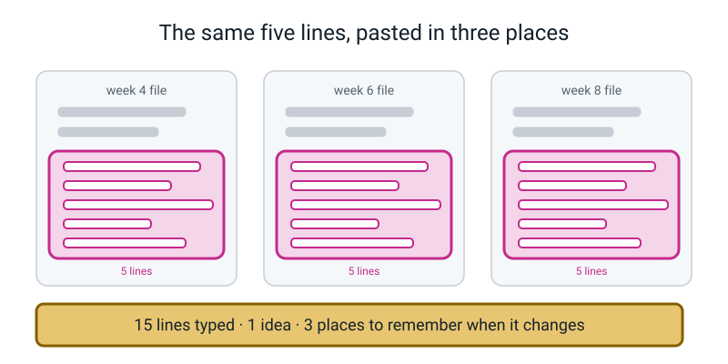
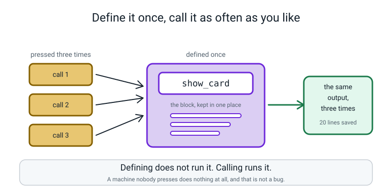
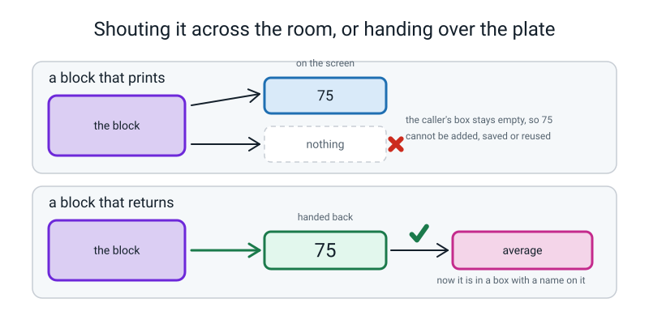
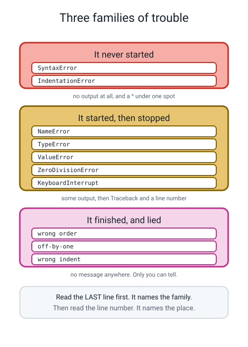
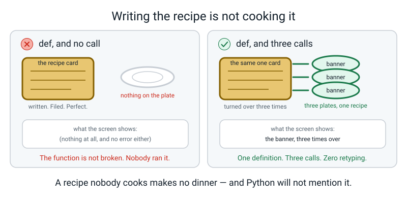
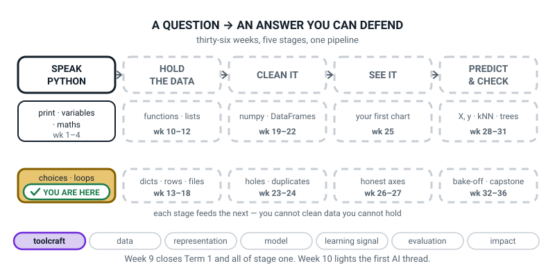
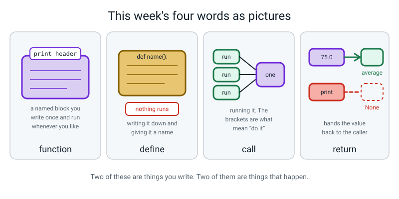

# Week 9 — Term 1 Checkpoint: You Keep Typing the Same Five Lines

[⬅ Week 8](week-08.md) · [Course Home](../README.md) · [Next ➡](week-10.md) · [Workbook](../workbook/week-09.md)

---

> ### This week in one sentence
> **When the same block appears three times, give it a name — a function is a named block you can run whenever you want.**
>
> **By the end of this chapter you will be able to:**
> - Repair **ten broken programs** drawn from weeks 1–8, without help
> - Name the **error family** for every traceback in your Bug Log, from the message alone
> - Define a function with **`def`** and call it by name — and say why defining it is not running it
> - Explain what **`return`** hands back, and what happens when a function has no `return`
> - Produce your own list of **which weeks need revisiting** — a list, not a grade
>
> **New syntax:** `def name():` · `name()` · `return value`
>
> **Reading time:** about 35 minutes. **Homework:** about 60 minutes.
>
> **There is no mark on anything this week.** The output of the checkpoint is a list of things to go back to. Getting four of the ten repairs and finding out exactly which four is a **better** outcome than getting nine and learning nothing.

---

## 🪝 Start Here

Before anything new, open two files you already wrote. Your `guess.py` from last week, and your `grade.py`. Put them side by side.

**Find something that is in both of them.** Not something *similar* — something **identical**. Character for character.

You will find it in about thirty seconds. It is the banner at the top: a `print("=" * 40)`, a title, and another `print("=" * 40)`.

Take a coloured pencil and circle it. **Both copies, same colour.**

Now open `about_me.py` from Week 4. It is in there too, or something very close. Circle that one as well, same colour.

**Now the count, and this is the moment.**

**How many lines are in one copy?** Four or five. **How many copies did you find?** Three. **So how many lines have you typed, in total, to say that one thing?** Fifteen.

Fifteen lines. One idea. Three questions, and the third one is the one that matters.

**One.** You have decided the heading should say `LEVEL 2` instead of `AI ACADEMY`. **How many places do you have to change?** Three.

**Two.** What happens if you change two of them and forget the third? Two files say one thing and one says another. **And does Python tell you?** No. Not a word.

**Three, and this is the real problem.** Look at your three circles. **Can you tell me, right now, without reading them character by character, that all three are identical?**

Try. You cannot. Neither can I. One of them almost certainly has a different number of equals signs or an extra space, and there is no way to know which without checking every character in all three.

> **That is the actual cost of copying code. Not that it is long — that you cannot check it.** Three copies is three separate truths, and you are trusting your memory to keep them the same.

So today you are going to give that block a **name**, write it down **once**, and use the name. And when you change your mind about the wording, you will change it in one place, and it will be **impossible** to miss the others — because there won't be any.


*Figure 9.1 — One idea, three places. The problem is not the typing; it is that changing your mind now means changing your mind three times without missing one.*

---

## 🧠 The Big Idea

> **📌 About the code in this section.** The blocks below are **illustrations, not files**. They show you the shape of one idea, and each one carries on from the one above it — the `import` lines and the data are typed once, in the first block that needs them. **The complete, runnable file is in 💻 Type This.** If you copy a block from this section on its own and Python says `NameError`, that is why, and nothing is broken.

### 1. Two separate acts: writing it down, and running it

**The plain explanation.**

> **function** — a named block of code you write once and run whenever you like.

You have been *using* functions since Week 1. `print` is a function. So are `input`, `int`, `round` and `range`. Somebody wrote those, gave them names, and you have been calling them by name ever since without ever seeing the block inside. **Today you write your own.**

And there are **two completely separate acts**, and telling them apart is most of this week.

```text
   DEFINING                            CALLING
   def print_header():                 print_header()
   "Here is a recipe."                 "Cook it, now."
   Nothing runs.                       The whole block runs.
   You do it once.                     You do it as often as you like.
   The colon and the indent matter.    The brackets matter.
```

> **define** — writing the block down and giving it a name. `def print_header():`. **Nothing runs.**
> **call** — running it. `print_header()`. The block runs, top to bottom.

**The analogy.** A **recipe card.** `def` is writing the card and putting it in the box. Nothing has been cooked. **Calling** is taking the card out and cooking what it says. You write the card once. You cook from it whenever you are hungry.

**The concrete version.** Type this and run it, with no call at all:

```python
def print_header():
    print()
    print("=" * 34)
    print("   AI ACADEMY  -  SCORE REPORT")
    print("=" * 34)
    print()
```

```text
```

**Nothing. Silence. And nothing is broken.**

Python read that file, found a recipe, wrote the recipe down under the name `print_header`, got to the end of the file, and had nothing else to do. **Defining a function does not run it.**

That is not a wart. It is the entire reason this is useful — the recipe sits there, and **you** decide when to cook it.

Now add one line at the bottom:

```python
print_header()
```

The banner appears. Add two more calls and you get three banners.

> **⚠️ Watch out:** there is a near-miss version of the call, and it is silent. Meet it now rather than at eleven at night.

Take the **brackets** off the call:

```python
def print_header():
    print("=" * 20)

print_header
```

The real output is an empty screen:

```text
```

**Nothing again. No error.** `print_header` without brackets is the **name** of the recipe — a reference to the thing. `print_header()` **with** brackets means *do it*. You asked Python to think about the recipe, and it did, silently, and moved on.

**The brackets are what mean "actually run it"** — exactly like `.isdigit` versus `.isdigit()` last week. Same trap, same missing brackets.


*Figure 9.2 — The machine is defined once and sits there. Each call is a press of the button. A machine nobody presses does nothing, and that is not a fault.*

### 2. There is no new punctuation this week

**Good news, and it is worth being explicit about.** `def name():` uses exactly the two rules you already know from `if` and `for`:

- **A colon at the end** means "the indented block below belongs to me."
- **The indent *is* the block.** Everything indented under the `def` is inside the function; the first line back at the margin is outside it again.

So the errors you already know how to read turn up here, in a new place, saying almost the same thing:

```python
def print_header()
    print("=" * 20)
```

```text
  File "/Users/you/ai-academy/level2/header.py", line 1
    def print_header()
                      ^
SyntaxError: expected ':'
```

Same message as a `for` with no colon. Same fix.

```python
def print_header():
print("=" * 20)
```

```text
  File "/Users/you/ai-academy/level2/header.py", line 2
    print("=" * 20)
    ^
IndentationError: expected an indented block after function definition on line 1
```

Same shape as a `for` with no indented body — and notice that Python names the construct precisely: *"after function definition"*. **Python's error messages tell you which kind of block you failed to fill in.** That turns a scary message into a useful one.

The **empty brackets are required**, even though there is nothing in them:

```python
def print_header:
    print("=" * 20)
```

```text
  File "/Users/you/ai-academy/level2/header.py", line 1
    def print_header:
                    ^
SyntaxError: invalid syntax
```

And **definitions go above calls**, because Python reads a file from top to bottom:

```python
print_header()

def print_header():
    print("=" * 20)
```

```text
Traceback (most recent call last):
  File "/Users/you/ai-academy/level2/header.py", line 1, in <module>
    print_header()
NameError: name 'print_header' is not defined
```

*"When Python read that line, had it read the recipe yet?"* No. **Definitions first, calls after.** In practice: put all your `def`s at the top and your calls below them, and this never comes up again.

### 3. `return` — the thing that makes functions worth having

**The plain explanation.** So far every function has **printed**. `print` puts characters on the screen where a human can read them, and that is it — the value is gone.

> **return** — immediately ends the function and hands one value back to whoever called it.

**Printing sends the answer to the screen. Returning hands it to the program**, which means the program can use it.

**The analogy, and it is the one to keep:**

- **A function that prints is a waiter who shouts your order across the restaurant.** Everyone hears it. **Nobody can eat it.**
- **A function that returns is a waiter who brings the plate to your table.** Now you can eat it, share it, weigh it, or take a photograph of it.

**The concrete version — two functions that look almost the same and are completely different.**

```python
# show_vs_give.py - one shouts the answer, the other hands it over.

def show_average():          # this one PRINTS. It hands nothing back.
    print(75.0)

def give_average():          # this one RETURNS. It hands 75.0 back.
    return 75.0

shouted = show_average()     # the 75.0 appears on screen...
print(shouted)               # ...but what landed in the box?

handed = give_average()      # nothing appears on screen...
print(handed)                # ...until we print what landed in the box
print(handed + 25)           # and it is a real number, so maths works
```

**Four lines of output, and the second one is the whole lesson:**

```text
75.0
None
75.0
100.0
```

Walk them with a finger:

| Line of output | Where it came from |
|---|---|
| `75.0` | `show_average()` printing. The value went to the screen and stayed there |
| `None` | `print(shouted)`. **The box is empty.** A function with no `return` hands back `None`, Python's word for "no value at all" |
| `75.0` | `print(handed)`. The returned value — printed by **us**, not by the function |
| `100.0` | `handed + 25`. It is a real number, so it can be used |

**And here is what happens if you try to do maths with a shouted answer:**

```python
def show_average():
    print(75.0)

print(show_average() + 25)
```

```text
75.0
Traceback (most recent call last):
  File "/Users/you/ai-academy/level2/shout_maths.py", line 4, in <module>
    print(show_average() + 25)
TypeError: unsupported operand type(s) for +: 'NoneType' and 'int'
```

**The `75.0` was printed — you can see it — and then the program crashed trying to add 25 to nothing.**

> **🐞 If you see this error:** **`NoneType` in a `TypeError` almost always means a function you called forgot to `return` something.** That is one of the most useful sentences in this whole course, and it will save you an hour before Christmas.

You can always print a returned value — `print(give_average())` works fine. You can **never** recover a printed one. So the rule, worth writing down:

> **Return by default. Print only at the very edge of the program, where a human is actually reading.**


*Figure 9.3 — Printing sends the answer to the screen and leaves the caller's hands empty. Returning puts it in the caller's hands, where it can be stored, added to, or printed later.*

**And one more fact, which is short: `return` ends the function immediately. Nothing after it runs.**

```python
def give_average():
    return 75.0
    print("this line never runs")

print(give_average())
```

```text
75.0
```

No error. No warning. The `print` inside the function is simply never reached. If you put a line after a `return` and cannot see why it is silent, that is why.

### 4. What this week deliberately does **not** cover

Every function here has **no inputs**. `print_header()` prints the same banner every time, and there is nowhere to tell it "make it forty wide instead of thirty-four", or "say LEVEL 3".

**That hole is obvious and you will notice it, probably within four minutes. You have found next week.** It is a real limitation and the answer is one line of new syntax. **Write the question down** and do not chase it today — two new ideas in a checkpoint week is one too many, and the checkpoint half of this lesson matters more.

### 5. The three families of trouble

**This half is revision rather than new, and it is the backbone of the rest of the term.** Open your Bug Log at page one.

**Every single thing that has gone wrong for you in eight weeks belongs to one of three families — and you can tell which one from the message alone, without even seeing the code.**

| Family | What you see | What it means | Members you have met |
|---|---|---|---|
| **1 — It never started** | **No output at all**, and a `^` under one spot in your file | Python could not even read the file. Nothing ran | `SyntaxError`, `IndentationError` |
| **2 — It started, then stopped** | Some output, then `Traceback (most recent call last):`, a **line number**, and a message | Python read the file fine and got partway through before hitting something impossible | `NameError`, `TypeError`, `ValueError`, `ZeroDivisionError`, `AttributeError`, `KeyboardInterrupt` |
| **3 — It finished, and lied** | **No message anywhere.** A complete, confident, wrong answer | The program is exactly what the file says. The file is not what you meant | wrong `elif` order, off-by-one, a line at the wrong indent, `.isdigit` without brackets, text compared with a number |

**Family 1 is the friendliest.** You find out instantly and nothing wrong has happened yet — no file was written, no answer was reported, **nobody was told anything untrue.**

**Family 2 is the most informative.** It gives you a **line number**, which is a genuine gift, and the nouns in the message — `str`, `int`, `NoneType` — tell you what kind of thing surprised Python.

**Family 3 is the expensive one, because it survives.** It goes into your homework, into the answers your program printed, into next term. Your Week 6 grade program would have handed thirty students a wrong grade and **nobody would ever have found out.**


*Figure 9.4 — Read the last line first: it names the family. Then read the line number: it names the place. The third family has neither, which is what makes it the expensive one.*

> **💡 Try this:** go through your Bug Log and put a **1**, **2** or **3** beside every single entry. Do them fast. Then **count the threes** and write the number at the top of the page. It will be more than you expect, and they will cluster — usually in Weeks 6 and 7, because `elif` chains and `range` boundaries are where silence lives.

---

## 💻 Type This

Two things: the extraction, done properly and **proved**; and then two mistakes made on purpose, both of them silent.

### Step 1 — the long version, so there is something to compare against

New file, `report_long.py`. Type it out, including all three copies of the banner. **Yes, all three. It is the point.**

```python
# report_long.py - the version with the same five lines pasted three times.

print()
print("=" * 34)
print("   AI ACADEMY  -  SCORE REPORT")
print("=" * 34)
print()

print("Scores added : 12")
print("Total        : 900")

print()
print("=" * 34)
print("   AI ACADEMY  -  SCORE REPORT")
print("=" * 34)
print()

print("Average      : 75.00")
print("Highest      : 100")

print()
print("=" * 34)
print("   AI ACADEMY  -  SCORE REPORT")
print("=" * 34)
print()
```

```text

==================================
   AI ACADEMY  -  SCORE REPORT
==================================

Scores added : 12
Total        : 900

==================================
   AI ACADEMY  -  SCORE REPORT
==================================

Average      : 75.00
Highest      : 100

==================================
   AI ACADEMY  -  SCORE REPORT
==================================

```

**Count what is wrong with that file. There are three things, and only one of them is "it's long".**

1. **Fifteen lines say one thing.** The five-line banner appears three times.
2. **If the wording changes, there are three places to change it.** Miss one and you have a report with two different headings and no error message anywhere.
3. **You cannot tell by looking whether the three copies are identical.** They might differ by a space. You would never know.

### Step 2 — lift it out, and do not retype it

New file, `report_short.py`.

**Copy the five banner lines. Do not retype them — copy them.** Here is why, and it is a real testing principle: *if we retype them and the output changes, we will not know whether it was the function or the typing.* **Change one thing at a time.**

```python
# report_short.py - the same output, with the five lines named once.

def print_header():                              # DEFINE: here is a block called print_header
    print()                                      # everything indented belongs to it
    print("=" * 34)
    print("   AI ACADEMY  -  SCORE REPORT")
    print("=" * 34)
    print()

print_header()                                   # CALL: run that block, now
print("Scores added : 12")
print("Total        : 900")

print_header()                                   # CALL it again - no retyping
print("Average      : 75.00")
print("Highest      : 100")

print_header()                                   # and again
```

Run it. It looks identical to before.

### Step 3 — "looks identical" is not good enough. Prove it.

Run both programs, save each one's output to a file, and compare the two files with a tool called `diff`:

```text
$ python3 report_long.py > long.txt
$ python3 report_short.py > short.txt
$ diff long.txt short.txt
$ 
```

**`diff` printed nothing.**

That silence is how `diff` says *"these two files are identical."* It is unnerving the first time — you expect a tool to say something — but nothing is exactly the answer you wanted. **That silence is the strongest evidence you have produced all term.**

> **💡 Try this:** if you do not want to use the terminal for this, run both programs and put the two outputs side by side on screen, then read them aloud in unison. Slower, entirely convincing. Or count the lines of the two *programs*: `wc -l` gives **25** and **18**.

Twenty-five lines became eighteen. **But look at what actually changed: there is now exactly one place in the whole file where that heading is written down.** If you want it to say LEVEL 2, you change one line, and it is impossible to miss a copy, because there are none.

**Seven lines saved is a nice side effect of a change that was really about certainty.**

### Step 4 — ⚠️ mistake number one: the function nobody calls

*Delete all three `print_header()` calls, but leave the `def`.* Run it.

The report body appears, with **no banners at all**, and **no error message**.

- **Did it crash?** No.
- **Is the banner code still in the file?** Yes — you can see it.
- **Read the definition out loud. Is anything wrong with it?** No. It is perfect. Every character of it is correct.
- **So why is there no banner?**

**How many times did you tell Python to run it?** Zero.

> **A recipe nobody cooks makes no dinner.**

This is the number one thing that happens to people learning functions: **the file gets longer, the output gets shorter, and nothing complains.** So whenever you write a `def` and get **less output than you expected**, the first question is always the same one: **did you call it?**

Put the calls back.

### Step 5 — ⚠️ mistake number two: `print` where `return` belongs

*This is the mistake you will actually make in April.* A function that works out an average — Week 7's accumulator, with a name on it — but using `print` where `return` belongs:

```python
def average_of_twelve():
    total = 0
    for i in range(1, 13):
        total += int(input(f"Score {i} of 12: "))
    print(total / 12)          # <-- this is the mistake

average = average_of_twelve()
print(f"Average : {average:.2f}")
```

Run it and type the twelve numbers from the Week 7 card — 88 92 70 65 100 54 78 81 47 90 62 73:

```text
Score 1 of 12: 88
Score 2 of 12: 92
Score 3 of 12: 70
Score 4 of 12: 65
Score 5 of 12: 100
Score 6 of 12: 54
Score 7 of 12: 78
Score 8 of 12: 81
Score 9 of 12: 47
Score 10 of 12: 90
Score 11 of 12: 62
Score 12 of 12: 73
75.0
Traceback (most recent call last):
  File "/Users/you/ai-academy/level2/average_bad.py", line 8, in <module>
    print(f"Average : {average:.2f}")
TypeError: unsupported format string passed to NoneType.__format__
```

**Look at that carefully, because it is genuinely confusing the first time.**

**The answer is on the screen.** `75.0`. It is right there, it is correct, it is exactly the right number. And then the program crashed on the very next line.

**Read the last line. What word jumps out?** `NoneType`. That is Python saying *"the thing you gave me is `None` — no value at all."*

So where did the `None` come from? From `average = average_of_twelve()`. The function **printed** the number and **returned nothing**, so `average` holds `None`, and `:.2f` cannot format nothing to two decimal places.

**And notice how sneaky this is: the number was on the screen.** If you were only glancing, you would swear the function worked.

*Fix it — one word:*

```python
# average_fn.py - a function that hands a number back.

def average_of_twelve():                   # DEFINE - no input, one answer out
    total = 0                              # week 7's accumulator, now living inside
    for i in range(1, 13):                 # 1, 2, 3 ... 12
        total += int(input(f"Score {i} of 12: "))
    return total / 12                      # RETURN - hand the answer back

average = average_of_twelve()              # CALL - and catch what comes back
print(f"Average : {average:.2f}")
print(f"Doubled : {average * 2:.2f}")      # you can do maths with a returned value
```

The same twelve numbers, and the last two lines of output:

```text
Average : 75.00
Doubled : 150.00
```

**Same number. Same twelve scores as Week 7 and Week 8. Same 75.** But now it is **in a box with a name on it**, so it can be formatted, added to, saved or compared — which is the difference between a program that *reports* a number and a program that *uses* one.

**That agreement across three weeks, from three completely differently shaped programs, is the checkpoint doing its job.**

### Step 6 — do it on your own file

Now the real thing. **Open your own `grade.py`** and do exactly what you just did to `report_long.py`:

1. **Copy** the banner lines. Do not retype them.
2. Go to the **top** of the file, below any `import`.
3. Type `def print_header():` and press Enter.
4. **Paste** the lines and indent all of them by four spaces (select them and press Tab in most editors).
5. Leave a blank line.
6. Go back down to where the banner used to be and **delete the original lines**, replacing them with `print_header()`.

Then prove it: save the output before the change and after, and compare them. **Identical, or it does not count.**

### The complete finished program

```python
# three_functions.py - three blocks that were pasted more than once, each given a name.

def print_banner():                      # was at the top of about_me.py AND grade.py
    print("=" * 34)
    print("   AI ACADEMY  -  LEVEL 2")
    print("=" * 34)

def print_divider():                     # was between every section of every report
    print("-" * 34)

def print_goodbye():                     # was at the bottom of guess.py AND grade.py
    print_divider()                      # a function may call another function
    print("  Thanks for using this program.")
    print("=" * 34)

print_banner()
print("Name  : Ramana")
print("Class : 7")
print_divider()
print("Total   : 900")
print("Average : 75.00")
print_goodbye()
```

```text
==================================
   AI ACADEMY  -  LEVEL 2
==================================
Name  : Ramana
Class : 7
----------------------------------
Total   : 900
Average : 75.00
----------------------------------
  Thanks for using this program.
==================================
```

**The interesting line is `print_divider()` inside `print_goodbye()`.** A function calling another function is **not a new rule** — it is just a call, in a place that happens to be inside a `def`. There is no limit and no special syntax. The only requirement is that `print_divider` must exist by the time `print_goodbye` is actually *called*, which it does if all your `def`s are at the top.

> **🧑‍🏫 If a student asks:** *"can a function call itself?"* It can, and it has a name — **recursion** — and it is one of the most beautiful ideas in programming. It is also a very good way to make a program run forever, which is why it is not today's lesson. **Write the question down.**

---

## 🔍 Worked Examples

### Worked Example 1 — The snack stall menu (food)

Two display functions, each defined once and called several times. Nothing returns anything, and that is correct: **a function whose whole job is showing something has nothing to hand back.**

```python
# menu.py - two display functions, defined once and called several times.

def print_stall_name():                  # DEFINE - the block that was pasted twice
    print("=" * 32)
    print("   RAMANA'S SNACK STALL")
    print("=" * 32)

def print_rule():                        # DEFINE - the divider that was pasted lots
    print("-" * 32)

print_stall_name()                       # CALL
print("  Samosa                12")
print("  Vada pav              20")
print_rule()                             # CALL
print("  Chai                   8")
print("  Lassi                 25")
print_rule()                             # CALL again
print("  Everything is fresh today.")
print_stall_name()                       # CALL again
```

```text
================================
   RAMANA'S SNACK STALL
================================
  Samosa                12
  Vada pav              20
--------------------------------
  Chai                   8
  Lassi                 25
--------------------------------
  Everything is fresh today.
================================
   RAMANA'S SNACK STALL
================================
```

**Count the calls: four.** Two to `print_stall_name`, two to `print_rule`. **Count the definitions: two.** And count the number of places the stall's name is written down: **one.**

**Now the test that makes the point.** The stall changes hands and it is now `RAMANA & CO`. **How many lines do you edit?** One. And when you have edited it, how do you know you got them all? **There is nothing to get.**

Compare that with the version where the banner is pasted twice: two edits, and a program that will happily print two different stall names and never mention it.

### Worked Example 2 — The strike rate (sport)

A function that **returns** a number, and a program that then does three different things with it.

```python
# strike_rate.py - a function that hands a number back, then the program uses it.

def strike_rate():                          # DEFINE - no input, one number out
    runs = int(input("Runs scored? "))
    balls = int(input("Balls faced? "))
    return runs / balls * 100               # RETURN - hand the answer back

rate = strike_rate()                        # CALL - and catch what comes back

print(f"Strike rate : {rate:.2f}")
print(f"Rounded     : {round(rate)}")       # maths on a returned value

if rate >= 100:                             # and a decision on it too
    print("Faster than a run a ball.")
else:
    print("Slower than a run a ball.")
```

Typing 112 runs off 89 balls:

```text
Runs scored? 112
Balls faced? 89
Strike rate : 125.84
Rounded     : 126
Faster than a run a ball.
```

And a slower innings, 27 off 33:

```text
Runs scored? 27
Balls faced? 33
Strike rate : 81.82
Rounded     : 82
Slower than a run a ball.
```

**Hand-check.** 112 ÷ 89 = 1.2584…, × 100 = 125.84 ✔ And 27 ÷ 33 = 0.8181…, × 100 = 81.82 ✔

**Here is the thing to notice, and it is the argument for `return` in one picture.** That one returned number gets used **three times**: formatted to two places, rounded to a whole number, and tested against 100. If `strike_rate` had *printed* the answer instead, **not one of those three lines would be possible.** You would have a number on the screen and nothing in your hands.

**And an honest criticism**, which a sharp reader will already have: that function both **fetches** the data *and* **works it out**, which means you cannot test it without typing two numbers by hand. Separating those two jobs needs a way to hand the numbers **in** — which is parameters, and which is next week. **If that itch is bothering you, you are ready for Week 10.**

### Worked Example 3 — The attendance card (school)

Three display functions — one of which calls another — plus one that returns a number the rest of the program makes a decision on.

```python
# attendance.py - three display functions, one returning function, one card.

TERM_DAYS = 60                            # school days in the term

def print_line():                         # the divider, pasted three times before
    print("-" * 32)

def print_card_top():                     # the banner, pasted twice before
    print("=" * 32)
    print("   ATTENDANCE CARD")
    print("=" * 32)

def print_card_bottom():                  # a function may call another function
    print_line()
    print("   Signed: ______________")
    print("=" * 32)

def percent_present():                    # this one RETURNS a number
    present = int(input("Days present out of 60? "))
    return present / TERM_DAYS * 100      # RETURN - hand the percentage back

print_card_top()                          # CALL
percent = percent_present()               # CALL, and catch the answer

print(f"   Present : {percent:.1f}%")
print_line()                              # CALL

if percent >= 95:                         # a decision made on a returned number
    print("   Band    : excellent")
elif percent >= 90:
    print("   Band    : good")
else:
    print("   Band    : watch it")

print_card_bottom()                       # CALL
```

Typing 57 days present:

```text
================================
   ATTENDANCE CARD
================================
Days present out of 60? 57
   Present : 95.0%
--------------------------------
   Band    : excellent
--------------------------------
   Signed: ______________
================================
```

And a lower one, 53 days:

```text
================================
   ATTENDANCE CARD
================================
Days present out of 60? 53
   Present : 88.3%
--------------------------------
   Band    : watch it
--------------------------------
   Signed: ______________
================================
```

**Hand-check.** 57 ÷ 60 = 0.95, × 100 = 95.0% ✔ And 53 ÷ 60 = 0.8833…, × 100 = 88.3% ✔ 95 is not under 95, so it takes the `>= 95` branch — **the boundary lands on "excellent"**, because the test is `>=`. That is Week 5's boundary rule, still true in Week 9.

**Three things worth pointing at.**

**Two dividers, one definition.** Look at the output: there are two dashed lines. One came from the direct `print_line()` call; the other came from **inside** `print_card_bottom()`. Same function, two routes to it, and neither one had to know about the other.

**`print_card_bottom` calling `print_line` is completely ordinary.** No new rule. Just a call that happens to live inside a `def`. And it means the divider's *width* is written down in exactly one place — change `32` to `40` in `print_line` and both dividers change together, for ever, without you having to remember the second one.

**And the mixture is the shape most real programs have.** Three functions that show things and hand back nothing, and one that hands back a number and shows nothing. **Functions work things out; the main part of the program decides what a human sees.**

---

## 🐞 When It Breaks

Every message below came from really running a broken version of this week's code.

**And this week the pattern is different from every week so far: functions fail *quietly*.** Two of the three breaks below have no error message at all.

### Break 1 — no output at all, and no error either

```python
def print_header():
    print("=" * 20)
```

```text
```

**What Python is telling you.** *Nothing at all.* No output, no message, and the program exited perfectly normally.

**What actually happened.** Python read the file, found a recipe, wrote it down under the name `print_header`, reached the end of the file, and had nothing to do. **Defining is not running.**

**The fix.** Add `print_header()` at the margin, as many times as you want it to happen.

**And the same silence has a second cause**, which is worse because it looks right:

```python
def print_header():
    print("=" * 20)

print_header
```

```text
```

The call *looks* like it is there. It is not — the **brackets** are missing, so that line names the recipe rather than cooking it.

> **🐞 If you see this error:** there is no error, and that is exactly the point. **Whenever a `def` produces less output than you expected, the first question is always "did you call it — with brackets?"**

### Break 2 — `NoneType` in a `TypeError`

```python
def show_average():
    print(75.0)

print(show_average() + 25)
```

```text
75.0
Traceback (most recent call last):
  File "/Users/you/ai-academy/level2/shout_maths.py", line 4, in <module>
    print(show_average() + 25)
TypeError: unsupported operand type(s) for +: 'NoneType' and 'int'
```

**What Python is telling you.** *"You tried to add 25 to nothing."*

**And this one is nastier than it looks, because the right answer is on the screen.** `75.0` printed. Then the crash. If you glance at the output you will think the function worked and the problem is somewhere else entirely.

**The word to look for is `NoneType`.** It means: *the value you are working with is `None`*, and `None` is what a function hands back when it has no `return`.

**The fix.** `return x` instead of `print(x)` inside the function.

You will meet the same cause wearing a different message when an f-string is involved:

```text
TypeError: unsupported format string passed to NoneType.__format__
```

*"You asked me to show **nothing** to two decimal places."* Same cause. Same fix. **The word `NoneType` is the clue, wherever it turns up.**

### Break 3 — the call above the `def`

```python
print_header()

def print_header():
    print("=" * 20)
```

```text
Traceback (most recent call last):
  File "/Users/you/ai-academy/level2/header.py", line 1, in <module>
    print_header()
NameError: name 'print_header' is not defined
```

**What Python is telling you.** *"I have never heard of that name."*

**And the confusing part is that the function is right there, four lines below.** But Python reads a file **top to bottom**, and at the moment it reached line 1 it had not read the definition yet, so the name genuinely did not exist.

**The fix.** Move the `def` above the call. **Definitions first, calls after** — and if you always put your `def`s at the top of the file, this never happens again.

### The whole clinic, for reference

| What you see | What it means | The fix |
|---|---|---|
| **No output at all, and no error** | Python learnt the recipe and reached the end of the file | **A function defined but never called.** First question, every time: did you call it? |
| **No output at all, and no error** (again) | Same silence, different cause | `print_header` **without brackets** names the function instead of running it. `print_header()` |
| `SyntaxError: expected ':'` with `^` after `def print_header()` | The colon is missing | Add the `:`. Same rule as `if` and `for` |
| `SyntaxError: invalid syntax` with `^` under the colon in `def print_header:` | A `def` needs brackets before its colon | `def print_header():`. The empty `()` is required |
| `IndentationError: expected an indented block after function definition on line 1` | "You told me a block was coming and gave me nothing" | Indent the body four spaces |
| `NameError: name 'print_header' is not defined` | "I have never heard of that name" | The call is **above** the `def`. **Definitions first, calls after** |
| `TypeError: print_header() takes 0 positional arguments but 1 was given` | "You handed something to a function with nowhere to put it" | Call it with empty brackets — or give it a parameter, **which is next week** |
| `SyntaxError: 'return' outside function` with `^^^^` under the line | "There is no function here to return from" | Move it inside a `def`, or use `print` if you are at the top level |
| `TypeError: unsupported operand type(s) for +: 'NoneType' and 'int'` | "You tried to add 25 to nothing" | A function **printed** instead of **returning**. Change `print(x)` to `return x` |
| `TypeError: unsupported format string passed to NoneType.__format__` | "Show *nothing* to two decimal places?" | Same cause as the row above, met through an f-string's `:.2f` |
| **No error, and a line inside the function never runs** | A line placed **after** a `return`. `return` ends the function immediately | Move it above the `return`, or delete it |
| **No error, and the output changed slightly after the extraction** | The block was **retyped** rather than copied — an extra space, or 34 equals signs instead of 40 | `diff` the before-and-after output. Then copy, do not retype |
| **No error, the function runs, and nothing appears** | The function `return`s a value and the caller never printed it | `print(name())`, or store it and print it. **Returning is not showing** |

---

## 🎲 What We Did In Class

*If you missed it, everything here works at home — including the repair round, which is on your workbook page.*

### The repetition hunt

Two of the student's own files, side by side. `guess.py` on the left, `grade.py` on the right. **Find something that is in both. Not similar — identical.** The banner, found in about thirty seconds. Circled in one colour. Then `about_me.py` from Week 4 — a third copy, circled in the same colour.

Then the count: **five lines × three copies = fifteen lines to say one thing.** Then the three questions: how many places if the wording changes (three) · does Python warn you if you miss one (no) · **and can you prove all three copies are identical?** (No. Not without reading every character. And one of them wasn't.)

### Define, call, and the near-miss

The two-column table, written up and left up:

```text
   DEFINING                            CALLING
   def print_header():                 print_header()
   "Here is a recipe."                 "Cook it, now."
   Nothing runs.                       The whole block runs.
   You do it once.                     You do it as often as you like.
```

The `def` typed and run with **no call**: silence, exit code 0, nothing broken. Then one call added: the banner appeared. Then three calls: three banners. Then the brackets deleted from a call: **that banner vanished, and there was no error.**

### `return`, and the word `None`

`show_vs_give.py`, typed and run:

```text
75.0
None
75.0
100.0
```

Four lines, walked with a finger. The `None` on line two is the lesson: **a function with no `return` hands back nothing, and Python has a word for nothing.**

Then the waiter: **printing is shouting your order across the restaurant; returning is bringing the plate to your table.** You can always print a returned value. You can never recover a printed one.

### The extraction, on the student's own file

The banner **copied** — not retyped — lifted into `def print_header():` at the top, and the originals replaced with `print_header()`. Then the proof:

```text
$ python3 report_long.py > long.txt
$ python3 report_short.py > short.txt
$ diff long.txt short.txt
$ 
```

**`diff` printed nothing, which is how it says "identical".** Twenty-five lines became eighteen, and — the part that matters — **there is now exactly one place where that heading is written down.**

### Two mistakes made on purpose, both silent

**One: the calls deleted, the `def` left in place.** The report body appeared with no banners and no error. Four questions did the work: *did it crash?* (no) · *is the code still there?* (yes) · *is anything wrong with the definition?* (no, it's perfect) · **how many times did you tell Python to run it?** (zero).

**Two: `print` where `return` belonged.** The right answer, `75.0`, appeared on the screen — and then:

```text
TypeError: unsupported format string passed to NoneType.__format__
```

The word that jumps out is `NoneType`. **If a `TypeError` mentions `NoneType`, a function you called forgot to `return` something.** Written in the Bug Log as a **rule**, not an entry.

And the honest observation about which was worse: **the second one, because the right answer was visible.** The number being on screen made it *harder* to find, not easier.

### The ten repairs, timed

Twelve minutes. Ten broken programs, all from weeks 1–8, nothing new. Three rules, said before the timer started:

1. For each one write **which family**, **what's wrong** in one sentence, and **the fix**.
2. Stuck for more than ninety seconds? Write down which week it came from and **move on.** Getting stuck is information.
3. **This is not a test and there is no mark.** What comes out at the end is a list of weeks to revisit. Getting four and finding out exactly which four is better than getting nine and learning nothing.

**Three of the ten had no error message at all** — the missing `f`, the `elif` ordering bug, and the off-by-one. That proportion is deliberate.

### Sorting the Bug Log, and writing the list

Every entry in the Bug Log labelled **1**, **2** or **3**, fast. Then the threes counted, and the number written at the top. Then the question: **is there a week they cluster in?** Usually 6 and 7.

Then the product of the whole lesson: a sheet headed **Weeks to revisit**, with three columns — *which week*, *what specifically*, and *how I'll know I've got it.* **No mark anywhere on it.** A number would tell you less than what is already written there: "seven out of ten" does not tell you what to do on Saturday, and "I missed all three of the silent ones" does.

### The two Bug Log entries

1. **No output at all and no error message.** The banner code was in the file and correct. **I defined the function and never called it.** Python read the recipe, wrote it down, and got to the end of the file with nothing to do. Fix: added `print_header()` at the margin, three times.
2. `TypeError: unsupported format string passed to NoneType.__format__` — **and the number 75.0 was on the screen just above it.** My function used `print` where it should have used `return`, so it showed me the answer and handed back nothing. `average` held `None`, and you cannot format nothing to two decimal places. Fix: `return total / 12`.

---

## 💬 Talk About It

**1. "Should every repeated block become a function?"** *(There is no settled answer, and here is why.)*

*Hint:* there are two real camps and neither is silly. One says **never write the same thing twice** — every duplicate is a future inconsistency, so extract it the first time you copy it. Today proved their point: you could not tell whether your three banners matched without reading every character. The other camp says **wait until the third copy**, and their argument is better than it sounds: two blocks that look identical today are sometimes two different ideas that happen to coincide, and merging them early gives you one function serving two masters, which grows options and flags and ends up harder to read than the duplication was. Now find the thing neither camp can know: **will those two blocks change together, or separately?** And then find the rule everyone agrees on — *if you have already changed the same thing in two places on the same day, extract it now*, because that is no longer a prediction, it is evidence.

**2. "Which family of trouble would you rather hand in?"**

*Hint:* answer quickly, then justify slowly. Family one never ran, so it **cannot possibly have told anybody anything untrue.** Family two at least stopped and pointed at a line. Family three hands in a confident wrong answer with nothing at all to notice. Then push on it: is there a machine where **stopping** is the dangerous outcome? Find one. And then find the thing that is true with no qualification: family three is worse **for the person who has to find it** — and while you are testing, that person is you.

**3. "Why does Python need `def` at all? Couldn't it work out which lines belong together?"**

*Hint:* look at any five consecutive lines in your own program. Is there anything **in them** that says whether they are a group with a purpose or five unrelated things that happen to be next to each other? There isn't. Grouping is a fact about your **intention**, and your intention is not in the file until you put it there. `def` is exactly how you put it there — which is why the *name* matters more than almost anything else about a function. Then the sharp version: **is a wrong name worse than no name?** A misleading name actively lies to the next reader; duplicated code merely repeats itself. And the next reader is usually you.

---

## ⚠️ Don't Get Tricked

### Trick 1 — "defining it runs it"


*Figure 9.5 — Left: a `def` with no call. The recipe is written, the plate is empty, and nothing complains. Right: one definition, three calls, three plates.*

| ❌ Wrong | ✅ Right |
|---|---|
| "I wrote the `def`, ran the file, and nothing happened — so the function is broken" | **Defining files the recipe. Calling runs it.** Nothing was broken; nobody cooked |

Prove it to yourself twice, in both directions: add the call and watch the output appear; delete the call and watch it vanish. Both times there is **no error message**, and that is what makes it worth practising rather than reading.

### Trick 2 — "`return` prints it"

| ❌ Wrong | ✅ Right |
|---|---|
| "I wrote `return`, ran it, and nothing appeared — so I'll add a `print` inside as well" | **Returning is not showing.** Print the *returned* value: `print(give_average())` |

Adding a `print` inside as well **works**, which is exactly the problem — it hides the confusion until Week 10, when it starts producing stray text in the middle of your reports. Delete the inner `print` and print what comes back instead. Then look at the word `None` in `show_vs_give.py` until it stops being strange.

### Trick 3 — "`print_header` and `print_header()` are the same thing"

| ❌ Wrong | ✅ Right |
|---|---|
| `print_header` runs the function | `print_header` is the **name**. `print_header()` is the **instruction to run it** |

Writing the name on its own is legal, does nothing, and produces **no error** — which makes it one of the quietest annoyances in Python. You met exactly this last week with `.isdigit` versus `.isdigit()`, and it is the same rule in both places: **brackets mean "actually do it."**

### Trick 4 — "a function makes the program shorter, and that's the point"

| ❌ Wrong | ✅ Right |
|---|---|
| "25 lines became 18, so I saved 7 lines — that's the win" | The win is that **the heading is now written down in exactly one place.** Seven lines is a side effect |

Test it. **Change the heading to `LEVEL 2` in the pasted version:** three edits, and no way to be sure you got them all. **Now in the named version:** one edit, and *certainty*, because there is nothing else to find. Then ask how many banners there would have to be before the function version saved fifty lines — about a dozen — and then ask whether seven lines was worth it anyway. **It was, and the reason has nothing to do with lines.**

---

## 🌍 Where You've Seen This

1. **Every app's "share" button.** One block of code, defined once, called from twenty different screens. Nobody wrote that block twenty times — and when the sharing rules change, one place changes.
2. **The header and footer on every page of a website.** One definition, hundreds of calls. That is why a site's whole navigation bar can change overnight and every single page agrees.
3. **`print`, `input`, `int`, `round`, `range`.** Every one of them is a function somebody else defined, and you have been calling them by name since Week 1 without ever seeing inside.
4. **Any recipe you have followed twice.** The card is the definition. Cooking is the call. Writing the card does not feed anybody.
5. **A "reset to defaults" button.** One named block, callable from the settings screen, from the first-run screen, and from the crash-recovery screen. Three routes, one truth.
6. **The word "function" on your calculator.** `sin`, `√`, `%` — somebody defined each one, gave it a name, and you press the button. **You have been calling functions since primary school.**

---

## 🧭 Where This Fits

Look at the map carefully this week, because a whole stage is about to close. Everything in the gold
tile is now yours, and next week you step sideways into a stage you have never been in — the one where
you stop typing the data yourself and start **holding** it.



*Figure 9.0 — The pipeline after Week 9. The gold tile finishes here, so from next week the whole of
stage one is white. Dashed is still not yet — but there is much less of it than there was in Week 1.*

| | |
|---|---|
| **The mental model you now own** | When the same block of code shows up for the third time, **give it a name**. A function is a named block you can run whenever you like, as many times as you like — and `return` is how a value gets back *out* of it to whoever called it. |
| **The one question it answers** | *"I have written this same block three times — what do I do about it?"* — you write it once, name it, and call the name. Then when it is wrong, it is wrong in exactly one place. |
| **What it plugs into** | Every file you wrote in Weeks 1–8. The blocks you already typed out twice and three times are not practice you are throwing away; they are the **raw material** for your first functions. |
| **What carries forward** | Week 10 gives your functions parameters, so they can take something in. Week 12 puts them in a file called `stats.py` and imports them. And every library you will ever use — pandas, matplotlib, scikit-learn — is somebody else's Week 9. |
| **Spiral thread** | 🧰 **Toolcraft** — for the last time on its own. This is the ninth and final week of pure craft. Next week the pipeline moves on and the first AI thread lights up beside it. |

> **💡 Try this:** turn to your pencil map and go over the whole of stage one in ink. Nine weeks, two
> tiles, one stage: you can now write a program that decides, repeats, and names its own blocks.

---

## 🔑 Remember This

- **A function is a named block you write once and run whenever you like.** You have been calling other people's since Week 1.
- **Defining is not running.** `def name():` files the recipe. `name()` cooks it. A function defined and never called produces **no output and no error**.
- **The brackets mean "actually do it."** `print_header` is a name; `print_header()` is an instruction. Same trap as `.isdigit` last week.
- **No new punctuation this week.** A colon at the end, and the indent *is* the block — exactly like `if` and `for`. The empty `()` is required.
- **Definitions first, calls after.** Python reads top to bottom, so a call above the `def` gives `NameError`.
- **`return` hands one value back to the caller.** `print` sends it to the screen and keeps nothing.
- **A function with no `return` hands back `None`.** And **`NoneType` in a `TypeError` almost always means a missing `return`.**
- **`return` ends the function immediately.** A line after it never runs, and nothing warns you.
- **A function may call another function.** No new rule; it is an ordinary call that happens to sit inside a `def`.
- **Three families of trouble: never started · started then stopped · finished and lied.** Name the family from the message *before* you look at the code.
- **The point of a function is certainty, not length.** One place to change, and no copies to miss.

### Syntax reminder card

```python
def print_header():               # DEFINE. Colon at the end. Empty brackets required.
    print("=" * 34)               # the indent IS the block
    print("   MY REPORT")
    print("=" * 34)

print_header()                    # CALL. The brackets mean "do it".
print_header()                    # call it as often as you like

# print_header                      LEGAL, does nothing, no error. Missing brackets.
# def print_header:                 SyntaxError - the () is required
# def print_header()                SyntaxError: expected ':'

def give_average():               # a function that hands a value BACK
    total = 0
    for n in range(1, 6):
        total += n
    return total / 5              # RETURN ends the function immediately
    # print("never runs")           anything after a return is unreachable

average = give_average()          # CALL and catch what comes back
print(f"{average:.2f}")           # YOU print it - the function did not
print(average + 25)               # and you can do maths with it

def show_average():               # a function that PRINTS and returns nothing
    print(75.0)

box = show_average()              # 75.0 appears on screen...
print(box)                        # ...and box holds None

# print_header() ABOVE its def  ->  NameError. Definitions first, calls after.
# TypeError mentioning NoneType  ->  a function forgot to return.
```

---

## 📓 New Words


*Figure 9.6 — This week's four words, drawn.*

| Word | What it means | Example |
|---|---|---|
| **function** | A named block of code you write once and run whenever you like | `print`, `input`, `int` — and now your own |
| **define** | Writing the block down and giving it a name. **Nothing runs** | `def print_header():` |
| **call** | Running it. The block runs top to bottom. The brackets are what mean "do it" | `print_header()` |
| **return** | Immediately ends the function and hands one value back to the caller | `return total / 12` |

---

## 📤 Your Homework

Go to **[the Week 9 workbook](../workbook/week-09.md)**. About **60 minutes** in total.

| Section | What to do | Time |
|---|---|---|
| **Warm-Up** | Five quick questions from Week 8 | 5 min |
| **Predict the Output** | Four snippets. Two of them print **nothing at all**, and you have to say why | 10 min |
| **Practice A & B** | Six reading questions, then five you write yourself | 20 min |
| **Fix the Broken Program** | A name card with three planted bugs — one loud, one crash, one silent | 10 min |
| **Build It** | **Three** repeated blocks from your own weeks 1–8 files, each turned into a function | 15 min |
| **Reflection & Bug Log** | The Term 1 sheet and the revision list. **No marks anywhere on it** | 10 min |

**Three things I am marking hardest.**

**The output has to be byte-identical.** Not nearly. **Identical**, and you have to prove it — save the output before and after and compare them. If you can use `diff`, use it; if not, read the two side by side and check every line. **Copy the blocks; do not retype them.**

**Every Bug Log entry gets labelled 1, 2 or 3**, and the number of 3s written at the top of the page. That count is worth more than any mark.

**The revision list needs its third column.** "Revise Week 6" is a wish. "Write a five-branch chain and test both sides of every boundary, and say which two tests prove the fix" is a plan. **The third column is the only one that will still be useful in March.**

> **💡 Try this:** the last habit of the term, and it makes all the others usable. **Before you look for a bug, name the family from the message alone.** Never started · started-then-stopped · finished-and-lied. That one decision tells you whether to look at a **character**, at a **line number**, or at a **count** — and it takes two seconds.

---

[⬅ Week 8](week-08.md) · [Course Home](../README.md) · [Week 10 ➡](week-10.md) · [📓 Workbook — Week 9](../workbook/week-09.md) · [Glossary](../../glossary.md)
