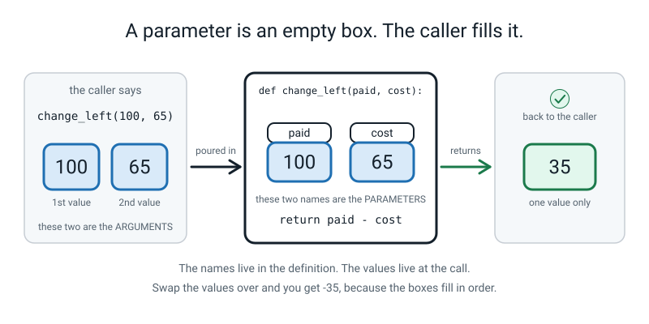
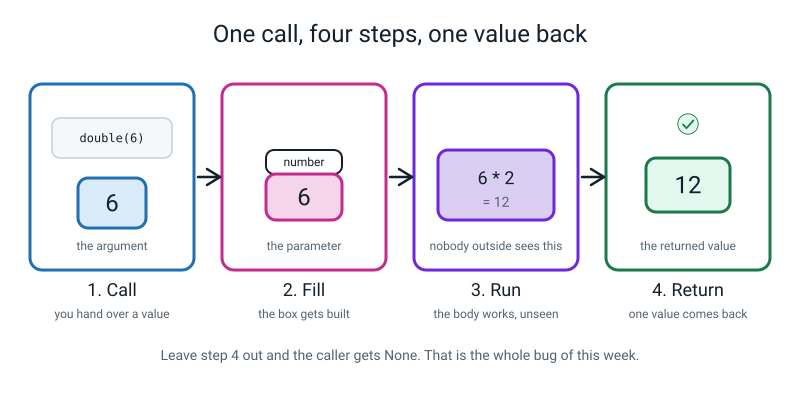
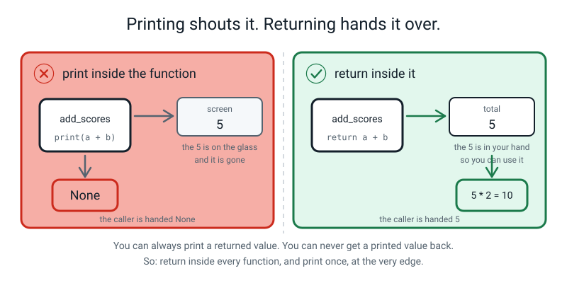
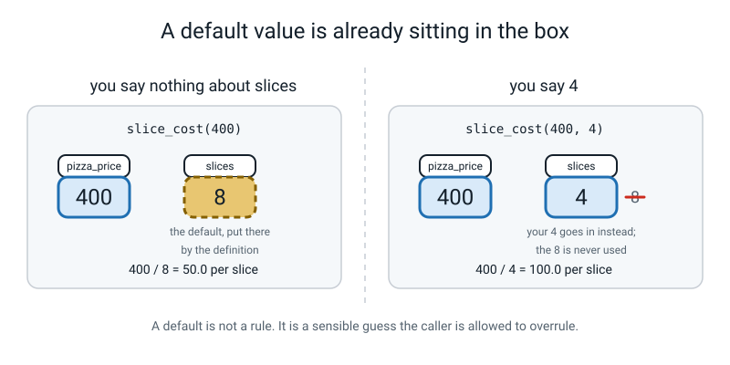
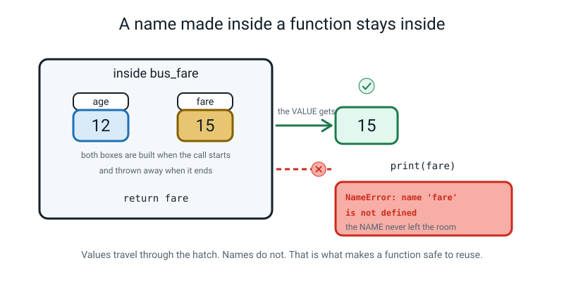
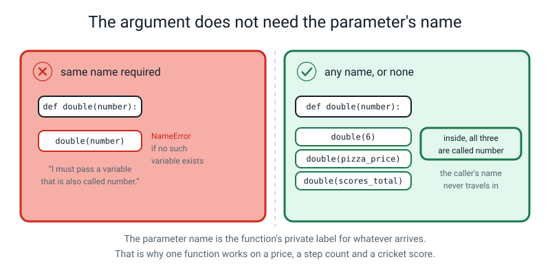
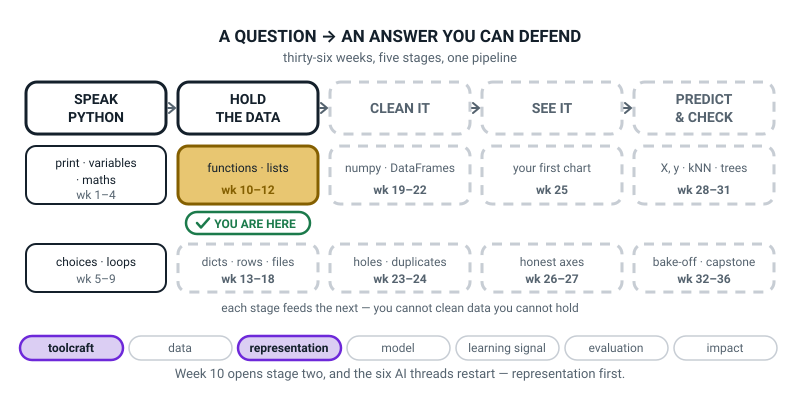
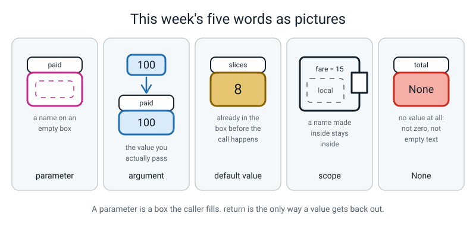

# Week 10 — Functions That Take Something and Give Something Back

[⬅ Week 9](week-09.md) · [Course Home](../README.md) · [Next ➡](week-11.md) · [Workbook](../workbook/week-10.md)

---

> ### This week in one sentence
> **A parameter is a box the function fills from whoever called it, and `return` is the only way a value gets back out.**
>
> **By the end of this chapter you will be able to:**
> - Write a function with **two parameters** and call it with two arguments, in the right order
> - Say out loud, correctly, the difference between a **parameter** and an **argument**
> - Give a parameter a **default value** and explain when the default gets used
> - Explain why a variable made **inside** a function does not exist outside it
> - Find a function that **prints the right answer and returns `None`**, and fix it
>
> **New syntax:** `def f(a, b):` · `def f(a, b=0):` · `f(b=3)` · `None`
>
> **Reading time:** about 35 minutes. **Homework:** about 60 minutes.
>
> **The one sentence to carry all week:** *showing me the answer is not the same as giving me the answer.*

---

## 🪝 Start Here

This short paper game gets you ready for the two new words of the week. You need two pieces of paper and a pen.

Get two pieces of paper. On the first one write, big:

```text
PAID          COST
```

Two words, with a gap between them. **Look at what you have just written. It is not two numbers. It is two empty boxes with labels on them.**

Now on the second piece of paper write two numbers, and tear it in half so you have a `100` card and a `65` card:

```text
100        65
```

Here is the story. **You went out with ₹100 and you spent ₹65.** Put the number cards on the word cards, so the form is filled in.

You put `100` on **PAID** and `65` on **COST**. Of course you did. It is obvious.

**Now swap them.** Put `65` on PAID and `100` on COST.

Look at the form. **Is it still a legal form?**

Yes. It is. Every box has a number in it. Every number is a number. Nothing is missing, nothing is the wrong shape.

And here is the part that matters. If this form were a Python function, Python would fill it in exactly like that, do the subtraction, and hand you back **−35** without one word of complaint. No red underline. No "are you sure?". No warning of any kind.

> **The order of the values is a promise you make, and the computer does not check it.**

A wrong answer that *looks* like an answer is far more dangerous than a crash. A crash stops you. A confident wrong number goes into your homework, and then into somebody's report, and nobody ever finds out.

Two words before we go anywhere near a keyboard, because you have just held both of them in your hands:

- The names on the boxes — `paid` and `cost` — are **parameters**.
- The values you put in them — 100 and 65 — are **arguments**.

**P**arameter is a **P**laceholder. **A**rgument is what you **A**ctually pass.


*Figure 10.1 — The names live in the definition. The values live at the call. Swap the values over and the form is still legal — and still wrong.*

---

## 🧠 The Big Idea

> **📌 About the code in this section.** The blocks below are **illustrations, not files**. They show you the shape of one idea, and each one carries on from the one above it — the `import` lines and the data are typed once, in the first block that needs them. **The complete, runnable file is in 💻 Type This.** If you copy a block from this section on its own and Python says `NameError`, that is why, and nothing is broken.

### 1. Last week's hole, and the one line that fills it

Last week you wrote `print_banner()`. It printed twenty equals signs. Every time. Always twenty.

It could never print thirty, and here is the honest reason: **there was nowhere to tell it thirty.** The brackets were empty. There was no way in.

> **parameter** — the *name* you write inside the brackets of the definition. It is an empty box with a label on it.
>
> **argument** — the *value* you write inside the brackets when you call it. It is what goes in the box.

Two words for the **same box at two different moments**: empty when you wrote the definition, full when somebody called it.

**The analogy.** A **form with named blanks on it.** The blanks are the parameters — printed once, on the form. What you write in the blanks is the arguments — different every time somebody fills one in. One form, a thousand filled-in copies.

**The concrete version.** Here is the smallest possible function that takes something in. Two lines.

```python
def double(number):                 # `number` is the PARAMETER
    return number * 2               # the body uses it like any other variable

print(double(6))                    # 6 is the ARGUMENT
print(double(0))
print(double(-3))
```

```text
12
0
-6
```

Read the first line out loud, exactly like this: *"define a function called double, that expects one thing, and inside the function that thing will be called `number`."*

**Now the question that catches everybody. Inside the function, what is the 6 called?**

Not "6". That is what it **is**. What is it **called**?

It is called `number`. The function has no idea you typed 6. It has no idea where the 6 came from. It does not know that outside, you might have had that 6 sitting in a variable called `pizza_price` or `cricket_score`. All it knows is: *something arrived, and in here we call it `number`.*

**And that is exactly why one function can be used a thousand times.** It never has to know anything about the world outside it.

> **💡 Try this:** rename `number` to `n` everywhere inside the function, and run it again. Same three answers. **Nobody outside cares what the box is labelled**, which is proof the name is private to the function.


*Figure 10.2 — Four steps every time you call a function. Leave step 4 out and the caller gets nothing back — which is the whole bug of this week.*

### 2. Two parameters, and why order is the whole game

Add a comma and you get a second box.

```python
def change_left(paid, cost):        # two parameters, comma between them
    return paid - cost              # one value goes back out

print(change_left(100, 65))         # paid 100, cost 65
print(change_left(100, 100))        # spent it all
print(change_left(50, 65))          # not enough money
print(change_left(65, 100))         # the SAME two numbers, swapped over
```

```text
35
0
-15
-35
```

Line by line:

| Line | What Python does |
|---|---|
| `def change_left(paid, cost):` | Makes a recipe called `change_left`. It expects two values. It will call the first one `paid` and the second one `cost`. The colon means "the body starts on the next line, indented." |
| `    return paid - cost` | Four spaces of indent = this line is **inside** the recipe. Work out `paid` minus `cost`, hand that number back to whoever asked, and stop. |
| `print(change_left(100, 65))` | Run the recipe with 100 in the first box and 65 in the second. Take whatever comes back — 35 — and print it. |

**Look at the last answer: −35.** That is your paper cards, swapped, in code. No error. No warning. Python filled the boxes in the order you gave them, did the subtraction, and handed you a confidently wrong number.

Python cannot help you here, and it is worth understanding why rather than being annoyed about it: **both boxes take numbers.** Python has no idea what money is, which box is bigger, or which way round a shopkeeper would say it. All it can check is *how many* values arrived — and two arrived.

> **⚠️ Watch out:** `change_left(50, 65)` gives `-15`, and that is **correct**, not a bug. You spent more than you had. If you want the program to *say something* about that, that is a decision you make with an `if` — it is not the function being broken.

**This is why we test on three inputs and why one of the three is always awkward.** A function that works on 6 and 7 tells you almost nothing. A function that works on 0, and on the exact boundary, and on a negative, tells you something real.

### 3. `print` versus `return` — the most important section of the year so far

Read this bit twice. It is the thing that separates a person who can build software from a person who can only make things appear on a screen.

`print()` puts characters on the screen for a human to read.
`return` hands a value **back into your program**, so the program can use it.

**The analogy, and it is the one to keep for the rest of the course:**

> **A function that prints is a waiter who shouts your order across the restaurant.** Everybody hears it. **Nobody can eat it.**
>
> **A function that returns is a waiter who brings the plate to your table.** Now you can eat it, share it, weigh it, take a photo of it, or send it back.

**The concrete version — the same function twice, one word apart.** First, the one that prints:

```python
def add_scores(first, second):
    print(first + second)              # prints. Hands nothing back.

add_scores(2, 3)                       # 5 appears on screen. Looks perfect.
add_scores(10, 40)                     # 50 appears. Looks perfect again.

total = add_scores(2, 3)               # now try to KEEP the answer
print("total is:", total)              # what is in total?
print(total * 2)                       # and now try to use it
```

```text
5
50
5
total is: None
Traceback (most recent call last):
  File "/Users/you/ai-academy/level2/week10_bug.py", line 12, in <module>
    print(total * 2)                       # and now try to use it
TypeError: unsupported operand type(s) for *: 'NoneType' and 'int'
```

**Walk that output with a finger, because it is the shape of the whole week.**

| Line of output | Where it came from |
|---|---|
| `5` | `add_scores(2, 3)` on its own. **It worked.** |
| `50` | `add_scores(10, 40)`. **That worked too.** |
| `5` | The same call again, this time on the `total = ...` line. The printing still happened |
| `total is: None` | `total` got **nothing**. The box came back empty |
| The crash | You cannot multiply nothing by 2 |

Now the same function with **one word changed**:

```python
def add_scores(first, second):
    return first + second              # hands the answer back out

print(add_scores(2, 3))                # print it out HERE, at the edge
total = add_scores(2, 3)
print("total is:", total)
print(total * 2)
```

```text
5
total is: 5
10
```

**One word. That is the entire difference.**

And here is the rule that follows from it, which is worth writing in your notebook in your own handwriting:

> **You can always print a value that was returned. You can never get back a value that was only printed.**

So: **`return` inside every function. `print` once, at the very edge of the program, where a human is actually reading.**


*Figure 10.3 — The 5 on the glass is gone the moment you look away. The 5 in your hand can be stored, added to, compared or printed later.*

### 4. `None` — Python's word for nothing at all

> **`None`** — Python's word for "no value". A function that never reaches a `return` hands back `None`.

Something always comes back from a function. Python never hands you literally nothing at all — it hands you a special value that *means* nothing at all, spelled with a capital N.

**`None` is not zero, and it is not empty text.** Zero is a number; you can add three to it. Empty text is text; you can measure how long it is. `None` is the **absence** of a value, and almost anything you try to do with it falls over immediately.

That sounds annoying. It is actually a gift, because **the crash happens right next to the mistake instead of three files away.**

Here are the three tracebacks `None` produces, and you will meet at least two of them this week:

```text
TypeError: unsupported operand type(s) for *: 'NoneType' and 'int'
TypeError: unsupported format string passed to NoneType.__format__
TypeError: object of type 'NoneType' has no len()
```

> **🐞 If you see this error:** whenever the letters **`NoneType`** appear in a traceback, say this out loud: **"something handed back nothing, and then I tried to use it."** Nine times out of ten the something is a function whose last line says `print` where it should say `return`.

And here is the two-line trick that turns invisible into visible. When you cannot see what a function gave you, **catch it in a variable and print it**:

```python
def weekly_saving(pocket_money, spent):
    print(pocket_money - spent)        # the bug, on purpose

came_back = weekly_saving(200, 145)
print("what came back was:", came_back)
print("its type is:", type(came_back))
```

```text
55
what came back was: None
its type is: <class 'NoneType'>
```

**Two extra lines and the mystery is over.** This is the most transferable skill in the whole week — remember it, because you will use it in March on somebody else's code.

### 5. Default values — the box that is not empty

Sometimes a parameter has an obvious usual answer. A pizza has eight slices unless somebody tells you otherwise.

```python
def slice_cost(pizza_price, slices=8):     # slices has a DEFAULT of 8
    return pizza_price / slices            # rupees per slice

print(slice_cost(400))                     # no second argument -> uses 8
print(slice_cost(400, 4))                  # second argument given -> uses 4
print(slice_cost(400, 1))                  # one giant slice
print(slice_cost(400, slices=16))          # naming it: a KEYWORD ARGUMENT
print(slice_cost(pizza_price=400))         # you may name the first one too
```

```text
50.0
100.0
400.0
25.0
50.0
```

Check the arithmetic by hand — you should always be able to: 400 ÷ 8 = 50 ✔ · 400 ÷ 4 = 100 ✔ · 400 ÷ 1 = 400 ✔ · 400 ÷ 16 = 25 ✔

> **default value** — a value a parameter takes when the caller does not supply one.

**The picture that makes it land: the box is not empty.** The definition already put an 8 in it. If the caller hands over a value, that value goes in and the 8 is never used. If the caller says nothing, the 8 is what the function works with.

**A default is not a rule. It is a sensible guess the caller may overrule.**


*Figure 10.4 — Left: the caller said nothing, so the dashed 8 from the definition is used. Right: the caller said 4, so the 4 goes in and the 8 is never touched.*

**The one rule about defaults: parameters with defaults must come after parameters without them.** Break it and Python refuses even to start the file:

```python
def slice_cost(slices=8, pizza_price):
    return pizza_price / slices
```

```text
  File "/Users/you/ai-academy/level2/week10_order.py", line 1
    def slice_cost(slices=8, pizza_price):
                             ^^^^^^^^^^^
SyntaxError: non-default argument follows default argument
```

**And the reason is genuinely satisfying, so work it out before you read on.** If that were allowed, what would `slice_cost(400)` mean? Is 400 the price, or the number of slices? Nobody could tell — not you, not Python. Python removes the ambiguity by insisting the ones you *must* supply come first.

**Keyword arguments** — writing `slices=16` at the call — are also the cure for the order problem from Section 2. Look:

```python
print(change_left(paid=100, cost=65))
```

**That one cannot be got the wrong way round**, because you named the boxes. It is longer. Sometimes longer is right.

### 6. Scope — same word, different rooms

> **scope** — the part of a program where a particular name exists.

A variable created inside a function lives **only** inside it. When the function finishes, it is gone.

```python
def bus_fare(age):
    fare = 30                          # `fare` is made INSIDE bus_fare
    if age < 5:
        fare = 0
    elif age < 18:
        fare = 15
    elif age >= 60:
        fare = 10
    return fare                        # the VALUE gets out; the name does not

print(bus_fare(4))
print(bus_fare(12))
print(bus_fare(35))
print(bus_fare(60))
print(fare)                            # this line will fail
```

```text
0
15
30
10
Traceback (most recent call last):
  File "/Users/you/ai-academy/level2/week10_scope.py", line 15, in <module>
    print(fare)                            # this line will fail
NameError: name 'fare' is not defined
```

**Look carefully at what did and did not happen.** All four calls worked. The number 15 definitely existed — you can see it on the screen. And the moment you asked for `fare` from outside, Python said it had never heard of it.

> **🍕 The analogy:** a function is a **kitchen with a serving hatch.** Ingredients go in through the hatch. A finished plate comes out through the hatch. The mess inside — the half-chopped onions, the local variables — is invisible from the dining room, and it gets cleared away when service ends.


*Figure 10.5 — Values travel out through the hatch. Names do not.*

And the mirror image, which surprises people even more. The same word used inside and outside is **two completely different boxes**:

```python
pocket_money = 200

def spend_it_all():
    pocket_money = 0
    print("inside the function :", pocket_money)

spend_it_all()
print("after the function   :", pocket_money)
```

```text
inside the function : 0
after the function   : 200
```

**The outer 200 was never touched.** Assigning to `pocket_money` inside the function made a brand-new local box that happened to share a word with the outer one.

**That is not Python being awkward. It is the single feature that makes it safe to use a function somebody else wrote.**

If a function could quietly rewrite your variables, you would have to read every line of every function before you dared call it. In Week 12 you will import a file of your own; in Week 29 you will call `model.fit(...)`, which is thousands of lines written by strangers. Both are only survivable because a function takes what it needs in and cannot quietly rewrite your other variables by name.

---

## 💻 Type This

Two files. First `week10_functions.py`, built in five steps with two mistakes made on purpose. Then the planted bug.

### Step 1 — the file, and two comments

New file, `week10_functions.py`, saved in your `ai-academy/level2` folder **before** you type anything in it.

```python
# week10_functions.py
# Functions that take something in and give something back.
```

Nothing to run yet. Two comments so future-you knows what this is.

### Step 2 — one parameter

*Add to the same file.* Type `def`, space, `double`, open bracket, `number`, close bracket, **colon**. Then press Enter — and notice the editor moves you in four spaces on its own. That indent is how Python knows what is inside the function.

```python
# ---- 1. One parameter: a box the caller fills ----
def double(number):                 # `number` is the PARAMETER
    return number * 2               # hand the answer back out
```

> **⚠️ Watch out:** after the `return` line, press Enter **and then Backspace** to come back out to the left margin. If the next line stays indented, Python thinks it is still inside the function. This is the single most common thing that goes wrong in the next ten minutes.

### Step 3 — three calls, and a prediction first

*Add to the bottom of the same file.* **Before you run: what three numbers are you about to see?** Write them down.

```python
print(double(6))                    # 6 is the ARGUMENT
print(double(0))                    # awkward input: zero
print(double(-3))                   # awkward input: a negative
```

```text
12
0
-6
```

> **💡 Try this:** look at the `-6` and ask yourself — did you have to do anything special to make negative numbers work? **No.** The function never asked what kind of number it was given.

### Step 4 — ⚠️ mistake number one: the missing colon

Go up to the `def` line and **delete the colon at the end.** Just the colon. Run it.

```python
def double(number)                  # `number` is the PARAMETER
    return number * 2               # hand the answer back out
```

```text
  File "/Users/you/ai-academy/level2/week10_functions.py", line 5
    def double(number)                  # `number` is the PARAMETER
                                        ^^^^^^^^^^^^^^^^^^^^^^^^^^^
SyntaxError: expected ':'
```

**Read the last line out loud.** *"SyntaxError: expected colon."* That is Python being about as helpful as it ever gets — it has even drawn carets at the place where it wanted one.

**Now notice something else: nothing ran at all.** No 12, no 0, no −6. A `SyntaxError` means Python could not even finish *reading* your file, let alone start doing what it said. That is the easiest kind of error to have, because nothing wrong has happened yet.

**Put the colon back.**

*(The carets sit under the comment rather than under the brackets. That is Python marking the whole rest of the line as "the place where I wanted a colon and did not find one". The comment is just what happens to be sitting there.)*

### Step 5 — two parameters

*Add to the bottom of the same file.* Same shape, comma in the middle.

```python
# ---- 2. Two parameters, in order ----
def change_left(paid, cost):        # two parameters, comma between them
    return paid - cost              # one value goes back out

print(change_left(100, 65))         # paid 100, cost 65
print(change_left(100, 100))        # spent it all
print(change_left(50, 65))          # awkward: not enough money
```

Predict, then run.

```text
12
0
-6
35
0
-15
```

**Six lines, not three.** Your old lines are still in the file, and Python runs the whole file top to bottom every single time. This surprises people more than you would expect.

### Step 6 — the card trick, in code

*Add to the bottom of the same file.*

```python
# ---- 3. Order matters ----
print(change_left(65, 100))         # the SAME two numbers, swapped over
```

```text
12
0
-6
35
0
-15
-35
```

**There it is. Minus thirty-five.** No error, no warning, no red anything.

### Step 7 — ⚠️ mistake number two: the one that matters

Scroll up to `double` and change the `return` to a `print`. Then add two lines at the bottom.

```python
def double(number):
    print(number * 2)               # was: return number * 2

answer = double(6)
print("answer is:", answer)
```

**Predict first.** Most people say `12` and then `answer is: 12`. Run it.

```text
12
answer is: None
```

*(That is what the last two lines add. The whole file prints more than that: the earlier `print(double(6))`, `print(double(0))` and `print(double(-3))` lines now show `12`, `None`, `0`, `None`, `-6`, `None`, because `double` no longer returns anything. Same bug, three more times. Scroll to the bottom to find your `answer is:` line.)*

**Look at that.** The twelve is *there*. It printed. The function did the maths perfectly and put the right answer on the screen.

**And `answer` is `None`. Nothing.** The 12 went on the glass and the box came back empty.

Change `print` back to `return` and run it again:

```text
12
answer is: 12
```

**One word. That is the whole difference.** Write it in your Bug Log now, as a rule and not as an entry:

> `answer is: None` → a function printed instead of returning. **Fix: change `print` to `return`.**

### The complete finished program

```python
# week10_toolkit.py — five tiny functions, built from the spec sheet.
# Every one of them RETURNS. Not one of them prints.

def double(number):
    # Give back the number multiplied by two.
    return number * 2


def change_left(paid, cost):
    # Give back how much money is left after paying.
    return paid - cost


def slice_cost(pizza_price, slices=8):
    # Give back the cost of one slice. A whole pizza is 8 slices unless told otherwise.
    return pizza_price / slices


def is_even(number):
    # Give back True if the number divides by 2 with nothing left over.
    return number % 2 == 0


def bus_fare(age):
    # Give back the fare in rupees for someone of this age.
    if age < 5:
        return 0                   # under 5 travels free
    elif age < 18:
        return 15                  # child fare
    elif age < 60:
        return 30                  # adult fare
    else:
        return 10                  # senior fare


# ---- three tests each, and one of the three is awkward on purpose ----
print("double        :", double(6), double(0), double(-3))
print("change_left   :", change_left(100, 65), change_left(100, 100), change_left(50, 65))
print("slice_cost    :", slice_cost(400), slice_cost(400, 4), slice_cost(400, 1))
print("is_even       :", is_even(10), is_even(7), is_even(0))
print("bus_fare      :", bus_fare(4), bus_fare(12), bus_fare(60))
```

```text
double        : 12 0 -6
change_left   : 35 0 -15
slice_cost    : 50.0 100.0 400.0
is_even       : True False True
bus_fare      : 0 15 10
```

**Three answers in there are worth stopping on.**

**`is_even(0)` is `True`.** Almost everybody predicts `False`. Zero divides by two exactly — there is nothing left over — so it is even. Check it: 0 ÷ 2 = 0, remainder 0.

**`bus_fare(60)` is 10, not 30.** Read the chain: `60 < 5` is False, `60 < 18` is False, `60 < 60` is **False** — so it falls through to the `else`. That is exactly why 60 is the awkward test.

**`slice_cost(400)` is `50.0`, not `50`.** Dividing with `/` in Python **always** produces a decimal, even when the answer is exact. That is not a bug. If you want a reader to see `50.00`, that is the caller's job with an f-string: `f"{slice_cost(400):.2f}"`. **The function hands back the true number and lets whoever is printing decide how it looks.**

**And notice the shortest body in the file.** `is_even` is one line — `return number % 2 == 0` — because a comparison **is already** `True` or `False`. You do not need `if ...: return True else: return False`. That is four lines doing one line's job.

---

## 🔍 Worked Examples

This section walks through three complete programs, one each from food, sport and school. Read the code, then read the output line by line.

### Worked Example 1 — The snack stall (food)

Two functions. One takes two parameters. The other has a default that is right most of the time.

```python
# snack_stall.py - two parameters, one default, three tests each.

def snack_total(price, count):          # two parameters: price first, count second
    return price * count                # hand the bill back


def after_discount(total, percent=10):  # percent has a DEFAULT of 10
    return total - total * percent / 100


print("2 samosas at 12 :", snack_total(12, 2))
print("1 samosa        :", snack_total(12, 1))
print("0 samosas       :", snack_total(12, 0))      # awkward: buying nothing

bill = snack_total(12, 5)               # catch the returned value
print("5 samosas       :", bill)
print("usual discount  :", after_discount(bill))          # no percent -> uses 10
print("half price day  :", after_discount(bill, 50))      # percent given -> 50
print("no discount     :", after_discount(bill, 0))       # awkward: 0 percent
print("named argument  :", after_discount(bill, percent=25))
```

```text
2 samosas at 12 : 24
1 samosa        : 12
0 samosas       : 0
5 samosas       : 60
usual discount  : 54.0
half price day  : 30.0
no discount     : 60.0
named argument  : 45.0
```

**Hand-check every one.** 12 × 2 = 24 ✔ · 12 × 5 = 60 ✔ · 10% of 60 is 6, so 60 − 6 = 54 ✔ · 50% of 60 is 30, so 60 − 30 = 30 ✔ · 0% of 60 is 0, so 60 − 0 = 60 ✔ · 25% of 60 is 15, so 60 − 15 = 45 ✔

**Two things to notice.**

**`bill` exists because `snack_total` returned.** Look at the line `bill = snack_total(12, 5)`. That number is now in a box with a name, and it gets used **four more times** afterwards. If `snack_total` had printed instead, not one of those four lines would be possible.

**The `0 percent` test is the interesting one.** `after_discount(bill, 0)` gives 60.0 — the full bill, undiscounted. That proves the default really is being *replaced* and not *added to*. Passing 0 is not the same as passing nothing, and if you only ever test with nothing you never find out.

### Worked Example 2 — The strike rate (sport)

Two functions about one innings, and a returned value used three different ways.

```python
# strike_rate.py - two functions about one innings. Both return.

def strike_rate(runs, balls):           # two parameters, and the ORDER matters
    return runs / balls * 100           # hand the rate back


def runs_needed(target, scored):        # how many more runs to win
    return target - scored


print("112 off 89  :", strike_rate(112, 89))
print("27 off 33   :", strike_rate(27, 33))
print("0 off 4     :", strike_rate(0, 4))          # awkward: a duck

rate = strike_rate(112, 89)             # catch it, then use it three ways
print(f"tidied      : {rate:.2f}")
print("rounded     :", round(rate))
if rate >= 100:
    print("verdict     : faster than a run a ball")
else:
    print("verdict     : slower than a run a ball")

print("need to win :", runs_needed(180, 145))
print("scores level:", runs_needed(180, 180))      # awkward: exactly level
print("already won :", runs_needed(180, 195))      # awkward: past the target
```

```text
112 off 89  : 125.84269662921348
27 off 33   : 81.81818181818183
0 off 4     : 0.0
tidied      : 125.84
rounded     : 126
verdict     : faster than a run a ball
need to win : 35
scores level: 0
already won : -15
```

**Hand-check.** 112 ÷ 89 = 1.2584…, × 100 = 125.84 ✔ · 27 ÷ 33 = 0.8181…, × 100 = 81.82 ✔ · 180 − 145 = 35 ✔

**Look at those first two lines of output. They are ugly, and they are correct.** `125.84269662921348` is the true answer to as many digits as Python keeps. The function's job is to hand you the *true number*. Making it readable is a completely separate job, and it belongs to the caller — which is the `{rate:.2f}` line from Week 3.

**Now the argument for `return`, in one picture.** That one returned number gets used **three times**: formatted to two places, rounded to a whole number, and tested against 100. If `strike_rate` had printed the answer, **not one of those three lines could exist.** You would have a number on the screen and nothing in your hands.

**And `runs_needed(180, 195)` giving −15 is right.** You have already passed the target by 15. A negative here is information, not an error. Turning it into a friendlier message is the caller's decision, with an `if`.

### Worked Example 3 — The marks card (school)

A default value plus a function that returns **text** rather than a number.

```python
# marks_card.py - a default value that is right most of the time.

def percent(scored, out_of=50):         # most of our tests are out of 50
    return scored / out_of * 100        # hand the percentage back


def grade(mark):                        # one parameter, four bands, four returns
    if mark >= 80:
        return "A"
    elif mark >= 60:
        return "B"
    elif mark >= 35:
        return "pass"
    else:
        return "not yet"


print("41 out of 50  :", percent(41))                  # no out_of -> uses 50
print("41 out of 100 :", percent(41, 100))             # out_of given -> 100
print("0 out of 50   :", percent(0))                   # awkward: zero
print("50 out of 50  :", percent(50))                  # awkward: full marks
print("named         :", percent(36, out_of=40))

maths = percent(41)                     # catch it and use it
print(f"maths        : {maths:.1f}%  grade {grade(maths)}")
print("grade 80     :", grade(80))      # awkward: exactly on the boundary
print("grade 79     :", grade(79))
print("grade 35     :", grade(35))      # awkward: exactly on the pass line
```

```text
41 out of 50  : 82.0
41 out of 100 : 41.0
0 out of 50   : 0.0
50 out of 50  : 100.0
named         : 90.0
maths        : 82.0%  grade A
grade 80     : A
grade 79     : B
grade 35     : pass
```

**Hand-check.** 41 ÷ 50 = 0.82, × 100 = 82.0 ✔ · 41 ÷ 100 = 41.0 ✔ · 36 ÷ 40 = 0.9, × 100 = 90.0 ✔

**Three things worth pointing at.**

**`percent(41)` and `percent(41, 100)` give completely different answers from the same first number.** 82 and 41. The only difference is whether the caller mentioned the second box. That is what a default *is* — and it is also the honest danger of defaults: a reader who does not know the default is 50 cannot tell what `percent(41)` means. **A default should be the answer that is right most of the time, and it should be written where a reader can see it.**

**`grade` returns text, not a number.** A function can hand back anything — a number, a piece of text, `True` or `False`. What matters is that it hands *something* back.

**Every boundary is tested, and the boundaries land where the `>=` says.** `grade(80)` is `A` because the test is `>= 80`, not `> 80`. `grade(35)` is `pass` for the same reason. That is Week 5's boundary rule, still true in Week 10, and it will still be true in June.

**And the line that ties the whole week together:**

```python
print(f"maths        : {maths:.1f}%  grade {grade(maths)}")
```

A returned number, stored in a box, formatted by an f-string, and **passed straight into another function as an argument.** `grade(maths)` works because `percent` returned. None of this is possible with a function that prints.

---

## 🐞 When It Breaks

This section is for the moments when the code fails. Every message below came from really running a broken version of this week's code, so you can match it to what you see on your own screen.

### Break 1 — `NoneType` in an f-string

Here is `week10_broken.py`, which has exactly one bug in it. Three functions; two are fine.

```python
# week10_broken.py — GIVEN TO YOU WITH A BUG IN IT.
# Three functions. Two are fine. One prints when it should return.
# Do NOT guess. Run it, read the last line, then follow the trail.

def weekly_saving(pocket_money, spent):
    # Should give back how much is left over each week.
    print(pocket_money - spent)


def yearly_saving(weekly, weeks=52):
    # Should give back the saving for a whole year.
    return weekly * weeks


def rupees(amount):
    # Should give back the amount as a tidy piece of text.
    return f"Rs {amount:.2f}"


# ---- the report ----
left_each_week = weekly_saving(200, 145)
print("left each week:", rupees(left_each_week))
print("saved in a year:", rupees(yearly_saving(left_each_week)))
```

```text
55
Traceback (most recent call last):
  File "/Users/you/ai-academy/level2/week10_broken.py", line 22, in <module>
    print("left each week:", rupees(left_each_week))
  File "/Users/you/ai-academy/level2/week10_broken.py", line 17, in rupees
    return f"Rs {amount:.2f}"
TypeError: unsupported format string passed to NoneType.__format__
```

**What Python is telling you.** *"You asked me to show **nothing** to two decimal places."*

**This traceback is a gift, and it is worth walking slowly, because it has two `File` lines and most tracebacks you have seen had one.**

1. **The `55` printed**, and 55 is the right answer. **So something worked.**
2. The last line says **`NoneType`**. So something handed back nothing.
3. The **bottom** `File` line points at line 17, inside `rupees`. But `rupees` is innocent — it is only where the damage *showed up*. It was handed a `None` and did the best it could.
4. The `File` line **above** it says line 22 — that is *who called* `rupees`, and what it passed in was `left_each_week`.
5. Where did `left_each_week` come from? Line 21. **`weekly_saving`.** And `weekly_saving` ends with `print`. **Guilty.**

> **The line that breaks is almost never the line that is wrong.** Read the `File` lines from the bottom upwards; they are a trail back to the cause.

**The fix is one word, and `main` never changes:**

```python
def weekly_saving(pocket_money, spent):
    # Should give back how much is left over each week.
    return pocket_money - spent
```

```text
left each week: Rs 55.00
saved in a year: Rs 2860.00
```

Hand-check: 200 − 145 = 55 ✔ · 55 × 52 = 2,860 ✔ · two decimal places because `:.2f` always shows two.

### Break 2 — you gave it fewer values than it has boxes

This program calls `change_left` with one value instead of two.

```python
def change_left(paid, cost):
    return paid - cost

print(change_left(100))
```

```text
Traceback (most recent call last):
  File "/Users/you/ai-academy/level2/err_missing_arg.py", line 4, in <module>
    print(change_left(100))
TypeError: change_left() missing 1 required positional argument: 'cost'
```

**What Python is telling you.** *"There is a box called `cost` and nobody filled it."*

**This is one of the most helpful messages in Python, because it names the box.** Not "wrong number of arguments" — it tells you *which one is still empty*. Read it and you know exactly what to type.

**The fix.** Either supply the second value — `change_left(100, 65)` — or give `cost` a default in the definition, if there really is a sensible usual answer. There isn't one here, so supply the value.

**And the mirror image, which reads just as clearly:**

```python
def double(number):
    return number * 2

print(double(6, 7))
```

```text
Traceback (most recent call last):
  File "/Users/you/ai-academy/level2/err_too_many.py", line 4, in <module>
    print(double(6, 7))
TypeError: double() takes 1 positional argument but 2 were given
```

*"There is one box and you brought two things."* Count the names in the definition, count the values at the call. **They must match** — unless a default is covering one.

### Break 3 — a name that only exists inside

This program asks for `fare` outside the function that made it.

```python
def bus_fare(age):
    fare = 15
    return fare

print(bus_fare(12))
print(fare)
```

```text
15
Traceback (most recent call last):
  File "/Users/you/ai-academy/level2/week10_scope.py", line 6, in <module>
    print(fare)
NameError: name 'fare' is not defined
```

**What Python is telling you.** *"I have never heard of that name — not here."*

**And the confusing part is that 15 is right there on the screen.** The value definitely existed. It escaped through the `return`. **The name never left the room.**

**The fix is not to move the line or add a `print` inside the function.** It is to catch what came back:

```python
fare = bus_fare(12)                # now `fare` exists out HERE too
print(fare)
print(fare * 2)
```

```text
15
30
```

> **🐞 If you see this error:** a `NameError` on a variable that is clearly written in your file usually means the variable was **made inside a function** and you are asking for it outside. **`return` the value out and store it in a box of your own.**

### The whole clinic, for reference

| What you see | What it means | The fix |
|---|---|---|
| `SyntaxError: expected ':'` with carets after the `def` line | Python could not read the line at all. **Nothing ran** | Put the colon after the closing bracket: `def double(number):` |
| `IndentationError: expected an indented block after function definition on line 1` | The `def` promised a body and the next line was flush left | Indent the body four spaces. If it *looks* indented, it is tabs — set your editor to spaces |
| `TypeError: change_left() missing 1 required positional argument: 'cost'` | Fewer values than boxes | Supply it, or give it a default. **The message names the empty box** |
| `TypeError: double() takes 1 positional argument but 2 were given` | More values than boxes | Count the names, count the values |
| `SyntaxError: non-default argument follows default argument` | The **definition** is illegal, so the file never starts | Move every parameter with an `=` to the end |
| `TypeError: slice_cost() got an unexpected keyword argument 'slice'` | You named a box that does not exist | Match the definition exactly. Singular/plural is the usual culprit |
| `TypeError: slice_cost() got multiple values for argument 'pizza_price'` | You filled the same box twice | `slice_cost(400, pizza_price=500)` — the 400 already went in there. Pick one way |
| `NameError: name 'fare' is not defined` | That name does not exist **here** | The variable was made inside a function. `return` it and catch it outside |
| `TypeError: unsupported operand type(s) for *: 'NoneType' and 'int'` | You did maths on nothing | A function printed instead of returning. Change its last line to `return` |
| `TypeError: unsupported format string passed to NoneType.__format__` | An f-string tried to format nothing | Same cause, same fix. Find the function that fed it |
| `UnboundLocalError: local variable 'score_total' referenced before assignment` | Python made the name local *because you assign to it*, then found you read it first | Do **not** reach for `global`. Pass it in and return the new one: `score_total = add_one(score_total)` |
| **No output at all. No error. Exit code 0** | The file ran perfectly and was asked to do nothing | Functions defined and never called. **"You wrote the recipe and never cooked it"** |

---

## 🎲 What We Did In Class

*If you missed it, everything here works at home.*

### The two cards and two numbers

`PAID` and `COST` face-up on the table, with a gap. `100` and `65` in the teacher's hand. **"I went out with a hundred rupees and I spent sixty-five. Which card goes on which box?"**

Everybody gets it right. Then the two number cards get **swapped over**, and the question: *"Is that still a form I can fill in?"*

**Yes. It is.** Python will fill it in exactly like that, do the sum, hand back **minus thirty-five**, and think it has done its job. It will not say "are you sure?".

Then the two words, said once and used all lesson: the names on the boxes are **parameters**; the values you put in are **arguments**.

### The four things written in the notebook

> **Parameter** — the name in the definition. An empty box with a label.
> **Argument** — the value at the call. What goes in the box.
> **`return`** — hand one value back to whoever called the function. **Rule: return inside, print once at the edge.**
> **`None`** — Python's word for "no value". What a function with no `return` hands back.

### The waiter

Two ways to answer a question. **Way one: stand up and shout the answer across the room.** Everybody heard it. Nobody can do anything with it. **Way two: write it on paper and put the paper in your hand.** Now it is yours — add it up, fold it, read it out if you want to. That is still your choice.

`print` is shouting. `return` is putting it in your hand.

### `week10_functions.py`, typed from blank

Comments, then `double`, then three calls — **12, 0, −6**. Then the colon deleted on purpose:

```text
SyntaxError: expected ':'
```

Nothing ran at all. Then the colon put back, and `change_left` added — **35, 0, −15**. Then the swap: **−35**, silently.

### The two deliberate mistakes

**One: the missing colon.** Loud, instant, and nothing had happened yet.

**Two: `print` where `return` belonged.** `double` changed to print, then:

```text
12
answer is: None
```

**The twelve was there.** Correct, on the screen, exactly right. And `answer` was `None`. One word back to `return` and it read `answer is: 12`.

### The spec sheet, five functions, three tests each

| # | Name | Takes | Gives back | Test on these three |
|---|---|---|---|---|
| 1 | `double` | one number | that number times two | `6` · `0` · `-3` |
| 2 | `change_left` | money paid, then the cost | how much is left | `(100, 65)` · `(100, 100)` · `(50, 65)` |
| 3 | `slice_cost` | the pizza price, and how many slices — **8 if not told** | the cost of one slice | `(400)` · `(400, 4)` · `(400, 1)` |
| 4 | `is_even` | one whole number | `True` if it divides by 2 exactly, else `False` | `10` · `7` · `0` |
| 5 | `bus_fare` | an age | free under 5, ₹15 under 18, ₹30 under 60, ₹10 for 60 and over | `4` · `12` · `60` |

**The rule of the activity: write one function, test it on three inputs, run it, and only then start the next.** Five errors at once is five puzzles. One error at a time is one puzzle.

**And the reason the third test in every row is awkward:** zero, spending exactly what you had, one slice, zero again, and sixty exactly. Not one of them is random. Every one sits on a boundary or is a number people forget about.

### The bug hunt

`week10_broken.py`, handed over with one instruction: *"three functions, two are fine, one prints when it should return. Do not read the code looking for it. Run it, read the last line, follow the trail."*

The trail, out loud: `55` printed so something worked · the last line says `NoneType` so something handed back nothing · the bottom `File` line is inside `rupees`, which is innocent · the line above it is line 22, which passed in `left_each_week` · which came from line 21, `weekly_saving`. **Guilty.**

Fix: one word. Output: `Rs 55.00` and `Rs 2860.00`.

### The Bug Log entry

`TypeError: unsupported format string passed to NoneType.__format__` — **and 55 was on the screen just above it.** `weekly_saving` used `print` where it should have used `return`, so `left_each_week` held `None`, and you cannot format nothing to two decimal places. **Why it looked correct: it printed 55, and 55 was the right answer, so nothing looked wrong until the answer had to be used instead of just read.** Fix: `return pocket_money - spent`.

---

## 💬 Talk About It

These are three questions to argue about with someone. Each one has a hint you can read after you have tried it yourself.

**1. "Is it ever all right for a function to print instead of returning?"** *(There is no settled answer, and people who do this for a living genuinely disagree.)*

*Hint:* start with the case for the rule, because it is strong: a function should work something out and hand it back, and printing should happen in exactly one place, at the edge, where a human is reading. Every function in this course follows that.

Then go and find the exceptions, because there are respectable ones. What does a function whose *entire job* is to draw a chart have to return?

What about a long program that prints how far it has got so far? Professionals call that **logging**. There are whole libraries for doing it well, and people argue about those too.

Now find the half that nobody disagrees about: **if the function has an answer, it must return the answer.** The whole argument is only about functions whose job is *showing*, not *working out*.

**2. "Should `bus_fare()` with no age at all give you the adult fare?"**

*Hint:* it is one character of work — `def bus_fare(age=30):` — so ask instead whether it is a *good* idea. What does "the fare for nobody" even mean? Then the sharper question: if a program somewhere loses the age and calls `bus_fare()` by accident, would you rather get ₹30 back, or a loud crash? Now think about which one you would find out about.

**A default that quietly covers up a missing value is one of the main ways bad data gets into real systems** — and once it is in, the number looks exactly as trustworthy as a real one.

**3. "If a function can read variables from outside itself, why do we bother passing things in?"**

*Hint:* write a function that reads a variable from outside instead of taking it as a parameter, then ask yourself one question: *what is its input?* You cannot answer, because it depends on whatever ran before. Which means you cannot test it — there is no such thing as "the input".

A function that takes what it needs through its brackets gives the same answer for the same values, forever, no matter what else is going on in the program. That property has a boring name — being **pure** — and it will save you more debugging hours than anything else you learn this year.

---

## ⚠️ Don't Get Tricked

This section lists four wrong beliefs about functions. Each one is shown next to the right version.

### Trick 1 — "the argument must have the same name as the parameter"


*Figure 10.6 — Left: the belief that the value you pass in must be a variable with the parameter's name. Right: three completely different calls, all landing in the same box.*

| ❌ Wrong | ✅ Right |
|---|---|
| "`double(number)` means I have to make a variable called `number` before I call it" | **The parameter name is the function's private label.** `double(7)`, `double(pizza_price)` and `double(scores_total)` all work — and inside the function all three are called `number` |

Prove it in ten seconds: rename the parameter to `n` and run your three calls again. **Identical answers.** Callers never know and never care what the box is labelled.

### Trick 2 — "it printed the right answer, so it works"

| ❌ Wrong | ✅ Right |
|---|---|
| "I tested my function and it showed 55, which is correct, so it's fine" | **Showing me the answer is not the same as giving me the answer.** Test it with `x = my_function(...)` and then `print(x)` |

This is the whole reason for this week's planted bug. **A printing function looks identical to a returning function when you test it on its own.** The difference only appears the moment you try to keep the answer — and by then you may be three files away from the mistake.

**The two-line test that always settles it:**

```python
came_back = my_function(200, 145)
print("what came back was:", came_back)
```

If that prints `None`, you have found it.

### Trick 3 — "`8` in `def slice_cost(pizza_price, slices=8)` is an argument"

| ❌ Wrong | ✅ Right |
|---|---|
| "There are two arguments in that definition: `pizza_price` and `8`" | **A definition contains no arguments at all.** `pizza_price` and `slices` are parameters; `8` is a **default value** sitting inside the parameter `slices` |

Arguments live at the **call**, never in the definition. So in `slice_cost(400, 4)` the arguments are 400 and 4. In `slice_cost(400)` there is exactly one argument, and the 8 was never an argument — it was already in the box.

### Trick 4 — "a variable is a variable, so of course I can see it"

| ❌ Wrong | ✅ Right |
|---|---|
| "`fare` got the value 15 inside the function, so I can print it afterwards" | **Values get out through `return`. Names do not get out at all.** `fare = bus_fare(12)` makes a name out here that holds the value |

Do not argue with this one — run it. `NameError: name 'fare' is not defined`, in your own terminal, in four seconds, settles it in a way that no amount of explaining does.

And its evil twin: **the same word inside and outside is two different boxes.** `pocket_money = 0` inside a function does not touch your outer `pocket_money`. It looks like it should. It doesn't. And that is a feature, not a fault — it is what makes it safe to call code you did not write.

---

## 🌍 Where You've Seen This

Functions are not only in Python. Here are seven everyday things that work the same way.

1. **Every search box you have ever typed into.** `search(what_you_typed)` — the parameter is the same every time, the argument is different every time. One function, a billion arguments.
2. **The volume slider on a phone.** It is a function with one parameter. Slide it and you are passing a different argument to exactly the same code.
3. **Every "settings" screen in every app.** Almost all of it is default values. The app already put a sensible number in each box, and you may overrule any of them — which is exactly `slices=8`.
4. **Ordering food online.** The delivery address box has your usual address already in it. That is a default value. You may replace it for this one order, and the default is still there tomorrow.
5. **A calculator's `√` key.** One parameter, one returned number. It does not print the answer *at* you — it gives it back to the display, which is what lets you press `+` next.
6. **Any spreadsheet formula.** `=ROUND(B4, 2)` is a call with two arguments. `ROUND` is somebody else's function with two parameters, and the value it hands back can go straight into another formula.
7. **The auto-brightness on a screen.** It takes the light level in and hands a brightness out. It never prints anything, and if it did, nothing could use the answer.

---

## 🧭 Where This Fits

Two things changed on the map this week, and both are big. Stage one is finished — solid white, both
tiles — and you have crossed the first arrow into **stage two**. Look at the bottom of the figure too:
there is a second pill lit for the first time all year.



*Figure 10.0 — The pipeline after Week 10. Stage one is done and never gets re-tinted. Gold is the
first tile of stage two, and the thread strip now has two pills lit instead of one.*

| | |
|---|---|
| **The mental model you now own** | A function is a **machine with an inlet and an outlet**. Parameters are labelled boxes the caller fills in; `return` is the only way a value comes back out. **Printing is not returning** — printing puts characters on the screen, where no other line of code can ever reach them again. |
| **The one question it answers** | *"Why does my function print the right answer but hand back `None`?"* — because a `print` at the bottom of a function is a message to a human, and `return` is a message to the rest of your program. You needed the second one. |
| **What it plugs into** | Week 9's named block. It ran, and it always did exactly the same thing. Now it takes something in and gives something back, which is what makes one function useful in twenty different places. |
| **What carries forward** | Week 12 imports your functions from another file. Week 15 has you write `filter_by()` and `group_count()`. Week 29 calls `model.fit()` and `model.predict()` — and those are the *same in-and-out shape* you are learning today, written by somebody else. |
| **Spiral thread** | 🧰 **Toolcraft** + 🏷️ **Representation** — the first AI thread of the year. A parameter list is a decision about *how you represent a job to the computer*: what varies, what stays the same, what has a name. Every AI system starts with that decision. |

> **💡 Try this:** draw one box on your pencil map with an arrow going in and an arrow coming out. Label
> the in-arrow **parameters** and the out-arrow **return**. That little picture explains about a third
> of everything left in this course.

---

## 🔑 Remember This

These are the points to keep from this week. The card at the end shows the syntax in one place.

- **A parameter is a name in the definition — an empty box with a label.** An argument is a value at the call — what goes in the box. Same box, two moments.
- **The parameter name is private to the function.** `double(7)` and `double(pizza_price)` both work; inside, both are `number`.
- **The order of arguments is a promise you make, and Python does not check it.** `change_left(65, 100)` gives −35 and thinks it did its job.
- **`return` hands one value back. `print` sends it to the screen and keeps nothing.** You can always print a returned value; you can never recover a printed one.
- **Return inside every function. Print once, at the edge.**
- **A function that never reaches a `return` hands back `None`.** And **`NoneType` in a traceback means "something handed back nothing, and then I used it".**
- **When you cannot see what a function gave you, catch it in a variable and print it.** Two lines, and the invisible becomes visible.
- **A default value is already sitting in the box.** It is used only when the caller says nothing, and passing `0` is not the same as saying nothing.
- **Parameters with defaults must come last**, or the file will not even start.
- **A keyword argument names the box** — `change_left(paid=100, cost=65)` cannot be got the wrong way round.
- **A name made inside a function does not exist outside it.** Values escape through `return`; names never do. And the same word inside and outside is two different boxes.
- **Test on three inputs, and make one of them awkward.** Zero, the exact boundary, a negative, the empty case.

### Syntax reminder card

```python
def double(number):                 # ONE parameter. `number` is a name, not a value.
    return number * 2               # RETURN hands one value back out


def change_left(paid, cost):        # TWO parameters, comma between. Order matters.
    return paid - cost


def slice_cost(pizza_price, slices=8):     # `slices` has a DEFAULT of 8
    return pizza_price / slices


print(double(6))                    # 6 is the ARGUMENT -> 12
print(change_left(100, 65))         # two arguments, in order -> 35
print(change_left(65, 100))         # swapped -> -35, silently. No error.
print(slice_cost(400))              # no 2nd argument -> uses 8 -> 50.0
print(slice_cost(400, 4))           # 2nd argument given -> 100.0
print(slice_cost(400, slices=16))   # KEYWORD ARGUMENT: name the box -> 25.0

total = change_left(100, 65)        # catch what came back
print(total * 2)                    # and use it -> 70

# --- the bug of the week ---------------------------------------------------
def add_scores(first, second):
    print(first + second)           # WRONG: prints, hands back nothing
# total = add_scores(2, 3)          # -> 5 on screen, and total is None
# print(total * 2)                  # -> TypeError ... 'NoneType' and 'int'

# --- what NOT to write ----------------------------------------------------
# def slice_cost(slices=8, pizza_price):   SyntaxError: non-default follows default
# change_left(100)                         TypeError: missing 1 required ... 'cost'
# double(6, 7)                             TypeError: takes 1 positional argument but 2
# print(fare) after fare was made inside   NameError: name 'fare' is not defined
```

---

## 📓 New Words

These are the five words from this week, with a picture and a short table.


*Figure 10.7 — This week's five words, drawn.*

| Word | What it means | Example |
|---|---|---|
| **parameter** | The *name* inside the brackets of the definition. An empty labelled box | `number` in `def double(number):` |
| **argument** | The *value* inside the brackets at the call. What goes in the box | `6` in `double(6)` |
| **default value** | What a parameter holds when the caller does not supply anything | `8` in `def slice_cost(price, slices=8):` |
| **scope** | The part of a program where a particular name exists | `fare` made inside `bus_fare` exists only in there |
| **`None`** | Python's word for "no value". What a function with no `return` hands back | `total = add_scores(2, 3)` → `total` is `None` |

---

## 📤 Your Homework

Go to **[the Week 10 workbook](../workbook/week-10.md)**. About **60 minutes** in total.

| Section | What to do | Time |
|---|---|---|
| **Warm-Up** | Five quick questions from Week 9 | 5 min |
| **Predict the Output** | Four snippets. One of them hands back `None`, and saying *why* is the question | 10 min |
| **Practice A & B** | Six reading questions, then five you write yourself | 20 min |
| **Fix the Broken Program** | `pocket.py`, three planted bugs — one loud, one crash, one silent | 10 min |
| **Build It** | The five-function spec sheet, three tests each, then the bug hunt | 15 min |

**Three things being marked hardest.**

**Every function must `return`.** Not one of the five prints anything inside itself. If a function has an answer, it hands the answer back.

**Every function gets three tests, including the awkward one.** Write your prediction in the table **before** you run it. Getting a prediction wrong is more interesting than getting it right, so do not cheat by running first — and `is_even(0)` and `bus_fare(60)` catch nearly everybody.

**The bug hunt needs the sentence.** Copy the **real traceback**, character for character, into your Bug Log. Then write the fix, which is one word.

Then — and this is where the marks are — **one sentence saying why the bug looked correct.** Not "because I made a mistake". Something like: *"it printed 55, and 55 was the right answer, so nothing looked wrong until the answer had to be used."*

> **💡 Try this:** the habit of the week, and it takes two lines. Whenever a function surprises you, do not read the code — **catch what it handed back and print it, along with its type.** `came_back = f(...)` then `print(came_back, type(came_back))`. If you see `None` and `<class 'NoneType'>`, you have found your bug without reading a single line of the function.

---

[⬅ Week 9](week-09.md) · [Course Home](../README.md) · [Week 11 ➡](week-11.md) · [📓 Workbook — Week 10](../workbook/week-10.md) · [Glossary](../../glossary.md)
