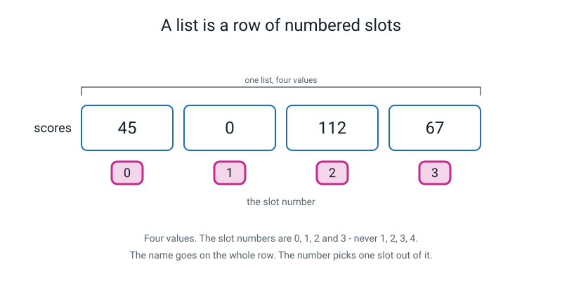
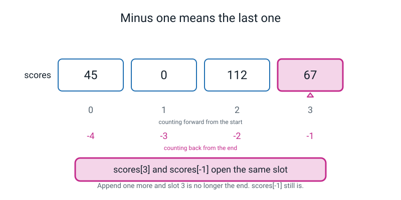
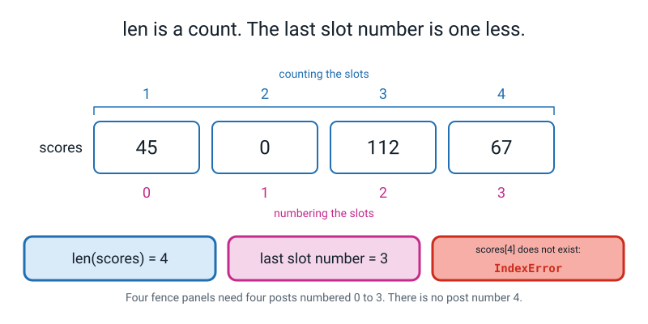
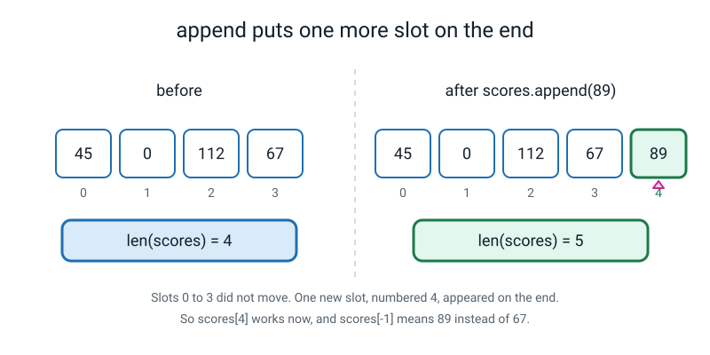
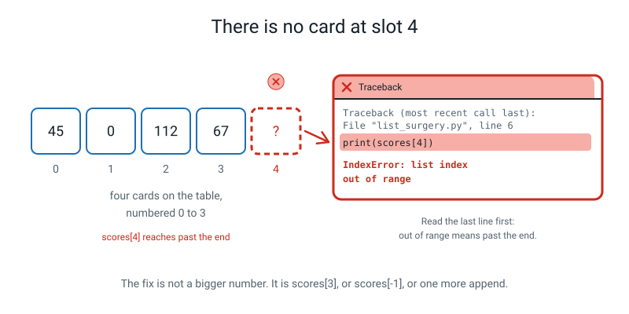
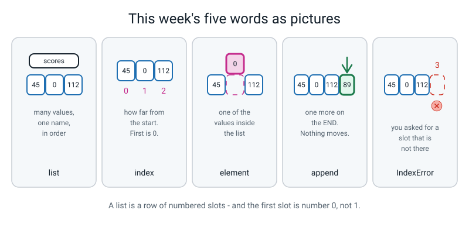

# Week 11 — Many Values, One Name: Lists

[⬅ Week 10](week-10.md) · [Course Home](../README.md) · [Next ➡](week-12.md) · [Workbook](../workbook/week-11.md)

---

> ### This week in one sentence
> **A list is a row of numbered slots — and the first slot is number 0, not 1.**
>
> **By the end of this chapter you will be able to:**
> - Build a list and read any item out of it by its **index**
> - Use **`-1`** to reach the last item, and explain why that is easier than counting
> - Count items with **`len()`** and say why `len` is one more than the last index
> - Add an item with **`append()`** and describe what changed and what did not
> - Cause an **`IndexError`** on purpose, read the traceback, and say which slot did not exist
>
> **New syntax:** `[1, 2, 3]` · `scores[0]` / `scores[-1]` · `len(scores)` · `scores.append(x)`
>
> **Reading time:** about 35 minutes. **Homework:** about 60 minutes.
>
> **The sentence to carry all week:** *`len` is a count. An index is a name. The biggest name is one less than the count.*

---

## 🪝 Start Here

You need four cards. Bits of paper will do. Write one number on each, big and dark:

```text
45        0        112        67
```

Four cricket scores from four innings. Forty-five, then a duck, then a hundred and twelve, then sixty-seven. **Lay them in a row on the table, left to right.**

Last week you would have needed four variables for this. Four boxes, four names, and four more lines every time a new innings happened. Today the whole row gets **one** name.

In Python it looks exactly like it looks on your table:

```python
scores = [45, 0, 112, 67]
```

Square bracket, forty-five, comma, zero, comma, one-one-two, comma, sixty-seven, square bracket. **The brackets are how Python knows it is a row and not one enormous number.**

Now, to get one score out of the row, you have to say which one. So the row needs numbering. Take a **different colour** — pink or red, something that does not look like the numbers on the cards — and on a **separate strip of paper**, write:

```text
0        1        2        3
```

**Slide that strip under the cards**, so each pink number sits under the middle of a card.

> **This is the most important thing on the table: the value is on the card, and its number is on a separate strip underneath.** They are two different things, in two different places. Everything that goes wrong with lists goes wrong because people merge them.

And yes — it starts at zero. Hold your objection for ninety seconds.

**Now, hands off the strip. Pick up `scores[2]`.**

...

Most people hand over the `0` card. If you did, do not feel bad — nearly everybody does the first time. **Put it back, and read the pink number under the card you chose.** It says 1. So that card is `scores[1]`.

**Try again. `scores[2]`.** That is the `112`.

**Now `scores[-1]`.**

You probably got that one straight away — `67`, the last one. **Which is interesting, isn't it?** You got minus-one right immediately and you got two wrong. "The last one" is something your brain already knows how to do.

**Last one. Pick up `scores[4]`.**

...

Wait. Do not rescue yourself.

**There isn't one.** There are four cards on that table and there is no card with a pink four under it.

So what should a computer do? Guess? Hand you the last one? Hand you zero? **Make a new card up?**

**It stops.** Immediately, and it tells you exactly what you asked for and why it could not. That message has a name — **`IndexError`** — and you are going to make one happen on purpose today, and write it in your Bug Log, because a programmer who cannot read an error message cannot program.


*Figure 11.1 — Four values, one name. The slot numbers are 0, 1, 2 and 3 — never 1, 2, 3, 4 — and they live under the cards, not on them.*

---

## 🧠 The Big Idea

> **📌 About the code in this section.** The blocks below are **illustrations, not files**. They show you the shape of one idea, and each one carries on from the one above it — the `import` lines and the data are typed once, in the first block that needs them. **The complete, runnable file is in 💻 Type This.** If you copy a block from this section on its own and Python says `NameError`, that is why, and nothing is broken.

### 1. The problem a list solves

Imagine a cricket season with twenty innings. Without lists, that is twenty variables:

```python
score1 = 45
score2 = 0
score3 = 112
# ... seventeen more lines ...
```

And then, to add them up, twenty more lines. And when a twenty-first innings happens, you edit the program.

**This is not a small inconvenience. It is a wall.** Every interesting thing in this course — a table of pizza orders, a week of step counts, the 150 iris flowers you will meet in Week 29 — needs *many values under one name*.

> **list** — an ordered collection of values stored in a single variable, written in square brackets with commas between the items.

```python
scores = [45, 0, 112, 67]              # four values, one name
players = ["Meera", "Kabir", "Nova"]   # lists can hold text too
empty = []                             # a list with nothing in it yet
```

> **element** — one of the values inside a list. `scores` has four elements.

**The analogy.** A **row of pigeonholes**, or the numbered lockers in a changing room. One wall, one name for the wall, and every pigeonhole numbered so you can say which one you mean.

**The concrete version.** Print the whole thing and ask Python what it is:

```python
scores = [45, 0, 112, 67]
print(scores)
print(type(scores))
```

```text
[45, 0, 112, 67]
<class 'list'>
```

**Notice that Python printed the brackets and the commas.** It is showing you the *container*, not just the contents. The brackets are part of the answer.

### 2. Indexing — and why on earth it starts at 0

> **index** — a value's position in a list. The first position is 0.

```python
scores = [45, 0, 112, 67]

print(scores[0])        # 45  <- the FIRST one
print(scores[1])        # 0
print(scores[2])        # 112
print(scores[3])        # 67  <- the last one
```

```text
45
0
112
67
```

**This is going to annoy you, and it should.** Every human counting system starts at 1. You are the first child, not the zeroth child.

So here is the reason, and it is a good one:

> **The index is not "which one". It is "how far from the start".**

Put your finger on the `45` card. **How far along the row is it?** Not at all. **Zero steps.** So its index is zero.

Slide one card right. **One step along. Index one.** Two steps, index two. Three steps, index three.

Once you say it as **distance** instead of **position**, zero stops being a quirk and becomes the only sensible answer. And it is not a Python oddity — nearly every programming language written in the last fifty years counts this way, for exactly this reason.

> **💡 Try this:** say the whole row out loud as distances, with your finger moving: *"zero steps — forty-five. One step — zero. Two steps — a hundred and twelve. Three steps — sixty-seven."* Four seconds, and it is the version that sticks.

### 3. Negative indexes — counting from the other end

```python
scores = [45, 0, 112, 67]

print(scores[-1])       # 67   <- the LAST one
print(scores[-2])       # 112  <- second from the end
print(scores[-4])       # 45   <- the first one, reached the long way round
```

```text
67
112
45
```

**Notice the asymmetry.** Forward counting starts at **0**. Backward counting starts at **-1**. That is not Python being inconsistent — **there is no "minus zero"**, so the last item has to be −1.

**And `-1` is genuinely useful, not just a shortcut.** Here is why, and it matters:

- `scores[-1]` means "the last one" **no matter how long the list is**.
- `scores[3]` means "the last one" **only while the list happens to have exactly four items in it.**

The moment somebody adds a fifth score, `scores[3]` quietly starts pointing at the middle of the list, and **your program is wrong with no error message at all.** That is family three — finished and lied.

> **`scores[-1]` is the version that survives the list changing.**


*Figure 11.2 — `scores[3]` and `scores[-1]` open the same slot today. Only one of them still means "last" tomorrow.*

### 4. `len()` versus the last index — the fencepost

```python
scores = [45, 0, 112, 67]

print(len(scores))          # 4  <- how many
print(len(scores) - 1)      # 3  <- the highest slot number that exists
```

```text
4
3
```

**Read those two answers again, because this is the part that catches everybody — including people who have been paid to do this for twenty years.**

`len()` **counts**: one, two, three, four. Indexes **number**: zero, one, two, three.

So the two answers always differ by exactly one, and that difference is where nearly every list bug in this course will live.

**Four cards on the table. Biggest pink number: three.** Both of those statements are true at the same time about the same four cards.

**The analogy, and it has a proper name.** Put up four fence panels in a row. **How many posts do you need?** Not four — five, because there is a post at each end. Builders and programmers make the same mistake for the same reason, and it is called the **fencepost problem**.

Or, said as bluntly as possible:

> **A list of four things has a slot numbered 3 and no slot numbered 4.**


*Figure 11.3 — Two true statements about the same four cards: there are four of them, and the highest number is three.*

**Write this one down word for word: `len` is a count. An index is a name. The biggest name is one less than the count.**

### 5. `append()` — one more slot on the end

> **`append`** — a command that adds one item to the end of a list.

Take a fifth card, write `89` on it, and put it on the right-hand end of your row. In Python that is:

```python
scores = [45, 0, 112, 67]
print("before:", scores, "len", len(scores))

scores.append(89)                      # 89 goes on the END. Nothing else moves.
print("after :", scores, "len", len(scores))

print(scores[4])                       # slot 4 exists NOW
print(scores[-1])                      # and -1 points at the new one
```

```text
before: [45, 0, 112, 67] len 4
after : [45, 0, 112, 67, 89] len 5
89
89
```

**Look at your table and answer two questions. One: what changed? Two — and this is the interesting one — what did *not* change?**

Slots 0 to 3 hold **exactly** the same cards in exactly the same places. Only a new slot 4 appeared, and `len` went from 4 to 5.

**And notice what just happened to two of the things you could say.** `scores[3]` used to mean "the last one". It does not any more — it means the middle-ish one now. But `scores[-1]` still means the last one, **because it always did.**

**That is why `-1` is worth learning properly and not just as a trick.**


*Figure 11.4 — Slots 0 to 3 did not move. One new slot appeared on the end, and `len` went up by exactly one.*

**Three more things about `append`, because people assume all three wrongly at some point.**

**One: the dot is new, and it matters.** Look at the two shapes:

| Shape | Example | What it is |
|---|---|---|
| The thing goes **inside** the brackets | `len(scores)` | A general-purpose tool that works on lots of things. You hand the list to it |
| The thing goes **before a dot** | `scores.append(89)` | Something a list itself knows how to do. You name the list, then say what it should do |

You do not need the theory. Just notice the two shapes, because you will see both constantly from now on — `len(df)` and `df.head()` in Week 21 are exactly the same pair.

**Two: nothing else moves.** `append` never pushes anything along. It only ever adds on the end.

**Three: `append` adds *one* item.** One. Whatever that item happens to be:

```python
scores = [45, 0]
scores.append([112, 67])
print(scores)
print(len(scores))
```

```text
[45, 0, [112, 67]]
3
```

**Three elements, and the third one is itself a whole list.** That is legal, and it is almost never what anybody meant. **If `len` ever says one less than you expected, look for a bracket you did not mean to type.**

### 6. `IndexError`, which is this week's whole point

> **`IndexError`** — the error Python gives when you ask for a slot that does not exist.

```python
scores = [45, 0, 112, 67]              # four items, so slots 0, 1, 2 and 3
print(len(scores))                     # 4
print(scores[3])                       # fine -- slot 3 is the last one
print(scores[4])                       # there is no slot 4
```

```text
4
67
Traceback (most recent call last):
  File "/Users/you/ai-academy/level2/week11_indexerror.py", line 6, in <module>
    print(scores[4])                       # there is no slot 4
IndexError: list index out of range
```

Walk it with the three questions you have used since Week 1:

1. **What kind?** `IndexError`.
2. **Which thing?** `list index out of range` — "out of range" means past the end of the row.
3. **Which line?** Line 6. And **notice that line 5 worked perfectly**, which is your evidence that the list itself is completely fine. It was the *request* that was wrong.

**The fix is never a bigger number.** There are three honest fixes:

- use `scores[3]`, if you meant the fourth item
- use `scores[-1]`, if you meant "the last one" — and this one keeps working
- `append` another item, so that slot 4 genuinely exists

> **⚠️ Watch out:** if you "fix" an `IndexError` by trying numbers until it stops crashing, you have written code that works by accident. **The question is never "what number stops the crash?" It is always "which slot did I actually mean?"**


*Figure 11.5 — The empty dashed slot on the left and the traceback on the right are the same fact, told twice.*

**And one extra case worth meeting before you trip over it: an empty list has no valid indexes at all.**

```python
scores = []
print(len(scores))
print(scores[0])
```

```text
0
Traceback (most recent call last):
  File "/Users/you/ai-academy/level2/week11_empty.py", line 3, in <module>
    print(scores[0])
IndexError: list index out of range
```

**`scores[0]` is not magically safe.** If `len` is 0, there is no slot 0.

### 7. Walking a list, this week's way

You already have `for i in range(n):` from Week 7. Put `len()` inside it and you can visit every slot:

```python
scores = [45, 0, 112, 67]
for i in range(len(scores)):           # i counts 0, 1, 2, 3
    print(i, scores[i])
```

```text
0 45
1 0
2 112
3 67
```

Read `range(len(scores))` out loud as **"the numbers 0 up to but not including 4"** — which is *exactly* the set of valid slot numbers for a four-item list. That looks like a lucky coincidence. It is not a coincidence at all, and next term you will see why.

> **💡 Try this:** change it to `range(len(scores) + 1)` and run it. The first four lines are fine and then it crashes — an `IndexError` from a loop that went one trip too far. That `+ 1` is the fencepost bug in its natural habitat.

There is a much nicer way to walk a list, and it is **next week's** syntax, on purpose. If you find it on the internet before then, that is fine — but do this week's version at least once, because next week's whole point is that it *removes a step*, and you cannot remove a step you have never taken.

---

## 💻 Type This

One file, `week11_list_surgery.py`, built in five steps, with two mistakes made on purpose.

### Step 1 — make a list

New file, saved **before** you type anything in it.

```python
# week11_list_surgery.py
# A list is a row of numbered slots. The first slot is number 0.

# ---- Step 1: make a list ----
scores = [45, 0, 112, 67]              # four values, one name, square brackets
print(scores)                          # printing the whole list shows the brackets
print(len(scores))                     # how many values are in it
```

Predict first, then run.

```text
[45, 0, 112, 67]
4
```

**Why did Python print the brackets?** Because it is showing you the *list*, not just the numbers in it. The brackets are part of what a list looks like.

### Step 2 — ⚠️ mistake number one: the bracket you didn't close

Go to the `scores = ...` line and **delete the closing square bracket.** Just that one character. Run it.

```python
scores = [45, 0, 112, 67              # four values, one name, square brackets
```

```text
  File "/Users/you/ai-academy/level2/week11_list_surgery.py", line 5
    scores = [45, 0, 112, 67              # four values, one name, square brackets
             ^
SyntaxError: '[' was never closed
```

**Read the last line out loud.** *"SyntaxError: open square bracket was never closed."*

**And look where the little arrow is pointing: at the bracket you *opened*, not at the end of the line.** Python read all the way to the end of your file still waiting for a `]`, gave up, and reported where the waiting started.

Two things worth knowing about this one. **First, nothing ran** — no list, no `4`. A `SyntaxError` means Python could not even finish reading your file. **Second, this is one of the friendliest messages you will get all year**, and it is friendly because brackets are so easy to lose.

**Put it back.**

### Step 3 — open the slots, one at a time

*Add to the bottom of the same file.* **Predict all four before you run.**

```python
# ---- Step 2: open one slot ----
print(scores[0])                       # slot 0 -- the FIRST one
print(scores[1])                       # slot 1 -- the second one
print(scores[2])                       # slot 2 -- the third one
print(scores[3])                       # slot 3 -- the fourth and last one
```

```text
[45, 0, 112, 67]
4
45
0
112
67
```

**`scores[1]` really is `0`.** Not "nothing", not an error. Zero is a value, and it is sitting in slot 1 on purpose — that innings was a duck.

### Step 4 — from the other end

*Add to the bottom of the same file.* **Before you run, decide: will `scores[-2]` be `0` or `112`?** This is the one people get wrong.

```python
# ---- Step 3: count from the other end ----
print(scores[-1])                      # the LAST slot, without counting first
print(scores[-2])                      # second from the end
```

```text
67
112
```

`112`. Count backwards from the **end**: 67 is one back, 112 is two back.

### Step 5 — the fencepost, in code

*Add to the bottom of the same file.*

```python
# ---- Step 4: len is a count, not a slot number ----
print(len(scores) - 1)                 # 3 -- the highest slot number that exists
```

It prints `3`. **Four items. Biggest slot number three.**

### Step 6 — add a fifth score

*Add to the bottom of the same file.* Predict all four lines.

```python
# ---- Step 5: add one more slot on the end ----
scores.append(89)                      # 89 goes on the END. Nothing else moves.
print(scores)
print(len(scores))
print(scores[4])                       # slot 4 exists NOW
print(scores[-1])                      # and -1 means the new one
```

The whole file's output is now:

```text
[45, 0, 112, 67]
4
45
0
112
67
67
112
3
[45, 0, 112, 67, 89]
5
89
89
```

> **🧑‍🏫 If you are wondering** why the top lines still say `4` and `67` when the list has five things in it now — **because Python runs your file from the top downwards.** When line 7 ran, the append had not happened yet. Those lines are a photograph of an earlier moment.

### Step 7 — ⚠️ mistake number two: the one that matters

One more change, and it looks completely reasonable. On the append line, put `scores =` in front of it — like you do with everything else.

```python
scores = scores.append(89)             # WRONG: append gives back None
```

**Predict first.** Most people expect exactly the same output. Run it.

```text
[45, 0, 112, 67]
4
45
0
112
67
67
112
3
None
Traceback (most recent call last):
  File "/Users/you/ai-academy/level2/week11_list_surgery.py", line 25, in <module>
    print(len(scores))
TypeError: object of type 'NoneType' has no len()
```

**Two words in that message you met last week. `NoneType`.** And what does `NoneType` in a traceback always mean?

*Something handed back nothing, and then we tried to use it.*

**And look one line up: it printed `None` where the list should have been.** So `scores` is not a list any more. It is nothing.

Here is exactly what happened. **`append` does not *give you back* a new list.** It **changes the list you already have**, right where it sits, and hands back nothing at all. So when you wrote `scores = scores.append(89)`, you appended 89 to your list perfectly — **and then threw the whole list away and put `None` in the box instead.**

> **Never put `.append` on the right-hand side of an equals sign.**

Take the `scores =` off and run it again. Then write the Bug Log entry:

> `TypeError: object of type 'NoneType' has no len()` → I wrote `scores = scores.append(89)`. **`.append` changes the list in place and returns `None`.** Fix: just `scores.append(89)` on its own line.

### The complete finished program

```python
# week11_list_surgery.py
# A list is a row of numbered slots. The first slot is number 0.

# ---- Step 1: make a list ----
scores = [45, 0, 112, 67]              # four values, one name, square brackets
print(scores)                          # printing the whole list shows the brackets
print(len(scores))                     # how many values are in it

# ---- Step 2: open one slot ----
print(scores[0])                       # slot 0 -- the FIRST one
print(scores[1])                       # slot 1 -- the second one
print(scores[2])                       # slot 2 -- the third one
print(scores[3])                       # slot 3 -- the fourth and last one

# ---- Step 3: count from the other end ----
print(scores[-1])                      # the LAST slot, without counting first
print(scores[-2])                      # second from the end

# ---- Step 4: len is a count, not a slot number ----
print(len(scores) - 1)                 # 3 -- the highest slot number that exists

# ---- Step 5: add one more slot on the end ----
scores.append(89)                      # 89 goes on the END. Nothing else moves.
print(scores)
print(len(scores))
print(scores[4])                       # slot 4 exists NOW
print(scores[-1])                      # and -1 means the new one

# ---- Step 6: break it on purpose ----
print(scores[5])                       # there is no slot 5
```

```text
[45, 0, 112, 67]
4
45
0
112
67
67
112
3
[45, 0, 112, 67, 89]
5
89
89
Traceback (most recent call last):
  File "/Users/you/ai-academy/level2/week11_list_surgery.py", line 30, in <module>
    print(scores[5])                       # there is no slot 5
IndexError: list index out of range
```

**That traceback is the point of the week, and it belongs in your Bug Log.** Five items, so the slots are 0 to 4, and 5 is one past the end.

---

## 🔍 Worked Examples

### Worked Example 1 — The snack menu (food)

One list of prices, opened eight different ways.

```python
# snack_menu.py - one list of prices, opened eight different ways.

prices = [12, 20, 8, 25, 45]           # samosa, vada pav, chai, lassi, thali

print("the whole row  :", prices)
print("how many items :", len(prices))
print("samosa (slot 0):", prices[0])
print("chai   (slot 2):", prices[2])
print("the last one   :", prices[-1])
print("second from end:", prices[-2])
print("biggest slot no:", len(prices) - 1)

prices.append(30)                      # a new item: ice cream, 30 rupees
print("after append   :", prices)
print("how many now   :", len(prices))
print("slot 5 exists  :", prices[5])
print("and -1 is      :", prices[-1])
print("slot 2 still   :", prices[2])   # nothing moved
```

```text
the whole row  : [12, 20, 8, 25, 45]
how many items : 5
samosa (slot 0): 12
chai   (slot 2): 8
the last one   : 45
second from end: 25
biggest slot no: 4
after append   : [12, 20, 8, 25, 45, 30]
how many now   : 6
slot 5 exists  : 30
and -1 is      : 30
slot 2 still   : 8
```

**Three things to notice.**

**Chai is the third item on the menu and its index is 2.** Not 3. Say it as distance: samosa is zero steps along, vada pav is one step, chai is two steps. **The word "third" and the number 2 describe the same thing.**

**Before the append, `prices[-1]` and `prices[4]` both gave 45. After it, they disagree.** `prices[-1]` is now 30 and `prices[4]` is still 45. **Only one of them still means "the last item on the menu".**

**And `prices[2]` is still 8 after the append.** Ice cream did not push anything along. It got a brand-new slot 5 and everybody else stayed exactly where they were.

### Worked Example 2 — The team sheet (sport)

A list of **names** rather than numbers. Every single rule is identical.

```python
# team_sheet.py - a list of names, not numbers. Same rules.

players = ["Meera", "Kabir", "Nova", "Asha"]

print("the team     :", players)
print("how many     :", len(players))
print("opens (slot 0):", players[0])
print("third player :", players[2])    # third means slot 2
print("last player  :", players[-1])
print("three back   :", players[-3])
print("last index   :", len(players) - 1)

players.append("Dev")                  # a fifth player arrives
print("new team     :", players)
print("how many now :", len(players))
print("players[3]   :", players[3])    # unchanged
print("players[-1]  :", players[-1])   # the new one
```

```text
the team     : ['Meera', 'Kabir', 'Nova', 'Asha']
how many     : 4
opens (slot 0): Meera
third player : Nova
last player  : Asha
three back   : Kabir
last index   : 3
new team     : ['Meera', 'Kabir', 'Nova', 'Asha', 'Dev']
how many now : 5
players[3]   : Asha
players[-1]  : Dev
```

**Work out `players[-3]` with your finger before you accept it.** Count back from the end: Asha is −1, Nova is −2, **Kabir is −3.** ✔

**Notice Python printed the names with single quotes** — `['Meera', 'Kabir', ...]`. That is Python showing you that these are pieces of text and not names of variables. The quotes are part of how it displays a list of text.

**And notice that nothing in this program is any different from Worked Example 1.** Same brackets, same indexes, same `len`, same `append`. **A list does not care what it is holding.**

> **⚠️ Watch out:** a list *can* hold different kinds of thing at once — `[45, "Meera", 3.5]` is perfectly legal. It is also almost always a sign that something has gone wrong in your thinking, because the first thing you will want to do is add them up, and you cannot add a name. **A list is usually a list of one kind of thing.**

### Worked Example 3 — The marks row (school)

Six test marks, a loop that visits every slot, and an average.

```python
# marks_row.py - six test marks, and a loop that visits every slot.

marks = [78, 91, 64, 88, 55, 70]       # six tests, slots 0 to 5

print("the row      :", marks)
print("how many     :", len(marks))
print("first test   :", marks[0])
print("last test    :", marks[-1])
print("last index   :", len(marks) - 1)

marks.append(96)                       # test seven, just marked
print("after append :", marks)
print("how many now :", len(marks))

# visit every slot: range(len(marks)) gives exactly the valid slot numbers
for i in range(len(marks)):
    print("  slot", i, "holds", marks[i])

# add them up with an accumulator
total = 0
for i in range(len(marks)):
    total += marks[i]
print("total        :", total)
print("average      :", total / len(marks))
print("average, 1 dp:", f"{total / len(marks):.1f}")
```

```text
the row      : [78, 91, 64, 88, 55, 70]
how many     : 6
first test   : 78
last test    : 70
last index   : 5
after append : [78, 91, 64, 88, 55, 70, 96]
how many now : 7
  slot 0 holds 78
  slot 1 holds 91
  slot 2 holds 64
  slot 3 holds 88
  slot 4 holds 55
  slot 5 holds 70
  slot 6 holds 96
total        : 542
average      : 77.42857142857143
average, 1 dp: 77.4
```

**Hand-check the total, and do it in the back of your notebook, not in your head:**

```text
78 + 91  = 169
    + 64  = 233
    + 88  = 321
    + 55  = 376
    + 70  = 446
    + 96  = 542   ✔
542 / 7 = 77.428571...
77.428571... to 1 dp = 77.4   ✔
```

**Three things worth stopping on.**

**The loop printed seven lines, not six.** Because the `append` happened *before* the loop, and Python runs the file top to bottom. By the time the loop started, `len(marks)` was 7. **If you counted six, you counted the version of the list from earlier in the file.**

**The slot numbers run 0 to 6.** Seven marks, biggest name six. Every time.

**The average is `77.42857142857143`, and that is not a bug.** Dividing with `/` always gives a decimal. The `:.1f` line right underneath it is how you control what a *reader* sees — the two are side by side on purpose.

---

## 🐞 When It Breaks

Every message below came from really running a broken version of this week's code.

### Break 1 — `IndexError: list index out of range`

```python
steps = [4200, 9100, 6350, 12040, 3300, 8700, 15200, 7700]
print("12.", steps[8])
```

```text
Traceback (most recent call last):
  File "/Users/you/ai-academy/level2/week11_drills.py", line 46, in <module>
    print("12.", steps[8])
IndexError: list index out of range
```

**What Python is telling you.** *"You asked for a slot that is past the end of the row."*

**The three questions:** kind — `IndexError`. Thing — out of range, meaning past the end. Line — 46.

**And now the only question that matters: which slot did you actually mean?**

- If you meant the **eighth** item, that is `steps[7]`, because eight items are numbered 0 to 7.
- If you meant **the last one**, that is `steps[-1]`, and it will still be right next month.
- If you genuinely wanted a ninth item, then `append` one, and slot 8 will exist.

**What is *not* a fix:** changing the 8 to a 9. That gives the same error, further past the end, and it means you are tuning a number instead of reading a message.

**And the most reliable way in the world to produce this error:**

```python
scores = [45, 0, 112, 67]
print(scores[len(scores)])
```

```text
Traceback (most recent call last):
  File "/Users/you/ai-academy/level2/week11_lastindex.py", line 2, in <module>
    print(scores[len(scores)])
IndexError: list index out of range
```

`len(scores)` is the **count**, and the last index is one **less** than the count. So `scores[len(scores)]` is *always* exactly one past the end — **for every list, of every length**, including the empty one. If you ever see this shape in your own code, replace it with `scores[-1]`.

> **🐞 If you see this error:** the fastest possible diagnosis is one extra line. Put `print(len(scores))` immediately above the line that crashed. **Whatever it says, the biggest index you are allowed is one less than that.** An `IndexError` argument is *always* settled by `len`.

### Break 2 — `TypeError: object of type 'NoneType' has no len()`

```python
scores = [45, 0, 112, 67]
scores = scores.append(89)
print(len(scores))
```

```text
Traceback (most recent call last):
  File "/Users/you/ai-academy/level2/week11_append.py", line 3, in <module>
    print(len(scores))
TypeError: object of type 'NoneType' has no len()
```

**What Python is telling you.** *"You asked how long nothing is."*

**The word to look for is `NoneType`**, and you met it last week: **something handed back nothing, and then we tried to use it.** This is the second time, and it will not be the last.

**What actually happened, and it is worth being precise.** The append *worked*. 89 really did get added to the list. And then the `scores =` on the left threw that whole list away and put `None` in the box instead — because `.append` changes the list in place and hands back nothing.

**The fix.** Put the append on a line of its own:

```python
scores.append(89)
print(len(scores))
```

**The rule:** anything with a dot that **changes** a list hands back `None`. **Never put `.append` on the right of an equals sign.**

### Break 3 — round brackets where square ones belong

```python
scores = [45, 0, 112, 67]
print(scores(2))
```

```text
Traceback (most recent call last):
  File "/Users/you/ai-academy/level2/week11_brackets.py", line 2, in <module>
    print(scores(2))
TypeError: 'list' object is not callable
```

**What Python is telling you.** *"You wrote something followed by round brackets, which means 'run this'. `scores` is not something you can run."*

The word **callable** means "can be called" — can be run like a function. `print` is callable. `len` is callable. Your `double` from last week is callable. **A list is not.**

**The fix.** Square brackets open a slot: `scores[2]`.

**And its neighbour, which is the same confusion from the other direction:**

```python
scores = [45, 0, 112, 67]
scores.add(89)
```

```text
Traceback (most recent call last):
  File "/Users/you/ai-academy/level2/week11_add.py", line 2, in <module>
    scores.add(89)
AttributeError: 'list' object has no attribute 'add'
```

*"I looked for something called `add` on your list and there isn't one."* The command is `append`. (`add` is the right word in some other languages, which is exactly why people guess it.)

### The whole clinic, for reference

| What you see | What it means | The fix |
|---|---|---|
| `IndexError: list index out of range` | You asked for a slot that does not exist | The highest valid index is `len(scores) - 1`. Use that, or `-1` for "the last one". **Not a bigger number** |
| The same error **inside a loop**, after some output appeared | The loop went one trip too far | Look for `range(len(scores) + 1)`. Delete the `+ 1` |
| The same error from `scores[len(scores)]` | `len` is a count, not a slot number | `scores[-1]`, or `scores[len(scores) - 1]` |
| The same error on an **empty** list | There are no valid slots at all | `len([])` is 0, so *every* index is out of range, including 0. Check `len` first |
| The same error from `scores[-9]` on an 8-item list | Negative indexes run out too | Valid ones are −1 to −8 |
| `TypeError: object of type 'NoneType' has no len()` | Your list variable is not a list any more; it is `None` | `scores = scores.append(89)`. Put the append on its own line |
| `TypeError: list indices must be integers or slices, not float` | The number in the brackets is a decimal | `len(scores) / 2` always makes a decimal. Use `//` for whole-number division |
| `AttributeError: 'list' object has no attribute 'add'` | Lists have no command called `add` | It is `append` |
| `TypeError: can only concatenate list (not "int") to list` | You tried to `+` a number onto a list | `scores.append(89)` |
| `TypeError: list.append() takes exactly one argument (2 given)` | `append` adds one item, not several | Two separate calls, one per item |
| `TypeError: 'list' object is not callable` | Round brackets where square ones belong | `scores[2]`, not `scores(2)` |
| `SyntaxError: '[' was never closed` | Python read to the end of the file still waiting for a `]` | Close the bracket. The arrow points at where it *opened* |
| The list prints as `[45, 0, [112, 67]]` and `len` says 3 | You appended a whole list as one element | Two separate appends. `append` adds exactly one element |

---

## 🎲 What We Did In Class

*If you missed it, all of this works at home with four bits of paper.*

### Pick up card number two

Four cards laid in a row: `45`, `0`, `112`, `67`. **No numbers underneath yet.** Then the pink strip slid under them: `0 1 2 3`.

**"Pick up `scores[2]`."** Nearly everybody hands over the `0`. Then: *"Put it back, and read the pink number under the card you gave me."* It says 1.

**"Pick up `scores[-1]`."** Straight away — `67`. Worth noticing out loud: **minus one was easy and two was hard**, because "the last one" is something a brain already knows how to do.

**"Pick up `scores[4]`."** Silence. **There isn't one.** Four cards, and no card with a pink four under it.

*"So what should the computer do? Guess? Give you the last one? Make a new card up?"* **It stops.** And that message has a name.

### The words written in the notebook

> **list** — many values under one name, in order. `[45, 0, 112, 67]`
> **element** — one of the values in a list.
> **index** — a value's position, counting **how far from the start**. The first is 0.
> **`len(scores)`** — how many elements. A **count**.
> **Last index** = `len(scores) - 1`. An index is a **name**, not a count.
> **`scores.append(89)`** — adds one element on the **end**. Nothing else moves. `len` goes up by one.

### Why zero

Finger on the first card: **"how far along is this one? Not at all. Zero steps."** Slide one card: one step. Two steps, three steps. **The index is distance, not position.**

### The fence

*"Four fence panels in a row — how many posts do you need?"* Not four. **The fencepost problem**, and it is the whole week. **Four cards, biggest pink number three. Both true at once.**

### The fifth card

A blank card, `89` written on it in front of the class, placed on the right-hand end. Two questions: **what changed** (a new slot 4, and `len` went 4 → 5) and — the interesting one — **what did not change** (slots 0 to 3, exactly as they were).

Then: **`scores[3]` used to mean "the last one" and now it doesn't. `scores[-1]` still does.**

### `week11_list_surgery.py`, typed from blank

Six steps, and everything predicted before every run. The full output, all thirteen lines, ending in `89` twice.

### The two deliberate mistakes

**One: the closing bracket deleted.**

```text
SyntaxError: '[' was never closed
```

Nothing ran at all, and **the arrow pointed at where the bracket opened**, not at where it should have ended.

**Two: `scores = scores.append(89)`.**

```text
None
TypeError: object of type 'NoneType' has no len()
```

`None` printed where the list should have been. **`.append` changes the list and hands back nothing**, so the assignment threw the list away.

### The twelve drills

On one week of step counts, typed into the file — nothing loaded from anywhere:

```python
steps = [4200, 9100, 6350, 12040, 3300, 8700, 15200]   # Mon..Sun, slots 0..6
```

| # | Do this | Answer |
|---|---|---|
| 1 | Print the whole list | `[4200, 9100, 6350, 12040, 3300, 8700, 15200]` |
| 2 | Print how many days | `7` |
| 3 | Print Monday's steps | `4200` |
| 4 | Print the **third** day's steps | `6350` — and the trap is in the word "third" |
| 5 | Print Sunday's steps **two ways** | `15200 15200` |
| 6 | Print the second-from-last day | `8700` |
| 7 | Print the highest slot number that exists | `6` |
| 8 | Append today's 7,700, then print the list and the new length | `len 8` |
| 9 | Print the new last item — **without using the number 7** | `7700` |
| 10 | Print every slot number next to its value | eight lines, `0 4200` to `7 7700` |
| 11 | Print the total and the average | `total 66590`, `average 8323.75`, `8323.8` to 1 dp |
| 12 | **Break it on purpose** | a real `IndexError` |

**The rule of the drills: write your prediction in the box, then run it, then tick or fix.** Running first turns a thinking exercise into a typing exercise.

**Hand-check drill 11:** 66,590 ÷ 8 = 8,323.75 ✔ and 8,323.75 to one decimal place is 8,323.8, because the 5 rounds up.

### The Bug Log entry

`IndexError: list index out of range` from `steps[8]`. The one-line fix: `steps[7]`, or better `steps[-1]`. **And the sentence that earns the marks: "the list has eight items, so the slot numbers run 0 to 7, and I asked for 8, which is one past the end — the count is eight but the biggest name is seven."**

---

## 💬 Talk About It

**1. "Why does counting start at 0? It's stupid."** *(Answer this honestly: people who do this for a living have argued about it for fifty years.)*

*Hint:* start with the good reason, because it is real — the index is the **distance** from the start, so the first item is zero steps along, and all the arithmetic comes out cleaner: the last index is `len - 1`, and you never need a stray `+1` sprinkled through your loops. A computer scientist called Edsger Dijkstra wrote a short and slightly grumpy note in 1982 arguing exactly this, and most languages since have agreed with him. **Now go and find the other side**, because it exists: in MATLAB, in R, in Lua, in Fortran and in Julia — all used by professionals doing real work — the first item is number **1**, because those languages were designed for people who think in ordinary counting, and their users find zero-based indexing baffling for exactly as long as you will. There are real bugs that only exist because of zero, and real bugs that only exist because of one, and nobody honest can tell you which pile is bigger. **The truthful answer: Python chose zero, the choice has a good reason behind it, and reasonable people picked differently. What you cannot do is argue with the language you are typing into.**

**2. "Is `scores[-1]` slower, because it has to count backwards?"**

*Hint:* guess first, then think about what a list must know about itself. It knows how long it is **at all times** — that is how `len` is instant. So what does the computer have to do to find `scores[-1]`? Now push it: reading any slot of a list takes the same time whether it is the first, the last, or the middle of a list with a million things in it. **What would have to be true about how a list is stored for that to be possible?** *(It has to be able to jump straight to a position, rather than walking along. Which is also why adding on the end is cheap and adding at the front is not.)*

**3. "What would break if somebody appended an eighth day to `steps`?"**

*Hint:* go back through all twelve drills and mark every single one whose answer changes. Do it properly, one by one. Then look at what you have marked: **`steps[6]` in drill 5 quietly stops meaning "the last day", while `steps[-1]` in drill 9 keeps working.** Neither one produces an error. **Which is the more dangerous kind of wrong — the one that crashes, or the one that keeps giving plausible answers?** You have just made the argument for `-1` yourself, which is much better than being told it.

---

## ⚠️ Don't Get Tricked

### Trick 1 — "`len(scores)` gives me the last slot number"


*Figure 11.6 — Left: `scores[len(scores)]` asks for a slot that is always one past the end. Right: the two honest ways to name the last slot.*

| ❌ Wrong | ✅ Right |
|---|---|
| `scores[len(scores)]` | `scores[-1]`, or `scores[len(scores) - 1]` |

This produces the single most common bug in the course, and it is **guaranteed** to fail on every list of every length — including the empty one, where it asks for `scores[0]`. **`len` counts. Indexes name. The biggest name is one less than the count.**

### Trick 2 — "`scores[1]` is the first one"

| ❌ Wrong | ✅ Right |
|---|---|
| "The first score is `scores[1]`" | The first score is `scores[0]`. **`scores[1]` is the second one** |

This one does not go away after being told once, so do not rely on being told. **Say it as distance, out loud, with a finger on the cards.** And notice the wording trap: "the third day" is `steps[2]`. **The English word and the slot number are always one apart**, and drill 4 exists entirely to catch you on it.

### Trick 3 — "`append` gives me back the new list"

| ❌ Wrong | ✅ Right |
|---|---|
| `scores = scores.append(89)` | `scores.append(89)` on a line of its own |

`.append` changes your list **in place** and hands back `None`. The wrong version appends perfectly and then throws the list away. **Never put `.append` on the right of an `=`** — and if you ever see `None` where a list should be, that is what happened.

### Trick 4 — "`append` pushes everything along"

| ❌ Wrong | ✅ Right |
|---|---|
| "After `scores.append(89)`, `scores[3]` is 89" | `scores[3]` is still 67. **89 went in a brand-new slot 4** |

Test it on your cards. Put the fifth card on the end and look at the first four: **they have not moved a millimetre.** `append` only ever adds on the end; it never shuffles. (Adding at the *front* is a different thing, and it does change every index — which is a good reason it is not this week.)

---

## 🌍 Where You've Seen This

1. **Any playlist.** One name, many songs, in order — and "skip to track 4" is exactly `songs[3]`, which is why the numbering on the screen and the numbering inside the code are almost never the same.
2. **The photo roll on a phone.** One list. Take a photo and it gets **appended** to the end. Nothing already in there moves.
3. **A shopping basket.** Add an item and it goes on the end. The basket keeps one name and grows.
4. **Your browser's back button.** A list of pages, and pressing back is reaching for `pages[-1]`. Notice it reaches from the *end*, always — which is why it keeps working however many pages you visited.
5. **A queue at a shop.** People stand in an order, the front person is served first, and joining means going on the end. A queue is a list, and "who is last?" is a question about `-1`.
6. **Every scoreboard on television.** Six balls in an over, drawn as six little slots. When a ball is bowled, a slot fills. **When the seventh ball happens, something has gone wrong** — and a cricket scoreboard has its own `IndexError`.
7. **The tabs across the top of your browser.** One row, one name, numbered positions — and Ctrl+1 opens the first tab, which is a nice reminder that *people* count from 1 and *code* counts from 0, and somebody had to write the translation.

---

## 🔑 Remember This

- **A list is many values under one name, in order, in square brackets.** `[45, 0, 112, 67]`
- **An index is how far from the start, not which one.** The first item is zero steps along, so it is `scores[0]`.
- **The English word and the slot number are always one apart.** "The third day" is `steps[2]`.
- **`-1` is the last one, `-2` is second from the end.** There is no minus zero, which is why backwards counting starts at −1.
- **`scores[-1]` still means "the last one" after the list grows. `scores[3]` does not.** That is why `-1` is worth learning properly.
- **`len` is a count. An index is a name. The biggest name is one less than the count.**
- **`scores[len(scores)]` is always wrong, for every list.** It is one past the end every single time.
- **A list of four things has a slot numbered 3 and no slot numbered 4.**
- **An empty list has no valid indexes at all** — not even 0.
- **`append` adds exactly one item, on the end. Nothing else moves.** `len` goes up by one.
- **`.append` changes the list and hands back `None`.** Never put it on the right of an `=`.
- **`IndexError: list index out of range` means you asked for a slot that does not exist.** The fix is never a bigger number — the question is always "which slot did I actually mean?"
- **`len(scores)` puts the list inside the brackets. `scores.append(x)` puts the list before a dot.** You will see both shapes for the rest of the year.

### Syntax reminder card

```python
scores = [45, 0, 112, 67]         # BUILD a list. Square brackets, commas between.
players = ["Meera", "Kabir"]      # text works exactly the same way
empty = []                        # a list with nothing in it

print(scores)                     # [45, 0, 112, 67]  -- brackets and all
print(len(scores))                # 4   <- a COUNT

print(scores[0])                  # 45   the FIRST one. Zero steps from the start.
print(scores[1])                  # 0    the second one -- and 0 is a real value
print(scores[3])                  # 67   the last one, TODAY
print(scores[-1])                 # 67   the last one, FOREVER
print(scores[-2])                 # 112  second from the end
print(len(scores) - 1)            # 3   <- the biggest slot number that exists

scores.append(89)                 # one more item, on the END. Nothing moves.
print(scores)                     # [45, 0, 112, 67, 89]
print(len(scores))                # 5
print(scores[4])                  # 89   slot 4 exists now
print(scores[3])                  # 67   unchanged -- append pushed nothing along

for i in range(len(scores)):      # i counts 0, 1, 2, 3, 4 -- exactly the valid slots
    print(i, scores[i])

# --- what NOT to write ----------------------------------------------------
# scores[5]                       IndexError: list index out of range
# scores[len(scores)]             IndexError -- always one past the end
# scores[-6]                      IndexError -- negatives run out too
# scores = scores.append(89)      scores becomes None. Never assign an append.
# scores(2)                       TypeError: 'list' object is not callable
# scores.add(89)                  AttributeError -- it is called append
# scores + 89                     TypeError -- use append
# scores = [45, 0, 112, 67        SyntaxError: '[' was never closed
```

---

## 📓 New Words


*Figure 11.7 — This week's five words, drawn.*

| Word | What it means | Example |
|---|---|---|
| **list** | Many values under one name, in order, in square brackets | `scores = [45, 0, 112, 67]` |
| **index** | A value's position — how far from the start. The first is 0 | `scores[2]` is 112 |
| **element** | One of the values inside a list | `112` is an element of `scores` |
| **append** | Add one item onto the end. Changes the list; returns nothing | `scores.append(89)` |
| **`IndexError`** | The error for asking for a slot that does not exist | `scores[4]` on a four-item list |

---

## 📤 Your Homework

Go to **[the Week 11 workbook](../workbook/week-11.md)**. About **60 minutes** in total.

| Section | What to do | Time |
|---|---|---|
| **Warm-Up** | Five quick questions from Week 10 | 5 min |
| **Predict the Output** | Four snippets. One of them crashes, and two catch nearly everybody | 10 min |
| **Practice A & B** | Six reading questions, then five you write yourself | 20 min |
| **Fix the Broken Program** | `steps_report.py`, three planted bugs — one loud, one crash, one silent | 10 min |
| **Build It** | The twelve list-surgery drills, with a prediction for each, then a deliberate `IndexError` | 15 min |

**Three things being marked hardest.**

**Predictions go in the box *before* you run.** If you run first you have turned a thinking exercise into a typing exercise and wasted your own evening. And it will be obvious, because drills 4, 5, 6 and 7 are the interesting ones and **nobody gets all four right first time.**

**Drill 12 is the one that gets read first.** Cause an `IndexError` on purpose. Then three things in the Bug Log: the **real traceback**, copied character for character — not "it said index error" — then the **one-line fix**, and then, where the marks are, **one sentence saying why counting from zero caused it.** Something like: *"there are eight items, so the slot numbers go 0 to 7, and I asked for 8, which is one past the end."*

**Drill 9 must not contain the number 7.** It says "print the new last item without using the number 7", and the whole point is that `steps[-1]` is the answer that keeps working. `steps[7]` is right today and misses the lesson.

> **💡 Try this:** keep your four cards and the pink strip somewhere safe. You will want them **next week** for slicing, where you lay a pencil *between* two cards; again in Week 13 for dictionaries, where the best moment of the lesson is putting the pink strip **away**; and again in Week 29, where a deck of cards gets cut in two to split a dataset.

---

[⬅ Week 10](week-10.md) · [Course Home](../README.md) · [Week 12 ➡](week-12.md) · [📓 Workbook — Week 11](../workbook/week-11.md) · [Glossary](../../glossary.md)
