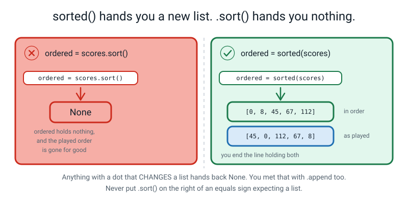
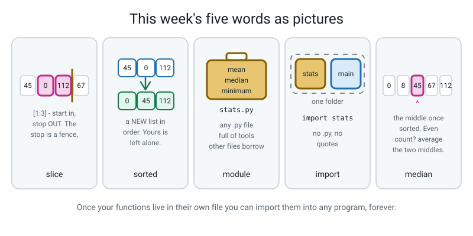

# Week 12 — Your Own Stats Toolkit

[⬅ Week 11](week-11.md) · [Course Home](../README.md) · [Next ➡](week-13.md) · [Workbook](../workbook/week-12.md)

---

> ### This week in one sentence
> **Once your functions live in their own file you can `import` them into any program you write, forever.**
>
> **By the end of this chapter you will be able to:**
> - Take a **slice** of a list and explain why the stop number is *not* included
> - Sort a list **without changing the original**, and say how `sorted()` differs from `.sort()`
> - Loop over the **items** of a list instead of over the numbers 0, 1, 2
> - **Import a function from a file you wrote yourself** and use it in a different file
> - Prove `median()` is correct for an **odd-length** list *and* an **even-length** one
>
> **New syntax:** `scores[1:4]` · `sorted(scores)` · `for score in scores:` · `import stats` / `from stats import mean`
>
> **Reading time:** about 40 minutes. **Homework:** about 60 minutes.
>
> **The one thing that will break this lesson:** `stats.py` and `main.py` **must sit in the same folder**, and your terminal must be in that folder. Nine out of ten problems this week are that and nothing else.

---

## 🪝 Start Here

Find a pencil case, a tin, or a small box. Open it and take out three things: a **ruler**, a **sharpener**, a **rubber**. Lay them in a row on the table.

**Now the question. Tomorrow, when you need to draw a straight line — are you going to carve a new ruler?**

Of course not. You open the tin. **The ruler does not belong to one drawing.** It belongs to the tin, and every drawing you ever do can borrow it.

Now something slightly embarrassing about your own code. **Go and open three of your own files.**

In **Week 7** you wrote four lines to work out an average: start a total at zero, go along, add each one, divide by how many.

In **Week 11**, drill eleven — the same four lines.

And you will want them again next week. And the week after. And honestly every single week between now and June, because this is a course about data and data has averages in it.

**Every one of those programs carved its own ruler.**

So here is what happens today. **You build the tin.** It is a file, it will be called `stats.py`, and it will contain five tools: mean, median, lowest, highest, and the spread between them.

And then — this is the part that matters — you write a **completely separate program**, in a **different file**, that opens the tin and uses them. One line:

```python
import stats
```

That is it. That is the whole mechanism.

**And here is why that one line is bigger than it looks.** In about nine weeks you will type `import pandas`, and you will get three hundred thousand lines of code written by hundreds of strangers over fifteen years, and you will use it without reading any of it.

> **The only difference between `import pandas` and `import stats` is who wrote the file.**

So today you find out what is actually happening when you do that, **by being the stranger.**

One more thing, and then we start. Later on, **somebody is going to reach into your tin and take the ruler out.** Not to be mean. Because when your program stops working the second that happens, you will *know* — really know, not just believe — that the two files are genuinely joined together.


*Figure 12.1 — What you are building. The toolbox does the working out. The job file does the printing. Both in one folder.*

---

## 🧠 The Big Idea

> **📌 About the code in this section.** The blocks below are **illustrations, not files**. They show you the shape of one idea, and each one carries on from the one above it — the `import` lines and the data are typed once, in the first block that needs them. **The complete, runnable file is in 💻 Type This.** If you copy a block from this section on its own and Python says `NameError`, that is why, and nothing is broken.

### 1. Slicing — and the second off-by-one of the term

Get your four cards and the pink strip from last week back on the table. You will need a pencil too.

Last week you learned to take out **one** card. Today: how do you take out **some** of them?

You say where to **start** and where to **stop**, with a colon between them.

> **slice** — a new list made from part of an existing list, written `list[start:stop]`. The start is included; **the stop is not**.

**Before you read on, predict:** `scores[1:4]` — how many cards do you get?

Most people say four, or "one to four, so that's four cards".

**Now do it physically.** Lay the pencil across the pink strip **between** the card at slot 3 and where a card at slot 4 would be.

> **The pencil is the stop. And the pencil is not a card.**

Start at slot 1, and take cards until you hit the pencil. One, two, three. **Three cards.**

And look at the arithmetic: **4 − 1 = 3.** The number of items you get is the stop minus the start, as long as the slice sits inside the list (a stop past the end just gives you what exists, as you will see below). **You never have to think about it again.**

```python
scores = [45, 0, 112, 67, 8]           # slots 0, 1, 2, 3, 4

print(scores[1:4])                     # slots 1, 2, 3 -- NOT 4
print(scores[0:2])                     # slots 0, 1
print(scores[:3])                      # leave the start out: from the beginning
print(scores[2:])                      # leave the stop out: to the very end
print(scores[-2:])                     # the last two
print(scores[:])                       # a copy of the whole thing
print(scores[3:3])                     # start and stop the same -> nothing at all
print(scores[2:99])                    # a stop past the end does NOT crash
print(len(scores[1:4]), "items, because 4 - 1 = 3")
print(scores)                          # the original list is untouched
```

```text
[0, 112, 67]
[45, 0]
[45, 0, 112]
[112, 67, 8]
[67, 8]
[45, 0, 112, 67, 8]
[]
[112, 67, 8]
3 items, because 4 - 1 = 3
[45, 0, 112, 67, 8]
```

**Last week's off-by-one was "the last index is one less than the count". This week's is "the stop is not included".** Two different off-by-ones, a week apart, deliberately — because meeting them together is what makes people give up.

**Why the stop is excluded. Three reasons, and they get better as you go.**

**One: the length falls out for free.** `scores[1:4]` has `4 − 1 = 3` items. Always. If the stop were included you would have to remember a `+1` every single time.

**Two — and this is the persuasive one — slices join up perfectly.** `scores[:3]` gives slots 0, 1, 2. `scores[3:]` gives slots 3, 4. Put those together and you have the whole list back, **with nothing missing and nothing counted twice**, and the number **3** appears in both of them, meaning the same fence.

Try that with an inclusive stop and you need `[:3]` and then `[4:]` — and one day you will write `[3:]` by mistake and get item three twice and never notice.

**Three: you have seen this rule before.** `range(4)` gives 0, 1, 2, 3 and stops **before** 4. `scores[0:4]` gives slots 0, 1, 2, 3 and stops **before** 4. **One rule, two places.** That is not a coincidence — it is a mercy.


*Figure 12.2 — The start is a card you take. The stop is a fence you stop at.*

**Two more things worth knowing before you trip over them.**

**`scores[3:3]` gives `[]`** — an empty list, no error. Start and stop in the same place means zero items, which is exactly `3 − 3`.

**`scores[2:99]` does not crash.** Look at that output again: it quietly gives you `[112, 67, 8]`, which is what there is. But `scores[99]` on its own would be an `IndexError`.

**That asymmetry surprises everybody, and the reason is good:** a *slice* is a request for a **range**, so Python gives you whatever part of that range exists. A single *index* is a request for one **specific** thing, and if it is not there the honest answer is an error. **Two different kinds of question, two different answers.**

### 2. `sorted()` builds a new list. `.sort()` changes yours.

To find a median you have to put the numbers in order. So — careful now — **do you want to rearrange the season, or do you want a second copy that happens to be in order?**

Think about what a season *is*. It is the order the innings actually happened in. **Sort it and you have destroyed that.** You can no longer say what the first innings was, or whether they got better over the year.

So Python gives you both, and you have to know which is which.

```python
scores = [45, 0, 112, 67, 8]

ordered = sorted(scores)               # a brand-new list, in order
print("ordered :", ordered)
print("original:", scores)             # unchanged -- this is the whole point

print("biggest first:", sorted(scores, reverse=True))
print("original again:", scores)
```

```text
ordered : [0, 8, 45, 67, 112]
original: [45, 0, 112, 67, 8]
biggest first: [112, 67, 45, 8, 0]
original again: [45, 0, 112, 67, 8]
```

**`reverse=True` is a keyword argument** — that is Week 10's syntax being reused, not something new. Nice, isn't it, when a thing you learned turns up in somebody else's function.

**Now the trap of the week.** There is also `.sort()` **with a dot**, which rearranges the list you already have and hands back nothing:

```python
scores = [45, 0, 112, 67, 8]
ordered = scores.sort()
print(ordered)
print(ordered[0])
```

```text
None
Traceback (most recent call last):
  File "/Users/you/ai-academy/level2/week12_sort_trap.py", line 4, in <module>
    print(ordered[0])
TypeError: 'NoneType' object is not subscriptable
```

**`None` again.** Exactly the same shape as last week's `scores = scores.append(89)`, for exactly the same reason:

> **A command with a dot that *changes* a list hands back nothing at all.**

*("Not subscriptable" is Python's way of saying "you put square brackets after something that has no slots". `None` has no slots.)*

**The rule to end the week with:**

> **Use `sorted()` when you want a new list. Use `.sort()` only when you truly want to rearrange the one you have — and never expect a list back from `.sort()`.**

**And here is why it matters inside a function specifically.** Your `median()` has to put the numbers in order to find the middle. If it used `.sort()`, it would silently reorder **the caller's** list. Somebody asks for the median of their innings, in the order they happened, and gets the median — *plus their whole season quietly re-sorted*, which they did not ask for and will not notice until something else breaks.

That is called a **side effect**, and a side effect in a function whose job is "just tell me a number" is how trust dies. **`sorted()` costs you one extra list and buys you a function nobody has to be afraid of.**


*Figure 12.3 — Nothing is lost. You end the line holding both orders.*

### 3. `for score in scores:` — walking the items

Last week you walked a list like this:

```python
scores = [45, 0, 112, 67, 8]
for i in range(len(scores)):           # i is 0, 1, 2, 3, 4
    print(i, scores[i])
```

```text
0 45
1 0
2 112
3 67
4 8
```

**This week, the version you will use for the rest of your life:**

```python
for score in scores:                   # score IS the value, no brackets needed
    print(score)
```

```text
45
0
112
67
8
```

**The difference in one sentence:** the first version hands you a **slot number** and you have to look the value up; the second hands you **the value**. One step instead of two, and one fewer place to write an off-by-one.

**The word `score` is a name you chose**, exactly like a parameter name. `for s in scores:` works identically. **Choose the singular of the list's name** and the loop reads like English: *for score in scores*, *for player in players*, *for row in rows*.


*Figure 12.4 — The left version hands you a number and makes you fetch. The right version hands you the value.*

> **⚠️ Watch out:** the classic confusion, and it produces a real crash. If you mix the two and write `for score in scores:` and then `scores[score]` inside the loop, `score` holds **45** and you have just asked for slot 45:
>
> ```text
> Traceback (most recent call last):
>   File "/Users/you/ai-academy/level2/week12_loop_trap.py", line 3, in <module>
>     print(scores[score])
> IndexError: list index out of range
> ```
>
> The fix is to delete the brackets. The diagnosis is: **you already have the value. Stop looking it up.**

**When do you still want `range(len(...))`?** Only when you genuinely need to know **where** you are. "Which innings was the best?" needs a *position*, not just a value. That case is rarer than you expect, and there is a nicer tool for it in Week 14.

### 4. Two files and one `import`

Two files, in the **same folder**.

`stats.py` holds the tools and does nothing else:

```python
def mean(scores):
    total = 0
    for score in scores:
        total += score
    return total / len(scores)
```

`main.py` borrows them:

```python
import stats                           # no .py, no quotes

print(stats.mean([45, 0, 112, 67, 8]))
```

```text
46.4
```

Hand-check: 45 + 0 + 112 + 67 + 8 = 232, and 232 ÷ 5 = 46.4 ✔

> **module** — any `.py` file. You import it by its filename with the `.py` left off, and you get everything defined inside it.

**Four things to be solid on, because each one causes a real error this week.**

**(a) No `.py`, and no quotes.** `import stats` — not `import stats.py`, not `import "stats"`. The name after `import` is a **module name**, and the module name is the filename with the extension removed. Python puts the `.py` back on itself when it goes looking.

**(b) `stats.` in front of every borrowed function.** `stats.mean(...)`, not `mean(...)`. The prefix is a **good** thing: six months later you can see at a glance where every function came from.

There is a shorter style, and you should see it once:

```python
from stats import mean, median         # take just these two, by name

print(mean([45, 0, 112, 67, 8]))
print(median([45, 0, 112, 67, 8]))
```

```text
46.4
45
```

**We use `import stats` as the default**, because in a big program a reader can see instantly where `mean` lives. The shorter style is shorter.

**(c) Same folder, and the terminal has to be there too.** If `main.py` cannot see `stats.py`:

```text
Traceback (most recent call last):
  File "/Users/you/ai-academy/level2/lonely_main.py", line 3, in <module>
    import stats                           # my own file... except it is not here
ModuleNotFoundError: No module named 'stats'
```

**(d) Running `stats.py` on its own produces nothing at all, and that is correct.**

```text
```

Zero lines. No error. Exit code 0.

**This will worry you, so get in first.** `stats.py` is a **toolbox**, and opening a toolbox does not build anything. The file contains nothing but `def`s, and a `def` that never gets called does nothing — **which is Week 9's lesson arriving again in a new costume.**

> **The toolbox does not talk. `main.py` does the talking.** If you put a `print` inside `stats.py`, it will fire on **every** import, in **every** program, forever.

**The file-name trap, and it is worth ninety seconds.** `stats.py` is a **safe** name because there is no built-in Python module called `stats`. `statistics.py` is a **dangerous** name, because there is.

If you name a file `statistics.py`, Python finds yours instead of the real one, and the errors are baffling:

```text
2.0
Traceback (most recent call last):
  File "/Users/you/ai-academy/level2/uses_stats.py", line 4, in <module>
    print(statistics.median([1, 2, 3]))
AttributeError: module 'statistics' has no attribute 'median'. Did you mean: 'mean'?
```

**The real `statistics` module absolutely does have a `median`. Python never looked at it.**

**Never name a file after a library.** The banned list for this course: `random.py`, `math.py`, `csv.py`, `statistics.py`, `numpy.py`, `pandas.py`, `sklearn.py`, `matplotlib.py`.

**And one harmless thing that will appear and alarm somebody.** After your first successful import, a folder called `__pycache__` shows up next to your files, holding something like `stats.cpython-310.pyc`. That is Python keeping a pre-chewed copy of your module so the next import is quicker. **Not yours to edit, safe to delete, and it will come straight back.**

### 5. Median — the algorithm, and why there are two cases

> **median** — the middle value once the numbers are put in order.

**Why bother, when you already have the mean?** Take five children's monthly pocket money: 200, 250, 300, 250 and **12,000**, because one grandmother visited.

- **Mean:** 13,000 ÷ 5 = **2,600**. Nobody gets 2,600.
- **Median:** in order that is 200, 250, **250**, 300, 12,000. The middle is **250**, which describes four of the five children.

> **One extreme value drags the mean and leaves the median alone.**

That single sentence is why every honest data report in this course prints **both**, and it comes back hard in Week 24 and again in the capstone.

**The algorithm, in four steps.**

1. Sort a **copy** — never wreck the caller's list.
2. Let `n` be how many there are.
3. If `n` is **odd**, the answer is the single middle item, at index `n // 2`.
4. If `n` is **even**, average the two middle items, at `n // 2 - 1` and `n // 2`.

**Why `n // 2` finds the middle when `n` is odd.** `//` is whole-number division, from Week 3. For 5 items in slots 0–4: `5 // 2` is **2**, and slot 2 has two slots below it and two above. Genuinely the middle. For 7 items: `7 // 2` is 3, with three below and three above. It works because throwing away the half is exactly the right thing to throw away.

**Why an even count needs two.** For 6 items in slots 0–5 there is **no single middle** — slots 2 and 3 are equally central. `6 // 2` is 3, the upper middle; `6 // 2 - 1` is 2, the lower one. Average them.

**And why can't you just pick one of them?** Because there is no reason to prefer 45 over 67 — **they are equally central**, so picking either would make the answer depend on nothing. Averaging is the only choice that treats both middles the same.

**How the code knows which case it is in:** `n % 2`, the remainder, also from Week 3. **An odd count leaves 1. An even count leaves 0.**


*Figure 12.5 — The remainder tells you which case you are in: 1 means odd, 0 means even.*

**Write `median` last.** Not because it is hard to type — it is nine lines — but because it is the only tool in the kit with **two cases**, and you want the easy four working and imported before you meet a function that has to make a decision about itself.

---

## 💻 Type This

Two files today. The tin first, then the program that opens it. **And before you type anything: run `ls` in your terminal and read out what is in this folder.** Both files go here.

### Step 1 — start the tin

New file, `stats.py`. **Save it in this folder first.** Three comment lines, then two blank lines.

```python
# stats.py — my own statistics toolkit.
# Every function in here RETURNS a number. Not one of them prints.
# This file is a TOOLBOX. Running it on its own does nothing, and that is correct.
```

### Step 2 — `mean`, the first tool

*Add to the bottom of `stats.py`.*

```python
def mean(scores):
    # Give back the average: the total shared out equally.
    if len(scores) == 0:               # guard: there is no average of nothing
        return None
    total = 0                          # start the running total at zero
    for score in scores:               # walk through the items themselves
        total += score                 # add this one onto the total
    return total / len(scores)         # share the total between all of them
```

**Three things in there worth naming as you type.**

The **guard** on line 3 uses `None` from Week 10, on purpose — there is no average of nothing, so hand back "no value" rather than crashing. `for score in scores:` is **this week's new loop, in its first real job.** And **nothing in this file prints.**

Now save it and run `python3 stats.py`. **What do you predict?**

```text
```

### Step 3 — ⚠️ nothing happened, and nothing is wrong

**Nothing. Not a blank line — *nothing*. And no error either.**

**Is it broken?**

**It is perfect. It is a toolbox.** What happens when you open a toolbox? Nothing gets built. There is a ruler in there and nobody is drawing with it.

And you already know why, because it is Week 9's lesson again: **a `def` that never gets called does nothing.** This whole file is `def`s. So running it does nothing, forever, no matter how many tools you put in it.

**That is the first thing that makes this file different from every file you have written so far. It is not a program. It is a thing programs use.**

### Step 4 — three more tools

*Add to the bottom of `stats.py`.* These three are all the same shape: **assume the first one wins, then check everybody.**

```python
def minimum(scores):
    # Give back the smallest value in the list.
    if len(scores) == 0:
        return None
    smallest = scores[0]               # assume the first one is the smallest
    for score in scores:               # then check every single one
        if score < smallest:           # found something smaller?
            smallest = score           # it is the new champion
    return smallest


def maximum(scores):
    # Give back the largest value in the list.
    if len(scores) == 0:
        return None
    largest = scores[0]                # assume the first one is the largest
    for score in scores:
        if score > largest:
            largest = score
    return largest


def value_range(scores):
    # Give back the spread: largest minus smallest.
    if len(scores) == 0:
        return None
    return maximum(scores) - minimum(scores)      # reuse our own two functions
```

> **💡 Try this:** stop on `value_range` for ten seconds. **Look at that last line. It calls two functions you wrote yourself, six lines up.** Your toolbox is already using its own tools. That is the shape of every program from here to June.

**Why `smallest = scores[0]` and not `smallest = 0`?** Because a list can be made entirely of numbers bigger than zero, in which case nothing is ever smaller than 0 and the function hands back **a number that was never in the list.** Starting from an actual member of the list is the only safe assumption. (Same argument, mirrored, for `maximum` and negative numbers.)

Run `python3 stats.py` again. **Still nothing.** And now that is expected rather than alarming, which is the point.

### Step 5 — the second file, and the import

New file, `main.py`. **Same folder. Save it first.**

```python
# main.py — a season report on 20 cricket scores, built from my own toolkit.

import stats                             # my own file, sitting right next to this one

SCORES = [45, 0, 112, 67, 8, 89, 34, 101, 23, 56,
          77, 4, 90, 19, 63, 38, 72, 15, 50, 26]     # 20 innings

print("  Innings   :", len(SCORES))
print("  Mean      :", f"{stats.mean(SCORES):.2f}")
print("  Lowest    :", stats.minimum(SCORES))
print("  Highest   :", stats.maximum(SCORES))
print("  Range     :", stats.value_range(SCORES))
```

Run `python3 main.py`.

```text
  Innings   : 20
  Mean      : 49.45
  Lowest    : 0
  Highest   : 112
  Range     : 112
```

**Stop and look at what just happened.**

**There is not one line of arithmetic in that file.** Not one loop. The word `total` does not appear anywhere. And it just told you the mean of twenty innings to two decimal places.

**All the working out happened in the other file. This file only asked.**

### Step 6 — ⚠️ mistake number one: `import stats.py`

Change line 3 to `import stats.py` — put the `.py` on, like the filename. Run it.

```text
Traceback (most recent call last):
  File "/Users/you/ai-academy/level2/main.py", line 3, in <module>
    import stats.py                             # my own file, sitting right next to this one
ModuleNotFoundError: No module named 'stats.py'; 'stats' is not a package
```

**Read the last line.** *"No module named stats dot py."*

The thing after `import` is not a filename, it is a **module name** — the filename with the `.py` taken off. **Python adds it back on when it goes looking.**

**Take the `.py` off and run it again.**

### Step 7 — ⚠️ the experiment: take the ruler out of the tin

**This is the moment of the lesson.** Add this line to the bottom of `main.py`:

```python
print("  Median    :", stats.median(SCORES))
```

Run it. It fails — because `median` does not exist yet:

```text
  Innings   : 20
  Mean      : 49.45
  Lowest    : 0
  Highest   : 112
  Range     : 112
Traceback (most recent call last):
  File "/Users/you/ai-academy/level2/main.py", line 13, in <module>
    print("  Median    :", stats.median(SCORES))
AttributeError: module 'stats' has no attribute 'median'. Did you mean: 'mean'?
```

**Read it out loud.** *"Module stats has no attribute median."* And look — **it is even guessing what you meant: "did you mean mean?"**

**Now here is the thing to notice, and it is the whole reason for doing this. You never touched `main.py`.**

Well — you added one line, and then you did not touch it again. That file is exactly as you typed it. **It broke because of what is or is not in a completely different file.**

**That is your proof.** These two files are not two files sitting near each other. **They are genuinely joined.** And in twenty minutes' time, when you write `median` in the tin, this line will start working **without you touching `main.py` at all.**

Bug Log entry:

> `AttributeError: module 'stats' has no attribute 'median'` → the function is not in the tin yet. Fix: write it in `stats.py`. **`main.py` does not change.**

### Step 8 — write `median`, and watch `main.py` heal

**Paper first. Do the arithmetic before you type a line.**

Five scores: `45, 0, 112, 67, 8`.

```text
As typed :  45   0   112   67   8
Sorted   :   0   8    45   67  112
Slots    :   0   1     2    3    4
                       ^
                two below, two above

How many : 5      5 // 2 = 2      5 % 2 = 1  -> odd -> ONE middle
MEDIAN   = 45
```

Now six scores: `45, 0, 112, 67, 8, 89`.

```text
Sorted   :   0   8    45   67   89  112
Slots    :   0   1     2    3    4    5
                       ^    ^
                    two middles, not one

How many : 6      6 // 2 = 3      6 // 2 - 1 = 2      6 % 2 = 0  -> even
By hand  : (45 + 67) / 2 = 112 / 2 = 56.0
MEDIAN   = 56.0
```

**Now** add this to the bottom of `stats.py`:

```python
def median(scores):
    # Give back the middle value once the numbers are put in order.
    if len(scores) == 0:
        return None
    ordered = sorted(scores)           # a NEW sorted list; the caller's list is untouched
    n = len(ordered)                   # how many numbers there are
    middle = n // 2                    # whole-number divide: the upper middle slot
    if n % 2 == 1:                     # odd count -> there is one true middle
        return ordered[middle]
    else:                              # even count -> average the two middles
        return (ordered[middle - 1] + ordered[middle]) / 2
```

**Run `main.py` without changing a single character of it.** The `Median` line that was crashing five minutes ago now works. **That is the pay-off of the whole lesson.**

### Step 9 — prove it, in a third file

New file, `median_proof.py`, same folder.

```python
# median_proof.py — prove median() twice: once on 5 scores, once on 6.

import stats

five = [45, 0, 112, 67, 8]                     # ODD count
six  = [45, 0, 112, 67, 8, 89]                 # EVEN count -- one more score

print("FIVE SCORES (odd)")
print("  as typed :", five)
print("  in order :", sorted(five))
print("  how many :", len(five))
print("  middle slot: 5 // 2 =", 5 // 2)
print("  5 % 2 =", 5 % 2, "-> odd -> take ONE middle value")
print("  median   :", stats.median(five))
print()
print("SIX SCORES (even)")
print("  as typed :", six)
print("  in order :", sorted(six))
print("  how many :", len(six))
print("  middle slot: 6 // 2 =", 6 // 2)
print("  6 % 2 =", 6 % 2, "-> even -> average slots 2 and 3")
print("  slot 2 is", sorted(six)[2], "and slot 3 is", sorted(six)[3])
print("  (45 + 67) / 2 =", (45 + 67) / 2)
print("  median   :", stats.median(six))
print()
print("MORE CHECKS")
print("  one score  [7]        ->", stats.median([7]))
print("  two scores [4, 8]     ->", stats.median([4, 8]))
print("  all equal  [5,5,5,5]  ->", stats.median([5, 5, 5, 5]))
print("  the caller's list is untouched:", five)
```

```text
FIVE SCORES (odd)
  as typed : [45, 0, 112, 67, 8]
  in order : [0, 8, 45, 67, 112]
  how many : 5
  middle slot: 5 // 2 = 2
  5 % 2 = 1 -> odd -> take ONE middle value
  median   : 45

SIX SCORES (even)
  as typed : [45, 0, 112, 67, 8, 89]
  in order : [0, 8, 45, 67, 89, 112]
  how many : 6
  middle slot: 6 // 2 = 3
  6 % 2 = 0 -> even -> average slots 2 and 3
  slot 2 is 45 and slot 3 is 67
  (45 + 67) / 2 = 56.0
  median   : 56.0

MORE CHECKS
  one score  [7]        -> 7
  two scores [4, 8]     -> 6.0
  all equal  [5,5,5,5]  -> 5.0
  the caller's list is untouched: [45, 0, 112, 67, 8]
```

**Point at that last line.** `five` is still in the order it was typed. **That is `sorted()` earning its keep.** If `median` had used `.sort()`, your season would have been quietly rearranged by a function whose entire job was to hand back one number.

**And notice the edge cases.** `[7]` gives 7 — the middle of one thing is itself. `[4, 8]` gives `6.0`, a number that is not in the list at all, which is normal and honest for an even count. `[5, 5, 5, 5]` gives `5.0`; the `.0` is the division, not a mistake.

### The complete finished program

`stats.py`:

```python
# stats.py — my own statistics toolkit.
# Every function in here RETURNS a number. Not one of them prints.
# This file is a TOOLBOX. Running it on its own does nothing, and that is correct.


def mean(scores):
    # Give back the average: the total shared out equally.
    if len(scores) == 0:               # guard: there is no average of nothing
        return None
    total = 0                          # start the running total at zero
    for score in scores:               # walk through the items themselves
        total += score                 # add this one onto the total
    return total / len(scores)         # share the total between all of them


def minimum(scores):
    # Give back the smallest value in the list.
    if len(scores) == 0:
        return None
    smallest = scores[0]               # assume the first one is the smallest
    for score in scores:               # then check every single one
        if score < smallest:           # found something smaller?
            smallest = score           # it is the new champion
    return smallest


def maximum(scores):
    # Give back the largest value in the list.
    if len(scores) == 0:
        return None
    largest = scores[0]                # assume the first one is the largest
    for score in scores:
        if score > largest:
            largest = score
    return largest


def value_range(scores):
    # Give back the spread: largest minus smallest.
    if len(scores) == 0:
        return None
    return maximum(scores) - minimum(scores)      # reuse our own two functions


def median(scores):
    # Give back the middle value once the numbers are put in order.
    if len(scores) == 0:
        return None
    ordered = sorted(scores)           # a NEW sorted list; the caller's list is untouched
    n = len(ordered)                   # how many numbers there are
    middle = n // 2                    # whole-number divide: the upper middle slot
    if n % 2 == 1:                     # odd count -> there is one true middle
        return ordered[middle]
    else:                              # even count -> average the two middles
        return (ordered[middle - 1] + ordered[middle]) / 2
```

```text
```

`main.py`:

```python
# main.py — a season report on 20 cricket scores, built from my own toolkit.

import stats                             # my own file, sitting right next to this one

SCORES = [45, 0, 112, 67, 8, 89, 34, 101, 23, 56,
          77, 4, 90, 19, 63, 38, 72, 15, 50, 26]     # 20 innings

print("=" * 46)
print("  SEASON REPORT - 20 INNINGS")
print("=" * 46)

print("  As played :", SCORES)           # the order the innings happened in
print("  In order  :", sorted(SCORES))   # a NEW sorted list, just for reading
print("-" * 46)

# ---- the five toolkit numbers ----
print("  Innings   :", len(SCORES))
print("  Mean      :", f"{stats.mean(SCORES):.2f}")
print("  Median    :", stats.median(SCORES))
print("  Lowest    :", stats.minimum(SCORES))
print("  Highest   :", stats.maximum(SCORES))
print("  Range     :", stats.value_range(SCORES))
print("-" * 46)

# ---- slices: pull out part of the row ----
print("  First 3   :", SCORES[0:3])      # slots 0, 1, 2 -- NOT slot 3
print("  Last 3    :", SCORES[-3:])      # the last three, however long the list is
print("  Worst 3   :", sorted(SCORES)[0:3])
print("  Best 3    :", sorted(SCORES)[-3:])
print("-" * 46)

# ---- did the season get better or worse? two halves, one slice each ----
print("  First half mean  :", f"{stats.mean(SCORES[:10]):.2f}")
print("  Second half mean :", f"{stats.mean(SCORES[10:]):.2f}")
print("-" * 46)

# ---- counting with a for-each loop ----
fifties = 0                              # start the counter at zero
for score in SCORES:                     # walk the items themselves
    if score >= 50:
        fifties += 1                     # one more fifty
print("  Fifty-plus:", fifties)

ducks = 0
for score in SCORES:
    if score == 0:
        ducks += 1
print("  Ducks     :", ducks)
print("-" * 46)

# ---- proof that sorted() did not wreck the original ----
print("  Still as played:", SCORES[0], SCORES[1], SCORES[2])
print("=" * 46)
```

```text
==============================================
  SEASON REPORT - 20 INNINGS
==============================================
  As played : [45, 0, 112, 67, 8, 89, 34, 101, 23, 56, 77, 4, 90, 19, 63, 38, 72, 15, 50, 26]
  In order  : [0, 4, 8, 15, 19, 23, 26, 34, 38, 45, 50, 56, 63, 67, 72, 77, 89, 90, 101, 112]
----------------------------------------------
  Innings   : 20
  Mean      : 49.45
  Median    : 47.5
  Lowest    : 0
  Highest   : 112
  Range     : 112
----------------------------------------------
  First 3   : [45, 0, 112]
  Last 3    : [15, 50, 26]
  Worst 3   : [0, 4, 8]
  Best 3    : [90, 101, 112]
----------------------------------------------
  First half mean  : 53.50
  Second half mean : 45.40
----------------------------------------------
  Fifty-plus: 10
  Ducks     : 1
----------------------------------------------
  Still as played: 45 0 112
==============================================
```

**Every number, checked by hand.** Sorted, the twenty scores are `0, 4, 8, 15, 19, 23, 26, 34, 38, 45, 50, 56, 63, 67, 72, 77, 89, 90, 101, 112`.

- **Total** — add in pairs from the ends: 112 + 105 + 98 + 104 + 96 + 95 + 93 + 97 + 94 + 95 = **989** ✔
- **Mean** — 989 ÷ 20 = **49.45** ✔
- **Median** — 20 items, so `20 // 2 = 10`; average slots 9 and 10, which are 45 and 50 → (45 + 50) ÷ 2 = **47.5** ✔
- **Range** — 112 − 0 = **112** ✔
- **First half mean** — 45+0+112+67+8+89+34+101+23+56 = **535**, ÷ 10 = **53.5** ✔
- **Second half mean** — 989 − 535 = **454**, ÷ 10 = **45.4** ✔
- **Fifty-plus** — 112, 67, 89, 101, 56, 77, 90, 63, 72, 50 = **10** ✔ (50 counts, because the test is `>= 50`)
- **Ducks** — one score of 0 = **1** ✔

**Two pairs of lines are worth stopping on.**

**`First 3` gives `[45, 0, 112]` but `Worst 3` gives `[0, 4, 8]`.** Same slice, two different lists. `SCORES[0:3]` takes the first three innings **in the order they were played.** `sorted(SCORES)[0:3]` sorts first, so it takes the three **lowest scores of the season.** A slice always means "these positions" — and positions only mean something once you know what order the list is in.

**And the two half-season lines.** Look at what they are made of: **a slice from this week, a function from your own file, and an f-string from Week 3.** And they answer a real question — *did the season get worse?* First ten innings averaged 53.5. Last ten averaged 45.4.

**That is a genuine finding, and you got it out of your own toolbox in two lines.** Whether it *means* anything is a different and much harder question. Hold on to it.

---

## 🔍 Worked Examples

### Worked Example 1 — One week of samosa sales (food)

The example where the mean and the median disagree, and the median is right.

```python
# snack_sales.py - one week of samosa sales, reported with my own toolkit.

import stats                                 # the tin, sitting next to this file

SALES = [24, 31, 28, 26, 30, 29, 210]        # Mon..Sun. Sunday was a festival.

print("as sold   :", SALES)
print("in order  :", sorted(SALES))          # a NEW list; SALES is untouched
print("days      :", len(SALES))
print("mean      :", f"{stats.mean(SALES):.2f}")
print("median    :", stats.median(SALES))
print("lowest    :", stats.minimum(SALES))
print("highest   :", stats.maximum(SALES))
print("range     :", stats.value_range(SALES))

# slices: the working week is slots 0 to 4, the weekend is slots 5 and 6
print("weekdays  :", SALES[0:5], "-> mean", f"{stats.mean(SALES[0:5]):.2f}")
print("weekend   :", SALES[5:], "-> mean", f"{stats.mean(SALES[5:]):.2f}")
print("busiest 2 :", sorted(SALES)[-2:])
print("quietest 2:", sorted(SALES)[0:2])

# for-each: count the days we sold thirty or more
busy = 0
for sold in SALES:                           # sold IS the number, no brackets
    if sold >= 30:
        busy += 1
print("30 or more:", busy, "days out of", len(SALES))
print("still as sold:", SALES[0], SALES[-1])
```

```text
as sold   : [24, 31, 28, 26, 30, 29, 210]
in order  : [24, 26, 28, 29, 30, 31, 210]
days      : 7
mean      : 54.00
median    : 29
lowest    : 24
highest   : 210
range     : 186
weekdays  : [24, 31, 28, 26, 30] -> mean 27.80
weekend   : [29, 210] -> mean 119.50
busiest 2 : [31, 210]
quietest 2: [24, 26]
30 or more: 3 days out of 7
still as sold: 24 210
```

**Hand-check.** Total = 24+31+28+26+30+29+210 = **378**, ÷ 7 = **54.0** ✔ Sorted, seven items, `7 // 2` = 3, so the median is slot 3 = **29** ✔ Weekdays: 24+31 = 55, +28 = 83, +26 = 109, +30 = **139**, ÷ 5 = **27.8** ✔ Weekend: 29 + 210 = 239, ÷ 2 = **119.5** ✔

**Now the whole point of this example. Look at the mean and the median.**

| | Value | What it tells you |
|---|---|---|
| **Mean** | 54.00 | Not a single day looked like this. Six of the seven days were between 24 and 31 |
| **Median** | 29 | This describes six of the seven days almost exactly |

**One festival Sunday dragged the mean up by 25 and left the median almost untouched.** The mean is not *wrong* — 378 samosas really were sold across 7 days — but if you asked "how many do we sell on a normal day?", **54 is a misleading answer and 29 is an honest one.**

**And notice `SALES[5:]` has two items in it**, which is what you would expect from a seven-item list starting at slot 5: slots 5 and 6. **7 − 5 = 2.** The arithmetic works without the stop number being written down at all.

**Last line: `SALES` is still in the order it was sold.** Two `sorted()` calls and a slice, and nothing was destroyed.

### Worked Example 2 — Ten matches of goals (sport)

Small numbers, two even-length halves, and a median that is not a whole number.

```python
# goals.py - ten matches of goals, split into two halves with slices.

import stats

GOALS = [2, 0, 1, 3, 1, 0, 4, 2, 1, 2]       # ten matches, slots 0 to 9

print("as played :", GOALS)
print("in order  :", sorted(GOALS))
print("matches   :", len(GOALS))
print("mean      :", stats.mean(GOALS))
print("median    :", stats.median(GOALS))
print("best match:", stats.maximum(GOALS))
print("worst     :", stats.minimum(GOALS))
print("range     :", stats.value_range(GOALS))

print("first five:", GOALS[:5], "-> mean", stats.mean(GOALS[:5]))
print("last five :", GOALS[5:], "-> mean", stats.mean(GOALS[5:]))
print("5 + 5 = 10 :", len(GOALS[:5]), "+", len(GOALS[5:]), "=", len(GOALS))

# for-each: count clean sheets... at the other end, count matches with no goals
blanks = 0
for scored in GOALS:
    if scored == 0:
        blanks += 1
print("blanked   :", blanks, "matches")
```

```text
as played : [2, 0, 1, 3, 1, 0, 4, 2, 1, 2]
in order  : [0, 0, 1, 1, 1, 2, 2, 2, 3, 4]
matches   : 10
mean      : 1.6
median    : 1.5
best match: 4
worst     : 0
range     : 4
first five: [2, 0, 1, 3, 1] -> mean 1.4
last five : [0, 4, 2, 1, 2] -> mean 1.8
5 + 5 = 10 : 5 + 5 = 10
blanked   : 2 matches
```

**Hand-check.** Total = 2+0+1+3+1+0+4+2+1+2 = **16**, ÷ 10 = **1.6** ✔ Sorted, ten items, `10 // 2` = 5, so average slots 4 and 5: sorted list is `0 0 1 1 1 2 2 2 3 4`, so slot 4 = 1 and slot 5 = 2, and (1 + 2) ÷ 2 = **1.5** ✔ First five: 2+0+1+3+1 = 7, ÷ 5 = **1.4** ✔ Last five: 0+4+2+1+2 = 9, ÷ 5 = **1.8** ✔

**Three things to notice.**

**Nobody has ever scored 1.5 goals.** For an even-length list the median is a **constructed** number, halfway between the two central values, and it may not appear in the data at all. That is normal, and it is honest, and it is the same reason a mean of 1.6 is not a scoreline anybody played.

**`GOALS[:5]` and `GOALS[5:]` tile the list exactly.** Five items and five items, and 5 + 5 = 10. **Nothing missing, nothing counted twice, and the number 5 appears in both slices meaning the same fence.** This is the argument for the excluded stop, and here it is in a real program.

**`blanked : 2` needed a for-each loop, not a slice.** A slice picks by **position**; "matches with no goals" is a question about **value**. You cannot slice your way to it. (Filtering by value gets a proper tool in Week 15.)

### Worked Example 3 — Nine test marks, one of them a zero (school)

The example where a single zero moves the mean by nearly nine marks.

```python
# term_marks.py - nine test marks, one of which is a zero for a missed test.

import stats

MARKS = [78, 91, 64, 88, 55, 70, 96, 0, 82]  # nine tests, slots 0 to 8

print("as taken  :", MARKS)
print("in order  :", sorted(MARKS))
print("tests     :", len(MARKS))
print("mean      :", f"{stats.mean(MARKS):.2f}")
print("median    :", stats.median(MARKS))
print("lowest    :", stats.minimum(MARKS))
print("highest   :", stats.maximum(MARKS))
print("range     :", stats.value_range(MARKS))

# the same nine marks with the missed test taken out -- a slice cannot do this,
# so we build a new list with a for-each loop and append
sat = []
for mark in MARKS:
    if mark > 0:
        sat.append(mark)
print("tests sat :", sat, "->", len(sat), "of", len(MARKS))
print("mean of those sat  :", f"{stats.mean(sat):.2f}")
print("median of those sat:", stats.median(sat))

# slices: the first four tests and the last four
print("first four:", MARKS[0:4], "-> mean", f"{stats.mean(MARKS[0:4]):.2f}")
print("last four :", MARKS[-4:], "-> mean", f"{stats.mean(MARKS[-4:]):.2f}")
print("still as taken:", MARKS[0], MARKS[7])
```

```text
as taken  : [78, 91, 64, 88, 55, 70, 96, 0, 82]
in order  : [0, 55, 64, 70, 78, 82, 88, 91, 96]
tests     : 9
mean      : 69.33
median    : 78
lowest    : 0
highest   : 96
range     : 96
tests sat : [78, 91, 64, 88, 55, 70, 96, 82] -> 8 of 9
mean of those sat  : 78.00
median of those sat: 80.0
first four: [78, 91, 64, 88] -> mean 80.25
last four : [70, 96, 0, 82] -> mean 62.00
still as taken: 78 0
```

**Hand-check.** Total of nine = 78+91+64+88+55+70+96+0+82 = **624**, ÷ 9 = 69.333… → **69.33** ✔ Sorted, nine items, `9 // 2` = 4, so the median is slot 4 = **78** ✔ Without the zero: total is still 624 but there are 8 of them, so 624 ÷ 8 = **78.00** ✔ Eight items, so the median averages slots 3 and 4 of `55 64 70 78 82 88 91 96`, which are 78 and 82 → **80.0** ✔

**Four things here, and the last is the important one.**

**The mean moved from 69.33 to 78.00 by removing one number.** Nearly nine marks, from one test. **The median moved from 78 to 80** — two marks. Same lesson as the samosas: **one extreme value drags the mean and leaves the median nearly alone.**

**`range` is 96, which is nearly the whole marks scale**, and that is entirely because of the zero. A range is very easily wrecked by one odd value, because it is *made* of the two most extreme ones.

**Building `sat` needed a for-each loop with `append`.** A slice picks positions and the missed test is at slot 7, in the middle. You could slice around it — but then you would have to know it was at slot 7, and next term there will be four zeros in different places. **A loop asks a question about every value; a slice asks about positions.**

**And now the honest question, which has no code in it at all.** The zero is a test that was **missed**, not a test that was failed. So which number should go on the report?

- **69.33** treats the missed test as a score of nothing, which punishes an illness.
- **78.00** ignores it, which is generous and hides the fact that a test is missing.
- **The honest report says both, and says which tests are in each.**

**That decision is not a programming decision, and no library will make it for you.** It comes back in Week 23 with a name — missing data — and again in the capstone, where you have to write down what you decided and why.

---

## 🐞 When It Breaks

Every message below came from really running a broken version of this week's code. **This week the errors come in two families, and the diagnostic question is different for each.**

### Break 1 — `ModuleNotFoundError`: Python cannot find the *file*

```python
# lonely_main.py -- in a folder with no stats.py beside it.

import stats                           # my own file... except it is not here

print(stats.mean([1, 2, 3]))
```

```text
Traceback (most recent call last):
  File "/Users/you/ai-academy/level2/lonely_main.py", line 3, in <module>
    import stats                           # my own file... except it is not here
ModuleNotFoundError: No module named 'stats'
```

**What Python is telling you.** *"I went looking for a file called `stats.py` next to the one I am running, and it is not there."*

**Nine out of ten times, it is the folder.** The fix is one command:

```text
$ ls
```

**Read out what is in the folder.** If `stats.py` is not in that listing, you are in the wrong place — `cd` to the folder that has it. Also look for `stats.py.txt`, which some editors add without asking.

**And notice this error happens on line 3, before any of your program runs.** Nothing had a chance to go wrong yet.

**Two near neighbours, both fixed the same way:**

```text
ModuleNotFoundError: No module named 'stats.py'; 'stats' is not a package
```

*You wrote `import stats.py`.* The word after `import` is a module name, not a filename. **Take the `.py` off.**

```text
ModuleNotFoundError: No module named 'Stats'
```

*Capital letters matter.* `import Stats` for a file called `stats.py` will not find it.

### Break 2 — `AttributeError`: Python found the file but not the thing inside it

```python
import stats

print("  Median    :", stats.median(SCORES))
```

```text
  Innings   : 20
  Mean      : 49.45
Traceback (most recent call last):
  File "/Users/you/ai-academy/level2/main.py", line 19, in <module>
    print("  Median    :", stats.median(SCORES))
AttributeError: module 'stats' has no attribute 'median'. Did you mean: 'mean'?
```

**What Python is telling you.** *"I found `stats.py` perfectly well. It does not contain anything called `median`."*

**And this is the distinction worth learning by heart, because it saves a great deal of time:**

| Message | What is missing |
|---|---|
| `ModuleNotFoundError` | **The file.** Look at the folder. Run `ls` |
| `AttributeError: module ... has no attribute ...` | **Something inside the file.** Open `stats.py` and read the `def` lines |
| `ImportError: cannot import name ...` | Same as `AttributeError`, but from a `from ... import` line — and it fires on **line 1** |

**The fix.** Write the function, or fix the spelling. **The "did you mean" suggestion is usually right** — Python is comparing what you asked for against the names it actually found.

Here is the third one, for comparison. With `from stats import mean, median` and `median` missing:

```text
Traceback (most recent call last):
  File "/Users/you/ai-academy/level2/hw12_import.py", line 1, in <module>
    from stats import mean, median         # take just these two, by name
ImportError: cannot import name 'median' from 'stats' (/Users/you/ai-academy/level2/stats.py)
```

**It happens on line 1, before your program runs at all** — which is arguably better than the `AttributeError`, which waits until the moment you actually use the function. **That is a real argument in favour of the `from ... import` style**, and it is worth knowing there is one.

### Break 3 — `ZeroDivisionError` and `IndexError` from an empty list

**This is why every function in your toolkit starts with a guard.** Here is what happens without them:

```python
import stats

print(stats.mean([]))
```

```text
Traceback (most recent call last):
  File "/Users/you/ai-academy/level2/hw12_empty.py", line 3, in <module>
    print(stats.mean([]))
  File "/Users/you/ai-academy/level2/stats.py", line 11, in mean
    return total / len(scores)         # share the total between all of them
ZeroDivisionError: division by zero
```

```python
import stats

print(stats.minimum([]))
```

```text
Traceback (most recent call last):
  File "/Users/you/ai-academy/level2/hw12_empty2.py", line 3, in <module>
    print(stats.minimum([]))
  File "/Users/you/ai-academy/level2/stats.py", line 16, in minimum
    smallest = scores[0]               # assume the first one is the smallest
IndexError: list index out of range
```

**Two `File` lines again, and read them the way you learned last week: bottom upwards.** The bottom one is **inside `stats.py`** — that is where it broke. The one above is **inside your program** — that is who asked.

**Every function in the kit fails on an empty list, and each one fails differently:** `mean` divides by zero, `minimum` and `maximum` ask for slot 0 of nothing, `median` sorts nothing and then indexes it. **That is why they all start with the same three lines**, and with the guards in place all five hand back `None`:

```text
None
None
None
None
None
```

> **🐞 If you see this error:** when a traceback points **inside** `stats.py`, the question is never "what is wrong with my function?" It is **"what did I actually hand it?"** Print the list on the line above and print its `len`. **`len` settles more arguments this term than anything else.**

### Break 4 — the loop that mixes up the two kinds

```python
scores = [45, 0, 112, 67, 8]
for score in scores:
    print(scores[score])
```

```text
Traceback (most recent call last):
  File "/Users/you/ai-academy/level2/week12_loop_trap.py", line 3, in <module>
    print(scores[score])
IndexError: list index out of range
```

**What Python is telling you.** *"There is no slot 45."*

**What happened.** `score` already **is** the value — 45 on the first trip round. You then used it as if it were a slot number. **The fix is to delete the brackets.** The diagnosis is: *you already have the value; stop looking it up.*

### The whole clinic, for reference

| What you see | What it means | The fix |
|---|---|---|
| `ModuleNotFoundError: No module named 'stats'` | Python could not find `stats.py` | `ls` in the terminal. If it is not listed, `cd` to the folder that has it. Watch for `stats.py.txt` |
| `ModuleNotFoundError: No module named 'stats.py'; 'stats' is not a package` | You gave a filename where a module name belongs | `import stats`. No extension, no quotes |
| `ModuleNotFoundError: No module named 'Stats'` | Capital letters matter | Match the filename exactly, including case |
| `ImportError: cannot import name 'average' from 'stats'` | The **file** was found; the **function** was not | Open `stats.py` and read the `def` lines. Use a name that is really there |
| `AttributeError: module 'stats' has no attribute 'median'. Did you mean: 'mean'?` | The module loaded but does not contain that function | Write it, or fix the spelling. The suggestion is usually right |
| `AttributeError: module 'statistics' has no attribute 'median'` — **when you know it does** | Python imported **your** file instead of the real library | You named a file after a library. Rename it and delete `__pycache__` |
| `ZeroDivisionError: division by zero`, pointing inside `mean` | Divided by a length of zero | `mean([])` with no guard. Add `if len(scores) == 0: return None` |
| `IndexError: list index out of range`, pointing at `smallest = scores[0]` | The list is empty, so there is no slot 0 | Same guard. Every function in the kit needs one |
| `TypeError: 'NoneType' object is not subscriptable` | You put square brackets after something that is `None` | `ordered = scores.sort()`. Use `sorted(scores)` |
| `TypeError: slice indices must be integers or None or have an __index__ method` | The number in the slice is a decimal | `len(scores) / 2` always makes a decimal. Use `//` |
| `IndexError` inside `for score in scores:` | You used the value as if it were a slot number | Delete the brackets. `score` already **is** the value |
| `TypeError: mean() takes 1 positional argument but 3 were given` | You passed loose numbers instead of one list | `stats.mean([45, 0, 112])` — one argument, and it is a list |
| `TypeError: object of type 'int' has no len()` | The function was handed a single number, not a list | `stats.mean([45])` |
| **`python3 stats.py` prints nothing at all.** Exit code 0 | The file ran perfectly and was asked to do nothing | **Nothing to fix.** It contains only `def`s. Run `main.py` instead |

---

## 🎲 What We Did In Class

*If you missed it, all of it works at home. The only thing you must get right is that both files are in the same folder.*

### The tin

A pencil case opened on the table. Ruler, sharpener, rubber, laid in a row. **"Tomorrow, when you need a straight line — are you going to carve a new ruler?"**

Then the embarrassing bit: **the average loop, written in Week 7, and written again in Week 11 drill 11.** Every one of those programs carved its own ruler.

Then the promise: *"Later on I am going to reach into your tin and take the ruler out. Not because I'm mean. Because when your program stops working the second I do that, you'll know the two files are genuinely joined."*

### The pencil across the cards

Last week's four cards and pink strip, back on the table. **`scores[1:4]` — how many cards?** Most people say four.

Then the pencil laid across the strip **between slot 3 and where slot 4 would be**.

> **The pencil is the stop. And the pencil is not a card.**

Start at 1, take cards until you hit the pencil. **Three cards. 4 − 1 = 3.**

Then the pencil moved between slots 2 and 3, and the persuasive demonstration: **`scores[:3]` gives cards 0, 1, 2. `scores[3:]` gives cards 3 and 4. Together, the whole row — nothing missing, nothing twice, and the number 3 in both of them.**

And the relief: **`range(4)` stops before 4 as well. One rule, two places.**

### The three things written in the notebook

> **slice** — `scores[start:stop]`. Start **in**, stop **out**. Inside the list you get `stop - start` items.
> `scores[:3]` from the beginning · `scores[3:]` to the end · `scores[-3:]` the last three
>
> **`sorted(scores)`** — a NEW sorted list. The original is untouched. **You must catch it.**
> **`scores.sort()`** — rearranges the original. Returns `None`. Careful.
>
> **`for score in scores:`** — hands you each **value**, one at a time. No slot numbers.
> Use `range(len(...))` only when you need to know **where** you are.

### Why `sorted()` and not `.sort()`

*"Think about what the season is. It's the order the innings actually happened in. Sort it and you've destroyed that — you can't tell me the first innings any more."*

Then the trap, and the question that made it land: **"Do you remember what happened last week when you wrote `scores = scores.append(89)`?"** `None`.

**Anything with a dot that changes a list hands back nothing.**

### `stats.py`, then `main.py`

`mean` typed first, then `python3 stats.py` run. **Nothing. Not a blank line — nothing.** Thirty seconds of arguing about whether it was broken, then:

*"It's a toolbox. What happens when you open a toolbox? Nothing gets built."*

Then `minimum`, `maximum` and `value_range` — and ten seconds spent on `value_range`'s last line, **which calls two functions the class wrote six lines earlier.**

Then `main.py`, and the moment worth noticing out loud: **there is not one line of arithmetic in that file, and it just gave the mean of twenty innings to two decimal places.**

### The two deliberate mistakes and the experiment

**One: `import stats.py`.**

```text
ModuleNotFoundError: No module named 'stats.py'; 'stats' is not a package
```

*The word after `import` is a module name, not a filename.*

**Two: the ruler out of the tin.** The `Median` line added to `main.py` before `median` existed:

```text
AttributeError: module 'stats' has no attribute 'median'. Did you mean: 'mean'?
```

*"I never touched `main.py`. It broke because of what is or isn't in a completely different file. **That is your proof.**"*

### Median, on paper, before any code

Five scores sorted by hand, the middle ringed: `0 8 45 67 112`, slot 2, **median 45**. Two below, two above. `5 // 2` = 2, `5 % 2` = 1 → odd.

Then six: `0 8 45 67 89 112`, and the discovery that **slots 2 and 3 are equally central**. `6 // 2` = 3, `6 // 2 - 1` = 2, `6 % 2` = 0 → even. **(45 + 67) ÷ 2 = 56.0.**

And the question the class had to answer: **"Why can't we just pick one of them?"** Because there is no reason to prefer 45 over 67, so the answer would depend on nothing. **Averaging treats both middles the same.**

Then `median` typed into `stats.py` — and `main.py` started working **with nobody touching it.**

### The Bug Log entry

`AttributeError: module 'stats' has no attribute 'median'` → the function was not in the tin yet. **Fix: write it in `stats.py`. `main.py` does not change.** And the sentence that earns the marks: **`main.py` broke without being edited at all, which proves it does not contain those functions — it borrows them from `stats.py` every time it runs.**

---

## 💬 Talk About It

**1. "Should `median([])` return `None`, or should it crash?"** *(Answer this honestly: this is a real design argument and professionals land on both sides.)*

*Hint:* picture `median()` buried inside a bigger program that works out a class average and **emails it to parents.** If the list is empty because a data-loading bug ate the file, which do you want: an email saying "class median: None", an email saying "class median: 0", or a **loud crash before any email goes out**? Almost everybody picks the crash, and the argument is that returning `None` lets a broken value travel a long way from the place it broke. **Now picture the same function in a quick script you are running yourself, over thirty class lists, one of which happens to be empty.** Do you want the whole run to stop dead on list seventeen? Almost everybody says no, and now `None` is obviously right. **Notice the answer flipped and nothing about the function changed** — only who is going to read the result. What everybody agrees on: **`mean([])` must not silently return 0**, because 0 is a real average and "there wasn't any data" is not.

**2. "Why did we write `mean` by hand when Python can add up a list in one word?"**

*Hint:* it is true — there is a built-in that does it, and you will meet it in Week 14 on purpose. So ask the harder question: what happens in about eight weeks when you want a number that Python has **no** built-in word for? Then look at what happened today from the other side: **you now know exactly what `mean` does, line by line, including what it does with an empty list.** Would you know that about a built-in? And the last part, which is the real reason: students who meet the built-in first tend to treat every summary number as magic, **and then stall completely the first time the magic does not cover what they need.**

**3. "First half 53.5, second half 45.4. Did the season get worse?"**

*Hint:* the numbers say the second ten innings averaged about eight runs lower. **Before you answer, work out what one score of 112 does to an average of ten innings.** *(Compared with a score of 0 in its place, it holds the average up by more than 11.)* So: is eight runs a lot, next to that? Then the question that actually matters and has no easy answer: **what would convince you either way?** More innings? A different measure? The median of each half instead of the mean? **There is no answer at Week 12, and the honest thing to write down is "this is a hint, not a finding."** The tools to think about it properly arrive in Term 3 — and if you finish this conversation *wanting* them, you are in exactly the right place.

---

## ⚠️ Don't Get Tricked

### Trick 1 — "`sorted(scores)` sorts `scores`"


*Figure 12.6 — Left: `.sort()` puts `None` in your variable and destroys the played order. Right: `sorted()` gives you a new list and leaves yours alone.*

| ❌ Wrong | ✅ Right |
|---|---|
| `sorted(scores)` on a line of its own, then `print(scores)` and confusion | `ordered = sorted(scores)` — **catch it.** `sorted` *gives* you something |

Try it. Write `sorted(scores)` on its own line, then print `scores` on the next line. **Nothing has happened.** The sorted list was built, handed back, and nobody caught it, so it was thrown away.

**`sorted()` gives you something. You have to catch it.**

### Trick 2 — "`ordered = scores.sort()` gives me the sorted list"

| ❌ Wrong | ✅ Right |
|---|---|
| `ordered = scores.sort()` | `ordered = sorted(scores)` |

`.sort()` rearranges the list you already have and hands back **`None`**. So `ordered` holds nothing, and `ordered[0]` crashes with `TypeError: 'NoneType' object is not subscriptable`.

**This is the third time you have met `NoneType` in three weeks** — Week 10's missing `return`, Week 11's `append`, and now `.sort()`. By now it should be a reflex: **something handed back nothing.**

### Trick 3 — "`scores[1:4]` gives me four items"

| ❌ Wrong | ✅ Right |
|---|---|
| "One to four, so that's four items" | **`4 − 1 = 3` items.** The stop is a fence, not a card |

The cure is arithmetic, not explanation. **Write the subtraction next to every single slice you take, on paper, for the rest of this week.** `scores[1:4]` → `4 - 1 = 3`. `SCORES[:10]` → `10 - 0 = 10`. `SCORES[10:]` → `20 - 10 = 10`. After about six of those it becomes automatic and you never think about it again.

### Trick 4 — "running `stats.py` should print something"

| ❌ Wrong | ✅ Right |
|---|---|
| "It printed nothing, so it's broken. I'll add some `print`s to check" | **The toolbox does not talk.** Test it from outside, with a separate file that imports it |

**Do not add `print`s to `stats.py`.** Every one of them will fire on **every** import, in **every** program you ever write, forever — including the ones you write in June.

The legitimate version is `median_proof.py`: a separate file that imports `stats` and prints. **Testing a module from outside is a real professional habit, and it starts here.**

---

## 🌍 Where You've Seen This

1. **Every app on your phone.** Almost none of the code in it was written by the people who made the app. They imported it — a map, a payment box, a video player — and wrote the fifty lines that join them together.
2. **`import pandas as pd`, in nine weeks.** Three hundred thousand lines by hundreds of strangers. **Same mechanism as `import stats`. Different author, that is all.**
3. **The "share" sheet.** One piece of code, written once, borrowed by every app on the device. Nobody wrote it twenty times, and when the sharing rules change, one file changes.
4. **A shared spelling dictionary.** Your browser, your notes app and your messages all consult the same word list. Fix a word once and everything agrees.
5. **The median on any house-price report.** Newspapers print the median house price, not the mean, **exactly because of one mansion on the street.** You now know precisely why.
6. **"Top 3" and "Latest 3" on any leaderboard.** Two different slices of the same list — one after sorting, one not. `sorted(SCORES)[-3:]` and `SCORES[-3:]` are two different questions.
7. **Playlists in a music app.** A slice of the first ten songs, another slice of the last ten, and the original playlist untouched — because the app used the equivalent of `sorted()`, not `.sort()`.

---

## 🧭 Where This Fits

The whole year is one pipeline: a question goes in one end, and an answer you can **defend** comes out
the other. Stage one is behind you now — you can speak Python. This week you are standing inside the
first tile of stage two, and the moment you save `stats.py` and import it, that tile is finished.


*Figure 12.0 — The pipeline after Week 12. Gold is where you are, white is finished, and dashed still
means not yet — seven tiles of it. The strip along the bottom is the seven threads this course keeps
coming back to.*

| | |
|---|---|
| **The mental model you now own** | Functions you wrote can live in **their own file** — `stats.py` — and `import` pulls them into any program you write, for as long as you keep the file. A module is just a file. The only difference between yours and `pandas` is who typed it. |
| **The one question it answers** | *"How do I reuse what I wrote last month instead of typing it all out again?"* — you move it into a file once, and import it from then on. |
| **What it plugs into** | Weeks 9 and 10 gave you named blocks with parameters. Week 11 gave you a list of real numbers to run them over. This week those blocks move out of your program and into a toolkit of their own. |
| **What carries forward** | Week 17's `import numpy as np`, and every `import` for the rest of the year. Your `stats.py` is the pattern all of them follow — same one line, different author. |
| **Spiral thread** | 🧰 **Toolcraft** — you built a tool you can pick up again next month — and 📊 **Data**, because every function in the tin answers a question about a list of real numbers. |

> **💡 Try this:** on your own copy of the map, write `stats.py` in pencil inside the gold tile. When you
> type `import numpy as np` in Week 17, come back and notice it is the same one line — you just did not
> write the file that time.

---

## 🔑 Remember This

- **A module is any `.py` file.** `import stats` gives you everything defined inside `stats.py`. **No `.py`, no quotes, same folder.**
- **The only difference between `import stats` and `import pandas` is who wrote the file.**
- **Running a toolbox prints nothing, and that is correct.** It contains only `def`s, and a `def` you never call does nothing.
- **The toolbox does not talk.** Test it from outside with a separate file. Never put a `print` in `stats.py`.
- **Never name a file after a library.** No `statistics.py`, no `random.py`, no `pandas.py`.
- **`ModuleNotFoundError` means the file is missing. `AttributeError` means the file was found and the thing inside it is missing.** Telling those apart saves hours.
- **A slice is `list[start:stop]`. Start in, stop out.** You always get `stop - start` items.
- **`scores[:3]` and `scores[3:]` tile the list exactly** — nothing missing, nothing twice. That is the best argument for the excluded stop.
- **Same rule as `range()`.** `range(4)` stops before 4; `scores[0:4]` stops before slot 4.
- **A slice with a stop past the end does not crash. A single index past the end does.** A range request versus a specific request.
- **`sorted(scores)` builds a NEW list and leaves yours alone. You must catch it.**
- **`.sort()` rearranges yours and hands back `None`.** So does `.append`. **Anything with a dot that changes a list returns nothing.**
- **`median` must use `sorted()`, not `.sort()`** — otherwise it quietly reorders the caller's list. That is a **side effect**, and functions that just report a number must not have one.
- **`for score in scores:` hands you the value.** `for i in range(len(scores)):` hands you the slot number and makes you fetch. Use the second only when you need to know *where*.
- **The median is the middle value once sorted.** Odd count: one middle, at `n // 2`. Even count: two middles, at `n // 2 - 1` and `n // 2`, averaged.
- **`n % 2` tells you which case you are in.** 1 means odd, 0 means even.
- **One extreme value drags the mean and leaves the median alone.** Print both, always.

### Syntax reminder card

```python
# ---- SLICES: start in, stop out --------------------------------------------
scores = [45, 0, 112, 67, 8]      # slots 0, 1, 2, 3, 4

print(scores[1:4])                # [0, 112, 67]     4 - 1 = 3 items
print(scores[:3])                 # [45, 0, 112]     no start = from 0
print(scores[2:])                 # [112, 67, 8]     no stop = to the end
print(scores[-2:])                # [67, 8]          the last two
print(scores[:])                  # a COPY of the whole list
print(scores[3:3])                # []               3 - 3 = 0 items, no error
print(scores[2:99])               # [112, 67, 8]     a slice does not crash
print(scores)                     # unchanged. A slice never alters the original.

# ---- SORTED: a new list, and you must catch it -----------------------------
ordered = sorted(scores)          # [0, 8, 45, 67, 112]  -- a NEW list
print(scores)                     # still [45, 0, 112, 67, 8]
print(sorted(scores, reverse=True))   # biggest first (a keyword argument)

# scores.sort()                     changes YOUR list, returns None
# ordered = scores.sort()           WRONG -- ordered becomes None

# ---- FOR-EACH: the value, not the slot number ------------------------------
for score in scores:              # score IS 45, then 0, then 112 ...
    print(score)

for i in range(len(scores)):      # only when you need to know WHERE you are
    print(i, scores[i])

# ---- TWO FILES, ONE IMPORT (same folder!) ----------------------------------
# stats.py  contains only def mean(...), def median(...), ...  and prints NOTHING
import stats                      # no .py, no quotes
print(stats.mean(scores))         # 46.4
print(stats.median(scores))       # 45

from stats import mean, median    # the shorter style: then just mean(scores)

# ---- what NOT to write ----------------------------------------------------
# import stats.py                 ModuleNotFoundError: ... 'stats' is not a package
# import Stats                    ModuleNotFoundError -- case matters
# stats.avarage(scores)           AttributeError: module 'stats' has no attribute ...
# stats.mean(45, 0, 112)          TypeError: takes 1 positional argument but 3 given
# stats.mean(45)                  TypeError: object of type 'int' has no len()
# scores[1:len(scores)/2]         TypeError: slice indices must be integers -- use //
# for score in scores: scores[score]    IndexError -- you already HAVE the value
# a file called statistics.py     Python finds yours instead of the real library
```

---

## 📓 New Words


*Figure 12.7 — This week's five words, drawn.*

| Word | What it means | Example |
|---|---|---|
| **slice** | Part of a list, `[start:stop]` — start in, stop out. Gives a **new** list | `scores[1:4]` → `[0, 112, 67]` |
| **`sorted`** | Hands back a **new** list in order and leaves the original alone | `ordered = sorted(scores)` |
| **module** | Any `.py` file you can import for the functions inside it | `stats.py` |
| **`import`** | Brings another file's functions into this one. Nothing is copied — they are borrowed at run time | `import stats` |
| **median** | The middle value once sorted. If there are two middles, average them | median of `[4, 8]` is `6.0` |

---

## 📤 Your Homework

Go to **[the Week 12 workbook](../workbook/week-12.md)**. About **60 minutes** in total.

| Section | What to do | Time |
|---|---|---|
| **Warm-Up** | Five quick questions from Week 11 | 5 min |
| **Predict the Output** | Four snippets. Two are about slices and two are about `None` | 10 min |
| **Practice A & B** | Six reading questions, then five you write yourself | 20 min |
| **Fix the Broken Program** | `report.py`, three planted bugs — one loud, one crash, one silent | 10 min |
| **Build It** | Finish `stats.py` and `main.py`, then the median proof on paper | 15 min |

**Three things being marked hardest.**

**The median proof goes on paper first.** Two lists: the twenty scores (an **even** count) and the same list with the last innings dropped (**nineteen**, so **odd**). For each one, **in pencil, before you run anything**: the scores in order · how many there are · the `//` and the `%` worked out · which slot or slots are in the middle and what is in them · the arithmetic written out. **Then** run it and check your code agrees with your paper. **If they disagree, do not assume the code is right.**

**`python3 stats.py` must print absolutely nothing** — and if you get nothing, that is a **pass**, not a failure. If you get numbers, you have a stray `print` in your toolbox. Take it out.

**The delete experiment needs the sentence.** Delete a function from `stats.py`, run `main.py` **unchanged**, and copy the real error message character for character. Then one sentence on **what that error proves about the two files.** Something like: *"`main.py` broke without being edited at all, which proves it doesn't contain those functions — it borrows them from `stats.py` every time it runs."*

> **💡 Try this:** **keep both files.** In Week 16 you will save data with them, and in **Week 33** you are going to import this very `stats.py` to check whether pandas is telling you the truth. Files that get deleted in November cost real time in June.

---

[⬅ Week 11](week-11.md) · [Course Home](../README.md) · [Week 13 ➡](week-13.md) · [📓 Workbook — Week 12](../workbook/week-12.md) · [Glossary](../../glossary.md)
