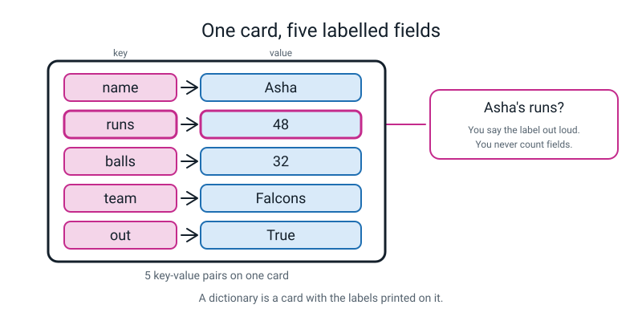
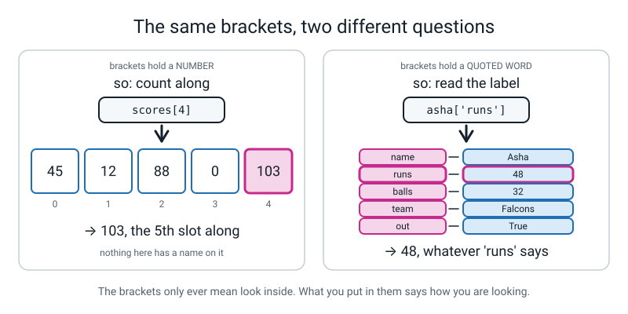
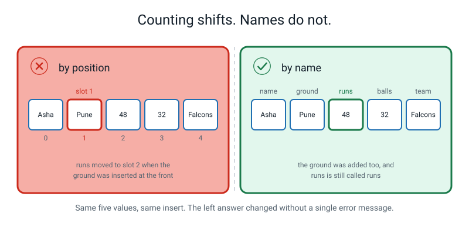
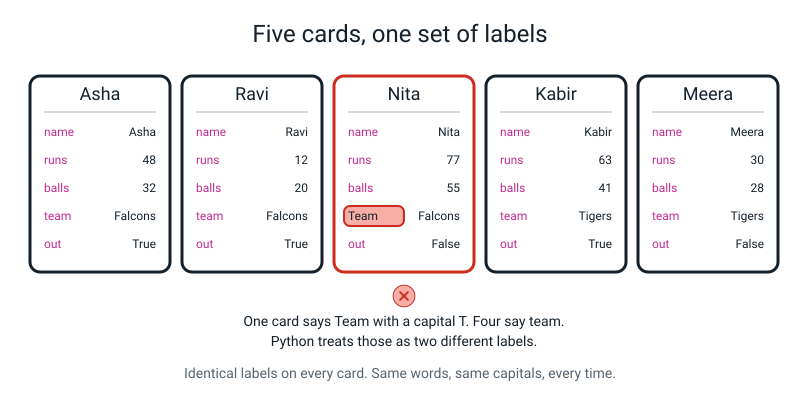
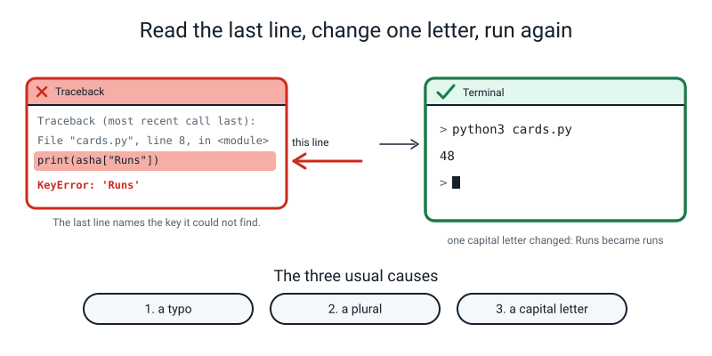
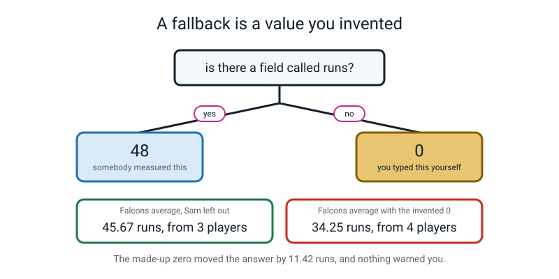
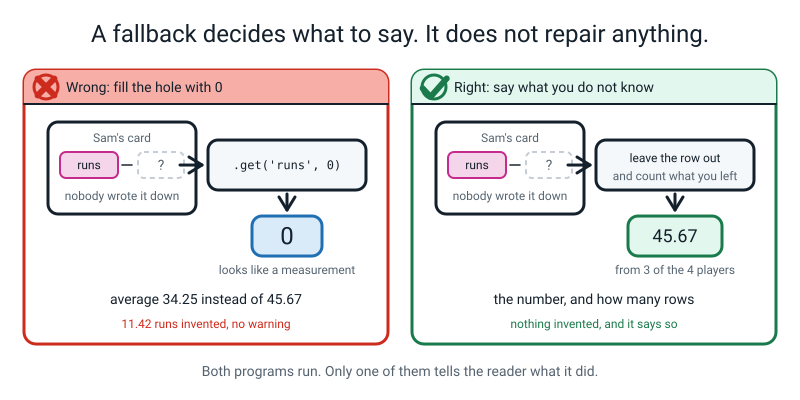
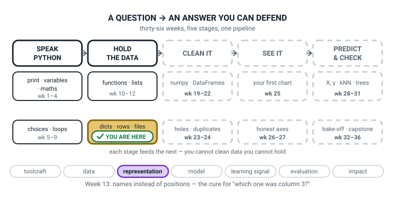
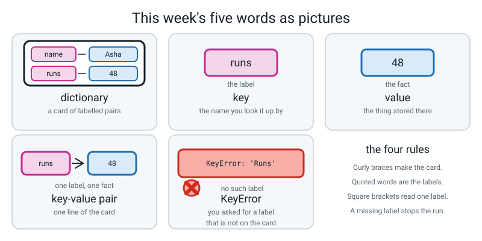

# Week 13 — Labels Instead of Numbers: Dictionaries

[⬅ Week 12](week-12.md) · [Course Home](../README.md) · [Next ➡](week-14.md) · [Workbook](../workbook/week-13.md)

---

> ### This week in one sentence
> **A dictionary looks things up by *name* instead of by *position*, which is exactly what you want the moment a thing has fields.**
>
> **By the end of this chapter you will be able to:**
> - Build a **dictionary** with five keys and read a value back out by naming its key
> - Add a new key and overwrite an existing one — and say why the two are the **same keystroke**
> - Use **`.get()`** with a fallback so that a missing key does not stop your program
> - Read a **`KeyError`** and name the three usual causes: a typo, a plural, a capital letter
> - Say when filling a missing number with `0` is a **quiet lie**
>
> **New syntax:** `{"key": value}` · `player["key"]` · `player["new"] = v` · `player.get("k", 0)`
>
> **Reading time:** about 30 minutes. **Homework:** about 60 minutes.

---

## 🪝 Start Here

This section shows a problem a list cannot solve, and the idea that solves it.

Last week you built a stats toolkit. Here is some of what you pointed it at:

```python
scores = [45, 12, 88, 0, 103, 7, 61, 34, 90, 22]
```

Your toolkit is good. It will tell you the total, the average, the biggest, the smallest and the middle.

So here is one more question for it. Look at the `103`.

Somebody scored a hundred and three. **Who?**

Look as long as you like. There is nothing to find.

You have not forgotten anything. **The list never knew.** When you typed `103`, the number went in, and everything else about it fell on the floor:

- Who it was.
- What day.
- Which ground.
- Whether they were out.

Ask a list of numbers anything about **numbers** and it is brilliant. Ask it anything about the **person** and it has nothing at all.

Take a blank index card and write one cricketer on it. Write five facts, with the label on the left and the fact on the right, like a form:

```text
name   Asha
runs   48
balls  32
team   Falcons
out    yes
```

Now — **what are Asha's runs?**

You said 48 instantly. You did **not** count to the second thing on the card. You looked for the word `runs` and read what was sitting next to it.

That is the whole lesson. Today you teach Python to do that.

The container that does it has an annoying name, because it has nothing to do with spelling. It is called a **dictionary**.


*Figure 13.1 — Five labelled fields on one card. The pink boxes are the labels you chose. The blue boxes are the data.*

---

## 🧠 The Big Idea

This section explains what a dictionary is and why it beats a list when a thing has fields.

> **📌 About the code in this section.** The blocks below are **illustrations, not files**. Each one carries on from the one above it, so the `import` lines and the data are typed once, in the first block that needs them. **The complete, runnable file is in 💻 Type This.** If you copy a block on its own and Python says `NameError`, that is why, and nothing is broken.

### 1. Numbered boxes last week. Labelled boxes this week.

**The plain explanation.** A list is a row of **numbered** boxes. Box 0, box 1, box 2. To get something out you count along: `scores[4]` is the fifth thing.

A dictionary is a set of **labelled** boxes. There is no box 0. There is a box called `"runs"` and a box called `"team"`, and you get things out by naming them.

> **dictionary** — a container that stores pairs. You give it a name (the **key**) and it hands you back the thing stored under that name (the **value**).
> **key** — the label you look something up by. In this course a key is always a word in quotes.
> **value** — the thing stored under that label. A number, a word, a `True`/`False` — anything.
> **key-value pair** — one label-and-fact couple. `"runs": 48` is one pair.

**The analogy.** A paper dictionary. When you look up *volcano* you do not count to word 4,912 — you go straight to the word. That is the only resemblance, and it is the important one: **you fetch by name.**

**How you write it.** Python uses **curly braces** — `{` and `}`. On most keyboards, hold Shift and press the two keys just to the right of the `P`. Find them now, before you need them.

Inside the braces you write the pairs: a label in quotes, then a **colon**, then the fact, then a **comma** before the next pair.

Type this into `cards.py` and run it. It builds one card and looks things up on it.

```python
# cards.py - one cricketer, stored as a dictionary

# Asha's whole innings, written on one card.
asha = {"name": "Asha", "runs": 48, "balls": 32, "team": "Falcons", "out": True}

print(asha)              # the whole card, all five labelled fields
print(asha["name"])      # look up ONE field by its label
print(asha["runs"])      # the label is "runs", not "the third one along"
print(len(asha))         # how many labelled fields are on the card
```

```text
{'name': 'Asha', 'runs': 48, 'balls': 32, 'team': 'Falcons', 'out': True}
Asha
48
5
```

Read line 4 out loud the way a person would: *"Asha's card. Under `name` is Asha, under `runs` is 48, under `balls` is 32, under `team` is Falcons, and under `out` is yes."*

**Four things to know about that output.**

1. **Python printed single quotes** even though you typed double ones. The two are interchangeable, and Python prefers singles when it talks back to you. Nothing has changed.
2. **The pairs came out in the order you typed them.** That is guaranteed and you can rely on it. A dictionary is **not** sorted alphabetically, despite the name.
3. **`asha["name"]` is a lookup.** Say it as English — *"in Asha, the name"* — not "Asha bracket name".
4. **`len(asha)` is 5, not 10.** `len` counts **pairs**, and a pair counts once, not twice.

**The quotes rule, which catches everybody once.** In this course the **keys always have quotes**, because keys are words used as labels. A **value** only has quotes when the value is itself text.

- `48` and `32` are numbers, so no quotes.
- `Falcons` is a word, so quotes.
- `True` is Python's own word for yes, so no quotes and a capital T.


*Figure 13.2 — Same square brackets. A number inside means count. A word in quotes means read the label.*

**One thing confuses everybody.** Compare these two lines:

```python
scores[2]        # give me slot number 2 of this LIST
asha["runs"]     # give me the value under the label "runs" in this DICTIONARY
```

**Same brackets, different question.** This sentence sorts it out:

> **The brackets mean "look inside this thing". What you put in the brackets says *how* you are looking — a number means count, a word in quotes means read the label.**

Two things to try for yourself:

- `scores["two"]` is meaningless. A list has no labels, so you get `TypeError: list indices must be integers or slices, not str`.
- `asha[0]` is meaningless *for this dictionary*. There is no label called `0`, so you get `KeyError: 0`.

How do you know which kind of container you have? **Look at how it was built.** Square brackets when it was made means a list. Curly braces with colons means a dictionary.

### 2. Why a name beats a position

**The plain explanation.** You might think: *why bother? I'll just remember that runs is the second thing.* That stops working, and it stops working **silently**.

Run this and compare the four lines it prints. It stores the same facts as a list and as a dictionary, then inserts a new field.

```python
# position.py - the same four facts, two ways.

# Four facts about Asha's innings, as a plain list.
asha_list = ["Asha", 48, 32, "Falcons"]
print("by position:", asha_list[1], "runs")     # slot 1 is the runs

# The same four facts, as a dictionary.
asha_dict = {"name": "Asha", "runs": 48, "balls": 32, "team": "Falcons"}
print("by name    :", asha_dict["runs"], "runs")

# Now the scorer decides to record the ground, and writes it in SECOND.
asha_list = ["Asha", "Pune", 48, 32, "Falcons"]
asha_dict = {"name": "Asha", "ground": "Pune", "runs": 48, "balls": 32, "team": "Falcons"}

print("by position, after the insert:", asha_list[1], "runs")   # WRONG, and silent
print("by name, after the insert    :", asha_dict["runs"], "runs")   # still right
```

```text
by position: 48 runs
by name    : 48 runs
by position, after the insert: Pune runs
by name, after the insert    : 48 runs
```

**Read the third line of output.** The program cheerfully reports **"Pune runs"**.

Nothing crashed. Nobody was warned.

Somebody added a field near the front. Every position after it shifted by one, so the program that counts to slot 1 now answers the wrong question.

**The analogy.** *"Third house on the left"* versus *"the house with the blue door"*. Both work — until somebody builds a new house at the end of the street. Then one of those directions is wrong and nobody tells you.

> **Counting shifts when the data changes shape. Labels do not.** That is the reason dictionaries exist.


*Figure 13.3 — The same five values and the same insert. On the left the answer changed and no error message appeared.*

### 3. Adding a key and changing a key are the same keystroke

**The plain explanation.** There is no `add` command and no `change` command. There is one thing you write, and Python decides which happened **by looking to see whether that key was already there.**

Run this block. It changes one field and adds another.

```python
asha = {"name": "Asha", "runs": 48, "balls": 32, "team": "Falcons", "out": True}

asha["runs"] = 51            # the key ALREADY exists -> this CHANGES the value
print(asha["runs"])
asha["ground"] = "Pune"      # the key is NEW -> this ADDS a sixth field
print(asha)
print(len(asha))
```

```text
51
{'name': 'Asha', 'runs': 51, 'balls': 32, 'team': 'Falcons', 'out': True, 'ground': 'Pune'}
6
```

If the key was there, the old value is **replaced and gone** — 48 is not hiding anywhere. If the key was not there, a new pair is created on the end, and `len` goes up by one.

**The analogy.** Writing on a card in pen. If the line already says `runs`, you cross out the number and write a new one. If there is no such line, you write a whole new line at the bottom. Same pen, same movement — the card decides which of the two happened.

**Here is the trap, and it is why capital letters matter so much this week.** Run this block too.

```python
asha = {"name": "Asha", "runs": 48, "balls": 32, "team": "Falcons", "out": True}

asha["Runs"] = 51            # capital R. Did this change her runs?
print(asha["runs"])          # what does the SMALL-r label say now?
print(asha)
print(len(asha))
```

```text
48
{'name': 'Asha', 'runs': 48, 'balls': 32, 'team': 'Falcons', 'out': True, 'Runs': 51}
6
```

**It did not fix Asha's runs.** It quietly gave her a **sixth** field called `Runs`, while `runs` still says 48. There is no error and no warning. The only clue is that `len` went from 5 to 6.

> **⚠️ Watch out:** a crash tells you where to look. This does not. Get in the habit of printing `len(card)` after you change a card — if the count went up when you expected it to stay put, you have just made a new field instead of changing an old one.

This is also why every card in a set has to use **exactly the same labels** — same words, same capitals, same spelling. One card with `Team` instead of `team` is a defect that travels with that card.


*Figure 13.4 — Five cards, one set of labels. The one in the middle has a capital T, and nothing will complain about it.*

### 4. `KeyError` — the crash of the week, and its three causes

**The plain explanation.** Ask a dictionary for a key it does not have and Python stops the program. This line, run on the card above, shows what that looks like.

```python
print(asha["Runs"])
```

```text
Traceback (most recent call last):
  File "cards.py", line 8, in <module>
    print(asha["Runs"])
          ~~~~^^^^^^^^
KeyError: 'Runs'
```

> **`KeyError`** — the error Python raises when you ask a dictionary for a key it does not have.

**Read it from the bottom up**, exactly as you have since Week 1.

1. **Last line first.** `KeyError: 'Runs'`. The word in quotes is **the key Python could not find**. Python is not being vague. It is naming the exact thing you asked for.
2. **Then the line number.** `line 8` — that is where you asked.
3. **Then the `~~~^^^` marks.** The `^` marks sit under the exact part of the line that failed. (If your Python is 3.10 or older those marks are missing. Nothing important is missing with them.)

**Three causes account for most of the `KeyError`s you will see while you are learning.** (The other cause is a key that was never on the card, like `catches` in the homework.) Say all three out loud:

| Cause | What it looks like | The real key |
|---|---|---|
| **A typo** | `asha["rusn"]` | `runs` |
| **A plural** | `asha["ball"]` or `asha["run"]` | `balls`, `runs` |
| **A capital letter** | `asha["Runs"]`, `asha["Name"]` | `runs`, `name` |

`Runs` and `runs` are two different labels as far as Python is concerned, in exactly the way that `Asha` and `asha` are two different words. There is no key called `Runs`, so there is nothing to hand you, so it stops.

**The analogy.** Handing the card to somebody and asking for *"Asha's Runs, capital R"*. The honest answer is *"there is no field called Runs on this card"* — which is precisely what `KeyError: 'Runs'` says, in five words instead of eleven.


*Figure 13.5 — The last line names the key it could not find. Nothing else in the traceback is as useful.*

### 5. `.get()` — asking politely, and the quiet lie

**The plain explanation.** Sometimes a missing key means your data is broken and you **want** the program to stop. Sometimes a missing key is normal and you already have a sensible answer ready. For the second case there is `.get()`.

Run this block. It asks for a missing key and a real key in four ways.

```python
# the card, fresh again, so this block runs on its own
asha = {"name": "Asha", "runs": 48, "balls": 32, "team": "Falcons", "out": True}

print(asha.get("catches", 0))    # the key is NOT there -> you get your fallback, 0
print(asha.get("catches"))       # no fallback given -> Python hands back None
print(asha.get("runs", 0))       # the key IS there -> you get the real value
print(asha["runs"])              # square brackets: the real value, or a crash
```

```text
0
None
48
48
```

`None` is Python's word for "nothing here". You met it in Week 10, when a function with no `return` handed back `None`.

| You write | Key is there | Key is missing |
|---|---|---|
| `asha["runs"]` | hands back the value | 💥 `KeyError`, the program stops |
| `asha.get("runs")` | hands back the value | hands back `None` |
| `asha.get("runs", 0)` | hands back the value | hands back `0` |

> **The rule of thumb:** use `["key"]` when a missing key means somebody has made a mistake and you want to hear about it loudly. Use `.get("key", something)` when a hole is expected **and you have an honest answer for it.**

**The analogy.** `["runs"]` is asking a question that has to be answered. `.get("runs", 0)` is asking a question and saying *"and if you don't know, write nought"*. Sometimes that is polite. Sometimes it is putting words in somebody's mouth.

**Now the part that is not about Python, and matters most.**

Sam batted. The scorer's pen died. Nobody wrote his runs down. So Sam's card has no `runs` field, and a program that says `sam.get("runs", 0)` will report that **Sam scored zero**.

Sam did not score zero. **Nobody knows what Sam scored.** Those are two different facts, and the fallback has quietly turned one into the other.

Run this block to see what that costs.

```python
# quiet_lie.py - what one invented zero costs.

# The four Falcons: Asha 48, Ravi 12, Nita 77, Sam ???
average_if_sam_scored_zero = (48 + 12 + 77 + 0) / 4    # we INVENTED a 0 for Sam
average_leaving_sam_out    = (48 + 12 + 77) / 3        # we said "we don't know"

print(f"Falcons average if Sam 'scored 0': {average_if_sam_scored_zero:.2f}")
print(f"Falcons average leaving Sam out  : {average_leaving_sam_out:.2f}")
print(f"The 0 we made up moved the answer by "
      f"{average_leaving_sam_out - average_if_sam_scored_zero:.2f} runs")
```

```text
Falcons average if Sam 'scored 0': 34.25
Falcons average leaving Sam out  : 45.67
The 0 we made up moved the answer by 11.42 runs
```

**Eleven and a half runs**, invented by one keystroke, with no error message anywhere. You met this exact idea in Level 1 as ***"out of how many?"*** — a number with no denominator is not an answer.

> **A fallback is fine when it is a fact. It is a lie when it is a guess wearing a fact's clothes.**
>
> - Missing `catches` for a player nobody watched in the field → `0` is *probably* honest, because a catch is a thing somebody would have noticed.
> - Missing `runs` because the pen died → `0` is a lie. Leave the row out, and **say how many rows you left out.**


*Figure 13.6 — The yes branch gives you something somebody measured. The no branch gives you something you typed.*

---

## 💻 Type This

This section has you build the program yourself, one step at a time. You write `cards.py`, then `scorecard.py`, in six steps. Two of the six are mistakes made **on purpose**.

### Step 1 — one card

New file, **Save As** `cards.py` in your course folder. Type exactly this:

```python
# cards.py - one cricketer, stored as a dictionary

# Asha's whole innings, written on one card.
asha = {"name": "Asha", "runs": 48, "balls": 32, "team": "Falcons", "out": True}

print(asha)
```

Say the punctuation to yourself as you go: *"curly brace… quote name quote… colon… quote Asha quote… comma…"* This takes about ninety seconds the first time. It gets faster.

**Predict before you run.** What comes out?

```text
{'name': 'Asha', 'runs': 48, 'balls': 32, 'team': 'Falcons', 'out': True}
```

Single quotes, and the pairs in the order you typed them.

### Step 2 — three lookups

Add these three lines under `print(asha)`:

```python
print(asha["name"])      # look up ONE field by its label
print(asha["runs"])      # the label is "runs", not "the third one along"
print(len(asha))         # how many labelled fields are on the card
```

**Predict all three answers out loud before you run.**

```text
{'name': 'Asha', 'runs': 48, 'balls': 32, 'team': 'Falcons', 'out': True}
Asha
48
5
```

- `asha["name"]` → `Asha`. One field, fetched by its label.
- `asha["runs"]` → `48`.
- `len(asha)` → `5`. Five **pairs**, not ten things.

### Step 3 — ⚠️ mistake number one, on purpose

Now type the runs lookup the way a person actually types it — with a capital R, because it is the name of a thing. Change that line to:

```python
print(asha["Runs"])
```

**Predict first.** Most people predict `48`. Go on, predict `48`.

```text
Traceback (most recent call last):
  File "cards.py", line 8, in <module>
    print(asha["Runs"])
          ~~~~^^^^^^^^
KeyError: 'Runs'
```

**An error, on purpose.** Read the last line: `KeyError: 'Runs'`.

Python is not saying "something went wrong". It is saying: **you asked me for a key called `Runs`, and there is no key called `Runs`.** And it is completely correct — look at your own line 4. You called it `runs`, small r.

Put the small r back. It prints `48`.

**Write the Bug Log entry now.** Use three columns: the message, what it meant in your own words, what one thing you changed. Something like: *`KeyError: 'Runs'` · I asked for a label that isn't on the card · changed R to r.*

Then answer the question out loud: **which of the three causes was that — a typo, a plural, or a capital letter?**

### Step 4 — ⚠️ mistake number two, on purpose

Now take the quotes off the label, so it reads `asha[runs]`.

```python
print(asha[runs])
```

```text
Traceback (most recent call last):
  File "cards.py", line 8, in <module>
    print(asha[runs])
               ^^^^
NameError: name 'runs' is not defined. Did you mean: 'round'?
```

**A different complaint.** `KeyError` meant *"that label isn't on the card"*. `NameError` means *"I have never heard of that word at all"*.

Without the quotes, Python did not think `runs` was a label. It thought it was a **variable** — a box with a name on it, like the boxes you made in Week 2 — and there is no box called `runs`. So it said so.

**The quotes are what turn a word into a label.** Take them off and Python goes looking for a box instead.

Python also guessed: *Did you mean 'round'?* It is trying to help and it is wrong. **Python's suggestions are guesses. Read them; don't obey them.**

Put the quotes back. `48`.

### Step 5 — add a key, change a key

Replace the lookups with these five lines.

```python
asha["runs"] = 51
print(asha["runs"])
asha["ground"] = "Pune"
print(asha)
print(len(asha))
```

**Predict first, and this is a good question:** two of those lines are written identically. One changes something and one adds something. Which is which, and how does Python know?

```text
51
{'name': 'Asha', 'runs': 51, 'balls': 32, 'team': 'Falcons', 'out': True, 'ground': 'Pune'}
6
```

`runs` already existed, so it changed. `ground` was new, so it was added. **Python decides by looking.**

### Step 6 — `.get()`

Add these two lines.

```python
print(asha.get("catches", 0))
print(asha.get("catches"))
```

**Predict first.** There is no `catches` on this card, and you have just seen that square brackets crash on a missing key. What will `.get` do?

```text
0
None
```

With a fallback you get the fallback. Without one you get `None`.

> **⚠️ Watch out:** `.get` did **not** fix anything. It decided what to say when the answer was missing. If the reason `catches` is missing is that you typed it wrong, `.get` will report zero catches every time and never mention it. **`.get` is a decision, not a repair.**

### The complete finished program

This program has five cards, one function that turns any card into a tidy line, and two `.get` calls. Save it as `scorecard.py` and run it.

```python
# scorecard.py - five cricketers, five labelled fields each

# Each card is one dictionary. Every card uses the SAME five keys.
asha  = {"name": "Asha",  "runs": 48, "balls": 32, "team": "Falcons", "out": True}
ravi  = {"name": "Ravi",  "runs": 12, "balls": 20, "team": "Falcons", "out": True}
nita  = {"name": "Nita",  "runs": 77, "balls": 55, "team": "Falcons", "out": False}
kabir = {"name": "Kabir", "runs": 63, "balls": 41, "team": "Tigers",  "out": True}
meera = {"name": "Meera", "runs": 30, "balls": 28, "team": "Tigers",  "out": False}


def card_line(player):
    """Turn one player dictionary into one tidy line of text."""
    strike_rate = player["runs"] / player["balls"] * 100   # runs per 100 balls
    return f"{player['name']:<6}{player['team']:<9}{player['runs']:>4} runs  SR {strike_rate:6.1f}"


print("=" * 44)
print(card_line(asha))
print(card_line(ravi))
print(card_line(nita))
print(card_line(kabir))
print(card_line(meera))
print("=" * 44)

# A field that nobody wrote on the cards.
print("Asha's catches:", asha.get("catches", 0))     # 0, and no crash
print("Asha's runs   :", asha.get("runs", 0))        # the real 48
```

```text
============================================
Asha  Falcons    48 runs  SR  150.0
Ravi  Falcons    12 runs  SR   60.0
Nita  Falcons    77 runs  SR  140.0
Kabir Tigers     63 runs  SR  153.7
Meera Tigers     30 runs  SR  107.1
============================================
Asha's catches: 0
Asha's runs   : 48
```

**Three things to know about that file.**

**1. `card_line` is a Week 10 function.** Nothing about it is new. What *is* new is that the thing you pass in is a **whole card, not one number** — one argument, five facts. That is the payoff of the week.

**2. The widths are Week 3's colon, used more fully.** `:<6` means *six characters wide, pushed left*. `:>4` means *four wide, pushed right*. **Left for words, right for numbers**, which is why the `48` and the `12` have their units sitting under each other. `:6.1f` means six wide with one decimal place — the same mini-language as `:.2f`.

**3. ⚠️ The quote juggling, which is the number one typo of the month.** The f-string is wrapped in **double** quotes, so inside the braces the key must use **single** quotes: `{player['name']}`. Get it the wrong way round and older Pythons stop with `SyntaxError: f-string: unmatched '['`.

Newer ones let it through, which is worse, because your file will then break on a different machine. **Single quotes inside, always.**

---

## 🔍 Worked Examples

This section shows the same ideas on three other things: a pizza order, a swimmer and a library loan.

### Worked Example 1 — One pizza order (food)

A card does not have to be a person. Anything with **fields** can be a dictionary. Run this block and read the output line by line.

```python
# pizza.py - one pizza order, on one card.

# One order. Five labelled fields, exactly like a paper order slip.
order = {"size": "large", "base": "thin", "toppings": 3, "price": 8.50, "delivered": False}

print(order)                                 # the whole slip
print("Size    :", order["size"])            # read one field by its label
print("Toppings:", order["toppings"])
print("Fields  :", len(order))               # how many labelled fields

# The kitchen adds a topping and the price goes up.
order["toppings"] = 4                        # the key EXISTS -> this changes it
order["price"] = 9.75                        # so does this one
order["driver"] = "Ravi"                     # the key is NEW -> this adds a field

print("After the change:", order)
print("Fields now      :", len(order))

# Nobody wrote down whether they wanted a dip.
print("Dips ordered:", order.get("dips", 0))       # a fallback we can defend
print("Price       :", order.get("price", 0))      # the real value, 9.75
```

```text
{'size': 'large', 'base': 'thin', 'toppings': 3, 'price': 8.5, 'delivered': False}
Size    : large
Toppings: 3
Fields  : 5
After the change: {'size': 'large', 'base': 'thin', 'toppings': 4, 'price': 9.75, 'delivered': False, 'driver': 'Ravi'}
Fields now      : 6
Dips ordered: 0
Price       : 9.75
```

**Two things to pause on.**

**Look at the first line of output: `'price': 8.5`.** You typed `8.50` and Python printed `8.5`. Nothing is wrong, because those are the same number.

A number does not remember how many zeros you typed after it. If you want two decimal places on the screen, that is a *printing* job: `f"{order['price']:.2f}"`.

**And the honest bit.** `order.get("dips", 0)` says *zero dips*. Is that a fact or a guess? Here it is defendable: nobody ticked the dip box, and a dip is a thing you order on purpose.

But it is still **an inference, not a measurement**, and if the till printed "0 dips" next to a real count from another order, you would not be able to tell the two apart.

### Worked Example 2 — One swimmer's race (sport)

This example works out a number from two fields, and has a missing field that is risky to fill in. Run it.

```python
# swim.py - one swimmer, one race, on one card.

race = {"swimmer": "Nadia", "stroke": "freestyle", "metres": 50, "seconds": 28.4, "lane": 4}

print("Swimmer :", race["swimmer"])
print("Event   :", race["metres"], "m", race["stroke"])
print("Time    :", race["seconds"], "seconds")

# A number nobody typed: metres per second, worked out from two fields.
speed = race["metres"] / race["seconds"]
print(f"Speed   : {speed:.2f} metres per second")

# The lane was recorded, so a lookup by label works.
print("Lane    :", race["lane"])

# Her personal best is not on this card at all.
print("Best with a 0 fallback:", race.get("personal_best", 0))
print("Best with no fallback :", race.get("personal_best"))
```

```text
Swimmer : Nadia
Event   : 50 m freestyle
Time    : 28.4 seconds
Speed   : 1.76 metres per second
Lane    : 4
Best with a 0 fallback: 0
Best with no fallback : None
```

**Check the arithmetic:** 50 ÷ 28.4 = 1.7605…, so `1.76` to two places. ✔

**And now the interesting one.** `race.get("personal_best", 0)` prints `0`. A personal best of **zero seconds** would mean Nadia swam fifty metres instantly. It is not merely unknown — **it is impossible**, and if it went into a table of times it would drag every average down and look exactly like a real measurement.

`None` at least says *"nothing here"* out loud. **When the fallback would be a value the real thing could never take, that is a strong signal the fallback is wrong.**

### Worked Example 3 — One library loan (school)

This example feeds a card's fields into a Week 6 chain, then **adds the answer back onto the card** so it travels with the row. Run it.

```python
# loan.py - one library loan, on one card.

loan = {"book": "Wolf Hollow", "borrower": "Iqbal", "days_out": 16, "renewed": True, "class": "7B"}

print("Book     :", loan["book"])
print("Borrower :", loan["borrower"])
print("Days out :", loan["days_out"])

# Week 6's chain, working on fields of a dictionary.
if loan["days_out"] >= 14:
    fine = 100
elif loan["days_out"] >= 7:
    fine = 40
elif loan["days_out"] >= 1:
    fine = 5
else:
    fine = 0

print("Fine     :", fine, "rupees")

# The librarian never recorded a reminder date.
print("Reminders sent:", loan.get("reminders", 0))
print("Fields        :", len(loan))

# Add the fine to the card so it travels with the loan.
loan["fine"] = fine
print("Fields now    :", len(loan))
print(loan)
```

```text
Book     : Wolf Hollow
Borrower : Iqbal
Days out : 16
Fine     : 100 rupees
Reminders sent: 0
Fields        : 5
Fields now    : 6
{'book': 'Wolf Hollow', 'borrower': 'Iqbal', 'days_out': 16, 'renewed': True, 'class': '7B', 'fine': 100}
```

**Three things to know.**

**The chain reads fields, not variables.** `loan["days_out"] >= 14` is exactly the Week 6 condition with a lookup where the variable used to be. Nothing about `if`/`elif` changed.

**`loan["fine"] = fine` puts the answer *on the card*.** That is worth doing, and it is a real habit: a number that lives in a variable is separate from the thing it describes, and the two can drift apart. A number that lives on the card cannot.

**And one uncomfortable question.** This card has a `borrower` and a `class` on it. **Which of these five fields would you be unhappy about emailing to a stranger?** That is Level 1's privacy work arriving in code — and it arrives the moment you start writing real fields about real people.

---

## 🐞 When It Breaks

This section shows the errors you are most likely to meet this week, what each one means and how to fix it. Every message below came from really running a broken version of this week's code. **Errors are how you learn to read, not evidence that you cannot.**

### Break 1 — a capital letter

Here is the broken version, and the message it gives.

```python
asha = {"name": "Asha", "runs": 48, "balls": 32, "team": "Falcons", "out": True}
print(asha["Runs"])
```

```text
Traceback (most recent call last):
  File "cards.py", line 8, in <module>
    print(asha["Runs"])
          ~~~~^^^^^^^^
KeyError: 'Runs'
```

**What Python is telling you.** *"You asked for a key called `Runs`. There is no key called `Runs`."* The word in quotes on the last line is the exact thing it went looking for.

**The fix.** Go back to the line where the dictionary was built and match the spelling **character for character**, out loud. `runs`.

**Which of the three causes?** A capital letter.

### Break 2 — the quotes came off

Here is the broken line, and the message it gives.

```python
print(asha[runs])
```

```text
Traceback (most recent call last):
  File "cards.py", line 8, in <module>
    print(asha[runs])
               ^^^^
NameError: name 'runs' is not defined. Did you mean: 'round'?
```

**What Python is telling you.** *"I have never heard of the word `runs`."* Without quotes, Python thought `runs` was a **variable** — a box with a name on it — and went looking for one. There isn't one.

**The fix.** `asha["runs"]`. The quotes are what turn a word into a label.

**And ignore the suggestion.** `round` is a guess and it is wrong. Python's *"did you mean"* lines are sometimes right and sometimes nonsense; read them, never obey them.

### Break 3 — a missing comma

Here is a file with one comma missing, and the message it gives.

```python
# cards.py - one cricketer, stored as a dictionary

asha = {"name": "Asha", "runs": 48 "balls": 32, "team": "Falcons", "out": True}

print(asha)
```

```text
  File "cards.py", line 3
    asha = {"name": "Asha", "runs": 48 "balls": 32, "team": "Falcons", "out": True}
                                    ^^^^^^^^^^
SyntaxError: invalid syntax. Perhaps you forgot a comma?
```

**What Python is telling you.** *"I could not even read this line."* A `SyntaxError` means nothing ran at all — not one line of the file.

**The fix.** One comma between every pair. **Five pairs needs four commas**, so count them.

Python's carets land on `48 "balls"`, not where the comma should have gone. They mark the point where Python realised something was wrong. That is normal for a `SyntaxError`, and it gives you a rule: **when a `SyntaxError` points at something that looks fine, look at the character just before it.**

### The whole clinic, for reference

Use this table to look up any message you see.

| What you see | What it means | The fix |
|---|---|---|
| `KeyError: 'Runs'` | "There is no key called `Runs`." | Match the spelling on the line where the dictionary was built. Capital letters count |
| `KeyError: 'ball'` | Same thing, different key | A plural. The key is `balls`. Scroll up and read the real key; do not guess |
| `KeyError: 0` | "There is no key called `0`." | You reached into a dictionary the way you reach into a list. Dictionaries have labels, not positions |
| `NameError: name 'runs' is not defined. Did you mean: 'round'?` | "I've never heard of the word `runs`." | The quotes came off. `asha["runs"]`. Ignore the suggestion |
| `TypeError: 'dict' object is not callable` | "You tried to **run** the dictionary like a function." | Round brackets instead of square: `asha("runs")`. Square brackets look inside; round brackets call |
| `SyntaxError: invalid syntax. Perhaps you forgot a comma?` | Python could not read the line at all | A missing comma between two pairs. Five pairs, four commas |
| `SyntaxError: cannot assign to literal here. Maybe you meant '==' instead of '='?` | Python could not read the line at all | An `=` where a `:` belongs: `{"name" = "Asha"}`. **Colons inside a dictionary, always** |
| `SyntaxError: ':' expected after dictionary key` | Same mistake, spotted a different way | Same fix: a colon between the key and the value |
| `TypeError: can only concatenate str (not "int") to str` | "You glued a number onto text with `+`." | `f"{asha['name']} scored {asha['runs']}"`, or `str(asha["runs"])`. Same error as Week 2's `"5" + 5` |
| `TypeError: unsupported operand type(s) for +: 'NoneType' and 'int'` | "You did arithmetic on a `None`." | `.get("catches")` with no fallback handed back `None`. Give it one: `.get("catches", 0)` |
| `SyntaxError: f-string: unmatched '['` | Python got lost inside your f-string | Double quotes inside a double-quoted f-string. Use singles: `f"{asha['runs']}"` |
| **No error, but a field appears twice with different capitals** | Nothing is wrong as far as Python is concerned | `asha["Runs"] = 51` made a **new** key. `print(asha)` and read the labels; `print(len(asha))` and see whether the count went up |

> **🐞 If there is no error message at all:** print the whole card and print its length. `print(card)` shows you every label you actually have, and `print(len(card))` tells you how many there are. A count that went up when you expected it to stay put is a new field you did not mean to make. Those two lines find nearly every silent dictionary bug there is.

---

## 🎲 What We Did In Class

This section is a record of the class, so you can follow it again or catch up.

### The hook, with one card

Ten cricket scores on the board and one question: **who scored the 103?** Nobody could say, and not because they had forgotten — the list never knew. Then one blank index card, five facts written on it as labels and facts, and the question *"what are Asha's runs?"* answered instantly, by reading a label rather than counting to a position.

### Three words, written up and left up

```text
key             the label you look something up by. Always a word in quotes.
value           the thing stored under that label.
key-value pair  one label-and-fact couple. "runs": 48 is one pair.
```

Then the card counted off: five labels, five facts, **five pairs**. Not ten.

### The curly braces, found on the actual keyboard

Shift and the two keys to the right of the `P`, located **before** anybody tried to type a dictionary. Then the line, dictated one character at a time:

```python
asha = {"name": "Asha", "runs": 48, "balls": 32, "team": "Falcons", "out": True}
```

and read back in English: *"Asha's card: under name is Asha, under runs is 48…"*

### The second card, with the ground written in second

A fresh card, the same player, but the ground recorded as the **second** line. Then the two questions:

- *"On this new card, what is the second thing?"* — the ground.
- *"What are Asha's runs?"* — still 48.

**Counting shifts. Labels don't.**

### `cards.py`, and two mistakes made on purpose

The capital-R `KeyError` first:

```text
KeyError: 'Runs'
```

read from the last line up, and then the question: **which of the three causes was it?**

Then the quotes taken off, which is a different complaint entirely:

```text
NameError: name 'runs' is not defined. Did you mean: 'round'?
```

`KeyError` = *that label isn't on the card*. `NameError` = *I've never heard of that word*. And Python's *"did you mean 'round'"* suggestion, which is a guess and is wrong.

### The silent one

`asha["Balls"] = 40`, with a capital B, run and then inspected:

```text
{'name': 'Asha', 'runs': 48, 'balls': 32, 'team': 'Falcons', 'out': True, 'Balls': 40}
6
```

**No error at all.** Six pairs instead of five, and two nearly identical labels. The question that followed: *"how would you ever have found that out?"*

### Five cards, and the drill

Five index cards, all with the same five labels in the same order:

| name | runs | balls | team | out |
|---|---|---|---|---|
| Asha | 48 | 32 | Falcons | yes |
| Ravi | 12 | 20 | Falcons | yes |
| Nita | 77 | 55 | Falcons | no |
| Kabir | 63 | 41 | Tigers | yes |
| Meera | 30 | 28 | Tigers | no |

Then, fast, out loud: *"Asha's runs."* 48. *"Kabir's team."* Tigers. *"Meera's balls."* 28. *"Ravi's **Runs**, capital R."* — **there is no such label on the card.** Which is `KeyError: 'Runs'`, in English.

Then all five typed as dictionaries in `scorecard.py`, printed as five aligned lines.

### The two Bug Log entries

1. `KeyError: 'Runs'` — I asked for a label that isn't on the card. The card says `runs`, small r. Changed the R to an r.
2. `NameError: name 'runs' is not defined` — I took the quotes off, so Python looked for a variable instead of a label. Put the quotes back.

### The last five minutes

The Falcons average, worked out twice — 34.25 with an invented zero for Sam, 45.67 leaving Sam out. **11.42 runs of pure invention, no warning.** And the sentence to carry: *"Falcons average 45.67 runs, from 3 of the 4 players — Sam's card had no runs on it."*

---

## 💬 Talk About It

These questions are for talking over with someone. Each has a hint to get you started.

**1. Why is it called a dictionary if it isn't in alphabetical order?**

*Hint:* think about what you **do** with a paper dictionary rather than how it is arranged. When you look up *volcano*, do you count? The alphabetical ordering is just how paper solves the problem of finding things; Python solves it another way and keeps your pairs in the order you typed them. Then the harder half: other languages call this same container a *map*, a *hash* or an *associative array*. All three are better names. Why do you think none of them caught on — and does a bad name make a thing harder to learn, or only harder to talk about?

**2. `asha["Runs"] = 51` gives you a wrong answer with no error message. Should Python have warned you?**

*Hint:* take a side and then argue against yourself. In favour: a card with `runs` **and** `Runs` on it is almost never what anybody meant, and Python could see that without knowing anything about cricket. Against: how would Python know? `first_name` and `First_Name` might genuinely be two different fields in somebody's program, and a warning that fires when you did mean it is a warning people learn to ignore. Then the sharpest question: **is a warning you have learned to ignore worse than no warning at all?**

**3. A player's card has no `runs` on it because the scorer's pen died. You write `.get("runs", 0)` and the program runs perfectly. What have you just told everybody?**

*Hint:* say it out loud as a sentence about a person — *"this player scored nothing"* — and then ask whether you know that. Work out what it does to the team average (you have both numbers: 34.25 and 45.67). Then the version that settles it for most people: **would you be happy if that were your test score?** And finally, the honest follow-up: `.get` is not banned. Name a missing field where `0` genuinely *is* the right answer, and say what makes that one different.

---

## ⚠️ Don't Get Tricked

This section lists four ideas that sound right and are wrong, each with the correct version beside it.

### Trick 1 — "`.get()` fixed the bug"


*Figure 13.7 — Both programs run. Only one of them tells the reader what it did.*

| ❌ Wrong | ✅ Right |
|---|---|
| "It was crashing, I used `.get()`, now it works." | `.get()` **never** fixes a bug. It stops the program complaining about one. If the key is missing because you typed `"Runs"`, then `.get("Runs", 0)` will report zero runs forever and never mention it. |

**`.get()` is a decision, not a repair.** The rule: only use it when you can say out loud *why* the key might be missing **and** why your fallback is honest. Otherwise use square brackets and let it crash.

### Trick 2 — "`asha[0]` gives me the first pair"

| ❌ Wrong | ✅ Right |
|---|---|
| `asha[0]` → the first pair, because that is how lists work. | `asha[0]` → `KeyError: 0`. A dictionary has **no** first, second or third. It has labels. The fix in your head is not "use the right number" — it is **"there are no numbers here."** |

This is a completely reasonable mistake, because lists worked that way six days ago. The card version settles it: **point at field zero on the card.** You can't. There are five labels.

### Trick 3 — "a dictionary sorts itself alphabetically"

| ❌ Wrong | ✅ Right |
|---|---|
| `print(asha)` will show `balls` first, because b comes before n. | It shows the pairs **in the order you typed them**: `name`, `runs`, `balls`, `team`, `out`. Nothing sorts them. The name "dictionary" is about looking things up by name, not about alphabetical order. |

### Trick 4 — "the same key twice means two pairs"

| ❌ Wrong | ✅ Right |
|---|---|
| `{"runs": 48, "runs": 51}` holds two pairs, so `len` is 2. | The later one wins and the earlier one **silently vanishes**. You get `{'runs': 51}`, one pair, and `len()` says `1`. No error. |

Run this block to see a card with a repeated key.

```python
card = {"runs": 48, "balls": 32, "runs": 51}
print(card)
print(len(card))
```

```text
{'runs': 51, 'balls': 32}
2
```

Three pairs typed, two pairs stored. **A dictionary cannot hold the same label twice** — which is exactly what you want from a card, and exactly the thing to remember when a count comes out one short.

---

## 🌍 Where You've Seen This

This section shows where dictionaries already appear in things you use.

1. **Every online form you have ever filled in.** Name, date of birth, class, email. The labels are the keys; what you type is the value. The form is a dictionary before it is anything else.
2. **A contact in your phone.** You do not ask for "the third field of Ravi". You ask for **Ravi's mobile number**, and if he has no work number the app shows a blank instead of falling over — which is `.get` with a fallback, done politely.
3. **Every settings screen on every device.** `brightness`, `volume`, `dark_mode`, `language`. Change one and the others are untouched, because you assigned to one key.
4. **A food delivery order.** Size, base, toppings, address, driver. Fields get **added** as the order moves along — exactly like `order["driver"] = "Ravi"`.
5. **A game's save file.** `level`, `coins`, `lives`, `checkpoint`. If a new version of the game adds a `pets` field, old save files do not have it — so the game reads it with a fallback, and that is why your old save still loads.
6. **Any website that talks to another website.** The messages they send each other are almost always labelled pairs, in a format called JSON that is a dictionary wearing a coat. When an app says *"something went wrong"*, a `KeyError` on a field that was not there is one of the commonest reasons.

---

## 🧭 Where This Fits

This section shows where this week sits on the course map and what it connects to.

Same pipeline, and the gold box has moved one step down: `dicts · rows · files`, weeks 13 to 18. It is
the longest tile in the whole map, because holding data properly takes six weeks — and this is the
first of them. Everything you do for the next month and a half happens inside that one box.



*Figure 13.0 — The pipeline in Week 13. The tile above is finished and white. The gold one has just
opened, and you will be standing in it until Week 18. Dashed still means not yet.*

| | |
|---|---|
| **The mental model you now own** | A dictionary looks a value up **by name** instead of by position, so your code says `player["score"]` and stops depending on the order you happened to type things in. |
| **The one question it answers** | *"Which one was column 3 again?"* — a question you now never have to ask, because every box has its label written on the outside. |
| **What it plugs into** | Week 11's list: the same idea of one container holding many things, with a completely different address system. Numbers there, names here. |
| **What carries forward** | Week 14 turns a list of these into a table. Week 21's `DataFrame` is this same idea scaled up to thousands of rows, with the labels written once along the top. |
| **Spiral thread** | 🏷️ **Representation**, on its own — one thread, because this whole week is a single decision about *how you write a thing down*, not about what you do with it afterwards. |

> **💡 Try this:** under the gold tile on your own copy of the map, write four words in pencil: **names,
> not positions.** That is the entire week, and you will be leaning on it in Week 21 when a real
> dataset arrives with forty columns you did not choose the order of.

---

## 🔑 Remember This

These are the points to keep from this week, followed by a syntax card to copy.

- **A dictionary looks things up by name, not by position.** Curly braces, a colon in every pair, a comma between pairs.
- **Keys always have quotes. Values have quotes only when the value is itself text.** `48` no, `Falcons` yes, `True` no.
- **`len(card)` counts pairs**, not labels-and-facts separately. Five pairs is 5.
- **Square brackets mean "look inside".** A number inside means count along; a word in quotes means read the label.
- **Adding a key and changing a key are the same keystroke.** Python decides by looking at whether the key was already there — which is why a capital letter makes a **new field** instead of fixing an old one, silently.
- **`KeyError` names the exact key it could not find.** Three usual causes: a typo, a plural, a capital letter.
- **`.get()` is a decision, not a repair.** Use it when you can say why the key might be missing and why your fallback is honest.
- **A fallback is fine when it is a fact and a lie when it is a guess.** An invented zero moved the Falcons' average by 11.42 runs, with no warning at all.

### Syntax reminder card

Keep this card next to you while you type.

```python
# BUILD one - curly braces, colons, commas
asha = {"name": "Asha", "runs": 48, "balls": 32, "team": "Falcons", "out": True}
#        └key┘  └value┘  ^ colon      ^ comma between pairs
#        keys ALWAYS in quotes; values in quotes only if they are text

# READ one field, by its label
print(asha["runs"])            # 48
print(len(asha))               # 5   <- number of PAIRS

# CHANGE and ADD are the same keystroke. Python decides by looking.
asha["runs"] = 51              # key exists  -> changes it, old value gone
asha["ground"] = "Pune"        # key is new  -> adds a sixth pair
asha["Runs"] = 51              # SILENT BUG  -> a NEW field, capital R

# ASK POLITELY - a missing key does not stop the program
print(asha.get("catches", 0))  # 0      <- your fallback
print(asha.get("catches"))     # None   <- no fallback given
print(asha["catches"])         # KeyError: 'catches'

# THE THREE USUAL CAUSES OF A KeyError
# asha["rusn"]   a typo
# asha["ball"]   a plural
# asha["Runs"]   a capital letter
```

---

## 📓 New Words

These are the five words this week introduced.


*Figure 13.8 — This week's five words, drawn.*

| Word | What it means | Example |
|---|---|---|
| **dictionary** | A container that stores labelled pairs. You fetch a value by naming its key | `{"runs": 48, "team": "Falcons"}` |
| **key** | The label you look something up by. Always a word in quotes in this course | `"runs"` in `asha["runs"]` |
| **value** | The thing stored under a key. A number, text, a `True`/`False` | `48` in `"runs": 48` |
| **key-value pair** | One label-and-fact couple inside a dictionary. `len` counts these | `"runs": 48` is one pair |
| **`KeyError`** | The error Python raises when you ask for a key the dictionary does not have | `KeyError: 'Runs'` |

---

## 📤 Your Homework

This section tells you what to do after class. Go to **[the Week 13 workbook](../workbook/week-13.md)**. It takes about **60 minutes** in total.

| Section | What to do | Time |
|---|---|---|
| **Warm-Up** | Five quick questions from Week 12 | 5 min |
| **Predict the Output** | Four snippets. Three of them produce **no error at all** | 10 min |
| **Practice A & B** | Six reading questions, then five you write yourself | 20 min |
| **Fix the Broken Program** | A snack order with three planted bugs — one syntax, one crash, one silent | 10 min |
| **Build It** | Five cards in code, one `KeyError` on purpose, two different fixes | 15 min |

**Three things I am marking hardest.**

**All five cards must use exactly the same five keys** — same words, same capitals, same order. Not four keys on one card and five on the rest. That rule matters next week.

**Cause a `KeyError` on purpose** and copy the **whole traceback** into your Bug Log by hand — all of it, not just the last line — and then write, in your own words, what Python was telling you and which of the three usual causes you used.

**Fix it two different ways.**

- Once with `.get()` and a fallback.
- Once by asking first, with a tool called `in` that you have not met yet. It is printed on the page, so copy it exactly. It gets its full explanation next Monday.

Then write **one sentence** on which of the two you would actually use, and why. There is no correct answer to that. There is a correct *reason*, and it has to be about what somebody **reading your output** would think happened.

> **💡 Try this:** make a dictionary with five keys for something that is **not** a cricketer, and do not tell anyone what it is. A pizza order. A bus route. A phone. Then hand them only the five labels and see whether they can guess. If they can, your keys are good ones.

---

[⬅ Week 12](week-12.md) · [Course Home](../README.md) · [Week 14 ➡](week-14.md) · [📓 Workbook — Week 13](../workbook/week-13.md) · [Glossary](../../glossary.md)
