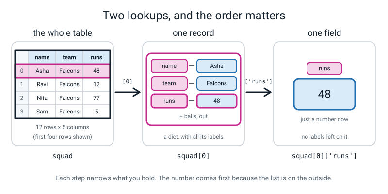
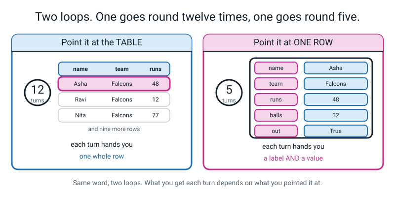
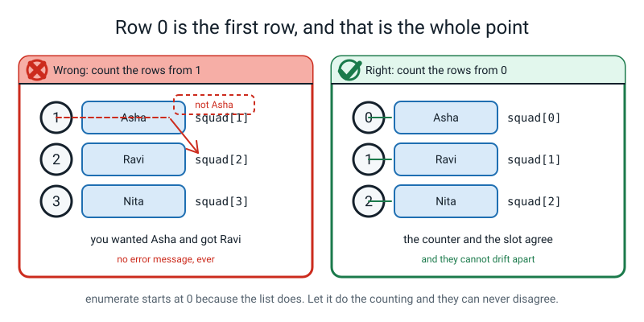
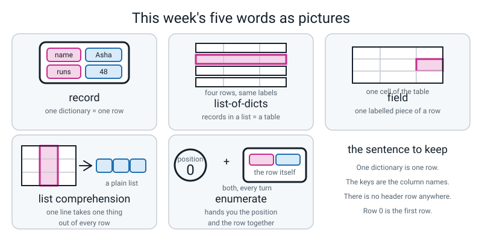

# Week 14 — One Dict Per Row: Your First Dataset in Code

[⬅ Week 13](week-13.md) · [Course Home](../README.md) · [Next ➡](week-15.md) · [Workbook](../workbook/week-14.md)

---

> ### This week in one sentence
> **A list of dictionaries *is* a table: one dict is a row, and the keys are the column names.**
>
> **By the end of this chapter you will be able to:**
> - Build a **list of dictionaries** and explain out loud why it is a table
> - Reach one cell with **two lookups, in the right order** — list index first, dictionary key second
> - Loop over the records and read the same field from each one
> - Test whether a key exists with **`in`** before reaching for it
> - Write a one-line **list comprehension** that pulls one column out as a plain list
> - Print an **aligned table with a row number** beside every row, using `enumerate()`
>
> **New syntax:** `player.items()` · `"age" in player` · `[r["score"] for r in rows]` · `enumerate(rows)` · `sum(numbers)` / `max(numbers)`
>
> **Reading time:** about 30 minutes. **Homework:** about 60 minutes.

---

## 🪝 Start Here

Get out the five index cards you wrote last week. Square them up into a neat **stack**, so only the top one can be read, and put the stack on the table in front of you.

Now, without touching it: **how many runs did Nita score?**

You can't tell. And the information has not gone anywhere — it is all right there, six millimetres down. It is that **a stack shows you one thing at a time.** To answer any question about all five players you would have to pick the pile up and go through it.

So now fan the cards out into a **column**, each one shifted down a couple of centimetres, so that all five sets of labels are visible one under another. Take your time. Line them up properly.

Look again.

**What just happened?** Nothing was written. Nothing was copied out. Some cardboard moved about six centimetres.

But look at what appeared. Every card's `name` is in a line. Every card's `runs` is in a line. Every card's `team` is in a line. **Five rows, five columns** — and the columns have names on them, and the names are the labels you wrote last week.

You spent half of last year on tables. Rows, columns, features, labels, and one rule I bet you can still say from memory: **one row is one thing.** One fruit per row. One student per row.

That rule is exactly why this works. **Every card describes exactly one player.** Five cards, five players, five rows. If one card had two players on it, the whole thing falls over.

So here is today. You already have the rows — you wrote them last week. What you do not have yet is a way to hold them all under **one name**, so you can ask a question about all twelve at once instead of naming every player by hand. And the container you need is one you already know: a **list**.


*Figure 14.1 — Nothing was converted. Some cardboard moved, and the columns appeared.*

---

## 🧠 The Big Idea

> **📌 About the code in this section.** The blocks below are **illustrations, not files**. They show you the shape of one idea, and each one carries on from the one above it — the `import` lines and the data are typed once, in the first block that needs them. **The complete, runnable file is in 💻 Type This.** If you copy a block from this section on its own and Python says `NameError`, that is why, and nothing is broken.

### 1. A list of dictionaries is a table, and there is no header row

**The plain explanation.** Last week you wrote five dictionaries with five separate names: `asha`, `ravi`, `nita`, `kabir`, `meera`. This week they all go **inside one list**. That is the entire change.

```python
# squad.py - cricketers, one dictionary per player

squad = [
    {"name": "Asha", "team": "Falcons", "runs": 48, "balls": 32, "out": True},
    {"name": "Ravi", "team": "Falcons", "runs": 12, "balls": 20, "out": True},
    {"name": "Nita", "team": "Falcons", "runs": 77, "balls": 55, "out": False},
]

print("rows   :", len(squad))
print("columns:", len(squad[0]))
print("row 0  :", squad[0])
print("one cell:", squad[0]["runs"])
```

```text
rows   : 3
columns: 5
row 0  : {'name': 'Asha', 'team': 'Falcons', 'runs': 48, 'balls': 32, 'out': True}
one cell: 48
```

**The outer `[` and `]` make a list** — the same brackets from Week 11. Nothing new about them. What is inside the list is three dictionaries, separated by commas, each one exactly what you typed last week. The comma after the **last** one is legal and it is a good habit: it means you can add a fourth row without editing the third line.

> **record** — one dictionary describing one thing. Same as one row of a table.
> **list-of-dicts** — a list whose items are all records using the same keys. Same as a table.
> **field** — one labelled piece of a record. Same as one cell. `"runs": 48` is a field.

**A note that will relieve you.** Python normally cares enormously about indentation — but **not inside brackets.** Once you have opened that `[`, you can spread the contents over as many lines as you like and line them up however you please. That is the only reason this reads like a table on screen.

**Two `len` calls, two different meanings.** This is worth being slow about.

- `len(squad)` → `3`. The number of **rows**.
- `len(squad[0])` → `5`. The number of **fields in the first record** — which, *if every record has the same keys*, is the number of **columns**.

Notice that "if". Three times five is fifteen facts, and `len` can only ever look at **one** record. Making sure all of them match is your job, not Python's.

**And now the question with the surprising answer: where is the header row?**

There isn't one. **There is no header row anywhere.** Every single record carries its own labels, so the column names are not stored once at the top — they are stored **once per row**.

Which is brilliant, because a row can never get separated from its labels. And it is also dangerous, because if one card says `Team` with a capital T, there is **no single header to go and correct.** That wrong label is stuck to that row and it travels with it.


*Figure 14.2 — There is no separate header row. The keys of every record are the column names, stored once per row.*

### 2. Two lookups, and the order matters

**The plain explanation.** To reach one cell you need **two** lookups, and this is the line everybody gets wrong once. Read it strictly left to right, like a sentence.

```
squad                 ->  the whole list  (the table)
squad[0]              ->  one record      (a dict)      {'name': 'Asha', ...}
squad[0]["runs"]      ->  one field       (a value)     48
```

Say it out loud as English: ***"the whole table — then row zero — then, in that row, the runs."*** Each step narrows what you are holding.

**The list index comes first because the list is the outer container.** You cannot ask for the runs until you are holding a card.

**The analogy.** A filing cabinet full of forms. You open the **drawer** first and pull out **one form**; only then can you read the box marked *runs*. Asking the cabinet for "the runs" gets you a blank look, because the cabinet has drawers, not boxes.

**So what happens if you do it the other way round?** Try it, and read the message:

```python
print(squad["runs"])
```

```text
Traceback (most recent call last):
  File "squad.py", line 13, in <module>
    print(squad["runs"])
          ~~~~~^^^^^^^^
TypeError: list indices must be integers or slices, not str
```

Take it apart. `list indices` — the things you put in brackets after a list. `must be integers` — must be whole numbers. `not str` — and you gave me text. So Python is saying: **you asked the list for a label, and lists don't do labels. Lists count.**

And notice **which** container it is complaining about. Not the dictionary — the **list**. `squad` is a list. Its items happen to be dictionaries, but `squad` itself has never heard of `runs`.

> **💡 Try this:** your idea was a good one. `squad["runs"]` is *exactly* what you want — give me the whole runs column. It does not work today. In Week 21 you will meet a container called a DataFrame where that line works perfectly, and **the reason DataFrames exist is that everybody wanted what you just tried to type.**


*Figure 14.3 — Each step narrows what you are holding: the table, then one record, then one value.*

### 3. Two loops, and they go round different numbers of times

**The plain explanation.** There are two completely different loops this week and mixing them up is the most disorienting bug you will write this month. They differ in **what you point them at**.

**Loop one — over the rows.** Point it at the list.

```python
for player in squad:
    print(f"{player['name']:<7}{player['runs']:>4} runs")
```

```text
Asha     48 runs
Ravi     12 runs
Nita     77 runs
```

That is Week 12's `for` loop, unchanged: it hands you one item at a time. What is new is that the item is a **whole dictionary**, so `player` is a card, and `player["runs"]` reads one field off whichever card is in your hand right now. **Three records, three turns.**

**Loop two — over the fields of one record.** Point it at `.items()` on one record.

```python
for field, value in squad[0].items():        # field is the key, value is the value
    print(f"  {field:<6} {value}")
```

```text
  name   Asha
  team   Falcons
  runs   48
  balls  32
  out    True
```

`.items()` hands you **both** the key and the value on each turn, which is why there are **two** names on the `for` line. **One record, five fields, five turns.**

**Say the difference out loud, because it is the whole of this section:**

- `for player in squad:` → once per **row**. Twelve turns on the full squad.
- `for field, value in squad[0].items():` → once per **field of one row**. Five turns.

`squad.items()` would be an error, because `squad` is a **list** and lists have no keys.


*Figure 14.4 — Same word, two loops. What you get each turn depends on what you pointed it at.*

**And a small tool that goes with all this: `in` asks whether a key exists.**

```python
print("runs in row 0?   ", "runs" in squad[0])
print("catches in row 0?", "catches" in squad[0])
print("Asha in row 0?   ", "Asha" in squad[0])
```

```text
runs in row 0?    True
catches in row 0? False
Asha in row 0?    False
```

**Look at the third one.** `False` for Asha — even though Asha is right there in the record. Because **`in` checks the KEYS, not the values.** `Asha` is a *value*, stored under the label `name`; there is no *label* called `Asha`.

That surprises almost everybody, and it is worth saying twice. If you want to know whether Asha is in there, you have to go and look at the values, and that is not what `in` does.

> **⚠️ Watch out:** `in` on a dictionary and `in` on a `for` line are two different uses of the same word. `for player in squad` is **not a question** — it is a loop. `"runs" in player` **is** a question, and it hands back `True` or `False`. English does the same thing: *"put it in the box"* versus *"is it in the box?"*, and nobody minds.

### 4. One column out, in one line

**The plain explanation.** You wanted a whole column half an hour ago and got a `TypeError`. Here it is, in one line.

```python
all_runs = [r["runs"] for r in squad]        # a list comprehension
print(all_runs)
print("total runs:", sum(all_runs))
print("highest   :", max(all_runs))
```

On the full twelve-record squad:

```text
[48, 12, 77, 5, 63, 30, 0, 41, 55, 22, 90, 104]
total runs: 547
highest   : 104
```

> **list comprehension** — a one-line way of building a new list by doing the same thing to every item of an old one.

**Read it in this order:**

```
[ r["runs"]        for r in squad ]
  └──── 3 ────┘    └───── 1,2 ────┘

1. for r in squad   ->  "go through the records one at a time, calling each one r"
2. (implicitly)     ->  "for each one..."
3. r["runs"]        ->  "...take this, and put it in the new list"
```

You saw this shape in Week 12 for numbers. All that is new is that the thing being taken out is a **field of a dict** rather than a number.

**The analogy.** A production line with one worker on it. Every card comes past; the worker copies one number off it onto a new sheet and lets the card go by. At the end you have a sheet of numbers — and no cards.

**And now the trade-off, which is a real idea and not a warning label.** The comprehension gives you back the whole of Week 12: `sum`, `max`, `min`, `sorted`, your entire stats toolkit, because it is a plain list of numbers again. But it **throws away every label.**

Look at `[48, 12, 77, 5, 63, 30, 0, 41, 55, 22, 90, 104]`. **Which one is Priya's 104?** You can tell because it happens to be last, but nothing in that list *says* so, and if it were sorted you would have no idea at all.

> **So pull a column out *late* — immediately before you do arithmetic on it, and not one line earlier.**


*Figure 14.5 — Pulling one column out gives you numbers you can add up, and loses every name.*

### 5. `enumerate()` — a position and a record, together

**The plain explanation.** You want a row number down the left of your table. You could keep a counter yourself. Don't — there is a tool whose entire job is to keep the number and the row in step.

```python
for position, player in enumerate(squad):
    print(position, player["name"])
```

```text
0 Asha
1 Ravi
2 Nita
```

> **`enumerate`** — wraps a list so that each turn round the loop gives you **two** things: the position, and the item at that position.

**Three facts to have ready.**

**1. It starts at 0**, because that is where list positions start. `squad[0]` is Asha, and `enumerate` calls Asha position 0. **They always agree** — and that agreement is the whole reason to use `enumerate` instead of counting yourself. The moment you count by hand, the number and the row can drift apart, and then you have a bug that only shows up on row seven.

**2. Two names on the `for` line**, in that order: **position first, item second.** One name gets you a bundle you cannot index by key — you will see that error in a moment.

**3. If you want the printed numbers to start at 1** for a human reader, write `enumerate(squad, start=1)`. That is a keyword argument from Week 10. But be clear what it does: it changes **the number printed**, not the position in the list. Row `1` is still `squad[0]`.

**The analogy.** A friend walking down the queue with you, calling out the position while you look at each person. They cannot get out of step with you, because they are walking beside you.


*Figure 14.6 — The counter and the row always agree, which is exactly why you let `enumerate` do the counting.*

---

## 💻 Type This

`squad.py`, in six passes. Two of them are mistakes made on purpose, and they turn out to be the **same** mistake in two different costumes.

### Step 1 — three records

New file, **Save As** `squad.py`. Type the three-record list. Say the punctuation as you go.

```python
# squad.py - cricketers, one dictionary per player

squad = [
    {"name": "Asha", "team": "Falcons", "runs": 48, "balls": 32, "out": True},
    {"name": "Ravi", "team": "Falcons", "runs": 12, "balls": 20, "out": True},
    {"name": "Nita", "team": "Falcons", "runs": 77, "balls": 55, "out": False},
]

print("rows   :", len(squad))
print("columns:", len(squad[0]))
print("row 0  :", squad[0])
print("one cell:", squad[0]["runs"])
```

Open square bracket, then Enter, then Tab. **Python usually goes mad about indentation, but not inside brackets** — you can line the records up however you like and it will not complain.

**Predict all four lines of output before you run.**

```text
rows   : 3
columns: 5
row 0  : {'name': 'Asha', 'team': 'Falcons', 'runs': 48, 'balls': 32, 'out': True}
one cell: 48
```

### Step 2 — ⚠️ mistake number one, on purpose

You want the whole runs column. That should be `squad["runs"]`, shouldn't it. Add that line at the bottom.

```python
print(squad["runs"])
```

```text
Traceback (most recent call last):
  File "squad.py", line 13, in <module>
    print(squad["runs"])
          ~~~~~^^^^^^^^
TypeError: list indices must be integers or slices, not str
```

**Oh good, an error.** Last line first: *"list indices must be integers or slices, not str"*.

You asked a **list** for a label. Lists count; they do not label. And your idea was right — hold on to it, because in about ten minutes you will get that column in one line.

Delete that line. Put in the version that works:

```python
print(squad[0]["runs"])
print(squad[1]["runs"])
print(squad[2]["runs"])
```

```text
48
12
77
```

That works, and it is **horrible.** Three lines for three players. Twelve players is twelve lines, and if you add a thirteenth you have to remember to add a line. What did you learn in Week 12 for exactly this feeling?

### Step 3 — the loop, with widths

```python
for player in squad:
    print(f"{player['name']:<7}{player['runs']:>4} runs")
```

```text
Asha     48 runs
Ravi     12 runs
Nita     77 runs
```

`:<7` means *put this in a space seven characters wide, pushed left*. `:>4` means *four wide, pushed right*. **Left for words, right for numbers** — which is why the `48` and the `12` have their units sitting under each other. It is the same colon you used in Week 3 for `:.2f`; you are just using a different part of it.

> **⚠️ Watch out:** the f-string uses **double** quotes, so inside the curly braces the key must use **single** quotes: `player['name']`. Get it the wrong way round and older Pythons stop dead. Newer ones let it through, which is worse — your file will then break on somebody else's computer.

### Step 4 — `.items()` and `in`

```python
for field, value in squad[0].items():
    print(f"  {field:<6} {value}")

print("runs in row 0?   ", "runs" in squad[0])
print("catches in row 0?", "catches" in squad[0])
print("Asha in row 0?   ", "Asha" in squad[0])
```

**Predict all three of the last lines. The third one is a trap** — Asha is definitely in that record.

```text
  name   Asha
  team   Falcons
  runs   48
  balls  32
  out    True
runs in row 0?    True
catches in row 0? False
Asha in row 0?    False
```

`False` for Asha, because **`in` checks the labels, not the facts.**

And look at the `for` line for `.items()`: **two** names, `field` and `value`, because `.items()` hands you both. Notice also **what it is looping over** — the five fields of **one** card, not the three rows.

### Step 5 — ⚠️ mistake number two, on purpose

You want a row number beside every row. There is a tool called `enumerate` that does the counting for you. Type this:

```python
for row in enumerate(squad):
    print(row["name"])
```

```text
Traceback (most recent call last):
  File "squad.py", line 20, in <module>
    print(row["name"])
          ~~~^^^^^^^^
TypeError: tuple indices must be integers or slices, not str
```

*"tuple indices must be integers."* **What is a tuple?** It is a little bundle of things — here, a bundle of two: the position, and the record. **`enumerate` does not hand you the record. It hands you a pair.**

And a pair, like a list, is **counted, not labelled.** So `row["name"]` fails for exactly the same reason `squad["runs"]` failed ten minutes ago.

> **Say it once and it will save you an hour this year:** `list indices must be integers` and `tuple indices must be integers` are **the same complaint.** You asked a counted thing for a label. Lists and pairs count. Only dictionaries label.

The fix is to catch the two things separately. **Two names on the `for` line:**

```python
for position, player in enumerate(squad):
    print(position, player["name"])
```

```text
0 Asha
1 Ravi
2 Nita
```

**Zero, one, two.** Not one, two, three. `enumerate` starts at 0 because `squad[0]` is Asha, and the number it gives you and the slot in the list **always agree.**

**Bug Log both errors now, while they are warm.** And log the *shape* they share as a third entry — noticing that two error messages are the same complaint is worth more than either fix.

### Step 6 — twelve records, and the aligned table

Now type the other nine records. Same five labels, same spelling, same order.

```python
# squad.py - twelve cricketers, one dictionary per player

# One dict = one row. The five keys = the five column names.
squad = [
    {"name": "Asha",  "team": "Falcons", "runs": 48,  "balls": 32, "out": True},
    {"name": "Ravi",  "team": "Falcons", "runs": 12,  "balls": 20, "out": True},
    {"name": "Nita",  "team": "Falcons", "runs": 77,  "balls": 55, "out": False},
    {"name": "Sam",   "team": "Falcons", "runs": 5,   "balls": 9,  "out": True},
    {"name": "Kabir", "team": "Tigers",  "runs": 63,  "balls": 41, "out": True},
    {"name": "Meera", "team": "Tigers",  "runs": 30,  "balls": 28, "out": False},
    {"name": "Dev",   "team": "Tigers",  "runs": 0,   "balls": 3,  "out": True},
    {"name": "Zara",  "team": "Tigers",  "runs": 41,  "balls": 39, "out": True},
    {"name": "Iqbal", "team": "Hawks",   "runs": 55,  "balls": 44, "out": True},
    {"name": "Lena",  "team": "Hawks",   "runs": 22,  "balls": 18, "out": True},
    {"name": "Omar",  "team": "Hawks",   "runs": 90,  "balls": 61, "out": False},
    {"name": "Priya", "team": "Owls",    "runs": 104, "balls": 70, "out": False},
]

print("rows   :", len(squad))         # 12 players  -> 12 rows
print("columns:", len(squad[0]))      # 5 keys      -> 5 columns
```

```text
rows   : 12
columns: 5
```

> **💡 Try this:** line the values up in columns **in the source code**, using extra spaces, exactly as above. Python does not care. But it makes a wrong entry visible from across the room, and it takes ten seconds. This is a real professional habit.

> **⚠️ Watch out:** print `len(squad)` **every single time you add rows.** It should say 12. If it says 11, two records got merged when a comma and a brace went missing during typing, and you will never spot that by reading. This one habit catches most silent data damage.

### The complete finished program

```python
FIELDS = ["name", "team", "runs", "balls", "out"]   # the column order we chose

# The header row. Same widths as the data rows below, or nothing lines up.
print(f"{'#':>2}  {'NAME':<7}{'TEAM':<9}{'RUNS':>5}{'BALLS':>6}  {'OUT':<5}")
print("-" * 38)

# enumerate hands you TWO things each turn: the position, and the record.
for position, player in enumerate(squad):
    print(f"{position:>2}  {player['name']:<7}{player['team']:<9}"
          f"{player['runs']:>5}{player['balls']:>6}  {player['out']}")

print("-" * 38)
print(f"{len(squad)} rows x {len(FIELDS)} columns")

all_runs = [r["runs"] for r in squad]        # a list comprehension
print(all_runs)
print("total runs:", sum(all_runs))
print("highest   :", max(all_runs))
```

```text
 #  NAME   TEAM      RUNS BALLS  OUT  
--------------------------------------
 0  Asha   Falcons     48    32  True
 1  Ravi   Falcons     12    20  True
 2  Nita   Falcons     77    55  False
 3  Sam    Falcons      5     9  True
 4  Kabir  Tigers      63    41  True
 5  Meera  Tigers      30    28  False
 6  Dev    Tigers       0     3  True
 7  Zara   Tigers      41    39  True
 8  Iqbal  Hawks       55    44  True
 9  Lena   Hawks       22    18  True
10  Omar   Hawks       90    61  False
11  Priya  Owls       104    70  False
--------------------------------------
12 rows x 5 columns
[48, 12, 77, 5, 63, 30, 0, 41, 55, 22, 90, 104]
total runs: 547
highest   : 104
```

**Three things to look at, because this is the moment the week pays off.**

**1. The header uses the same width numbers as the rows.** `:<7` above and `:<7` below. That is the whole trick, and it is the only reason the columns are straight. Change one of them and the table skews from that column rightwards.

**2. The `print` inside the loop is split over two lines.** Two f-strings written next to each other inside the same brackets get **glued together** into one string before printing. There is no comma between them — a comma would print a space and turn one column into two.

**3. The row numbers run 0 to 11, not 1 to 12.** Which row is Priya? **Row 11.** And `squad[11]` is? **Priya.** They agree. That agreement is the point of `enumerate`.

---

## 🔍 Worked Examples

### Worked Example 1 — Six dinners (food)

The same shape on your own data, with a whole column pulled out at the end.

```python
# dinners.py - six dinners, one dictionary per dinner.

# One dict = one dinner. The five keys = the five column names.
dinners = [
    {"dish": "Dal and rice",  "day": "Mon", "minutes": 35, "cost": 60,  "veg": True},
    {"dish": "Egg curry",     "day": "Tue", "minutes": 25, "cost": 80,  "veg": False},
    {"dish": "Poha",          "day": "Wed", "minutes": 15, "cost": 40,  "veg": True},
    {"dish": "Fish fry",      "day": "Thu", "minutes": 30, "cost": 150, "veg": False},
    {"dish": "Chole bhature", "day": "Fri", "minutes": 45, "cost": 95,  "veg": True},
    {"dish": "Leftovers",     "day": "Sat", "minutes": 5,  "cost": 0,   "veg": True},
]

print("rows   :", len(dinners))
print("columns:", len(dinners[0]))
print("row 3  :", dinners[3])
print("one cell:", dinners[3]["cost"])

# The header must use the SAME widths as the rows below it.
print()
print(f"{'#':>2}  {'DISH':<15}{'DAY':<5}{'MINS':>5}{'COST':>6}  {'VEG':<5}")
print("-" * 42)
for position, dinner in enumerate(dinners):
    print(f"{position:>2}  {dinner['dish']:<15}{dinner['day']:<5}"
          f"{dinner['minutes']:>5}{dinner['cost']:>6}  {dinner['veg']}")
print("-" * 42)

# One column out, then Week 12's toolkit works again.
all_costs = [d["cost"] for d in dinners]
print("cost column :", all_costs)
print("total spent :", sum(all_costs))
print("dearest     :", max(all_costs))
print(f"average     : {sum(all_costs) / len(all_costs):.2f}  (from {len(all_costs)} dinners)")
```

```text
rows   : 6
columns: 5
row 3  : {'dish': 'Fish fry', 'day': 'Thu', 'minutes': 30, 'cost': 150, 'veg': False}
one cell: 150

 #  DISH           DAY   MINS  COST  VEG  
------------------------------------------
 0  Dal and rice   Mon     35    60  True
 1  Egg curry      Tue     25    80  False
 2  Poha           Wed     15    40  True
 3  Fish fry       Thu     30   150  False
 4  Chole bhature  Fri     45    95  True
 5  Leftovers      Sat      5     0  True
------------------------------------------
cost column : [60, 80, 40, 150, 95, 0]
total spent : 425
dearest     : 150
average     : 70.83  (from 6 dinners)
```

**Check the arithmetic:** 60 + 80 = 140 · +40 = 180 · +150 = 330 · +95 = 425 · +0 = **425** ✔. And 425 ÷ 6 = 70.833… → `70.83`. ✔

**Two things to notice.** `DISH` needed `:<15`, not `:<7`, because *"Chole bhature"* is thirteen characters — **the width has to fit your longest value**, and picking it is a judgement you make by looking at your own data.

And the average was printed **with its row count**: `from 6 dinners`. That is not decoration. Hold on to it; next week the whole lab is built on it.

### Worked Example 2 — Six races (sport)

A decimal column, `.items()` on one record, and the `in` trap on real data.

```python
# races.py - six 100 metre races, one dictionary per race.

races = [
    {"runner": "Anika", "heat": 1, "seconds": 13.4, "place": 2, "pb": True},
    {"runner": "Rohit", "heat": 1, "seconds": 12.8, "place": 1, "pb": True},
    {"runner": "Meera", "heat": 1, "seconds": 14.9, "place": 3, "pb": False},
    {"runner": "Anika", "heat": 2, "seconds": 13.1, "place": 2, "pb": True},
    {"runner": "Rohit", "heat": 2, "seconds": 13.0, "place": 1, "pb": False},
    {"runner": "Meera", "heat": 2, "seconds": 14.2, "place": 3, "pb": True},
]

print("rows:", len(races), " columns:", len(races[0]))
print()

# Note :>7.1f on the times - a width AND one decimal place, because they are decimals.
print(f"{'#':>2}  {'RUNNER':<7}{'HEAT':>5}{'SECS':>7}{'PLACE':>6}  {'PB':<5}")
print("-" * 36)
for position, race in enumerate(races):
    print(f"{position:>2}  {race['runner']:<7}{race['heat']:>5}"
          f"{race['seconds']:>7.1f}{race['place']:>6}  {race['pb']}")
print("-" * 36)

# Walk ONE record field by field.
print()
print("Everything on row 3:")
for field, value in races[3].items():
    print(f"  {field:<8} {value}")

# Two questions about labels, not values.
print()
print('"seconds" in races[3]?', "seconds" in races[3])
print('"wind" in races[3]?   ', "wind" in races[3])
print('"Anika" in races[3]?  ', "Anika" in races[3])

# One column out, and the fastest time.
all_times = [r["seconds"] for r in races]
print()
print("times     :", all_times)
print("fastest   :", min(all_times))
print("slowest   :", max(all_times))
```

```text
rows: 6  columns: 5

 #  RUNNER  HEAT   SECS PLACE  PB   
------------------------------------
 0  Anika      1   13.4     2  True
 1  Rohit      1   12.8     1  True
 2  Meera      1   14.9     3  False
 3  Anika      2   13.1     2  True
 4  Rohit      2   13.0     1  False
 5  Meera      2   14.2     3  True
------------------------------------

Everything on row 3:
  runner   Anika
  heat     2
  seconds  13.1
  place    2
  pb       True

"seconds" in races[3]? True
"wind" in races[3]?    False
"Anika" in races[3]?   False

times     : [13.4, 12.8, 14.9, 13.1, 13.0, 14.2]
fastest   : 12.8
slowest   : 14.9
```

**Three things worth pausing on.**

**`:>7.1f` on the times, not `:>7`.** A plain `:>7` would print `13.0` as `13.0` but a value like `13` as `13`, and the column would go ragged the moment somebody's time is a whole number. **The `.1f` forces every value to show one decimal place**, which is what makes a decimal column line up.

**`"Anika" in races[3]` is `False`** — and Anika is the runner in row 3. `in` checks labels. `Anika` is a value.

**And notice something about this table that is not about Python at all.** Anika appears twice, and that is **correct**, because one row is one **race**, not one runner. If you tried to make one row per runner you would need two `seconds` fields on one card, and there is nowhere to put them. Level 1's *one row is one thing* is doing real work here, and the "thing" is a race.

### Worked Example 3 — Six pieces of homework (school)

A **sixth field added to every record**, which is Week 13's *add a key* applied twelve times over.

```python
# homework.py - six homework records, one dictionary per piece of work.

work = [
    {"subject": "Maths",   "day": "Mon", "marks": 17, "out_of": 20, "late": False},
    {"subject": "Science", "day": "Mon", "marks": 12, "out_of": 15, "late": True},
    {"subject": "English", "day": "Wed", "marks": 22, "out_of": 25, "late": False},
    {"subject": "Maths",   "day": "Thu", "marks": 9,  "out_of": 20, "late": True},
    {"subject": "History", "day": "Fri", "marks": 14, "out_of": 20, "late": False},
    {"subject": "Science", "day": "Fri", "marks": 15, "out_of": 15, "late": False},
]

print("rows:", len(work), " columns:", len(work[0]))
print("columns before:", len(work[0]))

# Add a SIXTH field to every record. Week 13's "add a key", done six times.
for piece in work:
    piece["percent"] = piece["marks"] / piece["out_of"] * 100

print("columns after :", len(work[0]))
print()

print(f"{'#':>2}  {'SUBJECT':<8}{'DAY':<5}{'MARKS':>6}{'OF':>4}{'PERCENT':>9}  {'LATE':<5}")
print("-" * 43)
for position, piece in enumerate(work, start=1):
    print(f"{position:>2}  {piece['subject']:<8}{piece['day']:<5}"
          f"{piece['marks']:>6}{piece['out_of']:>4}{piece['percent']:>8.1f}%  {piece['late']}")
print("-" * 43)

all_percents = [p["percent"] for p in work]
print("percent column:", [round(p, 1) for p in all_percents])
print(f"average percent: {sum(all_percents) / len(all_percents):.1f}%")
print("rows counted   :", len(all_percents), "of", len(work))
```

```text
rows: 6  columns: 5
columns before: 5
columns after : 6

 #  SUBJECT DAY   MARKS  OF  PERCENT  LATE 
-------------------------------------------
 1  Maths   Mon      17  20    85.0%  False
 2  Science Mon      12  15    80.0%  True
 3  English Wed      22  25    88.0%  False
 4  Maths   Thu       9  20    45.0%  True
 5  History Fri      14  20    70.0%  False
 6  Science Fri      15  15   100.0%  False
-------------------------------------------
percent column: [85.0, 80.0, 88.0, 45.0, 70.0, 100.0]
average percent: 78.0%
rows counted   : 6 of 6
```

**Check one by hand:** 17 ÷ 20 = 0.85, × 100 = **85.0%** ✔. And 9 ÷ 20 = **45.0%** ✔.

**Three things to notice.**

**`len(work[0])` went from 5 to 6.** The loop added a key to every record, so the table grew a **column**. One `=` inside a loop, one new column. That is how a computed column gets made, and it is exactly what Week 24 will do with pandas in one line.

**`enumerate(work, start=1)` numbers the rows 1 to 6** for a human reader. Row `1` is still `work[0]` — the printed number changed, the position did not.

**And the honest bit.** *"Average percent 78.0%, rows counted 6 of 6."* Those six pieces of work are not the same size — one is out of 15 and one is out of 25 — so averaging the percentages treats them as equally important, which is a **choice** somebody made and not a fact about the data. Printing `6 of 6` at least tells the reader how much is behind that number.

---

## 🐞 When It Breaks

Every message below came from really running a broken version of this week's code. **Two of this week's three errors are the same complaint in different clothes**, and spotting that is worth more than either fix.

### Break 1 — you asked a list for a label

```python
print(squad["runs"])
```

```text
Traceback (most recent call last):
  File "squad.py", line 13, in <module>
    print(squad["runs"])
          ~~~~~^^^^^^^^
TypeError: list indices must be integers or slices, not str
```

**What Python is telling you.** *"The things you put in brackets after a list have to be whole numbers, and you gave me text."*

**The fix.** Two lookups, in order: `squad[0]["runs"]`. The **list index first**, because the list is the outer container.

**And it is a good mistake.** The column version arrives in Week 21.

### Break 2 — you asked a pair for a label

```python
for row in enumerate(squad):
    print(row["name"])
```

```text
Traceback (most recent call last):
  File "squad.py", line 20, in <module>
    print(row["name"])
          ~~~^^^^^^^^
TypeError: tuple indices must be integers or slices, not str
```

**What Python is telling you.** *"You asked a bundle-of-two for a label."* `enumerate` hands you a **pair** — the position and the record — not the record.

**The fix.** **Two names on the `for` line:** `for position, player in enumerate(squad):`

**And here is the useful bit.** Curious what a pair actually looks like? Print it instead of indexing it:

```python
for row in enumerate(squad):
    print(row)
```

Twelve lines come out. Here are the first three:

```text
(0, {'name': 'Asha', 'team': 'Falcons', 'runs': 48, 'balls': 32, 'out': True})
(1, {'name': 'Ravi', 'team': 'Falcons', 'runs': 12, 'balls': 20, 'out': True})
(2, {'name': 'Nita', 'team': 'Falcons', 'runs': 77, 'balls': 55, 'out': False})
…nine more, one per record…
```

No error at all — and now you can **see** the bundle: round brackets, a number, a comma, a record. **When you do not understand what something is, print it.**

### Break 3 — you looped over one record instead of the list

```python
for player in squad[0]:
    print(player["name"])
```

```text
Traceback (most recent call last):
  File "squad.py", line 8, in <module>
    print(player["name"])
          ~~~~~~^^^^^^^^
TypeError: string indices must be integers, not 'str'
```

**What Python is telling you.** *"You asked a piece of text for a label."* And the mention of a string seems to come from nowhere, so walk it slowly:

- `squad[0]` is **one record**.
- Looping over a dictionary hands you its **keys**, one at a time.
- So on the first turn, `player` is the word `"name"` — a piece of text.
- And `"name"["name"]` is nonsense.

**The fix.** `for player in squad:` — **no index.** The mistake is one character, and the message is three steps away from it. **Always check what you are looping over.**

### The whole clinic, for reference

| What you see | What it means | The fix |
|---|---|---|
| `TypeError: list indices must be integers or slices, not str` | "You asked a **list** for a label." | `squad[0]["runs"]`. List index first, dict key second |
| `TypeError: tuple indices must be integers or slices, not str` | "You asked a **pair** for a label." | **Two** names: `for position, player in enumerate(squad):` |
| `TypeError: string indices must be integers, not 'str'` | "You asked a piece of **text** for a label." | You looped over `squad[0]` instead of `squad`. Drop the index |
| `KeyError: 'team'` **after some rows printed** | "Row *n* has no key called `team`." | **Count the rows that printed** — that is the row number that broke. Go to that record and compare its keys with the one above |
| `KeyError: 'runs'` pointing at a line inside `[...]` | Same thing, inside a comprehension | Fix the record. Or `[r.get("runs", 0) for r in squad]` — and then say out loud what that zero claims |
| `IndexError: list index out of range` | "There is no row with that number." | Twelve rows are numbered **0 to 11**. `squad[11]` is the last one, or `squad[-1]` from Week 11 |
| `SyntaxError: invalid syntax. Perhaps you forgot a comma?` | Python could not read the list at all | A missing comma between two records. Twelve records need eleven commas. Python points at the record that is **missing** its comma (the one just before the one you were looking at), not at the gap |
| `SyntaxError: f-string: unmatched '['` | Python got lost inside your f-string | Double quotes inside a double-quoted f-string. Use singles: `f"{player['name']}"` |
| `ValueError: Unknown format code 'f' for object of type 'str'` | "You asked me to print a word as a decimal number." | `.1f` is for numbers only. Words get `:<7` or `:>7` and nothing else |
| **No error, but the columns are crooked** | Nothing is wrong as far as Python is concerned | Header widths do not match row widths. Put the two f-strings one above the other and compare the numbers character by character |
| **No error, but the table has 11 rows** | Nothing is wrong as far as Python is concerned | Two records merged when a comma and a brace went missing. **Print `len(squad)` every time you add rows** |

> **🐞 If a `KeyError` stops a loop halfway:** ask *"how many lines printed before it stopped?"* Four rows printed means **row 4** is the broken one (counting from 0). The half-finished output is not wreckage — **it is a clue**, and almost no beginner discovers that on their own.

---

## 🎲 What We Did In Class

### The stack, then the fan

Five cards from last week, squared into a stack, and the question *"how many runs did Nita score?"* with no touching allowed. Nobody could say. Then the cards fanned into a column, in silence, and the labels lined up down the page.

**Nothing was written. Some cardboard moved. The columns appeared.**

Then the Level 1 rule, said out loud: **one row is one thing.** Every card describes exactly one player, and that is why the fan works.

### Three words, written up and left up

```
record          one dictionary describing one thing. One row.
field           one labelled piece of a record. One cell.
list-of-dicts   a list whose items are all records with the same keys. A table.
```

### Where is the header row?

There isn't one. **Every record carries its own labels**, so the column names are stored twelve times, once per row. Which means a row can never lose its labels — and also that one card with a capital `Team` cannot be corrected in a single place.

### Two brackets, in order

Written on the board and left there all lesson:

```
squad                 ->  the whole list  (the table)
squad[0]              ->  one record      (a dict)
squad[0]["runs"]      ->  one field       (48)
```

Then two `len` calls compared: `len(squad)` is rows, `len(squad[0])` is columns — *if* every record matches, which `len` cannot check.

### `squad.py`, and two mistakes made on purpose

`squad["runs"]` first:

```text
TypeError: list indices must be integers or slices, not str
```

Then `for row in enumerate(squad)` with one name:

```text
TypeError: tuple indices must be integers or slices, not str
```

And the sentence that ties them together: **"you asked a counted thing for a label. Lists and pairs count. Only dictionaries label."**

### The `in` trap

```text
runs in row 0?    True
catches in row 0? False
Asha in row 0?    False
```

Everyone predicted `True` for Asha. `in` checks **labels**, not facts.

### Twelve rows, numbered

The other nine records typed, `len(squad)` checked after each batch, and then the header row and the aligned table:

```text
 #  NAME   TEAM      RUNS BALLS  OUT  
--------------------------------------
 0  Asha   Falcons     48    32  True
 1  Ravi   Falcons     12    20  True
 2  Nita   Falcons     77    55  False
 3  Sam    Falcons      5     9  True
 4  Kabir  Tigers      63    41  True
 5  Meera  Tigers      30    28  False
 6  Dev    Tigers       0     3  True
 7  Zara   Tigers      41    39  True
 8  Iqbal  Hawks       55    44  True
 9  Lena   Hawks       22    18  True
10  Omar   Hawks       90    61  False
11  Priya  Owls       104    70  False
--------------------------------------
12 rows x 5 columns
```

Then: *"which row is Priya?"* Row 11. *"And `squad[11]` is?"* Priya. **They agree.**

### One column out, in one line

```text
[48, 12, 77, 5, 63, 30, 0, 41, 55, 22, 90, 104]
total runs: 547
highest   : 104
```

And the question that followed: **which of those numbers is Priya's 104?** You cannot tell from the list. That is what pulling a column out costs.

### The three Bug Log entries

1. `TypeError: list indices must be integers` — I asked the list for a label. Used `squad[0]["runs"]`.
2. `TypeError: tuple indices must be integers` — `enumerate` gave me a pair, not a record. Put two names on the `for` line.
3. **Both of those are the same complaint.** A counted thing was asked for a label.

---

## 💬 Talk About It

**1. There is no header row. Is that a good design or a bad one?**

*Hint:* list what it buys you first. A row can never get separated from its column names, you can shuffle the rows and lose nothing, and you can hand one record to somebody and it still makes sense on its own. Then list what it costs: the five labels are stored twelve times instead of once, so a typo in one of them cannot be fixed in a single place, and there is nothing anywhere that says *"these are the five columns"* — only twelve records that happen to agree. Then the sharpest question: **who is supposed to notice when they stop agreeing?**

**2. `squad["runs"]` is the thing you actually wanted, and it does not work. Why is that interesting rather than annoying?**

*Hint:* it is not a gap somebody forgot to fill. A plain list genuinely does not know anything about columns — only the dictionaries inside it know about labels, and the list has never looked inside them. So getting a column has to mean *going through the rows and taking one field from each*, which is exactly what the comprehension does. Then: pandas, in Week 21, makes `df["runs"]` work. **What must a DataFrame be storing that a list-of-dicts is not?** (Have a guess before Week 21. Guessing and being wrong is how the answer sticks.)

**3. One row is one thing. So what is "one thing" in your own dataset?**

*Hint:* try the *"and" test* on your sentence. If what one row represents needs the word **and** in it — *"a song and how many times I played it"* — you probably have two things in one row. Then try the harder version: in the races table, Anika appears twice. Is that a mistake? (No — one row is one **race**, and she ran two.) Now say what would have to change if you wanted one row per **runner** instead. **Where would the second time go?**

---

## ⚠️ Don't Get Tricked

### Trick 1 — "`enumerate` numbers my rows, so row 1 is the first row"


*Figure 14.7 — Left: counting from 1 puts the number out of step with the list, silently. Right: `enumerate` starts at 0 and they agree.*

| ❌ Wrong | ✅ Right |
|---|---|
| "The first row is row 1, so `squad[1]` is Asha." | **Row 0 is the first row.** `squad[0]` is Asha, and `enumerate` calls Asha 0 — so the counter and the slot **always agree**. `squad[1]` is Ravi, and nothing will warn you. |

Every off-by-one bug in the next twenty weeks lives here. If you want the *printed* numbers to start at 1, use `enumerate(squad, start=1)` — but be clear that it changed **the number printed**, not the position in the list.

### Trick 2 — "`in` tells me whether Asha is in the record"

| ❌ Wrong | ✅ Right |
|---|---|
| `"Asha" in squad[0]` → `True`, because Asha is obviously in there. | `False`. **`in` checks the KEYS, not the values.** `Asha` is a value stored under the label `name`; there is no *label* called `Asha`. |

### Trick 3 — "`squad[0]["runs"]` and `squad["runs"][0]` are the same thing"

| ❌ Wrong | ✅ Right |
|---|---|
| "Both of them get row 0's runs — brackets are brackets." | `squad["runs"][0]` fails immediately with `TypeError: list indices must be integers`. **The list is the outer container, so its index comes first.** You cannot read a field until you are holding a record. |

### Trick 4 — "if the table prints, the data is fine"

| ❌ Wrong | ✅ Right |
|---|---|
| "It ran and the columns are straight, so my twelve records are correct." | The table only shows what you **asked** it to show. One record with `Team` instead of `team` will print perfectly if you never print the team column — and `len(squad[0])` still says 5, because the count is right and only the **label** is wrong. |

Two lines find it. Put this in a loop for one run and read the output:

```python
for position, player in enumerate(squad):
    print(position, len(player), "team" in player)
```

On a squad where row 2 has `Team` and row 3 is missing `balls`:

```text
0 5 True
1 5 True
2 5 False
3 4 True
```

**Row 2's `False` is the capital letter. Row 3's `4` is the missing field.** Neither of them crashed anything, and neither would ever have appeared in a printed table.

---

## 🌍 Where You've Seen This

1. **Every spreadsheet you have ever opened.** A header row and then one thing per row. What you built today is the same object with the labels written twelve times instead of once.
2. **Your music app's library.** One record per song: title, artist, album, length, play count. Sorting by artist moves **whole rows**, which is why the lengths do not get scrambled.
3. **A class register.** One row per pupil, one column per thing you record about them. And the rule that makes it work is Level 1's: one row is one pupil, and a pupil who moves class is a change to a row, not a new row.
4. **A messaging app's chat list.** One record per conversation — name, last message, time, unread count. New fields get added as the app updates, which is why an old version sometimes shows a blank where a new one shows a badge.
5. **Any website with a table you can sort by clicking a column heading.** That click hands the table a **key function** telling it which field to look at — which is literally next week's lesson.
6. **The data behind every model in this course from Week 28 onwards.** `X` and `y`, the things you feed a classifier, are this shape or a repackaging of it. **You are not learning a container this week. You are learning what a dataset is.**

---

## 🧭 Where This Fits

The gold box has not moved this week, and that is the point — you are still inside
`dicts · rows · files`. Last week you built one labelled card. This week twelve of them line up in a
list and turn into something that has a name: a **table**.


*Figure 14.0 — The pipeline in Week 14. Same gold tile as last week, filling up. Notice that CLEAN IT
is still dashed, and read the line in the middle of the picture: you cannot clean data you cannot hold.*

| | |
|---|---|
| **The mental model you now own** | A **list of dictionaries is a table**: one dict is one row, the shared keys are the column names, and a one-line comprehension pulls any single column back out of it. |
| **The one question it answers** | *"Where does my dataset actually live inside the program?"* — in one list, with one dict per row, and nothing else. |
| **What it plugs into** | Weeks 11 and 13 together at last. The list gives you rows in order; the dictionary gives every field in a row a name you can say out loud. |
| **What carries forward** | Week 15 filters and groups these rows. Week 16 writes them out to a file. Week 21 hands this very same table to `pandas` without changing its shape at all. |
| **Spiral thread** | 📊 **Data** — this is your first real dataset — and 🏷️ **Representation**, because *one dict per row* is a choice about shape that every later week depends on. |

> **💡 Try this:** count the rows in your squad out loud — "twelve rows, five columns" — and write those
> two numbers under the gold tile on your own map. In Week 17 a computer starts telling you the same two
> numbers automatically, and calls them the **shape**.

---

## 🔑 Remember This

- **A list of dictionaries is a table.** One dict is a row; the keys are the column names. Nothing was converted — it just *is* one.
- **There is no header row.** Every record carries its own labels, once per row. That is why a row never loses its column names, and why one wrong label cannot be fixed in one place.
- **Two lookups, in order.** `squad[0]["runs"]` — list index first, dictionary key second. Read it as *"the table, then row 0, then the runs."*
- **`len(squad)` is rows. `len(squad[0])` is columns** — but only if every record has the same keys, and checking that is your job.
- **`list indices must be integers` and `tuple indices must be integers` are the same complaint.** You asked a counted thing for a label. Lists and pairs count; only dictionaries label.
- **`in` checks the keys, not the values.** `"Asha" in squad[0]` is `False`.
- **A comprehension pulls a column out and throws every label away.** Do it late, immediately before the arithmetic.
- **`enumerate` starts at 0 so that the counter and the slot always agree.** Row 0 is the first row.
- **The header must use the same widths as the rows**, or nothing lines up.

### Syntax reminder card

```python
# A TABLE: one dict per row, all with the same keys
squad = [
    {"name": "Asha", "team": "Falcons", "runs": 48},
    {"name": "Ravi", "team": "Falcons", "runs": 12},
]                                    # <- trailing comma after the last record is fine

print(len(squad))          # 2   <- ROWS
print(len(squad[0]))       # 3   <- COLUMNS (if every record matches)

# ONE CELL: two lookups, list index FIRST
print(squad[0]["runs"])    # 48
# print(squad["runs"])     # TypeError: list indices must be integers

# LOOP OVER THE ROWS - once per record
for player in squad:
    print(f"{player['name']:<7}{player['runs']:>4}")   # left for words, right for numbers

# LOOP OVER THE FIELDS OF ONE ROW - once per field, TWO names on the for line
for field, value in squad[0].items():
    print(field, value)

# DOES THIS ROW HAVE THAT LABEL?  (keys, never values)
print("runs" in squad[0])        # True
print("Asha" in squad[0])        # False  <- Asha is a VALUE

# ONE COLUMN OUT, as a plain list - and every label is gone
all_runs = [r["runs"] for r in squad]
print(sum(all_runs), max(all_runs))

# A POSITION AND A RECORD, TOGETHER - two names, starts at 0
for position, player in enumerate(squad):
    print(position, player["name"])          # 0 Asha / 1 Ravi
for position, player in enumerate(squad, start=1):
    print(position, player["name"])          # 1 Asha / 2 Ravi  <- printed number only
```

---

## 📓 New Words


*Figure 14.8 — This week's five words, drawn.*

| Word | What it means | Example |
|---|---|---|
| **record** | One dictionary describing one thing. Same as one row of a table | `{"name": "Asha", "runs": 48}` |
| **list-of-dicts** | A list whose items are all records using the same keys. Same as a table | `squad` with its twelve records |
| **field** | One labelled piece of a record. Same as one cell | `"runs": 48` is a field |
| **list comprehension** | A one-line way of building a new list by doing the same thing to every item of an old one | `[r["runs"] for r in squad]` |
| **`enumerate`** | Wraps a list so each turn of the loop gives you two things: the position and the item | `for position, player in enumerate(squad):` |

---

## 📤 Your Homework

Go to **[the Week 14 workbook](../workbook/week-14.md)**. About **60 minutes** in total.

| Section | What to do | Time |
|---|---|---|
| **Warm-Up** | Five quick questions from Week 13 | 5 min |
| **Predict the Output** | Four snippets. One of them looks like it must crash and does not | 10 min |
| **Practice A & B** | Six reading questions, then five you write yourself | 20 min |
| **Fix the Broken Program** | A club roster with three planted bugs — one syntax, one crash, one silent | 10 min |
| **Build It** | Twelve records of your own, printed as a numbered table | 15 min |

**Three things I am marking hardest.**

**Twelve records, five keys, every key spelled identically.** And two of the rules matter more than they look: **at least two of your five keys must hold numbers**, and **one must be a repeating category** — something like genre, or team, or day-of-the-week, where the same handful of values come round again. Three to five different values in that column, **and make one of them appear only once.** I am not telling you why yet.

**The table has to line up.** Same widths in the header as in the rows. And if it comes out crooked — **leave it crooked and bring it in**, because how you found the mismatch is more interesting than a straight table.

**One sentence: what does one row of your table represent?** Not "songs". Something like *"one song in my playlist"* or *"one journey to school on one day"*. **If your sentence has the word "and" in it, you have probably got two things in one row** — and that is exactly the mistake I want you to catch tonight, rather than in Week 34 with a deadline.

> **💡 Try this:** print your table twice — once with the names on the **left** (`:<12`) and once with them on the **right** (`:>12`). Look at both. Then write one sentence on which is easier to read and why. There is a real answer, and it is about where your eye goes to find the start of a word.

---

[⬅ Week 13](week-13.md) · [Course Home](../README.md) · [Week 15 ➡](week-15.md) · [📓 Workbook — Week 14](../workbook/week-14.md) · [Glossary](../../glossary.md)
