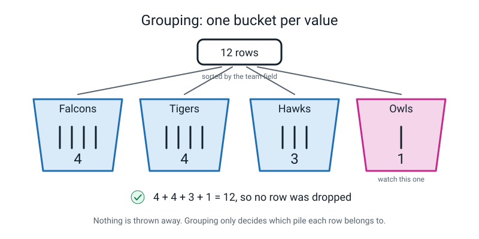
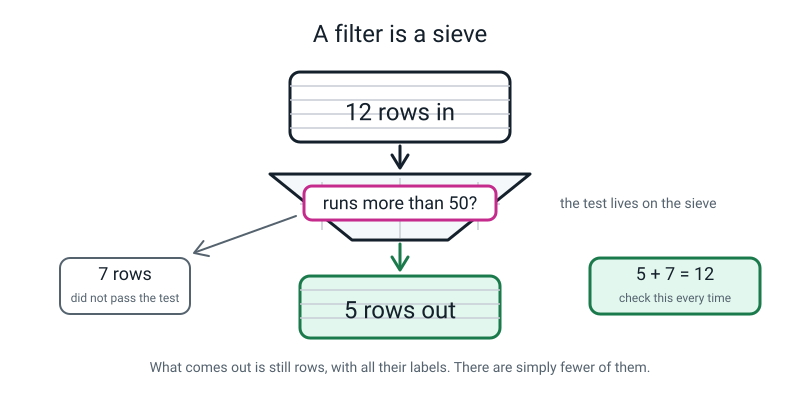
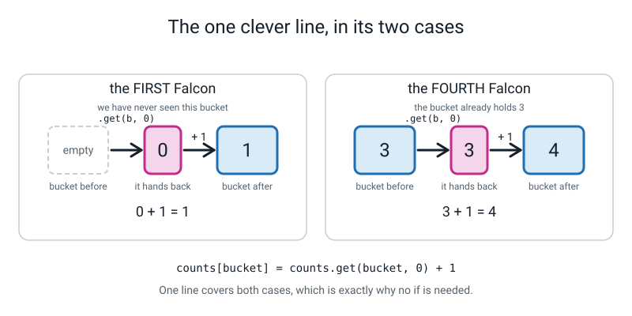
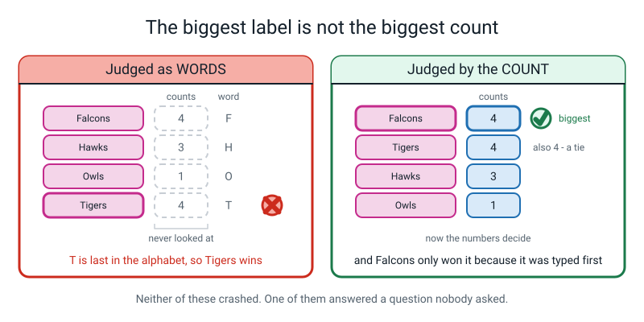
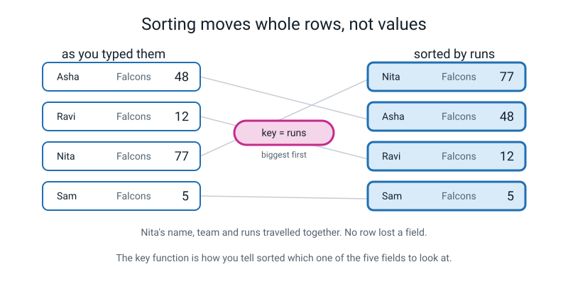
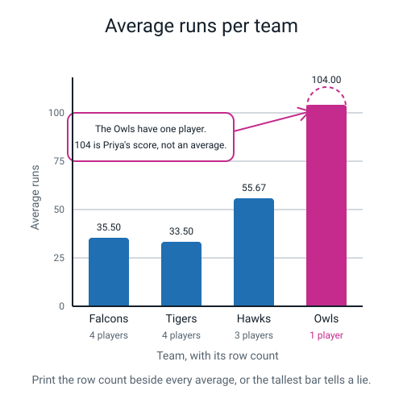
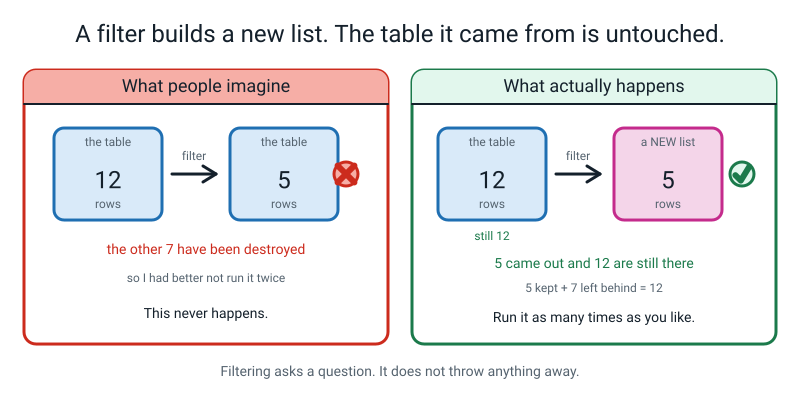
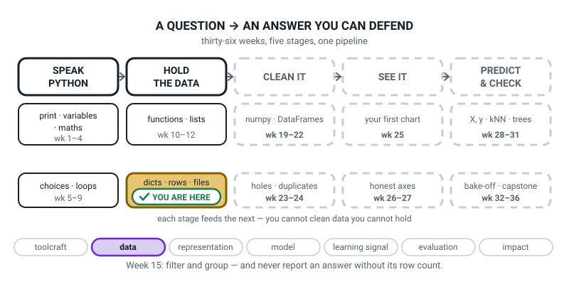
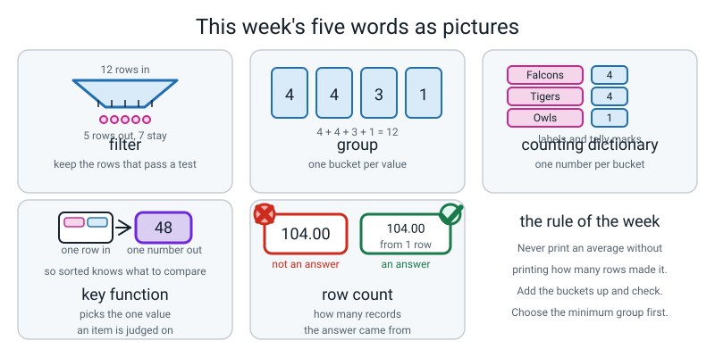

# Week 15 — Filter It, Group It, Count It

[⬅ Week 14](week-14.md) · [Course Home](../README.md) · [Next ➡](week-16.md) · [Workbook](../workbook/week-15.md)

---

> ### This week in one sentence
> **Filtering keeps the rows that pass a test; grouping counts how many rows share a value — and every group answer must be reported with its row count.**
>
> **By the end of this chapter you will be able to:**
> - **Filter** records with a comprehension and a condition, and report **how many survived out of how many started**
> - **Count** records into a grouping dictionary, one bucket per value, and check the buckets add up
> - **Sort** a list of records by one field, using a named **key function**
> - Find the key with the biggest value with `max(counts, key=counts.get)` — and say what happens on a tie
> - Report every group answer **with its row count**, and say why a one-row group probably should not be reported as an average at all
>
> **New syntax:** `[r for r in rows if r["age"] > 12]` · `sorted(rows, key=...)` · `max(counts, key=counts.get)`
>
> **Reading time:** about 30 minutes. **Homework:** about 60 minutes.

---

## 🪝 Start Here

Twelve cards on the table. Twelve players. Here is a question somebody actually asks about a cricket squad: **which team has the most players in it?**

Don't look through the pile and count in your head. **Do it with your hands.**

You will almost certainly start dealing the cards into piles — one pile per team. Stop for a second and say what you are doing out loud: *"I'm making a pile for each team."*

That is the entire idea of today, and you invented it without being told.

Deal them all out. Count each pile.

**Falcons 4. Tigers 4. Hawks 3. Owls 1.**

Now add them up. `4 + 4 + 3 + 1 = 12`. And how many cards did you start with? **Twelve.**

> **Hold on to that check.** It is the cheapest way there is of knowing you have not made a mistake. If the piles add up to twelve, no card fell on the floor. If they add up to eleven, one did — and nothing else would ever have told you.

Now the other kind of question. **Show me only the players who scored more than fifty.** Hands again.

You deal the twelve into two piles: yes and no. **Five and seven.** Five plus seven is twelve. Same check.

Now look at the five cards that came out. **Are they still cards?** Yes. **Do they still have all five labels on them?** Yes.

That matters. **The sieve did not turn them into anything else.** It did not rub the names off. Five cards came out, exactly the same shape as the twelve that went in, just fewer of them.

Those two things you just did with your hands have names. Making piles by team is **grouping**. Tipping the pack through a test is **filtering**. Today you write both of them as functions that work on *any* table, and then you use them to answer six questions.

**And there is a trap in one of the six that I am not going to warn you about.**


*Figure 15.1 — Nothing is thrown away. The counts must sum to the number of rows.*

---

## 🧠 The Big Idea

> **📌 About the code in this section.** The blocks below are **illustrations, not files**. They show you the shape of one idea, and each one carries on from the one above it — the `import` lines and the data are typed once, in the first block that needs them. **The complete, runnable file is in 💻 Type This.** If you copy a block from this section on its own and Python says `NameError`, that is why, and nothing is broken.

### 1. Two shapes of question, and that is nearly all of them

**The plain explanation.** Look at any table for long enough and almost every question you have about it turns out to be one of two shapes.

- ***"Show me only the rows where ___."*** That is **filtering**.
- ***"How many rows of each kind are there?"*** That is **grouping**.

> **filter** — keep only the records that pass a test, and throw the rest away. What comes out is still records, with all their labels, just fewer of them.
> **group** — put every record into a bucket according to the value of one field. **Nothing is thrown away**; you are only deciding which pile each row belongs to.

**The analogies, and they are worth keeping.** A filter is a **sieve** — you tip the whole pack through and only the ones that pass fall out the bottom. Grouping is **sorting laundry** — you do not throw any socks away, you make a pile per colour and then count each pile.

**And here is the difference that matters most:** a filter **throws rows away**, so the two piles add back up to what you started with. Grouping throws **nothing** away, so the buckets add up to what you started with. **Either way, the check is the same: add them up.**

**The code.** The filter is Week 14's one-liner with three words bolted on.

```python
def filter_by(rows, key, value):
    """Keep only the rows where rows[key] equals value."""
    return [r for r in rows if r[key] == value]
```

Read it in order:

```
[ r          for r in rows        if r[key] == value ]
  └── 3 ──┘  └──── 1 ────┘        └────── 2 ───────┘

1. for r in rows           ->  go through the records one at a time, calling each one r
2. if r[key] == value      ->  ...but only bother with the ones where this is true
3. r                       ->  ...and for those, put the WHOLE RECORD in the new list
```

**Two things to be very clear about.**

**What goes in the new list is `r` — the whole record**, not one field. Last week the front of the comprehension said `r["runs"]` and gave you a list of *numbers*. This week the front says `r` and gives you a list of *records*. **Filtering does not change what a row is. It changes how many rows there are.**

**`==`, not `=`.** One equals sign assigns; two ask a question. You have known that since Week 5, and you will still get it wrong once today. It gives you `SyntaxError: invalid syntax` with the caret sitting on the `=`.

**And why is the key passed in as an argument rather than written inside?** Because then the *same function* works on every table you will ever build. `filter_by(squad, "team", "Tigers")` and `filter_by(playlist, "genre", "pop")` are the same function. That is Week 12's lesson — **write the tool, not the one-off answer** — arriving one level up.

For a filter that is not an exact match — greater than, less than — write the comprehension directly, because there is no single value to pass in:

```python
big_scores = [r for r in squad if r["runs"] > 50]
```


*Figure 15.2 — What comes out of a filter is still rows. The counts must add back up to what went in.*

### 2. The counting dictionary — the one pattern to memorise

**The plain explanation.** This is the most reused four lines in this entire course. Learn it well enough to write from memory, because you will.

```python
def group_count(rows, key):
    """Count how many rows share each value of key. One bucket per value."""
    counts = {}                                     # start with no buckets at all
    for r in rows:                                  # look at every row once
        bucket = r[key]                             # which bucket does this row go in?
        counts[bucket] = counts.get(bucket, 0) + 1  # count so far (0 if new) plus one
    return counts
```

On the twelve records:

```text
{'Falcons': 4, 'Tigers': 4, 'Hawks': 3, 'Owls': 1}
```

> **counting dictionary** — a dictionary used as a set of tally marks: one key per bucket, one number per bucket, built with `counts[b] = counts.get(b, 0) + 1`.

**The fourth line does two jobs in one go, and it is the only clever thing this week.** So trace it by hand. Get a pencil; do the first five for real.

| Turn | record | `bucket` | `counts.get(bucket, 0)` | `counts` afterwards |
|---|---|---|---|---|
| 1 | Asha | `Falcons` | `0` — never seen it | `{'Falcons': 1}` |
| 2 | Ravi | `Falcons` | `1` | `{'Falcons': 2}` |
| 3 | Nita | `Falcons` | `2` | `{'Falcons': 3}` |
| 4 | Sam | `Falcons` | `3` | `{'Falcons': 4}` |
| 5 | Kabir | `Tigers` | `0` — never seen it | `{'Falcons': 4, 'Tigers': 1}` |
| … | … | … | … | … |
| 12 | Priya | `Owls` | `0` — never seen it | `{'Falcons': 4, 'Tigers': 4, 'Hawks': 3, 'Owls': 1}` |

**See what `.get` is for.** The **first** time you meet a bucket there is nothing there, so `.get` hands you a **zero** and you write one. **Every time after that** it hands you the count so far and you write one more. One expression, both cases, no `if` needed anywhere.

That is last week's polite-asking tool doing the one job it was made for. Without it you would need four lines:

```python
if bucket in counts:
    counts[bucket] = counts[bucket] + 1
else:
    counts[bucket] = 1
```

**Identical result.** That version is completely correct and there is nothing wrong with writing it. **But now you know why `.get()` exists.**

**And then the check that matters:** 4 + 4 + 3 + 1 = 12 = `len(squad)`.

> **If the bucket counts do not add up to the row count, you dropped a row.** Do this every single time you group anything. It costs one line and it catches the worst kind of mistake there is — the one where the answer looks fine.


*Figure 15.3 — First time: nothing there, so `.get` hands back 0. Every time after: the count so far, plus one.*

### 3. `max` looks at the labels unless you tell it otherwise

**The plain explanation.** You have `{'Falcons': 4, 'Tigers': 4, 'Hawks': 3, 'Owls': 1}` and you want the biggest team. The obvious thing is **wrong**, and it does not complain.

```python
print("biggest team (wrong):", max(counts))
print("biggest team (right):", max(counts, key=counts.get))
```

```text
biggest team (wrong): Tigers
biggest team (right): Falcons
```

**Neither of those crashed.** That is the whole point.

`max(counts)` looks at the **keys** — the team names — and hands back the one that comes **last alphabetically**. F, then H, then O, then T: `Tigers` wins as a *word*. **The counts are never consulted at all.** It is a confident, wrong, silent answer.

`max(counts, key=counts.get)` says: *go through the keys, and for each one, judge it by what `counts.get` says about it.* Now the numbers decide.

**The analogy.** Asking a class *"who is tallest?"* and getting back *"Zoya"* — because you asked somebody who was reading the register alphabetically and never looked up. The answer is not a lie. It is an answer to a different question.

**And there is a second thing hiding in there.** Falcons and Tigers **both have 4**. It is a **tie**, and `max` does not tell you — it just hands back the first one it met, which is Falcons because Falcons was typed first.

So the honest answer to *"which team is biggest?"* is ***"Falcons and Tigers, four each"***, and the code as written **cannot say that.** It gave one answer to a question with two answers. It did not lie to you; you never asked it about ties.

> **You** can say the true thing, which is why a human writes the sentence at the end.


*Figure 15.4 — Neither of these crashed. One of them answered a question nobody asked.*

### 4. `sorted` with a key function — and it moves whole rows

**The plain explanation.** `sorted()` came in Week 12 and worked on numbers. It cannot sort records on its own, because **one dictionary is not bigger or smaller than another dictionary** — so you have to tell it *which field to look at*. You do that by handing it a function.

```python
def runs_of(player):
    """Key function: given one player, hand back the number to sort on."""
    return player["runs"]


ranked = sorted(squad, key=runs_of, reverse=True)
for position, player in enumerate(ranked[:3], start=1):
    print(f"{position}. {player['name']:<7}{player['runs']:>4} runs")

print("original row 0 is still", squad[0]["name"])
```

```text
1. Priya   104 runs
2. Omar     90 runs
3. Nita     77 runs
original row 0 is still Asha
```

> **key function** — a small function you hand to `sorted` (or to `max`) that takes one item and returns the one value you want it judged on.

**Three things to know.**

**1. `key=runs_of`, with no brackets after `runs_of`.** You are handing over the **function itself**, not the result of running it. `key=runs_of()` tries to run it with no arguments and gives you `TypeError: runs_of() missing 1 required positional argument: 'player'`.

The mental model: you are handing `sorted` a **tool**, and `sorted` will use it twelve times. If you use it yourself first, you have nothing left to hand over.

**2. `reverse=True` means biggest first.** Without it you get smallest first. Both are keyword arguments from Week 10.

**3. `sorted` moves whole records.** Priya's name, her team, her balls and her 104 all travelled together. **Nothing got separated from its labels** — which is exactly what you *do* lose when you pull a column out with a comprehension. And the original `squad` is untouched: row 0 is still Asha.


*Figure 15.5 — The key function is how you tell `sorted` which one of the five fields to look at.*

### 5. An average hides how many rows it came from

**The plain explanation.** Here is the output this whole lesson is built to produce.

```text
Q5  average runs per team
    Falcons    35.50 runs   from 4 player(s)
    Tigers     33.50 runs   from 4 player(s)
    Hawks      55.67 runs   from 3 player(s)
    Owls      104.00 runs   from 1 player(s)
```

Read the Owls line. **104.00 runs.** It is the highest average on the board by a mile.

It is also just **Priya's score**, because Priya is the only Owl. **Dividing one number by one does not make it an average.** It makes it the same number wearing a hat.

> **row count** — how many records an answer was computed from. **An answer without its row count is not an answer.**

This is Level 1's ***"out of how many?"*** arriving with a keyboard attached. Back then you learned that "60% accurate" means nothing until you know whether that was 6 out of 10 or 600 out of 1000. **Same idea. Same fix: print the denominator.**

**And notice what the decision actually is.** It is *not* "is this number right?" — it is right, 104 divided by 1 is 104, the arithmetic is perfect. The decision is: **should I report it at all?**

There are three defensible answers and grown-ups get paid to choose between them:

1. **Report it with the count printed loudly.** *"Owls: 104.00 from 1 player."* Honest, and it lets the reader decide.
2. **Report it with a warning.** *"Owls: 104.00 from 1 player — too few rows to call this an average."*
3. **Do not report the average at all.** *"Owls: 1 player, not enough to average."*

**All three are professional.** What is **not** acceptable is printing `Owls 104.00` next to `Falcons 35.50` with no counts — because a reader will conclude the Owls are three times the batting side, and **they will be reasoning perfectly correctly from what you showed them.** You would have misled them without writing a single false number.

**One more rule, and it matters more than it looks.** Decide the minimum group size **before** you look at the answers. If you decide afterwards, you are choosing a rule that happens to exclude the number you did not like — and you will not even notice you are doing it. Write it in the code as a named value so it is visible:

```python
MIN_GROUP = 3        # decided BEFORE looking at the answers
```


*Figure 15.6 — The tallest bar is one person. Printing the row count is what stops the chart lying.*

---

## 💻 Type This

**Three files this week**, which is Week 12's idea again: the **data** lives in one, the **tools** live in another, and the **questions** live in a third. That way when your tools are right, they stay right — and you can point them at somebody else's data tomorrow.

### Step 1 — the data, in its own file

New file, **Save As** `squad_data.py`. Copy last week's twelve records into it. **A copy-paste is entirely fine here** — the typing was last week's lesson.

```python
"""squad_data.py - the twelve records from Week 14, kept in their own file."""

squad = [
    {"name": "Asha",  "team": "Falcons", "runs": 48,  "balls": 32, "out": True},
    {"name": "Ravi",  "team": "Falcons", "runs": 12,  "balls": 20, "out": True},
    {"name": "Nita",  "team": "Falcons", "runs": 77,  "balls": 55, "out": False},
    {"name": "Sam",   "team": "Falcons", "runs": 5,   "balls": 9,  "out": True},
    {"name": "Kabir", "team": "Tigers",  "runs": 63,  "balls": 41, "out": True},
    {"name": "Meera", "team": "Tigers",  "runs": 30,  "balls": 28, "out": False},
    {"name": "Dev",   "team": "Tigers",  "runs": 0,   "balls": 3,  "out": True},
    {"name": "Zara",  "team": "Tigers",  "runs": 41,  "balls": 39, "out": True},
    {"name": "Iqbal", "team": "Hawks",   "runs": 55,  "balls": 44, "out": True},
    {"name": "Lena",  "team": "Hawks",   "runs": 22,  "balls": 18, "out": True},
    {"name": "Omar",  "team": "Hawks",   "runs": 90,  "balls": 61, "out": False},
    {"name": "Priya", "team": "Owls",    "runs": 104, "balls": 70, "out": False},
]
```

### Step 2 — the tools

New file, **Save As** `records.py`, in the **same folder**.

```python
"""records.py - tools that work on ANY list of dictionaries, not just cricketers."""


def filter_by(rows, key, value):
    """Keep only the rows where rows[key] equals value."""
    return [r for r in rows if r[key] == value]


def column(rows, key):
    """Pull one column out of the rows as a plain list of values."""
    return [r[key] for r in rows]
```

> **💡 Try this:** read those two functions and notice that **neither of them contains the word "cricket", "team" or "runs".** `filter_by(playlist, "genre", "pop")` works. `filter_by(dinners, "day", "Tuesday")` works. **You have written a tool, not an answer.**

### Step 3 — the questions

New file, **Save As** `lab15.py`, same folder.

```python
"""lab15.py - asking the twelve records six questions."""

from records import filter_by, column
from squad_data import squad

tigers = filter_by(squad, "team", "Tigers")
print("Tigers rows:", len(tigers), "of", len(squad))
print("Tigers     :", column(tigers, "name"))
```

**Predict both lines before you run.** How many Tigers, and who?

```text
Tigers rows: 4 of 12
Tigers     : ['Kabir', 'Meera', 'Dev', 'Zara']
```

Look carefully at what got printed. Not just `4` — **`4 of 12`**. Get into that habit **now**, on the easy one, and you will still have it in Week 34 when it matters.

### Step 4 — ⚠️ mistake number one, on purpose

Now the buckets. Add `group_count` to `records.py`. You want to add one to a bucket each time, and you already know how to add one to something — from Week 7. Use that.

```python
def group_count(rows, key):
    """Count how many rows share each value of key. One bucket per value."""
    counts = {}
    for r in rows:
        bucket = r[key]
        counts[bucket] += 1
    return counts
```

**Two edits in `lab15.py`, and the first one is easy to forget.** Put `group_count` on the import line, or you get `NameError: name 'group_count' is not defined` instead of the error we are here for.

```python
from records import filter_by, column, group_count      # <-- group_count added
```

Then at the bottom of `lab15.py`:

```python
print(group_count(squad, "team"))
```

Run it.

```text
Tigers rows: 4 of 12
Tigers     : ['Kabir', 'Meera', 'Dev', 'Zara']
Traceback (most recent call last):
  File "lab15.py", line 10, in <module>
    print(group_count(squad, "team"))
          ~~~~~~~~~~~^^^^^^^^^^^^^^^
  File "records.py", line 19, in group_count
    counts[bucket] += 1
    ~~~~~~^^^^^^^^
KeyError: 'Falcons'
```

**Oh good — and this one is new. Look at it. There are TWO `File` lines.** You have only ever had one before.

**Read them from the bottom.** `records.py, line 19` — that is **where it actually broke.** The one above it, `lab15.py, line 10`, tells you **who called it.** So the trail reads: *"line 10 of lab15 called `group_count`, and inside `group_count`, line 19 of records blew up."*

> **The rule for the rest of the year: the LAST `File` line is where it broke.** Everything above it is the trail of who called who. This is the first two-file traceback you have seen and **every remaining week will produce them.**

Now the last line. `KeyError: 'Falcons'`. **What does `+=` actually mean?** *Take what is there and add one.* And on the very first Falcon, **what is there?**

Nothing. There is no key called `Falcons` yet. So Python cannot take what is there, and it says so.

Which is exactly why the line is written the way it is. Change it:

```python
        counts[bucket] = counts.get(bucket, 0) + 1  # count so far (0 if new) plus one
```

```text
Tigers rows: 4 of 12
Tigers     : ['Kabir', 'Meera', 'Dev', 'Zara']
{'Falcons': 4, 'Tigers': 4, 'Hawks': 3, 'Owls': 1}
```

**Bug Log it now — and log the two-`File`-line rule as a separate entry.** That rule is worth more than the fix.

### Step 5 — ⚠️ mistake number two, on purpose. This one does not crash.

Which team is biggest? There is a thing called `max` that gives you the biggest of something. **Type only the first of these two lines and run it.**

```python
counts = group_count(squad, "team")
print("biggest team (wrong):", max(counts))
```

```text
biggest team (wrong): Tigers
```

**Tigers. Does that look right?**

Sit with it for twenty seconds. Then look back at the counts: **Falcons 4, Tigers 4, Hawks 3, Owls 1.**

**Tigers is not the biggest.** It is tied at the top, but it is not the biggest — and something worse than that is going on. **There was no error. Nothing complained.** Python did exactly what you asked, which was not what you meant.

`max` looked at the **team names** — the keys — and handed back the one that comes **last in the alphabet**. F, then H, then O, then T. **It never looked at the numbers at all.**

Now add the second line:

```python
print("biggest team (right):", max(counts, key=counts.get))
```

```text
biggest team (wrong): Tigers
biggest team (right): Falcons
```

`key=counts.get` says: *go through the team names, and judge each one by what `counts.get` says about it.* **Now the numbers decide.**

**And look what it did with the tie.** Falcons and Tigers both have four. `max` gave **one** answer to a question with **two** answers, and it gave the one that happened to be typed first. What is the honest answer to *"which team is biggest?"*

*Falcons and Tigers, four each.* Which your program cannot say. **That is fine — you can say it, and that is why a human writes the sentence at the end.**

**Bug Log this one too, under a heading of its own: *a wrong answer with no error message.***

### Step 6 — the key function and the ranking

```python
def runs_of(player):
    """Key function: given one player, hand back the number to sort on."""
    return player["runs"]


ranked = sorted(squad, key=runs_of, reverse=True)
for position, player in enumerate(ranked[:3], start=1):
    print(f"{position}. {player['name']:<7}{player['runs']:>4} runs")
```

```text
1. Priya   104 runs
2. Omar     90 runs
3. Nita     77 runs
```

**`key=runs_of`, with no brackets.** You are handing `sorted` the tool, not the result of using it.

### The complete finished program

This is `lab15.py` in full — six questions, and **every single answer with its row count.**

```python
"""lab15.py - six questions about twelve players, every answer with its row count."""

from records import filter_by, group_count, column
from squad_data import squad


def runs_of(player):
    """The key function: given one player, hand back the number to sort on."""
    return player["runs"]


print("=" * 46)
print(f"{len(squad)} rows, {len(squad[0])} columns")
print("=" * 46)

# --- Q1: how many players in each team? -------------------------------------
team_counts = group_count(squad, "team")
print("\nQ1  players per team")
print("   ", team_counts)
print("    rows accounted for:", sum(team_counts.values()), "of", len(squad))

# --- Q2: which team has the most players? -----------------------------------
biggest = max(team_counts, key=team_counts.get)
print("\nQ2  biggest team")
print(f"    {biggest}, with {team_counts[biggest]} players")

# --- Q3: who scored more than 50? -------------------------------------------
big_scores = [r for r in squad if r["runs"] > 50]
print("\nQ3  players who scored more than 50")
print("   ", column(big_scores, "name"))
print(f"    {len(big_scores)} of {len(squad)} players")

# --- Q4: what did the Falcons average? --------------------------------------
falcons = filter_by(squad, "team", "Falcons")
falcon_runs = column(falcons, "runs")
print("\nQ4  Falcons average")
print("    runs:", falcon_runs)
print(f"    average {sum(falcon_runs) / len(falcon_runs):.2f} runs  (from {len(falcons)} players)")

# --- Q5: average runs per team, EVERY answer with its row count -------------
print("\nQ5  average runs per team")
for team in team_counts:
    team_rows = filter_by(squad, "team", team)
    team_runs = column(team_rows, "runs")
    average = sum(team_runs) / len(team_runs)
    print(f"    {team:<8} {average:7.2f} runs   from {len(team_rows)} player(s)")

# --- Q6: the top three scorers ----------------------------------------------
ranked = sorted(squad, key=runs_of, reverse=True)
print("\nQ6  top three scorers")
for position, player in enumerate(ranked[:3], start=1):
    print(f"    {position}. {player['name']:<7}{player['runs']:>4} runs")
```

```text
==============================================
12 rows, 5 columns
==============================================

Q1  players per team
    {'Falcons': 4, 'Tigers': 4, 'Hawks': 3, 'Owls': 1}
    rows accounted for: 12 of 12

Q2  biggest team
    Falcons, with 4 players

Q3  players who scored more than 50
    ['Nita', 'Kabir', 'Iqbal', 'Omar', 'Priya']
    5 of 12 players

Q4  Falcons average
    runs: [48, 12, 77, 5]
    average 35.50 runs  (from 4 players)

Q5  average runs per team
    Falcons    35.50 runs   from 4 player(s)
    Tigers     33.50 runs   from 4 player(s)
    Hawks      55.67 runs   from 3 player(s)
    Owls      104.00 runs   from 1 player(s)

Q6  top three scorers
    1. Priya   104 runs
    2. Omar     90 runs
    3. Nita     77 runs
```

**Now check one answer by hand, on paper.** Q4 is the right one:

```
48 + 12 = 60
60 + 77 = 137
137 + 5 = 142
142 / 4 = 35.5
```

**Matched.** ✔ And the reason to bother: *now you know what the right answer looks like, so if the code ever disagrees with you, one of you is wrong and you will know to go and check.*

### Step 7 — the guard, so the program tells the truth about itself

Make one more file, `honest.py`.

```python
"""honest.py - the same averages, but the small groups say so out loud."""

from records import filter_by, group_count, column
from squad_data import squad

MIN_GROUP = 3        # decided BEFORE looking at the answers

team_counts = group_count(squad, "team")

print("average runs per team")
print("-" * 52)
for team in team_counts:
    rows = filter_by(squad, "team", team)
    runs = column(rows, "runs")
    average = sum(runs) / len(runs)
    if len(rows) < MIN_GROUP:
        print(f"{team:<8} {average:7.2f}   from {len(rows)} row(s)  <-- too few rows to call this an average")
    else:
        print(f"{team:<8} {average:7.2f}   from {len(rows)} row(s)")
print("-" * 52)
print(f"minimum group size we agreed on: {MIN_GROUP}")
```

```text
average runs per team
----------------------------------------------------
Falcons    35.50   from 4 row(s)
Tigers     33.50   from 4 row(s)
Hawks      55.67   from 3 row(s)
Owls      104.00   from 1 row(s)  <-- too few rows to call this an average
----------------------------------------------------
minimum group size we agreed on: 3
```

**That is a program that tells the truth about itself.** Notice it still prints the number — it hides nothing. It just refuses to let you read it without knowing what it is.

---

## 🔍 Worked Examples

**All three of these sit next to the `records.py` you wrote in Step 2**, in the same folder, and import from it. If you get `ModuleNotFoundError: No module named 'records'`, your terminal is in a different folder from the files.

### Worked Example 1 — Ten lunch orders (food)

Grouping, two kinds of filter, averages with row counts, and a one-order day.

```python
# lunch.py - ten lunch orders. Sits next to the records.py from Step 2.

from records import filter_by, group_count, column

orders = [
    {"pupil": "Asha",  "day": "Mon", "meal": "veg",   "spend": 40},
    {"pupil": "Ravi",  "day": "Mon", "meal": "veg",   "spend": 25},
    {"pupil": "Nita",  "day": "Mon", "meal": "chick", "spend": 60},
    {"pupil": "Sam",   "day": "Tue", "meal": "veg",   "spend": 15},
    {"pupil": "Kabir", "day": "Tue", "meal": "chick", "spend": 30},
    {"pupil": "Meera", "day": "Tue", "meal": "veg",   "spend": 35},
    {"pupil": "Dev",   "day": "Wed", "meal": "veg",   "spend": 20},
    {"pupil": "Zara",  "day": "Wed", "meal": "chick", "spend": 55},
    {"pupil": "Lena",  "day": "Wed", "meal": "veg",   "spend": 45},
    {"pupil": "Omar",  "day": "Thu", "meal": "fish",  "spend": 120},
]

print(f"{len(orders)} rows, {len(orders[0])} columns")

# --- GROUP: how many orders on each day? -----------------------------------
day_counts = group_count(orders, "day")
print("\norders per day:", day_counts)
print("rows accounted for:", sum(day_counts.values()), "of", len(orders))

# --- FILTER: only the veg orders -------------------------------------------
veg = filter_by(orders, "meal", "veg")
print("\nveg orders:", column(veg, "pupil"))
print(f"{len(veg)} of {len(orders)} orders")

# --- FILTER with a condition instead of an exact match ----------------------
big = [r for r in orders if r["spend"] > 40]
print("\nspent more than 40:", column(big, "pupil"))
print(f"{len(big)} of {len(orders)} orders")

# --- AVERAGE PER DAY, every answer with its row count ----------------------
MIN_GROUP = 3        # decided BEFORE looking at the answers

print("\naverage spend per day")
print("-" * 50)
for day in day_counts:
    rows = filter_by(orders, "day", day)
    spends = column(rows, "spend")
    average = sum(spends) / len(spends)
    if len(rows) < MIN_GROUP:
        print(f"{day:<5}{average:8.2f}   from {len(rows)} order(s)  <-- too few to average")
    else:
        print(f"{day:<5}{average:8.2f}   from {len(rows)} order(s)")
print("-" * 50)
print("biggest day (wrong):", max(day_counts))
print("biggest day (right):", max(day_counts, key=day_counts.get))
```

```text
10 rows, 4 columns

orders per day: {'Mon': 3, 'Tue': 3, 'Wed': 3, 'Thu': 1}
rows accounted for: 10 of 10

veg orders: ['Asha', 'Ravi', 'Sam', 'Meera', 'Dev', 'Lena']
6 of 10 orders

spent more than 40: ['Nita', 'Zara', 'Lena', 'Omar']
4 of 10 orders

average spend per day
--------------------------------------------------
Mon     41.67   from 3 order(s)
Tue     26.67   from 3 order(s)
Wed     40.00   from 3 order(s)
Thu    120.00   from 1 order(s)  <-- too few to average
--------------------------------------------------
biggest day (wrong): Wed
biggest day (right): Mon
```

**Check the arithmetic:** Monday is 40 + 25 + 60 = 125, and 125 ÷ 3 = 41.666… → `41.67` ✔. Tuesday is 15 + 30 + 35 = 80, and 80 ÷ 3 = 26.666… → `26.67` ✔.

**Three things worth pausing on.**

**`max(day_counts)` says `Wed`.** Alphabetically: Mon, Thu, Tue, Wed — and `Wed` is last. Three days are tied on 3 and Thursday has 1, so the honest answer is *"Mon, Tue and Wed, three each"*. The `key=` version says `Mon` — the first of the tied three.

**Thursday's 120.00 is Omar's lunch.** One row. Sitting next to Monday's 41.67, it makes Thursday look like the day everybody splashes out. It is one person buying fish.

**And `4 of 10` for the big spenders is a real answer, not decoration.** Four people spent more than 40. Out of ten. If somebody quoted "four pupils spend over 40 rupees" without the ten, you would have no idea whether that is a lot.

### Worked Example 2 — Ten race results (sport)

Grouping by runner, a `True`/`False` group, and sorting with a key function that does not touch the original.

```python
# heats.py - ten race results grouped by runner. Sits next to records.py.

from records import filter_by, group_count, column

results = [
    {"runner": "Anika", "heat": 1, "seconds": 13.4, "pb": True},
    {"runner": "Rohit", "heat": 1, "seconds": 12.8, "pb": True},
    {"runner": "Meera", "heat": 1, "seconds": 14.9, "pb": False},
    {"runner": "Anika", "heat": 2, "seconds": 13.1, "pb": True},
    {"runner": "Rohit", "heat": 2, "seconds": 13.0, "pb": False},
    {"runner": "Meera", "heat": 2, "seconds": 14.2, "pb": True},
    {"runner": "Anika", "heat": 3, "seconds": 13.6, "pb": False},
    {"runner": "Rohit", "heat": 3, "seconds": 12.9, "pb": False},
    {"runner": "Meera", "heat": 3, "seconds": 14.5, "pb": False},
    {"runner": "Priya", "heat": 3, "seconds": 11.9, "pb": True},
]


def seconds_of(result):
    """Key function: given one result, hand back the number to sort on."""
    return result["seconds"]


runner_counts = group_count(results, "runner")
print("races per runner  :", runner_counts)
print("rows accounted for:", sum(runner_counts.values()), "of", len(results))

print("\npersonal bests    :", group_count(results, "pb"))

print("\naverage time per runner")
print("-" * 52)
for runner in runner_counts:
    rows = filter_by(results, "runner", runner)
    times = column(rows, "seconds")
    average = sum(times) / len(times)
    flag = "  <-- one race only" if len(rows) < 3 else ""
    print(f"{runner:<7}{average:7.2f} s   from {len(rows)} race(s){flag}")
print("-" * 52)

fastest = sorted(results, key=seconds_of)
print("\nthree fastest single races")
for position, result in enumerate(fastest[:3], start=1):
    print(f"  {position}. {result['runner']:<7}{result['seconds']:>6.1f} s  heat {result['heat']}")

print("\noriginal row 0 is still", results[0]["runner"], "heat", results[0]["heat"])
```

```text
races per runner  : {'Anika': 3, 'Rohit': 3, 'Meera': 3, 'Priya': 1}
rows accounted for: 10 of 10

personal bests    : {True: 5, False: 5}

average time per runner
----------------------------------------------------
Anika    13.37 s   from 3 race(s)
Rohit    12.90 s   from 3 race(s)
Meera    14.53 s   from 3 race(s)
Priya    11.90 s   from 1 race(s)  <-- one race only
----------------------------------------------------

three fastest single races
  1. Priya    11.9 s  heat 3
  2. Rohit    12.8 s  heat 1
  3. Rohit    12.9 s  heat 3

original row 0 is still Anika heat 1
```

**Check one:** Anika's 13.4 + 13.1 + 13.6 = 40.1, and 40.1 ÷ 3 = 13.3666… → `13.37` ✔

**Four things worth pausing on.**

**You can group by a `True`/`False` field.** `group_count(results, "pb")` gives `{True: 5, False: 5}` — two buckets, and they add to 10. **The keys of a counting dictionary are whatever values were in that column**, and `True` is a perfectly good bucket name.

**Priya's 11.90 is the fastest average on the board and she ran one race.** Sitting next to Rohit's 12.90 from three, it says she is the best runner. What it actually says is that she ran once, on one day, and was quick.

**No `reverse=True` this time, on purpose.** For times, **smaller is better** — so smallest first is the ranking you want. Reversing it would have put the slowest race at the top and looked like a leaderboard. **Which way "best" points depends on the column**, and only you know which.

**And `sorted` left the original alone.** Row 0 is still Anika, heat 1, exactly as typed. `sorted` builds a **new** list; it does not rearrange yours.

### Worked Example 3 — Eleven pieces of homework (school)

Five groups, three of them too small, and the honest guard doing real work.

```python
# marks.py - eleven pieces of homework grouped by subject. Sits next to records.py.

from records import filter_by, group_count, column

work = [
    {"subject": "Maths",   "term": 1, "percent": 85},
    {"subject": "Maths",   "term": 2, "percent": 45},
    {"subject": "Maths",   "term": 3, "percent": 72},
    {"subject": "Science", "term": 1, "percent": 80},
    {"subject": "Science", "term": 2, "percent": 100},
    {"subject": "Science", "term": 3, "percent": 64},
    {"subject": "English", "term": 1, "percent": 88},
    {"subject": "English", "term": 2, "percent": 91},
    {"subject": "History", "term": 1, "percent": 70},
    {"subject": "History", "term": 2, "percent": 66},
    {"subject": "Art",     "term": 2, "percent": 98},
]

MIN_GROUP = 3          # decided BEFORE looking at the answers

subject_counts = group_count(work, "subject")
print("pieces per subject:", subject_counts)
print("rows accounted for:", sum(subject_counts.values()), "of", len(work))

good = [r for r in work if r["percent"] >= 80]
print("\n80% or better:", column(good, "subject"))
print(f"{len(good)} of {len(work)} pieces")

print("\naverage percent per subject")
print("-" * 56)
for subject in subject_counts:
    rows = filter_by(work, "subject", subject)
    percents = column(rows, "percent")
    average = sum(percents) / len(percents)
    if len(rows) < MIN_GROUP:
        print(f"{subject:<8}{average:7.1f}%   from {len(rows)} piece(s)  <-- too few to average")
    else:
        print(f"{subject:<8}{average:7.1f}%   from {len(rows)} piece(s)")
print("-" * 56)
print(f"minimum group size agreed first: {MIN_GROUP}")
print("most pieces (wrong):", max(subject_counts))
print("most pieces (right):", max(subject_counts, key=subject_counts.get))
```

```text
pieces per subject: {'Maths': 3, 'Science': 3, 'English': 2, 'History': 2, 'Art': 1}
rows accounted for: 11 of 11

80% or better: ['Maths', 'Science', 'Science', 'English', 'English', 'Art']
6 of 11 pieces

average percent per subject
--------------------------------------------------------
Maths      67.3%   from 3 piece(s)
Science    81.3%   from 3 piece(s)
English    89.5%   from 2 piece(s)  <-- too few to average
History    68.0%   from 2 piece(s)  <-- too few to average
Art        98.0%   from 1 piece(s)  <-- too few to average
--------------------------------------------------------
minimum group size agreed first: 3
most pieces (wrong): Science
most pieces (right): Maths
```

**Check one:** Maths is 85 + 45 + 72 = 202, and 202 ÷ 3 = 67.333… → `67.3` ✔

**Four things worth pausing on, and the last one is uncomfortable.**

**Three of the five groups got flagged.** `MIN_GROUP = 3` is doing genuine work here, not decorating. **On real data most groups are small** — that is normal, and it is exactly why the flag has to be in the code rather than in your head.

**Art's 98.0% is the best average on the sheet and it is one painting.** If this went in a report card as *"strongest subject: Art"*, it would be a sentence built on one row.

**`max(subject_counts)` says `Science` and `max(..., key=...)` says `Maths`** — and Maths and Science are **tied on 3**, so even the right version is only telling you half the truth. Two silent problems in one line, and neither of them raises anything.

**And the thing that is not about Python.** `column(good, "subject")` printed `['Maths', 'Science', 'Science', 'English', 'English', 'Art']` — six subject names, and **`Science` appears twice.** That is not a bug: two *different pieces* of Science work scored 80 or more. But a reader glancing at that list would see six items and might read it as six subjects. **A list of one column, pulled out of the rows, has lost the thing that made each row different.** Print `6 of 11` beside it and at least the reader knows how many rows are behind those six names.

---

## 🐞 When It Breaks

Every message below came from really running a broken version of this week's code. **And this week something changes: half of these bugs produce no error message at all.**

### Break 1 — `+=` on a bucket that does not exist yet

```python
counts[bucket] += 1
```

```text
Traceback (most recent call last):
  File "lab15.py", line 10, in <module>
    print(group_count(squad, "team"))
          ~~~~~~~~~~~^^^^^^^^^^^^^^^
  File "records.py", line 19, in group_count
    counts[bucket] += 1
    ~~~~~~^^^^^^^^
KeyError: 'Falcons'
```

**What Python is telling you.** `+=` means *take what is there and add one.* On the first Falcon there is **nothing there** — no key called `Falcons` yet — so there is nothing to take.

**The fix.** `counts[bucket] = counts.get(bucket, 0) + 1`. The `.get` supplies the zero the first time.

**And the thing to learn from this traceback rather than from the fix: there are TWO `File` lines.**

| `File` line | What it is |
|---|---|
| `lab15.py, line 10` | **who called** the function |
| `records.py, line 19` | **where it actually broke** |

> **Read the last `File` line.** The ones above it are the trail of who called who. Students read the *first* one, go to `lab15.py`, find nothing wrong with line 10 — because there **is** nothing wrong with line 10 — and lose five minutes. One question fixes it forever: **"which `File` line is the last one?"**

### Break 2 — brackets after a key function

```python
ranked = sorted(squad, key=runs_of(), reverse=True)
```

```text
Traceback (most recent call last):
  File "sort_brackets.py", line 8, in <module>
    ranked = sorted(squad, key=runs_of(), reverse=True)
                               ~~~~~~~^^
TypeError: runs_of() missing 1 required positional argument: 'player'
```

**What Python is telling you.** *"You tried to run `runs_of` yourself, and you gave it nothing to run on."*

**The fix.** `key=runs_of`, **no brackets.** You are handing `sorted` the **tool**, and `sorted` will use it twelve times. Use it yourself first and you have nothing left to hand over.

The same mistake on `max` gives a different message for the same reason:

```text
TypeError: get expected at least 1 argument, got 0
```

That is `key=counts.get()` instead of `key=counts.get`.

### Break 3 — dividing by an empty group

```python
owls = filter_by(squad, "team", "Kites")     # there are no Kites
runs = column(owls, "runs")
print("rows:", len(owls))
print("average:", sum(runs) / len(runs))
```

```text
rows: 0
Traceback (most recent call last):
  File "zerodiv.py", line 7, in <module>
    print("average:", sum(runs) / len(runs))
                      ~~~~~~~~~~^~~~~~~~~~~
ZeroDivisionError: division by zero
```

**What Python is telling you.** *"You divided by nought."* The filter matched **no rows**, so `len(runs)` is 0.

**The fix, and it is the whole point of the week.** **Print the row count before you divide, and do not divide if it is zero.**

```python
if len(runs) == 0:
    print("no rows - nothing to average")
else:
    print(f"average {sum(runs) / len(runs):.2f} from {len(runs)} rows")
```

Notice that this is **the same discipline as printing the denominator.** If you were already printing the row count, you would have seen the `0` before you crashed.

### The whole clinic, for reference

| What you see | What it means | The fix |
|---|---|---|
| `KeyError: 'Falcons'` with **two** `File` lines | "There is nothing in the Falcons bucket yet, so I can't add one to it." | `counts[bucket] = counts.get(bucket, 0) + 1`. And read the **last** `File` line |
| `TypeError: unsupported operand type(s) for +: 'NoneType' and 'int'` | "You added 1 to a nothing." | `.get(bucket)` with no fallback hands back `None`. It must be `.get(bucket, 0)` |
| `ZeroDivisionError: division by zero` | "You divided by nought." | The filter matched no rows. Print `len(rows)` **before** you divide |
| `TypeError: runs_of() missing 1 required positional argument: 'player'` | "You tried to use the key function yourself, with nothing to use it on." | `key=runs_of`, no brackets |
| `TypeError: get expected at least 1 argument, got 0` | Same mistake, on `max` | `key=counts.get`, no brackets |
| `TypeError: 'str' object is not callable` | "You gave me text where a function belongs." | `sorted(squad, key="runs")`. `key=` needs a **function**, not a field name. Write a named key function |
| `TypeError: unsupported operand type(s) for +: 'int' and 'dict'` | "You tried to add a dictionary to a number." | `sum(squad)` totals the **records**. Pull the column out first: `sum(column(squad, "runs"))` |
| `SyntaxError: invalid syntax` with the caret on an `=` | Python could not read the condition | One equals sign in a test: `if r["team"] = "Tigers"`. Two: `==` |
| `KeyError: 'team'` from inside `group_count` | Row *n* has no key called `team` | One record was typed with `Team`, or is missing the field. Or use `r.get(key, "MISSING")` and let the `MISSING` bucket tell you how many |
| `ModuleNotFoundError: No module named 'records'` | "I can't find a file called `records.py`." | Your terminal is in a different folder from the files, or the name is misspelled. Week 12's lesson, again |
| **No error, `max(counts)` says `Tigers`** | Nothing is wrong as far as Python is concerned | `max` without `key=` compares the **keys as text** and never looks at the counts. `max(counts, key=counts.get)` — and check the answer against the printed counts by eye, every time |
| **No error, an average of 104.00 from one row** | Nothing is wrong. The arithmetic is perfect | **This is the dangerous one.** Print the row count beside every average, and set a minimum group size before you look |
| **No error, and there are five buckets when you expected four** | Nothing is wrong as far as Python is concerned | A stray space or a different capital: `"Tigers "` and `"Tigers"` are two different buckets. `print(counts)` and read the keys. See the Puzzle |

> **🐞 If there is no error message at all:** you need two checks, and neither of them is "did it run?"
>
> 1. **Do the buckets add up?** `print(sum(counts.values()), "of", len(rows))` on the same line as the counts, every single time.
> 2. **Does this answer make sense next to its row count?** An average of 104 from one row is arithmetically perfect and completely useless. `max(counts)` gives a wrong answer politely. **Neither of those is a bug Python can find for you.**

---

## 🎲 What We Did In Class

### The pile, sorted by hand

Twelve cards, and the question *"which team has the most players in it?"* — with the instruction to do it **with your hands**, not in your head. Everybody started dealing the cards into piles.

Four piles. **Falcons 4, Tigers 4, Hawks 3, Owls 1.** Written on the board:

```
4 + 4 + 3 + 1 = 12
```

And the reason to bother: **if the piles add up to twelve, no card fell on the floor. If they add up to eleven, one did, and nothing else would ever have told you.**

Then the sieve: *"show me only the players who scored more than fifty."* Five out, seven behind, five plus seven is twelve. And the two questions about the five that came out: **are they still cards?** Yes. **Do they still have all five labels?** Yes.

### Two words, written up and left up

```
filter   keep only the rows that pass a test. Fewer rows, same shape.
group    put every row in a bucket by the value of one field. Same rows, sorted into piles.
```

### The one clever line, traced by hand

```python
counts[bucket] = counts.get(bucket, 0) + 1
```

Traced out loud with a pencil, the first five cards, writing the dictionary out after each one:

| Turn | card | bucket | `.get(bucket, 0)` | write this |
|---|---|---|---|---|
| 1 | Asha | Falcons | 0 — never seen it | `{'Falcons': 1}` |
| 2 | Ravi | Falcons | 1 | `{'Falcons': 2}` |
| 3 | Nita | Falcons | 2 | `{'Falcons': 3}` |
| 4 | Sam | Falcons | 3 | `{'Falcons': 4}` |
| 5 | Kabir | Tigers | 0 — never seen it | `{'Falcons': 4, 'Tigers': 1}` |

**The first time you meet a bucket, there is nothing there, so `.get` hands you a zero and you write one.** That is the whole trick, and it is last week's tool doing the one job it was made for.

### Three files, and the first two-`File` traceback of the year

`squad_data.py` for the data, `records.py` for the tools, `lab15.py` for the questions. Then `counts[bucket] += 1`, run on purpose:

```text
  File "lab15.py", line 10, in <module>
  File "records.py", line 19, in group_count
KeyError: 'Falcons'
```

And the rule, said and repeated: **the LAST `File` line is where it broke. The ones above are the trail of who called who.**

### The wrong answer that did not complain

```text
biggest team (wrong): Tigers
biggest team (right): Falcons
```

Twenty seconds of believing `Tigers`, then reading the counts out loud — Falcons 4, Tigers 4, Hawks 3, Owls 1 — and sitting in the gap. `max` compared the **team names as words** and handed back the last one alphabetically. **It never looked at the numbers, and it never said so.**

Then the tie: Falcons and Tigers both on 4. `max` gave one answer to a question with two answers.

### Six questions, six row counts

Every answer written on the board **with its denominator**. `5 of 12`, never `5`. Q4 hand-checked with a calculator on paper — 48 + 12 + 77 + 5 = 142, ÷ 4 = 35.5 — and matched against the code.

### The argument

The four averages read out: 35.5, 33.5, 55.67, **104**. *"So which team is best at batting?"* — the Owls.

Then the row counts read out: 4, 4, 3, and **one**. Then the Owls line said again, **whole**: *"the Owls average 104 runs, from one player."*

**Dividing a number by one does not turn it into an average. It turns it into the same number with a hat on.**

And the decision, which is a real one: **do you report it?** Print it with the count and let the reader judge · print it with a warning · or do not print it at all. All three are professional. What is not allowed is `Owls 104.00` next to `Falcons 35.50` with no counts.

### The box that was written first

`MIN_GROUP = 3`, chosen and written on the answers sheet **before any answer appeared.** And the reason: *"if we'd picked it afterwards, we'd have been choosing a rule that happens to get rid of the number we didn't like."*

### The three Bug Log entries

1. `KeyError: 'Falcons'` from `+=` — there was nothing in the bucket to add one to. Used `.get(bucket, 0) + 1`.
2. **The two-`File`-line rule** — read the last one; the rest is the trail.
3. **A wrong answer with no error message.** `max(counts)` said Tigers. It compared words.

---

## 💬 Talk About It

**1. How many rows do you need before an average means anything?**

*Hint:* there is no number, and anybody who gives you one without asking questions first is guessing. Start with what everybody **does** agree on: one row is not an average, and two is barely better. Then work out what it depends on. **How spread out the values are** — if every Falcon scored between 34 and 36, three of them tell you a great deal; if they scored 5, 12, 48 and 77, four of them barely tell you anything. **What the answer is used for** — an average deciding which snack to buy can rest on very little; one deciding who gets extra help in maths cannot, not because the maths changes but because **the cost of being wrong lands on a person.** And **whether the rows were picked fairly** — a hundred rows chosen badly are worse than five chosen well.

**2. `max` gave one answer to a question with two answers. Is that a bug?**

*Hint:* be careful. `max` did exactly what it is defined to do, and it never claimed to be able to report a tie. So the bug is not in `max` — it is in the gap between the question you asked out loud (*"which team is biggest?"*) and the question you typed. Then the interesting half: **whose job is it to notice?** You could fix it in code — find the biggest count, then keep every key whose count equals it, which is two lines and no new syntax. Or you could look at the printed counts with your eyes, every time, which is what most people actually do. **Which of those two would still work in Week 34 with a hundred rows and a deadline?**

**3. Dev scored 0 runs off 3 balls. Somebody else's card had no `runs` field and got filled in with `.get("runs", 0)`. Can you tell them apart afterwards?**

*Hint:* look at what is in the column. Two zeros, side by side, and nothing anywhere records where either of them came from. Dev's is a **measurement** — somebody watched, he was out without scoring. The other is a **hole with a number in it**. Once the fallback is written down, the difference is gone and no amount of clever code recovers it. Then the practical question: **what could you have done instead?** (Leave it missing and count how many are missing. Or use a value that means "not known". Or keep a second field saying whether each value was measured or filled in.) And the uncomfortable one: **how many of the numbers you have ever seen in a chart were holes filled in by somebody?**

---

## ⚠️ Don't Get Tricked

### Trick 1 — "filtering deletes the rows"


*Figure 15.7 — Filtering asks a question. It does not throw anything away.*

| ❌ Wrong | ✅ Right |
|---|---|
| "I filtered for Tigers, so the other eight rows are gone — I'd better not run it twice." | `filter_by` **builds a new list** and hands it back. `squad` still has all twelve records afterwards. Run it as many times as you like. |

Prove it in one line, and it is worth doing rather than believing:

```python
tigers = filter_by(squad, "team", "Tigers")
print("tigers rows:", len(tigers))
print("squad rows :", len(squad))
big = [r for r in squad if r["runs"] > 50]
small = [r for r in squad if r["runs"] <= 50]
print("above 50:", len(big), " 50 or under:", len(small), " total:", len(big) + len(small))
print("squad rows still:", len(squad))
```

```text
tigers rows: 4
squad rows : 12
above 50: 5  50 or under: 7  total: 12
squad rows still: 12
```

**Twelve, before and after, every time.** This matters more than it sounds: people who think filtering is destructive become **afraid to run things twice**, and somebody who is afraid to experiment has stopped learning.

### Trick 2 — "`max(counts)` gives me the biggest count"

| ❌ Wrong | ✅ Right |
|---|---|
| `max({'Falcons': 4, 'Tigers': 4, 'Hawks': 3, 'Owls': 1})` → `4`, or `Falcons`. | It gives **`Tigers`** — the biggest **key**, judged as text, last in the alphabet. **The counts are never looked at.** You need `max(counts, key=counts.get)`. |

It is the most dangerous line in this week's code **precisely because it never complains.**

And if you want the biggest **number** rather than the biggest key, that is a third thing again: `max(counts.values())` → `4`. **Three similar-looking lines, three different answers.** Say which one you want out loud before you type it.

### Trick 3 — "the group with the biggest average is the best group"

| ❌ Wrong | ✅ Right |
|---|---|
| "Owls 104.00, Falcons 35.50 — so the Owls are three times the batting side." | The Owls line is **one player's score**. An average is a summary of several things; **if there is only one thing, there is nothing to summarise.** |

The reframe that works: *your class averaged 62% on a test. Another class has one pupil in it and she got 94%. The newsletter prints both averages side by side with no class sizes.* **Is that honest?**

### Trick 4 — "the sum check catches everything"

| ❌ Wrong | ✅ Right |
|---|---|
| "The buckets added up to twelve, so the grouping is correct." | The sum check catches **dropped rows**. It does **not** catch a row that went into the *wrong* bucket — because that row is still counted, just somewhere else. |

Here is a real one. One record was typed with a trailing space: `"Tigers "` instead of `"Tigers"`.

```text
{'Falcons': 4, 'Tigers': 3, 'Tigers ': 1, 'Hawks': 3, 'Owls': 1}
rows accounted for: 12 of 12
Tigers bucket says: 3
```

**The sum check passes.** 4 + 3 + 1 + 3 + 1 = 12. Every row is accounted for. And the Tigers have quietly lost a player, because there are now **five buckets where you expected four**, and the extra one is invisible unless you read the keys.

**So the check is really two checks:** do the buckets add up, **and** are there the number of buckets you expected? (Cleaning up stray spaces and capitals properly is Week 24. Noticing them is this week.)

---

## 🌍 Where You've Seen This

1. **Every "filter" panel on a shopping site.** Tick *under ₹500* and *in stock* and the page says **"37 results"** — a filter and its row count, side by side, exactly as you have been made to write them.
2. **A playlist's "sort by" button.** Click *most played* and the whole row moves — title, artist and length all travel together. That is `sorted` with a key function, and the reason nothing gets scrambled is that it moves records, not values.
3. **The bar chart on any election night.** Seats grouped by party and counted. And the thing the good broadcasters always print underneath: **how many results are in so far.** That is the row count, and a party leading on 3 declared seats is the Owls.
4. **Your phone's screen-time report.** Grouped by app, summed by minutes, sorted biggest first. And then the small print about *"one day"* versus *"last 7 days"*, which is the denominator again.
5. **A weather app's "average temperature for this date".** Averaged over how many years? Thirty is a very different claim from three, and the app almost never tells you.
6. **Any league table with a "games played" column.** That column *is* the row count, printed next to the average, because a hundred years of arguments taught sport that a points-per-game figure without it is meaningless.
7. **Every news headline of the form "X% of people think Y".** The two questions you now know to ask: **out of how many?** and **how were they picked?** You have been answering the first one all lesson.

---

## 🧭 Where This Fits

Still the same gold box — third week inside it. You already have a table; this week you learn the two
moves that get answers out of one, and the rule that comes with them: say how many rows every answer is
built on, every single time.



*Figure 15.0 — The pipeline in Week 15. The gold tile is halfway through. Everything to its right is
still dashed, and the line across the middle says why: each stage feeds the next.*

| | |
|---|---|
| **The mental model you now own** | Two moves answer most questions about a table: **filtering** keeps the rows that pass a test, and **grouping** counts how many rows share a value — and every answer is reported with its row count. |
| **The one question it answers** | *"How many rows is that answer actually based on?"* — the question that turns a number into a claim you can defend instead of one you just typed. |
| **What it plugs into** | Week 14's rows, Week 6's conditions and Week 10's functions with parameters, all in one place: `filter_by()` takes the test itself as an argument. |
| **What carries forward** | Week 22's `df[df["age"] > 12]` and Week 24's `groupby` are these exact two moves, one line each. You are learning what they *do* before you learn what they look like. |
| **Spiral thread** | 📊 **Data**, on its own — one thread, because filtering and grouping never touch the model, the chart or the score. They change which rows you are talking about, and nothing else. |

> **💡 Try this:** write **"out of how many?"** across the bottom of your own copy of the map, in pen, not
> pencil. It is the one question in this book you will still be asking in Week 36, when the thing being
> reported is a model's accuracy instead of a group's average.

---

## 🔑 Remember This

- **A filter keeps rows that pass a test.** What comes out is still records with all their labels — **fewer rows, same shape.** And it never touches the original.
- **Grouping throws nothing away.** One bucket per value, and **the buckets must add up to the row count.** If they do not, you dropped a row.
- **The one line to memorise:** `counts[bucket] = counts.get(bucket, 0) + 1`. The `.get` supplies the zero the first time you meet a bucket. `+=` cannot, and gives you a `KeyError`.
- **`max(counts)` compares the keys as words and never looks at the counts.** You want `max(counts, key=counts.get)`. And neither of them says a word about ties.
- **`key=runs_of`, no brackets.** You are handing over the tool, not the result of using it.
- **`sorted` moves whole records**, so nothing gets separated from its labels — which is exactly what a comprehension *does* separate.
- **The last `File` line in a traceback is where it broke.** Everything above it is the trail of who called who.
- **Every answer gets its row count.** Not `5` — **`5 of 12`**. Not `104.00` — **`104.00 from 1 player`**.
- **Decide the minimum group size before you look at the answers.** A rule chosen afterwards is a rule chosen to get the answer you already wanted.

### Syntax reminder card

```python
# FILTER, exact match - as a reusable tool
def filter_by(rows, key, value):
    return [r for r in rows if r[key] == value]      # == not =, and r not r["x"]

tigers = filter_by(squad, "team", "Tigers")
print(len(tigers), "of", len(squad))                 # ALWAYS print the denominator

# FILTER, a condition - write the comprehension directly
big = [r for r in squad if r["runs"] > 50]

# GROUP - the most reused four lines in this course
def group_count(rows, key):
    counts = {}                                      # no buckets yet
    for r in rows:                                   # every row, once
        bucket = r[key]                              # which bucket?
        counts[bucket] = counts.get(bucket, 0) + 1   # count so far (0 if new) plus one
    return counts
# counts[bucket] += 1   ->  KeyError the first time. Nothing to take.

# THE CHECK, every single time
print(sum(counts.values()), "of", len(rows))         # must match

# THE BIGGEST - three lines, three different answers
print(max(counts))                       # 'Tigers'   the biggest KEY, as a word. WRONG
print(max(counts, key=counts.get))       # 'Falcons'  the key with the biggest count
print(max(counts.values()))              # 4          the biggest count itself

# SORT RECORDS - you must say which field to look at
def runs_of(player):
    return player["runs"]

ranked = sorted(squad, key=runs_of, reverse=True)     # no brackets after runs_of
# key=runs_of()  ->  TypeError: missing 1 required positional argument

# AN AVERAGE, HONESTLY
MIN_GROUP = 3        # decided BEFORE looking at the answers
if len(rows) < MIN_GROUP:
    print("too few rows to call this an average")
```

---

## 📓 New Words


*Figure 15.8 — This week's five words, drawn.*

| Word | What it means | Example |
|---|---|---|
| **filter** | Keep only the records that pass a test. Fewer rows, same shape | `[r for r in squad if r["runs"] > 50]` → 5 of 12 |
| **group** | Put every record in a bucket by the value of one field. Nothing thrown away | four teams, four buckets |
| **counting dictionary** | A dictionary used as tally marks: one key per bucket, one number per bucket | `{'Falcons': 4, 'Tigers': 4, 'Hawks': 3, 'Owls': 1}` |
| **key function** | A small function you hand to `sorted` or `max` that returns the one value to judge by | `def runs_of(player): return player["runs"]` |
| **row count** | How many records an answer was computed from. An answer without one is not an answer | `104.00 runs from 1 player(s)` |

---

## 📤 Your Homework

Go to **[the Week 15 workbook](../workbook/week-15.md)**. About **60 minutes** in total.

| Section | What to do | Time |
|---|---|---|
| **Warm-Up** | Five quick questions from Week 14 | 5 min |
| **Predict the Output** | Four snippets. Two produce a **wrong answer with no error** | 10 min |
| **Practice A & B** | Six reading questions, then five you write yourself | 20 min |
| **Fix the Broken Program** | A canteen report with three planted bugs — one syntax, one crash, one silent | 10 min |
| **Build It** | `filter_by()` and `group_count()` in your own `records.py`, then six questions | 15 min |

**Three things I am marking hardest.**

**Is the key an *argument*?** `def group_count(rows):` with `"genre"` written **inside** the function is the defect that matters. If your function only works on your own table, you have written an answer. **I want a tool.** Next week points these same functions at a file on disk, and a hard-coded key will break it.

**Does every single answer carry its row count?** Not `183 plays`. **`183 plays, from 5 songs`.** Every one, including the ones where it feels silly and obvious. **I will hand back a page that is missing one.** Also print the sum check: after you group, add the buckets up and print that they come to the number of rows you started with.

**One sentence: which of your six answers do you trust least, and why?** Not *"they're all fine"* — pick one. If one of your categories has only one or two rows in it, that is almost certainly your answer, and I want you to say so **in your own words** — and then tell me what you would do about it. Full marks needs three things: **which answer**, **its row count**, and **what a reader would wrongly conclude.**

> **💡 Try this:** get to your six answers, then change one number in one record — one you know is a lie — and run the whole thing again. **Which of your six answers moved the most?** That is your most fragile answer, and finding it this way takes ninety seconds and tells you something no amount of staring at code will.

---

[⬅ Week 14](week-14.md) · [Course Home](../README.md) · [Week 16 ➡](week-16.md) · [📓 Workbook — Week 15](../workbook/week-15.md) · [Glossary](../../glossary.md)
