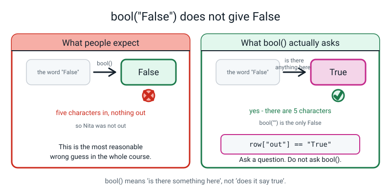
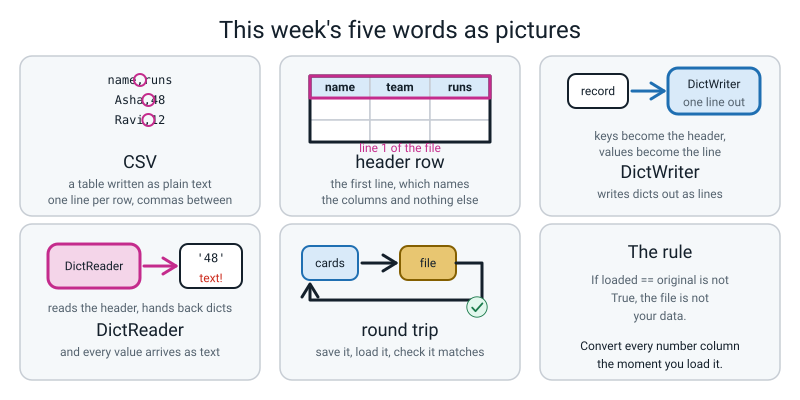

# Week 16 — The Record Store: Save It and Load It Back

[⬅ Week 15](week-15.md) · [Course Home](../README.md) · [Next ➡](week-17.md) · [Workbook](../workbook/week-16.md)

---

> ### This week in one sentence
> **A CSV is your dataset written out as plain text — and everything read back from one is a piece of writing until you turn it back into a number yourself.**
>
> **By the end of this chapter you will be able to:**
> - **Write a list of dictionaries out to a CSV file** with a header row, using `csv.DictWriter`
> - **Read that file back in** with `csv.DictReader` and get dictionaries again
> - **Prove, by printing `type()`**, that every value came back as text — including the ones that went out as numbers
> - **Convert the numeric fields back**, and show the round trip is now complete: `loaded == squad` prints `True`
> - Explain what `with open(...)` does for you that a plain `open()` does not
>
> **New syntax:** `import csv` · `with open(path, "w", newline="") as f:` · `csv.DictWriter(f, fieldnames=...)` · `csv.DictReader(f)`
>
> **Reading time:** about 30 minutes. **Homework:** about 60 minutes.

---

## 🪝 Start Here

You have twelve index cards on the table. Twelve cricketers. Five things written on each card: name, team, runs, balls, out.

Now here is the problem you have had for three weeks and have not noticed.

**Close the program and the whole dataset is gone.** It only ever existed inside a running Python file. Tomorrow morning you would have to type all twelve records again. That is not a dataset. That is a chore.

So we are going to write it down somewhere it will stay.

Pick up one card — Asha, Falcons, 48 runs, 32 balls, out. And imagine you have **one postcard** and you want somebody far away to end up with all five of those facts.

How would you write it on the postcard? Say it out loud before you read on.

Almost everybody says something like: **`Asha, Falcons, 48, 32, True`**. Commas between the things. One line.

Good. Now the strange question, and it is the whole lesson.

The person at the other end reads your postcard. They see `48`.

> **Is that a number, or is it two shapes you drew with a pen?**

Sit with it for a second, because it genuinely is strange.

It is **two shapes.** A four and an eight. It *means* forty-eight to you, because you know how to read. But there is no forty-eight on that postcard. A postcard can only carry handwriting.

**You cannot post a Lego brick.** You can post a *drawing* of a Lego brick, and it is the person at the other end who has to turn the drawing back into a brick in their head.

Hold on to that. Everything this week comes out of it.

Now do all twelve cards. One line each, commas between the fields. Go on — actually write them, on paper.

When you have finished, hand your sheet to somebody who has never seen your cards and ask them to read line three. They will read `Nita,Falcons,77,55,False`.

Then ask them: **"what is that 77?"**

They cannot know. Nothing on your sheet says which field is which. So add one more line, right at the very top, before any of the players:

```text
name,team,runs,balls,out
```

That top line has a name. It is called the **header row**, and it is the difference between a pile of text and a table. And what you now have on that sheet is called a **CSV** — and it is exactly the format that every spreadsheet on Earth uses.

Count your lines. **Thirteen.** One header, twelve players.


*Figure 16.1 — On the left, what a table looks like in your head. On the right, what is actually in the file. The boxes and the bold header are things your eye adds.*

---

## 🧠 The Big Idea

> **📌 About the code in this section.** The blocks below are **illustrations, not files**. They show you the shape of one idea, and each one carries on from the one above it — the `import` lines and the data are typed once, in the first block that needs them. **The complete, runnable file is in 💻 Type This.** If you copy a block from this section on its own and Python says `NameError`, that is why, and nothing is broken.

### 1. A CSV is a table written down as plain text

**The plain explanation.** A CSV file is text and nothing else. The first line names the columns. Every line after it is one row, with commas between the fields.

> **CSV** — *comma-separated values*. A plain text file where the first line names the columns and every line after it is one record, with commas between the fields.
> **header row** — that first line. It gives the column names and holds no data.

**The analogy.** It is the postcard from the hook, thirteen times over. A stack of thirteen postcards, in order, with the first one saying what the other twelve mean.

**A concrete example.** Here is the entire file this week produces. Not a picture of it, not a summary of it — **this is the file**:

```text
name,team,runs,balls,out
Asha,Falcons,48,32,True
Ravi,Falcons,12,20,True
Nita,Falcons,77,55,False
Sam,Falcons,5,9,True
Kabir,Tigers,63,41,True
Meera,Tigers,30,28,False
Dev,Tigers,0,3,True
Zara,Tigers,41,39,True
Iqbal,Hawks,55,44,True
Lena,Hawks,22,18,True
Omar,Hawks,90,61,False
Priya,Owls,104,70,False
```

Thirteen lines. **There is nothing else in there.** No fonts. No colours. No cell borders. No formulas. And — this is the one that matters — **nowhere does it say which columns are numbers.**

Two small arithmetic facts that turn out to be useful checks:

| Check | The rule | Here |
|---|---|---|
| lines in the file | records **+ 1** (the header) | 12 records → 13 lines |
| commas on one line | fields **− 1** | 5 fields → 4 commas |

> **💡 Try this:** when a file is meant to hold 30 records, open it and count the lines. If it says 30 and not 31, you have already found a bug and you have not read a single value yet.

**Why does everybody use something this simple?** Because it is the lowest common denominator. Every spreadsheet opens a CSV. Every programming language reads one. It has survived fifty years precisely because it is too simple to break.

### 2. A file cannot remember what kind of thing something was

**The plain explanation.** In your program, `48` is a **number**. You can add one to it and get 49.

In the file, `48` is the character `4` followed by the character `8`. That is all it *can* be, because a text file holds characters and nothing else.

So when Python reads the file back, it has to hand you something — and the only honest thing it can hand you is the characters it found. It gives you the text `'48'`.

**It does not guess.** And it is right not to guess.

**The analogy.** The postcard again. The drawing of the brick came back perfectly. The brick did not come back at all, because it never went.

**A concrete example, and this is the moment the week turns.** Five values go out. Five values come back. Three of them are a different kind of thing:

```text
field      in memory        from the file
----------------------------------------------
name       Asha     str     Asha     str
team       Falcons  str     Falcons  str
runs       48       int     48       str
balls      32       int     32       str
out        True     bool    True     str
```

Look at the `runs` row. **`48` and `48`.** They are identical on the screen. They are not the same thing at all, and the only way you found out was by asking `type()`.


*Figure 16.2 — The five values look identical on the page. Three of them are a different kind of thing on the way back.*

**Why doesn't Python just guess?** Because any guessing rule it invented would be wrong somewhere. Think about a column of shirt numbers where one player wears `007` — guess that into a number and the zeros are gone forever. Think about a phone number starting with `0`. Think about a column where somebody typed `N/A` in one cell.

So Python makes no rule and hands the decision to the only person who knows what the column is for: **you.**

> **⚠️ Watch out:** notice the `out` column in that table. It went out as `True`, a genuine true-or-false. It comes back as the four characters `T`, `r`, `u`, `e`. There is a nasty trap waiting there, and it is in "Don't Get Tricked" at the bottom of this chapter.

### 3. `with open(...)` shuts the door for you

**The plain explanation.** Opening a file has three parts: open it, use it, shut it. `with` makes the shutting automatic and unskippable.

Without `with`, it looks like this:

```python
f = open("players.csv", "w")
# ... write things ...
f.close()          # and you had better not forget this
```

The problem is not forgetfulness. The problem is **crashes**. If something goes wrong between the `open` and the `close`, the `close` never runs.

**The analogy, and it is exact.** You do not shut the fridge because of the light. You shut it because things spoil.

**A concrete example.** Here is why an unclosed file is not just untidy — it can be *empty*. Type this and run it:

```python
"""halfwritten.py - what an unclosed file looks like from the outside."""

f = open("half.csv", "w", newline="", encoding="utf-8")   # no `with`
f.write("name,runs\n")
f.write("Asha,48\n")
f.write("Ravi,12\n")
# and now something goes wrong before we ever reach f.close()

with open("half.csv", "r", encoding="utf-8") as check:    # look at the file NOW
    print("what is on the disk so far:", repr(check.read()))

f.close()                                                  # NOW it gets flushed

with open("half.csv", "r", encoding="utf-8") as check:
    print("what is on the disk after closing:", repr(check.read()))
```

```text
what is on the disk so far: ''
what is on the disk after closing: 'name,runs\nAsha,48\nRavi,12\n'
```

**Read the first line of that output again.** Three `f.write` calls had already run, and the file on the disk was **completely empty**. The computer was holding all of it in its hand, and it only put it on the disk when the file was shut.

If your program had crashed one line earlier, you would have a file with nothing in it and no idea why.

So the rule, in one line:

> **If you opened it, `with` shuts it — even if your program falls over.**


*Figure 16.3 — The fridge analogy is exact: you do not shut the fridge because of the light, you shut it because things spoil.*

One practical consequence you will hit: **the file only works inside the block.** Outside it, `f` is closed. Touching a reader out there gives you `ValueError: I/O operation on closed file.`, which is in the "When It Breaks" section — and the fix teaches you the shape.

### 4. `DictWriter` writes the dicts; `DictReader` reads them back

**The plain explanation.** Python comes with a toolkit for this. You do not write it yourself, and you should not, because somebody already got the fiddly parts right.

```python
import csv
```

That is the whole install. `csv` ships with Python — the same shape as `import stats` from Week 12, except somebody else wrote this one and it is very well tested.

Two helpers, and their names tell you what they do:

> **DictWriter** — a helper that takes dictionaries and writes each one out as a line of comma-separated text.
> **DictReader** — a helper that reads a CSV and hands back one dictionary per line, using the header row as the keys.

**The analogy.** `DictWriter` is a rubber stamp. You tell it the column order once, and then every record you feed it comes out stamped in that order, every time, identically.

**A concrete example, line by line:**

```python
with open(path, "w", newline="", encoding="utf-8") as f:   # open for WRITING
    writer = csv.DictWriter(f, fieldnames=fieldnames)      # it needs the column order
    writer.writeheader()                                   # line 1: the column names
    writer.writerows(rows)                                 # then one line per dict
```

| The bit | What it does, in plain words |
|---|---|
| `open(path, "w")` | Open the file for **w**riting. **If a file of that name already exists it is wiped, instantly, with no question asked.** |
| `newline=""` | Stops Windows putting a blank line between every row. Harmless on a Mac, essential on Windows. **Always include it with `csv`.** |
| `encoding="utf-8"` | Lets names with accents, or in other scripts, save correctly. Also just "always include it". |
| `as f` | While you are inside the block, the open file's name is `f`. |
| `csv.DictWriter(f, fieldnames=...)` | Make the stamp. `fieldnames` does two jobs: it fixes the **order** of the columns, and it decides **which keys** get written at all. |
| `.writeheader()` | Writes line 1 — the column names. **Forget it and there is no header at all.** |
| `.writerows(rows)` | Writes one line per dictionary. (`.writerow(one_dict)` writes a single one.) |

And reading it back is three lines:

```python
with open(path, "r", newline="", encoding="utf-8") as f:   # open for READING
    reader = csv.DictReader(f)                             # first line = the keys
    return list(reader)                                    # turn it into a real list
```

| The bit | What it does |
|---|---|
| `open(path, "r")` | Open for **r**eading. Nothing is wiped. If the file is not there you get `FileNotFoundError`. |
| `csv.DictReader(f)` | Reads the **header line** and uses those names as the dictionary keys. That is the whole point of the "Dict" in the name. |
| `list(reader)` | A `DictReader` walks the file **once** and is then used up. `list()` walks it once and keeps the results — which is what you actually want. |

> **⚠️ Watch out:** if the header line is missing, `DictReader` does not complain. It *cannot* — it has no way to tell. It takes the **first data line** and uses that as the column names. So Asha becomes a column name and you get eleven records instead of twelve. You will see this happen on purpose in Step 3.

### 5. The round trip, and the one line that closes it

**The plain explanation.** Saving is only half the job. The job is finished when you can prove that what came back is what went out.

> **round trip** — save the data to a file, read it back, and check you got exactly what you started with. If the round trip fails, the file is not really your data.

**The analogy.** Posting yourself a parcel. You do not know the post office works until one arrives back on your own doormat and you open it and everything is in there.

**A concrete example.** There are four stages, and stage 4 is the one everybody forgets:

| Stage | Where it is | What `runs` holds | What kind of thing |
|---|---|---|---|
| 1 | in `squad`, in memory | `48` | whole number (`int`) |
| 2 | in `players.csv`, on the disk | the characters `4` `8` | writing, and nothing else |
| 3 | in `raw`, straight after `DictReader` | `'48'` | text (`str`) |
| 4 | in `fixed`, after `int()` | `48` | whole number (`int`) |

The fix at stage 4 is a **typed loader** — a load function that says, in code, what each column is supposed to be:

```python
def load_players(path):
    """Read players.csv and put every field back to the type it went in as."""
    records = []                                               # the list we hand back
    with open(path, "r", newline="", encoding="utf-8") as f:
        for row in csv.DictReader(f):                          # one dict per line
            row["runs"] = int(row["runs"])                     # text -> whole number
            row["balls"] = int(row["balls"])                   # text -> whole number
            row["out"] = (row["out"] == "True")                # text -> True or False
            records.append(row)
    return records
```

**Notice what is *not* in there.** `name` and `team`. They were text going out and they are text coming back, so there is nothing to fix. **You only convert the columns that were not text.**

And then the one line that proves the whole week:

```python
print("round trip identical?", load_players("players.csv") == squad)
```

```text
round trip identical? True
```

That `True` means: every record, every key, every value, and **every type** matches what went out. Nothing was lost and nothing was quietly changed. Anything less than `True` and the file is not your data yet.


*Figure 16.4 — Four stages. Stage 3 is where every beginner's project quietly breaks, and stage 4 is one line per column.*

---

## 💻 Type This

Everything today goes in the folder you have been using since Week 12, next to `records.py` and `squad_data.py`.

### Step 1 — one new line at the top of `records.py`

Open last week's `records.py`. At the **very top**, above the first function, add one line:

```python
import csv
```

> **What that line does.** Goes and fetches Python's built-in CSV toolkit. Nothing to install — it is already on your machine. Imports live at the top of the file, always, so that everything below them can use them.

### Step 2 — `save_csv`, at the bottom of `records.py`

Add this to the bottom of `records.py`. **Type it, do not paste it** — the indentation is the part that matters and typing is how you learn it.

```python
def save_csv(rows, path, fieldnames):
    """Write the rows out as a CSV file: one header line, then one line per row."""
    with open(path, "w", newline="", encoding="utf-8") as f:   # open for WRITING
        writer = csv.DictWriter(f, fieldnames=fieldnames)      # it needs the column order
        writer.writerows(rows)                                 # one line per dict
    return len(rows)
```

**What each new line does.**

- `with open(path, "w", ...) as f:` — open the file for writing, call it `f` while we are in here, and shut it on the way out no matter what.
- `csv.DictWriter(f, fieldnames=fieldnames)` — build the stamp, and tell it the column order.
- `writer.writerows(rows)` — stamp every record.
- `return len(rows)` — hand back how many were written, so the caller can print it and check.

> **⚠️ Watch out:** something is missing from that function on purpose. Do not go looking for it — you are going to find it by running the program, which is a much better way to learn it.

### Step 3 — `load_csv`, also at the bottom of `records.py`

```python
def load_csv(path):
    """Read a CSV back in. WARNING: every value comes back as text."""
    with open(path, "r", newline="", encoding="utf-8") as f:   # open for READING
        reader = csv.DictReader(f)                             # first line = the keys
        return list(reader)                                    # turn it into a real list
```

**What each new line does.**

- `open(path, "r", ...)` — `"r"` is for **r**eading. Nothing gets wiped.
- `csv.DictReader(f)` — reads the header line and uses those names as the keys.
- `return list(reader)` — and notice this is **inside** the `with` block. It has to be. The moment the block ends, the file is shut and the reader has nothing to read.

### Step 4 — a new file, `store16.py`, and the first surprise

New file, in the same folder:

```python
"""store16.py - the twelve records, out to a file and back again."""

from records import save_csv, load_csv
from squad_data import squad

FIELDS = ["name", "team", "runs", "balls", "out"]

written = save_csv(squad, "players.csv", FIELDS)
print("rows written:", written)

loaded = load_csv("players.csv")
print("rows loaded :", len(loaded))
print("row 0       :", loaded[0])
```

**Predict before you run it.** Three lines are going to print. What will they say? Write your prediction down — most people say 12, 12, and Asha's record.

Run it. Real output:

```text
rows written: 12
rows loaded : 11
row 0       : {'Asha': 'Ravi', 'Falcons': 'Falcons', '48': '12', '32': '20', 'True': 'True'}
```

**Read the first two numbers.** Twelve written. **Eleven** loaded.

Twelve went out and eleven came back. **You lost a player and nothing complained.**

Now look at row 0. The keys are supposed to be `name`, `team`, `runs`. They are `Asha`, `Falcons`, `48`. **Asha has become a column name.**

Open `players.csv` in your text editor and read line one. It says `Asha,Falcons,48,32,True`. There is **no header row in the file** — `save_csv` never wrote one — and `DictReader` cannot tell. It took the first line and assumed those were the column names, because that is the only thing a first line can be.

One missing line of code. Add `writeheader()` to `save_csv` in `records.py`, immediately above the `writerows` line. Both lines are shown so the indentation is unambiguous:

```python
        writer.writeheader()                                   # line 1: the column names
        writer.writerows(rows)                                 # then one line per dict
```

Run `store16.py` again. Real output:

```text
rows written: 12
rows loaded : 12
row 0       : {'name': 'Asha', 'team': 'Falcons', 'runs': '48', 'balls': '32', 'out': 'True'}
```

**Twelve and twelve.** And here is the habit to take away, and it is exactly last week's "do the buckets add up?":

> **Print what went out and print what came back, on adjacent lines, every single time you save anything.** It costs one line and it caught this in three seconds.

### Step 5 — the type table, and the reveal

Look at row 0 on your screen and read the `runs` value character for character. **Quote, four, eight, quote.**

There are quote marks round it. Python prints text with quotes so that you can tell it apart from a number. Let us prove it properly. Add to the bottom of `store16.py`:

```python
print("field      in memory        from the file")
print("-" * 46)
for field in FIELDS:
    before = squad[0][field]
    after = loaded[0][field]
    print(f"{field:<10} {str(before):<8} {type(before).__name__:<7} {str(after):<8} {type(after).__name__}")
```

**What the new lines do.** `type(x)` gives you the kind of thing `x` is; `.__name__` pulls the short name out of it, so you get `int` rather than `<class 'int'>`. The `:<10` and `:<8` are Week 3's alignment, so the columns line up.

Real output:

```text
field      in memory        from the file
----------------------------------------------
name       Asha     str     Asha     str
team       Falcons  str     Falcons  str
runs       48       int     48       str
balls      32       int     32       str
out        True     bool    True     str
```

Five fields went out. Five came back. **Three of them changed kind, and nothing warned you.**

### Step 6 — prove it hurts. Two proofs, one loud and one silent

Add Asha's score plus one, twice — once from memory, once from the file:

```python
print("in memory:", squad[0]["runs"] + 1)
print("from file:", loaded[0]["runs"] + 1)
```

```text
in memory: 49
Traceback (most recent call last):
  File "store16.py", line 12, in <module>
    print("from file:", loaded[0]["runs"] + 1)
                        ~~~~~~~~~~~~~~~~~~^~~
TypeError: can only concatenate str (not "int") to str
```

That is a *good* error. It stopped you. Now change the `1` to `"1"` — with quotes — and watch what it does instead of crashing:

```python
print("from file:", loaded[0]["runs"] + "1")
```

```text
in memory: 49
from file: 481
```

**481.** Four hundred and eighty-one. It did not add anything — it glued a `1` onto the end of `48`, because that is what `+` does to text.

Now the one that matters. Add these three lines:

```python
from records import column
print("highest score in memory:", max(column(squad, "runs")))
print("highest score from file:", max(column(loaded, "runs")))
```

**Predict both numbers before you run it.**

```text
highest score in memory: 104
highest score from file: 90
```

Read both numbers. **104 and 90.**

Which is right? 104 — that is Priya. So the second line is wrong.

Did anything crash? **No.** Did anything warn you? **No.**

Your program, given a file you wrote yourself thirty seconds ago, reports that the best batter in the squad scored 90. **That is Omar. Priya scored fourteen more runs than Omar and the program cannot see her.**

Why? Because `max` on text compares **character by character**, the way an alphabetical list works. It looks at `'90'` and `'104'`, compares the first characters — `9` against `1` — and `9` comes later, so `'90'` wins. It never looks at the rest.

This is the worst kind of bug there is, and it is the reason this week exists. **It ran. It printed. It was confidently wrong.** The only reason you caught it is that you already knew the answer.

### Step 7 — the typed loader, and closing the round trip

So we do the job the file cannot do for us. Add this to `records.py`:

```python
def load_players(path):
    """Read players.csv and put every field back to the type it went in as."""
    records = []                                               # the list we hand back
    with open(path, "r", newline="", encoding="utf-8") as f:
        for row in csv.DictReader(f):                          # one dict per line
            row["runs"] = int(row["runs"])                     # text -> whole number
            row["balls"] = int(row["balls"])                   # text -> whole number
            row["out"] = (row["out"] == "True")                # text -> True or False
            records.append(row)
    return records
```

Three lines convert, and two columns are left alone. That is the whole idea.

### The complete finished program

Here is `store16.py`, all of it, assembled from the pieces above:

```python
"""store16.py - write the squad out, read it back, and prove the round trip closed."""

from records import save_csv, load_csv, load_players, column
from squad_data import squad

FIELDS = ["name", "team", "runs", "balls", "out"]
PATH = "players.csv"

# --- 1. out to the file -----------------------------------------------------
print("=" * 52)
written = save_csv(squad, PATH, FIELDS)
print(f"wrote {written} rows to {PATH} (plus 1 header line)")

# --- 2. back in, raw --------------------------------------------------------
raw = load_csv(PATH)
print(f"read  {len(raw)} rows back")

# --- 3. the type table, field by field, for row 0 ---------------------------
print("=" * 52)
print(f"{'field':<8}{'went in as':<14}{'came back as':<16}{'same?'}")
print("-" * 52)
for field in FIELDS:
    before = squad[0][field]
    after = raw[0][field]
    same = "yes" if type(before) is type(after) else "NO"
    print(f"{field:<8}{type(before).__name__:<14}{type(after).__name__:<16}{same}")

# --- 4. the two proofs ------------------------------------------------------
print("=" * 52)
print("in memory, runs + 1 :", squad[0]["runs"] + 1)
print("from file, runs + '1':", raw[0]["runs"] + "1")
print("highest score in memory:", max(column(squad, "runs")))
print("highest score from file:", max(column(raw, "runs")), "<-- WRONG, and silent")

# --- 5. convert, and close the round trip -----------------------------------
print("=" * 52)
fixed = load_players(PATH)
print("row 0 in memory:", squad[0])
print("row 0 converted:", fixed[0])
print("round trip identical?", fixed == squad)
print("highest score, converted:", max(column(fixed, "runs")))
print("=" * 52)
```

Real output:

```text
====================================================
wrote 12 rows to players.csv (plus 1 header line)
read  12 rows back
====================================================
field   went in as    came back as    same?
----------------------------------------------------
name    str           str             yes
team    str           str             yes
runs    int           str             NO
balls   int           str             NO
out     bool          str             NO
====================================================
in memory, runs + 1 : 49
from file, runs + '1': 481
highest score in memory: 104
highest score from file: 90 <-- WRONG, and silent
====================================================
row 0 in memory: {'name': 'Asha', 'team': 'Falcons', 'runs': 48, 'balls': 32, 'out': True}
row 0 converted: {'name': 'Asha', 'team': 'Falcons', 'runs': 48, 'balls': 32, 'out': True}
round trip identical? True
highest score, converted: 104
====================================================
```

**`round trip identical? True`.** That is the line. Nothing else counts as finished.

---

## 🔍 Worked Examples

Three complete programs, in three different subjects. Each one is a whole file — type it, run it, and compare your output with what is printed here.

### Worked Example 1 — Five lunch orders (food)

This one needs no other file. Everything is in it.

```python
"""lunch16.py - five lunch orders, out to a file and back again."""

import csv

FIELDS = ["item", "day", "price", "veg"]
PATH = "lunch.csv"

orders = [
    {"item": "Cheese slice", "day": "Mon", "price": 40,  "veg": True},
    {"item": "Chicken roll", "day": "Mon", "price": 90,  "veg": False},
    {"item": "Veg puff",     "day": "Tue", "price": 25,  "veg": True},
    {"item": "Paneer wrap",  "day": "Wed", "price": 100, "veg": True},
    {"item": "Egg sandwich", "day": "Wed", "price": 55,  "veg": False},
]

# --- 1. save it -------------------------------------------------------------
with open(PATH, "w", newline="", encoding="utf-8") as f:
    writer = csv.DictWriter(f, fieldnames=FIELDS)   # the column order
    writer.writeheader()                            # line 1: the names
    writer.writerows(orders)                        # then five lines
print("rows written:", len(orders))

# --- 2. read the file as plain text, and count the lines --------------------
with open(PATH, "r", encoding="utf-8") as f:
    lines = f.readlines()
print("lines in the file:", len(lines), "= 1 header +", len(lines) - 1, "orders")
print("line 1:", lines[0].strip())
print("line 2:", lines[1].strip())

# --- 3. read it back as records --------------------------------------------
with open(PATH, "r", newline="", encoding="utf-8") as f:
    raw = list(csv.DictReader(f))
print("rows loaded :", len(raw))
print("row 0       :", raw[0])
print("price type  :", type(raw[0]["price"]).__name__)

# --- 4. the silent wrong answer -------------------------------------------
print("dearest, from the file :", max([r["price"] for r in raw]), "<-- WRONG")
print("dearest, in memory     :", max([r["price"] for r in orders]))

# --- 5. convert, and close the round trip ---------------------------------
fixed = []
with open(PATH, "r", newline="", encoding="utf-8") as f:
    for row in csv.DictReader(f):
        row["price"] = int(row["price"])            # text -> whole number
        row["veg"] = (row["veg"] == "True")         # text -> True or False
        fixed.append(row)

print("round trip identical?", fixed == orders)
print("dearest, converted     :", max([r["price"] for r in fixed]))
print("total spend            :", sum([r["price"] for r in fixed]))
```

Real output:

```text
rows written: 5
lines in the file: 6 = 1 header + 5 orders
line 1: item,day,price,veg
line 2: Cheese slice,Mon,40,True
rows loaded : 5
row 0       : {'item': 'Cheese slice', 'day': 'Mon', 'price': '40', 'veg': 'True'}
price type  : str
dearest, from the file : 90 <-- WRONG
dearest, in memory     : 100
round trip identical? True
dearest, converted     : 100
total spend            : 310
```

**The thing to look at.** `90` versus `100`. Compared as text, `'90'` beats `'100'` because `9` beats `1` on the first character — and the paneer wrap, the most expensive thing on the list, is invisible. **Same bug as the cricket squad, different data, no error message.**

### Worked Example 2 — Six sprint times (sport)

This one has a **decimal** column, which needs `float()` and not `int()`.

```python
"""sprint16.py - six sprint times, out to a file and back. One column is a decimal."""

import csv

FIELDS = ["runner", "lane", "seconds", "finished"]
PATH = "sprint.csv"

heats = [
    {"runner": "Asha",  "lane": 1, "seconds": 9.8,  "finished": True},
    {"runner": "Ravi",  "lane": 2, "seconds": 11.2, "finished": True},
    {"runner": "Nita",  "lane": 3, "seconds": 10.4, "finished": True},
    {"runner": "Kabir", "lane": 4, "seconds": 9.5,  "finished": True},
    {"runner": "Meera", "lane": 5, "seconds": 12.7, "finished": False},
    {"runner": "Omar",  "lane": 6, "seconds": 10.0, "finished": True},
]

# --- 1. save --------------------------------------------------------------
with open(PATH, "w", newline="", encoding="utf-8") as f:
    writer = csv.DictWriter(f, fieldnames=FIELDS)
    writer.writeheader()
    writer.writerows(heats)
print("rows out:", len(heats))

# --- 2. what the file actually says --------------------------------------
with open(PATH, "r", encoding="utf-8") as f:
    for line_number, line in enumerate(f, start=1):
        print(f"  line {line_number}: {line.strip()}")

# --- 3. read back raw, and print the type of every field of row 0 --------
with open(PATH, "r", newline="", encoding="utf-8") as f:
    raw = list(csv.DictReader(f))

print("rows in :", len(raw))
for field in FIELDS:
    print(f"  {field:<9}{str(raw[0][field]):<8}{type(raw[0][field]).__name__}")

# --- 4. the silent wrong answer, twice -----------------------------------
print("fastest, from the file:", min([r["seconds"] for r in raw]), "<-- WRONG")
print("fastest, in memory    :", min([r["seconds"] for r in heats]))

# --- 5. convert: seconds needs float, lane needs int ---------------------
fixed = []
with open(PATH, "r", newline="", encoding="utf-8") as f:
    for row in csv.DictReader(f):
        row["lane"] = int(row["lane"])                     # a whole number
        row["seconds"] = float(row["seconds"])             # a DECIMAL number
        row["finished"] = (row["finished"] == "True")      # true or false
        fixed.append(row)

print("round trip identical?", fixed == heats)
print("fastest, converted    :", min([r["seconds"] for r in fixed]))
finishers = [r for r in fixed if r["finished"]]
print("finishers:", len(finishers), "of", len(fixed))
average = sum([r["seconds"] for r in finishers]) / len(finishers)
print(f"average of the finishers: {average:.2f}s from {len(finishers)} runners")
```

Real output:

```text
rows out: 6
  line 1: runner,lane,seconds,finished
  line 2: Asha,1,9.8,True
  line 3: Ravi,2,11.2,True
  line 4: Nita,3,10.4,True
  line 5: Kabir,4,9.5,True
  line 6: Meera,5,12.7,False
  line 7: Omar,6,10.0,True
rows in : 6
  runner   Asha    str
  lane     1       str
  seconds  9.8     str
  finished True    str
fastest, from the file: 10.0 <-- WRONG
fastest, in memory    : 9.5
round trip identical? True
fastest, converted    : 9.5
finishers: 5 of 6
average of the finishers: 10.18s from 5 runners
```

**The thing to look at.** `min` on the text says the fastest runner did `10.0`. As *writing*, `'10.0'` comes before `'11.2'`, which comes before `'12.7'`, which comes before `'9.5'` — because `1` comes before `9`. **Kabir's 9.5 is the fastest time on the sheet and the program cannot see it.**

And notice `float()`, not `int()`. Try `int("9.8")` and you get `ValueError: invalid literal for int() with base 10: '9.8'`. `int()` will convert `"9"` but it refuses to quietly throw away the `.8`, which is exactly the right behaviour.

### Worked Example 3 — Eight homework marks (school)

This one has a column of digits that **must not be turned into a number.**

```python
"""marks16.py - eight homework marks, out to a file and back. One column is NOT a number."""

import csv

FIELDS = ["student_id", "name", "subject", "mark", "late"]
PATH = "marks.csv"

marks = [
    {"student_id": "007", "name": "Asha",  "subject": "maths",   "mark": 88, "late": False},
    {"student_id": "012", "name": "Ravi",  "subject": "maths",   "mark": 54, "late": True},
    {"student_id": "045", "name": "Nita",  "subject": "science", "mark": 91, "late": False},
    {"student_id": "003", "name": "Sam",   "subject": "science", "mark": 67, "late": False},
    {"student_id": "108", "name": "Kabir", "subject": "english", "mark": 100, "late": False},
    {"student_id": "021", "name": "Meera", "subject": "english", "mark": 72, "late": True},
    {"student_id": "099", "name": "Dev",   "subject": "maths",   "mark": 9,  "late": True},
    {"student_id": "056", "name": "Zara",  "subject": "science", "mark": 80, "late": False},
]

# --- 1. save and count the lines -----------------------------------------
with open(PATH, "w", newline="", encoding="utf-8") as f:
    writer = csv.DictWriter(f, fieldnames=FIELDS)
    writer.writeheader()
    writer.writerows(marks)

with open(PATH, "r", encoding="utf-8") as f:
    lines = f.readlines()
print("rows out:", len(marks), " lines in the file:", len(lines))
print("line 1:", lines[0].strip())
print("line 2:", lines[1].strip())

# --- 2. read back raw ----------------------------------------------------
with open(PATH, "r", newline="", encoding="utf-8") as f:
    raw = list(csv.DictReader(f))
print("rows in :", len(raw))
print("best mark from the file:", max([r["mark"] for r in raw]), "<-- WRONG")
print("best mark in memory    :", max([r["mark"] for r in marks]))

# --- 3. convert ONLY the columns that were not text ---------------------
fixed = []
with open(PATH, "r", newline="", encoding="utf-8") as f:
    for row in csv.DictReader(f):
        row["mark"] = int(row["mark"])                 # a whole number
        row["late"] = (row["late"] == "True")          # true or false
        # student_id is LEFT ALONE - see below
        fixed.append(row)

print("round trip identical?", fixed == marks)
print("best mark converted    :", max([r["mark"] for r in fixed]))

# --- 4. why student_id must stay text ----------------------------------
print("id as text  :", repr(fixed[0]["student_id"]))
print("id as number:", repr(int(fixed[0]["student_id"])))

# --- 5. one honest answer, with its row count -------------------------
for subject in ["maths", "science", "english"]:
    group = [r for r in fixed if r["subject"] == subject]
    total = sum([r["mark"] for r in group])
    print(f"{subject:<8} average {total / len(group):.1f} from {len(group)} marks")
```

Real output:

```text
rows out: 8  lines in the file: 9
line 1: student_id,name,subject,mark,late
line 2: 007,Asha,maths,88,False
rows in : 8
best mark from the file: 91 <-- WRONG
best mark in memory    : 100
round trip identical? True
best mark converted    : 100
id as text  : '007'
id as number: 7
maths    average 50.3 from 3 marks
science  average 79.3 from 3 marks
english  average 86.0 from 2 marks
```

**The thing to look at.** Two things, and the second is the interesting one.

`91` versus `100` — the text comparison again, and Kabir's perfect hundred is invisible.

And `'007'` becoming `7`. That one is not a bug in the loader; it is a **decision** about the data. Ask one question of any column of digits: **would you ever add two of them together?** You might add two marks. You would never add two student IDs, or two phone numbers, or two postcodes. Those are **identifiers** — labels that happen to be written with digits. Leave them as text, keep the leading zeros, and you never have to explain where `007` went.

---

## 🐞 When It Breaks

Every message below came from really running a broken version of this week's code. **And this week, three of the things that go wrong produce no error message at all.**

### Break 1 — arithmetic on a value straight out of a file

```python
print("from file:", loaded[0]["runs"] + 1)
```

```text
Traceback (most recent call last):
  File "store16.py", line 12, in <module>
    print("from file:", loaded[0]["runs"] + 1)
                        ~~~~~~~~~~~~~~~~~~^~~
TypeError: can only concatenate str (not "int") to str
```

**What Python is telling you.** "Concatenate" means *glue end to end*, which is what `+` does to text. So: *you gave me writing on the left and a number on the right. I can glue writing to writing, but I cannot glue a number onto writing.*

**Where you have met it before.** Week 2, as `'5' + 5`. Same error, arriving by post.

**The fix.** Convert it: `int(loaded[0]["runs"]) + 1`. Better still, convert the whole column in the loader so you never have to think about it again.

> **🐞 If you see this error:** it is *good news*. It stopped you. The same mistake with `+ "1"` instead of `+ 1` does not stop you — it prints `481` and carries on.

### Break 2 — the reading happens outside the `with` block

```python
def load_csv(path):
    with open(path, "r", newline="", encoding="utf-8") as f:
        reader = csv.DictReader(f)
    return list(reader)          # the file was closed one line ago
```

```text
Traceback (most recent call last):
  File "badload.py", line 12, in <module>
    rows = load_csv("players.csv")
  File "badload.py", line 9, in load_csv
    return list(reader)          # the file was closed one line ago
  ... two more File lines, from inside Python's own csv.py ...
ValueError: I/O operation on closed file.
```

**What Python is telling you.** *"You are trying to read a file I already shut."* The `return list(reader)` is one indent level to the **left**, so it happens *after* the `with` block ends — and `with` shuts the file the instant the block ends. That is exactly its job.

**The fix.** Move the reading **inside** the block:

```python
    with open(path, "r", newline="", encoding="utf-8") as f:
        reader = csv.DictReader(f)
        return list(reader)      # inside. One extra indent.
```

**The rule to remember.** *Turn the reader into a real list before the `with` block ends.* One indent level is the whole difference between working and not.

> **🧑‍🏫 If a student asks:** notice this traceback has **four** `File` lines, and two of them are inside Python's own files. Read the **last** one you recognise — `badload.py, line 9` — and start there. The lines below it are Python's own machinery, and they are not where your mistake is.

### Break 3 — converting the wrong column

```python
row["name"] = int(row["name"])       # name is not a number
```

```text
Traceback (most recent call last):
  File "wrongcol.py", line 8, in <module>
    row["name"] = int(row["name"])       # name is not a number
                  ~~~^^^^^^^^^^^^^
ValueError: invalid literal for int() with base 10: 'Asha'
```

**What Python is telling you.** *"You asked me to turn the word Asha into a whole number."* And it has quoted the offending value straight back at you — `'Asha'` — which tells you exactly which column you pointed at.

**The fix.** **Convert only the columns that were not text.** `name` and `team` were text going out and text coming back, so they need nothing at all.

**The version of this you will actually hit at home:** `ValueError: invalid literal for int() with base 10: '3.5'`. That is a decimal column, and the fix is `float()` rather than `int()`.

### The whole clinic, for reference

| What you see | What it means | The fix |
|---|---|---|
| `TypeError: can only concatenate str (not "int") to str` | "You asked me to glue a number onto some writing." | Convert it. `int(loaded[0]["runs"])`, or convert the whole column in the loader |
| `FileNotFoundError: [Errno 2] No such file or directory: 'player.csv'` | "There is no file with that name where I'm looking." | Check the spelling, then check the folder. `import os; print(os.getcwd())` prints where Python thinks it is |
| `ValueError: dict contains fields not in fieldnames: 'nickname'` | "One of your records has a key I wasn't told about." | Add the key to `FIELDS`, or remove it from the record. `DictWriter` refuses rather than silently dropping a column |
| `ValueError: invalid literal for int() with base 10: 'Asha'` | "You asked me to turn the word Asha into a whole number." | Convert only the number columns. The error quotes the value, which names the column for you |
| `ValueError: invalid literal for int() with base 10: '3.5'` | "That has a decimal point in it." | `float()`, not `int()`. `int()` refuses to quietly throw away the half |
| `ValueError: invalid literal for int() with base 10: ''` | "You asked me to turn nothing into a whole number." | A gap in the file — a record with a missing value. Find the row and fix it |
| `ValueError: I/O operation on closed file.` | "You're trying to read a file I already shut." | The `list(reader)` is outside the `with` block. Move it in |
| `KeyError: 'run'` | "There's no column with that name." | A misspelled field name. `print(loaded[0].keys())` and read the real names off the screen |
| `TypeError: object of type 'DictReader' has no len()` | "I can't count that; it isn't a list yet." | `rows = list(reader)` first, then `len(rows)` |
| `TypeError: DictWriter.__init__() missing 1 required positional argument: 'fieldnames'` | "You didn't tell me what the columns are." | `csv.DictWriter(f, fieldnames=FIELDS)`. It cannot guess the column order and will not try |
| `AttributeError: module 'csv' has no attribute 'DictWriter'` | "The thing I imported as `csv` hasn't got a `DictWriter` in it." | **You have a file called `csv.py` in the folder**, so `import csv` found yours. Rename it. Standing rule all year: never name a file after a library |
| **No error, `rows written: 12` and `rows loaded : 11`** | Nothing is wrong as far as Python is concerned | `writeheader()` was never called, so `DictReader` ate the first record and used it as the header. Add it — and print both counts every time |
| **No error, `max()` says the top score is `90`** | Nothing is wrong as far as Python is concerned | Comparing text, not numbers. Convert the column in the loader |
| **No error, every player is marked out** | Nothing is wrong as far as Python is concerned | `bool(row["out"])`. See "Don't Get Tricked" — `bool("False")` is `True` |
| **No error, a blank line between every row in the file** | Windows only, and Python thinks it did what you asked | `newline=""` is missing from the `open()` call. Always include it with `csv` |

> **🐞 If there is no error message at all:** you need two checks, and neither of them is "did it run?"
>
> 1. **How many went out, and how many came back?** Two numbers, on adjacent lines, every time you save anything.
> 2. **What does `type()` say?** Not "what does it look like". `48` and `'48'` are identical on the screen and different in every way that matters. This is the single most useful question in the whole of Level 2 and it is one word.

---

## 🎲 What We Did In Class

If you missed the lesson, this is the whole of it and you can do it at home in about forty minutes.

### The postcard, and twelve lines written by hand

One postcard, one card off the pile, and the question *"how would you write Asha on this?"* Then: **"the person at the other end reads `48`. Is that a number, or two shapes drawn with a pen?"**

Two shapes. **You cannot post a Lego brick.**

Then all twelve, on a blank sheet, one line each, commas between the fields. Then somebody reading line three back and nobody being able to say what the `77` was — until the **header row** got added at the top. Thirteen lines. One header, twelve players.

### The prediction that had to be written down first

Before any code ran, everybody filled in a column on workbook page 16.2: for each of the five fields, **number, text, or true/false, when it comes back out of the file?**

Most people predicted that `runs` would come back as a number. That prediction is why the reveal works, and if you are doing this at home, **write yours down before you run anything.**

### `save_csv` and `load_csv`, with one line missing on purpose

Both functions typed into `records.py`, with `import csv` at the top. `save_csv` went in **without** `writeheader()`, and nobody was told.

Then `store16.py` printed:

```text
rows written: 12
rows loaded : 11
row 0       : {'Asha': 'Ravi', 'Falcons': 'Falcons', '48': '12', '32': '20', 'True': 'True'}
```

Twelve out, eleven back. Asha turned into a set of column names. The fix was one line, and the *catch* was two numbers printed next to each other.

### The type table, and the two proofs

Five fields, before and after. Three of the five changed kind. Then `48 + 1` giving `49`, and `'48' + "1"` giving `481`, and `max` giving `104` in memory and **`90`** from the file, with nothing crashing and nothing warning.

Everybody read `90` out loud, then read the twelve scores off the cards, then found the 104.

### The typed loader, and `True`

`load_players`, with three conversions and two columns deliberately left alone. Then one line:

```python
print("round trip identical?", fixed == squad)
```

```text
round trip identical? True
```

### The `bool` surprise

Somebody always asks why we did not just write `bool(row["out"])`. So we tried it, with a mismatch finder:

```text
rows out: 12  rows in: 12
round trip identical? False
first mismatch at row 2
  original: {'name': 'Nita', 'team': 'Falcons', 'runs': 77, 'balls': 55, 'out': False}
  loaded  : {'name': 'Nita', 'team': 'Falcons', 'runs': 77, 'balls': 55, 'out': True}
  field 'out': False became True
```

And then the three lines that explain it:

```python
print("bool('True')  ->", bool("True"))
print("bool('False') ->", bool("False"))
print("bool('')      ->", bool(""))
```

```text
bool('True')  -> True
bool('False') -> True
bool('')      -> False
```

Notice what the mismatch finder gave us. Not "something is wrong", but **row 2, field `out`, `False` became `True`**. That is a program that helps you. Here it is, and it is worth keeping forever:

```python
if loaded != squad:
    for i in range(len(squad)):                  # Week 7's counting loop
        original = squad[i]                      # the record we wrote out
        back = loaded[i]                         # the record that came back
        if original != back:
            print("first mismatch at row", i)
            print("  original:", original)
            print("  loaded  :", back)
            for field in original:
                if original[field] != back[field]:
                    print(f"  field '{field}': {original[field]!r} became {back[field]!r}")
            break
```

### Reading the actual file, then the reward

`players.csv` opened in the **text editor** — not a spreadsheet. Thirteen lines read out loud. Commas found. *"This is your whole dataset, and it is about three hundred characters of writing. You could read it down a telephone."*

**Then** the reward: the same file opened in a spreadsheet. Boxes! A bold header! Numbers lined up on the right! **None of that is in the file.** The spreadsheet made it up, because it *guessed* that column three was numbers.

Remember that it guessed. In Week 23 you will meet a Python tool that guesses too, and you will be the person who checks.

### Two entries in the Bug Log, both with the word *silent* in them

The missing header, and the `90`. Neither produced an error message.

---

## 💬 Talk About It

**1. Python could have guessed that `48` was a number when it read the file. Would that have been better?**

*Hint:* start by admitting it would be **more convenient** almost all of the time, which is why the tool you meet in Week 23 does exactly that. Then go hunting for the cases where the guess is wrong: a shirt number written `007`, a phone number starting with `0`, a column where somebody typed `N/A` in one cell, a date written `03/04` that could be March or April depending on which country typed it. Any guessing rule you invent is wrong somewhere. So the real question is not *guess or don't guess* — it is **who is responsible for checking?** If nobody guesses, you must convert and you cannot forget. If something guesses, the work is done for you and it is now your job to notice when it guessed wrong. Which of those two would *you* rather be in charge of, and does your answer change if the data is somebody's medical records?

**2. `max()` said the best batter scored 90. Whose fault is that?**

*Hint:* be careful, because there are three candidates and only one is really guilty. `max` did precisely what it is defined to do — compare things, in order, and hand back the biggest. Comparing two pieces of writing is a perfectly legal thing to do, and `'90'` really is later than `'104'` in an alphabetical list. The file did not lie either; it stored the characters it was given. So the gap is between **the question you asked out loud** ("who scored the most runs?") and **the question you typed** ("which of these pieces of writing comes last?"). Then the practical half: what would have caught it? Not a better `max`. Knowing the answer already, or printing `type()`, or converting at the door. **Which of those three still works in Week 34 when you have a hundred rows and no idea what the answer should be?**

**3. Your program prints the wrong best player and never says it is unsure. Where else might that be happening right now?**

*Hint:* think about what has to be true for a wrong answer to survive. It has to be **plausible** — `90` is a perfectly believable cricket score, so nobody blinks. And nothing has to be **checking**. Now think about where you have seen a confident number recently: a step count, a "top artist of the year", a price comparison, a leaderboard at school. Most of those numbers passed through a file at some point. **How would you know?** And the uncomfortable follow-up: what do you now think you should do before you believe a number that somebody's program printed for you?

---

## ⚠️ Don't Get Tricked

### Trick 1 — "`bool("False")` gives `False`"


*Figure 16.5 — `bool()` asks "is there anything here?", not "does it say true?".*

| ❌ Wrong | ✅ Right |
|---|---|
| `row["out"] = bool(row["out"])` — "`bool` turns text into a true-or-false, so this converts the column." | `bool()` asks *"is there anything here at all?"* And `"False"` has five characters in it, so there is definitely something there, so it is `True`. **Every single player gets marked out.** The conversion that works is a **comparison**: `row["out"] = (row["out"] == "True")` |

This is the most reasonable wrong guess in the whole course. Prove it to yourself in three lines rather than believing me:

```python
print("bool('True')  ->", bool("True"))
print("bool('False') ->", bool("False"))
print("bool('')      ->", bool(""))
```

```text
bool('True')  -> True
bool('False') -> True
bool('')      -> False
```

The only text `bool()` calls `False` is **empty** text.

### Trick 2 — "the file remembers it was a number"

| ❌ Wrong | ✅ Right |
|---|---|
| "It went in as 48, so it comes out as 48. Why would it change?" | The **value** came back perfectly — the characters `4` and `8` are exactly what you wrote. What did not come back is the **kind of thing it was**, because there is nowhere in a text file to keep that. |

You will half-believe this even after you have seen `str` printed, because `48` still *looks* like a number on the screen. So do not argue with it — run this:

```python
print(int("48") + 1)
print("48" + "1")
```

```text
49
481
```

**`481`.** Text glued to text. That is not an argument, it is a number on your screen.

### Trick 3 — "convert on load means convert everything"

| ❌ Wrong | ✅ Right |
|---|---|
| A loader with five conversions in it, one per column, including `int(row["name"])`. | **You only convert the columns that were not text.** `name` and `team` went out as text and came back as text — nothing was lost, so there is nothing to fix. `int(row["name"])` gives you `ValueError: invalid literal for int() with base 10: 'Asha'`. |

And there is a sharper version of this trap that catches professionals. A column can be full of digits and still not be a number:

| Column | Convert? | Why |
|---|---|---|
| `runs` | **yes**, `int()` | you would add two of them together |
| `minutes` | **yes**, `float()` | you would average them |
| `student_id` `007` | **no** | you would never add two IDs. `int("007")` is `7` and the zeros never come back |
| `phone` | **no** | same reason, and it often starts with a 0 |

**The one question that decides it: would you ever add two of them together?**

### Trick 4 — "it printed a number, so it worked"

| ❌ Wrong | ✅ Right |
|---|---|
| "`max` printed 90, so the highest score is 90." | `max` printed **a** number. Whether it is **the** number depends on what kind of thing it was comparing, and it never tells you. |

Here is the whole trick in four lines, and it is worth typing:

```python
scores = ["104", "90", "9", "1000"]
print("as text   :", max(scores))
print("as numbers:", max([int(s) for s in scores]))
print("sorted as text:", sorted(scores))
```

```text
as text   : 90
as numbers: 1000
sorted as text: ['1000', '104', '9', '90']
```

Look at that last line. **`1000` comes first and `9` comes third.** That is not broken; that is what alphabetical order does to digits. `1` before `9`, every time, and length never enters into it.

**So the check is never "did it print something?"** It is: *what kind of thing was it comparing, and does the answer agree with something I already know?*

---

## 🌍 Where You've Seen This

1. **Every "Export" or "Download" button on a website.** Your school report card, your bank statement, your step counts — tap *export* and what lands on your phone is very often a `.csv`. It is thirteen-lines-of-text simple, which is exactly why every site offers it.
2. **The "import contacts" screen on a new phone.** It asks you for a CSV, and then it asks you which column is the phone number, because **the file does not say.** That screen exists precisely because a header row is not enough — somebody has to say what kind of thing each column is. You have now done that job by hand.
3. **A spreadsheet asking "keep as text?" when you paste in something like `007`.** That dialog box is this entire chapter, wearing a suit. Someone at Microsoft or Google knew that guessing would destroy leading zeros and decided to ask you instead.
4. **Excel turning gene names into dates.** This is real and it has happened in published science: paste in a gene called `SEPT2` and a spreadsheet decides you meant the 2nd of September. Researchers have had to rename genes because of it. **A program guessed what kind of thing something was, and it guessed wrong, and nothing warned anybody.**
5. **A game's save file.** Same round trip, every time you close it: write the state out, read it back, and hope it is exactly what you had. When a save file loads and your score is `0`, a conversion went wrong on the way in.
6. **Every leaderboard that has ever had a weirdly ordered top ten.** If `1000` sits above `999` but *below* `2`, you are looking at a text sort of a number column — this week's `90` beating `104`, in public, on a screen somebody shipped.
7. **The "1,234 results" line on a shopping site.** That is last week's row count. And the fact that it is not `1234` is somebody deciding how a number should be *written* — which is a different thing from what the number is.

---

## 🔑 Remember This

- **A CSV is plain text and nothing else.** One header line, then one line per record, commas between the fields. No colours, no boxes, and **no note anywhere saying which columns are numbers**.
- **Lines in the file = records + 1.** If you saved 30 records and the file has 30 lines, you forgot `writeheader()` and something is already broken.
- **Everything read out of a CSV is text.** Every value, every time. `48` comes back as `'48'`, and `True` comes back as `'True'`.
- **`with open(...)` shuts the file for you**, even if the code inside crashes — and a file that was never shut can be *completely empty* on the disk. If you opened it, `with` shuts it.
- **`"w"` wipes an existing file instantly**, with no question asked. Never point `"w"` at a file you cannot recreate.
- **Convert only the columns that were not text**, and ask one question of every column of digits: *would you ever add two of them together?* If no, leave it as text.
- **`bool("False")` is `True`.** Use a comparison — `row["out"] == "True"` — not `bool()`.
- **Print how many went out and how many came back**, on adjacent lines, every single time you save anything.
- **The round trip is not finished until `loaded == original` prints `True`.** Nothing else counts as done.

### Syntax reminder card

```python
import csv                                     # ships with Python. Top of the file.

FIELDS = ["name", "team", "runs", "balls", "out"]   # the column ORDER, decided once

# ---- SAVE -------------------------------------------------------------
with open("players.csv", "w", newline="", encoding="utf-8") as f:
    writer = csv.DictWriter(f, fieldnames=FIELDS)   # "w" WIPES an existing file
    writer.writeheader()                            # forget this -> lose a record
    writer.writerows(rows)                          # one line per dict
# the file is shut HERE, whatever happened inside

# ---- LOAD, raw (everything is text) ----------------------------------
with open("players.csv", "r", newline="", encoding="utf-8") as f:
    raw = list(csv.DictReader(f))                   # list() INSIDE the block
# raw[0]["runs"] is '48' - a str. Not 48.

# ---- CHECK, every time ----------------------------------------------
print("out:", len(rows), " in:", len(raw))          # these two must match
print(type(raw[0]["runs"]).__name__)                # -> str

# ---- LOAD, typed (the version you actually want) --------------------
records = []
with open("players.csv", "r", newline="", encoding="utf-8") as f:
    for row in csv.DictReader(f):
        row["runs"] = int(row["runs"])              # whole number
        row["balls"] = int(row["balls"])            # whole number
        row["out"] = (row["out"] == "True")         # NOT bool() - see Trick 1
        records.append(row)
# name and team are left alone. They were text all along.

# ---- THE ONE LINE THAT MEANS IT WORKED ------------------------------
print("round trip identical?", records == squad)    # must be True

# ---- decimals need float, not int -----------------------------------
# int("3.5")   -> ValueError: invalid literal for int() with base 10: '3.5'
# float("3.5") -> 3.5
```

---

## 📓 New Words


*Figure 16.6 — This week's five words, drawn.*

| Word | What it means | Example |
|---|---|---|
| **CSV** | Comma-separated values. A table written out as plain text, one line per record | `Asha,Falcons,48,32,True` |
| **header row** | The first line of a CSV. It names the columns and holds no data | `name,team,runs,balls,out` |
| **DictWriter** | The helper that takes dictionaries and writes each one out as a line of text | `csv.DictWriter(f, fieldnames=FIELDS)` |
| **DictReader** | The helper that reads a CSV back and hands you one dictionary per line, using the header as the keys | `list(csv.DictReader(f))` |
| **round trip** | Save it, load it back, and prove what came back is what went out | `loaded == squad` → `True` |

---

## 📤 Your Homework

Go to **[the Week 16 workbook](../workbook/week-16.md)**. About **60 minutes** in total. This one is a **project**, not an exercise — most of the hour is typing your own data.

| Section | What to do | Time |
|---|---|---|
| **Warm-Up** | Five quick questions from Week 15 | 5 min |
| **Predict the Output** | Four snippets. Two of them print a wrong answer with no error | 10 min |
| **Practice A & B** | Six reading questions, then five you write yourself | 15 min |
| **Fix the Broken Program** | A stock report with three planted bugs — one syntax, one crash, one silent | 10 min |
| **Build It — The Record Store** | 30 records, out to a CSV, back in, round trip proved field by field | 20 min |

**Three things I am marking hardest.**

**Does `loaded == records` print `True`?** That is the objective and it is binary. If it says `False`, do not guess — use the mismatch finder from this chapter and it will tell you exactly which row and which field went wrong.

**Is your file 31 lines?** Thirty records plus the header. If it is 30 lines, `writeheader()` is missing, and I want you to be the person who noticed rather than me.

**Is the proof sheet field by field?** For row 1 of your own data: every field, its value and its `type()`, **before** you convert and **after**. Five fields, two states each, ten lines. A student who only checked one column has done a fifth of the work.

**And one sentence at the bottom:** which of your five columns needed converting, which did not, and **why**. Full marks needs all three parts, and the *why* is that a text file can only store characters.

> **💡 Try this:** once your round trip prints `True`, go and break it on purpose. Change `int` to `float` on one column, run it again, and read what the mismatch finder says. Then put it back. Ninety seconds, and you will never again stare blankly at a `False`.

---

[⬅ Week 15](week-15.md) · [Course Home](../README.md) · [Week 17 ➡](week-17.md) · [📓 Workbook — Week 16](../workbook/week-16.md) · [Glossary](../../glossary.md)
