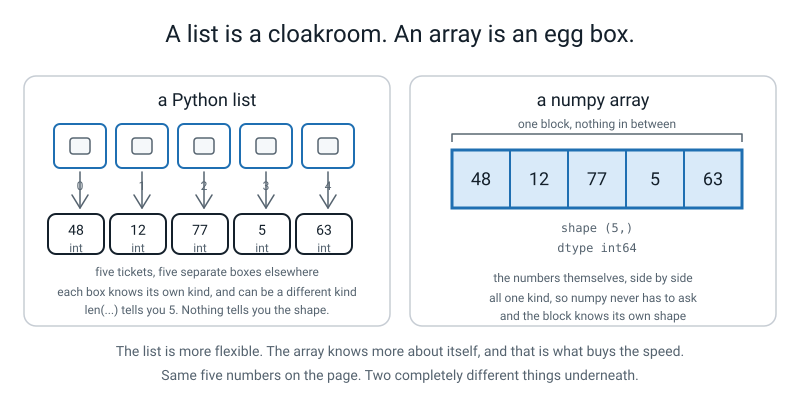
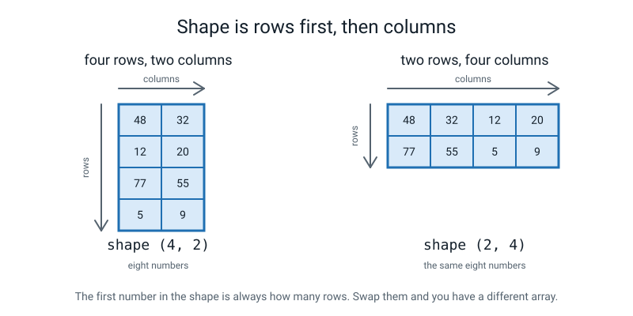
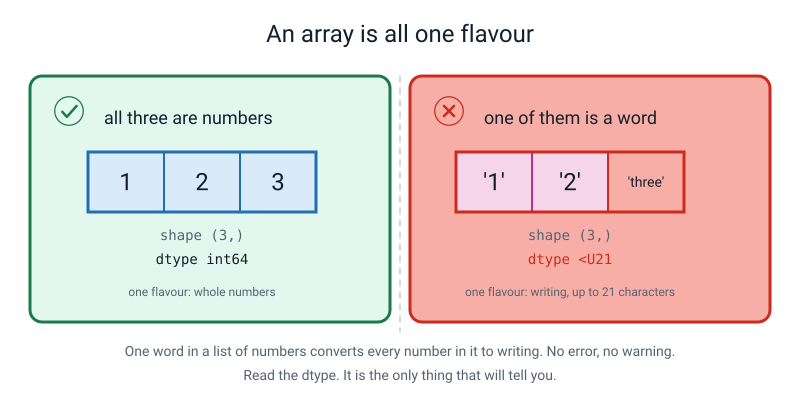
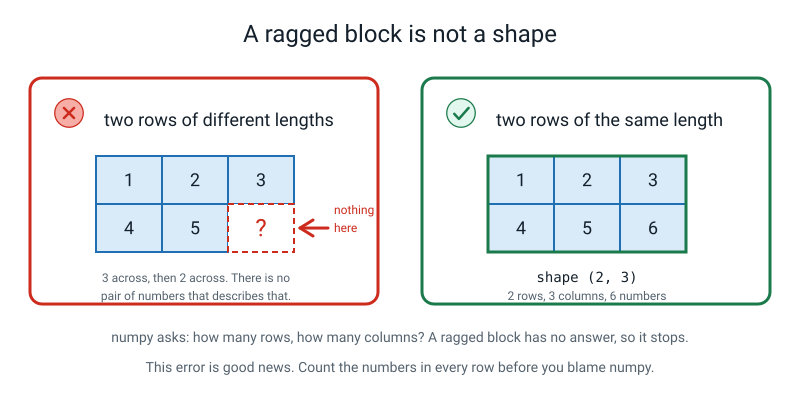
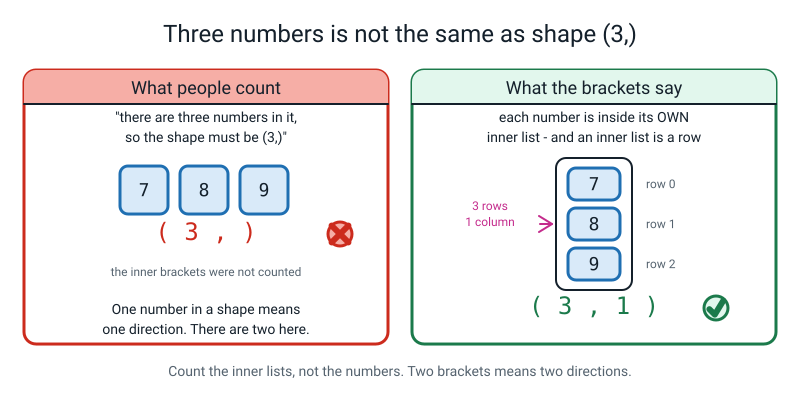
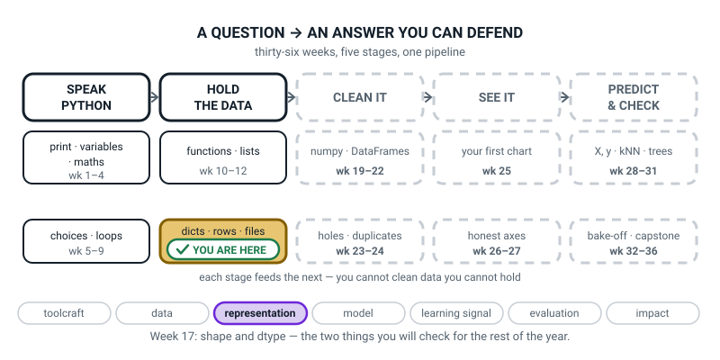
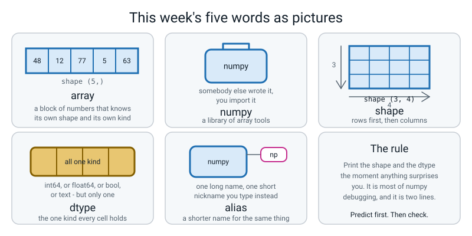

# Week 17 — One Number for Every Score: NumPy Arrays

[⬅ Week 16](week-16.md) · [Course Home](../README.md) · [Next ➡](week-18.md) · [Workbook](../workbook/week-17.md)

---

> ### This week in one sentence
> **An array is a list that knows its shape and holds only one kind of thing — and those two facts are the two things you print before you believe anything.**
>
> **By the end of this chapter you will be able to:**
> - **Import a library under a short alias** and explain what the alias is for
> - **Build a 1-D and a 2-D array** from numbers you typed out yourself
> - **Read `.shape`** and say what each number in it means
> - **Read `.dtype`** and explain why an array holds only one kind of number
> - **Predict the shape of an array before you run the code**, and write a sentence about any prediction you got wrong
>
> **New syntax:** `import numpy as np` · `np.array([...])` · `arr.shape` · `arr.dtype`
>
> **Reading time:** about 30 minutes. **Homework:** about 45 minutes.

---

## 🪝 Start Here

In this section you draw your twelve-record table on paper and change it, one step at a time. You need a pencil, a rubber and some graph paper.

Get a sheet of graph paper, or draw a grid on a blank sheet. And find a pencil **with a rubber on the end** — you are going to need the rubber more than the pencil.

Draw out your twelve-record table. Header row across the top — `name`, `team`, `runs`, `balls`, `out` — then one row per player. One thing per square. It takes four or five minutes.

Done? Good.

**Now rub out the header row.**

You will hesitate. Everyone hesitates. Do it anyway.

**Now rub out the `name` column.** All twelve names.

**And the `team` column. And the `out` column** — those are words too.

Stop. Look at what is left.

**A rectangle of numbers.** No words anywhere. Twelve rows, two columns, and every single square has a number in it.

That thing has a name. It is called an **array**, and it is what this week is about — and you just made one with a rubber.

Two questions, and the second is much harder than the first.

**What have you lost?**

You cannot tell which column is which. You cannot tell whose row is whose. If somebody handed you that block of numbers you could not tell them who scored 104. **That is a real loss.** It is not me being dramatic.

**What have you got that you did not have before?**

Look at the *shape* of it. Look at what is in every square.

It is a **perfect rectangle** — no gaps, nothing ragged, every row the same length. And **every single square holds the same kind of thing.** A number. Not a name in one square and a number in the next.

That is the whole trade of this week, and both halves are real: **you give up the labels, and what you get back is a shape and a single kind.**

Now count the rows out loud. **Twelve.** Count the columns. **Two.**

Write this underneath the block:

```text
(12, 2)
```

Twelve comma two. **Rows first, always.** That pair of numbers is called the **shape**, and printing it is going to be the most useful thing you do all term.


*Figure 17.1 — The list is more flexible. The array knows more about itself, and that is what buys the speed.*

---

## 🧠 The Big Idea

This section explains what an array is and how it differs from a list. It also covers the alias, `.shape`, `.dtype` and what numpy does with a ragged block.

> **📌 About the code in this section.** The blocks below are **illustrations, not files**. They show you the shape of one idea, and each one carries on from the one above it — the `import` lines and the data are typed once, in the first block that needs them. **The complete, runnable file is in 💻 Type This.** If you copy a block from this section on its own and Python says `NameError`, that is why, and nothing is broken.

### 1. numpy, and why arrays exist at all

**The plain explanation.** Everything you have built so far is made of Python **lists** and **dictionaries**. Those are wonderfully flexible: a list will hold `[1, "cat", 3.5, True]` — four completely different kinds of thing in four slots — and Python does not blink.

That flexibility is not free. To hold four different kinds of thing, the list cannot hold the things themselves. It holds a row of little notes saying *"the thing you want is over there."* Every value sits somewhere else, and each one carries its own label saying what kind of thing it is.

An **array** does not work that way.

> **numpy** — a library of tools for working with blocks of numbers. It is not part of Python; you install it once and then import it.
> **array** — a block of memory holding many values of **one single kind**, laid out end to end with nothing in between.

**The analogy, and it is exact.**

A Python list is a **cloakroom.** Numbered hooks, and on each hook a *ticket*, and the ticket tells you which locker downstairs your coat is in. To count the red coats you take a ticket, walk down, open a locker, look, walk back. Twelve times.

A numpy array is an **egg box.** Twelve slots, twelve eggs, all touching, all the same. You do not fetch anything. **You glance.**

**A concrete example.** Here is the difference in one table:

| | list of dicts | array |
|---|---|---|
| Can hold text, numbers and true/false together | yes | **no** — one kind only |
| Every value carries its own label | yes | **no** |
| Knows its own shape | no | **yes** |
| Arithmetic on the whole thing in one line | no | **yes** *(next week)* |
| You can `.append` to it | yes | **no** — a fixed size |
| What a wrong column costs you | a `KeyError` — loud | a wrong number — **silent** |

**How much faster is it, honestly?** For a million numbers, about twenty times. And here is the honest bit: **you have twelve numbers, and both are instant.** The speed is not why you are learning this.

You are learning it because next week `celsius * 9 / 5 + 32` will replace four lines of loop with one line that says what it means — and because every model in this course, every model in Level 3, and the giant language models in Level 4 all do their arithmetic exactly this way. **Learn to think in arrays now and everything after it is easier.**

> **⚠️ Watch out:** an array is *not* "just a faster list". Calling it that will get you into trouble, because the differences that bite you are the ones in the table above, and none of them are about speed.

### 2. The alias, and why everybody on Earth uses the same one

**The plain explanation.** One line, at the top of the file:

```python
import numpy as np
```

> **alias** — a shorter name you give something so you can type it more often.

`import numpy` on its own works perfectly, and then you write `numpy.array(...)` every single time. `as np` means *"and from now on, in this file, `np` means numpy."*

**The analogy.** A nickname. It changes nothing about the person; it just means you type less.

**Two things worth knowing.**

It is a nickname **inside this file only.** Another file could call it something else and numpy would not notice. This is exactly Week 12's `from stats import mean` idea — a naming decision, made by you, at the top of the file.

And **everybody writes `np`.** Not `numpy`, not `numby`, not `n`. `import numpy as banana` genuinely works — try it once and laugh — but you should write `np`, because it means every numpy example on the internet reads like your code and your code reads like theirs. **Conventions are how strangers cooperate.**

### 3. `.shape` — the first of the two facts

**The plain explanation.** `.shape` tells you how big the array is in each direction.

> **shape** — a pair of numbers (or just one) saying how big the array is in each direction. `(3, 4)` means **3 rows and 4 columns**.

**The analogy.** It is the pair of numbers you wrote under your rubbed-out grid. Rows first, then columns — exactly the order you counted them in.

**A concrete example.** Two arrays, two shapes:

```python
runs = np.array([48, 12, 77, 5])
table = np.array([[48, 32],
                  [12, 20],
                  [77, 55],
                  [5,  9]])
print(runs.shape)
print(table.shape)
```

```text
(4,)
(4, 2)
```

Three things get asked about that output every single year.

1. **"Why is there a comma in `(4,)` with nothing after it?"** Because `(4,)` is Python's way of writing *a pair-like thing with one item in it*.

   Without the comma, `(4)` would just be the number 4 in brackets, the same way `(2 + 3)` is five. The comma is Python saying "this is a collection, and it happens to have one thing in it."

   Read `(4,)` out loud as **"four, and that's the only direction there is."** It is not a typo.

2. **"Which number is rows?"** The first one. **Always.** `(4, 2)` is four rows, two columns. Rows first, then columns, exactly like reading a sentence: you go along a row, then down to the next one.

3. **"Is `(4, 2)` the same as `(2, 4)`?"** No. Same eight numbers, different arrangement, **different array.** And that matters enormously — next week, doing arithmetic between the wrong pair of shapes will sometimes fail and sometimes *succeed* and give you nonsense.


*Figure 17.2 — The first number in the shape is always how many rows. Swap them and you have a different array.*

> **⚠️ Watch out:** `.shape` has **no brackets after it.** It is a fact *about* the array, like your height — not something the array *does*. `runs.shape()` gives you `TypeError: 'tuple' object is not callable`, and that error is in "When It Breaks".

### 4. `.dtype` — the second of the two facts

**The plain explanation.** `.dtype` is short for **data type** — the one kind of thing every cell in the array holds.

> **dtype** — the one kind of thing every cell in the array holds. `int64` for whole numbers, `float64` for decimals, `bool` for true/false, and `<U`-something for text.

Remember `type()` from Week 2 — `int`, `float`, `str`, `bool`? Same idea, one important difference: **`type()` asks about one value. `.dtype` asks about all of them at once** — and it only gets one answer, because there is only one answer.

**The analogy.** An egg box holds eggs. All of them. You cannot put one tennis ball in an egg box and have the box still be an egg box.

**A concrete example.**

```python
print(np.array([48, 12, 77, 5]).dtype)
print(np.array([3.2, 4.0, 5.5]).dtype)
print(np.array([True, False]).dtype)
```

```text
int64
float64
bool
```

What the names mean, one line each:

| dtype | What it holds | The number in the name |
|---|---|---|
| `int64` | whole numbers, positive or negative | 64 bits of space per number — room for about 9 followed by 18 zeros |
| `float64` | numbers with a decimal point | 64 bits, giving about 15 reliable digits |
| `bool` | `True` or `False`, nothing else | — |
| `<U21` | text, up to 21 characters per cell | the 21 is the longest cell it needs room for. When numbers get turned into text, as in `[1, 2, "three"]`, numpy leaves room for the biggest possible whole number (21 characters), so you get `<U21` even though `"three"` is only 5 |

> **⚠️ Watch out:** on **Windows** you will often see `int32` where this chapter says `int64`. It is the same idea in a smaller box. Everything here works identically; only the number in the name differs.

**Why can an array only hold one kind?** Go back to §1: the values are laid out end to end with nothing in between, and to know where value number 40,000 is without hunting, every value must be the **same size**. Different kinds are different sizes. So the array picks one kind, for all of it, forever.

**Which means: if you put one word in a list of numbers, numpy has to choose — and it chooses text.**

```python
mixed = np.array([1, 2, "three"])
print(mixed)
print(mixed.dtype)
```

```text
['1' '2' 'three']
<U21
```

Look at what happened. **There are quote marks round the numbers.** The `1` is not a one any more; it is the character `1`. Both of your numbers turned into writing because one of the three was a word.

**And nothing complained.**

Why does numpy choose text rather than refusing? Because there *is* a kind that can hold all three of `1`, `2` and `three` — text can hold `1` as the character `1`. There is no kind that can hold `three` as a number. Given a choice between "convert everything to the one kind that fits" and "refuse", **numpy converts.**

Here is the rule, and once you have it, both of this week's surprises stop being surprises:

> **numpy picks the one kind that can hold every value without losing anything.**

That is also why `np.array([1, 2, 3.0])` comes out as **`float64`** and not `int64`. Two of the three numbers are whole, so most people predict `int64`. But a whole-number box has nowhere to put `3.0`'s decimal point, and a decimal box holds `1` perfectly well as `1.0`. **numpy picks the kind that loses nothing, not the kind most of the values already are.**

**And where have you seen this exact failure before?** Last week. `48` went into a file and came back as `'48'`. Same failure: *a container that could only hold one kind of thing turned your numbers into writing, and never said a word about it.* Same check, too — **read the type.**


*Figure 17.3 — One word in a list of numbers converts every number in it to writing. No error, no warning.*

### 5. When numpy refuses: the ragged block

**The plain explanation.** A 2-D array is built from a **list of lists**, one inner list per row. If the rows are not all the same length, there is no shape, and numpy stops.

**The analogy.** You cannot say how wide a rectangle is if the top edge is three squares and the bottom edge is two. It is not a rectangle.

**A concrete example.** Here is a block whose two rows have different lengths, and the error numpy gives for it:

```python
ragged = np.array([[1, 2, 3],
                   [4, 5]])
```

```text
Traceback (most recent call last):
  File "arrays.py", line 3, in <module>
    ragged = np.array([[1, 2, 3],
ValueError: setting an array element with a sequence. The requested array has an inhomogeneous shape after 1 dimensions. The detected shape was (2,) + inhomogeneous part.
```

That message is a mouthful, so translate it rather than reading it:

- **`inhomogeneous`** is a long word for **not all the same**. Do not let a Latin word be the thing that defeats you.
- **`dimensions`** means directions — rows and columns.

So numpy is saying: *"I got as far as counting the rows. There are two, so the first number is 2. Then I tried to count the columns, and I found three in one row and two in the other, and there is no number that is both three and two."*

**Is that good news or bad news?** It is **good news.**

Look at what numpy could have done instead. It could have stuck a zero on the end of the short row and carried on — and then you would have a made-up zero sitting in your data forever, with nothing to tell you. **It refused instead, and refusing is kinder.**


*Figure 17.4 — Count the numbers in every row before you blame numpy.*

### 6. What you lose, and why it is worth it

**The plain explanation.** This is the honest part, and it is the reason the hook made you rub out your own work.

Last week's record looked like this:

```python
{"name": "Asha", "team": "Falcons", "runs": 48, "balls": 32, "out": True}
```

Every value carries its label. You cannot misread it. Ask for a field that is not there and you get a loud `KeyError`.

An array of the same data looks like this:

```text
[[48 32]
 [12 20]
 [77 55]
 [ 5  9]]
```

**The names are gone. The column headings are gone.** There is nothing in that array that says the second column is balls. If you get the columns the wrong way round, numpy will do the arithmetic perfectly and hand you a **confidently wrong answer**.

So why do it? Because arrays can do maths to everything at once, and dictionaries cannot. That is the trade, it is made on purpose, and both halves are real.

**And the resolution arrives in Week 21, in one sentence: pandas gives you an array with the labels put back on.** This week you lose the labels on purpose, so that when pandas arrives you know exactly what it is for.

---

## 💻 Type This

In this section you build `arrays.py` one step at a time, then run a short program on your own data.

Everything goes in the same folder as `records.py` and `squad_data.py`.

### Step 0 — prove numpy is actually there

Before any of this, run this one line in a terminal:

```bash
python3 -c "import numpy; print(numpy.__version__)"
```

You want a version number. Anything recent is fine:

```text
1.26.4
```

If you get `ModuleNotFoundError: No module named 'numpy'`, stop and fix that first — try `pip3 install numpy`, then `python3 -m pip install numpy`. **This is the first thing all year that has to be installed, and it is the only thing this week that can waste an hour.**

### Step 1 — a new file, `arrays.py`, and two lines

Create a new file called `arrays.py` and type this.

```python
"""arrays.py - my first numpy arrays."""

import numpy as np                       # bring numpy in, and call it np from now on

print("numpy version:", np.__version__)
```

Run it:

```text
numpy version: 1.26.4
```

**What the new lines do.** `import numpy as np` fetches numpy and gives it the nickname `np` for the rest of this file. `np.__version__` — two underscores on each side — is information *about* numpy rather than something it does. You do not need to type it again today.

### Step 2 — build an array, and get it wrong first

Type this **exactly** as written, including the mistake:

```python
runs = np.array(48, 12, 77, 5)           # four scores... or so we hope
print(runs)
```

**Predict before you run it.** What do you expect? *Four numbers, presumably.*

Run it. Real output:

```text
numpy version: 1.26.4
Traceback (most recent call last):
  File "arrays.py", line 7, in <module>
    runs = np.array(48, 12, 77, 5)           # four scores... or so we hope
TypeError: array() takes from 1 to 2 positional arguments but 4 were given
```

Read the last line and say it in your own words: *it takes one or two things, and I gave it four.*

**`np.array` wants one thing: a list.** You gave it four separate numbers and it has nowhere to put numbers two, three and four. This is Week 10's parameters lesson arriving in a new place — a function has a fixed number of slots, and you handed it too many things.

So put the numbers **in a list first**, and hand it the list. One extra pair of brackets:

```python
runs = np.array([48, 12, 77, 5])         # ONE list, in one set of brackets
print("runs      :", runs)
print("shape     :", runs.shape)
print("dtype     :", runs.dtype)
```

Real output:

```text
numpy version: 1.26.4
runs      : [48 12 77  5]
shape     : (4,)
dtype     : int64
```

**Three things to notice, and the third is the important one.**

1. **There are no commas.** `[48 12 77 5]` with spaces. A **list** prints with commas. An **array** prints with spaces. That is the fastest way there is to tell at a glance which one you are holding, and you will use it all year.
2. **Look at the `5`.** There is an extra space in front of it, so it lines up under the `77`. numpy did that on purpose, because arrays are for looking at in rows and columns.
3. **The shape is `(4,)`.** Four, comma, nothing. One direction only. Say it out loud: *four, and that's the only direction there is.*

### Step 3 — a 2-D array, one row per line

For a block with rows and columns, you hand `np.array` a **list of lists** — one inner list per row.

```python
table = np.array([
    [48, 32],                            # Asha:  runs, balls
    [12, 20],                            # Ravi
    [77, 55],                            # Nita
    [5,  9],                             # Sam
])
print("table     :")
print(table)
print("shape     :", table.shape)
print("dtype     :", table.dtype)
```

**Predict the shape before you run it.** How many rows? How many columns?

Real output:

```text
table     :
[[48 32]
 [12 20]
 [77 55]
 [ 5  9]]
shape     : (4, 2)
dtype     : int64
```

**Four comma two.** And look at the printing — numpy put the rows on separate lines and lined the columns up. It knows it is a rectangle, so it draws one.

> **💡 Try this:** laying it out one inner list per line, as above, is **not required** by Python. It does not care. You should do it anyway, because then **the shape of the code is the shape of the array** and you can spot a mistake with your eyes instead of with a print statement.

Now the question from the hook. **Which column is balls?** The second one. And how do you know?

**Because of the comment.** There is nothing in that array that says so. If you got the columns the wrong way round, numpy would do the maths perfectly and hand you a wrong answer with a straight face. **That is what you paid for the rectangle.**

### Step 4 — decimals, and a second dtype

Type this block and run it.

```python
overs = np.array([3.2, 4.0, 5.5])
print("overs     :", overs)
print("shape     :", overs.shape)
print("dtype     :", overs.dtype)
```

**Predict shape and dtype first.**

Real output:

```text
overs     : [3.2 4.  5.5]
shape     : (3,)
dtype     : float64
```

`float64` — decimals. And look at the middle one. **You typed `4.0` and it printed `4.`** — a dot with nothing after it. That dot is numpy telling you *"this is a decimal number that happens to be exactly four"*, which is a different thing from the whole number four. Same as Week 2: `4` and `4.0` are not the same kind of thing.

### Step 5 — one word in the list, and nothing complains

Somebody typing a list of numbers gets distracted and writes one of them as a word. It happens constantly. Type this block and run it:

```python
mixed = np.array([1, 2, "three"])
print("mixed     :", mixed)
print("shape     :", mixed.shape)
print("dtype     :", mixed.dtype)
```

**Two predictions before you run it. Will it crash? And if it does not, what is the dtype?**

Most people say it will crash. Run it. Real output:

```text
mixed     : ['1' '2' 'three']
shape     : (3,)
dtype     : <U21
```

Read the first line out loud. **Quote one quote, quote two quote, quote three quote.**

There are **quote marks round the numbers.** The `1` is not a one any more. Both of your numbers turned into writing because one of the three was a word, and **nothing complained.**

`<U21`: `U` means text, and the 21 is how many characters it has room for. You do not need the details. **What you need is to have read the dtype and gone "hang on, that's not `int64`."**

### Step 6 — the ragged block, and one good error

At the bottom of the file:

```python
ragged = np.array([[1, 2, 3],
                   [4, 5]])
print(ragged.shape)
```

Real output (your line number will be wherever this landed in your file):

```text
Traceback (most recent call last):
  File "arrays.py", line 38, in <module>
    ragged = np.array([[1, 2, 3],
ValueError: setting an array element with a sequence. The requested array has an inhomogeneous shape after 1 dimensions. The detected shape was (2,) + inhomogeneous part.
```

Translate it in your own words and write the translation in your Bug Log. When you meet this again in Week 20, at two in the afternoon, you will not want to be translating Latin.

Then **delete those three lines** — the rest of the file needs to run.

### The complete finished program

```python
"""arrays.py - my first numpy arrays."""

import numpy as np                       # bring numpy in, and call it np from now on

print("numpy version:", np.__version__)

# --- 1. one row of numbers: a 1-D array -------------------------------------
runs = np.array([48, 12, 77, 5])         # ONE list, in one set of brackets
print("runs      :", runs)
print("shape     :", runs.shape)
print("dtype     :", runs.dtype)

# --- 2. a block of numbers: a 2-D array -------------------------------------
table = np.array([
    [48, 32],                            # Asha:  runs, balls
    [12, 20],                            # Ravi
    [77, 55],                            # Nita
    [5,  9],                             # Sam
])
print("table     :")
print(table)
print("shape     :", table.shape)
print("dtype     :", table.dtype)

# --- 3. decimals give a different dtype -------------------------------------
overs = np.array([3.2, 4.0, 5.5])
print("overs     :", overs)
print("shape     :", overs.shape)
print("dtype     :", overs.dtype)

# --- 4. one word in the list, and everything changes ------------------------
mixed = np.array([1, 2, "three"])
print("mixed     :", mixed)
print("shape     :", mixed.shape)
print("dtype     :", mixed.dtype)
```

Real output:

```text
numpy version: 1.26.4
runs      : [48 12 77  5]
shape     : (4,)
dtype     : int64
table     :
[[48 32]
 [12 20]
 [77 55]
 [ 5  9]]
shape     : (4, 2)
dtype     : int64
overs     : [3.2 4.  5.5]
shape     : (3,)
dtype     : float64
mixed     : ['1' '2' 'three']
shape     : (3,)
dtype     : <U21
```

### And one more, from your own data

Your `records.py` already has `column()`, from Week 15. That hands you a plain list — and a plain list is exactly what `np.array` wants.

```python
"""mine17.py - three arrays of my own, from my own data."""

import numpy as np

from records import column
from squad_data import squad

# 1-D: one column of the table
runs = np.array(column(squad, "runs"))
print("runs :", runs)
print("shape:", runs.shape, " dtype:", runs.dtype)

# 2-D: two columns, one row per player
tall = np.array([[r["runs"], r["balls"]] for r in squad])
print("tall shape:", tall.shape, " dtype:", tall.dtype)

# a float64 one on purpose: overs bowled are decimals, so store decimals
overs = np.array([3.2, 4.0, 5.5, 6.1])
print("overs:", overs)
print("shape:", overs.shape, " dtype:", overs.dtype)
```

Real output:

```text
runs : [ 48  12  77   5  63  30   0  41  55  22  90 104]
shape: (12,)  dtype: int64
tall shape: (12, 2)  dtype: int64
overs: [3.2 4.  5.5 6.1]
shape: (4,)  dtype: float64
```

That `(12, 2)` is your rubbed-out graph paper, in code. **Twelve rows because there are twelve players, and two columns because you put runs and balls in each row.**

> **💡 Try this:** collect values into a **list** while a program is running, and turn it into an array **once**, at the end. Lists grow; arrays are a fixed size and have no `.append`. That is exactly what `np.array(column(squad, "runs"))` is doing.

---

## 🔍 Worked Examples

Three complete programs. Type each one, **write down your predicted shape and dtype for every array before you run it**, and then check.

### Worked Example 1 — Six pizzas (food)

This program builds five arrays from pizza data. Type it, predict each shape and dtype, then run it.

```python
"""pizza17.py - six pizza prices as arrays. Predict every shape and dtype first."""

import numpy as np

# --- 1. one row of numbers -------------------------------------------------
prices = np.array([250, 180, 320, 199, 425, 150])
print("prices    :", prices)
print("shape     :", prices.shape)
print("dtype     :", prices.dtype)

# --- 2. decimals, because a pizza can weigh 0.5 kg -------------------------
weights = np.array([0.5, 0.35, 0.7, 0.4, 0.9, 0.3])
print("weights   :", weights)
print("shape     :", weights.shape)
print("dtype     :", weights.dtype)

# --- 3. a block: one row per pizza, two columns (price, slices) ------------
menu = np.array([
    [250, 8],                            # Margherita: price, slices
    [180, 6],                            # Onion
    [320, 8],                            # Paneer
    [199, 6],                            # Corn
    [425, 12],                           # Mega veg
    [150, 4],                            # Mini
])
print("menu      :")
print(menu)
print("shape     :", menu.shape)
print("dtype     :", menu.dtype)

# --- 4. true/false gets its own dtype -------------------------------------
is_veg = np.array([True, True, True, True, True, False])
print("is_veg    :", is_veg)
print("shape     :", is_veg.shape)
print("dtype     :", is_veg.dtype)

# --- 5. the names cannot come with us -------------------------------------
names = np.array(["Margherita", "Onion", "Paneer", "Corn", "Mega veg", "Mini"])
print("names     :", names)
print("shape     :", names.shape)
print("dtype     :", names.dtype)
```

Real output:

```text
prices    : [250 180 320 199 425 150]
shape     : (6,)
dtype     : int64
weights   : [0.5  0.35 0.7  0.4  0.9  0.3 ]
shape     : (6,)
dtype     : float64
menu      :
[[250   8]
 [180   6]
 [320   8]
 [199   6]
 [425  12]
 [150   4]]
shape     : (6, 2)
dtype     : int64
is_veg    : [ True  True  True  True  True False]
shape     : (6,)
dtype     : bool
names     : ['Margherita' 'Onion' 'Paneer' 'Corn' 'Mega veg' 'Mini']
shape     : (6,)
dtype     : <U10
```

**Three things worth staring at.**

`weights` prints as `[0.5  0.35 0.7  0.4  0.9  0.3 ]` — with the numbers padded so the decimal points line up, and a space after the last one. That is numpy drawing you a column.

`names` worked, and its dtype is `<U10` — text, ten characters, because `"Margherita"` is the longest. **numpy will happily hold words.** It is legal and it is nearly always a sign that something went wrong, because the reason to use an array is arithmetic and you cannot do arithmetic on `"Onion"`.

And `is_veg` printed as `[ True  True  True  True  True False]`. Look at the spacing: `True` has been padded to five characters so it lines up with `False`. Same instinct — arrays are for looking at in columns.

### Worked Example 2 — A season of match scores (sport)

This one is about the **same three numbers in three different shapes**, which is the thing that catches everybody.

```python
"""matches17.py - a season of match scores, and three shapes from the same numbers."""

import numpy as np

# Four matches, three quarters each. One row per match.
scores = np.array([
    [12, 8, 15],                         # match 1: Q1, Q2, Q3
    [9, 14, 11],                         # match 2
    [20, 6, 18],                         # match 3
    [7, 13, 10],                         # match 4
])
print("scores:")
print(scores)
print("shape :", scores.shape, " dtype:", scores.dtype)
print("that is", scores.shape[0], "rows and", scores.shape[1], "columns")

# One match on its own is a row of three
one_match = np.array([12, 8, 15])
print()
print("one_match       :", one_match, " shape:", one_match.shape)

# The SAME three numbers, typed as a column
as_column = np.array([[12],
                      [8],
                      [15]])
print("as_column       :")
print(as_column)
print("shape           :", as_column.shape, "  <-- three ROWS of one column")

# And as a single row inside an outer list
as_one_row = np.array([[12, 8, 15]])
print("as_one_row shape:", as_one_row.shape, "  <-- ONE row of three columns")

print()
print("same three numbers, three different shapes:")
for name, arr in [("one_match", one_match), ("as_column", as_column), ("as_one_row", as_one_row)]:
    print(f"  {name:<12}{str(arr.shape):<10}{arr.ndim} direction(s)")
```

Real output:

```text
scores:
[[12  8 15]
 [ 9 14 11]
 [20  6 18]
 [ 7 13 10]]
shape : (4, 3)  dtype: int64
that is 4 rows and 3 columns

one_match       : [12  8 15]  shape: (3,)
as_column       :
[[12]
 [ 8]
 [15]]
shape           : (3, 1)   <-- three ROWS of one column
as_one_row shape: (1, 3)   <-- ONE row of three columns

same three numbers, three different shapes:
  one_match   (3,)      1 direction(s)
  as_column   (3, 1)    2 direction(s)
  as_one_row  (1, 3)    2 direction(s)
```

**Two new small things in that program.**

`scores.shape[0]` and `scores.shape[1]` — that is Week 11's indexing, used on the shape. Slot 0 is the rows and slot 1 is the columns, so you can pull either one out and print it in a sentence.

`arr.ndim` — a bonus fact, not part of this week: **how many directions** there are. It is just how many numbers are in the shape. `(3,)` has one number in it, so `ndim` is 1. `(3, 1)` has two, so `ndim` is 2.

**And the thing that matters.** Look at those last three lines. **Twelve, eight and fifteen, three times over, and three different arrays.** `(3,)` is a row. `(3, 1)` is a column standing up. `(1, 3)` is a row with an extra pair of brackets round it.

Today that difference does nothing. **Next week it will produce nine numbers where you wanted three, and nothing will complain.** Write `(3, 1)` down somewhere you will find it again.

### Worked Example 3 — A marks table, and one typo (school)

This program builds a marks table twice, once with a typo in one mark. Type it, predict, then run it.

```python
"""marks17.py - a marks table as an array, and the one typo that ruins it."""

import numpy as np

# --- 1. five students, three subjects. One row per student. ----------------
marks = np.array([
    [88, 91, 76],                        # Asha:  maths, science, english
    [54, 67, 72],                        # Ravi
    [91, 80, 85],                        # Nita
    [67, 45, 58],                        # Sam
    [100, 96, 93],                       # Kabir
])
print("marks:")
print(marks)
print("shape:", marks.shape, " dtype:", marks.dtype)

# --- 2. the same table with ONE mark typed as a word ----------------------
typo = np.array([
    [88, 91, 76],
    [54, 67, 72],
    [91, 80, 85],
    [67, 45, 58],
    [100, 96, "93"],                     # <-- quote marks, by accident
])
print()
print("typo:")
print(typo)
print("shape:", typo.shape, " dtype:", typo.dtype)

# --- 3. the check that catches it -----------------------------------------
print()
print("marks shape:", marks.shape, " dtype:", marks.dtype, " <-- whole numbers")
print("typo  shape:", typo.shape, " dtype:", typo.dtype, "  <-- TEXT")
print("the shape did not change. Only the dtype did.")

# --- 4. one column of decimals, on purpose -------------------------------
average_per_student = np.array([85.0, 64.33, 85.33, 56.67, 96.33])
print()
print("averages:", average_per_student)
print("shape   :", average_per_student.shape, " dtype:", average_per_student.dtype)
```

Real output:

```text
marks:
[[ 88  91  76]
 [ 54  67  72]
 [ 91  80  85]
 [ 67  45  58]
 [100  96  93]]
shape: (5, 3)  dtype: int64

typo:
[['88' '91' '76']
 ['54' '67' '72']
 ['91' '80' '85']
 ['67' '45' '58']
 ['100' '96' '93']]
shape: (5, 3)  dtype: <U21

marks shape: (5, 3)  dtype: int64  <-- whole numbers
typo  shape: (5, 3)  dtype: <U21   <-- TEXT
the shape did not change. Only the dtype did.

averages: [85.   64.33 85.33 56.67 96.33]
shape   : (5,)  dtype: float64
```

**This is the most frightening output in the chapter and it is worth two minutes.**

Fifteen marks. **One** of them was typed with quote marks round it by accident. And **all fifteen** are now text.

Now look at the two shapes. `(5, 3)` and `(5, 3)`. **Identical.** The shape did not notice. The printing changed — there are quote marks everywhere — but if you had only printed the shape and glanced at the numbers you would have seen nothing wrong.

**The only signal was the dtype.** One word. `int64` versus `<U21`.

That is why the habit is *print both*.

---

## 🐞 When It Breaks

This section shows the errors you can meet this week, what each one means and how to fix it.

Every message below came from really running a broken version of this week's code, on numpy 1.26.

### Break 1 — the missing list brackets

The line that causes it:

```python
runs = np.array(48, 12, 77, 5)
```

```text
Traceback (most recent call last):
  File "arrays.py", line 7, in <module>
    runs = np.array(48, 12, 77, 5)           # four scores... or so we hope
TypeError: array() takes from 1 to 2 positional arguments but 4 were given
```

**What Python is telling you.** *"I take one thing, maybe two, and you gave me four."*

`np.array` wants **one list**, not four numbers. It has two slots — the list, and (optionally) the dtype — and you handed it four things.

**The fix.** One extra pair of brackets: `np.array([48, 12, 77, 5])`.

**Where you have met this before.** Week 10, when you called a function with too many arguments. Same error family, new function.

### Break 2 — `.shape()` with brackets

The line that causes it:

```python
print("shape:", runs.shape())
```

```text
Traceback (most recent call last):
  File "arrays.py", line 4, in <module>
    print("shape:", runs.shape())
TypeError: 'tuple' object is not callable
```

**What Python is telling you.** *"You put brackets after something that is not a function."* "Callable" means *something you can call*, and `runs.shape` is not — it is already the answer.

**Why this one keeps happening.** Almost everything you have used all year needed brackets: `print()`, `len()`, `.append()`, `sorted()`. `.shape` does not, and neither does `.dtype`.

**The fix.** Take the brackets off. And the question to ask yourself, which fixes it permanently:

> **Is the shape something the array *does*, or something the array *is*?**

It is something it **is**, like your height. You do not call your height.

### Break 3 — the ragged block

The lines that cause it:

```python
ragged = np.array([[1, 2, 3],
                   [4, 5]])
```

```text
Traceback (most recent call last):
  File "arrays.py", line 3, in <module>
    ragged = np.array([[1, 2, 3],
ValueError: setting an array element with a sequence. The requested array has an inhomogeneous shape after 1 dimensions. The detected shape was (2,) + inhomogeneous part.
```

**What numpy is telling you**, translated: *"There are two rows, so the first number is 2. Then I counted the columns and found three in one row and two in the other, and there is no number that is both."*

`inhomogeneous` = **not all the same**. `dimensions` = **directions**.

**The fix.** Count the numbers in every row and make them match. Then look at the traceback again: it printed `The detected shape was (2,)`, which tells you it got the rows right and gave up on the columns. That is a useful hint about **where** to look.

> **🐞 If you see this error:** it is good news, and say so out loud. numpy could have padded the short row with a zero and carried on, and you would have a made-up number in your data forever. **An error you can read beats a wrong answer you cannot see.**

### The whole clinic, for reference

| What you see | What it means | The fix |
|---|---|---|
| `ModuleNotFoundError: No module named 'numpy'` | "There's no numpy on this machine, or not on the one I'm using." | `python3 -m pip install numpy` — the `-m` makes it the *same* Python. Then prove it with the one-line version check |
| `ModuleNotFoundError: No module named 'nunpy'` | "There's no library with that name." | A typo in the import. The error quotes exactly what you typed, which is the fastest way to spot it |
| `TypeError: array() takes from 1 to 2 positional arguments but 4 were given` | "I take one thing and you gave me four." | `np.array([48, 12, 77, 5])`. Numbers go in a list first |
| `ValueError: setting an array element with a sequence... inhomogeneous shape...` | "Your rows aren't all the same length, so there's no shape." | Count the numbers in every row. Make them match |
| `TypeError: 'tuple' object is not callable` | "You put brackets after something that isn't a function." | `runs.shape`, no brackets. Same for `.dtype` |
| `AttributeError: 'numpy.ndarray' object has no attribute 'Shape'. Did you mean: 'shape'?` | "There's no `Shape`, but there is a `shape`." | Lower case. And **read the "Did you mean"** — Python is handing you the answer |
| `AttributeError: module 'numpy' has no attribute 'Array'. Did you mean: 'array'?` | Same mistake, on the function | `np.array([...])`, small a |
| `AttributeError: partially initialized module 'numpy' has no attribute 'array' (most likely due to a circular import)` | "The thing I imported as numpy is importing itself." | **There is a file called `numpy.py` in your folder.** Rename it. Standing rule all year: never name a file after a library |
| `AttributeError: 'list' object has no attribute 'shape'` | "A list hasn't got a shape." | `np.array(scores).shape`. And this is a *useful* error — Python is telling you which of the two things you are holding |
| `IndexError: index 7 is out of bounds for axis 0 with size 4` | "You asked for slot 7 and there are only four slots." | Slots are 0, 1, 2, 3. Week 11's lesson in numpy's wording — `axis 0` just means "the first direction" |
| **No error, dtype is `<U21`** | Nothing is wrong as far as numpy is concerned | One value in the list is text — often a typo like `"3"` for `3`. **Every number in the array is now writing.** Find it and un-quote it |
| **No error, dtype is `float64` when you expected `int64`** | Nothing is wrong at all — this is correct | One value has a decimal point, so numpy picked the kind that can hold everything. Nothing to fix, but know it happened |
| **No error, `99.9` became `99`** | Nothing is wrong as far as numpy is concerned | You put a decimal into an `int64` array. There is nowhere to put the `.9`. Build it as decimals in the first place: `np.array([...], dtype=float)` |

> **🐞 If there is no error message at all:** there is one move, it takes four seconds, and it is more reliable than you are.
>
> **Print the shape. Print the dtype.** Before you form any theory at all. Something like 80% of numpy confusion is an array that is not the shape you think it is, or not the kind you think it is — and both are one word away from being visible.

---

## 🎲 What We Did In Class

If you missed it, this is the whole lesson and most of it needs a pencil rather than a laptop.

### Graph paper, and a rubber

The twelve-record table drawn out in full on squared paper: header row, twelve rows, five columns. Then, one instruction at a time: **rub out the header row. Rub out the name column. And the team column. And the out column.**

What was left was a rectangle of numbers, and two questions:

- **What have you lost?** *The labels — which column is which, whose row is whose.*
- **What have you got that you did not have before?** *A perfect rectangle, and every single square holding the same kind of thing.*

Then counting the rows out loud (twelve), counting the columns out loud (two), and writing `(12, 2)` underneath. **Rows first, because that is the order you counted them in.**

### Two definitions on the board, and they stayed up

> **array** — a block of numbers, all the same kind, laid out end to end.
> **numpy** — the library that makes arrays. Somebody else wrote it; you import it.

Plus the cloakroom and the egg box, and the sentence that follows from them: *a list will hold anything, an array holds one kind of thing and nothing else — and that sounds like a limitation, and it is, and it is the entire reason arrays are useful.*

### Six predictions, written in pen

This is the part that makes the lesson work, and you can do it at home. **Before any code ran**, everybody wrote down the predicted shape and dtype of six arrays — twelve guesses — in pen, where they could not be quietly changed afterwards.

Here are the six:

```python
"""six.py - predict the shape and the dtype of all six BEFORE you run this."""

import numpy as np

one   = np.array([10, 20, 30])
two   = np.array([[1, 2, 3],
                  [4, 5, 6]])
three = np.array([2.5, 3.5, 4.5, 5.5])
four  = np.array([1, 2, 3.0])
five  = np.array([[7],
                  [8],
                  [9]])
six   = np.array([True, False, True])

print(f"{'array':<8}{'shape':<10}{'dtype'}")
print("-" * 28)
for name, arr in [("one", one), ("two", two), ("three", three),
                  ("four", four), ("five", five), ("six", six)]:
    print(f"{name:<8}{str(arr.shape):<10}{arr.dtype}")
```

Real output:

```text
array   shape     dtype
----------------------------
one     (3,)      int64
two     (2, 3)    int64
three   (4,)      float64
four    (3,)      float64
five    (3, 1)    int64
six     (3,)      bool
```

**Two of those six are designed to be got wrong**, and if you got them wrong you are in excellent company:

**`four` is `float64`, not `int64`.** Two of the three numbers are whole, so most people say `int64`. But the array only gets one kind, and it has to be one that can hold `3.0` without losing anything. A whole-number box cannot hold the decimal point. A decimal box holds `1` perfectly well as `1.0`. **numpy picks the kind that loses nothing, not the kind most of the values already are.**

**`five` is `(3, 1)`, not `(3,)`.** Most people say `(3,)`, because there are three numbers. But every `7` is inside **its own inner list**, and an inner list is a **row**. So it is three rows of one column each — a column, standing up.

### One sentence per miss — and this was the actual homework

Not "I got it wrong". A sentence that says **what you thought** and **what is true**. Like this:

> *"I said `four` would be int64 because two of the three numbers are whole numbers. It's float64, because an array only gets one kind and the kind has to be able to hold 3.0 without throwing the decimal away."*

> *"I said `five` would be (3,) because there are three numbers in it. It's (3, 1), because each number is inside its own inner list, and an inner list is a row — so it's three rows of one column."*

**A student who predicted six out of six correctly has learned less than a student who missed two and wrote those two sentences.** That was said out loud before anybody started.

### Two errors into the Bug Log

The `TypeError` from the missing brackets, with the fix written as *"put the numbers in a list first"*. And the ragged-block `ValueError`, with the translation in the student's own words — because reading that message cold, in a hurry, is genuinely hard.

---

## 💬 Talk About It

These three questions are for talking through with a parent, a teacher or a friend. Each has a hint to get you started.

**1. numpy could have refused to build `np.array([1, 2, "three"])` instead of turning everything into text. Which would have been better?**

*Hint:* start by noticing that numpy makes the *opposite* choice in two situations that look very similar. Given `[1, 2, 3.0]` it converts, and converting loses nothing — `1` stored as `1.0` is the same number written differently. Given `[1, 2, "three"]` it also converts, and this time converting **does** lose something: you can no longer add one to the `1`. So numpy is following a single rule ("pick the kind that can hold everything") and the rule has a good outcome once and a bad outcome once.

**Would a rule that refused whenever the values are not already the same kind be better?** It would have caught the typo, and it would also have made `[1, 2, 3.0]` an error, which would be maddening.

There is no third option that catches one and allows the other, because from the outside those two lists look identical. So: whose job is it, and what does that job actually consist of?

**2. You rubbed out real work to make the array. Was that a fair trade?**

*Hint:* be specific about both sides, because "it's faster" is not the interesting half. What you got: a shape, one single kind, and — from next week — arithmetic on everything in one line. What you gave up: every label, and with it the ability to *ask* a question like "how many players per team?", because that question is about names and there are no names left.

Then the sharp bit: **which kind of mistake would you rather make?** With a dictionary, asking for the wrong field gives you a loud `KeyError`. With an array, asking for the wrong column gives you **a number**, and the number is wrong, and nobody tells you. Does that change your answer? And does it change again if you know that Week 21 gives you a thing that does both?

**3. `.shape` and `.dtype` take four seconds to print. Why do people skip them?**

*Hint:* think about what "it looked right" actually means. When `marks` and `typo` printed side by side, the shapes were identical and the numbers were all present — the only difference was some quote marks and one word of output. So the honest answer is that skipping the check almost always costs you nothing, which is exactly what makes it a bad habit: **you get away with it ninety-nine times and the hundredth time you cannot even tell that you did not.**

Then the practical question: what other four-second checks have you already been given this term? *(Count what went in and what came out. Print `type()`. Add the buckets up.)* What do all of them have in common, and why are all of them boring?

---

## ⚠️ Don't Get Tricked

This section lists four wrong ideas about arrays. Each one is shown next to the right idea.

### Trick 1 — "three numbers means the shape is `(3,)`"


*Figure 17.5 — Count the inner lists, not the numbers.*

| ❌ Wrong | ✅ Right |
|---|---|
| `np.array([[7], [8], [9]])` — "there are three numbers in it, so the shape is `(3,)`." | Each number is inside **its own inner list**, and an inner list is a **row**. So it is three rows of one column: **`(3, 1)`**. |

The rule that fixes this permanently: **count the brackets, not the numbers.**

```python
print(np.array([7, 8, 9]).shape)            # one set of brackets
print(np.array([[7], [8], [9]]).shape)      # brackets round each number
print(np.array([[7, 8, 9]]).shape)          # brackets round the whole lot
```

```text
(3,)
(3, 1)
(1, 3)
```

**Same three numbers, three different arrays.** One pair of brackets means one direction. Two pairs means two.

### Trick 2 — "`(4,)` is a typo"

| ❌ Wrong | ✅ Right |
|---|---|
| "It printed `(4,)` with a comma and nothing after it. Something is broken, or the output got cut off." | `(4,)` is Python's way of writing a collection **with one item in it.** Without the comma, `(4)` is just the number four in brackets. The comma is load-bearing. |

Read it out loud as **"four, and that's the only direction there is."**

And there is a good reason it is written that way. `.shape` always answers the same *kind* of question — *here is a size for each direction.* `(4,)` is one direction. `(4, 2)` is two. If a 1-D array's shape were just `4`, then any code that reads shapes would have to cope with two completely different sorts of answer.

### Trick 3 — "an array is just a faster list"

| ❌ Wrong | ✅ Right |
|---|---|
| "So I'll use arrays for everything from now on." | It is faster, **and the differences that will actually bite you are not about speed.** One kind only. Knows its shape. Fixed size — **no `.append`**. |

That last one surprises everybody. So the working rule for the rest of the course:

> **Collect into a list while the program is running. Turn it into an array once, at the end, when the collecting is finished.**

Which is exactly what `np.array(column(squad, "runs"))` does — Week 15's tool builds the list, and `np.array` takes it from there.

### Trick 4 — "the shape will tell me if something went wrong"

| ❌ Wrong | ✅ Right |
|---|---|
| "I printed the shape and it was `(5, 3)`, which is what I expected, so the array is fine." | The shape says nothing at all about the **kind**. One typo turned fifteen whole numbers into fifteen pieces of writing and **the shape did not move.** |

Go back and look at Worked Example 3 if you have not. `marks` and `typo` both print `(5, 3)`. The only difference between a usable table and a useless one was one word of output:

```text
marks shape: (5, 3)  dtype: int64  <-- whole numbers
typo  shape: (5, 3)  dtype: <U21   <-- TEXT
```

**Two facts, two prints.** Not one.

---

## 🌍 Where You've Seen This

Arrays are not only in this course. This section lists places you already meet them.

1. **Every photo on your phone is an array.** A 12-megapixel picture is a block of numbers with a shape like `(3024, 4032, 3)` — height, width, and three colour channels. When an app says a photo is "4032 by 3024", it is reading you a shape.
2. **A crop, a rotate or a resize is a shape change.** Crop a photo and the first two numbers of its shape get smaller. That is genuinely all that is happening, and it is why cropping is instant and a filter is not.
3. **Every sound file.** A song is a very long 1-D array of numbers — about 44,100 of them per second, per channel. Stereo is a `(2, n)` shape, which is a two-row block: one row per ear.
4. **The volume slider is `arr * 0.5`.** Halving the volume of a sound is multiplying every number in that array by a half — which is next week's lesson, running on your phone, right now.
5. **A spreadsheet's `A1:C12` is a shape.** Twelve rows, three columns. Spreadsheets have always made you think in rows-then-columns, which is why `(12, 3)` feels natural the moment somebody points it out.
6. **Every model in Level 3 and Level 4 eats arrays and nothing else.** In Week 29 you will hand a block of numbers to a machine-learning model, and if you hand it a list it will convert it to an array before it does anything — because the arithmetic only works one way.
7. **The "one kind only" rule, in the wild.** Ever seen a form refuse a phone number because you typed a space in it? Somewhere behind that form is a column that has been told it holds one kind of thing, and a space is not that kind.

---

## 🧭 Where This Fits

This section shows where arrays sit on the course map, and what this week connects to.

This is the fifth week in the same gold box, and it is still the right box, because an array is a way of
**holding** data. What changed today is not the job, it is the container.

A list will hold your twelve scores. An array holds them, knows it is shaped `(12,)`, knows they are all
whole numbers, and doubles every one of them in a single line.



*Figure 17.0 — The pipeline in Week 17. Still the `dicts · rows · files` tile: the container got
smarter, the job did not change. Stage three is dashed because cleaning a real dataset is the job
arrays were built for, and that starts in two weeks.*

| | |
|---|---|
| **The mental model you now own** | An **array** is a list that knows its **shape** and its **dtype**, and does maths to all of its numbers at once. Predict `.shape` before you run the line, then check it — that habit is the whole skill. |
| **The one question it answers** | *"What shape is this thing I am holding?"* — and there is now a command that answers it, `arr.shape`, printed before you believe anything else the program says. |
| **What it plugs into** | Week 11's list — an array is the same numbers in a stricter box — and Week 12's `import` habit, now pointed at a library somebody else wrote instead of one of your own. |
| **What carries forward** | Week 18's eight deleted loops, Week 19's choice of direction, and Week 28's `X` and `y`, which a model judges by their shapes before it looks at a single value. |
| **Spiral thread** | 🏷️ **Representation**, on its own — the question this week is not *what does my data say* but *what form is it in*, and `shape` and `dtype` are the two words for that form. |

> **💡 Try this:** on your own copy of the map, write `.shape` and `.dtype` inside the gold tile, in the
> smallest letters you can manage. You will print those two things in front of every new pile of numbers
> you meet for the rest of the year — including, in Week 28, the pile you hand to a model.

---

## 🔑 Remember This

This is the short list to keep, followed by a syntax card you can copy.

- **An array is a block of values, all the same kind, laid out end to end.** A list is a row of tickets pointing at things somewhere else.
- **`import numpy as np`.** Everybody writes `np`. It is a convention, not a rule, and following it means every example on the internet reads like your code.
- **`np.array` takes ONE list.** `np.array(1, 2, 3)` is a `TypeError`. `np.array([1, 2, 3])` is an array.
- **A 2-D array is a list of lists, one inner list per row.** Lay it out one row per line in your code, so the shape of the code is the shape of the array.
- **`.shape` is rows first, then columns**, and it has **no brackets**. `(4,)` is one direction and the comma is not a typo.
- **`.dtype` is the one kind every cell holds**, and it also has no brackets. `int64`, `float64`, `bool`, `<U`-something for text.
- **numpy picks the one kind that can hold every value without losing anything.** That is why `[1, 2, 3.0]` is `float64` and `[1, 2, "three"]` is text.
- **A printed array has spaces; a printed list has commas.** Fastest way there is to tell which one you are holding.
- **What an array costs you is the labels** — and a wrong column gives you a wrong *number*, not an error.
- **Print `.shape` and `.dtype` before you believe anything.** They are two different facts and one of them will not catch the other's mistakes.

### Syntax reminder card

Copy this card into your notes. It collects every line of syntax from this week.

```python
import numpy as np                       # top of the file. Everybody writes np.

# ---- 1-D: ONE list, one set of brackets -------------------------------
runs = np.array([48, 12, 77, 5])
# np.array(48, 12, 77, 5)  ->  TypeError: takes from 1 to 2 positional arguments

# ---- 2-D: a list of LISTS. One inner list per ROW. --------------------
table = np.array([
    [48, 32],                            # row 0
    [12, 20],                            # row 1
    [77, 55],                            # row 2
    [5,  9],                             # row 3
])

# ---- THE TWO THINGS YOU PRINT. No brackets on either. ----------------
print(runs.shape)      # (4,)      one direction. The comma is NOT a typo.
print(table.shape)     # (4, 2)    ROWS first, then columns.
print(runs.dtype)      # int64     the ONE kind every cell holds
# runs.shape()  ->  TypeError: 'tuple' object is not callable

print(table.shape[0])  # 4         how many rows
print(table.shape[1])  # 2         how many columns

# ---- BRACKETS DECIDE THE SHAPE ---------------------------------------
np.array([7, 8, 9]).shape          # (3,)     a row
np.array([[7], [8], [9]]).shape    # (3, 1)   a COLUMN standing up
np.array([[7, 8, 9]]).shape        # (1, 3)   one row, with extra brackets

# ---- numpy picks the kind that can hold EVERYTHING -------------------
np.array([1, 2, 3]).dtype          # int64
np.array([1, 2, 3.0]).dtype        # float64   one decimal decides it for all
np.array([True, False]).dtype      # bool
np.array([1, 2, "three"]).dtype    # <U21      one word turns them ALL to text

# ---- ragged rows have no shape, so numpy refuses ---------------------
# np.array([[1, 2, 3], [4, 5]])  ->  ValueError: ... inhomogeneous shape ...

# ---- lists grow. Arrays do not. --------------------------------------
scores = []                              # collect into a LIST while running
scores.append(48)
final = np.array(scores)                 # convert ONCE, at the end
```

---

## 📓 New Words

This table lists the five new words of the week, with a meaning and an example for each.


*Figure 17.6 — This week's five words, drawn.*

| Word | What it means | Example |
|---|---|---|
| **array** | A block of values, all the same kind, laid out end to end. Knows its own shape | `np.array([48, 12, 77, 5])` |
| **numpy** | The library that makes arrays. Not part of Python; you install it once | `import numpy as np` |
| **shape** | How big the array is in each direction. **Rows first** | `(4, 2)` = 4 rows, 2 columns |
| **dtype** | The one kind of thing every cell holds | `int64`, `float64`, `bool`, `<U21` |
| **alias** | A shorter name you give something so you can type it more often | the `np` in `import numpy as np` |

---

## 📤 Your Homework

Go to **[the Week 17 workbook](../workbook/week-17.md)**. About **45 minutes** in total — a short week, and the marking is nearly all in one column.

| Section | What to do | Time |
|---|---|---|
| **Warm-Up** | Five quick questions from Week 16 | 5 min |
| **Predict the Output** | Four snippets. One of them is silent | 10 min |
| **Practice A & B** | Six reading questions, then five you write yourself | 15 min |
| **Fix the Broken Program** | A rainfall grid with three planted bugs — one syntax, one crash, one silent | 5 min |
| **Build It — Predict six, check six** | Twelve predictions **in pen**, then checked, then a sentence per miss | 10 min |

**Two things I am marking, and the second one is the real one.**

**Are the predictions in pen, and do some of them have crosses?** A page of twelve ticks in pencil is not evidence of anything. Write your guesses down **before you touch a computer**, and do not tidy them up afterwards.

**Does every cross have a sentence?** Not "I got it wrong". A sentence that names **what you thought** and **what is actually true**, like the two model sentences in "What We Did In Class". **The sentences are worth more than the ticks.**

> **⚠️ Watch out:** if you got all twelve right, you have a problem, and I mean that kindly. Either you guessed after you ran it, or these were too easy for you. If it is the second one, say so and ask for harder ones.

> **💡 Try this:** after you have checked all six, go back to the Week 16 dataset you built and ask of each of your five columns: *could this go into a numeric array on its own?* You will find the answer splits neatly, and the line it splits along is the whole point of Week 21.

---

[⬅ Week 16](week-16.md) · [Course Home](../README.md) · [Week 18 ➡](week-18.md) · [📓 Workbook — Week 17](../workbook/week-17.md) · [Glossary](../../glossary.md)
