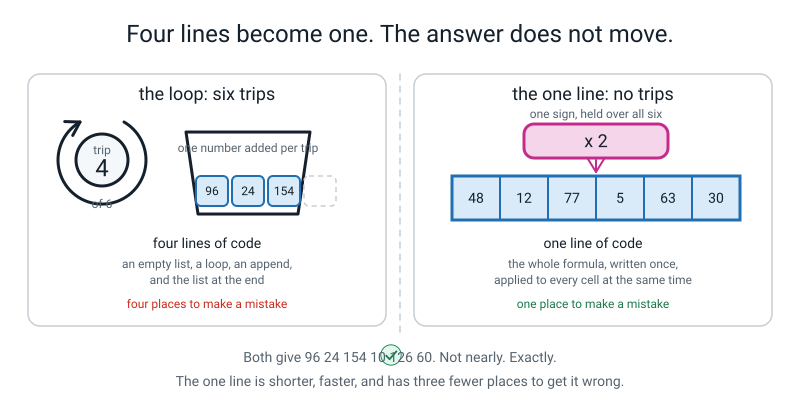
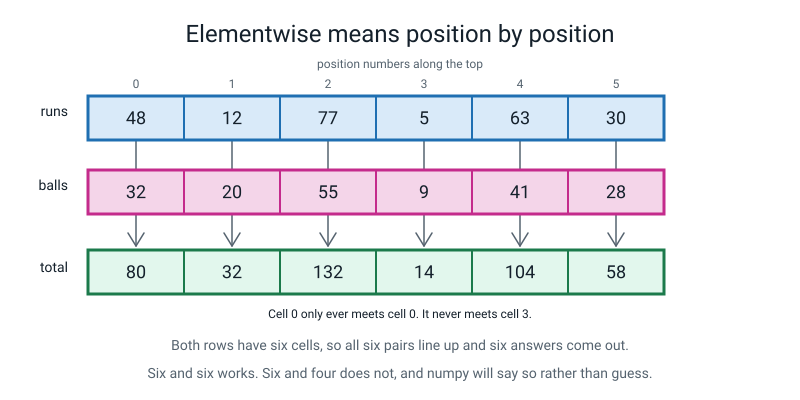
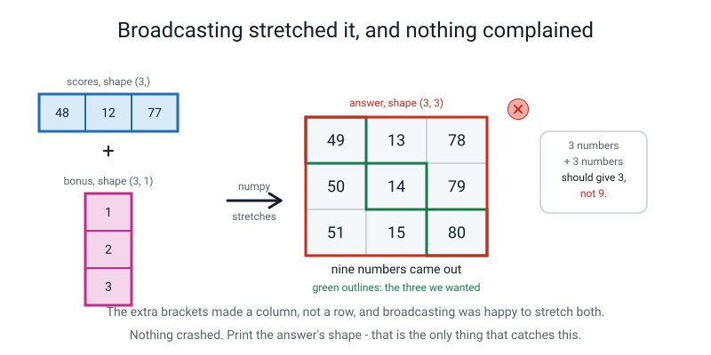
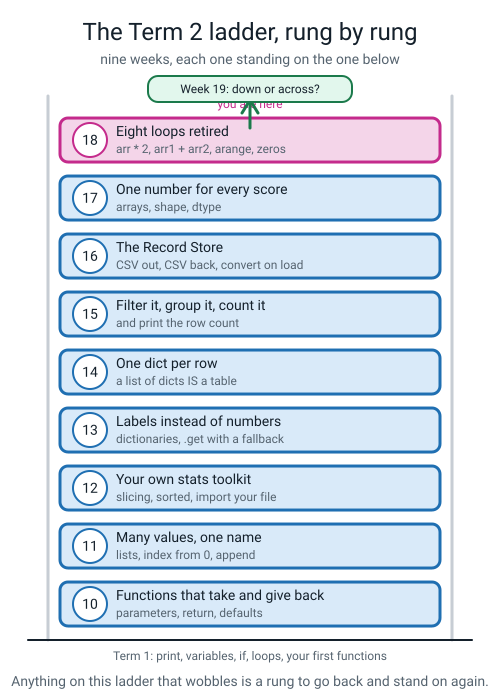
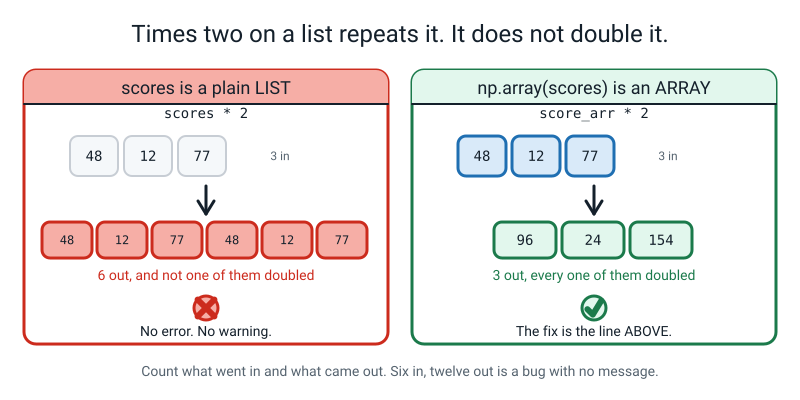
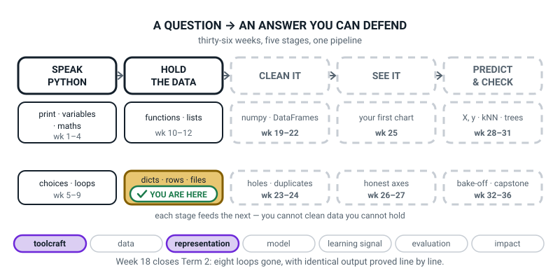
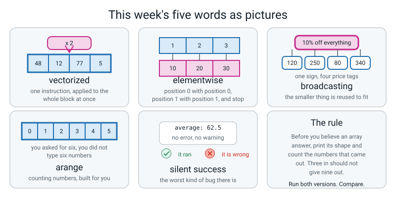

# Week 18 — Term 2 Checkpoint: Eight Loops You Never Have to Write Again

[⬅ Week 17](week-17.md) · [Course Home](../README.md) · [Next ➡](week-19.md) · [Workbook](../workbook/week-18.md)

---

> ### This week in one sentence
> **Array maths replaces a whole `for` loop with one line — and the one line is easier to read *and* harder to get wrong.**
>
> **By the end of this chapter you will be able to:**
> - **Rewrite a `for` loop as one line of array maths** and prove the output is identical
> - **Add and multiply two arrays elementwise**, and say what must be true of their shapes
> - **Build arrays with `np.arange` and `np.zeros`** instead of typing the numbers
> - **Explain how broadcasting can silently do something you did not mean**
> - Produce your own list of the weeks that need revisiting, with reasons
>
> **New syntax:** `arr * 2` · `arr1 + arr2` · `np.arange(n)` · `np.zeros((r, c))`
>
> **Reading time:** about 30 minutes. **Homework:** about 65 minutes.

---

## 🪝 Start Here

Here is a loop you have written, or something extremely like it, about twenty times since Week 7:

```python
doubled = []
for score in scores:
    doubled.append(score * 2)
```

It doubles every score. It works. **There is nothing wrong with it.**

I want you to do something different with it. **Count the ways you could get it wrong.**

Not "is it right" — I am telling you it is right. How many *different mistakes* could a person make while typing those three lines? Go through it slowly before you read on.

Here are five:

1. **Forget `doubled = []`** → `NameError: name 'doubled' is not defined`.
2. **Put `doubled = []` inside the loop** → it gets emptied every time round, and you end up with one number.
3. **Write `scores.append(...)` instead of `doubled.append(...)`** → you add to the list you are looping over, so it keeps growing and the loop never finishes (no error, no answer, a frozen program).
4. **Get the indentation wrong** → the append happens once, after the loop.
5. **Print `scores` at the end instead of `doubled`** → the original numbers, looking entirely plausible.

Now the part that matters. **Which of those five would Python actually complain about?**

Work through them. Only the first one reliably crashes.

**One out of five gives you an error message.** The other four give you no error message, and nothing tells you anything is wrong.

And now look at what those three lines are actually *for*. What is the interesting part — the part that is the job?

**`* 2`.** That is the job. Everything else — the empty list, the `for`, the `append`, the indentation — is **machinery for visiting things one at a time.** It is not the idea. It is the plumbing. And you type it out by hand, every time, and four out of five ways of getting the plumbing wrong do not tell you.

**Today you retire the plumbing.**

Eight loops. Eight cards on the table. One at a time, you replace each one with **a single line**, run both versions, and check that the answers match exactly. Any card whose two versions disagree goes in a pile marked REVISIT — and **that pile is not a pile of failures. It is a list.**


*Figure 18.1 — Both give 96 24 154 10 126 60. Not nearly. Exactly.*

---

## 🧠 The Big Idea

> **📌 About the code in this section.** The blocks below are **illustrations, not files**. They show you the shape of one idea, and each one carries on from the one above it — the `import` lines and the data are typed once, in the first block that needs them. **The complete, runnable file is in 💻 Type This.** If you copy a block from this section on its own and Python says `NameError`, that is why, and nothing is broken.

### 1. Vectorized: one instruction, the whole array

**The plain explanation.** You write the instruction once, for the whole array, and numpy does the visiting.

> **vectorized** — an operation written on a whole array at once, with the visiting-every-item done inside numpy instead of by your loop.

**The analogy.** A stencil. You do not paint each letter of a sign by hand; you cut the shape once and press it down.

**A concrete example.** Four lines become one:

```python
score_arr = np.array([48, 12, 77, 5, 63, 30])
doubled = score_arr * 2
print(doubled)
```

```text
[ 96  24 154  10 126  60]
```

**Count the places you can go wrong in each version.** The loop had five. The one-liner has **one**: the formula.

That is the real argument, and it is not mainly about speed: **the one-liner is a smaller target.**

**And how much faster is it, honestly?** For a million numbers, about twenty times. For your six numbers, **no difference you could ever measure** — both are instant. So speed is not why you are doing this today. You are doing it because one line has one place to go wrong and four lines have five, and because in Week 29 you will hand an array to a machine-learning model, and whether that array has the right shape decides whether the model works.

Everything works, not just `*`:

| What you write | What it does |
|---|---|
| `arr * 2` | doubles every number |
| `arr + 5` | adds 5 to every number |
| `arr - 10` | takes 10 off every number |
| `arr / 1000` | divides every number by a thousand |
| `arr ** 2` | squares every number |
| `arr * 9 / 5 + 32` | **the whole formula**, applied to every number |

That last row is the one to be pleased about. `celsius * 9 / 5 + 32` is *the formula off the page.* Three operations, one line, no loop. **You wrote the formula, and it happened to every number.**

### 2. Elementwise: two arrays, position by position

**The plain explanation.** With two arrays, the operation happens to each **matching pair of positions** on its own. Position 0 with position 0, position 1 with position 1, and stop.

> **elementwise** — the operation is done to each matching pair of positions on its own. Cell 0 only ever meets cell 0.

**The analogy.** Two rows of children lining up to hold hands. The first one holds hands with the first one, the second with the second. Nobody reaches across.

**A concrete example.** Six runs, six ball-counts:

```python
score_arr = np.array([48, 12, 77, 5, 63, 30])
balls_arr = np.array([32, 20, 55, 9, 41, 28])
print(score_arr + balls_arr)
```

```text
[ 80  32 132  14 104  58]
```

Check the first two by hand, out loud. 48 + 32 = **80**. 12 + 20 = **32**. It is not magic; it is arithmetic, done six times, by somebody else.

**And what has to be true for that to work?** The two arrays have to **line up.** Six and six works. Six and four does not:

```text
ValueError: operands could not be broadcast together with shapes (6,) (4,) 
```

**Say that error is good news**, in exactly the same words as last week's ragged block. numpy could have stopped at the fourth pair and handed you a short answer, or padded the missing two with zeros. It refused, because **there is no honest answer.**


*Figure 18.2 — Cell 0 only ever meets cell 0. It never meets cell 3.*

> **⚠️ Watch out:** `a * b` on two arrays multiplies **position by position**. It is not the matrix multiplication from senior maths. If somebody with a maths degree looks over your shoulder and frowns, that is why — and elementwise is all this course will ever need.

### 3. Broadcasting: when the shapes are different and it works anyway

**The plain explanation.** Look back at `score_arr * 2`. That is **six** numbers and **one** number. They do not line up at all. So why did it work?

> **broadcasting** — numpy's rule for making two different shapes work together, by reusing the smaller one wherever it is short.

**The analogy, and it is a good one.** A pizza shop puts **10% OFF EVERYTHING** on one big sign in the window. How many price tags did they have to rewrite? **None.** One sign, four hundred items, and everybody understands it applies to all of them.

**Broadcasting is the sign.** When one side is smaller, numpy reuses it wherever it is short. And it does not actually copy the `2` six times in memory — it just reads the same value over and over, which is why it costs nothing.

**A concrete example.** The everyday cases are all completely safe:

| What you write | Shapes | What happens |
|---|---|---|
| `arr * 2` | `(6,)` and one number | the 2 is reused for all six |
| `arr + 5` | `(6,)` and one number | the 5 is reused for all six |
| `arr1 + arr2` | `(6,)` and `(6,)` | pair by pair, no reusing needed |
| `celsius * 9 / 5 + 32` | `(4,)` and three single numbers | the whole formula, on every cell |

**And then there is the one that is the sting of this whole chapter.**

### 4. The silent success — the most important thing in this chapter

> **silent success** — code that runs, prints an answer, and is wrong. No error, no warning.

**The plain explanation.** Three scores. Three bonuses — one run for the first player, two for the second, three for the third. But the bonuses were typed with one set of brackets too many, so they came out as a **column** instead of a row.

**A concrete example.** Type this and predict the answer before you run it. **Three numbers plus three numbers. How many numbers come out?**

```python
"""bonus18.py - three scores, three bonuses, and nine answers."""

import numpy as np

scores = np.array([48, 12, 77])          # three scores
bonus = np.array([[1],                   # three bonuses... one per line
                  [2],
                  [3]])

print("scores.shape:", scores.shape)
print("bonus.shape :", bonus.shape)

answer = scores + bonus
print(answer)
print("answer.shape:", answer.shape)
print("we put in 3 and 3. How many came out?")
```

Real output:

```text
scores.shape: (3,)
bonus.shape : (3, 1)
[[49 13 78]
 [50 14 79]
 [51 15 80]]
answer.shape: (3, 3)
we put in 3 and 3. How many came out?
```

**Count them. Nine.**

Did anything crash? **No.** Did anything warn you? **No.**

Now find the answers you actually wanted. The first player should get 48 + 1 = **49**. It is top left. The second should get 12 + 2 = **14**. It is in the middle. The third gets 77 + 3 = **80**. Bottom right.

**Your three answers are on the diagonal**, surrounded by six numbers that mean absolutely nothing. `13` is the second player's score plus the first player's bonus, which is not a thing anybody wanted.

**What happened.** numpy lined the two shapes up from the right. It saw a `(3,)` and a `(3, 1)` — one is a **row** and one is a **column** — found a `1` in one direction and a missing direction in the other, and reused both to fill a 3×3 grid. Every row of the grid is the scores plus one bonus. **It did exactly what you asked. You asked wrong.**

Look back at how the bonus was typed. **How many sets of brackets?** Two. It should have been one.

**The fix, at this level, is to retype the brackets:**

```python
bonus = np.array([1, 2, 3])              # shape (3,)  - one set of brackets
print(scores + bonus)
```

```text
[49 14 80]
```

*(There is a function called `reshape` that does this without retyping. Do not use it yet. Retyping the brackets makes you look at the brackets, which is where the mistake was.)*


*Figure 18.3 — The extra brackets made a column, not a row, and broadcasting was happy to stretch both.*

**And the check that catches it is the thing to take out of this chapter:**

> **Print the shape of the answer. Three numbers in should not give nine out.**

Last week printing `.shape` felt like tidiness. **It is not tidiness. It is the only thing between you and a wrong answer.** There was no error. There was no warning. The one and only signal was `(3, 3)` where you expected `(3,)`, and you would only have seen it if you had printed it.

### 5. Two ways to build an array without typing the numbers

**The plain explanation.** Both of these replace a loop, which is why they are here.

> **arange** — "array range". Builds the counting numbers, starting at 0, stopping **before** the number you gave it.

```python
print(np.arange(6))
```

```text
[0 1 2 3 4 5]
```

It is `range()` from Week 7, handing you an array instead of something you have to loop over. **And it has exactly the same off-by-one.** Answer both halves out loud: *how many numbers, and what is the last one?* **Six, and five.**

The loop it retires:

```python
numbers = []
for i in range(6):
    numbers.append(i)
```

**And `np.zeros((r, c))` — a blank block of whatever shape you ask for.**

```python
print(np.zeros((2, 3)))
```

```text
[[0. 0. 0.]
 [0. 0. 0.]]
```

**Two things trip everybody up here, and both are worth knowing before they happen.**

**The double brackets are compulsory.** `np.zeros((2, 3))` — the inner pair is the **shape**, which is *one thing*: a pair of numbers travelling together. It goes in one slot, so it needs its own brackets round it to hold it together. Write `np.zeros(3, 4)` and you get a genuinely baffling message, which is in "When It Breaks".

**The zeros come out as decimals.** `0.` with a dot. `np.zeros` gives you `float64` by default, because a blank you are about to fill with real measurements is far more often decimals than whole numbers. You know that because you would print `.dtype` — which is last week, paying for itself immediately.

The loop `np.zeros` retires is **a loop inside a loop**, which is the most error-prone shape in the whole of Term 2:

```python
grid = []
for row in range(2):
    this_row = []
    for col in range(3):
        this_row.append(0.0)
    grid.append(this_row)
```

Six lines and two indent levels, replaced by one short line.

### 6. What "identical" means, and the trap in checking it

**The plain explanation.** You are about to run both versions of eight loops and check that they agree. Here is the thing that will confuse you, and I would rather tell you now than let you lose twenty minutes to it.

```python
print("loop:", doubled_loop)
print("line:", doubled_line)
```

```text
loop: [96, 24, 154, 10, 126, 60]
line: [ 96  24 154  10 126  60]
```

**Those two lines look different.** One has commas. The other has spaces and some padding.

If you compare them with your eyes you will say "no, they are not identical" — and you will be **right about the printing and wrong about the numbers.**

**Why the printing differs is last week's lesson:** a **list** prints with commas; an **array** prints with spaces and lines its columns up, because arrays are meant to be read in rows and columns. Same six numbers. Two containers. Two ways of showing themselves.

**The check that actually answers the question:**

```python
print("identical?", list(doubled_line) == doubled_loop)
```

```text
identical? True
```

`list(...)` turns the array back into a plain list so that like is compared with like, and then Python answers properly. **`True` means every single number matches.** That is the line that decides whether a card retires or goes in the pile.

> **⚠️ Watch out:** do **not** write `doubled_line == doubled_loop` without the `list(...)`. That gives you `[ True True True ]` — an array with one answer per position — which is interesting, and is not a yes-or-no. See "Don't Get Tricked".

### 7. Not every loop retires, and that is worth knowing

**The plain explanation.** Do not walk out of here thinking loops are bad. They are not. Three kinds of loop you write cannot be replaced by anything you know — and one of them never will be.

| The loop | Retires today? | Why |
|---|---|---|
| Double every number | **yes** | `arr * 2` |
| Add two columns together | **yes** | `arr1 + arr2` |
| Build the numbers 0 to n | **yes** | `np.arange(n)` |
| Total a column | **yes** | `sum(arr)` — Python's own `sum` from Week 12 works fine on an array |
| Make a blank grid | **yes** | `np.zeros((r, c))` |
| Keep only the scores above 50 | **not yet** | needs a **boolean mask** — that is Week 20, and it is one line too |
| Count how many players per team | **never** | needs the team **names**, and array arithmetic (`*` `+` `/`) has none. This belongs to a dictionary for now; later tools can count text too |
| Ask for a guess until the user gets it right | **never** | a `while` loop waiting on a human. Arrays have nothing to say about people |
| Print a formatted table, row by row | **never** | that is output, not arithmetic |

**The honest rule, and it is a genuinely useful one to carry:**

> **Array maths retires loops that do the same arithmetic to every number. Loops are for people and words; arrays are for numbers.**

And even for numbers, you will still write a loop when you are **collecting** values one at a time as you go — because arrays are a fixed size and lists grow. Build a list, then `np.array()` it once, at the end.

---

## 💻 Type This

New file, `retire.py`, in the same folder as everything else.

### Step 1 — the data

```python
"""retire.py - eight loops from weeks 7-15, retired."""

import numpy as np

scores = [48, 12, 77, 5, 63, 30]         # a plain Python LIST, from Week 11
balls = [32, 20, 55, 9, 41, 28]          # balls faced by the same six
```

Nothing new. Two plain lists, six numbers each.

### Step 2 — Card 1, the loop half

```python
doubled_loop = []                        # start with an empty list
for score in scores:                     # visit every score once
    doubled_loop.append(score * 2)       # double it and add it to the list
print("loop:", doubled_loop)
```

```text
loop: [96, 24, 154, 10, 126, 60]
```

**Write those six numbers down.** `96 24 154 10 126 60`. That is the answer the one-liner has to match. If it gives you anything else, one of the two versions is wrong.

### Step 3 — the one-liner, and the most common numpy mistake in the world

Type this **exactly**, including the mistake:

```python
print("line:", scores * 2)
```

**Predict before you run it.** *Six doubled numbers, presumably.*

Run it. Real output:

```text
loop: [96, 24, 154, 10, 126, 60]
line: [48, 12, 77, 5, 63, 30, 48, 12, 77, 5, 63, 30]
```

Talk yourself through what happened. It printed the numbers **twice**.

**Twelve numbers, and not one of them is doubled.** And no error. No warning.

Count them again. How many went in? **Six.** How many came out? **Twelve.**

> **That check just caught a bug for the second time this term.** Remember `12 written, 11 loaded` in Week 16? Same move. **Count what goes in, count what comes out.**

Now — *why*? Look at the line where `scores` was made. **It is a list, not an array.**

And `* 2` on a **list** means something completely different: it means *give me the list twice*. You have known that since Week 3, when you drew a line with `"=" * 20` — twenty equals signs. Same rule. **A list times two is the list repeated.**

Python asks the thing on the **left** what `*` should mean. A list's answer is *"give me copies of myself."* An array's answer is *"multiply every one of my numbers."* Same symbol, two completely different jobs.

**And that is what makes this bug hard to see: there is nothing wrong with the line you are looking at.** The mistake is on the line above.

One missing step. Make it an array first:

```python
score_arr = np.array(scores)             # the same six numbers, as an array
doubled_line = score_arr * 2             # no loop. One instruction, six numbers.
print("line:", doubled_line)
```

Real output:

```text
loop: [96, 24, 154, 10, 126, 60]
line: [ 96  24 154  10 126  60]
```

**Are those the same?** They *look* different — commas in one, spaces in the other. Do not argue about it. **Prove it:**

```python
print("identical?", list(doubled_line) == doubled_loop)
```

```text
identical? True
```

**Card 1 retires.** Move it off the table into a "retired" pile. It is a party; make it a small ceremony.

### Step 4 — Card 5, both halves, and the thing that disappears

Card 5 is two lists added position by position — and this is the card most worth retiring.

```python
loop5 = []
for i in range(len(scores)):             # 0, 1, 2, 3, 4, 5
    loop5.append(scores[i] + balls[i])   # the i-th of each, added
print("loop:", loop5)

balls_arr = np.array(balls)
line5 = score_arr + balls_arr            # one line. Six pairs.
print("line:", line5)
print("identical?", list(line5) == loop5)
```

**Predict two things before you run it.** What is the first number, and what will `identical?` say?

Real output:

```text
loop: [80, 32, 132, 14, 104, 58]
line: [ 80  32 132  14 104  58]
identical? True
```

Now look at **what disappeared** from the loop version. `range(len(scores))`. `scores[i]`. `balls[i]`.

**All the index-juggling is gone** — and index-juggling is exactly where off-by-one errors live. If you could only retire one card, retire this one.

### Step 5 — `np.zeros`, and an error that makes no sense

Card 8 needs a blank three-by-four grid. Type this:

```python
print(np.zeros(3, 4))
```

Real output:

```text
Traceback (most recent call last):
  File "retire.py", line 28, in <module>
    print(np.zeros(3, 4))
TypeError: Cannot interpret '4' as a data type
```

**That message is nonsense**, isn't it. *Cannot interpret 4 as a data type.* You never mentioned a data type.

Here is what happened. `np.zeros` has **two slots.** Slot one is the **shape**. Slot two is the **dtype** — the kind of number, from last week. You handed it a `3` and a `4`, so it put the `3` in the shape slot and then tried to read the `4` as a *kind of number* — and there is no kind of number called four. **The number in the message is always the second one you typed**, which is the clue that tells you which slot went wrong.

**The shape is one thing.** It is a pair. It needs its own brackets:

```python
print(np.zeros((3, 4)))
```

```text
[[0. 0. 0. 0.]
 [0. 0. 0. 0.]
 [0. 0. 0. 0.]]
```

**And the lesson from that error is worth more than the fix:**

> **When a message mentions something you never typed, you have probably put a value in the wrong slot.**

That is a Week 10 idea — parameters, in order — and it will happen to you all year.

### The complete finished program

Here is `retire.py` with all eight cards.

```python
"""retire.py - eight loops from weeks 7-15, retired. Both versions, then the proof."""

import numpy as np

# ---------------------------------------------------------------- the data
scores = [48, 12, 77, 5, 63, 30]                 # six scores, typed by hand
balls = [32, 20, 55, 9, 41, 28]                  # balls faced by the same six
celsius = [21.0, 24.5, 30.0, 18.5]               # four temperatures

score_arr = np.array(scores)
balls_arr = np.array(balls)
celsius_arr = np.array(celsius)

print("=" * 60)

# --- LOOP 1: double every score -----------------------------------------
loop1 = []
for s in scores:
    loop1.append(s * 2)
line1 = score_arr * 2
print("1  double every score")
print("   loop:", loop1)
print("   line:", line1)
print("   identical?", list(line1) == loop1)

# --- LOOP 2: give everyone 5 bonus runs ---------------------------------
loop2 = []
for s in scores:
    loop2.append(s + 5)
line2 = score_arr + 5
print("2  add 5 to every score")
print("   loop:", loop2)
print("   line:", line2)
print("   identical?", list(line2) == loop2)

# --- LOOP 3: square every score ----------------------------------------
loop3 = []
for s in scores:
    loop3.append(s ** 2)
line3 = score_arr ** 2
print("3  square every score")
print("   loop:", loop3)
print("   line:", line3)
print("   identical?", list(line3) == loop3)

# --- LOOP 4: celsius to fahrenheit -------------------------------------
loop4 = []
for c in celsius:
    loop4.append(c * 9 / 5 + 32)
line4 = celsius_arr * 9 / 5 + 32
print("4  celsius to fahrenheit")
print("   loop:", loop4)
print("   line:", line4)
print("   identical?", list(line4) == loop4)

# --- LOOP 5: runs plus balls, position by position ---------------------
loop5 = []
for i in range(len(scores)):
    loop5.append(scores[i] + balls[i])
line5 = score_arr + balls_arr
print("5  runs + balls, pair by pair")
print("   loop:", loop5)
print("   line:", line5)
print("   identical?", list(line5) == loop5)

# --- LOOP 6: strike rate = runs / balls * 100 -------------------------
loop6 = []
for i in range(len(scores)):
    loop6.append(scores[i] / balls[i] * 100)
line6 = score_arr / balls_arr * 100
print("6  strike rate for each player")
print("   loop:", [round(x, 2) for x in loop6])
print("   line:", np.round(line6, 2))
print("   identical?", list(line6) == loop6)

# --- LOOP 7: build the numbers 0 to 9 ---------------------------------
loop7 = []
for i in range(10):
    loop7.append(i)
line7 = np.arange(10)
print("7  the numbers 0 to 9")
print("   loop:", loop7)
print("   line:", line7)
print("   identical?", list(line7) == loop7)

# --- LOOP 8: an empty 3-row, 4-column grid ---------------------------
loop8 = []
for row in range(3):
    this_row = []
    for col in range(4):
        this_row.append(0.0)
    loop8.append(this_row)
line8 = np.zeros((3, 4))
print("8  an empty 3 by 4 grid")
print("   loop:", loop8)
print("   line:")
print(line8)
print("   identical?", [list(r) for r in line8] == loop8)
print("=" * 60)
```

Real output:

```text
============================================================
1  double every score
   loop: [96, 24, 154, 10, 126, 60]
   line: [ 96  24 154  10 126  60]
   identical? True
2  add 5 to every score
   loop: [53, 17, 82, 10, 68, 35]
   line: [53 17 82 10 68 35]
   identical? True
3  square every score
   loop: [2304, 144, 5929, 25, 3969, 900]
   line: [2304  144 5929   25 3969  900]
   identical? True
4  celsius to fahrenheit
   loop: [69.8, 76.1, 86.0, 65.3]
   line: [69.8 76.1 86.  65.3]
   identical? True
5  runs + balls, pair by pair
   loop: [80, 32, 132, 14, 104, 58]
   line: [ 80  32 132  14 104  58]
   identical? True
6  strike rate for each player
   loop: [150.0, 60.0, 140.0, 55.56, 153.66, 107.14]
   line: [150.    60.   140.    55.56 153.66 107.14]
   identical? True
7  the numbers 0 to 9
   loop: [0, 1, 2, 3, 4, 5, 6, 7, 8, 9]
   line: [0 1 2 3 4 5 6 7 8 9]
   identical? True
8  an empty 3 by 4 grid
   loop: [[0.0, 0.0, 0.0, 0.0], [0.0, 0.0, 0.0, 0.0], [0.0, 0.0, 0.0, 0.0]]
   line:
[[0. 0. 0. 0.]
 [0. 0. 0. 0.]
 [0. 0. 0. 0.]]
   identical? True
============================================================
```

**Eight `True`s. Twenty-seven lines of loop replaced by eight lines of arithmetic.**

The eight lines, on their own, which is what should end up on your wall:

| Card | The loop did | The one line |
|---|---|---|
| 1 | double every score | `score_arr * 2` |
| 2 | add 5 to every score | `score_arr + 5` |
| 3 | square every score | `score_arr ** 2` |
| 4 | celsius to fahrenheit | `celsius_arr * 9 / 5 + 32` |
| 5 | runs + balls, pair by pair | `score_arr + balls_arr` |
| 6 | strike rate for each player | `score_arr / balls_arr * 100` |
| 7 | the numbers 0 to 9 | `np.arange(10)` |
| 8 | a blank 3 by 4 grid | `np.zeros((3, 4))` |

**Card 6 is worth a second look**, because it is the messy one:

```text
   loop: [150.0, 60.0, 140.0, 55.56, 153.66, 107.14]
   line: [150.    60.   140.    55.56 153.66 107.14]
   identical? True
```

The loop's answer is shown rounded to two places so it fits; the array is rounded with `np.round`. **They still print differently and they are still identical** — the `identical?` check was done on the unrounded values. If `150.0` and `150.` bother you, that is a good objection with a boring answer: same number, two ways of writing it, and Python's `==` knows.

---

## 🔍 Worked Examples

Three complete programs, in three subjects. Every one runs both versions and prints `identical?`.

### Worked Example 1 — A pizza menu (food)

```python
"""pizza18.py - a pizza menu, and five loops that will not be missed."""

import numpy as np

prices = [250, 180, 320, 199, 425, 150]          # six pizzas, in rupees
price_arr = np.array(prices)

# --- 1. 10% off everything ------------------------------------------------
loop1 = []
for p in prices:
    loop1.append(p * 0.9)
line1 = price_arr * 0.9
print("1  ten percent off everything")
print("   loop:", loop1)
print("   line:", line1)
print("   identical?", list(line1) == loop1)

# --- 2. add a 20 rupee delivery charge ----------------------------------
loop2 = []
for p in prices:
    loop2.append(p + 20)
line2 = price_arr + 20
print("2  add a 20 rupee delivery charge")
print("   loop:", loop2)
print("   line:", line2)
print("   identical?", list(line2) == loop2)

# --- 3. the price of two ------------------------------------------------
loop3 = []
for p in prices:
    loop3.append(p * 2)
line3 = price_arr * 2
print("3  buy two of each")
print("   loop:", loop3)
print("   line:", line3)
print("   identical?", list(line3) == loop3)

# --- 4. the whole formula in one line -----------------------------------
# 10% off, then 20 delivery, then 5% tax on the lot
loop4 = []
for p in prices:
    loop4.append((p * 0.9 + 20) * 1.05)
line4 = (price_arr * 0.9 + 20) * 1.05
print("4  10% off, plus delivery, plus 5% tax")
print("   loop:", [round(x, 2) for x in loop4])
print("   line:", np.round(line4, 2))
print("   identical?", list(line4) == loop4)

# --- 5. the menu numbers, 0 to 5 ---------------------------------------
loop5 = []
for i in range(6):
    loop5.append(i)
line5 = np.arange(6)
print("5  the menu numbers")
print("   loop:", loop5)
print("   line:", line5)
print("   identical?", list(line5) == loop5)

# --- and the total, which is one number, not a list --------------------
print("total of all six, loop-free:", sum(price_arr))
```

Real output:

```text
1  ten percent off everything
   loop: [225.0, 162.0, 288.0, 179.1, 382.5, 135.0]
   line: [225.  162.  288.  179.1 382.5 135. ]
   identical? True
2  add a 20 rupee delivery charge
   loop: [270, 200, 340, 219, 445, 170]
   line: [270 200 340 219 445 170]
   identical? True
3  buy two of each
   loop: [500, 360, 640, 398, 850, 300]
   line: [500 360 640 398 850 300]
   identical? True
4  10% off, plus delivery, plus 5% tax
   loop: [257.25, 191.1, 323.4, 209.06, 422.62, 162.75]
   line: [257.25 191.1  323.4  209.06 422.62 162.75]
   identical? True
5  the menu numbers
   loop: [0, 1, 2, 3, 4, 5]
   line: [0 1 2 3 4 5]
   identical? True
total of all six, loop-free: 1524
```

**Number 4 is the one to be pleased about.** Three operations — a discount, a delivery charge and a tax — written once, in the order you would say them out loud, and applied to all six prices. The loop version needs a variable, an append, a set of brackets and an indent. The one-liner **is the formula**.

And notice the last line: `sum(price_arr)` — Python's own `sum` from Week 12, working perfectly on an array. **One number out, not a list**, so there is no `identical?` to check.

### Worked Example 2 — A week of step counts (sport)

```python
"""steps18.py - a week of step counts, and the loops that retire."""

import numpy as np

steps = [8421, 10233, 6890, 12004, 9317, 14002, 7655]     # Mon to Sun
goal = [10000, 10000, 10000, 10000, 10000, 8000, 8000]    # weekends are easier

step_arr = np.array(steps)
goal_arr = np.array(goal)

# --- 1. how far off the goal was I each day? ----------------------------
loop1 = []
for i in range(len(steps)):
    loop1.append(steps[i] - goal[i])
line1 = step_arr - goal_arr
print("1  steps minus goal, day by day")
print("   loop:", loop1)
print("   line:", line1)
print("   identical?", list(line1) == loop1)

# --- 2. what fraction of the goal, as a percentage? --------------------
loop2 = []
for i in range(len(steps)):
    loop2.append(steps[i] / goal[i] * 100)
line2 = step_arr / goal_arr * 100
print("2  percent of goal, day by day")
print("   loop:", [round(x, 1) for x in loop2])
print("   line:", np.round(line2, 1))
print("   identical?", list(line2) == loop2)

# --- 3. steps in thousands, to make them readable ---------------------
loop3 = []
for s in steps:
    loop3.append(s / 1000)
line3 = step_arr / 1000
print("3  steps in thousands")
print("   loop:", loop3)
print("   line:", line3)
print("   identical?", list(line3) == loop3)

# --- 4. the day numbers, 0 to 6 --------------------------------------
line4 = np.arange(7)
print("4  the day numbers")
print("   line:", line4)

# --- 5. a blank sheet for next week: 7 days, 3 things per day --------
blank = np.zeros((7, 3))
print("5  a blank sheet for next week")
print(blank)
print("   shape:", blank.shape, " dtype:", blank.dtype)

# --- and two whole-week numbers, no loop ----------------------------
print("total steps this week :", sum(step_arr))
print("total goal this week  :", sum(goal_arr))
```

Real output:

```text
1  steps minus goal, day by day
   loop: [-1579, 233, -3110, 2004, -683, 6002, -345]
   line: [-1579   233 -3110  2004  -683  6002  -345]
   identical? True
2  percent of goal, day by day
   loop: [84.2, 102.3, 68.9, 120.0, 93.2, 175.0, 95.7]
   line: [ 84.2 102.3  68.9 120.   93.2 175.   95.7]
   identical? True
3  steps in thousands
   loop: [8.421, 10.233, 6.89, 12.004, 9.317, 14.002, 7.655]
   line: [ 8.421 10.233  6.89  12.004  9.317 14.002  7.655]
   identical? True
4  the day numbers
   line: [0 1 2 3 4 5 6]
5  a blank sheet for next week
[[0. 0. 0.]
 [0. 0. 0.]
 [0. 0. 0.]
 [0. 0. 0.]
 [0. 0. 0.]
 [0. 0. 0.]
 [0. 0. 0.]]
   shape: (7, 3)  dtype: float64
total steps this week : 68522
total goal this week  : 66000
```

**Three things to notice.**

**Negative numbers work exactly the same.** `[-1579   233 -3110 ...]` — and look at the padding: numpy widened every column to fit the minus signs, so they still line up. That is `arr1 - arr2` and there is nothing special about it.

**The two goals are not all the same number**, and that is the point of using two arrays rather than `step_arr - 10000`. The weekend goal is 8000. Elementwise means each day meets **its own** goal.

**The blank sheet is `float64`** — every zero has a dot after it. `np.zeros` is decimals by default, and you know that because you printed `.dtype`.

### Worked Example 3 — Marks out of 40, and the sting on your own data (school)

```python
"""marks18.py - five marks out of 40, scaled to percent - and the sting, on school data."""

import numpy as np

out_of_40 = [34, 21, 38, 17, 29]                 # five pieces of homework
mark_arr = np.array(out_of_40)

# --- 1. turn every mark into a percentage -----------------------------
loop1 = []
for m in out_of_40:
    loop1.append(m / 40 * 100)
line1 = mark_arr / 40 * 100
print("1  out of 40 -> percent")
print("   loop:", loop1)
print("   line:", line1)
print("   identical?", list(line1) == loop1)

# --- 2. everyone gets 2 bonus marks ---------------------------------
loop2 = []
for m in out_of_40:
    loop2.append(m + 2)
line2 = mark_arr + 2
print("2  two bonus marks each")
print("   loop:", loop2)
print("   line:", line2)
print("   identical?", list(line2) == loop2)

# --- 3. THE STING: a DIFFERENT bonus for each piece of work ---------
# one extra mark for the first, two for the second, and so on
bonus = np.array([[1],                           # typed one per line...
                  [2],
                  [3],
                  [4],
                  [5]])
print()
print("mark_arr.shape:", mark_arr.shape)
print("bonus.shape   :", bonus.shape)
wrong = mark_arr + bonus
print(wrong)
print("wrong.shape   :", wrong.shape)
print("5 marks + 5 bonuses. How many numbers came out?", wrong.size)

# --- 4. the fix: one set of brackets --------------------------------
bonus_fixed = np.array([1, 2, 3, 4, 5])
right = mark_arr + bonus_fixed
print()
print("bonus_fixed.shape:", bonus_fixed.shape)
print("right            :", right)
print("right.shape      :", right.shape)
```

Real output:

```text
1  out of 40 -> percent
   loop: [85.0, 52.5, 95.0, 42.5, 72.5]
   line: [85.  52.5 95.  42.5 72.5]
   identical? True
2  two bonus marks each
   loop: [36, 23, 40, 19, 31]
   line: [36 23 40 19 31]
   identical? True

mark_arr.shape: (5,)
bonus.shape   : (5, 1)
[[35 22 39 18 30]
 [36 23 40 19 31]
 [37 24 41 20 32]
 [38 25 42 21 33]
 [39 26 43 22 34]]
wrong.shape   : (5, 5)
5 marks + 5 bonuses. How many numbers came out? 25

bonus_fixed.shape: (5,)
right            : [35 23 41 21 34]
right.shape      : (5,)
```

**Read the fourth-from-last block again.** Five marks. Five bonuses. **Twenty-five numbers.**

And find the five you wanted: **35, 23, 41, 21, 34** — they are on the diagonal, top left to bottom right, and they are exactly what `right` says. Twenty of the twenty-five numbers on that grid are somebody's mark plus somebody else's bonus, which is not a thing that means anything.

**Was it typed wrong?** Only in the brackets. `[[1], [2], [3], [4], [5]]` is a *column*. `[1, 2, 3, 4, 5]` is a *row*. One extra pair of brackets each.

**And the only signal was `(5, 5)`.**

*(`.size` in that program is a small bonus fact: how many numbers there are altogether. It is the shape's numbers multiplied together — 5 × 5 = 25.)*

---

## 🐞 When It Breaks

Every message below came from really running a broken version of this week's code, on numpy 1.26.

### Break 1 — `* 2` on a list, which does not crash

```python
print("line:", scores * 2)
```

```text
loop: [96, 24, 154, 10, 126, 60]
line: [48, 12, 77, 5, 63, 30, 48, 12, 77, 5, 63, 30]
```

**There is no error message here at all.** That is what makes it the most common numpy mistake in the world.

**What happened.** `scores` is a plain **list**, and `* 2` on a list means *the list, repeated*. Same rule as `"=" * 20` from Week 3.

**Why it is hard to see.** **There is nothing wrong with the line you are looking at.** The mistake is on the line above, where you forgot `np.array(...)`.

**The fix.** `np.array(scores) * 2`, or make the array once and keep it.

**The check that catches it.** Count. **Six went in, twelve came out.**

And the same mistake with `+` *does* crash, which is a small mercy:

```text
Traceback (most recent call last):
  File "br2.py", line 1, in <module>
    print([48, 12, 77] + 5)
          ~~~~~~~~~~~~~^~~
TypeError: can only concatenate list (not "int") to list
```

**Why `*` is silent and `+` is loud:** a list knows what `* 2` means (repeat me) but has no idea what `+ 5` means, because you cannot glue a number onto a list. So one of the two goes quietly wrong and the other stops you. **That is luck, not design.**

### Break 2 — shapes that do not line up

```python
a = np.array([48, 12, 77, 5, 63, 30])
b = np.array([32, 20, 55, 9])
print(a + b)
```

```text
Traceback (most recent call last):
  File "shapes.py", line 5, in <module>
    print(a + b)
ValueError: operands could not be broadcast together with shapes (6,) (4,) 
```

**What numpy is telling you.** *"These two do not line up, and I will not guess."* And it has printed both shapes at you, which tells you exactly where to look.

**The fix.** Print both shapes, then work out which one is wrong — usually one list has a value missing or an extra one.

> **🐞 If you see this error:** it is **good news**, in exactly the same way as last week's ragged block. numpy could have paired up the first four and given you a short answer, or padded the missing two with zeros. It refused. **An error you can read beats a wrong answer you cannot see.**

### Break 3 — `np.zeros` without the shape's own brackets

```python
print(np.zeros(3, 4))
```

```text
Traceback (most recent call last):
  File "retire.py", line 28, in <module>
    print(np.zeros(3, 4))
TypeError: Cannot interpret '4' as a data type
```

**What numpy is telling you**, once you know: the second slot of `np.zeros` is for the **dtype**, and you put a number there. The `'4'` in the message is the **second** number you typed — which is exactly the clue that tells you which slot went wrong.

**The fix.** `np.zeros((3, 4))`. **The shape is one thing** — a pair of numbers travelling together — so it needs its own brackets to hold it together.

**And the general lesson**, which is worth more than the fix:

> **When an error message mentions something you never typed, you have probably put a value in the wrong slot.**

You never said the words "data type". numpy did, because that is what it thought you were talking about.

### The whole clinic, for reference

| What you see | What it means | The fix |
|---|---|---|
| `ValueError: operands could not be broadcast together with shapes (3,) (4,)` | "These two don't line up and I won't guess." | Print both shapes. One list has a value missing or an extra one |
| `TypeError: can only concatenate list (not "int") to list` | "You asked me to glue a number onto a list." | `np.array(scores) + 5`. The `+` you want only exists on arrays |
| `TypeError: Cannot interpret '4' as a data type` | "You put a number where the kind-of-number goes." | `np.zeros((3, 4))`. The shape needs its own brackets. The number quoted is the **second** one you typed |
| `TypeError: arange() requires stop to be specified.` | "You didn't tell me where to stop." | `np.arange(10)` |
| `numpy.core._exceptions._UFuncNoLoopError: ufunc 'add' did not contain a loop with signature matching types (dtype('int64'), dtype('<U21')) -> None` | "I don't know how to add a number to a piece of writing." | Print `.dtype` on **both** sides. One of them is text when you thought it was numbers — that is last week's `<U21` bug, one line further on |
| `NameError: name 'np' is not defined` | "I don't know what `np` is." | `import numpy as np`, at the **top** of the file. Imports first, always |
| `AttributeError: 'list' object has no attribute 'shape'` | "A list hasn't got a shape." | `np.array(scores).shape`. And this is a *useful* error — it tells you which of the two things you are holding |
| `IndexError: index 7 is out of bounds for axis 0 with size 4` | "You asked for slot 7 and there are four slots." | An index left over from the loop version. **If you are still writing `arr[i]`, the loop has not actually retired** |
| **No error, six numbers became twelve** | Nothing is wrong as far as Python is concerned | `scores * 2` on a plain **list**. `np.array(scores) * 2`. And count what went in against what came out — that check has now caught a bug three weeks running |
| **No error, three plus three gave nine** | Nothing is wrong as far as numpy is concerned | One side is a `(3, 1)` column instead of a `(3,)` row — one extra pair of brackets. Retype them, and **print the answer's shape** |
| **No error, the two versions print differently** | Nothing is wrong at all | A list prints with commas; an array prints with spaces and aligned columns. `list(arr) == loop_result` |
| **No error, `line == loop` gave a list of `True`s** | Nothing is wrong; you asked a different question | `arr == list` compares **position by position** and hands back one answer per position. Wrap it: `list(arr) == loop_result` |
| **No error, `np.zeros` gave decimals** | Nothing is wrong; this is the default | `np.zeros` is `float64` unless you say otherwise. Usually leave it. If you really need whole numbers: `np.zeros((3, 4), dtype=int)` |

> **🐞 If there is no error message at all:** two questions, and they are the last two of Term 2.
>
> 1. **How many numbers did you put in, and how many came out?** Not "does it look right". A count. It caught the missing CSV header in Week 16, it caught `scores * 2` on a list today, and it caught nine-instead-of-three. **Three bugs, three weeks, one question.**
> 2. **What shape is the answer?** Print it. Three in should not give nine out.

---

## 🎲 What We Did In Class

### The Loop Retirement Party

Eight index cards face down on the table, one loop written on each — taken out of the student's own Week 7 to Week 15 files wherever possible, because a loop you wrote yourself retires far more satisfyingly than one out of a book.

Beside them, a marked-out space with **REVISIT** written on it.

And one rule said out loud **before the first card**, which is the whole design of the lesson:

> **Any card whose two versions disagree goes in that pile immediately, and we move on. That pile is the goal of today, not the shame.**

### Counting the ways to get a loop wrong

The three-line doubling loop on the board, and the question *"how many different mistakes could a person make typing this?"* Five, in the end. And then: *"how many of those five would Python complain about?"* **One.**

Then: *"which bit of these three lines is the actual job?"* — `* 2` — *"so what's the rest of it?"* — **machinery for visiting things.**

### Five words on the board, and they stayed up

> **vectorized** — one instruction, written for the whole array. numpy does the visiting.
> **elementwise** — position by position. Cell 0 only ever meets cell 0.
> **broadcasting** — reusing the smaller side wherever it is short. One 10%-off sign in a shop window.
> **arange** — array range. `np.arange(6)` is six numbers, 0 to 5.
> **silent success** — code that runs, prints an answer, and is wrong.

Plus the pizza shop sign, and the hand-check of the first two elementwise sums — 48 + 32 = 80, 12 + 20 = 32 — which takes ten seconds and turns "magic" into "arithmetic".

### The printing trap, on the board, before anybody typed anything

```text
loop: [96, 24, 154, 10, 126, 60]
line: [ 96  24 154  10 126  60]
```

*"Commas in one. Spaces and padding in the other. **Same six numbers.** So you don't compare them with your eyes — you write `list(doubled_line) == doubled_loop` and let Python answer."*

This was said **before** the lab, on purpose, because otherwise half the room spends twenty minutes believing their correct answers are wrong.

### Two cards retired together, with two deliberate mistakes

Card 1, walked straight into `scores * 2` on a plain list — twelve numbers, none of them doubled, no error. Then the count: six in, twelve out. Then the fix, one line above.

Card 5, the `range(len(scores))` one, and the observation that **all the index-juggling disappeared.**

And `np.zeros(3, 4)`, which produced `TypeError: Cannot interpret '4' as a data type` — a message that mentions something nobody typed.

### Six more cards, and whatever went in the pile

Cards 2, 3, 4, 6, 7 and 8, about two minutes each, every one with `identical?` printed. Any card that disagreed went in the REVISIT space within sixty seconds. No debugging for longer than that.

And this translation table, for turning a card in the pile into a usable line:

| The card would not retire because… | What goes on the revisit list |
|---|---|
| could not say what the loop did | **Week 7 — reading a `for` loop out loud** |
| lost track of the accumulator | **Week 7 — `total += x`** |
| could not get the numbers out of the records | **Week 15 — comprehensions** |
| made an array and then looped over it anyway | **Week 17 — what an array is for** |
| could not predict the shape | **Week 17 — `.shape`** |
| got `np.arange(6)`'s last number wrong | **Week 7 — `range` stops before** |
| outputs looked different but were the same | **Week 18 — `list(arr) == loop_result`** |

### The sting, in the last five minutes

`bonus18.py`, dictated including the extra brackets, with nothing said about them. The question asked first: *"three numbers plus three numbers — how many come out?"* Everybody wrote **three**. Nine came out.

Then five seconds of silence while everybody counted.

Then finding 49, 14 and 80 on the diagonal, reading the two shapes at the top out loud — `(3,)` and `(3, 1)` — and counting the brackets.

**Bug Log entry, the last of Term 2**, filed under *errors with no error message*. It is the best entry in the book.

### And the review half, which is the actual point of this week


*Figure 18.4 — Anything on this ladder that wobbles is a rung to go back and stand on again.*

The ladder, one rung per week, from Week 10 up to Week 18:

| Week | What it gave you |
|---|---|
| 10 | Functions with parameters, `return`, default values |
| 11 | Lists, index from 0, `append` |
| 12 | Slicing, `sorted`, importing your own file |
| 13 | Dictionaries, `.get()` with a fallback |
| 14 | A list of dicts is a table |
| 15 | Filter, group, and the row count |
| 16 | CSV out, CSV back, convert on load |
| 17 | Arrays, `.shape`, `.dtype` |
| 18 | Array maths — one line instead of a loop |

One word against each: **solid**, **shaky**, or **lost**. Nobody marks the words. What gets marked is whether the revisit list that comes out of them names **a week and a thing.**

And the safety-net question, for anybody whose pile was empty:

> **"Which week of Term 2 would you least like to be tested on tomorrow?"**

Everybody has an answer to that, including the teacher.

---

## 💬 Talk About It

**1. Is broadcasting a good feature or a bad one?**

*Hint:* this one is genuinely argued about by people who write numerical software for a living, so you are not settling it — you are joining it. The case **for** is overwhelming and you felt it today: without broadcasting, `scores * 2` would be an error, you would have to build an array of six 2s first, and `celsius * 9 / 5 + 32` would need three of them. Almost every formula you will ever write would triple in length. And it costs nothing. The case **against** is the last five minutes of the lesson: broadcasting makes some mistakes **impossible to detect.** Nobody deliberately adds a row of three to a column of three, and numpy cheerfully produced nine numbers and said nothing. Experienced people lose real hours to this, and it can put wrong numbers into real work. So the question is not *is it good* — it is **what does a careful person do about it?** And notice that the answer is not "avoid it".

**2. `scores * 2` on a list gave twelve numbers and nothing complained. `scores + 5` on a list crashed. Which behaviour do you prefer, and why?**

*Hint:* start with why they differ at all. Python asks the thing on the **left** what the symbol means. A list has an answer for `* 2` — *repeat me* — and no answer at all for `+ 5`, so one goes quietly wrong and the other stops you. Now the interesting part: **the crash was more useful to you.** Would you want `* 2` on a list to be an error too? Think about what would break: `"=" * 20` from Week 3, and `[0] * 10`, and every line anyone has ever written to repeat something. Python cannot make `*` an error on lists without breaking a great deal of working code, so it will not. **So where does that leave the safety?** With you, and with a count.

**3. The one-liner is shorter. Is shorter always better?**

*Hint:* be careful, because "shorter is better" is a bad rule and this chapter is not arguing for it. Make the real argument: the one-liner is better because **the plumbing is gone**, and the plumbing was four of the five places you could go wrong. That is not the same as being short. Then find a counter-example — code that is short and *worse*. What about a single line that does five things at once, with no comment, and a variable called `x`? Or `arr * 9 / 5 + 32` with no note anywhere saying what unit anything is in? So what is the real rule you would write down? Something about which *parts* deserve to be short, and which parts deserve to be spelled out.

---

## ⚠️ Don't Get Tricked

### Trick 1 — "`* 2` doubles a list"


*Figure 18.5 — Six in, twelve out, and no error message.*

| ❌ Wrong | ✅ Right |
|---|---|
| `scores * 2` where `scores = [48, 12, 77]` — "that doubles all three." | It gives `[48, 12, 77, 48, 12, 77]` — **the list, twice.** Six numbers, none of them doubled, and **no error.** You need `np.array(scores) * 2`. |

Prove it in four lines:

```python
scores = [48, 12, 77]
print(scores * 2)
print(np.array(scores) * 2)
print(len(scores * 2), "versus", len(np.array(scores) * 2))
```

```text
[48, 12, 77, 48, 12, 77]
[ 96  24 154]
6 versus 3
```

**Three in, six out.** That count is the entire check, and it is the same question that caught the missing CSV header in Week 16.

### Trick 2 — "different printing means different answers"

| ❌ Wrong | ✅ Right |
|---|---|
| `[96, 24, 154]` versus `[ 96  24 154]` — "those are different, so my one-liner is wrong." | **Same three numbers.** A list prints with commas; an array prints with spaces and pads the numbers so the columns line up. Two containers, two ways of showing themselves. |

Do not compare printed output with your eyes. Write the check.

### Trick 3 — "`arr == my_list` tells me whether they match"

| ❌ Wrong | ✅ Right |
|---|---|
| `print(line == loop)` — "that will say `True` or `False`." | It says **`[ True  True  True]`** — an array with **one answer per position.** Which is genuinely useful information, and is not the yes-or-no you asked for. You want `list(line) == loop`. |

Run both and look at the difference:

```python
loop = [96, 24, 154]
line = np.array([48, 12, 77]) * 2
print(line == loop)
print(list(line) == loop)
```

```text
[ True  True  True]
True
```

**Why?** Because `==` on an array is **elementwise too**, exactly like `+`. It compares position by position and hands you an answer for each one. `list(...)` turns the array back into a plain list first, so Python compares two lists and answers once.

### Trick 4 — "if it ran, the shapes must have been right"

| ❌ Wrong | ✅ Right |
|---|---|
| "No error, so the arithmetic did what I meant." | Wrong shapes **sometimes** stop you and **sometimes** quietly hand you more numbers than you asked for. `(3,)` + `(4,)` is an error. `(3,)` + `(3, 1)` is nine numbers and silence. |

And here is how bad it gets if you never look at the array itself. Take the wrong `(3, 3)` answer and total it:

```python
wrong = np.array([[49, 13, 78],
                  [50, 14, 79],
                  [51, 15, 80]])
right = np.array([49, 14, 80])
print("total of the wrong answer:", sum(wrong))
print("total of the right answer:", sum(right))
```

```text
total of the wrong answer: [150  42 237]
total of the right answer: 143
```

**The wrong answer's total is not even a number — it is three numbers.** If you had printed only the total and never looked at the array, would you have known?

**The only defence is printing the shape.**

---

## 🌍 Where You've Seen This

1. **The volume slider on your phone.** A sound is a very long array of numbers. Halving the volume is `arr * 0.5` — one instruction, forty-four thousand numbers a second, no loop anywhere.
2. **Brightness and contrast on a photo.** Brightness is `pixels + 30`. Contrast is `pixels * 1.2`. That is genuinely most of it, running on a `(3024, 4032, 3)` array, and the reason the slider moves instantly is that no loop is being typed by hand.
3. **The "10% off everything" banner on a shop's website.** Nobody edited four hundred price tags. One number, broadcast across the whole price column. You have now written the same thing.
4. **A spreadsheet formula you drag down a column.** Type `=B2*1.05`, grab the corner, drag. That drag *is* broadcasting, and the spreadsheet has been doing this since before you were born.
5. **Currency conversion on a bank statement.** One exchange rate, three hundred transactions, one multiplication.
6. **Every "compared to last week" figure in a fitness app.** `this_week - last_week`, elementwise, seven numbers against seven numbers — and it is the same shape check: if one week has six days of data and the other has seven, something has to give.
7. **The wrong-shape bug, in the wild.** Ever seen an app show a chart where the numbers are obviously nonsense but nothing has crashed? Somewhere in there, two shapes broadcast against each other and produced a grid instead of a row, and nobody printed the shape.

---

## 🧭 Where This Fits

Sixth week in the same gold box, and the last one — nothing on the map moves today. That is exactly
what a checkpoint week should look like. You did not go somewhere new this week; you went back to eight
loops you had already written and made each of them one line long.



*Figure 18.0 — The pipeline at the end of Week 18, and the end of Term 2. Six weeks in the
`dicts · rows · files` tile, and this is the last of them. Next week the gold moves into stage three for
the first time since Week 13.*

| | |
|---|---|
| **The mental model you now own** | Whole-array maths replaces a `for` loop with **one line**: the shape does the repeating for you, so there is less to read and fewer places to be wrong. |
| **The one question it answers** | *"Can I say that in one line instead of five?"* — and when the answer is yes, you prove it by checking the new output against the old, not by trusting it. |
| **What it plugs into** | The loops you wrote in Weeks 7 to 15. Eight of them get rewritten this week, and each one prints `identical? True` beside it — no loop is retired on faith. |
| **What carries forward** | Week 20's boolean masks and Week 24's derived columns. From here on you never hand-write a loop that does arithmetic on numbers. |
| **Spiral thread** | 🧰 **Toolcraft** — shorter code with fewer places to hide a mistake is a craft result — and 🏷️ **Representation**, because the reason one line can do the work of five is the **shape**, not cleverness. |

> **💡 Try this:** count the solid boxes. Two stages out of five, four tiles out of ten — and you are
> eighteen weeks into thirty-six. You are exactly half way through the year and not half way across the
> map, and that is not you being slow: stages three, four and five move faster *because* Term 2 happened.
> Write the number **8** in the corner of the gold tile, for the eight loops you never have to write
> again.

---

## 🔑 Remember This

- **`arr * 2` replaces a four-line loop**, and the reason is not mainly that it is shorter: the loop has **five** places to go wrong and the one-liner has **one**.
- **`scores * 2` on a plain LIST repeats it.** Six in, twelve out, and no error. The mistake is on the line above, where `np.array()` is missing.
- **Elementwise means position by position.** Cell 0 only ever meets cell 0, and the two shapes have to line up.
- **A refused shape is good news.** `ValueError: operands could not be broadcast together` stopped you instead of guessing.
- **Broadcasting reuses the smaller side** — one 10%-off sign in a shop window. It is doing you a favour nine times out of ten.
- **`(3,)` + `(3, 1)` gives you nine numbers and says nothing.** One is a row, one is a column, and one extra pair of brackets is the whole bug.
- **Print the shape of the answer.** Three numbers in should not give nine out. **There is no other signal.**
- **`np.arange(6)` is six numbers, 0 to 5.** Same off-by-one as Week 7's `range`.
- **`np.zeros((r, c))` needs double brackets**, because the shape is one thing — and it gives you `float64`.
- **`list(arr) == loop_result`**, not your eyes, and not `arr == loop_result` — that one answers a different question.
- **Loops are for people and words; arrays are for numbers.** Some loops never retire *to array arithmetic*, and that is not a failing of numpy.

### Syntax reminder card

```python
import numpy as np

scores = [48, 12, 77, 5, 63, 30]         # a plain LIST
balls = [32, 20, 55, 9, 41, 28]
score_arr = np.array(scores)             # <- the step everybody forgets
balls_arr = np.array(balls)

# ---- ONE ARRAY, ONE NUMBER: broadcasting -----------------------------
score_arr * 2                            # double every one
score_arr + 5                            # add 5 to every one
score_arr ** 2                           # square every one
score_arr / 1000                         # divide every one
celsius_arr * 9 / 5 + 32                 # the WHOLE FORMULA, every cell
# scores * 2       ->  the LIST twice. Six in, twelve out. NO ERROR.
# scores + 5       ->  TypeError: can only concatenate list (not "int") to list

# ---- TWO ARRAYS: elementwise, position by position -------------------
score_arr + balls_arr                    # 48+32, 12+20, ... shapes must line up
score_arr / balls_arr * 100              # a strike rate for each player
# (6,) + (4,)      ->  ValueError: operands could not be broadcast together

# ---- THE SILENT ONE. Print the answer's shape. ----------------------
row = np.array([1, 2, 3])                # shape (3,)
col = np.array([[1], [2], [3]])          # shape (3, 1)  <- ONE extra bracket
(row + col).shape                        # (3, 3)  NINE numbers. No warning.
# fix: retype the brackets so it is a row.

# ---- BUILD WITHOUT TYPING THE NUMBERS ------------------------------
np.arange(6)                             # [0 1 2 3 4 5]  six numbers, last is 5
np.zeros((2, 3))                         # 2 rows, 3 cols, all 0.  -> float64
# np.zeros(3, 4)   ->  TypeError: Cannot interpret '4' as a data type

# ---- ONE NUMBER OUT, not a list ------------------------------------
sum(score_arr)                           # Python's own sum, from Week 12

# ---- THE CHECK, every single time ----------------------------------
print("identical?", list(line_answer) == loop_answer)      # True
# line_answer == loop_answer  ->  [ True True True ]  a DIFFERENT question
```

---

## 📓 New Words


*Figure 18.6 — This week's five words, drawn.*

| Word | What it means | Example |
|---|---|---|
| **vectorized** | One instruction written for the whole array; numpy does the visiting | `score_arr * 2` replaces a four-line loop |
| **elementwise** | Position by position. Cell 0 only ever meets cell 0 | `[48, 12] + [32, 20]` → `[80, 32]` |
| **broadcasting** | Reusing the smaller side wherever it is short | one 10%-off sign, four hundred price tags |
| **arange** | "Array range" — the counting numbers, starting at 0, stopping before | `np.arange(6)` → `[0 1 2 3 4 5]` |
| **silent success** | Code that runs, prints an answer, and is wrong | `(3,)` + `(3, 1)` → nine numbers, no warning |

---

## 📤 Your Homework

Go to **[the Week 18 workbook](../workbook/week-18.md)**. About **65 minutes**, in two halves, and **both halves are marked.**

| Section | What to do | Time |
|---|---|---|
| **Warm-Up** | Five quick questions from Week 17 | 5 min |
| **Predict the Output** | Four snippets. Two of them are silent | 10 min |
| **Practice A & B** | Six reading questions, then five you write yourself | 15 min |
| **Fix the Broken Program** | A score report with three planted bugs — one syntax, one crash, one silent | 5 min |
| **Build It, half 1** | Retire **eight of your own loops**, with eight `True`s | 20 min |
| **Build It, half 2** | The Term 2 reflection, the revisit list, and your three best Bug Log entries | 10 min |

**Two things I am marking, and the second one is the one I read most carefully.**

**Eight `True`s, from `list(...) == ...`.** Not "they looked the same". If you compared by eye you have not done the check, and one day you will believe a wrong answer because of it. And the loops must be **your own**, out of your own Week 7 to Week 15 files. Go and find them; you have written dozens.

**A revisit list that names a week and a thing.** *"Week 15, the comprehension with the `if` in it"* is a line somebody can do something with. *"Loops"* is not. **This list is what the first ten minutes of Weeks 19, 20 and 21 get spent on**, so a vague one costs you three lessons of help you could have had.

> **⚠️ Watch out:** if a loop will not retire, **do not force it.** Write down which one and *why you think it won't*. And if your reason is *"it only does something to some of the numbers"*, you have found Week 20 two weeks early and you should say so.

> **💡 Try this:** when you read your Bug Log from Week 10 to today and pick your three best entries, notice how many of them **never produced an error message.** There are four of those in Term 2 — `'104'` from a file, `<U21` from one typo, a list repeated instead of doubled, and nine numbers instead of three. If none of your three is one of those, go back and look again, and then answer this in one sentence: **what is the one check that would have caught three of them?**

---

[⬅ Week 17](week-17.md) · [Course Home](../README.md) · [Week 19 ➡](week-19.md) · [📓 Workbook — Week 18](../workbook/week-18.md) · [Glossary](../../glossary.md)
