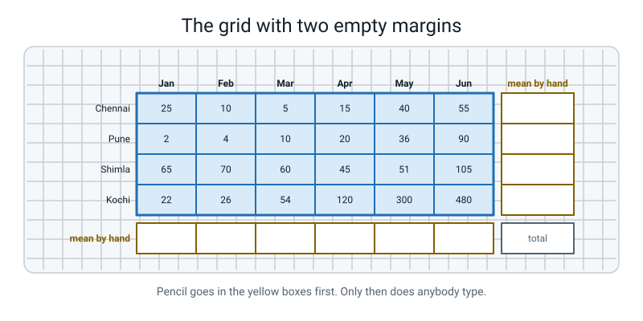
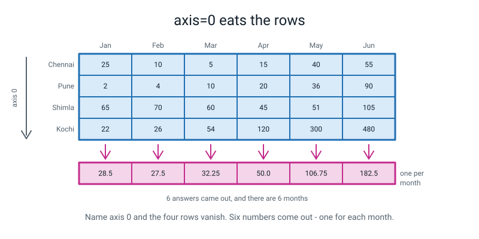
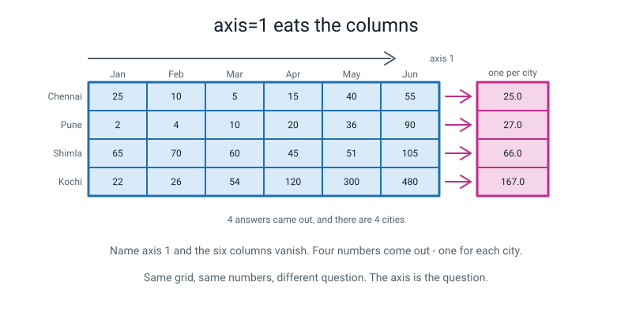
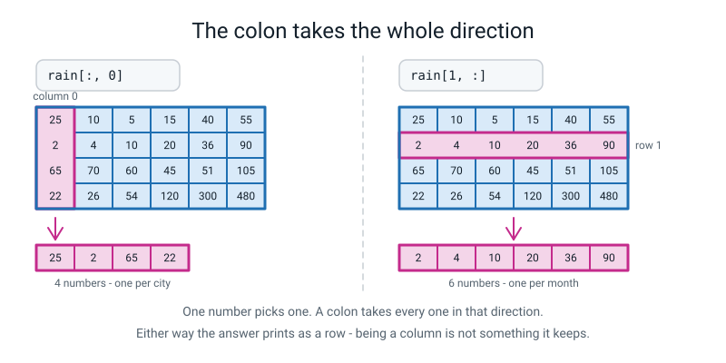
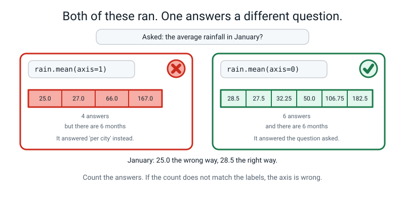
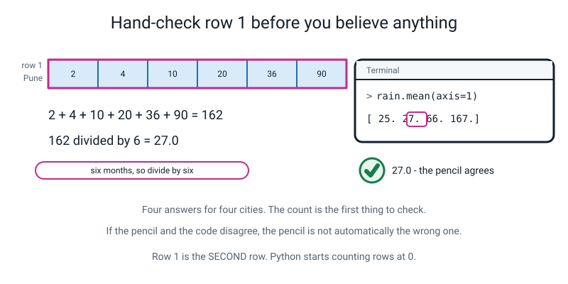
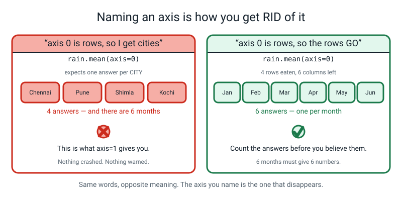
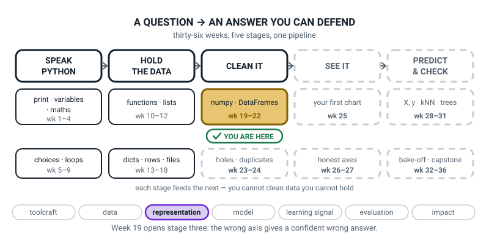
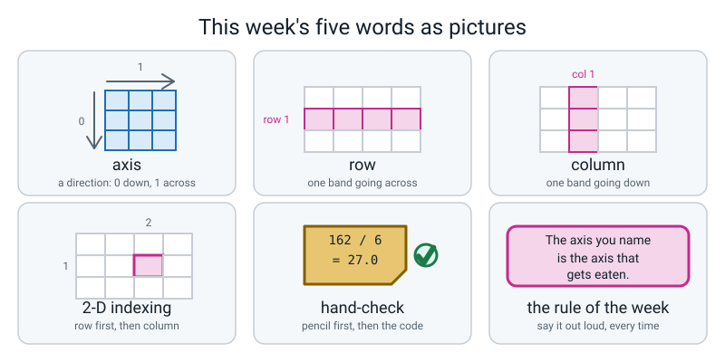

# Week 19 — Down the Columns or Across the Rows?

[⬅ Week 18](week-18.md) · [Course Home](../README.md) · [Next ➡](week-20.md) · [Workbook](../workbook/week-19.md)

---

> ### This week in one sentence
> **`axis=0` walks down a column and `axis=1` walks across a row — and picking the wrong one hands you a confident wrong answer with no error message at all.**
>
> **By the end of this chapter you will be able to:**
> - **Point at one cell** of a 2-D array with one pair of brackets and one comma
> - **Take a whole column or a whole row** using a colon
> - **Compute one mean per column** with `axis=0`, and say how many answers you expect *before* you run it
> - **Compute one total per row** with `axis=1`, and check the count of answers against the count of labels
> - **Hand-check one row on paper** before you trust anything the array said
>
> **New syntax:** `arr[1, 2]` · `arr[:, 0]` · `arr.mean(axis=0)` · `arr.sum(axis=1)`
>
> **Reading time:** about 35 minutes. **Homework:** about 55 minutes.

---

## 🪝 Start Here

Here is a table of rainfall. Four cities down the side. Six months across the top. Every number is millimetres of rain that fell in that city in that month.

```text
             Jan   Feb   Mar   Apr   May   Jun
Chennai       25    10     5    15    40    55
Pune           2     4    10    20    36    90
Shimla        65    70    60    45    51   105
Kochi         22    26    54   120   300   480
```

Twenty-four numbers. One question:

> **What is the average rainfall?**

Go on, actually try. Pick up a pencil.

You will get about ten seconds in before something goes wrong, and it is not the arithmetic. It is this: **you do not know how many numbers your answer is supposed to be.**

Because there are three answers on that page, and all three of them are correct.

| The question you might have meant | The answer | How many numbers |
|---|---|---|
| average over the whole table | 71.25 | **1** |
| average **per city** — how wet is each city? | 25, 27, 66, 167 | **4** |
| average **per month** — how wet is each month? | 28.5, 27.5, 32.25, 50, 106.75, 182.5 | **6** |

Four cities, so four city answers. Six months, so six month answers. Nothing mysterious — but notice what it means. When you asked yourself *"what's the average"*, **you had not finished asking the question yet.**


*Figure 19.1 — Twenty-four numbers, and two empty margins. One margin holds four answers. The other holds six. Which one did you want?*

The computer will happily hand you any of the three. It will never ask which one you meant. It will never tell you that you picked the wrong one.

So the first thing this week teaches is not a piece of Python. It is a habit:

> **Before you ask a computer for an average, decide how many answers you expect.**

Four, or six. If you get four when you wanted six, your answer is wrong — and it will look completely fine.

---

## 🧠 The Big Idea

> **📌 About the code in this section.** The blocks below are **illustrations, not files**. They show you the shape of one idea, and each one carries on from the one above it — the `import` lines and the data are typed once, in the first block that needs them. **The complete, runnable file is in 💻 Type This.** If you copy a block from this section on its own and Python says `NameError`, that is why, and nothing is broken.

### 1. The two directions have numbers, and the numbers come from the shape

**The plain explanation.** Last week you learned that an array knows its own shape. This grid's shape is `(4, 6)` — four rows, then six columns. Rows first. That has not changed.

Here is the whole new idea. **Those two positions in the shape have names, and the names are numbers.**

> **axis** — a direction through an array. `axis=0` runs **down** the rows. `axis=1` runs **across** the columns.

```text
shape (4, 6)
       |  |
       |  +--- axis 1 : the columns : 6 of them
       +------ axis 0 : the rows    : 4 of them
```

The **first** number in the shape — the 4, the rows — is **axis 0**. The **second** number — the 6, the columns — is **axis 1**.

**The analogy.** Think of a shelf of books. The shelf has a *length* and a *height*, and nobody has to memorise which is which — you can see it. The axis number works the same way: **it is the position in the shape**, and the shape is printed on your screen whenever you want it. You are not memorising a fact, you are reading one.

> **row** — one band going across the grid. Chennai's six months are one row.
> **column** — one band going down the grid. January's four cities are one column.

**A concrete example, with real values.** Now the sentence that carries the whole week, and I want you saying it out loud:

> **The axis you name is the axis that gets eaten.**

Watch. You write `axis=0`. Axis 0 is the rows. So the **rows get eaten** — all four of them get squashed together and vanish. What is left over?

The columns. Six of them. So you get **six answers, one per month.**

```python
print(rain.mean(axis=0))
```

```text
[ 28.5   27.5   32.25  50.   106.75 182.5 ]
```

Count them. Six. And there are six months.


*Figure 19.2 — `axis=0` eats the rows. Four rows go in, and six answers come out — one for each month.*

### 2. The other direction, and the count that catches your mistakes

**The plain explanation.** Same sentence, other direction. You write `axis=1`. Axis 1 is the columns. So the **columns get eaten** — all six squashed together, gone. What is left?

The rows. Four of them. **Four answers, one per city.**

```python
print(rain.mean(axis=1))
```

```text
[ 25.  27.  66. 167.]
```

Four numbers. Four cities.


*Figure 19.3 — `axis=1` eats the columns. Six columns go in, and four answers come out — one for each city.*

**The analogy.** Imagine squashing the grid flat with a rolling pin. Roll it **downwards** and the rows disappear into each other; what survives is one flat row of column answers. Roll it **sideways** and the columns disappear; what survives is one flat column of row answers. Whatever direction you roll in, that direction is gone.

**A concrete example of why this matters.** Here is what you can now do that you could not do five minutes ago: **you can say how many answers will come out before you press run.**

| You write | You named | So this gets eaten | You get |
|---|---|---|---|
| `rain.mean(axis=0)` | the rows | 4 rows | **6 numbers** — one per month |
| `rain.mean(axis=1)` | the columns | 6 columns | **4 numbers** — one per city |
| `rain.mean()` | nothing | everything | **1 number** — 71.25 |

And the count of answers is never a mystery, because **it is the count of labels, and you typed the labels yourself.** You know there are four cities. You typed the word "Chennai".

> **💡 Try this:** before every single line with an axis in it, say the number out loud. "Six." Then run it and count. It takes two seconds and it is the cheapest check in this whole course.

### 3. Pointing at one cell, and the colon that means "all of them"

**The plain explanation.** Before averages, something smaller: how do you point at a single cell?

> **2-D indexing** — naming one cell of a block with two numbers: the row first, then the column, in one pair of square brackets, separated by a comma.

```python
print(rain[1, 2])
```

```text
10
```

Read it out loud as **"row one, column two"**. Row first, always. Same order as the shape.

**And here is the thing that catches everybody.** In English, "row 1" means the first row. In Python, `rain[1]` is the **second** row, because counting starts at 0. So `rain[1, 2]` is *Pune in March*, not *Chennai in February*.

That is Week 11's off-by-one arriving in two directions at once, which is why it hurts twice as much. The cure is not a rule. It is your finger:

> **⚠️ Watch out:** every single time you write an index, put your finger on the cell and count out loud from zero. Both directions. Every time. It is tedious for about a day and then it is free forever.

**The analogy for the colon.** Now: what if you want a whole row, or a whole column? You put a **colon** where the number would go, and a colon means **"every one of these"**.

Think of the two positions in the brackets as two questions the array is asking you: *which row?* and *which column?* A number answers the question. A colon says **"don't narrow it down — all of them."**

```python
print(rain[1, :])      # row 1, EVERY column  -> all of Pune's months
print(rain[:, 0])      # EVERY row, column 0  -> January for all four cities
```

```text
[ 2  4 10 20 36 90]
[25  2 65 22]
```


*Figure 19.4 — One number picks one. A colon takes every one in that direction.*

**Three concrete things to know about the colon, and the third one surprises people.**

**(a) `rain[1]` and `rain[1, :]` are the same thing.** Leave the second position off entirely and numpy assumes you meant "all of them". Both give Pune's whole row. **Prefer `rain[1, :]` while you are learning**, because the colon is *visible* — you can see that a decision was made about the second direction. An invisible decision is one you forget you made.

**(b) There is no short form for a column.** You cannot write `rain[, 0]`. Python refuses before it even runs the file. The colon in the row position is compulsory — which is a small piece of luck, because a column is the harder one to picture and it is good that it costs a deliberate keystroke.

**(c) A column prints as a row.** `rain[:, 0]` gave `[25  2 65 22]`, printed left to right, even though you asked for a column. Its shape is `(4,)` — four numbers, one direction.

That is not a bug. Four numbers standing up and four numbers lying down are **the same four numbers**. Being upright was where they happened to be sitting; it is not something the array keeps.

### 4. The wrong axis does not crash. This is the whole point of the week.

**The plain explanation.** Suppose you want the average rainfall in **January**. January is a column. Columns are what survive when you eat the rows, so this is `axis=0`.

But you type `axis=1`.

```python
print(rain.mean(axis=1))
```

```text
[ 25.  27.  66. 167.]
```

Nothing crashed. Four beautifully formatted decimal numbers, each with a tidy full stop after it. The first one is `25.0`, so you write down *"January: 25.0 mm"* and move on.

**The real answer for January is 28.5.**

**The analogy.** You asked a very literal robot for "the average". It gave you a correct average of something nobody asked about, and then stood there looking pleased.

`25.0` is not a random wrong number. It is **Chennai's average across all six months** — a perfectly good number that answers a question you never asked.


*Figure 19.5 — Both lines ran. Both printed. Only one of them answered the question that was asked.*

**A concrete example of why this is worse than a crash.** Look at the two numbers:

| | January's average |
|---|---|
| what `axis=1` said | **25.0 mm** |
| what is true | **28.5 mm** |

Both of those are believable amounts of rain. There is nothing about 25.0 that looks wrong. If the wrong answer had been 25000 you would have caught it instantly, because nobody gets twenty-five metres of rain in January. **Plausible wrong answers are the dangerous ones.**

Here is the general version, and it is one of the most important ideas in this whole year:

> Most mistakes you have made so far were **loud**. Python stopped, printed a traceback, and told you where. This one is **quiet**. It gives you a number, the number is wrong, and nobody says a word. From here on, most of your mistakes will be this kind — and the only defence is a check you run on purpose.

Two checks defend against it, and both are nearly free:

1. **Count the answers.** Six months, six numbers.
2. **Hand-check one of them.** One row, one calculator, thirty seconds.

### 5. The hand-check, and the corner check

**The plain explanation.** Two checks. The first one you do with a pencil; the second one lives in your file and keeps working after you have stopped paying attention.

> **hand-check** — working out one of the answers yourself, on paper, with a calculator, *before* you look at what the code said.

**The order matters enormously.** Pencil first. Write the answer down where you cannot quietly change it. *Then* run the code. *Then* compare.

If you run the code first you are not checking anything — you are agreeing. A number on a screen is extremely persuasive, and a person who has already seen `25.0` will somehow do arithmetic that arrives at 25.0.

**The analogy.** It is the difference between guessing the answer to a quiz question and then looking it up, versus looking it up and then telling everyone you knew it.

**A concrete example, worked all the way through.** Row 1 is **Pune** — because row 0 is Chennai.

```text
2 + 4 + 10 + 20 + 36 + 90 = 162
162 / 6 = 27.0
```

Six months in the row, so divide by six. Write down `27.0` in pen.


*Figure 19.6 — Pencil first. Then the code. Then compare.*

**And the second check, which is free and stays in the file.** Add the grid up in rows. Add it up in columns. Add it all up at once.

```python
print(rain.sum(axis=1).sum())   # add up the four city totals
print(rain.sum(axis=0).sum())   # add up the six month totals
print(rain.sum())               # add up the whole grid
```

```text
1710
1710
1710
```

Three routes, one number. That is not magic — it is the same twenty-four numbers, added in three different orders. **All three of those must agree — always.**

Because they are the same numbers added in different orders, numpy can never make them disagree. So this line checks your *understanding* and any totals you add up by hand. It is not a detector for a wrong axis or a mistyped number: a wrong `axis` still gives three matching totals. (A row with the wrong length is caught earlier, when numpy refuses to build the array.)

Call it the **corner check**, because on paper it lands in the bottom-right corner where the two margins meet. Accountants have been cross-footing tables like this for centuries, and in Python it is one line.

On paper it is a real check, because your own adding-up can slip. In numpy it will always agree, so use it to confirm you understand the two directions.

> **🤔 Think about it:** what should you do if the pencil and the code disagree? **Not "trust the code."** The code is not automatically right, and neither is the pencil. Something is wrong and now you have to find out which one — and that is not a bad afternoon. That is the job.

---

## 💻 Type This

One file, `rainfall.py`, built up in six steps. Put it in your `level2` folder next to last week's work.

### Step 1 — the grid, and the labels

```python
"""rainfall.py - one grid, two directions. Week 19."""

import numpy as np                          # bring numpy in, call it np

# --- the grid: 4 cities DOWN, 6 months ACROSS -------------------------------
#            Jan  Feb  Mar  Apr  May  Jun
rain = np.array([
    [ 25,  10,   5,  15,  40,  55],         # row 0 - Chennai
    [  2,   4,  10,  20,  36,  90],         # row 1 - Pune
    [ 65,  70,  60,  45,  51, 105],         # row 2 - Shimla
    [ 22,  26,  54, 120, 300, 480],         # row 3 - Kochi
])

cities = np.array(["Chennai", "Pune", "Shimla", "Kochi"])
months = np.array(["Jan", "Feb", "Mar", "Apr", "May", "Jun"])

print("shape :", rain.shape)                # rows first, then columns
print("cities:", cities.shape)              # must match the FIRST number of shape
print("months:", months.shape)              # must match the SECOND number of shape
```

Run it:

```text
shape : (4, 6)
cities: (4,)
months: (6,)
```

**What the new lines do.** One row of the grid per line of code, with a comment naming the city. **The shape of the code should be the shape of the array** — that way you catch mistakes with your eyes instead of hunting for them with a print statement.

And those last two print lines are not decoration. `cities` has four names; the first number of the shape is four. `months` has six names; the second number is six. **That is a check.** If you ever type a row with five numbers in it by accident, this is where you find out.

### Step 2 — one cell, and one loud mistake

Add this. It is wrong on purpose, and it is the natural mistake.

```python
# --- one cell: row first, then column, one comma between them ---------------
print("June for Pune:", rain[1, 6])         # June is the sixth month... isn't it?
```

**Predict before you run it.** Will that work?

```text
shape : (4, 6)
cities: (4,)
months: (6,)
Traceback (most recent call last):
  File "rainfall.py", line 20, in <module>
    print("June for Pune:", rain[1, 6])
IndexError: index 6 is out of bounds for axis 1 with size 6
```

Read the last line. *"Index 6 is out of bounds. There are only six."*

And read the middle of it too, because numpy has used this week's word at you: **"for axis 1"**. It is telling you *which direction* you got wrong. Not the rows — the columns. That is genuinely helpful and you should get used to reading it.

Six columns, numbered 0, 1, 2, 3, 4, 5. **June is column 5.** Fix it, and add the cell from the Big Idea:

```python
print("June for Pune:", rain[1, 5])
print("rain[1, 2] =", rain[1, 2])           # row 1, column 2 = Pune in March
```

```text
June for Pune: 90
rain[1, 2] = 10
```

Ninety. Put your finger on it — Pune, June. And ten: Pune, March. Both right.

### Step 3 — a whole row and a whole column

```python
# --- a whole row, and a whole column ---------------------------------------
print("rain[1, :] =", rain[1, :])           # every month for Pune
print("rain[:, 0] =", rain[:, 0])           # January for every city
```

**Predict before you run it.** How many numbers from each line? Say both out loud.

```text
rain[1, :] = [ 2  4 10 20 36 90]
rain[:, 0] = [25  2 65 22]
```

Six, then four. You called it.

Now the odd one. The second line asked for a **column** — every row, column zero — and it printed **sideways**. That is correct, and §3(c) is why: four numbers are four numbers, and being upright is not something the array keeps. If you doubt it, do not guess, print it:

```python
print("its shape :", rain[:, 0].shape)      # one direction, four numbers
```

```text
its shape : (4,)
```

### Step 4 — one mean per month, and one quiet mistake

You want the average rainfall **for each month**. Six answers, one per month. Type this — it is wrong on purpose too, and this time nothing will crash.

```python
# --- one answer PER MONTH -------------------------------------------------
month_mean = rain.mean(axis=1)              # per month... or so we hope
print("per month :", month_mean)
```

**Predict before you run it.** How many numbers should come out?

```text
per month : [ 25.  27.  66. 167.]
```

Now stop. Do not read on for five seconds.

**How many numbers are there?** Four. **How many months are there?** Six.

Four answers for six months, and **Python did not say a word.** No traceback, no warning, no red text. It printed four tidy decimals and let you write down a wrong answer about January.

Say the sentence. *The axis you name is the axis that gets eaten.* You named axis 1. Axis 1 is the columns. So the columns got eaten, so the answers came out one per **row** — one per city. You asked for the wrong direction and you got exactly what you asked for.

Fix it, and add the line that would have caught it:

```python
month_mean = rain.mean(axis=0)              # 4 rows squashed away -> 6 answers
print("per month :", month_mean)
print("how many? :", month_mean.shape, "- should be 6, one per month")
```

```text
per month : [ 28.5   27.5   32.25  50.   106.75 182.5 ]
how many? : (6,) - should be 6, one per month
```

Six. And January is **28.5**, not 25.0.

That second print line costs eight seconds to type and it makes the mistake **impossible to miss**. From today: when you write an axis, you write the count check underneath it. Every time.

### Step 5 — the other direction, and the totals

```python
# --- one answer PER CITY ---------------------------------------------------
city_mean = rain.mean(axis=1)               # 6 columns squashed away -> 4 answers
print("per city  :", city_mean)
print("how many? :", city_mean.shape, "- should be 4, one per city")

# --- totals, the same two directions ---------------------------------------
city_total = rain.sum(axis=1)               # one total per city
month_total = rain.sum(axis=0)              # one total per month
print("city totals :", city_total)
print("month totals:", month_total)

# --- the cross-check: three routes to the same total ------------------------
print("city totals add to :", city_total.sum())
print("month totals add to:", month_total.sum())
print("whole grid adds to :", rain.sum())
```

```text
per city  : [ 25.  27.  66. 167.]
how many? : (4,) - should be 4, one per city
city totals : [ 150  162  396 1002]
month totals: [114 110 129 200 427 730]
city totals add to : 1710
month totals add to: 1710
whole grid adds to : 1710
```

`.sum` behaves exactly like `.mean` — same two directions, same rule, same counts. And there is the corner check: three routes, one number, 1710.

### Step 6 — put the names back on

```python
# --- the report, with the labels put back on -------------------------------
print()
print("City      Total  Mean")
print("-" * 22)
for i in range(len(cities)):                # a loop for PRINTING only
    print(f"{cities[i]:<9} {city_total[i]:>5} {city_mean[i]:>5.1f}")
```

```text

City      Total  Mean
----------------------
Chennai     150  25.0
Pune        162  27.0
Shimla      396  66.0
Kochi      1002 167.0
```

**There is a `for` loop in this file**, after four weeks of retiring loops. Look at what it does: **it prints.** It does not add anything up. All the arithmetic happened in two lines with axes in them.

That is the rule from here on: **arrays do the maths, loops do the printing.** And the loop is what puts the names back on — which is the thing the array threw away in Week 17.

### The complete finished program

```python
"""rainfall.py - one grid, two directions. Week 19."""

import numpy as np                          # bring numpy in, call it np

# --- the grid: 4 cities DOWN, 6 months ACROSS -------------------------------
#            Jan  Feb  Mar  Apr  May  Jun
rain = np.array([
    [ 25,  10,   5,  15,  40,  55],         # row 0 - Chennai
    [  2,   4,  10,  20,  36,  90],         # row 1 - Pune
    [ 65,  70,  60,  45,  51, 105],         # row 2 - Shimla
    [ 22,  26,  54, 120, 300, 480],         # row 3 - Kochi
])

cities = np.array(["Chennai", "Pune", "Shimla", "Kochi"])
months = np.array(["Jan", "Feb", "Mar", "Apr", "May", "Jun"])

print("shape :", rain.shape)                # rows first, then columns
print("cities:", cities.shape)              # must match the FIRST number of shape
print("months:", months.shape)              # must match the SECOND number of shape

# --- one cell: row first, then column, one comma between them ---------------
print("rain[1, 2] =", rain[1, 2])           # row 1, column 2 = Pune in March

# --- a whole row, and a whole column ---------------------------------------
print("rain[1, :] =", rain[1, :])           # every month for Pune
print("rain[:, 0] =", rain[:, 0])           # January for every city

# --- one answer PER MONTH: eat the rows, so axis=0 --------------------------
month_mean = rain.mean(axis=0)              # 4 rows squashed away -> 6 answers
print("per month :", month_mean)
print("how many? :", month_mean.shape, "- should be 6, one per month")

# --- one answer PER CITY: eat the columns, so axis=1 -----------------------
city_mean = rain.mean(axis=1)               # 6 columns squashed away -> 4 answers
print("per city  :", city_mean)
print("how many? :", city_mean.shape, "- should be 4, one per city")

# --- totals, the same two directions ---------------------------------------
city_total = rain.sum(axis=1)               # one total per city
month_total = rain.sum(axis=0)              # one total per month
print("city totals :", city_total)
print("month totals:", month_total)

# --- the cross-check: three routes to the same total ------------------------
print("city totals add to :", city_total.sum())
print("month totals add to:", month_total.sum())
print("whole grid adds to :", rain.sum())

# --- the report, with the labels put back on -------------------------------
print()
print("City      Total  Mean")
print("-" * 22)
for i in range(len(cities)):                # a loop for PRINTING only
    print(f"{cities[i]:<9} {city_total[i]:>5} {city_mean[i]:>5.1f}")
```

Real output:

```text
shape : (4, 6)
cities: (4,)
months: (6,)
rain[1, 2] = 10
rain[1, :] = [ 2  4 10 20 36 90]
rain[:, 0] = [25  2 65 22]
per month : [ 28.5   27.5   32.25  50.   106.75 182.5 ]
how many? : (6,) - should be 6, one per month
per city  : [ 25.  27.  66. 167.]
how many? : (4,) - should be 4, one per city
city totals : [ 150  162  396 1002]
month totals: [114 110 129 200 427 730]
city totals add to : 1710
month totals add to: 1710
whole grid adds to : 1710

City      Total  Mean
----------------------
Chennai     150  25.0
Pune        162  27.0
Shimla      396  66.0
Kochi      1002 167.0
```

---

## 🔍 Worked Examples

Three complete programs, in three different worlds. Type each one, **predict the counts before you run it**, then check.

### Worked Example 1 — Three pizza shops, four days (food)

```python
"""pizza19.py - three shops down, four days across."""

import numpy as np                              # the array library

#                    Thu  Fri  Sat  Sun
orders = np.array([
    [ 30,  45,  88,  62],                       # row 0 - Corner Slice
    [ 12,  21,  34,  28],                       # row 1 - Dosa Pizza
    [ 45,  51,  91,  72],                       # row 2 - Big Cheese
])
shops = np.array(["Corner Slice", "Dosa Pizza", "Big Cheese"])
days = np.array(["Thu", "Fri", "Sat", "Sun"])

print("shape :", orders.shape)                  # rows first, then columns
print("shops :", len(shops), " days:", len(days))

print("orders[1, 2] =", orders[1, 2])           # row 1, column 2
print("orders[2, :] =", orders[2, :])           # every day for Big Cheese
print("orders[:, 3] =", orders[:, 3])           # Sunday, for every shop

per_day = orders.mean(axis=0)                   # eat the 3 shops -> 4 answers
print("per day  (axis=0):", per_day, "->", per_day.shape, "want 4")

per_shop = orders.mean(axis=1)                  # eat the 4 days -> 3 answers
print("per shop (axis=1):", per_shop, "->", per_shop.shape, "want 3")

print("day totals :", orders.sum(axis=0))
print("shop totals:", orders.sum(axis=1))
print("corner check:", orders.sum(axis=0).sum(), orders.sum(axis=1).sum(), orders.sum())
```

Real output:

```text
shape : (3, 4)
shops : 3  days: 4
orders[1, 2] = 34
orders[2, :] = [45 51 91 72]
orders[:, 3] = [62 28 72]
per day  (axis=0): [29. 39. 71. 54.] -> (4,) want 4
per shop (axis=1): [56.25 23.75 64.75] -> (3,) want 3
day totals : [ 87 117 213 162]
shop totals: [225  95 259]
corner check: 579 579 579
```

**Notice that the counts are 4 and 3 here, not 6 and 4.** They came from the shape, which is `(3, 4)` this time. If you tried to remember "axis=0 gives six" from the rainfall grid, you have just got it wrong. **Re-derive it every time from the shape you are actually looking at.**

**Hand-check row 1.** `12 + 21 + 34 + 28 = 95`, and `95 / 4 = 23.75`. Four days in the row, so divide by four. The code says `23.75` in the second slot. ✔

### Worked Example 2 — Four players, five matches (sport)

```python
"""cricket19.py - four players down, five matches across."""

import numpy as np

#                    M1   M2   M3   M4   M5
runs = np.array([
    [ 34,  12,  58,  41,  25],                  # row 0 - Asha
    [  8,  22,  15,  30,   5],                  # row 1 - Ravi
    [ 77,  45,  60,  33,  55],                  # row 2 - Nita
    [ 21,   5,  47,  12,  15],                  # row 3 - Kabir
])
players = np.array(["Asha", "Ravi", "Nita", "Kabir"])
matches = np.array(["M1", "M2", "M3", "M4", "M5"])

print("shape  :", runs.shape)
print("players:", len(players), " matches:", len(matches))

print("runs[2, 0] =", runs[2, 0])               # row 2, column 0 = Nita in M1
print("runs[3, :] =", runs[3, :])               # every match for Kabir
print("runs[:, 4] =", runs[:, 4])               # M5, for every player

per_match = runs.mean(axis=0)                   # eat the 4 players -> 5 answers
print("per match  (axis=0):", per_match, "->", per_match.shape, "want 5")

per_player = runs.mean(axis=1)                  # eat the 5 matches -> 4 answers
print("per player (axis=1):", per_player, "->", per_player.shape, "want 4")

print("match totals :", runs.sum(axis=0))
print("player totals:", runs.sum(axis=1))
print("corner check :", runs.sum(axis=0).sum(), runs.sum(axis=1).sum(), runs.sum())
```

Real output:

```text
shape  : (4, 5)
players: 4  matches: 5
runs[2, 0] = 77
runs[3, :] = [21  5 47 12 15]
runs[:, 4] = [25  5 55 15]
per match  (axis=0): [35. 21. 45. 29. 25.] -> (5,) want 5
per player (axis=1): [34. 16. 54. 20.] -> (4,) want 4
match totals : [140  84 180 116 100]
player totals: [170  80 270 100]
corner check : 620 620 620
```

**Which question does a commentator want?** *"Which match was a low-scoring one?"* is about matches, and matches are columns, so it is `axis=0` — and M2 comes out lowest at 21. *"Who is the best batter?"* is about players, and players are rows, so it is `axis=1` — Nita, at 54.

**Same twenty numbers, two completely different stories, and the only difference is one character.**

### Worked Example 3 — Five days, three subjects (school)

This one flips the shape on purpose: **more rows than columns.**

```python
"""homework19.py - five days down, three subjects across."""

import numpy as np

#                    Maths  Eng  Sci
minutes = np.array([
    [ 30,  20,  10],                            # row 0 - Mon
    [ 45,  15,  30],                            # row 1 - Tue
    [ 20,  40,  15],                            # row 2 - Wed
    [ 60,  25,  20],                            # row 3 - Thu
    [  0,  25,  50],                            # row 4 - Fri
])
days = np.array(["Mon", "Tue", "Wed", "Thu", "Fri"])
subjects = np.array(["Maths", "English", "Science"])

print("shape   :", minutes.shape)
print("days    :", len(days), " subjects:", len(subjects))

print("minutes[4, 0] =", minutes[4, 0])         # row 4, column 0 = Friday maths
print("minutes[0, :] =", minutes[0, :])         # all three subjects on Monday
print("minutes[:, 1] =", minutes[:, 1])         # English, on all five days

per_subject = minutes.mean(axis=0)              # eat the 5 days -> 3 answers
print("per subject (axis=0):", per_subject, "->", per_subject.shape, "want 3")

per_day = minutes.mean(axis=1)                  # eat the 3 subjects -> 5 answers
print("per day     (axis=1):", per_day, "->", per_day.shape, "want 5")

print("subject totals:", minutes.sum(axis=0))
print("day totals    :", minutes.sum(axis=1))
print("corner check  :", minutes.sum(axis=0).sum(), minutes.sum(axis=1).sum(), minutes.sum())
```

Real output:

```text
shape   : (5, 3)
days    : 5  subjects: 3
minutes[4, 0] = 0
minutes[0, :] = [30 20 10]
minutes[:, 1] = [20 15 40 25 25]
per subject (axis=0): [31. 25. 25.] -> (3,) want 3
per day     (axis=1): [20. 30. 25. 35. 25.] -> (5,) want 5
subject totals: [155 125 125]
day totals    : [ 60  90  75 105  75]
corner check  : 405 405 405
```

**Look at what changed.** In the rainfall grid, `axis=0` gave the bigger answer. Here `axis=0` gives the *smaller* one — three numbers, not five — because there are only three columns. **`axis=0` does not mean "lots of answers". It means "the rows are gone", and how many are left depends entirely on the shape.**

**And `minutes[4, 0]` is `0`.** No maths homework at all on Friday. That is a real value, not a missing one — worth knowing the difference, because in two weeks' time you will meet a table where "0" and "nobody wrote it down" look nothing alike.

---

## 🐞 When It Breaks

Every message below came from really running a broken version of this week's code. Your line numbers will differ. The last line will not.

### Break 1 — the sixth month is not column 6

```python
print("June for Pune:", rain[1, 6])
```

```text
Traceback (most recent call last):
  File "rainfall.py", line 10, in <module>
    print("June for Pune:", rain[1, 6])
IndexError: index 6 is out of bounds for axis 1 with size 6
```

**What Python is telling you.** *"You asked for column 6. There are six columns, so the last one is number 5."*

And read the middle: **"for axis 1"**. numpy is telling you *which direction* you overran. Not the rows — the columns. If it had said `for axis 0` you would be looking at the wrong end of the grid entirely.

**The fix.** `rain[1, 5]`. Columns are 0, 1, 2, 3, 4, 5.

> **🐞 If you see this error:** be pleased. It is loud, it names the axis, and it names the size. This is the *helpful* kind of mistake — most of this week's mistakes do not say anything at all.

### Break 2 — there is no third direction

```python
print(rain.mean(axis=2))
```

```text
Traceback (most recent call last):
  File "brk2.py", line 10, in <module>
    print(rain.mean(axis=2))
  File ".../numpy/core/_methods.py", line 106, in _mean
    rcount = _count_reduce_items(arr, axis, keepdims=keepdims, where=where)
  File ".../numpy/core/_methods.py", line 77, in _count_reduce_items
    items *= arr.shape[mu.normalize_axis_index(ax, arr.ndim)]
numpy.exceptions.AxisError: axis 2 is out of bounds for array of dimension 2
```

**What Python is telling you.** *"There is no third direction in this thing."* A table has exactly two directions, numbered 0 and 1. There is no 2.

**Notice the shape of this traceback.** Two of those `File` lines are inside numpy, not inside your file. **Read the last line first, then look for the `File` line with your own filename in it.** Everything else is numpy's route to the complaint.

**The fix.** `axis=0` or `axis=1`. (On older numpy this message reads `numpy.AxisError` instead. Same thing.)

### Break 3 — you cannot leave the row position empty

```python
print(rain[, 0])
```

```text
  File "brk3.py", line 5
    print(rain[, 0])
               ^
SyntaxError: invalid syntax
```

**What Python is telling you.** *"I cannot even read this line."* A `SyntaxError` happens before your program runs at all — notice that nothing else printed, not even the shape line above it.

The `^` marks the spot: right where the comma is, because there is nothing in front of it. **A position in the brackets has to hold something.** A number, or a colon.

**The fix.** `rain[:, 0]`. The colon is compulsory in the row position, and there is no short form for a column.

### Break 4 — the one with no message at all

```python
month_mean = rain.mean(axis=1)
print("per month :", month_mean)
```

```text
per month : [ 25.  27.  66. 167.]
```

**There is no error.** That is the whole problem. Four numbers where six belong, and the first one is a believable amount of rain for January.

**What to do when there is no message.** One question, and it takes four seconds:

> **"How many answers did I expect, and how many did I get?"**

Six, and four. There is your bug, and you found it without anybody telling you.

### The whole clinic, for reference

| What you see | What it means | The fix |
|---|---|---|
| `IndexError: index 6 is out of bounds for axis 1 with size 6` | "You asked for column 6; the last one is 5." | Count from zero. And read *which* axis it names |
| `IndexError: index 4 is out of bounds for axis 0 with size 4` | Same mistake, on the **rows** this time | `rain[3, 0]` for the fourth city |
| `numpy.exceptions.AxisError: axis 2 is out of bounds for array of dimension 2` | "There is no third direction." | `axis=0` or `axis=1` |
| `SyntaxError: invalid syntax` with `^` under a comma | "I cannot read this line at all." | `rain[:, 0]` — the colon is compulsory |
| `IndexError: too many indices for array: array is 2-dimensional, but 3 were indexed` | "Three numbers, two directions." | Two numbers, one comma: `rain[1, 2]` |
| ``IndexError: only integers, slices (`:`), ellipsis (`...`), numpy.newaxis (`None`) and integer or boolean arrays are valid indices`` | "That is not a position." | `rain[:, 0]`, not `rain[:, "Jan"]`. **An array has no idea what its columns are called** — Week 21 fixes exactly this |
| `TypeError: 'numpy.ndarray' object is not callable` | "You put round brackets after something that is not a function." | `rain[1, 2]` with **square** brackets |
| `TypeError: 'tuple' object is not callable` | "`.shape` is a fact, not an action." | `rain.shape`, no brackets. A verb takes brackets; a fact does not |
| `TypeError: 'str' object cannot be interpreted as an integer` | "The axis has to be a number." | `axis=0`, not `axis="0"` |
| **No error, 4 numbers where 6 belong** | Nothing is wrong as far as numpy is concerned. Both are legal averages | Count the answers against the count of labels. **This is the week's headline bug and it has no message** |
| **No error, your hand-added margins disagree with each other** | Nothing is wrong as far as numpy is concerned | A slip in your own adding-up on paper. (The three numpy totals cannot disagree.) To catch a mistyped grid, print `rain.shape` and compare it with `len(cities)` and `len(months)`, and compare a total with the source |
| **No error, `rain[:, 0]` printed sideways** | Nothing is wrong at all. This is correct | Nothing to fix. Print `.shape` if you doubt it: `(4,)` |

---

## 🎲 What We Did In Class

If you missed it, here is the whole lesson. The first half needs graph paper, a pencil and a calculator rather than a laptop.

### Three averages, one table

The rainfall grid on graph paper, and the instruction: *"work out the average rainfall."* Then, forty seconds in: *"put the pencil down. **How many numbers is your answer going to be?**"*

Three answers went on the board and stayed up all lesson:

```text
one number   -> the whole table
four numbers -> one per CITY   (there are 4 cities)
six numbers  -> one per MONTH  (there are 6 months)
```

And one question with a careful answer. *"Is 71.25 wrong?"* **No. It is a correct average of something nobody asked about.** Right and useless are not the same as wrong, and that distinction matters all year.

### The sentence, said about forty times

> **The axis you name is the axis that gets eaten.**

Then, on the paper grid: six downward arrows out of the bottom of the six columns with six empty boxes underneath (`axis=0`), and four arrows out of the right-hand side with four empty boxes (`axis=1`).

Then indexing, with fingers. `rain[1, 2]` read out loud as "row one, column two", and then **everybody pointed**. Most people point at Chennai/February first. Counting out loud from zero moves the finger to Pune/March, and nobody had to be told the rule.

### The counts, written in pen before any code ran

Workbook page 19.2: eight lines of code, and beside each one, **how many numbers will come out.** In pen, so nobody could quietly change their mind after seeing the answer.

Being wrong was fine. Editing your guess afterwards was not.

### Building `rainfall.py`, with two mistakes on purpose

The six steps in "Type This", in that order, with predictions before every run.

The two deliberate mistakes were chosen to be a matched pair:

| Mistake | What happened |
|---|---|
| `rain[1, 6]` — "June is the sixth month" | **Loud.** `IndexError`, and it named the axis |
| `rain.mean(axis=1)` on the per-month line | **Silent.** Four tidy numbers, no warning, wrong answer |

The second one went in the Bug Log under *errors with no error message*, and in the column where the error message goes, we wrote: **"four numbers instead of six."** That is the whole error.

### The two margins, and two hand-checks in pen

On the graph paper: an empty column down the right, four boxes tall. An empty row along the bottom, six boxes wide. A corner box where they meet.

Two questions before a single number was written:

> *"How many numbers go in the side margin?"* — Four. One per city.
> *"How many go in the bottom margin?"* — Six. One per month.

Then, in pen:

```text
Row 1 is PUNE  (row 0 is Chennai)
2 + 4 + 10 + 20 + 36 + 90 = 162      162 / 6 = 27.0

Column 1 is FEBRUARY  (column 0 is January)
10 + 4 + 70 + 26 = 110               110 / 4 = 27.5
```

*Then* the code:

```python
print("row 1 by hand : 162 / 6 = 27.0")
print("row 1 by code :", rain[1, :].sum(), "/ 6 =", rain.mean(axis=1)[1])
print("col 1 by hand : 110 / 4 = 27.5")
print("col 1 by code :", rain[:, 1].sum(), "/ 4 =", rain.mean(axis=0)[1])
```

```text
row 1 by hand : 162 / 6 = 27.0
row 1 by code : 162 / 6 = 27.0
col 1 by hand : 110 / 4 = 27.5
col 1 by code : 110 / 4 = 27.5
```

And one thing worth staring at: **`rain.mean(axis=1)[1]` has two ones in it and they mean completely different things.** The `axis=1` says *eat the columns*. The `[1]` says *and then hand me the second of the answers*. Change the second one to `[2]` and you get Shimla instead.

### The corner check, on paper

```text
150 + 162 + 396 + 1002 = 1710
114 + 110 + 129 + 200 + 427 + 730 = 1710
```

One number, reached two ways. If your two ways disagree, you have made a slip in your adding-up and you have just found it without anybody telling you. **That is what a check is.**

---

## 💬 Talk About It

Three questions to argue about with a friend or a grown-up. Each one has a hint underneath.

**1. `25.0` and `28.5` are both believable amounts of rain for January. Which of the two would be easier to catch if it were wrong — and what does that tell you about which wrong answers are dangerous?**

*Hint:* start by imagining the wrong answer had been 25000 instead of 25.0. You would spot that in a heartbeat, because twenty-five metres of rain in one month is absurd — and notice *why* you would spot it: not from the code, but from knowing what rainfall is like. Now notice that 25.0 gives you nothing to push against. So the wrong answers you catch are the ones that clash with something you already know, and the dangerous ones are the ones that sit politely inside the range you expected. Then the harder half: **if plausibility cannot save you, what can?** Count the answers — because four can never be six, however plausible four numbers are. What else in this course works like that, giving you a check that does not depend on your judgement?

**2. Why is "count the answers" a better check than "look at the numbers and see if they seem right"?**

*Hint:* think about what each check actually needs from you. "Do they seem right?" needs you to know roughly what the answer should be — which, if you knew, you would not need the computer. "Are there six of them?" needs only the count of labels you typed yourself. Then push on it: is counting *enough*? Find a case where you get the right count and the wrong answer. *(There is one in this chapter — `rain[1, :]` gives six numbers and so does `rain.mean(axis=0)`, and they mean utterly different things.)* So what is counting actually for — proving you are right, or catching one particular family of mistake? And what does the hand-check catch that counting cannot?

**3. The rainfall table has no year in it. Is January 2019 or January 2024 — and does the average of six Januaries from six different years mean anything?**

*Hint:* there is no right answer here and the argument is the point. Start with what the array knows: twenty-four numbers and a shape. It does not know these are cities, or millimetres, or which year. **Every one of those things is in your head or in a comment, and neither is in the data.** Then ask what would change if the six Januaries were from six different years — is "average January rainfall" still one thing? Then the question underneath: when somebody hands you a table of numbers, whose job is it to tell you what they mean? And what should you write down so the next person — probably you, in March — is not guessing?

---

## ⚠️ Don't Get Tricked

Four ideas that sound right and are not. Each one shows the wrong thought next to the right one.

### Trick 1 — "axis=0 means rows, so my answers are about rows"


*Figure 19.7 — Same words, opposite meaning. The axis you name is the one that disappears.*

| ❌ Wrong | ✅ Right |
|---|---|
| "`axis=0` is the rows, so `rain.mean(axis=0)` gives me one answer per city." | `axis=0` **names** the rows, and naming them is how you get **rid** of them. Four rows go in and vanish; six columns survive; you get **six answers, one per month.** |

This is the big one and it is completely natural, because the name of the axis and the shape of the answer point in opposite directions. Never let *"axis 0 means rows"* stand as a whole sentence in your head. Say the whole thing:

> *"axis 0 names the rows, so the rows get eaten, so I get one answer per column."*

### Trick 2 — "row 1 is the first row"

| ❌ Wrong | ✅ Right |
|---|---|
| "`rain[1, 2]` is row 1 column 2, so that's Chennai in February." | Rows and columns are both numbered **from zero**. `rain[1, 2]` is **Pune in March** — the second row, the third column. |

In English, row 1 is the first row. In Python it is not, and no amount of remembering fixes it. **Point at the cell and count out loud from zero.** Every time you write an index, for the rest of your life.

### Trick 3 — "it printed numbers, so it worked"

| ❌ Wrong | ✅ Right |
|---|---|
| "No traceback, no red text, four neat decimals. That worked." | A run that produced the **wrong number of answers** did not work, however neat the output looked. Six months means six numbers. Four is not six. |

Two weeks of `TypeError` and `IndexError` have trained you that a run without a traceback is a run that succeeded. This week breaks that on purpose. **An answer that ran is not an answer that is right.**

### Trick 4 — "`rain[:, 0]` printed sideways, so something went wrong"

| ❌ Wrong | ✅ Right |
|---|---|
| "I asked for a column and got `[25 2 65 22]` lying down. Where did my column go?" | Nowhere. Its shape is `(4,)` — four numbers, one direction. **Being upright is not something the array keeps.** A column of four numbers and a row of four numbers are the same four numbers. |

If it helps: the grid is a chocolate bar and `rain[:, 0]` snaps off one strip. Once the strip is in your hand, whether it *used* to be vertical is not a property of the strip.

---

## 🌍 Where You've Seen This

Rows and columns turn up outside Python too. Here are six places.

1. **Every spreadsheet you have ever seen.** The `AVERAGE` you drag across the bottom of a spreadsheet is `axis=0`, and the one you drag down the right-hand side is `axis=1`. Spreadsheets make you point at the direction with a mouse; numpy makes you name it with a number. Same two directions, since 1979.
2. **Your school report.** One row per subject, one column per term. Your average *per subject* and the class average *per term* come out of the same grid and answer different questions — and somebody had to decide which one goes on the front page.
3. **A phone's battery-by-app screen.** Apps down, hours across. "Which app drained the most?" is one direction. "Which hour was worst?" is the other. Notice which one the app chooses to show you.
4. **Weather summaries.** "Wettest June on record" is a column answer. "Wettest city in India" is a row answer. Newspapers mix these up constantly, and once you can see the two directions you will start catching it.
5. **A digital photo.** A photo is a grid of brightness numbers, height down and width across. Averaging down the rows squashes it into one brightness per column; averaging across the columns squashes it into one brightness per row. That is not a metaphor — it is exactly `axis=0` and `axis=1` on a much bigger array, and Level 3 uses it constantly.
6. **Sports tables.** Players down, matches across. Batting averages are `axis=1`. "How hard was that pitch?" is `axis=0`. Every stat on a cricket scorecard is one of those two directions, and the interesting arguments are about which one somebody chose.

---

## 🧭 Where This Fits

The gold box has moved — first time since Week 13 — and it has moved into a whole new stage. **CLEAN
IT** goes solid today. That matters more than it looks: until now the question was *can I hold this
data?* From here it is *am I asking it the right question?* — and `axis` is the first place where asking
the wrong one still hands you a tidy, confident answer.



*Figure 19.0 — The pipeline in Week 19. Stage three opens, and its first tile — `numpy · DataFrames`,
weeks 19 to 22 — is where you now stand. Stage two is plain white and finished behind you.*

| | |
|---|---|
| **The mental model you now own** | A grid has **two directions**. `axis=0` walks **down** a column; `axis=1` walks **across** a row. Say which one the question wants out loud before you type it, because the wrong one still runs. |
| **The one question it answers** | *"Do I want one number per city, or one number per month?"* — decide how many answers you expect first, and the count tells you which axis you needed. |
| **What it plugs into** | Week 17's `.shape`. The word `axis` means nothing at all until you know which of those two numbers is the rows. |
| **What carries forward** | Week 21's named columns, which make this choice far safer, and Week 24's `groupby`, which is this same question asked with labels instead of numbers. |
| **Spiral thread** | 🏷️ **Representation**, on its own — a table is not just a bag of numbers, it has **directions**, and knowing which direction means what is the difference between a real answer and a plausible one. |

> **💡 Try this:** on your own copy of the map, write `axis=0 ↓` and `axis=1 →` inside the gold tile, with
> the arrows actually pointing. You have just opened a stage you will live in for six weeks, and those
> two arrows are the whole of its first lesson.

---

## 🔑 Remember This

The key points of the week, then a card of the syntax to keep next to you.

- **An axis is a direction.** `axis=0` runs **down** the rows. `axis=1` runs **across** the columns. The number is the position in the shape, so you can always read it off the screen.
- **The axis you name is the axis that gets eaten.** Name the rows and the rows disappear; what is left is one answer per column.
- **Say how many answers you expect before you press run.** The count comes from the labels, and you typed the labels yourself.
- **`arr[1, 2]` is row one, column two** — row first, one comma, one pair of brackets, and both counted from zero.
- **A colon means "every one of these" in that direction**, and `arr[:, 0]` prints sideways, which is correct.
- **The wrong axis does not crash.** It hands you a plausible number that answers a different question. Count the answers, then hand-check one of them **in pen, before you look at the code's answer.**
- **The corner check is free.** Add the grid up in rows, in columns, and all at once. All three must agree. On paper, a mismatch means an adding-up slip; in numpy they always agree, so it cannot catch a wrong axis.

### Syntax reminder card

```python
import numpy as np                        # top of the file. Everybody writes np.

rain = np.array([[25, 10, 5], [2, 4, 10]])   # 2 rows, 3 columns

# ---- the shape tells you the axis numbers -------------------------------
print(rain.shape)                         # (2, 3)  -> axis 0 = rows, axis 1 = columns
# rain.shape()  ->  TypeError: 'tuple' object is not callable. A fact takes no brackets.

# ---- ONE cell: row first, then column, one comma ------------------------
print(rain[1, 2])                         # row 1, column 2  -> 10
# rain[1, 3]   ->  IndexError: index 3 is out of bounds for axis 1 with size 3
# rain(1, 2)   ->  TypeError: 'numpy.ndarray' object is not callable

# ---- a COLON means "every one in this direction" ------------------------
print(rain[1, :])                         # all of row 1     -> [ 2  4 10]
print(rain[:, 0])                         # all of column 0  -> [25  2], printed sideways
# rain[, 0]    ->  SyntaxError: invalid syntax. The colon is compulsory.

# ---- name an axis and it gets EATEN ------------------------------------
print(rain.mean(axis=0))                  # 2 rows eaten    -> 3 answers, one per column
print(rain.mean(axis=1))                  # 3 columns eaten -> 2 answers, one per row
print(rain.mean())                        # nothing left    -> 1 answer
# rain.mean(axis=2)  ->  AxisError: axis 2 is out of bounds for array of dimension 2

# ---- write the count check UNDER every axis line -----------------------
per_column = rain.mean(axis=0)
print(per_column.shape, "- should be 3, one per column")

# ---- the corner check: three routes, one number ------------------------
print(rain.sum(axis=0).sum(), rain.sum(axis=1).sum(), rain.sum())   # 56 56 56
# these always agree in numpy; on paper, a mismatch means an adding-up slip
```

---

## 📓 New Words

The five words from this week, in one place.


*Figure 19.8 — This week's five words, drawn.*

| Word | What it means | Example |
|---|---|---|
| **axis** | A direction through an array. Its number is its position in the shape | `rain.mean(axis=0)` averages down the rows |
| **row** | One band going across the grid. Rows are axis 0 | `rain[1, :]` is Pune's six months |
| **column** | One band going down the grid. Columns are axis 1 | `rain[:, 0]` is January in all four cities |
| **2-D indexing** | Naming one cell with two numbers — row first, then column, one comma, one pair of brackets | `rain[1, 2]` is Pune in March, `10` |
| **hand-check** | Working out one of the answers on paper, with a calculator, **before** you look at what the code said | `2+4+10+20+36+90 = 162`, and `162 / 6 = 27.0` |

---

## 📤 Your Homework

Go to **[the Week 19 workbook](../workbook/week-19.md)**. About **55 minutes** in total.

| Section | What to do | Time |
|---|---|---|
| **Warm-Up** | Five quick questions from Week 18 | 5 min |
| **Predict the Output** | Four snippets. One of them prints a wrong answer with no error | 10 min |
| **Practice A & B** | Six reading questions, then five you write yourself | 15 min |
| **Fix the Broken Program** | A temperature grid with three planted bugs — one syntax, one crash, one that produces no error at all | 8 min |
| **Build It — the rainfall grid, properly** | Both directions, the count printed under every axis line, and **row 1 hand-checked in pen before the code runs** | 17 min |

**Three things are being marked, and the third is the real one.**

**Is the count printed under every axis line?** Not once at the bottom — under each one. If you print six numbers and label them "per city", that will be circled, because there are not six cities.

**Is the hand-check in pen, with the working shown?** `27.0` on its own is not evidence. `2 + 4 + 10 + 20 + 36 + 90 = 162`, then `162 / 6 = 27.0`, is.

**Does your one sentence mention the labels?** The question is *how does the number of answers tell you which axis you used*. A good answer sounds like: *"I know how many cities I typed, so I know how many answers to expect — if the count is different, I used the wrong axis."* A sentence that only says "axis 0 is rows" has restated a fact and answered nothing.

> **⚠️ Watch out:** if you run the code before you do the hand-check, you have not checked anything — you have agreed with a number. Pen first. Then the code. Then compare.

> **💡 Try this:** after you finish, type the same twenty-four rainfall numbers into a grid of shape `(6, 4)` instead of `(4, 6)` and run both axis lines on it. Nothing will crash, and every answer will be different. Then ask yourself which of the two grids is *the rainfall data*. **Only the one whose shape matches the labels** — and nothing in the array knows which that is.

---

[⬅ Week 18](week-18.md) · [Course Home](../README.md) · [Week 20 ➡](week-20.md) · [📓 Workbook — Week 19](../workbook/week-19.md) · [Glossary](../../glossary.md)
