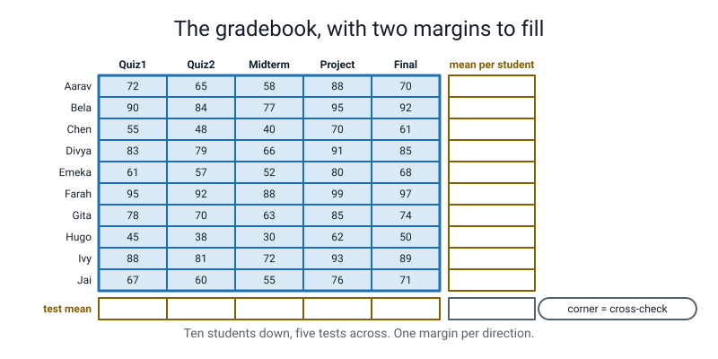
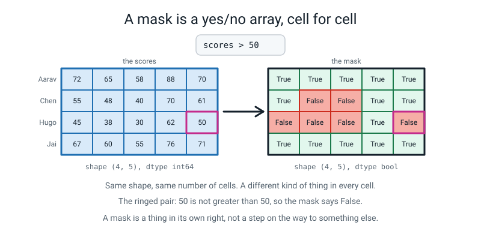
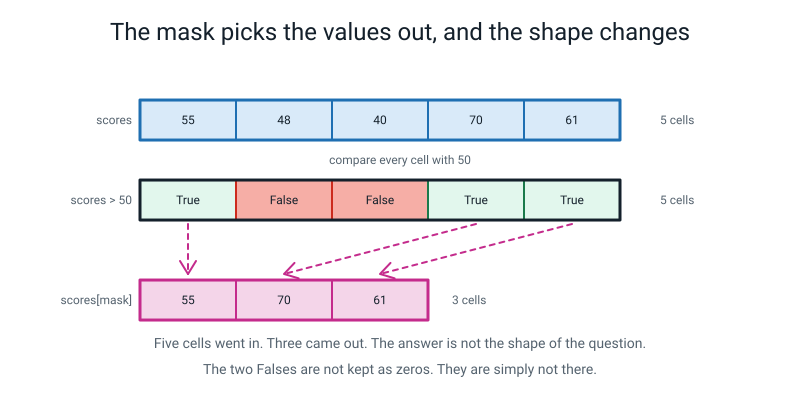
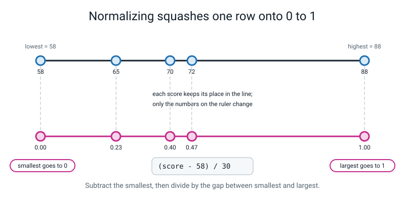
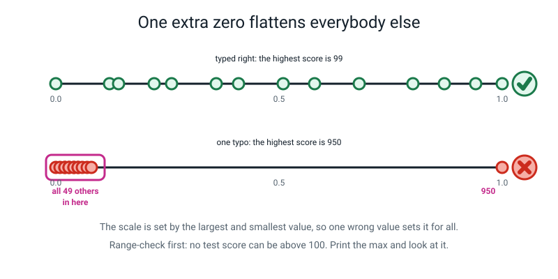
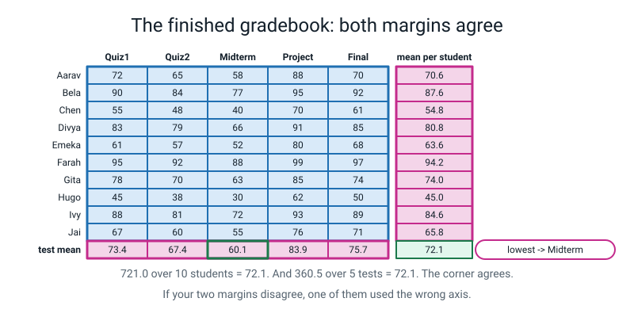
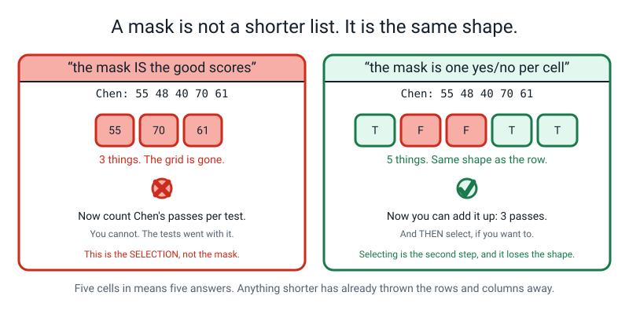
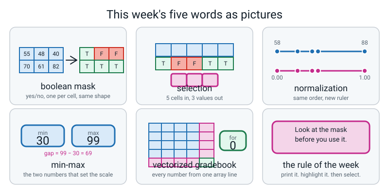

# Week 20 — The Vectorized Gradebook

[⬅ Week 19](week-19.md) · [Course Home](../README.md) · [Next ➡](week-21.md) · [Workbook](../workbook/week-20.md)

---

> ### This week in one sentence
> **A boolean mask is a yes/no array — the same shape as your data — that you look at first and use second.**
>
> **By the end of this chapter you will be able to:**
> - **Build a mask** from a comparison, and read it as an array of `True` and `False`
> - **Use a mask to select** only the values you want, and say why the answer is shorter than the question
> - **Find the biggest and smallest** value in a whole array, or along one axis of it
> - **Normalize a row to 0–1 by hand** and match it, digit for digit, to what the code says
> - **Build a complete gradebook** in which not one `for` loop does any arithmetic
>
> **New syntax:** `arr > 50` · `arr[mask]` · `arr.min()` / `arr.max()` · `np.round(arr, 2)`
>
> **Reading time:** about 35 minutes. **Homework:** about 60 minutes.

---

## 🪝 Start Here

You need a printed grid and a highlighter. A coloured pencil works. A pen does not — you need to still be able to read the numbers underneath, and in about a minute you will see why that matters.

Here is the grid. Ten students down the side, five tests across the top, scores out of a hundred.

```text
          Quiz1  Quiz2  Midterm  Project  Final
Aarav        72     65       58       88     70
Bela         90     84       77       95     92
Chen         55     48       40       70     61
Divya        83     79       66       91     85
Emeka        61     57       52       80     68
Farah        95     92       88       99     97
Gita         78     70       63       85     74
Hugo         45     38       30       62     50
Ivy          88     81       72       93     89
Jai          67     60       55       76     71
```

One instruction, and you can do it in about ninety seconds:

> **Highlight every score above 50.**

Don't add anything up. Don't work anything out. Just mark them.


*Figure 20.1 — Ten students down, five tests across, and one empty margin per direction. The corner is where the two checks meet.*

Done? Now stop looking at the scores and look at **the marks**. Just the yellow.

**How many cells are on that page?** Ten times five. **Fifty.**

**How many marks could there be, at most?** Fifty. Because every single cell either got a mark or didn't. Not one cell got skipped. Even Hugo's 30 got a decision — the decision was "no".

So here is the thing you have just made, and it is not what you might think:

> **You have not made a list of the good scores. You have made a whole second grid, the same size as the first one, made of yes and no.**

That thing has a name, and it is this week's idea:

> **boolean mask** — an array of `True` and `False`, the same shape as your data, made by comparing your data with something.

And you made one with a highlighter before you wrote a single line of Python.

**One last question, and be honest.** Look at Hugo's final score. It is exactly **50**. Did you highlight it?

Some people do. Some people don't. Some people hesitate and guess. Whichever you did, hold on to it — we come back to it in the very next section, and the answer is more interesting than "yes" or "no".

---

## 🧠 The Big Idea

> **📌 About the code in this section.** The blocks below are **illustrations, not files**. They show you the shape of one idea, and each one carries on from the one above it — the `import` lines and the data are typed once, in the first block that needs them. **The complete, runnable file is in 💻 Type This.** If you copy a block from this section on its own and Python says `NameError`, that is why, and nothing is broken.

### 1. A mask is a thing you can look at

**The plain explanation.** One line of Python makes what you just made with the highlighter.

```python
above_50 = scores > 50
```

Read it out loud: *"above_50 is scores greater than fifty."*

What is in `above_50`? `True` and `False`, one per cell. **Fifty of them.** Same shape as `scores` — ten rows, five columns. Not a shorter list. The same size as everything, made of yes and no.

**The analogy.** It is the highlighter marks and nothing else. The marks sit **on top of** your data without replacing it. That is why you needed a highlighter rather than a pen: the mask does not delete the scores, it decorates them. A pen would have made a mask *and* destroyed your data.

**A concrete example, with real values.** Here is the mask for the whole grid:

```python
above_50 = scores > 50
print(above_50)
print("mask shape:", above_50.shape, " dtype:", above_50.dtype)
```

```text
[[ True  True  True  True  True]
 [ True  True  True  True  True]
 [ True False False  True  True]
 [ True  True  True  True  True]
 [ True  True  True  True  True]
 [ True  True  True  True  True]
 [ True  True  True  True  True]
 [False False False  True False]
 [ True  True  True  True  True]
 [ True  True  True  True  True]]
mask shape: (10, 5)  dtype: bool
```

Hold your highlighted paper up next to that. **The `False`s are exactly where you did not put a mark.** Row 2 — Chen — has two. Row 7 — Hugo — has four.


*Figure 20.2 — Two grids, the same size. One holds scores; the other holds a decision about every single one of them.*

And read the dtype: **`bool`**. That is your third dtype, after `int64` and `float64`. A `bool` cell holds one of exactly two things and nothing else.

**Now Hugo's 50.** Go and look at the last cell of row 7 in that printout. It says **`False`**.

The score is exactly 50, and 50 is not *above* 50. If you highlighted it, the computer just disagreed with you — and the computer is right, because the question asked for *above*.

> **⚠️ Watch out:** `>` means **strictly** greater than. There are four of these and you have had all of them since Week 5.
>
> | Written | Means | `50` against `50` |
> |---|---|---|
> | `> 50` | strictly more than 50 | `False` |
> | `>= 50` | 50 or more | `True` |
> | `< 50` | strictly less than 50 | `False` |
> | `<= 50` | 50 or less | `True` |

Notice how easy that was to get wrong. One cell, out of fifty, in ninety seconds, with a highlighter in your hand. Now imagine the rule is *"sixty is a pass"* and you write `> 60` in your code. **Every student who scored exactly sixty has just failed**, and nobody will find out until somebody's parent phones the school.

That is why the pass mask later in this chapter is written `scores >= 60` and not `scores > 60`. One character. Somebody's grade.

### 2. `True` counts as 1, so adding up a mask counts things

**The plain explanation.** What do you get if you **add up** a grid of `True` and `False`?

Python treats `True` as **1** and `False` as **0**. It has done that since long before you were born. So adding up a mask **counts the yeses**.

```python
print("how many True:", above_50.sum())
```

```text
how many True: 44
```

Forty-four of the fifty scores are above 50.

**The analogy.** It is exactly what you do when you count marks on the page. You go along, saying "one, two, three" for the yellow ones and adding nothing for the white ones. `False` contributes nothing because nothing is what it means.

**And now last week walks straight back in.** `.sum()` takes an axis, and the rule has not changed:

> **The axis you name is the axis that gets eaten.**

```python
passed = scores >= 60                     # passing is 60 or more
print("passes per student:", passed.sum(axis=1))
print("passes per test   :", passed.sum(axis=0))
print("both ways add to  :", passed.sum(axis=1).sum(), passed.sum(axis=0).sum())
```

```text
passes per student: [4 5 2 5 3 5 5 1 5 4]
passes per test   : [ 8  7  5 10  9]
both ways add to  : 39 39
```

**Say the counts before you look.** Ten students down, so `axis=1` eats the five tests and gives **ten** numbers. Five tests across, so `axis=0` eats the ten students and gives **five**. Count them: ten, then five. Correct.

**And there is last week's corner check, free.** Those ten numbers and those five numbers are counting **the same 39 yeses**, sliced two different ways. So they must add to the same total:

```text
4 + 5 + 2 + 5 + 3 + 5 + 5 + 1 + 5 + 4  = 39
8 + 7 + 5 + 10 + 9                     = 39
```

Adding a table up in two directions cannot change how many things are in it. **If those two numbers ever disagree, one of your axes is wrong**, and you found out for free.

Five separate questions now collapse into one idea, and this is why the mask is worth looking at:

| What you want | What you write |
|---|---|
| the values that pass | `scores[mask]` |
| how many pass altogether | `mask.sum()` |
| how many pass per student | `mask.sum(axis=1)` |
| how many pass per test | `mask.sum(axis=0)` |
| the names of students who passed everything | `names[mask.sum(axis=1) == 5]` |

### 3. Using the mask, and the answer is not the shape of the question

**The plain explanation.** So that is the mask itself. What do you *do* with it? You put it in square brackets.

```python
print("the scores above 50:", scores[above_50])
print("how many           :", scores[above_50].shape)
```

Read `scores[above_50]` as **"the scores where the mask says yes."**

**Predict before you look.** Fifty cells go in, and forty-four say `True`. How many numbers come out, and what shape?

```text
the scores above 50: [72 65 58 88 70 90 84 77 95 92 55 70 61 83 79 66 91 85 61 57 52 80 68 95
 92 88 99 97 78 70 63 85 74 62 88 81 72 93 89 67 60 55 76 71]
how many           : (44,)
```

Forty-four, in **one long row**. The grid is gone.

**Why can't it still be a grid?** Look at Chen's row: three survivors. Look at Hugo's: one. A grid has to be a **rectangle**, and there is no rectangle that is three wide in one row and one wide in the next. So numpy does the only thing it can and hands them to you in a single line.


*Figure 20.3 — Five cells in, five cells of mask, three cells out. The answer is not the shape of the question.*

**The analogy.** The mask is a stencil. Hold the stencil over the grid and spray: what comes out is paint on paper, not a grid with holes in it. The holes are not part of the answer, because they were never sprayed.

**And a question that matters more than it looks.** The `False` cells — the scores that did not pass — **did they turn into zeros?**

No. They are **not there at all.** They are absent, not zeroed.

That distinction will save you one day. A zero score and a missing score are completely different things, and if you ever divide by "how many scores", you need to know whether you mean **fifty** or **forty-four**.

> **💡 Try this:** print the mask on its own line before you ever use it. Every time, for the next month. Two seconds, and it makes the difference between "I filtered some stuff" and "I know exactly which fifty decisions were made."

### 4. Biggest, smallest, and turning a number back into a name

**The plain explanation.** Two more verbs, and there is nothing new in the idea — it is last week's axis rule wearing different clothes.

```python
print("highest score anywhere:", scores.max())
print("lowest  score anywhere:", scores.min())
print("best on each test :", scores.max(axis=0))
print("worst on each test:", scores.min(axis=0))
```

```text
highest score anywhere: 99
lowest  score anywhere: 30
best on each test : [95 92 88 99 97]
worst on each test: [45 38 30 62 50]
```

One number when you name no axis. Five numbers when you name `axis=0`, because the ten students get eaten and the five tests survive.

> **⚠️ Watch out:** `.min()` and `.max()` need brackets. `.shape` does not. The rule, once, and then it is yours forever: **a verb takes brackets; a fact does not.** `.min()` is something the array *does*. `.shape` is something the array *is*.

**Now the pretty move of the week**, and it needs no new syntax at all. Which test was **hardest** — that is, which one has the lowest average?

```python
test_mean = scores.mean(axis=0)
print("lowest test mean:", test_mean.min())
print("hardest test    :", tests[test_mean == test_mean.min()])
```

```text
lowest test mean: 60.1
hardest test    : ['Midterm']
```

**Read that second line inside-out**, because every piece of it is something you already own:

1. `scores.mean(axis=0)` — the five test averages. `[73.4 67.4 60.1 83.9 75.7]`.
2. `test_mean.min()` — the smallest of those five. `60.1`. That is a **number**, and you wanted a **name**.
3. `test_mean == test_mean.min()` — a **mask** over the five averages: `[False False True False False]`.
4. `tests[...]` — that mask, used on the *names* array.

**A mask built from one array, used to pick out of a different one.** That is the move that turns a number back into a name, and you will use it constantly. It works because the mask is five long and `tests` is five long, so they line up, and the single `True` picks out the single name.

**The analogy.** You have two lists in your hand, in the same order — a column of averages and a column of test names. You put your finger on the smallest average, and then you slide your finger sideways. The mask is the sliding.

> **🧑‍🏫 If a student asks:** *"why is it `['Midterm']` with brackets and not just `Midterm`?"* Because a mask always hands back a **collection** — it has no idea you only had one `True`. If two tests tied for lowest average, you would get two names, and that is correct behaviour, not a bug. Code that quietly assumes there is exactly one answer is code that breaks the day there are two.

### 5. Normalizing to 0–1, and the one value that ruins it for everybody

**The plain explanation.** Last idea, and it is a piece of arithmetic.

> **normalization** — rescaling numbers so they all sit between 0 and 1.
>
> **min-max normalization** — the particular way of doing it that puts the smallest value at exactly 0 and the largest at exactly 1.

One formula, and it is the only formula this week:

```text
scaled = (value - smallest) / (largest - smallest)
```

**Why would anybody want this?** Because numbers being **bigger** is not the same as numbers **mattering more**. Suppose one column is test scores out of 100 and another is minutes of revision, which might run to 300. Compare them and the minutes will boss the whole comparison around purely by being bigger numbers. Squash both onto 0 to 1 and "big" means the same thing in both. **You will need this badly in Week 30**, where a model measures the distance between two students and a column of big numbers would decide everything on its own.

**A concrete example, worked all the way through.** Aarav's row: `72, 65, 58, 88, 70`.

Smallest is **58**. Largest is **88**. The gap between them is **30**.

| Score | Subtract 58 | Divide by 30 | Rounded |
|---|---|---|---|
| 72 | 14 | 14/30 = 0.4666… | **0.47** |
| 65 | 7 | 7/30 = 0.2333… | **0.23** |
| 58 | 0 | 0/30 = 0 | **0.00** |
| 88 | 30 | 30/30 = 1 | **1.00** |
| 70 | 12 | 12/30 = 0.4 | **0.40** |


*Figure 20.4 — Subtract the smallest, then divide by the gap. Two of the five answers you knew before you divided anything.*

**Two of those five answers you knew in advance**, and this is what a real check feels like:

- The **smallest** value must come out as exactly `0.0`. It is `(58 - 58) / 30`.
- The **largest** must come out as exactly `1.0`. It is `(88 - 58) / 30 = 30 / 30`.

So `scaled.min()` is always 0.0 and `scaled.max()` is always 1.0. If they are not, your formula is wrong.

**The analogy.** It is a photograph being resized. Every face stays in the same place relative to every other face; the whole picture just fits a different frame. **Nobody moves past anybody.** Normalizing changes the scale, not the order.

**And now the thing that makes this week worth having.** Somebody typing Farah's Quiz1 score of 95 leans on the zero key and types **950**.

```python
scores[5, 0] = 950
```

Nothing crashes. Here is what happens:

| Quantity | Correct | With the typo | Would you notice? |
|---|---|---|---|
| the biggest score | 99 | **950** | Yes, if you print it |
| Farah's mean | 94.2 | **265.2** | Probably — it is over 100 |
| Quiz1's mean | 73.4 | **158.9** | Probably |
| the class mean | 72.1 | **89.2** | **No.** 89.2 is a believable class average |
| Aarav's first scaled score | 0.61 | **0.05** | **No, and this is the disaster** |

Look at the last row. **Nobody touched Aarav.** His score is still 72. And his scaled value fell off a cliff.

```text
[[0.05 0.04 0.03 0.06 0.04]
 [0.07 0.06 0.05 0.07 0.07]
 [0.03 0.02 0.01 0.04 0.03]
 [0.06 0.05 0.04 0.07 0.06]
 [0.03 0.03 0.02 0.05 0.04]
 [1.   0.07 0.06 0.08 0.07]
 [0.05 0.04 0.04 0.06 0.05]
 [0.02 0.01 0.   0.03 0.02]
 [0.06 0.06 0.05 0.07 0.06]
 [0.04 0.03 0.03 0.05 0.04]]
```

**Why?** The gap between smallest and largest was 99 − 30 = **69**. Now it is 950 − 30 = **920**, more than thirteen times wider. Every real score — all of them between 30 and 99 — gets divided by 920 and lands in the bottom twelfth of the ruler.


*Figure 20.5 — The scale is set by the biggest and smallest value, so one wrong value sets it for everybody.*

**Now look at what is still correct about that grid**, because this is the point.

It is a perfectly tidy grid of fifty two-decimal numbers. Every value is between 0 and 1, exactly as promised. Bela is still ahead of Chen. The smallest is still exactly 0.0 and the largest is still exactly 1.0.

**Both of the checks we built passed. And the answer is ruined.**

> That is the sentence to keep: **a check that cannot fail is not a check.** `scaled.min() == 0.0` is something the formula *guarantees* — it can never disagree with the formula, however wrong the data is.

What has died is the **spread**. Every genuine difference between these ten students has been squashed into a range of about 0.07. Hand that to a model and it would conclude all ten students are basically identical, apart from one weird one.

**So what would have caught it?** Not a clever check. Something you already know about test scores.

```python
print("anything above 100?", scores[scores > 100])
print("how many          ?", scores[scores > 100].shape)
```

```text
anything above 100? [950]
how many          ? (1,)
```

One line, one mask, and it hands you the culprit.

> **A range check is you writing down what you already know.** You know a test score cannot be over 100. You know a step count cannot be negative. You know nobody is 900 years old. **The computer knows none of that and it never will, unless you put it in the file.** One line, at the top, once.

And after you fix the typo:

```text
anything above 100? []
```

Empty brackets. Nothing above 100. **An empty answer is a passed check**, and you should get used to being pleased to see one.

---

## 💻 Type This

One file, `gradebook.py`, built up in eight steps. Put it in your `level2` folder next to `rainfall.py`.

**The rule for this file: no `for` loop does any arithmetic.** Ideally there is no `for` in it at all.

### Step 1 — the data, and a check on the labels

```python
"""gradebook.py - a whole gradebook with no for loop doing any arithmetic."""

import numpy as np                        # bring numpy in, call it np

names = np.array(["Aarav", "Bela", "Chen", "Divya", "Emeka",
                  "Farah", "Gita", "Hugo", "Ivy", "Jai"])
tests = np.array(["Quiz1", "Quiz2", "Midterm", "Project", "Final"])

scores = np.array([
    [72, 65, 58, 88, 70],     # Aarav
    [90, 84, 77, 95, 92],     # Bela
    [55, 48, 40, 70, 61],     # Chen
    [83, 79, 66, 91, 85],     # Divya
    [61, 57, 52, 80, 68],     # Emeka
    [95, 92, 88, 99, 97],     # Farah
    [78, 70, 63, 85, 74],     # Gita
    [45, 38, 30, 62, 50],     # Hugo
    [88, 81, 72, 93, 89],     # Ivy
    [67, 60, 55, 76, 71],     # Jai
])

print("scores :", scores.shape, scores.dtype)
print("names  :", names.shape, "  tests:", tests.shape)
```

```text
scores : (10, 5) int64
names  : (10,)   tests: (5,)
```

**What the new lines do.** One row per student, with a comment naming them. Same rule as always: **the shape of the code is the shape of the data.**

Those two print lines are not decoration, they are a **check**. Ten in the first slot of the scores shape, ten names. Five in the second slot, five tests. If you fat-finger a row and type six scores instead of five, this is where you find out — on line 22, not on line 90 with a wrong answer in your hand.

### Step 2 — the mask, and looking at it

```python
above_50 = scores > 50                    # one True or False per cell
print()
print(above_50)
print("mask shape:", above_50.shape, " dtype:", above_50.dtype)
```

**Predict before you run it.** What shape? What dtype?

```text

[[ True  True  True  True  True]
 [ True  True  True  True  True]
 [ True False False  True  True]
 [ True  True  True  True  True]
 [ True  True  True  True  True]
 [ True  True  True  True  True]
 [ True  True  True  True  True]
 [False False False  True False]
 [ True  True  True  True  True]
 [ True  True  True  True  True]]
mask shape: (10, 5)  dtype: bool
```

**What the new line does.** `scores > 50` compares **every cell at once** — that is Week 18's array maths, with a comparison instead of a `*`. Fifty comparisons, one line, no loop.

Hold your highlighted paper up beside the screen. Row 7's last cell is `False`, because Hugo's 50 is not above 50.

### Step 3 — using it, and the shape change

```python
print()
print("the scores above 50:", scores[above_50])
print("how many           :", scores[above_50].shape)
print("how many True      :", above_50.sum())
```

**Predict before you run it.** How many numbers come out?

```text

the scores above 50: [72 65 58 88 70 90 84 77 95 92 55 70 61 83 79 66 91 85 61 57 52 80 68 95
 92 88 99 97 78 70 63 85 74 62 88 81 72 93 89 67 60 55 76 71]
how many           : (44,)
how many True      : 44
```

Forty-four in one long row. Fifty went in. **The grid is gone**, because three survivors in Chen's row and one in Hugo's is not a rectangle.

And notice the last line: `above_50.sum()` is also 44. **Two different routes to the same number, and they agree.** That is exactly the kind of thing you want sitting in a file.

### Step 4 — one loud mistake, on purpose

Now the useful question: **which students passed everything?** Passing is 60 or more. So first a pass mask, and then — you want the names.

```python
passed = scores >= 60                     # passing is 60 or more
print()
print("passed everything :", names[passed])
```

**Predict before you run it.** Will that work?

```text
Traceback (most recent call last):
  File "gradebook.py", line 30, in <module>
    print("passed everything :", names[passed])
IndexError: too many indices for array: array is 1-dimensional, but 2 were indexed
```

Read the last line and put it in your own words. *"`names` has one direction, and I gave it a two-directional thing."*

`names` is a **row** — ten names, one direction. `passed` is a **grid** — ten by five, two directions. numpy is saying: *you have handed me a two-directional mask to index a one-directional list, and those do not line up.*

Which makes sense if you count. `passed` holds **fifty** answers. There are **ten** names. Fifty into ten does not go.

**So how do you get from fifty answers down to ten, one per student?** That is last week. Add them up along the row — `axis=1` — and a student who passed everything is one whose count is **five**.

```python
print("passes per student:", passed.sum(axis=1))
print("passes per test   :", passed.sum(axis=0))
print("both ways add to  :", passed.sum(axis=1).sum(), passed.sum(axis=0).sum())
print("passed everything :", names[passed.sum(axis=1) == 5])
```

```text
passes per student: [4 5 2 5 3 5 5 1 5 4]
passes per test   : [ 8  7  5 10  9]
both ways add to  : 39 39
passed everything : ['Bela' 'Divya' 'Farah' 'Gita' 'Ivy']
```

Five names, and both counts come to 39, so neither axis is wrong.

**Now something worth thirty seconds.** Change that last line's `axis=1` to `axis=0` and run it:

```text
IndexError: boolean index did not match indexed array along dimension 0; dimension is 10 but corresponding boolean dimension is 5
```

*"Dimension is 10 but the boolean dimension is 5."* There are ten names and your mask is five long. **numpy caught your wrong axis for you.**

Last week the wrong axis was **silent**, because it just printed some numbers. This week it is **loud**, because you tried to use it on the names — and the names knew how many they were.

> **Labels catch mistakes.** Hold on to that sentence. It is most of what next week is about.

Put `axis=1` back.

### Step 5 — biggest, smallest, and the name of the hardest test

```python
print()
print("highest score anywhere:", scores.max())
print("lowest  score anywhere:", scores.min())
print("best on each test :", scores.max(axis=0))
print("worst on each test:", scores.min(axis=0))
print("lowest test mean  :", scores.mean(axis=0).min())
print("hardest test      :", tests[scores.mean(axis=0) == scores.mean(axis=0).min()])
```

**Predict before you run it.** How many numbers from `scores.max(axis=0)`?

```text

highest score anywhere: 99
lowest  score anywhere: 30
best on each test : [95 92 88 99 97]
worst on each test: [45 38 30 62 50]
lowest test mean  : 60.1
hardest test      : ['Midterm']
```

**What the new lines do.** `.max()` and `.min()` with no axis look at the whole grid. With `axis=0` they eat the ten students and leave five answers, one per test.

The last line is the good one, and §4 above is how to read it: five averages, then the smallest of them, then a mask with one `True` in it, then that mask used on the names. **Midterm.** By name, not by number, and you never counted along the array with your finger.

### Step 6 — normalize the whole grid

**Pencil first.** Do Aarav's row on paper before you type this: smallest 58, largest 88, gap 30, five divisions. You already know two of the five answers.

```python
row = scores[0, :]                        # Aarav's row
print()
print("Aarav's row      :", row)
print("its low and high :", row.min(), row.max())
print("scaled by ITS own low and high:",
      np.round((row - row.min()) / (row.max() - row.min()), 2))
```

```text

Aarav's row      : [72 65 58 88 70]
its low and high : 58 88
scaled by ITS own low and high: [0.47 0.23 0.   1.   0.4 ]
```

Five for five against your pencil. And there are the two you knew: a `0.` where the 58 was, a `1.` where the 88 was.

Now the whole grid, which uses **one pair of numbers for everything** rather than one pair per row:

```python
low = scores.min()
high = scores.max()
scaled = (scores - low) / (high - low)
print()
print("low:", low, " high:", high, " gap:", high - low)
print(np.round(scaled, 2))
print("scaled min:", scaled.min(), " scaled max:", scaled.max())
```

```text

low: 30  high: 99  gap: 69
[[0.61 0.51 0.41 0.84 0.58]
 [0.87 0.78 0.68 0.94 0.9 ]
 [0.36 0.26 0.14 0.58 0.45]
 [0.77 0.71 0.52 0.88 0.8 ]
 [0.45 0.39 0.32 0.72 0.55]
 [0.94 0.9  0.84 1.   0.97]
 [0.7  0.58 0.48 0.8  0.64]
 [0.22 0.12 0.   0.46 0.29]
 [0.84 0.74 0.61 0.91 0.86]
 [0.54 0.43 0.36 0.67 0.59]]
scaled min: 0.0  scaled max: 1.0
```

**Aarav's first score is 0.61 here, and it was 0.47 a moment ago.** Same score, two different scaled values. Is one of them wrong?

**No. They answer different questions.** `0.47` used Aarav's *own* low and high, so it says *"a bit under halfway between his worst and his best."* `0.61` uses the whole class's 30 and 99, so it says *"about three-fifths of the way up the class's scale."* Same score, two rulers. **The formula is not the decision — choosing what "smallest" and "largest" mean is the decision, and no amount of code will make it for you.**

Also: the `0.` in that grid is **Hugo's Midterm** and the `1.` is **Farah's Project**. Find both on the paper. It makes "the smallest goes to zero" concrete.

> **⚠️ Watch out:** leave the `2` out of `np.round` and you get whole numbers, which for a 0-to-1 grid destroys everything: `[[1. 1. 0. 1. 1.] [1. 1. 1. 1. 1.] ...]`. And **round for printing, not for storing.** Keep the full-precision array; put the rounding inside the `print`. Round, then do more arithmetic, and the small errors pile up for no reason.

### Step 7 — the 950

One character. Put this in just above the `low = scores.min()` line.

```python
scores[5, 0] = 950                        # Farah's Quiz1: 95 typed as 950
```

**Predict before you run it.** What breaks?

```text
highest score anywhere: 950
low: 30  high: 950  gap: 920
[[0.05 0.04 0.03 0.06 0.04]
 [0.07 0.06 0.05 0.07 0.07]
 [0.03 0.02 0.01 0.04 0.03]
 [0.06 0.05 0.04 0.07 0.06]
 [0.03 0.03 0.02 0.05 0.04]
 [1.   0.07 0.06 0.08 0.07]
 [0.05 0.04 0.04 0.06 0.05]
 [0.02 0.01 0.   0.03 0.02]
 [0.06 0.06 0.05 0.07 0.06]
 [0.04 0.03 0.03 0.05 0.04]]
scaled min: 0.0  scaled max: 1.0
```

Everything is tiny. Aarav went from 0.61 to 0.05 and **nobody touched Aarav.** §5 above is why: the gap went from 69 to 920.

And read the last line. `scaled min: 0.0  scaled max: 1.0`. **Both checks passed.**

### Step 8 — the range check, and put it at the top

```python
print()
print("--- the range check ---")
print("anything above 100?", scores[scores > 100])
print("below zero?       ", scores[scores < 0])
```

```text

--- the range check ---
anything above 100? [950]
below zero?        []
```

Now change the `950` back to `95` and move both of those lines to **the top of the file**, above everything else. Then run it again:

```text
above 100? []  below 0? []
```

Two empty answers. Two passed checks. **This is the only check on the page that could actually have failed**, because it is the only one carrying knowledge that is not already in the formula.

### The complete finished program

```python
"""gradebook.py - the Vectorized Gradebook. Zero for loops anywhere in this file."""

import numpy as np

names = np.array(["Aarav", "Bela", "Chen", "Divya", "Emeka",
                  "Farah", "Gita", "Hugo", "Ivy", "Jai"])
tests = np.array(["Quiz1", "Quiz2", "Midterm", "Project", "Final"])

scores = np.array([
    [72, 65, 58, 88, 70],     # Aarav
    [90, 84, 77, 95, 92],     # Bela
    [55, 48, 40, 70, 61],     # Chen
    [83, 79, 66, 91, 85],     # Divya
    [61, 57, 52, 80, 68],     # Emeka
    [95, 92, 88, 99, 97],     # Farah
    [78, 70, 63, 85, 74],     # Gita
    [45, 38, 30, 62, 50],     # Hugo
    [88, 81, 72, 93, 89],     # Ivy
    [67, 60, 55, 76, 71],     # Jai
])

# --- 0. the range check, FIRST. What do I already know? -------------------
print("above 100?", scores[scores > 100], " below 0?", scores[scores < 0])

# --- 1. do the labels match the grid? -------------------------------------
print("scores :", scores.shape, scores.dtype)
print("names  :", names.shape, "  tests:", tests.shape)

# --- 2. one mean per student: eat the columns, axis=1 ---------------------
student_mean = scores.mean(axis=1)
print()
print("names        :", names)
print("student means:", student_mean)
print("count        :", student_mean.shape, "- one per student")

# --- 3. one mean per test: eat the rows, axis=0 ---------------------------
test_mean = scores.mean(axis=0)
print()
print("tests     :", tests)
print("test means:", test_mean)
print("count     :", test_mean.shape, "- one per test")

# --- 4. biggest and smallest, anywhere ------------------------------------
print()
print("highest score:", scores.max())
print("lowest  score:", scores.min())
print("best  on each test:", scores.max(axis=0))
print("worst on each test:", scores.min(axis=0))

# --- 5. the hardest test = the lowest test mean, looked up by mask --------
print()
print("lowest test mean:", test_mean.min())
print("hardest test    :", tests[test_mean == test_mean.min()])
print("easiest test    :", tests[test_mean == test_mean.max()])

# --- 6. the pass mask. Passing is 60 or more -----------------------------
passed = scores >= 60
print()
print("mask shape:", passed.shape, " dtype:", passed.dtype)
print(passed)
print("passes per student:", passed.sum(axis=1))
print("passes per test   :", passed.sum(axis=0))
print("passes, both ways :", passed.sum(axis=1).sum(), passed.sum(axis=0).sum())
print("passed everything :", names[passed.sum(axis=1) == 5])
print("passed nothing    :", names[passed.sum(axis=1) == 0])

# --- 7. use the mask to pull the passing scores out ----------------------
print()
print("the passing scores:", scores[passed])
print("how many          :", scores[passed].shape)
print("their mean        :", np.round(scores[passed].mean(), 2))
print("everybody's mean  :", np.round(scores.mean(), 2))

# --- 8. squash the whole grid onto 0 to 1 -------------------------------
low = scores.min()
high = scores.max()
scaled = (scores - low) / (high - low)
print()
print("low:", low, " high:", high, " gap:", high - low)
print(np.round(scaled, 2))
print("scaled min:", scaled.min(), " scaled max:", scaled.max())

# --- 9. hand-check, Aarav's row -----------------------------------------
# By pencil: Aarav's five scores are 72 65 58 88 70.
#   lowest 58, highest 88, so the gap is 30.
#   (72-58)/30 = 14/30 = 0.4666..  -> 0.47
#   (65-58)/30 =  7/30 = 0.2333..  -> 0.23
#   (58-58)/30 =  0/30 = 0.0
#   (88-58)/30 = 30/30 = 1.0
#   (70-58)/30 = 12/30 = 0.4
row = scores[0, :]
print()
print("Aarav's row      :", row)
print("its low and high :", row.min(), row.max())
print("scaled by ITS own low and high:",
      np.round((row - row.min()) / (row.max() - row.min()), 2))
```

Real output:

```text
above 100? []  below 0? []
scores : (10, 5) int64
names  : (10,)   tests: (5,)

names        : ['Aarav' 'Bela' 'Chen' 'Divya' 'Emeka' 'Farah' 'Gita' 'Hugo' 'Ivy' 'Jai']
student means: [70.6 87.6 54.8 80.8 63.6 94.2 74.  45.  84.6 65.8]
count        : (10,) - one per student

tests     : ['Quiz1' 'Quiz2' 'Midterm' 'Project' 'Final']
test means: [73.4 67.4 60.1 83.9 75.7]
count     : (5,) - one per test

highest score: 99
lowest  score: 30
best  on each test: [95 92 88 99 97]
worst on each test: [45 38 30 62 50]

lowest test mean: 60.1
hardest test    : ['Midterm']
easiest test    : ['Project']

mask shape: (10, 5)  dtype: bool
[[ True  True False  True  True]
 [ True  True  True  True  True]
 [False False False  True  True]
 [ True  True  True  True  True]
 [ True False False  True  True]
 [ True  True  True  True  True]
 [ True  True  True  True  True]
 [False False False  True False]
 [ True  True  True  True  True]
 [ True  True False  True  True]]
passes per student: [4 5 2 5 3 5 5 1 5 4]
passes per test   : [ 8  7  5 10  9]
passes, both ways : 39 39
passed everything : ['Bela' 'Divya' 'Farah' 'Gita' 'Ivy']
passed nothing    : []

the passing scores: [72 65 88 70 90 84 77 95 92 70 61 83 79 66 91 85 61 80 68 95 92 88 99 97
 78 70 63 85 74 62 88 81 72 93 89 67 60 76 71]
how many          : (39,)
their mean        : 78.9
everybody's mean  : 72.1

low: 30  high: 99  gap: 69
[[0.61 0.51 0.41 0.84 0.58]
 [0.87 0.78 0.68 0.94 0.9 ]
 [0.36 0.26 0.14 0.58 0.45]
 [0.77 0.71 0.52 0.88 0.8 ]
 [0.45 0.39 0.32 0.72 0.55]
 [0.94 0.9  0.84 1.   0.97]
 [0.7  0.58 0.48 0.8  0.64]
 [0.22 0.12 0.   0.46 0.29]
 [0.84 0.74 0.61 0.91 0.86]
 [0.54 0.43 0.36 0.67 0.59]]
scaled min: 0.0  scaled max: 1.0

Aarav's row      : [72 65 58 88 70]
its low and high : 58 88
scaled by ITS own low and high: [0.47 0.23 0.   1.   0.4 ]
```

**Search that file for the word `for`.** There isn't one. Every number in the report came out of an array operation, and the labels got printed as whole arrays alongside the numbers.

> **🤔 Think about it:** the mean of just the passing scores is **78.9** and everybody's mean is **72.1**. Why is the first one higher? Because the failing scores were thrown away, and they were the low ones. **That is not a discovery, it is arithmetic** — and it is exactly how a misleading statistic gets made. *"Our students average 78.9"* is completely true and completely dishonest if you deleted everyone under 60 first.

---

## 🔍 Worked Examples

Three complete programs, in three different worlds. Type each one, **predict the counts before you run it**, then check.

### Worked Example 1 — Four juices, five days (food)

```python
"""juice20.py - four juices down, five days across."""

import numpy as np                                  # the array library

#                    Mon  Tue  Wed  Thu  Fri
cups = np.array([
    [ 22,  30,  18,  41,  55],                      # row 0 - Mango
    [ 14,  12,   9,  20,  26],                      # row 1 - Lime
    [ 48,  52,  40,  61,  77],                      # row 2 - Sugarcane
    [  8,  11,   6,  15,  19],                      # row 3 - Beetroot
])
juices = np.array(["Mango", "Lime", "Sugarcane", "Beetroot"])
days = np.array(["Mon", "Tue", "Wed", "Thu", "Fri"])

print("shape :", cups.shape, cups.dtype)
print("juices:", len(juices), " days:", len(days))

busy = cups > 30                                    # a mask: one True/False per cell
print()
print(busy)
print("mask shape:", busy.shape, " dtype:", busy.dtype)

print()
print("the busy cells   :", cups[busy])
print("how many         :", cups[busy].shape)
print("how many True    :", busy.sum())
print("busy days per juice:", busy.sum(axis=1), "- want 4")
print("busy juices per day:", busy.sum(axis=0), "- want 5")
print("both ways add to :", busy.sum(axis=1).sum(), busy.sum(axis=0).sum())

print()
print("best day ever    :", cups.max())
print("worst day ever   :", cups.min())
print("best per juice   :", cups.max(axis=1))
print("quietest day     :", days[cups.sum(axis=0) == cups.sum(axis=0).min()])

low = cups.min()
high = cups.max()
print()
print("low:", low, " high:", high, " gap:", high - low)
print(np.round((cups - low) / (high - low), 2))
```

Real output:

```text
shape : (4, 5) int64
juices: 4  days: 5

[[False False False  True  True]
 [False False False False False]
 [ True  True  True  True  True]
 [False False False False False]]
mask shape: (4, 5)  dtype: bool

the busy cells   : [41 55 48 52 40 61 77]
how many         : (7,)
how many True    : 7
busy days per juice: [2 0 5 0] - want 4
busy juices per day: [1 1 1 2 2] - want 5
both ways add to : 7 7

best day ever    : 77
worst day ever   : 6
best per juice   : [55 26 77 19]
quietest day     : ['Wed']

low: 6  high: 77  gap: 71
[[0.23 0.34 0.17 0.49 0.69]
 [0.11 0.08 0.04 0.2  0.28]
 [0.59 0.65 0.48 0.77 1.  ]
 [0.03 0.07 0.   0.13 0.18]]
```

**Two rows of the mask are entirely `False`.** Lime and Beetroot never sold more than 30 cups on any day, so their counts are `0`. **A zero in a mask count is a real answer, not an error** — and notice the counts still add correctly, `2 + 0 + 5 + 0 = 7` and `1 + 1 + 1 + 2 + 2 = 7`.

**Hand-check the corner.** Seven busy cells. Count the `True`s in the printed mask with your finger: two in row 0, five in row 2, none anywhere else. Seven. ✔

**And notice the normalized grid's `0.` is at Beetroot on Wednesday** — six cups, the smallest number in the whole table. The `1.` is Sugarcane on Friday. The smallest and largest always land on exactly 0 and 1, whichever cells they happen to be.

### Worked Example 2 — Four swimmers, five races (sport)

This one flips something important: **smaller is better.**

```python
"""swim20.py - four swimmers down, five races across. Times in seconds."""

import numpy as np

#                    R1    R2    R3    R4    R5
times = np.array([
    [ 31.2, 30.8, 29.9, 30.1, 29.4],                # row 0 - Anya
    [ 34.0, 33.1, 33.6, 32.8, 29.8],                # row 1 - Bo
    [ 28.7, 28.9, 28.1, 27.6, 27.8],                # row 2 - Cyrus
    [ 35.5, 34.8, 36.0, 34.2, 33.9],                # row 3 - Dara
])
swimmers = np.array(["Anya", "Bo", "Cyrus", "Dara"])

print("shape :", times.shape, times.dtype)

fast = times < 30.0                                 # UNDER thirty seconds is fast
print()
print(fast)
print("fast swims per swimmer:", fast.sum(axis=1), "- want 4")
print("fast swims per race   :", fast.sum(axis=0), "- want 5")
print("both ways add to      :", fast.sum(axis=1).sum(), fast.sum(axis=0).sum())

print()
print("the fast times :", times[fast])
print("how many       :", times[fast].shape)

print()
print("fastest time anywhere :", times.min())
print("slowest time anywhere :", times.max())
print("each swimmer's best   :", times.min(axis=1))
print("the fastest swimmer   :", swimmers[times.mean(axis=1) == times.mean(axis=1).min()])

low = times.min()
high = times.max()
print()
print("low:", low, " high:", high, " gap:", np.round(high - low, 2))
print(np.round((times - low) / (high - low), 2))
```

Real output:

```text
shape : (4, 5) float64

[[False False  True False  True]
 [False False False False  True]
 [ True  True  True  True  True]
 [False False False False False]]
fast swims per swimmer: [2 1 5 0] - want 4
fast swims per race   : [1 1 2 1 3] - want 5
both ways add to      : 8 8

the fast times : [29.9 29.4 29.8 28.7 28.9 28.1 27.6 27.8]
how many       : (8,)

fastest time anywhere : 27.6
slowest time anywhere : 36.0
each swimmer's best   : [29.4 29.8 27.6 33.9]
the fastest swimmer   : ['Cyrus']

low: 27.6  high: 36.0  gap: 8.4
[[0.43 0.38 0.27 0.3  0.21]
 [0.76 0.65 0.71 0.62 0.26]
 [0.13 0.15 0.06 0.   0.02]
 [0.94 0.86 1.   0.79 0.75]]
```

**Every verb reverses meaning here and the code does not change at all.** `times.min()` is the **best** result in the table, not the worst. `times.min(axis=1)` is each swimmer's **personal best**. And the fastest swimmer is the one with the **lowest** mean, so it is `.min()` inside the mask, not `.max()`.

**The array has no idea that low is good.** It never will. That knowledge lives in your head and in your comments, and if you write `.max()` here you will confidently crown Dara the fastest swimmer in the club.

**Also notice `0.` and `1.` in the normalized grid.** The `0.` is Cyrus's best swim — the *fastest* time in the table — and the `1.` is Dara's worst. So on this scale, **0 is good and 1 is bad.** Normalizing does not know which end you want either.

### Worked Example 3 — Five readers, four weeks (school)

This one is all about the boundary — `>` against `>=`.

```python
"""reading20.py - five readers down, four weeks across. Minutes read."""

import numpy as np

#                     W1   W2   W3   W4
minutes = np.array([
    [ 120,  95, 150, 110],                          # row 0 - Fatima
    [  60,  60,  45,  75],                          # row 1 - Georgi
    [ 200, 180, 210, 190],                          # row 2 - Hana
    [  30,  55,  50,  20],                          # row 3 - Ines
    [  90, 105,  60, 130],                          # row 4 - Jonas
])
readers = np.array(["Fatima", "Georgi", "Hana", "Ines", "Jonas"])
weeks = np.array(["W1", "W2", "W3", "W4"])

print("shape  :", minutes.shape)
print("readers:", len(readers), " weeks:", len(weeks))

# --- the boundary: the target is "60 minutes a week" ---------------------
above = minutes > 60                                # MORE than 60
at_least = minutes >= 60                            # 60 OR MORE
print()
print("more than 60 :", above.sum(), "cells")
print("60 or more   :", at_least.sum(), "cells")
print("the gap      :", at_least.sum() - above.sum(), "cells hold exactly 60")
print("the 60s      :", minutes[minutes == 60])

print()
print("weeks on target per reader:", at_least.sum(axis=1), "- want 5")
print("readers on target per week:", at_least.sum(axis=0), "- want 4")
print("both ways add to          :", at_least.sum(axis=1).sum(), at_least.sum(axis=0).sum())
print("on target every week      :", readers[at_least.sum(axis=1) == 4])
print("on target no weeks        :", readers[at_least.sum(axis=1) == 0])

print()
print("most minutes in one week :", minutes.max())
print("fewest minutes in one week:", minutes.min())
print("quietest week            :", weeks[minutes.sum(axis=0) == minutes.sum(axis=0).min()])
```

Real output:

```text
shape  : (5, 4)
readers: 5  weeks: 4

more than 60 : 12 cells
60 or more   : 15 cells
the gap      : 3 cells hold exactly 60
the 60s      : [60 60 60]

weeks on target per reader: [4 3 4 0 4] - want 5
readers on target per week: [4 4 3 4] - want 4
both ways add to          : 15 15
on target every week      : ['Fatima' 'Hana' 'Jonas']
on target no weeks        : ['Ines']

most minutes in one week : 210
fewest minutes in one week: 20
quietest week            : ['W2']
```

**Twelve against fifteen.** Three cells hold exactly 60, and one character decides whether those three count. If the school's rule is *"read for sixty minutes a week"*, then `> 60` marks **Georgi as failing two weeks he actually did exactly right.**

Georgi's row is `60, 60, 45, 75`. With `>=` he is on target three weeks out of four. With `>` he is on target once. **Same data, same code, one character, and a different letter goes home to his parents.**

> **💡 Try this:** change `at_least` to `above` in the two count lines and run it again. The counts become `[4 1 4 0 4]` and `[3 3 3 3]`, and they still add up correctly — `13` and `13`. **The corner check cannot save you here**, because the code is not wrong. It is answering a different question, correctly.

---

## 🐞 When It Breaks

Every message below came from really running a broken version of this week's code. Your line numbers will differ. The last line will not.

### Break 1 — a grid-shaped mask on a row-shaped list

```python
print("passed everything :", names[passed])
```

```text
Traceback (most recent call last):
  File "gradebook.py", line 8, in <module>
    print("passed everything :", names[passed])
IndexError: too many indices for array: array is 1-dimensional, but 2 were indexed
```

**What Python is telling you.** *"`names` has one direction. You handed me something with two."*

`passed` is ten by five — **fifty** answers. `names` is ten long. Fifty into ten does not go.

**The fix.** Collapse the mask with an axis first, so there is one answer per student: `names[passed.sum(axis=1) == 5]`.

> **🐞 If you see this error:** count the shapes out loud before you read anything else. `print(names.shape, passed.shape)` gives you `(10,) (10, 5)` and the whole problem is right there in two tuples.

### Break 2 — `and` never works on arrays

```python
print(scores[scores > 50 and scores < 90])
```

```text
Traceback (most recent call last):
  File "brk3.py", line 8, in <module>
    print(scores[scores > 50 and scores < 90])
ValueError: The truth value of an array with more than one element is ambiguous. Use a.any() or a.all()
```

**What Python is telling you.** *"You asked me for one yes-or-no and I have got fifty."*

`and` is a word that joins **two single** true-or-false answers. `scores > 50` is not one answer, it is fifty. Python cannot decide whether "fifty answers" counts as true, so it refuses rather than guessing — which is the right call.

**The fix, for now.** Use one condition. If you genuinely need two, do it in two steps with two named masks and use them one at a time. There **is** a proper way to combine masks, and it is not `and`, and you have not met it yet. Feeling that gap now is useful; it makes the syntax stop seeming arbitrary when it arrives.

### Break 3 — a verb without its brackets

```python
print("lowest:", scores.min)
```

```text
lowest: <built-in method min of numpy.ndarray object at 0x101a0d8f0>
```

**There is no error.** That is the problem. Python printed the *thing that does the minimum*, rather than doing it.

**What Python is telling you.** *"You pointed at the tool instead of using it."* `scores.min` is the verb. `scores.min()` is the verb happening.

**The fix.** `scores.min()`. And here is the rule that settles it permanently:

> **A verb takes brackets. A fact does not.** `.min()`, `.max()`, `.sum()`, `.mean()` are things the array **does** — brackets. `.shape` and `.dtype` are things the array **is** — no brackets.

Get it the other way round and you get the matching mistake: `scores.shape()` gives `TypeError: 'tuple' object is not callable`.

### Break 4 — the one with no message at all

```python
scores[5, 0] = 950
low = scores.min()
high = scores.max()
print(np.round((scores - low) / (high - low), 2))
```

```text
[[0.05 0.04 0.03 0.06 0.04]
 [0.07 0.06 0.05 0.07 0.07]
 [0.03 0.02 0.01 0.04 0.03]
 ...
```

**There is no error, and the checks passed.** `scaled.min()` is exactly 0.0. `scaled.max()` is exactly 1.0. Every one of the fifty values is legally between 0 and 1, to two decimal places, in a beautifully aligned grid.

**What to do when there is no message.** One question, and it is not about the code:

> **"What do I already know about these numbers that the computer does not?"**

A test score cannot be over 100. One line:

```python
print("anything above 100?", scores[scores > 100])
```

```text
anything above 100? [950]
```

**The code was right. The data was wrong.** Telling those two apart is most of what data work is.

### The whole clinic, for reference

| What you see | What it means | The fix |
|---|---|---|
| `IndexError: too many indices for array: array is 1-dimensional, but 2 were indexed` | "You used a two-directional mask on a one-directional list." | Collapse the mask along an axis first: `names[passed.sum(axis=1) == 5]` |
| `IndexError: boolean index did not match indexed array along dimension 0; dimension is 10 but corresponding boolean dimension is 5` | "Right number of directions, wrong length." | The wrong axis. `axis=1` gives ten; `axis=0` gives five. **The labels caught it** |
| `ValueError: The truth value of an array with more than one element is ambiguous. Use a.any() or a.all()` | "You asked for one yes-or-no and I have fifty." | `and` never works on arrays. One condition, or two named masks used separately |
| `numpy.core._exceptions._UFuncNoLoopError: ufunc 'greater' did not contain a loop with signature matching types ...` | "You compared numbers with writing." | `scores > 50`, not `scores > "50"`. No quotes; it is a number |
| ``IndexError: only integers, slices (`:`), ellipsis (`...`), numpy.newaxis (`None`) and integer or boolean arrays are valid indices`` | "That is not a position and it is not a mask." | `tests[test_mean == test_mean.min()]`, not `tests[test_mean.min()]`. `60.1` is a value, not a slot |
| `numpy.exceptions.AxisError: axis 1 is out of bounds for array of dimension 1` | "There is no second direction left." | `scores[mask]` is already one long row — the grid went when you used the mask. `scores[mask].mean()`, no axis |
| `TypeError: 'str' object cannot be interpreted as an integer` | "The number of decimal places has to be a number." | `np.round(arr, 2)`, not `np.round(arr, "2")` |
| `RuntimeWarning: invalid value encountered in divide` then `[nan nan nan]` | "You divided by zero and I made a not-a-number." | Nothing is wrong with the formula. **A row with no spread cannot be spread out** — `70, 70, 70` has a gap of 0 |
| **No error**, `scores.min` printed `<built-in method min of ...>` | "You pointed at the verb instead of using it." | `scores.min()`. A verb takes brackets; a fact does not |
| **No error**, `np.round(scaled)` turned everything into 0 and 1 | Nothing is wrong. Rounding a 0-to-1 grid to whole numbers gives 0s and 1s | `np.round(scaled, 2)` |
| **No error**, every scaled score is between 0.01 and 0.08 | Nothing is wrong as far as numpy is concerned. Every value is legally in range | **One value is far too big.** Range-check first: `scores[scores > 100]`. **This is the week's headline bug and it has no message** |
| **No error**, the two pass counts disagree | Nothing is wrong as far as numpy is concerned | One `.sum()` has the wrong axis. If they disagree, count one row by hand |
| **No error**, `scores[mask]` gave 44 numbers instead of 50 | Nothing is wrong at all. This is correct | Fifty cells were tested; forty-four passed. Two counts of two different things |

---

## 🎲 What We Did In Class

If you missed it, here is the whole lesson. The first ten minutes need a printed grid and a highlighter rather than a laptop.

### Fifty numbers and one highlighter

The 10×5 grid on paper, and one instruction: *"highlight every score above 50."* Ninety seconds, no adding up.

Then the highlighter got taken away and three questions came, in this order:

```text
How many marks are there?          -> nobody knows, and that's fine
How many CELLS are there?          -> fifty
How many marks COULD there be?     -> fifty. Every cell got a decision.
```

And the conclusion, on the board, staying up all lesson:

> **mask** — a grid of yes and no, the same shape as your data, made by comparing your data with something.

### Hugo's 50, and an argument

*"Look at Hugo's last score. It's exactly 50. Did you highlight it?"*

Half the room said yes. The answer, which is not satisfying: **it depends what was asked for, and what was asked for was "above 50".** Is 50 above 50? No. So anyone who highlighted it followed a rule nobody gave.

Then the version that matters: *"now imagine the rule is 'sixty is a pass' and your code says `> 60`. Every student who scored exactly sixty has just failed, and nobody finds out until a parent phones."*

### The board work

```text
mask.sum()          ->  how many yeses altogether
mask.sum(axis=1)    ->  how many yeses per ROW      (per student)
mask.sum(axis=0)    ->  how many yeses per COLUMN   (per test)
```

Ten numbers and five numbers, and the free corner check: both are counting the same yeses, so both must add to 39.

Then `scores[above_50]` with a prediction first — *"fifty go in, forty-four say True, how many come out?"* — and the harder half: *"why can't it still be a grid?"* Count Chen's survivors and Hugo's. Three and one. There is no rectangle shaped like that.

### The hand-normalization, in pen, before any code

Aarav's row, on paper, with a calculator:

```text
Aarav: 72  65  58  88  70
smallest 58, largest 88, gap 30

(72 - 58) / 30 = 14 / 30 = 0.4666...  -> 0.47
(65 - 58) / 30 =  7 / 30 = 0.2333...  -> 0.23
(58 - 58) / 30 =  0 / 30 = 0          -> 0.00
(88 - 58) / 30 = 30 / 30 = 1          -> 1.00
(70 - 58) / 30 = 12 / 30 = 0.4        -> 0.40
```

And **two of those five were known before any dividing happened** — the smallest lands on 0 and the largest lands on 1. Then the code agreed, five for five.

### Building `gradebook.py`, with two mistakes on purpose

The eight steps in "Type This", in that order, with predictions before every run. The two deliberate mistakes were a matched pair:

| Mistake | What happened |
|---|---|
| `names[passed]` — a grid-shaped mask on a ten-long list | **Loud.** `IndexError: too many indices` |
| `scores[5, 0] = 950` before the normalization | **Silent.** Fifty tidy decimals, all between 0 and 1, all wrong |

Both went in the Bug Log. For the second one, in the column where the error message goes, we wrote: **"every scaled score between 0.01 and 0.08."** That is the whole error message, and we wrote it ourselves.

### The 950, and the sentence of the week

Ten seconds of silence looking at the squashed grid. Then *"tell me what's wrong."* Then *"look at the gap."* 69 became 920.

Then the important half: *"now tell me what is still **correct** about that grid."*

Order: correct. Minimum: exactly 0.0. Maximum: exactly 1.0. Every value legally in range, two decimals, perfectly aligned.

> **Both of the checks we had built passed, and the answer was ruined. One check is never enough, and a check that cannot fail is not a check.**

Then the range check, one line, and `[950]` came out. Then the typo went back to 95 and it printed `[]`.


*Figure 20.6 — What finished looks like. Both margins filled, the hardest test ringed, and the corner agrees whichever way you reach it.*

---

## 💬 Talk About It

**1. Both of the checks built into the normalization passed while the answer was ruined. So what makes a check worth having?**

*Hint:* start by asking what `scaled.min() == 0.0` could ever have told you. Work through the formula: you subtract the smallest value from everything, so the smallest becomes zero — **by construction**, not by luck. There is no data on Earth for which that check fails. Now compare it with *"no test score is above 100."* Where does that knowledge come from? Not from the formula, not from the array — from you knowing what the numbers **are**. So the question underneath: can a check that only uses information already inside your code ever catch anything? And what does that tell you about the difference between a check and a comment?

**2. `mask.sum()` counts things because `True` is 1. Is that good design, or a trick you should be suspicious of?**

*Hint:* there is a real argument here and neither side is silly. Start with the pay-off, because it is large: you got counting, per-row counting and per-column counting for free, with no new function to learn, using a verb you already had. Now the case against: `True` and the number `1` are not really the same kind of thing — one is an answer to a question, one is a quantity. Some languages refuse to let you add yes and no together, on the grounds that it invites nonsense. Ask yourself what nonsense it invites. *(What is the average of a mask? Python will tell you. Does that number mean anything? Actually — yes, it does, and working out what would be a very good five minutes.)*

**3. The 950 wrecked the spacing between students but not the order. When would that matter, and when would it not?**

*Hint:* work out first *why* the order survived. Min-max normalization does exactly two things — it subtracts the same number from everything, and it divides everything by the same number. A slide and a stretch. Neither of those can make one number overtake another, so the ranking is completely safe. **Order survived; distance died.** Now the useful half: imagine two different jobs. One of them only needs to know who came first, second and third. The other measures *how far apart* two students are, and decides they are similar if the distance is small. Which one shrugs at the 950, and which one is destroyed by it? *(Week 29's model is the second kind. That is why Week 30 spends a whole lesson on scaling.)*

---

## ⚠️ Don't Get Tricked

### Trick 1 — "a mask is a filter"


*Figure 20.7 — On the left, the mask has already been used up and the shape is gone. On the right, the mask still exists as a thing you can count.*

| ❌ Wrong | ✅ Right |
|---|---|
| "`scores > 50` filters out the bad ones and leaves me the good scores." | A mask is **the same shape as your data** — fifty cells in, fifty answers out. Filtering is what happens *afterwards*, when you write `scores[mask]`. Two separate steps, and only the second one is destructive. |

This is the big one. It matters because a student who thinks a mask is a filter **cannot understand `mask.sum(axis=1)`** — you cannot count per-row on something that has lost its rows. Cure: the highlighter. Marks on a page, one decision per cell, data still readable underneath.

### Trick 2 — "50 is above 50"

| ❌ Wrong | ✅ Right |
|---|---|
| "`scores > 50` includes the 50s. It's the cut-off." | `>` means **strictly** more than. `50 > 50` is `False`. If you want the 50s in, you must write `>=` on purpose. |

Read it out loud as an English sentence and it settles itself: *"fifty is greater than fifty."* No, it isn't. And this one costs somebody a grade, so it is not a technicality.

### Trick 3 — "fifty went in so fifty must come out"

| ❌ Wrong | ✅ Right |
|---|---|
| "`scores[mask]` gave me 44 numbers. Six of them have gone missing — did they become zeros?" | Forty-four is **correct**. Fifty cells were tested; forty-four passed. The six `False`s did **not** become zeros — they are simply **not in the answer**. And the answer is one long row, not a grid, because different rows kept different numbers of values and there is no rectangle shaped like that. |

The mask has fifty answers. The selection has forty-four values. **Those are two different counts of two different things**, and expecting them to match is the mistake.

### Trick 4 — "it printed a tidy grid, so it worked"

| ❌ Wrong | ✅ Right |
|---|---|
| "Fifty numbers, all between 0 and 1, two decimal places, perfectly aligned, min exactly 0 and max exactly 1. That worked." | Every single one of those statements was **also true of the ruined grid**. Beauty is not correctness. A range check — *"is anything above 100?"* — is the only thing on that page that could have failed. |

Last week the wrong answer was **plausible**. This week the wrong answer is **beautiful**. That is the escalation, and it is deliberate.

---

## 🌍 Where You've Seen This

1. **The search box in any photo app.** Type "beach" and you get a shorter list of photos. Underneath, every single photo in your library got a yes/no decision — a mask over ten thousand pictures — and only then were the yeses collected. The app shows you the selection; the mask never appears on screen.
2. **Conditional formatting in a spreadsheet.** "Colour every cell red if it's below 40." That is `arr < 40` and it is drawn as a mask on purpose — the same shape as the data, sitting on top of it, data still readable. It is the highlighter, built into the software.
3. **Every filter on a shopping site.** "Under ₹500", "in stock", "4 stars and up". Each one is a mask over the whole catalogue. Notice that the site tells you *how many* results match **before** it shows you any of them — that number is `mask.sum()`.
4. **Volume sliders and brightness bars.** Anything drawn as a bar from empty to full is showing you a normalized number. The bar does not know what a decibel is; it knows something between 0 and 1.
5. **Sports league tables normalized "per game".** A player with 20 goals in 30 games and one with 20 goals in 10 games are put on the same ruler before anybody argues about who is better. Choosing the ruler *is* the argument.
6. **Exam grade boundaries in the news every August.** "The A boundary moved from 68 to 65." That is one character in a comparison, and it decides thousands of results. It is Hugo's 50, at national scale.
7. **A photo editor's "levels" tool.** Dragging the black point and the white point is min-max normalization with your fingers. Drag the white point out to a stupid value and the whole picture goes flat and grey — which is the 950, in pixels.

---

## 🔑 Remember This

- **A mask is a thing you can look at.** It is an array of `True` and `False`, **the same shape as your data**, made by comparing your data with something. Print it before you use it.
- **`True` counts as 1**, so `mask.sum()` counts the yeses — and `mask.sum(axis=...)` counts them in either direction, with last week's rule unchanged. Both directions must add to the same total.
- **`arr[mask]` is destructive and the shape changes.** The answer is not the shape of the question, and the `False` cells did not become zeros. They are absent.
- **A mask over one array can pick out of another** the same length. That is how a number turns back into a name: `tests[test_mean == test_mean.min()]`.
- **A verb takes brackets; a fact does not.** `.min()`, `.max()`, `.sum()` — brackets. `.shape`, `.dtype` — none.
- **Normalizing is a slide and a stretch.** The smallest lands on exactly 0 and the largest on exactly 1, always. The **order** is safe. The **spacing** is not, and one silly value sets the scale for everybody.
- **A range check is you writing down what you already know**, and it is the only check on the page that carries information from outside the formula. `[]` is a passed check and you should be pleased to see it.

### Syntax reminder card

```python
import numpy as np                          # top of the file. Everybody writes np.

scores = np.array([[72, 65, 58], [45, 38, 30]])   # 2 rows, 3 columns

# ---- a COMPARISON on a whole array makes a MASK -------------------------
mask = scores > 50                          # same shape as scores, dtype bool
print(mask)                                 # LOOK at it before you use it
print(mask.shape, mask.dtype)               # (2, 3) bool
# scores > "50"  ->  _UFuncNoLoopError. No quotes; it is a number.
# scores >= 50   ->  the 50s are IN. One character, somebody's grade.

# ---- adding up a mask COUNTS the Trues (True is 1) ---------------------
print(mask.sum())                           # 3  - how many altogether
print(mask.sum(axis=1))                     # [3 0] - one per row
print(mask.sum(axis=0))                     # [1 1 1] - one per column
print(mask.sum(axis=1).sum(), mask.sum(axis=0).sum())   # 3 3 - must agree

# ---- USING the mask throws the shape away ------------------------------
print(scores[mask])                         # [72 65 58] - one long row
print(scores[mask].shape)                   # (3,) - not (2, 3). The grid is gone.
# scores[mask].mean(axis=1)  ->  AxisError. There is no second direction left.

# ---- a mask over ONE array, used on ANOTHER of the same length ---------
tests = np.array(["Quiz1", "Quiz2", "Midterm"])
test_mean = scores.mean(axis=0)             # 3 answers, one per test
print(tests[test_mean == test_mean.min()])  # ['Midterm'] - a number became a name
# tests[test_mean.min()]  ->  IndexError. 44.0 is a value, not a slot.

# ---- a VERB takes brackets, a FACT does not ---------------------------
print(scores.min(), scores.max())           # 30 72
print(scores.min(axis=0))                   # [45 38 30] - one per column
# scores.min   ->  prints <built-in method min ...>. No error. Wrong.
# scores.shape()  ->  TypeError: 'tuple' object is not callable.

# ---- normalize: subtract the smallest, divide by the gap --------------
low, high = scores.min(), scores.max()
scaled = (scores - low) / (high - low)
print(np.round(scaled, 2))                  # the 2 is decimal places
print(scaled.min(), scaled.max())           # 0.0 1.0 - ALWAYS. Not a check.
# np.round(scaled)  ->  everything becomes 0.0 or 1.0. Keep the 2.

# ---- THE check that can actually fail --------------------------------
print(scores[scores > 100])                 # []  - a passed check
print(scores[scores < 0])                   # []  - a passed check
# this is the only line here that uses something numpy does not know
```

---

## 📓 New Words


*Figure 20.8 — This week's five words, drawn.*

| Word | What it means | Example |
|---|---|---|
| **boolean mask** | An array of `True` and `False`, **the same shape as your data**, made by comparing your data with something | `scores > 50` gives a `(10, 5)` grid of `bool` |
| **selection** | Using a mask to pull out only the values it says yes to. The shape changes and the `False`s are absent, not zero | `scores[above_50]` gives 44 numbers in one long row |
| **normalization** | Rescaling numbers so they all sit between 0 and 1 | `(scores - 30) / 69` puts every score on one ruler |
| **min-max** | The particular normalization that puts the smallest value at exactly 0 and the largest at exactly 1 | `(72 - 58) / (88 - 58)` = `0.47` |
| **vectorized gradebook** | A whole report where **no `for` loop does any arithmetic** — every number comes out of an array operation | `gradebook.py`: search it for `for` and find nothing |

---

## 📤 Your Homework

Go to **[the Week 20 workbook](../workbook/week-20.md)**. About **60 minutes** in total.

| Section | What to do | Time |
|---|---|---|
| **Warm-Up** | Five quick questions from Week 19 | 5 min |
| **Predict the Output** | Four snippets. Two of them run cleanly and are wrong | 10 min |
| **Practice A & B** | Six reading questions, then five you write yourself | 15 min |
| **Fix the Broken Program** | A step-count grid with three planted bugs — one syntax, one crash, one silent | 8 min |
| **Build It — the Vectorized Gradebook** | Eight questions, **zero `for` loops**, Chen's row normalized in pen, and the 950 experiment | 22 min |

**Three things are being marked, and the third is the real one.**

**Search your file for `for`. How many did you find?** The answer should be **zero**. Print the arrays whole — `print(student_mean)` gives you all ten averages at once and `print(names)` gives you all ten names, and lined up they read fine. If there is a loop in there, ask yourself one question: *is this loop computing, or printing?* The ones that compute have to go.

**Is the hand-normalization in pen, with the divisions shown?** Chen's row is `55, 48, 40, 70, 61`. `0.27` on its own is not evidence. `8 / 30 = 0.2666… → 0.27` is. And **you know two of your five answers before you divide anything** — say which two and why.

**Does your 950 sentence talk about somebody other than Farah?** A good sentence sounds like: *"it made the gap between smallest and largest go from 69 to 920, so every real score got divided by a number thirteen times too big and everybody landed between 0.01 and 0.08 — even though nobody except Farah had their score changed at all."* A sentence about Farah's silly average has spotted the loud damage and missed the quiet damage, which is the entire point of the week.

> **⚠️ Watch out:** do the pen work before the code. Again. If you run it first you have not checked anything — you have agreed with a number, and you will find yourself doing arithmetic that mysteriously arrives at what the screen already said.

> **💡 Try this:** after you finish, change the 950 to **99** instead. That is still a typo — Farah's real score was 95 — but it is inside the legal range, so the range check prints `[]` and everything looks perfect. Then ask yourself what on earth would catch it. *(Almost nothing, from inside the file. You would need the original paper mark sheet. **Some mistakes are not findable from the data**, and knowing that is worth more than any technique in this chapter.)*

---

[⬅ Week 19](week-19.md) · [Course Home](../README.md) · [Week 21 ➡](week-21.md) · [📓 Workbook — Week 20](../workbook/week-20.md) · [Glossary](../../glossary.md)
