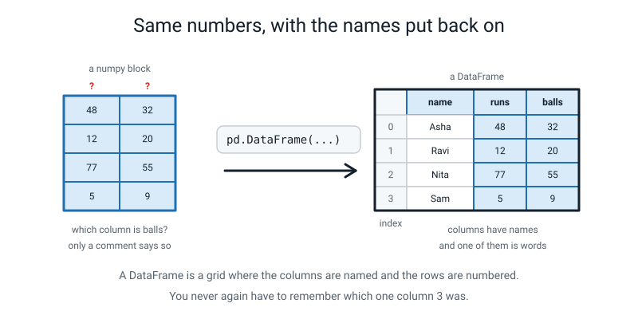
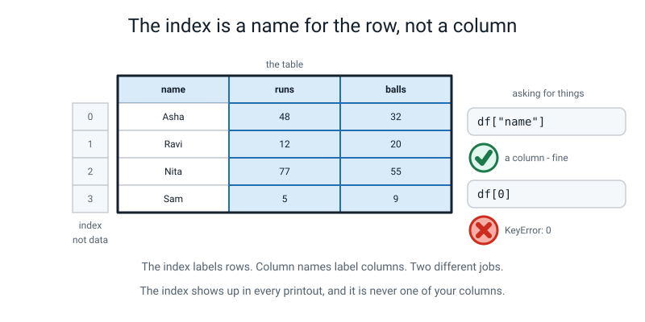
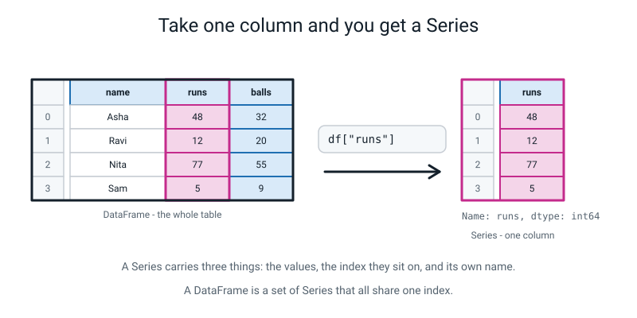
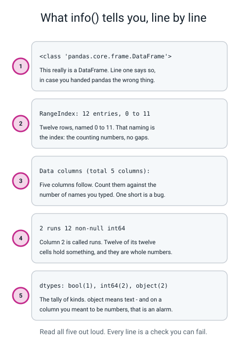
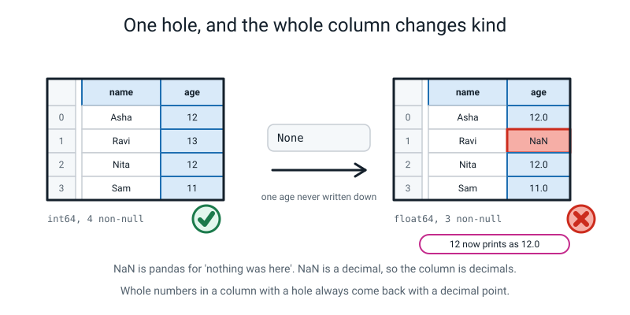
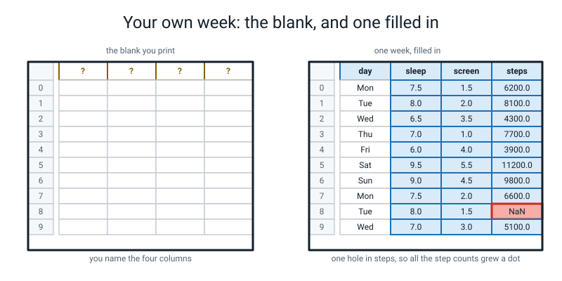
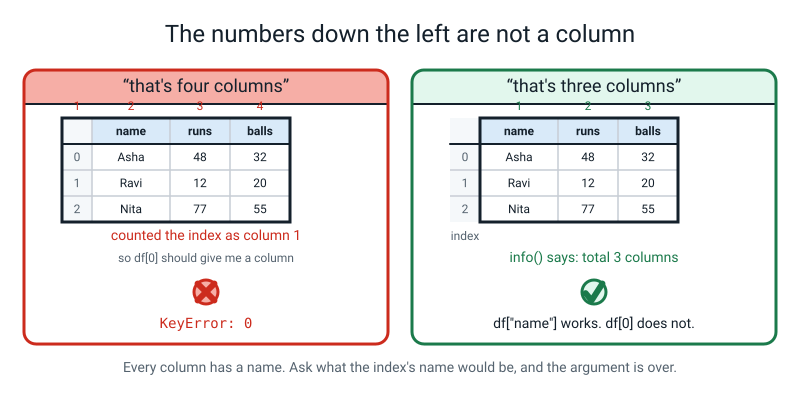
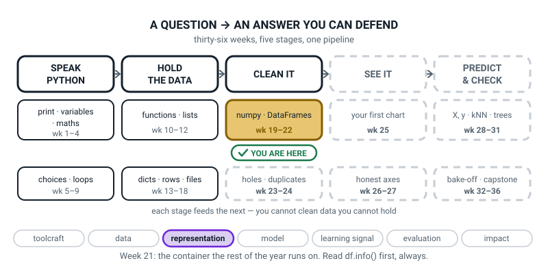
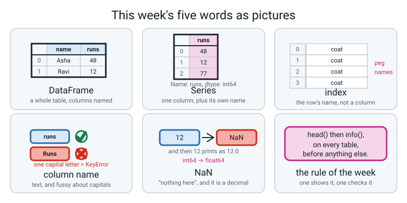

# Week 21 — Tables With Names On: Meet the DataFrame

[⬅ Week 20](week-20.md) · [Course Home](../README.md) · [Next ➡](week-22.md) · [Workbook](../workbook/week-21.md)

---

> ### This week in one sentence
> **A DataFrame is a table where the columns have names and the rows have an index, so you never again have to remember "column 3".**
>
> **By the end of this chapter you will be able to:**
> - **Build a DataFrame** from a dictionary of columns, and from a list of dictionaries
> - **Read `df.head()`** and name every part of the printout
> - **Read `df.info()` line by line** — rows, column names, kinds, and how many cells are actually filled in
> - **Explain what the index is** and why it is not one of the columns
> - **Notice a whole-number column printing as decimals** and say exactly what caused it
>
> **New syntax:** `pd.DataFrame({...})` · `df.head()` · `df.info()` · `df["col"]`
>
> **Reading time:** about 35 minutes. **Homework:** about 55 minutes.

---

## 🪝 Start Here

Do you remember Week 14?

You had twelve cricketers, each one a dictionary. You wanted them printed as a neat table — names lined up, numbers lined up, a header row across the top. So you wrote a header line stuffed with format codes like `:<7` and `:>5`. Then you wrote a loop. Then the header widths didn't match the row widths and the whole thing went wonky, so you sat there counting characters.

It took you about thirty lines and most of a lesson. Here is what you produced:

```text
 #  NAME   TEAM      RUNS BALLS  OUT
----------------------------------------
 0  Asha   Falcons     48    32  True
 1  Ravi   Falcons     12    20  True
 2  Nita   Falcons     77    55  False
 3  Sam    Falcons      5     9  True
 4  Kabir  Tigers      63    41  True
```

That is genuinely good work and you should be a bit proud of it.

Now watch. Three lines:

```python
import pandas as pd
from squad_data import squad
print(pd.DataFrame(squad))
```

```text
     name     team  runs  balls    out
0    Asha  Falcons    48     32   True
1    Ravi  Falcons    12     20   True
2    Nita  Falcons    77     55  False
3     Sam  Falcons     5      9   True
4   Kabir   Tigers    63     41   True
5   Meera   Tigers    30     28  False
6     Dev   Tigers     0      3   True
7    Zara   Tigers    41     39   True
8   Iqbal    Hawks    55     44   True
9    Lena    Hawks    22     18   True
10   Omar    Hawks    90     61  False
11  Priya     Owls   104     70  False
```

**Your own data, unchanged.** The same twelve dictionaries, the same file.

Look at what it did without being asked. It found the column names. It worked out how wide each column needed to be. It put the numbers on the right and the words on the left. It numbered the rows. And look at **10** and **11** — the two-digit row numbers are lined up neatly under the one-digit ones, which is the exact thing that went wrong for you in Week 14.


*Figure 21.1 — Same numbers, with the names put back on. And one column is even allowed to be words.*

**So was Week 14 a waste of time?**

No, for two reasons, and both are honest.

**One:** you now know what that one line is *doing*, because you have done it by hand. Someone who has only ever called `pd.DataFrame` thinks it is magic. You know it is a header row and some width arithmetic.

**Two:** in about ten minutes this chapter is going to show you something a table like that can get quietly wrong, and you will spot it because you know what is underneath.

The thing you just built has a name:

> **DataFrame** — a table where the columns have names and the rows have an index.

And here is the one sentence that says what it is, given everything you already know:

> **A DataFrame is a numpy array with the labels put back on — and each column is allowed to be a different kind of thing.**

Remember Week 17, when you rubbed the words off your table until only a rectangle of numbers was left? **You are getting them back today.** And you know exactly what they were worth, because you have spent four weeks without them.

---

## 🧠 The Big Idea

> **📌 About the code in this section.** The blocks below are **illustrations, not files**. They show you the shape of one idea, and each one carries on from the one above it — the `import` lines and the data are typed once, in the first block that needs them. **The complete, runnable file is in 💻 Type This.** If you copy a block from this section on its own and Python says `NameError`, that is why, and nothing is broken.

### 1. Why this exists: four weeks of carrying three objects

**The plain explanation.** For four weeks you have been paying a price on purpose, and here it is in one code block.

A numpy array knows its shape, does maths to everything at once, and is fast. And it has **absolutely no idea what its columns are called.** So you have been keeping the names *separately*:

```python
names = np.array(["Aarav", "Bela", ...])      # ten names
tests = np.array(["Quiz1", "Quiz2", ...])     # five test names
scores = np.array([[72, 65, ...], ...])       # a ten-by-five grid
```

**Three separate objects, held together by nothing but hope** and the fact that the lengths happen to match. Last week you saw what happens when they stop matching: a loud `IndexError` if you were lucky, and a wrong column with a confident wrong number if you were not.

**"Fine — so put everything in one array."** Try it:

```python
"""allnumpy.py - what happens if you try to keep the whole table in one array."""

import numpy as np
from squad_data import squad

rows = np.array([[r["name"], r["team"], r["runs"], r["balls"], r["out"]]
                 for r in squad])
print(rows[:3])
print("shape:", rows.shape, " dtype:", rows.dtype)
print("total runs:", rows[:, 2].sum())
```

```text
[['Asha' 'Falcons' '48' '32' 'True']
 ['Ravi' 'Falcons' '12' '20' 'True']
 ['Nita' 'Falcons' '77' '55' 'False']]
shape: (12, 5)  dtype: <U21
Traceback (most recent call last):
  File "allnumpy.py", line 10, in <module>
    print("total runs:", rows[:, 2].sum())
numpy.core._exceptions._UFuncNoLoopError: ufunc 'add' did not contain a loop with signature matching types (dtype('<U21'), dtype('<U21')) -> None
```

**Every number became writing.** `48` is now `'48'` — look at the quote marks — and you cannot add up writing.

**The analogy.** An array is a box of one kind of thing, like an egg box. Put one shoe in it and pandas has to find a container that holds both eggs and shoes, and the only one available is "general stuff". That is Week 17's rule, applied to a whole table at once.

**A concrete example of the whole arc**, worth having on your wall:

| Week | The container | One row is | Named columns? | Maths on everything at once? | Mixed kinds in one table? |
|---|---|---|---|---|---|
| 14 | list of dicts | a `dict` | ✅ yes — the keys | ❌ no, you loop | ✅ yes |
| 17 | numpy array | a row of numbers | ❌ no, just positions | ✅ yes | ❌ no — one kind only |
| **21** | **DataFrame** | **a labelled row** | ✅ **yes** | ✅ **yes** | ✅ **yes** |

Look at the bottom row. **Every single yes.** So why didn't we start there?

Two reasons and both are honest. **One:** pandas is slower and much more complicated — a big library with about six ways to write everything, and you would have drowned. **Two, and this is the real one:** if you had named columns on day one, you would never have known what they were worth.

> **🧑‍🏫 If a student asks:** *"is pandas replacing numpy? Did I waste four weeks?"* **No.** A DataFrame is built **on top of** numpy. Every column is a numpy array underneath. When you take a mean, numpy does the arithmetic. When you compare a column with a number you get a mask — last week's mask, unchanged. `axis=0` and `axis=1` still mean the same two directions and pandas uses those exact words. **It is a jacket, not a replacement.**

### 2. Two containers, and only two

**The plain explanation.** There are exactly two containers in pandas that you need. Two. That is the whole thing.

> **DataFrame** — a whole table. Columns with names, rows with an index. Each column may hold a different kind of thing.
>
> **Series** — one column on its own, still carrying the row labels and its own name.

And the relationship is simple: **a DataFrame is a set of Series that all share one index.** Ask for one column and you get one Series back.

**The analogy.** A numpy array is a table of numbers drawn on **graph paper** — you find things by counting squares. *"Third column along, I think."* A DataFrame is the same table printed as a proper **spreadsheet**: headings across the top, row numbers down the side. Same numbers. But now you can say *"the runs column"* instead of *"column 2, probably."*

**A concrete example, with real values.** Two ways to build one, and they are the same call.

**Way one — a dictionary of columns.** Each key becomes a column name; each list becomes that column's values.

```python
ages = pd.DataFrame({
    "name": ["Asha", "Ravi", "Nita", "Sam"],
    "age":  [12, 13, 12, 11],
})
print(ages)
```

```text
   name  age
0  Asha   12
1  Ravi   13
2  Nita   12
3   Sam   11
```

**Read the shape of that code carefully**, because this is the thing people get backwards: **the key is a column *name*, and the list running down the page is a *column*, not a row.** Two keys, two columns. Four items in each list, four rows.

**Way two — a list of dictionaries**, which is Week 14's dataset, unchanged:

```python
squad_df = pd.DataFrame(squad)
```

One call. Every dictionary becomes a row; every key becomes a column name.

> **💡 Try this:** neither way is better. Use the **dict of columns** when you are typing data in by hand, which is most of the time in this course. Use the **list of dicts** when you already *have* a list of dicts, which is what happens when data arrives from a file. They produce exactly the same thing.

### 3. The index is the row's name, and it is not a column

**The plain explanation.** Look down the left-hand side of that printout: `0, 1, 2, 3`. What is that?

> **index** — the row labels down the left-hand side. By default they are the counting numbers `0, 1, 2, …`, but they do not have to be.

And here is the part to be firm about: **the index is not a column.**

**The proof is short and satisfying.** Count the column names across the top of the squad table: `name`, `team`, `runs`, `balls`, `out`. **Five.** In a moment `info()` will tell you "total 5 columns" — five, not six. The index is not in the count.

And if you try to ask for it like a column:

```python
print(squad_df[0])
```

```text
KeyError: 0
```

There is **no column called 0**. Square brackets on a DataFrame mean *"give me the column with this name"*, and `0` is not one of the names.


*Figure 21.2 — The index labels rows. Column names label columns. Two different jobs, and only one of them is in the column count.*

**The analogy.** The index is **the name on a coat peg.** The peg has a name so you can find your coat. **The name is not your coat.**

**And an honest note.** Right now those names are just `0, 1, 2, 3`, and they are not doing anything useful for you yet. Say so out loud; it is true.

They start earning their keep **next week**, when you throw some rows away and the numbers stop being consecutive — a filtered table's index reads something like `0, 3, 4, 7`, with gaps. At that moment, having each row keep its *original name* turns out to matter enormously. A student who thinks the index is "the row count" has a very confusing afternoon. A student who thinks it is "the row's name" finds it obvious.

> **🤔 Think about it:** in the ten-row table later in this chapter, `Mon` appears twice — rows 0 and 7. Two rows can hold the same **value** in a column. Can two rows share the same **index**? No, never. **That is what the index is actually for: being the one thing guaranteed to be unique.**

### 4. `df["col"]` gives you a Series, and it remembers three things

**The plain explanation.** Square brackets and the column's name.

```python
print(squad_df["runs"])
```

```text
0      48
1      12
2      77
3       5
4      63
5      30
6       0
7      41
8      55
9      22
10     90
11    104
Name: runs, dtype: int64
```

**Three things in that output, and the last line is the interesting one.**

1. **The index came with it.** `0` to `11`, down the left. The column did **not forget which rows its values belong to.** Compare that with numpy's `arr[:, 2]`, which hands you twelve bare numbers and no idea whose they are.
2. **The values.**
3. **A footer:** `Name: runs, dtype: int64`. The Series knows **its own name** and its own **kind**. An array knew its kind. It never knew its name.


*Figure 21.3 — A Series carries three things: the values, the index they sit on, and its own name.*

**The analogy.** Pulling a column out of a DataFrame is like taking one page out of a ring binder. The page still has its page number printed on it and its heading at the top. It has not become an anonymous sheet of paper.

**A concrete example, proved out loud.** You can ask Python what the two things actually are:

```python
print("the whole table is a:", type(squad_df))
print("one column is a    :", type(squad_df["runs"]))
```

```text
the whole table is a: <class 'pandas.core.frame.DataFrame'>
one column is a    : <class 'pandas.core.series.Series'>
```

**Two containers, and that is all there are.** In writing, from Python itself.

> **⚠️ Watch out:** column names are **text**, and text is fussy about capitals. `squad_df["Runs"]` with a capital R gives you a **nineteen-line** error. Nineteen. For one letter. There is a recipe for reading it in "When It Breaks" and it takes four seconds.

### 5. `df.info()` is a health report, and every line is a check that can fail

**The plain explanation.** Two commands. You will run these on every table you ever meet, for the rest of your life, before you do anything else with it.

```text
df.head()   ->  what does it LOOK like?      (the first five rows)
df.info()   ->  can I TRUST it?              (rows, columns, kinds, holes)
```

`head()` is the easy one. **First five rows.** `head(3)` gives three. That is all it does, and it is the most-used command in pandas — because a real table has fifty thousand rows in it and you do not want to print fifty thousand rows to check the column names came out right.

`info()` is the one that matters, and it prints twelve lines, and you should read every single one of them out loud.

```python
squad_df.info()
```

```text
<class 'pandas.core.frame.DataFrame'>
RangeIndex: 12 entries, 0 to 11
Data columns (total 5 columns):
 #   Column  Non-Null Count  Dtype 
---  ------  --------------  ----- 
 0   name    12 non-null     object
 1   team    12 non-null     object
 2   runs    12 non-null     int64 
 3   balls   12 non-null     int64 
 4   out     12 non-null     bool  
dtypes: bool(1), int64(2), object(2)
memory usage: 524.0+ bytes
```

> **⚠️ Watch out:** there is **no `print()`** around it. `info()` prints for itself and hands back nothing. Write `print(df.info())` and you get the report, and then the word `None` underneath it, which looks broken and isn't.

**Now read it, line by line. Every line is a check that can fail.**

| Line | What it says | The check it gives you |
|---|---|---|
| `<class 'pandas.core.frame.DataFrame'>` | This really is a DataFrame. | If it said `Series`, you handed pandas one column when you meant the table. |
| `RangeIndex: 12 entries, 0 to 11` | Twelve rows, named 0 to 11. | **Is twelve the number you expected?** `len(squad)` said twelve. They agree, and that is a check that just passed. |
| `Data columns (total 5 columns):` | Five columns follow. | Count them against the names you typed. **And the index is not one of the five.** |
| `#  Column  Non-Null Count  Dtype` | The headings of the little table underneath. | — |
| `0   name    12 non-null     object` | Column 0 is `name`, twelve of its twelve cells hold something, and it is text. | **Non-null count.** Anything less than 12 means holes. |
| `2   runs    12 non-null     int64` | Column 2 is `runs`, no holes, whole numbers. | **Dtype.** A column you meant to be numbers showing `object` is an alarm. |
| `dtypes: bool(1), int64(2), object(2)` | The tally: one true/false column, two whole-number, two text. | Adds to 5, matching the column count. A free check. |
| `memory usage: 524.0+ bytes` | How much space it takes. | **Ignore it.** It is the least interesting line on the page and everybody stares at it. |


*Figure 21.4 — Every line of `info()` is a check you can fail. Read all of them out loud.*

**Two words to pin down, because they matter all year.**

> **`object`** — pandas's word for "a column of general Python things", which in practice almost always means **text**.

That is a terrible name and it is historical. What you actually need from it is one sentence: **if a column you *meant* to be numbers says `object`, something is wrong.** There is a word in it, or a stray space, or a quote mark round a number — and none of your arithmetic will work. `object` on a number column is the loudest alarm bell in pandas, and it never raises an error.

> **non-null** — how many cells actually have something in them. "Null" means empty. `12 non-null` out of `12 entries` means nothing is missing.

**And the sentence to keep:** *"`head()` shows you what the table looks like. `info()` tells you whether you can trust it. Run both, on every table, every time, before you do anything else."*

### 6. `NaN`: one hole, and the whole column changes kind

**The plain explanation.** This is the deepest idea in the week, and it starts with the four-row table of ages you built in §2. All whole numbers:

```text
   name  age
0  Asha   12
1  Ravi   13
2  Nita   12
3   Sam   11
```

```text
 1   age     4 non-null      int64
```

Now build the same table with **one age never written down**. In Python, "there is nothing here" is `None`:

```python
holed = pd.DataFrame({
    "name": ["Asha", "Ravi", "Nita", "Sam"],
    "age":  [12, None, 12, 11],            # Ravi's age is missing
})
print(holed)
holed.info()
```

**Predict before you look.** Will it crash? What will change?

```text
   name   age
0  Asha  12.0
1  Ravi   NaN
2  Nita  12.0
3   Sam  11.0
```

```text
 1   age     3 non-null      float64
```

**Read Asha's age.** *Twelve point zero.*

You typed `12`. **Nobody touched Asha.** Nita's is `12.0` too. Sam's is `11.0`. **Every whole number in that column grew a decimal point, and only Ravi's was missing.**

**Three things changed and nothing warned you about any of them:**

1. `None` became **`NaN`**.
2. `12` became **`12.0`** — every whole number in the column grew a decimal point.
3. The dtype went from `int64` to **`float64`**, and the count from `4 non-null` to **`3 non-null`**.

> **NaN** — pandas's marker for "there is nothing here". It stands for "Not a Number", and — confusingly — it is itself a decimal.


*Figure 21.5 — One hole, and the whole column changes kind. Nobody else's number was touched.*

**Why does the whole column change?** Say Week 17's rule again: **a column holds one kind of thing.** That has not changed. `NaN` is a decimal. So what is the only kind that can hold both `12` and `NaN`?

Decimals. **A whole-number box has nowhere to put a `NaN`.** So pandas converted the entire column, silently, because there was nothing else it could do.

**The analogy.** It is a shelf of identical jars. One jar has to be a slightly different shape to hold the odd thing you want to store. You cannot have a shelf where one jar is different — so every jar on the shelf becomes the new shape.

**And now go and find your Bug Log.** This is the *third* time you have met this rule:

| Week | What went in | What happened to the whole container |
|---|---|---|
| 17 | one **word** in a list of numbers | everything became text — `<U21` |
| 18 | one **decimal** in a list of whole numbers | everything became `float64` |
| **21** | one **hole** in a column of whole numbers | everything became `float64` |

**Same rule, three costumes: a container picks the one kind that can hold everything.**

**And here is the practical version, which is a check you can use forever:**

> **If you typed whole numbers and pandas is showing you decimals, you have a hole somewhere.** Go and find it. `info()` will tell you which column and how many.

---

## 💻 Type This

Two files. Everything goes in the same folder as `squad_data.py` and `records.py`.

**First**, prove pandas is on your machine. In a terminal:

```bash
python3 -c "import pandas; print(pandas.__version__)"
```

You should see a version number. Anything recent is fine:

```text
1.5.3
```

If you see `ModuleNotFoundError: No module named 'pandas'`, run **`python3 -m pip install pandas`** and try again. The `-m` matters: it makes pip install into *the same Python* that `python3` runs, which is the usual cause of that error.

### Step 1 — prove the install from inside a file

New file, `table.py`.

```python
"""table.py - the twelve records, handed to pandas."""

import pandas as pd                        # everybody calls it pd
from squad_data import squad               # the twelve dictionaries from Week 14

print("pandas version:", pd.__version__)
print("how many records:", len(squad))
```

```text
pandas version: 1.5.3
how many records: 12
```

**What the new lines do.** `as pd` is the same idea as `as np` from Week 17 — a nickname, inside this file only. **And exactly like `np`, everybody on Earth writes `pd`.** Not `pandas`, not `panda`, not `p`. Every book, every tutorial, every bit of code you will ever read. Follow the convention; it is how strangers read each other's work.

The second line is a **check**, not decoration. **Twelve records.** Remember that number — in about four minutes something else is going to tell you twelve, and you want the two to agree.

### Step 2 — one call

```python
squad_df = pd.DataFrame(squad)             # a list of dicts, straight in
print()
print(squad_df)
```

```text

     name     team  runs  balls    out
0    Asha  Falcons    48     32   True
1    Ravi  Falcons    12     20   True
2    Nita  Falcons    77     55  False
3     Sam  Falcons     5      9   True
4   Kabir   Tigers    63     41   True
5   Meera   Tigers    30     28  False
6     Dev   Tigers     0      3   True
7    Zara   Tigers    41     39   True
8   Iqbal    Hawks    55     44   True
9    Lena    Hawks    22     18   True
10   Omar    Hawks    90     61  False
11  Priya     Owls   104     70  False
```

**What the new line does.** Note the **capital D and capital F** in `pd.DataFrame`. Both capitals. Get one wrong and pandas will tell you so, quite politely, in a minute.

**Where did the column names come from?** Open `squad_data.py` and read one record: `{"name": "Asha", "team": "Falcons", "runs": 48, ...}`. **The keys.** Each key became a column name; each dictionary became a row. Twelve dictionaries, twelve rows. Five keys, five columns. **Nothing was invented.**

And notice `out` — a `True`/`False` column sitting happily next to columns of numbers and columns of words. **Try that in a numpy array** and every number in the whole table turns into writing. This is the thing a DataFrame can do that an array cannot.

### Step 3 — `head()`

```python
print()
print(squad_df.head())
```

**Predict before you run it.** How many rows will that print?

```text

    name     team  runs  balls    out
0   Asha  Falcons    48     32   True
1   Ravi  Falcons    12     20   True
2   Nita  Falcons    77     55  False
3    Sam  Falcons     5      9   True
4  Kabir   Tigers    63     41   True
```

Five. `head()` always gives you the first five unless you say otherwise — `head(3)` gives three.

**Four things are in that printout. Name all four:**

1. The **column names** along the top.
2. The **index** down the left.
3. The **values**, one per cell.
4. The **alignment** — text left, numbers right, every width worked out for you.

**And which of those four is not part of your data?** The index. **Not a column.** Count the column names: five. Hold that number.

### Step 4 — `info()`, and read every line

Do not rush this. It is the objective of the whole chapter.

```python
print()
squad_df.info()
```

**Predict before you run it.** It is about to say a number of rows and a number of columns. What will they be?

```text

<class 'pandas.core.frame.DataFrame'>
RangeIndex: 12 entries, 0 to 11
Data columns (total 5 columns):
 #   Column  Non-Null Count  Dtype 
---  ------  --------------  ----- 
 0   name    12 non-null     object
 1   team    12 non-null     object
 2   runs    12 non-null     int64 
 3   balls   12 non-null     int64 
 4   out     12 non-null     bool  
dtypes: bool(1), int64(2), object(2)
memory usage: 524.0+ bytes
```

Now go line by line and say each one in your own words before you read mine.

**Line one.** *It is a DataFrame.* Which sounds pointless — of course it is, you just made one. But it is the first thing to check when something baffling happens, because if you accidentally handed it *one column* it would say `Series` here and you would know instantly.

**Line two.** `RangeIndex: 12 entries, 0 to 11`. Two facts: **twelve rows**, named **0 to 11**. And what did line two of your file say, four minutes ago? *Twelve records.* **They agree.** That is a check and it just passed. If this said eleven, you lost a cricketer somewhere and you want to know now rather than in an hour.

**Line three.** `Data columns (total 5 columns)`. Count them on the printout above. **Five** — and the index is not one of them.

**The little table.** Four headings: a number, the Column name, the **Non-Null Count**, and the **Dtype**. One row per column. Read the `runs` line: *"column number 2 is called `runs`, twelve of its twelve cells have something in them, and they are whole numbers."*

**That middle number is the new idea and it is the reason `info()` exists.** Twelve out of twelve means nothing is missing. If it said `9 non-null` you would have **three holes**, and if you had averaged that column without looking you would have got an answer and never known.

Read the `name` line: *"column 0 is `name`, twelve of twelve filled, `object`."* Words, so `object` is correct here. **But write this down: if a column you meant to be numbers ever says `object`, something is wrong.**

**Second-to-last line.** `dtypes: bool(1), int64(2), object(2)`. A tally. Add it up: **five**, which matches. Another free check.

**Last line.** `memory usage`. Ignore it.

### Step 5 — one loud mistake, on purpose

Pull out one column. Square brackets and the name.

```python
print()
print(squad_df["Runs"])
```

**Predict before you run it.** Will that work?

```text
Traceback (most recent call last):
  File "/Library/.../site-packages/pandas/core/indexes/base.py", line 3802, in get_loc
    return self._engine.get_loc(casted_key)
  File "pandas/_libs/index.pyx", line 138, in pandas._libs.index.IndexEngine.get_loc
  File "pandas/_libs/index.pyx", line 165, in pandas._libs.index.IndexEngine.get_loc
  File "pandas/_libs/hashtable_class_helper.pxi", line 5745, in pandas._libs.hashtable.PyObjectHashTable.get_item
  File "pandas/_libs/hashtable_class_helper.pxi", line 5753, in pandas._libs.hashtable.PyObjectHashTable.get_item
KeyError: 'Runs'

The above exception was the direct cause of the following exception:

Traceback (most recent call last):
  File "table.py", line 20, in <module>
    print(squad_df["Runs"])
  File "/Library/.../site-packages/pandas/core/frame.py", line 3807, in __getitem__
    indexer = self.columns.get_loc(key)
  File "/Library/.../site-packages/pandas/core/indexes/base.py", line 3804, in get_loc
    raise KeyError(key) from err
KeyError: 'Runs'
```

**That is nineteen lines of error for one wrong letter.** Welcome to pandas.

**Do not panic and do not read the middle. Read the last line.** `KeyError: 'Runs'`.

And you have met `KeyError` before — **Week 13, dictionaries.** It means *"there is no key with that name."* A DataFrame's columns work exactly like a dictionary's keys, which is not a coincidence: you built this thing out of dictionaries.

Is there a column called `Runs`? No. It is `runs`, lower case. **One letter.**

**Two more things about this traceback and then move on.** Look at the middle: *"The above exception was the direct cause of the following exception."* pandas hit a problem deep inside itself, wrapped it up, and handed it to you. **You get told twice.** Annoying, harmless.

And look for the `File` line that names **your** file: `File "table.py", line 20`. **That is the only line in nineteen that you can do anything about.**

Fix it:

```python
print()
print(squad_df["runs"])
print("the whole table is a:", type(squad_df))
print("one column is a    :", type(squad_df["runs"]))
```

```text

0      48
1      12
2      77
3       5
4      63
5      30
6       0
7      41
8      55
9      22
10     90
11    104
Name: runs, dtype: int64
the whole table is a: <class 'pandas.core.frame.DataFrame'>
one column is a    : <class 'pandas.core.series.Series'>
```

### Step 6 — one silent mistake, on purpose

New file, `ages.py`. This one **does not crash.**

```python
"""ages.py - one missing age, and what it does to the whole column."""

import pandas as pd

# --- a DataFrame from a dictionary of columns -------------------------------
# each KEY becomes a column name; each LIST becomes that column's values
ages = pd.DataFrame({
    "name": ["Asha", "Ravi", "Nita", "Sam"],
    "age":  [12, 13, 12, 11],
})
print(ages)
ages.info()
```

**Predict before you run it.** What dtype will `age` be?

```text
   name  age
0  Asha   12
1  Ravi   13
2  Nita   12
3   Sam   11
<class 'pandas.core.frame.DataFrame'>
RangeIndex: 4 entries, 0 to 3
Data columns (total 2 columns):
 #   Column  Non-Null Count  Dtype 
---  ------  --------------  ----- 
 0   name    4 non-null      object
 1   age     4 non-null      int64 
dtypes: int64(1), object(1)
memory usage: 192.0+ bytes
```

`int64`, four non-null. As predicted. Now add the same table again, with `None` where the 13 was:

```python
# --- now with one age never written down -----------------------------------
holed = pd.DataFrame({
    "name": ["Asha", "Ravi", "Nita", "Sam"],
    "age":  [12, None, 12, 11],            # Ravi's age is missing
})
print()
print(holed)
holed.info()
print()
print(holed["age"])
```

**Predict before you run it.** Will it crash? What will change?

```text

   name   age
0  Asha  12.0
1  Ravi   NaN
2  Nita  12.0
3   Sam  11.0
<class 'pandas.core.frame.DataFrame'>
RangeIndex: 4 entries, 0 to 3
Data columns (total 2 columns):
 #   Column  Non-Null Count  Dtype  
---  ------  --------------  -----  
 0   name    4 non-null      object 
 1   age     3 non-null      float64
dtypes: float64(1), object(1)
memory usage: 192.0+ bytes

0    12.0
1     NaN
2    12.0
3    11.0
Name: age, dtype: float64
```

It did not crash. **And Asha's age is `12.0`.** §6 above is the whole explanation: `NaN` is a decimal, a column holds one kind, so the only kind that can hold both `12` and `NaN` is decimals.

**Put both of today's mistakes in your Bug Log** — the nineteen-line `KeyError` under *errors with a message*, and the `12.0` under *errors with no error message*. In the column where the error message goes for the second one, write: **"`12` printed as `12.0`."** That is the whole error, and you wrote it yourself.

### Step 7 — your own week, in ten rows

**The paper goes first.** Fill in a blank ten-row grid with a pencil before you type anything, so the data is a decision you made rather than something that appeared as you typed. **Ten days** — going over a weekend is fine — and **four columns you choose.**

Two rules about the columns, and both matter later:

- **At least one must be decimals.** Hours of sleep as `7.5` is the natural one.
- **At least one must be whole numbers.** Steps, or minutes of homework. **You will need this one most**, because it is the column the hole goes into.


*Figure 21.6 — The blank on the left is what you fill in with a pencil. The one on the right is what finished looks like.*

New file, `myweek.py`. **Read the code out loud as you type it:** *"key, colon, and then a whole column running down the page."*

```python
"""myweek.py - ten days of my own week, as a DataFrame."""

import pandas as pd

my_week = pd.DataFrame({
    "day":    ["Mon", "Tue", "Wed", "Thu", "Fri",
               "Sat", "Sun", "Mon", "Tue", "Wed"],
    "sleep":  [7.5, 8.0, 6.5, 7.0, 6.0, 9.5, 9.0, 7.5, 8.0, 7.0],
    "screen": [1.5, 2.0, 3.5, 1.0, 4.0, 5.5, 4.5, 2.0, 1.5, 3.0],
    "steps":  [6200, 8100, 4300, 7700, 3900, 11200, 9800, 6600, 7400, 5100],
})

print(my_week)
print()
print(my_week.head(3))
print()
my_week.info()
```

**Predict before you run it.** How many rows? How many columns? Which of the four will be `object`?

```text
   day  sleep  screen  steps
0  Mon    7.5     1.5   6200
1  Tue    8.0     2.0   8100
2  Wed    6.5     3.5   4300
3  Thu    7.0     1.0   7700
4  Fri    6.0     4.0   3900
5  Sat    9.5     5.5  11200
6  Sun    9.0     4.5   9800
7  Mon    7.5     2.0   6600
8  Tue    8.0     1.5   7400
9  Wed    7.0     3.0   5100

   day  sleep  screen  steps
0  Mon    7.5     1.5   6200
1  Tue    8.0     2.0   8100
2  Wed    6.5     3.5   4300

<class 'pandas.core.frame.DataFrame'>
RangeIndex: 10 entries, 0 to 9
Data columns (total 4 columns):
 #   Column  Non-Null Count  Dtype  
---  ------  --------------  -----  
 0   day     10 non-null     object 
 1   sleep   10 non-null     float64
 2   screen  10 non-null     float64
 3   steps   10 non-null     int64  
dtypes: float64(2), int64(1), object(1)
memory usage: 448.0+ bytes
```

**Three questions on your own output:**

- **Does `10 entries` match the number of rows on your paper?** If not, you lost or doubled a row while typing, and **the paper just caught it.** That is the entire reason the paper exists.
- **Which column is `object`, and is that right?** `day`, and yes — days are words.
- **Which are `float64`, and why?** `sleep` and `screen`, because you typed values like `7.5`. **And there are no holes anywhere** — 10 out of 10 on every line — so that is the *only* reason. Hold that thought for four seconds.

Also, look at `day`. **`Mon` appears twice**, rows 0 and 7. Not a problem. Two rows may hold the same value in a column; they may **not** share an index.

### Step 8 — one hole, predicted first

Go to your `steps` column and change **one** value to `None`. Pretend your phone was flat that day.

**Before you run it, write down three things you think will change.**

```python
my_week = pd.DataFrame({
    "day":    ["Mon", "Tue", "Wed", "Thu", "Fri",
               "Sat", "Sun", "Mon", "Tue", "Wed"],
    "sleep":  [7.5, 8.0, 6.5, 7.0, 6.0, 9.5, 9.0, 7.5, 8.0, 7.0],
    "screen": [1.5, 2.0, 3.5, 1.0, 4.0, 5.5, 4.5, 2.0, 1.5, 3.0],
    "steps":  [6200, 8100, 4300, 7700, 3900, None, 9800, 6600, 7400, 5100],
})

print(my_week)
my_week.info()
```

```text
   day  sleep  screen   steps
0  Mon    7.5     1.5  6200.0
1  Tue    8.0     2.0  8100.0
2  Wed    6.5     3.5  4300.0
3  Thu    7.0     1.0  7700.0
4  Fri    6.0     4.0  3900.0
5  Sat    9.5     5.5     NaN
6  Sun    9.0     4.5  9800.0
7  Mon    7.5     2.0  6600.0
8  Tue    8.0     1.5  7400.0
9  Wed    7.0     3.0  5100.0
<class 'pandas.core.frame.DataFrame'>
RangeIndex: 10 entries, 0 to 9
Data columns (total 4 columns):
 #   Column  Non-Null Count  Dtype  
---  ------  --------------  -----  
 0   day     10 non-null     object 
 1   sleep   10 non-null     float64
 2   screen  10 non-null     float64
 3   steps   9 non-null      float64
dtypes: float64(3), object(1)
memory usage: 448.0+ bytes
```

**Still ten entries.** The row did not go anywhere — it is still row 5 and it still has a day in it. **The cell is empty; the row is fine.**

But `steps` says **9 non-null** now, the dtype is `float64`, and every step count on the page has grown a decimal point. `6200` is `6200.0`. **Nobody's steps changed.**

**Now compare the tally lines, before and after:**

```text
before:  dtypes: float64(2), int64(1), object(1)
after :  dtypes: float64(3), object(1)
```

**The `int64` has vanished completely.** Not moved, not renamed — **gone**, because there is now no whole-number column left in the whole table. One missing step count wiped out an entire category from the summary line.

And notice: **both tallies still add up to four**, which is the number of columns. **That check still passes, and the table is still not what you typed.** Same lesson as last week's normalization — *a check that cannot fail is not much of a check.*

> **💡 Try this:** one habit worth having. **Read the per-column lines, not the tally.** The per-column lines have names on them — `steps  9 non-null  float64` tells you *which* column and *how many* are missing. The tally just says how many of each kind there are. **The line with a name on it is always the more useful line.**

---

## 🔍 Worked Examples

Three complete programs, in three different worlds. Type each one, **predict `info()` before you run it**, then check.

### Worked Example 1 — Six dishes in a canteen (food)

```python
"""canteen21.py - six dishes, four columns, and one number nobody wrote down."""

import pandas as pd                            # everybody calls it pd

canteen = pd.DataFrame({
    "dish":  ["Rajma", "Dosa", "Noodles", "Paneer", "Idli", "Pasta"],
    "price": [45, 30, 55, 70, 25, 60],          # rupees, whole numbers
    "veg":   [True, True, False, True, True, False],
    "sold":  [38, 52, 41, None, 60, 22],        # Paneer never got counted
})

print(canteen)
print()
canteen.info()
print()
print(canteen["price"])
```

Real output:

```text
      dish  price    veg  sold
0    Rajma     45   True  38.0
1     Dosa     30   True  52.0
2  Noodles     55  False  41.0
3   Paneer     70   True   NaN
4     Idli     25   True  60.0
5    Pasta     60  False  22.0

<class 'pandas.core.frame.DataFrame'>
RangeIndex: 6 entries, 0 to 5
Data columns (total 4 columns):
 #   Column  Non-Null Count  Dtype  
---  ------  --------------  -----  
 0   dish    6 non-null      object 
 1   price   6 non-null      int64  
 2   veg     6 non-null      bool   
 3   sold    5 non-null      float64
dtypes: bool(1), float64(1), int64(1), object(1)
memory usage: 278.0+ bytes

0    45
1    30
2    55
3    70
4    25
5    60
Name: price, dtype: int64
```

**Four columns, four different dtypes.** `object`, `int64`, `bool`, `float64` — all in one table, which no numpy array can do.

**And now compare the two number columns**, because this is the exercise:

| Column | What you typed | Dtype | Non-null | Why |
|---|---|---|---|---|
| `price` | 45, 30, 55, 70, 25, 60 | `int64` | `6` | whole numbers, no holes |
| `sold` | 38, 52, 41, **None**, 60, 22 | `float64` | **`5`** | one hole, so the whole column became decimals |

**`RangeIndex: 6 entries` is still six.** Six rows. Paneer's row did not disappear — it still has a dish, a price and a `veg`. **Only one cell is empty**, and the giveaway is `5 non-null`, not `6`.

> **💡 Try this:** put a `None` into `price` as well, run it again, and watch `45` become `45.0` and the `int64(1)` disappear from the tally line entirely — exactly as it did to `steps` in Step 8.

### Worked Example 2 — Eight footballers, and a hidden quote mark (sport)

This one is built the **other way** — from a list of dictionaries — and it has a bug in it that produces **no error at all.**

```python
"""football21.py - eight players, built from a list of dictionaries."""

import pandas as pd

players = [
    {"player": "Ama",   "position": "Forward",  "goals": 14, "minutes": 1520},
    {"player": "Bruno", "position": "Midfield", "goals": 6,  "minutes": 1680},
    {"player": "Cai",   "position": "Defence",  "goals": 1,  "minutes": 1710},
    {"player": "Dee",   "position": "Forward",  "goals": 11, "minutes": 990},
    {"player": "Eli",   "position": "Midfield", "goals": 4,  "minutes": 1340},
    {"player": "Fola",  "position": "Defence",  "goals": 0,  "minutes": 1800},
    {"player": "Gus",   "position": "Keeper",   "goals": 0,  "minutes": 1800},
    {"player": "Hira",  "position": "Forward",  "goals": 9,  "minutes": "1100"},
]

squad = pd.DataFrame(players)                   # a list of dicts, one call
print("how many records:", len(players))
print()
print(squad.head())
print()
squad.info()
print()
print(squad["goals"])
```

Real output:

```text
how many records: 8

  player  position  goals minutes
0    Ama   Forward     14    1520
1  Bruno  Midfield      6    1680
2    Cai   Defence      1    1710
3    Dee   Forward     11     990
4    Eli  Midfield      4    1340

<class 'pandas.core.frame.DataFrame'>
RangeIndex: 8 entries, 0 to 7
Data columns (total 4 columns):
 #   Column    Non-Null Count  Dtype 
---  ------    --------------  ----- 
 0   player    8 non-null      object
 1   position  8 non-null      object
 2   goals     8 non-null      int64 
 3   minutes   8 non-null      object
dtypes: int64(1), object(3)
memory usage: 384.0+ bytes

0    14
1     6
2     1
3    11
4     4
5     0
6     0
7     9
Name: goals, dtype: int64
```

**`minutes  8 non-null  object`.** Nothing is missing — eight out of eight — and yet the column is text.

**Why?** Look at Hira's record: `"minutes": "1100"`, with quote marks round it. **One quote mark, and the whole column is now writing.** Week 17's rule for the fourth time: a container picks the one kind that can hold everything, and the only kind that can hold both `1520` and `"1100"` is text.

**And here is what makes it nasty.** `head()` prints five rows — Hira is row **7**, so she does not even appear. The printed values look like perfectly ordinary numbers. **The only clue in the whole output is the word `object` on line 3 of the little table.** Not the count, which says 8. Not the values, which look fine. One word.

Try to do arithmetic with it and *then* it breaks:

```python
print(squad["minutes"] + 10)
```

```text
TypeError: can only concatenate str (not "int") to str
```

> **🤔 Think about it:** which is worse — a **hole**, which turns a whole-number column into decimals, or a **quote mark**, which turns it into text? The quote mark, and it is not close. The hole *announces itself*: `45` becomes `45.0` and the count drops. The quote mark leaves the count at 8 and the printed numbers looking exactly right. **`object` on a number column is the loudest alarm in pandas, and it never raises an error.**

### Worked Example 3 — Five library books, and nothing wrong at all (school)

Sometimes it is worth reading an `info()` that is completely clean, so you know what "fine" looks like.

```python
"""library21.py - five books, three kinds of column, and no holes at all."""

import pandas as pd

library = pd.DataFrame({
    "title":    ["Wonder", "Holes", "Coraline", "Matilda", "Percy"],
    "pages":    [320, 233, 176, 240, 377],
    "rating":   [4.5, 4.8, 4.0, 4.9, 4.2],
    "borrowed": [True, True, False, True, False],
})

print(library)
print()
print(library.head(3))
print()
library.info()
print()
print(library["rating"])
print()
print("the whole table is a:", type(library))
print("one column is a    :", type(library["rating"]))
```

Real output:

```text
      title  pages  rating  borrowed
0    Wonder    320     4.5      True
1     Holes    233     4.8      True
2  Coraline    176     4.0     False
3   Matilda    240     4.9      True
4     Percy    377     4.2     False

      title  pages  rating  borrowed
0    Wonder    320     4.5      True
1     Holes    233     4.8      True
2  Coraline    176     4.0     False

<class 'pandas.core.frame.DataFrame'>
RangeIndex: 5 entries, 0 to 4
Data columns (total 4 columns):
 #   Column    Non-Null Count  Dtype  
---  ------    --------------  -----  
 0   title     5 non-null      object 
 1   pages     5 non-null      int64  
 2   rating    5 non-null      float64
 3   borrowed  5 non-null      bool   
dtypes: bool(1), float64(1), int64(1), object(1)
memory usage: 253.0+ bytes

0    4.5
1    4.8
2    4.0
3    4.9
4    4.2
Name: rating, dtype: float64

the whole table is a: <class 'pandas.core.frame.DataFrame'>
one column is a    : <class 'pandas.core.series.Series'>
```

**Read the health report and say "healthy", and be able to say why:**

- `5 entries` and there are five books. ✔
- `total 4 columns` and you typed four names. ✔
- **Every non-null count is 5.** No holes anywhere. ✔
- `pages` is `int64` — right, because you cannot have half a page.
- `rating` is `float64` — right, because you typed `4.5`, **not because anything is missing.** The count of 5 is what proves that.
- The tally adds to 4, matching the column count. ✔

**And one last thing, which is a small surprise.** Divide one column by another:

```python
print(library["pages"] / library["rating"])
```

```text
0    71.111111
1    48.541667
2    44.000000
3    48.979592
4    89.761905
dtype: float64
```

**The index came through, and the `Name:` line is gone.** Every other Series printout ended with `Name: rating, dtype: float64`. This one just says `dtype: float64`. pandas has no idea what to call "pages divided by rating", so it declines to guess. **A Series's name is something a person decided; when you make a new one, nobody has decided yet.**

---

## 🐞 When It Breaks

Every message below came from really running a broken version of this week's code. Your line numbers will differ. The last line will not.

> **The recipe for every pandas traceback, and it never changes:** *how many lines is it, and what does the last one say?* Then: *which `File` line has my own filename in it?* Everything between those two is inside pandas and there is nothing you can do about it.

### Break 1 — one capital letter, nineteen lines

```python
print(squad_df["Runs"])
```

```text
Traceback (most recent call last):
  File "/Library/.../pandas/core/indexes/base.py", line 3802, in get_loc
    return self._engine.get_loc(casted_key)
  ... six more lines inside pandas ...
KeyError: 'Runs'

The above exception was the direct cause of the following exception:

Traceback (most recent call last):
  File "table.py", line 20, in <module>
    print(squad_df["Runs"])
  ... four more lines inside pandas ...
KeyError: 'Runs'
```

**What Python is telling you.** *"There is no column with that name."* And it **quotes exactly what you asked for** — `'Runs'` — which is the fastest way to spot the difference from `'runs'`.

`KeyError` is Week 13's error, from dictionaries. That is not a coincidence: **a DataFrame's columns work like a dictionary's keys**, because you built it out of dictionaries.

**The fix.** `squad_df["runs"]`. Column names are text, and text is case-sensitive.

> **🐞 If you see this error:** count the lines out loud before you read anything. Saying *"that's nineteen lines for one wrong letter"* takes two seconds and completely removes the panic.

### Break 2 — asking for a row by number

```python
print(squad_df[0])
```

```text
  ... nineteen lines, mostly inside pandas ...
KeyError: 0
```

**What Python is telling you.** *"There is no column called 0."*

This is the index misunderstanding, and it produces an error rather than a wrong answer, which is lucky. **Square brackets on a DataFrame mean columns, not rows.** There is no column named `0`, so there is nothing to hand you.

**The fix, for today.** Ask for a column by its name. **Rows come next week**, and they need two new words.

### Break 3 — the capital letters in `DataFrame`

```python
squad_df = pd.dataframe(squad)
```

```text
Traceback (most recent call last):
  File "e3.py", line 3, in <module>
    squad_df = pd.dataframe(squad)
  File "/Library/.../pandas/__init__.py", line 264, in __getattr__
    raise AttributeError(f"module 'pandas' has no attribute '{name}'")
AttributeError: module 'pandas' has no attribute 'dataframe'. Did you mean: 'DataFrame'?
```

**What Python is telling you.** *"There is no `dataframe`. But there is a `DataFrame` — is that what you wanted?"*

**Read the last six words.** `Did you mean: 'DataFrame'?` **The computer told you the answer.** That happens more often than you would think, and reading it is a skill.

**The fix.** `pd.DataFrame(...)` — capital D **and** capital F.

### Break 4 — the one with no message at all

```python
my_week = pd.DataFrame({
    "day":   ["Mon", "Tue", "Wed"],
    "steps": [6200, None, 4300],
})
print(my_week)
```

```text
   day   steps
0  Mon  6200.0
1  Tue     NaN
2  Wed  4300.0
```

**There is no error.** That is the problem. You typed `6200`, a whole number, and it printed `6200.0`.

**What to do when there is no message.** One question:

> **"Did the numbers I typed come back with decimal points on them?"**

If yes, **you have a hole somewhere.** Then one command to find out where:

```python
my_week.info()
```

```text
 1   steps   2 non-null      float64
```

`2 non-null` out of `3 entries`. **One cell is empty**, and now you know which column and how many.

**And the fix?** There isn't one this week, and that is deliberate. **Today's job is to notice the hole, not to plug it.** Filling holes is Week 23, and noticing is the harder skill, so it gets its own week.

### The whole clinic, for reference

| What you see | What it means | The fix |
|---|---|---|
| `ModuleNotFoundError: No module named 'pandas'` | "There is no pandas on the Python I am using." | `python3 -m pip install pandas` — the `-m` makes it the *same* Python. Prove it with `python3 -c "import pandas; print(pandas.__version__)"` |
| `KeyError: 'Runs'` at the end of nineteen lines | "There is no column with that name." | A capital letter, a typo, or a stray space. `squad_df["runs"]` |
| `KeyError: 0` | "There is no column called 0." | Square brackets on a DataFrame mean **columns**. Rows are next week |
| `AttributeError: module 'pandas' has no attribute 'dataframe'. Did you mean: 'DataFrame'?` | "Wrong capital letters." | `pd.DataFrame(...)`. And **read the suggestion** — it is the answer |
| `ValueError: All arrays must be of the same length` | "Your columns are not the same height, so this is not a table." | One list in the dictionary has too many or too few items. Count them. **Good news** — pandas refused rather than guessing |
| `TypeError: 'method' object is not subscriptable` | "You used square brackets on something that needs round ones." | `df.head(3)`, not `df.head[3]`. `head` is a verb |
| `TypeError: unsupported operand type(s) for +: 'int' and 'str'` | "You tried to add a number to a word." | Check `info()` first. You are adding an `int64` column to an `object` one |
| `TypeError: can only concatenate str (not "int") to str` | "That column is text, so `+ 10` means glue, and you cannot glue a number." | The column says `object` when you expected numbers. One quote mark somewhere |
| `ValueError: DataFrame constructor not properly called!` | "That is not a shape I can make a table out of." | `pd.DataFrame({"name": ["Asha"], "runs": [48]})`. Note the **lists** — even a one-row column is a list |
| `AttributeError: module 'pandas' has no attribute '__version__'` | "The thing I imported as pandas is not pandas." | **There is a file called `pandas.py` in your folder.** Rename it. Standing rule, fourth appearance: never name a file after a library |
| **No error**, `print(df.info())` printed `None` at the bottom | Nothing is wrong. `info()` prints for itself and hands back nothing | `df.info()` on its own, no `print` |
| **No error**, `df.info` printed the whole table and then a `>` | Nothing is wrong. You asked for the verb instead of using it | `df.info()`. A verb takes brackets; a fact does not |
| **No error**, whole numbers printing as `6200.0` | Nothing is wrong as far as pandas is concerned | **There is a hole in that column.** `NaN` is a decimal. Run `info()` and read the non-null count |
| **No error**, a number column says `object` | Nothing is wrong as far as pandas is concerned | **One value is text** — a quote mark, a stray space, or a word. This is the loudest alarm in pandas and it never errors |
| **No error**, `12 non-null` but you typed 13 records | Nothing is wrong as far as pandas is concerned | You lost a row, probably a missing comma. **This is why you fill the paper grid in first** |

---

## 🎲 What We Did In Class

If you missed it, here is the whole lesson. You need `squad_data.py`, a pencil, and a blank ten-row grid.

### The reveal

Week 14's hand-formatted printout, face down on the table. Then the question: *"how long did that take you?"* Most of a lesson. Then it got turned over, and it is good work.

Then three lines typed on the screen, and pandas's output put next to the paper. Five seconds of silence.

> **A DataFrame is a numpy array with the labels put back on — and each column is allowed to be a different kind of thing.**

And the honest question: *"was Week 14 a waste of time?"* No — because you now know what that one line is doing, and you know what missing labels cost.

### The board work

```text
                 one row is    named columns?  maths at once?  mixed kinds?
W14 list of dicts   a dict          yes             no            yes
W17 numpy array     numbers         NO              yes           NO
W21 DataFrame       a labelled row  YES             YES           YES
```

Then: *"the bottom row is all yes. So why didn't we start there?"* Because pandas is slower and much more complicated — and because you would never have known what named columns were worth.

Then the two containers, and only two:

> **DataFrame** — a whole table. **Series** — one column, still carrying the row labels and its own name.

### The index, argued about

*"Down the left-hand side: 0, 1, 2, 3. What is that?"* The row numbers. *"Right — and it is **not a column.**"*

Then the proof, not the assertion. Count the column names: five. `info()` says "total 5 columns." Five, not six. And `df[0]` is a `KeyError`, because there is no column called zero.

> **The index is the name on a coat peg. The peg has a name so you can find your coat. The name is not your coat.**

### The two commands, and predictions in pen

```text
df.head()   ->  what does it LOOK like?      (the first five rows)
df.info()   ->  can I TRUST it?              (rows, columns, kinds, holes)
```

Then workbook page 21.2, **in pen, before any keyboard**: predict the whole `info()` report for a six-row snack table. About eighteen guesses. **At least one of them is not easy**, and nobody was told which.

### Building `table.py`, with two mistakes on purpose

The steps in "Type This", with predictions before every run. The two deliberate mistakes were a matched pair:

| Mistake | What happened |
|---|---|
| `squad_df["Runs"]` — one capital letter | **Loud.** Nineteen lines, ending `KeyError: 'Runs'` |
| `None` in the age column | **Silent.** `12` printed as `12.0` and the dtype changed |

Both went in the Bug Log. For the second, in the column where the error message goes, we wrote: **"`12` printed as `12.0`."**

### Reading `info()` out loud, line by line

Three minutes, every line, in our own words. The most valuable three minutes of the lesson. `RangeIndex: 12 entries` against `len(squad)` from four minutes earlier — **twelve and twelve, a check that passed.** The `runs` line read as a sentence. The `object` warning written down. The tally added up to five. `memory usage` ignored, deliberately and out loud.

### The hole, and the Bug Log from four weeks ago

*"Read me Asha's age."* Twelve point zero. *"You typed 12. Nobody touched Asha."*

Then the reason: `NaN` is a decimal, a column holds one kind, so decimals win.

Then the old Bug Log came out. Week 17: one word made everything text. Week 18: one decimal made everything `float64`. Today: one hole makes everything `float64`.

> **Three times. Same rule, three costumes: a container picks the one kind that can hold everything.**

### The ten-row table, paper first

A blank grid filled in with a pencil — ten days, four columns of our own choosing, at least one decimal column and at least one whole-number column. Then typed. Then `10 entries` checked against the ten rows on the paper.

Then one `None` into the whole-number column, with **three predictions written down first.** All three found: `NaN` appeared, every step count grew a decimal point, and the count dropped to `9 non-null`.

And the extra one nobody predicted: **the `int64` vanished from the tally line entirely**, because there was no whole-number column left in the table at all.

---

## 💬 Talk About It

**1. `12` and `12.0` are the same number. So why does the change matter at all?**

*Hint:* start by agreeing — the **value** genuinely is identical, and no arithmetic you do will come out differently because of it. So the argument cannot be about the value. Then ask what else changed at the same moment, in the same output. *(The non-null count went from 4 to 3.)* Now the useful framing: **which of those two is the symptom and which is the disease?** The `12.0` is what you can see; the missing value is what is actually wrong. So a person who shrugs at `12.0` will cheerfully average a column with three holes in it and never know. Then push once more: is there a case where a `float64` column is *not* a warning? *(Yes — if you typed `7.5`. Which is why the count matters more than the dtype.)*

**2. The index is not a column. Right now it is just 0, 1, 2, 3, so why be so fussy about it?**

*Hint:* start with the fussiness being about something that has not happened yet. Today the index carries no information — it is literally the row's position. So the argument for being firm has to be about **later**. Imagine you keep only the rows where `runs > 40`. Four rows survive out of twelve. What should their labels be — `0, 1, 2, 3`, or the numbers they had before? Work out what you lose in each case. *(Renumbering means you can never trace a row back to the original table. Keeping the old numbers means the index has gaps, which looks strange but tells the truth.)* pandas keeps the old numbers. Then the deep question: what is the one thing that must be true of every index, that is not true of any column? *(No two rows may share one. Not one column in the squad table can promise that — two players could easily have the same team, the same runs, even the same name.)*

**3. `head()` and `info()` tell you what is in a table. What can they never tell you?**

*Hint:* go through what each one actually reports, and then look for what is missing from both lists. `info()` will happily tell you that a `sleep` column has ten non-null decimal values. It will not tell you that three of them were guessed, that the phone was in a bag on Tuesday, or that the two "Mon" rows are two different Mondays. **The data does not record how it was made.** Then the harder half: whose job is it to write that down, and where would it even go? *(Not in the DataFrame — there is no slot for it. It goes in a comment, in a file, in a note beside the table. That is Week 24's cleaning log and Week 35's honesty paragraph, and it is the part of this subject that no library will ever do for you.)*

---

## ⚠️ Don't Get Tricked

### Trick 1 — "the index is the first column"


*Figure 21.7 — On the left, the index counted as a column and everything after it is off by one. On the right, five columns and a strip of row names.*

| ❌ Wrong | ✅ Right |
|---|---|
| "The squad table has six columns: the numbers, then name, team, runs, balls, out." | **Five columns.** `info()` says "total 5 columns" and the index is not among them. It has **no column name** to ask for, and `df[0]` raises `KeyError: 0`. |

It looks like a column and it prints like one. The test that settles it: **every column has a name. What is the index's name?** It hasn't got one.

### Trick 2 — "`12.0` means pandas just prints numbers like that"

| ❌ Wrong | ✅ Right |
|---|---|
| "It printed `12.0` instead of `12`. That is just how pandas shows numbers." | It is **not.** The very same table printed `12` a moment earlier, before the `None` went in. A decimal point where you typed a whole number is pandas **telling you something**: there is a hole in that column, and `info()` will say which and how many. |

If you are ever unsure, that is what `info()` is for. `4 non-null` against `3 non-null` is the whole story.

### Trick 3 — "the count says 8, so nothing is missing, so the column is fine"

| ❌ Wrong | ✅ Right |
|---|---|
| "`minutes  8 non-null  object` — eight out of eight, nothing missing, all good." | Nothing is *missing*, and the column is still **broken.** `object` on a column you meant to be numbers means **one value is text** — a quote mark, a stray space, a word. The count cannot see it. Only the dtype can. |

**There are two different faults and they show up in two different places.** A hole shows in the **count**. Text-that-should-be-a-number shows in the **dtype**. Read both, every time.

### Trick 4 — "pandas replaces numpy, so the last four weeks were wasted"

| ❌ Wrong | ✅ Right |
|---|---|
| "A DataFrame does everything an array does and more, so I can forget arrays." | A DataFrame is built **on top of** numpy. **Every column is a numpy array underneath.** Every axis from Week 19 and every mask from Week 20 is still doing the actual arithmetic — pandas even uses the words `axis=0` and `axis=1`. It is a jacket, not a replacement. |

And there are still jobs where you want the plain array: a photo, a big grid of measurements all of one kind, and the block of numbers you hand to a model in Week 29. **Arrays are faster and there is far less library to remember.**

---

## 🌍 Where You've Seen This

1. **Every spreadsheet you have ever opened.** Column headings across the top, row numbers down the side, and each column allowed to hold a different kind of thing. A DataFrame is a spreadsheet you can type at instead of click at — and the row numbers down the side of a spreadsheet are its index, and they are not a column there either.
2. **The "sort by" menu on any table on the web.** It says *"sort by price"*, not *"sort by column 3"*. That menu exists because the columns have names. Every one of those names is a `df["..."]` waiting to happen.
3. **A blank cell in an online form.** Leave your middle name empty and somewhere in a database there is a `NaN` — or its cousin, `NULL` — and somebody's code has to decide what to do about it. That decision is Week 23, and getting it wrong is why you occasionally get an email addressed to "Dear None".
4. **Your school's report system.** Twelve subjects, four terms, one absence column, one comment column. Names, numbers, and words in one table. **No numpy array could hold that** — the moment the comment column arrives, every mark becomes text.
5. **A phone's health app.** Steps, sleep hours, heart rate, one row per day, and gaps on the days you left the phone at home. Notice how it draws the gaps: a hole in the line, not a zero. That is the app knowing that `NaN` and `0` are different, which is more than most people's code knows.
6. **The `head` command in a terminal.** `head file.txt` shows the first ten lines of a file, and it exists for exactly the reason `df.head()` exists: you want a look, not the whole thing. Same word, same idea, about fifty years apart.

---

## 🧭 Where This Fits

Third week in the same gold tile — and this is the week it earns its second word. Look at
`numpy · DataFrames` on the map: everything since Week 17 has been the first word. Today the columns get
**names**, the rows get an index, and you stop counting across to column 3 and hoping.



*Figure 21.0 — The pipeline in Week 21. Still the `numpy · DataFrames` tile, and this is the week its
second word arrives. Every dashed box to the right of it is built on this one container.*

| | |
|---|---|
| **The mental model you now own** | A **DataFrame** is a table whose columns have **names** and whose rows have an **index**, so you ask for `df["steps"]` and never count to column 3 again. `df.info()` shows the shape, the types and the holes in one look. |
| **The one question it answers** | *"What is actually inside this table I just loaded?"* — `df.head()` for a look, `df.info()` for the truth, and in that order. |
| **What it plugs into** | Week 14's list of dicts and Week 17's array. The names come from one and the shape-aware maths from the other, and a DataFrame is both things at once. |
| **What carries forward** | Week 22 selects from it, Week 23 cleans it, Week 25 charts it, and Week 28 splits it into `X` and `y`. Nearly every line of code you write after today is a line about a DataFrame. |
| **Spiral thread** | 🏷️ **Representation**, on its own — the same twelve rows, in a container that remembers what each column is *called*, is a genuinely different thing to be holding. |

> **💡 Try this:** circle the word `DataFrames` on your own copy of the map and write beside it
> **head() then info(), every time**. Then look right along the row: chart, model, bake-off, capstone.
> Every dashed box between here and Week 36 is a box you will walk into holding one of these tables.

---

## 🔑 Remember This

- **A DataFrame is a numpy array with the labels put back on** — and each column is allowed to be a different kind of thing. That last part is what no array can do.
- **Two containers, and only two.** A **DataFrame** is the whole table. A **Series** is one column, and it carries the values, the index they sit on, **and its own name**.
- **The index is the row's name, not a column.** `info()` counts five columns, not six. `df[0]` is a `KeyError`. Two rows may share a value; they may never share an index.
- **`head()` shows what it looks like. `info()` tells you whether you can trust it.** Run both, on every table, before you do anything else. And **no `print()` around `info()`** — it prints for itself.
- **Read the per-column lines of `info()`, not the tally.** The line with a name on it tells you which column and how many are missing. The tally tells you neither.
- **Two different faults, two different places to look.** A **hole** shows up in the **non-null count**. **Text where you wanted numbers** shows up in the **dtype**, as `object`, and never raises an error.
- **If you typed whole numbers and pandas shows you decimals, you have a hole.** `NaN` is a decimal, and a column holds one kind of thing — Week 17's rule for the third time.

### Syntax reminder card

```python
import pandas as pd                        # top of the file. Everybody writes pd.

# ---- build one from a DICTIONARY OF COLUMNS ----------------------------
# the KEY is a column NAME; the LIST running down the page is a COLUMN
ages = pd.DataFrame({
    "name": ["Asha", "Ravi", "Nita", "Sam"],      # 4 items -> 4 rows
    "age":  [12, 13, 12, 11],
})
# pd.dataframe(...)  ->  AttributeError. Capital D AND capital F.
# lists of different lengths  ->  ValueError: All arrays must be of the same length

# ---- or from a LIST OF DICTIONARIES, which is Week 14's data ----------
squad_df = pd.DataFrame(squad)             # one dict per row, keys become columns

# ---- LOOK at it: two commands, on every table, every time ------------
print(ages.head())                        # the first FIVE rows
print(ages.head(3))                       # ...or three
ages.info()                               # NO print() - it prints for itself
# print(ages.info())  ->  the report, then the word None underneath

# ---- ONE COLUMN by name -> a Series ----------------------------------
print(ages["age"])                         # values + index + "Name: age, dtype: ..."
print(type(ages))                          # <class '...DataFrame'>
print(type(ages["age"]))                   # <class '...Series'>
# ages["Age"]  ->  KeyError: 'Age' at the end of 19 lines. Capitals matter.
# ages[0]      ->  KeyError: 0. Brackets mean COLUMNS. Rows are next week.

# ---- what info() is FOR: the two faults it catches -------------------
#  RangeIndex: 4 entries       <- is 4 the number of rows you actually typed?
#  total 2 columns             <- count them. The index is NOT one of them.
#  age   4 non-null   int64    <- COUNT catches a hole. DTYPE catches text.
#  age   3 non-null   float64  <- one None. NaN is a decimal, so 12 became 12.0
#  age   4 non-null   object   <- no hole, but one value has quotes round it
#  dtypes: int64(1), object(1) <- a tally with no names in it. Least useful line.
#  memory usage: 192.0+ bytes  <- ignore this one, deliberately
```

---

## 📓 New Words


*Figure 21.8 — This week's five words, drawn.*

| Word | What it means | Example |
|---|---|---|
| **DataFrame** | A whole table: named columns, an index down the side, and each column may hold a different kind of thing | `pd.DataFrame(squad)` turns twelve dictionaries into a table |
| **Series** | One column on its own, carrying the values, the index they sit on, and its own name | `squad_df["runs"]` ends `Name: runs, dtype: int64` |
| **index** | The row labels down the left. By default the counting numbers. **Not a column** | `RangeIndex: 12 entries, 0 to 11` |
| **column name** | The label along the top of a column. It is text, and it is case-sensitive | `squad_df["Runs"]` → `KeyError: 'Runs'` |
| **NaN** | pandas's marker for "there is nothing here". It stands for Not a Number, and it is itself a decimal | one `None` in a column of `12`s makes them all `12.0` |

---

## 📤 Your Homework

Go to **[the Week 21 workbook](../workbook/week-21.md)**. About **55 minutes** in total.

| Section | What to do | Time |
|---|---|---|
| **Warm-Up** | Five quick questions from Week 20 | 5 min |
| **Predict the Output** | Four snippets. Two run cleanly and are not what you typed | 10 min |
| **Practice A & B** | Six reading questions, then five you write yourself | 15 min |
| **Fix the Broken Program** | A snack table with three planted bugs — one crash, one loud, one silent | 8 min |
| **Build It — your own week in ten rows** | The paper grid first, then the code, then **every line of `info()` in your own words** | 17 min |

**Three things are being marked, and the second is the real one.**

**Does the entry count match the number of rows on your paper grid?** Fill the grid in with a pencil **first**. If you did not, you cannot answer this question, and the check did not happen. That is the only reason the paper exists.

**Is every line of `info()` explained in your own words?** Every line. If it says `RangeIndex: 10 entries, 0 to 9`, I want a sentence saying *ten rows, named zero to nine, and that matches the ten rows on my paper.* If it says `object`, I want a sentence saying what `object` means **and whether it is right for that column.** A page that says "it tells you about the DataFrame" for line one and skips to the dtypes has not done the work.

**And one specific thing:** if any column is a decimal when you typed whole numbers, **tell me why.** If none of them is, say so — that is a real answer, and it needs the non-null counts to back it up.

**Does the hole sentence explain why *everybody else* changed?** A good sentence sounds like: *"`NaN` is a decimal and a column can only hold one kind of thing, so the whole column had to become decimals even though only one value was missing."* A sentence about the one missing value has spotted the obvious half and missed the mechanism.

> **⚠️ Watch out:** the paper grid goes first, in pencil. Every week this term has had a "do it by hand before you trust the machine" step, and every week it is the step people skip. This one is the cheapest of them all — it is ten rows of your own life and it takes four minutes.

> **💡 Try this:** after you finish, put **quote marks** round one of your step counts — `"6200"` instead of `6200` — and run `info()` again. The count stays at 10, so nothing looks missing, and the printed numbers still look like numbers. **Only the dtype gives it away.** Then ask yourself which is worse: the hole, or the quote mark. And which one you would actually have spotted.

---

[⬅ Week 20](week-20.md) · [Course Home](../README.md) · [Week 22 ➡](week-22.md) · [📓 Workbook — Week 21](../workbook/week-21.md) · [Glossary](../../glossary.md)
