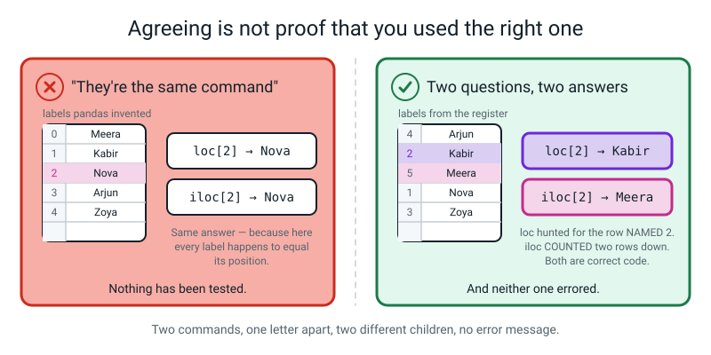
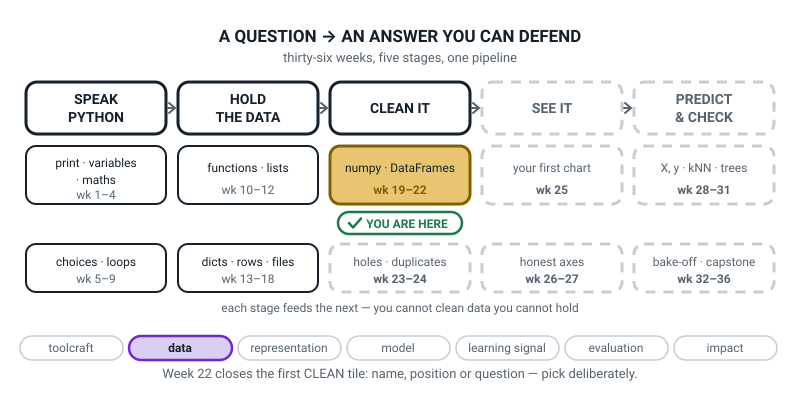
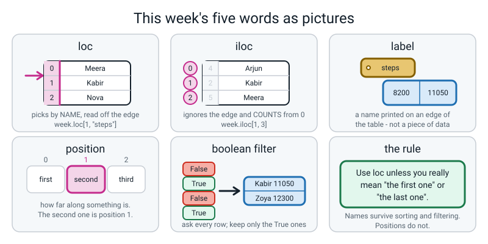

# Week 22 — Picking Rows and Columns Without Guessing

[⬅ Week 21](week-21.md) · [Course Home](../README.md) · [Next ➡](week-23.md) · [Workbook](../workbook/week-22.md)

---

> ### This week in one sentence
> **`loc` picks by name, `iloc` picks by position, and a boolean filter picks by asking a question — and on a fresh table two of them look identical, which is exactly what makes them dangerous.**
>
> **By the end of this chapter you will be able to:**
> - **Select one value by label** with `df.loc[row, "column"]`
> - **Select one value by position** with `df.iloc[row, column]`, counting from zero
> - **Explain in writing why `loc` and `iloc` give different answers** on a table whose row labels are not `0, 1, 2, …`
> - **Keep only the rows that answer True** to a question
> - **Sort a table by one column** and say whether the original changed
>
> **New syntax:** `df.loc[1, "age"]` · `df.iloc[1, 2]` · `df[df["age"] > 12]` · `df.sort_values("col")`
>
> **Reading time:** about 35 minutes. **Homework:** about 60 minutes.

---

## 🪝 Start Here

Imagine your whole class lined up along the wall, in alphabetical order. Your teacher says:

> **"Row two, come here."**

Who walks forward?

You probably said "the second person". Fine. Now imagine every one of you also has a **register number** — the number printed next to your name in the register. Register numbers are handed out when you join the school, so they have nothing at all to do with the alphabet. Yours might be 17 while you stand fourth in the line.

Your teacher says the exact same four words. **"Row two, come here."**

Now who walks forward? The second person along? Or the person whose number is 2?

Here is a real register. Read it and try to answer:

```
        REGISTER
   4  Arjun
   2  Kabir
   5  Meera
   1  Nova
   3  Zoya
```

If "row two" means **the one numbered 2**, it is Kabir.
If "row two" means **the second one along**, it is... hold on. Counting from one, that is Kabir too. Counting from zero — the way Python has counted since Week 7 — it is Meera.

**Two people. Same four words. And nobody in the room can settle it, because the question was never clear in the first place.**

Python has this exact problem, and Python solved it by having **two different commands**. One asks by name. One asks by counting. They are one letter apart on the keyboard.

And here is the part that matters, so read it twice:

> **When you pick the wrong one, Python does not tell you.** It gives you an answer. A completely sensible-looking answer, about the wrong person. No red text. No warning. Nothing.

That is what this week is about — and it is why the trap in the middle of this chapter is staged on purpose.

---

## 🧠 The Big Idea

> **📌 About the code in this section.** The blocks below are **illustrations, not files**. They show you the shape of one idea, and each one carries on from the one above it — the `import` lines and the data are typed once, in the first block that needs them. **The complete, runnable file is in 💻 Type This.** If you copy a block from this section on its own and Python says `NameError`, that is why, and nothing is broken.

### 1. A table has two edges, and both edges have names

**The plain explanation.** Last week you built your first DataFrame. Print it and look at what is around the numbers:

```text
    name  age  house  steps
0  Meera   12   Blue   8200
1  Kabir   13    Red  11050
2   Nova   12   Blue   6400
3  Arjun   14  Green   9800
4   Zoya   13    Red  12300
```

Along the **top** there are four words: `name`, `age`, `house`, `steps`. Those are the column names.

Down the **left** there are five numbers: `0 1 2 3 4`. Those are the row names — the **index**.

Both of those are the same kind of thing, and there is one word for both:

> **label** — a name printed on the edge of a table. The words along the top are labels. The numbers down the left are labels too.

**The analogy.** A table is a street of houses. The column labels are the street names. The row labels are the house numbers. Neither one is a person who lives there — they are the *addresses*, painted on the outside.

**A concrete example, and it matters more than it looks.** Nobody's step count is `3`. That number down the left is **not a piece of data**. Pandas made those five numbers up for us, in order, because we never said what to call the rows.

> **⚠️ Watch out:** those `0 1 2 3 4` are labels that *happen to be* numbers, the way a bus route called 42 is not the forty-second bus. Hold on to that. In about four minutes it becomes the whole lesson.

**The first tool.** If you can read a thing off an edge, `loc` will find it.

> **`loc`** — pick by label. Say the row's name and the column's name, in that order.

```python
print(week.loc[1, "steps"])
```

```text
11050
```

Every character of that line:

- `week` — the table.
- `.loc` — "I am about to give you **names**, not counts."
- `[1, "steps"]` — two things in one pair of **square** brackets, separated by a comma. **Row first, column second.** Always, all week, every command. `1` is the row *labelled* 1. `"steps"` is the column *named* steps.


*Figure 22.1 — Two names in, one cell out. Neither name is a count.*

Leave the column off and you get the whole row:

```python
print(week.loc[1])
```

```text
name     Kabir
age         13
house      Red
steps    11050
Name: 1, dtype: object
```

**That printout confuses everybody the first time, adults included.** It is **one row printed sideways** — one column per line, because that fits a screen better than one very long line.

Two things at the bottom you must be able to read:

- **`Name: 1`** is the row's **label**. It is not saying somebody is called 1. **This line is your receipt.** It tells you which row you actually got, and almost nobody reads it. By the end of this chapter you will.
- **`dtype: object`** means "this row has words in it *and* numbers in it, so I am not going to claim it is all one kind of thing". `object` is pandas's word for *writing, or a mixture*.

### 2. `iloc` ignores the edges and counts

**The plain explanation.** The second tool does not read the edges at all. It counts.

> **position** — how far along something is. First, second, third. In Python, counting positions starts at **0**.

> **`iloc`** — pick by position. The `i` stands for *integer*: whole-number counting.

```python
print(week.iloc[1, 3])
```

```text
11050
```

- `.iloc` — "I am about to give you **counts**, not names."
- `[1, 3]` — row first, column second, same order as `loc`. `1` means *skip one row and stop* — the second row down. `3` means *skip three columns and stop* — the fourth column across.

Count the columns yourself: `name` is 0, `age` is 1, `house` is 2, `steps` is 3.

**The single letter is the whole difference.** `loc` takes **l**abels. `iloc` takes **i**ntegers. Say that out loud once; it is the cheapest memory hook in the chapter.


*Figure 22.2 — The printed labels are ignored. Only the counting matters.*

**The analogy.** `loc` is you walking down the left-hand edge of a printed table, hunting for the number 2 wherever it happens to be. `iloc` is you starting at the top and stepping down: zero, one, two. **Hunting versus stepping.** Two completely different physical actions, and if you do them with your finger on a printed table you can feel the difference.

**A concrete example of something `iloc` can do that `loc` cannot:**

```python
print(week.iloc[-1])
```

```text
name      Zoya
age         13
house      Red
steps    12300
Name: 4, dtype: object
```

`-1` means "the last one", exactly as it did on lists back in Week 11. It works because `iloc` **counts**, and you can count backwards. There is no `loc[-1]`, and section 3 explains why.

### 3. They agree on a fresh table. That is the danger, not the comfort.

**The plain explanation.** On our table, `week.loc[2]` and `week.iloc[2]` both give Nova. So do `loc[0]` and `iloc[0]`. In fact **every single row agrees.**

That is not luck. It is because pandas invented the labels `0, 1, 2, 3, 4` for us, in order, so *every label happens to equal its own position*. Two completely different questions, same answer, five times out of five.

Which means you can use the wrong tool all lesson and never find out.

**Then the table gets re-numbered — and every real table eventually does.** It gets loaded from a file with register numbers in it. It gets filtered. It gets sorted. The instant the labels stop matching the positions, the two tools come apart, and **nothing warns you**.

**Here is the same five children, in alphabetical order, with their register numbers as row labels.**

```python
import pandas as pd

register = pd.DataFrame({
    "name":  ["Arjun", "Kabir", "Meera", "Nova", "Zoya"],
    "age":   [14, 13, 12, 12, 13],
    "house": ["Green", "Red", "Blue", "Blue", "Red"],
    "steps": [9800, 11050, 8200, 6400, 12300],
}, index=[4, 2, 5, 1, 3])          # <-- the register numbers, NOT in order
print(register)
```

```text
    name  age  house  steps
4  Arjun   14  Green   9800
2  Kabir   13    Red  11050
5  Meera   12   Blue   8200
1   Nova   12   Blue   6400
3   Zoya   13    Red  12300
```

`index=[4, 2, 5, 1, 3]` is the only new thing on that line. It tells `pd.DataFrame`: *do not invent row labels, use these.*

**Before you read on, predict.** Write both answers down, in pen, actually do it:

- `register.loc[2]` will print the row for __________
- `register.iloc[2]` will print the row for __________

Now the two lines:

```python
print(register.loc[2])
```

```text
name     Kabir
age         13
house      Red
steps    11050
Name: 2, dtype: object
```

```python
print(register.iloc[2])
```

```text
name     Meera
age         12
house     Blue
steps     8200
Name: 5, dtype: object
```

**Two commands, one letter apart. Two different children. Zero errors.**

- `loc[2]` went **hunting** down the left edge for the row *labelled* 2. Register number 2 is Kabir.
- `iloc[2]` **counted** two rows down from the top and stopped. Row 0 is Arjun, row 1 is Kabir, row 2 is Meera.

Now look at the last line of each printout. One says `Name: 2`. The other says `Name: 5`. **The receipt told you which row you got, both times, before you even had to think about it.**


*Figure 22.3 — Both ran. Both printed a proper row. Only one of them is the pupil you asked for.*

**If you predicted the same name twice, you are in extremely good company** — that is what most people write, including people who do this for a living. The prediction was completely reasonable given every example you had seen. That is exactly why the trap is worth doing on purpose. Keep your wrong prediction on the page; it is evidence, not embarrassment.

> **The rule, in these words: use `loc` unless you genuinely mean "the first one" or "the last one".** Names survive sorting, filtering and re-numbering. Positions do not.

**And this is why there is no `loc[-1]`.** "Minus one" means *one from the end*, which is a **counting** idea. `loc` does not count; it reads labels. If a table happened to have a row *labelled* `-1`, then `loc[-1]` would fetch that row, and it would have nothing whatsoever to do with the end of the table. There is no way to say "the last one" by name, because "last" is a fact about order, not a name.

### 4. A filter asks every row the same question

**The plain explanation.** The third tool answers a different *shape* of question. Not "which one" — but "all of them that…".

> **boolean** — a value that is only ever `True` or `False`. You met these in Week 5.

**Start with the question on its own, before you use it to pick anything.** This intermediate step is the one everybody skips, and skipping it is exactly why filtering feels like magic.

```python
print(week["steps"] > 9000)
```

```text
0    False
1     True
2    False
3     True
4     True
Name: steps, dtype: bool
```

Look at what came back. **Not rows — answers.** `week["steps"]` is five numbers; `> 9000` asks each of them the same question; out come **five answers**, one per row, each `True` or `False`, with the row labels still attached. `dtype: bool` means "a column of True/False".

**Nothing has been picked yet.** This is a column of yes/no, and you can print it, store it, and count it.

> **boolean filter** — using a column of True/False answers to keep only the True rows.

```python
print(week[week["steps"] > 9000])
```

```text
    name  age  house  steps
1  Kabir   13    Red  11050
3  Arjun   14  Green   9800
4   Zoya   13    Red  12300
```

**Read the brackets from the inside out, and say it in these three steps:**

1. `week["steps"]` — the steps column.
2. `week["steps"] > 9000` — five True/False answers.
3. `week[ ... ]` — hand that column of answers back to the table, and the table keeps the True rows.

**Yes, `week` is in there twice, and that is not a typo.** The inner one **builds the question**. The outer one **does the keeping**. Two jobs, two mentions.

**The analogy.** You stand at the door of the club with a guest list. You ask every single person the same question — *"did you walk more than 9000 steps?"* — and you write yes or no beside each name. That written list is the inner part. Then you let the yeses in. That is the outer part.


*Figure 22.4 — Five rows in, three rows out. The labels 1, 3 and 4 came with their rows.*

**Now the detail that makes filtering trustworthy: look at the row labels.** They are `1, 3, 4`. **Not `0, 1, 2`.** The rows that survived kept their own labels, so you can always trace a survivor back to where it came from.

And say the other half out loud, because it is the trap being armed again: **the moment you filter a table, its labels stop matching its positions.** In that three-row result, the label `1` is at position `0`.

Two more facts worth having:

- **No row is edited and no row is reordered.** A filter only keeps or drops.
- `week` itself is untouched. The filter handed you a **new, smaller table**.

### 5. Sorting hands you a copy, and throws it away if you don't catch it

**The plain explanation.**

```python
print(week.sort_values("steps"))
```

```text
    name  age  house  steps
2   Nova   12   Blue   6400
0  Meera   12   Blue   8200
3  Arjun   14  Green   9800
1  Kabir   13    Red  11050
4   Zoya   13    Red  12300
```

- `.sort_values("steps")` — put the rows in order of the steps column, smallest first.
- `ascending=False` gets you biggest first: `week.sort_values("steps", ascending=False)`.
- The labels down the left are now `2, 0, 3, 1, 4`. **The rows moved, and every row took its label with it.** Label 2 is now sitting at position 0. Labels and positions have come apart again.

**Now run this immediately afterwards.** Predict first.

```python
print(week)
```

```text
    name  age  house  steps
0  Meera   12   Blue   8200
1  Kabir   13    Red  11050
2   Nova   12   Blue   6400
3  Arjun   14  Green   9800
4   Zoya   13    Red  12300
```

**`week` did not change.** It never sorted. `sort_values` does not rearrange your table — it builds a **sorted copy**, hands it to you, and the copy is thrown away the instant it has been printed.

**And notice: no error.** Nothing went red. If you had typed that line and then used `week` for the rest of the lesson, every answer afterwards would have been about an unsorted table, and nothing on your screen would have hinted at it.

**The analogy.** You ask the office for a sorted copy of the register. They photocopy it, sort the photocopy, hand it to you, and you read it out and drop it in the bin. The register in the office never moved.

To keep it, give it a name:

```python
by_steps = week.sort_values("steps", ascending=False)
print(by_steps.iloc[0])
```

```text
name      Zoya
age         13
house      Red
steps    12300
Name: 4, dtype: object
```


*Figure 22.5 — Give the copy a name, or you have not sorted anything.*

**And that `iloc[0]` is the honest use of `iloc`.** "Sort by steps, then give me *the first row*, whoever it turns out to be" — you genuinely mean a position. You do not know her name in advance. **That is what counting is for.**

---

## 💻 Type This

Everything goes in your `level2` folder, alongside last week's work. Make a file called `steps.py`.

### Step 1 — the table

```python
# steps.py - Week 22. Pointing at part of a table.
import pandas as pd                            # the table toolbox, nicknamed pd

week = pd.DataFrame({                          # build a table from a dictionary
    "name":  ["Meera", "Kabir", "Nova", "Arjun", "Zoya"],
    "age":   [12, 13, 12, 14, 13],
    "house": ["Blue", "Red", "Blue", "Green", "Red"],
    "steps": [8200, 11050, 6400, 9800, 12300],
})

print("--- the whole table")
print(week)
```

Run it with `python3 steps.py`:

```text
--- the whole table
    name  age  house  steps
0  Meera   12   Blue   8200
1  Kabir   13    Red  11050
2   Nova   12   Blue   6400
3  Arjun   14  Green   9800
4   Zoya   13    Red  12300
```

Nothing here is new — this is exactly Week 21. **Look at the two edges before you go on.** Column labels along the top. Row labels down the left. Four columns, so their positions are 0, 1, 2, 3.

### Step 2 — `loc`: give me Meera's step count

Add this to the bottom of the file:

```python
print("--- Meera's steps, by name")
print(week.loc[0, "steps"])                    # loc: row LABEL 0, column NAMED steps
```

```text
--- Meera's steps, by name
8200
```

**One number.** The cell where row 0 and column steps cross. Row first, column second — and it is square brackets, because `loc` is a way of *pointing*, not a machine you call.

### Step 3 — `iloc`: give me the third row down, whoever it is

Add:

```python
print("--- the third row down, whoever it is")
print(week.iloc[2])                            # iloc: skip two rows and stop
```

```text
--- the third row down, whoever it is
name     Nova
age        12
house    Blue
steps    6400
Name: 2, dtype: object
```

**Read the receipt.** `Name: 2` — that is the label of the row you got. Get into the habit now, while it does not matter, so that it is automatic when it does.

### Step 4 — the question on its own, then the filter

Two lines, and the first one is the important one. Add:

```python
print("--- the question, all by itself")
print(week["steps"] > 9000)                    # FIVE True/False answers, not rows
```

```text
--- the question, all by itself
0    False
1     True
2    False
3     True
4     True
Name: steps, dtype: bool
```

Now hand those answers back to the table. Add:

```python
print("--- everyone over 9000 steps")
print(week[week["steps"] > 9000])              # inner: the question. outer: the keeping.
```

```text
--- everyone over 9000 steps
    name  age  house  steps
1  Kabir   13    Red  11050
3  Arjun   14  Green   9800
4   Zoya   13    Red  12300
```

**Row labels `1, 3, 4`.** Three survivors, carrying their original addresses.

### Step 5 — sort it, then check the original

Add both of these, and **do not skip the second one**:

```python
print("--- sorted, biggest first")
print(week.sort_values("steps", ascending=False))

print("--- and the original, straight afterwards")
print(week)
```

```text
--- sorted, biggest first
    name  age  house  steps
4   Zoya   13    Red  12300
1  Kabir   13    Red  11050
3  Arjun   14  Green   9800
0  Meera   12   Blue   8200
2   Nova   12   Blue   6400
--- and the original, straight afterwards
    name  age  house  steps
0  Meera   12   Blue   8200
1  Kabir   13    Red  11050
2   Nova   12   Blue   6400
3  Arjun   14  Green   9800
4   Zoya   13    Red  12300
```

**The table sorted, and then it un-sorted itself.** Except it never sorted at all — you printed a copy and dropped it. Print the original straight after every `sort_values` this week. Every time. It should become a reflex before Week 24, when your tables are forty rows long and you cannot see the whole thing at once.

### Step 6 — catch the copy in a name

```python
print("--- who walked the most?")
by_steps = week.sort_values("steps", ascending=False)   # catch it in a NAME
print(by_steps.iloc[0])                                  # honest iloc: THE FIRST ROW
```

```text
--- who walked the most?
name      Zoya
age         13
house      Red
steps    12300
Name: 4, dtype: object
```

### The complete finished program

```python
# steps.py - Week 22. Pointing at part of a table.
import pandas as pd                            # the table toolbox, nicknamed pd

week = pd.DataFrame({                          # build a table from a dictionary
    "name":  ["Meera", "Kabir", "Nova", "Arjun", "Zoya"],
    "age":   [12, 13, 12, 14, 13],
    "house": ["Blue", "Red", "Blue", "Green", "Red"],
    "steps": [8200, 11050, 6400, 9800, 12300],
})

print("--- the whole table")
print(week)

print("--- Meera's steps, by name")
print(week.loc[0, "steps"])                    # loc: row LABEL 0, column NAMED steps

print("--- the third row down, whoever it is")
print(week.iloc[2])                            # iloc: skip two rows and stop

print("--- the question, all by itself")
print(week["steps"] > 9000)                    # FIVE True/False answers, not rows

print("--- everyone over 9000 steps")
print(week[week["steps"] > 9000])              # inner: the question. outer: the keeping.

print("--- sorted, biggest first")
print(week.sort_values("steps", ascending=False))

print("--- and the original, straight afterwards")
print(week)

print("--- who walked the most?")
by_steps = week.sort_values("steps", ascending=False)   # catch it in a NAME
print(by_steps.iloc[0])                                  # honest iloc: THE FIRST ROW
```

---

## 🔍 Worked Examples

Three complete programs. **Predict every output before you run it**, then check.

### Worked Example 1 — One evening of pizza orders (food)

```python
"""pizza22.py - one evening of pizza orders, pointed at three different ways."""

import pandas as pd                                    # the table toolbox

orders = pd.DataFrame({                                # build the table
    "pizza":  ["Margherita", "Paneer", "Pepperoni", "Corn", "Chicken"],
    "price":  [220, 260, 300, 200, 340],               # rupees each
    "sold":   [14, 9, 21, 6, 12],                      # how many went tonight
})

print("--- the whole table")
print(orders)

print("--- loc: how much does the Paneer cost? (row 1, column price)")
print(orders.loc[1, "price"])

print("--- iloc: what is in the very last row, whoever it is?")
print(orders.iloc[-1])

print("--- the question on its own: which sold more than 10?")
print(orders["sold"] > 10)

print("--- the filter: keep the True rows")
print(orders[orders["sold"] > 10])

print("--- sort by how many sold, biggest first")
best = orders.sort_values("sold", ascending=False)      # catch the copy in a name
print(best)

print("--- the best seller, by position, on the sorted copy")
print(best.iloc[0, 0])

print("--- and the original, unchanged")
print(orders.iloc[0, 0])
```

Real output:

```text
--- the whole table
        pizza  price  sold
0  Margherita    220    14
1      Paneer    260     9
2   Pepperoni    300    21
3        Corn    200     6
4     Chicken    340    12
--- loc: how much does the Paneer cost? (row 1, column price)
260
--- iloc: what is in the very last row, whoever it is?
pizza    Chicken
price        340
sold          12
Name: 4, dtype: object
--- the question on its own: which sold more than 10?
0     True
1    False
2     True
3    False
4     True
Name: sold, dtype: bool
--- the filter: keep the True rows
        pizza  price  sold
0  Margherita    220    14
2   Pepperoni    300    21
4     Chicken    340    12
--- sort by how many sold, biggest first
        pizza  price  sold
2   Pepperoni    300    21
0  Margherita    220    14
4     Chicken    340    12
1      Paneer    260     9
3        Corn    200     6
--- the best seller, by position, on the sorted copy
Pepperoni
--- and the original, unchanged
Margherita
```

**Three things worth noticing.**

The **filter** kept labels `0, 2, 4`. Three pizzas survived and they are still labelled where they came from.

`best.iloc[0, 0]` gives `Pepperoni`. That is a completely honest `iloc` — "the top row of the sorted copy, whichever pizza that turns out to be". You could not have used `loc` here, because you did not know the answer's name in advance. **That is the whole reason `iloc` exists.**

And the last line is the proof that sorting made a copy: `orders.iloc[0, 0]` is still `Margherita`.

### Worked Example 2 — A batting card labelled with shirt numbers (sport)

This one has a custom index, so the trap is live in it. **Predict `loc[3]` and `iloc[3]` before you run it.**

```python
"""cricket22.py - a batting card, labelled with SHIRT NUMBERS. The trap, in a match."""

import pandas as pd

batting = pd.DataFrame({
    "player": ["Anaya", "Bhavi", "Chetan", "Dia", "Eshan"],
    "runs":   [34, 7, 61, 0, 28],
    "balls":  [29, 12, 44, 3, 25],
}, index=[7, 3, 11, 5, 9])            # shirt numbers, NOT positions

print("--- the batting card")
print(batting)

print("--- loc[11]: the player wearing shirt 11")
print(batting.loc[11])

print("--- iloc[2]: the third name down the card, whoever that is")
print(batting.iloc[2])

print("--- loc[3] and iloc[3] on the same card")
print(batting.loc[3, "player"], "<- loc[3], the shirt numbered 3")
print(batting.iloc[3, 0], "<- iloc[3], three rows down from the top")

print("--- everybody who scored more than 25")
print(batting[batting["runs"] > 25])

print("--- top scorer: sort into a copy, then take the first row")
by_runs = batting.sort_values("runs", ascending=False)
print(by_runs)
print("top scorer:", by_runs.iloc[0, 0], "with", by_runs.iloc[0, 1], "runs")
```

Real output:

```text
--- the batting card
    player  runs  balls
7    Anaya    34     29
3    Bhavi     7     12
11  Chetan    61     44
5      Dia     0      3
9    Eshan    28     25
--- loc[11]: the player wearing shirt 11
player    Chetan
runs          61
balls         44
Name: 11, dtype: object
--- iloc[2]: the third name down the card, whoever that is
player    Chetan
runs          61
balls         44
Name: 11, dtype: object
--- loc[3] and iloc[3] on the same card
Bhavi <- loc[3], the shirt numbered 3
Dia <- iloc[3], three rows down from the top
--- everybody who scored more than 25
    player  runs  balls
7    Anaya    34     29
11  Chetan    61     44
9    Eshan    28     25
--- top scorer: sort into a copy, then take the first row
    player  runs  balls
11  Chetan    61     44
7    Anaya    34     29
9    Eshan    28     25
3    Bhavi     7     12
5      Dia     0      3
top scorer: Chetan with 61 runs
```

**Look hard at the two Chetan printouts.** `loc[11]` and `iloc[2]` gave the *same* player — and they are asking completely different questions. Shirt 11 just happens to be sitting third on the card. **Agreeing is never evidence that you used the right tool.**

Then two lines further down, `loc[3]` gives Bhavi and `iloc[3]` gives Dia. **Same card, same brackets, one letter of difference, two different players, no error.**

### Worked Example 3 — One maths test (school)

```python
"""marks22.py - one maths test, five pupils, and three questions about it."""

import pandas as pd

marks = pd.DataFrame({
    "name":    ["Farah", "Gopal", "Hina", "Ismail", "Jyoti"],
    "mark":    [72, 45, 88, 61, 95],          # out of 100
    "missed":  [1, 4, 0, 2, 0],               # lessons missed that term
})

print("--- the whole table")
print(marks)

print("--- loc: Hina's mark. Hina is the row labelled 2.")
print(marks.loc[2, "mark"])

print("--- iloc: the top-left value in the table")
print(marks.iloc[0, 0])

print("--- filter: who passed, if the pass mark is 60?")
passed = marks[marks["mark"] >= 60]
print(passed)
print("passed:", len(passed), "out of", len(marks))

print("--- filter: who missed no lessons at all?")
print(marks[marks["missed"] == 0])

print("--- sort by mark, biggest first, into a NAMED copy")
ranked = marks.sort_values("mark", ascending=False)
print(ranked)

print("--- third-highest mark: sort, then count two rows down")
print(ranked.iloc[2, 0], "with", ranked.iloc[2, 1])

print("--- the original table, printed straight afterwards")
print(marks)
```

Real output:

```text
--- the whole table
     name  mark  missed
0   Farah    72       1
1   Gopal    45       4
2    Hina    88       0
3  Ismail    61       2
4   Jyoti    95       0
--- loc: Hina's mark. Hina is the row labelled 2.
88
--- iloc: the top-left value in the table
Farah
--- filter: who passed, if the pass mark is 60?
     name  mark  missed
0   Farah    72       1
2    Hina    88       0
3  Ismail    61       2
4   Jyoti    95       0
passed: 4 out of 5
--- filter: who missed no lessons at all?
    name  mark  missed
2   Hina    88       0
4  Jyoti    95       0
--- sort by mark, biggest first, into a NAMED copy
     name  mark  missed
4   Jyoti    95       0
2    Hina    88       0
0   Farah    72       1
3  Ismail    61       2
1   Gopal    45       4
--- third-highest mark: sort, then count two rows down
Farah with 72
--- the original table, printed straight afterwards
     name  mark  missed
0   Farah    72       1
1   Gopal    45       4
2    Hina    88       0
3  Ismail    61       2
4   Jyoti    95       0
```

**Two things to take from this one.**

`marks[marks["missed"] == 0]` uses `==`, not `>`, because you are asking *is it exactly this?* And it works on words too — `marks[marks["name"] == "Hina"]` would give you Hina's whole row. **That is how you find a person by name when their name is a value in a column rather than a label on an edge.**

"Third-highest" needed **both** tools in one breath: sort into a named copy, then count two rows down it. `ranked.iloc[2]` is Farah. If you had typed `marks.loc[2]` instead, you would have got Hina — no error, wrong answer, and the two are one letter apart.

---

## 🐞 When It Breaks

Every message below came from really running a broken version of this week's code. Your line numbers will differ. The last line will not.

### Break 1 — one letter off a column name

```python
print(week.loc[1, "step"])
```

```text
Traceback (most recent call last):
  ...
  File ".../pandas/core/indexes/base.py", line 3804, in get_loc
    raise KeyError(key) from err
KeyError: 'step'
```

**What Python is telling you.** *"You gave me a name and I have nothing called that."* And then it tells you which name it could not find, in quotes: `'step'`.

**Where to look.** The column names. Print the table and read the header row. The column is `steps`, with an `s`.

**And notice what pandas did NOT do.** It did not think *"oh, they probably meant steps"*. It has no idea what you meant, so it stopped. **That is the good kind of error — loud, immediate, and it hands you the missing name in quotes.**

### Break 2 — two column names in one pair of brackets

```python
print(week["name", "steps"])
```

```text
Traceback (most recent call last):
  ...
KeyError: ('name', 'steps')
```

**What Python is telling you.** *"I went looking for one single column called `name, steps`, and there isn't one."*

Which is fair. You gave it one pair of brackets, so it looked for one name.

**The fix is two brackets:**

```python
print(week[["name", "steps"]])
```

```text
    name  steps
0  Meera   8200
1  Kabir  11050
2   Nova   6400
3  Arjun   9800
4   Zoya  12300
```

The **outer** brackets select. The **inner** ones make a **list** of names — and a list is Week 11. Two columns, so a list of two.

### Break 3 — counting past the end

```python
print(week.iloc[5])
```

```text
Traceback (most recent call last):
  ...
IndexError: single positional indexer is out-of-bounds
```

**What Python is telling you.** *"You counted past the last row."* Five rows means the positions are 0, 1, 2, 3, 4. There is no position 5.

This is exactly the `IndexError` from Week 11, on a table instead of a list. **`len` is never the last position.**

**The fix.** Count again — or, if you meant "the last one", say so: `week.iloc[-1]`.

> **🐞 If you see this error:** be pleased. `iloc` could have quietly handed you the last row instead. It refused, and refusing is kinder than a wrong answer.

### The whole clinic, for reference

| What you see | What it means | The fix |
|---|---|---|
| `KeyError: 'step'` | "I have nothing by that name." | Print the table and read the header. Pandas will not guess |
| `KeyError: ('name', 'steps')` | "I looked for ONE column called `name, steps`." | `week[["name", "steps"]]` — two brackets, inner one is a list |
| `KeyError: 1` on a re-numbered table | "There is no row **labelled** 1." | Read the left edge. If you meant "the second row", you wanted `iloc[1]` |
| `KeyError: 'Meera'` | "There is no row labelled Meera." | Names live in the `name` **column**, not on the edge. Use `week[week["name"] == "Meera"]` |
| `IndexError: single positional indexer is out-of-bounds` | "You counted past the last row." | Five rows means the last position is 4. Or use `iloc[-1]` |
| `IndexError: index 4 is out of bounds for axis 0 with size 4` | "You counted past the last column." | Four columns means positions 0–3. Or stop counting and use `loc[1, "steps"]` |
| `ValueError: Location based indexing can only have [integer, integer slice ...] types` | "`iloc` takes numbers. That was a name." | You mixed the two: `week.iloc[1, "steps"]`. Pick one tool |
| `TypeError: Cannot index by location index with a non-integer key` | Same complaint, about the row. | `week.iloc["0"]` — a number in quotes is writing. Drop the quotes |
| `TypeError: Invalid comparison between dtype=int64 and str` | "You asked me to compare a number with writing." | `week["steps"] > "9000"` — take the quotes off the 9000 |
| `TypeError: DataFrame.sort_values() missing 1 required positional argument: 'by'` | "Sort by **what**?" | Name the column: `week.sort_values("steps")` |
| `TypeError: _LocationIndexer.__call__() takes from 1 to 2 positional arguments but 3 were given` | "You called `loc` like a machine. It isn't one." | Square brackets: `week.loc[1, "steps"]`. `loc` points; it is not called |
| `ValueError: The truth value of a Series is ambiguous.` | "You gave me a whole column of True/False where I wanted one." | You used the word `and` between two conditions. Use `&`, and bracket each one |
| **No error, `loc[2]` and `iloc[2]` gave different rows** | Nothing is wrong. Both questions were valid. | Read the `Name:` line at the bottom. Then decide which question you meant |
| **No error, the table did not sort** | Nothing is wrong. Sorting returns a copy. | `by_steps = week.sort_values("steps")`, then use `by_steps` |
| **No error, the filter came back empty** | Nothing matched. That is an answer. | Usually a capital letter — `"blue"` where the data says `"Blue"`. `print(week["house"])` and read the real spellings |

> **🐞 If there is no error message at all:** you have two moves, and they take four seconds each. **Read the `Name:` line** at the bottom of a printed row — that is which row you actually got. And **print the question on its own** — delete the outer `week[...]` and print just `week["steps"] > 9000`. Surprising filters usually explain themselves in one line.

---

## 🎲 What We Did In Class

If you missed it, here is the whole lesson. The first half needs a finger and a printed table more than a laptop.

### The register card

An index card, hand-written, held up so everybody could read it:

```
        REGISTER
   4  Arjun
   2  Kabir
   5  Meera
   1  Nova
   3  Zoya
```

Then one question, asked twice: *"row two, come here — who comes?"* Once about the line along the wall, once about the register. Two different children, and the room could not agree, which was the point. Nobody was wrong; **the question was never answerable.**

### Three tools on the board, and they stayed up all lesson

```
loc    = by NAME      (labels on the edges)
iloc   = by COUNTING  (starts at 0)
filter = by QUESTION
```

### Six drills typed together, with two mistakes on purpose

The six were: Arjun's house · the very first row · Kabir's step count · everyone in Blue · sorted by steps · and then `print(week)` straight afterwards.

**Deliberate mistake one** was `week.loc[1, "step"]` — a `KeyError` about a missing `s`, and the ritual of reading the last line of a traceback first.

**Deliberate mistake two** was the silent one, and it was the most useful ninety seconds of the lesson. `sort_values` printed a beautifully sorted table, everybody agreed the table was now sorted, and then `print(week)` showed it in its original order. **No error. Nothing red. Just a quietly wrong belief.**

### Ten drills, tool named before typing

Ten questions read out in English, and the rule was: **say which of the three tools before your hands move.** If you typed first, the answer was undone and the question asked again.

| # | The question, out loud | Tool | The code |
|---|---|---|---|
| 1 | "Give me Meera's step count." | loc | `week.loc[0, "steps"]` |
| 2 | "Give me Arjun's whole row." | loc | `week.loc[3]` |
| 3 | "Give me the third row down, whoever it is." | iloc | `week.iloc[2]` |
| 4 | "Give me everyone's steps." | **no tool needed** | `week["steps"]` |
| 5 | "Give me just the names and the steps." | **no tool needed** | `week[["name", "steps"]]` |
| 6 | "Give me the value in the very top-left corner." | iloc | `week.iloc[0, 0]` |
| 7 | "Give me the last row." | iloc | `week.iloc[-1]` |
| 8 | "Give me everyone who walked more than 9000." | filter | `week[week["steps"] > 9000]` |
| 9 | "Give me the 12-year-olds." | filter | `week[week["age"] == 12]` |
| 10 | "Give me the table in order of steps, biggest first." | sort | `week.sort_values("steps", ascending=False)` |

**Questions 4 and 5 were traps, on purpose.** Both are last week's syntax and need no tool at all. **Knowing which jobs need no tool is part of choosing the tool.**

### The trap, staged

The `register` frame was dictated line by line — including `index=[4, 2, 5, 1, 3]`, typed by hand so everybody watched it go in. Then: predict both answers in pen; run both; count the errors (zero); read both receipts (`Name: 2` and `Name: 5`); and **write the explanation before touching the keyboard again.**

A full answer has **both halves**: `loc` went looking for the row *labelled* 2, and `iloc` *counted* two rows down. One half only is not enough, because one half does not explain why they ever agreed in the first place.

### The wrap

> Use loc unless you really mean "the first" or "the last".
> Names survive sorting and filtering. Positions do not.
> And: sorting gives you a copy.

---

## 💬 Talk About It

**1. Why does `iloc` even exist, if `loc` is safer?**

*Hint:* start by finding a question that `loc` genuinely cannot answer. *"Who walked the most?"* is one — you sort the table and take the top row, and **you do not know that person's name in advance**, which is the entire reason you were asking. So positions are the right tool when your question is about **order**. Now push it the other way: name a question where using a position would be a disaster. *(Reporting one particular pupil's mark. Looking up order number 1002. A hospital reading off patient 4's dose.)* What do all of your disaster examples have in common? Probably this: **the row means a specific person or record, and somebody might reorder the table.**

**2. Pandas keeps the old row labels after you filter — your three surviving rows are labelled 1, 3, 4. Should it renumber them 0, 1, 2 instead?**

*Hint:* there is a genuine argument on both sides and grown-ups disagree about it, so do not look for the "right" answer. **For keeping them:** you can trace a survivor back. Label 3 in your filtered table is still register number 3, so you can go to the raw data and check it. **For renumbering:** it is confusing. Your three-row table has labels 1, 3, 4, so `loc[0]` is not just different from `iloc[0]` — `loc[0]` is an outright error. There is a command that renumbers (`reset_index(drop=True)`), and experienced people argue about when to use it. So: which do you want, **traceability** or **tidiness**? And — the harder half — can you have both?

**3. `week[week["steps"] > 9000]` looks awful. Why is that really the normal way to write it?**

*Hint:* first, be precise about what looks wrong. It is the word `week` appearing twice. So work out what each one is *for* — one builds a question, one keeps rows — and then ask whether you could write it with the word appearing once. (You can: `week.query("steps > 9000")` exists.) So why does this course teach the ugly one? Think about what happens when you search the internet in a panic at 9pm, or inherit somebody else's file. **The ugly version is what you will meet everywhere**, in every book and every answer online. Is "learn to read the ugly one first" a good rule in general, or only here?

---

## ⚠️ Don't Get Tricked

### Trick 1 — "they gave the same answer, so I used the right one"


*Figure 22.6 — Left: they agreed, and nothing was tested. Right: same five children, and the two commands come apart.*

| ❌ Wrong | ✅ Right |
|---|---|
| "`loc[2]` and `iloc[2]` both gave me Nova, so they're the same thing." | They agree **only** when every label happens to equal its own position. On a fresh table that is always true, so the agreement tests nothing at all. |

**Agreement is never evidence.** In Worked Example 2, `loc[11]` and `iloc[2]` agreed too, and they were asking completely different questions.

### Trick 2 — "the numbers down the left are row numbers"

| ❌ Wrong | ✅ Right |
|---|---|
| "The `0 1 2 3 4` on the left are the row numbers." | They are **labels** that happen to be numbers. Pandas invented them because you did not supply any. |

**The one question that settles it:** if label `2` really is a row *number*, how can label `2` be sitting at position `0` after you sort the table? Look back at Figure 22.5. It is right there.

### Trick 3 — "`week["steps"] > 9000` gives me the rows over 9000"

| ❌ Wrong | ✅ Right |
|---|---|
| "That line gives me the three rows with more than 9000 steps." | It gives you **five True/False answers**, one per row. The rows only appear when you wrap it in `week[ ... ]`. |

This is the single most-missed prediction of the week. **Print the inner part on its own, once, and you will never mix it up again.**

### Trick 4 — "`sort_values` sorts my table"

| ❌ Wrong | ✅ Right |
|---|---|
| "I ran `week.sort_values("steps")` and it printed a sorted table, so `week` is sorted now." | It handed you a sorted **copy** and threw it away. `week` is untouched, and **there is no error.** |

**The habit that makes you immune:** print the original straight afterwards. Two lines, five seconds, and the whole trick stops working on you.

---

## 🌍 Where You've Seen This

1. **A school register.** Register numbers down the left, names beside them, and nobody's number matches their place in the alphabet. **That register is `loc` and `iloc` in physical form** — and it is why the hook works.
2. **A spreadsheet.** Column A, row 7 — that is `loc` by two labels, exactly the same idea. And when you sort a spreadsheet, the row numbers 1, 2, 3 *do* get renumbered, which is why spreadsheet users are so often confused by pandas. Pandas keeps the labels; spreadsheets throw them away.
3. **Search filters on a shopping site.** "Under ₹500", "in stock", "4 stars and up" — every one of those is a boolean filter. The site is asking every product the same question and keeping the Trues, and the count at the top of the page is `len()` of the result.
4. **A playlist.** "Track 7" is a **label** printed on the album. "The seventh song in my shuffled queue" is a **position**. Shuffle the queue and every position means a different song while every track number means exactly what it always did.
5. **A seat on a train.** Coach C, seat 42 is a `loc` lookup — two labels, and they are printed on the actual seat. "The third seat from the door" is `iloc`, and it changes the moment somebody refits the carriage.
6. **A leaderboard.** "Who is in third place?" is `iloc[2]` on a table sorted by score, and you genuinely do not know the name in advance. **That is `iloc` used honestly**, and it is the same line as `by_steps.iloc[0]`.

---

## 🧭 Where This Fits

Everything you do this year is one pipeline: a question goes in one end, and an answer you can
**defend** comes out the other. You are still in stage three, and still on the same tile you have been
on since Week 19 — but that tile just changed shape. Up to now you looked at whole tables. From this
week you can reach into one and pull out exactly the part you meant.



*Figure 22.0 — The pipeline in Week 22. Gold is where you are, for the fourth week on the same box.
Dashed is not yet. Two stages still to open.*

| | |
|---|---|
| **The mental model you now own** | There are **three ways to reach into a table, and you choose one on purpose.** `loc` goes by the **name** printed on the edge. `iloc` goes by **position**, counting from zero. A boolean filter asks **one question of every row** and keeps the rows that answer yes. |
| **The one question it answers** | *"Do I want the row called `1`, or the row in position `1`?"* — you can now tell those two apart, and telling them apart is the whole week. |
| **What it plugs into** | Week 13's lookup-by-name and Week 11's lookup-by-number. It is the same split you already know from dicts and lists — only now it happens on a whole table at once, in both directions. |
| **What carries forward** | Week 24's cleaning, which **selects before it repairs**. And Week 28, where the very first line of machine learning is `X = df[["a", "b"]]` — a column selection, exactly this. |
| **Spiral thread** | 📊 **Data**, on its own — one thread, because choosing rows and columns never touches a chart, a model or a score. It only decides which part of the data you are talking about. |

> **💡 Try this:** on your own copy of the map, write three words under the *numpy · DataFrames* tile —
> **name**, **position**, **question**. That is the entire week, and it fits in three words.

---

## 🔑 Remember This

- **`loc` reads. `iloc` counts.** `loc` takes **l**abels; `iloc` takes **i**ntegers. The single letter is the whole difference.
- **Row first, column second** — in `loc`, in `iloc`, in everything this week. `df.loc[row, "column"]`.
- **The numbers down the left are labels, not row numbers.** They only look like row numbers because pandas invented them in order.
- **They agree on a fresh table and come apart on a real one.** Any sort, any filter, any custom index breaks the agreement — silently.
- **Read the `Name:` line** at the bottom of a printed row. It is the label of the row you actually got, and it is your receipt.
- **`df["col"] > value` on its own gives True/False answers, not rows.** Print it alone before you filter with it.
- **`sort_values` hands you a copy.** Catch it in a name, and print the original straight afterwards.
- **Use `loc` unless you really mean "the first" or "the last".** Names survive sorting and filtering. Positions do not.

### Syntax reminder card

```python
import pandas as pd                      # top of the file. Everybody writes pd.

week = pd.DataFrame({
    "name":  ["Meera", "Kabir", "Nova", "Arjun", "Zoya"],
    "steps": [8200, 11050, 6400, 9800, 12300],
})

# ---- loc: BY LABEL. Row first, column second. SQUARE brackets. --------------
print(week.loc[1, "steps"])              # 11050 - the row LABELLED 1
print(week.loc[1])                       # the whole row, printed sideways
# week.loc(1, "steps")   ->  TypeError: __call__() takes from 1 to 2 ...
# week.loc[1, "step"]    ->  KeyError: 'step'
# week.loc["Meera"]      ->  KeyError: 'Meera'   (names are data, not labels)

# ---- iloc: BY POSITION, counting from 0 ------------------------------------
print(week.iloc[1, 1])                   # 11050 - row 1 down, column 1 across
print(week.iloc[-1])                     # the LAST row. There is no loc[-1].
# week.iloc[5]           ->  IndexError: single positional indexer is out-of-bounds
# week.iloc[1, "steps"]  ->  ValueError: Location based indexing can only have ...

# ---- two columns need TWO brackets: the inner one is a list ----------------
print(week[["name", "steps"]])
# week["name", "steps"]  ->  KeyError: ('name', 'steps')

# ---- the question ALONE, then the filter -----------------------------------
print(week["steps"] > 9000)              # five True/False answers, dtype: bool
print(week[week["steps"] > 9000])        # inner builds it, outer keeps rows
print(week[week["name"] == "Meera"])     # == for exact matches, words included
# week["steps"] > "9000" ->  TypeError: Invalid comparison between dtype=int64 and str

# ---- sorting gives you a COPY ---------------------------------------------
by_steps = week.sort_values("steps", ascending=False)   # catch it in a name
print(by_steps.iloc[0])                  # honest iloc: the first row, whoever it is
print(week)                              # ...and the original never moved
# week.sort_values("steps")  with nothing catching it  ->  no error, no change
```

---

## 📓 New Words


*Figure 22.7 — This week's five words, drawn.*

| Word | What it means | Example |
|---|---|---|
| **loc** | Pick by **label** — say the row's name and the column's name, row first | `week.loc[1, "steps"]` → `11050` |
| **iloc** | Pick by **position**, counting from 0. The `i` is for *integer* | `week.iloc[1, 3]` → `11050` |
| **label** | A name printed on the edge of a table. Column names and row names are both labels | `"steps"` along the top; `2` down the left |
| **position** | How far along something is, counting from 0. The second row is position 1 | `iloc[-1]` is the last position |
| **boolean filter** | Using a column of True/False answers to keep only the True rows | `week[week["steps"] > 9000]` |

---

## 📤 Your Homework

Go to **[the Week 22 workbook](../workbook/week-22.md)**. About **60 minutes** in total.

| Section | What to do | Time |
|---|---|---|
| **Warm-Up** | Five quick questions from Week 21 | 5 min |
| **Predict the Output** | Four snippets. Two of them are about labels that stopped matching positions | 10 min |
| **Practice A & B** | Six reading questions on a playlist table, then five you write yourself | 20 min |
| **Fix the Broken Program** | `playlist_report.py`, four bugs — and one of them produces no error at all | 8 min |
| **Build It — the loc/iloc trap** | Re-label the playlist with track numbers, run both commands, and write the explanation | 12 min |
| **Puzzle, Think Deeper, Draw It, Self-Check** | | 5 min |

**Two things are being marked, and the second one is the real one.**

**Did you name the tool before you wrote the code?** There is a box beside every drill for it. An empty box means you typed first, and typing first is the habit that eventually reports the wrong child's step count to a whole class.

**Can you explain the trap in your own words, both halves?** Not "because they're different". What did `loc` go *looking* for, and what did `iloc` do *instead* of looking? That paragraph is the one that gets read first.

> **⚠️ Watch out:** every time you use `sort_values` this week, print the original table straight afterwards. Every single time. Make it a reflex before Week 24, when your tables are forty rows long and you will not be able to see the whole thing on the screen.

> **💡 Try this:** after you finish, make a table of five things you actually care about — five songs and their play counts, five matches and the runs scored, five snacks and their prices. Give it a custom index of your own choosing. Then find a `loc`/`iloc` pair that disagree, and one that agree by accident. **The accidental agreement is the more useful discovery.**

---

[⬅ Week 21](week-21.md) · [Course Home](../README.md) · [Week 23 ➡](week-23.md) · [📓 Workbook — Week 22](../workbook/week-22.md) · [Glossary](../../glossary.md)
