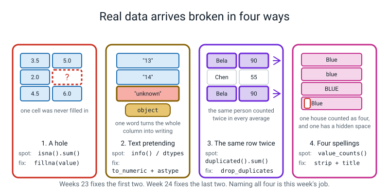
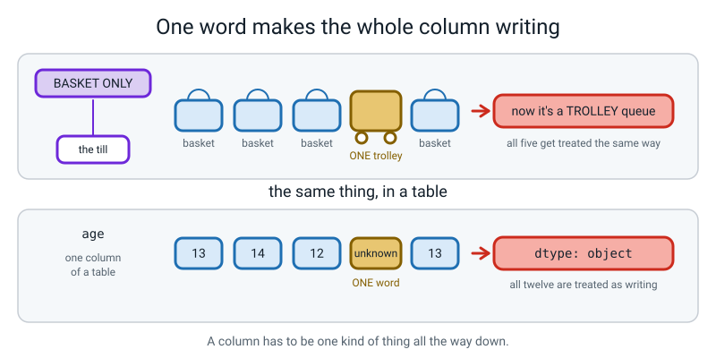
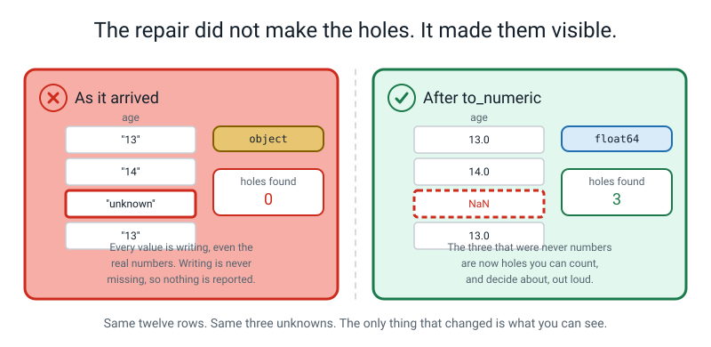
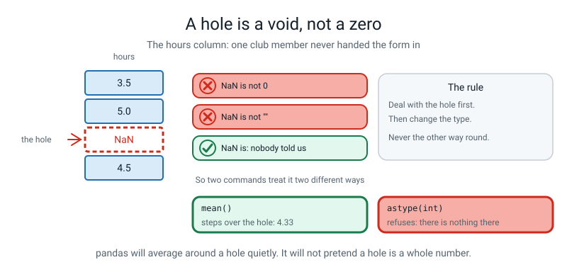
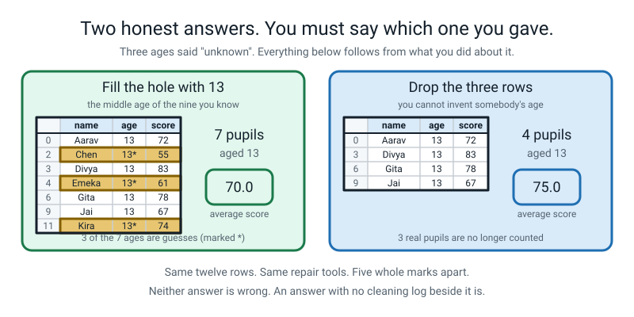
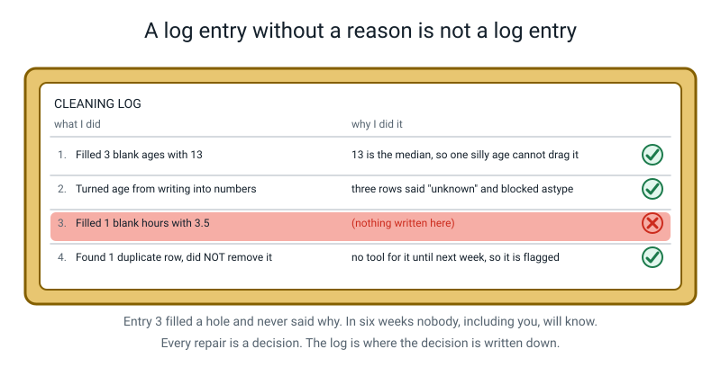
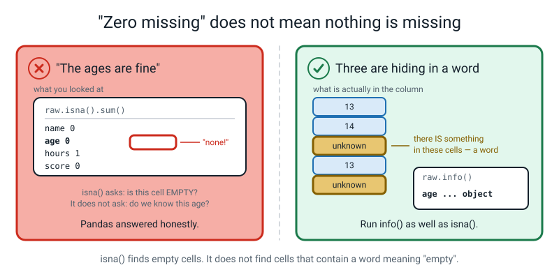
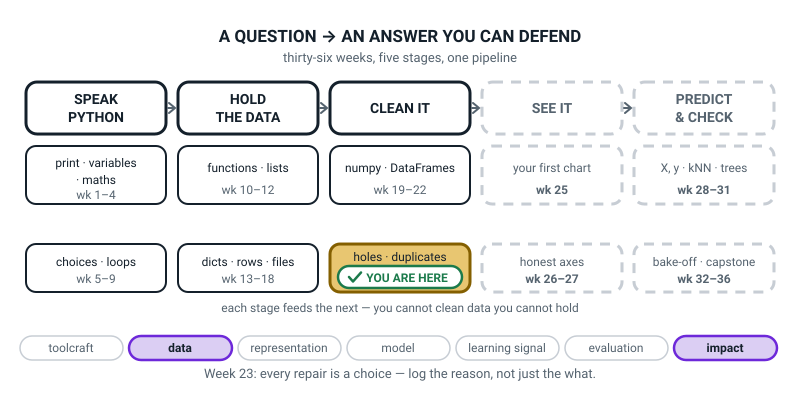
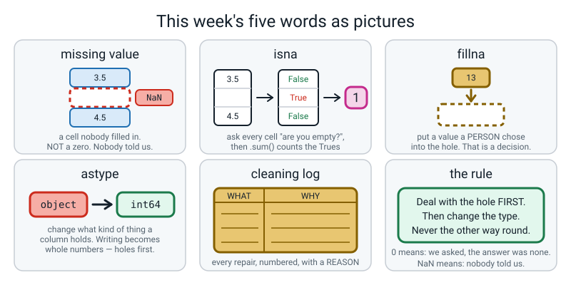

# Week 23 — Holes, Text-That-Should-Be-Numbers, and Duplicates

[⬅ Week 22](week-22.md) · [Course Home](../README.md) · [Next ➡](week-24.md) · [Workbook](../workbook/week-23.md)

---

> ### This week in one sentence
> **Real data arrives broken in four predictable ways, each one has a named fix — and because every fix changes the answer, every fix has to be written down with a reason.**
>
> **By the end of this chapter you will be able to:**
> - **Load a CSV** into a DataFrame and **write one back out**
> - **Count the missing values in every column** and say the number out loud
> - **Fill a hole**, and record in writing what you filled it with **and why**
> - **Force a column to the right type** and explain what was blocking it
> - **Name all four ways data arrives broken**, from memory
>
> **New syntax:** `pd.read_csv()` / `df.to_csv()` · `df.isna().sum()` · `df["c"].fillna(v)` · `df["c"].astype(int)`
>
> **Reading time:** about 40 minutes. **Homework:** about 60 minutes.

---

## 🪝 Start Here

This section shows you messy data on paper, before any code, so you can see what the rest of the week is for.

Here is a real club sign-up sheet. It is not a tidy one made up for a lesson. It is the sort you get when a class of twelve-year-olds fills one in at lunchtime on a Tuesday.

```text
        CHESS CLUB SIGN-UP
   Name          Age     House
   Aarav          13     red
   Bela           14     Red
   Chen         dunno    BLUE
   Divya          13     blue
   Emeka         ---     Green
   Bela           14     Red
   Kira        not sure   Red
```

Be the computer for a minute. Here is the simplest question anybody could ask about that sheet.

> **What is the average age of the chess club?**

Start adding. 13 plus 14 plus... and then you stop, because three of them have no age.

So what do you do? Be specific, because "work it out" is not an instruction a computer can follow.

Most people suggest four things, roughly in this order:

- *put 13 in*
- *leave them out*
- *go and ask them*
- *put 0*

Try `put 0`. If Chen, Emeka and Kira are all zero years old, the club's average age is (13 + 14 + 0 + 13 + 0 + 14 + 0) ÷ 7 = **7.7 years old.** That is a club of seven-year-olds, and nobody in the room is seven.

> **Zero is not "I don't know". Zero is a number, and it is a wrong one.** "I don't know" is not a number at all, and that turns out to matter enormously.

Now look at the sheet again and find everything *else* that is wrong with it. Take your time. There are four things, and once you have found them you have found the whole list.

1. **Three ages are missing** — and written three different ways: `dunno`, `---`, `not sure`.
2. **Bela is on there twice.**
3. **`red`, `Red`, `BLUE`, `blue`, `Green`** — how many houses is that? Two? Three? Five?
4. And you cannot tell whether `blue` and `BLUE` are meant to be the same house.


*Figure 23.1 — This week fixes the first two. Week 24 fixes the last two. Naming all four is this week's job.*

Four things. Here is the good news: real data breaks in about four ways, they are the four on that sheet, and every one has a name and a fix.

The fixes are the easy part. Here is the hard part, and it is the actual lesson.

> **Every fix changes the answer.** If you write 13 in for Chen, you have invented a fact. Not a lie exactly, but an invention. In six weeks, when somebody looks at your average and asks *"is that real?"*, you need to be able to say what you did and why.

So this week you get a second sheet of paper, and it is the more important one. It has two columns: **WHAT I DID** and **WHY I DID IT**. The WHY column is deliberately wider.

---

## 🧠 The Big Idea

This section explains the five ideas behind the week, one at a time, with small pieces of code to look at.

> **📌 About the code in this section.** The blocks below are **illustrations, not files**. They show you the shape of one idea, and each one carries on from the one above it — the `import` lines and the data are typed once, in the first block that needs them. **The complete, runnable file is in 💻 Type This.** If you copy a block from this section on its own and Python says `NameError`, that is why, and nothing is broken.

### 1. One word ruins a whole column

**The plain explanation.** Every table you have used so far, you typed yourself. So every age was a number, every house was spelled the same way every time, and no cell was empty.

That is not what data is like. Real data is collected by tired people on paper forms, typed in by somebody else, and exported by a program that made its own decisions along the way.

Here is the fact that surprises everybody first. A column in pandas has to be **one kind of thing all the way down**. Nine perfectly good numbers and one word is not "a column of numbers with one word in it". It is a column of **writing**, all twelve cells of it.

> **`object`** — pandas's word for *writing*, or *a mixture I have given up describing*.

**The analogy.** Think of a shop till marked **BASKET ONLY**. One person turns up with a trolley, and now the whole queue has to be handled as a trolley queue. Not just that person. Everybody.


*Figure 23.2 — One trolley, and the whole queue changes. One word, and the whole column becomes writing.*

**An example.** Here is the club register, loaded from a file. It has twelve rows and six columns.

```text
          name      age  house   club  hours  score
0   Aarav Shah       13    red  chess    3.5     72
1     Bela Roy       14    Red  music    5.0     90
2      Chen Wu  unknown   BLUE  chess    2.0     55
3   Divya Nair       13  blue     art    NaN     83
4    Emeka Obi  unknown  Green  music    4.5     61
5   Farah Aziz       12  green  chess    6.0     95
6   Gita Menon       13   Blue    art    1.5     78
7   Hugo Silva       14    RED  music    0.5     45
8     Ivy Chen       12   Blue  chess    4.0     88
9   Jai Kapoor       13  green    art    3.5     67
10    Bela Roy       14    Red  music    5.0     90
11    Kira Das  unknown    Red  chess    3.0     74
```

All four problems from the sign-up sheet are in that printout. Point at each one with your finger before you read on.

- `NaN` in row 3's `hours` — **a hole**. That is pandas's way of printing "nothing was recorded here".
- `unknown` three times in `age` — **text pretending to be numbers**.
- Rows 1 and 10, both `Bela Roy`, identical in every column — **the same row twice**.
- `red`, `Red`, `RED`, `BLUE`, `blue `, ` Blue`, `Blue`, `green`, `Green` — **nine spellings of three houses**.

### 2. The health report, and the hole count that tells the truth without helping

**The plain explanation.** One command tells you the state of every column. There is a right way to read it: four steps, in order, out loud, every time.

Run this line on the `raw` table:

```python
raw.info()
```

```text
<class 'pandas.core.frame.DataFrame'>
RangeIndex: 12 entries, 0 to 11
Data columns (total 6 columns):
 #   Column  Non-Null Count  Dtype  
---  ------  --------------  -----  
 0   name    12 non-null     object 
 1   age     12 non-null     object 
 2   house   12 non-null     object 
 3   club    12 non-null     object 
 4   hours   11 non-null     float64
 5   score   12 non-null     int64  
dtypes: float64(1), int64(1), object(4)
memory usage: 704.0+ bytes
```

There is **no `print`** on that line, because `info` prints for itself. Keep the round brackets: `info()`, not `info`.

Read the report in four steps.

1. **`12 entries`** — twelve rows. *Is that what I expected?* Here, yes.
2. **The `Non-Null Count` column.** *Non-null* means "has something in it". `hours` says **11 non-null out of 12** — one hole. Everything else says 12.
3. **The `Dtype` column.** `score` is `int64`, whole numbers — fine. `hours` is `float64`, decimals — fine. And **`age` is `object`.**
4. **`object` means writing.** So say the whole sentence: *"pandas thinks the ages are writing, not numbers."*

That seems unfair, because **nine of the twelve ages are perfectly good numbers.** But three of them say `unknown`, and `unknown` is a word. §1 explains the rest: one trolley, whole queue.

> **⚠️ Watch out:** `object` is only a problem when you **expected numbers**. `name` is `object` too, and that is exactly right — names *are* writing. A student who has learnt "object is bad" has learnt the wrong thing.

**Now count the holes.** Two new words first.

> **missing value** — a cell where nobody put anything. Pandas prints it as `NaN`.

> **`NaN`** — short for *Not a Number*. It is pandas's marker for *nothing was recorded here*.

This line counts the holes in every column:

```python
print(raw.isna().sum())
```

```text
name     0
age      0
house    0
club     0
hours    1
score    0
dtype: int64
```

Read it inside out. `raw.isna()` goes through **every single cell** and asks *"is this one missing?"*. It hands back a table the same shape as the original, full of `True` and `False`.

Then `.sum()` adds up each column. Because `True` counts as 1 and `False` counts as 0, the sum is **how many holes are in that column**.

Now the trap, which is the whole reason you run this before repairing anything. Read the `age` line.

It says **zero missing.** But three rows say `unknown`! Are those ages not missing?

They are missing **in real life** and not missing **to pandas**, because there really *is* something in those cells. The word `unknown` is a perfectly good piece of writing. Pandas is not lying to you. It answered exactly the question you asked.

> **The rule, and write it somewhere you will see it again: `isna()` finds *empty* cells. It does not find cells that contain a word meaning "empty".**

That is why you run `info()` **and** `isna()`. `info()` catches the disguised holes by showing you `object` where you wanted a number. `isna()` catches the honest ones.

So how do you turn the disguised ones into countable ones? Type this, which repairs a copy of the table:

```python
clean = raw.copy()                                              # repairs go on a copy
clean["age"] = pd.to_numeric(clean["age"], errors="coerce")      # words -> holes
print(clean.isna().sum())
```

```text
name     0
age      3
house    0
club     0
hours    1
score    0
dtype: int64
```

**`age` went from 0 missing to 3 missing.** Did we just break the file?

No. There were always three ages nobody knew. They were hiding inside a word, where nothing could count them. All `to_numeric` did was make them countable, and so something you can talk about out loud.

> **The sentence of the week: the repair did not make the holes. It made them visible.**


*Figure 23.3 — Same twelve rows. Same three unknowns. The only thing that changed is what you can see.*

### 3. `NaN` is not zero — and holes come before types

**The plain explanation.** Get this one wrong and every average you compute for the rest of the course is wrong. Four numbers are enough to show why.

Type this small example. It makes a column of four numbers with one hole in it:

```python
import pandas as pd

hours = pd.Series([3.5, 5.0, None, 4.5])   # a single column with a hole in it
print(hours)
print("mean:", hours.mean())
```

```text
0    3.5
1    5.0
2    NaN
3    4.5
dtype: float64
mean: 4.333333333333333
```

**3.5 + 5.0 + 4.5 = 13.0, and 13.0 ÷ 3 = 4.333.** Pandas **stepped over the hole**: it added the three real numbers and divided by **three**, not four. It did not ask, and it did not warn you.

Now what if the hole were a zero? This line fills the hole with a zero before taking the mean:

```python
print("if the hole were 0:", hours.fillna(0).mean())
```

```text
if the hole were 0: 3.25
```

**4.33 against 3.25. Same four cells.** Filling with zero invented a club member who did nothing at all.

> **`NaN` is not `0`. `NaN` is not `""`. `NaN` means *nobody told us*. Zero means *we asked, and the answer was none*.** Those are different facts, and they give different answers.

**The analogy.** A blank on a survey and a zero on a survey are completely different pieces of information. "How many pets do you have?" — someone who wrote **0** has told you something. Someone who left it blank has told you nothing at all, and might have nine cats.


*Figure 23.4 — pandas will average around a hole quietly. It will not pretend a hole is a whole number.*

Pandas will happily average around a hole. Now ask it for whole numbers instead:

```python
print(hours.astype(int))
```

```text
IntCastingNaNError: Cannot convert non-finite values (NA or inf) to integer
```

It refuses. It will average round a hole, but it will **not pretend a hole is a whole number**. That refusal tells you the order to do everything in.

> **Deal with the hole FIRST. Then change the type. Never the other way round.**

**An example of the order mattering.** Try `astype(int)` on the `age` column while the word is still in it. This is a deliberate mistake:

```python
clean = raw.copy()
clean["age"] = clean["age"].astype(int)
```

```text
ValueError: invalid literal for int() with base 10: 'unknown'
```

Read that message. It is unusually helpful. *"Invalid literal for int()"* means *"I tried to turn a piece of writing into a whole number, and this particular piece of writing is not one."*

Then it tells you **exactly which one**, in quotes: `'unknown'`. Python has handed you the culprit.

So the full repair is three steps, in this order. Type them on a fresh copy:

```python
clean = raw.copy()
clean["age"] = pd.to_numeric(clean["age"], errors="coerce")   # 1. words -> holes
clean["age"] = clean["age"].fillna(13)                        # 2. fill the holes
clean["age"] = clean["age"].astype(int)                       # 3. NOW change the type
print(clean["age"].head(5))
```

```text
0    13
1    14
2    13
3    13
4    13
Name: age, dtype: int64
```

- `pd.to_numeric(column, errors="coerce")` — turn everything you can into a number, and **turn anything you cannot into a hole instead of crashing**. "Coerce" means "force it". Without that word, `to_numeric` stops dead at `unknown` exactly like `astype` did.
- `fillna(13)` — put 13 wherever there is a hole in this column, and leave everything else alone.
- `astype(int)` — whole numbers. **This only works now**, because the holes have gone. Run the same line one step earlier and you get `IntCastingNaNError`.

> **⚠️ Watch out:** the `clean["age"] = ` on the **left** of every one of those three lines is not optional. `fillna`, `to_numeric` and `astype` all hand you back a **repaired copy**, exactly the way `sort_values` did last week. Without the assignment, nothing changes and **nothing warns you**. That is this week's silent bug, and it is the third week running for the same shape of mistake.

One more thing surprises people. After step 1 the column's dtype is `float64`, which means decimals, not whole numbers. Why? **Because a column with any `NaN` in it cannot be whole numbers.**

An ordinary whole-number column (`int64`) has no value that means "missing". So pandas has to use decimals, where `NaN` is allowed. It is not a mistake to fix. It is a stage you pass through.

### 4. Fill or drop? Two honest answers, five marks apart

**The plain explanation.** Three ages are unknown. There are two honest things you can do, and **there is no right answer.** That is not a cop-out. It is the actual content of this week.

**Option A — fill them in with a stand-in.** These two lines print the median and the mean of the ages we know:

```python
print(clean["age"].median())      # the middle of the nine we know
print(clean["age"].mean())        # the average of the nine we know
```

```text
13.0
13.11111111111111
```

**Median or mean?** Use the **median**, for two reasons.

1. This is Week 3's argument doing real work. If somebody's finger slipped and typed 130, the *mean* would run off to nearly 25 and the *median* would not move at all.
2. You can see the second reason on the screen. **The mean is 13.111…, and nobody is 13.111 years old.** The median is an age somebody actually is.

**Option B — throw those three rows away.** This block drops the rows whose age is a hole, then prints the labels that are left:

```python
dropped = raw.copy()                                              # a fresh copy
dropped["age"] = pd.to_numeric(dropped["age"], errors="coerce")   # words -> holes
dropped = dropped.dropna(subset=["age"])                          # holes -> gone
dropped["age"] = dropped["age"].astype(int)
print(dropped.index.tolist())
```

```text
[0, 1, 3, 5, 6, 7, 8, 9, 10]
```

- `dropna(subset=["age"])` — delete any row whose `age` is a hole. **`subset=["age"]` means "only look at that column"** — without it, a hole *anywhere* in a row would cost you the whole row.
- Nine rows survive, and they keep their original labels: `0, 1, 3, 5, 6, 7, 8, 9, 10`. Rows 2, 4 and 11 are gone. **That is Week 22's fact again — dropping keeps the labels.**

Now ask **one** question of both versions: *"what is the average score of the 13-year-olds?"* This program builds both versions from the raw file and prints each answer:

```python
import pandas as pd

raw = pd.read_csv("club_raw.csv")

filled = raw.copy()                                             # option A
filled["age"] = pd.to_numeric(filled["age"], errors="coerce")
filled["age"] = filled["age"].fillna(13).astype(int)

dropped = raw.copy()                                            # option B
dropped["age"] = pd.to_numeric(dropped["age"], errors="coerce")
dropped = dropped.dropna(subset=["age"])
dropped["age"] = dropped["age"].astype(int)

print("filled :", len(filled[filled["age"] == 13]), "pupils,",
      filled[filled["age"] == 13]["score"].mean())
print("dropped:", len(dropped[dropped["age"] == 13]), "pupils,",
      dropped[dropped["age"] == 13]["score"].mean())
```

```text
filled : 7 pupils, 70.0
dropped: 4 pupils, 75.0
```

**Seventy against seventy-five.** Same file, same tools, same question. Five whole marks apart, and both numbers are honest.

Check the arithmetic yourself, on paper:

- **Option B:** 72 + 83 + 78 + 67 = **300**, and 300 ÷ 4 = **75.0** ✔
- **Option A:** 300 + 55 + 61 + 74 = **490**, and 490 ÷ 7 = **70.0** ✔

| | Fill with the median | Drop the rows |
|---|---|---|
| Keeps every row | ✅ 12 rows | ❌ 9 rows |
| Invents facts | ⚠️ yes — 3 ages are now guesses | ✅ no |
| Answer to "average score at 13" | **70.0**, from 7 pupils | **75.0**, from 4 pupils |
| Good when | the missing column is **not** what you are asking about | the missing column **is** what you are asking about |


*Figure 23.5 — Neither answer is wrong. An answer with no cleaning log beside it is.*

> **📌 Remember: never fill a column with a guess and then make that column the subject of your question.** This rule will help you in Week 24 and again in the capstone. Here we filled `age` and then asked a question **about age**. That is the wrong order, and it moved the answer by five marks.

### 5. The cleaning log, and why an entry with no reason is worthless

**The plain explanation.** One new word.

> **cleaning log** — a written, numbered record of every change you made to the raw data, and **the reason for each one**.

Here is why it is not optional. When you report *"the 13-year-olds average 70"*, three different things could be behind that number:

- The 13-year-olds really average 70.
- They average 70 **because three unknown ages were filled with 13**, and those three children happen to score badly.
- They average 70 **because the two top scorers were dropped** for having no recorded age.

The number is identical in all three cases. Only the log tells them apart.

**The analogy.** A log is the working-out in a maths exam. The answer alone earns you almost nothing, because nobody can tell whether you understood it or guessed it.

This is not a school rule invented to make you write more. **Real scientific papers have a methods section for exactly this reason.** It lets somebody else see what was done to the data before a conclusion was drawn from it.

A good entry has three parts: what you did, how many cells it touched, and why. Here is the log for the club register:

```text
CLEANING LOG - club_raw.csv, 12 rows
  1. Turned age from writing into numbers with to_numeric(errors="coerce")
     - three rows said "unknown", and that one word made the whole column
       object, which blocked astype(int).
  2. Filled 3 missing ages with 13 - 13 is the median of the 9 ages we know,
     and the median is not dragged around by one silly value. WARNING: those
     3 ages are guesses now, not measurements. Do not use this column to
     answer questions about age.
  3. Made age whole numbers with astype(int) - nobody is 13.0 years old.
  4. Filled 1 missing hours with 3.5, the median of the 11 we know - Divya
     was on the trip, so 0 would have been a lie.
  5. Found 1 duplicate row (Bela Roy, twice, identical) - NOT removed. No
     tool for it until next week, so it is flagged here so it is not
     forgotten.
  6. Found 9 spellings of 3 houses - NOT fixed. Next week's job.
```

**Entries 5 and 6 are the ones that make this a real log rather than a chore.** They record something *found and deliberately not fixed*.

> **A log that only lists fixes is a to-do list. A log that also lists known, unfixed problems is a piece of honest work.**


*Figure 23.6 — Every repair is a decision. The log is where the decision is written down.*

> **⚠️ Watch out:** a WHAT with no WHY, from the very first entry. *"Filled 1 blank hours with 3.5."* Filled with what, and why 3.5? In six weeks nobody, you least of all, will be able to say. **Fill in the WHY before you write the next line.**

---

## 💻 Type This

This section walks you through writing the broken file, then repairing it step by step with a log. Everything goes in your `level2` folder. This week you need a **data file** before you need a program.

### Step 0 — make the broken file

You cannot practise repairing data without broken data, so the first job is to write some. Make a file called `make_club_data.py` and run it **once**.

```python
# make_club_data.py - run this ONCE. It writes the broken file for Week 23.
raw_text = """name,age,house,club,hours,score
Aarav Shah,13,red,chess,3.5,72
Bela Roy,14,Red,music,5.0,90
Chen Wu,unknown,BLUE,chess,2.0,55
Divya Nair,13,blue ,art,,83
Emeka Obi,unknown,Green,music,4.5,61
Farah Aziz,12,green,chess,6.0,95
Gita Menon,13, Blue,art,1.5,78
Hugo Silva,14,RED,music,0.5,45
Ivy Chen,12,Blue,chess,4.0,88
Jai Kapoor,13,green,art,3.5,67
Bela Roy,14,Red,music,5.0,90
Kira Das,unknown,Red,chess,3.0,74
"""

with open("club_raw.csv", "w") as f:
    f.write(raw_text)

print("club_raw.csv written")
```

```text
club_raw.csv written
```

`with open(path, "w") as f:` is Week 16's file writing, and `"""triple quotes"""` let a string run over many lines.

Now open `club_raw.csv` in a plain text editor and look at it with your own eyes. It is worth doing exactly once.

- Divya Nair's line ends `art,,83`, with **two commas in a row.** That is what an empty cell looks like in a CSV: nothing between the commas.
- Divya's house is `blue ` with a space **after** it, and Gita Menon's is ` Blue` with a space **before** it. You will not be able to see those. Remember they are there, because they become next week's whole lesson.

### Step 1 — read it in and look at it

Make a new file called `clean_club.py` and type this first part:

```python
# clean_club.py - Week 23. Find the breaks, repair two of them, log everything.
import pandas as pd

raw = pd.read_csv("club_raw.csv")        # the untouched original
clean = raw.copy()                        # every repair happens on the copy

print("--- STEP 1: what have we got?")
print(raw)
raw.info()
```

```text
--- STEP 1: what have we got?
          name      age  house   club  hours  score
0   Aarav Shah       13    red  chess    3.5     72
1     Bela Roy       14    Red  music    5.0     90
2      Chen Wu  unknown   BLUE  chess    2.0     55
3   Divya Nair       13  blue     art    NaN     83
4    Emeka Obi  unknown  Green  music    4.5     61
5   Farah Aziz       12  green  chess    6.0     95
6   Gita Menon       13   Blue    art    1.5     78
7   Hugo Silva       14    RED  music    0.5     45
8     Ivy Chen       12   Blue  chess    4.0     88
9   Jai Kapoor       13  green    art    3.5     67
10    Bela Roy       14    Red  music    5.0     90
11    Kira Das  unknown    Red  chess    3.0     74
<class 'pandas.core.frame.DataFrame'>
RangeIndex: 12 entries, 0 to 11
Data columns (total 6 columns):
 #   Column  Non-Null Count  Dtype  
---  ------  --------------  -----  
 0   name    12 non-null     object 
 1   age     12 non-null     object 
 2   house   12 non-null     object 
 3   club    12 non-null     object 
 4   hours   11 non-null     float64
 5   score   12 non-null     int64  
dtypes: float64(1), int64(1), object(4)
memory usage: 704.0+ bytes
```

Two lines to say out loud about what you just typed.

`pd.read_csv("club_raw.csv")` opens that file, reads the **first line as the column names**, and reads every line after it as a row. CSV means *comma-separated values*: a plain text file where commas mark the edges of the cells. The file has to be in the same folder as the Python file, or `read_csv` will not find it. That is the most common way this lesson goes wrong.

`raw = ...` is a **promise to yourself**: *this is the untouched original and I will not modify it.* Every clean-up happens on `clean`. That habit costs one line and saves whole afternoons, because if a repair turns out to be wrong you can start again.

### Step 2 — count the holes, and be suspicious of the answer

Add this to the end of `clean_club.py`:

```python
print("--- STEP 2: how many holes?")
print(raw.isna().sum())
```

```text
--- STEP 2: how many holes?
name     0
age      0
house    0
club     0
hours    1
score    0
dtype: int64
```

`hours` says 1: we saw that `NaN`. `age` says 0, even though three rows say `unknown` and we can see them. Hold both facts at once: **pandas is right, and the ages are missing.**

### Step 3 — make the hidden holes visible

Add this to the end of the file:

```python
print("--- STEP 3: make the hidden holes visible")
clean["age"] = pd.to_numeric(clean["age"], errors="coerce")
print(clean.isna().sum())
```

```text
--- STEP 3: make the hidden holes visible
name     0
age      3
house    0
club     0
hours    1
score    0
dtype: int64
```

**Zero became three.** Nothing broke. Three ages were always unknown, and now they are countable.

Write log entry 1 before you type the next line. Not afterwards, before, and on paper. Here is what a finished entry looks like:

```text
1 | Turned age from writing into  | three rows said "unknown", and that one
  | numbers with to_numeric       | word made the whole column object, which
  | (errors="coerce")             | blocked astype(int). This made 3 hidden
  |                               | holes countable - it did not create them.
```

### Step 4 — the middle age of the ones you know

Add this to the end of the file:

```python
print("--- STEP 4: the middle age of the ones we know")
print(clean["age"].median())
```

```text
--- STEP 4: the middle age of the ones we know
13.0
```

There are nine known ages, and 13 sits in the middle of them. That is the number you are about to put into three cells. Putting it there is a decision, so it needs a line on the log.

### Step 5 — fill, then convert. In that order.

Add this to the end of the file:

```python
print("--- STEP 5: fill, then convert. In that order.")
clean["age"] = clean["age"].fillna(13)
clean["age"] = clean["age"].astype(int)
clean["hours"] = clean["hours"].fillna(3.5)
print(clean.isna().sum())
```

```text
--- STEP 5: fill, then convert. In that order.
name     0
age      0
house    0
club     0
hours    0
score    0
dtype: int64
```

**Zeros all the way down.** `astype(int)` worked here, and the exact same line would have crashed one step earlier.

> **💡 Try this:** delete the `fillna` line, run it, and read the `IntCastingNaNError`. Then put it back. It takes ten seconds, and the boxed rule stops being something you were told and becomes something you saw.

Two more log lines. Entry 2 needs a warning in it.

```text
2 | Filled 3 missing ages with 13 | 13 is the median of the 9 we know, and the
  |                              | median isn't dragged about by one silly value.
  |                              | WARNING: those 3 ages are GUESSES now.
3 | astype(int) on age           | nobody is 13.0 years old on a register
4 | Filled 1 missing hours with  | 3.5 is the median of the 11 we know. NOT 0:
  | 3.5                          | Divya was on the trip, so 0 would be a lie.
```

### Step 6 — look at what you repaired

Add this to the end of the file:

```python
print("--- STEP 6: the repaired table")
print(clean)
```

```text
--- STEP 6: the repaired table
          name  age  house   club  hours  score
0   Aarav Shah   13    red  chess    3.5     72
1     Bela Roy   14    Red  music    5.0     90
2      Chen Wu   13   BLUE  chess    2.0     55
3   Divya Nair   13  blue     art    3.5     83
4    Emeka Obi   13  Green  music    4.5     61
5   Farah Aziz   12  green  chess    6.0     95
6   Gita Menon   13   Blue    art    1.5     78
7   Hugo Silva   14    RED  music    0.5     45
8     Ivy Chen   12   Blue  chess    4.0     88
9   Jai Kapoor   13  green    art    3.5     67
10    Bela Roy   14    Red  music    5.0     90
11    Kira Das   13    Red  chess    3.0     74
```

Look at rows 2, 4 and 11. They say `13` now, and they look as solid and factual as row 0's 13. **That is why the log exists:** nothing on the screen tells a measurement from a repair.

Two problems are still sitting there in plain sight. Bela Roy is on rows 1 and 10, and the houses are still spelled nine ways. You have no tools for either until next week, so they get log entries saying **found, not fixed**:

```text
5 | Found 1 duplicate row (Bela   | no tool for it until next week, so it is
  | Roy, twice, identical)        | flagged here so it isn't forgotten. Every
  | - NOT removed                 | field matching means a typing slip.
6 | Found 9 spellings of 3 houses | next week's job
  | - NOT fixed                   |
```

### Step 7 — save it out under a NEW name

Add this to the end of the file:

```python
print("--- STEP 7: save it under a NEW name")
clean.to_csv("club_clean.csv", index=False)
print(pd.read_csv("club_clean.csv").dtypes)
```

```text
--- STEP 7: save it under a NEW name
name      object
age        int64
house     object
club      object
hours    float64
score      int64
dtype: object
```

- `to_csv("club_clean.csv")` — write this table out as a comma-separated file.
- **`index=False` matters and is easy to forget.** Without it, pandas writes the row labels out as an extra unnamed first column, and when you read the file back you get a mystery column called `Unnamed: 0`. Nine times out of ten your row labels are just `0, 1, 2, …` and worth nothing.
- **Write to a NEW filename.** `club_raw.csv` must survive untouched, because if your log turns out to be wrong you need to be able to start again.

Look at the result: `age` is `int64` on the way back in. That is the **proof** the repair was real and not just something that looked right on the screen.

### The complete finished program

Here is the whole of `clean_club.py` in one piece, to check your file against.
```python
# clean_club.py - Week 23. Find the breaks, repair two of them, log everything.
import pandas as pd

raw = pd.read_csv("club_raw.csv")        # the untouched original
clean = raw.copy()                        # every repair happens on the copy

print("--- STEP 1: what have we got?")
print(raw)
raw.info()

print("--- STEP 2: how many holes?")
print(raw.isna().sum())

print("--- STEP 3: make the hidden holes visible")
clean["age"] = pd.to_numeric(clean["age"], errors="coerce")
print(clean.isna().sum())

print("--- STEP 4: the middle age of the ones we know")
print(clean["age"].median())

print("--- STEP 5: fill, then convert. In that order.")
clean["age"] = clean["age"].fillna(13)
clean["age"] = clean["age"].astype(int)
clean["hours"] = clean["hours"].fillna(3.5)
print(clean.isna().sum())

print("--- STEP 6: the repaired table")
print(clean)

print("--- STEP 7: save it under a NEW name")
clean.to_csv("club_clean.csv", index=False)
print(pd.read_csv("club_clean.csv").dtypes)
```

---

## 🔍 Worked Examples

Three complete programs. Each one **writes its own broken file first**, so you can run them from nothing. Predict every output before you run it.

### Worked Example 1 — A canteen order sheet (food)

```python
"""canteen23.py - a canteen order sheet, broken in two of the four ways."""

import pandas as pd

# The sheet, typed exactly as the canteen wrote it. Two prices say "unpriced"
# and one quantity was never filled in at all.
orders_text = """item,price,quantity
Samosa,15,8
Vada Pav,20,5
Juice,unpriced,12
Sandwich,35,
Banana,10,20
Cake,unpriced,3
"""

with open("canteen_raw.csv", "w") as f:      # the lesson creates its own file
    f.write(orders_text)
print("canteen_raw.csv written")

raw = pd.read_csv("canteen_raw.csv")         # read it back in
clean = raw.copy()                            # repairs happen on the copy

print("--- what arrived")
print(raw)
raw.info()

print("--- how many holes does pandas admit to?")
print(raw.isna().sum())

print("--- turn the words into countable holes")
clean["price"] = pd.to_numeric(clean["price"], errors="coerce")
print(clean.isna().sum())

print("--- the middle values of the ones we know")
print("median price   :", clean["price"].median())
print("median quantity:", clean["quantity"].median())

print("--- fill, then convert. In that order.")
clean["price"] = clean["price"].fillna(17.5).astype(int)
clean["quantity"] = clean["quantity"].fillna(8).astype(int)
print(clean)
print(clean.dtypes)
```

Real output:

```text
canteen_raw.csv written
--- what arrived
       item     price  quantity
0    Samosa        15       8.0
1  Vada Pav        20       5.0
2     Juice  unpriced      12.0
3  Sandwich        35       NaN
4    Banana        10      20.0
5      Cake  unpriced       3.0
<class 'pandas.core.frame.DataFrame'>
RangeIndex: 6 entries, 0 to 5
Data columns (total 3 columns):
 #   Column    Non-Null Count  Dtype  
---  ------    --------------  -----  
 0   item      6 non-null      object 
 1   price     6 non-null      object 
 2   quantity  5 non-null      float64
dtypes: float64(1), object(2)
memory usage: 272.0+ bytes
--- how many holes does pandas admit to?
item        0
price       0
quantity    1
dtype: int64
--- turn the words into countable holes
item        0
price       2
quantity    1
dtype: int64
--- the middle values of the ones we know
median price   : 17.5
median quantity: 8.0
--- fill, then convert. In that order.
       item  price  quantity
0    Samosa     15         8
1  Vada Pav     20         5
2     Juice     17        12
3  Sandwich     35         8
4    Banana     10        20
5      Cake     17         3
item        object
price        int64
quantity     int64
dtype: object
```

**Three things are worth noticing, and the third is a real trap.**

1. The `quantity` column arrived as **`float64` with one hole already visible**, because the cell was empty: `Sandwich,35,` with nothing after the last comma.
2. `price` arrived as **`object` with zero holes**, because those cells contain a word. Same table, two kinds of broken, and `info()` shows you both at once.
3. The Sandwich's missing quantity was filled with **8, the median, not 0**. Filling it with 0 would have claimed that nobody ordered a sandwich, when somebody just forgot to write the number down. That reason goes on the log.

The trap: the median price is 17.5, but the table says 17. `astype(int)` **chopped the decimal off, silently.** It did not round, so 17.9 would also become 17. Nothing errored, nothing warned you, and a price is now half a rupee lower than the number you chose. **That belongs on the log too**, and the honest fix is `round()` first if you care.

> **⚠️ Watch out:** pandas *does* recognise a short standard list of words as missing: an empty cell, and the literal `NA`, `N/A`, `n/a`, `NaN`, `nan`, `null`, `NULL`. Had the canteen written `n/a` instead of `unpriced`, the column would have arrived as `float64` with two holes already counted. It does not guess about anything else, because guessing on your behalf is how data gets silently corrupted.

### Worked Example 2 — A football team sheet (sport)

This one has the best distinction of the week in it: **one fill is a fact, and one fill is a guess.** Type and run this program:

```python
"""match23.py - a football team sheet. One fill is a fact. One is a guess."""

import pandas as pd

sheet_text = """player,minutes,goals,shots
Anaya,90,2,5
Bhavi,DNP,0,0
Chetan,75,1,4
Dia,90,0,3
Eshan,DNP,0,0
Fatima,60,,2
Gopi,90,3,7
Hari,45,0,1
"""

with open("match_raw.csv", "w") as f:
    f.write(sheet_text)
print("match_raw.csv written")

raw = pd.read_csv("match_raw.csv")

print("--- what arrived")
print(raw)
raw.info()

print("--- holes pandas can see")
print(raw.isna().sum())

print("--- make the DNPs countable")
clean = raw.copy()
clean["minutes"] = pd.to_numeric(clean["minutes"], errors="coerce")
print(clean.isna().sum())

print("--- REPAIR 1: DNP means 0 minutes. That is a FACT, not a guess.")
clean["minutes"] = clean["minutes"].fillna(0).astype(int)
print("average minutes over the whole squad:", round(clean["minutes"].mean(), 2))

print("--- Fatima's goals are a HOLE, not a zero. Two answers:")
print("leaving the hole  :", round(clean["goals"].mean(), 3), "from",
      clean["goals"].count(), "players")
print("filling it with 0 :", round(clean["goals"].fillna(0).mean(), 3), "from",
      len(clean), "players")

print("--- the honest version: only the players who actually played")
played = clean[clean["minutes"] > 0]
print(played[["player", "minutes", "goals", "shots"]])
print("players who played :", len(played))
print("average minutes    :", round(played["minutes"].mean(), 2))
print("average goals      :", round(played["goals"].mean(), 3), "from",
      played["goals"].count(), "players with a recorded goal count")
```

Real output:

```text
match_raw.csv written
--- what arrived
   player minutes  goals  shots
0   Anaya      90    2.0      5
1   Bhavi     DNP    0.0      0
2  Chetan      75    1.0      4
3     Dia      90    0.0      3
4   Eshan     DNP    0.0      0
5  Fatima      60    NaN      2
6    Gopi      90    3.0      7
7    Hari      45    0.0      1
<class 'pandas.core.frame.DataFrame'>
RangeIndex: 8 entries, 0 to 7
Data columns (total 4 columns):
 #   Column   Non-Null Count  Dtype  
---  ------   --------------  -----  
 0   player   8 non-null      object 
 1   minutes  8 non-null      object 
 2   goals    7 non-null      float64
 3   shots    8 non-null      int64  
dtypes: float64(1), int64(1), object(2)
memory usage: 384.0+ bytes
--- holes pandas can see
player     0
minutes    0
goals      1
shots      0
dtype: int64
--- make the DNPs countable
player     0
minutes    2
goals      1
shots      0
dtype: int64
--- REPAIR 1: DNP means 0 minutes. That is a FACT, not a guess.
average minutes over the whole squad: 56.25
--- Fatima's goals are a HOLE, not a zero. Two answers:
leaving the hole  : 0.857 from 7 players
filling it with 0 : 0.75 from 8 players
--- the honest version: only the players who actually played
   player  minutes  goals  shots
0   Anaya       90    2.0      5
2  Chetan       75    1.0      4
3     Dia       90    0.0      3
5  Fatima       60    NaN      2
6    Gopi       90    3.0      7
7    Hari       45    0.0      1
players who played : 6
average minutes    : 75.0
average goals      : 1.2 from 5 players with a recorded goal count
```

This is the most important distinction in the chapter, so read it slowly.

- **`DNP` → 0 minutes is a FACT.** DNP means *did not play*. Somebody who did not play was on the pitch for exactly zero minutes. Filling that hole with 0 invents nothing, and it needs one calm log line: *"DNP means did not play, so 0 minutes is a measurement, not a guess."*
- **Fatima's blank goals is a GUESS.** Nobody wrote her goal count down. Filling it with 0 **claims she scored none**, and that claim might be false: she played sixty minutes and had two shots. The squad's average goals goes from **0.857** to **0.75**, and the second number was invented by us, not by the match.

Look at the last line: `from 5 players`. Fatima's hole survived into the filtered table, so `played["goals"].mean()` is 1.2 from **five** goal counts, not six. Pandas stepped over the hole silently, exactly as it did in §3. Print the count beside the average and you can see it happen.

### Worked Example 3 — One spelling test (school)

```python
"""spelling23.py - one spelling test, three absences, and two honest averages."""

import pandas as pd

test_text = """name,mark,words_practised
Farah,17,40
Gopal,absent,10
Hina,19,50
Ismail,12,15
Jyoti,absent,45
Kabir,15,30
Lila,20,60
Manav,absent,5
"""

with open("spelling_raw.csv", "w") as f:
    f.write(test_text)
print("spelling_raw.csv written")

raw = pd.read_csv("spelling_raw.csv")
print("--- what arrived")
print(raw)
raw.info()

print("--- isna says:")
print(raw.isna().sum())

print("--- make the absences countable")
clean = raw.copy()
clean["mark"] = pd.to_numeric(clean["mark"], errors="coerce")
print(clean.isna().sum())

print("--- WHO is missing? Look before you decide.")
print(clean[clean["mark"].isna()][["name", "words_practised"]])

print("--- the middle mark of the five we know")
print("median:", clean["mark"].median())
print("mean  :", round(clean["mark"].mean(), 4))

print("--- OPTION A: fill the three absences with the median 17")
filled = clean.copy()
filled["mark"] = filled["mark"].fillna(17).astype(int)
print("class size    :", len(filled))
print("class average :", round(filled["mark"].mean(), 3))

print("--- OPTION B: drop the three absences")
dropped = clean.dropna(subset=["mark"]).copy()
dropped["mark"] = dropped["mark"].astype(int)
print("pupils counted:", len(dropped))
print("class average :", round(dropped["mark"].mean(), 3))
print("rows that survived:", dropped.index.tolist())

print("--- the question where the gap really shows")
print("A - filled :", len(filled[filled["words_practised"] < 20]),
      "pupils practised under 20 words, average mark",
      round(filled[filled["words_practised"] < 20]["mark"].mean(), 2))
print("B - dropped:", len(dropped[dropped["words_practised"] < 20]),
      "pupils practised under 20 words, average mark",
      round(dropped[dropped["words_practised"] < 20]["mark"].mean(), 2))
```

Real output:

```text
spelling_raw.csv written
--- what arrived
     name    mark  words_practised
0   Farah      17               40
1   Gopal  absent               10
2    Hina      19               50
3  Ismail      12               15
4   Jyoti  absent               45
5   Kabir      15               30
6    Lila      20               60
7   Manav  absent                5
<class 'pandas.core.frame.DataFrame'>
RangeIndex: 8 entries, 0 to 7
Data columns (total 3 columns):
 #   Column           Non-Null Count  Dtype 
---  ------           --------------  ----- 
 0   name             8 non-null      object
 1   mark             8 non-null      object
 2   words_practised  8 non-null      int64 
dtypes: int64(1), object(2)
memory usage: 320.0+ bytes
--- isna says:
name               0
mark               0
words_practised    0
dtype: int64
--- make the absences countable
name               0
mark               3
words_practised    0
dtype: int64
--- WHO is missing? Look before you decide.
    name  words_practised
1  Gopal               10
4  Jyoti               45
7  Manav                5
--- the middle mark of the five we know
median: 17.0
mean  : 16.6
--- OPTION A: fill the three absences with the median 17
class size    : 8
class average : 16.75
--- OPTION B: drop the three absences
pupils counted: 5
class average : 16.6
rows that survived: [0, 2, 3, 5, 6]
--- the question where the gap really shows
A - filled : 3 pupils practised under 20 words, average mark 15.33
B - dropped: 1 pupils practised under 20 words, average mark 12.0
```

Look at the two class averages: 16.75 and 16.6. They are almost identical. If you stopped there you might conclude that fill-versus-drop does not matter much. **Keep reading, because that conclusion is wrong.**

The line that matters is `WHO is missing?`, and you must run it before you decide anything. Gopal practised **10** words, Manav practised **5**, Jyoti practised **45**. Two of the three absent pupils are among the least-prepared in the class. **The missing data is not spread evenly.**

So ask a question that touches that pattern: *"what do the pupils who practised fewer than 20 words average?"* Version A says **15.33 from three pupils.** Version B says **12.0 from one pupil.** Those are three and a bit marks apart, from the same file.

Why? Filling put Gopal (17, invented) and Manav (17, invented) into the under-20-words group, and both of those 17s are **ours, not theirs**.

> **📌 Remember: missing data is often not random. Look at *whose* data is missing before you decide what to do about it.** If you fill the gaps without looking at whose gaps they are, you can invent a pattern that was never there.

---

## 🐞 When It Breaks

This section shows three errors you are likely to meet this week, what each message means, and how to fix it. Every message below came from really running a broken version of this week's code. Your line numbers will differ. The last line will not.

### Break 1 — the file is not where you are standing

```python
raw = pd.read_csv("reading.csv")
```

```text
Traceback (most recent call last):
  ...
FileNotFoundError: [Errno 2] No such file or directory: 'reading.csv'
```

**What Python is telling you.** *"There is no file by that name where I am standing."*

**The fix.** In the terminal, run `ls` (macOS and Linux) or `dir` (Windows) and read the real filename. Do this rather than guessing. The file is `reading_raw.csv`, not `reading.csv`. Filenames are case-sensitive and underscores count.

> **🐞 If you see this error:** it is almost always one of two things — a typo in the string, or the Python file sitting in a different folder from the CSV. Neither one is worth ten minutes of staring. `ls` settles it in four seconds.

### Break 2 — `astype(int)` on a column that still has words in it

```python
clean["age"] = clean["age"].astype(int)
```

```text
Traceback (most recent call last):
  ...
ValueError: invalid literal for int() with base 10: 'unknown'
```

**What Python is telling you.** Take it in two halves. *"Invalid literal for int()"* means **"I tried to turn a piece of writing into a whole number, and that piece of writing is not one."** Then it tells you **exactly which** piece of writing broke it, in quotes: `'unknown'`.

Python has handed you the culprit's name. Most errors do not.

**The fix.** Use `pd.to_numeric(col, errors="coerce")` first, then fill the holes, **then** `astype(int)`.

The near-miss version of the same bug catches people who remember `to_numeric` but not `coerce`:

```python
clean["age"] = pd.to_numeric(clean["age"])
```

```text
ValueError: Unable to parse string "unknown" at position 2
```

Without `errors="coerce"`, `to_numeric` stops dead at the first word, exactly like `astype` did. It even tells you which row (`position 2`).

### Break 3 — the repair that never happened

This code looks right. Run it:

```python
clean["hours"].fillna(3.5)
print(clean["hours"].isna().sum())
```

```text
1
```

There is no error here at all. Nothing red. And the hole is still there.

**What happened.** `fillna` does not repair your column. It **hands you back a repaired copy**, and you threw it away the instant the line finished. This is the same shape of bug as `sort_values` last week.

The fix is one `=`:

```python
clean["hours"] = clean["hours"].fillna(3.5)
print(clean["hours"].isna().sum())
```

```text
0
```

> **🐞 If there is no error message at all:** ask two questions. Each takes four seconds. **"Is there an `=` on the left?"** Almost every silent failure this week is one missing assignment. **"Run the count again."** After every `fillna`, `to_numeric` or `astype`, re-run `df.isna().sum()` or `df.info()`. Check the count, not whether it looks right.

### The whole clinic, for reference

Use this table to look up any message from the week.
| What you see | What it means | The fix |
|---|---|---|
| `FileNotFoundError: [Errno 2] No such file or directory: 'clubraw.csv'` | "No file by that name where I am standing." | `ls` in the terminal and read the real name. Case and underscores count |
| `ValueError: invalid literal for int() with base 10: 'unknown'` | "You asked me to turn writing into a whole number." | `to_numeric(errors="coerce")`, fill, **then** `astype(int)` |
| `ValueError: Unable to parse string "unknown" at position 2` | Same complaint, from `to_numeric`. | You forgot `errors="coerce"` |
| `IntCastingNaNError: Cannot convert non-finite values (NA or inf) to integer` | "There's a hole here and a hole is not a whole number." | Fill (or drop) **first**, then convert. This is the boxed rule |
| `KeyError: 'Age'` | "I have no column by that name." | A capital letter. The column is `age`. `print(df.columns.tolist())` and copy it exactly |
| `AttributeError: 'DataFrame' object has no attribute 'isnull_sum'` | "There is no command by that name." | It is **two** commands: `df.isna().sum()`. (`isnull` is the same command with another name) |
| `ValueError: Must specify a fill 'value' or 'method'.` | "Fill them with **what**?" | `fillna(13)`, or `fillna(df["age"].median())` |
| `ValueError: invalid literal for int() ...` **after** filling | Same message, later. | You filled with the word: `fillna("unknown")`. Fill a number column with a **number** |
| **No error, the hole is still there** | Nothing is wrong. `fillna` returned a copy. | `df["hours"] = df["hours"].fillna(3.5)`. Then re-run the count to prove it |
| **No error, still `object` after `to_numeric`** | Same missing assignment, one line earlier. | `df["age"] = pd.to_numeric(df["age"], errors="coerce")` |
| **No error, `isna()` says 0 missing ages** | Nothing is wrong. Those cells are not empty; they hold a word. | Run `info()` too. `object` where you expected a number is the tell |
| **No error, missing values went UP after a repair** | Nothing is wrong — this **is** the repair working. | Nothing to fix. Say the sentence: it made the holes visible, it did not make them |
| **No error, a column called `Unnamed: 0` appeared** | Nothing is wrong. Your row labels were saved as data. | `to_csv("out.csv", index=False)`, and write the file again |
| **No error, my average is different from a friend's** | Nothing is wrong with either program. | One of you filled and one dropped. **Compare cleaning logs, not code.** Whoever has no log cannot defend their number |
| `SettingWithCopyWarning: A value is trying to be set on a copy of a slice from a DataFrame` | "I'm not sure whether you meant to change the copy or the original." | Start with `clean = raw.copy()` and repair `clean`. That is why the copy line exists |

> **📌 Remember: half the bugs in data work are not errors.** They are repairs you thought you made and didn't, and answers that quietly changed because of a repair you forgot you made. The count and the log are how you catch both.

---

## 🎲 What We Did In Class

If you missed class, this section is the whole lesson in order. The first part needs a pencil, and the last part needs a sheet of paper more than a laptop.

### The sign-up sheet, on paper

A hand-written club sign-up sheet, deliberately awful, and one question: **"what is the average age of the chess club?"**

Then `put 0` was tried out loud, and the average fell off a cliff. **Zero is a number, and it is a wrong one.**

Then the whole class hunted for everything else wrong with the sheet, and found four things, which is the whole list. Then the second sheet of paper came out: the **cleaning log**, two columns, WHY deliberately wider than WHAT.

### Four lines on the board, up all lesson

These four lines stayed on the board for the whole lesson.
```text
1. a hole            ->  isna().sum()          ->  fillna
2. text pretending   ->  info() says object    ->  to_numeric, astype
3. the same row twice->  duplicated().sum()    ->  next week
4. four spellings    ->  value_counts()        ->  next week
```

### The raw file, looked at as text

`club_raw.csv` open in a plain text editor, with two things pointed at: `art,,83` — **two commas together is an empty cell** — and the space after `blue`, which nobody in the room could see.

### `info()` read in four steps, out loud

Twelve entries · `hours` 11 non-null out of 12 · `age` is `object` · **and `object` means writing.** Then the *why*, which the class had to find on the screen: three rows say `unknown`, and one word forces the whole column. The basket-only queue.

### `isna()`, and the number that was right and useless

`hours 1` — good. `age 0` — and three ages are visibly unknown. **Both facts are true at once.** `isna()` finds empty cells; it does not find cells containing a word that means empty.

### `NaN` is not zero, in four numbers

```text
mean: 4.333333333333333
if the hole were 0: 3.25
```

Then `astype(int)` on the same four numbers gave the `IntCastingNaNError`. Pandas will average round a hole but will not pretend a hole is a whole number. That gave the boxed rule: **deal with the hole first, then change the type.**

### Two deliberate mistakes

**Mistake one** was `astype(int)` while the word was still there: a `ValueError` that names the culprit `'unknown'` in quotes.

**Mistake two** was the silent one: `clean["hours"].fillna(3.5)` with nothing on the left of an `=`. **No error, and the hole count still said 1.** It was the third week running for the same shape of bug.

### The argument: fill or drop, both computed

One question on the board, **"what is the average score of the 13-year-olds?"**, answered twice.

```text
A - filled : 12 rows total, 7 pupils aged 13, average score 70.0
B - dropped:  9 rows total, 4 pupils aged 13, average score 75.0
```

Then six questions, in this order, with a pause after each:

1. How many thirteen-year-olds in A? → **7**
2. In B? → **4**
3. Which three extra people are in A? → **Chen Wu, Emeka Obi, Kira Das** — the three whose age nobody knows
4. So what did we do to them? → **decided they were 13**
5. And the two answers? → **70.0 and 75.0**
6. Which one is right? → **neither, on its own**

Then the hand-check: 72 + 83 + 78 + 67 = 300, ÷ 4 = **75.0**. Plus 55 + 61 + 74 = 490, ÷ 7 = **70.0**. **Five marks apart, in your own handwriting.**

Then the graded item: choose one, in pen, with a reason, and a log line naming the other answer.

### Naming all four from memory, board covered

A four-row grid to fill in from memory: *the problem · how you spot it · the named fix.* Then it was checked against the board.

---

## 💬 Talk About It

These three questions have no single right answer. Talk them through with a partner or a parent. Each has a hint to start you off.

**1. Why doesn't pandas just work out that `unknown` means missing?**

*Hint:* start by listing all the things people actually write in a cell they cannot fill in. You have already seen `unknown`, `dunno`, `not sure`, `---`, `not given`, `DNP`, `absent`. Add `?`, `TBD`, `999`, `no idea mate`.

Now imagine you had to write the rule that catches all of those and never catches a real answer. **Could `999` be a real answer?** (Of a step count, absolutely.) So the honest question is not "why doesn't pandas guess" but "what would go wrong if it did". The answer is that data would get silently corrupted in a way nobody could ever find.

Pandas *does* recognise a short standard list (an empty cell, `NA`, `n/a`, `null`, `NaN`). **Why is having a short list better than having a clever one?**

**2. Which is better, fill or drop?**

*Hint:* do not look for a rule, because there isn't one, and pretending otherwise is the mistake. Start from a different question: **what is the missing column *for*?**

If you are asking about scores and a few ages are missing, filling the ages costs you almost nothing. If you are asking a question **about age**, filling is close to fatal, because you are inventing the very thing you are measuring. That is the trap in this chapter, and it moved the answer five marks.

Now go one level up. Professional statisticians have argued about this for a century, and they have built much cleverer answers than either of ours. **All of those answers still require you to write down what you did.** So what is the actually professional part: the choice, or the written reason?

**3. Does the log have to be on paper? Couldn't it be comments in the code?**

*Hint:* be honest about both. In professional work it usually **is** in the code, as a list of strings built up as the program runs or a block comment at the top of the file. So paper is not the grown-up version.

But think about what paper physically does: the WHY column is **there**, and **empty**, and staring at you. In code it is far too easy to type `# filled the ages` and move on, because nothing is looking at you. So the real question is: **what is the paper for?** (Building the habit.) And how would you know when you were ready to move the log into the code? *(This course moves it in Week 34.)*

---

## ⚠️ Don't Get Tricked

Four wrong ideas that sound sensible. Each one is shown beside the right idea.
### Trick 1 — "zero missing means nothing is missing"


*Figure 23.7 — Left: the count was right and useless. Right: three ages hiding inside a word.*

| ❌ Wrong | ✅ Right |
|---|---|
| "`isna().sum()` says 0 for `age`, so the ages are fine." | It says there are no **empty cells**. Three of them contain the word `unknown`, which is perfectly good writing. **Run `info()` as well.** |

**The tell is `object` where you expected a number.** One command answers *"is this cell empty?"* and the other answers *"what kind of thing is in this column?"* You need both.

### Trick 2 — "`NaN` is basically zero"

| ❌ Wrong | ✅ Right |
|---|---|
| "A blank cell is nothing, and nothing is zero, so it doesn't matter." | `NaN` means **nobody told us.** `0` means **we asked, and the answer was none.** On four numbers the difference was **4.33 against 3.25.** |

And the practical half: pandas **steps over** a hole when averaging (divides by 3, not 4) and **refuses** to convert one to a whole number. Two different behaviours, both silent, both worth knowing.

### Trick 3 — "we broke the file: `age` had no missing values and now it has three"

| ❌ Wrong | ✅ Right |
|---|---|
| "The missing count went **up** after a repair, so the repair made things worse." | The three ages were **always** missing. They were hiding inside a word, where nothing could count them. **The repair did not make the holes. It made them visible.** |

Every instinct says a repair should make a problem count go *down*. **This is the one week where going up is the success.**

### Trick 4 — "filling is the safe choice, because you don't lose any data"

| ❌ Wrong | ✅ Right |
|---|---|
| "Dropping rows throws away real information, so filling must be safer." | Filling keeps the row count and **invents facts.** Dropping loses rows and **invents nothing.** Neither is safe; they are unsafe in **different directions.** |

Look at the numbers again: filling gave 70.0 from seven pupils, three of whom are only thirteen because we said so. Dropping gave 75.0 from four pupils, which is a very small group to say anything about. **The point is not to pick the safe one. There isn't one. The point is to say which one you did.**

---

## 🌍 Where You've Seen This

Messy data is not only a school problem. Here are seven places where somebody has to make the same fill-or-drop decision.

1. **Any online form you have ever half-filled-in.** Every blank box you skipped becomes a `NaN` in somebody's table, and somebody has to decide what to do about it. If the form let you type in a free-text box, you have personally created "text pretending to be numbers".
2. **A school register with a pupil marked absent.** The mark for that test is not zero — the pupil did not sit it. Any school system has to make exactly the fill-or-drop decision, and it changes reported class averages.
3. **Weather station data.** Instruments break. A station that recorded nothing for three days is not a station that recorded 0 mm of rain, and getting that wrong turns a working sensor into a drought.
4. **Census and survey results.** Statisticians have a whole vocabulary for this — *imputation* is the proper word for filling — and the technical appendix of any serious survey report is essentially a very long cleaning log.
5. **A shop's stock spreadsheet.** A blank in the quantity column might mean "we have none" or "nobody counted". If your ordering system treats those the same, you either run out of samosas or order five hundred.
6. **The methods section of a scientific paper.** This is the grown-up version of the log, and it is why papers are trusted. *"We excluded 14 participants who did not complete the follow-up"* is a log entry, written for strangers.
7. **Machine learning datasets**, which is where you are heading in Term 4. Every model you train in Weeks 28–33 is trained on somebody's cleaning decisions, and a model cannot tell a measurement from a repair any better than you can.

---

## 🧭 Where This Fits

Everything you do this year is one pipeline: a question goes in one end, and an answer you can
**defend** comes out the other. Stage three has two tiles, and you finished the first one last week —
so on the map it has gone plain white and the gold has moved down a box. This is the box where the
data stops being tidy and starts being real.



*Figure 23.0 — The pipeline in Week 23. The first CLEAN tile is white now: done. Gold is the second
one, and its label is literally this week's lesson.*

| | |
|---|---|
| **The mental model you now own** | Real data arrives broken in **four predictable ways** — holes, numbers stored as text, duplicated rows, and untidy labels. And every fix is **a decision a person made**, so it goes into a numbered cleaning log with the reason written beside it. |
| **The one question it answers** | *"What did I change about this data, and why should anyone believe me?"* |
| **What it plugs into** | Week 16's CSV round trip — read it in, write it out — and Week 21's `df.info()`, which is exactly where the holes show up, as a count that does not match the number of rows. |
| **What carries forward** | Week 24, where all 40 rows get repaired properly. And Week 34, where **your own cleaning log is a graded part of the capstone** — so the habit you start this week is marked later. |
| **Spiral thread** | 📊 **Data** and 🌍 **Impact** — two threads, because a cleaning decision is never only technical. Somebody's row gets dropped or filled in, and somebody else has to be able to check why. |

> **💡 Try this:** beside your own copy of the *holes · duplicates* tile, list the four kinds of broken
> in a column. You will meet all four again in Week 34, on data you collected yourself.

---

## 🔑 Remember This

These are the points to keep from the week. Read them again before you start the workbook.

- **Four kinds of broken: a hole · text pretending to be numbers · the same row twice · several spellings of one thing.** Know all four from memory. This week fixes the first two.
- **Read `info()` in four steps, out loud, every time:** how many rows · how many non-null · what dtype · and `object` means writing.
- **`object` is only a problem where you expected numbers.** A column of names *should* be `object`.
- **One word forces a whole column to be writing.** A column has to be one kind of thing all the way down.
- **`isna()` finds empty cells. It does not find cells that contain a word meaning "empty".** Run `info()` as well.
- **`NaN` is not `0`.** Zero means we asked and the answer was none. `NaN` means nobody told us.
- **Deal with the hole FIRST, then change the type.** Pandas will average round a hole and refuses to convert one.
- **`fillna`, `to_numeric`, `astype` and `sort_values` all hand you a copy.** No `=` on the left means nothing happened, and nothing warns you.
- **Every repair is a decision, so it goes on the log with a REASON.** An entry with a WHAT and no WHY is worthless.
- **Never fill a column with a guess and then make that column the subject of your question.**
- **Look at *whose* data is missing before deciding what to do about it.** Missing data is often not random.

### Syntax reminder card

Keep this block beside you while you work. It collects every command from the week in the order you use them.

```python
import pandas as pd

raw = pd.read_csv("club_raw.csv")        # first line = column names. Same folder!
clean = raw.copy()                        # NEVER repair the original
# pd.read_csv("clubraw.csv")  ->  FileNotFoundError: ... 'clubraw.csv'

# ---- DIAGNOSE. Always both of these, always before repairing. --------------
raw.info()                                # rows, non-null counts, dtypes. NO print()
print(raw.isna().sum())                   # holes per column - EMPTY cells only
print(raw.duplicated().sum())             # the same row twice (fixed next week)
print(raw["house"].value_counts())        # spellings (fixed next week)

# ---- REPAIR, in this order and no other -----------------------------------
clean["age"] = pd.to_numeric(clean["age"], errors="coerce")   # 1. words -> holes
# without errors="coerce"  ->  ValueError: Unable to parse string "unknown" ...
print(clean["age"].median())              # 2. decide what to fill with, and WHY
clean["age"] = clean["age"].fillna(13)    # 3. fill the holes
clean["age"] = clean["age"].astype(int)   # 4. NOW the type is safe to change
# astype(int) before fillna  ->  IntCastingNaNError: Cannot convert non-finite ...
# clean["age"].fillna(13)   with no "clean[...] =" on the left  ->  NOTHING HAPPENS

# ---- or drop instead. Both are defensible. Say which you did. -------------
dropped = clean.dropna(subset=["age"])    # subset= means "only look at this column"

# ---- CHECK the repair actually landed ------------------------------------
print(clean.isna().sum())                 # run the COUNT, not your eyes

# ---- SAVE under a NEW name ----------------------------------------------
clean.to_csv("club_clean.csv", index=False)
# without index=False  ->  a mystery column called "Unnamed: 0" next time you read it
print(pd.read_csv("club_clean.csv").dtypes)   # int64 on the way back = proof
```

---

## 📓 New Words

This table lists the five words from this week, with an example of each.


*Figure 23.8 — This week's five words, drawn.*

| Word | What it means | Example |
|---|---|---|
| **missing value** | A cell where nobody put anything. Pandas prints it as `NaN`, which is short for *Not a Number* | `Divya Nair,13,blue ,art,,83` — the two commas together |
| **isna** | Ask every cell "are you empty?" — then `.sum()` counts the Trues per column | `df.isna().sum()` → `hours 1` |
| **fillna** | Put a value **you chose** into every hole in a column. It is a decision, so it goes on the log | `df["age"] = df["age"].fillna(13)` |
| **astype** | Change what kind of thing a column holds. Only works once the holes are gone | `df["age"] = df["age"].astype(int)` |
| **cleaning log** | A numbered written record of every change you made, each with a **reason** | *"Filled 3 ages with 13 — the median of the 9 we know. WARNING: guesses."* |

---

## 📤 Your Homework

Go to **[the Week 23 workbook](../workbook/week-23.md)**. About **60 minutes** in total.

| Section | What to do | Time |
|---|---|---|
| **Warm-Up** | Five quick questions from Week 22 | 5 min |
| **Predict the Output** | Four snippets. One of them makes a problem count go **up** | 10 min |
| **Practice A & B** | Six reading questions on a health report, then five you write yourself | 20 min |
| **Fix the Broken Program** | `repair_reading.py`, four bugs — and one produces no error at all | 8 min |
| **Build It — the cleaning log** | Repair a 12-row reading log and write the numbered log | 12 min |
| **Puzzle, Think Deeper, Draw It, Self-Check** | | 5 min |

Two things are being marked, and the second one is the real one.

1. **Does every line of your cleaning log have a REASON?** Not just what you did. Why that value, why that choice, and what somebody reading your report should be careful about. The WHY column gets read first and the code gets read second. Four honest lines beat eight lazy ones.
2. **Whose ages were missing, and why might that matter?** Look at those three rows. Look at what *else* is in them. Then say what filling their ages with 12 does to any question you might want to ask about age. That one sentence is worth more than the rest of the page.

> **⚠️ Watch out:** after every `fillna`, `to_numeric` or `astype`, **run the count again.** `print(df.isna().sum())`. Check the count, not whether it looks right. It catches the missing-`=` bug in four seconds, and that bug is going to try to get you at least once.

> **💡 Try this:** when you have finished, swap logs with somebody — a friend, a parent, anybody. **Read only their log, not their code**, and name one number in their report you would not fully trust, and why. That is called peer review, and it is exactly what the log is for.

---

[⬅ Week 22](week-22.md) · [Course Home](../README.md) · [Week 24 ➡](week-24.md) · [📓 Workbook — Week 23](../workbook/week-23.md) · [Glossary](../../glossary.md)
