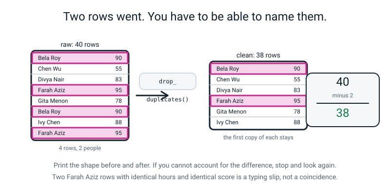
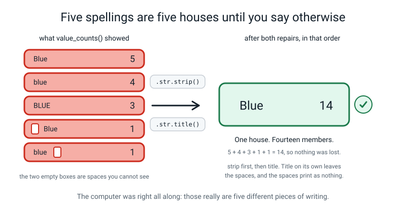
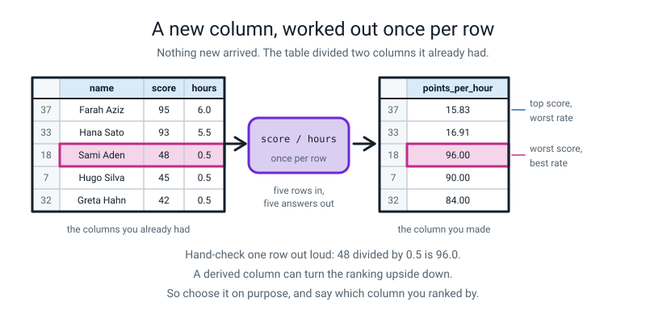
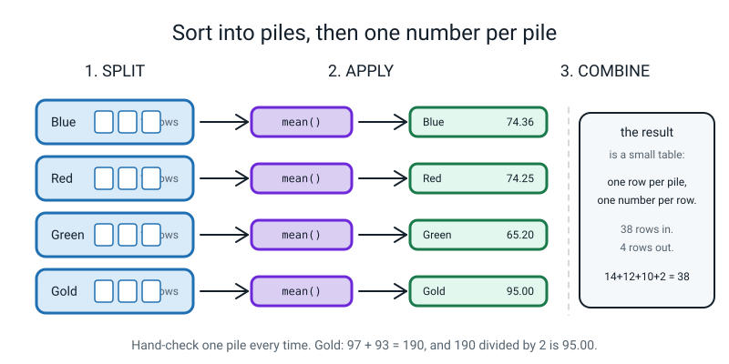
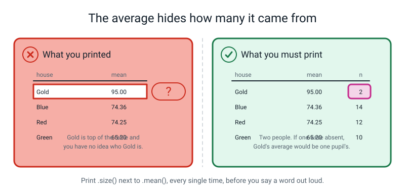
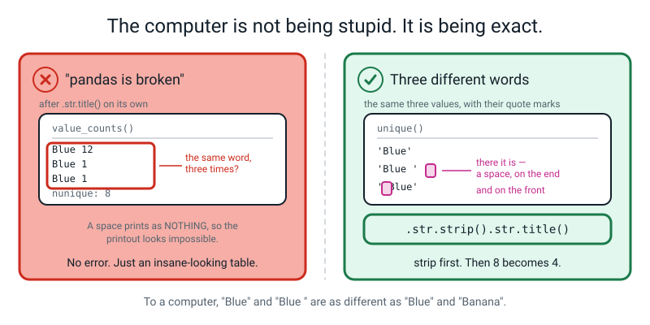
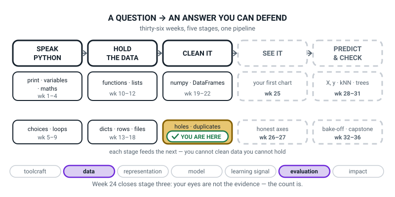
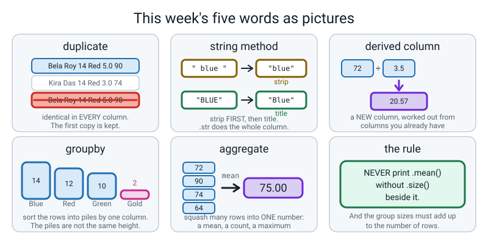

# Week 24 — Mess Detective

[⬅ Week 23](week-23.md) · [Course Home](../README.md) · [Next ➡](week-25.md) · [Workbook](../workbook/week-24.md)

---

> ### This week in one sentence
> **`groupby` answers "what's the average per house?" in one line — and hides how many rows each answer came from.**
>
> **By the end of this chapter you will be able to:**
> - **Remove duplicate rows** and state exactly how many went, and **which**
> - **Tidy four spellings of one word into one** with `.str` methods, and say why `strip` comes first
> - **Add a derived column** computed from columns you already have
> - **Group by a column and aggregate**, and report the group sizes alongside the averages
> - **Print the before and after shape** of a table and account for the difference out loud
>
> **New syntax:** `df.drop_duplicates()` · `df["c"].value_counts()` · `df["c"].str.strip().str.title()` · `df["new"] = ...` · `df.groupby("c")["v"].mean()`
>
> **Reading time:** about 40 minutes. **Homework:** about 70 minutes.

---

## 🪝 Start Here

This is a real school. Forty pupils. Somebody ran one command to count how many are in each house, and this came back:

```text
Red       8
Green     5
Blue      5
green     4
blue      4
red       3
BLUE      3
RED       2
blue      1
 Blue     1
GREEN     1
green     1
gold      1
Gold      1
Name: house, dtype: int64
```

**How many houses has this school got?**

You said four. Good. Now **count the lines on the screen.**

**Fourteen.** According to the computer, this school has fourteen houses.

Is the computer wrong? Most people say yes — *"it's just spelling"*. And they are right about `Red`, `red` and `RED`: same house, three different pieces of writing. Fine.

**Now look harder. Look at line five and line nine.**

```text
blue      4
...
blue      1
```

**`blue` appears twice in this list.** Same spelling. Same letters. Two separate lines with two separate counts.

That is impossible. A count cannot list the same thing twice — **unless they are not the same thing.**

One of them has **a space on the end.** And there is another one, ` Blue`, with a space on the **front**. And here is the part that matters:

> **You cannot see them. Neither can I. There is no way to look at that screen and tell which is which.**

So here is the thing to take seriously today, and it goes against your instincts:

> **The computer is right.** Those really are fourteen different pieces of writing. To a computer, `"Blue"` and `"Blue "` are as different as `"Blue"` and `"Banana"`. It is not being stupid. It is being **exact** — and being exact is the only reason you can trust it about anything at all.

Which gives you the sentence this whole lab runs on:

> **Your eyes are not the evidence. The count is the evidence.**

**Forty rows is deliberate.** It is past the point where you can check a table by looking at it. So today you are a detective, and you work from counts. There are four things wrong with this table. You will find all four with commands, fix all four, and then ask it six questions.

**And one of your six answers is going to be wrong.** Not wrong arithmetic — the arithmetic will be perfect. **Wrong conclusion.** Your job is to be the person who notices.

---

## 🧠 The Big Idea

> **📌 About the code in this section.** The blocks below are **illustrations, not files**. They show you the shape of one idea, and each one carries on from the one above it — the `import` lines and the data are typed once, in the first block that needs them. **The complete, runnable file is in 💻 Type This.** If you copy a block from this section on its own and Python says `NameError`, that is why, and nothing is broken.

### 1. Duplicates: look at them before you delete them

**The plain explanation.** Somebody typed this list in, scrolled, lost their place, and typed two rows again.

> **duplicate** — a row that is identical to another row in **every single column**.

```python
print(raw.duplicated().sum())
```

```text
2
```

**Two, not four** — and that is worth a moment. `raw.duplicated()` goes down the table and marks a row `True` only if it has **already seen an identical row above it**. So the *first* copy is `False` and only the later ones are `True`.

**Now — do not delete them yet. Look at them first. Always.** This is a judgement, not a keystroke.

```python
print(raw[raw.duplicated(keep=False)])
```

```text
          name   age  house   club  hours  score
1     Bela Roy  14.0    Red  music    5.0     90
5   Farah Aziz  12.0  green  chess    6.0     95
34    Bela Roy  14.0    Red  music    5.0     90
37  Farah Aziz  12.0  green  chess    6.0     95
```

`keep=False` means *"show me **both** copies, not just the later one"*. Without it you only see rows 34 and 37, and you have nothing to compare them with.

**Four rows, two people. Now the judgement: could there be two pupils genuinely called Bela Roy?** Of course. It happens all the time. So how do you know this is a mistake?

**Every single field matches.** Same name, same age, same house, same club, same hours — **and the same score to the mark.** Two different people with the same name would not both be 14, both in Red, both in music club, both have done exactly 5.0 hours, *and* both score exactly 90. **That is not a coincidence; that is a typing slip.**

**The analogy.** Two people in your class could easily share a first name. Two people sharing a first name, a surname, a birthday, a phone number and a shoe size is one person written down twice.

```python
clean = raw.copy()
print("before:", clean.shape)
clean = clean.drop_duplicates()
print("after :", clean.shape)
clean = clean.reset_index(drop=True)
```

```text
before: (40, 6)
after : (38, 6)
```

- `drop_duplicates()` — keep the **first** copy of each row, throw the later copies away.
- **`clean = ` on the front is not optional.** Like `sort_values`, like `fillna`, this hands you back a *new table*. Without the assignment nothing changes and nothing warns you. **Third week running for the same shape of bug** — and this week it should be you who spots it, not the book.
- `reset_index(drop=True)` — renumber the survivors 0, 1, 2, … and throw the old numbering away. Without `drop=True` the old numbers become an extra column, which nobody wants. Do it **once**, immediately after the drop, and never again.

> **The habit that matters more than the command: print the shape before and after, and be able to account for the difference OUT LOUD.** `40 − 2 = 38`, and the two that went were **Bela Roy and Farah Aziz**. A student who can say that sentence will catch a mistaken drop later. A student who only says "it worked" will not.


*Figure 24.1 — Print the shape before and after. If you cannot account for the difference, stop and look again.*

### 2. `.str` methods, and why the order matters more than anything else this week

**The plain explanation.**

> **string method** — a command that works on writing. `strip` removes spaces from the ends; `title` makes the first letter a capital and the rest lower case.

> **`.str`** — the doorway that lets a string method work on **a whole column at once** instead of one value at a time. Without `.str`, pandas has no idea you meant to do it to every cell.

```python
clean["house"] = clean["house"].str.strip().str.title()
print(clean["house"].value_counts())
print("nunique:", clean["house"].nunique())
```

```text
Blue     14
Red      12
Green    10
Gold      2
Name: house, dtype: int64
nunique: 4
```

**Read the chain left to right — it happens in the order you read it:**

1. `clean["house"]` — the house column, 38 pieces of writing.
2. `.str.strip()` — take the spaces off both ends of every one. `"blue "` becomes `"blue"`. `" Blue"` becomes `"Blue"`.
3. `.str.title()` — capital first letter, everything else lower case. `"blue"`, `"BLUE"` and `"Blue"` all become `"Blue"`.
4. `clean["house"] = ` — put the repaired column back. **Again: no assignment, nothing happened.**

**Fourteen became four. Now check the arithmetic, because this must not feel like magic.** Blue was `Blue` 5 + `blue` 4 + `BLUE` 3 + `blue ` 1 + ` Blue` 1 = **14**.

**Blue now has fourteen. Nothing was lost and nothing was invented.** Do that sum yourself; it takes thirty seconds and it turns a magic trick into arithmetic.

**Now the order, and this is a real trap.** What if you do `title` **without** `strip`?

```python
messy = pd.read_csv("house_raw.csv").drop_duplicates().reset_index(drop=True)
print(messy["house"].str.title().value_counts())
print("nunique:", messy["house"].str.title().nunique())
```

```text
Red       12
Blue      12
Green      9
Blue       1
 Blue      1
Green      1
Gold       1
Gold       1
Name: house, dtype: int64
nunique: 8
```

**Eight, not four — and the printout looks like it worked.** `Blue` appears three times. `Green` twice. `Gold` twice. **The spaces are still there, and a space prints as nothing**, so the output looks like pandas has lost its mind.

**This is the worst kind of bug in this entire course: no error, and a printout that makes you doubt the computer instead of your code.**

> **`strip` first, then `title`. Always.** `title` on its own leaves the spaces, and the spaces print as nothing, so the bug is invisible in the output and visible **only in the count**.


*Figure 24.2 — strip first, then title. Title on its own leaves the spaces, and the spaces print as nothing.*

**And if you want to prove it to somebody who does not believe you**, print the values with their quote marks showing:

```python
print(messy["house"].str.title().unique())
```

```text
['Red' 'Blue' 'Blue ' 'Green' ' Blue' 'Green ' 'Gold' 'Gold ']
```

**There they are.** `'Blue '` and `' Blue'`, with the spaces sitting inside the quotes where you can finally see them.

**The `club` column gets the same treatment**, and it is a useful second go because the target case is different — club names read better in lower case, so `.str.lower()`:

```python
clean["club"] = clean["club"].str.strip().str.lower()
print(clean["club"].value_counts())
```

```text
chess    14
music    12
art      12
Name: club, dtype: int64
```

Eight spellings, three clubs, and 14 + 12 + 12 = **38**. Every row accounted for.

### 3. A derived column: the table does arithmetic on itself

**The plain explanation.** First, last week's repair, done now so nothing later trips over a hole. There are **six** missing ages:

```python
print("median age:", clean["age"].median())
clean["age"] = clean["age"].fillna(13).astype(int)
print("holes in age now:", clean["age"].isna().sum())
```

```text
median age: 13.0
holes in age now: 0
```

That is exactly Week 23 with six holes instead of three. **It has a cost, and §5 is about the cost** — do not let it slide past as routine.

Now the new thing.

> **derived column** — a new column worked out from columns you already have. Nothing arrives from outside; the table does arithmetic on itself.

```python
clean["points_per_hour"] = (clean["score"] / clean["hours"]).round(2)
print(clean.head())
```

```text
         name  age  house   club  hours  score  points_per_hour
0  Aarav Shah   13    Red  chess    3.5     72            20.57
1    Bela Roy   14    Red  music    5.0     90            18.00
2     Chen Wu   13   Blue  chess    2.0     55            27.50
3  Divya Nair   13   Blue    art    4.5     83            18.44
4   Emeka Obi   13  Green  music    3.0     61            20.33
```

- `clean["score"] / clean["hours"]` — divide the whole score column by the whole hours column, **row by row**. Thirty-eight divisions from one line. That is Week 18's vectorized arithmetic, now on named columns.
- `.round(2)` — two decimal places, so the numbers are readable.
- **`clean["points_per_hour"] = ` — a name on the left that does not exist yet creates a new column.** That is the whole syntax. If the name *does* already exist, it is **overwritten instead, silently**, so choose new names carefully.

**Hand-check row 0: 72 ÷ 3.5 = 20.571… → 20.57 ✔.** Do that out loud, every time you make a derived column. It takes ten seconds and it has caught more mistakes than any other habit in this course.


*Figure 24.3 — A derived column can turn the ranking upside down. So choose it on purpose.*

**And here is why derived columns are interesting rather than just useful — they can turn the story upside down.**

```python
print(clean.sort_values("points_per_hour", ascending=False).head(5)[["name", "house", "score", "hours", "points_per_hour"]])
```

```text
           name  house  score  hours  points_per_hour
18    Sami Aden  Green     48    0.5             96.0
7    Hugo Silva    Red     45    0.5             90.0
32   Greta Hahn   Blue     42    0.5             84.0
6    Gita Menon   Blue     78    1.5             52.0
14  Omar Haddad   Blue     52    1.0             52.0
```

**The top three by points-per-hour are three of the lowest scorers in the school** — 48, 45 and 42. They all worked half an hour.

**A new column made a new ranking, and neither ranking is a lie.** Which one you report is a choice, and it is the same kind of choice as fill-versus-drop last week: **defensible either way, indefensible unaccounted for.**

And be honest about the measure itself: **dividing by 0.5 makes a number three times bigger**, so `points_per_hour` mostly measures *who did the least work*. That is a real weakness of this particular column, and saying so out loud is part of the job.

### 4. `groupby`: split, apply, combine

**The plain explanation.**

> **`groupby`** — sort the rows into piles by the value in one column, do one calculation on each pile, and stack the answers into a small result table.

> **aggregate** — squash many rows into one number: a mean, a count, a maximum.

**The analogy, and it is a good one because it is physically true.** You have 38 exam papers on a desk.

1. You **sort them into piles by house.** Four piles. That is the **split**.
2. You add up each pile and divide by its size. That is the **apply**.
3. You write the four averages on one sheet. That is the **combine**.

```python
print(clean.groupby("house")["score"].mean().round(2))
```

```text
house
Blue     74.36
Gold     95.00
Green    65.20
Red      74.25
Name: score, dtype: float64
```

**Read the line right to left, which is how it was built:**

- `clean.groupby("house")` — make the piles, one per different value in the `house` column.
- `["score"]` — of everything in each pile, I only care about the score column.
- `.mean()` — one average per pile.
- `.round(2)` — two decimal places.

**One line.** In Week 15 this exact answer took a loop, a dictionary, an `if` and about fifteen lines — and every one of those lines was yours to get wrong. You wrote that code. You remember it.

**Hand-check one pile, every single time.** Gold has two members, with 97 and 93: **97 + 93 = 190, and 190 ÷ 2 = 95.00** ✔. Ten seconds, and it converts `groupby` from magic into arithmetic.


*Figure 24.4 — 38 rows in, 4 rows out. Hand-check one pile every time.*

### 5. The trap: an average that is completely correct and completely misleading

**The plain explanation.** Look at that result again.

**Gold. 95.00. Top of the table.** Gold is the best house in the school by a mile.

Except — **how many people is Gold?**

```python
print(clean.groupby("house")["score"].size())
```

```text
house
Blue     14
Gold      2
Green    10
Red      12
Name: score, dtype: int64
```

**Two.** Gold is two people.

Here are they are in full:

```python
print(clean[clean["house"] == "Gold"])
```

```text
          name  age house club  hours  score  points_per_hour
30  Elif Demir   13  Gold  art    2.0     97            48.50
33   Hana Sato   12  Gold  art    5.5     93            16.91
```

**If one of them had been off school that day, "Gold's average" would be one person's score** — 97 or 93, from a single row. And one ordinary pupil scoring 73 joining Gold takes it to (97 + 93 + 73) ÷ 3 = **87.67**: the lead over Blue halves because **one person arrived**. Now ask the same question of Blue. **How many pupils would have to join Blue to move its average seven marks?** **Six** new pupils, every single one of them scoring 100 out of 100 — (1041 + 600) ÷ 20 = 82.05, which is 7.69 up. Gold moved 7.33 because **one** person turned up with an ordinary score. *That* is the difference between fourteen rows and two.

**And nothing in the `.mean()` output told you any of that.** Four numbers, four house names, no hint that one came from two rows and another from fourteen. **The printout was completely honest and completely misleading**, and you read "Gold is the best house" straight off it.

**The fix is one command, and it must become automatic:**

```python
print(clean.groupby("house").agg(n=("score", "size"), avg=("score", "mean")).round(2))
```

```text
        n    avg
house           
Blue   14  74.36
Gold    2  95.00
Green  10  65.20
Red    12  74.25
```

- `.agg(...)` — do several aggregations at once, and **name** each result column.
- The pattern is `new_name=("existing_column", "what_to_do")`. So `n=("score", "size")` means *"make a column called `n` holding how many rows are in each pile"*.
- Available operations: `"size"`, `"count"`, `"sum"`, `"mean"`, `"median"`, `"min"`, `"max"`.
- The house names down the side are now the **index** — the row labels — which is Week 21's idea coming back.

> **The rule: never print a group average without its group size beside it. Every single time.** `agg(n=..., avg=...)`, or you will mislead yourself.


*Figure 24.5 — Print `.size()` next to `.mean()`, every single time, before you say a word out loud.*

**And the check that goes with the rule: the group sizes must add up to the number of rows.**

```python
sizes = clean.groupby("house")["score"].size()
print("sizes sum to", sizes.sum(), "and the table has", len(clean), "rows")
```

```text
sizes sum to 38 and the table has 38 rows
```

14 + 12 + 10 + 2 = 38 ✔

**If those two numbers ever disagree, rows have gone missing from your answer.** Here is the usual reason, and it is worth seeing once. **If the column you group by has holes in it, those rows silently vanish from the result.** Try it on a copy where the six missing ages have *not* been filled:

```python
holey = pd.read_csv("house_raw.csv").drop_duplicates().reset_index(drop=True)
sizes = holey.groupby("age")["score"].size()
print(sizes)
print("sums to", sizes.sum(), "but the table has", len(holey), "rows")
```

```text
age
12.0    10
13.0    12
14.0    10
Name: score, dtype: int64
sums to 32 but the table has 38 rows
```

**Thirty-two, not thirty-eight. Six rows are simply not in the answer, and nothing said so.** They are the six pupils whose ages nobody recorded — there is no pile for them, so they were left out.

> **⚠️ Watch out:** that is exactly why the sum check exists, and it is the same lesson as last week from a new angle. **Repairs change answers — and so do repairs you forgot to make.**

**One more surprise worth knowing.** Group by two columns and you get **only the combinations that actually happen**:

```python
print(clean.groupby(["house", "club"]).size())
```

```text
house  club 
Blue   art       2
       chess     3
       music     9
Gold   art       2
Green  art       8
       chess     1
       music     1
Red    chess    10
       music     2
dtype: int64
```

Four houses times three clubs is **twelve** possible combinations. **Nine appear.** There is no Red/art, no Gold/chess and no Gold/music — and pandas does not show them as zero, it just **leaves them out.** Read a `groupby` result knowing it is *a list of what exists*, not a complete grid.

### 6. What the age fill cost

**The plain explanation.** The fill back in §3 looked routine. It was not.

```text
      n    avg
age           
12   10  84.80
13   18  73.11
14   10  61.00
```

**Age 13 has eighteen pupils. Ages 12 and 14 have ten each.** Why?

**Because we filled six missing ages with 13.** Six of those eighteen are 13 **only because we said so**.

Before the fill, the **twelve** pupils with a *known* age of 13 averaged **71.92**. After it, eighteen pupils average **73.11**. **The fill added six people to one group and moved its average.**

That is not a bug — **it is what filling means.** But it means the log must say so, and it means last week's rule applies with force:

> **Never fill a column with a guess and then make that column the subject of your question.** One of the six questions in this lab is a question **about age**, and the age column contains six guesses.

---

## 💻 Type This

Everything goes in your `level2` folder. As last week, the data comes first.

### Step 0 — make the broken file

Make `make_house_data.py` and run it **once**:

```python
# make_house_data.py - run this ONCE. It writes the broken 40-row table.
rows_text = """name,age,house,club,hours,score
Aarav Shah,13,red,Chess,3.5,72
Bela Roy,14,Red,music,5.0,90
Chen Wu,,BLUE,chess,2.0,55
Divya Nair,13,blue ,art,4.5,83
Emeka Obi,,Green,music,3.0,61
Farah Aziz,12,green,chess,6.0,95
Gita Menon,13, Blue,art,1.5,78
Hugo Silva,14,RED,MUSIC,0.5,45
Ivy Chen,12,Blue,chess,4.0,88
Jai Kapoor,13,green,art,2.5,67
Kira Das,14,Red,chess,3.0,74
Liam Byrne,,blue,music,5.5,81
Maya Iyer,12,Green, art,2.0,59
Noor Khan,13,red,chess,4.0,86
Omar Haddad,14,Blue,music,1.0,52
Priya Rao,12,GREEN,art,3.5,70
Quinn Reid,13,Red,chess,2.5,64
Rhea Bose,,blue,music,4.5,92
Sami Aden,14,Green,art,0.5,48
Tara Joshi,12,Red,chess ,5.0,97
Uma Pillai,13,Blue,music,3.0,76
Viraj Sen,14,green ,art,2.0,63
Wren Adeyemi,12,Red,chess,3.5,80
Xu Lin,13,BLUE,music,1.5,57
Yara Fadel,,Green,art,4.0,85
Zane Cooper,14,red,chess,2.5,69
Anika Verma,12,Blue,Music,5.0,93
Bruno Costa,13,green,art,1.0,50
Cleo Marks,14,Red,chess,3.0,73
Dev Anand,12,blue,music,4.5,89
Elif Demir,13,gold,art,2.0,97
Finn Walsh,,RED,chess,3.5,79
Greta Hahn,14,Blue,music,0.5,42
Hana Sato,12,Gold ,art,5.5,93
Bela Roy,14,Red,music,5.0,90
Ismail Toure,13,Red,chess,2.0,62
Jia Park,12,blue,music,4.0,84
Farah Aziz,12,green,chess,6.0,95
Kofi Mensah,14,Green,art,1.5,54
Lena Fischer,13,BLUE,chess,3.0,71
"""

with open("house_raw.csv", "w") as f:
    f.write(rows_text)

print("house_raw.csv written -", rows_text.count("\n") - 1, "data rows")
```

```text
house_raw.csv written - 40 data rows
```

> **💡 Try this:** open `house_raw.csv` in a plain text editor and try to spot the two hidden spaces. Line 5 is `Divya Nair,13,blue ,art,4.5,83` — trailing space. Line 8 is `Gita Menon,13, Blue,art,1.5,78` — leading space. **You will not see them.** That is the single most useful thirty seconds of this week.

### Step 1 — diagnose with commands, not eyes

Make `detect.py`:

```python
# detect.py - Week 24. What is wrong with this table?
import pandas as pd

raw = pd.read_csv("house_raw.csv")

print("shape           :", raw.shape)
print("duplicate rows  :", raw.duplicated().sum())
print("house spellings :", raw["house"].nunique())
print("club spellings  :", raw["club"].nunique())
print("holes per column:")
print(raw.isna().sum())
```

```text
shape           : (40, 6)
duplicate rows  : 2
house spellings : 14
club spellings  : 8
holes per column:
name     0
age      6
house    0
club     0
hours    0
score    0
dtype: int64
```

**Four numbers, four problems, and they are the same four as last week:**

| The problem | The number | The fix, this week |
|---|---|---|
| The same row twice | **2** duplicate rows | `drop_duplicates()` |
| Several spellings of one thing | **14** house spellings, **8** club spellings | `.str.strip().str.title()` |
| Holes | **6** missing ages | `fillna(13)` — last week's skill, revised |
| Text pretending to be numbers | none this week | — |

**Write those four numbers down on paper.** Everything you do today has to be accountable against them.

### Step 2 — look at the duplicates before deleting them

Add:

```python
print("--- both copies of every duplicate")
print(raw[raw.duplicated(keep=False)])
```

```text
--- both copies of every duplicate
          name   age  house   club  hours  score
1     Bela Roy  14.0    Red  music    5.0     90
5   Farah Aziz  12.0  green  chess    6.0     95
34    Bela Roy  14.0    Red  music    5.0     90
37  Farah Aziz  12.0  green  chess    6.0     95
```

**Read across both Bela Roy rows, field by field.** Name, age, house, club, hours, score — all six identical. **That is your evidence, and it is what lets you delete with a clear conscience.**

### Step 3 — a new file, and the shape before anything happens

Start `mess_detective.py`:

```python
# mess_detective.py - Week 24. Find the mess, fix it, count it, group it.
import pandas as pd

raw = pd.read_csv("house_raw.csv")
clean = raw.copy()

print("=== STEP 1: drop the duplicates")
print("before:", clean.shape)
clean = clean.drop_duplicates()
print("after :", clean.shape)
clean = clean.reset_index(drop=True)
```

```text
=== STEP 1: drop the duplicates
before: (40, 6)
after : (38, 6)
```

**Say the sentence out loud: "forty rows in, thirty-eight out, and the two that went were Bela Roy and Farah Aziz."** If you cannot say which rows went, you do not know that the right ones went.

> **⚠️ Watch out:** try it **without** the `clean = ` on the front, just once. `clean.drop_duplicates()` on its own, then print the shape. It still says `(40, 6)` and **there is no error.** Third week for this bug. It should be you spotting it now, not the book telling you.

### Step 4 — fourteen spellings become four

Add:

```python
print("=== STEP 2: fourteen house spellings become four")
clean["house"] = clean["house"].str.strip().str.title()
print(clean["house"].value_counts())
```

```text
=== STEP 2: fourteen house spellings become four
Blue     14
Red      12
Green    10
Gold      2
Name: house, dtype: int64
```

**Do the sum: 5 + 4 + 3 + 1 + 1 = 14, and Blue now has fourteen. Nothing lost, nothing invented.**

> **💡 Try this:** before you run the working line, run `clean["house"].str.title().nunique()` — **8** — and then `clean["house"].str.strip().str.title().nunique()` — **4**. Two numbers, ten seconds, and the order of the chain stops being a rule you were told.

### Step 5 — the clubs, in lower case

Add:

```python
print("=== STEP 3: eight club spellings become three")
clean["club"] = clean["club"].str.strip().str.lower()
print(clean["club"].value_counts())
```

```text
=== STEP 3: eight club spellings become three
chess    14
music    12
art      12
Name: club, dtype: int64
```

**14 + 12 + 12 = 38.** Every row accounted for. And note: `lower` rather than `title`, because club names read better small. **That is a style decision, and it belongs on the log** — because `Chess` and `chess` are two clubs again the moment you are inconsistent.

### Step 6 — the six missing ages

Add:

```python
print("=== STEP 4: the six missing ages")
print("median age:", clean["age"].median())
clean["age"] = clean["age"].fillna(13).astype(int)
print(clean.isna().sum())
```

```text
=== STEP 4: the six missing ages
median age: 13.0
name     0
age      0
house    0
club     0
hours    0
score    0
dtype: int64
```

That is last week's skill with six holes instead of three. `fillna(13).astype(int)` is two repairs chained on one line, and it reads left to right in the order they happen: **fill, then convert.**

**Now ask yourself the uncomfortable question: what did you just do to six pupils?** You decided they were 13. **So if one of your six questions is about age, how much do you trust the answer?** Hold that; it arrives in ten minutes.

### Step 7 — a column that was not there

Add:

```python
print("=== STEP 5: a column that was not there")
clean["points_per_hour"] = (clean["score"] / clean["hours"]).round(2)
print(clean.head())
```

```text
=== STEP 5: a column that was not there
         name  age  house   club  hours  score  points_per_hour
0  Aarav Shah   13    Red  chess    3.5     72            20.57
1    Bela Roy   14    Red  music    5.0     90            18.00
2     Chen Wu   13   Blue  chess    2.0     55            27.50
3  Divya Nair   13   Blue    art    4.5     83            18.44
4   Emeka Obi   13  Green  music    3.0     61            20.33
```

**Hand-check row 2: 55 ÷ 2 = 27.5** ✔. And print the shape: **38 rows, 7 columns.** Six became seven, and no row moved.

### Step 8 — the groupby, with the size beside it

Add:

```python
print("=== STEP 6: average score per house, WITH the group size")
print(clean.groupby("house").agg(n=("score", "size"), avg=("score", "mean")).round(2))
```

```text
=== STEP 6: average score per house, WITH the group size
        n    avg
house           
Blue   14  74.36
Gold    2  95.00
Green  10  65.20
Red    12  74.25
```

**Hand-check Gold: 97 + 93 = 190, 190 ÷ 2 = 95.00** ✔

**And now look at the `n` column, and read the table again.** Gold's 95.00 came from two rows. Blue's 74.36 came from fourteen. **Those are not comparable numbers**, and the plain `.mean()` printout would never have told you.

### Step 9 — the check that must always pass

Add:

```python
print("=== STEP 7: the check that must always pass")
sizes = clean.groupby("house")["score"].size()
print("sizes sum to", sizes.sum(), "and the table has", len(clean), "rows")
```

```text
=== STEP 7: the check that must always pass
sizes sum to 38 and the table has 38 rows
```

### The complete finished program

```python
# mess_detective.py - Week 24. Find the mess, fix it, count it, group it.
import pandas as pd

raw = pd.read_csv("house_raw.csv")
clean = raw.copy()

print("=== STEP 1: drop the duplicates")
print("before:", clean.shape)
clean = clean.drop_duplicates()
print("after :", clean.shape)
clean = clean.reset_index(drop=True)

print("=== STEP 2: fourteen house spellings become four")
clean["house"] = clean["house"].str.strip().str.title()
print(clean["house"].value_counts())

print("=== STEP 3: eight club spellings become three")
clean["club"] = clean["club"].str.strip().str.lower()
print(clean["club"].value_counts())

print("=== STEP 4: the six missing ages")
print("median age:", clean["age"].median())
clean["age"] = clean["age"].fillna(13).astype(int)
print(clean.isna().sum())

print("=== STEP 5: a column that was not there")
clean["points_per_hour"] = (clean["score"] / clean["hours"]).round(2)
print(clean.head())

print("=== STEP 6: average score per house, WITH the group size")
print(clean.groupby("house").agg(n=("score", "size"), avg=("score", "mean")).round(2))

print("=== STEP 7: the check that must always pass")
sizes = clean.groupby("house")["score"].size()
print("sizes sum to", sizes.sum(), "and the table has", len(clean), "rows")
```

---

## 🔍 Worked Examples

Three complete programs. Each writes its own broken file first, so you can run them from nothing.

### Worked Example 1 — A week of canteen sales (food)

```python
"""canteen24.py - a week of canteen sales. Four spellings, one duplicate, one trap."""

import pandas as pd

sales_text = """day,item,price,sold
Mon,Samosa,15,40
Mon,samosa ,15,12
Mon,JUICE,25,30
Tue,Samosa,15,38
Tue,juice,25,26
Tue,Brownie,45,20
Wed,SAMOSA,15,44
Wed,Juice ,25,22
Thu,samosa,15,36
Thu,juice,25,28
Thu,Brownie,45,18
Fri,Samosa,15,50
Fri,JUICE,25,34
Fri,Samosa,15,50
"""

with open("canteen_raw.csv", "w") as f:
    f.write(sales_text)
print("canteen_raw.csv written")

raw = pd.read_csv("canteen_raw.csv")
clean = raw.copy()

print("--- DIAGNOSE, with commands not eyes")
print("shape          :", raw.shape)
print("duplicate rows :", raw.duplicated().sum())
print("item spellings :", raw["item"].nunique())
print(raw["item"].value_counts())

print("--- REPAIR 1: look at the duplicate BEFORE deleting it")
print(raw[raw.duplicated(keep=False)])
print("before:", clean.shape)
clean = clean.drop_duplicates()
print("after :", clean.shape)
clean = clean.reset_index(drop=True)

print("--- REPAIR 2: strip FIRST, then title")
clean["item"] = clean["item"].str.strip().str.title()
print(clean["item"].value_counts())
print("nunique:", clean["item"].nunique())

print("--- a derived column: money taken on each row")
clean["takings"] = clean["price"] * clean["sold"]
print(clean.head())

print("--- the question: which item takes the most money on average?")
print(clean.groupby("item").agg(n=("takings", "size"), avg=("takings", "mean")).round(2))

print("--- the check that must always pass")
sizes = clean.groupby("item")["takings"].size()
print("sizes sum to", sizes.sum(), "and the table has", len(clean), "rows")

print("--- total takings per item, which is a different question")
print(clean.groupby("item").agg(n=("takings", "size"), total=("takings", "sum")))
```

Real output:

```text
canteen_raw.csv written
--- DIAGNOSE, with commands not eyes
shape          : (14, 4)
duplicate rows : 1
item spellings : 8
Samosa     4
JUICE      2
juice      2
Brownie    2
samosa     1
SAMOSA     1
Juice      1
samosa     1
Name: item, dtype: int64
--- REPAIR 1: look at the duplicate BEFORE deleting it
    day    item  price  sold
11  Fri  Samosa     15    50
13  Fri  Samosa     15    50
before: (14, 4)
after : (13, 4)
--- REPAIR 2: strip FIRST, then title
Samosa     6
Juice      5
Brownie    2
Name: item, dtype: int64
nunique: 3
--- a derived column: money taken on each row
   day    item  price  sold  takings
0  Mon  Samosa     15    40      600
1  Mon  Samosa     15    12      180
2  Mon   Juice     25    30      750
3  Tue  Samosa     15    38      570
4  Tue   Juice     25    26      650
--- the question: which item takes the most money on average?
         n    avg
item             
Brownie  2  855.0
Juice    5  700.0
Samosa   6  550.0
--- the check that must always pass
sizes sum to 13 and the table has 13 rows
--- total takings per item, which is a different question
         n  total
item             
Brownie  2   1710
Juice    5   3500
Samosa   6   3300
```

**Four things worth noticing, and the last one is the whole lesson again.**

**Look at the raw `value_counts()`.** `samosa` appears **twice**, with a count of 1 each time. Same five letters, two separate lines — because one of them is `samosa ` with a space on the end. **The hidden space, in a completely different table.**

**The duplicate is rows 11 and 13**, both `Fri Samosa 15 50`. Every field matches, so it is a typing slip. `14 − 1 = 13`.

**The derived column is a multiplication this time**, not a division: `price * sold` gives the money taken on that row. Hand-check row 0: 15 × 40 = **600** ✔.

**And the trap. "Brownies take the most money — 855 on average!"** Except `n` is **2**. Brownies were sold on two days out of five, and on both of those days they sold enormously. The average is real and it is fragile.

**Now look at the last table, which asks a different question.** Total takings: Brownie **1710**, Juice **3500**, Samosa **3300**. **The item with the highest average takes the least money overall**, because it was only on sale twice. Same table, same tool, two honest answers, opposite conclusions — and which one matters depends entirely on what you were actually asking.

### Worked Example 2 — A five-a-side league (sport)

```python
"""league24.py - a five-a-side league. Team spellings, a duplicate, and a two-player team."""

import pandas as pd

league_text = """player,team,games,goals
Anaya,Tigers,10,12
Bhavi,tigers ,10,8
Chetan,TIGERS,9,5
Dia,Sharks,10,14
Eshan,sharks,10,9
Fatima, Sharks,8,6
Gopi,Eagles,10,7
Hari,EAGLES,10,4
Ira,eagles ,9,3
Jun,Comets,3,9
Kabir,comets,3,8
Lila,Tigers,10,6
Manav,sharks ,9,5
Anaya,Tigers,10,12
"""

with open("league_raw.csv", "w") as f:
    f.write(league_text)
print("league_raw.csv written")

raw = pd.read_csv("league_raw.csv")
clean = raw.copy()

print("--- DIAGNOSE")
print("shape          :", raw.shape)
print("duplicate rows :", raw.duplicated().sum())
print("team spellings :", raw["team"].nunique())
print(raw["team"].value_counts())

print("--- the duplicate, both copies")
print(raw[raw.duplicated(keep=False)])

print("--- REPAIR: drop, then strip, then title")
print("before:", clean.shape)
clean = clean.drop_duplicates().reset_index(drop=True)
print("after :", clean.shape)
clean["team"] = clean["team"].str.strip().str.title()
print(clean["team"].value_counts())

print("--- a derived column: goals per game")
clean["goals_per_game"] = (clean["goals"] / clean["games"]).round(2)
print(clean)

print("--- WITHOUT the group size. Who is the best team?")
print(clean.groupby("team")["goals_per_game"].mean().round(2))

print("--- WITH the group size")
print(clean.groupby("team").agg(n=("goals_per_game", "size"),
                                avg=("goals_per_game", "mean")).round(2))

print("--- the check")
sizes = clean.groupby("team")["goals"].size()
print("sizes sum to", sizes.sum(), "and the table has", len(clean), "rows")

print("--- the two Comets players, in full")
print(clean[clean["team"] == "Comets"])
```

Real output:

```text
league_raw.csv written
--- DIAGNOSE
shape          : (14, 4)
duplicate rows : 1
team spellings : 12
Tigers     3
tigers     1
TIGERS     1
Sharks     1
sharks     1
 Sharks    1
Eagles     1
EAGLES     1
eagles     1
Comets     1
comets     1
sharks     1
Name: team, dtype: int64
--- the duplicate, both copies
   player    team  games  goals
0   Anaya  Tigers     10     12
13  Anaya  Tigers     10     12
--- REPAIR: drop, then strip, then title
before: (14, 4)
after : (13, 4)
Tigers    4
Sharks    4
Eagles    3
Comets    2
Name: team, dtype: int64
--- a derived column: goals per game
    player    team  games  goals  goals_per_game
0    Anaya  Tigers     10     12            1.20
1    Bhavi  Tigers     10      8            0.80
2   Chetan  Tigers      9      5            0.56
3      Dia  Sharks     10     14            1.40
4    Eshan  Sharks     10      9            0.90
5   Fatima  Sharks      8      6            0.75
6     Gopi  Eagles     10      7            0.70
7     Hari  Eagles     10      4            0.40
8      Ira  Eagles      9      3            0.33
9      Jun  Comets      3      9            3.00
10   Kabir  Comets      3      8            2.67
11    Lila  Tigers     10      6            0.60
12   Manav  Sharks      9      5            0.56
--- WITHOUT the group size. Who is the best team?
team
Comets    2.84
Eagles    0.48
Sharks    0.90
Tigers    0.79
Name: goals_per_game, dtype: float64
--- WITH the group size
        n   avg
team           
Comets  2  2.84
Eagles  3  0.48
Sharks  4  0.90
Tigers  4  0.79
--- the check
sizes sum to 13 and the table has 13 rows
--- the two Comets players, in full
   player    team  games  goals  goals_per_game
9     Jun  Comets      3      9            3.00
10  Kabir  Comets      3      8            2.67
```

**Read the two `groupby` printouts one after the other and notice how differently they land.**

The first one says **Comets 2.84**, and every other team is under 1.0. Comets are three times better than anybody in the league. **That number is completely correct** — hand-check it: (3.00 + 2.67) ÷ 2 = 2.835 → **2.84** ✔.

The second one adds one column, and everything changes. **Comets is two players.** And look at the last printout: those two players have played **three games each.** Everybody else has played eight, nine or ten.

**So Comets' league-topping average is two people, over three games.** Nine goals in three games is a great start to a season; it is not evidence about a team. **One quiet game and it collapses.** Sharks' 0.90 comes from four players over 37 games between them, and nothing short of a catastrophe moves it.

**No error anywhere. Perfect arithmetic. One wrong conclusion, available to anybody who did not print the `n`.**

### Worked Example 3 — A homework log (school)

This one is the other trap: **`groupby` silently leaves out rows whose group value is a hole.**

```python
"""homework24.py - a homework log, and the rows groupby quietly leaves out."""

import pandas as pd

log_text = """pupil,subject,minutes,tasks
Farah,Maths,45,3
Gopal,maths ,30,2
Hina,MATHS,60,4
Ismail,English,40,2
Jyoti,english,50,3
Kabir,ENGLISH,35,2
Lila,Science,55,4
Manav,science ,25,1
Nia, Science,45,3
Omar,,40,2
Priya,,30,2
Quinn,Art,20,1
Ravi,art,15,1
Farah,Maths,45,3
"""

with open("homework_raw.csv", "w") as f:
    f.write(log_text)
print("homework_raw.csv written")

raw = pd.read_csv("homework_raw.csv")
clean = raw.copy()

print("--- DIAGNOSE")
print("shape           :", raw.shape)
print("duplicate rows  :", raw.duplicated().sum())
print("subject spellings:", raw["subject"].nunique())
print("holes per column:")
print(raw.isna().sum())

print("--- REPAIR: drop the duplicate, then tidy the spellings")
print("before:", clean.shape)
clean = clean.drop_duplicates().reset_index(drop=True)
print("after :", clean.shape)
clean["subject"] = clean["subject"].str.strip().str.title()
print(clean["subject"].value_counts())

print("--- a derived column: minutes per task")
clean["minutes_per_task"] = (clean["minutes"] / clean["tasks"]).round(2)
print(clean)

print("--- groupby subject, with the size")
print(clean.groupby("subject").agg(n=("minutes", "size"),
                                   avg_minutes=("minutes", "mean")).round(2))

print("--- THE CHECK, and this time it FAILS")
sizes = clean.groupby("subject")["minutes"].size()
print("sizes sum to", sizes.sum(), "but the table has", len(clean), "rows")

print("--- so who is missing from the answer?")
print(clean[clean["subject"].isna()])

print("--- fill the holes, then group again")
clean["subject"] = clean["subject"].fillna("Not recorded")
print(clean.groupby("subject").agg(n=("minutes", "size"),
                                   avg_minutes=("minutes", "mean")).round(2))
sizes = clean.groupby("subject")["minutes"].size()
print("sizes sum to", sizes.sum(), "and the table has", len(clean), "rows")
```

Real output:

```text
homework_raw.csv written
--- DIAGNOSE
shape           : (14, 4)
duplicate rows  : 1
subject spellings: 11
holes per column:
pupil      0
subject    2
minutes    0
tasks      0
dtype: int64
--- REPAIR: drop the duplicate, then tidy the spellings
before: (14, 4)
after : (13, 4)
Maths      3
English    3
Science    3
Art        2
Name: subject, dtype: int64
--- a derived column: minutes per task
     pupil  subject  minutes  tasks  minutes_per_task
0    Farah    Maths       45      3             15.00
1    Gopal    Maths       30      2             15.00
2     Hina    Maths       60      4             15.00
3   Ismail  English       40      2             20.00
4    Jyoti  English       50      3             16.67
5    Kabir  English       35      2             17.50
6     Lila  Science       55      4             13.75
7    Manav  Science       25      1             25.00
8      Nia  Science       45      3             15.00
9     Omar      NaN       40      2             20.00
10   Priya      NaN       30      2             15.00
11   Quinn      Art       20      1             20.00
12    Ravi      Art       15      1             15.00
--- groupby subject, with the size
         n  avg_minutes
subject                
Art      2        17.50
English  3        41.67
Maths    3        45.00
Science  3        41.67
--- THE CHECK, and this time it FAILS
sizes sum to 11 but the table has 13 rows
--- so who is missing from the answer?
    pupil subject  minutes  tasks  minutes_per_task
9    Omar     NaN       40      2              20.0
10  Priya     NaN       30      2              15.0
--- fill the holes, then group again
              n  avg_minutes
subject                     
Art           2        17.50
English       3        41.67
Maths         3        45.00
Not recorded  2        35.00
Science       3        41.67
sizes sum to 13 and the table has 13 rows
```

**Look at the `value_counts()` after the repair: 3 + 3 + 3 + 2 = 11.** But the table has **13** rows.

**Two rows are simply not in the answer**, and the `groupby` printout said nothing about it. `Omar` and `Priya` never wrote down which subject their homework was for, so there is **no pile for them to go in** — and `groupby` quietly left them out.

**This is why the sum check exists**, and it is the only thing on the screen that would have told you. Nothing errored. The four averages are all perfectly correct averages of the rows that *were* included.

**And notice the honest fix.** You do not have to guess Omar's subject. `fillna("Not recorded")` gives the leftovers a pile of their own, the sizes add up to 13, and **the reader can see that two rows had no subject** — which is a fact about the data worth reporting, not a mess to hide.

> **⚠️ Watch out:** `.str.title()` on a column that has holes in it is fine — the holes stay holes and do not become the word "Nan". But **grouping** by that column is where they vanish. The check is what catches it.

---

## 🐞 When It Breaks

Every message below came from really running a broken version of this week's code. Your line numbers will differ. The last line will not.

### Break 1 — the missing `.str` doorway

```python
print(clean["house"].strip())
```

```text
Traceback (most recent call last):
  ...
AttributeError: 'Series' object has no attribute 'strip'
```

**What Python is telling you.** *"A whole column hasn't got a `strip`."*

Which is fair. `strip` is a thing you do to **one** piece of writing. A column is 38 of them, and pandas will not assume you meant "do it to every cell" unless you say so.

**The fix is four characters:** `clean["house"].str.strip()`. **`.str` is the doorway** that says *"apply this to every cell in the column"*.

**And the near-miss version**, which catches people who remember `.str` but forget the brackets:

```python
print(clean["house"].str.strip.str.title())
```

```text
AttributeError: 'function' object has no attribute 'str'
```

*"You gave me the command itself, not the result of running it."* `strip` with no `()` is the command; `strip()` is the command **done**. Every method needs its brackets, even when there is nothing inside them.

### Break 2 — a typo in a column name, twice, with two different messages

```python
print(clean.groupby("hosue")["score"].mean())
```

```text
Traceback (most recent call last):
  ...
KeyError: 'hosue'
```

```python
print(clean.groupby("house")["scoer"].mean())
```

```text
Traceback (most recent call last):
  ...
KeyError: 'Column not found: scoer'
```

**What Python is telling you.** Both are "I have no column by that name" — **but the wording is different, and that is a free gift.**

- `KeyError: 'hosue'` — the name inside `groupby(...)` is wrong. It could not even make the piles.
- `KeyError: 'Column not found: scoer'` — it **made the piles fine**, then could not find that column inside them.

**The wording tells you which of the two brackets to look at.** Read it and you save yourself hunting through the line.

**The fix.** `print(clean.columns.tolist())` and copy the name exactly.

### Break 3 — the correct line that is the worst bug in the file

```python
print(clean.groupby("house")["score"].mean().round(2))
```

```text
house
Blue     74.36
Gold     95.00
Green    65.20
Red      74.25
Name: score, dtype: float64
```

**There is no error here at all.** The arithmetic is perfect. Every one of those four numbers is exactly right.

**And it is the most dangerous line in the chapter**, because a two-member group is sitting at the top of the table and nothing says so. You will read "Gold is the best house" off it. **A correct number that supports a wrong conclusion.**

**The fix:**

```python
print(clean.groupby("house").agg(n=("score", "size"), avg=("score", "mean")).round(2))
```

```text
        n    avg
house           
Blue   14  74.36
Gold    2  95.00
Green  10  65.20
Red    12  74.25
```

> **🐞 If there is no error message at all:** you now have three questions, and none of them are about error messages. **"Do the shapes account for each other?"** — 40 in, 38 out, and name the two. **"Do the group sizes add up to `len(df)`?"** — one line, and it catches silently dropped rows. And the big one: **"how many rows is that number made of?"** Ask it about every average, every time, including your own.

### The whole clinic, for reference

| What you see | What it means | The fix |
|---|---|---|
| `AttributeError: 'Series' object has no attribute 'strip'` | "A whole column hasn't got a `strip`." | `clean["house"].str.strip()`. `.str` is the doorway |
| `AttributeError: Can only use .str accessor with string values!. Did you mean: 'std'?` | "This column isn't writing." | `.str` is only for `object` columns. Check `dtypes`. (Ignore the "did you mean std" suggestion — it is a red herring) |
| `AttributeError: 'function' object has no attribute 'str'` | "You gave me the command, not the result." | Brackets: `.str.strip().str.title()`, not `.str.strip.str.title()` |
| `KeyError: 'hosue'` | "No column by that name to group **by**." | `print(clean.columns.tolist())` and copy it |
| `KeyError: 'Column not found: scoer'` | "Made the piles, then couldn't find that column **in** them." | Same fix — but the wording tells you it is the *second* bracket |
| `KeyError: 'hour'` | "No column called that." | The column is `hours`. The most common derived-column bug |
| `ValueError: Length of values (3) does not match length of index (38)` | "You gave me 3 values for 38 rows." | A derived column comes from **other columns**, not a hand-typed list |
| `TypeError: You have to supply one of 'by' and 'level'` | "Group by **what**?" | `groupby("house")` |
| `<pandas.core.groupby.generic.DataFrameGroupBy object at 0x...>` | "You printed the piles, not a number." | Add what to do with each pile: `["score"].mean()`. **The piles are not a result** |
| `<bound method GroupBy.size of ...>` | "You printed the command, not what it returns." | `.size()`, with brackets |
| `FutureWarning: The default value of numeric_only in DataFrameGroupBy.mean is deprecated.` | "You asked for the mean of everything, including the words." | Pick the column: `groupby("house")["score"].mean()`. Relying on pandas to drop the text columns for you is how you average the wrong thing |
| **No error, the shape is still `(40, 6)`** | Nothing is wrong. `drop_duplicates` returned a copy. | `clean = clean.drop_duplicates()`. Third week for this one |
| **No error, still eight houses after `.str.title()`** | Nothing is wrong. `title` capitalises; it does not remove spaces. | `.str.strip().str.title()`, in that order. And trust `nunique()`, not the printout |
| **No error, `value_counts()` shows the same word twice** | Nothing is wrong. They really are different pieces of writing. | `.str.strip()`. To prove it: `print(clean["house"].unique())` shows the quote marks, with the spaces inside them |
| **No error, the group sizes don't add up to `len(df)`** | Nothing is wrong. `groupby` silently skips rows whose group value is a hole. | `fillna` the grouping column first — or accept the loss and **write it in the log**. Always run the sum check |
| **No error, and a two-member group is at the top** | Nothing is wrong. The arithmetic is perfect. | `agg(n=("score", "size"), avg=("score", "mean"))`. **This is the lesson, not a bug** |

**The sentence for this week, and for the whole term:**

> **By now you have met three bugs that produce no error message: the wrong `loc`, the repair that never happened, and the average that came from two rows. Nothing on the screen warns you about any of them. Only the extra question does.**

---

## 🎲 What We Did In Class

If you missed it, here is the whole lab.

### The hook: fourteen names, four houses

One command, nothing else on screen: `print(raw["house"].value_counts())`. Then: *"how many houses has this school got?"* — four — *"now count the lines"* — fourteen.

Then the impossible bit: **`blue` appearing twice in a count.** One has a space on the end; ` Blue` has one on the front; nobody in the room could see either.

And the reframe, said slowly: **the computer is not being stupid, it is being exact — and exactness is the only reason you can trust it about anything.** So: **your eyes are not the evidence. The count is the evidence.**

### Two things on the board, up all lesson

```
SHAPE BEFORE   ->   SHAPE AFTER   ->   ACCOUNT FOR THE DIFFERENCE

  never print   .mean()   without   .size()   beside it
```

### The concept, in four parts

**Duplicates.** `duplicated().sum()` said **2**, not 4, because the first copy of each row is not counted as a duplicate. Then `keep=False` to see **both** copies — and the judgement: two pupils could share a name, but they would not both be 14, both in Red, both in music, both on exactly 5.0 hours **and** both score exactly 90.

**The string chain**, on the board, read left to right:

```
clean["house"].str.strip().str.title()
                    |          |
              take spaces   Capitalise
              off the ends  properly
```

**The derived column**, also on the board:

```
clean["points_per_hour"] = clean["score"] / clean["hours"]
       |                        |
   a name that doesn't      divide the whole column
   exist yet -> a NEW       by the whole column,
   column appears           row by row
```

**And `groupby`, with the exam-papers story:** 38 papers, sorted into piles by house (**split**), each pile added and divided (**apply**), the four answers written on one sheet (**combine**). Plus the promise: **hand-check one pile, every single time.**

### Two deliberate mistakes

**Mistake one** was `clean.drop_duplicates()` with no `clean = ` on the front. Shape still `(40, 6)`, **no error**, third week running — and this time the class was supposed to name the rule before the teacher did.

**Mistake two** was `.str.title()` **without** `strip`. Eight lines for four houses, with `Blue` printed three times, and a printout that looks like the computer is broken. Then one extra command, and eight became four.

### The six questions, each with its `n`

Fourteen minutes, and the rule was: **an answer without its row count does not count, even if the number is right.**

1. How many pupils in each house? → Blue 14 · Gold 2 · Green 10 · Red 12, **summing to 38**
2. Average score in each house? → 74.36 · **95.00 from 2** · 65.20 · 74.25
3. Average score in each club? → art 70.58 (12) · chess 76.07 (14) · music 71.83 (12)
4. Average score at each age? → 12 → 84.80 (10) · **13 → 73.11 (18)** · 14 → 61.00 (10)
5. Average hours per house? → Blue 3.18 · Gold 3.75 · Green 2.60 · Red 3.17
6. Most marks per hour? → Sami Aden **96.0**, and he scored 48 out of 100

**Question 4 is the second trap, and everybody was armed for it.** *"Why has age 13 got eighteen pupils when 12 and 14 have ten each?"* **Because we filled six missing ages with 13.** Before the fill, the twelve pupils with a *known* age of 13 averaged **71.92**; after it, eighteen average **73.11**.

**Question 3 is worth comparing with question 2 on purpose.** All three clubs are big. **Chess winning by five marks over fourteen rows is a much sturdier claim than Gold's twenty-mark lead over two.**

**And question 6 produced the best argument of the lesson.** *"Is Sami Aden the best pupil in the school?"* He scored 48. *"Is `points_per_hour` a good measure of anything?"* Of "who gets most from their time", maybe. Of "who is doing well", no — because **dividing by half an hour triples your number.**

### The Gold conversation

The plain `.mean()` output back on screen, counts removed. *"Which is the best house?"* — Gold. *"How many people is Gold?"* — and everybody had to go and find out, even though it had been on screen twenty minutes earlier.

Then, in order:

1. Gold's two scores? → **97 and 93**
2. If one had been off school? → **97 or 93**, from **one** row, and still top
3. If one average pupil (73) joined? → (97 + 93 + 73) ÷ 3 = **87.67** — the lead halves from one person arriving
4. How many pupils would have to join Blue to move it seven marks? → **six**, every one of them scoring 100 out of 100. **That is the difference between fourteen rows and two.**

### The rule, in your own handwriting

```
Never print .mean() without .size() beside it.
  agg(n=("score","size"), avg=("score","mean"))

And check: the group sizes must add up to len(df).
```

And the term in a sentence: **two weeks ago, two commands one letter apart gave two different answers with no error. Last week, filling a hole changed the answer with no error. Today, an average was completely correct and completely misleading, with no error. Real data work is not mostly about errors — it is about being the person who asks the extra question.**

---

## 💬 Talk About It

**1. How many people does a group need before its average means anything?**

*Hint:* this is the honest "nobody agrees" question of the week, and there is no number that is correct. Start by collecting the rules of thumb people actually use: never report a group smaller than 5; never one smaller than 30 (that comes from a real statistics result and is widely misapplied); report any size you like as long as you print it. Then notice how the answer depends on the field — **medical researchers work with groups of 12 when 12 is all the patients there are**, and opinion polls want a thousand. So what *does* everybody agree on? Probably two things: **print the size, always, so the reader can decide** — and **two is not enough, for anything.** Is "print it and let the reader decide" a dodge, or is it the actual professional answer?

**2. `groupby(...).mean()` gave a correct answer that led you to a wrong conclusion. Is that pandas's fault?**

*Hint:* start by being precise about what pandas was asked and what it did. It computed the mean score per house. It computed it correctly. **It has no idea what you intend to claim.** So the gap is between *a correct number* and *a supported conclusion*, and only a person can close that. Then argue the other side properly, because it is a reasonable position: **should pandas warn you about tiny groups?** What would it have to know to do that? (What counts as tiny — for your question, which it cannot see.) And finish with the practical point: if the tool cannot do it, the **habit** has to. `.size()` beside `.mean()` does not make pandas smarter. What does it make?

**3. Is it wrong to delete the duplicate rows?**

*Hint:* not if you looked at them first and can say why — every field matched, including the exact score after the exact hours, so it is a typing slip. So what *would* be wrong? Deleting them **without looking**, and deleting them **without a log line**. Then find the case where you should keep both: **what if the table were one row per test *attempt* rather than one row per pupil?** Two identical rows might be two genuine attempts that happened to score the same, and deleting one would destroy a real fact. So the deciding question is not about the command at all — it is **what does one row of this table mean?** Who is the only person who can answer that?

---

## ⚠️ Don't Get Tricked

### Trick 1 — "the computer is being stupid about `Blue` and `Blue `"


*Figure 24.6 — Left: three lines that all say `Blue`. Right: the same three values with their quote marks showing.*

| ❌ Wrong | ✅ Right |
|---|---|
| "`value_counts()` printed `Blue` three times. Pandas is broken." | Two pieces of writing are the same **only if every character matches**, and **a space is a character.** They really are three different words. |

**Reframe it as a feature.** If the computer quietly decided that `Blue ` and `Blue` were the same, it would also have to decide about `Blu` and `Bleu`. And then you could never trust it about anything.

**And the way to see the invisible: `print(clean["house"].unique())`.** It prints the quote marks, and the spaces show up inside them.

### Trick 2 — "Gold is the best house"

| ❌ Wrong | ✅ Right |
|---|---|
| "Gold's average is 95.00, the highest in the school, so Gold is the best house." | Gold is **two people.** One ordinary pupil joining moves that number more than **seven** marks. It would take **six** perfect scores to do that to Blue's fourteen-row average. |

**The number is not wrong. 97 + 93 over 2 really is 95.00.** The number is correct and the **conclusion** is not, and that distinction is the whole lab.

**One question fixes it, and you can ask it about anybody's average, forever: how many rows is that made of?**

### Trick 3 — "`.str.title()` fixed the spellings"

| ❌ Wrong | ✅ Right |
|---|---|
| "I ran `.str.title()` and the printout looks fine, so the houses are tidy now." | It fixed the **capitals** and left the **spaces**, so you have **eight** values, not four — and you cannot see the difference because a space prints as nothing. |

**Trust `nunique()`, not the printout.** `.str.title().nunique()` is **8**; `.str.strip().str.title().nunique()` is **4**. Two numbers, four seconds, no arguing.

### Trick 4 — "`drop_duplicates()` removed the duplicates"

| ❌ Wrong | ✅ Right |
|---|---|
| "I ran `clean.drop_duplicates()` and there was no error, so the duplicates are gone." | It handed you a **new table** and you threw it away. `clean` still has 40 rows. **Same bug as `sort_values` in Week 22 and `fillna` in Week 23.** |

**The immunity is the shape check, before and after.** `40 → 38`, and name the two rows that went. If the number did not move, the repair did not happen.

---

## 🌍 Where You've Seen This

1. **Any "top rated" list on a shop or a food app.** A restaurant with 5.0 stars from **3** reviews sits above one with 4.6 from **2,000**. The good apps print the review count next to the stars — which is `agg(n=..., avg=...)`, on your phone.
2. **A football league's "goals per game" table** in early season. After two matches somebody always has an absurd rate. By March they do not. **That is a group size growing.**
3. **A school's exam-results table by subject.** A subject taken by four pupils will always look either wonderful or terrible, and comparing it with a subject taken by two hundred is exactly the Gold problem.
4. **Any survey result you see in the news.** Look for the base — *"n = 1,004 adults"* — and then look for the subgroup claim, which is often quietly based on forty people. **Whether the base is printed tells you whether the writer respects you.**
5. **A shop's till system with `Cola`, `cola` and `COLA` as three products.** Somebody, somewhere, is running `.str.strip().str.lower()` on that, and if nobody is, the stock report is wrong.
6. **Anywhere the same person appears twice in a database.** Two hospital records for one patient, two exam entries for one pupil, two votes for one voter — the whole field of *record linkage* exists because `drop_duplicates()` only catches the rows that match **exactly**.
7. **Every league table, ranking and "best of" list you will ever see.** Somebody chose the column to rank by, and that column was a **design decision** — exactly like `points_per_hour`, which rewarded the three lowest scorers in the school for doing half an hour of work.

---

## 🧭 Where This Fits

Everything you do this year is one pipeline: a question goes in one end, and an answer you can
**defend** comes out the other. The gold has not moved since last week — this is the second half of
the same tile, and the last box of stage three. After today, three of the five stages are solid and
you still have not drawn a single chart. That changes next week.



*Figure 24.0 — The pipeline in Week 24. Gold is the same box as last week, and it is the last one in
stage three to turn solid.*

| | |
|---|---|
| **The mental model you now own** | **Split, apply, combine.** `groupby` splits the table into groups, works out one number for each group, and hands you the answers in a single line — and it quietly hides **how many rows each number came from**. So you print the group sizes beside every mean, every time. |
| **The one question it answers** | *"What is the average per house — and how many rows is each average made of?"* Both halves, or neither. |
| **What it plugs into** | Week 15's hand-written filter loop and `group_count`, which took a dozen lines each. They are one line each now — sitting on top of last week's repairs. |
| **What carries forward** | Week 26's bar charts are drawn straight from these counts. And in Week 34 you clean your own 100 rows the same way, with the same `n` printed next to every number. |
| **Spiral thread** | 📊 **Data** and ⚖️ **Evaluation** — because *"Gold is the best house"* and *"Gold has two rows"* are both true, and only one of them is evidence. |

> **💡 Try this:** Gold's average was the biggest number in the whole table and it meant nothing at
> all. Write **`n = 2`** in the margin of your own map, next to this tile. It is the smallest note in
> this book and it will save you the most trouble.

---

## 🔑 Remember This

- **Your eyes are not the evidence. The count is the evidence.** Forty rows is past the point where looking works.
- **Look at duplicates before you delete them**, and be able to name which rows went. Every field matching is what makes it a typing slip rather than two people.
- **`duplicated().sum()` counts the later copies only.** Two repeated rows give **2**, not 4.
- **Shape before, shape after, account for the difference out loud.** *"Forty in, thirty-eight out, and the two that went were Bela Roy and Farah Aziz."*
- **`strip` first, then `title`.** `title` alone leaves the spaces, and the spaces print as nothing, so the bug is invisible in the output and visible only in the count.
- **`.str` is the doorway** that applies a string method to a whole column. Without it: `AttributeError`.
- **A name on the left that does not exist yet creates a new column.** If it *does* exist, it is overwritten silently.
- **Hand-check one row of every derived column, and one pile of every groupby.** Ten seconds each.
- **`groupby` is split, apply, combine.** One line replaces fifteen lines of Week 15.
- **NEVER print `.mean()` without `.size()` beside it.** `agg(n=("score", "size"), avg=("score", "mean"))`.
- **The group sizes must add up to `len(df)`.** If they do not, rows were silently dropped — usually because the grouping column still has holes.
- **`drop_duplicates`, `str.strip`, `fillna` and `sort_values` all hand you a copy.** No `=` on the left means nothing happened.
- **An average with no count beside it is not an answer.**

### Syntax reminder card

```python
import pandas as pd

raw = pd.read_csv("house_raw.csv")
clean = raw.copy()

# ---- DIAGNOSE with commands, never with your eyes ------------------------
print(raw.shape)                          # (40, 6)
print(raw.duplicated().sum())             # 2 - the LATER copies only
print(raw["house"].nunique())             # 14 spellings of 4 houses
print(raw["house"].value_counts())        # and here they are
print(raw[raw.duplicated(keep=False)])    # keep=False shows BOTH copies

# ---- REPAIR 1: duplicates. Look first, then drop. -----------------------
print("before:", clean.shape)
clean = clean.drop_duplicates()           # no "clean =" -> NOTHING HAPPENS, no error
print("after :", clean.shape)             # 40 -> 38, and name the two rows
clean = clean.reset_index(drop=True)      # renumber 0..37. Once, right here.

# ---- REPAIR 2: the spellings. strip FIRST. ------------------------------
clean["house"] = clean["house"].str.strip().str.title()
clean["club"] = clean["club"].str.strip().str.lower()
print(clean["house"].nunique())           # 4. Trust this, not the printout.
# .str.title() alone            ->  8 values, and a printout that looks broken
# clean["house"].strip()        ->  AttributeError: 'Series' object has no attribute 'strip'
# clean["house"].str.strip.str.title()  ->  AttributeError: 'function' object has no attribute 'str'
print(clean["house"].unique())             # shows the quote marks, so you can SEE spaces

# ---- REPAIR 3: last week's holes ---------------------------------------
clean["age"] = clean["age"].fillna(13).astype(int)     # fill, THEN convert

# ---- a DERIVED column: a new name on the left --------------------------
clean["points_per_hour"] = (clean["score"] / clean["hours"]).round(2)
# hand-check row 0: 72 / 3.5 = 20.571... -> 20.57
# clean["new"] = [1, 2, 3]  ->  ValueError: Length of values (3) does not match ...

# ---- GROUPBY: split, apply, combine ------------------------------------
print(clean.groupby("house")["score"].mean().round(2))    # CORRECT and MISLEADING
print(clean.groupby("house").agg(n=("score", "size"),     # <-- do it this way
                                 avg=("score", "mean")).round(2))
# print(clean.groupby("house"))  ->  <...DataFrameGroupBy object at 0x...>
# .size  with no brackets       ->  <bound method GroupBy.size of ...>

# ---- THE CHECK. Every time. -------------------------------------------
sizes = clean.groupby("house")["score"].size()
print("sizes sum to", sizes.sum(), "and the table has", len(clean), "rows")
# if they disagree: you grouped by a column that still has holes in it
```

---

## 📓 New Words


*Figure 24.7 — This week's five words, drawn.*

| Word | What it means | Example |
|---|---|---|
| **duplicate** | A row identical to another row in **every single column** | Bela Roy on rows 1 and 34 — same age, house, club, hours **and** score |
| **string method** | A command that works on writing. `strip` takes spaces off the ends; `title` fixes the capitals | `.str.strip().str.title()` turns `" blue "` into `"Blue"` |
| **derived column** | A new column worked out from columns you already have | `clean["points_per_hour"] = clean["score"] / clean["hours"]` |
| **groupby** | Sort the rows into piles by one column, do a calculation on each pile, stack the answers | `clean.groupby("house")["score"].mean()` |
| **aggregate** | Squash many rows into one number — a mean, a count, a maximum | `agg(n=("score", "size"), avg=("score", "mean"))` |

**Bonus, and worth knowing by heart: the three words for what `groupby` does — split, apply, combine.**

---

## 📤 Your Homework

Go to **[the Week 24 workbook](../workbook/week-24.md)**. About **70 minutes** in total.

| Section | What to do | Time |
|---|---|---|
| **Warm-Up** | Five quick questions from Week 23 | 4 min |
| **Predict the Output** | Four snippets. Two of them produce no error and the wrong answer | 10 min |
| **Practice A & B** | Six reading questions on a count and a groupby, then five you write yourself | 22 min |
| **Fix the Broken Program** | `detective.py`, four bugs — and one of them runs perfectly | 8 min |
| **Build It — six answers with their `n`** | The full clean-up, six groupby questions, the log | 16 min |
| **The Gold sentence, Think Deeper, Draw It, Self-Check** | | 10 min |

**Three things are being marked.**

**The before-and-after shape, with the difference accounted for.** Not "it worked". `(40, 6)` to `(38, 6)`, and **name the two rows that went.**

**The full cleaning log, continued on last week's sheet** — do not start a new one. This week's first entry is number **eight**. Every line needs a reason, same as last week.

**And the one I will read first: all six `groupby` answers, each reported WITH its row count.** An answer without its `n` beside it does not count, even if the number is right. Put the sizes-sum-to-38 check in your file so I can see it.

> **⚠️ Watch out:** one extra sentence at the bottom, and it is worth more than most of the page. **Which one of your six answers would you not say out loud in assembly, and why?** There is more than one defensible choice. **The reason is what is being marked, not which one you pick.**

> **💡 Try this:** when you have finished, do this to somebody in your house. Write your four house averages on a piece of paper **with no counts**, ask them which house should get the trophy, and then write the counts beside them and watch their face. That is the whole lab, in twenty seconds, run by you on a real person.

---

[⬅ Week 23](week-23.md) · [Course Home](../README.md) · [Week 25 ➡](week-25.md) · [📓 Workbook — Week 24](../workbook/week-24.md) · [Glossary](../../glossary.md)
