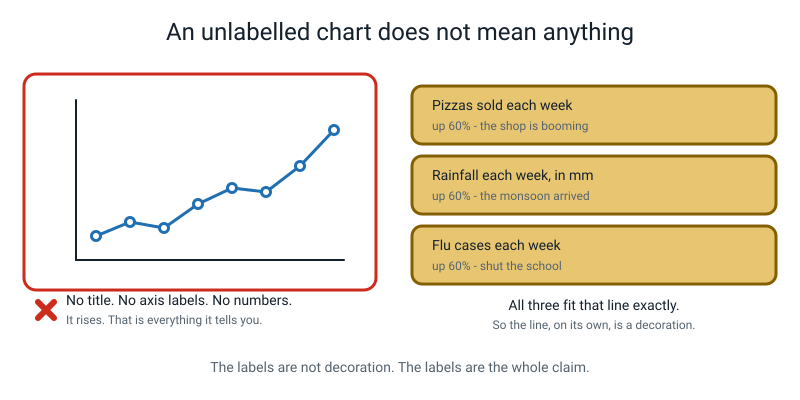
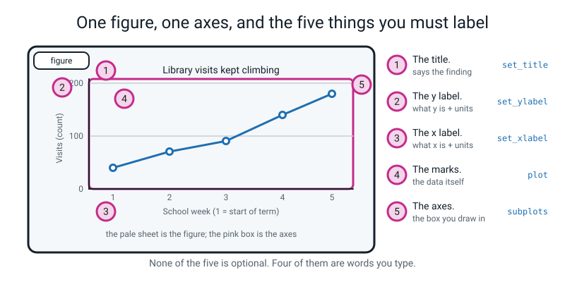
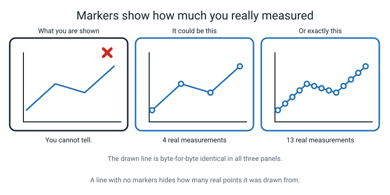
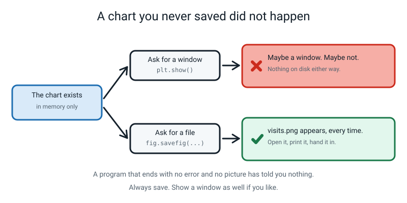
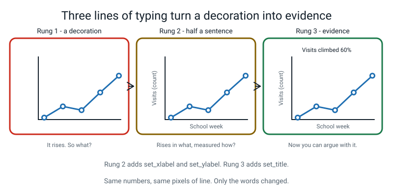
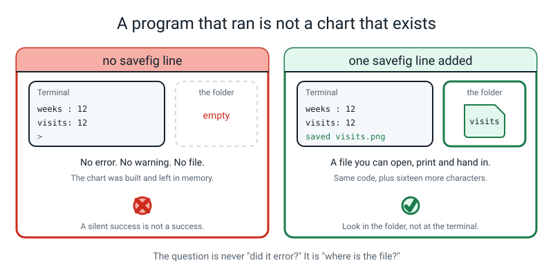
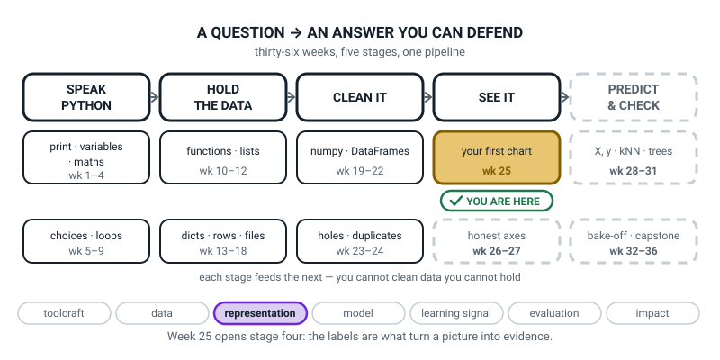
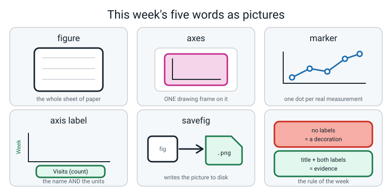

# Week 25 — Drawing the Table: Your First Chart

[⬅ Week 24](week-24.md) · [Course Home](../README.md) · [Next ➡](week-26.md) · [Workbook](../workbook/week-25.md)

---

> ### This week in one sentence
> **A chart with no labels is a decoration — the three lines of typing that add a title and two axis labels are what turn it into evidence.**
>
> **By the end of this chapter you will be able to:**
> - **Make a figure with one axes** and draw a line on it
> - **Put a marker on every real data point** and say why that matters
> - **Add a title and both axis labels**, with the units named in each label
> - **Save a chart to a PNG file** and explain why saving beats showing
> - **Look at an unlabelled chart and state precisely what it does not tell you** — not "it's confusing", but a list
>
> **New syntax:** `fig, ax = plt.subplots(figsize=(6, 4))` · `ax.plot(x, y, marker="o")` · `ax.set_title()` / `ax.set_xlabel()` / `ax.set_ylabel()` · `fig.savefig("f.png", dpi=120, bbox_inches="tight")`
>
> **Reading time:** about 35 minutes. **Homework:** about 60 minutes.

---

## 🪝 Start Here

Somebody has put a piece of paper in front of you. On it there is a line. The line starts low on the left and finishes high on the right, with one small dip in the middle.

There is nothing else on the paper. No title. No numbers. No words down the side, no words along the bottom.

**Write down one true sentence that this chart proves.** Go on, actually do it, on the edge of this page or in your head.

Almost everybody writes the same thing: *"it went up."*

Fine. **What went up?**

You do not know. Neither do I. And that is not a trick — here are three completely different worlds, and the same line fits all three exactly:

- **Pizzas sold each week** at the place on the corner. Up sixty percent over a term. The shop is booming.
- **Rainfall each week, in millimetres.** Up sixty percent. The monsoon came early.
- **Flu cases each week** at your school. Up sixty percent. Somebody should probably shut the school.

Same line. Identical pixels. One of those three is an emergency and two of them are not, and **the picture cannot tell you which.**


*Figure 25.1 — All three note cards fit that line exactly. So the line, on its own, is a decoration.*

Here is the sentence for the whole week. Write it somewhere you will see it again:

> **A chart with no labels is a decoration. The labels are what turn it into evidence.**

The line is the easy part. It is about eleven characters of typing. The words are the chart, and by the end of today you will be making charts nobody can do this to.

---

## 🧠 The Big Idea

> **📌 About the code in this section.** The blocks below are **illustrations, not files**. They show you the shape of one idea, and each one carries on from the one above it — the `import` lines and the data are typed once, in the first block that needs them. **The complete, runnable file is in 💻 Type This.** If you copy a block from this section on its own and Python says `NameError`, that is why, and nothing is broken.

### 1. A figure is a sheet of paper. An axes is one frame ruled onto it.

**The plain explanation.** You are about to use a new library called **matplotlib**, and it will keep using two words at you. They sound like the same word. They are not.

> **matplotlib** — a library that turns lists of numbers into pictures. It is not part of Python; somebody else wrote it and you install it once.
> **figure** — the whole picture, the thing that becomes a `.png` file.
> **axes** — one drawing box inside a figure, with its own title, its own x axis and its own y axis.

**The analogy, and it is exact.** The **figure** is a sheet of paper. The **axes** is one drawing frame you have ruled onto that paper. One sheet can hold several frames side by side — you will do exactly that in Week 27 — but this week there is one sheet and one frame.


*Figure 25.2 — The pale sheet is the figure. The pink box is the axes. Four of the five labelled parts are words you type.*

**And yes, "axes" is a terrible name.** It looks like the plural of "axis". It is not. In matplotlib an *axes* (singular) is the **box**, and inside the box there is an x axis and a y axis. So an axes has two axises. Everybody agrees this is a wart. It has been this way since 2003 and nobody is going to fix it, so hear "axes" and think **"one drawing frame"**.

**A concrete example of why the split matters.** It decides which word you type:

| You want to… | You ask… | Because… |
|---|---|---|
| add a title | `ax.set_title(...)` | the title belongs to one frame |
| label the x axis | `ax.set_xlabel(...)` | so does the axis |
| draw the data | `ax.plot(...)` | you draw *inside* a frame |
| save the file | `fig.savefig(...)` | you save the whole sheet |

Test yourself with one question: *if I drew two graphs on one sheet of paper, how many titles would I need, and how many files would I save?*

**Two titles — one per frame. One file — there is one sheet.** That is the entire reason there are two names.

> **⚠️ Watch out:** `fig.set_title(...)` fails, and the reason is not arbitrary. A sheet of paper does not have a title. A drawing on it does.

### 2. One strange line does two things at once

**The plain explanation.** This is the line:

```python
fig, ax = plt.subplots(figsize=(6, 4))
```

Every assignment you have written since Week 2 has looked like `name = value`. **This one has two names on the left of one equals sign, with a comma between them.**

It works because `plt.subplots()` hands back **two things at once** — a sheet and a frame — and Python lets you catch two things in two boxes in one go. Read it out loud as: *"make a sheet and a frame; put the sheet in a box called `fig`, put the frame in a box called `ax`."*

**The analogy.** Somebody hands you a clipboard and a pen at the same time, one in each of your hands. You do not need two trips.

**A concrete example.** You have already seen the *idea* — `bottom, top = 48.6, 51.4` is the same shape, and so is anything that unpacks a pair. What is new is that a function is doing the handing.

**And what happens if you forget the `fig, `?**

```python
ax = plt.subplots(figsize=(6, 4))
ax.plot([1, 2], [3, 4])
```

```text
Traceback (most recent call last):
  File "brk2.py", line 3, in <module>
    ax.plot([1,2],[3,4])
AttributeError: 'tuple' object has no attribute 'plot'
```

One name caught **both** things stuck together, so `ax` is now holding the pair, not the frame — and a pair cannot draw. That error is in "When It Breaks", and you will meet it for real.

**The other new bit on that line.** `figsize=(6, 4)` is a **keyword argument**, met in Week 10. It says: make the sheet six inches wide and four inches tall. **Inches, not pixels** — matplotlib was built by people printing on paper. The round brackets with a comma are a **pair**, like a coordinate: width first, then height. It is not a list, and this year the difference does not matter to you at all. "A pair you are not going to change" is a complete explanation.

### 3. Markers, and why an unmarked line is a small dishonesty

**The plain explanation.** `marker="o"` puts a small circle on every real measurement. It looks cosmetic. It is not.

> **marker** — the dot drawn at each real data point, so the reader can see how many measurements the line was made from.

**The analogy.** Two people tell you the same story. One of them was there. Without the markers you cannot tell which one you are listening to.


*Figure 25.3 — The drawn line is identical in all three panels. Only the markers say whether it came from 4 measurements or 13.*

**A concrete example.** A smooth line drawn through 4 points and a smooth line drawn through 400 points can be **pixel-for-pixel identical**. Look at Figure 25.3: the line is the same in all three panels. The middle panel came from four measurements. The right-hand one came from thirteen.

Would you trust those two charts the same amount? Of course not. Four points and thirteen points are not the same evidence.

So: **a dot on every real point, every time.** It is eleven characters, and it is the cheapest honesty available in the whole of data work.

> **💡 Try this:** when you finish a chart, count the dots in the PNG. If your table has ten rows and you can only count nine dots, something is wrong and you have just caught it in four seconds.

### 4. Saving beats showing, and why "no error" can mean "no chart"

**The plain explanation.** When your program draws a chart, the chart **exists** — but it exists nowhere you can see. It is sitting in the computer's memory. You have to ask for it.

There are two ways to ask.

You can ask for a **window** to pop up: `plt.show()`. Or you can ask for a **file** on disk: `fig.savefig(...)`.

> **savefig** — the call that writes the figure out as a picture file. `fig.savefig("visits.png", dpi=120, bbox_inches="tight")`.

**The analogy.** You can hold up a drawing for somebody to look at, or you can post it to them. The window is holding it up. The file is posting it.


*Figure 25.4 — Save first, always. Show a window as well if you like, but never instead.*

**A concrete example, and it is the one that will bite you.** `plt.show()` has three problems and the third is the nasty one:

1. **It blocks.** The program stops dead and does not continue until you close the window. It looks like your program has hung. It has not; it is waiting.
2. **It cannot be handed in.** A window is not a file. You cannot print it, email it, or put it in a project folder.
3. **On some computers it does nothing at all.** If matplotlib cannot find a window system, it prints a warning and carries on:

```text
week25_visits.py:20: UserWarning: Matplotlib is currently using agg, which is a
non-GUI backend, so cannot show the figure.
  plt.show()
```

The program finished. Nothing is broken. And no picture appeared anywhere.

**The rule for this whole course: every chart calls `fig.savefig(...)`.** If a window also pops up, lovely. But the file on disk is the deliverable, and it works on every machine, including the ones with no screen at all — which is most of the computers in the world and all of the ones that run real data jobs overnight.

> **⚠️ Watch out:** this is where the biggest misunderstanding of the week lives. **A program that ran with no error is not the same as a chart that exists.** The question is never "did it error?" The question is **"where is the file?"**

### 5. A title states the finding. An axis label states the units.

**The plain explanation.** Two rules, and they are the whole point of the week.

> **axis label** — the words beside an axis saying what was measured **and in what units**.

**Title.** `"Visits vs week"` is a filename, not a title. It lists the ingredients. `"Library visits climbed 60% over one term"` is a title, because it says **what happened**.

**The test:** if your title would sit equally happily on top of *any* chart of that data, it is doing no work and it goes back.

**Axis label.** `"Score"` could be out of 10, out of 100, or a percentage. `"Score (points out of 100)"` cannot be misread. `"Distance"` could be metres or kilometres. **Units, in brackets, every time.** It costs four seconds and removes an entire species of misunderstanding.

**The analogy.** A title is the headline of a newspaper story. The axis labels are the small print that lets you check it.


*Figure 25.5 — Rung 2 adds the two axis labels. Rung 3 adds the title. Same pixels of line all the way along.*

**A concrete example.** Here are five weak titles and their repairs. Read the left column and notice that every single one of them *sounds* like a title:

| Weak title | A title that states the finding |
|---|---|
| "Visits vs week" | "Library visits climbed 60% over one term" |
| "Homework data" | "Homework peaked at 90 minutes on day 7" |
| "Steps" | "Day 6 was the only day over 10,000 steps" |
| "Screen time chart" | "Screen time trebled at the weekend, then dropped back" |
| "Graph of sleep hours by day" | "I slept least on the two days I did the most homework" |

---

## 💻 Type This

Everything goes in your `level2` folder, alongside `myweek.py` from Week 21.

### Step 0 — prove matplotlib is actually there

Before anything else, in a terminal:

```bash
python3 -c "import matplotlib; print(matplotlib.__version__)"
```

You want a version number. Anything recent is fine:

```text
3.7.1
```

If you get `ModuleNotFoundError: No module named 'matplotlib'`, stop and fix that first: `python3 -m pip install matplotlib`. **This is the only thing this week that can eat an hour, so get it out of the way now.**

### Step 1 — a new file, the data, and a seatbelt

Make a file called `week25_visits.py`:

```python
# week25_visits.py -- one line chart, fully labelled, saved to a file.
import matplotlib.pyplot as plt            # the drawing library. Everyone calls it plt.

# Week numbers, in order. This is the x axis.
weeks = [1, 2, 3, 4, 5, 6, 7, 8, 9, 10, 11, 12]

# How many people came into the school library in each of those weeks.
visits = [118, 126, 131, 140, 152, 149,
          158, 171, 166, 158, 174, 189]

print("weeks :", len(weeks))               # how many x values are there?
print("visits:", len(visits))              # how many y values? Must be the same.
```

Run it:

```text
weeks : 12
visits: 12
```

**What the new lines do.**

`import matplotlib.pyplot as plt` — fetch somebody else's code and give it a short nickname. Exactly the same trick as `import numpy as np` from Week 17 and `import pandas as pd` from Week 21. Read it as *"go into the matplotlib library, find the part called `pyplot`, and from now on let me call it `plt`."* **Everybody on Earth writes `plt`**, so when you search the internet in a panic, the code you find will match the code on your screen.

`visits = [...]` **runs over two lines**, and that is allowed. Once you open a square bracket, Python keeps reading until it finds the matching one. Use this. Twelve numbers on one 90-character line is unreadable, including by you, tomorrow.

Those two `print` lines are a **seatbelt**. In a moment you will hand both lists to matplotlib, and it will refuse if they are different lengths — with a confusing message. Printing both counts first turns a confusing error into an obvious one. **Keep them.**

### Step 2 — the sheet, the frame, and the line

Add:

```python
fig, ax = plt.subplots(figsize=(6, 4))     # fig = the sheet of paper, ax = the frame

ax.plot(weeks, visits, marker="o")         # draw the line, dot on every real point
```

**Predict before you run it.** What do you think will happen?

Most people say "a chart appears." Run it:

```text
weeks : 12
visits: 12
```

**Nothing.** No chart. And no error either — look, the program exited perfectly happily.

**The chart exists. It is in memory. Nobody has asked to see it.** That is exactly what Figure 25.4 was about, and this is the most useful failure of the week. Sit with it for a second.

**What the new lines do.** `ax.plot(weeks, visits, marker="o")` draws **inside the frame**. First argument is the x values, second is the y values, and that order is not negotiable. `marker="o"` is a lowercase letter **o**, not a zero — matplotlib refuses the zero with a genuinely baffling error, and it is in "When It Breaks".

### Step 3 — the title

Add:

```python
ax.set_title("Library visits climbed 60% over one term")   # the finding
```

```text
weeks : 12
visits: 12
```

Still nothing. Still no error.

**Notice what the title says.** Not "visits by week" — that is a filename. It says what actually happened: visits climbed sixty percent. Check the arithmetic yourself: 189 ÷ 118 = 1.60, so a 60% rise. **A title you can check is a title worth writing.**

### Step 4 — both axis labels, with the units

Add:

```python
ax.set_xlabel("School week (week 1 = start of term)")      # what x is, and its units
ax.set_ylabel("Visits per week (count of people)")         # what y is, and its units
```

```text
weeks : 12
visits: 12
```

**Still nothing.** You now have a completely, perfectly labelled chart that nobody in the universe can see.

`set_` at the front of those three names is a convention meaning "put this value in". They take one string each. They can go in any order, and you can type them at any point before you save. **If you forget one, nothing breaks — and that is exactly the problem this week is about.**

### Step 5 — save it, and watch the file appear

Add the last two lines:

```python
fig.savefig("visits.png", dpi=120, bbox_inches="tight")    # write the picture to disk
print("saved visits.png")
```

```text
weeks : 12
visits: 12
saved visits.png
```

**Now go and look in the folder.** There is a new file called `visits.png`. Open it. Actually open it — a chart you have not looked at is not finished.

**What the new line does**, argument by argument:

- **`fig.savefig`** — note it is `fig`, the sheet, not `ax`. You save the whole sheet, not one drawing on it.
- **`"visits.png"`** — the filename. The `.png` matters, because matplotlib picks the file format from the extension. Leave it off and you get `visits.png` anyway, silently, which works and teaches you nothing.
- **`dpi=120`** — **dots per inch**. Your sheet is 6 inches wide, so at 120 dpi the file comes out 720 pixels across. Bigger number, sharper picture, bigger file. `dpi=300` is print quality and about four times the size. Try `dpi=40` once, just to see what "too low" looks like.
- **`bbox_inches="tight"`** — "crop off the empty white border, but do not cut off my labels". Without it, matplotlib saves a fixed 6 × 4 inch rectangle and a long axis label can run off the bottom and simply be **missing from the file**. Since the whole point of this week is that the labels *are* the chart, losing half of one is not a small problem. **Type it every single time.**

### The complete finished program

```python
# week25_visits.py -- one line chart, fully labelled, saved to a file.
import matplotlib.pyplot as plt            # the drawing library. Everyone calls it plt.

# Week numbers, in order. This is the x axis.
weeks = [1, 2, 3, 4, 5, 6, 7, 8, 9, 10, 11, 12]

# How many people came into the school library in each of those weeks.
visits = [118, 126, 131, 140, 152, 149,
          158, 171, 166, 158, 174, 189]

print("weeks :", len(weeks))               # how many x values are there?
print("visits:", len(visits))              # how many y values? Must be the same.

fig, ax = plt.subplots(figsize=(6, 4))     # fig = the sheet of paper, ax = the frame

ax.plot(weeks, visits, marker="o")         # draw the line, dot on every real point

ax.set_title("Library visits climbed 60% over one term")   # the finding
ax.set_xlabel("School week (week 1 = start of term)")      # what x is, and its units
ax.set_ylabel("Visits per week (count of people)")         # what y is, and its units

fig.savefig("visits.png", dpi=120, bbox_inches="tight")    # write the picture to disk
print("saved visits.png")
```

Real output:

```text
weeks : 12
visits: 12
saved visits.png
```

### And now from your own table

Your Week 21 file gave you a 10-row DataFrame about your own fortnight. A DataFrame column — `df["day"]` — is exactly the kind of thing `ax.plot` wants.

```python
# week25_myweek_charts.py -- three labelled line charts from my Week 21 table.
import matplotlib.pyplot as plt
from myweek import build_my_week            # my own 10-row table, from Week 21

df = build_my_week()
print(df.shape)


def line_chart(x, y, title, xlabel, ylabel, filename):
    """Draw ONE fully labelled line chart and save it to filename."""
    fig, ax = plt.subplots(figsize=(6, 4))
    ax.plot(x, y, marker="o")               # a dot on every real day
    ax.set_title(title)
    ax.set_xlabel(xlabel)
    ax.set_ylabel(ylabel)
    fig.savefig(filename, dpi=120, bbox_inches="tight")
    print("saved", filename)


DAY_LABEL = "Day of the fortnight (day 1 = first Monday)"

line_chart(df["day"], df["homework_min"],
           "Homework peaked at 90 minutes on day 7",
           DAY_LABEL, "Homework done (minutes)", "myweek_homework.png")

line_chart(df["day"], df["screen_min"],
           "Screen time trebled on day 6, then dropped back",
           DAY_LABEL, "Screen time (minutes)", "myweek_screen.png")

line_chart(df["day"], df["steps"],
           "Day 6 was my only day over 10,000 steps",
           DAY_LABEL, "Steps walked (count)", "myweek_steps.png")

print("homework mean:", round(df["homework_min"].mean(), 1))
print("screen  max  :", df["screen_min"].max())
print("steps   max  :", df["steps"].max())
```

Real output:

```text
(10, 6)
saved myweek_homework.png
saved myweek_screen.png
saved myweek_steps.png
homework mean: 48.0
screen  max  : 180
steps   max  : 11200
```

Three files. **Three different names** — and that is the bit people get wrong. If you copy the first chart and edit it, the one string that does not *look* like it needs changing is the filename in `savefig`, so all three charts quietly write to the same file, each one flattening the last. The terminal says `saved` three times. Nothing is wrong. There is one file where there should be three.

**Check the folder, not the terminal.**

> **💡 Try this:** the function above uses `def` from Week 10 and nothing else new. Six repeated lines became one function called three times. Write it once now, and you will `import` it in your capstone in Week 34.

---

## 🔍 Worked Examples

Three complete programs. Type each one, **predict the output before you run it**, then check.

### Worked Example 1 — One week of pizza orders (food)

```python
"""pizza25.py - one week of pizza orders, drawn and saved."""

import matplotlib.pyplot as plt               # the drawing library

days = [1, 2, 3, 4, 5, 6, 7]                  # day 1 = Monday. In order.
orders = [34, 29, 31, 40, 78, 96, 61]         # pizzas sold that day

print("days  :", len(days))                   # seatbelt: same length?
print("orders:", len(orders))
print("busiest day:", max(orders), "pizzas")
print("quietest day:", min(orders), "pizzas")

fig, ax = plt.subplots(figsize=(6, 4))        # fig = sheet, ax = frame
ax.plot(days, orders, marker="o")             # a dot on every real day

ax.set_title("Pizza orders tripled between Wednesday and Saturday")
ax.set_xlabel("Day of the week (day 1 = Monday)")
ax.set_ylabel("Pizzas ordered (count)")

fig.savefig("pizza_week.png", dpi=120, bbox_inches="tight")
print("saved pizza_week.png")
```

Real output:

```text
days  : 7
orders: 7
busiest day: 96 pizzas
quietest day: 29 pizzas
saved pizza_week.png
```

**Check the title against the numbers.** Wednesday is day 3, at 31 pizzas. Saturday is day 6, at 96. And 96 ÷ 31 = 3.1, so "tripled" is honest. **That is what a title being checkable looks like** — the reader can hold your claim against your own axis and it survives.

**And what it does not tell you.** How many pizzas the shop *could* have made. Whether Saturday was a one-off or every Saturday. Whether the price changed. Seven days is a week, not a pattern.

### Worked Example 2 — Runs off every over (sport)

```python
"""cricket25.py - runs scored in each of twelve overs."""

import matplotlib.pyplot as plt

overs = [1, 2, 3, 4, 5, 6, 7, 8, 9, 10, 11, 12]      # the x axis, in order
runs = [4, 7, 2, 11, 6, 0, 9, 14, 3, 8, 12, 19]      # runs in that over

print("overs:", len(overs))
print("runs :", len(runs))
print("total runs:", sum(runs))
print("best over :", max(runs), "runs")

fig, ax = plt.subplots(figsize=(6, 4))
ax.plot(overs, runs, marker="o")

ax.set_title("Nineteen runs came off the last over")
ax.set_xlabel("Over number (over 1 = first over)")
ax.set_ylabel("Runs scored in that over (count)")

fig.savefig("cricket_overs.png", dpi=120, bbox_inches="tight")
print("saved cricket_overs.png")
```

Real output:

```text
overs: 12
runs : 12
total runs: 95
best over : 19 runs
saved cricket_overs.png
```

**Count the markers.** There should be twelve. If you can only count eleven, one number fell out of one of the two lists — and you would have found that out from the seatbelt prints, because one would say 12 and the other 11.

**And notice why a line is honest here.** The overs are in order, and the space *between* two overs is real time in a real match. That is what earns you the right to join the dots. Next week you will meet a chart where the x axis is **not** in order, and joining the dots turns out to be nonsense.

### Worked Example 3 — Six maths tests (school)

```python
"""marks25.py - my maths marks across six tests, and one dropped number."""

import matplotlib.pyplot as plt

tests = [1, 2, 3, 4, 5, 6]                   # test number, in order
marks = [54, 61, 58, 72, 69, 85]             # my mark out of 100

print("tests:", len(tests))
print("marks:", len(marks))
print("first:", marks[0], " last:", marks[-1])
print("climb:", marks[-1] - marks[0], "points")

fig, ax = plt.subplots(figsize=(6, 4))
ax.plot(tests, marks, marker="o")

ax.set_title("My maths mark climbed 31 points across six tests")
ax.set_xlabel("Test number (test 1 = September)")
ax.set_ylabel("My mark (points out of 100)")

fig.savefig("my_marks.png", dpi=120, bbox_inches="tight")
print("saved my_marks.png")
```

Real output:

```text
tests: 6
marks: 6
first: 54  last: 85
climb: 31 points
saved my_marks.png
```

**`marks[0]` and `marks[-1]`** are Week 11's indexing. Slot 0 is the first, slot −1 is the last, and using them instead of typing `54` and `85` means that if you fix a number in the list, the printed sentence fixes itself.

**Look at the y-axis label.** `"My mark (points out of 100)"`. Without the "out of 100", a mark of 54 could be a disaster or excellent. Four extra words, and now nobody has to guess.

**And what this chart hides.** Whether the tests were the same difficulty. Six tests is not "getting better at maths" — it might be six easier tests. The chart cannot tell you, and neither can the title, and being honest about that is part of the work.

---

## 🐞 When It Breaks

Every message below came from really running a broken version of this week's code. Your line numbers will differ. The last line will not.

### Break 1 — the misspelled label

```python
ax.set_xlable("School week (week 1 = start of term)")
```

```text
Traceback (most recent call last):
  File "brk1.py", line 7, in <module>
    ax.set_xlable("School week (week 1 = start of term)")
AttributeError: 'Axes' object has no attribute 'set_xlable'. Did you mean: 'set_xlabel'?
```

**What Python is telling you.** *"I asked the frame to do something called `set_xlable`, and the frame has never heard of that."* Which is fair, because you typo'd it. **L-A-B-E-L**, not L-A-B-L-E.

**And look — Python guessed for you.** *"Did you mean: 'set_xlabel'?"* It will do that quite often. It is not always right, but when it offers, read it.

**The ritual, every time red appears: read the last line first.** Everything above it is just the route Python took to get there.

### Break 2 — one name where two were needed

```python
ax = plt.subplots(figsize=(6, 4))
ax.plot([1, 2], [3, 4])
```

```text
Traceback (most recent call last):
  File "brk2.py", line 3, in <module>
    ax.plot([1,2],[3,4])
AttributeError: 'tuple' object has no attribute 'plot'
```

**What Python is telling you.** *"The thing you called `ax` is a **pair** of things, not a frame, and a pair cannot draw."*

`plt.subplots()` handed back two things. You gave it one box to put them in, so both went in together. A "tuple" is Python's word for a pair-ish bundle — you saw it in Week 17, when `.shape` came back as `(4, 2)`.

**The fix.** Put `fig, ` back in front: `fig, ax = plt.subplots(figsize=(6, 4))`.

### Break 3 — twelve x values and eleven y values

```python
ax.plot([1, 2, 3, 4], [10, 20, 30])
```

```text
ValueError: x and y must have same first dimension, but have shapes (4,) and (3,)
```

**What Python is telling you.** *"You gave me four x values and three y values. I cannot pair them up."* A point needs both a left-right position and an up-down position, and one of your points has only half of what it needs.

**The fix.** Find the short list and put the missing number back. And this is **exactly** why the seatbelt prints are in the file: `print(len(weeks), len(visits))` finds it in one line, before matplotlib has to complain.

> **🐞 If you see this error:** it is good news. matplotlib could have quietly dropped the extra x value and drawn a chart. It refused instead, and refusing is kinder than a wrong picture.

### The whole clinic, for reference

| What you see | What it means | The fix |
|---|---|---|
| `ModuleNotFoundError: No module named 'matplotlib'` | "There is no matplotlib in the Python I am running." | `python3 -m pip install matplotlib`, then prove it with the one-line version check |
| `ModuleNotFoundError: No module named 'matplotlib.pyplt'` | "There is no such part of matplotlib." | `pyplot`, not `pyplt` |
| `NameError: name 'plt' is not defined` | "You used a name I have never been told about." | `import matplotlib.pyplot as plt` on the **first** line, above everything that uses it |
| `AttributeError: 'Axes' object has no attribute 'set_xlable'. Did you mean: 'set_xlabel'?` | "The frame has never heard of that." | Fix the spelling. Read Python's guess |
| `AttributeError: 'tuple' object has no attribute 'plot'` | "`ax` is holding a pair, not a frame." | `fig, ax = plt.subplots(...)` — two names |
| `ValueError: x and y must have same first dimension, but have shapes (12,) and (11,)` | "Twelve of one, eleven of the other." | `print(len(a), len(b))` and find the short one |
| `ValueError: Unrecognized marker style '0'` | "'0' is not a shape I know how to draw." | `marker="o"` — lowercase letter o, not the digit zero |
| `TypeError: Figure.savefig() missing 1 required positional argument: 'fname'` | "You asked me to save, but not what to call it." | The filename goes first: `fig.savefig("visits.png", dpi=120, bbox_inches="tight")` |
| `SyntaxError: invalid syntax. Perhaps you forgot a comma?` | "I cannot even read this line." | A missing comma between two list items. The `^^^^^` marks the spot |
| `AttributeError: Text.set() got an unexpected keyword argument 'figsize'` | "The title has no size-in-inches. The figure does." | Move `figsize=(6, 4)` into `plt.subplots(...)` |
| `UserWarning: Matplotlib is currently using agg... cannot show the figure.` | "This computer has no window system, so I cannot pop a window. Carrying on." | **Nothing is broken.** It is a warning. Delete `plt.show()` and use `fig.savefig(...)` |
| **No error, no output, no file** | Nothing. The program did exactly what it was told. | There is no `savefig`. Add it, and a `print`, and then look in the folder |

> **🐞 If there is no error message at all:** there is one move and it takes four seconds. **Look in the folder.** Not at the terminal — at the folder. `ls` on macOS or Linux, `dir` on Windows. The absence of the file is the diagnosis.

---

## 🎲 What We Did In Class

If you missed it, here is the whole lesson. Most of the first half needs a pencil rather than a laptop.

### The naked chart

A printed chart, face up on the table: a rising line with a small dip, two bare axis lines, and **not one single word or number anywhere.** The instruction was: *"write one true sentence this chart proves."*

Everybody writes "it went up", and then stops, because nothing else is available. Then the follow-up: *"what went up?"*

Then three note cards, revealed one at a time — **pizzas sold**, **rainfall in mm**, **flu cases** — each of them fitting that identical line, and one of them an emergency.

Four questions were asked of that chart, and all four have the same shape of answer:

| Asked | Answer |
|---|---|
| "What went up?" | You cannot know. |
| "How many measurements is this drawn from?" | Unknowable without markers. |
| "What's the biggest number on it?" | There are no numbers. |
| "Over what period?" | Not stated. Ten days and ten years look the same. |

### Two words on the board, and they stayed up

> **figure** — the whole sheet of paper. It is what becomes the file.
> **axes** — one drawing frame ruled onto that sheet. It has its own title and its own two axes.

Plus the question that settles it: *"if I drew two graphs on one sheet, how many titles and how many files?"* **Two titles, one file.**

### Building `week25_visits.py`, one step at a time, with two mistakes on purpose

The five steps in "Type This", in exactly that order — and the important thing is that **steps 2, 3 and 4 all produced no chart and no error.** Three runs in a row where the program was completely obedient and completely useless.

Then two deliberate mistakes:

- `ax.set_xlable(...)` — the typo, so that everybody sees an `AttributeError` and reads the last line first.
- `plt.show()` — which either opened a window and froze the terminal, or printed the `agg` backend warning and produced nothing at all. Both outcomes teach the same thing.

Then `fig.savefig(...)`, and watching `visits.png` appear in the folder window. **The moment the file appears is the moment the lesson lands.**

### Three charts from your own week, and one planted bug

Three line charts from the Week 21 DataFrame — `homework_min`, `screen_min`, `steps` — each fully labelled, each saved.

The planted bug: about half of everybody copies the first file, edits the plot line and the labels, and **forgets to change the filename in `savefig`**. So all three write to `myweek_homework.png`. The terminal says `saved` three times and there is one file.

The instruction was not "check line 12". It was: **"show me your three files."** Obedient is not the same as correct.

### Six sentences

One "what it shows" and one "what it does **not** tell you", per chart. The second one is where the marks are.

| Chart | What it shows | What it does not tell you |
|---|---|---|
| homework | Homework climbed to 90 minutes on day 7 after a day of none at all. | Which subject, whether it was finished, or whether day 7 was catch-up for day 6. |
| screen time | Screen time trebled on day 6, the Saturday, and dropped back on Sunday. | What was *on* the screen — homework research and cartoons look identical here. |
| steps | Day 6 was the only day over 10,000 steps; day 7 was the lowest at 4,300. | Whether the tracker was worn all day, or what counted as a step. |

---

## 💬 Talk About It

**1. A chart with a perfect title and perfect axis labels can still be misleading. How?**

*Hint:* start by listing what the labels actually promise. A title says what you found; an axis label says what was measured and in what units. **Neither of them says anything about what was left out.** Suppose your library chart covered weeks 1 to 12 and the visits then collapsed in week 13 — the chart is still perfectly labelled and perfectly true, and the impression it gives is wrong. Now go further: who chose the twelve weeks? Who chose to chart *visits* rather than *books borrowed*? Every chart is somebody's argument, and labels tell you what is in the argument, not what was quietly left out of it. So: what could you add to a chart to make the leaving-out visible?

**2. Why does the course insist on `savefig` rather than `plt.show()`, when a window is obviously nicer to look at?**

*Hint:* think about the three problems in §4, and then think about which of them is the *dangerous* one rather than the *annoying* one. Blocking is annoying. Not being handed in is annoying. **Silently producing nothing, with no error, on some computers** is dangerous, because it teaches you to distrust your own correct code. Then push on it from the other side: is there any situation where a window really is better? (Yes — when you are fiddling and want to see forty versions in a minute.) So what is the honest rule? Probably not "never show a window" but "**the file is the work; the window is a convenience**". Say why the order matters.

**3. `marker="o"` is eleven characters. Why does anybody leave it out?**

*Hint:* be honest about what it looks like. With twelve close-together points, the dots genuinely do look like decoration, and a plain line looks cleaner and more "professional". So the reason people leave it out is that **the cost of leaving it out is invisible.** Nothing breaks. Nobody complains. The chart looks better. Now name what has actually been lost, precisely: the reader can no longer tell four measurements from four hundred, and neither can you, in a month. What other four-second checks have you already been given this year that are boring for exactly the same reason? *(Count what went in and what came out. Print the type. Print the shape.)* What do all of them have in common?

---

## ⚠️ Don't Get Tricked

### Trick 1 — "no error means it worked"


*Figure 25.6 — Same program, sixteen extra characters. The left one is obedient and useless.*

| ❌ Wrong | ✅ Right |
|---|---|
| "It ran, there was no red text, so my chart is fine." | A matplotlib program can run perfectly, exit happily, and produce **absolutely nothing**. It did exactly what you told it. You never told it to save. |

The sentence to keep saying to yourself: **a silent success is not a success. Where is the file?**

### Trick 2 — "figure and axes are the same thing"

| ❌ Wrong | ✅ Right |
|---|---|
| "`fig` and `ax` are two names for the same chart, so I can use whichever one." | `fig` is the **sheet**; `ax` is one **frame** on it. `ax.set_title(...)` works and `fig.set_title(...)` does not, and `fig.savefig(...)` works and `ax.savefig(...)` does not. |

The question that sorts it every time: **which one do you save?** The sheet. So the sheet is the figure.

### Trick 3 — "'Visits vs week' is a title"

| ❌ Wrong | ✅ Right |
|---|---|
| "My chart has a title. It says 'Visits vs week'." | That names the **ingredients**. A title names the **finding**: "Library visits climbed 60% over one term". |

**The test:** could that title sit, unchanged, on top of *any* chart of the same data? If yes, it is doing no work.

### Trick 4 — "labels are the tidying-up you do at the end if there's time"

| ❌ Wrong | ✅ Right |
|---|---|
| "I'll get the line working first and add the words later." | The line is one call. **The words are the chart.** Look at Figure 25.5 again: the pixels of the line are identical on all three rungs of the ladder, and only the third one proves anything. |

And the practical version of the same point: an unlabelled chart is not "80% finished". It is **0% finished**, because nobody can act on it, including you.

---

## 🌍 Where You've Seen This

1. **Your phone's battery screen.** A line over 24 hours, with the y axis in percent. Notice what it does *not* label: which apps, or what you were doing. The shape is there; the reason is not.
2. **Every weather app.** Temperature over the next twelve hours, almost always with markers on the real forecast points and a smooth line between them — because the in-between values were never measured, they were guessed.
3. **The graph in a news story about prices.** Look for the axis label. If it says "Price" with no units and no currency, somebody has saved themselves four seconds and cost you the ability to check.
4. **A fitness tracker's weekly steps.** Seven markers, one per day, because there are exactly seven measurements. If it drew a smooth curve with no dots you would have no idea whether it sampled once a day or once a minute.
5. **Exam-results charts in school newsletters.** These are the ones worth interrogating. A rising line labelled "Results" tells you nothing about which subject, which year group, or how many students.
6. **Every chart in a scientific paper** is a saved file, not a window — usually a PNG or a PDF, produced by code that ran on a computer with no screen at all. `fig.savefig(...)` is not a school workaround. It is how the real thing is done.

---

## 🧭 Where This Fits

Everything you do this year is one pipeline: a question goes in one end, and an answer you can
**defend** comes out the other. Look at the map: **three whole stages are solid.** You can speak
Python, you can hold a table, and you can clean it. Stage four opens today — and this is the first
week of the year where the answer comes out as a picture instead of as text.



*Figure 25.0 — The pipeline in Week 25. Stage three is finished, stage four has just opened, and the
gold has jumped a whole stage to the right for the first time since Week 19.*

| | |
|---|---|
| **The mental model you now own** | **One figure, one axes, three labels.** `fig, ax = plt.subplots()` hands you a sheet of paper and one frame ruled onto it. You draw on `ax`, then set the title, the x-label and the y-label — then `savefig`. A chart without labels is a decoration, not evidence. |
| **The one question it answers** | *"What does this table actually look like?"* |
| **What it plugs into** | Week 21's DataFrame, which supplies the x values and the y values; and Week 12's import habit, which is how `pyplot` gets into your file in the first place. |
| **What carries forward** | Week 26 chooses the **shape**. Week 27 makes the axes **honest**. Week 30 plots accuracy against *k*, and Week 33 draws the overfitting curve. Every one of those is this week's five lines with different numbers in them. |
| **Spiral thread** | 🏷️ **Representation**, on its own — one thread, because nothing changed about the data this week. Only how it is **shown** changed, and that is what representation means. |

> **💡 Try this:** find a chart in a newspaper, on a poster or on a cereal box, and check it has all
> three labels — title, x-axis, y-axis. Most do not. From now on you will notice every time.

---

## 🔑 Remember This

- **A chart with no labels is a decoration.** The title and the two axis labels are what turn it into evidence.
- **The figure is the sheet of paper; the axes is one frame ruled onto it.** Titles and labels belong to the frame. Saving belongs to the sheet.
- **`fig, ax = plt.subplots(...)` is the one line all year with two names on the left of one equals sign**, because it hands you two things at once.
- **A title states the finding.** If it would fit on any chart of that data, rewrite it.
- **An axis label states the quantity AND the units**, in brackets. `"Score (points out of 100)"`, never `"Score"`.
- **`marker="o"` on every line.** Lowercase letter o. It is how the reader knows how many real measurements there were.
- **Every chart gets `fig.savefig(...)`.** A window is a bonus; the file is the work.
- **A silent success is not a success.** No error and no file means the program was obedient, not correct. Look in the folder.
- **Say what your chart does not tell you.** Out loud, or in writing, every time. It is the most valuable sentence you will write all week.

### Syntax reminder card

```python
import matplotlib.pyplot as plt          # top of the file. Everybody writes plt.

weeks = [1, 2, 3, 4, 5, 6]               # the x values, in order
visits = [118, 126, 131, 140, 152, 189]  # the y values, same length

# ---- ONE sheet, ONE frame. Two names, one equals sign. -------------------
fig, ax = plt.subplots(figsize=(6, 4))   # 6 inches wide, 4 inches tall
# ax = plt.subplots(...)  ->  AttributeError: 'tuple' object has no attribute 'plot'

# ---- draw INSIDE the frame: x values first, y values second --------------
ax.plot(weeks, visits, marker="o")       # lowercase letter o, NOT a zero
# marker="0"  ->  ValueError: Unrecognized marker style '0'
# lists of different lengths  ->  ValueError: x and y must have same first dimension

# ---- the three label calls belong to the FRAME ---------------------------
ax.set_title("Library visits climbed 60% over one term")   # the FINDING
ax.set_xlabel("School week (week 1 = start of term)")      # quantity + units
ax.set_ylabel("Visits per week (count of people)")         # quantity + units
# ax.set_xlable(...)  ->  AttributeError. L-A-B-E-L.

# ---- saving belongs to the SHEET ----------------------------------------
fig.savefig("visits.png", dpi=120, bbox_inches="tight")
print("saved visits.png")                # so the terminal tells you something
# no savefig at all  ->  no error, no file, nothing. The dangerous one.

# ---- a second chart needs a second filename ----------------------------
fig.savefig("visits.png", dpi=120, bbox_inches="tight")   # chart 1
fig.savefig("visits.png", dpi=120, bbox_inches="tight")   # chart 2 -- SILENTLY
print("saved twice, and there is ONE file")               # flattens chart 1
```

---

## 📓 New Words


*Figure 25.7 — This week's five words, drawn.*

| Word | What it means | Example |
|---|---|---|
| **figure** | The whole sheet of paper — the thing that becomes the `.png` file | the `fig` in `fig, ax = plt.subplots(...)` |
| **axes** | One drawing frame inside a figure, with its own title, x axis and y axis. A bad name; it is a box | the `ax` in `fig, ax = plt.subplots(...)` |
| **marker** | The dot drawn at each real data point, so the reader knows how many measurements there were | `ax.plot(x, y, marker="o")` |
| **axis label** | The words beside an axis saying what was measured **and in what units** | `ax.set_ylabel("Visits per week (count of people)")` |
| **savefig** | The call that writes the figure out as a picture file | `fig.savefig("visits.png", dpi=120, bbox_inches="tight")` |

---

## 📤 Your Homework

Go to **[the Week 25 workbook](../workbook/week-25.md)**. About **60 minutes** in total.

| Section | What to do | Time |
|---|---|---|
| **Warm-Up** | Five quick questions from Week 24 | 5 min |
| **Predict the Output** | Four snippets. Two of them print nothing you expect | 10 min |
| **Practice A & B** | Six reading questions, then five you write yourself | 20 min |
| **Fix the Broken Program** | A step-count chart with three planted bugs — one syntax, one crash, one that produces no error at all | 8 min |
| **Build It — three labelled charts** | Three line charts from your own Week 21 table, each saved as its own PNG, each with two sentences | 17 min |

**Two things are being marked, and the second one is the real one.**

**Do three separate PNG files exist, with three different names?** Not "did it say saved". Open the folder. Count the files. Then **open all three pictures and look at them** — a chart you have not looked at is not finished.

**Does every chart have a "what it does NOT tell you" sentence?** Not "it hides some stuff". Something specific enough that somebody could point at the missing thing. That sentence is the one that will be read first.

> **⚠️ Watch out:** if all three of your charts wrote to the same filename, you will not find out from the terminal. It will happily print `saved` three times. **Look in the folder.**

> **💡 Try this:** after you finish, take one of your three charts and produce a deliberately stripped version with no title and no axis labels. Print both. Show them to somebody in your house and ask what each one means. Bring back what they said — that is this week's hook, run by you, on a real person.

---

[⬅ Week 24](week-24.md) · [Course Home](../README.md) · [Week 26 ➡](week-26.md) · [📓 Workbook — Week 25](../workbook/week-25.md) · [Glossary](../../glossary.md)
