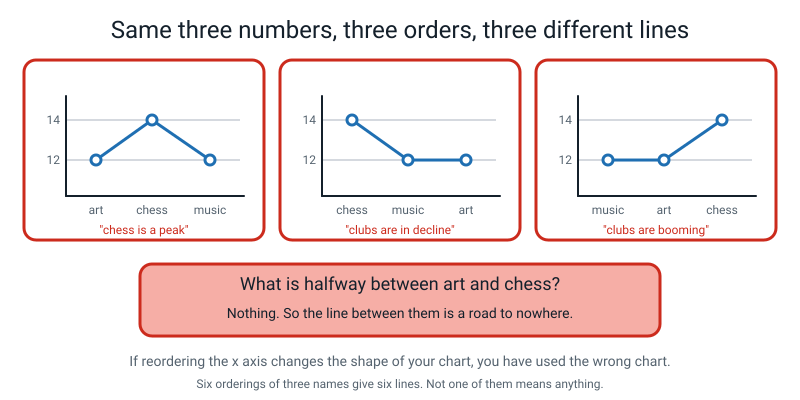
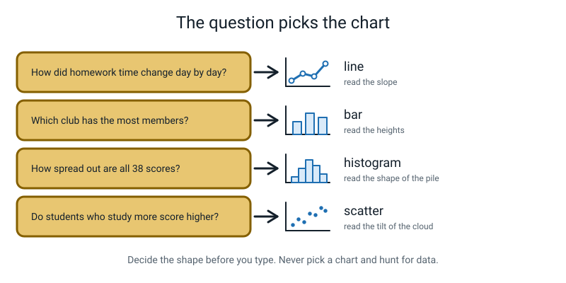
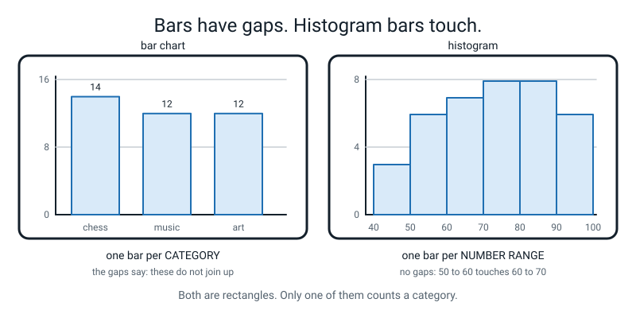
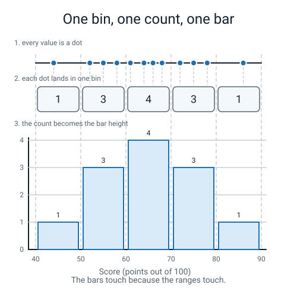
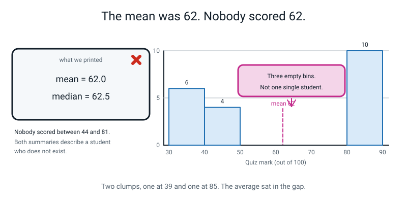
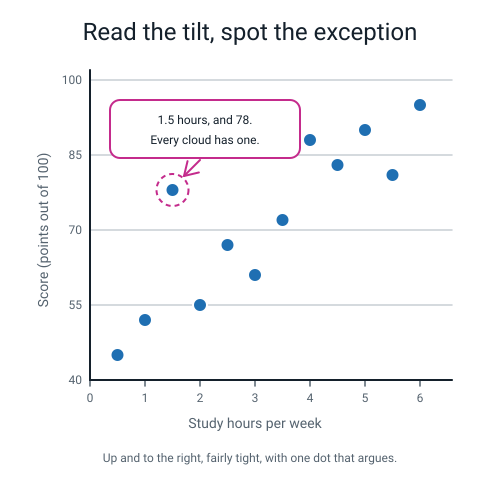
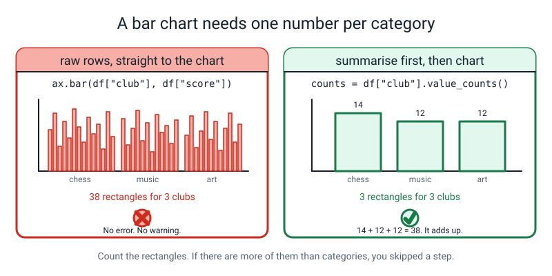
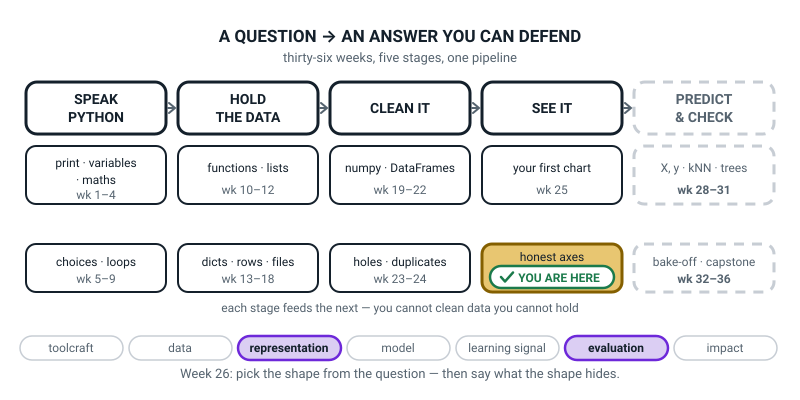
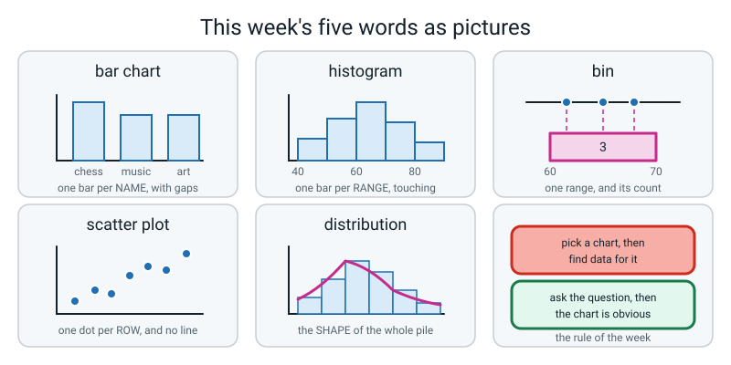

# Week 26 — Five Questions, Five Chart Shapes

[⬅ Week 25](week-25.md) · [Course Home](../README.md) · [Next ➡](week-27.md) · [Workbook](../workbook/week-26.md)

---

> ### This week in one sentence
> **The question decides the chart: comparison goes to a bar, spread goes to a histogram, relationship goes to a scatter — and sometimes the honest answer is no chart at all.**
>
> **By the end of this chapter you will be able to:**
> - **Choose a chart shape from the question being asked**, not from what looks nice
> - **Draw a bar chart of counts** produced by `value_counts()`
> - **Draw a histogram** and describe the spread it reveals
> - **Draw a scatter plot** and describe the relationship in words
> - **State, for each chart you drew, one thing it hides**
>
> **New syntax:** `ax.bar(names, values)` · `ax.hist(values, bins=8)` · `ax.scatter(x, y)` · `df["c"].value_counts()` (back from Week 24)
>
> **Reading time:** about 35 minutes. **Homework:** about 60 minutes.

---

## 🪝 Start Here

Here is a chart somebody made last night. It follows **every single rule** from Week 25. It has a title. It has both axis labels with units. It has markers on every real point. It was saved properly as a PNG.

It is a line chart of three clubs — `art` 12 members, `chess` 14, `music` 12 — with the three names along the bottom.

Put your finger on the bit of line **between art and chess.** That bit, going up.

**What does it mean?**

Try an easier version of the same question. **What is halfway between art and chess?**

There isn't one. There is no half-art-half-chess club. And that is the whole problem, because **a line means you can travel along it.** When you drew a line from week 1 to week 2 last week, the bit in the middle was Tuesday. Tuesday is real. The bit between art and chess is nothing at all.

And it gets worse. Write the three club names in a different order and you get a different-shaped line — from exactly the same three numbers.


*Figure 26.1 — Three orderings, three completely different stories, and the numbers never moved.*

Six orderings of three names, six lines, **and not one of them means anything.**

> **If reordering your x axis changes the shape of your chart, you have used the wrong chart.**

So last week's checklist was not enough. A chart can have a perfect title, perfect labels and perfect units and still be **the wrong shape for the question.** That is this week.

> **The question decides the chart. Not what looks nice, not what you drew last time. The question.**

---

## 🧠 The Big Idea

> **📌 About the code in this section.** The blocks below are **illustrations, not files**. They show you the shape of one idea, and each one carries on from the one above it — the `import` lines and the data are typed once, in the first block that needs them. **The complete, runnable file is in 💻 Type This.** If you copy a block from this section on its own and Python says `NameError`, that is why, and nothing is broken.

### 1. Four shapes, and a fifth answer

**The plain explanation.** People decide "I'll do a bar chart" and *then* go looking for something to put in it. That is backwards, and it produces charts that answer no question at all.

🍕 **The analogy.** You do not pick up a spoon and then go hunting for food that suits a spoon. You look at the soup, and the spoon is obvious. **Look at your question, and the chart is obvious.**


*Figure 26.2 — Four question shapes, four charts. Decide the shape before you type anything.*

**A concrete example — the whole table, and it fits on one screen:**

| The question sounds like… | Shape | What your eye does |
|---|---|---|
| "How did X change **over time**?" | **line** *(Week 25)* | follows a slope — up, down, flat, bumpy |
| "Which **category** is biggest?" | **bar** | compares heights, side by side |
| "What do the values **look like all together**?" | **histogram** | reads the shape of a pile |
| "Do X and Y **go together**?" | **scatter** | reads the tilt and tightness of a cloud |
| *(none of the above)* | **no chart** | prints one number, or hands the question back |

**That last row is not a joke.** Two kinds of question belong there, and for two completely different reasons:

- **"What is the average score?"** is a perfectly good, perfectly measurable question whose answer is **one number**: 72.1. A chart of one number is a single bar standing on its own with nothing to compare it to, which is about the least informative object in this whole subject. `print(df["score"].mean())` is the correct and complete answer.
- **"Is chess better than art?"** is **not answerable at all** until somebody says what "better" means. Higher average score? Higher lowest score? More members? Most consistent? Those are four different charts with four different winners, and if you just pick one you have quietly answered a question nobody asked. The right move is to **hand the question back.**

One needs a `print`. The other needs a conversation.

> **🧑‍🏫 If somebody asks you about box plots:** there is a fifth *drawable* shape, the **box plot**, for the question "how consistent is each group?" It is genuinely useful and genuinely harder to read, and you are not drawing one this year. Know the name so you recognise it in the wild.

### 2. Bar charts, and the difference from a histogram

**The plain explanation.**

> **bar chart** — one rectangle per category, where the height is a number about that category.

The commonest bar chart in the world is a **count** of how many rows fall into each category, and pandas has a one-line tool for it:

```python
club_counts = df["club"].value_counts()
```

Read it as: *"go down the `club` column and count how many times each different value appears."* It hands back a small table with the names down the side and the counts beside them, **sorted biggest first**:

```text
chess    14
music    12
art      12
Name: club, dtype: int64
```

Two parts of that result are what you feed to `ax.bar`:

- `club_counts.index` — the names: `['chess', 'music', 'art']`
- `club_counts.values` — the heights: `[14, 12, 12]`

**`.values` has an s. `.index` does not.** There is no reason for this. You will get it wrong. Python will tell you:

```text
AttributeError: 'Series' object has no attribute 'value'. Did you mean: 'values'?
```

**The analogy for the bar-versus-histogram problem, which is the genuinely hard bit this week.** A bar chart is a row of separate buckets, one per named group. A histogram is a **ruler** with the values piled up along it. You can rearrange buckets. You cannot rearrange a ruler.


*Figure 26.3 — One bar per category, with gaps. One bar per number range, touching. The gaps are the tell.*

**A concrete example — the five differences:**

| | Bar chart | Histogram |
|---|---|---|
| One rectangle is… | one **category** | one **number range** |
| The x axis holds… | names | numbers |
| Do the bars touch? | **No** — gaps, because categories do not join up | **Yes** — because 50-to-60 touches 60-to-70 |
| How many columns of data? | two (names, values) | **one** (just the numbers) |
| Can you reorder the bars? | Yes, freely | **No** — the order is the number line |

> **⚠️ Watch out — the failure that produces no error at all.** `ax.bar(df["club"], df["score"])` runs perfectly and draws **38 rectangles**, one per row, crammed into three columns. No error, no warning, and a completely meaningless picture. **A bar chart needs one number per category**, which means you must summarise first — `value_counts()` for counts, `groupby(...).mean()` from Week 24 for averages.

### 3. Histograms, bins, and the free check

**The plain explanation.** A histogram takes **one** column of numbers and no categories at all. It chops the range into equal slices and counts how many values landed in each slice.

> **histogram** — chops one column of numbers into ranges, and shows how many values landed in each range.
> **bin** — one of those ranges.
> **distribution** — the whole shape of the pile of values.

```python
counts, edges, bars = ax.hist(scores, bins=8, edgecolor="white")
```

- `scores` — one column of numbers.
- `bins=8` — "chop the range into eight equal-width slices". matplotlib finds the lowest and highest value and divides the gap between them into eight.
- `edgecolor="white"` — a thin white line between neighbouring bars so you can count them. Not decoration: without it, touching bars merge into one solid slab.
- **Three names on the left**, catching the three things `hist` hands back: the **counts** per bin, the **edges** it chose, and the drawn rectangles. This is the same two-names-one-equals trick as `fig, ax`, with three.


*Figure 26.4 — Every value drops into exactly one bin. The bin's count becomes the bar's height. That is the whole mechanism.*

**A concrete example.** Here is a histogram of the 38 scores in the cleaned Week 24 table:

```text
counts: [3. 4. 4. 5. 6. 5. 6. 5.]
edges : [42.   48.88 55.75 62.62 69.5  76.38 83.25 90.12 97.  ]
bins add up to: 38.0
```

Two things to notice, and the first one is a habit you should keep for life.

**One: the counts add up to 38** — the number of students. **Check this every single time.** If they do not add up, a value has fallen through a crack, which usually means a bin edge is in the wrong place. It is a two-second check and it catches real mistakes.

**Two: the edges are ugly.** 48.88, 55.75, 62.62. matplotlib divided 42-to-97 into eight equal slices and did not care that the answers were not round numbers. You can hand it your own edges instead — `bins=range(40, 101, 10)` gives 40, 50, 60 … 100, and the counts come out `[3. 6. 7. 8. 8. 6.]`, which is much easier to describe out loud. For a chart somebody else will read, do that.

**And what happens if you histogram a column of words?** It does not crash. It does this:

```text
counts: [14.  0.  0.  0. 12.  0.  0. 12.]
edges : [0.   0.25 0.5  0.75 1.   1.25 1.5  1.75 2.  ]
```

matplotlib turned three club names into 0, 1 and 2 and binned *those*. **What is 0.75 of a club?** The counts happen to be right; the x axis is meaningless nonsense. A wrong answer with no error message is more dangerous than a crash, because a crash stops you and this hands you a chart you can print and put in a project.

**The three things to read off every histogram, in this order:**

1. **Centre** — where is the bulk?
2. **Spread** — narrow pile or wide pile?
3. **Shape** — one hump? two humps? a long tail off one side? a gap?

Number 3 is the one nobody checks and the one that bites, which is the next section.

### 4. The sting: the mean was 62 and nobody scored 62

**The plain explanation.** Twenty students sat quiz 3. Here are all twenty marks:

```
33, 35, 37, 38, 39, 39, 40, 41, 42, 44, 81, 83, 84, 85, 85, 86, 86, 87, 87, 88
```

- **Total** = 1240. **Mean** = 1240 ÷ 20 = **62.0**
- Sorted, the middle two values are **44 and 81**, so the **median** = (44 + 81) ÷ 2 = **62.5**

Both summaries say sixty-two. A perfectly reasonable teacher would write "the class averaged 62, a middling result" and move on.

**Now count how many students scored between 44 and 81.**

**Nobody.** Not one person. The average is 62 and the nearest human being to it is eighteen marks away. **The mean is describing somebody who does not exist.**

And here is the part that should genuinely bother you: **the median got fooled just as badly.** The median is supposed to be the safe one, the one that shrugs off weird values. It landed **in the gap** between the two clumps. Where is the middle of a doughnut?


*Figure 26.5 — Two clumps, one at 39 and one at 85. Both summary numbers landed in the empty middle.*

**The histogram makes it unmissable in half a second:**

```text
counts: [6. 4. 0. 0. 0. 0. 1. 9.]
```

Six, four, then **four completely empty bins**, then one, then nine. Two clumps and a canyon.

> **bimodal** — a distribution with two separate humps, which almost always means two different groups have been mixed together.

And when you go and ask, that is exactly what it was: ten of the twenty had done the Level 1 course and ten had never written a line of code. Their means:

```text
brand new  : [33, 35, 37, 38, 39, 39, 40, 41, 42, 44]
  their mean: 38.8
did Level 1: [81, 83, 84, 85, 85, 86, 86, 87, 87, 88]
  their mean: 85.2
everyone   : mean 62.0
```

**Two honest averages, mashed into one dishonest one.** The arithmetic was flawless every step of the way.

The sentence for the week: **draw the histogram before you quote the average.** It costs three lines.

> **⚠️ Watch out — do not over-correct.** "Averages are lies, never use them" is the wrong lesson. Go back to the 38-score histogram: mean 72.1, median 72.5, one broad pile, no gap. **That mean is completely fine** — and you know that because you looked.

### 5. Scatter plots, and how to describe one without overclaiming

**The plain explanation.**

> **scatter plot** — one dot per row, placed at (x, y). The shape of the cloud is the answer.

```python
ax.scatter(df["hours"], df["score"])
```

Two number columns, and **no line**. Never join scatter dots up — a line would say you travelled from one dot to the next in that order, and you did not. Each dot is a different person.

**The analogy.** A scatter plot is thirty-eight people standing in a field, each one positioned by two facts about themselves. You are reading the *shape of the crowd*, not a route through it.


*Figure 26.6 — Direction, tightness, and the one dot worth arguing about.*

**A concrete example — the three things to say, in words, about any scatter:**

1. **Direction** — up to the right, down to the right, or no tilt at all.
2. **Tightness** — a narrow band, or a shapeless blob?
3. **Exceptions** — is there a dot a long way off the pattern? *That dot is usually the most interesting row in the whole table.*

For the 38 students, hours against score: *"Up to the right, quite a tight band, and there is one dot at about 1.5 hours and 78 that is well above the rest."*

**And now the discipline that matters more than any of the drawing.** Say:

> *"Students who studied more **tended to** score higher."*

Do **not** say:

> ~~*"Studying raised their scores."*~~

The first is a description of a picture. The second is a claim about **cause**, and a scatter plot cannot support it. Next week spends a whole lesson on why. Today, just police the verb: **"tended to go with"**, never **"caused"**.

### 6. Every chart hides something — and naming it is the real skill

**The plain explanation.** This is the idea that turns chart-drawing into thinking, and "it hides some information" is not an answer. It has to be something you could put your finger on.

> **A chart that hides only irrelevant detail is called clear. A chart that hides a decision-changing detail is called misleading. The code is identical.** The difference lives entirely in what somebody is going to *do* next.

**A concrete example, worked for four real charts:**

| Chart | What it shows | What it hides — specifically |
|---|---|---|
| bar of club counts | chess 14, music 12, art 12 | **Every score.** Chess's 14 members range from 55 to 97; the bar is one number standing in front of a very mixed crowd. |
| bar of house means | Blue 74.36, Red 74.25, Green 67.42 | **How many rows each average came from** (Blue 14, Red 12, Green 12), and the spread inside each house — Blue's scores run 42 to 93. A mean of 12 rows and a mean of 12,000 look identical on a bar chart. Also: Blue beats Red by **0.11 of a mark**, which is nothing. |
| histogram of scores | wide, 42 to 97, no single peak | **Who.** The five students in the top bin (90.1 to 97) could be all one club or one from each. A histogram deliberately throws away every column except one — that is what makes it readable and what makes it blind. |
| scatter of age vs hours | older students reported fewer hours | **Dots landing on top of each other.** There are 38 rows but only **23** different (age, hours) pairs, so 15 students are invisible underneath other students. The chart looks like it has 23 people in it. |

That last one is a professional-grade observation, and you can check it in one line of Week 24 code: `df.groupby(["age", "hours"]).size()` has 23 rows, not 38.

---

## 💻 Type This

Everything goes in your `level2` folder, alongside `students.py` — the cleaned 38-row table that came out of Week 24's Mess Detective.

### Step 1 — count the categories, and look before you draw

Make a file called `week26_counts.py`:

```python
# week26_counts.py -- "Which club has the most members?" -> a BAR chart.
import matplotlib.pyplot as plt
from students import build_students          # the cleaned 38-row table from Week 24

df = build_students()

club_counts = df["club"].value_counts()      # count the rows for each club
print(club_counts)                           # LOOK at it before you draw it
```

Real output:

```text
chess    14
music    12
art      12
Name: club, dtype: int64
```

**One line did the counting.** `value_counts()` went down the club column, counted how many times each different value showed up, and **sorted them biggest-first** without being asked.

Notice the print came *before* any drawing. Always. If those numbers are wrong the chart will be wrong, and it is much easier to spot a wrong number than a wrong picture.

### Step 2 — pull out the names and the heights

Add:

```python
print()
print("names :", list(club_counts.index))    # the category names
print("values:", list(club_counts.values))   # the bar heights
print("total :", club_counts.sum())          # must add back up to 38
```

Real output:

```text
chess    14
music    12
art      12
Name: club, dtype: int64

names : ['chess', 'music', 'art']
values: [14, 12, 12]
total : 38
```

**14 + 12 + 12 = 38**, which is how many students there are. That check takes two seconds.

> **⚠️ Watch out:** type `club_counts.value` without the s and you get `AttributeError: 'Series' object has no attribute 'value'. Did you mean: 'values'?` — and Python's guess is right. `index` has no s; `values` does.

### Step 3 — the bar chart

Add:

```python
fig, ax = plt.subplots(figsize=(6, 4))
ax.bar(club_counts.index, club_counts.values)   # one rectangle per club

ax.set_title("Chess is the biggest club: 14 of our 38 students")
ax.set_xlabel("Club")
ax.set_ylabel("Number of students (count)")

fig.savefig("club_counts.png", dpi=120, bbox_inches="tight")
print("saved club_counts.png")
```

Real output:

```text
chess    14
music    12
art      12
Name: club, dtype: int64

names : ['chess', 'music', 'art']
values: [14, 12, 12]
total : 38
saved club_counts.png
```

**Open the PNG.** `ax.bar(names, heights)` — first argument what goes along the bottom, second what goes up the side, exactly like `ax.plot`. And notice the title still states a finding, and the y label still names its units: **count**, not just "students".

### Step 4 — a new file, and a histogram's food

Make `week26_spread.py`:

```python
# week26_spread.py -- "How spread out are the scores?" -> a HISTOGRAM.
import matplotlib.pyplot as plt
from students import build_students

df = build_students()

scores = df["score"]                 # ONE column of numbers. That is a histogram's food.
print("how many:", len(scores))
print("lowest  :", scores.min())
print("highest :", scores.max())
print("mean    :", round(scores.mean(), 1))
print("median  :", scores.median())
```

Real output:

```text
how many: 38
lowest  : 42
highest : 97
mean    : 72.1
median  : 72.5
```

Mean 72.1 and median 72.5, only 0.4 apart. **Hold on to that**, because in ninety seconds it is going to matter.

### Step 5 — get it wrong on purpose: a histogram of words

Type this deliberately:

```python
fig, ax = plt.subplots(figsize=(6, 4))
counts, edges, bars = ax.hist(df["club"], bins=8)
print("counts:", counts)
print("edges :", edges)
```

Real output — **and there is no error:**

```text
how many: 38
lowest  : 42
highest : 97
mean    : 72.1
median  : 72.5
counts: [14.  0.  0.  0. 12.  0.  0. 12.]
edges : [0.   0.25 0.5  0.75 1.   1.25 1.5  1.75 2.  ]
```

Look at the edges. Zero, nought-point-two-five, nought-point-five. **What is 0.75 of a club?**

matplotlib quietly turned the three club names into 0, 1 and 2 and chopped the range from 0 to 2 into eight slices. The counts are even *correct* — 14, 12, 12. And the x axis is complete nonsense.

**This is worse than a crash.** A crash stops you. This hands you a chart you can print. Delete those four lines.

### Step 6 — the histogram, done properly

```python
fig, ax = plt.subplots(figsize=(6, 4))
counts, edges, bars = ax.hist(scores, bins=8, edgecolor="white")

print("counts:", counts)
print("edges :", edges.round(2))
print("bins add up to:", counts.sum())

ax.set_title("Scores spread all the way from 42 to 97, with no single peak")
ax.set_xlabel("Score (points out of 100)")
ax.set_ylabel("Number of students (count)")

fig.savefig("score_spread.png", dpi=120, bbox_inches="tight")
print("saved score_spread.png")
```

Real output:

```text
how many: 38
lowest  : 42
highest : 97
mean    : 72.1
median  : 72.5
counts: [3. 4. 4. 5. 6. 5. 6. 5.]
edges : [42.   48.88 55.75 62.62 69.5  76.38 83.25 90.12 97.  ]
bins add up to: 38.0
saved score_spread.png
```

**Thirty-eight. It adds up.**

Now read the shape out loud, in three parts. **Centre:** the bulk sits between about 60 and 90. **Spread:** very wide — 42 all the way to 97. **Shape:** one broad flat pile, no single peak, no isolated bars. So mean 72.1 and median 72.5 are close together and **this mean is safe to quote** — and the reason you know is that you looked.

### Step 7 — the sting

Make `week26_sting.py`. Type it all before running anything, and **guess the average first**:

```python
# week26_sting.py -- the average said 62. Nobody scored 62.
import matplotlib.pyplot as plt

# Quiz 3, out of 100, every one of the 20 members of the coding club.
marks = [33, 35, 37, 38, 39, 39, 40, 41, 42, 44,
         81, 83, 84, 85, 85, 86, 86, 87, 87, 88]

total = sum(marks)                          # add them all up
mean = total / len(marks)                   # the average
ordered = sorted(marks)                     # a sorted copy, low to high
middle_left = ordered[9]                    # the 10th value (slots count from 0)
middle_right = ordered[10]                  # the 11th value
median = (middle_left + middle_right) / 2   # 20 values, so average the middle two

print("how many:", len(marks))
print("total   :", total)
print("mean    :", mean)
print("median  :", median)
print("the middle two values were", middle_left, "and", middle_right)

fig, ax = plt.subplots(figsize=(6, 4))
counts, edges, bars = ax.hist(marks, bins=8, edgecolor="white")

print("counts:", counts)
print("edges :", [round(e, 2) for e in edges])

ax.set_title("Mean = 62, and nobody scored between 44 and 81")
ax.set_xlabel("Quiz 3 mark (points out of 100)")
ax.set_ylabel("Number of students (count)")

fig.savefig("marks_sting.png", dpi=120, bbox_inches="tight")
print("saved marks_sting.png")
```

Real output:

```text
how many: 20
total   : 1240
mean    : 62.0
median  : 62.5
the middle two values were 44 and 81
counts: [6. 4. 0. 0. 0. 0. 1. 9.]
edges : [33.0, 39.88, 46.75, 53.62, 60.5, 67.38, 74.25, 81.12, 88.0]
saved marks_sting.png
```

**Open `marks_sting.png` and look at the hole in the middle.** Six, four, four empty bins, one, nine.

### Step 8 — why the hole was there

```python
# week26_split.py -- WHY the histogram had a hole in the middle.
marks = [33, 35, 37, 38, 39, 39, 40, 41, 42, 44,
         81, 83, 84, 85, 85, 86, 86, 87, 87, 88]

brand_new = marks[:10]        # slots 0 to 9
did_level1 = marks[10:]       # slots 10 to 19

print("brand new  :", brand_new)
print("  their mean:", sum(brand_new) / len(brand_new))
print("did Level 1:", did_level1)
print("  their mean:", sum(did_level1) / len(did_level1))
print("everyone   : mean", sum(marks) / len(marks))
```

Real output:

```text
brand new  : [33, 35, 37, 38, 39, 39, 40, 41, 42, 44]
  their mean: 38.8
did Level 1: [81, 83, 84, 85, 85, 86, 86, 87, 87, 88]
  their mean: 85.2
everyone   : mean 62.0
```

**38.8 and 85.2.** Two real groups. One made-up number in the middle.

### Step 9 — the scatter, and a bar of averages

Two more files, one for each of the remaining shapes.

```python
# week26_together.py -- "Do study hours and scores go together?" -> a SCATTER plot.
import matplotlib.pyplot as plt
from students import build_students

df = build_students()

print("rows:", len(df))            # one dot per row, so 38 dots

fig, ax = plt.subplots(figsize=(6, 4))
ax.scatter(df["hours"], df["score"])     # x values, y values, and NO line

ax.set_title("Students who studied more hours tended to score higher")
ax.set_xlabel("Study hours per week")
ax.set_ylabel("Score (points out of 100)")

fig.savefig("hours_vs_score.png", dpi=120, bbox_inches="tight")
print("saved hours_vs_score.png")
```

```text
rows: 38
saved hours_vs_score.png
```

Note the title: *"tended to score higher"*. Not "studying raised their scores". **Police the verb.**

```python
# week26_house_means.py -- "Which house has the highest average score?" -> BAR.
import matplotlib.pyplot as plt
from students import build_students

df = build_students()

house_mean = df.groupby("house")["score"].mean().sort_values(ascending=False)
print(house_mean.round(2))
print("row counts:")
print(df["house"].value_counts())

fig, ax = plt.subplots(figsize=(6, 4))
ax.bar(house_mean.index, house_mean.values)

ax.set_title("Blue and Red are level; Green is 7 points behind")
ax.set_xlabel("House")
ax.set_ylabel("Mean score (points out of 100)")

fig.savefig("house_means.png", dpi=120, bbox_inches="tight")
print("saved house_means.png")
```

Real output:

```text
house
Blue     74.36
Red      74.25
Green    67.42
Name: score, dtype: float64
row counts:
Blue     14
Red      12
Green    12
Name: house, dtype: int64
saved house_means.png
```

**This is also a bar chart, and it is doing completely different arithmetic underneath.** The club chart's heights were **counts**, from `value_counts()`. These heights are **averages**, from `groupby`. Identical picture, and a reader cannot tell which they are looking at unless your y-axis label says so. That is why it reads `Mean score (points out of 100)` and not just `Score`.

> **💡 Try this:** Blue is 74.36 and Red is 74.25. Is Blue better? A gap of **0.11 of a mark** across twelve or fourteen students is nothing at all, and no chart of three bars can tell you otherwise. Hold that thought; it is next week's entire lesson.

---

## 🔍 Worked Examples

Three complete programs. **Write down which shape each question needs before you look at the code.**

### Worked Example 1 — Twenty pizza orders (food)

Two questions, two shapes: *which topping wins* is a **bar**, and *how are the prices spread* is a **histogram**.

```python
"""pizza26.py - 20 pizza orders. Which topping wins, and how are prices spread?"""

import matplotlib.pyplot as plt
import pandas as pd

orders = pd.DataFrame({
    "topping": ["paneer", "corn", "paneer", "olive", "corn", "paneer",
                "paneer", "corn", "olive", "paneer", "corn", "paneer",
                "olive", "paneer", "corn", "paneer", "corn", "olive",
                "paneer", "corn"],
    "price":   [320, 199, 320, 250, 199, 340, 320, 210, 250, 320,
                199, 360, 265, 320, 220, 320, 199, 250, 340, 199],
})

print("rows:", len(orders))

# --- Q1: "Which topping is ordered most?" -> BAR of value_counts -----------
topping_counts = orders["topping"].value_counts()
print(topping_counts)
print("total:", topping_counts.sum())

fig, ax = plt.subplots(figsize=(6, 4))
ax.bar(topping_counts.index, topping_counts.values)
ax.set_title("Paneer is ordered almost half the time: 9 of 20 orders")
ax.set_xlabel("Topping")
ax.set_ylabel("Number of orders (count)")
fig.savefig("pizza_toppings.png", dpi=120, bbox_inches="tight")
print("saved pizza_toppings.png")

# --- Q2: "How are the prices spread out?" -> HISTOGRAM ---------------------
fig, ax = plt.subplots(figsize=(6, 4))
counts, edges, bars = ax.hist(orders["price"], bins=6, edgecolor="white")
print("counts:", counts, "-> adds up to", counts.sum())
print("edges :", edges.round(1))
ax.set_title("Prices sit in two clumps: around 200 and around 320")
ax.set_xlabel("Price paid (rupees)")
ax.set_ylabel("Number of orders (count)")
fig.savefig("pizza_prices.png", dpi=120, bbox_inches="tight")
print("saved pizza_prices.png")

print("mean price  :", round(orders["price"].mean(), 1))
print("median price:", orders["price"].median())
```

Real output:

```text
rows: 20
paneer    9
corn      7
olive     4
Name: topping, dtype: int64
total: 20
saved pizza_toppings.png
counts: [7. 3. 1. 0. 6. 3.] -> adds up to 20.0
edges : [199.  225.8 252.7 279.5 306.3 333.2 360. ]
saved pizza_prices.png
mean price  : 270.0
median price: 257.5
```

**Look at those bin counts: `7, 3, 1, 0, 6, 3`.** There is a zero in the middle. Two clumps again — a cheap group around 200 and an expensive group around 320 — and the **mean price of 270 lands in the almost-empty third bin (252.7 to 279.5), which holds just one order.** The average customer, on that number, is somebody who does not exist.

And 9 + 7 + 4 = 20, and the bin counts add to 20. **Both checks passed.**

### Worked Example 2 — Fourteen players, three questions (sport)

```python
"""cricket26.py - 14 players. Which team, how are scores spread, and do balls go with runs?"""

import matplotlib.pyplot as plt
import pandas as pd

squad = pd.DataFrame({
    "name":  ["Asha", "Ravi", "Nita", "Sam", "Kabir", "Meera", "Dev",
              "Tara", "Omar", "Priya", "Zane", "Ivy", "Jai", "Lena"],
    "team":  ["Falcons", "Falcons", "Kites", "Kites", "Falcons", "Kites",
              "Falcons", "Kites", "Falcons", "Kites", "Falcons", "Kites",
              "Falcons", "Kites"],
    "balls": [32, 20, 55, 9, 41, 28, 3, 39, 44, 18, 61, 70, 12, 25],
    "runs":  [48, 12, 77, 5, 63, 30, 0, 41, 55, 22, 90, 104, 14, 33],
})

print("rows:", len(squad))

# --- Q1: "How many players per team?" -> BAR ------------------------------
team_counts = squad["team"].value_counts()
print(team_counts)
fig, ax = plt.subplots(figsize=(6, 4))
ax.bar(team_counts.index, team_counts.values)
ax.set_title("Both teams have exactly 7 players")
ax.set_xlabel("Team")
ax.set_ylabel("Number of players (count)")
fig.savefig("cricket_teams.png", dpi=120, bbox_inches="tight")
print("saved cricket_teams.png")

# --- Q2: "How are the run totals spread out?" -> HISTOGRAM ----------------
fig, ax = plt.subplots(figsize=(6, 4))
counts, edges, bars = ax.hist(squad["runs"], bins=6, edgecolor="white")
print("counts:", counts, "-> adds up to", counts.sum())
print("edges :", edges.round(1))
ax.set_title("Most players scored under 50; only three passed 75")
ax.set_xlabel("Runs scored (count)")
ax.set_ylabel("Number of players (count)")
fig.savefig("cricket_runs_hist.png", dpi=120, bbox_inches="tight")
print("saved cricket_runs_hist.png")

# --- Q3: "Do balls faced go with runs scored?" -> SCATTER -----------------
fig, ax = plt.subplots(figsize=(6, 4))
ax.scatter(squad["balls"], squad["runs"])
ax.set_title("Players who faced more balls tended to score more runs")
ax.set_xlabel("Balls faced (count)")
ax.set_ylabel("Runs scored (count)")
fig.savefig("cricket_balls_vs_runs.png", dpi=120, bbox_inches="tight")
print("saved cricket_balls_vs_runs.png")
```

Real output:

```text
rows: 14
Falcons    7
Kites      7
Name: team, dtype: int64
saved cricket_teams.png
counts: [4. 3. 2. 2. 1. 2.] -> adds up to 14.0
edges : [  0.   17.3  34.7  52.   69.3  86.7 104. ]
saved cricket_runs_hist.png
saved cricket_balls_vs_runs.png
```

**Three shapes, three questions, one table.** Notice that Q1's bar chart has both bars the same height, which is a perfectly good and slightly boring finding — and the title says so honestly instead of pretending there is a winner.

**The histogram shape:** `4, 3, 2, 2, 1, 2` — a big pile at the low end and a long thin tail off to the right. That is a completely different shape from two clumps, and the words for it are *"most players low, a few very high"*.

**And what the scatter hides:** which **team** each dot belongs to. Two seven-player teams are mixed together in that cloud and there is no way to pull them apart. If the Falcons were all in the top-right you would badly want to know, and this chart cannot tell you.

### Worked Example 3 — Twenty-four reading speeds (school)

```python
"""reading26.py - 24 reading speeds. The average describes nobody."""

import matplotlib.pyplot as plt

# Words per minute, measured for all 24 students in 7C.
wpm = [88, 92, 95, 97, 99, 101, 103, 104, 106, 108, 110, 112,
       178, 181, 184, 186, 188, 191, 193, 195, 197, 200, 203, 206]

print("how many:", len(wpm))
print("mean    :", round(sum(wpm) / len(wpm), 1))
ordered = sorted(wpm)
print("median  :", (ordered[11] + ordered[12]) / 2)
print("middle two values:", ordered[11], "and", ordered[12])

fig, ax = plt.subplots(figsize=(6, 4))
counts, edges, bars = ax.hist(wpm, bins=8, edgecolor="white")
print("counts:", counts, "-> adds up to", counts.sum())
print("edges :", edges.round(1))

ax.set_title("Mean = 146.5 words a minute, and nobody read between 112 and 178")
ax.set_xlabel("Reading speed (words per minute)")
ax.set_ylabel("Number of students (count)")
fig.savefig("reading_speeds.png", dpi=120, bbox_inches="tight")
print("saved reading_speeds.png")

slow = wpm[:12]
fast = wpm[12:]
print("group 1 mean:", round(sum(slow) / len(slow), 1))
print("group 2 mean:", round(sum(fast) / len(fast), 1))
```

Real output:

```text
how many: 24
mean    : 146.5
median  : 145.0
middle two values: 112 and 178
counts: [6. 6. 0. 0. 0. 0. 6. 6.] -> adds up to 24.0
edges : [ 88.  102.8 117.5 132.2 147.  161.8 176.5 191.2 206. ]
saved reading_speeds.png
group 1 mean: 101.2
group 2 mean: 191.8
```

**`6, 6, 0, 0, 0, 0, 6, 6`.** That is the cleanest bimodal shape you will see all year — four consecutive empty bins with twelve students on each side.

Mean 146.5. Median 145.0. **Both wrong about everybody**, and both arithmetically perfect. The two real groups read at about 101 and about 192 words a minute, which are almost certainly two different things going on — perhaps some students had read the passage before.

**Try changing `bins=8` to `bins=4` and run it again.** With `bins=4` the hole is still there (`[10, 0, 0, 10]`); only if you go down to `bins=2` does it vanish, because then each hump has a bin to itself and there is nothing left between them. Then try `bins=12`. **If the two humps survive changing the bin count, you can trust them. If they appear and vanish, you have found something to think about rather than something to report.**

---

## 🐞 When It Breaks

Every message below came from really running a broken version of this week's code.

### Break 1 — `.value` instead of `.values`

```python
print("values:", list(club_counts.value))
```

```text
Traceback (most recent call last):
  File "p1.py", line 5, in <module>
    print(list(c.value))
AttributeError: 'Series' object has no attribute 'value'. Did you mean: 'values'?
```

**What Python is telling you.** *"That little table has not got a thing called `value`."* And it has guessed the fix for you.

**Why this keeps happening.** Because `index` has **no** s and `values` **has** an s, and there is no reason for it. You will get it wrong again. Python will tell you again.

### Break 2 — a bar chart with one argument

```python
ax.bar(club_counts)
```

```text
TypeError: Axes.bar() missing 1 required positional argument: 'height'
```

**What Python is telling you.** *"You told me **where** to put bars but not **how tall**."* A bar needs two facts: a position along the bottom and a height. You handed over the whole little table as one thing.

**The fix.** Two arguments, names then heights: `ax.bar(club_counts.index, club_counts.values)`.

And the same error family, one shape along: `ax.scatter(df["hours"])` gives `TypeError: Axes.scatter() missing 1 required positional argument: 'y'` — *"a dot needs two coordinates and you gave me one."*

### Break 3 — the one with no error at all

```python
fig, ax = plt.subplots(figsize=(6, 4))
bars = ax.bar(df["club"], df["score"])
print("rectangles drawn:", len(bars))
print("clubs in the table:", df["club"].nunique())
fig.savefig("oops.png", dpi=120, bbox_inches="tight")
print("saved oops.png")
```

```text
rectangles drawn: 38
clubs in the table: 3
saved oops.png
```

**Nothing went wrong.** The program did exactly what it was told: draw one rectangle per row. Thirty-eight rectangles, in three crowded columns, stacked on top of each other, saved happily as a PNG.

**What Python cannot tell you** is that a bar chart needs **one number per category**, and you gave it 38 rows.

**The fix.** Summarise first — `value_counts()` for counts, `groupby(...).mean()` for averages.

**And the diagnosis, when nothing errors:** try to **describe your chart out loud in one sentence.** You cannot describe 38 bars in three columns. The inability to describe it *is* the bug report.

### The whole clinic, for reference

| What you see | What it means | The fix |
|---|---|---|
| `AttributeError: 'Series' object has no attribute 'value'. Did you mean: 'values'?` | "No thing called `value`." | Add the s. `index` has none, `values` has one |
| `TypeError: Axes.bar() missing 1 required positional argument: 'height'` | "Where, but not how tall." | `ax.bar(counts.index, counts.values)` — two arguments |
| `TypeError: Axes.scatter() missing 1 required positional argument: 'y'` | "A dot needs two coordinates." | `ax.scatter(df["hours"], df["score"])` |
| `KeyError: 'Club'` | "There is no column with that name." | Column names are case-sensitive. It is `club`. `print(df.columns)` lists them |
| `` ValueError: `bins` must be positive, when an integer `` | "Zero bins is not a number of bins." | A positive whole number, or a list of edges |
| `ValueError: x and y must have same first dimension, but have shapes (38,) and (3,)` (that is `ax.plot`'s wording; `ax.bar` says `shape mismatch: objects cannot be broadcast to a single shape`, and `ax.scatter` says `x and y must be the same size`) | "38 of one thing, 3 of the other." | You mixed a raw column with a summarised one. Pick a level: 38 rows, or 3 groups |
| **No error. A bar chart with 38 bars in three columns.** | Nothing. It drew what you asked for. | Summarise first |
| **No error. `edges: [0. 0.25 0.5 ... 2.]`** | "I turned your three words into 0, 1 and 2 and binned those." | A histogram needs numbers. Bar-chart a text column instead |
| **No error. A scatter that looks like a scribble.** | Nothing. You joined the dots. | `ax.scatter(x, y)`, not `ax.plot(x, y, marker="o")`. There is no order to join |
| **No error. Thirty-eight lines out, every count `1`.** | "You counted whole rows, not clubs. Every row is different." | Pick the column first: `df["club"].value_counts()` |
| Output ends `dtype: object>` with a `<bound method ...` at the start | Nothing broke. You printed the *method*, not its result | Add the brackets. `value_counts()` — brackets mean "do it" |

> **🐞 If there is no error message at all:** five of the eleven rows above produce none. So the first question is not "what does the error say?" It is:
>
> **"Describe my chart, out loud, in one sentence."**
>
> If you cannot, you have found the bug yourself.

---

## 🎲 What We Did In Class

If you missed it, here is the whole lesson. The first half needs no computer at all.

### The broken line chart

A printed chart, perfect by Week 25's checklist — title, both axis labels, units, markers, saved as a PNG — and completely wrong, because it joined the three club names with a line.

The three questions, in order:

1. *"Have I missed anything?"* — No. By last week's rules it is complete.
2. *"What does the line between art and chess mean?"* — Nothing.
3. *"What is halfway between art and chess?"* — There is nothing halfway. That is where it cracks.

Then the three names were rewritten in a different order on paper and the line sketched again. **Different shape, same numbers.** And the rule that comes out of it: *if reordering your x axis changes the shape of your chart, you have used the wrong chart.*

### The card game — and this is the part worth redoing at home

Eight question cards, face down. Five shape cards face up in a row: **LINE · BAR · HISTOGRAM · SCATTER · NEITHER.**

The rules: draw a card, read it out loud, put it on a shape card **before touching a laptop**, then write the reason in one sentence. **The reason is what is being marked, not the match.**

Here are all eight, with the answers:

| # | The question card | Shape | The reason |
|---|---|---|---|
| 1 | "How did my homework time change day by day?" | **LINE** | Time on the bottom, in order, and the in-between is real. |
| 2 | "Which club has the most members?" | **BAR** | Three named categories; compare heights. Heights come from `value_counts()`. |
| 3 | "How spread out are all 38 scores?" | **HISTOGRAM** | One column of numbers, no categories, asking about the shape of the pile. |
| 4 | "Do students who study more score higher?" | **SCATTER** | Two number columns, asking whether they move together. One dot per student. |
| 5 | "What is the average score of all 38 students?" | **NEITHER** | The answer is one number, 72.1. `print` it. A single bar has nothing to compare to. |
| 6 | "Which house has the highest average score?" | **BAR** | Three named categories again — but the heights are averages, so `groupby` first, not `value_counts`. |
| 7 | "Does age go with study hours?" | **SCATTER** | Two number columns again. (The tilt turns out to go *down*, which is a surprise worth having.) |
| 8 | "Is the chess club better than the art club?" | **NEITHER** | "Better" is not defined. Highest average? Highest lowest mark? Most members? Most consistent? Four questions, four winners. Hand it back. |

**Cards 2 and 6 are both BAR, and that is not a repeat.** Card 2's heights are **counts**. Card 6's heights are **averages**. Same picture, completely different arithmetic underneath, and only the y-axis label tells the reader which.

**And the two NEITHER cards are NEITHER for two different reasons.** Card 5 is a good question with a one-number answer. Card 8 is not a question yet.

### Building the four charts

`week26_counts.py`, then `week26_spread.py`, then the sting, then the scatter and the bar of house means — exactly as in "Type This", including the two deliberate mistakes: `.value` without the s, and a histogram of the club column that produced no error and an x axis running from 0 to 2 in quarters.

### The sting, and what everybody said

Twenty quiz marks. Everybody guessed the average first. It is 62.0, the median is 62.5, and the middle two values are 44 and 81 — so **nobody scored anywhere near the average.**

The five questions asked of it:

| Asked | Answer |
|---|---|
| "How many people scored between 44 and 81?" | Nobody. Not one. |
| "The median is supposed to be safe. Why did it fail?" | It landed in the empty gap between the two clumps. It is robust to *outliers*, not to *shape*. |
| "What does two humps usually mean?" | Two different groups mixed together. |
| "So when should you trust a mean?" | After you have looked at the shape and found one hump, roughly even, with the median close by. |
| "So what will you do before you ever quote an average again?" | **Draw the histogram.** |

### Two sentences, and they were the homework

For each chart: what it shows, and **what it hides — specifically.**

| Chart | What it hides |
|---|---|
| scatter of hours vs score | **Which club, house or age each dot is.** Three students studied exactly 1.5 hours and scored 78, 57 and 54 — a 24-mark spread at the identical x value — and the chart gives you no way to ask why. |
| bar of house means | How many students each average came from (Blue 14, Red 12, Green 12), and the spread inside each house — Blue's scores run from 42 to 93. |

---

## 💬 Talk About It

**1. Cards 5 and 8 both landed on NEITHER. Which of the two is more dangerous to answer with a chart anyway?**

*Hint:* work out what actually goes wrong in each case. Draw card 5 anyway and you get a single bar with nothing beside it — useless, but honestly useless; anybody looking at it can see it says nothing. Draw card 8 anyway and you have to *choose* a definition of "better", and your chart will look completely convincing while having smuggled that choice past the reader without mentioning it. So one produces a bad chart and the other produces a **persuasive** one. Which is worse? Then the harder half: if somebody asks you card 8 and needs an answer today, what is the honest thing to hand back — nothing, or one chart per definition of "better", clearly labelled?

**2. A histogram deliberately throws away every column except one. Is that a bug or the point?**

*Hint:* start by listing exactly what the score histogram threw away — name, age, house, club, hours. Five of six columns, gone. That is why it is readable in half a second, and it is also why it cannot tell you *who* the five students in the top bin (90.1 to 97) are. Now compare it with the scatter, which keeps two columns and is already harder to read. Then extend the pattern: what would a chart that kept all six columns look like, and would anybody be able to read it? There is a rough limit worth arguing about — a chart can hold about three things at once before nobody can hold it in their head. **Is "hides five columns" a criticism, or a specification?**

**3. Mean 72.1, median 72.5, one broad hump — that mean is fine. Mean 62.0, median 62.5, two clumps — that mean is misleading. In both cases the two numbers were almost identical. So what actually decided it?**

*Hint:* notice first that the usual advice — "if the mean and median disagree, be suspicious" — **completely fails here**, because they agreed in both cases, to within half a mark. So the agreement of two summary numbers tells you nothing about shape. What did the deciding was the *third* thing on the reading list from §3: the shape. Then be precise about the mechanism: the median is the middle *position*, so it is robust to a few extreme values, but it has no defence at all against a **hole in the middle**, because the middle position is exactly where the hole is. So what is the honest rule? Something like: *no summary number is safe until you have seen the shape.* Is there any summary number that would have caught the doughnut on its own?

---

## ⚠️ Don't Get Tricked

### Trick 1 — "a bar chart just needs a column of names and a column of numbers"


*Figure 26.7 — Left: 38 rectangles for 3 clubs, no error, unreadable. Right: summarise first.*

| ❌ Wrong | ✅ Right |
|---|---|
| `ax.bar(df["club"], df["score"])` — "clubs on the bottom, scores up the side, done." | A bar chart needs **one number per category.** You have 38 rows and 3 categories, so you must summarise first: `value_counts()` for counts or `groupby(...).mean()` for averages. |

**Count the rectangles.** If there are more of them than there are categories, you skipped a step — and nothing will tell you.

### Trick 2 — "bar charts and histograms are basically the same"

| ❌ Wrong | ✅ Right |
|---|---|
| "They're both rectangles, so I'll use whichever." | One rectangle means a different **thing** in each. Bar: one **category**. Histogram: one **number range**. And a bar chart needs **two** columns of data; a histogram needs **one**. |

Two tells you can use on any chart in a newspaper, even with the labels covered: **do the bars touch?** (touching = histogram) and **could you swap two bars round?** (yes = bar chart; reordering a histogram would be reordering a ruler).

### Trick 3 — "the mean tells me what a typical person got"

| ❌ Wrong | ✅ Right |
|---|---|
| "The class averaged 62, so a typical student got about 62." | Nobody scored between 44 and 81. The mean is describing a person who does not exist. **Draw the histogram before you quote the average.** |

And the over-correction is just as wrong: "averages are lies, never use them". Mean 72.1 with one broad hump is a perfectly good summary. **The difference is that you looked.**

### Trick 4 — "a scatter plot with a line through it is clearer"

| ❌ Wrong | ✅ Right |
|---|---|
| `ax.plot(df["hours"], df["score"], marker="o")` — "same thing, and the line helps you see the trend." | `ax.scatter(x, y)`. A line says *you travelled from this dot to the next one, in this order.* You did not. Each dot is a different person, and the rows are in whatever order the table happened to be in — so `plot` produces a dense scribble. |

There is no error. The tell is that **you cannot describe your own chart.** A scribble has no description.

*(You will put a proper line on a scatter in Week 32 — once you know what the line actually is and how to measure how badly it fits. A line drawn by eye looks exactly as authoritative as a calculated one and carries none of the information.)*

---

## 🌍 Where You've Seen This

1. **Your music app's "top artists this year."** That is a bar chart of `value_counts()` on a play-history column. What it hides: whether you listened to one album fifty times or fifty songs once.
2. **A phone's storage screen.** Bars for Photos, Apps, Messages, Other. Categories, gaps, one number each. Notice "Other" — that is a real analyst's move when there are too many categories to show.
3. **Every "average house price" headline.** House prices are famously not one hump: a few enormous numbers drag the mean up, so newspapers that quote the mean and newspapers that quote the median print different-sounding stories from the same data.
4. **Exam grade distributions** published by exam boards. That is a histogram, and the shape is the whole story: one hump means one population, two humps means two.
5. **The scatter plot in every science museum** — height against shoe size, or age against reaction time. And notice the same problem you found: with a few hundred visitors, dots land on top of each other and the crowd looks smaller than it is.
6. **Fitness app "you vs everyone" charts.** Usually a histogram of everybody's step counts with a marker where you are. What it hides: who "everyone" is. People who bought a fitness tracker are not a random sample of humans.

---

## 🧭 Where This Fits

Everything you do this year is one pipeline: a question goes in one end, and an answer you can
**defend** comes out the other. Last week you learned to draw a chart. This week is the harder half:
deciding **which** chart, and then admitting what it leaves out. The gold has moved to the last tile
of stage four, and there are only three dashed boxes left on the whole map.



*Figure 26.0 — The pipeline in Week 26. Your first chart is white and done. Gold is the "honest axes"
tile, which covers two weeks — you are in it this week and next.*

| | |
|---|---|
| **The mental model you now own** | **The question chooses the chart.** Comparing things → bar. How spread out they are → histogram. Whether two things go together → scatter. Changing over time → line. And then you name, in one sentence, **what that shape hides**. |
| **The one question it answers** | *"Which picture answers the question I actually asked?"* |
| **What it plugs into** | Week 25's labelled axes — the five lines are identical, only the drawing command changes — and Week 24's `value_counts()`, which is what feeds the bars. |
| **What carries forward** | Week 27's five-chart data story, Week 30's accuracy-against-*k* plot, and Week 35's captioned capstone charts, where *"what does it hide?"* is a question somebody marks. |
| **Spiral thread** | 🏷️ **Representation** and ⚖️ **Evaluation** — picking the shape is representation; saying out loud what the shape hides is evaluation, and that second sentence is the part that is actually hard. |

> **💡 Try this:** write the four question-words on your own map beside the *honest axes* tile —
> **compare**, **spread**, **together**, **over time**. Once the question is one of those four, the
> chart chooses itself.

---

## 🔑 Remember This

- **The question picks the chart.** Over time → line. Which category is biggest → bar. How are the values spread → histogram. Do two numbers go together → scatter.
- **Sometimes the answer is no chart.** Either the answer is one number (print it) or the question is not measurable yet (hand it back).
- **A bar chart needs one number per category.** Summarise first: `value_counts()` for counts, `groupby(...).mean()` for averages. Raw rows give you one bar per row and no error.
- **Bars have gaps; histogram bars touch.** A bar chart's x axis holds names and can be reordered. A histogram's x axis is a number line and cannot.
- **A histogram takes one column of numbers.** Give it words and it will silently turn them into 0, 1, 2 and bin those.
- **Check that the bin counts add up to how many rows you started with.** Every time. Two seconds.
- **Read every histogram in three parts: centre, spread, shape.** The third one is the one nobody checks.
- **Draw the histogram before you quote the average.** Mean 62 with nobody near 62 is a real thing, and the median gets fooled too.
- **Describe a scatter as direction, tightness, exceptions** — and say "tended to go with", never "caused".
- **Name one thing every chart hides.** Something you could point at, not "some information".

### Syntax reminder card

```python
import matplotlib.pyplot as plt
from students import build_students          # the cleaned Week 24 table
df = build_students()

# ---- COUNT the rows in each category: one line -------------------------
counts = df["club"].value_counts()           # sorted biggest first
print(counts.index)                          # the names  -- NO s
print(counts.values)                         # the heights -- WITH an s
print(counts.sum())                          # must equal len(df)
# counts.value  ->  AttributeError: ... Did you mean: 'values'?
# df.value_counts()  ->  counts whole ROWS. 38 lines, every count 1.

# ---- BAR: which category is biggest? Names, then heights --------------
fig, ax = plt.subplots(figsize=(6, 4))
ax.bar(counts.index, counts.values)
# ax.bar(df["club"], df["score"])  ->  38 bars, NO error, meaningless

# ---- BAR of AVERAGES: same shape, different arithmetic ----------------
house_mean = df.groupby("house")["score"].mean().sort_values(ascending=False)
ax.bar(house_mean.index, house_mean.values)
# say "Mean score" in the y label, or the reader cannot tell

# ---- HISTOGRAM: how spread out? ONE column of NUMBERS -----------------
counts, edges, bars = ax.hist(df["score"], bins=8, edgecolor="white")
print(counts, counts.sum())                  # the free check
print(edges.round(2))                        # ugly, but honest
# ax.hist(df["club"], bins=8)  ->  turns words into 0,1,2. NO error.
# bins=range(40, 101, 10)      ->  round edges. Nicer for a reader.

# ---- SCATTER: do two numbers go together? NO line --------------------
ax.scatter(df["hours"], df["score"])
# ax.plot(x, y, marker="o")  ->  joins 38 dots into a scribble. NO error.

# ---- and every chart still needs all of Week 25 ----------------------
ax.set_title("Chess is the biggest club: 14 of our 38 students")
ax.set_xlabel("Club")
ax.set_ylabel("Number of students (count)")
fig.savefig("club_counts.png", dpi=120, bbox_inches="tight")
```

---

## 📓 New Words


*Figure 26.8 — This week's five words, drawn.*

| Word | What it means | Example |
|---|---|---|
| **bar chart** | One rectangle per category, where the height is a number about that category. Bars have gaps | `ax.bar(counts.index, counts.values)` |
| **histogram** | Chops one column of numbers into ranges and shows how many landed in each. Bars touch | `ax.hist(df["score"], bins=8)` |
| **bin** | One of those ranges | the bin from 60 to 70, holding 5 students |
| **scatter plot** | One dot per row, placed at (x, y). No line | `ax.scatter(df["hours"], df["score"])` |
| **distribution** | The whole shape of a pile of values — one hump, two humps, a tail, a gap | `[6. 4. 0. 0. 0. 0. 1. 9.]` is bimodal |

---

## 📤 Your Homework

Go to **[the Week 26 workbook](../workbook/week-26.md)**. About **60 minutes** in total.

| Section | What to do | Time |
|---|---|---|
| **Warm-Up** | Five quick questions from Week 25 | 5 min |
| **Predict the Output** | Four snippets. Two of them produce no error and a wrong chart | 10 min |
| **Practice A & B** | Six reading questions, then five you write yourself | 20 min |
| **Fix the Broken Program** | A clubroom report with three planted bugs — one syntax, one crash, one silent | 8 min |
| **Build It — four charts** | A bar of counts, a bar of averages, a histogram and a scatter, from your cleaned table | 17 min |

**Two things are being marked, and the second one is the real one.**

**Does every card have a written reason?** All eight questions matched to a shape, and a one-sentence reason each. The two NEITHER cards need **two different reasons**, and both have to be written out.

**Does every chart have a "what it hides" sentence you could point at?** Not "it hides some information". Something like *"it hides that Green's average came from only twelve students."* Four charts, four specific things.

> **⚠️ Watch out:** before you hand it in, read your four titles back to yourself. If a title would fit any chart of that data, it is not finished. And check that your histogram's bin counts add up to the number of rows in your table — if they do not, some rows fell off the end and nothing warned you.

> **💡 Try this:** make a histogram of the `age` column in the cleaned table. It comes out as **three spikes with nothing between them**, because age only takes three values. That is neither a smooth pile nor two humps — it is a third shape entirely, and working out *why* is a genuinely good piece of reasoning. Then argue with yourself: should `age` be a histogram or a bar chart? Both answers are defensible.

---

[⬅ Week 25](week-25.md) · [Course Home](../README.md) · [Week 27 ➡](week-27.md) · [📓 Workbook — Week 26](../workbook/week-26.md) · [Glossary](../../glossary.md)
