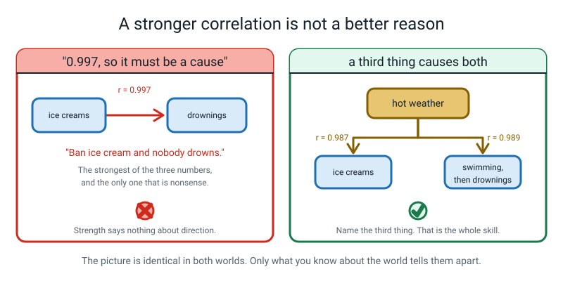
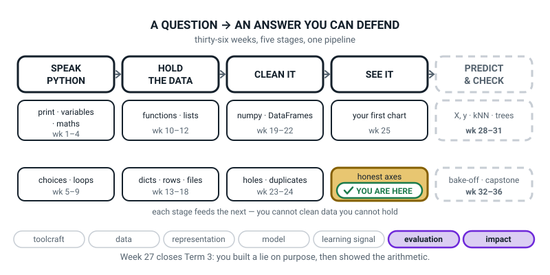
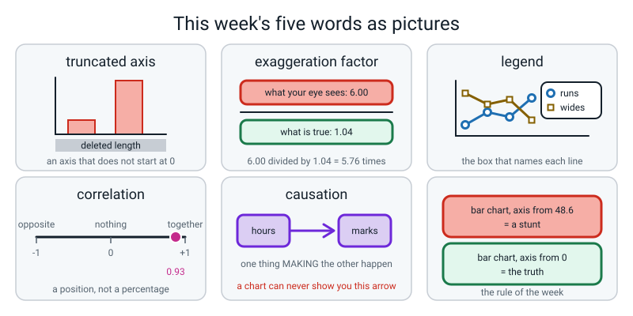

# Week 27 — Term 3 Checkpoint: Build a Lie, Then Confess

[⬅ Week 26](week-26.md) · [Course Home](../README.md) · [Next ➡](week-28.md) · [Workbook](../workbook/week-27.md)

---

> ### This week in one sentence
> **You can make a 2% difference look about six times bigger than it is without changing a single number — just by starting the y-axis somewhere else.**
>
> **By the end of this chapter you will be able to:**
> - **Exaggerate a 2% difference with `set_ylim`** and compute how many times bigger it looks
> - **Put the misleading chart and the honest one side by side** in one figure
> - **Add a legend** as soon as there are two series on one frame
> - **Compute a correlation and refuse, in writing, to call it a cause**
> - **Produce a list of the Term 3 weeks you want to revisit**, with a specific reason for each
>
> **New syntax:** `ax.set_ylim(bottom, top)` · `fig, axes = plt.subplots(1, 2)` · `ax.legend()` · `df["a"].corr(df["b"])`
>
> **Reading time:** about 35 minutes. **Homework:** about 70 minutes — it is the end of term.

---

## 🪝 Start Here

**You need a ruler with millimetres on it. A real one. Go and get it — this is not a metaphor.**

Two classes, 7A and 7B. A chart of how much homework each class hands in on time. Every number on it is real; nothing has been made up.

The y-axis numbers are covered over. You cannot read them yet.

**Measure how tall each bar is, in millimetres. Write both numbers down.**

You will get about **11 mm** and **67 mm**.

**Now divide the big one by the small one.** 67 ÷ 11 = **6.1**.

So according to this chart, **7B is about six times better at homework than 7A.** Six times. If you were 7A's teacher you would be in trouble. If you were in 7A you would feel awful.

Now uncover the y axis. The tick numbers read **49, 50, 51**.

**7A got 49%. 7B got 51%.**

Two points apart. Out of a hundred. 51 ÷ 49 = **1.04**, so 7B is four percent better, and four percent of anything is a rounding error.

And you measured, with a ruler, that it looks **six times** bigger.


*Figure 27.1 — 67 mm against 11 mm. The bars are honest to the millimetre. The axis was not.*

**Nobody lied to you.** There is not one false number on that page. Somebody moved where the axis starts. That is the whole trick, it is **one line of code**, and you are going to write it yourself in about fifteen minutes.

> **⚠️ Watch out:** if your printer shrank the page you might measure 9 mm and 54 mm instead. That is not a mistake. **Both** bars shrank by the same amount, so 54 ÷ 9 = 6.0 and the ratio survived. The ratio is the answer; the raw millimetres are not.

---

## 🧠 The Big Idea

> **📌 About the code in this section.** The blocks below are **illustrations, not files**. They show you the shape of one idea, and each one carries on from the one above it — the `import` lines and the data are typed once, in the first block that needs them. **The complete, runnable file is in 💻 Type This.** If you copy a block from this section on its own and Python says `NameError`, that is why, and nothing is broken.

### 1. The lie lives below the axis

**The plain explanation.**

> **truncated axis** — an axis that starts somewhere other than zero, so small differences look enormous.

Here is the whole trick, done as arithmetic you can check.

**Honest chart, y from 0 to 100.** The bars are 49 and 51 units tall. 51 ÷ 49 = **1.0408**, so 7B's bar is about 4% taller. They look nearly identical, *because they nearly are*.

**Dishonest chart, y from 48.6 to 51.4.** Now each bar only shows the part **above** 48.6:

- 7A's visible bar = 49 − 48.6 = **0.4 units**
- 7B's visible bar = 51 − 48.6 = **2.4 units**
- 2.4 ÷ 0.4 = **6.00**

**7B's bar is now six times taller than 7A's.** Every number printed on the chart is correct. **48.6 units of length were quietly deleted from the bottom of both bars, and the reader has no way to put them back.**


*Figure 27.2 — The grey block is the 48.6 units cut off both bars. Ninety-nine percent of 7A's real bar is not on the page.*

> **exaggeration factor** — how many times bigger the difference has been made to look: the truncated bar-length ratio divided by the honest one.

6.00 ÷ 1.0408 = **5.76**. Call it "about six times".

**The analogy.** Two people are 1.49 m and 1.51 m tall. Stand them both in a pit whose floor is at 1.486 m, so only the top 2.4 cm of the taller one and 0.4 cm of the shorter one show above it. One of them now looks six times taller than the other. **Nobody's height changed. You changed the floor.**

**A concrete example of how far it goes.** Push the floor closer to the smaller bar and it gets worse, and there is no limit:

| `set_ylim` bottom | The eye sees | Exaggeration factor |
|---|---|---|
| 0 | 1.04× | 1.00× |
| 45 | 1.50× | 1.44× |
| 48 | 3.00× | 2.88× |
| 48.5 | 5.00× | 4.80× |
| **48.6** | **6.00×** | **5.76×** |
| 48.9 | 21.00× | 20.18× |
| 48.99 | 201.00× | 193.12× |

Every one of those charts prints 49 and 51 correctly. **One keystroke per row.**

**And where did 48.6 come from?** Here is the honest answer, and it is the most useful sentence in the week:

> **"I fiddled with it until the chart looked how I wanted it to look."**

There is no formula. Nobody derives a truncated axis; they nudge it. I decided I wanted about six times, and I moved the floor until I got six times. **Assuming there is a formula behind a number like that is exactly how people get fooled.**

### 2. `ax.set_ylim(bottom, top)`, and the rule with two halves

**The plain explanation.** Two numbers: where the axis starts, where it stops.

```python
ax.set_ylim(48.6, 51.4)      # the trick
ax.set_ylim(0, 100)          # the fix
```

**That is the whole call, and it is the whole lie.** One argument to one function is the entire distance between an honest chart and a dishonest one. That should bother you slightly. It bothers me.

**The rule, and it genuinely has two halves:**

| Chart type | Must the axis start at zero? | Why |
|---|---|---|
| **bar** | **Yes. Always.** | A bar asks your eye to compare **lengths**. Delete length from the bottom and the reader has no way to add it back. |
| **line** | Not necessarily — but say so if it does not | A line asks you to follow a **shape**. A body-temperature chart starting at 0 °C would be a flat line squashed against the top of the frame, telling you nothing — and 0 °C is not a meaningful floor for a human being anyway. |

If you truncate a line chart, the honest thing is to **shout about it in the label**: `"Temperature (°C) — note: axis starts at 20"`. **Hiding it is the dishonest part. The choice itself can be perfectly defensible.**

**And now something worth knowing about your own tool.** What does matplotlib do if you say nothing at all? Try it:

```python
import matplotlib.pyplot as plt

fig, ax = plt.subplots(figsize=(6, 4))
ax.bar(["7A", "7B"], [49, 51])
print("bar chart, no set_ylim   :", ax.get_ylim())

fig2, ax2 = plt.subplots(figsize=(6, 4))
ax2.plot(["7A", "7B"], [49, 51], marker="o")
print("line chart, no set_ylim  :", ax2.get_ylim())
```

```text
bar chart, no set_ylim   : (0.0, 53.55)
line chart, no set_ylim  : (48.9, 51.1)
```

**matplotlib does you one favour and one disservice.** For a **bar** chart it starts at zero on its own — the authors knew about this problem and defended you. For a **line** chart it truncates by default, to 48.9, which is very nearly the dishonest floor you were about to pick on purpose.

So the working rule for the rest of the course: **type `ax.set_ylim(0, top)` on every bar chart anyway.** Not because matplotlib will get it wrong, but because the moment you touch `set_ylim` at all you own that decision, and writing the zero makes it a decision you can see in your own file. And on line charts, **know that your tool has already truncated for you** and decide whether you are happy about it.

**Two things `set_ylim` does silently, and both are real bugs people ship:**

```python
ax.set_ylim(48.6)          # ONE argument
```

```text
ylim now: (48.6, 53.55)
```

No error. It set the bottom and let matplotlib pick the top, so the chart is not the one you designed and nothing told you.

```python
ax.set_ylim(51.4, 48.6)    # backwards
```

```text
ylim now: (51.4, 48.6)
```

No error. The chart is drawn **upside down**, with bars hanging from the top. It looks like a bug in matplotlib. It is not.

### 3. One sheet, two frames

**The plain explanation.** Week 25's `plt.subplots()` gave you one frame. Give it two numbers and it gives you a grid:

```python
fig, axes = plt.subplots(1, 2, figsize=(10, 4))   # 1 row, 2 columns
```

- **`1, 2`** — one row of two frames. `2, 2` would give four in a square.
- **`axes`** is now **a box holding both frames**, numbered from 0 exactly like a list from Week 11. `axes[0]` is the left one, `axes[1]` is the right one.
- Every call from Weeks 25 and 26 still works. You just say *which frame* first: `axes[0].bar(...)`, `axes[1].set_title(...)`.
- **`figsize=(10, 4)`** — wider than usual, because you are fitting two frames on one sheet.

**The analogy.** One sheet of paper, ruled down the middle into two boxes, and you number them 0 and 1 in pen. `fig` is the sheet. `axes` is the pair of boxes. `axes[0]` is the left box. **And there is no `axes[2]`.**


*Figure 27.3 — Left panel, right panel, one sheet. Now the reader can compare the framing instead of trusting it.*

**A concrete example, and it is why this matters more than it looks.** On its own, the truncated panel is convincing. Next to the honest one it is obviously a stunt.

> **The best defence against a misleading chart is another chart.**

**Two errors you will meet here, and both are worth meeting:**

```python
axes.bar(["7A", "7B"], [49, 51])
```

```text
AttributeError: 'numpy.ndarray' object has no attribute 'bar'. Did you mean: 'var'?
```

Translate it: *"`axes` is a box of frames, not a frame. Which one did you mean?"* And **ignore the "did you mean var" part — Python is guessing badly.** `var` is a numpy thing about variance and has nothing to do with drawing a bar. Python matched the letters, not the meaning.

> **Python's "Did you mean…?" suggestions are hints, not answers.** Read them, then decide.

```python
axes[2].bar(["7A", "7B"], [49, 51])
```

```text
IndexError: index 2 is out of bounds for axis 0 with size 2
```

There are two frames, numbered 0 and 1. This is Week 11's off-by-one in new clothing.

*(One bonus call, worth typing and not worth learning: `fig.suptitle("...")` puts a headline across the whole sheet, above both frames. Each frame still has its own `set_title`.)*

### 4. `ax.legend()` needs `label=`, and two cues beat one

**The plain explanation.** The moment there are two lines on one frame, the reader has to guess which is which — and readers who have to guess stop reading.

> **legend** — the small box on a chart that names each series.

```python
ax.plot(df["day"], df["homework_min"], marker="o", label="Homework")
ax.plot(df["day"], df["screen_min"], marker="s", label="Screen time")
ax.legend()
```

**`ax.legend()` does not invent names.** It goes round every line already drawn on the frame and prints whatever `label=` each one was given. Forget the labels and you get a **warning**, not an error:

```text
No artists with labels found to put in legend.  Note that artists whose label start with an underscore are ignored when legend() is called with no argument.
```

"Artists" is matplotlib's word for anything drawn. The message means: *you asked me to name the lines and none of them have names.* **The chart still saves. It just has no legend.**


*Figure 27.4 — Round markers and square markers, so it survives a photocopier.*

**A concrete example of the second half, which costs nothing and almost nobody does.** Notice `marker="o"` on the first line and `marker="s"` — a square — on the second.

**Colour alone is not enough.** This chart will be photocopied, printed in black and white, or read by somebody who cannot distinguish those two colours, and in every one of those cases the colour is gone and the shapes are not. **Two cues instead of one.** It is simply what a careful person does.

*(And when do you **not** need a legend? When there is exactly one series — the title and the y label already name it. A legend on a one-line chart just repeats what the title already says and uses up space.)*

### 5. Correlation, and the four worlds

**The plain explanation.**

> **correlation** — one number saying how strongly two columns move together, from −1 (perfect opposites) through 0 (no relationship) to +1 (perfectly together).

```python
r = df["hours"].corr(df["score"])     # 0.925
```

For the 38 students, study hours and score give **r = 0.925**. That is very strong, and the scatter plot is a tidy band of dots rising to the right.

**Three things about `r` to get straight now:**

1. **It is not a percentage.** `r = 0.93` does **not** mean "93% of the score comes from studying". It is a position on a scale from −1 to +1, and that is all. The quickest cure: `df["age"].corr(df["hours"])` is **−0.572** in this table. **What is minus fifty-seven percent of a study hour?** Nothing. It is not a proportion of anything.
2. **A negative `r` is not a weak `r`.** The minus sign means "as one goes up, the other goes down". It is a **direction**, not a grade. An `r` of −0.9 is *stronger* than an `r` of +0.3.
3. **It only works on numbers.** `df["club"].corr(df["score"])` fails, and the last line is `TypeError: unsupported operand type(s) for /: 'str' and 'int'` — *"you asked me to divide the word 'chess' by a number."*

**And now the thing this whole term has been building towards.** `r = 0.93` between hours and score is consistent with **four completely different worlds**, and no scatter plot on Earth can tell you which one you are in:


*Figure 27.5 — Four stories, one number. The picture is identical in all four.*

| World | What is actually happening | Plausible here? |
|---|---|---|
| **A causes B** | Studying really does raise marks | Yes |
| **B causes A** | Doing well makes studying feel rewarding, so you do more of it | Also yes |
| **C causes both** | A quiet home with a desk causes more study hours **and** higher marks | Also yes — this is the **confounder** |
| **Coincidence** | Line up enough columns and some pair fits by luck | Very common, especially in small tables |

> **causation** — one thing actually making the other happen.
> **confounder** — a hidden third thing causing both of the things you measured, making them look connected to each other.

🍕 **The analogy that always lands.** Ice cream sales and drownings rise and fall together almost perfectly. Ice cream does not cause drowning. **Hot weather** causes both — people buy ice cream *and* people go swimming. Here are numbers for six months of a seaside town (invented for this lesson, but shaped like the real thing):

```text
ice creams vs drownings  : r = 0.997
temperature vs ice creams: r = 0.987
temperature vs drownings : r = 0.989
```

**Look at which one is biggest.** The ice-cream-versus-drownings number, 0.997, is the **strongest of the three** and the only one that is causally absurd.

> **Strength tells you nothing about direction.** A perfect correlation between two things can still have a third thing causing both.

**How to talk about a scatter honestly.** Say *"students who studied more tended to score higher"* — a description of a picture. Do not say *"studying raised their scores"* — a claim about cause, which needs an **experiment**, not a chart.

And what would that experiment be? Take a large group, split it **randomly** in half — randomly is the whole trick, because it makes the two halves similar in everything you did not measure, including the quiet room — ask one half to study two extra hours, leave the other half alone, compare afterwards. That is genuinely how it is done, and it is why medical trials work the way they do.

### 6. A chart leads to a decision, and a decision lands on a person

**The plain explanation.** This is the part that makes the rest matter.

Somebody sees `r = 0.925`, concludes "more hours → higher marks", and does the obvious thing: **everybody does two extra hours of study a week.**

Before deciding whether that is a good idea, find out **who is actually at the bottom of that scatter:**

```text
studying an hour or less:
       name  age house  club  hours  score
 Hugo Silva   14   Red music    0.5     45
Omar Haddad   14  Blue music    1.0     52
  Sami Aden   14 Green   art    0.5     48
Bruno Costa   13 Green   art    1.0     50
 Greta Hahn   14  Blue music    0.5     42
```

**Look at the ages. Every single one is 13 or 14** — four of the five are 14. And of the six students studying five hours or more, four are **12**.

So now the question that matters: **why might a fourteen-year-old be studying half an hour a week?**

A part-time job. A younger brother or sister to look after. No quiet room or desk at home. A long journey to school. Illness — their own or somebody else's. Something difficult going on at home.

**None of those are on the chart. Not one.** And **none of them are fixed by being told to study more** — they are *punished* by it. Hugo gets a detention for a bus timetable.

**The analogy.** A chart is an argument. An argument leads to a decision. A decision lands on a person with a name.

**A concrete example of the honest sentence.** Here is what full marks looks like, and it contains four things: a description, a refusal, a named alternative cause, and who it lands on.

> *In this table, students who studied more hours tended to score higher (r = 0.93). I do **not** know whether studying caused the higher marks. A quiet room with a desk could be causing both — it would give somebody more hours **and** better conditions to learn in — and if the school acts on this chart by making everybody do two extra hours, the five students at the bottom get blamed for something the chart never measured. Four of those five are fourteen, and I do not know why they study so little.*

Read it back. **There is no word in it that means "caused"**, except in the sentence that denies it. Words to strike out of your own version: *causes, makes, leads to, improves, boosts, results in, so you should.*

### 7. What Term 3 actually was

**The plain explanation.** This is a checkpoint week, so here is the whole term in one table. Every single week showed up somewhere in today's build.

| Week | The one thing it was about | Where it showed up today |
|---|---|---|
| 19 | `axis=0` goes **down** the columns, `axis=1` goes **across** the rows | not directly — flag it if you are unsure |
| 20 | A boolean mask is a yes/no array you use to pull out values | `df[df["hours"] <= 1.0]` in §6 |
| 21 | A DataFrame is a table whose columns have names | every chart today reads a column |
| 22 | `.loc` picks by name, `.iloc` picks by position | `sort_values` in the data story |
| 23 | Real data arrives broken in four predictable ways | flag it if you are unsure |
| 24 | `groupby` answers "what's the average per group?" — and hides the row counts | the club and house averages |
| 25 | The labels are what turn a chart into evidence | all of it |
| 26 | The question picks the chart shape | all of it |

**Check yourself with these eight, without running anything:**

| Week | Question |
|---|---|
| 19 | For a 3×4 grid, what shape does `arr.mean(axis=0)` come back as? |
| 20 | Does `arr[arr > 50]` give you the values, or where they are? |
| 21 | What two things does `df.info()` tell you that `df.head()` does not? |
| 22 | On a table indexed 10, 11, 12, what does `df.loc[10]` give, and what does `df.iloc[10]`? |
| 23 | Name the two calls for holes, and the one for text-that-should-be-numbers. |
| 24 | What must you always print alongside a `groupby` mean? |
| 25 | Which four of a chart's five parts are words you type? |
| 26 | Gaps between the bars: bar chart or histogram? |

*(Answers, in order: four numbers, one per column · the values · how many non-missing values per column and each column's type · the row named 10, and an `IndexError` because there is no eleventh row · `isna` and `fillna`, and `astype` · the count · title, x label, y label and the marks via `plot` · bar chart.)*

---

## 💻 Type This

Everything goes in your `level2` folder, alongside `students.py` (Week 24) and `myweek.py` (Week 21).

### Step 1 — build the lie

Make a file called `week27_lie.py`:

```python
# week27_lie.py -- build the lie on purpose. Two true numbers, one dishonest axis.
import matplotlib.pyplot as plt

classes = ["7A", "7B"]                 # the two categories
on_time = [49, 51]                     # % of homework handed in on time. Both TRUE.

fig, ax = plt.subplots(figsize=(6, 4))
ax.bar(classes, on_time)

bottom, top = 48.6, 51.4               # THE TRICK: the axis does not start at zero
ax.set_ylim(bottom, top)

ax.set_title("7B is MILES ahead of 7A on homework")   # a title doing the lying too
ax.set_xlabel("Class")
ax.set_ylabel("Homework on time (%)")

fig.savefig("lie.png", dpi=120, bbox_inches="tight")
print("saved lie.png")
```

```text
saved lie.png
```

**Two things to notice.**

`bottom, top = 48.6, 51.4` — two names, one equals sign, same shape as `fig, ax`. Naming the two numbers means you can use them again three lines later in the arithmetic.

**And the title is lying too.** "Miles ahead" is a claim, and it is not true. A title that overclaims is the second-cheapest lie in this subject after the axis.

### Step 2 — get it wrong on purpose, with one argument

Change the ylim line to:

```python
ax.set_ylim(bottom)
```

Run it. **No error:**

```text
saved lie.png
```

Open the PNG. The bars are still there but the top of the axis has moved, because matplotlib picked its own top. **A perfectly saved chart that is not the chart you wrote.** `set_ylim` wants **two** numbers; give it one and it takes it as the bottom and makes up the rest.

This is the Term 3 lesson again, for about the fifth time: **the dangerous failure is the one that does not complain.**

Put it back to `ax.set_ylim(bottom, top)`.

### Step 3 — print the arithmetic that proves it is a lie

Add:

```python
# --- the arithmetic that proves it is a lie ---------------------------------
visible_a = on_time[0] - bottom        # how much of 7A's bar sits above the floor
visible_b = on_time[1] - bottom        # same for 7B
print(f"7A: {on_time[0]}%  -> visible bar = {visible_a:.1f} units")
print(f"7B: {on_time[1]}%  -> visible bar = {visible_b:.1f} units")
print(f"looks-like ratio  7B / 7A = {visible_b / visible_a:.2f} times taller")
print(f"honest ratio      7B / 7A = {on_time[1] / on_time[0]:.4f} times taller")
print(f"exaggeration factor       = {(visible_b / visible_a) / (on_time[1] / on_time[0]):.2f}")
```

```text
saved lie.png
7A: 49%  -> visible bar = 0.4 units
7B: 51%  -> visible bar = 2.4 units
looks-like ratio  7B / 7A = 6.00 times taller
honest ratio      7B / 7A = 1.0408 times taller
exaggeration factor       = 5.76
```

Those are f-strings from Week 3. `{visible_a:.1f}` means "one decimal place"; `:.4f` means four.

### Step 4 — make the program predict your ruler

Add:

```python
# --- and the millimetres, so a ruler can check us --------------------------
axes_height_inches = ax.get_position().height * fig.get_figheight()
mm_per_unit = axes_height_inches * 25.4 / (top - bottom)
print(f"the drawing frame is {axes_height_inches:.2f} inches tall")
print(f"that is {mm_per_unit:.1f} mm per percentage point")
print(f"7A bar should measure {visible_a * mm_per_unit:.0f} mm")
print(f"7B bar should measure {visible_b * mm_per_unit:.0f} mm")
```

```text
saved lie.png
7A: 49%  -> visible bar = 0.4 units
7B: 51%  -> visible bar = 2.4 units
looks-like ratio  7B / 7A = 6.00 times taller
honest ratio      7B / 7A = 1.0408 times taller
exaggeration factor       = 5.76
the drawing frame is 3.08 inches tall
that is 27.9 mm per percentage point
7A bar should measure 11 mm
7B bar should measure 67 mm
```

**Eleven millimetres and sixty-seven millimetres — which is exactly what you measured with a ruler at the start of this chapter, before you knew anything.** The program predicted your ruler.

**What those four lines are doing**, and they are worth reading once even if you type them straight in: they ask matplotlib how tall the drawing frame really is in inches, turn inches into millimetres (× 25.4), and divide by how many percentage points the axis covers. That gives millimetres per point, and the bar lengths fall straight out.

### Step 5 — the honest version, beside it

New file, `week27_pair.py`:

```python
# week27_pair.py -- the lie and the fix, in ONE figure, side by side.
import matplotlib.pyplot as plt

classes = ["7A", "7B"]
on_time = [49, 51]

# subplots(1, 2) = one row, two frames. axes holds BOTH frames, numbered 0 and 1.
fig, axes = plt.subplots(1, 2, figsize=(10, 4))
print("how many frames?", len(axes))
```

```text
how many frames? 2
```

**Two frames, one sheet.** And `axes` is not a frame — it is a **box holding two frames**, numbered from zero.

### Step 6 — get it wrong on purpose again, this time loudly

Type:

```python
axes.bar(classes, on_time)
```

```text
how many frames? 2
Traceback (most recent call last):
  File "week27_pair.py", line 11, in <module>
    axes.bar(classes, on_time)
AttributeError: 'numpy.ndarray' object has no attribute 'bar'. Did you mean: 'var'?
```

Read the last line. *"`axes` is a box, not a frame. Which frame did you mean?"*

**And ignore the "did you mean var" bit.** Python is guessing badly this time — `var` is about variance and has nothing to do with drawing. **Suggestions are hints, not answers.**

### Step 7 — both panels

```python
# ---- LEFT frame: the lie --------------------------------------------------
axes[0].bar(classes, on_time)
axes[0].set_ylim(48.6, 51.4)                     # the trick
axes[0].set_title("LIE: y-axis starts at 48.6")
axes[0].set_xlabel("Class")
axes[0].set_ylabel("Homework on time (%)")

# ---- RIGHT frame: the honest version -------------------------------------
axes[1].bar(classes, on_time)
axes[1].set_ylim(0, 100)                         # the fix. One argument.
axes[1].set_title("HONEST: y-axis starts at 0")
axes[1].set_xlabel("Class")
axes[1].set_ylabel("Homework on time (%)")

fig.suptitle("The same two numbers: 49% and 51%")
fig.savefig("lie_and_fix.png", dpi=120, bbox_inches="tight")
print("saved lie_and_fix.png")
```

```text
how many frames? 2
saved lie_and_fix.png
```

**Open it, print it, and measure the right-hand panel's two bars as well.** Here is what the program says they should be:

```python
for i, (b, t) in enumerate([(48.6, 51.4), (0, 100)]):
    h = axes[i].get_position().height * fig.get_figheight()
    mm = h * 25.4 / (t - b)
    print(f"panel {i}: {mm:.2f} mm per unit -> bars {(49-b)*mm:.0f} mm and {(51-b)*mm:.0f} mm")
```

```text
panel 0: 27.94 mm per unit -> bars 11 mm and 67 mm
panel 1: 0.78 mm per unit -> bars 38 mm and 40 mm
```

**Thirty-eight millimetres and forty millimetres.** 40 ÷ 38 = 1.05, and the true ratio is 1.0408 — the tiny difference is the rounding to whole millimetres, not a mistake. **Which is the truth.**

And notice what putting them side by side does. On its own the left panel is convincing. **Next to the right panel it is obviously a stunt.**

### Step 8 — two lines and a legend

New file, `week27_legend.py`:

```python
# week27_legend.py -- two lines on one frame, so a legend becomes compulsory.
import matplotlib.pyplot as plt
from myweek import build_my_week

df = build_my_week()

fig, ax = plt.subplots(figsize=(6, 4))

# Each plot call gets its own label=... . That text is what the legend prints.
ax.plot(df["day"], df["homework_min"], marker="o", label="Homework")
ax.plot(df["day"], df["screen_min"], marker="s", label="Screen time")

ax.set_title("Screen time and homework crossed over at the weekend")
ax.set_xlabel("Day of the fortnight (day 1 = first Monday)")
ax.set_ylabel("Minutes")
ax.set_ylim(0, 200)
ax.legend()                          # reads the labels you already gave

fig.savefig("two_lines.png", dpi=120, bbox_inches="tight")
print("saved two_lines.png")
```

```text
saved two_lines.png
```

> **💡 Try this:** delete both `label="..."` bits and run it again. You get a **warning**, not an error, and a chart with no legend on it:
>
> ```text
> No artists with labels found to put in legend.  Note that artists whose label start with an underscore are ignored when legend() is called with no argument.
> ```

### Step 9 — correlation, and the three numbers that ruin it

New file, `week27_corr.py`:

```python
# week27_corr.py -- one number for "do these two move together?"
import pandas as pd
from students import build_students

df = build_students()

r_hours_score = df["hours"].corr(df["score"])     # -1 .. 0 .. +1
print(f"study hours vs score : r = {r_hours_score:.3f}")

r_age_hours = df["age"].corr(df["hours"])
print(f"age vs study hours   : r = {r_age_hours:.3f}")

# Six months of a seaside town. Two of these columns rise together almost perfectly.
town = pd.DataFrame({
    "month":      ["Jan", "Mar", "May", "Jul", "Sep", "Nov"],
    "ice_creams": [200, 400, 800, 1400, 900, 300],
    "drownings":  [1, 2, 5, 9, 6, 2],
    "temp_c":     [12, 16, 25, 32, 26, 15],
})

print()
print(f"ice creams vs drownings  : r = {town['ice_creams'].corr(town['drownings']):.3f}")
print(f"temperature vs ice creams: r = {town['temp_c'].corr(town['ice_creams']):.3f}")
print(f"temperature vs drownings : r = {town['temp_c'].corr(town['drownings']):.3f}")
```

```text
study hours vs score : r = 0.925
age vs study hours   : r = -0.572

ice creams vs drownings  : r = 0.997
temperature vs ice creams: r = 0.987
temperature vs drownings : r = 0.989
```

**Three questions, in this order.** *Ice cream and drowning is 0.997 — should we ban ice cream?* Obviously not. *So what is really going on?* Hot weather: people buy ice cream **and** people swim. *Now look at all three numbers — which is biggest?* The ice-cream one. **The strongest number is the absurd one.**

### Step 10 — who is at the bottom of the scatter

New file, `week27_who.py`:

```python
# week27_who.py -- who is at the bottom of the scatter?
from students import build_students

df = build_students()

print("studying an hour or less:")
print(df[df["hours"] <= 1.0][["name", "age", "house", "club", "hours", "score"]].to_string(index=False))
print()
print("studying five hours or more:")
print(df[df["hours"] >= 5.0][["name", "age", "club", "hours", "score"]].to_string(index=False))
```

```text
studying an hour or less:
       name  age house  club  hours  score
 Hugo Silva   14   Red music    0.5     45
Omar Haddad   14  Blue music    1.0     52
  Sami Aden   14 Green   art    0.5     48
Bruno Costa   13 Green   art    1.0     50
 Greta Hahn   14  Blue music    0.5     42

studying five hours or more:
       name  age  club  hours  score
   Bela Roy   14 music    5.0     90
 Farah Aziz   12 chess    6.0     95
 Liam Byrne   13 music    5.5     81
 Tara Joshi   12 chess    5.0     97
Anika Verma   12 music    5.0     93
  Hana Sato   12   art    5.5     91
```

`df[df["hours"] <= 1.0]` is Week 22's row filtering. `[["name", "age", ...]]` picks columns. `.to_string(index=False)` just prints it without the row numbers, so it reads like a list of people rather than a table — which, for this particular question, is the point.

**Now write your sentence.** Five names. Four of them fourteen. Then answer the question that matters, in your own words, and check that the word "caused" does not appear in it.

---

## 🔍 Worked Examples

Three complete programs. Type each one, and for the first one, **print it and measure the bars with a ruler.**

### Worked Example 1 — Two pizza places, 82% and 84% happy (food)

```python
"""pizza27.py - two pizza places, 82% and 84% happy customers. Build the lie, then confess."""

import matplotlib.pyplot as plt

places = ["Bella's", "Pizza Hub"]
happy = [82, 84]                        # % of customers who said "happy". Both TRUE.

bottom, top = 81.5, 84.5                # the dishonest floor I picked on purpose

fig, axes = plt.subplots(1, 2, figsize=(10, 4))

# ---- LEFT: the lie -------------------------------------------------------
axes[0].bar(places, happy)
axes[0].set_ylim(bottom, top)
axes[0].set_title("LIE: y-axis starts at 81.5")
axes[0].set_xlabel("Pizza place")
axes[0].set_ylabel("Happy customers (%)")

# ---- RIGHT: the honest version -------------------------------------------
axes[1].bar(places, happy)
axes[1].set_ylim(0, 100)
axes[1].set_title("HONEST: y-axis starts at 0")
axes[1].set_xlabel("Pizza place")
axes[1].set_ylabel("Happy customers (%)")

fig.suptitle("The same two numbers: 82% and 84% happy")
fig.savefig("pizza_lie_and_fix.png", dpi=120, bbox_inches="tight")
print("saved pizza_lie_and_fix.png")

visible_bella = happy[0] - bottom
visible_hub = happy[1] - bottom
print(f"Bella's : {happy[0]}% -> visible bar = {visible_bella:.1f} units")
print(f"Hub     : {happy[1]}% -> visible bar = {visible_hub:.1f} units")
print(f"looks-like ratio Hub / Bella = {visible_hub / visible_bella:.2f} times taller")
print(f"honest ratio     Hub / Bella = {happy[1] / happy[0]:.4f} times taller")
print(f"exaggeration factor          = {(visible_hub / visible_bella) / (happy[1] / happy[0]):.2f}")

frame_inches = axes[0].get_position().height * fig.get_figheight()
mm_per_point = frame_inches * 25.4 / (top - bottom)
print(f"lie panel: {mm_per_point:.1f} mm per percentage point")
print(f"  Bella's bar should measure {visible_bella * mm_per_point:.0f} mm")
print(f"  Hub bar     should measure {visible_hub * mm_per_point:.0f} mm")
```

Real output:

```text
saved pizza_lie_and_fix.png
Bella's : 82% -> visible bar = 0.5 units
Hub     : 84% -> visible bar = 2.5 units
looks-like ratio Hub / Bella = 5.00 times taller
honest ratio     Hub / Bella = 1.0244 times taller
exaggeration factor          = 4.88
lie panel: 26.1 mm per percentage point
  Bella's bar should measure 13 mm
  Hub bar     should measure 65 mm
```

**Thirteen millimetres against sixty-five.** A two-point gap in customer happiness, drawn so that one shop looks five times better than the other. This is the chart on the poster in the window, and now you know how it was made.

**The confession to write underneath:** *Pizza Hub is 84% and Bella's is 82% — a two-point gap, so Hub is about 2.4% better. Drawn honestly from zero, Hub's bar is 1.02× Bella's, which is almost indistinguishable, and correctly so. Truncating the axis at 81.5 makes it 5.00×, an exaggeration of about 4.9×. I measured 13 mm and 65 mm on the printout and 65 ÷ 13 = 5.0, which matches. Not one number changed.*

### Worked Example 2 — Two lines, one legend, one correlation (sport)

```python
"""cricket27.py - two lines with a legend, and one correlation I refuse to call a cause."""

import matplotlib.pyplot as plt
import pandas as pd

match = pd.DataFrame({
    "over":   [1, 2, 3, 4, 5, 6, 7, 8, 9, 10],
    "runs":   [4, 7, 2, 11, 6, 0, 9, 14, 3, 19],
    "wides":  [1, 0, 2, 3, 1, 0, 2, 4, 0, 5],
})

# --- two series on one frame, so a legend stops being optional -------------
fig, ax = plt.subplots(figsize=(6, 4))
ax.plot(match["over"], match["runs"], marker="o", label="Runs scored")
ax.plot(match["over"], match["wides"], marker="s", label="Wides bowled")

ax.set_title("The overs with the most wides were also the biggest overs")
ax.set_xlabel("Over number (over 1 = first over)")
ax.set_ylabel("Count in that over")
ax.set_ylim(0, 20)
ax.legend()

fig.savefig("cricket_two_lines.png", dpi=120, bbox_inches="tight")
print("saved cricket_two_lines.png")

# --- and one number for "do they move together?" --------------------------
r = match["runs"].corr(match["wides"])
print(f"runs vs wides : r = {r:.3f}")
print("that is strong, and it is NOT proof that wides cause runs")
```

Real output:

```text
saved cricket_two_lines.png
runs vs wides : r = 0.875
that is strong, and it is NOT proof that wides cause runs
```

**r = 0.875. Now go round the four worlds** and notice that all four are genuinely plausible here:

- **Wides cause runs?** Sort of — a wide *is* a run. So there is a real mechanical link.
- **Runs cause wides?** Also arguable — a bowler getting hit around might bowl worse.
- **A third thing causing both?** Very likely: **a bad bowler**, or a batter who is attacking hard, or the bowler being tired at the end of a spell. None of those three things are anywhere in this table.
- **Coincidence?** With only ten overs, absolutely possible.

**And notice the title.** *"The overs with the most wides were also the biggest overs"* — a description of the picture. Not "wides caused the runs".

Also notice `ax.set_ylim(0, 20)` on a **line** chart here. Runs and wides both have a real, meaningful zero — an over with no runs in it is a normal thing — so starting at zero is the honest choice, and matplotlib would have truncated it if left alone.

### Worked Example 3 — Three correlations, and the third one ruins the first (school)

```python
"""school27.py - three correlations, and the third one ruins the first."""

import pandas as pd

# Twelve students. Sleep hours, screen minutes, and their maths mark.
school = pd.DataFrame({
    "name":   ["Asha", "Ravi", "Nita", "Sam", "Kabir", "Meera",
               "Dev", "Tara", "Omar", "Priya", "Zane", "Ivy"],
    "sleep":  [9.0, 8.5, 8.0, 7.5, 7.0, 6.5, 9.5, 8.0, 6.0, 7.0, 9.0, 6.5],
    "screen": [40, 55, 70, 95, 120, 150, 30, 80, 175, 130, 45, 160],
    "mark":   [88, 84, 79, 72, 66, 60, 91, 76, 54, 64, 87, 58],
})

r_sleep_mark = school["sleep"].corr(school["mark"])
r_screen_mark = school["screen"].corr(school["mark"])
r_sleep_screen = school["sleep"].corr(school["screen"])

print(f"sleep  vs mark   : r = {r_sleep_mark:.3f}")
print(f"screen vs mark   : r = {r_screen_mark:.3f}")
print(f"sleep  vs screen : r = {r_sleep_screen:.3f}")
print()
print("strongest of the three:", round(max(abs(r_sleep_mark), abs(r_screen_mark), abs(r_sleep_screen)), 3))
```

Real output:

```text
sleep  vs mark   : r = 0.994
screen vs mark   : r = -0.997
sleep  vs screen : r = -0.987

strongest of the three: 0.997
```

**Read all three, then try to say which one causes the mark.** You cannot.

Sleep and marks correlate at **0.994** — nearly perfect. So sleep more, do better?

But screen time and marks correlate at **−0.997**, which is *stronger*. So screens are the problem?

And here is the killer: sleep and screen time correlate at **−0.987** with each other. **The two candidate explanations are tangled together**, and this table cannot pull them apart, because the people who sleep a lot are the same people who use screens a little.

Perhaps late-night screens are eating the sleep. Perhaps a strict bedtime is producing both. Perhaps something else entirely — a quiet house, a parent who checks homework — is producing all three.

> **When two possible causes are tangled with each other, no amount of correlation will separate them.** You need a different kind of evidence, and a chart is not it.

---

## 🐞 When It Breaks

Every message below came from really running a broken version of this week's code.

### Break 1 — `axes` instead of `axes[0]`

```python
fig, axes = plt.subplots(1, 2, figsize=(10, 4))
axes.bar(["7A", "7B"], [49, 51])
```

```text
Traceback (most recent call last):
  File "week27_pair.py", line 4, in <module>
    axes.bar(['7A','7B'], [49,51])
AttributeError: 'numpy.ndarray' object has no attribute 'bar'. Did you mean: 'var'?
```

**What Python is telling you.** *"`axes` is a box of frames, not a frame."* "ndarray" is numpy's word for a box of things — you met it in Week 17.

**The fix.** Say which frame: `axes[0].bar(...)`.

**And the bit worth stealing from this error.** Python suggested `var`. **`var` is wrong.** It is a numpy function about variance and has nothing to do with drawing a bar; Python matched the letters, not the meaning. A student who follows every suggestion blindly will fix three errors and be badly lost on the fourth.

> **🐞 If you see this error:** read the "Did you mean" — and then *decide*. Suggestions are hints, not answers.

### Break 2 — `axes[2]`

```python
axes[2].bar(["7A", "7B"], [49, 51])
```

```text
Traceback (most recent call last):
  File "d2.py", line 4, in <module>
    axes[2].bar(...)
IndexError: index 2 is out of bounds for axis 0 with size 2
```

**What Python is telling you.** *"There are two frames and you asked for the third."*

Frames are numbered **0 and 1**, exactly like list slots in Week 11. `subplots(1, 2)` gives you two, and the last one is number 1. The off-by-one is back, wearing a different hat.

### Break 3 — correlation on a column of words

```python
print(df["club"].corr(df["score"]))
```

```text
  File ".../numpy/core/_methods.py", line 121, in _mean
    ret = um.true_divide(
TypeError: unsupported operand type(s) for /: 'str' and 'int'
```

**What Python is telling you.** *"You asked me to divide the word 'chess' by a number."*

Correlation is arithmetic — averages, subtractions, divisions — and you cannot average the word "chess". **Correlation is for numbers only.**

*(On newer pandas the message is `ValueError: could not convert string to float: 'chess'` instead. Same cause, friendlier wording.)*

**And the sibling error:** `df["hours"].corr()` gives `TypeError: Series.corr() missing 1 required positional argument: 'other'` — *"you asked for a correlation between one thing and nothing."* It takes two columns.

### The whole clinic, for reference

| What you see | What it means | The fix |
|---|---|---|
| `AttributeError: 'numpy.ndarray' object has no attribute 'bar'. Did you mean: 'var'?` | "`axes` is a box of frames." | `axes[0].bar(...)`. **Ignore the `var` suggestion** |
| `AttributeError: 'numpy.ndarray' object has no attribute 'set_title'` | Same thing, different call | Index it. And name it `axes`, so the plural reminds you |
| `IndexError: index 2 is out of bounds for axis 0 with size 2` | "Two frames, and you asked for the third." | `axes[0]` and `axes[1]` |
| `TypeError: unsupported operand type(s) for /: 'str' and 'int'` | "You asked me to divide a word by a number." | Correlation needs two **number** columns |
| `TypeError: Series.corr() missing 1 required positional argument: 'other'` | "A correlation between one thing and nothing." | `df["hours"].corr(df["score"])` |
| `No artists with labels found to put in legend.` *(a warning — the chart still saves)* | "You asked me to name the lines and none have names." | Add `label="..."` to each `plot` call |
| **No error. The chart is upside down, bars hanging from the top.** | Nothing. You said the axis runs downwards. | Smaller number first: `set_ylim(48.6, 51.4)` |
| **No error. The top of the axis is not where you put it.** | Nothing. You gave a bottom and let matplotlib choose a top. | Give it both numbers |
| **No error. A line chart that looks dramatic and is not.** | Nothing. matplotlib truncated a line chart for you, by default. | `ax.set_ylim(0, top)` — or truncate deliberately and **say so in the label** |
| `ValueError: x and y must have same first dimension, but have shapes (10,) and (12,)` | "Ten of one, twelve of the other." | `print(len(a), len(b))` and find the mismatch. Usually a 10-row table mixed with a 12-row one |

> **🐞 If there is no error message at all:** four of the ten rows above produce none. So the first question is never "what does the error say?" It is:
>
> **"Is that the chart I meant to make?"**

---

## 🎲 What We Did In Class

If you missed it, here is the whole lesson. You need a ruler and a printer, and everything else is optional.

### The ruler

A printed bar chart with the y-axis numbers **covered over**, and one instruction: *measure both bars in millimetres.* About 11 and 67. Divide: about 6.1.

Then the cover came off. **49% and 51%.** Two points. 51 ÷ 49 = 1.04.

Four questions, and the fourth is the one that lands:

| Asked | Answer |
|---|---|
| "Divide the big bar by the small one." | About 6.1. |
| "How much better is 7B, really?" | Two percentage points — about 4% taller. |
| "Which number did I fake?" | **None of them.** Every number on the page is true. |
| "So how did I do it?" | Moved the bottom of the y axis from 0 to 48.6. |

### Where 48.6 came from

Somebody always asks. The honest answer: **"I fiddled with it until the chart looked how I wanted it to look."** There is no formula.

Then the follow-up worth doing with a calculator: *what floor makes it look twenty times bigger?* About **48.9**, because (51 − 48.9) ÷ (49 − 48.9) = 2.1 ÷ 0.1 = 21. And 48.99 gives 201. **There is no limit, and it is one keystroke each time.**

### Building the lie, then the pair

`week27_lie.py` then `week27_pair.py`, exactly as in "Type This", with **two deliberate mistakes and both of them silent:**

- `ax.set_ylim(48.6)` with one argument — no error, wrong chart.
- `axes.bar(...)` without the index — this one *does* error, and its "Did you mean: var" suggestion is wrong, which is the point.

Then measuring the honest panel's bars too: about **38 mm and 40 mm**, ratio about 1.05. Which is the truth.

And the sentence: **the best defence against a misleading chart is another chart.**

### Two lines, a legend, and two marker shapes

`week27_legend.py`. Then deleting both `label=` bits to see the warning, and the question: *"why is one marker a circle and one a square, when the colours are already different?"*

**Because the chart will be photocopied, printed in black and white, or read by somebody who cannot tell those two colours apart** — and in all three cases the colour is gone and the shapes are not. Two cues instead of one, for free.

### Correlation, and the three numbers

`week27_corr.py`. `r = 0.925` for hours against score. `r = −0.572` for age against hours. And then the seaside town:

| Pair | `r` |
|---|---|
| study hours vs score | **0.925** |
| age vs study hours | **−0.572** |
| ice creams vs drownings | **0.997** |
| temperature vs ice creams | **0.987** |
| temperature vs drownings | **0.989** |

The three questions: *should we ban ice cream?* No. *What is really going on?* Hot weather — the **confounder**. *Which of the three numbers is biggest?* **The absurd one.**

### Who gets hurt

`week27_who.py`, printing the five students studying an hour or less. **Hugo, Omar, Sami, Bruno, Greta.** Four of the five are fourteen.

Then the question, written down: *why might a fourteen-year-old be studying half an hour a week?* Every answer offered was taken seriously — a job, a sibling to look after, no quiet room, a long commute, illness, something at home.

**None of them are on the chart, and none of them are fixed by being told to study more.**

Then the honest sentence, with no causal verb in it, and the four things it has to contain: the description, the refusal, a named alternative cause, and who it lands on.

### And the Term 3 reflection

Eight weeks, 19 to 26, with a tick for "I could teach this to somebody else" and a question mark for "I want to look at this again". Then **two** weeks named for revisiting, with a specific reason.

Not "it was hard". Something like:

> *"Week 22. I still can't tell `loc` from `iloc` the moment the index isn't 0, 1, 2 — I get it right by luck."*

> *"Week 19. I can type `axis=0` but I work out which one it is by trying both and seeing which shape comes back, and that means I don't actually know."*

**Everybody has two.**

---

## 💬 Talk About It

**1. Isn't it fine to truncate an axis if the real numbers are printed on the chart?**

*Hint:* it is **better**, and it is not enough, and the reason is about how reading works rather than about honesty. People read charts with their eyes before their brain: the shape lands in about a quarter of a second, the numbers take two or three seconds, and most people never get to the numbers at all. So a truncated bar chart with correct numbers on it will still leave nearly every reader believing the wrong thing. Then be precise about what the printed numbers *are* good for: they are your defence in an argument **afterwards**, not a defence against the impression the chart already made. Now the harder half — if printing the numbers is not enough, what would be? *(Try: printing the numbers **and** starting at zero **and** saying in the title how big the gap really is.)*

**2. Who decides what counts as misleading? Isn't it just an opinion?**

*Hint:* split it deliberately into the part that is arithmetic and the part that is judgement. The arithmetic part is not an opinion at all: a truncated bar chart deletes length that the reader's eye is being asked to measure, and you can compute the exaggeration factor as an actual number — 5.76, in this case. Nobody can argue with 5.76. The judgement part genuinely is contested: whether *this* chart, for *this* audience, making *this* decision, hides something that would change the decision. Two careful people can disagree. But now find the bit that is **not** contested, because it is the useful bit: **state where your axis starts, and say what your chart hides.** Do those two things and nobody can accuse you of hiding anything, whatever they think of your choices.

**3. If the correlation were exactly 1.0 — perfect — would that prove cause?**

*Hint:* no, and working out why is the best thinking available this week. Start with a case that is obviously not causal: measure the same thing twice with two different rulers. Perfect correlation, and neither measurement causes the other. Now a second case: one hidden thing causing both perfectly — a thermometer in Fahrenheit and one in Celsius correlate at exactly 1.0 and neither causes the other; the weather causes both. So **strength tells you how tightly two columns move together, and nothing at all about which way the arrow points, or whether there is an arrow.** Then check it against your own numbers: which of the three seaside correlations was strongest, and which was nonsense? Finally, the practical question — if a chart can never show cause, what *can* show it, and why does it need the word "randomly" in it?

---

## ⚠️ Don't Get Tricked

### Trick 1 — "a stronger correlation is better evidence of cause"


*Figure 27.6 — The strongest of the three numbers is the silly one. Name the third thing.*

| ❌ Wrong | ✅ Right |
|---|---|
| "r = 0.997 is nearly perfect, so ice cream must be doing something." | **Strength says nothing about direction.** The strongest of the three seaside correlations is the one that is causally absurd. Hot weather causes both. |

The move that fixes this permanently: when you see a strong correlation, **try to name the third thing**. If you can name a plausible one, you have not proved anything.

### Trick 2 — "so truncating an axis is always cheating"

| ❌ Wrong | ✅ Right |
|---|---|
| "Any chart whose axis doesn't start at zero is a lie." | For **bars**, yes, always start at zero — the eye is comparing lengths. For **lines**, a truncated axis is often the only readable choice. A body-temperature chart from 0 °C is a flat line squashed against the top of the frame. **The dishonest part is not saying so.** |

This is the over-correction the whole lesson risks. Look at the honest right-hand panel again: same two numbers, axis from zero, ratio 1.04, and it is a completely good chart. **The lesson is not "charts lie". It is "a chart is an argument, so check the framing."**

### Trick 3 — "r = 0.93 means 93 percent"

| ❌ Wrong | ✅ Right |
|---|---|
| "93% of the score comes from studying." | `r` is a **position on a scale** from −1 through 0 to +1. It is not a proportion of anything. |

The one-second cure: `r` between age and hours is **−0.572**. **What is minus fifty-seven percent of a study hour?** Nothing. The question does not even make sense, which is how you know `r` is not a percentage.

*(There is a related number that behaves a bit more like a percentage — R², in Week 32 — and even that one gets misread constantly by people who should know better.)*

### Trick 4 — "`axes` is the frame"

| ❌ Wrong | ✅ Right |
|---|---|
| `fig, axes = plt.subplots(1, 2)` then `axes.bar(...)` | `axes` is **plural**. It is a box holding two frames, numbered 0 and 1. `axes[0].bar(...)`. And `print(len(axes))` prints `2`, which makes the plural concrete. |

The way to stop making this mistake: draw a rectangle on paper, rule it down the middle, and **write 0 and 1 in the two halves in pen.** The sheet is `fig`. The pair of boxes is `axes`. Then ask yourself where `axes[2]` is. There isn't one, and that is the `IndexError`.

---

## 🌍 Where You've Seen This

1. **"Our broadband vs theirs" adverts.** Almost always two bars with a truncated axis. Look for the bottom tick number — if it is missing entirely, that is its own answer.
2. **Your phone's battery graph.** Usually a line, usually truncated, usually without saying so. Defensible for a line, and worth noticing.
3. **Election-night bar charts on television.** Watch for the axis floor when two parties are close. A one-point lead can be drawn as a landslide, and it is drawn that way on purpose.
4. **Any headline of the form "X linked to Y".** "Linked to" is a journalist's phrase for a correlation, and it is doing exactly the job that "caused" is not allowed to do.
5. **Share-price charts in a company's own annual report.** The chosen start date is the whole argument. Nobody starts the line at the company's best-ever week.
6. **A game's "your rank vs the average" screen.** Look at the axis, then ask who "the average" is a sample of.
7. **Every medical study you will ever read about.** The single question that separates the good ones from the rest: **was it randomised?** If the two groups were not randomly split, there is a confounder somewhere and nobody knows what it is.

---

## 🧭 Where This Fits

Same gold tile as last week, and this is the second and last week inside it. Term 3 ends here, and it
ends with you doing something slightly wicked on purpose: drawing a chart that tells a lie, measuring
exactly how big the lie is, and then writing the confession underneath it.



*Figure 27.0 — The pipeline in Week 27. Still the `honest axes` tile — and this is the week that earns
the word **honest**, because you build the dishonest version first. Stage four is solid right across
now; only `PREDICT & CHECK` is still dashed.*

| | |
|---|---|
| **The mental model you now own** | A chart can mislead **without a single wrong number in it.** Cut the y-axis and a 2% gap turns into a cliff. So before you believe any chart — including the one you just drew — you find the bottom of the axis and read it. |
| **The one question it answers** | *"Is this difference real, or is it just where the axis starts?"* |
| **What it plugs into** | Week 25's labelled axes and Week 26's choice of chart shape. This week you take those same tools and aim them the wrong way deliberately, then do the arithmetic: two bars, a ruler, and how many times bigger you made the gap look. |
| **What carries forward** | Week 33's overfitting curve, which you will read with exactly this suspicion, and Week 36, where you stand up and defend every picture you drew this year. |
| **Spiral thread** | ⚖️ **Evaluation** — checking where the axis starts is a measurement, not an opinion — and 🌍 **Impact**, because somebody decides something because of the chart you published. Neither thread is about typing any more. |

> **💡 Try this:** in the corner of the gold tile on your own copy of the map, write the two bar
> heights you measured in millimetres, then **×** and your exaggeration factor. That number came off a
> real ruler you held in your hand, which makes it the most convincing thing in this whole book.

---

## 🔑 Remember This

- **A truncated axis deletes length from the bottom of every bar, and the reader cannot put it back.** That is where the lie lives.
- **Exaggeration factor** = the ratio your eye sees ÷ the ratio that is true. For 49 vs 51 with a floor of 48.6, that is 6.00 ÷ 1.0408 = **5.76**.
- **Bar charts start at zero. Always.** Line charts may be truncated, **but say so in the label.** Hiding it is the dishonest part.
- **`ax.set_ylim` takes TWO numbers.** One argument silently makes up the top. Backwards numbers silently draw the chart upside down.
- **matplotlib starts bar charts at zero for you, and truncates line charts by default.** Type `set_ylim(0, top)` anyway, so the decision lives in your file where you can see it.
- **`fig, axes = plt.subplots(1, 2)` gives one sheet and two frames**, numbered `axes[0]` and `axes[1]`. There is no `axes[2]`.
- **Two series need a legend**, and each `plot` needs its own `label=`. Give them **different markers as well as different colours**, so it survives a photocopier.
- **`r` runs from −1 through 0 to +1. It is not a percentage.** A minus sign is a direction, not a grade.
- **Strength tells you nothing about cause.** Name the third thing that could be causing both.
- **Python's "Did you mean…?" suggestions are hints, not answers.**
- **The best defence against a misleading chart is another chart.**
- **A chart is an argument. An argument leads to a decision. A decision lands on a person with a name.**

### Syntax reminder card

```python
import matplotlib.pyplot as plt
import pandas as pd
from students import build_students

df = build_students()                   # the cleaned 38-row Week 24 table
days = [1, 2, 3, 4, 5]                  # a tiny stand-in for the Week 21 table
homework = [45, 60, 30, 75, 20]
screen = [60, 45, 90, 30, 120]

# ---- THE LIE: two numbers, and the axis does not start at zero ----------
fig, ax = plt.subplots(figsize=(6, 4))
ax.bar(["7A", "7B"], [49, 51])
ax.set_ylim(48.6, 51.4)          # bottom, top. The whole trick.
# ax.set_ylim(48.6)        ->  NO error. Bottom set, top invented.
# ax.set_ylim(51.4, 48.6)  ->  NO error. Chart drawn UPSIDE DOWN.
# no set_ylim at all       ->  bars start at 0 (good), LINES truncate (watch out)

# ---- THE ARITHMETIC ----------------------------------------------------
looks  = (51 - 48.6) / (49 - 48.6)      # 6.00  -- what the eye sees
honest = 51 / 49                        # 1.0408 -- what is true
print(round(looks / honest, 2))         # 5.76  -- the exaggeration factor

# ---- TWO FRAMES ON ONE SHEET -------------------------------------------
fig, axes = plt.subplots(1, 2, figsize=(10, 4))   # 1 row, 2 columns
print(len(axes))                        # 2 -- it is PLURAL
axes[0].bar(["7A", "7B"], [49, 51]); axes[0].set_ylim(48.6, 51.4)   # the lie
axes[1].bar(["7A", "7B"], [49, 51]); axes[1].set_ylim(0, 100)       # the fix
fig.suptitle("The same two numbers")    # headline across the whole sheet
# axes.bar(...)  ->  AttributeError: 'numpy.ndarray' ... Did you mean: 'var'? (WRONG guess)
# axes[2]        ->  IndexError: index 2 is out of bounds ... with size 2

# ---- A LEGEND: label= on every line, THEN legend() ---------------------
fig, ax = plt.subplots(figsize=(6, 4))
ax.plot(days, homework, marker="o", label="Homework")
ax.plot(days, screen,   marker="s", label="Screen time")
ax.legend()                             # reads the labels already given
# no label= anywhere  ->  UserWarning: No artists with labels found. Chart still saves.
# different MARKERS as well as colours, so it survives a photocopier

# ---- CORRELATION: two NUMBER columns, -1 .. 0 .. +1 -------------------
r = df["hours"].corr(df["score"])       # 0.925
print(df["age"].corr(df["hours"]))      # -0.572  -- a DIRECTION, not a grade
# df["club"].corr(df["score"])  ->  TypeError: ... for /: 'str' and 'int'
# df["hours"].corr()            ->  TypeError: missing argument 'other'
# and r is NOT a percentage. Ever.
```

---

## 📓 New Words


*Figure 27.7 — This week's five words, drawn.*

| Word | What it means | Example |
|---|---|---|
| **truncated axis** | An axis that starts somewhere other than zero, so small differences look enormous | `ax.set_ylim(48.6, 51.4)` on bars of 49 and 51 |
| **exaggeration factor** | How many times bigger the difference has been made to look: the ratio you see ÷ the ratio that is true | 6.00 ÷ 1.0408 = **5.76** |
| **legend** | The small box on a chart that names each series | `ax.legend()`, after `label=` on every line |
| **correlation** | One number for how strongly two columns move together, from −1 through 0 to +1 | `df["hours"].corr(df["score"])` → 0.925 |
| **causation** | One thing actually making the other happen. A chart can never show you this | 0.997 between ice creams and drownings is **not** this |

*(One extra word, and it is the useful one: a **confounder** is a hidden third thing causing both of the things you measured. Hot weather is the confounder behind ice cream and drowning.)*

---

## 📤 Your Homework

Go to **[the Week 27 workbook](../workbook/week-27.md)**. About **70 minutes** — slightly over, because it is the end of the term.

| Section | What to do | Time |
|---|---|---|
| **Warm-Up** | Five quick questions from Week 26 | 5 min |
| **Predict the Output** | Four snippets. Three of them produce no error and one produces `nan` | 10 min |
| **Practice A & B** | Six reading questions, then five you write yourself | 20 min |
| **Fix the Broken Program** | A two-panel house chart with three planted bugs — one syntax, one crash, one silent | 8 min |
| **Build It — the lie, the fix, and the ruler** | Sabotage one of your own Week 26 charts, repair it beside it, and **measure both bars in millimetres** | 17 min |
| **Term 3 reflection** | Eight weeks, ticks and question marks, and two weeks named with a reason | 10 min |

**Three things are being marked.**

**Is the measuring real?** Two millimetre readings, in pen, from a printed page, with the division written out. **Not measured on a screen** — on a screen you can zoom, both bars change together, and the number stops being yours. If your printer shrank the page, that is fine; the ratio survives.

**Does your sentence about `r` contain no causal verb?** Strike out *causes, makes, leads to, improves, boosts, results in, so you should.* And name a plausible third thing that could be causing both.

**Does the reflection sheet name two weeks, with a specific reason each?** "It was hard" and "all fine" are both non-answers. **Everybody has two.**

> **⚠️ Watch out:** the two silent bugs from this week — `set_ylim` with one argument, and `set_ylim` with the numbers backwards — will not tell you anything is wrong. **Open every PNG you make and ask: is that the chart I meant?**

> **💡 Try this, if you want the hardest thing in the term:** find a real misleading chart in the wild — a news site, an advert, a shop's "our prices vs theirs" poster — name the trick, and if the numbers are printed, **compute the exaggeration factor as an actual number.** Bring it in. That is the skill this whole term was for.

---

[⬅ Week 26](week-26.md) · [Course Home](../README.md) · [Week 28 ➡](week-28.md) · [📓 Workbook — Week 27](../workbook/week-27.md) · [Glossary](../../glossary.md)
