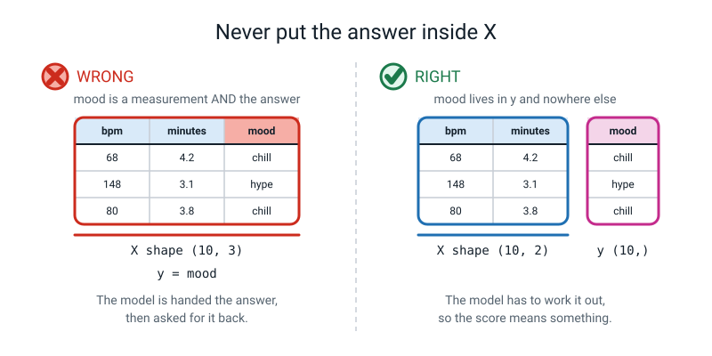
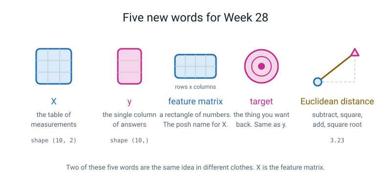

# Week 28 — X and y: Turning Your Table Into a Question

[⬅ Week 27](week-27.md) · [Course Home](../README.md) · [Next ➡](week-29.md) · [Workbook](../workbook/week-28.md)

---

> ### This week in one sentence
> **Every prediction machine wants your table handed over in exactly two pieces — `X`, the things you measured, and `y`, the answer you want back — and that is Level 1's *features* and *label*, finally spelled out in code.**
>
> **By the end of this chapter you will be able to:**
> - Split a table into `X` and `y` and say the shape of each one out loud
> - Explain why `X` needs two sets of square brackets and `y` needs one
> - Load a real dataset that lives *inside* scikit-learn and print its shape
> - Work out the distance between two rows of measurements with a pencil, in four steps
> - Get numpy to give you the same number, to two decimal places
>
> **New syntax this week:** `from sklearn.datasets import load_iris` · `X = df[["a", "b"]]` · `np.sqrt(x)` · `((row_a - row_b) ** 2).sum()`
>
> **Reading time:** about 25 minutes. **Homework:** about 60 minutes.

---

## 🪝 Start Here

Somebody has kept a piece of your handwriting for six months.

It is a sheet of paper from the very first week of Level 1. On it, in your own words, you wrote down what a **feature** is and what a **label** is. You probably do not remember writing it.

Read it back. Go on — if you still have it, find it now, before you read another line of this chapter.

Was it a bit awkward to read? Did you still agree with it?

Here is why that sheet matters today. **You have been ready for this lesson for six months.**

You already know that some columns of a table are the things you measured, and one column is the thing you want to work out. You already know that a column full of names is useless, because a name only ever turns up in one row. You already know that a machine which scores 100% is usually cheating. You know all of it.

What you have never had, until today, is the **spelling**.

The whole world of machine learning agreed, a long time ago, on two letters for those two things:

> **`X`** — everything you measured. A whole table of it.
> **`y`** — the answer you want back. One column.

Capital X. Small y. That is genuinely most of today's lesson.


*Figure 28.1 — One table splits into two. The measurements go into `X`. The answer goes into `y`. The song's name goes into neither.*

And I want to be honest about how small this week is, because it looks bigger than it is.

**We are not going to make anything predict anything today.** Not one guess. Today we lay the table. Next week we eat.

> **💡 Try this:** if you genuinely cannot find your Week 1 sheet, do not skip this. Get a blank piece of paper and write both definitions again, right now, from memory, before you read any further. Then keep it. It is a fair test and it works nearly as well.

---

## 🧠 The Big Idea

> **📌 About the code in this section.** The blocks below are **illustrations, not files**. They show you the shape of one idea, and each one carries on from the one above it — the `import` lines and the data are typed once, in the first block that needs them. **The complete, runnable file is in 💻 Type This.** If you copy a block from this section on its own and Python says `NameError`, that is why, and nothing is broken.

### 1. Two pieces. Not one, not three. Two.

**The plain explanation.** A **model** is a machine you show a pile of examples with the answers filled in, and which then gives you an answer for an example it has never seen. Every single one of them — and there are hundreds — wants your data handed over in exactly two pieces.

> **`X`** — the table of measurements. One row per example, one column per measurement.
> **`y`** — the answers. One value per row, lined up with `X` row for row.

**The analogy.** 🍕 Think of a pizza order form. On the left, all the boxes somebody filled in: size, toppings, how far away they live, what time it is. On the right, one box at the bottom: *did it arrive hot?* All the filled-in boxes are `X`. The one box at the bottom is `y`.

**The concrete version.** Here is a playlist. Ten songs. For each one somebody measured two things — the **bpm** (beats per minute, which is how fast it feels) and how many **minutes** long it is. Then somebody listened to it and wrote down whether it is a chill song or a hype song.

| song | bpm | minutes | **mood** |
|---|---|---|---|
| Monsoon | 68 | 4.2 | **chill** |
| Rocket | 148 | 3.1 | **hype** |
| Lantern | 80 | 3.8 | **chill** |
| Corridor | 160 | 2.8 | **hype** |
| Firecracker | 152 | 3.4 | **hype** |
| Slow Bus | 72 | 5.1 | **chill** |
| Neon | 168 | 2.6 | **hype** |
| Paper Boat | 76 | 4.6 | **chill** |
| Stadium | 140 | 3.0 | **hype** |
| Rooftop | 84 | 5.4 | **chill** |

- `bpm` and `minutes` go into **`X`**. They are what you measured.
- `mood` is **`y`**. It is what you want back.
- `song` goes into **neither**.

That last one is worth stopping on, because it is the one people argue with.

**Why does `song` go nowhere?** Because a song's name turns up in exactly **one** row of this table. A machine can memorise "Rocket is hype" perfectly, and that helps it precisely never — because the next song you hand it will be called something like "Umbrella", and it has learnt nothing at all.

> **Names, ID numbers and row numbers never go in `X`.** Not because somebody made a rule. Because there is nothing in them to learn.

Here are the two words Level 1 used, sitting next to this week's:

| Level 1 word | This week's word | What it is |
|---|---|---|
| feature | a column of `X` | one thing you measured |
| all the features together | `X`, the **feature matrix** | the whole block of measurements |
| label | `y`, the **target** | the answer you want back |

> **Feature matrix** — a rectangle of numbers: every row is one example, every column is one measurement. "Matrix" is only the maths word for "rectangle of numbers". Nothing else about matrices is needed this year.
> **Target** — the column you are trying to predict. The same thing Level 1 called the label.

> **⚠️ Watch out:** in maths lessons `x` is the *unknown* — the thing you solve for. Here it is the exact opposite. **`X` is everything you already know. `y` is the unknown.** If you ever get muddled, ask yourself: *which of these could I measure with a ruler, and which would somebody have to tell me?* The ruler one is `X`.

### 2. Shapes: rows first, columns second, and one lonely comma

**The plain explanation.** A **shape** is how big something is, written as numbers in brackets. Rows first, columns second. Always in that order.

**The analogy.** It is the way you say the size of a room: *"four metres by three"*. Everybody says the length before the width, and nobody bothers to explain that any more. Shapes are the same deal.

**The concrete version.** Our playlist:

```
X.shape  =  (10, 2)     ten songs, two measurements each
y.shape  =  (10,)       ten answers, in a single line
```

That second one looks like a typo. **It is not a typo.** Say it out loud: *"ten comma nothing"*. It sounds ridiculous, which is exactly why it sticks.

Python writes a one-item shape with a trailing comma on purpose, so you can tell these two apart:

| Shape | What it means |
|---|---|
| `(10,)` | ten things, in one straight line |
| `(10, 1)` | ten rows of one column each — a *skinny table* |
| `(1, 10)` | one row of ten columns — a *wide table* |

A model wants `y` as `(10,)`. A single line, not a skinny table.

**And here is the rule that will actually bite you.** `X` and `y` are two completely separate objects. Nothing inside Python is watching to make sure that row 4 of `X` still belongs to answer 4 of `y`. If you sort one and not the other, **Python will not complain**. Not a warning, not a message, nothing. Your model will train happily on scrambled data and give you a score that looks fine and means nothing.


*Figure 28.2 — Count the rows in both, every time. Four rows of measurements need four answers, and nothing in Python will tell you when they do not.*

So there is one habit, and it is worth building now:

> **Do all your filtering and sorting on the whole table. Pull `X` and `y` out last, and then never touch either of them again.**

### 3. The brackets. This is the confusing bit, and here is all of it

**The plain explanation.** You have been pulling one column out of a table since Week 21, like this: `playlist["mood"]`. One bracket, one name, one column back.

This week you meet **two** brackets, and they look like a mistake:

```python
playlist[["bpm", "minutes"]]
```

They are not a mistake. Look at what is actually happening.

**The trick that makes it click.** What is `["bpm", "minutes"]` on its own, with the outer brackets ignored?

It is a **list**. A list of two column names — exactly the same kind of list you built in Week 11 with `[1, 2, 3]`.

So the inner brackets are just a list. And the outer brackets are the ordinary "look this up in the table" brackets you already know.

The whole thing reads: **look up, in the table, this list of names.**

> **Ask for a *list* of names → you get a *table* back.**
> **Ask for *one* name → you get *one column* back.**

**The concrete version.**

```python
one = playlist["bpm"]          # ONE bracket  -> one column,  shape (10,)
two = playlist[["bpm"]]        # TWO brackets -> a table,     shape (10, 1)
```

Both of those ask for `bpm`. They give you different *kinds of thing*.


*Figure 28.3 — Ask for one name and you get a column. Ask for a list of names and you get a table. `y` wants the first. `X` wants the second.*

And that maps exactly onto what we need:

| We want | Brackets | What comes back | Its shape |
|---|---|---|---|
| `X` — a table of measurements | two | a table (a **DataFrame**) | `(10, 2)` |
| `y` — one column of answers | one | a column (a **Series**) | `(10,)` |

> **💡 Try this:** every single time you type two brackets, say the sentence out loud: *"a list of names, so a table comes back."* Three or four repetitions and your fingers will do it without you. This is the most-typed mistake of the whole term, and saying the sentence is what fixes it.

### 4. A row of numbers is a point

**The plain explanation.** If a row of your table has two numbers in it, you can draw that row as a **dot** on a graph. First number across, second number up. One row, one dot.

**The analogy.** It is exactly how you find a seat at the cinema. Row F, seat 14 — two numbers, and there is only one seat they can mean. A row of your table is the same: two numbers, one spot.

**The concrete version.** Two real iris flowers, using **petal length** and **petal width** only:

```
flower A  =  (1.4, 0.2)        a setosa
flower B  =  (4.4, 1.4)        a versicolor
```

Plot A at 1.4 across and 0.2 up. Plot B at 4.4 across and 1.4 up. Two dots.

Now join them with a straight line. **That line has a length, and that length is how different the two flowers are.** Two flowers that are alike sit close together. Two flowers that are nothing like each other sit far apart.


*Figure 28.4 — Two numbers become one dot. The two dots become a triangle, and the distance is the slanted side.*

This is the whole reason next week's model works. Do not skip past it.

### 5. Distance: four steps, and it is not new maths

**The plain explanation.** Walk 3 metres east and 4 metres north. How far are you from where you started?

**Not 7.** You went diagonally. The straight-line distance is 5.

That is Pythagoras' theorem. You may or may not have met it in maths yet, and it does not matter at all, because we are going to do it as **four counting steps** rather than as a theorem.

> **Euclidean distance** — straight-line distance. Subtract, square, add up, square root.

Here are the four steps, and they never change:

1. **Subtract**, column by column. You get one gap per column.
2. **Square** each gap. *(Squaring throws away the minus signs, which is exactly what you want — a gap of −3 is just as big as a gap of +3.)*
3. **Add** the squares up. One number now.
4. **Square root** it.

**The concrete version.** Our two flowers:

```
flower A = (1.4, 0.2)        flower B = (4.4, 1.4)

step 1  subtract :   1.4 − 4.4 = −3.0      0.2 − 1.4 = −1.2
step 2  square   :   (−3.0)² = 9.00        (−1.2)² = 1.44
step 3  add      :   9.00 + 1.44 = 10.44
step 4  root     :   √10.44 = 3.23
```

**3.23.** And you can check it with a ruler, which is what the class activity does.


*Figure 28.5 — Plot the two flowers, and the distance is a line you can measure with a ruler. The four steps give the same number without the ruler.*

**So why bother with the four steps if a ruler works?**

Because iris has **four** measurements per flower, not two. And the wine dataset you meet in a fortnight has **thirteen**. You cannot draw thirteen directions on a sheet of paper. Nobody can.

But you can still subtract thirteen times, square thirteen times, add them all up and take one square root.

> **The arithmetic goes as far as you like. The picture stops at two.**

That sentence is the entire reason the four steps exist. Learn it word for word.

> **⚠️ Watch out:** step 2 catches people out. `(−3.0)²` is **9**, not −9. Say it in words: *"minus three, times minus three"* — two negatives, so a positive. A squared number can never come out negative, ever.

---

## 💻 Type This

We build three small files. Type them in order and run each one before moving on.

### Step 1 — Build the table

Make a new file called `x_and_y.py` and type this in.

```python
# x_and_y.py
# Split one table into X (what we measured) and y (what we want back).

import pandas as pd

playlist = pd.DataFrame({
    "song":    ["Monsoon", "Rocket", "Lantern", "Corridor", "Firecracker",
                "Slow Bus", "Neon", "Paper Boat", "Stadium", "Rooftop"],
    "bpm":     [68, 148, 80, 160, 152, 72, 168, 76, 140, 84],
    "minutes": [4.2, 3.1, 3.8, 2.8, 3.4, 5.1, 2.6, 4.6, 3.0, 5.4],
    "mood":    ["chill", "hype", "chill", "hype", "hype",
                "chill", "hype", "chill", "hype", "chill"],
})

print(playlist)
```

Nothing new here at all — this is Week 21. Run it.

```text
          song  bpm  minutes   mood
0      Monsoon   68      4.2  chill
1       Rocket  148      3.1   hype
2      Lantern   80      3.8  chill
3     Corridor  160      2.8   hype
4  Firecracker  152      3.4   hype
5     Slow Bus   72      5.1  chill
6         Neon  168      2.6   hype
7   Paper Boat   76      4.6  chill
8      Stadium  140      3.0   hype
9      Rooftop   84      5.4  chill
```

Same ten songs as the table on the page. Good.

### Step 2 — Split it, and print both shapes

**Add this to the file you started in Step 1.** Delete the `print(playlist)` line first, then type the rest at the bottom.

```python
X = playlist[["bpm", "minutes"]]        # TWO brackets -> a table of features
y = playlist["mood"]                    # ONE bracket  -> a single column

print("X is a", type(X).__name__)       # what KIND of thing did we get?
print("y is a", type(y).__name__)
print()
print("X.shape:", X.shape)              # (rows, columns)
print("y.shape:", y.shape)              # (rows,)  <- one number, then a comma
print()
print("first three rows of X:")
print(X.head(3))
print()
print("first three labels:")
print(y.head(3))
```

Line by line:

- `playlist[["bpm", "minutes"]]` — a list of two names goes in, a table comes out.
- `playlist["mood"]` — one name goes in, one column comes out.
- `type(X).__name__` — you met `type()` in Week 2. Adding `.__name__` just prints the *name* of the kind of thing, instead of the full technical description. It is prettier and nothing more.
- `X.shape` — this is **not** a function. There are no brackets after it, because it is not a machine you run; it is a fact about `X` that is already sitting there. Compare `.sum()`, which *is* a machine and does need its brackets.

Run it.

```text
X is a DataFrame
y is a Series

X.shape: (10, 2)
y.shape: (10,)

first three rows of X:
   bpm  minutes
0   68      4.2
1  148      3.1
2   80      3.8

first three labels:
0    chill
1     hype
2    chill
Name: mood, dtype: object
```

There it is. `X` is a **DataFrame** — pandas' word for a table. `y` is a **Series** — pandas' word for a single column. Two brackets gave a table, one bracket gave a column, exactly as advertised.

Read the two shapes out loud: *"ten, two"* and *"ten comma nothing"*.

### Step 3 — A real dataset that came free in the box

Scikit-learn is the new library this term. It is the one you install as **scikit-learn** and import as **sklearn** — two names for one thing, which is genuinely annoying and nobody's fault. Expect to get it wrong twice.

Inside it there is a room called `sklearn.datasets` that holds a handful of small, famous datasets. One of them is **iris**: 150 flowers, measured with a ruler by hand, in 1936.

New file, `iris_shapes.py`:

```python
# iris_shapes.py
# A real dataset that comes free inside scikit-learn: 150 iris flowers.

import numpy as np
import pandas as pd
from sklearn.datasets import load_iris   # the new import this week

iris = load_iris()                       # load it. No file, no download.

print("X shape:", iris.data.shape)       # the measurements
print("y shape:", iris.target.shape)     # the answers
print()
print("the four things measured:")
for name in iris.feature_names:          # loop over the column names
    print("   ", name)
print()
print("the three kinds of flower:", iris.target_names)
print("how many of each:", np.bincount(iris.target))
print()

# Put it in a DataFrame so week 21-24 skills still work.
flowers = pd.DataFrame(iris.data, columns=iris.feature_names)
flowers["species"] = iris.target_names[iris.target]

# Show just the two petal columns and the answer, so it fits the screen.
print(flowers[["petal length (cm)", "petal width (cm)", "species"]].head(3))
```

Two lines to look at properly:

- `from sklearn.datasets import load_iris` — go into that room, fetch the thing called `load_iris`, and let me use its name directly. Exactly the same shape as `from stats import mean` in Week 12. Only the names are new.
- `iris = load_iris()` — **the round brackets are what run it.** Without them you have not fetched the data; you have fetched the machine that fetches the data, and the error you get later is confusing.

`iris` now holds a bundle. `iris.data` is the table of measurements, `iris.target` is the answers, `iris.feature_names` is the list of column names, and `iris.target_names` is the list of flower names.

Run it.

```text
X shape: (150, 4)
y shape: (150,)

the four things measured:
    sepal length (cm)
    sepal width (cm)
    petal length (cm)
    petal width (cm)

the three kinds of flower: ['setosa' 'versicolor' 'virginica']
how many of each: [50 50 50]

   petal length (cm)  petal width (cm) species
0                1.4               0.2  setosa
1                1.4               0.2  setosa
2                1.3               0.2  setosa
```

A hundred and fifty flowers, four measurements each. `(150, 4)` and `(150,)` — **the same two shapes as your playlist, just bigger.** And fifty of each kind, look: `[50 50 50]`.

You did not download anything. Somebody put it in the box for you.

### Step 4 — The distance, one step at a time

New file, `distance_by_hand.py`:

```python
# distance_by_hand.py
# The distance between two flowers, one step at a time.

import numpy as np
from sklearn.datasets import load_iris

iris = load_iris()

# Columns 2 and 3 are petal length and petal width. 2:4 means "columns 2 and 3".
flower_a = iris.data[0, 2:4]             # row 0, the two petal columns
flower_b = iris.data[65, 2:4]            # row 65, the two petal columns

print("flower A:", flower_a, iris.target_names[iris.target[0]])
print("flower B:", flower_b, iris.target_names[iris.target[65]])
print()

gaps = flower_a - flower_b               # step 1: subtract, column by column
print("step 1  subtract   :", gaps)

squares = gaps ** 2                      # step 2: square each gap
print("step 2  square     :", squares)

total = squares.sum()                    # step 3: add the squares up
print("step 3  add up     :", total)

distance = np.sqrt(total)                # step 4: square root of the total
print("step 4  square root:", distance)
print()
print("distance rounded to 2 dp:", round(distance, 2))
print()
print("all four steps in one line:", np.sqrt(((flower_a - flower_b) ** 2).sum()))
```

New lines explained:

- `iris.data[0, 2:4]` — Week 19 syntax. Row 0, columns 2 up to but not including 4. So columns 2 and 3.
- `flower_a - flower_b` — because these are **numpy arrays** (Week 17), this subtracts them column by column. If they were plain lists it would crash, and you will see that crash in a minute.
- `gaps ** 2` — squares *every* number in the array at once, no loop. This is Week 18's whole promise paying off.
- `squares.sum()` — adds them all up. Note the brackets. `squares.sum` without them gives you the machine instead of the answer, and a genuinely baffling error message.
- `np.sqrt(total)` — square root. That is all it does.

Run it.

```text
flower A: [1.4 0.2] setosa
flower B: [4.4 1.4] versicolor

step 1  subtract   : [-3.  -1.2]
step 2  square     : [9.   1.44]
step 3  add up     : 10.440000000000003
step 4  square root: 3.2310988842807027

distance rounded to 2 dp: 3.23

all four steps in one line: 3.2310988842807027
```

**Compare that with the pencil version on page 8 of this chapter.** `−3.0` and `−1.2`. Then `9.00` and `1.44`. Then `10.44`. Then `3.23`. Identical. You did not take anybody's word for it — you did it by hand, and the machine agreed.

> **🐞 If you see this error:** you do not. But you probably noticed `10.440000000000003` and thought something had gone wrong. **Nothing has gone wrong.** Computers store decimals in binary, the way we store thirds in decimal — one third is 0.3333… forever and you have to stop somewhere, and where you stop is a tiny error. `1.44` is one of the numbers that does not fit exactly in binary, so what got stored was a hair over. Thirteen decimal places down. It makes no difference to anything you will ever do, and it is why we **round before we report**. Every programming language on earth does this and every professional has met it.

**Reading the one-liner.** `np.sqrt(((flower_a - flower_b) ** 2).sum())` is the whole thing on one line. Read it **from the inside out**: innermost brackets first (subtract), then square, then `.sum()`, then `np.sqrt`. Four steps, written right to left.

If you find that unreadable, **keep the four separate lines forever.** The four-line version is not the beginner version. It is the readable version, and plenty of professionals write it that way on purpose.

### The complete finished program

Here is everything from this week in one runnable file.

```python
# week28_complete.py
# X, y, both shapes, and one distance done four ways.

import numpy as np
import pandas as pd
from sklearn.datasets import load_iris

# ---- part 1: my own table ------------------------------------------------
playlist = pd.DataFrame({
    "song":    ["Monsoon", "Rocket", "Lantern", "Corridor", "Firecracker",
                "Slow Bus", "Neon", "Paper Boat", "Stadium", "Rooftop"],
    "bpm":     [68, 148, 80, 160, 152, 72, 168, 76, 140, 84],
    "minutes": [4.2, 3.1, 3.8, 2.8, 3.4, 5.1, 2.6, 4.6, 3.0, 5.4],
    "mood":    ["chill", "hype", "chill", "hype", "hype",
                "chill", "hype", "chill", "hype", "chill"],
})

X = playlist[["bpm", "minutes"]]         # two brackets, so a table comes back
y = playlist["mood"]                     # one bracket, so a column comes back

print("--- my playlist ---")
print("X.shape:", X.shape, "-> 10 songs, 2 measurements each")
print("y.shape:", y.shape, "-> 10 answers, in one line")
print("the column in neither: song (a name only appears once)")
print()

# ---- part 2: a real dataset ---------------------------------------------
iris = load_iris()
print("--- iris, straight out of the library ---")
print("X shape:", iris.data.shape)
print("y shape:", iris.target.shape)
print("kinds of flower:", iris.target_names)
print()

# ---- part 3: one distance, four steps -----------------------------------
flower_a = iris.data[0, 2:4]             # petal length, petal width
flower_b = iris.data[65, 2:4]

gaps = flower_a - flower_b               # step 1
squares = gaps ** 2                      # step 2
total = squares.sum()                    # step 3
distance = np.sqrt(total)                # step 4

print("--- flower A against flower B ---")
print("flower A:", flower_a)
print("flower B:", flower_b)
print("step 1  subtract   :", gaps)
print("step 2  square     :", squares)
print("step 3  add up     :", round(float(total), 2))
print("step 4  square root:", round(float(distance), 2))
```

```text
--- my playlist ---
X.shape: (10, 2) -> 10 songs, 2 measurements each
y.shape: (10,) -> 10 answers, in one line
the column in neither: song (a name only appears once)

--- iris, straight out of the library ---
X shape: (150, 4)
y shape: (150,)
kinds of flower: ['setosa' 'versicolor' 'virginica']

--- flower A against flower B ---
flower A: [1.4 0.2]
flower B: [4.4 1.4]
step 1  subtract   : [-3.  -1.2]
step 2  square     : [9.   1.44]
step 3  add up     : 10.44
step 4  square root: 3.23
```

---

## 🔍 Worked Examples

### Worked Example 1 — Did the pizza arrive hot? (food)

Eight takeaway orders. Somebody wrote down the price, how far away the shop is, and whether it turned up hot or cold.

```python
# pizza_x_and_y.py
# Eight pizza orders. Which ones came back cold?

import numpy as np
import pandas as pd

orders = pd.DataFrame({
    "shop":      ["Nonna's", "Slice Hut", "Big Al", "Crustys",
                  "Nonna's", "Big Al", "Pizza Post", "Slice Hut"],
    "price":     [220, 180, 260, 150, 240, 275, 195, 165],
    "km_away":   [1.2, 4.5, 0.8, 6.1, 1.5, 0.9, 5.2, 4.9],
    "arrived":   ["hot", "cold", "hot", "cold", "hot", "hot", "cold", "cold"],
})

X = orders[["price", "km_away"]]      # two brackets -> a table
y = orders["arrived"]                 # one bracket  -> a column

print(orders)
print()
print("X.shape:", X.shape, "-> 8 orders, 2 measurements each")
print("y.shape:", y.shape, "-> 8 answers, in one line")
print()
print("the column that goes in neither: shop")
print()

# Distance between order 0 (Nonna's, hot) and order 1 (Slice Hut, cold).
order_0 = np.array([220.0, 1.2])
order_1 = np.array([180.0, 4.5])

gaps = order_0 - order_1
squares = gaps ** 2
total = squares.sum()

print("step 1  subtract   :", gaps)
print("step 2  square     :", squares)
print("step 3  add up     :", total)
print("step 4  square root:", np.sqrt(total))
print("2 dp               :", round(float(np.sqrt(total)), 2))
print()
print("price's share of the distance  :", round(100 * squares[0] / total, 4), "%")
print("km_away's share of the distance:", round(100 * squares[1] / total, 4), "%")
```

```text
         shop  price  km_away arrived
0     Nonna's    220      1.2     hot
1   Slice Hut    180      4.5    cold
2      Big Al    260      0.8     hot
3     Crustys    150      6.1    cold
4     Nonna's    240      1.5     hot
5      Big Al    275      0.9     hot
6  Pizza Post    195      5.2    cold
7   Slice Hut    165      4.9    cold

X.shape: (8, 2) -> 8 orders, 2 measurements each
y.shape: (8,) -> 8 answers, in one line

the column that goes in neither: shop

step 1  subtract   : [40.  -3.3]
step 2  square     : [1600.     10.89]
step 3  add up     : 1610.89
step 4  square root: 40.13589415971693
2 dp               : 40.14

price's share of the distance  : 99.324 %
km_away's share of the distance: 0.676 %
```

**What to notice.** Look at those last two lines. `price` contributed **99.3%** of the distance and `km_away` contributed **0.7%**.

Now — is the price of a pizza more important than how far away the shop is, for working out whether it arrives hot? Obviously not. **It is the other way round if anything.** But the prices are numbers in the hundreds and the distances are numbers under seven, and squaring makes that gap enormous.

Nobody decided price mattered more. It happened because of the units. **Write that down and remember whose idea it was, because it is the whole of Week 30.**

> **🧑‍🏫 If a student asks:** *"Should `shop` really go nowhere? Nonna's turns up twice."* — genuinely good point, and half right. A shop name that repeats does carry something. The honest reply: the moment a *new* shop appears you are stuck again, and you cannot tell in advance which shops will repeat. So the rule stays.

### Worked Example 2 — Batter or bowler? (sport)

Six players from a school cricket team, and how the season went.

```python
# cricket_x_and_y.py
# Six players from a school cricket team. Batter or bowler?

import numpy as np
import pandas as pd

team = pd.DataFrame({
    "player":       ["Asha", "Ravi", "Meera", "Karan", "Divya", "Sanjay"],
    "runs":         [312, 41, 288, 27, 350, 19],
    "wickets":      [1, 14, 0, 17, 2, 21],
    "role":         ["batter", "bowler", "batter", "bowler", "batter", "bowler"],
})

X = team[["runs", "wickets"]]
y = team["role"]

print(team)
print()
print("X.shape:", X.shape)
print("y.shape:", y.shape)
print()

# Distance between Asha (a batter) and Ravi (a bowler).
asha = np.array([312.0, 1.0])
ravi = np.array([41.0, 14.0])

gaps = asha - ravi
squares = gaps ** 2
total = squares.sum()
print("Asha vs Ravi")
print("step 1  subtract   :", gaps)
print("step 2  square     :", squares)
print("step 3  add up     :", total)
print("step 4  square root:", np.sqrt(total))
print("2 dp               :", round(float(np.sqrt(total)), 2))
print()

# Distance between Asha and Meera - two batters.
meera = np.array([288.0, 0.0])
gaps2 = asha - meera
squares2 = gaps2 ** 2
total2 = squares2.sum()
print("Asha vs Meera")
print("step 1  subtract   :", gaps2)
print("step 2  square     :", squares2)
print("step 3  add up     :", total2)
print("step 4  square root:", np.sqrt(total2))
print("2 dp               :", round(float(np.sqrt(total2)), 2))
```

```text
   player  runs  wickets    role
0    Asha   312        1  batter
1    Ravi    41       14  bowler
2   Meera   288        0  batter
3   Karan    27       17  bowler
4   Divya   350        2  batter
5  Sanjay    19       21  bowler

X.shape: (6, 2)
y.shape: (6,)

Asha vs Ravi
step 1  subtract   : [271. -13.]
step 2  square     : [73441.   169.]
step 3  add up     : 73610.0
step 4  square root: 271.31162894354526
2 dp               : 271.31

Asha vs Meera
step 1  subtract   : [24.  1.]
step 2  square     : [576.   1.]
step 3  add up     : 577.0
step 4  square root: 24.020824298928627
2 dp               : 24.02
```

**What to notice.** Asha to Ravi is **271.31**. Asha to Meera is **24.02**.

Asha and Meera are both batters. Asha and Ravi are not. And the distance is more than **eleven times** smaller for the two players who do the same job.

**Distance is behaving like similarity.** That is not a coincidence, and it is the entire idea next week's model runs on.

Also worth noticing: neither number means anything **on its own**. Is 271 big? You cannot possibly say. Runs are measured in hundreds, so a gap of 271 runs is a big gap in runs. **A distance is only ever meaningful next to other distances from the same table.**

### Worked Example 3 — Who passed Friday's test? (school)

Seven pupils. Hours of sleep the night before, minutes of revision, and whether they passed.

```python
# revision_x_and_y.py
# Seven pupils, two measurements, and whether they passed Friday's test.

import numpy as np
import pandas as pd

pupils = pd.DataFrame({
    "name":        ["Tara", "Ben", "Nia", "Omar", "Zoe", "Leo", "Priya"],
    "hours_slept": [8.5, 5.0, 7.5, 4.5, 9.0, 6.0, 8.0],
    "revision_mins": [90, 20, 75, 15, 120, 40, 100],
    "passed":      ["yes", "no", "yes", "no", "yes", "no", "yes"],
})

X = pupils[["hours_slept", "revision_mins"]]
y = pupils["passed"]

print(pupils)
print()
print("X.shape:", X.shape, "-> 7 pupils, 2 measurements each")
print("y.shape:", y.shape, "-> 7 answers, in one line")
print()

tara = np.array([8.5, 90.0])
ben = np.array([5.0, 20.0])

gaps = tara - ben
squares = gaps ** 2
total = squares.sum()
print("Tara vs Ben")
print("step 1  subtract   :", gaps)
print("step 2  square     :", squares)
print("step 3  add up     :", total)
print("step 4  square root:", np.sqrt(total))
print("2 dp               :", round(float(np.sqrt(total)), 2))
print()
print("hours_slept's share  :", round(100 * squares[0] / total, 4), "%")
print("revision_mins' share :", round(100 * squares[1] / total, 4), "%")
```

```text
    name  hours_slept  revision_mins passed
0   Tara          8.5             90    yes
1    Ben          5.0             20     no
2    Nia          7.5             75    yes
3   Omar          4.5             15     no
4    Zoe          9.0            120    yes
5    Leo          6.0             40     no
6  Priya          8.0            100    yes

X.shape: (7, 2) -> 7 pupils, 2 measurements each
y.shape: (7,) -> 7 answers, in one line

Tara vs Ben
step 1  subtract   : [ 3.5 70. ]
step 2  square     : [  12.25 4900.  ]
step 3  add up     : 4912.25
step 4  square root: 70.08744538075275
2 dp               : 70.09

hours_slept's share  : 0.2494 %
revision_mins' share : 99.7506 %
```

**Now watch what happens if you change nothing except the units.** Write the revision in **hours** instead of minutes. Tara did 1.5 hours; Ben did 20 minutes, which is a third of an hour.

```python
# revision_units.py
# The same two pupils, with revision written in HOURS instead of minutes.

import numpy as np

tara_hours = np.array([8.5, 1.5])
ben_hours = np.array([5.0, 20 / 60])     # 20 minutes = a third of an hour

squares = (tara_hours - ben_hours) ** 2
total = squares.sum()

print("step 2  square     :", np.round(squares, 4))
print("step 3  add up     :", round(float(total), 4))
print("step 4  square root:", round(float(np.sqrt(total)), 2))
print("hours_slept's share :", round(100 * squares[0] / total, 2), "%")
print("revision's share    :", round(100 * squares[1] / total, 2), "%")
```

```text
step 2  square     : [12.25    1.3611]
step 3  add up     : 13.6111
step 4  square root: 3.69
hours_slept's share : 90.0 %
revision's share    : 10.0 %
```

**Read those two blocks next to each other.**

| Revision measured in… | sleep's share | revision's share |
|---|---|---|
| minutes | 0.25% | **99.75%** |
| hours | **90.0%** | 10.0% |

**Not one pupil changed.** Nobody slept differently. Nobody revised differently. All that changed is which word somebody wrote at the top of a column — and the answer completely flipped over.

If that annoys you, good. It should. It is a real and serious problem, it has a standard fix, and the fix is Week 30's entire lesson. Write your name and today's date next to it and hold your teacher to it in a fortnight.

---

## 🐞 When It Breaks

Errors are not you failing. They are Python telling you, in an unhelpful accent, exactly what went wrong. Every message below came out of a real run.

The rule never changes: **read the last line first.**

### Error 1 — one bracket where two were needed

```python
X = playlist["bpm", "minutes"]
print(X)
```

```text
Traceback (most recent call last):
  File ".../pandas/core/indexes/base.py", line 3802, in get_loc
    return self._engine.get_loc(casted_key)
  ...
KeyError: ('bpm', 'minutes')

The above exception was the direct cause of the following exception:

Traceback (most recent call last):
  File "/Users/you/project/x_and_y.py", line 15, in <module>
    X = playlist["bpm", "minutes"]
  File ".../pandas/core/frame.py", line 3807, in __getitem__
    indexer = self.columns.get_loc(key)
  File ".../pandas/core/indexes/base.py", line 3804, in get_loc
    raise KeyError(key) from err
KeyError: ('bpm', 'minutes')
```

**That is a wall of text and most of it is not about you.**

**What Python is telling you.** Last line: `KeyError: ('bpm', 'minutes')`. A `KeyError` means *"I went looking for a column with that name and there isn't one."* And look what it went hunting for — `('bpm', 'minutes')`, both of them joined together, **as one single name**. Because with one bracket, that is what pandas thinks you asked for: one column whose name is the pair "bpm-and-minutes". There is no such column.

**How to ignore 80% of it.** All those lines about `base.py` and `frame.py` are pandas showing you its own insides. You did not write them. **The line you care about is the one with your own filename in it** — here, line 15 of `x_and_y.py`.

**The fix.** Add the inner brackets.

```python
X = playlist[["bpm", "minutes"]]
```

One character. That is the whole bug.

> **💡 Try this:** there is a cousin of this error worth meeting on purpose. Type `playlist[["bpm", "minute"]]` — with `minutes` misspelled — and you get `KeyError: "['minute'] not in index"`. Notice how much friendlier that one is: it **names the culprit**. `print(playlist.columns)` will show you the exact spellings, including any stray spaces.

### Error 2 — subtracting two lists

```python
import numpy as np
flower_a = [1.4, 0.2]
flower_b = [4.4, 1.4]
gaps = flower_a - flower_b
print(gaps)
```

```text
Traceback (most recent call last):
  File "/Users/you/project/distance_by_hand.py", line 4, in <module>
    gaps = flower_a - flower_b
TypeError: unsupported operand type(s) for -: 'list' and 'list'
```

**What Python is telling you.** `operand` is a fancy word for *"a thing an operator works on"*. The operator is the minus sign. And it is telling you that the two things you handed it are both **lists**.

You cannot subtract one list from another. A list is a row of boxes; it is not a number. Back in Week 11 you found that *adding* two lists glues them together instead of adding them up — this is the same family of surprise.

**The fix.** Wrap both in `np.array(...)`. Only numpy arrays subtract column by column, and that is exactly what you built them for in Week 17.

```python
flower_a = np.array([1.4, 0.2])
flower_b = np.array([4.4, 1.4])
```

Run again and you get `[-3.  -1.2]` — the same two gaps you wrote in pencil.

### Error 3 — forgetting the brackets that run a function

```python
from sklearn.datasets import load_iris
iris = load_iris
print(iris.data.shape)
```

```text
Traceback (most recent call last):
  File "/Users/you/project/iris_shapes.py", line 3, in <module>
    print(iris.data.shape)
AttributeError: 'function' object has no attribute 'data'
```

**What Python is telling you.** `AttributeError` means *"the thing on the left has no such part."* And read the bit before it: `'function' object`. Python is saying **the thing you called `iris` is a function, not data.**

Which is true! `load_iris` without brackets is the machine. `load_iris()` with brackets is the machine having been *run*, which is the only way you get the flowers out.

**The fix.**

```python
iris = load_iris()
```

> **⚠️ Watch out:** this cuts both ways, and both directions are annoying. `.shape` is a **fact** and takes no brackets — `iris.data.shape()` gives you `TypeError: 'tuple' object is not callable`, which means *"you put brackets after something that isn't a machine."* But `.sum()` **is** a machine and does need them — leave them off and you get the wonderful `TypeError: loop of ufunc does not support argument 0 of type builtin_function_or_method which has no callable sqrt method`, which in plain English means *"you asked me for the square root of a machine instead of a number."* There is no rule that tells you which is which. You learn them one at a time, and everybody does.

---

## 🎲 What We Did In Class

### Two flowers, three ways to the same number

The point of this was never the arithmetic. It was the **agreement**. You measured a length with a ruler, you worked it out with a pencil, and you got numpy to work it out — and all three came back with 3.23. When the same number arrives by three completely different routes, it stops being a formula somebody told you and becomes a fact about the world.

If you missed the lesson, here it is in full. You need graph paper, a ruler with millimetres, a pencil and a calculator.

**Step 1 — plot them.**

1. Draw two axes in the bottom-left corner of the graph paper. Across the bottom: **petal length, in cm, 0 to 6**. Up the side: **petal width, in cm, 0 to 2**.
2. **Write the scale on the sheet: 1 cm on the paper = 0.5 cm of flower.** So one unit of flower is two centimetres of paper. This matters more than it sounds — if you use a different scale on each axis your triangle is the wrong shape and the ruler answer will be wrong.
3. Mark flower A at **(1.4, 0.2)** and flower B at **(4.4, 1.4)**. Use a **circle** for A and a **triangle** for B — different shapes, not just different colours, so it still reads in pencil.
4. Join A to B with a straight line.
5. Complete the right-angled triangle: from A, go straight across until you sit underneath B, then straight up to B.

**Step 2 — measure it, then work it out. In that order.**

Put the ruler on the slanted line. It should read about **6.5 cm of paper**. Divide by 2 (two centimetres of paper per unit) and you get **≈ 3.25**.

Write that down and put a box round it, **before** you do any arithmetic. It is a measurement, so it is allowed to be a bit off.

Then the four steps, with a pencil. Write all four lines out; do not do it in your head.

```
step 1   subtract      1.4 − 4.4 = −3.0        0.2 − 1.4 = −1.2
step 2   square        (−3.0)² = 9.00          (−1.2)² = 1.44
step 3   add up        9.00 + 1.44 = 10.44
step 4   square root   √10.44 = 3.2310988...
                                = 3.23  (2 dp)
```

**A question worth asking yourself before step 4:** is your answer going to be bigger or smaller than 10.44? *Smaller.* Square roots of numbers above 1 always come down. A surprising number of people have to think about that.

**Step 3 — and now numpy.** Type `distance_by_hand.py` from the **Type This** section above, and run it.

**Step 4 — the agreement.** Write all three next to each other:

```
ruler        ≈  3.25       (a measurement, allowed to be a bit off)
pencil          3.23       (exact arithmetic, rounded)
numpy           3.23       (exact arithmetic, rounded)
```

Two agree to the last digit. The third agrees as well as a pencil line and a plastic ruler ever can. **The ruler is not wrong** — it is just that measurements carry uncertainty and arithmetic does not. The pencil line has width, the dot is a blob a millimetre across, and nobody can read a ruler to better than about half a millimetre by eye.

### If you want the extension we ran out of time for

Row 100 of iris is a *virginica* with petals **(6.0, 2.5)**. Call it flower C. Work out A-to-C and B-to-C as well.

*(You should get A–B = 3.23, A–C = 5.14, B–C = 1.94.)*

Then the question: **which of the three pairs is closest together, and does that match which two are the same species?**

The closest pair is **B–C at 1.94** — and they are **different** species, versicolor and virginica. That is a genuinely interesting failure, and it is exactly why next week's model asks several neighbours to vote instead of trusting the single closest one.

---

## 💬 Talk About It

**1. Why do you think the whole world agreed on two single letters, when this course has spent twenty-seven weeks telling you to use names like `pizza_price`?**

*Hint:* how many different problems is it the same two things in? Count: fruit, flowers, songs, pizzas, cricketers, pupils. Does anything change apart from what the columns are called?

**2. A friend says: "just put every column you have into `X`. More information has to be better." What is the strongest argument you can make against that, and is there any situation where they are right?**

*Hint:* think about the `song` column and about Level 1's wet umbrella. Then think about a column that is *nearly* useless rather than leaky — what does it cost you? *(The honest answer is "a little" — it makes distances noisier. The killer case is a leak, not a useless column.)*

**3. The distance between two songs came out at 12.01 and the distance between two flowers came out at 3.23. Does that mean the two songs are more different from each other than the two flowers are?**

*Hint:* what units were each of those measured in? What happens to the flower number if you write the petals in millimetres instead of centimetres? *(It becomes 32.3. Not one flower moved.)*

---

## ⚠️ Don't Get Tricked

### Trick 1 — "`X` is the answer, because x is what you solve for in maths"

**Wrong:** `X` is the unknown. That is what x means.

**Right:** here it is the exact opposite. **`X` is everything you already know** and **`y` is the unknown**. The letters come from `y = f(x)`, meaning "y depends on x" — so x is the input and y is the output. If you get muddled, use the ruler test: *what could I measure, and what would somebody have to tell me?*

### Trick 2 — "put the answer column in `X` as well, just in case"


*Figure 28.6 — On the left, `mood` sits in `X` as well as `y`, so the model is handed the answer and then asked for it back. On the right, the only honest split.*

**Wrong:** `X = playlist[["bpm", "minutes", "mood"]]` and `y = playlist["mood"]`.

**Right:** `X = playlist[["bpm", "minutes"]]` and `y = playlist["mood"]`.

Nothing crashes if you get this wrong, which is what makes it dangerous. The model will score **100%** and be completely worthless, because you handed over the answer and then asked for it back. Level 1 called that a **leak**. The three-second test still works: *at the moment I actually need the prediction, do I have this value?* For a brand-new song you do not — that is the whole reason you wanted a prediction.

### Trick 3 — "`(10,)` is a typo, it should be `(10, 1)`"

**Wrong:** the comma is a mistake somebody should fix.

**Right:** the comma is doing a job. It says **"there is no second number."** `(10,)` is ten things in one line; `(10, 1)` is ten rows of one column each, which is a skinny table. A model wants `y` as a single line. Hand it a skinny table and you get a warning — you will meet that warning next week.

### Trick 4 — "the distance is 7, because 3 + 4 = 7"

**Wrong:**

```
step 1   subtract    3 and 4
step 3   add up      3 + 4 = 7
```

**Right:**

```
step 1   subtract    3 and 4
step 2   square      9 and 16
step 3   add up      9 + 16 = 25
step 4   square root √25 = 5
```

**5, not 7.** Draw the triangle if you are not sure: 7 is how far you walked (3 across, then 4 up). 5 is how far you actually *got*. The slanted side of a triangle is always shorter than the two straight sides added together — otherwise nobody would ever cut across a field.

The other half of this trick is skipping step 2. **You cannot leave the squaring out**, and not just because the number would be wrong. Without squaring, a gap of **+3** in one column and **−3** in another would cancel each other out, and two completely different rows would come out at distance zero.

---

## 🌍 Where You've Seen This

- **"Similar songs" on any music app.** Every song is a row of measurements — tempo, loudness, how much of it is singing. Your song is a point, and the app hands you the nearest other points. Literally this week's arithmetic, done a few million times a second.
- **Photo apps grouping faces.** Your photo library turns each face into a long row of numbers, then puts faces that sit close together into the same pile. It never learns your cousin's *name* — it just notices that thirty faces are all near each other.
- **"Customers also bought."** Every shopper is a row: what they bought, how much they spent, how often they come back. Find the shoppers nearest to you, look at what they bought that you have not.
- **Spellcheck and autocorrect.** A different kind of distance (how many letters you would have to change), but exactly the same shape of idea: turn the thing into something measurable, then find the nearest known one.
- **Fitness apps guessing what activity you are doing.** Your watch records a row of numbers a hundred times a second — how it is being shaken, in three directions. "Walking" and "cycling" sit in different places, and your row is nearest to one of them.
- **Any spreadsheet you have ever built.** A table with measurement columns and one answer column *is* `X` and `y`. You have been making feature matrices since primary school. Nobody told you the word.

---

## 🔑 Remember This

- **`X` is what you measured. `y` is what you want back.** Capital X because it is a table; small y because it is one column. They are the only two single-letter names allowed in this course.
- **Rows first, columns second.** `(10, 2)` is ten rows of two columns. Say it that way round every single time, out loud, and you will never read a shape backwards.
- **`(10,)` is "ten comma nothing".** A single line, not a skinny table. The comma means "there is no second number".
- **Two brackets for a table, one bracket for a column.** The inner brackets are a list of names; the outer ones are the lookup. *A list of names, so a table comes back.*
- **Names, IDs and row numbers never go in `X`.** They appear once, so there is nothing in them to learn.
- **Distance is four steps: subtract, square, add, root.** The picture stops at two columns. The arithmetic goes as far as you like.
- **A distance means nothing on its own** — only next to other distances from the same table, measured in the same units.

### Syntax reminder card

```python
# ---- pull X and y out of a table --------------------------------------
X = df[["bpm", "minutes"]]        # TWO brackets -> a DataFrame, shape (n, 2)
y = df["mood"]                    # ONE bracket  -> a Series,    shape (n,)

print(X.shape)                    # (10, 2)   no brackets after shape
print(y.shape)                    # (10,)

# ---- a dataset that ships inside the library ---------------------------
from sklearn.datasets import load_iris
iris = load_iris()                # the () is what RUNS it
iris.data                         # the measurements, shape (150, 4)
iris.target                       # the answers,      shape (150,)
iris.feature_names                # the four column names
iris.target_names                 # the three flower names

# ---- distance between two rows, four steps -----------------------------
import numpy as np
row_a = np.array([1.4, 0.2])      # np.array, not a plain list
row_b = np.array([4.4, 1.4])

gaps = row_a - row_b              # step 1  subtract
squares = gaps ** 2               # step 2  square
total = squares.sum()             # step 3  add up      (brackets needed)
distance = np.sqrt(total)         # step 4  square root

# ---- or all four on one line, read inside out --------------------------
distance = np.sqrt(((row_a - row_b) ** 2).sum())
```

---

## 📓 New Words


*Figure 28.7 — Five words, and two of them are the same idea in different clothes.*

| Word | What it means | Example |
|---|---|---|
| **`X`** | The table of everything you measured. One row per example, one column per measurement. Always a capital X. | `X = playlist[["bpm", "minutes"]]` → shape `(10, 2)` |
| **`y`** | The single column of answers, lined up with `X` row for row. Always a small y. | `y = playlist["mood"]` → shape `(10,)` |
| **feature matrix** | The proper name for `X`: a rectangle of numbers, rows by columns. "Matrix" just means "rectangle of numbers". | iris's feature matrix is `(150, 4)` — 150 flowers, 4 measurements each |
| **target** | The proper name for `y`: the thing you are trying to predict. Level 1 called it the label. | For iris, the target is which of the three species the flower is |
| **Euclidean distance** | Straight-line distance between two rows. Subtract, square, add up, square root. | `(1.4, 0.2)` to `(4.4, 1.4)` is `√(9 + 1.44)` = **3.23** |

---

## 📤 Your Homework

Open the **[Week 28 workbook](../workbook/week-28.md)**. There are two things that matter and the second one matters more.

**First — build `X` and `y` from your own table** (pages 28.5). Use the table you have been carrying since Week 21. Write `X.shape` and `y.shape` down in ink, and next to each one write, **in words**, what the numbers mean: *"ten rows, meaning ten songs"* — not just the digits. If your own table has gone walkabout, the playlist is printed in the workbook and you can use that.

**Second — one distance, twice, and they must match** (page 28.6). Pick any two rows of your table. Work out the distance between them **on paper**, all four steps, each on its own line. Then work out the same distance in numpy. Write both numbers next to each other, rounded to two decimal places. They had better be the same.

And one thing to notice while you do it, and write one sentence about: **look at which column made the biggest contribution at step 2.** Not step 4 — step 2, where the squares are. One of your columns is going to be doing nearly all the work, and I want you to notice which one and say how much.

**That sentence is worth more marks than the distance is.**

**Should take about:** 20 minutes for `X`, `y` and the shapes · 25 minutes for the distance done twice · 15 minutes for the short questions. About an hour.

---

[⬅ Week 27](week-27.md) · [Course Home](../README.md) · [Next ➡](week-29.md) · [Workbook](../workbook/week-28.md)
