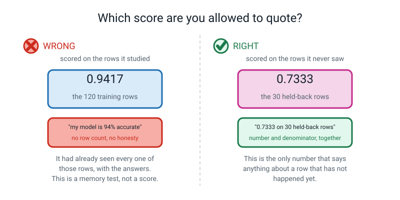
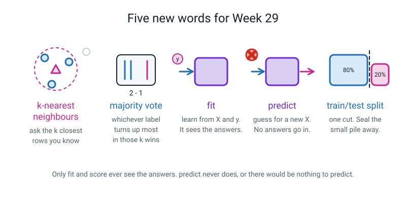

# Week 29 — Nearest Neighbours, and the 20% You Must Hide

[⬅ Week 28](week-28.md) · [Course Home](../README.md) · [Next ➡](week-30.md) · [Workbook](../workbook/week-29.md)

---

> ### This week in one sentence
> **A real machine learning model guesses by asking the `k` closest examples it already knows and taking a vote — and the score it gets only means anything on rows it has never seen.**
>
> **By the end of this chapter you will be able to:**
> - Explain **k-nearest neighbours** in your own words, without using the word "algorithm"
> - Make, fit and use a model in **three lines** of code
> - Cut your data 80/20 with `train_test_split` and say what `random_state` is for
> - Print the score on the rows the model studied **and** the score on the rows it never saw
> - Say in one sentence which of those two numbers you are allowed to quote
>
> **New syntax this week:** `KNeighborsClassifier(n_neighbors=k)` · `model.fit(X_train, y_train)` · `model.predict(X_test)` · `train_test_split(X, y, test_size=0.2, random_state=42)`
>
> **Reading time:** about 30 minutes. **Homework:** about 60 minutes.

---

## 🪝 Start Here

It is your first day at a new school and you are holding a tray in a canteen full of strangers.

You sit down. Opposite you is a girl you have never met. You want to guess which club she is in — and you want to guess it without asking, because asking is embarrassing.

So what do you actually do? You look at **the four people sitting nearest to her.** Three of the four have chess club badges on their blazers.

You guess: chess.

That is it. **That is a real machine learning model.** Not a simplified version of one, not a toy — the actual thing, used in production software today. It has a name, it has a three-line implementation, and you just ran it in your head in about a second and a half.


*Figure 29.1 — Three neighbours inside the ring get a vote. The six outside get nothing. The tally always adds up to `k`.*

> **k-nearest neighbours (kNN)** — to label something new, find the `k` known examples closest to it, and take a vote.

And here is the good news: **you already built the hard part last week.** Finding "the closest examples" means measuring distance, and you did that with a pencil, a ruler and numpy, and got 3.23 three different ways. The model is what you do *after* that.

But before we build anything, I want to show you how to break it — because that turns out to be the more important half of this week, and it is the half most people skip.

Suppose I train this thing on all 150 iris flowers. Then I check how good it is by asking it about **those exact same 150 flowers.**

What do you think it scores?

**A hundred percent.** Every time. And the reason is almost funny: if I hand it a flower that is already in its notes, what is the nearest known example to that flower?

*Itself.* Distance nought. Nothing is closer to a thing than the thing. So it looks the flower up, finds the flower, reads off the answer, and gets it right. 150 out of 150.

Does that machine understand flowers?

> **💡 Try this:** before you read on, write down one sentence answering that question. Then come back at the end of the chapter and see whether you would change a word of it.

---

## 🧠 The Big Idea

> **📌 About the code in this section.** The blocks below are **illustrations, not files**. They show you the shape of one idea, and each one carries on from the one above it — the `import` lines and the data are typed once, in the first block that needs them. **The complete, runnable file is in 💻 Type This.** If you copy a block from this section on its own and Python says `NameError`, that is why, and nothing is broken.

### 1. The whole model, and there is nothing hidden

**The plain explanation.** kNN does not work anything out in advance. When you train it, it **writes your table down** and stops. That is genuinely all that happens.

All the real work happens later, when you ask it a question. At that moment it measures the distance from your new row to **every single row it wrote down**, sorts them nearest-first, takes the top `k`, and counts the votes.

**The analogy.** 🍕 It is a friend with a very good memory and no opinions. Ask them "will I like this pizza place?" and they do not theorise about food. They think: *"the three places most like this one — you liked two of them."* They are not clever. They are just a good filing cabinet with a counting habit.

**The concrete version.** Here are six flowers you measured last week — three setosa and three versicolor, using petal length and petal width only. And one mystery flower at `(3.0, 1.0)`, sitting awkwardly between the two groups.

| flower | petal length | petal width | species |
|---|---|---|---|
| 0 | 1.4 | 0.2 | setosa |
| 1 | 1.4 | 0.2 | setosa |
| 2 | 1.3 | 0.2 | setosa |
| 3 | 4.7 | 1.4 | versicolor |
| 4 | 4.5 | 1.5 | versicolor |
| 5 | 4.9 | 1.5 | versicolor |

Measure the distance from the mystery flower to all six, then sort them nearest-first:

```
1.58  versicolor      <- closest
1.75  versicolor
1.79  setosa
1.79  setosa
1.88  setosa
1.96  versicolor
```

Six distances. That is the entire contents of the model's brain at this moment.

**Three things follow from "the model is just the table", and they are worth knowing:**

| Because the model is the table… | …this happens |
|---|---|
| Training is instant | Writing a table down takes no time. Most models are the other way round. |
| Answering is slow | Every question means measuring the distance to every stored row. Six is nothing. Six million is not. |
| There are no rules inside it | If you email somebody a trained kNN model, you have emailed them your data. |

That last one is not a detail. **A kNN model *is* your training rows.** Hold on to that; it comes back in the discussion questions and it is a genuine privacy problem.

### 2. `k` is not a setting. `k` is the model.

**The plain explanation.** `k` is how many neighbours you ask. It is the size of the committee, and you choose it.

**The analogy.** Asking one person versus asking a committee of nine. One person is fast and can be badly wrong for a silly reason. Nine people are slower, harder to swing, and much more boring — which is usually what you want.

**The concrete version.** Take those same six distances. Nothing changes. Not one number. Just change how many of them get a vote:

| `k` | Who votes | The tally | Answer |
|---|---|---|---|
| 1 | versicolor | 1 – 0 | **versicolor** |
| 3 | versicolor, versicolor, setosa | 2 – 1 | **versicolor** |
| 5 | versicolor, versicolor, setosa, setosa, setosa | 2 – 3 | **setosa** |


*Figure 29.2 — Six known flowers, sorted nearest first. Take the top 1, the top 3 or the top 5, and the vote flips.*

**Read that table again.** Same data. Same six distances. No bug. No remeasuring. **Three different answers.**

So `k` is not a little dial you fiddle with at the end once everything works. `k` **is** the model. Two people can run identical code on identical data with different `k` and get different answers, and neither of them has made a mistake.

Here is what `k` does at the extremes, which is the fastest way to get a feel for it:

| `k` | What it behaves like | How it goes wrong |
|---|---|---|
| 1 | Copy whatever the single closest example says | One weird neighbour ruins the answer. Very jumpy. |
| 5–15 | A small committee. Sensible. | This is usually where good answers live. |
| every training row | Everybody votes, so the answer is always the commonest label | It has stopped looking at your question entirely |

> **💡 Try this:** use an **odd** `k` when you have two possible answers. With `k = 4` you can get a 2–2 tie, and scikit-learn breaks ties by picking whichever label comes first in alphabetical order. That is a rule, not a reason. Nothing about your data chose it.

### 3. Three verbs. Learn them once, use them forever.

**The plain explanation.** scikit-learn has something like two hundred different models in it. Every single one of them speaks exactly the same three words.

> **fit** — learn from `X` and `y`. This is the only step that sees the answers.
> **predict** — given a new `X` with no answers, give me a guess for every row.
> **score** — given an `X` **and** the real `y`, tell me what fraction I got right.

**The analogy.** It is a driving licence. Learn to drive one car and you can get into almost any car in the world and find the pedals in the same three places. The dashboard is different; the pedals never move.

**The concrete version.**

```python
model = KNeighborsClassifier(n_neighbors=3)   # make it
model.fit(X_train, y_train)                   # learn
model.predict(X_test)                         # guess
model.score(X_test, y_test)                   # mark the guesses
```


*Figure 29.3 — `fit` gets the answers. `predict` does not. `score` marks the guesses.*

**In Week 31 you swap `KNeighborsClassifier` for a decision tree. In Week 32 you swap it for a straight line. Those three lines do not change by one character.** That is the single most valuable thing you will learn this term, and it is why the library was worth installing.

Two details that trip everybody up at least once:

**Detail one — the first line does not train anything.**

```python
model = KNeighborsClassifier(n_neighbors=3)
```

After this line, the model knows **nothing**. It is an empty machine with a dial set to 3. And it is `n_neighbors` — American spelling, no `u`. Type `n_neighbours` and you get an error, and you will, and so does everybody.

**Detail two — `predict` always wants a table, even for one row.**

```python
model.predict([[3.0, 1.0]])        # TWO brackets. One row is still a table.
```

`predict` is built to answer thousands of questions at once. It has no special mode for one. So one question is a table that happens to have a single row in it: the outer brackets say *"here is a table"*, the inner ones say *"here is the one row in it"*.

Single brackets give you the most-quoted error in this whole level, and you will meet it on purpose in a few pages.

### 4. A perfect score is the first symptom that something has leaked

**The plain explanation.** If you test a model on the rows it learnt from, the number you get back is not a score. It is a measure of how well it memorised.

**The analogy.** 🍕 Your teacher hands you a hundred practice questions **with the answers printed underneath.** You study them until you can recite every one. Then the exam is… those exact hundred questions. You score 100%.

Did you learn the subject, or did you learn the answer sheet?

**Nobody can tell. Including you.** That is the part that should bother you.

**The concrete version.** With `k = 1`, on all 150 iris flowers:

```text
score on the very same 150 flowers: 1.0
```

A hundred percent. You could put that in an advert: *"our flower identification system is 100% accurate."* It is not even a lie — that genuinely is the number that came out. And it is worth **nothing**, because every flower's nearest neighbour is itself, at distance zero.

Level 1 taught you this with a sticker. Twelve pieces of fruit, and one of them had a sticker on it that said APPLE. Twelve out of twelve. Same mistake, different clothes.

**The fix is one rule, and it is worth more than every algorithm in this book:**

> **Hide some of your rows before you start, and do not let the model see them until the very end.**

Two names for the two piles, and they matter:

> **Training set** — the rows the model is allowed to learn from.
> **Test set** — the rows you lock in a drawer and look at **once**, right at the end, to find out how the model does on things it has never seen.
> **Train/test split** — the single cut that makes those two piles.


*Figure 29.4 — One cut. 120 rows to study, 30 sealed. The counts have to add back up to 150.*

And it is one line of code:

```python
X_train, X_test, y_train, y_test = train_test_split(
    X, y,                 # the table and the answers, in that order
    test_size=0.2,        # 0.2 means 20% of the rows go into the test pile
    random_state=42,      # fixes the shuffle so we get the same cut every run
)
```

**Four names on the left, in that exact order.** `train_test_split` hands back four things, always, in the order X-train, X-test, y-train, y-test.

> **⚠️ Watch out:** it is `X_train, X_test, y_train, y_test`. **Not** `X_train, y_train, X_test, y_test`, which is the order most brains want, because pairing them up feels tidier. Both X's first, then both y's. Get it wrong and **nothing crashes** — you just quietly hand yourself your test set to train on.

**What `test_size=0.2` means.** A fraction, so 20%. 150 rows becomes 120 and 30. There is nothing magic about 20% — it is a trade-off. Hide more and your score is more trustworthy but you have fewer rows to learn from. Hide less and you have more to learn from but the score gets noisy.

**What `random_state=42` means, and this is the one worth understanding.** `train_test_split` **shuffles the rows before it cuts**, and it has to. The iris file is sorted by species — the first fifty rows are all setosa. Cut the last 20% off *that* without shuffling and your test pile is thirty virginica and nothing else, so your score tells you nothing about the other two species.

Shuffling needs randomness. And randomness means that **without** `random_state`, every run gives a different cut, and therefore a different score.

That is a disaster for learning anything. You change one thing, the score goes up, and you cannot tell whether your change helped or whether you got a friendlier shuffle. Setting `random_state` to any fixed whole number nails the shuffle down.

> **Reproducible** — running the same code again gives the same answer, so any difference you see was caused by your change and nothing else.

42 is traditional; it is a joke from a book. 0, 7 and 31 are equally fine. **The number does not matter. Fixing it does.**

Here is how much it matters, measured. Same data (iris, the two sepal columns), same model (`k = 5`), only the seed changing:

```text
random_state=0   test score = 0.6667
random_state=1   test score = 0.8667
random_state=2   test score = 0.7333
random_state=3   test score = 0.7333
random_state=4   test score = 0.9000
random_state=5   test score = 0.8667
random_state=6   test score = 0.7333
random_state=7   test score = 0.6333
random_state=8   test score = 0.6333
random_state=9   test score = 0.8333

lowest : 0.6333
highest: 0.9
spread : 0.2667
```

**Twenty-seven percentage points of spread**, and nothing changed except where the deck got cut. If somebody quotes you a single accuracy with no test-set size and no seed, that table is what they are not telling you.

### 5. Two scores, and the gap between them is the interesting part

**The plain explanation.** Print both. Always both. The difference between them tells you something neither number can tell you on its own.

**The analogy.** Your score on the homework you had the answers to, and your score on the exam. Nobody cares about the first one by itself. But the *gap* is a diagnosis: a big gap means you memorised the homework.

**The concrete version.** iris, two sepal columns only, `k = 1`:

```text
score on the TRAINING rows : 0.9417 on 120 rows
score on the HELD-BACK rows: 0.7333 on 30 rows

THE GAP: 0.2083
that is 20.83 percentage points
```


*Figure 29.5 — The blue bar flatters. The pink bar is the one you are allowed to quote.*

**Ninety-four percent on the homework it had the answers to. Seventy-three percent on the exam.** Twenty-one points of that first number was memory, not skill.

Here is how to read any gap you ever see:

| What you see | What it means |
|---|---|
| Both high, close together | Healthy. This is what you want. |
| Train high, test much lower | The model memorised. A big gap is the symptom. |
| Both low | Not good enough — or your features do not carry the answer. |
| Test *higher* than train | It happens, especially on small test sets. It means the rows you hid happened to be easy ones. |

That last row is going to happen to you in about ten minutes, on the four-column version of iris. **Do not panic and do not hide it.** With 30 test flowers, each single flower is worth 3.3 percentage points — so a gap of one or two flowers is noise, not evidence. Thirty is a short ruler.

Which is why, from this week on, there is a rule about how you report a score:

> **Every accuracy gets its row count written next to it. Every time.**
> `1.0000 on 30 rows` is honest. `100%` on its own is showing off.

---

## 💻 Type This

Five small files, in order. Run each one before you move on to the next.

### Step 1 — Three lines, and a real model

New file, `first_model.py`.

```python
# first_model.py
# Three lines of scikit-learn do what we just did by hand.

import numpy as np
from sklearn.neighbors import KNeighborsClassifier    # the model, imported

six = np.array([[1.4, 0.2],
                [1.4, 0.2],
                [1.3, 0.2],
                [4.7, 1.4],
                [4.5, 1.5],
                [4.9, 1.5]])
names = np.array(["setosa", "setosa", "setosa",
                  "versicolor", "versicolor", "versicolor"])

model = KNeighborsClassifier(n_neighbors=3)   # 1. make it. Committee of 3.
model.fit(six, names)                         # 2. fit it. Show it the answers.
guess = model.predict([[3.0, 1.0]])           # 3. predict. Note DOUBLE brackets.

print("the model guesses:", guess)
print()

# Try the same mystery flower with three different committee sizes.
for k in [1, 3, 5]:
    m = KNeighborsClassifier(n_neighbors=k)
    m.fit(six, names)
    print(f"k = {k}  ->", m.predict([[3.0, 1.0]]))
```

Line by line, the new bits:

- `from sklearn.neighbors import KNeighborsClassifier` — models live in rooms. Nearest-neighbour models live in `.neighbors`. Trees will live in `.tree`, straight lines in `.linear_model`.
- `six = np.array([[...], [...]])` — a table, so **two** levels of brackets. Six rows, two columns. This is `X`, exactly as you built it last week.
- `names = np.array([...])` — one level of brackets. Six answers, in a line. This is `y`.
- `KNeighborsClassifier(n_neighbors=3)` — makes an empty machine with the dial set to 3. Nothing is learnt yet.
- `model.fit(six, names)` — `X` first, `y` second. For kNN, "learn" means "write the six rows down".
- `model.predict([[3.0, 1.0]])` — double brackets. A table with one row in it.

Run it.

```text
the model guesses: ['versicolor']

k = 1  -> ['versicolor']
k = 3  -> ['versicolor']
k = 5  -> ['setosa']
```

**Now stop and look at those three lines next to the table on page 3 of this chapter.**

versicolor · versicolor · **setosa**

**Identical.** The library and your pencil agree on all three, including the flip at `k = 5`. You did not take anybody's word for what kNN does — you did it yourself first, and the machine confirmed you. Keep doing it in that order all year.

> **💡 Try this:** notice the answer comes back as `['versicolor']` — inside square brackets. That is because `predict` always hands back **one answer per row you asked about**, so even one question gets you a one-item list. `guess[0]` pulls the string out on its own.

### Step 2 — Break it on purpose: one pair of brackets

Change the `predict` line to single brackets. Deliberately.

```python
guess = model.predict([3.0, 1.0])
```

Run it. You get a long traceback ending like this:

```text
  File "/Users/you/project/first_model.py", line 18, in <module>
    guess = model.predict([3.0, 1.0])
  ...
ValueError: Expected 2D array, got 1D array instead:
array=[3. 1.].
Reshape your data either using array.reshape(-1, 1) if your data has a single feature or array.reshape(1, -1) if it contains a single sample.
```

This one is worth meeting here rather than alone at 9pm. It is fully explained in **When It Breaks** below. For now: put the brackets back, run it again, confirm it works, and move on.

### Step 3 — The dishonest hundred percent

New file, `dishonest.py`. We are going to do the wrong thing on purpose so you recognise it when somebody does it to you.

```python
# dishonest.py
# The wrong thing, done on purpose, so you recognise it later.

from sklearn.datasets import load_iris
from sklearn.neighbors import KNeighborsClassifier

iris = load_iris()
X = iris.data                            # all 150 rows, all 4 measurements
y = iris.target                          # all 150 answers

model = KNeighborsClassifier(n_neighbors=1)
model.fit(X, y)                          # learn from ALL 150 flowers

print("score on the very same 150 flowers:", model.score(X, y))
```

**Write down what you think it prints, before you run it.** Then run it.

```text
score on the very same 150 flowers: 1.0
```

One point nought. A hundred and fifty out of a hundred and fifty.

Say out loud why that number is worthless. *Every flower's nearest neighbour is itself, at distance zero.*

Then be suspicious of numbers like it for the rest of your life. **A perfect score is not a triumph. It is the first symptom that something has leaked.**

### Step 4 — Cut the deck

New file, `split_it.py`.

```python
# split_it.py
# Cut the deck: 80% to learn from, 20% locked away.

from sklearn.datasets import load_iris
from sklearn.model_selection import train_test_split   # the new import

iris = load_iris()
X = iris.data
y = iris.target

X_train, X_test, y_train, y_test = train_test_split(
    X, y,                 # the table and the answers, in that order
    test_size=0.2,        # 0.2 means 20% of the rows go into the test pile
    random_state=42,      # fixes the shuffle so we get the same cut every run
)

print("whole table :", X.shape)
print("train pile  :", X_train.shape, " answers:", y_train.shape)
print("test pile   :", X_test.shape, " answers:", y_test.shape)
print()
print("len(X_train) =", len(X_train))
print("len(X_test)  =", len(X_test))
print("120 + 30 =", len(X_train) + len(X_test))
```

New lines:

- `from sklearn.model_selection import train_test_split` — a **different room** from `sklearn.datasets`. Splitting is not loading. Getting these two rooms mixed up is a real error and it is in the Clinic below.
- The four names on the left, in order. Both X's, then both y's.
- The last three prints are not decoration. **They are the check that catches most of your own mistakes for the rest of the year.**

Run it.

```text
whole table : (150, 4)
train pile  : (120, 4)  answers: (120,)
test pile   : (30, 4)  answers: (30,)

len(X_train) = 120
len(X_test)  = 30
120 + 30 = 150
```

Read the four shapes out loud. `X_train` and `y_train` both start with 120 — every row of measurements has exactly one answer. `X_test` and `y_test` both start with 30. And 120 + 30 = 150, so nothing was thrown away and nothing is in both piles.

### Step 5 — The full cycle, and both scores

New file, `full_cycle.py`. This is the week.

```python
# full_cycle.py
# The whole thing: split, fit, predict, and TWO scores.

from sklearn.datasets import load_iris
from sklearn.model_selection import train_test_split
from sklearn.neighbors import KNeighborsClassifier

iris = load_iris()
X = iris.data
y = iris.target

# 1. Cut the deck BEFORE the model sees anything.
X_train, X_test, y_train, y_test = train_test_split(
    X, y, test_size=0.2, random_state=42
)

# 2. Make the model and fit it on the training pile only.
model = KNeighborsClassifier(n_neighbors=5)
model.fit(X_train, y_train)

# 3. Predict the held-back rows.
predictions = model.predict(X_test)

print("first 10 predictions:", predictions[:10])
print("first 10 real answers:", y_test[:10])
print()

train_score = model.score(X_train, y_train)   # score on rows it studied
test_score = model.score(X_test, y_test)      # score on rows it never saw

print("score on the TRAINING rows:", round(train_score, 4), " (", len(X_train), "rows )")
print("score on the HELD-BACK rows:", round(test_score, 4), " (", len(X_test), "rows )")
print()
print("the gap:", round(train_score - test_score, 4))
```

Run it.

```text
first 10 predictions: [1 0 2 1 1 0 1 2 1 1]
first 10 real answers: [1 0 2 1 1 0 1 2 1 1]

score on the TRAINING rows: 0.9667  ( 120 rows )
score on the HELD-BACK rows: 1.0  ( 30 rows )

the gap: -0.0333
```

**Two things to look at.**

First: the predictions and the real answers, side by side, and the first ten match exactly. That is a real model doing real work on flowers it has never seen, and you built it four minutes ago.

Second — and this is the interesting one — **the held-back score is higher than the training score.** The gap is *negative*. It got everything right on the sealed pile.

Is that a triumph?

**No.** And the honest reason is arithmetic. There are **thirty** flowers in that test pile, so each single flower is worth 3.3 percentage points. One flower being lucky moves the number by three points. The gap here is one flower's worth.

Which means the score did not go up. It just did not go anywhere, and **thirty is too short a ruler to tell the difference.**

### Step 6 — Make it harder, and find the real gap

Iris with all four measurements is a bit too easy. Let us make it hard in the meanest possible way: throw away the two best measurements and keep only the two worst. Last week you noticed the petals separate the species beautifully — so, petals out. Sepals only. And `k = 1`, so the model has no committee to hide behind.

New file, `the_gap.py`.

```python
# the_gap.py
# The same cycle, but using only the two SEPAL columns, with k = 1.

from sklearn.datasets import load_iris
from sklearn.model_selection import train_test_split
from sklearn.neighbors import KNeighborsClassifier

iris = load_iris()
X = iris.data[:, 0:2]                    # columns 0 and 1: the two sepal columns
y = iris.target

print("X shape now:", X.shape)           # 150 rows, only 2 columns

X_train, X_test, y_train, y_test = train_test_split(
    X, y, test_size=0.2, random_state=42
)

model = KNeighborsClassifier(n_neighbors=1)   # k = 1: copy the single closest
model.fit(X_train, y_train)

train_score = model.score(X_train, y_train)
test_score = model.score(X_test, y_test)

print()
print("score on the TRAINING rows :", round(train_score, 4), "on", len(X_train), "rows")
print("score on the HELD-BACK rows:", round(test_score, 4), "on", len(X_test), "rows")
print()
print("THE GAP:", round(train_score - test_score, 4))
print("that is", round((train_score - test_score) * 100, 2), "percentage points")
```

`iris.data[:, 0:2]` is Week 19 syntax: every row, columns 0 up to but not including 2.

Run it.

```text
X shape now: (150, 2)

score on the TRAINING rows : 0.9417 on 120 rows
score on the HELD-BACK rows: 0.7333 on 30 rows

THE GAP: 0.2083
that is 20.83 percentage points
```

**There it is.** Ninety-four percent on the homework it had the answers to. Seventy-three on the exam. Twenty-one points of flattery.

Write that number somewhere you will still see it in a month. There is a lesson coming in a few weeks that is entirely about that gap.

> **🐞 If you see this error:** you do not — but you may be puzzled by something. Earlier I said `k = 1` always scores exactly 1.0 on the training rows, and here it scored 0.9417. **That is real, and there is an honest reason.** Sixteen of the 120 training flowers share their *exact* sepal measurements with a flower of a **different species** — `(6.3, 2.5)` is both a virginica and a versicolor in this table. For seven of them the nearest neighbour at distance zero that the model picks is the look-alike with the different answer, and it gets those seven wrong. Throw away two columns and you throw away the ability to tell some rows apart at all. On the full four-column iris, `k = 1` does score exactly 1.0.

### The complete finished program

```python
# week29_complete.py
# Cut the deck, fit, predict, and report BOTH scores honestly. Twice.

from sklearn.datasets import load_iris
from sklearn.model_selection import train_test_split
from sklearn.neighbors import KNeighborsClassifier

iris = load_iris()
y = iris.target

# Run the whole cycle twice: once on all four columns, once on the two sepals.
for label, X in [("all 4 columns, k=5", iris.data),
                 ("2 sepal columns, k=1", iris.data[:, 0:2])]:

    k = 5 if X.shape[1] == 4 else 1

    X_train, X_test, y_train, y_test = train_test_split(
        X, y, test_size=0.2, random_state=42
    )

    model = KNeighborsClassifier(n_neighbors=k)   # make it
    model.fit(X_train, y_train)                   # fit it, on the train pile only

    train_score = model.score(X_train, y_train)
    test_score = model.score(X_test, y_test)

    print("---", label, "---")
    print("X shape    :", X.shape)
    print("train pile :", X_train.shape, " test pile:", X_test.shape)
    print("train score:", round(train_score, 4), "on", len(X_train), "rows")
    print("test  score:", round(test_score, 4), "on", len(X_test), "rows")
    print("THE GAP    :", round(train_score - test_score, 4))
    print()
```

```text
--- all 4 columns, k=5 ---
X shape    : (150, 4)
train pile : (120, 4)  test pile: (30, 4)
train score: 0.9667 on 120 rows
test  score: 1.0 on 30 rows
THE GAP    : -0.0333

--- 2 sepal columns, k=1 ---
X shape    : (150, 2)
train pile : (120, 2)  test pile: (30, 2)
train score: 0.9417 on 120 rows
test  score: 0.7333 on 30 rows
THE GAP    : 0.2083

```

---

## 🔍 Worked Examples

### Worked Example 1 — Will the pizza arrive hot? (food)

Eight past orders. We know the price, the distance, and whether it turned up hot. Now three new orders come in.

```python
# pizza_knn.py
# Eight past orders. Will the next one arrive hot?

import numpy as np
import pandas as pd
from sklearn.neighbors import KNeighborsClassifier

orders = pd.DataFrame({
    "shop":    ["Nonna's", "Slice Hut", "Big Al", "Crustys",
                "Nonna's", "Big Al", "Pizza Post", "Slice Hut"],
    "price":   [220, 180, 260, 150, 240, 275, 195, 165],
    "km_away": [1.2, 4.5, 0.8, 6.1, 1.5, 0.9, 5.2, 4.9],
    "arrived": ["hot", "cold", "hot", "cold", "hot", "hot", "cold", "cold"],
})

X = orders[["price", "km_away"]].values   # .values takes the column NAMES off
y = orders["arrived"].values              # so predict never complains about them

model = KNeighborsClassifier(n_neighbors=3)   # 1. make it
model.fit(X, y)                               # 2. fit it
guess = model.predict([[230, 1.0]])           # 3. predict. DOUBLE brackets.

print("a 230-rupee pizza from 1.0 km away ->", guess[0])
print()

# Three new orders in one go. predict is built for tables of questions.
new_orders = [[230, 1.0],
              [170, 5.5],
              [210, 4.0]]
print("three at once:", model.predict(new_orders))
print()

# The same three orders, three committee sizes.
for k in [1, 3, 5]:
    m = KNeighborsClassifier(n_neighbors=k)
    m.fit(X, y)
    print(f"k = {k}  ->", m.predict(new_orders))
print()

# Why did the third one change its mind? Look at the distances.
mystery = np.array([210.0, 4.0])
for i in range(len(X)):
    gaps = X[i] - mystery
    distance = np.sqrt((gaps ** 2).sum())
    print(f"  order {i}: {orders['shop'][i]:11s} distance {distance:6.2f}  really {y[i]}")
```

```text
a 230-rupee pizza from 1.0 km away -> hot

three at once: ['hot' 'cold' 'cold']

k = 1  -> ['hot' 'cold' 'hot']
k = 3  -> ['hot' 'cold' 'cold']
k = 5  -> ['hot' 'cold' 'cold']

  order 0: Nonna's     distance  10.38  really hot
  order 1: Slice Hut   distance  30.00  really cold
  order 2: Big Al      distance  50.10  really hot
  order 3: Crustys     distance  60.04  really cold
  order 4: Nonna's     distance  30.10  really hot
  order 5: Big Al      distance  65.07  really hot
  order 6: Pizza Post  distance  15.05  really cold
  order 7: Slice Hut   distance  45.01  really cold
```

**What to notice.** The third order — 210 rupees, 4.0 km — flips. `k = 1` says hot; `k = 3` and `k = 5` say cold.

Sort the eight distances and you can see exactly why:

| position | distance | really |
|---|---|---|
| 1st | 10.38 | hot |
| 2nd | 15.05 | cold |
| 3rd | 30.00 | cold |
| 4th | 30.10 | hot |
| 5th | 45.01 | cold |

`k = 1` takes the top one: **hot.** `k = 3` takes the top three: hot, cold, cold → **cold**, 2 to 1. `k = 5`: hot, cold, cold, hot, cold → **cold**, 3 to 2.

**And notice `.values` on the two lines that build `X` and `y`.** Without it, `X` is a pandas DataFrame with named columns, and when you later hand `predict` a plain list of numbers with no names on it, scikit-learn prints a warning about mismatched feature names. Taking the names off before fitting sidesteps the whole argument. There is more about that warning in **When It Breaks**.

### Worked Example 2 — Batter or bowler? (sport)

Six players we know about, and one new player we do not.

```python
# cricket_knn.py
# Six players we know about, and one new player we don't.

import numpy as np
import pandas as pd
from sklearn.neighbors import KNeighborsClassifier

team = pd.DataFrame({
    "player":  ["Asha", "Ravi", "Meera", "Karan", "Divya", "Sanjay"],
    "runs":    [312, 41, 288, 27, 350, 19],
    "wickets": [1, 14, 0, 17, 2, 21],
    "role":    ["batter", "bowler", "batter", "bowler", "batter", "bowler"],
})

X = team[["runs", "wickets"]].values
y = team["role"].values

new_player = np.array([160.0, 8.0])          # 160 runs and 8 wickets. An all-rounder?

# Do the vote by hand first: six distances, then sort them.
print("distance from the new player to each of the six:")
rows = []
for i in range(len(X)):
    distance = np.sqrt(((X[i] - new_player) ** 2).sum())
    rows.append((distance, team["player"][i], y[i]))
for distance, name, role in sorted(rows):
    print(f"   {distance:7.2f}   {name:7s} {role}")
print()

# Now let the library do it.
for k in [1, 3, 5]:
    model = KNeighborsClassifier(n_neighbors=k)
    model.fit(X, y)
    print(f"k = {k}  ->", model.predict([new_player]))
print()

# Why did the 8 wickets barely matter? Look at Ravi, the closest player.
ravi = X[1]
gaps = ravi - new_player
squares = gaps ** 2
total = squares.sum()
print("new player vs Ravi:")
print("   gaps            :", gaps)
print("   squares         :", squares)
print("   total           :", round(float(total), 2))
print("   runs' share     :", round(float(100 * squares[0] / total), 2), "%")
print("   wickets' share  :", round(float(100 * squares[1] / total), 2), "%")
```

```text
distance from the new player to each of the six:
    119.15   Ravi    bowler
    128.25   Meera   batter
    133.30   Karan   bowler
    141.60   Sanjay  bowler
    152.16   Asha    batter
    190.09   Divya   batter

k = 1  -> ['bowler']
k = 3  -> ['bowler']
k = 5  -> ['bowler']

new player vs Ravi:
   gaps            : [-119.    6.]
   squares         : [14161.    36.]
   total           : 14197.0
   runs' share     : 99.75 %
   wickets' share  : 0.25 %
```

**Two honest things to notice, and the second one is the bigger.**

**One — the vote is much closer than "bowler" makes it sound.** Ravi is 119.15 away and Meera is 128.25. Only about nine distance units of daylight between the two answers. A model that says "bowler" with no hesitation is overstating what it knows, and the sensible human sentence here is *"this one is uncertain"*.

**Two — the model never really looked at the wickets.** Look at the last two lines. Runs contributed **99.75%** of the distance to Ravi; wickets contributed **0.25%**. Not because wickets do not matter to cricket — obviously they do — but because runs happen to be written in hundreds and wickets in single digits, and squaring makes that gap enormous.

So a player with 160 runs *and* 8 wickets — a genuine all-rounder — gets sorted almost entirely by their run count. That is a real defect and it has a real fix, and the fix is next week's whole lesson.

> **🧑‍🏫 If a student asks:** *"Isn't the right answer 'all-rounder'?"* — Yes, arguably. And the model **cannot** say it, because "all-rounder" was never one of the labels in `y`. **A model can only ever hand you back one of the answers it was shown.** If your table has two labels, you will get one of two labels, however wrong both of them are for the row in front of you.

### Worked Example 3 — Twenty pupils, and four test rows (school)

Twenty pupils, how long they slept, how long they revised, and whether they passed. Big enough to split, and small enough to teach you something painful about splitting.

```python
# revision_knn.py
# Twenty pupils. Split them, fit, and look hard at how many test rows you have.

import pandas as pd
from sklearn.model_selection import train_test_split
from sklearn.neighbors import KNeighborsClassifier

pupils = pd.DataFrame({
    "hours_slept":   [8.5, 5.0, 7.5, 4.5, 9.0, 6.0, 8.0, 5.5, 7.0, 6.5,
                      9.5, 4.0, 8.2, 5.8, 7.8, 6.2, 8.8, 5.2, 7.2, 6.8],
    "revision_mins": [90, 20, 75, 15, 120, 40, 100, 25, 60, 45,
                      130, 10, 95, 30, 85, 50, 110, 22, 70, 55],
    "passed":        ["yes", "no", "yes", "no", "yes", "no", "yes", "no", "yes", "no",
                      "yes", "no", "yes", "no", "yes", "no", "yes", "no", "yes", "yes"],
})

X = pupils[["hours_slept", "revision_mins"]].values
y = pupils["passed"].values
print("X.shape:", X.shape, "  y.shape:", y.shape)

X_train, X_test, y_train, y_test = train_test_split(
    X, y, test_size=0.2, random_state=42
)
print("train pile:", X_train.shape, "  test pile:", X_test.shape)
print()

model = KNeighborsClassifier(n_neighbors=3)
model.fit(X_train, y_train)
print("train score:", round(model.score(X_train, y_train), 4), "on", len(X_train), "rows")
print("test  score:", round(model.score(X_test, y_test), 4), "on", len(X_test), "rows")
print("one test pupil is worth", round(100 / len(X_test), 1), "percentage points")
print()

# Same table, same model. Five different cuts of the deck.
print("the same experiment, five different splits:")
for seed in [0, 1, 7, 31, 42]:
    a, b, c, d = train_test_split(X, y, test_size=0.2, random_state=seed)
    m = KNeighborsClassifier(n_neighbors=3)
    m.fit(a, c)
    print(f"   random_state={seed:2d}   test score = {m.score(b, d):.4f}   on {len(b)} rows")
```

```text
X.shape: (20, 2)   y.shape: (20,)
train pile: (16, 2)   test pile: (4, 2)

train score: 1.0 on 16 rows
test  score: 1.0 on 4 rows
one test pupil is worth 25.0 percentage points

the same experiment, five different splits:
   random_state= 0   test score = 0.5000   on 4 rows
   random_state= 1   test score = 1.0000   on 4 rows
   random_state= 7   test score = 1.0000   on 4 rows
   random_state=31   test score = 0.7500   on 4 rows
   random_state=42   test score = 1.0000   on 4 rows
```

**What to notice, and this is the most useful thing in the chapter.**

The first result says **100% on the held-back rows.** Perfect. Sealed envelope and everything. And it is worth almost nothing — because there are **four** rows in that envelope, so one pupil is worth twenty-five percentage points.

The five-seed sweep proves it. Same twenty pupils. Same model. Same `k`. Nothing changed but where the deck got cut, and the score went **0.50, 1.00, 1.00, 0.75, 1.00.**

So which of those is "the accuracy of my model"? **None of them.** With four test rows there is no such number to find.

> **⚠️ Watch out:** this is not a reason to skip the split and go back to testing on your training rows. That is worse, not better. It is a reason to say, in writing, *"my test set has four rows in it, so this number is not evidence."* **You are allowed to report a weak result. You are not allowed to report it as if it were strong.**

---

## 🐞 When It Breaks

Every message below came out of a real run. Errors this week are longer than usual, because scikit-learn tracebacks are mostly the library showing you its own insides.

**The new rule for this week:** before you read the last line, **find the line with your own filename in it.** Fifteen lines of traceback, two of them yours.

### Error 1 — one pair of brackets missing

```python
guess = model.predict([3.0, 1.0])
```

```text
Traceback (most recent call last):
  File "/private/tmp/w2830/first_model.py", line 18, in <module>
    guess = model.predict([3.0, 1.0])
  File ".../sklearn/neighbors/_classification.py", line 274, in predict
    neigh_ind = self.kneighbors(X, return_distance=False)
  File ".../sklearn/neighbors/_base.py", line 838, in kneighbors
    X = validate_data(
  File ".../sklearn/utils/validation.py", line 1091, in check_array
    raise ValueError(msg)
ValueError: Expected 2D array, got 1D array instead:
array=[3. 1.].
Reshape your data either using array.reshape(-1, 1) if your data has a single feature or array.reshape(1, -1) if it contains a single sample.
```

**What Python is telling you.** The last **three** lines are all one message this time.

`Expected 2D array, got 1D array instead.` **2D means a table** — two directions, rows and columns. **1D means a single line.** You handed over a single line and it wanted a table.

And it even shows you what it received: `array=[3. 1.]`. One line of two numbers.

**Why does it want a table for one flower?** Because `predict` is built to answer thousands of questions in one call. It has no special mode for one question. So one question is a table that happens to have one row in it.

**Ignore the advice about `reshape`.** It is correct and it is for grown-up situations. Ours is simpler.

**The fix.** Put the brackets back.

```python
guess = model.predict([[3.0, 1.0]])
```

> **🧑‍🏫 If a student asks:** *"Why doesn't it fix the brackets for me? It clearly knows what I meant."* — It genuinely does not. `[3.0, 1.0]` could sensibly mean *one flower with two measurements* or *two flowers with one measurement each*. Both are real situations. Guessing wrong would give you a plausible answer that was silently wrong, which is far worse than an error. **A library that refuses to guess is doing you a favour** — and the two `reshape` options in that message are it offering you both readings instead of choosing one.

### Error 2 — asking before showing

```python
model = KNeighborsClassifier(n_neighbors=1)
print(model.predict([[3.0, 1.0]]))
```

```text
Traceback (most recent call last):
  File "/private/tmp/w2830/e2.py", line 5, in <module>
    print(model.predict([[3.0, 1.0]]))
  File ".../sklearn/neighbors/_classification.py", line 257, in predict
    check_is_fitted(self, "_fit_method")
  File ".../sklearn/utils/validation.py", line 1754, in check_is_fitted
    raise NotFittedError(msg % {"name": type(estimator).__name__})
sklearn.exceptions.NotFittedError: This KNeighborsClassifier instance is not fitted yet. Call 'fit' with appropriate arguments before using this estimator.
```

**What Python is telling you.** This one is unusually polite: *"You asked me to guess before you showed me anything."*

There is no `fit` line. Or there is one, but it is *below* the `predict`, and Python runs your file top to bottom, so it has not happened yet.

**And notice how sensible the complaint is.** The model has no rows written down. Which flower would it measure the distance to?

**The fix.** Three steps, always in this order:

```python
model = KNeighborsClassifier(n_neighbors=1)   # make
model.fit(X_train, y_train)                   # fit
print(model.predict([[3.0, 1.0]]))            # then use
```

**make → fit → use.** Write it on something you will see again. Every machine in this library follows it, including one next week that is not a model at all.

### Error 3 — two boxes for four parcels

```python
X_train, X_test = train_test_split(iris.data, iris.target, test_size=0.2, random_state=42)
```

```text
Traceback (most recent call last):
  File "/private/tmp/w2830/e3.py", line 5, in <module>
    X_train, X_test = train_test_split(iris.data, iris.target, test_size=0.2, random_state=42)
ValueError: too many values to unpack (expected 2)
```

**What Python is telling you.** **Unpack** is a good word for it. Imagine a parcel with four things in it, and you have put out two boxes to catch them. Two of the four have nowhere to go, so Python refuses.

`train_test_split` always hands back **four** things, in one fixed order, and you have to catch all four:

**`X_train, X_test, y_train, y_test`**

**The fix.**

```python
X_train, X_test, y_train, y_test = train_test_split(
    iris.data, iris.target, test_size=0.2, random_state=42
)
```

> **⚠️ Watch out:** Python only caught this because you gave it the *wrong number* of names. Give it **four names in the wrong order** and it will not complain at all — it will hand you your test set to train on, silently, and your score will be nonsense that looks fine. **Which is exactly why you print all four shapes afterwards.** A wrong order shows up instantly as a shape that makes no sense, like `y_train` coming out as `(30, 4)`.

### Two more you will meet, and they are quick

> **🐞 If you see this error:** `TypeError: KNeighborsClassifier.__init__() got an unexpected keyword argument 'n_neighbours'` — you spelt it correctly in English and scikit-learn wants it spelt in American. It is `n_neighbors`. No `u`. This is annoying, permanent, and not your fault.

> **🐞 If you see this warning:** `UserWarning: X does not have valid feature names, but KNeighborsClassifier was fitted with feature names` — you called `fit` with a pandas DataFrame (which has column names) and then called `predict` with a plain list of numbers (which does not). **It is a warning, not an error** — you can tell because there is no `Traceback` and the program carries on and prints your answer. Two fixes, both fine: put `.values` on the end when you build `X`, so there are never any names to mismatch; or hand `predict` a DataFrame with the same column names.

---

## 🎲 What We Did In Class

### Part 1 — The deck, the envelope, and your own signature

You need a real deck of cards, an envelope, and a pen. **Not a pencil.**

1. **Count out the cards** and say the number out loud. If it is a standard 52-card deck, put two aside and use 50, because the arithmetic is nicer.
2. **Shuffle properly.** And say why while you do it: *the iris file is sorted, so the first fifty rows are all setosa. Cut it without shuffling and my test pile is virginica and nothing else, and my score tells me nothing about the other two species.* **Shuffling is not tidiness. It is necessary.**
3. **Work out 20%** of your number of cards. For 50, that is 10. Say it before you cut.
4. **Deal that many cards into a small pile,** counting out loud, one at a time. Then count the big pile. 40 and 10. They add to 50.
5. **Write both numbers on the envelope** — `TEST: 10 rows` — and today's date.
6. **Put the small pile in. Seal it.**
7. **Sign across the flap.** Right across it, so anybody could tell if it had been opened.
8. **Leave it on the table, visible, for the rest of the lesson.**

From that moment there is exactly one thing you are allowed to do with that envelope: at the very end, open it once, and check.

**Not** open it, have a look, change the model, and check again. **Once.** Because the moment you look at it twice with a change in between, it stops being data you have never seen and goes back to being a practice paper with the answers on it.

**The signature is you making a promise to yourself.** Nobody else wants to peek. Level 1 did this with an envelope too, and it was the same promise then.

### Part 2 — The same cut, in one line

Type `full_cycle.py` from the **Type This** section and run it. You should get exactly:

```text
score on the TRAINING rows: 0.9667  ( 120 rows )
score on the HELD-BACK rows: 1.0  ( 30 rows )

the gap: -0.0333
```

If your numbers are different, the first thing to check — before anything else — is whether `random_state=42` is there.

### Part 3 — The gap goes on the board

Type `the_gap.py` and run it. Then write this up somewhere it will stay all term:

```
  THE GAP        0.9417  on the rows it studied
                 0.7333  on the rows it had never seen
                 --------
                 0.2083   =  21 percentage points of flattery
```

### If you missed the lesson

Do all three parts in order, and do not skip Part 1 to get to the typing. The code takes four minutes; the habit takes twenty, and the habit is the thing we are actually here for.

**If you have no cards,** use any pile of twenty-odd identical objects — paper rectangles, dominoes, Lego bricks, coins. **The envelope is the part you must not skip.**

### The extension we ran out of time for

Three sizes of committee, on iris, all four columns. **Write down your prediction for each one before you run it.**

```python
# three_personalities.py
# Three sizes of committee, three completely different personalities.

from sklearn.datasets import load_iris
from sklearn.model_selection import train_test_split
from sklearn.neighbors import KNeighborsClassifier

iris = load_iris()
X = iris.data
y = iris.target

X_train, X_test, y_train, y_test = train_test_split(
    X, y, test_size=0.2, random_state=42
)

for k in [1, 5, 120]:                    # 120 = every training row votes
    model = KNeighborsClassifier(n_neighbors=k)
    model.fit(X_train, y_train)
    train = model.score(X_train, y_train)
    test = model.score(X_test, y_test)
    print(f"k = {k:3d}   train = {train:.4f}   test = {test:.4f}")
```

```text
k =   1   train = 1.0000   test = 1.0000
k =   5   train = 0.9667   test = 1.0000
k = 120   train = 0.3417   test = 0.3000
```

**Three questions worth answering out loud.** Why is `k = 1`'s train score exactly 1.0000? *(Every row is its own nearest neighbour.)* Why did `k = 120` collapse to about a third? *(Every training row votes on every question, so the answer is always the commonest species — and there are three roughly equal species, so it is right about a third of the time. It has stopped looking at the flower.)* Which of the three is a healthy model? *(`k = 5`: both scores high and close together.)*

---

## 💬 Talk About It

**1. A kNN model has no rules inside it — it is a copy of your training rows. If you train one on medical records and then send the trained model to a hospital, what have you actually sent them?**

*Hint:* start with the literal answer, which is uncomfortable enough. Then go one step further: somebody who can only *ask questions* of the model, without seeing inside it, can feed it carefully chosen inputs and work backwards. And then the hard part — if a person asks you to delete their data, is deleting the row enough, when their row is baked into a model you have already given to fifty people? *(Nobody agrees on the answer, and the law in most countries has not caught up.)*

**2. Your friend says: "hiding 20% of your rows is wasteful — you're throwing away learning material." Give them the strongest answer you can, and then say which part of what they said is actually right.**

*Hint:* two answers, and one is much stronger than the other. The weak one: 120 rows and 150 rows produce nearly identical models. The strong one: **a model whose accuracy you cannot honestly measure is worth nothing at all, however well it was trained.** And the part your friend is right about? On a table with twenty rows, they have a real point — go and look at Worked Example 3 again.

**3. Somebody runs the same code ten times, gets ten different accuracies, and reports the highest one. They did not lie about any single number. What exactly did they do wrong, and how would you catch them?**

*Hint:* look at the seed table in section 4 — 0.6333 to 0.9000 for free. Then ask: what is the score *supposed* to be an estimate of? And for the catching part: what could you ask them to do that they could not fake in advance? *(Run it on a fresh split they had never seen. That is genuinely how it gets caught in real life.)*

---

## ⚠️ Don't Get Tricked

### Trick 1 — "the higher of my two scores is the better one"


*Figure 29.6 — On the left, the flattering number with no row count. On the right, the only one that says anything about a row that has not happened yet.*

**Wrong:** *"My model is 94% accurate."* (That was the training score.)

**Right:** *"My model scored 0.7333 on 30 rows it had never seen. On the rows it studied it got 0.9417, so about 21 points of that was memory."*

Only the held-back score is a **score**. The training score is not a measure of quality at all — it is a measure of how much got memorised. It is still worth printing, but only as a companion, because **the gap between the two is the diagnosis.** One number tells you nothing; the pair tells you what kind of trouble you are in.

### Trick 2 — "the test set is a second thing to train on"

**Wrong:**

```python
model.fit(X_train, y_train)
model.fit(X_test, y_test)      # "now learn from the rest as well"
```

**Right:**

```python
model.fit(X_train, y_train)    # X_train and y_train go in here. Nothing else.
model.predict(X_test)          # X_test goes in here. No answers.
model.score(X_test, y_test)    # y_test appears ONCE, to mark the guesses.
```

You get four variables back and it is tempting to think all four are used the same way. They are not. **`y_test` is only ever used to mark the answers.** The model never sees it, not once, not ever. It is the answer sheet inside the sealed envelope.

### Trick 3 — "a bigger `k` is a better `k`"

**Wrong:** turn `k` up and the model gets steadier, so turn it right up.

**Right:** it gets steadier and then it gets stupid. Look at the three personalities:

| `k` | train | test |
|---|---|---|
| 1 | 1.0000 | 1.0000 |
| 5 | 0.9667 | 1.0000 |
| 120 | 0.3417 | 0.3000 |

At `k = 120` every training row votes on every question, so the answer is always the commonest species no matter what flower you hand it. **It scores 30% and it has stopped looking at its input.** Bigger `k` buys steadiness up to a point and then it buys blindness.

### Trick 4 — "running it again will make it better"

**Wrong:** run the file a few more times and let it practise.

**Right:** running the file again does exactly the same arithmetic and produces exactly the same model. There is no practising, no gradual improvement, nothing that accumulates. **A model is a function of its training data and its settings, full stop.**

And if the score *does* change between runs, that is not improvement — that is something unfixed, and it is almost always a missing `random_state`. Some models in Level 3 do improve over repeated passes. kNN is not one of them, and neither is anything else you will meet this year.

---

## 🌍 Where You've Seen This

- **"Similar songs" and "Discover Weekly".** Every song is a row of measurements. Yours is a point. The app hands you the nearest other points. Literally this week's arithmetic, a few million times a second.
- **Photo apps grouping faces.** Each face becomes a long row of numbers. Faces near each other go in the same pile. The app never learns your cousin's *name* — it notices that thirty faces sit close together.
- **Handwriting recognition on a delivery form.** Your scrawled "7" gets turned into a row of numbers, and the nearest few thousand known digits vote.
- **"Customers who bought this also bought…"** You are a row: what you bought, how much you spent, how often you come back. Find the nearest shoppers; look at what they bought that you have not.
- **Recommending a film you have not rated.** Find the people whose ratings sit nearest to yours, and see what they liked. That is kNN with people as the rows.
- **Every honest results table in every research paper.** "Accuracy 88.4% on 4,000 held-out examples." The words *held-out* and the number 4,000 are the whole of this week's lesson, printed by professionals, because a reviewer would reject the paper without them.

---

## 🧭 Where This Fits

The gold tile has not moved, and that is a little bit funny, because this is the week you trained a
real machine learning model for the first time in your life. The map stays still because splitting,
fitting, predicting and scoring all happen inside that one box.


*Figure 29.0 — The pipeline in Week 29. Same tile as last week, second word: `kNN`. Nothing moves,
because the whole four-step cycle lives in this single box — and it will still be living there in
Week 31.*

| | |
|---|---|
| **The mental model you now own** | The whole cycle is four steps, in one fixed order: **split, fit, predict, score.** The split comes *first*, every single time, because a score measured on rows the model has already seen is not a score at all. |
| **The one question it answers** | *"Would it still be right on a row it has never seen?"* |
| **What it plugs into** | Week 28's `X` and `y`, Week 20's distance arithmetic — kNN is that same subtract-square-add-root, done a few thousand times — and Week 10's functions with something going in and something coming out: `fit` takes, `predict` returns. |
| **What carries forward** | Week 30's scaling and confusion matrix, Week 33's one-split bake-off, and Week 35, where three different capstone models all march through these same four steps in this same order. |
| **Spiral thread** | 📦 **Model** — you have built one, it works, and it is three lines long — and ⚖️ **Evaluation**, because the envelope with your own signature across the flap is the entire reason the second number means anything. |

> **💡 Try this:** on your own copy of the map, write **THE GAP** in the white space under the gold
> tile, with today's two scores either side of it — the training score on the left, the held-back score
> on the right. Leave room underneath. You will be adding to that spot in Week 30, and again in
> Week 33, when the gap finally gets its proper name.

---

## 🔑 Remember This

- **kNN is a vote of the `k` nearest examples you already know the answer for.** There is no equation, nothing to solve. The whole model is your table plus a counting habit.
- **`k` is the model, not a setting.** Same six distances, three values of `k`, three different answers, no bug anywhere.
- **make → fit → predict.** `fit` sees the answers. `predict` never does. `score` sees them only to mark. Those three verbs work on every model in the library.
- **`predict` wants a table, even for one row.** Two brackets. `[[3.0, 1.0]]`.
- **A score on the rows the model trained on is not a score.** With `k = 1` it is 1.0 by arithmetic, not by skill.
- **Split before you do anything else.** `test_size=0.2`, and a fixed `random_state` so the cut is the same every run.
- **Print both scores, and print the row count next to each.** `1.0000 on 30 rows` is honest. `100%` on its own is showing off.

### Syntax reminder card

```python
# ---- the three imports you now need ------------------------------------
from sklearn.datasets import load_iris                 # the data
from sklearn.model_selection import train_test_split   # the cut
from sklearn.neighbors import KNeighborsClassifier     # the model

# ---- cut the deck FIRST. Four names, in this exact order ---------------
X_train, X_test, y_train, y_test = train_test_split(
    X, y,                 # table first, answers second
    test_size=0.2,        # a fraction: 0.2 means 20% held back
    random_state=42,      # any fixed whole number. Fix it, don't fuss over it.
)
print(X_train.shape, X_test.shape, y_train.shape, y_test.shape)   # always check

# ---- make, fit, use ----------------------------------------------------
model = KNeighborsClassifier(n_neighbors=5)   # n_neighbors. No 'u'.
model.fit(X_train, y_train)                   # only the training pile
guesses = model.predict(X_test)               # no answers go in

# ---- one row? still a table. TWO brackets. -----------------------------
model.predict([[5.1, 3.5, 1.4, 0.2]])

# ---- report BOTH, with row counts --------------------------------------
print("train:", round(model.score(X_train, y_train), 4), "on", len(X_train), "rows")
print("test :", round(model.score(X_test, y_test), 4), "on", len(X_test), "rows")
```

---

## 📓 New Words


*Figure 29.7 — Five words. Three of them are verbs you will use every week for the rest of the course.*

| Word | What it means | Example |
|---|---|---|
| **k-nearest neighbours** | To label something new, find the `k` known examples closest to it and take a vote. | Six flowers, mystery at `(3.0, 1.0)`: `k = 3` says versicolor, `k = 5` says setosa |
| **majority vote** | Whichever label appears most often among those `k` wins. The tally always adds up to `k`. | versicolor, versicolor, setosa → 2–1 → versicolor |
| **fit** | Show the model `X` and `y` so it can learn. For kNN, "learn" means "write the table down". | `model.fit(X_train, y_train)` |
| **predict** | Hand the model a new `X`, with no answers, and get one guess per row. | `model.predict([[3.0, 1.0]])` → `['versicolor']` |
| **train/test split** | One cut that makes two piles: the rows the model may learn from, and the rows you seal away until the end. | `train_test_split(X, y, test_size=0.2, random_state=42)` → 120 and 30 |

---

## 📤 Your Homework

Open the **[Week 29 workbook](../workbook/week-29.md)**. One program and one paragraph, and the paragraph is the bit that is actually being marked.

**The program (page 29.5).** Run the full cycle on iris, start to finish, from a blank file. Load it, split it 80/20 with `random_state=42`, make a kNN with `k = 5`, fit it, and then print **two** scores — the score on the training rows and the score on the held-back rows. And next to the second one, print `len(X_test)`, so the number of rows is right there beside the accuracy. I want to see it on screen, not implied.

**The paragraph (page 29.6) — two sentences, and no more.** Look at your two scores. Write down the gap. Then two sentences: what the gap means, and which of the two numbers you would tell somebody who asked how good your model is.

**Two sentences. Not four.** Making it short is part of the work, and you will rewrite it, and you should.

**And one extra if you want it.** Run the same file again with `random_state=7` instead of 42. Change nothing else. Write down what happened, and one line about what that tells you.

**Should take about:** 20 minutes for the program · 15 minutes for the two sentences · 10 minutes for the `random_state` extra · 15 minutes for the short questions. About an hour.

---

[⬅ Week 28](week-28.md) · [Course Home](../README.md) · [Next ➡](week-30.md) · [Workbook](../workbook/week-29.md)
