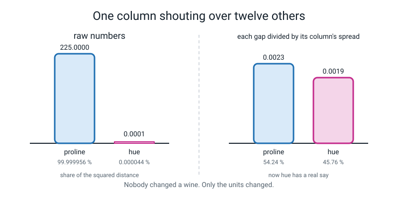
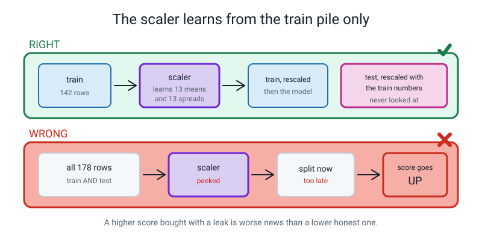
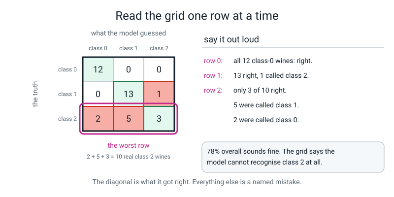
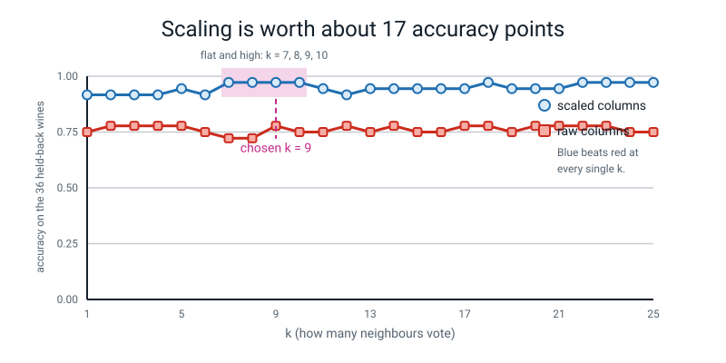
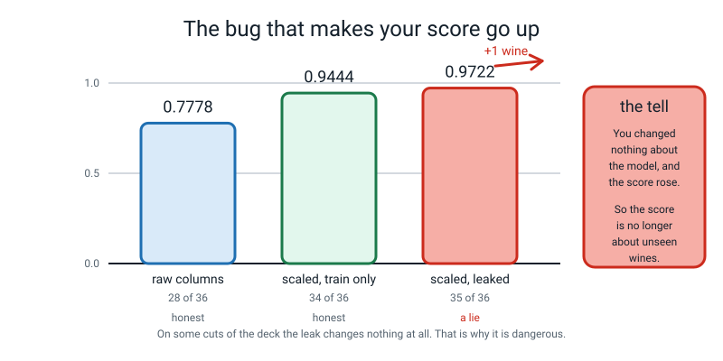
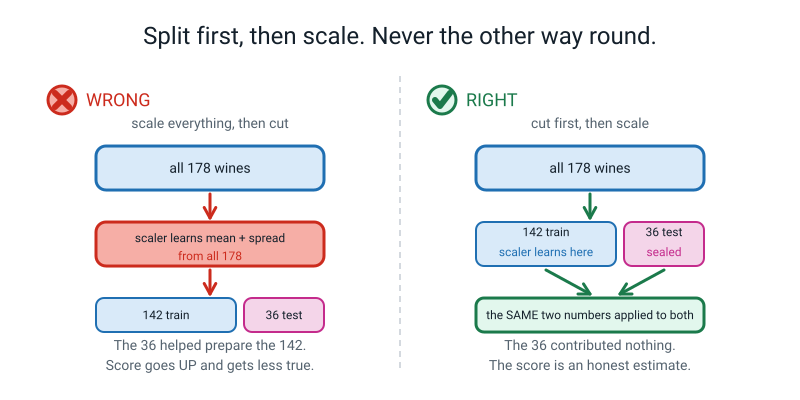
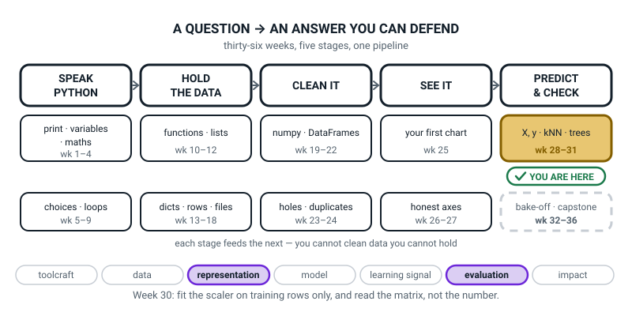
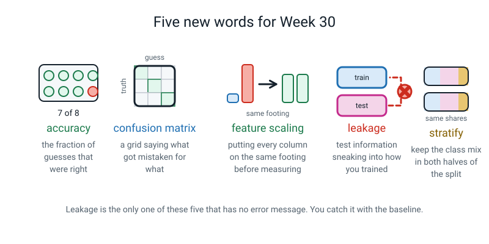

# Week 30 — Classifier Lab: Scaling, k, and the Confusion Matrix

[⬅ Week 29](week-29.md) · [Course Home](../README.md) · [Next ➡](week-31.md) · [Workbook](../workbook/week-30.md)

---

> ### This week in one sentence
> **If one of your columns is measured in thousands it drowns out all the others when you measure distance — so you put every column on the same footing, and you work out that footing from the training rows only.**
>
> **By the end of this chapter you will be able to:**
> - Compute an **accuracy** and read a **confusion matrix** out loud, naming what got mistaken for what
> - Explain why a column measured in thousands overwhelms one measured in units — using the **squares**
> - Scale your columns by fitting the scaler on the **training rows only**, and say why that matters
> - Plot accuracy against `k` for 1 to 25 and choose a `k` with a written reason
> - Keep the class mix the same in both halves of your split with `stratify`
>
> **New syntax this week:** `accuracy_score(y_test, pred)` · `confusion_matrix(y_test, pred)` · `StandardScaler().fit(X_train)` then `.transform(X_test)` · `stratify=y`
>
> **Reading time:** about 30 minutes. **Homework:** about 60 minutes.

---

## 🪝 Start Here

Two wines. Somebody in a laboratory in Italy measured thirteen chemical things about each of 178 bottles. Here are two of the thirteen, for the first two wines.

|  | hue | proline |
|---|---|---|
| wine 0 | 1.04 | 1065.0 |
| wine 1 | 1.05 | 1050.0 |

Now do exactly what you did in Week 28. Two columns, so two subtractions. Subtract, square, add up. **Do it with a pencil before you read on.**

```
hue gap     :  1.04 − 1.05 = −0.01      squared:   0.0001
proline gap : 1065  − 1050  =  15       squared: 225.0000
total       :                            225.0001
```

Look at those two squared numbers sitting in the same sum. Nought point nought nought nought one, plus two hundred and twenty-five.

Work out what **percentage** of that total came from `hue`. Do the division: `0.0001 ÷ 225.0001 × 100`.

**0.000044 percent.** Forty-four millionths of one percent.

Say it again, because it sounds like a mistake and it is not. **The hue column contributed forty-four millionths of one percent of the distance between those two wines.**

So if you use that distance to decide which wines are similar — and that is exactly what kNN does — then you are not using thirteen measurements. You are using **one.** The other twelve are decoration.

And here is the bit that should annoy you.

**Is proline more important than hue?** Nobody said that. Nobody decided that. It happened because a chemist wrote proline in hundreds and hue in decimals. Change proline from 1065 to 1.065 — same wine, same chemistry, different unit — and the whole thing flips over.

> **A distance model can only ever be as fair as its units.**

Your model's opinion about wine should not depend on which unit somebody happened to choose in 1991. This week you fix that, and the fix is worth **sixteen and two-thirds accuracy points** for free.

---

## 🧠 The Big Idea

> **📌 About the code in this section.** The blocks below are **illustrations, not files**. They show you the shape of one idea, and each one carries on from the one above it — the `import` lines and the data are typed once, in the first block that needs them. **The complete, runnable file is in 💻 Type This.** If you copy a block from this section on its own and Python says `NameError`, that is why, and nothing is broken.

### 1. Accuracy is one number, and it needs two things written next to it

**The plain explanation.**

> **Accuracy** — the fraction of guesses that were right. Number right ÷ number of guesses.

You have been computing this since Level 1. This week the library does it:

```python
from sklearn.metrics import accuracy_score
accuracy_score(y_test, predictions)
```

**Truth first, guesses second.** That is a convention, and for accuracy it makes no difference — 28 right out of 36 either way round. But the same rule applies to the confusion matrix in section 4, where it makes *all* the difference. So learn it once: **truth first.**

**The trap, and Level 1 already taught it.** If 99% of emails are not spam, a machine that says "not spam" to every single one scores 99% and has never read an email.

So before you are allowed to be pleased with an accuracy, you work out the **baseline**.

> **Baseline** — what the laziest possible model would score. Always shout the commonest answer, and see how often you are right.

For the wine table:

```text
class counts : [59 71 48]
baseline     : 0.3989 (always shout the commonest class)
```

Three kinds of grape: 59, 71 and 48 bottles. Always shout "class 1" and you get 71 out of 178 right — **39.89%.** That is the floor. Every accuracy you report this week gets compared to 0.3989, or it means nothing.

> **⚠️ Watch out:** compute the baseline **before** you train anything. Once you have seen 94% you will feel good about it, and the feeling arrives before the comparison. You build a ruler before you measure with it, not after.

**The second thing to write next to an accuracy is the row count**, and you learnt that last week. `0.9444 on 36 rows` is honest. `94%` on its own is showing off.

**And one small keyword that removes a whole category of bad luck.** `train_test_split` shuffles and cuts. If your classes are uneven, an unlucky shuffle hands you a lopsided test pile. Watch:

```text
whole table, class counts: [59 71 48]

NO stratify  -> test class counts: [ 9 18  9]
WITH stratify-> test class counts: [12 14 10]
```

The whole table is 33% / 40% / 27%. Without `stratify` the test pile came out **25% / 50% / 25%** — half of it is one grape. So whatever you learn about how the model handles the first grape, you learnt it from **nine wines**, and each of those nine is worth eleven percentage points of "class 0 accuracy".

> **stratify** — force every class to keep the same share in both halves of the split. It is `stratify=y` — the **answers**, never the features.

Use it every single time you are predicting a category. It costs nothing.

### 2. One column can drown out twelve

**The plain explanation.** kNN measures distance. Distance is **squares added up.** So a column whose numbers are large contributes large squares, and large squares swamp small ones. Squaring is what turns a lean into a wipe-out.

**The analogy.** 🍕 Compare two people by height in **millimetres** and age in **years**.

Person A is 1700 mm and 12 years old. Person B is 1750 mm and 40 years old.

```
height gap : 50 mm      squared: 2500
age gap    : 28 years   squared:  784
distance   : √3284 = 57.3
```

So the model thinks a **5 cm height difference matters three times more than being 28 years older.**

Now write the heights in **metres** — 1.70 and 1.75 — and the height contribution becomes 0.0025, and the age gap runs the whole show.

**Nothing about the two people changed.** Only the word at the top of a column.

**The concrete version.** The full picture on the wine table, with the arithmetic from the hook:

| | raw gap | squared | share of the distance |
|---|---|---|---|
| `hue` | −0.01 | 0.0001 | **0.000044 %** |
| `proline` | 15.00 | 225.0000 | **99.999956 %** |


*Figure 30.1 — On the left, `proline` is 99.999956% of the distance. On the right, after each gap is divided by its column's spread, both columns have a real say.*

And you have already seen this happen twice, in your own homework:

| Week | The two columns | The shout |
|---|---|---|
| 28 | `bpm` (hundreds) vs `minutes` (under six) | bpm was 99.89% of the distance |
| 28 extension | the same two, with length in **seconds** | length became 80% and bpm dropped to 20% |
| 29 | cricket `runs` (hundreds) vs `wickets` (single digits) | runs were 99.75% of the distance |

Three times now. It is not a coincidence and it is not going away on its own.

### 3. The fix, and where the scaler is allowed to look

**The plain explanation.** A gap of 15 counts as huge right now, because 15 is a big number. But is 15 big **for the proline column**? Proline runs from 278 to 1680. So 15 is nothing — it is a rounding error in proline terms.

Meanwhile a gap of 0.01 in hue: is that small **for the hue column**? Hue only runs from 0.48 to 1.71. So yes, small — but not *two-million-times* smaller (the ratio of the squares, 225 to 0.0001).

So: **divide every gap by how much that column normally varies.** Then a gap counts as big when it is big for its own column.

```
hue     : gap 0.01  ÷  spread 0.2279   =  0.0439    squared: 0.0019
proline : gap 15    ÷  spread 314.02   =  0.0478    squared: 0.0023

hue's share    : 45.76 %
proline's share: 54.24 %
```

**From forty-four millionths of a percent to forty-six percent.** Nothing about the wines changed. We stopped letting the units vote.

> **Feature scaling** — putting every column on the same footing before you measure distances.
> **Standardisation** — the usual way to do it: rescale each column so it has mean 0 and spread 1, using `(value − mean) ÷ spread`. Every number then means the same thing: *how many spreads away from typical am I?*

**The analogy.** Marks out of 100 and marks out of 20, in the same table. Nobody would compare 62 and 14 directly — you would turn both into percentages first, so they speak the same language. Standardisation is that, done automatically, with "how many spreads from typical" as the shared language.

**The code, and notice there are TWO steps** — `fit`, then `transform`, exactly like a model:

```python
scaler = StandardScaler()                    # make the machine
scaler.fit(X_train)                          # LEARN a mean and spread per column
X_train_scaled = scaler.transform(X_train)   # apply them to the training rows
X_test_scaled = scaler.transform(X_test)     # apply the SAME ones to the test rows
```

Here is what it actually learns, on the real wine training rows:

```text
proline mean learned  : 744.17
proline spread learned: 307.03

proline BEFORE, first 5 training rows: [ 680.  450.  615.  415. 1280.]
proline AFTER , first 5 training rows: [-0.21 -0.96 -0.42 -1.07  1.75]
```

Read that third line properly. `680` became `−0.21`, which **means something**: *a bit below typical.* And `1280` became `1.75`: *nearly two spreads above typical.*

**That is a far more useful thing to know about a wine than 1280.**

> **⚠️ Watch out:** about half the scaled numbers come out **negative**, and that alarms people the first time. Half of anything is below average, and below average is a negative number of spreads. Nothing is wrong. Check one by hand if it bothers you: `(680 − 744.17) ÷ 307.03 = −0.21`.

**And now the important part, which is where the scaler is allowed to look.**

The scaler has to learn two numbers per column. **Which rows does it learn them from?**

The obvious, tidy-looking thing is to scale everything first and split afterwards. **That is a bug**, and the whole of section 5 is about why. The rule is:

> **Split first. Fit the scaler on `X_train` only. Then `transform` both piles with the same numbers.**


*Figure 30.2 — The scaler is allowed to look at the blue pile and nothing else. The pink pile gets the blue pile's numbers applied to it.*

And one habit that prevents the other half of the trouble:

> **Whatever you do to `X_train`, do to `X_test`, on the very next line.** Keep the two `transform` lines next to each other, always.

### 4. The confusion matrix: what got mistaken for what

**The plain explanation.** An accuracy is one number, and one number cannot tell you *where* you went wrong. So there is a grid.

> **Confusion matrix** — a grid where the **row** says what the thing really was and the **column** says what the model guessed. The diagonal is "got it right". Everything off the diagonal is a specific, named mistake.

**The analogy.** A register at the end of a school trip. Down the side: which coach each child actually belongs on. Along the top: which coach they got on. The diagonal is everybody who went home correctly. Everything off it is a phone call you have to make — and *which* box the number is in tells you which phone call.

**The concrete version.** Here is the grid for the wine model with the raw, unscaled columns:

```text
[[12  0  0]
 [ 0 13  1]
 [ 2  5  3]]
```

**Read it out loud, one row at a time.** This is a skill and it needs practising.

- **Row 0** — 12 wines really were class 0. All 12 were called class 0. Perfect.
- **Row 1** — 14 wines really were class 1. 13 were called class 1; 1 was called class 2.
- **Row 2** — 2 + 5 + 3 = 10 wines really were class 2. **Only 3 were called class 2.** 5 were called class 1 and 2 were called class 0.


*Figure 30.3 — Row 2 is the worst row: ten real class-2 wines, and only three of them named correctly.*

**That last row is the whole story, and the accuracy of 0.7778 hides it completely.**

Seventy-eight percent sounds like a working model. The grid says: this model is **perfect** on one grape, **good** on another, and **nearly blind** to the third. Three out of ten is worse than a coin.

**That is why you always print the grid.** One number tells you *how much* you got wrong. The grid tells you *what* you got wrong — and that is the thing you can act on.

Two things to be careful about:

**One — truth first.** `confusion_matrix(y_test, pred)`. Swap the two arguments and you get the grid flipped along the diagonal, so rows become guesses and columns become truths. Every mistake then reads backwards — and **the accuracy looks identical either way**, so nothing warns you.

**Two — check it, don't memorise it.** Add up a row. If the row totals match how many of that class really exist in your test set, rows are truth. Our test set is 12, 14 and 10, and the rows add to 12, 14 and 10. Confirmed. **Never read a confusion matrix you have not checked this way.**

Rows add up to the real counts. **Columns add up to the guessed counts** — column 1 here adds to 18, which is how many times the model said "class 1", against the 14 wines that really were class 1. That asymmetry is what makes the grid informative.

### 5. Choosing `k` from a plateau — and the leak that raises your score

**The plain explanation, part one — choosing `k`.** Try every `k` from 1 to 25, plot the accuracy, and look at the **shape** rather than the peak.

```text
k =  7   raw = 0.7222   scaled = 0.9722
k =  8   raw = 0.7222   scaled = 0.9722
k =  9   raw = 0.7778   scaled = 0.9722
k = 10   raw = 0.7500   scaled = 0.9722
```

Four values of `k` in a row, all giving 0.9722. That is a **plateau**.

> **Plateau** — a flat, high run of several `k` values that all score the same. It is trustworthy, because the answer does not depend on getting `k` exactly right.

A lonely spike at one value of `k` with dips either side is usually one wine's worth of luck.


*Figure 30.4 — The pink band is the plateau at `k = 7, 8, 9, 10`. Pick from inside a flat region, not from a lonely spike.*

**The rule of thumb:** pick a `k` inside a flat, high region. Prefer a **larger** one, because larger `k` is less jumpy. Prefer an **odd** one, because odd `k` ties less often. So from `{7, 8, 9, 10}`: **`k = 9`.**

And then the part almost everybody skips. **You just chose `k` by looking at the test scores. Twenty-five times.** So the test set helped you make a decision — which means it taught you something — which means your reported accuracy is a little optimistic, and you cannot measure by how much.

The proper fix is a third pile of data, and that is Level 3. This year, the honest thing is one sentence, written next to the number:

> *"I chose this k by looking at test scores, which makes this estimate slightly optimistic."*

Write it every time, all year. **Admitting a limitation you know about, in writing, is worth more than the model is.** Anybody can produce a number. Not everybody tells you what is wrong with it.

**The plain explanation, part two — leakage.** Now the hard idea of the week, and it is genuinely counter-intuitive, so read it twice.

Suppose you scale everything first and split afterwards:

```python
scaler.fit(X)                 # <-- ALL 178 wines, test rows included
X_all_scaled = scaler.transform(X)
X_train, X_test, y_train, y_test = train_test_split(X_all_scaled, y, ...)
```

The means and spreads now contain information from the test rows. So the test rows have influenced how the training data was prepared. **They are no longer rows your process has never seen.**

> **Leakage** — information from the test set sneaking into training, usually through something you did to the data before you split it.

And here is what makes it dangerous rather than merely wrong:

```text
scaled, scaler fitted on train only : 0.9444   (34 of 36)
scaled, scaler fitted on everything : 0.9722   (35 of 36)
```

**When you run the buggy version, the score goes UP.**

One extra wine. A better number. If you were chasing a high score you would keep the bug and never know.


*Figure 30.5 — The third bar is higher and it is the only one that is a lie.*

**Why is a higher number bad news?** Because the score is not a prize. It is an **estimate of how the model will do on wines nobody has ever seen.** The moment the test rows helped prepare the training data, the score stopped being that estimate. It became a slightly optimistic number about a situation that will never happen again — because in real life the new wine arrives **after** you have finished building, and it cannot possibly have contributed to your means and spreads.

The sentence worth writing down:

> **You did not make the model better. You made the exam easier and forgot to say so.**

And the honest footnote, which matters more than it looks. **On some splits the leak changes nothing at all.** Run the clean and leaky versions for ten different seeds and they come out identical on eight of them. That does not mean the leak was harmless. It means **you got away with it, and you cannot tell in advance which kind of leak you have.**

The habit is the protection. Not the checking.

---

## 💻 Type This

Five files, and one of them takes a couple of seconds to run because it trains fifty models.

### Step 1 — kNN on wine, with the raw numbers

New file, `wine_unscaled.py`.

```python
# wine_unscaled.py
# kNN on wine with the raw numbers. Then look at WHERE it went wrong.

import numpy as np
from sklearn.datasets import load_wine
from sklearn.model_selection import train_test_split
from sklearn.neighbors import KNeighborsClassifier
from sklearn.metrics import accuracy_score, confusion_matrix

wine = load_wine()
X = wine.data
y = wine.target

X_train, X_test, y_train, y_test = train_test_split(
    X, y, test_size=0.2, random_state=31, stratify=y
)

model = KNeighborsClassifier(n_neighbors=5)
model.fit(X_train, y_train)
predictions = model.predict(X_test)

print("train accuracy:", round(model.score(X_train, y_train), 4))
print("test  accuracy:", round(accuracy_score(y_test, predictions), 4))
print("test rows      :", len(y_test))
print()
print("confusion matrix (rows = truth, columns = guess):")
print(confusion_matrix(y_test, predictions))
```

New lines:

- `from sklearn.datasets import load_wine` — same room as `load_iris`. 178 Italian wines, thirteen chemical measurements each, three kinds of grape.
- `from sklearn.metrics import accuracy_score, confusion_matrix` — a **new room**. `metrics` holds tools that mark answers. And notice one `import` line can fetch two names, separated by a comma.
- `stratify=y` — keep each grape's share the same in both halves.
- `random_state=31` — **not 42 this week.** Every number printed in this chapter came from 31. Use anything else and your screen will not match the page.
- `accuracy_score(y_test, predictions)` — truth first, guesses second.
- `confusion_matrix(y_test, predictions)` — truth first again.

Run it.

```text
train accuracy: 0.7817
test  accuracy: 0.7778
test rows      : 36

confusion matrix (rows = truth, columns = guess):
[[12  0  0]
 [ 0 13  1]
 [ 2  5  3]]
```

Seventy-eight percent. The baseline was 39.89, so it has genuinely learnt something — almost exactly twice the baseline. And the two scores are close together, 0.7817 and 0.7778, which last week we called the healthy shape.

**Now read row 2 out loud, and take a highlighter to it.** Ten real class-2 wines, three named correctly. **That row is the model's confession**, and the 78% hides it completely.

### Step 2 — Break it on purpose: a machine that was never fitted

New file, `wine_scaled.py`. Type the imports and the split, then this — **deliberately missing the `fit` line**:

```python
scaler = StandardScaler()
X_train_scaled = scaler.transform(X_train)
```

Run it.

```text
Traceback (most recent call last):
  File "/private/tmp/w2830/wine_scaled.py", line 17, in <module>
    X_train_scaled = scaler.transform(X_train)
  ...
sklearn.exceptions.NotFittedError: This StandardScaler instance is not fitted yet. Call 'fit' with appropriate arguments before using this estimator.
```

**Look at that message and then look at last week's.** It is the *same* error you got when you called `predict` before `fit`, with one word changed.

That is genuinely worth noticing. **Everything in this library follows the same three steps: make it, fit it, then use it.** A scaler is not a model — it never sees `y` and it predicts nothing — and it obeys the same pattern anyway. One habit covers both.

And think about what it would even do without fitting. Subtract *which* mean? It does not know any means yet.

### Step 3 — Scale it, and watch 78% become 94%

Now the whole file, with the `fit` put back.

```python
# wine_scaled.py
# The same thing, but every column put on the same scale first.

import numpy as np
from sklearn.datasets import load_wine
from sklearn.model_selection import train_test_split
from sklearn.neighbors import KNeighborsClassifier
from sklearn.preprocessing import StandardScaler
from sklearn.metrics import accuracy_score, confusion_matrix

wine = load_wine()
X = wine.data
y = wine.target

X_train, X_test, y_train, y_test = train_test_split(
    X, y, test_size=0.2, random_state=31, stratify=y
)

scaler = StandardScaler()                # the machine that rescales columns
scaler.fit(X_train)                      # LEARN the means and spreads: TRAIN ONLY
X_train_scaled = scaler.transform(X_train)   # apply them to the training rows
X_test_scaled = scaler.transform(X_test)     # apply the SAME ones to the test rows

model = KNeighborsClassifier(n_neighbors=5)
model.fit(X_train_scaled, y_train)
predictions = model.predict(X_test_scaled)

print("train accuracy:", round(model.score(X_train_scaled, y_train), 4))
print("test  accuracy:", round(accuracy_score(y_test, predictions), 4))
print("test rows      :", len(y_test))
print()
print("confusion matrix (rows = truth, columns = guess):")
print(confusion_matrix(y_test, predictions))
print()
print("proline column BEFORE scaling, first 5:", np.round(X_train[:5, 12], 2))
print("proline column AFTER  scaling, first 5:", np.round(X_train_scaled[:5, 12], 2))
```

`from sklearn.preprocessing import StandardScaler` — a second new room. `preprocessing` holds tools that prepare data before a model sees it.

**Before you run it: write down what accuracy you think you will get.** Then run.

```text
train accuracy: 0.9859
test  accuracy: 0.9444
test rows      : 36

confusion matrix (rows = truth, columns = guess):
[[12  0  0]
 [ 1 12  1]
 [ 0  0 10]]

proline column BEFORE scaling, first 5: [ 680.  450.  615.  415. 1280.]
proline column AFTER  scaling, first 5: [-0.21 -0.96 -0.42 -1.07  1.75]
```

**0.7778 became 0.9444. Sixteen and two-thirds percentage points.**

We added no measurements. We collected no new wines. We did not touch `k`. Those are the same 178 bottles. All we did was stop letting `proline` shout over the other twelve.

**And read the new row 2: `0 0 10`.** All ten class-2 wines correct. The grape the raw model was nearly blind to, this one gets **perfectly.** Errors went from eight wines to two.

Look at the two mistakes it has left, too — both in row 1, one class-1 wine called class 0 and one called class 2. **One error in each direction, at the boundary.** That is what an honest model looks like when it is working on a genuinely hard edge, and it is a much more comfortable pattern than "all my errors landed on one class".

### Step 4 — The silent bug: the worst kind there is

Change one line. Predict using the **unscaled** test rows.

```python
predictions = model.predict(X_test)          # forgot to scale the test rows
```

Run it. **No error at all:**

```text
train accuracy: 0.9859
test  accuracy: 0.3333
test rows      : 36
```

Nothing crashed. It ran perfectly. And the accuracy is **33%** — which is *below* the baseline of 39.89. Your beautiful 94% model just became worse than shouting one word at every bottle.

**Why?** The model learnt in scaled world, where proline lives between about −2 and +2. Then you handed it a test wine with proline of 680. To the model, 680 is six hundred and eighty spreads above typical — a wine from a different planet. Every test wine looks equally absurd, so the distances are meaningless.

The confusion matrix makes it obvious:

```text
[[12  0  0]
 [14  0  0]
 [10  0  0]]
```

**It called every single wine class 0.** Column 0 got all 36 guesses; columns 1 and 2 are empty.

**And there was no error message.** Python had no way to know: 680 is a perfectly valid number. This is a bug you have to catch yourself, and there are two ways:

1. **The baseline.** 0.3333 is below 0.3989. Any accuracy below the baseline means something is broken, whether or not Python complained.
2. **The habit.** Whatever you do to `X_train`, do to `X_test`, on the very next line.

Put `X_test_scaled` back and confirm 0.9444 returns.

### Step 5 — Sweep `k`, and save the chart

New file, `wine_choose_k.py`. This one trains fifty models, so give it a second or two.

```python
# wine_choose_k.py
# Try every k from 1 to 25, twice: raw columns and scaled columns. Then plot it.

import matplotlib
matplotlib.use("Agg")                    # save to a file instead of a window
import matplotlib.pyplot as plt
from sklearn.datasets import load_wine
from sklearn.model_selection import train_test_split
from sklearn.neighbors import KNeighborsClassifier
from sklearn.preprocessing import StandardScaler

wine = load_wine()
X = wine.data
y = wine.target

X_train, X_test, y_train, y_test = train_test_split(
    X, y, test_size=0.2, random_state=31, stratify=y
)

scaler = StandardScaler()
scaler.fit(X_train)                      # train rows only. Always.
X_train_scaled = scaler.transform(X_train)
X_test_scaled = scaler.transform(X_test)

ks = []                                  # the k values we tried
raw_scores = []                          # scores with the raw columns
scaled_scores = []                       # scores with the scaled columns

for k in range(1, 26):                   # k = 1, 2, 3 ... 25
    ks.append(k)

    raw_model = KNeighborsClassifier(n_neighbors=k)
    raw_model.fit(X_train, y_train)
    raw_scores.append(raw_model.score(X_test, y_test))

    scaled_model = KNeighborsClassifier(n_neighbors=k)
    scaled_model.fit(X_train_scaled, y_train)
    scaled_scores.append(scaled_model.score(X_test_scaled, y_test))

    print(f"k = {k:2d}   raw = {raw_scores[-1]:.4f}   scaled = {scaled_scores[-1]:.4f}")

fig, ax = plt.subplots(figsize=(8, 5))
ax.plot(ks, scaled_scores, marker="o", label="scaled columns")
ax.plot(ks, raw_scores, marker="s", label="raw columns")
ax.set_title("Scaling is worth about 17 accuracy points on the wine table")
ax.set_xlabel("k (how many neighbours vote)")
ax.set_ylabel("accuracy on the 36 held-back wines")
ax.set_ylim(0, 1.05)                     # start the axis at zero. Week 27's rule.
ax.legend()
fig.savefig("wine_accuracy_vs_k.png", dpi=120, bbox_inches="tight")
print()
print("saved wine_accuracy_vs_k.png")
```

> **⚠️ Watch out:** `matplotlib.use("Agg")` has to come **before** `import matplotlib.pyplot as plt`. It tells matplotlib to draw straight to a file instead of trying to open a window — which is what you want on a machine where a window may never appear.

Run it. All twenty-five lines:

```text
k =  1   raw = 0.7500   scaled = 0.9167
k =  2   raw = 0.7778   scaled = 0.9167
k =  3   raw = 0.7778   scaled = 0.9167
k =  4   raw = 0.7778   scaled = 0.9167
k =  5   raw = 0.7778   scaled = 0.9444
k =  6   raw = 0.7500   scaled = 0.9167
k =  7   raw = 0.7222   scaled = 0.9722
k =  8   raw = 0.7222   scaled = 0.9722
k =  9   raw = 0.7778   scaled = 0.9722
k = 10   raw = 0.7500   scaled = 0.9722
k = 11   raw = 0.7500   scaled = 0.9444
k = 12   raw = 0.7778   scaled = 0.9167
k = 13   raw = 0.7500   scaled = 0.9444
k = 14   raw = 0.7778   scaled = 0.9444
k = 15   raw = 0.7500   scaled = 0.9444
k = 16   raw = 0.7500   scaled = 0.9444
k = 17   raw = 0.7778   scaled = 0.9444
k = 18   raw = 0.7778   scaled = 0.9722
k = 19   raw = 0.7500   scaled = 0.9444
k = 20   raw = 0.7778   scaled = 0.9444
k = 21   raw = 0.7778   scaled = 0.9444
k = 22   raw = 0.7778   scaled = 0.9722
k = 23   raw = 0.7778   scaled = 0.9722
k = 24   raw = 0.7500   scaled = 0.9722
k = 25   raw = 0.7500   scaled = 0.9722

saved wine_accuracy_vs_k.png
```

**Open the PNG and look at it.** Two things:

**One — the round line is above the square line at every single `k`.** Not most. All twenty-five. Scaling is not a tweak on this table; it is the difference between a model you would use and one you would not.

**Two — look how jumpy both lines are.** 0.9167, 0.9167, 0.9444, 0.9167… it bounces around. And it should, because there are only 36 test wines, so **one wine is 2.8 percentage points.** 0.9167 is 33 right, 0.9444 is 34, 0.9722 is 35. **The whole wiggle in that line is two wines changing their minds.**

### Step 6 — The planted bug: fit the scaler on everything

New file, `wine_leak.py`. **There is a bug in it. Look at it before you run it and see if you can find it.**

```python
# wine_leak.py
# THE PLANTED BUG. The scaler is fitted on ALL the data, before the split.

import numpy as np
from sklearn.datasets import load_wine
from sklearn.model_selection import train_test_split
from sklearn.neighbors import KNeighborsClassifier
from sklearn.preprocessing import StandardScaler
from sklearn.metrics import accuracy_score

wine = load_wine()
X = wine.data
y = wine.target

# ---- THE BUG: scale everything first, split afterwards ------------------
scaler = StandardScaler()
scaler.fit(X)                            # <-- ALL 178 wines, test rows included
X_all_scaled = scaler.transform(X)

X_train, X_test, y_train, y_test = train_test_split(
    X_all_scaled, y, test_size=0.2, random_state=31, stratify=y
)

model = KNeighborsClassifier(n_neighbors=5)
model.fit(X_train, y_train)
predictions = model.predict(X_test)

print("LEAKY test accuracy:", round(accuracy_score(y_test, predictions), 4))
print("that is", int(accuracy_score(y_test, predictions) * 36), "of 36 wines right")
print()

# ---- Show the two scalers learned DIFFERENT numbers ---------------------
train_only, _, _, _ = train_test_split(
    X, y, test_size=0.2, random_state=31, stratify=y
)
clean_scaler = StandardScaler().fit(train_only)

print("proline mean learned from ALL 178 wines:", round(scaler.mean_[12], 2))
print("proline mean learned from the 142 train:", round(clean_scaler.mean_[12], 2))
print("difference:", round(scaler.mean_[12] - clean_scaler.mean_[12], 2))
```

**Before you run it, commit out loud: will the score go up, down, or stay the same?**

```text
LEAKY test accuracy: 0.9722
that is 35 of 36 wines right

proline mean learned from ALL 178 wines: 746.89
proline mean learned from the 142 train: 744.17
difference: 2.72
```

**It went up.** 0.9444 to 0.9722. Thirty-four wines right became thirty-five.

So: a bug was introduced, and the score improved. **Sit with that for ninety seconds before you read on, and try to say why it is bad news.**

Three questions to walk yourself through, in order:

1. What is that number supposed to be telling you?
2. Would that number still be true tomorrow, when a brand-new wine arrives?
3. When the new wine arrives, could it have helped work out the mean?

The answer: the score is meant to estimate how the model does on wines **nobody has seen.** But the 36 test wines helped work out the means and spreads that the 142 training wines were scaled with — so they were not unseen. A brand-new wine tomorrow **cannot** have helped, so you should expect tomorrow's wine to do worse than 0.9722.

**The number went up and got less true.**

And look at the size of it. The proline mean shifted by 2.72, out of 744. That is **a third of one percent.** A tiny, tiny leak, and it bought a whole extra wine.

### The complete finished program

Everything from this week, in one file.

```python
# classifier_lab.py
# The whole Classifier Lab, top to bottom, on the wine table.

import numpy as np
import matplotlib
matplotlib.use("Agg")                    # save charts to a file, don't open a window
import matplotlib.pyplot as plt
from sklearn.datasets import load_wine
from sklearn.model_selection import train_test_split
from sklearn.neighbors import KNeighborsClassifier
from sklearn.preprocessing import StandardScaler
from sklearn.metrics import accuracy_score, confusion_matrix

# ---- 1. Look at the data --------------------------------------------------
wine = load_wine()
X = wine.data
y = wine.target

print("shape        :", X.shape)
print("class counts :", np.bincount(y))
baseline = np.bincount(y).max() / len(y)
print("baseline     :", round(baseline, 4), "(always shout the commonest class)")
print()

# ---- 2. One split, with the class mix kept --------------------------------
X_train, X_test, y_train, y_test = train_test_split(
    X, y, test_size=0.2, random_state=31, stratify=y
)
print("train:", X_train.shape, " test:", X_test.shape)
print("test class counts:", np.bincount(y_test))
print()

# ---- 3. Two models, one table --------------------------------------------
raw_model = KNeighborsClassifier(n_neighbors=5)
raw_model.fit(X_train, y_train)
raw_pred = raw_model.predict(X_test)

scaler = StandardScaler()
scaler.fit(X_train)                      # train rows only
X_train_scaled = scaler.transform(X_train)
X_test_scaled = scaler.transform(X_test)

scaled_model = KNeighborsClassifier(n_neighbors=5)
scaled_model.fit(X_train_scaled, y_train)
scaled_pred = scaled_model.predict(X_test_scaled)

raw_acc = accuracy_score(y_test, raw_pred)
scaled_acc = accuracy_score(y_test, scaled_pred)

print("model          train    test     errors of 36")
print(f"k=5 raw        {raw_model.score(X_train, y_train):.4f}   {raw_acc:.4f}   {(raw_pred != y_test).sum()}")
print(f"k=5 scaled     {scaled_model.score(X_train_scaled, y_train):.4f}   {scaled_acc:.4f}   {(scaled_pred != y_test).sum()}")
print()

# ---- 4. Sweep k from 1 to 25 --------------------------------------------
ks = []
raw_scores = []
scaled_scores = []
for k in range(1, 26):
    ks.append(k)
    r = KNeighborsClassifier(n_neighbors=k)
    r.fit(X_train, y_train)
    raw_scores.append(r.score(X_test, y_test))
    s = KNeighborsClassifier(n_neighbors=k)
    s.fit(X_train_scaled, y_train)
    scaled_scores.append(s.score(X_test_scaled, y_test))

best = max(scaled_scores)
print("k values that reach the best scaled score", round(best, 4), ":",
      [ks[i] for i in range(len(ks)) if scaled_scores[i] == best])
print()

fig, ax = plt.subplots(figsize=(8, 5))
ax.plot(ks, scaled_scores, marker="o", label="scaled columns")
ax.plot(ks, raw_scores, marker="s", label="raw columns")
ax.set_title("Scaling is worth about 17 accuracy points on the wine table")
ax.set_xlabel("k (how many neighbours vote)")
ax.set_ylabel("accuracy on the 36 held-back wines")
ax.set_ylim(0, 1.05)
ax.legend()
fig.savefig("wine_accuracy_vs_k.png", dpi=120, bbox_inches="tight")
print("saved wine_accuracy_vs_k.png")
print()

# ---- 5. The chosen k, and its confusion matrix --------------------------
chosen = KNeighborsClassifier(n_neighbors=9)
chosen.fit(X_train_scaled, y_train)
chosen_pred = chosen.predict(X_test_scaled)
print("chosen k = 9")
print("train accuracy:", round(chosen.score(X_train_scaled, y_train), 4))
print("test  accuracy:", round(accuracy_score(y_test, chosen_pred), 4), "on", len(y_test), "rows")
print("confusion matrix:")
print(confusion_matrix(y_test, chosen_pred))
```

```text
shape        : (178, 13)
class counts : [59 71 48]
baseline     : 0.3989 (always shout the commonest class)

train: (142, 13)  test: (36, 13)
test class counts: [12 14 10]

model          train    test     errors of 36
k=5 raw        0.7817   0.7778   8
k=5 scaled     0.9859   0.9444   2

k values that reach the best scaled score 0.9722 : [7, 8, 9, 10, 18, 22, 23, 24, 25]

saved wine_accuracy_vs_k.png

chosen k = 9
train accuracy: 0.9789
test  accuracy: 0.9722 on 36 rows
confusion matrix:
[[12  0  0]
 [ 0 13  1]
 [ 0  0 10]]
```

> **💡 Try this:** `(raw_pred != y_test).sum()` counts the errors. `raw_pred != y_test` gives you a yes/no array — Week 20's boolean mask — and `.sum()` counts the Trues, because True counts as 1. **Eight wines wrong out of thirty-six, without you having to work out 36 × 0.7778 in your head.**

---

## 🔍 Worked Examples

### Worked Example 1 — Scaling the pizza table (food)

The same eight orders from Week 28 and Week 29. Watch the shares change, and watch one answer flip.

```python
# pizza_scaled.py
# The same eight orders. First raw, then with both columns put on the same footing.

import numpy as np
import pandas as pd
from sklearn.preprocessing import StandardScaler
from sklearn.neighbors import KNeighborsClassifier

orders = pd.DataFrame({
    "price":   [220, 180, 260, 150, 240, 275, 195, 165],
    "km_away": [1.2, 4.5, 0.8, 6.1, 1.5, 0.9, 5.2, 4.9],
    "arrived": ["hot", "cold", "hot", "cold", "hot", "hot", "cold", "cold"],
})

X = orders[["price", "km_away"]].values
y = orders["arrived"].values

# ---- the raw distance between order 0 and order 1 -----------------------
gaps = X[0] - X[1]
squares = gaps ** 2
total = squares.sum()
print("--- RAW ---")
print("gaps          :", gaps)
print("squares       :", squares)
print("price's share :", round(float(100 * squares[0] / total), 4), "%")
print("km's share    :", round(float(100 * squares[1] / total), 4), "%")
print()

# ---- now scale every column --------------------------------------------
scaler = StandardScaler()
scaler.fit(X)                            # learn one mean and one spread per column
X_scaled = scaler.transform(X)           # hands back a NEW table

print("means learned  :", np.round(scaler.mean_, 2))
print("spreads learned:", np.round(scaler.scale_, 2))
print()
print("the eight orders, scaled:")
print(np.round(X_scaled, 2))
print()

gaps_s = X_scaled[0] - X_scaled[1]
squares_s = gaps_s ** 2
total_s = squares_s.sum()
print("--- SCALED ---")
print("gaps          :", np.round(gaps_s, 4))
print("squares       :", np.round(squares_s, 4))
print("price's share :", round(float(100 * squares_s[0] / total_s), 2), "%")
print("km's share    :", round(float(100 * squares_s[1] / total_s), 2), "%")
print()

# ---- does the model change its mind? ------------------------------------
mystery = np.array([[210.0, 4.0]])
mystery_scaled = scaler.transform(mystery)
for k in [1, 3, 5]:
    raw_model = KNeighborsClassifier(n_neighbors=k).fit(X, y)
    scaled_model = KNeighborsClassifier(n_neighbors=k).fit(X_scaled, y)
    print(f"k = {k}   raw ->", raw_model.predict(mystery)[0],
          "   scaled ->", scaled_model.predict(mystery_scaled)[0])
```

```text
--- RAW ---
gaps          : [40.  -3.3]
squares       : [1600.     10.89]
price's share : 99.324 %
km's share    : 0.676 %

means learned  : [210.62   3.14]
spreads learned: [42.53  2.09]

the eight orders, scaled:
[[ 0.22 -0.93]
 [-0.72  0.65]
 [ 1.16 -1.12]
 [-1.43  1.42]
 [ 0.69 -0.78]
 [ 1.51 -1.07]
 [-0.37  0.99]
 [-1.07  0.84]]

--- SCALED ---
gaps          : [ 0.9405 -1.58  ]
squares       : [0.8845 2.4964]
price's share : 26.16 %
km's share    : 73.84 %

k = 1   raw -> hot    scaled -> cold
k = 3   raw -> cold    scaled -> cold
k = 5   raw -> cold    scaled -> cold
```

**What to notice.**

`price`'s share of the distance went from **99.324% to 26.16%.** And notice the order of importance actually **reversed** — after scaling, distance is doing most of the work, which is what you would expect for a question about whether food arrives hot.

And at `k = 1` the answer **flips**, from hot to cold. Same eight orders. Same mystery order. Same `k`. The only thing that changed is that both columns now get a vote.

> **⚠️ Watch out:** this file fits the scaler on `X` — **all eight orders** — with no train/test split anywhere. That is fine *here*, because we are not measuring an accuracy; we are only looking at the numbers. **The moment you print an accuracy, you must split first and fit the scaler on the training rows only.** Different job, different rules.

### Worked Example 2 — Batter, bowler, or neither? (sport)

Last week's cricket model said "bowler" for a player with 160 runs and 8 wickets, and we noticed the wickets contributed 0.25% of the distance. Let us give the wickets a real vote.

```python
# cricket_scaled.py
# Give the wickets column a fair say, and watch the answer change.

import numpy as np
from sklearn.preprocessing import StandardScaler
from sklearn.neighbors import KNeighborsClassifier

X = np.array([[312.0,  1.0],       # Asha,   batter
              [ 41.0, 14.0],       # Ravi,   bowler
              [288.0,  0.0],       # Meera,  batter
              [ 27.0, 17.0],       # Karan,  bowler
              [350.0,  2.0],       # Divya,  batter
              [ 19.0, 21.0]])      # Sanjay, bowler
y = ["batter", "bowler", "batter", "bowler", "batter", "bowler"]
who = ["Asha", "Ravi", "Meera", "Karan", "Divya", "Sanjay"]

new_player = np.array([[160.0, 8.0]])

scaler = StandardScaler()
scaler.fit(X)
X_scaled = scaler.transform(X)
new_scaled = scaler.transform(new_player)

print("means  :", np.round(scaler.mean_, 2))
print("spreads:", np.round(scaler.scale_, 2))
print()
print("the new player, scaled:", np.round(new_scaled, 2))
print("   -> a little below typical on both counts")
print()

raw_d = np.sqrt(((X - new_player) ** 2).sum(axis=1))
scaled_d = np.sqrt(((X_scaled - new_scaled) ** 2).sum(axis=1))

print("player    raw dist   scaled dist   really")
for i in range(len(X)):
    print(f"{who[i]:8s}  {raw_d[i]:8.2f}   {scaled_d[i]:10.2f}   {y[i]}")
print()
# Sort each list of distances, nearest first, using Week 12's sorted().
raw_pairs = sorted([(raw_d[i], y[i]) for i in range(len(X))])
scaled_pairs = sorted([(scaled_d[i], y[i]) for i in range(len(X))])
print("raw order   :", [role for distance, role in raw_pairs])
print("scaled order:", [role for distance, role in scaled_pairs])
print()

for k in [1, 3, 5]:
    raw_model = KNeighborsClassifier(n_neighbors=k).fit(X, y)
    scaled_model = KNeighborsClassifier(n_neighbors=k).fit(X_scaled, y)
    print(f"k = {k}   raw ->", raw_model.predict(new_player)[0],
          "   scaled ->", scaled_model.predict(new_scaled)[0])
```

```text
means  : [172.83   9.17]
spreads: [145.1    8.43]

the new player, scaled: [[-0.09 -0.14]]
   -> a little below typical on both counts

player    raw dist   scaled dist   really
Asha        152.16         1.34   batter
Ravi        119.15         1.09   bowler
Meera       128.25         1.30   batter
Karan       133.30         1.41   bowler
Divya       190.09         1.49   batter
Sanjay      141.60         1.82   bowler

raw order   : ['bowler', 'batter', 'bowler', 'bowler', 'batter', 'batter']
scaled order: ['bowler', 'batter', 'batter', 'bowler', 'batter', 'bowler']

k = 1   raw -> bowler    scaled -> bowler
k = 3   raw -> bowler    scaled -> batter
k = 5   raw -> bowler    scaled -> batter
```

**What to notice.** At `k = 3` and `k = 5`, the answer **flips from bowler to batter.**

Look at the two orderings. Raw: bowler, batter, bowler, bowler… Scaled: bowler, batter, batter, bowler… Asha the batter moves from fifth-nearest to third-nearest, and that is enough to swing the vote.

**Nobody remeasured a single ball.** All that happened is that the 8 wickets stopped counting for 0.25% of the distance and started counting properly.

And be honest about the remaining problem: `1.09, 1.30, 1.34, 1.41` are *nearly tied*. The right sentence about this player is still **"the model cannot tell"** — but at least now it cannot tell for a sensible reason instead of because it was ignoring a column.

### Worked Example 3 — Reading a grid out loud (school)

No model at all this time. Twenty guesses that have already been made, and one grid. Reading the grid is the skill.

```python
# grade_bands.py
# No model here. Twenty guesses that have already been made, and one grid.

from sklearn.metrics import accuracy_score, confusion_matrix

# What each pupil really got, and what the school's guessing machine said.
really    = ["A", "A", "A", "A", "A", "A",
             "B", "B", "B", "B", "B", "B", "B",
             "C", "C", "C", "C", "C", "C", "C"]
guessed   = ["A", "A", "A", "A", "A", "B",
             "B", "B", "B", "B", "B", "A", "C",
             "B", "B", "B", "B", "C", "C", "A"]

print("how many guesses:", len(guessed))
print("accuracy         :", round(accuracy_score(really, guessed), 4))
print()
print("confusion matrix (rows = truth, columns = guess), order A B C:")
print(confusion_matrix(really, guessed, labels=["A", "B", "C"]))
print()

grid = confusion_matrix(really, guessed, labels=["A", "B", "C"])
bands = ["A", "B", "C"]
for i in range(3):
    total = grid[i].sum()
    right = grid[i][i]
    print(f"row {bands[i]}: {total} pupils really got {bands[i]}, "
          f"{right} were called {bands[i]}  ({round(100*right/total)}%)")
print()
for j in range(3):
    print(f"column {bands[j]}: the machine said {bands[j]} {grid[:, j].sum()} times")
```

```text
how many guesses: 20
accuracy         : 0.6

confusion matrix (rows = truth, columns = guess), order A B C:
[[5 1 0]
 [1 5 1]
 [1 4 2]]

row A: 6 pupils really got A, 5 were called A  (83%)
row B: 7 pupils really got B, 5 were called B  (71%)
row C: 7 pupils really got C, 2 were called C  (29%)

column A: the machine said A 7 times
column B: the machine said B 10 times
column C: the machine said C 3 times
```

**What to notice, and read all of it, because this is the transferable skill of the week.**

**`labels=["A", "B", "C"]`** tells `confusion_matrix` what order to put the rows and columns in. Without it you would get alphabetical order, which here happens to be the same — but with bands like `"Merit"`, `"Pass"`, `"Distinction"` it would not be, and the grid would be in a confusing order.

**The accuracy is 0.60.** Twelve out of twenty. That sounds mediocre-but-not-terrible.

**The grid says something much more specific.** Row C: seven pupils really got a C, and **two** were called C. Twenty-nine percent. Four of them were called B and one was called A. So the machine is decent at spotting A's, decent at B's, and **it barely recognises a C at all — and when it gets a C wrong it guesses too high, every single time.**

**Now look at the columns.** The machine said "B" **ten** times, and only seven pupils really were B. It is over-using B, which is exactly what a machine does when it is unsure: it hedges towards the middle.

**And this is where it stops being maths.** If this grid decides which pupils get extra help, then the pupils who most need it — the C's — are the ones the machine is least likely to identify, and it errs by flattering them. **Sixty percent accurate, and every one of its worst mistakes lands on the people who needed it most.**

A model that was 55% accurate with its errors spread evenly would be **safer** than this one, even though 55 is a worse number than 60.

> **🧑‍🏫 If a student asks:** *"So who decides which mistakes are acceptable?"* — There is no clean answer and it is the right question. Sometimes the person building the model. Sometimes the school. Almost never the person the mistake lands on. Level 1 asked you this about bias; this is the same question with the arithmetic filled in.

---

## 🐞 When It Breaks

This week the debugging ladder gets a new rung, and it goes at the **bottom**:

> **−1. "Is there an error at all?"**
>
> Three of this week's bugs produce **no error message.** Two make the score worse and one makes it *better*. So the first question is not "what does the error say" but **"is this number plausible?"** — and the way you answer that is the baseline.
>
> **Below the baseline?** Something is broken, however quiet Python is being. **Went up when you added nothing?** Something leaked.

### Error 1 — a machine you never fitted

```python
scaler = StandardScaler()
X_train_scaled = scaler.transform(X_train)
```

```text
Traceback (most recent call last):
  File "/private/tmp/w2830/wine_scaled.py", line 17, in <module>
    X_train_scaled = scaler.transform(X_train)
  File ".../sklearn/preprocessing/_data.py", line 1072, in transform
    check_is_fitted(self)
  File ".../sklearn/utils/validation.py", line 1754, in check_is_fitted
    raise NotFittedError(msg % {"name": type(estimator).__name__})
sklearn.exceptions.NotFittedError: This StandardScaler instance is not fitted yet. Call 'fit' with appropriate arguments before using this estimator.
```

**What Python is telling you.** *"You asked me to rescale some numbers before telling me what the columns look like."* Subtract which mean? It does not know any yet.

**The fix.** Add the `fit` line, above the `transform`.

```python
scaler = StandardScaler()
scaler.fit(X_train)                          # train rows only
X_train_scaled = scaler.transform(X_train)
```

**And notice the family.** This is last week's `NotFittedError` with one word changed. **Make it, fit it, use it** — every machine in this library, model or not.

### Error 2 — one letter, and it is the wrong letter

```python
from sklearn.preprocessing import StandardScalar
```

```text
Traceback (most recent call last):
  File "<string>", line 1, in <module>
ImportError: cannot import name 'StandardScalar' from 'sklearn.preprocessing' (/.../sklearn/preprocessing/__init__.py)
```

**What Python is telling you.** *"Nothing in that room has that name."* And it is right: it is `Scaler`, not `Scalar`.

**Which is genuinely a nasty one**, because both are real English words in maths. A **scaler** is a thing that scales. A **scalar** is a single number, as opposed to a whole array. Completely different word, one letter apart.

**The fix.**

```python
from sklearn.preprocessing import StandardScaler
```

> **💡 Try this:** an `ImportError` that says *cannot import name* almost always means one of two things — a spelling mistake, or the right name in the wrong room. Check the spelling first, because it is faster.

### Error 3 — stratifying on the wrong thing

```python
train_test_split(wine.data, wine.target, test_size=0.2,
                 random_state=31, stratify=wine.data)
```

```text
Traceback (most recent call last):
  ...
  File ".../sklearn/model_selection/_split.py", line 2342, in _iter_indices
    raise ValueError(
ValueError: The least populated class in y has only 1 member, which is too few. The minimum number of groups for any class cannot be less than 2.
```

**What Python is telling you.** *"You asked me to keep the class shares even, but one of your 'classes' only happens once."*

This message is confusing until you see what happened. You said `stratify=X`, so scikit-learn treated **each whole row of thirteen measurements as a class label.** And every one of those rows is unique — no two wines have all thirteen numbers identical — so it found 178 "classes" with one member each, and gave up.

**The fix.**

```python
stratify=y
```

**You stratify on the answers.** It is the labels you want balanced, never the measurements.

### The three that produce no error at all

These are the important ones this week, and there is nothing to read because Python says nothing.

| What you did | The symptom | How you catch it | The fix |
|---|---|---|---|
| `model.predict(X_test)` instead of `X_test_scaled` | Accuracy **0.3333**, below the baseline. Confusion matrix is `[[12 0 0], [14 0 0], [10 0 0]]` — everything called class 0. | The baseline. 0.3333 < 0.3989. | Use the scaled test rows. **Whatever you do to `X_train`, do to `X_test`, on the next line.** |
| `scaler.fit(X)` before the split | Accuracy goes **up**: 0.9444 becomes 0.9722. | Nothing warns you. Only the habit protects you. | `scaler.fit(X_train)`, after the split, always. |
| `random_state` missing, or 42 instead of 31, or no `stratify` | Every number differs from this chapter. | Nothing is broken. You cut the deck somewhere else. | Match all three: `test_size=0.2, random_state=31, stratify=y`. |

> **🧑‍🏫 If a student asks:** *"How am I supposed to find a bug when there's no error message?"* — By comparing the number to something you decided **in advance.** That is what the baseline is for, and it is why this course makes you write it down before you train anything. Professionals do exactly this and call it a sanity check: before you look at a result, decide roughly what a believable result would look like. **A number you cannot sanity-check is not a result.**

---

## 🎲 What We Did In Class

### Part 1 — The arithmetic, on paper, before any code

Two wines, two columns, four steps. `hue` 1.04 and 1.05; `proline` 1065 and 1050.

```
hue gap     :  1.04 − 1.05 = −0.01      squared:   0.0001
proline gap : 1065  − 1050  =  15       squared: 225.0000
total       :                            225.0001
distance    :                             15.0000
```

Then the division that lands the whole lesson: `0.0001 ÷ 225.0001 × 100 = 0.000044%`.

**Do the division with a calculator. Do not eyeball it.** Eyeballing gives you "small". The division gives you *how* small, and the how is the point.

Then redo it with each gap divided by its column's spread — `hue` 0.2279, `proline` 314.0217 — and hue's share goes from 0.000044% to **45.76%.**

### Part 2 — 78% becomes 94%, live

Type `wine_unscaled.py`, run it, read row 2 of the grid out loud, and highlight it. Then type `wine_scaled.py`, predict the new accuracy in writing **before** running, and run it.

Then write these two numbers up, underneath THE GAP from Week 29:

```
  WINE, k = 5      raw columns      0.7778   on 36 rows
                   scaled columns   0.9444   on 36 rows
                   ----------------------------------
                   free, for one habit:  +16.7 points
```

Then the silent bug: change `X_test_scaled` back to `X_test` and watch 0.9444 become 0.3333 with no error at all.

### Part 3 — The lab, and the planted bug

`wine_choose_k.py`, all twenty-five values of `k`, the chart saved and opened.

Then choose your `k`, and write these five things in **ink**:

```
chosen k          : 9
test accuracy     : 0.9722, on 36 held-back wines
baseline          : 0.3989
reason            : k = 7, 8, 9 and 10 all give 0.9722. Four in a row is a
                    plateau, so the answer does not depend on getting k
                    exactly right. I chose 9 because a bigger k is steadier
                    and an odd k ties less often.
honesty sentence  : I chose this k by looking at test scores, which makes
                    this estimate slightly optimistic.
```

Then `wine_leak.py`, with your prediction committed out loud first, and the ninety seconds of thinking about why a higher score is the bad news.

### If you missed the lesson

Do all three parts in order. **Part 1 needs nothing but a calculator**, and it is the part that makes the rest make sense, so do not skip it to get to the typing.

**If your laptop is not available**, you can still do most of this week. The two-column arithmetic is division. Both confusion matrices are printed in this chapter and reading them aloud is objective 1 in full. And the twenty-five-row accuracy table is printed too — **plot it by hand on graph paper**, which is arguably better than `ax.plot`, because you have to decide for yourself where the y-axis starts.

### The extension we ran out of time for

**Does the leak matter on other splits?** Run the clean version and the leaky version for `random_state` 0 to 9 and count how often they differ.

```text
seed 0: clean 0.9444  leaky 0.9444  SAME
seed 1: clean 0.9722  leaky 1.0000  DIFFERENT
seed 2: clean 0.9722  leaky 0.9722  SAME
seed 3: clean 0.9722  leaky 0.9722  SAME
seed 4: clean 0.9722  leaky 0.9444  DIFFERENT
seed 5: clean 0.9722  leaky 0.9722  SAME
seed 6: clean 0.9167  leaky 0.9167  SAME
seed 7: clean 1.0000  leaky 1.0000  SAME
seed 8: clean 0.9722  leaky 0.9722  SAME
seed 9: clean 1.0000  leaky 1.0000  SAME
```

**Eight identical, two different.** And look at seed 4: the leak made the score go **down**.

So the leak is invisible eight times out of ten, and when it does show up it can go either way. Which sounds like good news and is the opposite: **you cannot tell by looking.** You cannot run it both ways and check, because most of the time there is nothing to see.

**All you can do is have the habit: split first, fit the scaler on the training rows, always.**

---

## 💬 Talk About It

**1. Same confusion matrix, different job. Class 0 is "healthy", class 1 is "mild condition", class 2 is "serious condition". Our unscaled model was perfect on healthy people and got 3 out of 10 serious cases. It is 78% accurate. Would you use it?**

*Hint:* start by working out where all eight errors landed. Then ask whether a **90%** model with its errors spread evenly would be safer than a 78% model with them all in one place — and then whether "safer" is even the same question as "more accurate". Finish with the hard one: who gets to decide which mistakes are acceptable, and is that person ever the one the mistake lands on?

**2. If scaling gives you sixteen free accuracy points, why doesn't scikit-learn just do it automatically?**

*Hint:* two reasons, and both are good. One is about debugging — how would you feel about a library that silently changed your data? The other is that it is **not always better.** Iris has four columns that are all centimetres on similar ranges, and standardising it makes kNN slightly *worse*, because petals genuinely vary more than sepals and that extra variation is real information. And next week's model does not measure distance at all, so scaling it is pure waste.

**3. Somebody says "my model is 99% accurate". Write down the five questions you would ask before believing them.**

*Hint:* you already know four of them from this chapter and one from last week. What's the baseline · how many test rows · was the test set held back before you started · where are the errors, by class · and how many things did you try before picking this one? Then the follow-up: which of those five would be hardest for them to answer honestly, and why?

---

## ⚠️ Don't Get Tricked

### Trick 1 — "scale everything first, then split. It's tidier."


*Figure 30.6 — On the left, all 178 wines feed the scaler before the cut, so the 36 helped prepare the 142. On the right, the cut comes first and the scaler only ever sees the training pile.*

**Wrong:**

```python
scaler.fit(X)                                  # all 178 wines
X_all = scaler.transform(X)
X_train, X_test, y_train, y_test = train_test_split(X_all, y, ...)
```

**Right:**

```python
X_train, X_test, y_train, y_test = train_test_split(X, y, ...)   # cut first
scaler.fit(X_train)                                              # train rows only
X_train_scaled = scaler.transform(X_train)
X_test_scaled = scaler.transform(X_test)                         # same numbers applied
```

The wrong version is one line shorter and it **scores higher** — 0.9722 instead of 0.9444. That is exactly what makes it dangerous. **You did not make the model better; you made the exam easier and forgot to say so.**

### Trick 2 — "the confusion matrix is symmetric, so it doesn't matter which way round I read it"

**Wrong:** `confusion_matrix(predictions, y_test)`, read as though rows were truths.

**Right:** `confusion_matrix(y_test, predictions)`. **Truth first.**

Here is the same wine model, both ways:

```text
truth first:            swapped:
[[12  0  0]             [[12  0  2]
 [ 0 13  1]              [ 0 13  5]
 [ 2  5  3]]             [ 0  1  3]]
```

**The diagonal is identical, so the accuracy is identical — 0.7778 either way.** Nothing warns you. But read the swapped one as if rows were truths and you will say *"five class-1 wines got called class 2"*, when what actually happened is the reverse.

**The check that saves you:** add up a row and see if it matches the real class counts. Ours are 12, 14 and 10. The left grid's rows add to 12, 14, 10. The right grid's add to 14, 18, 4. **Only one of those is the truth.**

### Trick 3 — "pick the `k` with the highest score"

**Wrong:** *"k = 7 is best, it scored 0.9722."*

**Right:** 0.9722 happens at **nine different values of `k`** — 7, 8, 9, 10, 18, 22, 23, 24 and 25. So "highest" does not pick one. You have to say something else.

The something else is the **plateau**: 7, 8, 9, 10 are four in a row, so the score does not depend on getting `k` exactly right. Take the biggest odd one in it — 9 — because bigger is steadier and odd ties less often.

And the accompanying honest fact: **0.9722 versus 0.9444 is one wine out of thirty-six.** Do not build an argument on one wine.

### Trick 4 — "the scaled numbers came out negative, so something's broken"

**Wrong:** `-0.21` cannot be right, proline is 680.

**Right:** `-0.21` means *"a fifth of a spread below typical"*. Half of anything is below average, so about half your scaled numbers will be negative, in every column, always.

Do one by hand and it stops feeling strange:

```
(680 − 744.17) ÷ 307.03 = −0.21
```

And notice how much more useful that is than 680. `−0.21` says *slightly below typical.* `1.75` says *nearly two spreads above typical.* **680 says nothing at all unless you happen to know what proline usually is.**

---

## 🌍 Where You've Seen This

- **Any app that compares you to other people.** Steps per day are in the thousands, hours of sleep are in single figures, resting heart rate is in the sixties. Without scaling, "people like you" means "people with a similar step count", full stop.
- **House-price and second-hand-car sites.** Price in lakhs, mileage in thousands, number of bedrooms in single digits, age in years. Four columns, four wildly different sizes, one distance calculation. Scaling is not optional there; it is the product.
- **Medical screening results.** This is where the confusion matrix earns its keep. "95% accurate" is meaningless for a condition 2% of people have — a machine that says "healthy" to everybody scores 98%. The grid is what tells you whether it ever spots anybody.
- **Spam filters.** Same trap, other direction. If 95% of your mail is spam, a filter that bins everything scores 95% and you never get a message again. The grid shows the four possibilities: spam caught, spam missed, real mail delivered, **real mail binned** — and only one of those four gets somebody sacked.
- **Exam grade prediction, and the argument in 2020.** Predicted grades were given out by an algorithm in several countries, and the rows people argued about were exactly the row-2 kind: which pupils got marked down, and whether the errors landed evenly. Nobody argued about the overall accuracy. They argued about the grid.
- **Every dataset you will ever be handed at work.** Somebody else chose the units, years ago, for reasons that had nothing to do with your model. **Checking min, max and spread on every column before you model anything is a habit worth having for life.**

---

## 🧭 Where This Fits

Third week in the same gold tile, and today was a lab rather than a new idea: one experiment, run from
one end to the other, saved before the bell. The map does not move — but the thing inside the box got
considerably more honest.



*Figure 30.0 — The pipeline in Week 30. Still the same tile. This week is the lab: one dial turned
twenty-five times, one habit fixed for life, and one grid read out loud instead of one number.*

| | |
|---|---|
| **The mental model you now own** | Features measured in different units have to be put on **one scale** first, or the column with the biggest numbers decides everything — and the scaler is fitted on the **training rows only**. And a single accuracy number hides *which* answers are being mixed up with which. The confusion matrix does not hide it. |
| **The one question it answers** | *"Which answers is it getting wrong, and is one feature drowning out the rest?"* |
| **What it plugs into** | Week 29's four-step cycle, straight through unchanged; Week 20's array maths, because subtract-the-mean-and-divide-by-the-spread is something you have already done by hand; and Week 26's chart shapes, which is how accuracy-against-`k` becomes a line you can look at. |
| **What carries forward** | Week 33's bake-off, where you turn a dial exactly this way and plot what happens, and Week 35's capstone results table, which has a column for every number you printed today. |
| **Spiral thread** | 🏷️ **Representation** — scaling changes nothing about the data except the units it is written in, and it changes the answer anyway — and ⚖️ **Evaluation**, because a grid is what you reach for the moment one number stops being enough. |

> **💡 Try this:** copy the worst row of today's confusion matrix onto your own map, beside the gold
> tile — just the two class names and the count, in the form **"6 × class 1 called class 2"**. It is
> one short line of writing, and it is the whole difference between *"88% accurate"* and knowing what
> your model is actually bad at.

---

## 🔑 Remember This

- **Distance is squares added up, so a column with big numbers wins.** `proline` was 99.999956% of one distance and `hue` was 0.000044%. That is squaring, not importance.
- **Scaling means dividing each gap by how much its own column normally varies.** Then a gap counts as big when it is big *for that column*. On wine it was worth **+16.7 accuracy points** for free.
- **The scaler is a machine: make it, fit it, use it.** `fit` learns a mean and spread per column. `transform` applies them and hands back a **new** array — your original is untouched.
- **Fit the scaler on `X_train` only, after the split.** Fit it on everything and your score goes **up** and gets **less true**. That is leakage.
- **Whatever you do to `X_train`, do to `X_test`, on the very next line.** Forget it and you get 0.3333 with no error message.
- **Compute the baseline before you train anything.** Wine's is 0.3989. An accuracy with no baseline next to it is not information.
- **Print the grid, not just the number.** 78% accurate hid a model that got 3 out of 10 on one grape. **Rows are truth, columns are guesses — and check it by adding up a row.**
- **Choose `k` from a plateau, not a peak. And write the honesty sentence.**

### Syntax reminder card

```python
# ---- two new rooms -----------------------------------------------------
from sklearn.preprocessing import StandardScaler          # tools that prepare data
from sklearn.metrics import accuracy_score, confusion_matrix   # tools that mark

# ---- keep the class mix in both halves ---------------------------------
X_train, X_test, y_train, y_test = train_test_split(
    X, y, test_size=0.2, random_state=31, stratify=y      # stratify on y, never X
)

# ---- scale: split FIRST, fit on train only, transform BOTH -------------
scaler = StandardScaler()                    # make it
scaler.fit(X_train)                          # fit it -- training rows only
X_train_scaled = scaler.transform(X_train)   # use it
X_test_scaled = scaler.transform(X_test)     # ...and use it on the test rows too

scaler.mean_                                 # the means it learned, one per column
scaler.scale_                                # the spreads it learned

# ---- mark the answers. TRUTH FIRST, both times. ------------------------
accuracy_score(y_test, predictions)          # one number between 0 and 1
confusion_matrix(y_test, predictions)        # rows = truth, columns = guess

# ---- the baseline, before you train anything --------------------------
import numpy as np
baseline = np.bincount(y).max() / len(y)     # always shout the commonest class

# ---- count the errors without doing sums in your head -----------------
(predictions != y_test).sum()                # Week 20's mask, doing real work
```

---

## 📓 New Words


*Figure 30.7 — Five words. The middle one is a grid you will read out loud for the rest of your life.*

| Word | What it means | Example |
|---|---|---|
| **accuracy** | The fraction of guesses that were right. Number right ÷ number of guesses. Always report the row count next to it. | 34 of 36 wines → `0.9444 on 36 rows` |
| **confusion matrix** | A grid: the row says what it really was, the column says what the model guessed. The diagonal is right; everything else is a named mistake. | `[[12 0 0], [1 12 1], [0 0 10]]` — two errors, both in row 1 |
| **feature scaling** | Putting every column on the same footing before you measure distances, by dividing each gap by how much that column normally varies. | `proline` 680 → `−0.21`, meaning "a bit below typical" |
| **leakage** | Information from the test set sneaking into training — usually through something you did to the data before you split it. | `scaler.fit(X)` before the split: score rises 0.9444 → 0.9722 and gets less true |
| **stratify** | Force every class to keep the same share in both halves of the split. It is the **answers** you stratify on. | `stratify=y` turns test counts `[9 18 9]` into `[12 14 10]` |

---

## 📤 Your Homework

Open the **[Week 30 workbook](../workbook/week-30.md)**. Finish the lab, and hand in **five** things. About an hour.

**One — the chart.** `wine_accuracy_vs_k.png`, `k` from 1 to 25, both lines, a legend, both axis labels **with units**, and the y-axis starting at **zero**. If your y-axis starts at 0.9, that is a Week 27 lie and it comes back to you.

**Two — the comparison table.** Four columns: model, train accuracy, test accuracy, errors out of 36. Two rows: `k=5` raw and `k=5` scaled. And the **baseline written above the table**, so both numbers have something to be compared to.

**Three — your chosen `k`, with three sentences of reason.** And the reason cannot be "it scored highest", because nine different `k` values score highest. Talk about the plateau.

**Four — the honesty sentence.** Word for word: *"I chose this k by looking at test scores, which makes this estimate slightly optimistic."* Every time, all year.

**Five — the confusion matrix for your best model, with its worst row named in a full sentence.** Not "row 1 is worst". Something like: *"one wine that was really class 1 got called class 0, and one got called class 2."* **Which way round matters.**

And there are short questions on page 30.6 — do those last, when you are tired, because they are quick.

**Should take about:** 15 minutes to finish the sweep and save the chart · 15 minutes for the comparison table with the baseline · 15 minutes for the chosen `k` and the sentences, which you should rewrite at least once · 15 minutes for the short questions. About an hour.

---

[⬅ Week 29](week-29.md) · [Course Home](../README.md) · [Next ➡](week-31.md) · [Workbook](../workbook/week-30.md)
