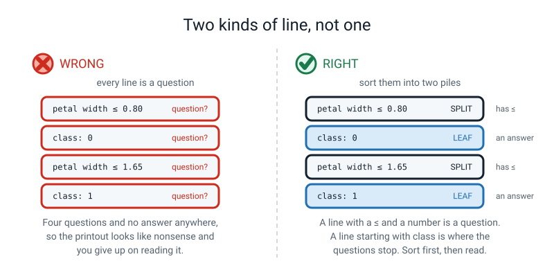
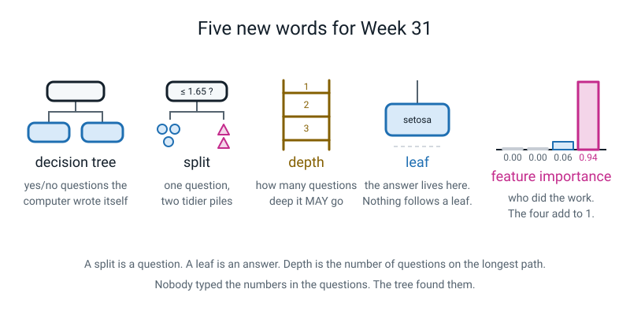

# Week 31 — Trees You Can Read Out Loud

[⬅ Week 30](week-30.md) · [Course Home](../README.md) · [Next ➡](week-32.md) · [Workbook](../workbook/week-31.md)

---

> ### This week in one sentence
> **A decision tree is a stack of yes/no questions the computer wrote for itself — and unlike every other model this year, you can print those questions out and read them aloud to somebody who has never seen a computer.**
>
> **By the end of this chapter you will be able to:**
> - Explain a decision tree as a stack of yes/no questions with a limit on how deep it may go
> - Train a tree with `max_depth` and swap it in for last week's kNN **by changing one line**
> - Print the tree's learned rules and read them out as English sentences
> - Say which measurements the tree actually used, and which it ignored completely
> - Find one row the tree gets wrong and name the exact rule that caught it
>
> **New syntax this week:** `DecisionTreeClassifier(max_depth=3)` · `export_text(tree, feature_names=[...])` · `tree.feature_importances_` · `plot_tree(tree, ...)`
>
> **Reading time:** about 25 minutes. **Homework:** about 60 minutes.

---

## 🪝 Start Here

Somebody puts five things on the table in front of you. An apple, a spoon, a key, a sock, a pencil.

They say: *"I'm thinking of one of them. You can ask me anything you like, as long as I can answer yes or no. No pointing. No 'which one is it'."*

You ask **"is it metal?"** They say no. You ask **"can you wear it?"** They say no. You ask **"can you write with it?"** They say yes.

Pencil. Three questions.

Now here is the thing I want you to notice, because it is the whole lesson.

**Nobody taught you those questions.** Nobody handed you a list. You worked out, on the spot, that *"is it metal?"* was a good first question and *"is it the spoon?"* was a bad one — because "is it metal?" cuts the table roughly in half whatever the answer, and "is it the spoon?" only helps you if you happened to guess right.

You did that in your head, in about a second, without being told how.

**Today the computer does exactly that.** Same shape. Same yes/no questions. Worked out by itself, from numbers, in about a thousandth of a second. And here is the part that makes this week different from every other week of this course:

> **You will be able to print the questions out and read them.**


*Figure 31.1 — Twenty Questions, written down. Three questions is enough to tell five things apart.*

Think about last week for a second. Your kNN model worked by remembering 120 flowers and comparing each new flower to the five nearest ones. If somebody asked *"why did you say virginica?"*, the honest answer was **"because of those 120 flowers over there."** You cannot write that on a card. You cannot read it out. The reasoning *is* the 120 flowers.

A tree hands you four sentences.

> **💡 Try this:** before you read on, play the game once with somebody in the house. Five real objects, on a real table. Have them write down **every question you ask, as a box**, and draw a line for yes and a line for no. Keep the paper. You are going to compare it with a computer's version later in this chapter, and the comparison is much better if the paper is yours.

---

## 🧠 The Big Idea

> **📌 About the code in this section.** The blocks below are **illustrations, not files**. They show you the shape of one idea, and each one carries on from the one above it — the `import` lines and the data are typed once, in the first block that needs them. **The complete, runnable file is in 💻 Type This.** If you copy a block from this section on its own and Python says `NameError`, that is why, and nothing is broken.

### 1. A tree is a stack of yes/no questions, and that is all it is

**The plain explanation.** A **decision tree** is a model that asks a series of yes/no questions about the measurements, following branches until it reaches an answer.

> **Decision tree** — a flowchart of yes/no questions that the computer worked out by itself, ending in an answer.

That is not a metaphor for what the model does. That is what the model **is**. There is no hidden second stage.

**The analogy.** 🍕 It is the pizza shop's phone script. *"Collection or delivery?"* Delivery. *"Inside the ring road?"* No. *"Ordering more than four?"* Yes. And at the end of the script there is an answer: *"forty minutes."* Nobody at the shop is doing anything clever. They are following a script of yes/no questions, and the script was written by somebody who had taken a lot of orders.

The only difference in our case is **who wrote the script.** Nobody wrote ours. The computer read 120 flowers and wrote it.

**The concrete version.** Here are the four sentences a computer wrote about irises this week, from 120 flowers, with nobody helping it:

1. *"If the petal is 0.80 cm wide or narrower — it's a **setosa**."*
2. *"Otherwise, if the petal is 1.65 cm wide or narrower **and** 4.95 cm long or shorter — **versicolor**."*
3. *"Otherwise, if the petal is 1.65 cm wide or narrower but longer than 4.95 cm — **virginica**."*
4. *"If the petal is wider than 1.65 cm — **virginica**, whatever the length."*

Copy those onto a card. Take a ruler into a garden. You now have a working flower identifier that agrees with the computer on **29 flowers out of 30** — and you never have to open a laptop again.

Try saying that about last week's kNN. You would have to carry 120 flowers around with you.

### 2. One question, two tidier piles

**The plain explanation.** Each question in the tree is called a **split**, and every split has exactly the same shape.

> **Split** — one yes/no question. Always: *is this measurement less than or equal to this number?*

That is the **only** kind of question the computer can ask. Not "is it pretty". Not "is it long *and* thin". One column, one number, one comparison. `petal width <= 0.80`. That is it.

**The analogy.** 🍕 Sorting a pile of change. You do not sort coins by cleverness — you hold them up against a slot. *"Does it fit through the 1-rupee slot?"* Yes goes in this tray, no goes in that tray. One slot, one number, two trays.

**How does the computer pick the number?** It tries them. All of them.

It takes every measurement in turn, tries every sensible cut-off for that measurement, and keeps whichever one leaves the two resulting piles **tidiest** — meaning closest to being all one kind.


*Figure 31.2 — One question, two tidy piles. The tree tries every possible cut and keeps the tidiest one.*

**The concrete version.** Lay the flowers out along a ruler by petal width. Setosas cluster down at 0.1 to 0.6 cm. The other two species start at about 1.0 cm and go up. A cut at 0.80 puts **every single setosa** on one side and **not one** of anything else. That pile is perfectly tidy. No other cut-off, on any of the four measurements, does better.

So the tree keeps 0.80. Not because anybody typed it. Because it won.

> **⚠️ Watch out:** the number `0.80` is nowhere in the code you are about to write. Search for it. It is not there. When you have finished writing the file, come back and search again, and let that sink in — **the computer found that number**, and it found it by trying things and keeping the best.

### 3. Depth is a limit, not an order

**The plain explanation.** **Depth** is how many questions deep the tree is allowed to go before it must give an answer. It is the one thing *you* choose.

> **Depth** — the number of questions on the longest path from the top of the tree to an answer. You set the maximum with `max_depth`.
>
> **Leaf** — the end of a branch, where the answer lives. Nothing comes after a leaf.

**The analogy.** 🍕 Depth is a **budget**, not a shopping list. If I give you ₹300 for lunch, that does not mean you must spend ₹300. If you are full after ₹120, you stop.

Same here. `max_depth=3` means *"you may ask **up to** three questions."* If the first answer already settles it, the tree stops. It does not ask two pointless extra questions to use up the allowance.

**The concrete version.** Every extra level of questions can **double** the number of possible answers:

| Depth | Questions you may ask | Most answers possible |
|---|---|---|
| 1 | 1 | 2 |
| 2 | 2 | 4 |
| 3 | 3 | 8 |
| 4 | 4 | 16 |


*Figure 31.3 — Depth is how many questions deep you may go. Every extra level can double the leaves.*

Two consequences, and both matter.

**One question can only ever give two answers.** So a depth-1 tree can *never* tell three species apart. Not with a clever question, not with a lucky question, not ever. Two answers, three species — one whole species has to share. That is why our depth-1 tree scores 0.6667 and cannot do better.

**And our depth-3 tree has 5 leaves, not 8.** It was allowed 8. It used 5, because two of its branches were already all one kind after fewer questions and it stopped.

> **💡 Try this:** hold your hand over the table and count on your fingers. One question, two fingers. Two questions, four. Three, eight. Four, sixteen. How many questions do you need to tell **ten** things apart? *(Three gives you eight endings, which is not enough. You need four.)*

### 4. The printout **is** the model

**The plain explanation.** `export_text` prints the whole tree as indented text. The indentation is not decoration. **Each `|   ` is one level deeper into the questions.**

Here is what your screen will say:

```text
|--- petal width (cm) <= 0.80
|   |--- class: 0
|--- petal width (cm) >  0.80
|   |--- petal width (cm) <= 1.65
|   |   |--- petal length (cm) <= 4.95
|   |   |   |--- class: 1
|   |   |--- petal length (cm) >  4.95
|   |   |   |--- class: 2
|   |--- petal width (cm) >  1.65
|   |   |--- petal length (cm) <= 4.85
|   |   |   |--- class: 2
|   |   |--- petal length (cm) >  4.85
|   |   |   |--- class: 2
```

**Three rules for reading it, and then you can read any tree in the world:**

1. **A line with `<=` and a number is a question.** A line starting with `class:` is an **answer**.
2. **Deeper indentation means "this is what happens if you go that way".**
3. **The same indentation as the line above means "the other answer to the same question".** Look at lines 1 and 3: both start hard against the left margin. They are the two answers — `<= 0.80` and `> 0.80` — to one question.


*Figure 31.4 — The printout is the sentence. `<=` reads "is less than or equal to"; a line saying `class:` is an answer, not a question.*

**The analogy.** 🍕 It is a recipe with sub-steps. *"Make the sauce"* — and then indented underneath, *"chop the garlic, fry it, add tomatoes"*. Two things at the same indentation are two steps of the same job. Something indented further in belongs to the line above it.

**The concrete version — and this is the bit that catches everybody.** What does `class: 0` mean?

It does **not** mean zero, or none, or nothing. Run this:

```python
from sklearn.datasets import load_iris
iris = load_iris()
print(iris.target_names)
```

```text
['setosa' 'versicolor' 'virginica']
```

Position 0 is setosa. Position 1 is versicolor. Position 2 is virginica. They are **name-tags written as numbers**, and species 2 is not twice species 1.

From here on, read the rules with the real names. Always. If you read `class: 2` out loud as "class two", the sentence means nothing to anybody. Read it as "virginica" and a person with a ruler can use it.

**Two things hiding in that printout that are pure gold.**

**Gold 1 — a question that changes nothing.** Look at the very last question, `petal length (cm) <= 4.85`. Both of its branches say `class: 2`. Whichever way you go, the answer is virginica. **That question is decoration.** The tree asked it because it made the training piles a tiny bit tidier, not because it changes any answer. This is a model fussing over detail instead of pattern — and you can *only see it* because a tree explains itself. Hold onto that. Week 33 gives it a name.

**Gold 2 — two of the four measurements never appear at all.** Scan every question. `petal width`, `petal width`, `petal length`, `petal length`. Sepal length and sepal width are not in a single question. The tree looked at them and never asked about them once. Which brings us to the last idea.

### 5. Feature importance — who actually did the work

**The plain explanation.** After `fit` has run, the tree can tell you how much of its work each measurement did.

> **Feature importance** — a number per measurement saying how much of the tree's work that measurement did. All of them add up to 1.

**The analogy.** 🍕 A group project where somebody honestly writes down the split at the end. *"Ravi did 94% of it, Priya did 6%, and the two of us did nothing."* Awkward, and useful.

**The concrete version.** Ours:

```text
  sepal length (cm)    0.000
  sepal width (cm)     0.000
  petal length (cm)    0.061
  petal width (cm)     0.939
```

Add them: 0.000 + 0.000 + 0.061 + 0.939 = **1.000**. They always do, because they are **shares** of the work, not scores out of ten.

Petal width did about 94% of the job. And look at the top two. **Zero. Zero.**

We gave the tree four measurements. It needed two — really, mostly one. That is a genuine discovery about irises, and we were not looking for it. It fell out of a model we could read.

> **⚠️ Watch out:** `0.000` does **not** mean "this measurement is useless". It means *"this tree, at this depth, on these training flowers, did not need it."* Sepal width is a real, measurable thing. Give the tree **only** the two sepal measurements and it will happily use them and get 2 out of 3 flowers right. The sentence to say is: **"not useless — just not needed here."**

---

## 💻 Type This

We are not starting a new file today. That is deliberate, and it is half the point of the week.

**Open last week's kNN file. Do File → Save As. Call it `week31_tree_iris.py`.**

Everything you are about to do happens by changing **one line** in the middle of it.

### Step 1 — Change the one line

Find the line that says `model = KNeighborsClassifier(n_neighbors=5)`. Delete it. Type this instead. And at the top, swap the `from sklearn.neighbors import ...` line for a `from sklearn.tree import ...` one.

```python
# week31_tree_iris.py
# Last week's kNN file with ONE line changed.

from sklearn.datasets import load_iris                        # the 150-flower table
from sklearn.model_selection import train_test_split          # cuts the deck
from sklearn.tree import DecisionTreeClassifier               # NEW this week
from sklearn.metrics import accuracy_score                    # from week 30

iris = load_iris()      # load the flower table that ships with scikit-learn
X = iris.data           # the four measurements: 150 rows, 4 columns
y = iris.target         # the answer for each flower: 0, 1 or 2

# Cut the deck once. Same seed as week 29, so the same 30 flowers are hidden.
X_train, X_test, y_train, y_test = train_test_split(
    X, y, test_size=0.2, random_state=42, stratify=y)

# vvv THE ONE LINE THAT CHANGED vvv
model = DecisionTreeClassifier(max_depth=3, random_state=0)
# ^^^ last week it said KNeighborsClassifier(n_neighbors=5) ^^^

model.fit(X_train, y_train)          # let it work out its own questions
guesses = model.predict(X_test)      # ask it about the 30 hidden flowers

print("train accuracy:", round(model.score(X_train, y_train), 4))
print("test  accuracy:", round(accuracy_score(y_test, guesses), 4))
```

**What each new bit does.**

- `from sklearn.tree import DecisionTreeClassifier` — go to the `tree` department of the scikit-learn toolbox and fetch the tree-builder. **`tree` is singular.** `sklearn.trees` does not exist.
- `DecisionTreeClassifier(max_depth=3, ...)` — build an untrained tree that may ask at most three questions. It is **`max_depth`**, not `depth`, because it is a ceiling and not an instruction.
- `random_state=0` — settles ties. If two cut-offs come out exactly as tidy as each other, this makes the choice repeatable, so your screen matches this book.
- Everything else is **byte-for-byte last week's file.** Loading, splitting, fitting, predicting, scoring: unchanged.

```text
train accuracy: 0.9833
test  accuracy: 0.9667
```

Stop and look at what just happened. You changed **one line** and you now have a completely different *kind* of model — one that asks questions instead of remembering neighbours — and it scores 0.9667 on the 30 flowers it has never seen.


*Figure 31.5 — Only the model box changes. This is the picture to hold in your head all lesson.*

That is not a coincidence. **Load, split, fit, predict, score** is the shape of every model in the world. Once you know the shape, swapping models costs you one line.

> **⚠️ Watch out:** there is no `StandardScaler` in this file. That is not something you forgot. Week 30 taught you that kNN needs scaling because it measures distances across all four columns at once. A tree compares **one column against one number** — `petal width <= 1.65`. Multiply that whole column by a thousand and the tree just learns `<= 1650` instead. Nothing about the model changes. **Trees never need scaling.**

### Step 2 — Print the rules

Add these three lines at the bottom of the file — and change the import line at the top to fetch a second tool.

```python
# add to the top of week31_tree_iris.py, replacing the old tree import
from sklearn.tree import DecisionTreeClassifier, export_text

# add at the bottom of week31_tree_iris.py
print()
print("THE RULES THE TREE LEARNED")
print(export_text(model, feature_names=list(iris.feature_names)))
```

- **One `import` line can fetch several tools**, separated by commas. If you forget to add `export_text` here you get an error, and it is a useful one — see **When It Breaks** below.
- `export_text(model, feature_names=...)` — print the tree as indented text.
- `feature_names=list(iris.feature_names)` — put the **real column names** into the questions, so they say `petal width (cm)` instead of `feature_3`. That is the difference between a printout you can read aloud and one you cannot. The `list(...)` is there because `export_text` insists on a plain list.

```text
THE RULES THE TREE LEARNED
|--- petal width (cm) <= 0.80
|   |--- class: 0
|--- petal width (cm) >  0.80
|   |--- petal width (cm) <= 1.65
|   |   |--- petal length (cm) <= 4.95
|   |   |   |--- class: 1
|   |   |--- petal length (cm) >  4.95
|   |   |   |--- class: 2
|   |--- petal width (cm) >  1.65
|   |   |--- petal length (cm) <= 4.85
|   |   |   |--- class: 2
|   |   |--- petal length (cm) >  4.85
|   |   |   |--- class: 2
```

**That is the model.** Not a description of the model. The model itself, written out in full, in thirteen lines.

Now go and find the number `0.80` anywhere in the code you typed.

It is not there. `.fit()` found it.

### Step 3 — Turn the class numbers into names

Add one line, so you never read `class: 0` as a quantity again:

```python
# add to week31_tree_iris.py
print("names          :", iris.target_names)
```

```text
names          : ['setosa' 'versicolor' 'virginica']
```

### Step 4 — Ask who did the work

Add this at the bottom:

```python
# add to week31_tree_iris.py
print("WHICH FEATURES DID IT ACTUALLY USE?")
for i, name in enumerate(iris.feature_names):      # enumerate, from Week 14
    importance = model.feature_importances_[i]
    print(f"  {name:20s} {importance:.3f}")
```

- `model.feature_importances_` — the shares of the work. **The trailing underscore matters.** In scikit-learn it means *"this only exists after `fit` has run"*. Forgetting it is the most common typo of the week.
- `for i, name in enumerate(iris.feature_names):` — `enumerate` from Week 14 hands you the position `i` **and** the name. Then `model.feature_importances_[i]` is the matching number from the other list. Two lists, walked side by side, with nothing new to learn.
- `f"  {name:20s} {importance:.3f}"` — an f-string from Week 3. `:20s` pads the name out to 20 characters so the numbers line up in a column; `:.3f` shows three decimal places.

```text
WHICH FEATURES DID IT ACTUALLY USE?
  sepal length (cm)    0.000
  sepal width (cm)     0.000
  petal length (cm)    0.061
  petal width (cm)     0.939
```

### Step 5 — Find the one it gets wrong

30 hidden flowers, 0.9667 right. So one is wrong. Which one?

```python
# add to week31_tree_iris.py
print()
print("ROWS THE TREE GOT WRONG")
for i in range(len(y_test)):                 # walk the 30 hidden flowers
    if guesses[i] != y_test[i]:              # only print the misses
        print("  hidden flower number", i)
        print("    petal length:", X_test[i][2], "cm")
        print("    petal width :", X_test[i][3], "cm")
        print("    tree said   :", iris.target_names[guesses[i]])
        print("    truth was   :", iris.target_names[y_test[i]])
```

- `for i in range(len(y_test)):` — walk the 30 test flowers **by position**, so the same `i` reaches into both the guesses and the truth.
- `if guesses[i] != y_test[i]:` — `!=` means "is not equal to", from Week 5. Only print the ones where guess and truth disagree.
- `X_test[i][2]` — row `i`, column 2. The four columns are sepal length, sepal width, petal length, petal width, so columns 2 and 3 are the petal ones.
- `iris.target_names[guesses[i]]` — turn the number back into a name, using Step 3's list.

```text
ROWS THE TREE GOT WRONG
  hidden flower number 25
    petal length: 5.0 cm
    petal width : 1.7 cm
    tree said   : virginica
    truth was   : versicolor
```

**Now do the thing you could not do last week.** Take the printed rules and walk 1.7 down them with your finger.

```
petal width <= 0.80?   1.7 <= 0.80?   NO   -> go right
petal width <= 1.65?   1.7 <= 1.65?   NO   -> go right
                                            -> rule 4: VIRGINICA
```

Rule four caught it: *"petal wider than 1.65 → virginica, whatever the length."* This flower's petal was **1.7 cm**. It was over the cut-off by **0.05 cm** — half a millimetre — and that sent it down the virginica side.

The tree is not broken. There genuinely are versicolors with unusually wide petals, and no single cut-off can be right about all of them. But notice what you just did: **you found the exact reason for the exact mistake, and said it in one sentence.**

### Step 6 — Draw it (a separate, small file)

This one is a new file, `week31_tree_picture.py`, because it is a chart and charts belong in their own file.

```python
# week31_tree_picture.py  -  draw the same tree as a picture
from sklearn.datasets import load_iris
from sklearn.model_selection import train_test_split
from sklearn.tree import DecisionTreeClassifier, plot_tree
import matplotlib.pyplot as plt              # charts, from week 25

iris = load_iris()
X_train, X_test, y_train, y_test = train_test_split(
    iris.data, iris.target, test_size=0.2, random_state=42, stratify=iris.target)

model = DecisionTreeClassifier(max_depth=3, random_state=0)
model.fit(X_train, y_train)

fig, ax = plt.subplots(figsize=(12, 6))      # a wide canvas, from week 25
plot_tree(model,                             # NEW: draw the tree
          feature_names=iris.feature_names,  # put real names on the questions
          class_names=list(iris.target_names),   # put real names on the answers
          filled=True,                       # colour each box by its answer
          rounded=True,                       # soft corners
          fontsize=8,                         # small enough to fit
          ax=ax)
ax.set_title("The tree we just trained, max_depth=3")
fig.savefig("week31_tree.png", dpi=120, bbox_inches="tight")
print("saved week31_tree.png")
print("leaves:", model.get_n_leaves())
print("depth :", model.get_depth())
```

```text
saved week31_tree.png
leaves: 5
depth : 3
```

Open `week31_tree.png`. Five leaves, three deep — the same tree as the text, drawn.

> **⚠️ Watch out:** every box in that picture also shows `gini = 0.667` and `samples = 120` and `value = [40, 40, 40]`. Don't panic. **`gini` is the tidiness score** — zero means the pile is all one kind. It is how the computer measures "tidy". There is a formula and you do not need it this year. **`samples` and `value` are worth a look:** 120 training flowers at the top, 40 of each species. That is the deck you cut.

### The complete finished program

```python
# week31_tree_iris.py
# Last week's kNN file with ONE line changed, plus a printing section.

from sklearn.datasets import load_iris                        # the 150-flower table
from sklearn.model_selection import train_test_split          # cuts the deck
from sklearn.tree import DecisionTreeClassifier, export_text  # NEW this week
from sklearn.metrics import accuracy_score                    # from week 30

iris = load_iris()      # load the flower table that ships with scikit-learn
X = iris.data           # the four measurements: 150 rows, 4 columns
y = iris.target         # the answer for each flower: 0, 1 or 2

# Cut the deck once. Same seed as week 29, so the same 30 flowers are hidden.
X_train, X_test, y_train, y_test = train_test_split(
    X, y, test_size=0.2, random_state=42, stratify=y)

# vvv THE ONE LINE THAT CHANGED vvv
model = DecisionTreeClassifier(max_depth=3, random_state=0)
# ^^^ last week it said KNeighborsClassifier(n_neighbors=5) ^^^

model.fit(X_train, y_train)          # let it work out its own questions
guesses = model.predict(X_test)      # ask it about the 30 hidden flowers

print("train accuracy:", round(model.score(X_train, y_train), 4))
print("test  accuracy:", round(accuracy_score(y_test, guesses), 4))
print("leaves         :", model.get_n_leaves())
print("names          :", iris.target_names)

print()
print("THE RULES THE TREE LEARNED")
print(export_text(model, feature_names=list(iris.feature_names)))

print("WHICH FEATURES DID IT ACTUALLY USE?")
for i, name in enumerate(iris.feature_names):      # enumerate, from Week 14
    importance = model.feature_importances_[i]
    print(f"  {name:20s} {importance:.3f}")

print()
print("ROWS THE TREE GOT WRONG")
for i in range(len(y_test)):                 # walk the 30 hidden flowers
    if guesses[i] != y_test[i]:              # only print the misses
        print("  hidden flower number", i)
        print("    petal length:", X_test[i][2], "cm")
        print("    petal width :", X_test[i][3], "cm")
        print("    tree said   :", iris.target_names[guesses[i]])
        print("    truth was   :", iris.target_names[y_test[i]])
```

```text
train accuracy: 0.9833
test  accuracy: 0.9667
leaves         : 5
names          : ['setosa' 'versicolor' 'virginica']

THE RULES THE TREE LEARNED
|--- petal width (cm) <= 0.80
|   |--- class: 0
|--- petal width (cm) >  0.80
|   |--- petal width (cm) <= 1.65
|   |   |--- petal length (cm) <= 4.95
|   |   |   |--- class: 1
|   |   |--- petal length (cm) >  4.95
|   |   |   |--- class: 2
|   |--- petal width (cm) >  1.65
|   |   |--- petal length (cm) <= 4.85
|   |   |   |--- class: 2
|   |   |--- petal length (cm) >  4.85
|   |   |   |--- class: 2

WHICH FEATURES DID IT ACTUALLY USE?
  sepal length (cm)    0.000
  sepal width (cm)     0.000
  petal length (cm)    0.061
  petal width (cm)     0.939

ROWS THE TREE GOT WRONG
  hidden flower number 25
    petal length: 5.0 cm
    petal width : 1.7 cm
    tree said   : virginica
    truth was   : versicolor
```

---

## 🔍 Worked Examples

### Worked Example 1 — Did the pizza arrive hot? (food)

Ten orders. Two measurements: how far from the shop, and how many minutes the box sat on the counter before the driver picked it up.

```python
# pizza_tree.py
# Ten pizza orders. Did it arrive hot?
from sklearn.tree import DecisionTreeClassifier, export_text

# one row per order: [km from the shop, minutes it sat on the counter]
orders = [
    [1.0, 2], [1.5, 4], [2.0, 3], [2.5, 9], [3.0, 5],
    [3.5, 12], [4.0, 6], [4.5, 14], [5.0, 8], [6.0, 3],
]
# 1 = arrived hot, 0 = arrived cold
arrived_hot = [1, 1, 1, 0, 1, 0, 1, 0, 0, 0]

tree = DecisionTreeClassifier(max_depth=2, random_state=0)
tree.fit(orders, arrived_hot)

print("rules the tree learned:")
print(export_text(tree, feature_names=["km", "counter_min"]))
print("how much work each measurement did:")
for i, name in enumerate(["km", "counter_min"]):
    share = tree.feature_importances_[i]
    print(f"  {name:12s} {share:.3f}")
print("leaves:", tree.get_n_leaves())
print("right on the orders it learned from:", tree.score(orders, arrived_hot))
print("a 2 km order that waited 1 minute ->", tree.predict([[2.0, 1]]))
print("a 2 km order that waited 11 minutes ->", tree.predict([[2.0, 11]]))
```

```text
rules the tree learned:
|--- counter_min <= 7.00
|   |--- km <= 5.00
|   |   |--- class: 1
|   |--- km >  5.00
|   |   |--- class: 0
|--- counter_min >  7.00
|   |--- class: 0

how much work each measurement did:
  km           0.333
  counter_min  0.667
leaves: 3
right on the orders it learned from: 1.0
a 2 km order that waited 1 minute -> [1]
a 2 km order that waited 11 minutes -> [0]
```

**Read it out loud as sentences.** `1` means hot, `0` means cold:

1. *"If the box waited 7 minutes or less on the counter **and** the address is 5 km away or nearer — it arrives **hot**."*
2. *"If it waited 7 minutes or less but the address is further than 5 km — **cold**."*
3. *"If it waited more than 7 minutes on the counter — **cold**, however close they live."*

**Three things worth noticing.**

- The tree asked about **counter minutes first**, and its importance is 0.667 — two thirds of the work. Waiting on the counter matters more than the drive. That is a real finding about this (invented) pizza shop, and nobody put it in.
- **Rule 3 is one question deep.** The tree was allowed two questions and used one on that branch, because after "waited more than 7 minutes?" the pile was already all cold. **Depth is a limit, not an order.**
- `right on the orders it learned from: 1.0` — a perfect score. Be a bit suspicious of that. These are ten orders I made up to be tidy. Real data is never this obliging, and a perfect score on the rows you learned from is not the same as a good model. That sentence gets a whole lesson in two weeks.

### Worked Example 2 — Batter or bowler? (sport)

Eight players from a school team, two numbers each.

```python
# cricket_tree.py
# Eight players from the school team. Batter or bowler?
from sklearn.tree import DecisionTreeClassifier, export_text

names = ["Asha", "Ravi", "Meera", "Dev", "Nila", "Omar", "Sana", "Tariq"]
# [runs scored this season, wickets taken this season]
stats = [
    [312, 1], [64, 19], [287, 0], [45, 22],
    [341, 3], [88, 15], [265, 2], [51, 17],
]
role = ["batter", "bowler", "batter", "bowler",
        "batter", "bowler", "batter", "bowler"]

tree = DecisionTreeClassifier(max_depth=2, random_state=0)
tree.fit(stats, role)

print(export_text(tree, feature_names=["runs", "wickets"]))
print("classes in order:", tree.classes_)
print("depth :", tree.get_depth(), " leaves:", tree.get_n_leaves())
for i, name in enumerate(["runs", "wickets"]):
    share = tree.feature_importances_[i]
    print(f"  {name:9s} {share:.3f}")
print()
new_player = [[150, 9]]
print("a new player with 150 runs and 9 wickets ->", tree.predict(new_player))
```

```text
|--- wickets <= 9.00
|   |--- class: batter
|--- wickets >  9.00
|   |--- class: bowler

classes in order: ['batter' 'bowler']
depth : 1  leaves: 2
  runs      0.000
  wickets   1.000

a new player with 150 runs and 9 wickets -> ['batter']
```

**One sentence is the whole model:** *"Nine wickets or fewer? Batter. More than nine? Bowler."*

**Look what happened here.**

- We allowed the tree **two** questions. It used **one**. `depth : 1`. After one question both piles were already all one kind, so it stopped. Budget, not shopping list.
- `runs` got an importance of **0.000**. The tree never asked about runs, not once. Does that mean runs are useless for telling a batter from a bowler? Obviously not — you would guess by runs if that were all you had. It means **wickets already did the whole job**, so there was nothing left for runs to do.
- The new player with 150 runs and 9 wickets comes out as a **batter**, and 9 is right on the line. A genuine all-rounder falls exactly where a single cut-off has to make an arbitrary choice. Move the cut-off and you move which all-rounders get called what. You cannot delete that problem, only relocate it.

### Worked Example 3 — Who passed Friday's test? (school)

Twelve pupils. Minutes revised, and hours slept the night before. And this time the tree gets one wrong.

```python
# revision_tree.py
# Twelve pupils. Did they pass Friday's test?
from sklearn.tree import DecisionTreeClassifier, export_text

pupils = ["Ana", "Ben", "Cara", "Dan", "Eve", "Finn",
          "Gita", "Hari", "Ines", "Jai", "Kim", "Leo"]
# [minutes revised, hours slept the night before]
measures = [
    [20, 5], [35, 7], [50, 6], [60, 8], [75, 5], [90, 7],
    [100, 8], [110, 6], [45, 5], [45, 5], [80, 9], [120, 4],
]
passed = ["no", "no", "no", "yes", "yes", "yes",
          "yes", "yes", "yes", "no", "yes", "no"]

tree = DecisionTreeClassifier(max_depth=2, random_state=0)
tree.fit(measures, passed)

print(export_text(tree, feature_names=["revised_min", "slept_hr"]))
print("classes:", tree.classes_)
print("leaves :", tree.get_n_leaves())
for i, name in enumerate(["revised_min", "slept_hr"]):
    share = tree.feature_importances_[i]
    print(f"  {name:12s} {share:.3f}")

guesses = tree.predict(measures)
print()
print("PUPILS THE TREE GETS WRONG")
wrong = 0
for i in range(len(pupils)):
    if guesses[i] != passed[i]:
        wrong += 1
        print(" ", pupils[i], "revised", measures[i][0], "min, slept",
              measures[i][1], "hr - tree said", guesses[i],
              "- truth was", passed[i])
print("wrong:", wrong, "out of 12")
print("score:", round(tree.score(measures, passed), 4))
```

```text
|--- revised_min <= 55.00
|   |--- revised_min <= 40.00
|   |   |--- class: no
|   |--- revised_min >  40.00
|   |   |--- class: no
|--- revised_min >  55.00
|   |--- revised_min <= 115.00
|   |   |--- class: yes
|   |--- revised_min >  115.00
|   |   |--- class: no

classes: ['no' 'yes']
leaves : 4
  revised_min  1.000
  slept_hr     0.000

PUPILS THE TREE GETS WRONG
  Ines revised 45 min, slept 5 hr - tree said no - truth was yes
wrong: 1 out of 12
score: 0.9167
```

**Two things in that printout are worth more than the score.**

**First — find the question that does nothing.** Look at `revised_min <= 40.00`. Both branches say `no`. Whichever way you go, the answer is the same. **The tree asked a question that changes no answer at all** — exactly like the iris tree's `petal length <= 4.85`. It made the training piles the tiniest bit tidier and it helps nobody. This is the same fussing, in a completely different dataset, which tells you it is not a fluke.

**Second — look at Ines and Jai.**

| pupil | revised | slept | passed? |
|---|---|---|---|
| Ines | 45 min | 5 hr | **yes** |
| Jai | 45 min | 5 hr | **no** |

**Identical measurements. Opposite outcomes.** No tree, no kNN, no model of any kind that has ever been built or ever will be built can get both of those right, because as far as the numbers go **they are the same pupil**. Something else was going on with Ines — she knew the topic already, or the questions suited her, or she is a good guesser — and we did not measure it.

So the tree gets Ines wrong, and it is not the tree's fault. **The mistake is in the table, not in the code.** When two rows look the same and behave differently, you have not got a modelling problem, you have got a measuring problem.

---

## 🐞 When It Breaks

Errors are not you failing. They are Python telling you, in an unhelpful accent, exactly what went wrong. Every message below came out of a real run.

The rule never changes: **read the last line first.**

### Error 1 — `depth` instead of `max_depth`

```python
model = DecisionTreeClassifier(depth=3, random_state=0)
```

```text
Traceback (most recent call last):
  File "/Users/you/project/week31_tree_iris.py", line 13, in <module>
    model = DecisionTreeClassifier(depth=3, random_state=0)
TypeError: DecisionTreeClassifier.__init__() got an unexpected keyword argument 'depth'
```

**What Python is telling you.** A **keyword argument** is a setting you pass by name — `depth=3`. Python is saying: *I know perfectly well how to build a tree, but nobody who wrote this tool has ever heard of a setting called `depth`.*

So the setting exists. You called it the wrong thing.

**The fix.**

```python
model = DecisionTreeClassifier(max_depth=3, random_state=0)
```

It is **max**_depth, because depth is a *maximum* — a ceiling, not an order. Say the word "max" out loud when you type it and you will stop losing it.

### Error 2 — using a tool you never asked for

```python
from sklearn.tree import DecisionTreeClassifier

# ... later ...
print(export_text(model, feature_names=list(iris.feature_names)))
```

```text
Traceback (most recent call last):
  File "/Users/you/project/week31_tree_iris.py", line 7, in <module>
    print(export_text(model, feature_names=list(iris.feature_names)))
NameError: name 'export_text' is not defined
```

**What Python is telling you.** `NameError` always means the same thing, every single time: **you used a name Python has never been given.** It is the same error you got in Week 2 when you typed a variable name wrong.

Here it is not a typo. It is that you never *asked* for the tool. Scroll up to your import line. It fetches `DecisionTreeClassifier` and nothing else.

**The fix.** One import line can fetch as many tools as you like, separated by commas.

```python
from sklearn.tree import DecisionTreeClassifier, export_text
```

> **💡 Try this:** there is a close cousin worth meeting on purpose. Misspell the tool instead — `from sklearn.tree import DecisionTreeClassifer` (no second `i`) — and you get `ImportError: cannot import name 'DecisionTreeClassifer' from 'sklearn.tree'`. Notice how the two errors differ. **`ImportError` means the address is right but the item is not there. `ModuleNotFoundError` means the address itself is wrong** — which is what you get from `sklearn.trees`, plural.

### Error 3 — the missing trailing underscore

```python
print(model.feature_importances)
```

```text
Traceback (most recent call last):
  File "/Users/you/project/week31_tree_iris.py", line 7, in <module>
    print(model.feature_importances)
AttributeError: 'DecisionTreeClassifier' object has no attribute 'feature_importances'. Did you mean: 'feature_importances_'?
```

**What Python is telling you.** `AttributeError` means *"the thing on the left has no such part."* And read the whole message — **Python has told you the fix.** It has spotted that you were one character away and it has spelled out the name it thinks you meant.

That trailing underscore is not decoration. In scikit-learn it is a promise: **"this only exists after `fit` has run."** Before `fit`, the tree has no questions, so it cannot possibly tell you which measurement did the work.

**The fix.**

```python
print(model.feature_importances_)
```

> **⚠️ Watch out:** the *other* version of this mistake is asking an untrained model for something. Delete `model.fit(X_train, y_train)` and run again and you get `sklearn.exceptions.NotFittedError: This DecisionTreeClassifier instance is not fitted yet. Call 'fit' with appropriate arguments before using this estimator.` An untrained tree has no questions to print. It is a very polite error and it names its own fix.

---

## 🎲 What We Did In Class

### Part A — Twenty Questions with five objects

Five ordinary objects on the table. One person thinks of one; the other asks yes/no questions only. **Every question gets written down as a box, and every branch gets labelled yes or no.**

A set that works well:

| Object | Edible? | Metal? | Wearable? | Write with it? |
|---|---|---|---|---|
| an apple | yes | no | no | no |
| a spoon | no | yes | no | no |
| a key | no | yes | no | no |
| a sock | no | no | yes | no |
| a pencil | no | no | no | yes |

Do it **twice**, with two different objects, because the second time the top of the drawing gets reused and the shape appears. Then count the questions on the longest path from the top to a name. Three.

Then label your own drawing with the four words: **decision tree** on the whole shape, **split** on a question box, **leaf** on two of the names, **depth = 3** in the corner.

If you missed the lesson, do this bit first. It takes ten minutes and it needs nothing but a pen. Everything else makes more sense afterwards.

### Part B — Read the computer's rules

With the `export_text` printout in front of you, we did three things.

**1. Four sentences.** Write each of the four iris rules as one English sentence a non-programmer could follow. Species **names**, not `class: 2`. **Units** on every number — "0.8 centimetres", not "0.8". Then read all four out loud to somebody in the house. If they do not understand a sentence, it is not finished.

**2. Trace three flowers by hand, laptop shut.** For each one, write down every question you hit, the yes/no answer, and the final species.

| Flower | sepal length | sepal width | petal length | petal width |
|---|---|---|---|---|
| A | 5.1 | 3.5 | 1.4 | 0.2 |
| B | 6.0 | 2.7 | 4.2 | 1.3 |
| C | 6.7 | 3.0 | 5.0 | 1.7 |

Here is flower B done in full, so you can see what "finished" looks like:

```
petal width  <= 0.80?  1.3 <= 0.80?   NO   -> go right
petal width  <= 1.65?  1.3 <= 1.65?   YES  -> go left
petal length <= 4.95?  4.2 <= 4.95?   YES  -> class 1
                                            -> VERSICOLOR
```

Flower A needs **one** question and comes out setosa. Flower C needs three and comes out virginica — and flower C **is** hidden flower 25, the one the computer got wrong. It is really a versicolor. So you and the computer made the identical mistake, for the identical reason: a petal width of 1.7 against a cut-off of 1.65.

**3. The two discoveries.** Find the question where both answers are the same (`petal length (cm) <= 4.85`). And add up the four importance numbers to check they come to 1.000.

### If you want the extension we ran out of time for

Run the file five times, changing only `max_depth`, and write down what happens:

```text
  max_depth=1     leaves=  2 real_depth=1 train=0.6667 test=0.6667
  max_depth=2     leaves=  3 real_depth=2 train=0.9667 test=0.9333
  max_depth=3     leaves=  5 real_depth=3 train=0.9833 test=0.9667
  max_depth=4     leaves=  7 real_depth=4 train=0.9917 test=0.9333
  max_depth=5     leaves=  8 real_depth=5 train=1.0000 test=0.9667
  max_depth=None  leaves=  8 real_depth=5 train=1.0000 test=0.9667
```

Now stare at those two score columns.

**`train` never goes down.** 0.6667 → 0.9667 → 0.9833 → 0.9917 → 1.0000. Every single step, upward. More questions is *always* better on the flowers it learned from.

**`test` does not behave at all.** It goes 0.6667 → 0.9333 → 0.9667 → **0.9333** → 0.9667. It went *down* at depth 4.

If that bothers you, good. Hold the feeling. **It is the biggest question of this term and it has an entire lesson: Week 33.** Do not go looking for the answer now — you will get much more out of it if you arrive still a bit puzzled.

---

## 💬 Talk About It

**1. Nobody typed the number `0.80`. So where did it come from, and what would have to change for it to be a different number?**

*Hint:* what did `.fit()` actually have in its hands? What if the deck had been cut differently — a different `random_state`, a different 120 flowers?

**2. Last week's kNN and this week's tree score almost the same on the hidden flowers. So how would you choose between them? Is "same score" the same as "equally good"?**

*Hint:* imagine somebody has to *explain* one of these decisions — to a farmer, a doctor, a head teacher. Which one can you print on a card? Which one requires you to carry 120 flowers?

**3. Two measurements scored 0.000 importance. A friend says "so let's throw those two columns away for ever." What is right about that, and what is wrong about it?**

*Hint:* the tree with only the two sepal columns still gets 0.6667 on the hidden flowers — two out of three, not zero. So what exactly is a 0.000 a report on? *(This tree, at this depth, on these training flowers — not the world.)*

---

## ⚠️ Don't Get Tricked

### Trick 1 — "every line in the printout is a question"


*Figure 31.6 — Two kinds of line, not one. Sort the lines into questions and answers before you try to read them.*

**Wrong:** reading all thirteen lines as questions, finding no answer anywhere, and deciding the printout is nonsense.

**Right:** there are **two kinds of line**. A line with a `<=` and a number in it is a **question** — a split. A line beginning `class:` is an **answer** — a leaf, with nothing after it. Sort them into those two piles first and the shape appears immediately.

Test yourself: in our printout, how many of the thirteen lines are answers? **Five.** That is `model.get_n_leaves()`, and you can check.

### Trick 2 — "`max_depth=3` means it asks three questions"

**Wrong:** every path through the tree is three questions long, because that is what we set.

**Right:** it is a **ceiling**. `max_depth=3` means *"you may ask up to three"*. Our setosa branch settles it in **one**. Look at the printout: `class: 0` sits one level down from the very first question. Done, after one question, with two questions of budget unspent.

The proof is in the numbers: depth 3 allows at most 8 leaves. We got **5**.

### Trick 3 — "`class: 0` means zero, or none"

**Wrong:** `class: 0` is a count. `class: 2` is twice as much of something as `class: 1`.

**Right:** `0`, `1` and `2` are **name-tags written as numbers**. `print(iris.target_names)` gives `['setosa' 'versicolor' 'virginica']`, so position 0 is setosa and position 2 is virginica. Species 2 is not twice species 1 any more than bus number 8 is twice bus number 4.

The habit that fixes this permanently: **print `target_names` in every single one of these files**, and read every rule out loud using the names.

### Trick 4 — "the tree got flower 25 wrong, so the tree is broken"

**Wrong:** a wrong answer means a fault. Find the bug.

**Right:** nothing is broken. Flower 25 is a versicolor with an unusually wide petal — 1.7 cm, where the cut-off is 1.65 cm. Real versicolors and real virginicas **genuinely overlap** in petal width around 1.7 cm.

Do not take my word for it. **Try to fix it.** Move the width cut-off from 1.65 to 1.75 by hand and flower 25 is *still* wrong — it now drops into the `petal length <= 4.95` question, and at 5.0 cm it is over that cut-off too — while a genuine virginica with a 1.7 cm petal now comes out wrong. Move the length cut-off to 5.05 as well and flower 25 comes out right, but on the 120 flowers the tree learned from, the two moves together get 4 wrong instead of 2. You have not removed a mistake. **You have relocated it, and made the total worse.**

No single number can separate two things that overlap. That is not a flaw in the code. It is a fact about irises.

---

## 🌍 Where You've Seen This

- **A hospital triage screen.** *"Is the temperature above 38?" "Is there chest pain?" "Are they over 65?"* Nurses follow printed decision trees, on paper, because they can be checked, argued with and signed off by a committee. Accuracy is not the only thing a hospital needs from a model.
- **Whether your bank lets a payment through.** Fraud systems have to be *explainable* by law in many countries — if a decision goes against you, somebody has to be able to say why. A model you can read is worth a lot when the alternative is "the computer said no".
- **Plant and mushroom identification apps.** The good ones will show you the key: *"gills white? stem ringed? cap under 5 cm?"* That is a tree, and it is printed in field guides that are older than computers.
- **A phone's "is this a photo of a document?" check.** A stack of cheap yes/no tests on things like how straight the edges are and how white the background is. Trees are extremely fast, which matters when it has to run on a battery.
- **Sorting your email into a folder.** *"Is it from this address? Does the subject contain this word? Is there an attachment?"* Every mail rule you have ever written by hand is a decision tree. You just wrote it yourself instead of fitting it.
- **The twenty-questions game and every animal key in a school library.** People have been building decision trees on paper for centuries. This week you got the computer to write one.

---

## 🧭 Where This Fits

Fourth and last week in this tile, and it is the week the third word in it finally shows up. You
changed **one line** of last week's file and got an entirely different kind of model — which is why the
map looks identical. Models are interchangeable parts, and the box around them does not care.


*Figure 31.0 — The pipeline in Week 31. The last of the tile's three words: `trees`. One line of last
week's file changed, and the map does not move at all — which is precisely the point.*

| | |
|---|---|
| **The mental model you now own** | A decision tree is a **stack of yes/no questions asked in order** — Week 6's `if`/`elif` chain, except the data wrote it instead of you. And unlike almost anything else in AI, you can print the rules it learned and read them out loud in English. |
| **The one question it answers** | *"Why did it say that about this particular row?"* |
| **What it plugs into** | Week 6's `if`/`elif` chains, now written by the computer; Week 29's fit-and-predict cycle, which survived a whole change of model with one line edited; and `feature_importances_`, which rewards the counting instinct you built in Week 24 — the columns that do nothing get a zero. |
| **What carries forward** | Week 33's depth dial and the overfitting curve it draws, Week 35's model comparison, and Week 36, where *read it out loud* turns out to be how you defend the thing you built. |
| **Spiral thread** | 📦 **Model** — a second kind of model, swapped in through a single line — and 🌍 **Impact**, because a model whose reasons you can say in plain English is a model an ordinary person is allowed to argue with. |

> **💡 Try this:** pick the shortest rule `export_text` printed today, write it in English inside the
> gold tile on your own copy of the map, and put your initials after it. In Week 36 somebody is going
> to ask you *why did it say that?* — and a model you can answer that question about is worth more than
> a model that scores one point higher and cannot be explained.

---

## 🔑 Remember This

- **A decision tree is a stack of yes/no questions the computer wrote itself.** It is the only model this year that you can print out and read to somebody who has never seen a computer.
- **A split is a question. A leaf is an answer.** In the printout, questions have a `<=` and a number; answers say `class:` and nothing else. Sort the lines before you read them.
- **Depth is a limit, not an order.** `max_depth=3` means "up to three". A branch stops the moment its pile is all one kind — which is why our depth-3 tree has 5 leaves and not 8.
- **`class: 0` is a name-tag, not a quantity.** Print `target_names` and read every rule with real names and real units.
- **Nobody typed the cut-off numbers.** `.fit()` found them, by trying cut-offs and keeping the tidiest.
- **Importance 0.000 means "this tree didn't need it"**, not "this measurement is useless". Two of our four scored zero, and the tree still got 29 out of 30.
- **Trees never need `StandardScaler`.** A split compares one column with one number, so rescaling the column just rescales the cut-off.

### Syntax reminder card

```python
# ---- the one line that swaps the model ---------------------------------
from sklearn.tree import DecisionTreeClassifier, export_text

model = DecisionTreeClassifier(max_depth=3, random_state=0)
#                              ^^^ max, not depth. A ceiling, not an order.
model.fit(X_train, y_train)          # this is where the questions get found

# ---- print the rules as text ------------------------------------------
print(export_text(model, feature_names=list(iris.feature_names)))
#     feature_names puts real column names into the questions
#     list(...) because export_text insists on a plain list

# ---- who did the work -------------------------------------------------
model.feature_importances_           # TRAILING UNDERSCORE. Shares, adding to 1.
model.get_n_leaves()                 # how many answers the tree has
model.get_depth()                    # how deep it actually went

# ---- draw it ----------------------------------------------------------
from sklearn.tree import plot_tree
import matplotlib.pyplot as plt

fig, ax = plt.subplots(figsize=(12, 6))
plot_tree(model,
          feature_names=iris.feature_names,
          class_names=list(iris.target_names),
          filled=True, rounded=True, fontsize=8, ax=ax)
fig.savefig("week31_tree.png", dpi=120, bbox_inches="tight")

# ---- turn class numbers back into names -------------------------------
print(iris.target_names)             # ['setosa' 'versicolor' 'virginica']
iris.target_names[2]                 # 'virginica'
```

---

## 📓 New Words


*Figure 31.7 — Five words, and you built all five before you heard any of them.*

| Word | What it means | Example |
|---|---|---|
| **decision tree** | A model that asks a series of yes/no questions about the measurements, following branches until it reaches an answer. The computer works out the questions itself. | `DecisionTreeClassifier(max_depth=3)` — our iris tree, four sentences long |
| **split** | One of those yes/no questions. Always the same shape: *is this measurement less than or equal to this number?* | `petal width (cm) <= 0.80` — one column, one number, two piles |
| **depth** | How many questions deep the tree is *allowed* to go before it must answer. A ceiling, not an order. | `max_depth=3` allows at most 8 leaves; ours used 5 |
| **leaf** | The end of a branch, where the answer lives. Nothing comes after a leaf. | `class: 0` — one question in, and this flower is a setosa |
| **feature importance** | A number per measurement saying how much of the tree's work it did. They always add up to 1. | petal width **0.939**, sepal width **0.000** — "not needed here", not "useless" |

---

## 📤 Your Homework

Open the **[Week 31 workbook](../workbook/week-31.md)**. Three things, and the second one is where the marks live.

**First — train it and write out the rules.** Train a depth-3 tree on the flowers, exactly like in class, and print the rules. Then write out **every** rule as an English sentence that a person who has never seen a computer could follow. Species names, not `class: 2`. Units on every number — "0.8 centimetres", not "0.8". Four sentences. **Read them out loud to somebody in the house before you write them down**; if they do not understand a sentence, it is not finished.

**Second — the one it gets wrong.** Find the hidden flower the tree fails on. Write down its number, its petal length and its petal width. Then — and this is the part that gets the marks — **name the rule that caught it** and say why. Not "the tree was wrong". Something like: *"rule four says wider than 1.65 means virginica, and this flower's petal was 1.7, so it lost by half a millimetre."*

**Third — the Bug Log and the importances.** Both of this week's errors go in the Bug Log, with the real message copied out and the fix in your own words. Then write down the four importance numbers, add them up, and answer this in two sentences: two of them are `0.000` — does that mean those two measurements are useless?

And one more thing. **Before you run anything, write down which of the four measurements you think the tree will lean on most.** Then find out. **I would quite like you to be wrong** — being wrong there and noticing it is worth more than happening to be right.

**Should take about:** 20 minutes for the build and the four sentences · 20 minutes for the misclassified row · 20 minutes for the Bug Log and the importances. About an hour.

---

[⬅ Week 30](week-30.md) · [Course Home](../README.md) · [Next ➡](week-32.md) · [Workbook](../workbook/week-31.md)
