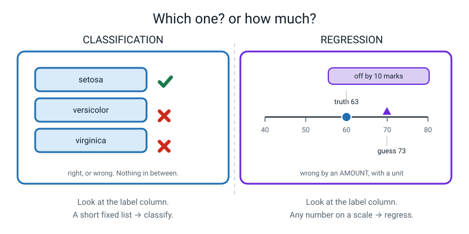
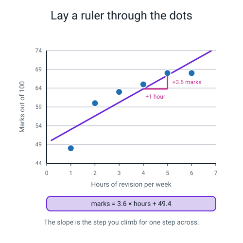
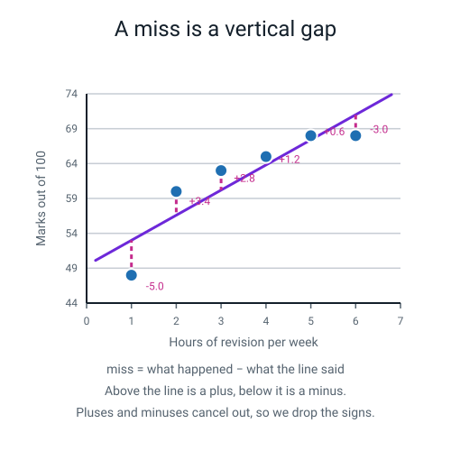
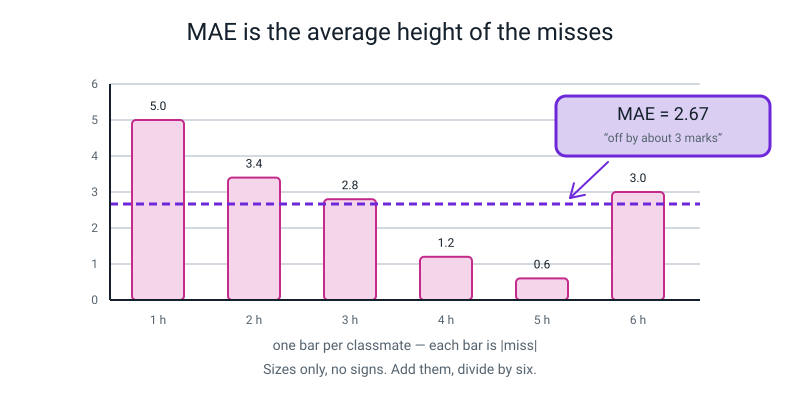
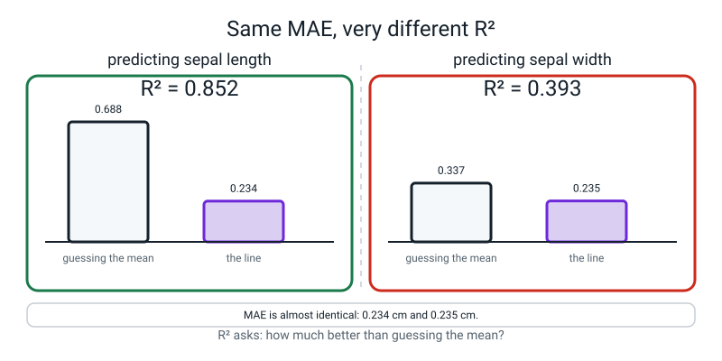
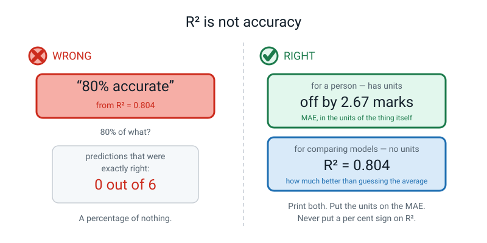
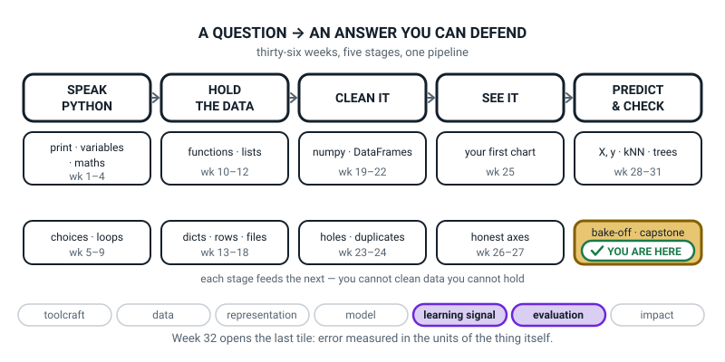
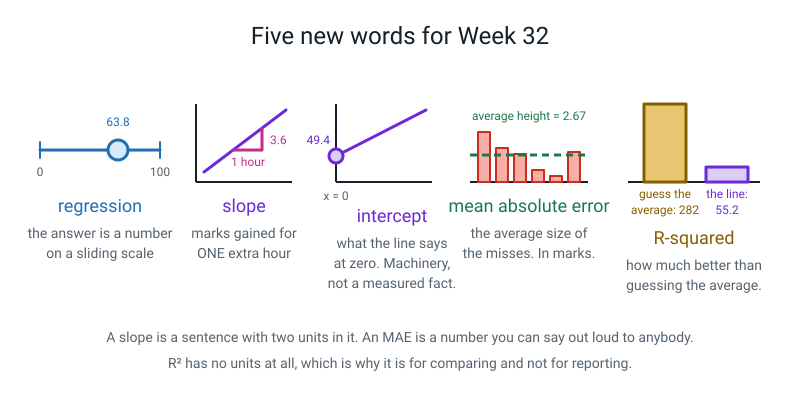

# Week 32 — Predicting a Number: Lines, MAE, and R²

[⬅ Week 31](week-31.md) · [Course Home](../README.md) · [Next ➡](week-33.md) · [Workbook](../workbook/week-32.md)

---

> ### This week in one sentence
> **When the answer is a number instead of a category, you lay a ruler through the dots — and you measure how wrong you are in the units of the thing itself, so you can say it out loud to anybody.**
>
> **By the end of this chapter you will be able to:**
> - Tell classification from regression by looking at the answer column
> - Fit a line with `LinearRegression()` and read the slope and the intercept out of the model
> - State a slope in real units, with the units named — "+3.6 marks per extra hour"
> - Compute MAE and say what it means in marks, minutes or rupees
> - Explain why a high R² on its own can still mislead you
>
> **New syntax this week:** `LinearRegression()` · `model.coef_` / `model.intercept_` · `mean_absolute_error(y_true, y_pred)` · `r2_score(y_true, y_pred)`
>
> **Reading time:** about 25 minutes. **Homework:** about 60 minutes. **You will need graph paper and a ruler with millimetres on it.**

---

## 🪝 Start Here

**How many minutes did you spend looking at a screen yesterday?**

Don't answer yet. Write it down on a scrap of paper and turn it over.

Right. I am going to guess. I say… **90 minutes.**

Now turn the paper over. How far off was I?

Twenty minutes, maybe? Forty? Whatever it was, here is the question that matters: **was I wrong?**

Last week I asked you *"which species is this flower?"*. Three choices. If I picked the wrong one I was **wrong** — flat wrong, no credit, no argument. That is what all of Weeks 29, 30 and 31 have been about, and the score was simple: what fraction did I get exactly right.

But "off by twenty minutes" is not that kind of wrong at all, is it? If I had said **four hundred** minutes I would also be "wrong" — and it would be a very much worse guess. Accuracy cannot tell those two apart. Accuracy would score them identically: zero.

And that is the problem, because **I am never going to guess your screen time to the exact minute.** Not once, not ever. So "what fraction did I get exactly right" is going to be zero for the rest of my life.

> **The question changed, so the score has to change too. And the new score has to be a number in minutes — because the only honest way to say how wrong I was is in the units of the thing itself.**


*Figure 32.1 — Which one? or how much? Look at the answer column: a short fixed list means classify, any number means regress.*

> **💡 Try this:** before reading on, get somebody in the house to think of a number — how many books are in the room, how many minutes until dinner, how much last week's shopping cost. Guess it. Then write down, in **words with units**, how wrong you were: *"I was 12 minutes over."* Notice how much more that sentence tells you than "I was wrong".

---

## 🧠 The Big Idea

> **📌 About the code in this section.** The blocks below are **illustrations, not files**. They show you the shape of one idea, and each one carries on from the one above it — the `import` lines and the data are typed once, in the first block that needs them. **The complete, runnable file is in 💻 Type This.** If you copy a block from this section on its own and Python says `NameError`, that is why, and nothing is broken.

### 1. The answer is a number now, so the whole toolbox changes

**The plain explanation.** For four weeks the answer has been a **category** — setosa, versicolor, virginica. This week the answer is a **number**. How many marks. How many minutes. How many rupees.

> **Regression** — predicting a number on a sliding scale, rather than choosing from a fixed list.

The word "regression" is a rotten name with an odd history, and there is no clue in it. Take it as a label, not a hint.

But the **question** behind it is the most useful sorting question in the whole subject, and it is this: **look at the answer column. Is it a short fixed list, or is it any number?**

| | Classification | Regression |
|---|---|---|
| The answer is | one of a short fixed list | any number |
| Example question | "Which species is this flower?" | "How many marks will she get?" |
| scikit-learn name ends in | `Classifier` | `Regressor` |
| "Wrong" means | the wrong category | off by *some amount* |
| Main score | accuracy | MAE, RMSE, R² |

**The analogy.** 🍕 Classification is a multiple-choice question — you tick a box and you are right or you are not. Regression is guessing somebody's height. Being 1 cm out and being 40 cm out are both "wrong", and they are wildly different kinds of wrong.

**The concrete version, and this is the useful bit.** The same table can be either one. It depends only on **which column you cover up**.

| pupil | revision hours | lessons missed | **mark** | **passed?** |
|---|---|---|---|---|
| A | 1 | 6 | **48** | **no** |
| B | 4 | 2 | **65** | **yes** |
| C | 6 | 1 | **68** | **yes** |

Cover up `mark` and try to predict it: that is **regression**, because 48 and 65 and 68 are just numbers on a scale. Cover up `passed?` instead: that is **classification**, because there are exactly two answers.

Nothing about the world changed. Nothing about the measurements changed. **You changed which column you covered up.**

> **⚠️ Watch out:** scikit-learn names its tools after this distinction, and knowing that saves you a great deal of looking things up. Anything ending in **`Classifier`** picks from a list. Anything ending in **`Regressor`** hands you a number. Last week you used `DecisionTreeClassifier`. There is a `DecisionTreeRegressor`, it does exactly what you would guess, and you will meet it next week.

### 2. A line is exactly two numbers

**The plain explanation.** Plot the dots. Lay a ruler across them so it is as close as possible to all of them at once. Draw along it. **That ruler is the model.**

To predict for somebody new, find their value on the bottom axis, go up to the line, read across.

> **slope × x + intercept = y**
>
> **Slope** — how much y changes when x goes up by exactly 1.
> **Intercept** — what the line says y would be when x is 0.

That is the whole model. **Two numbers.** Where the tree gave you four sentences, a line gives you two numbers — and one of them, the slope, is a sentence in disguise.

**The analogy.** 🍕 It is a phone tariff. *"₹200 a month, plus ₹2 per gigabyte."* The 200 is the intercept — what you pay for zero gigabytes. The 2 is the slope — what each extra gigabyte costs. Every phone bill you have ever seen is `slope × x + intercept`, and nobody ever called it a model.

**The concrete version.** Six classmates. `x` = hours of revision a week, `y` = marks out of 100.

| Classmate | hours (x) | marks (y) |
|---|---|---|
| A | 1 | 48 |
| B | 2 | 60 |
| C | 3 | 63 |
| D | 4 | 65 |
| E | 5 | 68 |
| F | 6 | 68 |

The line that fits those six best is:

```
marks = 3.6 × hours + 49.4
```


*Figure 32.2 — Lay a ruler through the dots. The step triangle is how you read the slope: one across, 3.6 up.*

**And now the most important habit of this whole term. It is about how you *say* the slope.**

You never — ever — say *"the slope is 3.6"*. Because **3.6 what? Per what?**

You say:

> *"Each extra hour of revision a week goes with about **3.6 more marks**."*

Three things about that sentence and all three matter:

- **Unit on the number, unit on the "per".** Marks, per one hour a week.
- **"goes with", not "causes".** This is Week 27 again. The six people who revised more happened to score more. That is not proof that revising *makes* you score more — maybe the confident ones both revised more *and* scored more anyway. *"Goes with"* is a claim you can defend. *"Causes"* is one you cannot.
- **"per one".** A slope is always per **one** unit of x. If the "per one" is missing, the sentence is not finished.

```
   ✗  "the slope is 3.6"
   ✗  "one hour of revision causes 3.6 marks"
   ✓  "one extra hour a week goes with about 3.6 more marks"
```

> **💡 Try this:** slopes can be negative and it happens constantly. *"Each extra kilometre from the school goes with about 2 lakh **less** on the house price."* Downhill line, negative number, and the sentence works identically with "less" instead of "more". A negative slope is a real relationship, not a broken model.

### 3. The misses, and why they cancel out

**The plain explanation.** The line does not go through the dots. It cannot — the dots are not on a line. Six real people are never on a line.

> **Residual** — the vertical gap between a real point and the line: actual minus predicted. In this book we mostly call it **the miss**.

**The analogy.** 🍕 Darts. You aim at the same spot every throw and you are a bit high, a bit left, a bit low. The misses are not a sign you are aiming at the wrong spot. They are the record of what happened when you aimed at the right one.

**The concrete version.** Our six, with the line's guesses beside them:

| hours | actual | predicted = 3.6x + 49.4 | miss = actual − predicted |
|---|---|---|---|
| 1 | 48 | **53.0** | −5.0 |
| 2 | 60 | **56.6** | +3.4 |
| 3 | 63 | **60.2** | +2.8 |
| 4 | 65 | **63.8** | +1.2 |
| 5 | 68 | **67.4** | +0.6 |
| 6 | 68 | **71.0** | −3.0 |
| | | | **total = 0.0** |


*Figure 32.3 — A miss is a vertical gap. Above the line is a plus, below it is a minus, and the pluses and minuses always cancel.*

**Add up that last column.** Zero. Exactly zero.

That is not luck. A best-fit line **always balances**, with as much sitting above it as below it. Which leads straight to something you must not do:

> **You cannot average the misses as they stand.** They cancel, so you would conclude your model was perfect no matter how bad it was.

So: **throw the signs away.** Keep only the sizes. That is the next idea.

### 4. MAE — the score you can say out loud

**The plain explanation.** Take every miss, drop the plus or minus, and average what is left.

> **Mean absolute error (MAE)** — the average size of your misses, ignoring whether you were over or under. **Same units as the thing you are predicting.**

**The analogy.** 🍕 Cut a paper strip the length of each miss — 5 cm, 3.4 cm, 2.8 cm, 1.2 cm, 0.6 cm, 3 cm. Lay them end to end on the table. That is 16 cm of total wrongness. Divide the row into six equal parts. **That is MAE, and it is something you can point at.**

And notice: two strips, one "over" and one "under", do **not** cancel out on the table. Being 5 marks over and 5 marks under is **two** mistakes, not zero mistakes.

**The concrete version.**

```
sizes:  5.0  3.4  2.8  1.2  0.6  3.0
total:  16.0
MAE  =  16.0 ÷ 6  =  2.6666...  =  2.67 marks
```


*Figure 32.4 — MAE is the average height of the misses. Sizes only, no signs.*

Now say what it **means**, out loud, in marks:

> *"On average, my line is off by about two and a half marks."*

That is the sentence. No jargon, real units, and you could say it to a grandparent. **MAE is the score for humans**, and that is its entire advantage — which is a big one.

> **⚠️ Watch out:** an MAE with no unit on it is not finished. "MAE 2.67" is a number floating in space. **"2.67 marks"** is a result. Every time you print an MAE this year, print the unit next to it.

### 5. R² — how much better are you than not bothering?

**The plain explanation.** MAE tells you how far off you are. It does not tell you whether that is any good — because "good" depends on what you were up against.

So there is a second score, and it answers a completely different question: **how much better am I than the laziest possible model — the one that ignores everything and guesses the average every time?**

> **R-squared (R²)** — the fraction of the up-and-down in the answer that your model explains, compared with a model that just guesses the average. **1.0** is perfect, **0.0** is no better than guessing the average, and **negative** is *worse* than guessing the average.

**The analogy.** 🍕 Two friends both say they beat you at a game "by a lot". One beat a total beginner. One beat the school champion. The margin alone tells you nothing until you know what they were up against. **R² is the score that tells you what you were up against.**

**The concrete version.** For our six classmates: guessing the average of 62 every single time would be off by **5.33 marks** on average. Our line is off by **2.67 marks**. So the line is about **half as wrong as not bothering at all**, and R² puts a number on that:

```
R² = 0.804
```

Read it: *"the line explains about 80% of the up-and-down in these marks."*

**And here is the trap, which is the hardest idea in the week.** R² is **not** a measure of how good you are. It is a measure of how much better you are than guessing the average. Watch what that does.

Take the iris flowers. Hide one measurement, try to predict it from the other three, and do that four times:

```text
measurement we hid    MAE (cm)      R2  mean-guess MAE
sepal length (cm)        0.234   0.852           0.699
sepal width (cm)         0.235   0.393           0.295
petal length (cm)        0.261   0.960           1.643
petal width (cm)         0.159   0.927           0.708
```

**Look at the first two rows.** The MAE is virtually identical — **0.234 cm and 0.235 cm**. The model is off by the same amount in both cases. And yet R² is **0.852** for one and **0.393** for the other.

The third column explains the whole thing. Sepal length **varies a lot** between flowers, so guessing the average is off by 0.699 cm — and getting that down to 0.234 is a big win. Sepal width **barely varies at all**; guessing the average is *already* only off by 0.295 cm, so getting to 0.235 is barely an improvement, and R² says so.


*Figure 32.5 — Same MAE, very different R². R² asks how much better you are than guessing the mean.*

**Two conclusions to carry with you:**

- **A high R² does not mean your predictions are good enough to use.** It means the thing you predicted varies a lot and you explained some of it. Always print the MAE next to it, with its unit.
- **A low R² does not always mean a bad model.** Sometimes it means the thing barely varies, so there was very little to explain. R² of 0.393 on sepal width is not a bug.

And a third, which is why that table is here at all: **lines do not fit everything.** Three of those four are over 0.85 and one is under 0.4, from one dataset with one piece of code. Nobody should finish this chapter thinking a straight line is a universal answer.

> **The rule to remember: MAE for people. R² for comparing models.** Report both. It costs nothing and it makes it much harder for anybody — including you — to be fooled.

---

## 💻 Type This

New file: `week32_study_line.py`.

### Step 1 — The data, and the shape check

```python
# week32_study_line.py
# Six classmates. Hours of revision per week -> marks out of 100.

import numpy as np                                   # arrays, from week 17
from sklearn.linear_model import LinearRegression     # NEW: the line-fitter

# X is always a TABLE: one row per person, one column per feature.
hours = np.array([1, 2, 3, 4, 5, 6]).reshape(-1, 1)   # 6 rows, 1 column
marks = np.array([48, 60, 63, 65, 68, 68])            # the answer, 6 numbers

print("hours shape:", hours.shape)                    # must be (6, 1)
print("marks shape:", marks.shape)                    # (6,) is right for y
```

**What each new bit does.**

- `from sklearn.linear_model import LinearRegression` — the `linear_model` department of the toolbox. Note the spelling: **`linear_model`, singular, with an underscore.**
- `.reshape(-1, 1)` — turn the six hours into a **table with one column**. scikit-learn always wants `X` as rows × columns, even when there is only one column. `-1` means *"work out the number of rows yourself"*.
- `marks` stays a **flat list** of six numbers. `X` is a table; `y` is a column. That asymmetry looks wrong and it is correct.

```text
hours shape: (6, 1)
marks shape: (6,)
```

`(6, 1)` — six rows, one column, a table. `(6,)` — a flat line of six.

> **💡 Try this:** print both shapes at the top of every single one of these files for the rest of the year. It costs two seconds and it kills the most common error in this whole level. If you skip the `.reshape`, you get the error in **When It Breaks** below, and it is worth meeting on purpose.

### Step 2 — Fit the line, and read the two numbers out

```python
# add to week32_study_line.py
model = LinearRegression()        # an empty ruler with no line on it yet
model.fit(hours, marks)           # lay the ruler through the six dots

print()
print("slope    :", model.coef_)          # marks gained per extra hour
print("intercept:", model.intercept_)     # marks the line gives at 0 hours
print("tidied up: marks =", round(model.coef_[0], 2), "x hours +",
      round(model.intercept_, 2))
```

- `LinearRegression()` — build an unfitted model. **Note the brackets.** `LinearRegression` without them is the *recipe*; `LinearRegression()` is a *thing made from* the recipe.
- `model.fit(hours, marks)` — find the best line. Features first, answers second, always.
- `model.coef_` — the slope. **Trailing underscore**, same as last week's `feature_importances_`: it only exists after `fit`. It prints as a **list** with one number in it, because there is one feature.
- `model.intercept_` — the single intercept, one plain number.
- `model.coef_[0]` — reach into that list of one and pull the number out.

```text
slope    : [3.6]
intercept: 49.400000000000006
tidied up: marks = 3.6 x hours + 49.4
```

**There is the model.** `marks = 3.6 × hours + 49.4`. Two numbers.

> **⚠️ Watch out — that `49.400000000000006`.** Not a mistake, and not the model being sloppy. Computers store decimals in **binary**, and 49.4 has no exact binary form, so a crumb is left over at the fifteenth decimal place. It is called **floating-point dust** and you met it in Week 3. `round(..., 2)` sweeps it up, which is what the "tidied up" line is for.

Now say the slope as a sentence. Out loud. *"Each extra hour of revision a week goes with about 3.6 more marks."* Write that sentence in your workbook; you are going to be asked for it again in three weeks.

### Step 3 — The guesses and the misses

```python
# add to week32_study_line.py
guesses = model.predict(hours)            # what the line says for each person
print()
print("the line's guesses  :", guesses)
print("what really happened:", marks)
print("the misses          :", np.round(marks - guesses, 2))
```

- `model.predict(hours)` — run all six people through the line.
- `marks - guesses` — numpy subtracts **element by element** (Week 18), giving six misses in one go. With plain Python lists this would not work at all.
- `np.round(..., 2)` — tidy the floating-point dust so the six misses are readable.

```text
the line's guesses  : [53.  56.6 60.2 63.8 67.4 71. ]
what really happened: [48 60 63 65 68 68]
the misses          : [-5.   3.4  2.8  1.2  0.6 -3. ]
```

The first person: the line said 53, she actually got 48, so the miss is **−5**. Minus means she is **below** the line. The second is **+3.4** — above it.

Add up those six misses in your head. About zero? Exactly zero. Which is why the next step throws the signs away.

### Step 4 — The two scores

```python
# add to the top of week32_study_line.py
from sklearn.metrics import mean_absolute_error       # NEW: the average miss
from sklearn.metrics import r2_score                  # NEW: fraction explained

# add at the bottom
print()
print("MAE:", round(mean_absolute_error(marks, guesses), 2), "marks")
print("R2 :", round(r2_score(marks, guesses), 3))
```

- `from sklearn.metrics import ...` — the same `metrics` department that gave you `accuracy_score` in Week 30. All the scores live there.
- `mean_absolute_error(marks, guesses)` — **truth first, guess second.** MAE happens to give the same answer either way round; `r2_score` does **not**, so build the habit here where it is free.
- The `"marks"` on the end of the print is not decoration. **It is half the result.**

```text
MAE: 2.67 marks
R2 : 0.804
```

> **⚠️ Watch out:** if you find yourself about to write "so it's 80% accurate", stop. R² is **not** a percentage of right answers — **not one** of our six predictions was exactly right. The number that says how good the predictions are is the MAE: **2.67 marks**.

### Step 5 — The moment you will remember

```python
# add to week32_study_line.py
print()
print("a 7th classmate who revises 7 hours:", model.predict([[7]]))
print("somebody who revises 20 hours      :", model.predict([[20]]))
```

- `model.predict([[7]])` — **two sets of brackets.** The outer one is the table, the inner one is the single row. One set gives you an error, and a useful one.

```text
a 7th classmate who revises 7 hours: [74.6]
somebody who revises 20 hours      : [121.4]
```

Seven hours, 74.6 marks. Fine — a little past our data, but a sensible stretch.

Twenty hours… **a hundred and twenty-one point four.**

Out of a hundred.

The line does not know the test is out of 100. **It has never heard of a maximum mark.** It does 3.6 × 20 + 49.4 and hands the answer over, completely confidently. Push it to fifty hours and it will promise you 229.

> **Extrapolation** — predicting outside the range of x values you actually have data for.

Nobody in our six revised more than 6 hours. Past 6 hours, the line is making a promise the data never made.

**This is not a bug you fix. It is a limit you *know*** — and saying it out loud is part of being honest about a model. When you show somebody a model, tell them the range it was built from.

### The complete finished program

```python
# week32_study_line.py
# Six classmates. Hours of revision per week -> marks out of 100.

import numpy as np                                    # arrays, from week 17
from sklearn.linear_model import LinearRegression      # NEW: the line-fitter
from sklearn.metrics import mean_absolute_error        # NEW: the average miss
from sklearn.metrics import r2_score                   # NEW: fraction explained

# X is always a TABLE: one row per person, one column per feature.
hours = np.array([1, 2, 3, 4, 5, 6]).reshape(-1, 1)   # 6 rows, 1 column
marks = np.array([48, 60, 63, 65, 68, 68])            # the answer, 6 numbers

print("hours shape:", hours.shape)                    # must be (6, 1)
print("marks shape:", marks.shape)                    # (6,) is right for y

model = LinearRegression()        # an empty ruler with no line on it yet
model.fit(hours, marks)           # lay the ruler through the six dots

print()
print("slope    :", model.coef_)          # marks gained per extra hour
print("intercept:", model.intercept_)     # marks the line gives at 0 hours
print("tidied up: marks =", round(model.coef_[0], 2), "x hours +",
      round(model.intercept_, 2))

guesses = model.predict(hours)            # what the line says for each person
print()
print("the line's guesses  :", guesses)
print("what really happened:", marks)
print("the misses          :", np.round(marks - guesses, 2))

print()
print("MAE:", round(mean_absolute_error(marks, guesses), 2), "marks")
print("R2 :", round(r2_score(marks, guesses), 3))

print()
print("a 7th classmate who revises 7 hours:", model.predict([[7]]))
print("somebody who revises 20 hours      :", model.predict([[20]]))
```

```text
hours shape: (6, 1)
marks shape: (6,)

slope    : [3.6]
intercept: 49.400000000000006
tidied up: marks = 3.6 x hours + 49.4

the line's guesses  : [53.  56.6 60.2 63.8 67.4 71. ]
what really happened: [48 60 63 65 68 68]
the misses          : [-5.   3.4  2.8  1.2  0.6 -3. ]

MAE: 2.67 marks
R2 : 0.804

a 7th classmate who revises 7 hours: [74.6]
somebody who revises 20 hours      : [121.4]
```

---

## 🔍 Worked Examples

### Worked Example 1 — The juice stall (food)

Seven days at a lemonade stall. `x` = the day's temperature in °C, `y` = cups sold.

```python
# lemonade_line.py
# Seven days at the juice stall. Temperature -> cups sold.
import numpy as np
from sklearn.linear_model import LinearRegression
from sklearn.metrics import mean_absolute_error, r2_score

temp_c = np.array([22, 24, 26, 28, 30, 32, 34]).reshape(-1, 1)
cups = np.array([18, 25, 34, 36, 47, 52, 58])

print("temp_c shape:", temp_c.shape)
print("cups   shape:", cups.shape)

model = LinearRegression()
model.fit(temp_c, cups)

print("slope    :", round(model.coef_[0], 2), "cups per extra degree")
print("intercept:", round(model.intercept_, 2), "cups")
guesses = model.predict(temp_c)
print("guesses  :", np.round(guesses, 2))
print("misses   :", np.round(cups - guesses, 2))
print("MAE      :", round(mean_absolute_error(cups, guesses), 2), "cups")
print("R2       :", round(r2_score(cups, guesses), 3))
print("a 27 C day:", np.round(model.predict([[27]]), 1))
print("a 45 C day:", np.round(model.predict([[45]]), 1))
lazy = np.zeros(len(cups)) + cups.mean()
print("always-guess-the-mean MAE:", round(mean_absolute_error(cups, lazy), 2), "cups")
```

```text
temp_c shape: (7, 1)
cups   shape: (7,)
slope    : 3.34 cups per extra degree
intercept: -54.93 cups
guesses  : [18.54 25.21 31.89 38.57 45.25 51.93 58.61]
misses   : [-0.54 -0.21  2.11 -2.57  1.75  0.07 -0.61]
MAE      : 1.12 cups
R2       : 0.988
a 27 C day: [35.2]
a 45 C day: [95.3]
always-guess-the-mean MAE: 11.8 cups
```

**Say the slope as a sentence:** *"Each extra degree of temperature goes with about **3.3 more cups** sold."*

**Say the MAE as a sentence:** *"On average my line is off by about **1.1 cups**."* And now that it is in cups, you can tell whether it is good enough: if you are deciding how many lemons to buy, being one cup out is fine.

**And look at the intercept: −54.93 cups.**

**Minus fifty-five cups.** You cannot sell minus fifty-five cups of anything. Is the model broken?

No. The intercept is *"what the line says at 0 °C"*, and our coldest day was 22 °C. **The intercept is a prediction from thirteen degrees off the edge of the evidence.** It is a perfectly good piece of the formula — you need it to get 35.2 for a 27 °C day, which is inside our range and sensible — and it is a **nonsense claim about the world**. Those are two different things, and this is why the intercept is machinery rather than a fact.

**One more thing worth noticing.** Guessing the average every day would be off by **11.8 cups**. The line is off by **1.1**. *That* is why R² is 0.988: not because 1.1 cups is a small number in some absolute sense, but because the alternative was so much worse.

### Worked Example 2 — Balls faced and runs scored (sport)

Eight innings from one batter.

```python
# cricket_line.py
# Eight innings. Balls faced -> runs scored.
import numpy as np
from sklearn.linear_model import LinearRegression
from sklearn.metrics import mean_absolute_error, r2_score

balls = np.array([10, 18, 24, 30, 36, 42, 50, 60]).reshape(-1, 1)
runs = np.array([8, 15, 26, 24, 41, 38, 55, 61])

model = LinearRegression()
model.fit(balls, runs)
guesses = model.predict(balls)

print("slope    :", round(model.coef_[0], 3), "runs per extra ball faced")
print("intercept:", round(model.intercept_, 2), "runs")
print("guesses  :", np.round(guesses, 2))
print("misses   :", np.round(runs - guesses, 2))
print("MAE      :", round(mean_absolute_error(runs, guesses), 2), "runs")
print("R2       :", round(r2_score(runs, guesses), 3))
lazy = np.zeros(len(runs)) + runs.mean()
print("mean-guess MAE:", round(mean_absolute_error(runs, lazy), 2), "runs")
print("a 45-ball innings:", np.round(model.predict([[45]]), 1))
print("per 100 balls    :", round(model.coef_[0] * 100, 1), "runs")
```

```text
slope    : 1.094 runs per extra ball faced
intercept: -3.43 runs
guesses  : [ 7.51 16.27 22.83 29.4  35.96 42.53 51.28 62.22]
misses   : [ 0.49 -1.27  3.17 -5.4   5.04 -4.53  3.72 -1.22]
MAE      : 3.1 runs
R2       : 0.958
mean-guess MAE: 15.25 runs
a 45-ball innings: [45.8]
per 100 balls    : 109.4 runs
```

**The slope, as a sentence:** *"Each extra ball faced goes with about **1.09 more runs**."*

**And here is a lovely thing.** Multiply that slope by 100 and you get **109.4 runs per 100 balls** — which is a **strike rate**, a number every cricket commentator on earth uses. You did not invent a new statistic; you rediscovered one that already has a name, by fitting a line and reading its slope. Slopes turn up with names attached all over the place: kilometres per litre, runs per over, rupees per kilo. Every one of them is the slope of somebody's line.

**The MAE, as a sentence:** *"On average the line is off by about **3.1 runs**."* Against the lazy model's 15.25, that is about a fifth as wrong.

**And the intercept is −3.43 runs.** Minus three runs off zero balls. Same story as the lemonade stall: machinery, not a fact. You cannot score minus three, and nobody in our data faced zero balls.

### Worked Example 3 — A downhill slope (school)

Nine pupils. `x` = lessons missed this term, `y` = marks out of 100. This time the line goes **down**.

```python
# lessons_missed_line.py
# Nine pupils. Lessons missed -> marks out of 100. This slope goes DOWNHILL.
import numpy as np
from sklearn.linear_model import LinearRegression
from sklearn.metrics import mean_absolute_error, r2_score

missed = np.array([0, 1, 2, 3, 4, 5, 6, 8, 10]).reshape(-1, 1)
marks = np.array([88, 84, 79, 78, 70, 69, 61, 55, 44])

model = LinearRegression()
model.fit(missed, marks)
guesses = model.predict(missed)

print("slope    :", round(model.coef_[0], 2), "marks per extra lesson missed")
print("intercept:", round(model.intercept_, 2), "marks")
print("guesses  :", np.round(guesses, 2))
print("misses   :", np.round(marks - guesses, 2))
print("MAE      :", round(mean_absolute_error(marks, guesses), 2), "marks")
print("R2       :", round(r2_score(marks, guesses), 3))
lazy = np.zeros(len(marks)) + marks.mean()
print("mean-guess MAE:", round(mean_absolute_error(marks, lazy), 2), "marks")
print("missed 7 lessons :", np.round(model.predict([[7]]), 1))
print("missed 25 lessons:", np.round(model.predict([[25]]), 1))
```

```text
slope    : -4.35 marks per extra lesson missed
intercept: 88.64 marks
guesses  : [88.64 84.29 79.93 75.58 71.23 66.88 62.52 53.82 45.11]
misses   : [-0.64 -0.29 -0.93  2.42 -1.23  2.12 -1.52  1.18 -1.11]
MAE      : 1.27 marks
R2       : 0.989
mean-guess MAE: 11.14 marks
missed 7 lessons : [58.2]
missed 25 lessons: [-20.2]
```

**The slope, as a sentence — and note the word "less":** *"Each extra lesson missed goes with about **4.4 fewer marks**."*

The number is negative and the sentence still works perfectly. Nothing is wrong. A negative slope is a downhill line.

**The intercept, for once, is sensible.** 88.64 marks is what the line says for somebody who missed **zero** lessons — and one of our nine pupils genuinely did miss zero lessons. So this intercept is **inside** our evidence, which makes it a much more defensible claim than the lemonade stall's minus fifty-five cups. Whether the intercept is meaningful depends entirely on whether anybody in your data actually had x = 0.

**And now the extrapolation.** Missed 7 lessons → 58.2 marks. Reasonable: 7 sits inside our range of 0 to 10.

Missed 25 lessons → **−20.2 marks.**

**Minus twenty marks.** You cannot score below zero on a test. The line has no idea that a minimum exists any more than the revision line knew about a maximum. Both of them will confidently walk straight off the edge of reality, and it is the *same* limitation both times: **a straight line does not know where the world stops.**

> **⚠️ Watch out — the sentence you must not say.** "Missing lessons costs you 4.4 marks each." That is a **causal** claim, and the data cannot support it. Maybe the pupils who missed most lessons were ill for a fortnight, or were the ones who found the subject hardest and skipped it. Say **"goes with"**. Every time.

---

## 🐞 When It Breaks

Every message below came out of a real run. **Read the last line first.**

### Error 1 — one flat list where a table was wanted

```python
hours = np.array([1, 2, 3, 4, 5, 6])       # no .reshape
marks = np.array([48, 60, 63, 65, 68, 68])

model = LinearRegression()
model.fit(hours, marks)
```

```text
Traceback (most recent call last):
  File "/Users/you/project/week32_study_line.py", line 8, in <module>
    model.fit(hours, marks)
  ...
ValueError: Expected 2D array, got 1D array instead:
array=[1 2 3 4 5 6].
Reshape your data either using array.reshape(-1, 1) if your data has a single feature or array.reshape(1, -1) if it contains a single sample.
```

**What Python is telling you.** **2-D** means a table — rows *and* columns. **1-D** means a single row of numbers. scikit-learn always wants `X` as a table, one row per thing and one column per measurement, **even when there is only one measurement**. It refuses to guess, because guessing wrong would be worse than complaining.

**And look at the last line: it tells you the fix.** It spells out `array.reshape(-1, 1)` for you. That is unusually kind, and it is worth learning the habit of **finishing the message** — a lot of students skip that line because the block looks like noise.

**The fix.**

```python
hours = np.array([1, 2, 3, 4, 5, 6]).reshape(-1, 1)
```

> **💡 Try this:** the same error has a smaller cousin. `model.predict(7)` gives you `ValueError: Expected 2D array, got scalar array instead: array=7.` A **scalar** is a single bare number. `predict` wants a *table* of rows, so it needs `model.predict([[7]])` — outer brackets for the table, inner for the one row.

### Error 2 — the wrong score for the job

```python
from sklearn.metrics import accuracy_score
print("accuracy:", accuracy_score(marks, guesses))
```

```text
Traceback (most recent call last):
  File "/Users/you/project/week32_study_line.py", line 20, in <module>
    print("accuracy:", accuracy_score(marks, guesses))
  ...
ValueError: Classification metrics can't handle a mix of multiclass and continuous targets
```

**What Python is telling you.** Unpack it two words at a time. **"Classification metrics"** — accuracy is a *category* score. **"Continuous targets"** — our guesses are numbers with decimals in them, 56.6 and 63.8.

Accuracy would ask *"is 56.6 exactly equal to 60?"*, get the answer no, and score that as a total failure — when 56.6 is actually a rather good guess for 60.

**scikit-learn is refusing to give you a meaningless number, and that is a kindness.** Not every library is this careful.

**The fix.** Use the scores that belong to regression.

```python
from sklearn.metrics import mean_absolute_error, r2_score
print("MAE:", round(mean_absolute_error(marks, guesses), 2), "marks")
print("R2 :", round(r2_score(marks, guesses), 3))
```

### Error 3 — the trailing underscore again

```python
print("slope:", model.coef)
```

```text
Traceback (most recent call last):
  File "/Users/you/project/week32_study_line.py", line 6, in <module>
    print("slope:", model.coef)
AttributeError: 'LinearRegression' object has no attribute 'coef'. Did you mean: 'coef_'?
```

**What Python is telling you.** `AttributeError` means *"the thing on the left has no such part"* — and it has spotted that you were one character away and named the fix for you.

Same rule as last week's `feature_importances_`. **The trailing underscore means "this only exists after `fit` has run."** Before `fit`, there is no line, so there is no slope to hand you.

**The fix.**

```python
print("slope:", model.coef_)
```

> **⚠️ Watch out:** a different flavour of the same family is forgetting the brackets that *make* the model. `LinearRegression.fit(hours, marks)` gives you the baffling `AttributeError: 'numpy.ndarray' object has no attribute '_validate_params'`. That is Python saying *"you called `fit` on the recipe, not on a thing made from the recipe."* Write `LinearRegression()` **with brackets**, or `model = LinearRegression()` then `model.fit(...)`.

---

## 🎲 What We Did In Class

**The laptop stayed shut for the first twenty minutes. That was on purpose.**

### Part A — Fit the line by hand, with a ruler

You need graph paper (5 mm squares), a ruler with millimetres, a sharp pencil and an eraser.

**1. Axes, labelled first.** Across the bottom: **hours of revision per week, 0 to 7**, one big square per hour. Up the side: **marks out of 100, 40 to 80**, one big square per 5 marks. Write both labels *including the units* before you plot anything. Week 25's rule holds: a chart with no axis labels is a decoration.

**2. Plot the six points as small crosses**, not blobs. A blob is two millimetres of uncertainty you do not need.

**3. Lay the ruler.** Move it around until it looks as close as it can get to **all six** crosses at once. Not through the first and the last — through the **middle of the cloud**, with some crosses above the line and some below. When you cannot make it better, draw along it, edge to edge.

> **⚠️ Watch out:** the single most common mistake here is joining the first point to the last one. If you have done that, count how many crosses are **above** your line and how many are **below**. Joining (1, 48) to (6, 68) puts **four above and none below** — so the line is systematically too low for most of the class, and it threw away four of your six pieces of evidence.

**4. Read the slope by counting squares.** Pick two grid crossings that your **drawn line** passes through — not two data points — as far apart as you can. Count squares up. Count squares across. Divide. Remember that one square up is **5 marks** and one square across is **1 hour**.

Then write it on the paper, in words:

```
   my slope:  about ______ marks per extra hour of revision
```

**A good hand fit lands somewhere between 3.0 and 4.2.** scikit-learn's answer is 3.6. **Anything in that band is a success**, because the point being made is *"eyeballing gets you close"*, not *"you got it exactly".*

### Part B — The arithmetic version

Then we did the same job with a pencil, to prove the computer is not doing anything mysterious.

**Step 1 — the two means.**

```
x̄ = (1 + 2 + 3 + 4 + 5 + 6) ÷ 6 = 21 ÷ 6 = 3.5
ȳ = (48 + 60 + 63 + 65 + 68 + 68) ÷ 6 = 372 ÷ 6 = 62
```

**Step 2 — how far each point sits from the middle.**

| x | y | dx = x − 3.5 | dy = y − 62 | dx × dy | dx² |
|---|---|---|---|---|---|
| 1 | 48 | −2.5 | −14 | 35.0 | 6.25 |
| 2 | 60 | −1.5 | −2 | 3.0 | 2.25 |
| 3 | 63 | −0.5 | 1 | −0.5 | 0.25 |
| 4 | 65 | 0.5 | 3 | 1.5 | 0.25 |
| 5 | 68 | 1.5 | 6 | 9.0 | 2.25 |
| 6 | 68 | 2.5 | 6 | 15.0 | 6.25 |
| | | **Σ = 0** | **Σ = 0** | **Σ = 63.0** | **Σ = 17.5** |

**The two zero totals are your built-in check.** A mean is the balance point, so the amounts above it and below it must be equal. If either column does not total zero, your mean is wrong — go back before doing anything else.

**Step 3 — slope and intercept.**

```
slope     = 63.0 ÷ 17.5 = 3.6
intercept = ȳ − slope × x̄ = 62 − 3.6 × 3.5 = 62 − 12.6 = 49.4
```

**Then all three slopes, side by side:**

| | slope |
|---|---|
| my ruler, by eye | *(your number, 3.0–4.2)* |
| my arithmetic | **3.6** |
| scikit-learn | **3.6** |

Your **eye** got within a few tenths of the answer that took a page of arithmetic and a computer. That is not luck. **You already knew how to do this.** The computer is faster and more consistent, and it is doing the same job.

### Part C — MAE off the paper

Measure each of the six vertical gaps with the ruler, in marks, against your drawn line. Write the six sizes with **no signs**. Add them. Divide by 6. Then finish the sentence:

```
   my MAE:  about ______ marks.
   Which means: "on average my line is off by about ______ marks."
```

Against the exact line the six sizes are 5.0, 3.4, 2.8, 1.2, 0.6 and 3.0, totalling 16.0, giving **2.67 marks**. Off a hand-drawn line you will get something between about 2.3 and 3.2. **That is right.**

### If you want the extension we ran out of time for

**Solve for the impossible.** Our line is `marks = 3.6 × hours + 49.4`. Solve `3.6h + 49.4 = 100` for `h`.

```
3.6h = 100 − 49.4 = 50.6
h    = 50.6 ÷ 3.6 = 14.06
```

**About 14.1 hours.** So the line claims a perfect score at 14 hours a week — and then keeps climbing past 100, which is impossible. You have just found the edge of the model **with algebra**, rather than being told about it.

---

## 💬 Talk About It

**1. The line does not pass through a single one of the six dots. A friend says that proves it is a bad line. What is the strongest answer you can give?**

*Hint:* what would a line that went through all six dots have to look like? Are six real people ever on a line? And what would it mean about a model if it hit every training point **exactly**? *(Hold that last thought. It is next week's entire lesson.)*

**2. Two models predict test marks. Model P has MAE 2 marks and R² 0.40. Model Q has MAE 8 marks and R² 0.95. Which would you rather have, and what extra information would settle it?**

*Hint:* R² depends on how much the thing varies, and MAE does not. What would you need to know about the two sets of pupils before you could compare the two R² values at all? *(How much the marks varied in each. The MAE, in marks, is the one you can compare directly.)*

**3. Our slope says more revision goes with more marks. Give a reason that sentence could be true even if revising made no difference whatsoever.**

*Hint:* who chooses to revise six hours a week? Is there anything else about those people? *(Confident pupils may both revise more and score more. Pupils who find a subject easy often enjoy revising it. The data cannot tell these apart from "revision works", and that is exactly why we say "goes with".)*

---

## ⚠️ Don't Get Tricked

### Trick 1 — "R² of 0.804 means 80% accurate"


*Figure 32.6 — R² is not accuracy. Report both scores, and put the units on the MAE.*

**Wrong:** *"My R² is 0.804, so my model is about 80% accurate."*

**Right:** R² is **not** a fraction of predictions that were right — **none** of our six was exactly right. It is the fraction of the *up-and-down* that the model explains, compared with guessing the average.

If somebody says "80% accurate", ask them: **"80% of what? Point at the thing."** The number that says how good the predictions are is the MAE: **2.67 marks**.

And a per cent sign never goes on an R². It has no units at all, which is what makes it good for comparing models and useless for telling anybody what your predictions are worth.

### Trick 2 — "the intercept is the mark you get for doing no revision"

**Wrong:** 49.4 is what a pupil who never revises scores.

**Right:** 49.4 is what the **formula** says at zero — and **nobody in our six revised zero hours.** The least was one. So the intercept is a prediction from off the edge of the evidence.

Compare the three worked examples: the lemonade stall's intercept was **−54.93 cups** (nonsense, and 22 °C off the edge of the data), the cricket one was **−3.43 runs** (also nonsense), and the lessons-missed one was **88.64 marks** — which is defensible, because a pupil in that data genuinely did miss zero lessons.

**The test is simple: did anybody in your data actually have x = 0?** If not, treat the intercept as machinery, not as a fact about people.

### Trick 3 — "the slope is 3.6"

**Wrong:** *"The slope is 3.6."* Full stop. Answer given.

**Right:** *"Each extra hour of revision a week goes with about 3.6 more marks."*

Whenever you hear yourself say a bare slope, ask the four-word question: **"3.6 what, per what?"** A slope with no units is not an answer, it is a digit. This is the habit of the week, and you will be asked for it in Week 34, Week 35 and Week 36.

### Trick 4 — "the line predicted 121 marks out of 100, so it's broken"

**Wrong:** an absurd answer means a bug. Go and find it.

**Right:** the line is doing **precisely** what it was built to do, outside the evidence it was built from. It was fitted on people who revised between 1 and 6 hours. Past 6 hours it is guessing with total confidence and no evidence at all. Our lessons-missed line does the same thing in the other direction and promises **−20.2 marks**.

A straight line has no concept of a maximum, a minimum, or reality. The professional habit is to **write down the range your model was built from and refuse to answer outside it**: *"nobody in my data revised more than 6 hours, so I won't predict past 6"* is a completely respectable thing to say.

---

## 🌍 Where You've Seen This

- **"Arrives in about 22 minutes."** Every food-delivery and taxi app is predicting a number — minutes — from distance, time of day, how busy the kitchen is. And it is scored in minutes, because that is the only unit the person waiting cares about.
- **A house-price estimate on a property website.** Slope per square metre, slope per bedroom, slope per kilometre from the station. Note that you cannot rank those features by the size of their slopes: a slope depends on its units, and square metres range over hundreds while bedrooms range over three.
- **The battery percentage estimate on your phone.** "3 hours 20 minutes remaining" is a number fitted from how fast the charge has been dropping. Watch what happens when you open a game: the line was built from evidence that no longer applies.
- **Weather forecasts of *how much* rain.** "Will it rain?" is classification. "How many millimetres?" is regression, and it is scored in millimetres.
- **Any shop's "you will save ₹X a month" calculator.** It is `slope × usage + intercept` with a nice picture round it, and the intercept is usually a fixed monthly charge that genuinely exists.
- **Your own school reports.** "Predicted grade" is somebody fitting a line — sometimes in their head — through your last few results. Ask them for the MAE next time.

---

## 🧭 Where This Fits

For four weeks the gold tile did not move. Today it drops one box down, into the very last tile on the
map — and look at what is *not* in the picture any more. No dashes. Nowhere. Every box is solid, and
the five weeks in front of you are five weeks of using what you already own.



*Figure 32.0 — The pipeline in Week 32. The last tile, `bake-off · capstone`, weeks 32 to 36, and the
last dashed box on the map has gone. The tile opens with a line drawn through six dots.*

| | |
|---|---|
| **The mental model you now own** | When the answer is a **number** instead of a name, you fit a **line** — and a line is exactly two numbers. The **slope** is a rate, and you say it out loud with its units: *"each extra hour of revision a week goes with about 3.6 more marks."* The score you report is **MAE**, the average size of the misses, measured in the units of the thing itself. Marks. Minutes. Rupees. |
| **The one question it answers** | *"How far off is it — in marks?"* |
| **What it plugs into** | `y = mx + c` from maths class — the same line with new labels: `m` is `.coef_`, `c` is `.intercept_`. Week 26's scatter plot, which is the picture you lay the line through. And Week 29's split, fit, predict, score cycle, which does not change by a single line just because `y` became a number. |
| **What carries forward** | Week 33 puts RMSE next to MAE, adds a lazy baseline worth beating, and draws the depth curve. And Week 35 needs every bit of this the moment the thing you chose to predict back in Week 34 turns out to be a number rather than a name. |
| **Spiral thread** | 🎯 **Learning signal** — the misses are what the line is *chosen by*: out of every line you could draw, the fitted one is the one that makes them smallest — and ⚖️ **Evaluation**, because a score in marks is the only kind of score you can hand to somebody who has never heard of Python and have them argue back. |

> **💡 Try this:** write today's slope inside the gold tile on your own copy of the map, as a full
> English sentence with its units in it, and put your MAE underneath — *"off by about 2.67 marks"*. Two
> lines. In Week 35 you will be defending a number exactly like that out loud, and the one you wrote by
> hand in Week 32 is the one you will remember.

---

## 🔑 Remember This

- **Look at the answer column first.** Short fixed list → classification. Any number → regression. It is the first question to ask about any table from now until Week 36.
- **`Classifier` picks from a list. `Regressor` gives you a number.** Same tools, swapped ending.
- **A line is exactly two numbers**: a slope and an intercept. `slope × x + intercept = y`.
- **A slope is never a bare number.** It is a sentence with two units in it and the words "goes with": *"each extra hour a week goes with about 3.6 more marks."*
- **The misses always add to zero**, so you cannot average them as they stand. Drop the signs — that is MAE.
- **MAE is for people, in real units. R² is for comparing models, with no units.** Print both, and always put the unit on the MAE.
- **A high R² does not mean good; a low R² does not mean bad.** R² tells you how much better you are than guessing the average, and nothing else.
- **A straight line does not know where the world stops.** 121 marks out of 100, −20 marks, −55 cups: extrapolation is a limit you state, not a bug you fix.

### Syntax reminder card

```python
# ---- X is a TABLE, y is a flat column ----------------------------------
import numpy as np
hours = np.array([1, 2, 3, 4, 5, 6]).reshape(-1, 1)   # (6, 1)  a table
marks = np.array([48, 60, 63, 65, 68, 68])            # (6,)    a flat line
print(hours.shape, marks.shape)                       # print these EVERY time

# ---- fit a line -------------------------------------------------------
from sklearn.linear_model import LinearRegression      # linear_model, singular
model = LinearRegression()                             # the () MAKES one
model.fit(hours, marks)                                # features first, answers second

# ---- read the two numbers out -----------------------------------------
model.coef_                       # the slope, as a LIST: [3.6]
model.coef_[0]                    # the slope itself: 3.6
model.intercept_                  # the intercept: 49.400000000000006
round(model.intercept_, 2)        # sweep up the floating-point dust: 49.4

# ---- score it ---------------------------------------------------------
from sklearn.metrics import mean_absolute_error, r2_score
guesses = model.predict(hours)
mean_absolute_error(marks, guesses)   # TRUTH FIRST, guess second. In marks.
r2_score(marks, guesses)              # no units. For comparing only.

# ---- the laziest possible model, to compare against -------------------
lazy = np.zeros(len(marks)) + marks.mean()     # guess the average every time
mean_absolute_error(marks, lazy)               # 5.33 marks

# ---- predict for one new person ---------------------------------------
model.predict([[7]])              # TWO brackets: outer table, inner row
```

---

## 📓 New Words


*Figure 32.7 — Five words. Two of them are the model, two of them are the score, and one is the name of the whole game.*

| Word | What it means | Example |
|---|---|---|
| **regression** | Predicting a number on a sliding scale, rather than choosing from a fixed list. | "How many marks will she get?" — any number, so regression |
| **slope** | How much y changes when x goes up by exactly 1. Always stated with both units. | **3.6** — "each extra hour a week goes with about 3.6 more marks" |
| **intercept** | What the line says y would be when x is 0. Machinery, not necessarily a fact. | **49.4** marks — but nobody in our data revised zero hours |
| **mean absolute error** | The average size of the misses, signs dropped. Same units as the thing you predict. | **2.67 marks** — "on average I'm off by about two and a half marks" |
| **R-squared** | How much of the up-and-down your model explains, compared with guessing the average. No units. 1.0 perfect, 0.0 no better than the average, negative worse. | **0.804** — and *not* "80% accurate" |

---

## 📤 Your Homework

Open the **[Week 32 workbook](../workbook/week-32.md)**. Three things, about an hour.

**First — hand versus machine.** Fit the line by hand through the six points on fresh graph paper, exactly like in class, and read your own slope off the paper by counting squares. **Write your hand slope down and do not change it.** Then run the code and write scikit-learn's slope next to it. Then — the marks are here — **state the slope as a proper sentence with both units.** Not "the slope is 3.6". Say what, per what.

**Second — MAE in real units.** Compute the six misses, drop the signs, average them, and finish this sentence: *"on average my line is off by about ______ marks."* Then do the whole thing again for the **pizza-delivery numbers** in the workbook — pizzas in an order against delivery minutes — and state *that* slope in minutes per pizza. Same skill, different units. **If you can do it twice, you can do it anywhere.**

**Third — what the line cannot explain.** Write down one thing that affects somebody's marks and is **not** on our chart, and say in one sentence why the line has no way to know about it. Then the Bug Log: both of this week's errors, real message copied out, fix in your own words.

And one last thing, and I mean it. **If the computer disagrees with your hand slope by a couple of tenths, that is a success, not a mistake.** I want to see the original number, uncorrected.

**Should take about:** 20 minutes for the hand fit and the code · 25 minutes for MAE on both datasets · 15 minutes for the write-up and the Bug Log. About an hour.

---

[⬅ Week 31](week-31.md) · [Course Home](../README.md) · [Next ➡](week-33.md) · [Workbook](../workbook/week-32.md)
