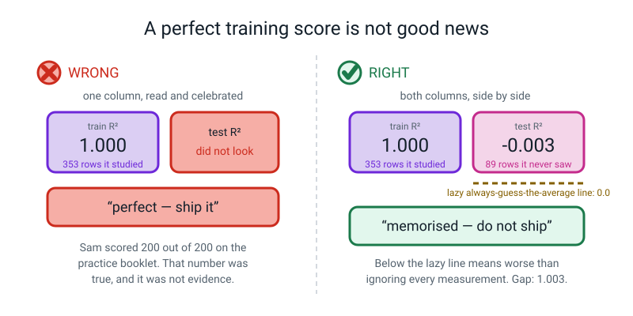
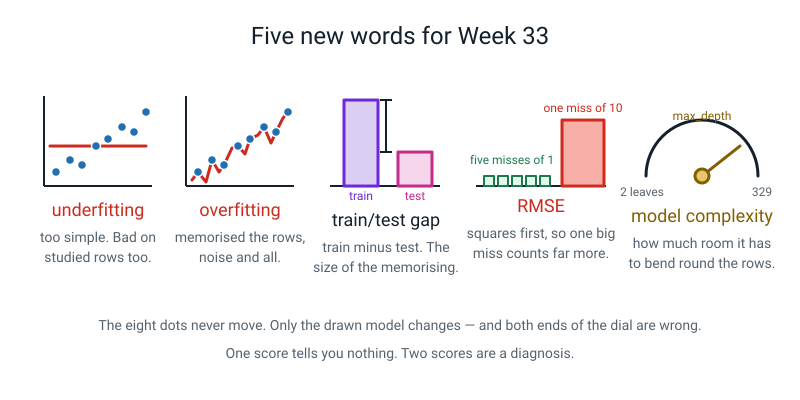

# Week 33 — Model Bake-Off and the Overfitting Cliff

[⬅ Week 32](week-32.md) · [Course Home](../README.md) · [Next ➡](week-34.md) · [Workbook](../workbook/week-33.md)

---

> ### This week in one sentence
> **A training score that climbs while the test score falls is memorising, not learning — and this week you build that exact thing on purpose, watch it score a perfect 1.000 while being no better than guessing the average on new rows, and draw the picture of it happening.**
>
> **By the end of this chapter you will be able to:**
> - Run three different models on one fixed split, changing one line each time
> - Compute RMSE and explain why it punishes big misses harder than MAE does
> - Plot the train score and the test score against depth 1 to 15 on one pair of axes
> - Mark the point where the two lines part company, and name it out loud
> - Say which model you would ship, and defend it with the numbers
>
> **New syntax this week:** `DecisionTreeRegressor(max_depth=d)` · `np.sqrt(mean_squared_error(y_true, y_pred))` · `ax.axvline(x, linestyle="--")` · `load_diabetes()`
>
> **Reading time:** about 30 minutes. **Homework:** about 60 minutes. **This is the most important chapter in Level 2.**

---

## 🪝 Start Here

Three people in a class, all sitting the same maths test on Friday. On Monday the teacher hands out a booklet of 200 practice questions **with the answers in the back**.

**Ravi** flicks through the chapter headings on Thursday night. He cannot do the practice questions and he cannot do the test. Fair enough — he never learned it.

**Priya** works through the practice questions properly. She gets stuck, unsticks herself, works out the method. She does well on the practice and she does well on the test.

**Sam** does something different. Sam memorises all 200 practice questions **and their answers**. Word for word. Question 47, answer 12. Question 48, answer minus 3. All two hundred of them.

On the practice booklet, Sam scores **200 out of 200**. Perfect. Better than Priya.

Friday comes. The test has different numbers in it.

What happens to Sam?

He falls apart. And here is the thing I want you to hold onto, because it is not obvious:

> **Sam's 200 out of 200 was not a lie.** He did not cheat. He was given the answers and he memorised them, and he really did get every single practice question right. **That number is completely true. It just isn't evidence of anything.**

Today you are going to build Sam. In code. On purpose. You will watch a model score a **perfect 1.000** on the rows it studied and then do **no better than guessing the average** on rows it has never seen. And then you are going to draw the picture of it happening, mark the exact point, and write one sentence underneath in your own handwriting.


*Figure 33.1 — Same eight points. Three models. The dots never move. Only the line does.*

> **💡 Try this before you read on.** Write ten simple sums on ten cards, answers on the back. Get somebody to memorise all ten card-by-card — not the method, the **pairs**. Test them on the same ten cards: 10 out of 10. Then produce **three new cards** they have never seen. Watch what happens. That is this entire chapter, and it takes five minutes and no computer.

---

## 🧠 The Big Idea

This section explains the ideas behind the week: how two scores diagnose a model, what the complexity dial is, what RMSE adds, and why every model must share one split.

> **📌 About the code in this section.** The blocks below are **illustrations, not files**. They show you the shape of one idea, and each one carries on from the one above it — the `import` lines and the data are typed once, in the first block that needs them. **The complete, runnable file is in 💻 Type This.** If you copy a block from this section on its own and Python says `NameError`, that is why, and nothing is broken.

### 1. Two scores, four situations, one diagnosis

**The plain explanation.** Since Week 29 you have been computing two scores — one on the rows the model learned from, one on rows it has never seen. Today those two numbers finally earn their keep, because **together** they diagnose your model. Separately, neither does.

There are exactly four possibilities.

| Train score | Test score | What it is called | What is happening | What to do |
|---|---|---|---|---|
| Low | Low | **Underfitting** | Too simple to catch the pattern | Give it **more** room |
| High | High | **Just right** | It learned the pattern | Ship it |
| **High** | **Low** | **Overfitting** | It memorised the training rows, noise and all | Give it **less** room |
| Low | High | Something is broken | Nearly always a bug, or a tiny test set and a lucky day | Go and read your code |

> **Underfitting** — the model is too simple. It gets things wrong on the rows it learned from *and* on new rows, in the same way.
>
> **Overfitting** — the model is too complicated. It has learned details of the specific training rows that do not carry over, so it does brilliantly on those and badly on everything else.
>
> **Train/test gap** — train score minus test score. Small gap: it generalises. Big gap: it is memorising.

**The analogy.** 🍕 Ravi, Priya and Sam. Row one is Ravi. Row two is Priya. Row three is Sam. **The gap is the size of the Sam problem.**

**The concrete version.** Real numbers from the file you will write in twenty minutes:

| | train R² | test R² | gap | diagnosis |
|---|---|---|---|---|
| tree, depth 1 | 0.304 | 0.131 | 0.174 | **underfitting** — both low |
| tree, depth 4 | 0.585 | 0.352 | 0.233 | **the best available here** |
| tree, depth 15 | 0.999 | 0.044 | 0.955 | **overfitting** — near-perfect, then near-nothing |

> **⚠️ Watch out:** notice that even the middle row has a gap of 0.233 and a test score of only 0.352. **On real data, "just right" is often not very good.** That is honest, and it is not a failure of the method — it is what actual data looks like.

### 2. Every model has a dial

**The plain explanation.** What made Sam Sam? He had too much **room**. He had enough memory to store 200 answers, so he stored them instead of learning the method.

> **Model complexity** — how much freedom a model has to bend itself around the data. Every model has a dial that sets it.

**The analogy.** 🍕 Suitcase size. A small case forces you to choose what matters. A gigantic case lets you take everything, including the things you will never need, and now you are dragging it all around.

**The concrete version.**

| Model | The dial | Simple end | Complex end |
|---|---|---|---|
| Decision tree | `max_depth` | 1 | no limit |
| kNN | `n_neighbors` | large `k` | **`k = 1`** |
| Linear regression | number of features | 1 feature | many features |

**Notice that kNN's dial runs backwards.** `k = 1` is the *most* complex setting, because trusting a single nearest neighbour lets the model carve any shape at all. A huge `k` is the simplest.

Remember `k = 1` scoring a perfect 1.0000 on training data back in Week 30? **That was the overfitting end of the dial all along**, and nobody said so at the time.

`max_depth` is the dial you will turn today, because a tree's is the easiest to see:

Here is how the number of leaves grows as the dial turns:

```text
 depth 1  →    2 leaves     one question, two answers
 depth 4  →   16 leaves     sixteen sensible bands
 depth 8  →  128 leaves     each leaf holds two or three patients
 depth 15 →  329 leaves     329 leaves for 353 patients. Memorised.
```


*Figure 33.2 — 329 leaves for 353 rows is a phone book. This is the picture of memorising.*

**That last line is the whole mechanism.** With 353 training patients and 329 leaves, the tree has written down a **lookup table**. It has not learned anything about the illness. It has written down these 353 people. Ask it about a 354th and it has nothing.

### 3. RMSE — a second score, and be honest about what it does

**The plain explanation.** Last week gave you MAE: add up the sizes of the misses, divide by how many. This week adds one more, because MAE cannot see something important.

> **RMSE (root mean squared error)** — square every miss, average the squares, then take the square root. Also in the units of the thing you are predicting, but it **punishes big misses much harder than small ones**.

Read the name backwards, and it is a recipe: **root** of the **mean** of the **squared errors**.

```text
RMSE = √( (miss₁² + miss₂² + ... + missₙ²) ÷ n )
```

**The analogy.** 🍕 Two bus routes to school. Route A is always three minutes late. Route B is exactly on time nine days out of ten and then, once, is **thirty minutes** late and you miss an exam. Both routes have the same *average* lateness. They are not the same bus route.

**The concrete version — the demonstration that makes it obvious.** Ten true values, two models.

- **Model A** is off by exactly **1** on every single prediction.
- **Model B** is **perfect** on nine of them and off by **10** on the tenth.

Do the MAE by hand for both:

```text
   Model A:  (1+1+1+1+1+1+1+1+1+1) ÷ 10 = 10 ÷ 10 = 1.0
   Model B:  (0+0+0+0+0+0+0+0+0+10) ÷ 10 = 10 ÷ 10 = 1.0
```

**Identical.** MAE says these two models are exactly as good as each other. Does that feel right to you?

Now square first:

```text
   Model A:  squares are 1,1,1,1,1,1,1,1,1,1   → mean 1  → √1  = 1.000
   Model B:  squares are 0,0,0,0,0,0,0,0,0,100 → mean 10 → √10 = 3.162
```

Confirmed by running it:

```text
Model A: errors [1 1 1 1 1 1 1 1 1 1]  MAE 1.0000  RMSE 1.0000
Model B: errors [ 0  0  0  0  0  0  0  0  0 10]  MAE 1.0000  RMSE 3.1623
```

**Same MAE. RMSE more than three times apart.** Because 10 squared is **100**, and ten separate 1s only add up to 10.

**So which model is better?** It depends entirely on **what a big miss costs you.**

- A calculator working out a **medicine dose**? Model A. One unit out every time is annoying, correctable and survivable. Ten units too many, once, can be dangerous.
- A **weekly grocery-bill estimate** in a budgeting app? Model B. It nails nine weeks out of ten, and the one bad week was the birthday party, which the user can explain to themselves instantly. Model A is wrong *every single week*, so the app never once feels right.

> **The metric encodes what you think "bad" means, so choose it on purpose.** You do not pick a metric because it is the nice one. You pick it because of what you are afraid of.

> **⚠️ Watch out — do not overclaim.** It is tempting to say "RMSE tells you the worst miss". **It does not**, and this week's own numbers will catch you out.
>
> On our data, linear regression has a **worse** single worst miss than kNN (154.49 against 138.80) and yet a **lower** RMSE (53.85 against 54.95). That is because kNN has **nine** misses over 100 and linear has only **five**.
>
> RMSE is about the whole *tail* of big misses, not one champion. The honest sentence is: **"RMSE goes up faster than MAE when there are big misses."** Say that and nothing more.

**The habit, and it costs nothing: print MAE, RMSE and the worst single miss.** Three numbers, and it becomes very hard for anybody — including you — to be fooled.

### 4. One split, shared by everybody. That is the whole fairness of a bake-off

**The plain explanation.** A **bake-off** is running several models on the same data and putting the scores in one table. There is exactly one rule that makes it fair, and it is this:

> **Make the split once, at the top of the file. Never make it again.**

**The analogy.** 🍕 A running race. Everybody runs **the same track**, on the same day, in the same weather. If you let one runner pick their own track, the times mean nothing — and the runner who picked will not necessarily know they had it easier.

**The concrete version.** Today's data is `load_diabetes()`, which ships inside scikit-learn. **442 real patients**, 10 measurements each — age, sex, body mass index, blood pressure and six blood measurements — and the answer column is how far the illness had progressed one year later, on a scale from 25 to 346.

Three things to know before you meet it:

- **It is real, and real data is much noisier than flowers.** The best R² anybody gets today is about **0.45**. Iris gave you 0.9667 accuracy. That drop is the point, not a disappointment.
- **The measurements arrived already scaled**, by whoever prepared the dataset. So there is no `StandardScaler` in today's file even though we use kNN. That is not an oversight. If you remembered Week 30 and wondered about it, that is an excellent catch.
- **The answer has no everyday unit.** It is "progression points". So an MAE of 42.77 cannot be turned into anything a person feels. What saves it is the **lazy baseline**: guessing the average is off by 64.01, so 42.77 is *a third better than not bothering*.


*Figure 33.3 — One split. Three models. One table. Fairness is one sentence: every model saw the same 353 rows.*

### 5. The picture: one line climbs, the other turns round

**The plain explanation.** Turn the dial from 1 to 15. At each setting, fit a **fresh** model, and record **both** scores. Then plot both against the dial setting.

**The recipe, and step 1 is not optional:**

1. Fix **one** train/test split, **before** the loop.
2. For each setting, fit a **fresh** model.
3. Record **both** the train score and the test score.
4. Plot both against the setting.
5. The setting with the highest **test** score is your answer.

**The concrete version.** Here is what comes out:

```text
depth  leaves  train R2  test R2     gap
    1       2     0.304    0.131   0.174
    2       4     0.447    0.295   0.152
    3       8     0.517    0.329   0.188
    4      16     0.585    0.352   0.233
    5      31     0.669    0.260   0.408
    6      55     0.747    0.221   0.526
    7      91     0.813    0.188   0.624
    8     128     0.873    0.186   0.688
    9     176     0.914    0.283   0.631
   10     221     0.938    0.117   0.821
   11     255     0.961    0.151   0.810
   12     280     0.982    0.115   0.866
   13     298     0.992    0.176   0.816
   14     314     0.996    0.132   0.864
   15     329     0.999    0.044   0.955
```


*Figure 33.4 — One climbs. One turns round. A rising train line is not evidence; it always rises.*

**Read it column by column. This is the heart of the year.**

**`train R2` never once goes down.** 0.304 → 0.999, fifteen steps, every one of them upward. And that is not luck — it is **guaranteed**. A deeper tree has every question a shallower one had, **plus more**, so it can always do at least as well on the rows it learned from; it can choose not to use its extra freedom.

> **A number that can only go up cannot tell you whether you improved anything.** The train column is arithmetic dressed up as achievement. **It is not evidence.**

**`test R2` rises to a peak at depth 4 (0.352), then falls apart** — all the way down to 0.044 by depth 15. Depths 1 to 3 are **underfitting**: too few questions to describe 442 patients. Depths 5 to 15 are **overfitting**.

**The `gap` column tells the story in one number.** 0.152 at depth 2. **0.955** at depth 15. That 0.955 is exactly how much of the tree's apparent performance is memorisation and nothing else.

**The `leaves` column is the mechanism.** 2 leaves at depth 1. **329 leaves for 353 training patients** at depth 15. Almost every patient with their own private leaf and their own private answer.

> **⚠️ Watch out — the wobbles are real and you must not over-read them.** The test line does not fall smoothly. It goes 0.352, 0.260, 0.221, 0.188, 0.186, then jumps back **up** to 0.283 at depth 9, then drops to 0.117.
>
> With 89 test patients, **one patient is worth roughly 0.01 of R²**, so a jump of 0.1 is about ten patients changing sides. Look at the **trend across fifteen steps**, not the step-to-step wobble. Also look at the `gap` column, which grows from 0.174 to 0.955 and never recovers.


*Figure 33.5 — Mark the peak. Then say it out loud: after here it is memorising.*

**And one piece of honesty you must write down.** Choosing depth 4 by looking at the test scores means **the test set influenced a decision.** You looked at those 89 patients fifteen times and picked the best-looking answer, so the score at depth 4 is a little flattering.

That is not a reason to avoid the method — it is the best method available with 442 rows. It is a reason to write the caveat next to the number, in these words:

> *"I chose the depth by looking at the test curve, so this score is slightly optimistic."*

The professional fix is called **cross-validation** and it is waiting for you in Level 3. This year, honesty in writing is the fix.

---

## 💻 Type This

In this section you type two programs, one step at a time. `week33_bakeoff.py` comes first, then `week33_depth_curve.py`.

### Step 1 — One split, and the comment that makes it fair

New file, `week33_bakeoff.py`:

```python
# week33_bakeoff.py  -  three models, ONE split, one table.

import numpy as np
from sklearn.datasets import load_diabetes                # NEW: 442 real patients
from sklearn.model_selection import train_test_split

data = load_diabetes()
X = data.data                 # 10 measurements per patient
y = data.target               # how much the illness advanced in a year
print("rows and columns:", X.shape)
print("the answer runs from", y.min(), "to", y.max())

# ---- ONE split. Made once, here, at the top. Never made again. ----------
X_train, X_test, y_train, y_test = train_test_split(
    X, y, test_size=0.2, random_state=42)
print("train rows:", len(X_train), " test rows:", len(X_test))
```

- `load_diabetes()` — a real dataset that ships inside scikit-learn, exactly like `load_iris()`. Nothing is downloaded.
- `data.data` and `data.target` — the same `X` and `y` split you have used since Week 28.
- **Type that comment out in full.** It is not decoration. That sentence being true is the entire fairness of what follows.

```text
rows and columns: (442, 10)
the answer runs from 25.0 to 346.0
train rows: 353  test rows: 89
```

### Step 2 — RMSE, and the tutorial that stopped working

Add this:

```python
# add to week33_bakeoff.py
from sklearn.metrics import mean_absolute_error, mean_squared_error, r2_score
from sklearn.linear_model import LinearRegression

model = LinearRegression().fit(X_train, y_train)
guesses = model.predict(X_test)
print("MAE :", round(mean_absolute_error(y_test, guesses), 2))
print("RMSE:", round(mean_squared_error(y_test, guesses, squared=False), 2))
```

Run it. It breaks:

```text
Traceback (most recent call last):
  File "/Users/you/project/week33_bakeoff.py", line 19, in <module>
    print("RMSE:", round(mean_squared_error(y_test, guesses, squared=False), 2))
  ...
TypeError: got an unexpected keyword argument 'squared'
```

**I made you type that on purpose, and not to be annoying.**

If you search the internet for *"how do I get RMSE in scikit-learn"*, `squared=False` is what you will find, in about a thousand places. **It used to work. It has been removed.**

That is a thing that will happen to you for the rest of your life with code: the internet is full of instructions that were true once. And the error message is how you find out.

> **The error is more up to date than the tutorial.**

So do it the way that will always work:

```python
# replace that RMSE line with:
print("RMSE:", round(np.sqrt(mean_squared_error(y_test, guesses)), 2))
```

```text
MAE : 42.79
RMSE: 53.85
```

- `mean_squared_error(...)` gives you the average of the **squared** misses.
- `np.sqrt(...)` — Week 28's square root — brings it back into the answer's own units.
- Read the name backwards: **root**, of the **mean**, of the **squared errors**.

### Step 3 — One function, so the models cannot be scored differently

We could copy-paste that scoring block for each model. **Do not.** Here is why.

If you write the scoring out four separate times, sooner or later you will type `y_train` where you meant `y_test` in **exactly one** of them, and **it will not error**. It will print a nicer number for that one model and you will believe it.

**One function makes it impossible to score two models differently by accident.** That is not tidiness. That is fairness.

Add this function to `week33_bakeoff.py`:

```python
# add to week33_bakeoff.py
def report(name, model):
    """Fit a model on the SAME train rows, score it on the SAME test rows."""
    model.fit(X_train, y_train)
    guesses = model.predict(X_test)
    mae = mean_absolute_error(y_test, guesses)
    rmse = np.sqrt(mean_squared_error(y_test, guesses))   # root of the mean square
    print(f"{name:22s} {mae:7.2f} {rmse:7.2f} "
          f"{r2_score(y_test, guesses):9.3f} {model.score(X_train, y_train):10.3f}")
```

- `def report(name, model):` — a function from Weeks 9 and 10. It takes a label and an unfitted model.
- `f"{mae:7.2f}"` — an f-string from Week 3, with a width of 7 and 2 decimals so the columns line up.
- `model.score(X_train, y_train)` — for a regressor, `.score()` gives R². Same call as Week 29, different meaning behind it.

### Step 4 — The lazy baseline, and the four entries

Add the two imports at the top of the file and the baseline plus four model lines at the bottom.

```python
# add to the top of week33_bakeoff.py
from sklearn.neighbors import KNeighborsRegressor         # week 29's kNN, for numbers
from sklearn.tree import DecisionTreeRegressor            # week 31's tree, for numbers

# add at the bottom of week33_bakeoff.py
print(f"{'model':22s} {'MAE':>7s} {'RMSE':>7s} {'test R2':>9s} {'train R2':>10s}")

# the laziest model there is: ignore all 10 columns, always say the training mean
lazy = np.zeros(len(y_test)) + y_train.mean()
print(f"{'always guess the mean':22s} "
      f"{mean_absolute_error(y_test, lazy):7.2f} "
      f"{np.sqrt(mean_squared_error(y_test, lazy)):7.2f} "
      f"{r2_score(y_test, lazy):9.3f} {0.0:10.3f}")

report("kNN, k = 5", KNeighborsRegressor(n_neighbors=5))
report("tree, max_depth=5", DecisionTreeRegressor(max_depth=5, random_state=0))
report("tree, no limit", DecisionTreeRegressor(random_state=0))
report("linear regression", LinearRegression())
```

**Look at those two new imports.** `KNeighborsRegressor` and `DecisionTreeRegressor` — the exact tools from Weeks 29 and 31 with **`Regressor`** on the end instead of `Classifier`, because the answer is a number now.

- kNN's five nearest neighbours **average** their numbers instead of voting on a species.
- The tree asks identical yes/no questions, and each leaf holds the **average** of the training rows that landed there instead of a species name. That is why a tree's predictions come in a fixed set of steps — one value per leaf — and why **a tree can never draw a smooth diagonal.**
- `np.zeros(len(y_test)) + y_train.mean()` — the lazy baseline. `np.zeros` (Week 18) makes 89 zeros, and adding one number to an array adds it to every slot (Week 18 again). So this is "guess the training average for all 89 patients". Note it is the **training** mean — using the test mean would be peeking.

```text
model                      MAE    RMSE   test R2   train R2
always guess the mean    64.01   73.22    -0.012      0.000
kNN, k = 5               42.77   54.95     0.430      0.584
tree, max_depth=5        48.15   62.60     0.260      0.669
tree, no limit           56.57   72.90    -0.003      1.000
linear regression        42.79   53.85     0.453      0.528
```

### Step 5 — Read the table. Slow down. This is the summit of the term

In this step you read the results table row by row. Run the previous step first and compare your table with the one above.

**Put your finger on the row that says `tree, no limit` and read the last two numbers.**

```text
tree, no limit           56.57   72.90    -0.003      1.000
```

**Train R² one point zero zero zero.** Not 0.99. **Perfect.** On the 353 patients it learned from, that tree is never wrong. Not once. Out of 353.

**Test R² minus nought point nought nought three.** Negative.

What does a negative R² mean? Look up at the baseline row. R² of **zero** means "no better than ignoring everything and guessing the average". So negative means…

**Worse than guessing the average of the test rows. And a model that has learned nothing useful lands at about zero, or just under it.** (Look at the baseline row: it scores −0.012, not exactly 0, because it guesses the *training* average.)

A model with ten measurements, hundreds of learned rules, and a perfect score on its homework — and on new patients it is no better than a machine that ignores every measurement and says 153 for everybody. Its −0.003 is level with that machine's −0.012.

**That is Sam.** In numbers you generated yourself, on your own laptop, in a tenth of a second.

Now look at the **two trees together.**

| | train R² | test R² | gap |
|---|---|---|---|
| tree, max_depth=5 | 0.669 | 0.260 | 0.409 |
| tree, no limit | **1.000** | **−0.003** | **1.003** |

**We made the training score better and the model worse.** Which is why: **the training score is not evidence.**

**Three more things in that table.**

1. **The baseline row is what makes every other number mean something.** MAE 64.01 by guessing the average. So kNN's 42.77 is not "off by 42.77", it is **"a third less wrong than not bothering"**. Without the baseline, 42.77 is a number with nothing to stand on. That is Level 1's Week 12 lesson, computing the ruler before you measure with it, arriving in code.
2. **MAE and RMSE disagree, and that is the interesting bit.** See the small table below.
3. **The tree lost, and that is honest.** Test R² 0.260 against the line's 0.453. **Trees are not the best tool for everything.** A likely reason (we did not test it) is that this dataset is smooth medical measurements with no obvious sudden thresholds in it. That is the shape a straight line handles well and a staircase handles badly.

Here is the MAE and RMSE comparison:

| | MAE | RMSE |
|---|---|---|
| kNN, k = 5 | **42.77** | 54.95 |
| linear regression | 42.79 | **53.85** |

On MAE they are a dead heat: two hundredths apart, on a scale running to 346. On RMSE, the line wins. Why? Because **kNN has nine misses over 100 and the line has only five.** RMSE squares the misses, so the extra big ones weigh heavily.

Typical performance: identical. Big-miss behaviour: the line is better. **MAE could not see that. RMSE could.** That is why you print both.

The tree still wins on one thing: **you can read it.** And this is the week you find out what that costs.

### Step 6 — The depth loop (a second file), with one bug on purpose

New file, `week33_depth_curve.py`. Type it with `tree.fit(...)` deliberately **left out**:

```python
# week33_depth_curve.py  -  turn the depth dial 1 to 15 and watch both scores.

import numpy as np
import matplotlib.pyplot as plt
from sklearn.datasets import load_diabetes
from sklearn.model_selection import train_test_split
from sklearn.tree import DecisionTreeRegressor

data = load_diabetes()
X = data.data
y = data.target

# ONE split, made BEFORE the loop. If you split inside the loop you are
# measuring shuffling luck, not depth.
X_train, X_test, y_train, y_test = train_test_split(
    X, y, test_size=0.2, random_state=42)

depths = []          # the dial setting
train_scores = []    # score on rows it learned from
test_scores = []     # score on rows it has never seen
leaf_counts = []     # how many final answers the tree has

for depth in range(1, 16):                    # 1, 2, 3 ... 15
    tree = DecisionTreeRegressor(max_depth=depth, random_state=0)
    depths.append(depth)
    train_scores.append(tree.score(X_train, y_train))
```

```text
Traceback (most recent call last):
  File "/Users/you/project/week33_depth_curve.py", line 22, in <module>
    train_scores.append(tree.score(X_train, y_train))
  ...
sklearn.exceptions.NotFittedError: This DecisionTreeRegressor instance is not fitted yet. Call 'fit' with appropriate arguments before using this estimator.
```

**`not fitted yet`.** You built a brand-new tree and asked it how it did, before it had learned anything.

And here is why that error is worth having: **we build a brand-new tree every single time round this loop.** Fifteen trees. Which means fifteen separate `fit` calls. If you build the tree **once, outside** the loop, and only change the depth, you do not get fifteen trees — you get one tree fifteen times, and your curve comes out flat.

Add the fit and the rest of the loop:

```python
    tree.fit(X_train, y_train)                # a FRESH tree every time round
    test_scores.append(tree.score(X_test, y_test))
    leaf_counts.append(tree.get_n_leaves())
```

- `for depth in range(1, 16):` — 1 up to and including 15. `range` stops one short, from Week 7.
- `DecisionTreeRegressor(max_depth=depth, ...)` — **inside** the loop, so it is a brand-new tree at each setting.
- `tree.get_n_leaves()` — how many final answers this tree has. This column is the **mechanism**, and it is the one that makes the lesson concrete.

### Step 7 — Print the table and find the peak

Add this to the end of `week33_depth_curve.py` and run it.

```python
# add to week33_depth_curve.py
print(f"{'depth':>5} {'leaves':>7} {'train R2':>9} {'test R2':>8} {'gap':>7}")
for i in range(len(depths)):
    gap = train_scores[i] - test_scores[i]
    print(f"{depths[i]:5d} {leaf_counts[i]:7d} {train_scores[i]:9.3f} "
          f"{test_scores[i]:8.3f} {gap:7.3f}")

best_depth = depths[int(np.argmax(test_scores))]     # the PEAK of the test line
print()
print("best test R2 was", round(max(test_scores), 3), "at max_depth =", best_depth)
print("training rows:", len(X_train), " leaves at depth 15:", leaf_counts[-1])
```

- `int(np.argmax(test_scores))` — `argmax` gives the **position** of the biggest number in a list, not the number itself. Position 3 is depth 4, because positions start at 0.
- `leaf_counts[-1]` — the last one, using Week 11's negative index.

```text
depth  leaves  train R2  test R2     gap
    1       2     0.304    0.131   0.174
    2       4     0.447    0.295   0.152
    3       8     0.517    0.329   0.188
    4      16     0.585    0.352   0.233
    5      31     0.669    0.260   0.408
    6      55     0.747    0.221   0.526
    7      91     0.813    0.188   0.624
    8     128     0.873    0.186   0.688
    9     176     0.914    0.283   0.631
   10     221     0.938    0.117   0.821
   11     255     0.961    0.151   0.810
   12     280     0.982    0.115   0.866
   13     298     0.992    0.176   0.816
   14     314     0.996    0.132   0.864
   15     329     0.999    0.044   0.955

best test R2 was 0.352 at max_depth = 4
training rows: 353  leaves at depth 15: 329
```

**Get four coloured pens and mark this table up on paper.** It is worth more than another twenty lines of code.

| Pen | What to mark | What you should be able to say |
|---|---|---|
| 1 | The whole **`train R2`** column, top to bottom | "It never goes down. Not once, in fifteen steps." |
| 2 | The single biggest number in **`test R2`** | "0.352, at depth 4." |
| 3 | The **first** and **last** numbers in **`gap`** | "0.174 up to 0.955." |
| 4 | The **last** number in **`leaves`**, and `training rows: 353` | "329 leaves for 353 patients." |

### Step 8 — The chart, and the vertical line

Add this to the end of `week33_depth_curve.py` and run it.

```python
# add to week33_depth_curve.py
fig, ax = plt.subplots(figsize=(8, 5))
ax.plot(depths, train_scores, marker="o", label="train R2 (rows it learned from)")
ax.plot(depths, test_scores, marker="s", label="test R2 (rows it never saw)")
ax.axvline(best_depth, linestyle="--", color="green")     # NEW: mark the peak
ax.set_title("After depth 4 the tree is memorising, not learning")
ax.set_xlabel("max_depth (how many questions the tree may ask)")
ax.set_ylabel("R2  (1.0 = perfect, 0.0 = no better than the mean)")
ax.set_ylim(-0.2, 1.05)
ax.legend()
fig.savefig("week33_depth_curve.png", dpi=120, bbox_inches="tight")
print("saved week33_depth_curve.png")
```

```text
saved week33_depth_curve.png
```

- `ax.axvline(best_depth, linestyle="--", color="green")` — one **vertical** line straight across the chart at that x value. `linestyle="--"` makes it dashed, so nobody ever mistakes it for data. Every solid line on that chart is a series of measurements; the dashed one is an annotation you added.
- All of Week 25's rules hold in full: a title, **both** axis labels, and a legend because there are two series.

> **💡 Try this:** `ax.set_ylim(-0.2, 1.05)` matters much more than it looks. Take it out and matplotlib zooms to fit, the test line fills the frame, and the **distance between the two lines stops being visible**. The gap is the whole story. Do not let the axes hide it.

Open the PNG. One line climbs to almost 1.0 and stays there. One rises to depth 4 and then sags.

**Now do it again on paper.** Two colours, fifteen points each, plotted by hand from the printed table. Then a ruler, straight down at depth 4, and next to it, **in your own handwriting**:

```text
   after here it is memorising
```

Then say it out loud, pointing at the line. That is not a decoration. It is the sentence this whole term has been building towards, and writing it in your own hand next to a line you drew yourself is what makes it stick.

### The complete finished programs

Use these to check your own files line by line. Each program is followed by the output it printed.

**File 1 — `week33_bakeoff.py`:**

```python
# week33_bakeoff.py  -  three models, ONE split, one table.

import numpy as np
from sklearn.datasets import load_diabetes                # NEW: 442 real patients
from sklearn.model_selection import train_test_split
from sklearn.neighbors import KNeighborsRegressor         # week 29's kNN, for numbers
from sklearn.tree import DecisionTreeRegressor            # week 31's tree, for numbers
from sklearn.linear_model import LinearRegression         # week 32's line
from sklearn.metrics import mean_absolute_error, mean_squared_error, r2_score

data = load_diabetes()
X = data.data                 # 10 measurements per patient
y = data.target               # how much the illness advanced in a year
print("rows and columns:", X.shape)
print("the answer runs from", y.min(), "to", y.max())

# ---- ONE split. Made once, here, at the top. Never made again. ----------
X_train, X_test, y_train, y_test = train_test_split(
    X, y, test_size=0.2, random_state=42)
print("train rows:", len(X_train), " test rows:", len(X_test))
print()


def report(name, model):
    """Fit a model on the SAME train rows, score it on the SAME test rows."""
    model.fit(X_train, y_train)
    guesses = model.predict(X_test)
    mae = mean_absolute_error(y_test, guesses)
    rmse = np.sqrt(mean_squared_error(y_test, guesses))   # NEW: root of the mean square
    print(f"{name:22s} {mae:7.2f} {rmse:7.2f} "
          f"{r2_score(y_test, guesses):9.3f} {model.score(X_train, y_train):10.3f}")


print(f"{'model':22s} {'MAE':>7s} {'RMSE':>7s} {'test R2':>9s} {'train R2':>10s}")

# the laziest model there is: ignore all 10 columns, always say the training mean
lazy = np.zeros(len(y_test)) + y_train.mean()
print(f"{'always guess the mean':22s} "
      f"{mean_absolute_error(y_test, lazy):7.2f} "
      f"{np.sqrt(mean_squared_error(y_test, lazy)):7.2f} "
      f"{r2_score(y_test, lazy):9.3f} {0.0:10.3f}")

report("kNN, k = 5", KNeighborsRegressor(n_neighbors=5))
report("tree, max_depth=5", DecisionTreeRegressor(max_depth=5, random_state=0))
report("tree, no limit", DecisionTreeRegressor(random_state=0))
report("linear regression", LinearRegression())
```

```text
rows and columns: (442, 10)
the answer runs from 25.0 to 346.0
train rows: 353  test rows: 89

model                      MAE    RMSE   test R2   train R2
always guess the mean    64.01   73.22    -0.012      0.000
kNN, k = 5               42.77   54.95     0.430      0.584
tree, max_depth=5        48.15   62.60     0.260      0.669
tree, no limit           56.57   72.90    -0.003      1.000
linear regression        42.79   53.85     0.453      0.528
```

**File 2 — `week33_depth_curve.py`:**

```python
# week33_depth_curve.py  -  turn the depth dial 1 to 15 and watch both scores.

import numpy as np
import matplotlib.pyplot as plt
from sklearn.datasets import load_diabetes
from sklearn.model_selection import train_test_split
from sklearn.tree import DecisionTreeRegressor

data = load_diabetes()
X = data.data
y = data.target

# ONE split, made BEFORE the loop. If you split inside the loop you are
# measuring shuffling luck, not depth.
X_train, X_test, y_train, y_test = train_test_split(
    X, y, test_size=0.2, random_state=42)

depths = []          # the dial setting
train_scores = []    # score on rows it learned from
test_scores = []     # score on rows it has never seen
leaf_counts = []     # how many final answers the tree has

for depth in range(1, 16):                    # 1, 2, 3 ... 15
    tree = DecisionTreeRegressor(max_depth=depth, random_state=0)
    tree.fit(X_train, y_train)                # a FRESH tree every time round
    depths.append(depth)
    train_scores.append(tree.score(X_train, y_train))
    test_scores.append(tree.score(X_test, y_test))
    leaf_counts.append(tree.get_n_leaves())

print(f"{'depth':>5} {'leaves':>7} {'train R2':>9} {'test R2':>8} {'gap':>7}")
for i in range(len(depths)):
    gap = train_scores[i] - test_scores[i]
    print(f"{depths[i]:5d} {leaf_counts[i]:7d} {train_scores[i]:9.3f} "
          f"{test_scores[i]:8.3f} {gap:7.3f}")

best_depth = depths[int(np.argmax(test_scores))]     # the PEAK of the test line
print()
print("best test R2 was", round(max(test_scores), 3), "at max_depth =", best_depth)
print("training rows:", len(X_train), " leaves at depth 15:", leaf_counts[-1])

fig, ax = plt.subplots(figsize=(8, 5))
ax.plot(depths, train_scores, marker="o", label="train R2 (rows it learned from)")
ax.plot(depths, test_scores, marker="s", label="test R2 (rows it never saw)")
ax.axvline(best_depth, linestyle="--", color="green")     # NEW: mark the peak
ax.set_title("After depth 4 the tree is memorising, not learning")
ax.set_xlabel("max_depth (how many questions the tree may ask)")
ax.set_ylabel("R2  (1.0 = perfect, 0.0 = no better than the mean)")
ax.set_ylim(-0.2, 1.05)
ax.legend()
fig.savefig("week33_depth_curve.png", dpi=120, bbox_inches="tight")
print("saved week33_depth_curve.png")
```

```text
depth  leaves  train R2  test R2     gap
    1       2     0.304    0.131   0.174
    2       4     0.447    0.295   0.152
    3       8     0.517    0.329   0.188
    4      16     0.585    0.352   0.233
    5      31     0.669    0.260   0.408
    6      55     0.747    0.221   0.526
    7      91     0.813    0.188   0.624
    8     128     0.873    0.186   0.688
    9     176     0.914    0.283   0.631
   10     221     0.938    0.117   0.821
   11     255     0.961    0.151   0.810
   12     280     0.982    0.115   0.866
   13     298     0.992    0.176   0.816
   14     314     0.996    0.132   0.864
   15     329     0.999    0.044   0.955

best test R2 was 0.352 at max_depth = 4
training rows: 353  leaves at depth 15: 329
saved week33_depth_curve.png
```

---

## 🔍 Worked Examples

Three small examples that use the same ideas on new data: a pizza shop, a cricket side and a class of pupils.
### Worked Example 1 — Two delivery rules (food)

Eight pizza orders, with the real delivery times. Two rules for guessing them.

```python
# delivery_two_rules.py
# Eight pizza orders. Two rules for guessing the delivery time.
import numpy as np
from sklearn.metrics import mean_absolute_error, mean_squared_error

pizzas       = np.array([1,  2,  3,  4,  5,  6,  7,  8])
real_minutes = np.array([14, 17, 20, 22, 26, 28, 31, 34])

rule_a = real_minutes + 2          # always two minutes late
rule_b = real_minutes.copy()
rule_b[5] = real_minutes[5] + 16   # spot on seven times, sixteen minutes out once

for name, guess in [("Rule A", rule_a), ("Rule B", rule_b)]:
    misses = np.abs(real_minutes - guess)
    print(f"{name}: misses {misses}")
    print(f"        MAE  {mean_absolute_error(real_minutes, guess):6.3f} minutes")
    print(f"        RMSE {np.sqrt(mean_squared_error(real_minutes, guess)):6.3f} minutes")
    print(f"        worst single miss {misses.max():3d} minutes")
```

```text
Rule A: misses [2 2 2 2 2 2 2 2]
        MAE   2.000 minutes
        RMSE  2.000 minutes
        worst single miss   2 minutes
Rule B: misses [ 0  0  0  0  0 16  0  0]
        MAE   2.000 minutes
        RMSE  5.657 minutes
        worst single miss  16 minutes
```

**Identical MAE — 2.000 minutes each.** MAE cannot tell these two rules apart at all.

**RMSE says they are nearly three times apart.** 2.000 against 5.657, because 16 squared is 256 and eight separate 2s only add up to 32.

**Which rule should the pizza shop use?** Rule B, almost certainly. Seven orders arriving exactly when promised and one arriving sixteen minutes late is a much better customer experience than *every single order* being two minutes late. A hungry person forgives one bad night and remembers a shop that is never right.

**Now change one thing about the situation.** Suppose this is not pizza but a **hospital's estimate of how long an operation will take**, and the theatre is booked in blocks. Being two minutes out every time is nothing. Being sixteen minutes out once means the next operation gets bumped and somebody's day collapses. **Now Rule A wins.**

Same two numbers. Same MAE. Same RMSE. Different answer — because *what a big miss costs* changed. **The metric does not decide for you. It only makes the difference visible.**

### Worked Example 2 — Sam, in a completely different model (sport)

Twenty innings. Balls faced → runs scored. This time we turn **kNN's** dial instead of a tree's — and remember, kNN's dial runs **backwards**.

```python
# cricket_k_dial.py
# Twenty innings. Balls faced -> runs scored. Turn kNN's dial instead.
import numpy as np
from sklearn.model_selection import train_test_split
from sklearn.neighbors import KNeighborsRegressor

balls = np.array([8, 12, 15, 18, 22, 25, 28, 32, 35, 38,
                  42, 45, 48, 52, 55, 58, 62, 65, 70, 74]).reshape(-1, 1)
runs = np.array([5, 14, 9, 21, 16, 30, 19, 34, 24, 41,
                 28, 47, 33, 52, 36, 58, 40, 63, 45, 71])

# ONE split, made once, before the loop.
balls_train, balls_test, runs_train, runs_test = train_test_split(
    balls, runs, test_size=0.25, random_state=42)
print("train innings:", len(balls_train), " test innings:", len(balls_test))
print()
print(f"{'k':>3} {'train R2':>9} {'test R2':>8} {'gap':>7}")
for k in range(1, 10):
    knn = KNeighborsRegressor(n_neighbors=k)
    knn.fit(balls_train, runs_train)
    train_r2 = knn.score(balls_train, runs_train)
    test_r2 = knn.score(balls_test, runs_test)
    print(f"{k:3d} {train_r2:9.3f} {test_r2:8.3f} {train_r2 - test_r2:7.3f}")
```

```text
train innings: 15  test innings: 5

  k  train R2  test R2     gap
  1     1.000    0.512   0.488
  2     0.723    0.599   0.124
  3     0.637    0.792  -0.155
  4     0.665    0.708  -0.043
  5     0.657    0.709  -0.052
  6     0.578    0.656  -0.078
  7     0.567    0.644  -0.077
  8     0.546    0.596  -0.050
  9     0.479    0.515  -0.035
```

**Look at `k = 1`. Train R² is a perfect 1.000.**

**Why?** Because with `k = 1` every training innings is **its own nearest neighbour**. Asked about an innings it has already seen, it finds that exact innings sitting at distance zero and reports its answer back perfectly. It is a lookup table with extra steps.

**You have just found Sam in a completely different model.** Not a tree. Not a depth. Same behaviour, same shape, and the gap of 0.488 gives it away.

**And notice something else, because it is a genuinely useful accident.** From `k = 3` downwards the **gap goes negative** — the model does *better* on rows it never saw than on rows it studied. That is **row four of the diagnosis table**, the "something is broken" row. Here nothing is broken: our test pile is **five innings**. Five. With five rows, one lucky innings moves the score enormously.

**That is the lesson row four is really about.** A negative gap almost always means *"your test set is too small to trust this number"*, and the honest response is to say so rather than to celebrate. Peak test R² at `k = 3` (0.792) sitting next to `k = 5` at 0.709 is very likely **one innings**, not a discovery.

### Worked Example 3 — A full bake-off on your own numbers (school)

Twenty pupils. Two measurements — minutes revised per week and lessons missed this term — and the exam mark to predict.

```python
# marks_bakeoff.py
# Twenty pupils. Predict the exam mark from revision minutes and lessons missed.
import numpy as np
from sklearn.model_selection import train_test_split
from sklearn.neighbors import KNeighborsRegressor
from sklearn.tree import DecisionTreeRegressor
from sklearn.linear_model import LinearRegression
from sklearn.metrics import mean_absolute_error, mean_squared_error, r2_score

# [minutes revised per week, lessons missed this term]
measures = np.array([
    [30, 6], [45, 4], [60, 5], [75, 2], [90, 3], [105, 1], [120, 0],
    [40, 7], [55, 3], [70, 4], [85, 1], [100, 2], [115, 3], [130, 1],
    [35, 5], [50, 2], [65, 6], [80, 0], [95, 4], [110, 2],
])
marks = np.array([41, 52, 55, 68, 66, 79, 84,
                  44, 61, 58, 74, 72, 70, 82,
                  47, 63, 53, 77, 65, 76])

# ---- ONE split. Made once, here. Never made again. ----
X_train, X_test, y_train, y_test = train_test_split(
    measures, marks, test_size=0.25, random_state=42)
print("train pupils:", len(X_train), " test pupils:", len(X_test))
print()


def report(name, model):
    model.fit(X_train, y_train)
    guesses = model.predict(X_test)
    mae = mean_absolute_error(y_test, guesses)
    rmse = np.sqrt(mean_squared_error(y_test, guesses))
    print(f"{name:22s} {mae:7.2f} {rmse:7.2f} "
          f"{r2_score(y_test, guesses):9.3f} {model.score(X_train, y_train):10.3f}")


print(f"{'model':22s} {'MAE':>7s} {'RMSE':>7s} {'test R2':>9s} {'train R2':>10s}")
lazy = np.zeros(len(y_test)) + y_train.mean()
print(f"{'always guess the mean':22s} "
      f"{mean_absolute_error(y_test, lazy):7.2f} "
      f"{np.sqrt(mean_squared_error(y_test, lazy)):7.2f} "
      f"{r2_score(y_test, lazy):9.3f} {0.0:10.3f}")
report("kNN, k = 3", KNeighborsRegressor(n_neighbors=3))
report("tree, max_depth=2", DecisionTreeRegressor(max_depth=2, random_state=0))
report("tree, no limit", DecisionTreeRegressor(random_state=0))
report("linear regression", LinearRegression())
```

```text
train pupils: 15  test pupils: 5

model                      MAE    RMSE   test R2   train R2
always guess the mean    11.72   14.08    -0.382      0.000
kNN, k = 3                7.73    8.56     0.489      0.924
tree, max_depth=2         7.38    9.04     0.430      0.927
tree, no limit            8.40   10.06     0.294      1.000
linear regression         1.67    2.05     0.971      0.989
```

**Four things to read off that table.**

**One — the unlimited tree hits 1.000 again.** Different data, different subject, same behaviour: train 1.000, test 0.294, gap 0.706. This is not a quirk of the diabetes patients. **It is what "no limit" means.**

**Two — linear regression wins by a mile here**, where on the diabetes data it only won narrowly. MAE **1.67 marks** against the lazy baseline's 11.72, and a gap of only 0.018 between train and test. Why so good? Because I built this table so that marks really do go up smoothly with revision and down smoothly with missed lessons — and **a smooth relationship is exactly the shape a line is good at.** A different table, with a sharp threshold in it, would put the tree on top.

**Three — the baseline R² is negative: −0.382.** Guessing the training average is *worse than useless* on these five test pupils, because those five happened to sit unusually far from the training average. **With five test rows, that happens.** Which brings us to:

**Four — five test pupils is not enough to be confident about anything.** kNN at 0.489 and the tree at 0.430 are separated by less than one pupil's worth of score. The honest write-up says: *"linear regression is clearly ahead; the middle two are too close to separate on five test rows."* **Saying that is a result, not a weakness.**

---

## 🐞 When It Breaks

Every message below came out of a real run. **Read the last line first.**

### Error 1 — the shortcut that no longer exists

```python
print("RMSE:", round(mean_squared_error(y_test, guesses, squared=False), 2))
```

```text
Traceback (most recent call last):
  File "/Users/you/project/week33_bakeoff.py", line 19, in <module>
    print("RMSE:", round(mean_squared_error(y_test, guesses, squared=False), 2))
  ...
TypeError: got an unexpected keyword argument 'squared'
```

**What Python is telling you.** A **keyword argument** is a setting passed by name. `squared=False` is a setting this function does not have — **it used to, and it was removed.**

This is worth more than a fix. The internet is full of code that was true once, and about a thousand pages will still tell you to write `squared=False`. **The error message is more up to date than the tutorial.** Get used to trusting it over a web page.

**The fix.** Take the square root yourself, which will work for ever:

```python
print("RMSE:", round(np.sqrt(mean_squared_error(y_test, guesses)), 2))
```

### Error 2 — scoring a model that never learned anything

```python
for depth in range(1, 16):
    tree = DecisionTreeRegressor(max_depth=depth, random_state=0)
    train_scores.append(tree.score(X_train, y_train))   # no fit!
```

```text
Traceback (most recent call last):
  File "/Users/you/project/week33_depth_curve.py", line 22, in <module>
    train_scores.append(tree.score(X_train, y_train))
  ...
sklearn.exceptions.NotFittedError: This DecisionTreeRegressor instance is not fitted yet. Call 'fit' with appropriate arguments before using this estimator.
```

**What Python is telling you.** Exactly what it says: this tree has never been trained, so it has no questions and no answers, so it cannot possibly tell you how it did. Like asking somebody their exam result before they sat the exam.

**The fix.** Put the `fit` **inside** the loop, above both `.score()` calls.

```python
    tree.fit(X_train, y_train)                # a FRESH tree every time round
```

> **⚠️ Watch out:** a **fresh model each time round the loop needs a fresh `fit` each time round.** Building the tree once above the loop and only changing the number is a real and common mistake, and it does not error — it gives you fifteen identical scores and a flat line.

### Error 3 — the loop variable that does not exist

```python
for depth in range(1, 16):
    tree = DecisionTreeRegressor(max_depth=d, random_state=0)
```

```text
Traceback (most recent call last):
  File "/Users/you/project/week33_depth_curve.py", line 8, in <module>
    tree = DecisionTreeRegressor(max_depth=d, random_state=0)
NameError: name 'd' is not defined. Did you mean: 'id'?
```

**What Python is telling you.** `NameError` — you used a name Python has never been given. The loop hands you a variable called `depth`; you asked for one called `d`.

*(And note Python's suggestion: `id`. That is a real Python function and it has nothing whatever to do with what you wanted. **Python's "did you mean" is a guess, not an answer.** Read it, then think.)*

**The fix.** Pick one name and use it in both places.

```python
for depth in range(1, 16):
    tree = DecisionTreeRegressor(max_depth=depth, random_state=0)
```

### And the two bugs that do **not** raise an error — which are far worse

Both of these run cleanly and print a plausible wrong answer. **Python will not help you.** Learn to look for them.

**Silent bug 1 — re-splitting inside the loop.**

```python
for depth in range(1, 16):
    X_train, X_test, y_train, y_test = train_test_split(X, y, test_size=0.2)   # WRONG
    tree = DecisionTreeRegressor(max_depth=depth, random_state=0).fit(X_train, y_train)
```

No error. It measures **how lucky each shuffle was** rather than what depth does, and the curve comes out as a jagged mess with no shape at all.

**The check is counting, not reading.** There must be exactly **one** `train_test_split` in the whole file, and it must be **above** the `for`. Count them.

**Silent bug 2 — arguments the wrong way round.**

```python
r2_score(guesses, y_train)   # wrong order
r2_score(y_train, guesses)   # right order
```

Real numbers from this week's depth-5 tree: **0.504** the wrong way round, **0.669** the right way round. **Both look perfectly believable.** Only one is the model's R².

**The check: truth first, guess second. In every metric, every time.**

---

## 🎲 What We Did In Class

This section records what we did in class, so you can repeat it at home or check what you missed.
### Part A — Sam, and the four-row table

We told the Sam story with the laptop shut, then wrote the diagnosis table out on a big sheet in four colours:

```text
   train    test     what it is
   ------   ------   -------------------------------------
   low      low      UNDERFITTING   - too simple  (Ravi)
   high     high     JUST RIGHT     - it learned  (Priya)
   high     LOW      OVERFITTING    - memorised   (Sam)
   low      high     something's broken - go and read your code
```

Then we practised reading pairs of numbers off it, fast, out loud:

| Two scores | Which row? | Why |
|---|---|---|
| train 0.99, test 0.62 | overfitting | big gap |
| train 0.31, test 0.28 | underfitting | **nothing is high**, and the gap is tiny |
| train 0.55, test 0.52 | just right | both reasonable, small gap |
| train 0.48, test 0.61 | something's broken | better on unseen rows than studied ones |

> **⚠️ Watch out:** the row people get wrong is the second one. If somebody calls train 0.31 / test 0.28 "overfitting", ask them **which number is high**. Neither. Underfitting is the only row where *nothing* is high.

### Part B — MAE and RMSE by hand

Model A and Model B from the Big Idea, both worked out with a pencil before any code was run. Ten misses each.

```text
Model A   sizes:   1 1 1 1 1 1 1 1 1 1     MAE = 10 ÷ 10 = 1.0
          squares: 1 1 1 1 1 1 1 1 1 1     MSE = 10 ÷ 10 = 1.0    RMSE = √1  = 1.000

Model B   sizes:   0 0 0 0 0 0 0 0 0 10    MAE = 10 ÷ 10 = 1.0
          squares: 0 0 0 0 0 0 0 0 0 100   MSE = 100 ÷ 10 = 10.0  RMSE = √10 = 3.162
```

Then the two questions: *which one for a medicine dose?* (A — small consistent errors beat one catastrophe.) *Which one for a grocery bill?* (B — and the fact that the answer changes is the whole point.)

### Part C — The bake-off and the depth curve

Everything in **Type This**, in that order, including both staged errors. Then the four coloured pens on the printed depth table, then the chart, then the hand-drawn version on graph paper with the vertical line and the sentence.

### Part D — Back to the Week 29 board

Four weeks ago you trained your first model and wrote down two numbers: how it did on the rows it learned from, and how it did on the rows you hid. **Go and find them.** A notebook page, a photo, a whiteboard you have to reconstruct.

Look at the gap between them. You wrote that gap down four weeks ago and nobody told you what it was.

**That gap has a name now.** It is the **train/test gap**, it is the size of the memorising, and you know which way to turn the dial to shrink it.

### If you want the extension we ran out of time for

**`max_depth` is a ceiling, not a target.** Run the unlimited tree and ask it how deep it actually went:

```python
tree = DecisionTreeRegressor(random_state=0).fit(X_train, y_train)
print("real depth:", tree.get_depth(), "leaves:", tree.get_n_leaves())
```

```text
real depth: 19 leaves: 346
```

Now set `max_depth=25` and run it again:

```text
max_depth=25 -> depth: 19 leaves: 346
```

**Identical.** Depth 19, 346 leaves, every score the same. Why? Because by depth 19 there was **nothing impure left to split** — every leaf already held rows that agreed with each other. `max_depth` is a ceiling. If the tree finishes early, the ceiling never gets touched.

Which also tells you what to expect at depth 20, 30 or 100: **nothing at all.**

---

## 💬 Talk About It

Use this section to answer these questions out loud with a partner or a parent before you read the hint.
**1. Why *must* the training score go up as you give a model more room? Not "why does it usually" — why can it never go down?**

*Hint:* what options does a depth-6 tree have that a depth-5 tree does not? Could it choose to behave exactly like the depth-5 tree if it wanted to? *(It could — it has every question the shallower tree had, plus more. So its training score can never be lower. And a number that can only go up cannot be evidence.)*

**2. Somebody says: "so the training score is useless — stop computing it." What is right about that, and what would you lose?**

*Hint:* you see a test score of 0.28. Is that underfitting or overfitting? Can you tell? What would the training score add? *(Train also 0.31 → underfitting, turn the dial **up**. Train 0.99 → overfitting, turn it **down**. Opposite fixes. One number is a mystery; two are a diagnosis.)*

**3. The depth-4 tree scores 0.352 and linear regression scores 0.453. But the tree can be printed as sixteen readable rules and the line cannot. Which would you hand to a doctor, and what would you write down about the choice?**

*Hint:* there is no single right answer here and the reasoning is where the marks live. Whichever you pick, **write down what the choice cost**: *"I am giving up about 0.1 of R² to get an explanation"* is a professional sentence.

---

## ⚠️ Don't Get Tricked

Wrong ideas that sound sensible. Each one is shown as **Wrong**, then **Right**.
### Trick 1 — "1.000 is a perfect score, so it's a perfect model"


*Figure 33.6 — A perfect training score is not good news. Never read one score without the other.*

**Wrong:** train R² 1.000. Perfect. Ship it.

**Right:** ask the only question that matters — **"what did it score on the rows it had never seen?"** −0.003. Which is level with the lazy always-guess-the-average row (−0.012), so this model is **no better than ignoring every measurement.**

A perfect training score is not good news and it is not bad news. **It is not news at all.** It is Sam's 200 out of 200.

### Trick 2 — "so deeper is bad. Use depth 1."

**Wrong:** we got tricked by depth 15, so go to the other end and be safe.

**Right:** depth 1 scores **0.131** on the test rows — barely above the baseline. **Depth 1 and depth 15 are both wrong, for opposite reasons.** Depth 1 has not learned enough. Depth 15 has learned things that were never true in general.

**Turning the dial the wrong way fixes one and worsens the other**, which is exactly why you plot the curve instead of guessing. The answer is in the middle and you find it by **looking**.

### Trick 3 — "RMSE tells you your worst miss"

**Wrong:** RMSE is bigger than MAE, so it must be reporting the biggest single error.

**Right:** it is not, and this week's own numbers prove it. Linear regression's **worst single miss is 154.49**, kNN's is **138.80** — so the line is worse on that measure. And yet the line's RMSE is **lower**: 53.85 against 54.95.

How? Because **kNN has nine misses over 100 and the line has five.** RMSE is about the whole **tail** of big misses, not one champion.

The only sentence you should say is: **"RMSE goes up faster than MAE when there are big misses."**

### Trick 4 — "the chart came out jagged, so the whole idea is wrong"

**Wrong:** the test line jumps back up at depth 9, so it does not really go down, so overfitting is not real.

**Right:** that is a genuinely sharp observation and it deserves a proper answer, not a brush-off. The curve **is** bumpy, because 89 test patients is not very many — **one patient is worth about 0.01 of R²**, so a jump of 0.1 is about ten patients changing sides.

Two things to do rather than despair:

- **Look at the trend across all fifteen steps**, and at the `gap` column, which climbs from 0.174 to 0.955 with only small dips on the way.
- **Test it properly.** Re-run the whole loop with `random_state=1` on the split instead of 42 and see whether the bump survives. With `random_state=1` the bump goes away, but so does more: the whole curve moves, the test peak lands at depth 2 (0.232) instead of depth 4, and test R² goes negative from depth 5. So the bump is noise, and the best depth itself belongs to this split, not to the dataset. **That is how you tell a real effect from noise**, and it is a real technique rather than a classroom exercise.

---

## 🌍 Where You've Seen This

Overfitting is not only a model problem. Here are places you may already have met the same shape.
- **A phone keyboard that predicts your next word beautifully — until you text somebody new.** It fitted itself to how you talk to *the people you already talk to*. Same shape as Sam.
- **A recommendation feed that gets narrower and narrower.** The more it learns your exact past, the less it can imagine anything else you might like. Overfitting has a feel as well as a number.
- **Exam-technique coaching that teaches last year's paper.** Sometimes it works brilliantly. Sometimes the paper changes and everybody who learned the questions rather than the subject falls over.
- **A cricket side that only wins at home.** Great record on its own ground; nothing on anyone else's. That is a big train/test gap, in sport.
- **Any app that was "99% accurate in testing" and useless the day it shipped.** Somebody quoted the training score. Once you have seen the 1.000 / −0.003 row, you will never take an accuracy number without asking *"measured on what, and how many rows?"* again.
- **Your own revision.** If you can do the questions in the book but not the ones in the exam, you have overfitted to the book — and now you know that the fix is not "revise harder", it is "get questions you have not seen".

---

## 🧭 Where This Fits

This section shows where this week sits on the course map and what it connects to.

The gold tile has not moved, and the map looks identical to last week's. But this is the week the
picture at the heart of the whole level finally gets drawn. Two lines on one chart: one that climbs
forever, and one that turns round and heads down. Thirty-three weeks of work were needed before you
could read it.


*Figure 33.0 — The pipeline in Week 33. Still the last tile, and this is the `bake-off` half of its
name: four models, one split, one table — and one curve with a peak in it.*

| | |
|---|---|
| **The mental model you now own** | **One score tells you nothing; two are a diagnosis.** When the training score climbs while the test score falls, the model is not learning, it is **memorising** the rows it was shown — so you turn the dial *down*, not up. And the split is made **once, above the loop**, or you are measuring shuffling luck instead of measuring depth. |
| **The one question it answers** | *"Is it learning, or just memorising what it has already seen?"* |
| **What it plugs into** | Week 29's held-back rows and the envelope with your signature across the flap. Week 31's `max_depth` — a dial you already knew how to turn, but not yet what to turn it *to*. And Weeks 25–27's charting, which is what turns fifteen pairs of numbers into one shape you can point at. |
| **What carries forward** | Week 35 runs three models plus a baseline on one split and writes the honesty sentence underneath the winner. Week 36 asks you to draw this curve from memory — both lines, both axes labelled — and say what the gap means. |
| **Spiral thread** | 🎯 **Learning signal** — a score is what a model gets *tuned by*, and the wrong score tunes you straight into memorising — and ⚖️ **Evaluation**, because the whole week comes down to one habit: a number means nothing until you say which rows it was measured on. |

> **💡 Try this:** sketch today's curve small, thumb-sized, in the white space beside the gold tile on
> your own map. Two lines, the peak circled, and one word written after the peak: *memorising*. This is
> the one drawing in the course you should be able to do on a napkin — and in Week 36 somebody is going
> to hand you a napkin.

---

## 🔑 Remember This

These are the things to keep from this week, followed by a card of the code you used.
- **The training score always goes up when you give a model more room.** Always, with mathematical certainty. So it is **arithmetic, not evidence.**
- **One score tells you nothing. Two scores are a diagnosis.** Both low: underfitting, turn the dial **up**. Train high, test low: overfitting, turn it **down**.
- **Both ends of the dial are wrong, for opposite reasons.** Depth 1 has not learned enough; depth 15 learned things that were never true.
- **Make the split once, above the loop.** Exactly one `train_test_split` in the file. Re-splitting inside the loop measures shuffle luck and **does not error.**
- **Always compute the laziest possible model.** Without the baseline, none of your other numbers means anything.
- **RMSE punishes big misses harder than MAE does.** It is not "the worst miss". Print MAE, RMSE **and** the worst single miss, and let the reader decide.
- **A negative R² means worse than guessing the average.** Zero is not a floor.
- **Write the honesty sentence down:** *"I chose the depth by looking at the test curve, so this score is slightly optimistic."* It is a finding, not an apology.

### Syntax reminder card

```python
# ---- a real dataset, 442 patients, 10 measurements --------------------
from sklearn.datasets import load_diabetes
data = load_diabetes()
X, y = data.data, data.target        # (442, 10) and (442,)

# ---- ONE split, above everything. Count them: there must be exactly 1.
from sklearn.model_selection import train_test_split
X_train, X_test, y_train, y_test = train_test_split(
    X, y, test_size=0.2, random_state=42)          # 353 train, 89 test

# ---- the same tools as weeks 29 and 31, with Regressor on the end -----
from sklearn.neighbors import KNeighborsRegressor        # neighbours AVERAGE
from sklearn.tree import DecisionTreeRegressor           # leaves hold an average
from sklearn.linear_model import LinearRegression

# ---- RMSE: there is no shortcut any more. Do the root yourself. -------
import numpy as np
from sklearn.metrics import mean_absolute_error, mean_squared_error, r2_score
rmse = np.sqrt(mean_squared_error(y_test, guesses))      # truth first, guess second
worst = np.abs(y_test - guesses).max()                   # the worst single miss

# ---- the laziest model there is, for a baseline -----------------------
lazy = np.zeros(len(y_test)) + y_train.mean()   # the TRAINING mean, never the test one

# ---- a fresh model every time round the loop --------------------------
for depth in range(1, 16):                      # 1 to 15
    tree = DecisionTreeRegressor(max_depth=depth, random_state=0)
    tree.fit(X_train, y_train)                  # fresh model, fresh fit
    tree.score(X_train, y_train)                # R2 on rows it studied
    tree.score(X_test, y_test)                  # R2 on rows it never saw
    tree.get_n_leaves()                         # the mechanism

# ---- find the peak, and mark it ---------------------------------------
best_depth = depths[int(np.argmax(test_scores))]    # argmax gives the POSITION
ax.axvline(best_depth, linestyle="--", color="green")   # dashed = an annotation
ax.set_ylim(-0.2, 1.05)                                # or the gap disappears
```

---

## 📓 New Words

The new words this week introduced, with an example of each.

*Figure 33.7 — Five words. Three of them describe a model, one is a score, and one is the dial you turn.*

| Word | What it means | Example |
|---|---|---|
| **overfitting** | The model is too complicated. It learned details of the specific training rows that do not carry over, so it does brilliantly on them and badly on everything else. | Unlimited tree: train **1.000**, test **−0.003** |
| **underfitting** | The model is too simple. It gets things wrong on the rows it learned from *and* on new rows, in the same way. | Depth 1: train **0.304**, test **0.131** — nothing is high |
| **train/test gap** | Train score minus test score. The size of the memorising. | 0.174 at depth 1, **0.955** at depth 15 |
| **RMSE** | Square every miss, average the squares, take the square root. Same units as the answer, but big misses count far more. | Model A **1.000**, Model B **3.1623** — from identical MAEs of 1.0 |
| **model complexity** | How much freedom a model has to bend itself around the data. Every model has a dial. | `max_depth` for a tree; `n_neighbors` for kNN, running **backwards** |

---

## 📤 Your Homework

Open the **[Week 33 workbook](../workbook/week-33.md)**. Three things, about an hour, and **this is the write-up that matters most all year.**

**First — finish the bake-off.** Three models on **one** split, plus the lazy baseline. A results table with MAE, RMSE, test R² and train R² for every single row, and — this is a marked item — **the row counts written at the top**: 353 training, 89 test. A table of bare numbers with no row counts and no metric names in the headers is not a result, it is a pile of digits.

**Second — the depth curve.** The loop from 1 to 15, the full table with the `gap` column, the chart with both lines, and the dashed vertical line at the peak. Mark it, **name it**, and then write **three sentences**: what the train line does and why it can only go up; where the test line peaks and how many leaves the tree has there; and what the gap is measuring, in plain words. Three sentences. Not one, not eight.

**Third — the decision and the honesty.** Name the model you would actually ship and defend it with **at least two numbers from your table**. Then the honesty section, three bullets: how big your test set is and what one patient is worth in R²; the sentence *"I chose the depth by looking at the test curve, so this estimate is optimistic"*; and one thing about this dataset that makes it easier than real life. Then the Bug Log — both of this week's errors, real message, fix in your own words.

**And one last thing.** Go and find what you wrote in **Week 29** about the gap between your two scores. Write today's date next to it and one sentence saying what you now know that you did not then.

That is not busywork. **That is the whole term, in one line.**

**Should take about:** 20 minutes for the bake-off table · 25 minutes for the curve and the three sentences · 15 minutes for the decision, the honesty bullets and the Bug Log. About an hour.

---

[⬅ Week 32](week-32.md) · [Course Home](../README.md) · [Next ➡](week-34.md) · [Workbook](../workbook/week-33.md)
