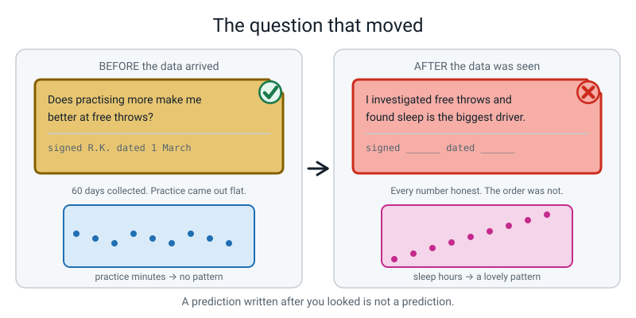
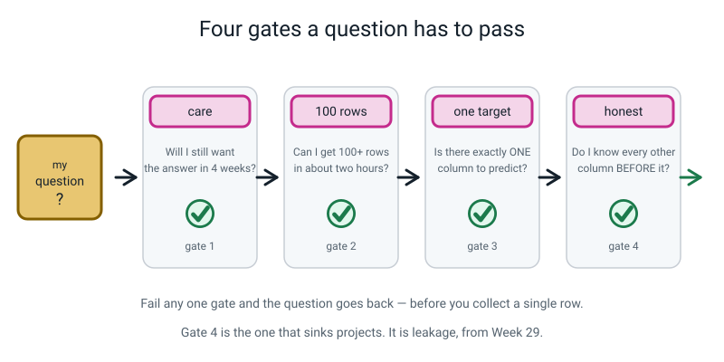
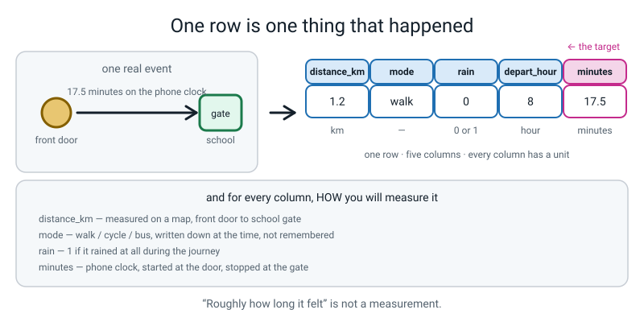
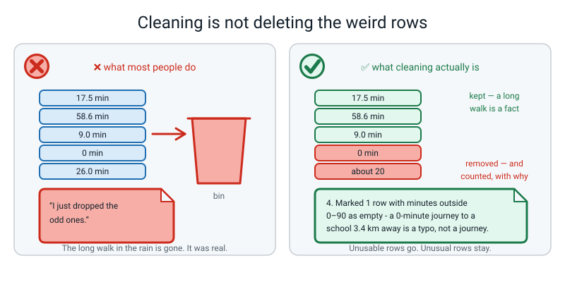
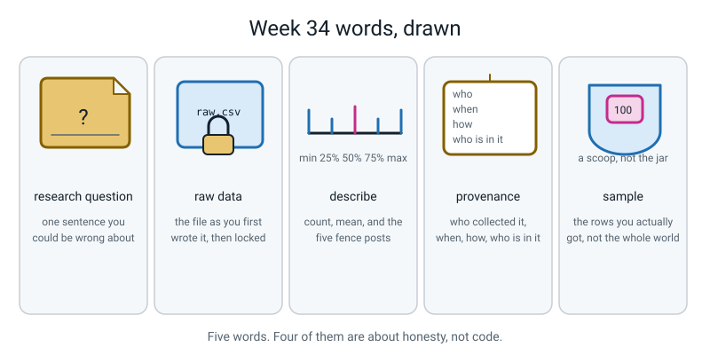

# Week 34 — Data Detective, Part 1: Your Question and Your 100 Rows

[⬅ Week 33](week-33.md) · [Course Home](../README.md) · [Next ➡](week-35.md) · [Workbook](../workbook/week-34.md)

---

> ### This week in one sentence
> **A data project starts with a question you could be wrong about, and 100 rows you collected yourself.**
>
> **By the end of this chapter you will be able to:**
> - Write a **research question** that data could answer and that you could turn out to be *wrong* about
> - Collect 100 or more rows yourself, and save the **raw** file untouched and locked
> - Describe the whole table with `df.describe()` and read the quartiles out loud as a sentence about the real world
> - Write a **cleaning log** where every numbered line gives a *reason*, not just a change
> - State, in writing, one thing your data cannot show — however the answer turns out
>
> **New syntax this week:** `df.describe()` — and that is genuinely all of it.
>
> **Reading time:** about 25 minutes. **Homework:** about 2 hours 55 minutes, spread across the whole week.

---

## 🪝 Start Here

I want to tell you about a project I saw, and I want you to tell me what went wrong with it, because it took me about a week to put my finger on it.

Someone set out to answer this:

> **Does practising more make you better at free throws in basketball?**

Good question. They collected data on themselves for a month — how many minutes they practised each day, and how many free throws out of ten they scored the next morning. Sixty rows. Real effort, done properly, one row per day.

Then they looked at the data.

And practice minutes turned out to be… nothing. Flat. No pattern at all. The days they practised for forty minutes looked exactly like the days they practised for five.

But they noticed something else while they were staring at it. On days when they had slept more than eight hours, they scored much better. *Really* clearly better.

So the write-up said:

> *"I investigated what makes free throws better, and I found that sleep is the strongest driver."*

And it was a nice write-up. It had a chart and everything.


*Figure 34.1 — A prediction written after you looked is not a prediction.*

So. What is wrong with that?

...

Here it is. **The question moved.**

They set out to test practice. Practice failed. And the question quietly became *"what in this data looks interesting?"* — and the answer to *that* question is always yes, because something always looks interesting in sixty rows of anything.

Now here is the part that matters, and it is the reason this story is in the book instead of a story about someone cheating.

**They were not cheating.** They did not lie about a single number. Every value in that table was honestly measured. The dishonest thing was **the order** — they let the data choose the question, after the fact.

So this week, before you collect anything, you are going to write your question down in pen. And then you are going to sign it and date it.

Not because nobody trusts you. Because in three weeks, when your best feature turns out to be boring and something else looks brilliant, that signature is the only thing standing between you and a project that discovered whatever you already believed.

---

## 🧠 The Big Idea

### 1. A research question, and the four gates it has to pass

**The plain explanation.**

> **Research question** — one sentence, ending in a question mark, that data could answer and that you could turn out to be wrong about.

That last clause is the whole thing. *"Something about my journey to school"* is not a question. It cannot be wrong. So nothing you collect can ever settle it, and it will quietly become whatever the data happens to say.

*"Does how I travel change my journey time more than how far I go?"* — **that** one can be wrong. You can imagine the answer being no. That is what makes it a question.

**The analogy.** A topic is a room you wander around in. A question is a door: it is either open or shut, and you can find out which.


*Figure 34.2 — A question names a target column and could turn out wrong. A topic can quietly become whatever the data happens to say.*

**The four gates.** Every question has to get through all four. Write your answers down — do not just say them, because out loud you can be vague and in writing you cannot.


*Figure 34.3 — Fail any one gate and the question goes back, before you collect a single row.*

| Gate | The question you ask yourself | A pass | A fail |
|---|---|---|---|
| **Care** | Will you still want the answer in four weeks? | "How much of my day actually goes on homework versus screens?" | "Something about the weather I guess." |
| **100 rows** | Can you honestly get 100+ rows in about two hours, without permission you cannot get? | 100 videos from your own watch history | 100 classmates' exam marks |
| **Target** | Is there **one** column you would like to predict from the others? | `minutes` (a number) · `late` / `on-time` (a category) | "I just want to explore" |
| **Honest features** | Could you know every other column **before** the target happened? | predicting journey time from distance, mode, rain | predicting journey time from "what time I arrived" |

**Gate 4 is the one that sinks projects**, and you have met it before: it is **leakage**, from Week 29. A leaky feature feels wonderful while it is happening — the model scores brilliantly and you feel clever — and then you notice that one of your columns already contains the answer.

> **⚠️ Watch out:** pick a **number** as your target if you possibly can. All three models this course taught you — kNN, decision tree, linear regression — work on numbers, and all three measurements (MAE, RMSE, R²) apply. A category target is allowed, but linear regression cannot do it and the workaround is fiddly.

**The concrete version.** Here are three real attempts and what happened to each.

| Attempt | Which gate stopped it | The fix |
|---|---|---|
| "An investigation into my sleep." | Target — nothing named | *"Does screen-off time change how many hours I sleep?"* Target: `hours`. |
| "Can I predict my journey time from what time I arrived at school?" | Honest features — arrival time **is** the answer | Drop it. Use distance, mode, rain, departure hour — all known at the front door. |
| "Who in my class is best at maths?" | It fails a rule, not a gate | Not allowed at all: it is about other people, the label is an opinion, and a wrong answer costs a real person something. |

### 2. Your prediction, signed and dated — and why that is not theatre

**The plain explanation.** Before you collect anything, write down **what you expect to find.** Which feature you think will win. And roughly how wrong you think the model will be — a real number, with units.

**The analogy.** You know how, after a football match, everyone says they knew that was going to happen? Nobody wrote it down beforehand. Writing it down beforehand costs thirty seconds and turns an opinion into a checkable claim.

**Why it works.** You cannot un-see a result. Once you have looked at the data, whatever it says will feel like what you expected all along. That is not you being dishonest — that is just how brains work. Writing it down first is the only defence there is.

Scientists call this **pre-registration**. You can call it *the thing I signed*.

So your plan page ends up looking like this:

```text
1. THE QUESTION      Does how I travel change my journey time more
                     than how far I go?
5. THE TARGET        minutes  -  a number
6. MY PREDICTION     I expect distance_km to matter most, because
                     obviously further is longer.
                     I expect the model to be off by about 5 minutes.
8. CANNOT SHOW       Anything about anyone who is not me.

Signed  R. Kamma        Date  12 May
```

And then you cannot un-write it.

> **💡 Try this:** be brave with the prediction. Next week, when it turns out to be wrong, that is a **result** and it goes in your write-up: *"I predicted distance would matter most. It did not; mode did, by a mile."* A student who reports a wrong prediction has proved something a student who was right cannot — that the prediction was real.

### 3. One row is one thing that happened

**The plain explanation.** Before you can collect anything, you have to be able to finish this sentence: *"one row of my table is one ______."*

One journey. One video. One innings. One shop trip. One homework session. If you cannot finish that sentence, you cannot collect, because you do not know when to write a line down.

**The analogy.** A row is a photograph of one moment. Not a summary of a week — one moment, with everything about it recorded at the time.


*Figure 34.4 — Every column carries a name, a unit, and a written-down way of measuring it.*

**The concrete version.** Here is the whole column plan for the journeys project. Notice that the last column of the table is the most important one, and it is the one everybody skips.

| Column | Type | Units | How I will measure it |
|---|---|---|---|
| `distance_km` | number | km | measured on a map, front door to school gate |
| `mode` | text | — | walk / cycle / bus, written down at the time |
| `rain` | 0 or 1 | — | 1 if it rained at all during the journey |
| `depart_hour` | number | hour | the hour shown on my phone when I left |
| `minutes` | number | minutes | phone clock, door to gate ← **TARGET** |

> **⚠️ Watch out:** *"roughly how long it felt"* is not a measurement. *"Minutes on my phone clock, from the front door to the school gate"* is. The difference matters because in three weeks you will not remember what you meant, and neither will anybody reading your work.

**And plan for variety before you collect, not after.** One hundred identical walks teach nothing. If `mode` is always `walk`, no model on earth can learn anything about mode. If every distance is between 2.0 and 2.3 km, distance cannot explain anything.

The working rule: **every category value should appear at least ten times, and every number column should genuinely spread out.**

### 4. Raw data — and the one mistake you cannot undo

**The plain explanation.**

> **Raw data** — the file exactly as you first wrote it down, before any repair. It is evidence, not a draft.
> **Provenance** — where the data came from: who collected it, when, how, and who is in it.

And here is the rule, which is absolute, and which you will want to break within about ten minutes of collecting:

> **Every repair happens in Python, in a file, with a log line. Never in the spreadsheet.**


*Figure 34.5 — Read from raw, write to clean. If the arrow ever points backwards, the only honest copy of your data is gone.*

**Why so strict?** Because the moment you "just fix that typo in the spreadsheet", the fix exists nowhere in your code. Nobody — including you, in three weeks — can rerun your work and land on the same table. Your results stop being reproducible, silently, and you will not notice.

**The analogy.** A raw file is the photograph from a crime scene. A cleaned file is your drawing of what you think happened. You are allowed to redraw the drawing as often as you like. You are never allowed to touch the photograph.

**The concrete version — make the computer enforce it.** One line in the terminal:

```text
chmod 444 data/raw.csv
```

`444` means *everyone may read, nobody may write*. After that, if anything tries to write to `raw.csv`, Python stops it with a `PermissionError`. That is not a problem — **that is a feature you switched on deliberately.**

> **🧑‍🏫 If a student asks:** *"But what if I genuinely wrote a row down wrong?"* Then the raw file keeps the wrong value, and a cleaning-log line in the code says: `"Row 14: I wrote 210 minutes; my diary says 21.0. Fixed in code, not in the file."` The mistake becomes part of the record. That is what makes it a record.

### 5. `describe()` — eight numbers, and the two that are actually a sentence

**The plain explanation.** `df.describe()` asks a table for a summary. It hands back eight numbers **for every column that holds numbers**.

| Row | Plain meaning | The question it answers |
|---|---|---|
| `count` | how many rows have a real value in this column | how much data do I actually have? |
| `mean` | the average | what is typical? |
| `std` | standard deviation — roughly, the usual distance from the mean | are the values bunched or spread? |
| `min` | the smallest | what is the extreme low end? |
| `25%` | a quarter of the rows are below this | where does the bottom quarter stop? |
| `50%` | half the rows are below this — the **median** | what is the middle row? |
| `75%` | three quarters of the rows are below this | where does the top quarter start? |
| `max` | the largest | what is the extreme high end? |

**About `std`, honestly:** it is roughly how far a typical row sits from the average. Big `std` means spread out, small `std` means bunched up. That is enough for now, and it is true.

**The analogy.** `min`, `25%`, `50%`, `75%` and `max` are **five fence posts** along a line. Roughly a quarter of your rows sit in each of the four gaps between them.


*Figure 34.6 — min, 25%, 50%, 75% and max are five fence posts. Roughly a quarter of your rows sit in each gap.*

**The concrete version.** Here is the real output for the 21 clean demo journeys:

```text
count    21.000000
mean     17.428571
std       5.160634
min       8.500000
25%      16.000000
50%      19.000000
75%      20.500000
max      26.000000
Name: minutes, dtype: float64
```

Now read it out loud, as a description of a real morning — **not** as a table of numbers:

> *"Twenty-one journeys. The quickest took 8.5 minutes and the slowest 26. Half of them were under 19 minutes. A quarter were under 16."*

That is four numbers — `count`, `min`, `50%`, `max` — and one extra. Those four are always a sentence about the world.

> **⚠️ Watch out:** `50%` = 19.0 does **not** mean "it takes 19 minutes half the time". It means **half the journeys took less than 19 minutes.** That is a different claim and it is the one people get wrong.

### 6. The most useful thing `describe()` does — it leaves things out

This is the bit almost nobody notices, and it catches the single most expensive bug in the whole capstone.

Here is `describe()` on the **raw** demo file:

```text
       distance_km       rain
count    25.000000  26.000000
mean      2.436000   0.269231
std       0.998699   0.452344
min       1.200000   0.000000
25%       1.200000   0.000000
50%       2.100000   0.000000
75%       3.400000   0.750000
max       3.400000   1.000000
```

Count the columns in that output. **Two.** Now count the columns in the table. **Five.**

So which are missing? `day`, `mode`, and — the important one — **`minutes`**. The column the entire project is about.

That is not a bug in pandas. `describe()` only summarises columns pandas *believes* hold numbers. One single row of that log says `about 20` instead of a number, so pandas decided the whole column is text. And a column pandas thinks is text cannot be averaged, cannot be plotted, and cannot be predicted.

> **The habit to install this week, and keep for life: run `describe()`, then check your target column is in the output. If it is missing, stop and find out why before you do anything else.**

### 7. A cleaning log — and why the reason beats the action

**The plain explanation.**

> **Cleaning log** — a numbered list of every change you made to the raw data, each with a reason, kept in the code so it ships with your results.

Compare these two lines. They describe the same change.

| Log line | What a reader can do with it |
|---|---|
| `5. Dropped 3 rows.` | Nothing. It is a receipt. They can neither agree nor disagree. |
| `5. Dropped 3 rows with no minutes value — you cannot learn from a row whose answer is unknown, and inventing one would be making data up.` | Follow it, check it, and say "I would have kept those and filled them, and here is why." |


*Figure 34.7 — The action is a fact. The reason is an argument. Only arguments can be checked.*

**The reason turns a fact into an argument, and arguments can be checked, disagreed with and improved.** That is the difference between a school project and a piece of work.

**The test that works every time:** read your line back to yourself out loud with the word *because* in the middle.

- *"Dropped 2 exact duplicate rows, because… they were duplicates."* → you have said nothing twice.
- *"Dropped 2 exact duplicate rows, because my phone re-synced on Monday and logged two journeys twice."* → now somebody could argue with you. Good.

**And the log lives in the code**, not in a separate document. That way it cannot drift out of date, and anybody reading your work sees the log and the code that produced it in the same file.

---

## 💻 Type This

You are going to build three small files, in order. Everything from here works on the **demo journey log** — twenty-six journeys, typed out literally — so that your output matches this page exactly. Your own data arrives as homework.

### Step 1 — make the folders

In the terminal:

```text
mkdir -p week34-demo/data
cd week34-demo
```

One folder for the project, one folder called `data` inside it. Everything about your data lives in that folder and nowhere else. If you cannot say which folder a file is in, you will lose an hour to it later.

### Step 2 — type `make_raw.py`

This writes your paper log into a CSV file. Type it **exactly as it is**, including the mistakes — they are deliberate and they are the whole point.

```python
# make_raw.py - write the journey log I collected on paper into one CSV file.
# I type each row EXACTLY as it appears in my paper log. Mistakes included.

import csv                                    # the standard-library CSV tool

rows = [                                      # one dict = one journey = one row
    {"day": "Mon", "distance_km": 1.2, "mode": "walk",  "rain": 0, "minutes": 17.5},
    {"day": "Mon", "distance_km": 3.4, "mode": "bus",   "rain": 1, "minutes": 21.0},
    {"day": "Tue", "distance_km": 1.2, "mode": "Walk",  "rain": 0, "minutes": 16.0},
    {"day": "Tue", "distance_km": 3.4, "mode": "bus",   "rain": 0, "minutes": 19.5},
    {"day": "Wed", "distance_km": 2.1, "mode": "cycle", "rain": 0, "minutes": 9.0},
    {"day": "Wed", "distance_km": 3.4, "mode": "bus",   "rain": 1, "minutes": 24.0},
    {"day": "Thu", "distance_km": 1.2, "mode": "walk ", "rain": 1, "minutes": 19.0},
    {"day": "Thu", "distance_km": 3.4, "mode": "bus",   "rain": 0, "minutes": 20.0},
    {"day": "Fri", "distance_km": 2.1, "mode": "cycle", "rain": 0, "minutes": 8.5},
    {"day": "Fri", "distance_km": 3.4, "mode": "bus",   "rain": 0, "minutes": 18.5},
    {"day": "Mon", "distance_km": 1.2, "mode": "walk",  "rain": 0, "minutes": 17.0},
    {"day": "Mon", "distance_km": 3.4, "mode": "bus",   "rain": 0, "minutes": 19.0},
    {"day": "Tue", "distance_km": 2.1, "mode": "cycle", "rain": 1, "minutes": 11.5},
    {"day": "Tue", "distance_km": 3.4, "mode": "bus",   "rain": 1, "minutes": 26.0},
    {"day": "Wed", "distance_km": 1.2, "mode": "walk",  "rain": 0, "minutes": "about 20"},
    {"day": "Wed", "distance_km": 3.4, "mode": "bus",   "rain": 0, "minutes": 19.5},
    {"day": "Thu", "distance_km": 2.1, "mode": "cycle", "rain": 0, "minutes": 9.5},
    {"day": "Thu", "distance_km": 3.4, "mode": "bus",   "rain": 0, "minutes": 0},
    {"day": "Fri", "distance_km": 1.2, "mode": "walk",  "rain": 1, "minutes": 21.0},
    {"day": "Fri", "distance_km": "",  "mode": "bus",   "rain": 0, "minutes": 20.5},
    {"day": "Mon", "distance_km": 2.1, "mode": "cycle", "rain": 0, "minutes": 9.0},
    {"day": "Mon", "distance_km": 3.4, "mode": "bus",   "rain": 1, "minutes": 23.5},
    {"day": "Tue", "distance_km": 1.2, "mode": "walk",  "rain": 0, "minutes": 16.5},
    {"day": "Tue", "distance_km": 3.4, "mode": "bus",   "rain": 0, "minutes": ""},
    {"day": "Mon", "distance_km": 1.2, "mode": "walk",  "rain": 0, "minutes": 17.0},
    {"day": "Wed", "distance_km": 3.4, "mode": "bus",   "rain": 0, "minutes": 19.5},
]

with open("data/raw.csv", "w", newline="") as f:          # "w" = write a new file
    writer = csv.DictWriter(f, fieldnames=list(rows[0].keys()))
    writer.writeheader()                                  # the column names line
    writer.writerows(rows)

print(len(rows), "rows written to data/raw.csv")
```

**What the new-ish lines do** (all of this is Week 16 syntax):

- `rows = [ {...}, {...} ]` — a list of dictionaries. One dictionary is one journey.
- `with open("data/raw.csv", "w", newline="") as f:` — open that path for writing. `newline=""` stops Windows adding a blank line between every row.
- `csv.DictWriter(f, fieldnames=list(rows[0].keys()))` — a writer that takes dictionaries and knows the column order from the first one.
- `writer.writeheader()` then `writer.writerows(rows)` — the column-names line, then every row.

Run it:

```text
python3 make_raw.py
```

```text
26 rows written to data/raw.csv
```

**Look at what you just typed and do not correct it.** Row 3 says `Walk` with a capital W. Row 7 says `walk ` with a space after it. Row 15 says `about 20` instead of a number. Row 18 says zero minutes, which is not a journey, it is a teleport. Row 20 has no distance at all.

Every one of those was in the paper log. So every one of those goes in the file.

> **The raw file is not a tidy file. It is an honest one.**

### Step 3 — lock the raw file

```text
chmod 444 data/raw.csv
```

That means: everyone can read this, nobody can write to it. Including you, at eleven o'clock at night, when you notice a typo.

Watch what happens if you try to write to it now:

```text
python3 make_raw.py
```

```text
Traceback (most recent call last):
  File "/private/tmp/errdemo/make_raw.py", line 3, in <module>
    with open("data/raw.csv", "w", newline="") as f:
PermissionError: [Errno 13] Permission denied: 'data/raw.csv'
```

Permission denied. **The computer is now enforcing the rule for you.**

*(If you genuinely need to rebuild the raw file — because you collected more rows — run `chmod 644 data/raw.csv`, rebuild it, and then `chmod 444` again straight away.)*

### Step 4 — look at the table before you touch it

New file, `look.py`:

```python
# look.py - look at the raw table before changing anything at all.
import pandas as pd

df = pd.read_csv("data/raw.csv")      # always read the RAW file, never the clean one

print("shape:", df.shape)             # (rows, columns)
print()
print(df.head())                      # the first five rows
print()
df.info()                             # what type is every column?
print()
print(df.describe())                  # the numbers, summarised
```

```text
python3 look.py
```

```text
shape: (26, 5)

   day  distance_km   mode  rain minutes
0  Mon          1.2   walk     0    17.5
1  Mon          3.4    bus     1    21.0
2  Tue          1.2   Walk     0    16.0
3  Tue          3.4    bus     0    19.5
4  Wed          2.1  cycle     0     9.0

<class 'pandas.core.frame.DataFrame'>
RangeIndex: 26 entries, 0 to 25
Data columns (total 5 columns):
 #   Column       Non-Null Count  Dtype  
---  ------       --------------  -----  
 0   day          26 non-null     object 
 1   distance_km  25 non-null     float64
 2   mode         26 non-null     object 
 3   rain         26 non-null     int64  
 4   minutes      25 non-null     object 
dtypes: float64(1), int64(1), object(3)
memory usage: 1.1+ KB

       distance_km       rain
count    25.000000  26.000000
mean      2.436000   0.269231
std       0.998699   0.452344
min       1.200000   0.000000
25%       1.200000   0.000000
50%       2.100000   0.000000
75%       3.400000   0.750000
max       3.400000   1.000000
```

**Now stop and do the check from section 6.** Five columns in the table. Two columns in the `describe()` block. `minutes` is missing, and `info()` tells you exactly why: `minutes  25 non-null  object`. `object`, in pandas, means text.

One row out of twenty-six said `about 20`. And because a column can only be **one** type, that single row turned the entire `minutes` column into text.

### Step 5 — start the cleaning log

New file, `clean.py`. Begin with just the machinery and one repair, so you can see the shape of it:

```python
# clean.py - clean the raw table, and write down WHY for every single change.
import pandas as pd

df = pd.read_csv("data/raw.csv")          # always start from raw
before = df.shape                         # remember the size before we touch it

CLEANING_LOG = []                         # the log lives in the code, not my head

def log(action, reason):                  # one small function, used six times
    """Add one numbered line to the cleaning log."""
    number = len(CLEANING_LOG) + 1        # 1, then 2, then 3...
    CLEANING_LOG.append(f"{number}. {action}  -  {reason}")

# --- 1. exact duplicate rows -------------------------------------------------
dupes = df.duplicated().sum()             # how many rows are copies of another row?
df = df.drop_duplicates()
log(f"Dropped {dupes} exact duplicate row(s)",
    "My phone re-synced on Monday and logged two journeys twice. Same day, same mode, same minutes.")

after = df.shape
print(f"shape before: {before}   after: {after}")
print()
for line in CLEANING_LOG:
    print(line)
```

```text
shape before: (26, 5)   after: (24, 5)

1. Dropped 2 exact duplicate row(s)  -  My phone re-synced on Monday and logged two journeys twice. Same day, same mode, same minutes.
```

**What each new piece does:**

- `CLEANING_LOG = []` — an empty list. Capital letters because it is one thing that lives for the whole program.
- `def log(action, reason):` — a tiny function (Week 10) that numbers the line for you, so you can never number two lines `4.` by accident.
- `df.duplicated().sum()` — `duplicated()` gives you a True/False for every row; `.sum()` counts the Trues. **Count them before you drop them**, or the number is gone.
- `f"{number}. {action}  -  {reason}"` — an f-string (Week 3) glueing the three pieces into one line.

### Step 6 — the complete finished program

Here is the whole of `clean.py`, all six repairs, each with a reason. Add steps 2–6 under the step 1 you already typed.

```python
# clean.py - clean the raw table, and write down WHY for every single change.
import pandas as pd

df = pd.read_csv("data/raw.csv")          # always start from raw
before = df.shape                         # remember the size before we touch it

CLEANING_LOG = []                         # the log lives in the code, not my head

def log(action, reason):                  # one small function, used six times
    """Add one numbered line to the cleaning log."""
    number = len(CLEANING_LOG) + 1        # 1, then 2, then 3...
    CLEANING_LOG.append(f"{number}. {action}  -  {reason}")

# --- 1. exact duplicate rows -------------------------------------------------
dupes = df.duplicated().sum()             # how many rows are copies of another row?
df = df.drop_duplicates()
log(f"Dropped {dupes} exact duplicate row(s)",
    "My phone re-synced on Monday and logged two journeys twice. Same day, same mode, same minutes.")

# --- 2. the same word spelled three ways -------------------------------------
df["mode"] = df["mode"].str.strip().str.lower()
log("Stripped spaces and lower-cased 'mode'",
    "value_counts() showed 'walk', 'Walk' and 'walk ' as three groups. They are one thing.")

# --- 3. a number that arrived as text ----------------------------------------
df["minutes"] = pd.to_numeric(df["minutes"], errors="coerce")
log("Converted 'minutes' to numbers, bad values became empty",
    "One row said 'about 20'. I cannot use a guess as a measurement, so it became empty.")

# --- 4. impossible values ----------------------------------------------------
impossible = (df["minutes"] <= 0) | (df["minutes"] > 90)
df.loc[impossible, "minutes"] = None
log(f"Marked {impossible.sum()} row(s) with minutes outside 0-90 as empty",
    "A 0-minute journey to a school 3.4 km away is a typo, not a journey.")

# --- 5. rows with no answer at all -------------------------------------------
no_target = df["minutes"].isna().sum()
df = df.dropna(subset=["minutes"])
log(f"Dropped {no_target} row(s) with no minutes value",
    "You cannot learn from a row whose answer is unknown, and inventing one would be making data up.")

# --- 6. one missing feature --------------------------------------------------
middle = df["distance_km"].median()
n_filled = df["distance_km"].isna().sum()
df["distance_km"] = df["distance_km"].fillna(middle)
log(f"Filled {n_filled} missing distance value(s) with the median ({middle} km)",
    "Only one row, and the median is the middle distance so it does not drag the average about.")

after = df.shape
print(f"shape before: {before}   after: {after}")
print()
for line in CLEANING_LOG:                 # print the log so it ships with the results
    print(line)
print()
print(df.describe())
df.to_csv("data/clean.csv", index=False)  # index=False: do not save the row numbers
print()
print("saved data/clean.csv")
```

Real output:

```text
shape before: (26, 5)   after: (21, 5)

1. Dropped 2 exact duplicate row(s)  -  My phone re-synced on Monday and logged two journeys twice. Same day, same mode, same minutes.
2. Stripped spaces and lower-cased 'mode'  -  value_counts() showed 'walk', 'Walk' and 'walk ' as three groups. They are one thing.
3. Converted 'minutes' to numbers, bad values became empty  -  One row said 'about 20'. I cannot use a guess as a measurement, so it became empty.
4. Marked 1 row(s) with minutes outside 0-90 as empty  -  A 0-minute journey to a school 3.4 km away is a typo, not a journey.
5. Dropped 3 row(s) with no minutes value  -  You cannot learn from a row whose answer is unknown, and inventing one would be making data up.
6. Filled 1 missing distance value(s) with the median (2.1 km)  -  Only one row, and the median is the middle distance so it does not drag the average about.

       distance_km       rain    minutes
count    21.000000  21.000000  21.000000
mean      2.400000   0.333333  17.428571
std       0.953415   0.483046   5.160634
min       1.200000   0.000000   8.500000
25%       1.200000   0.000000  16.000000
50%       2.100000   0.000000  19.000000
75%       3.400000   1.000000  20.500000
max       3.400000   1.000000  26.000000

saved data/clean.csv
```

**Two things to notice, and they are both the point of the week.**

**First: `minutes` is now IN the `describe()` output.** That is the check from section 6, passing.

**Second: 26 rows went in and 21 came out.** Five rows were lost, and every single one of them was counted and justified. If your own before-and-after shapes come out identical, either your data was immaculate or you did not look.

**And one supporting output worth running yourself**, because you cannot eyeball a text column:

```python
# add this to a scratch file, or run it in the terminal
import pandas as pd
raw = pd.read_csv("data/raw.csv")
print(raw["mode"].value_counts())
```

```text
bus      13
walk      6
cycle     5
Walk      1
walk      1
Name: mode, dtype: int64
```

Look at the last two lines. `walk` and `walk ` look **identical on screen**, because the only difference is a trailing space. That is why you count a column instead of looking at it. After `.str.strip().str.lower()` there are three groups, not five:

```text
bus      13
walk      8
cycle     5
Name: mode, dtype: int64
```

---

## 🔍 Worked Examples

### Worked Example 1 — Pizza delivery (food)

**The question:** *Does the number of toppings change how long a pizza takes to arrive more than the distance does?* Target: `wait_min`, a number.

Twelve rows to start with — the real thing needs 100, but twelve is enough to show you the shape of the problem.

```python
# we34_1_pizza.py - twelve deliveries, exactly as they were written down.
import pandas as pd

pizza = pd.DataFrame({
    "toppings":    [2, 4, 1, 3, 2, 5, 1, 3, 2, 4, 1, 2],
    "size_cm":     [30, 30, 23, 30, 23, 38, 23, 30, 30, 38, 23, 30],
    "day":         ["Fri", "Fri", "Mon", "Sat", "Tue", "Sat",
                    "Wed", "Thu", "Sun", "Sat", "Mon", "Fri"],
    "distance_km": [2.4, 2.4, 1.1, 3.8, 1.1, 3.8, 1.1, 2.4, 2.4, 3.8, 1.1, 2.4],
    "wait_min":    [28, 34, 19, 41, 22, 47, "ages", 31, 26, 44, 18, 29],
})

print("shape:", pizza.shape)
print()
print(pizza.dtypes)
print()
print(pizza.describe())

CLEANING_LOG = []

def log(action, reason):
    number = len(CLEANING_LOG) + 1
    CLEANING_LOG.append(f"{number}. {action}  -  {reason}")

before = pizza.shape

pizza["wait_min"] = pd.to_numeric(pizza["wait_min"], errors="coerce")
log("Converted 'wait_min' to numbers; 'ages' became empty",
    "One Wednesday I wrote 'ages' instead of looking at the clock. 'Ages' is a feeling, not a measurement.")

dropped = pizza["wait_min"].isna().sum()
pizza = pizza.dropna(subset=["wait_min"])
log(f"Dropped {dropped} row(s) with no wait time",
    "The wait is the answer I am predicting; a row with no answer teaches the model nothing.")

print()
print(f"shape before: {before}   after: {pizza.shape}")
for line in CLEANING_LOG:
    print(line)
print()
print(pizza["wait_min"].describe())
```

Real output:

```text
shape: (12, 5)

toppings         int64
size_cm          int64
day             object
distance_km    float64
wait_min        object
dtype: object

        toppings    size_cm  distance_km
count  12.000000  12.000000    12.000000
mean    2.500000  29.000000     2.316667
std     1.314257   5.325752     1.068417
min     1.000000  23.000000     1.100000
25%     1.750000  23.000000     1.100000
50%     2.000000  30.000000     2.400000
75%     3.250000  30.000000     2.750000
max     5.000000  38.000000     3.800000

shape before: (12, 5)   after: (11, 5)
1. Converted 'wait_min' to numbers; 'ages' became empty  -  One Wednesday I wrote 'ages' instead of looking at the clock. 'Ages' is a feeling, not a measurement.
2. Dropped 1 row(s) with no wait time  -  The wait is the answer I am predicting; a row with no answer teaches the model nothing.

count    11.000000
mean     30.818182
std       9.826680
min      18.000000
25%      24.000000
50%      29.000000
75%      37.500000
max      47.000000
Name: wait_min, dtype: float64
```

**Run the check on the first `describe()`.** Five columns in the table, three in the output. `day` is words, fine. But `wait_min` — **the target** — is missing, and `dtypes` says why: `object`. One Wednesday somebody wrote `ages` instead of looking at the clock.

**Then read the second one out loud:** *"Eleven deliveries. The quickest was 18 minutes, the slowest 47. Half of them arrived in under 29 minutes."*

### Worked Example 2 — Fifteen innings from my own scorebook (sport)

**The question:** *Does batting position change how many runs I score more than how many overs I face?* Target: `runs`, a number.

```python
# we34_2_cricket.py - fifteen innings from my own scorebook. Describe it, read it aloud.
import pandas as pd

innings = pd.DataFrame({
    "overs":     [20, 20, 20, 20, 20, 20, 20, 20, 20, 20, 20, 20, 20, 20, 20],
    "position":  [1, 3, 1, 4, 2, 1, 5, 3, 1, 2, 4, 1, 3, 2, 6],
    "ground":    ["home", "away", "home", "away", "home", "home", "away",
                  "home", "away", "home", "away", "home", "away", "home", "away"],
    "runs":      [34, 12, 51, 4, 27, 63, 0, 19, 41, 22, 8, 77, 15, 30, 2],
})

print("shape:", innings.shape)
print()
print(innings["runs"].describe())
print()
print("sorted runs:", sorted(innings["runs"]))
```

```text
shape: (15, 4)

count    15.000000
mean     27.000000
std      22.878561
min       0.000000
25%      10.000000
50%      22.000000
75%      37.500000
max      77.000000
Name: runs, dtype: float64

sorted runs: [0, 2, 4, 8, 12, 15, 19, 22, 27, 30, 34, 41, 51, 63, 77]
```

**Check pandas by hand — this is worth doing once in your life.** Fifteen numbers, sorted. The middle one is the 8th: **22**. And `50%` says 22.0. They agree, because `50%` *is* the middle row.

**Read it aloud:** *"Fifteen innings. My worst was a duck and my best was 77. Half of them were under 22 runs. A quarter were under 10."*

**And notice the honest problem this table already has.** Look at the `overs` column: every row says 20. A column where every row is identical can never explain anything — there is nothing for a model to compare. So the *first* finding of this project, before any modelling at all, is: **`overs` has to go, or the collection has to change.** That is a real result and it goes in the write-up.

> **💡 Try this:** `mean` is 27.0 and `50%` is 22.0. The mean is bigger. That means the high end is stretched further from the middle than the low end is — the 63 and the 77 are pulling the average up. **When the mean and the median disagree, the difference is telling you the shape is lopsided.**

### Worked Example 3 — My homework log (school)

**The question:** *Does the subject change how long homework takes more than the number of questions does?* Target: `minutes`, a number.

```python
# we34_3_homework.py - my homework log, cleaned, with a reason on every line.
import pandas as pd

homework = pd.DataFrame({
    "day":       ["Mon", "Mon", "Tue", "Tue", "Wed", "Wed",
                  "Thu", "Thu", "Fri", "Fri", "Mon", "Sat"],
    "subject":   ["maths", "Maths", "english", "science ", "maths", "english",
                  "science", "maths", "Maths", "english", "maths", "science"],
    "questions": [12, 8, 5, 10, 14, 6, 9, 15, 7, 4, 12, 9],
    "minutes":   [38, 25, 22, 41, 44, 19, 33, 55, 24, 17, 38, 30],
})

CLEANING_LOG = []

def log(action, reason):
    number = len(CLEANING_LOG) + 1
    CLEANING_LOG.append(f"{number}. {action}  -  {reason}")

before = homework.shape

print("subject, before any cleaning:")
print(homework["subject"].value_counts())
print()

homework["subject"] = homework["subject"].str.strip().str.lower()
log("Stripped spaces and lower-cased 'subject'",
    "'Maths', 'maths' and 'science ' are one subject each. Left alone, value_counts() shows five subjects when I only do three.")

dupes = homework.duplicated().sum()
homework = homework.drop_duplicates()
log(f"Dropped {dupes} exact duplicate row(s)",
    "I typed Monday's maths line into the sheet twice. Two identical rows are one piece of evidence, not two.")

print("subject, after cleaning:")
print(homework["subject"].value_counts())
print()
print(f"shape before: {before}   after: {homework.shape}")
print()
for line in CLEANING_LOG:
    print(line)
print()
print(homework["minutes"].describe())
```

```text
subject, before any cleaning:
maths       4
english     3
Maths       2
science     2
science     1
Name: subject, dtype: int64

subject, after cleaning:
maths      5
english    3
science    3
Name: subject, dtype: int64

shape before: (12, 4)   after: (11, 4)

1. Stripped spaces and lower-cased 'subject'  -  'Maths', 'maths' and 'science ' are one subject each. Left alone, value_counts() shows five subjects when I only do three.
2. Dropped 1 exact duplicate row(s)  -  I typed Monday's maths line into the sheet twice. Two identical rows are one piece of evidence, not two.

count    11.000000
mean     31.636364
std      11.834464
min      17.000000
25%      23.000000
50%      30.000000
75%      39.500000
max      55.000000
Name: minutes, dtype: float64
```

**The thing worth staring at.** Before cleaning, `value_counts()` shows **five** subjects. After, it shows **three**. And the counts change: `maths` goes from 4 to 5, because `Maths` was maths all along.

**And here is a subtlety worth knowing, and it is genuinely tricky.** Notice the *order* of the two repairs. Lower-casing happened first, and *then* the duplicate check. If you did it the other way round, `Mon / maths / 12 / 38` and `Mon / Maths / 12 / 38` would not have looked like duplicates at all, and neither would have been dropped.

**The order of your cleaning steps changes your answer.** That is not a bug — it is a decision, which means it needs a reason, which means it belongs in the log.

> **⚠️ Watch out:** with only 11 rows, `maths 5 / english 3 / science 3` is nowhere near the "ten of each" rule. This project needs about 30 rows per subject. That is a *collection* problem and you can see it in `value_counts()` before you waste an hour modelling.

---

## 🐞 When It Breaks

Errors this week are almost all about **files and column names**, and every one of these came from actually running a broken version of this week's code. pandas tracebacks are long; **read the last line first** — that is the one in English.

### Error 1 — Python creates files, never folders

You typed `make_raw.py` and ran it before making the `data` folder:

```text
Traceback (most recent call last):
  File "/private/tmp/errdemo/make_raw.py", line 3, in <module>
    with open("data/raw.csv", "w", newline="") as f:
FileNotFoundError: [Errno 2] No such file or directory: 'data/raw.csv'
```

**What Python is telling you:** *"I looked exactly where you told me and there was nothing there."*

**Now ask the right question:** is it the **file** that is missing, or the **folder**? Python will happily create a file for you. It will **never** create a folder.

**The fix:**

```text
mkdir data
ls
python3 make_raw.py
```

That `ls` is not decoration. Look at the folder with your own eyes before you run anything again. The gap between what you believe is on disk and what is actually on disk is where every one of these bugs lives.

### Error 2 — a capital letter you cannot see

```python
df["Minutes"] = pd.to_numeric(df["Minutes"], errors="coerce")
```

```text
  File "/Library/Frameworks/Python.framework/Versions/3.10/lib/python3.10/site-packages/pandas/core/indexes/base.py", line 3804, in get_loc
    raise KeyError(key) from err
KeyError: 'Minutes'
```

**What Python is telling you:** *"There is no column with that exact name."*

Column names are **case-sensitive, always**, and a trailing space counts as part of the name. `Minutes` is not `minutes`.

**The fix — do not guess, look:**

```python
print(df.columns)
```

```text
Index(['day', 'distance_km', 'mode', 'rain', 'minutes'], dtype='object')
```

Then copy the name character for character. `minutes`, lower case.

### Error 3 — a whole column is not a single piece of text

```python
df["mode"] = df["mode"].strip()          # missing .str
```

```text
  File "<string>", line 4, in <module>
  File "/Library/Frameworks/Python.framework/Versions/3.10/lib/python3.10/site-packages/pandas/core/generic.py", line 5902, in __getattr__
    return object.__getattribute__(self, name)
AttributeError: 'Series' object has no attribute 'strip'
```

**What Python is telling you:** *"A column does not have text methods. Individual strings do."*

`df["mode"]` is a whole column — a `Series`, twenty-six values at once. `.strip()` is something you do to **one** piece of text.

**The fix — add `.str`, which means "do this to every value":**

```python
df["mode"] = df["mode"].str.strip().str.lower()
```

### And the fourth one, which is the dangerous one — no error at all

```text
       distance_km       rain
count    25.000000  26.000000
...
```

It ran. It printed. Nothing is red. And your target column is not in the output.

**There is no traceback for this and there never will be.** The only thing that catches it is the habit: run `describe()`, then check your target column is in it. If it is not, run `df.info()` and find the column that says `object` where it should say `float64`.

> **🐞 If you see this error:** `ValueError: invalid literal for int() with base 10: 'about 20'` — you tried to convert by hand with `int()`. Don't. Use `pd.to_numeric(df["minutes"], errors="coerce")`, which turns anything unconvertible into empty instead of crashing the whole script, and then **log that you did it.**

**Errors are not you failing.** Every one of the four above is a sentence in English telling you exactly what it could not do. The only one to be scared of is the fourth, because it says nothing at all.

---

## 🎲 What We Did In Class

If you missed the lesson, here is the whole thing. You can do all of it at home; the only thing you need that is not a laptop is **a pen**, and it does need to be a pen.

### Part 1 — the plan, in pen, signed (10 minutes)

Eight boxes, all eight filled in. This is workbook page 34.2.

```text
1. THE QUESTION      ______________________________________________ ?
2. THE FOUR TESTS    care ___ / 100 rows ___ / target ___ / honest ___
3. ONE ROW IS ONE    ______________________________________________
4. THE COLUMNS       name | type | units | how I will measure it
                     (four features and one target, minimum)
5. THE TARGET        ____________________  number / category
6. MY PREDICTION     I expect __________ to matter most, because ______.
                     I expect the model to be off by about ____ ______.
7. DATA CARD         collected by · between __ and __ · how · who is in it
                     · permission asked of ____ on ____ · what is NOT in it
8. WHAT THIS CANNOT SHOW ______________________________________________

Signed ____________________   Date ____________
```

**Box 4 is where all the real work is**, and the last column of it — *how I will measure it* — is where most projects quietly fail. For every column you write, ask yourself: *and how, exactly, will I measure that?*

Then sign it and date it. Properly. This is a ritual and rituals work.

### Part 2 — the folders (5 minutes)

```text
mkdir -p data-detective/data data-detective/notes
cd data-detective
```

You are building exactly this:

```text
data-detective/
├── data/                  <- empty for now. raw.csv lands here tonight.
├── notes/
│   ├── plan.md            <- page 34.2, typed up or photographed
│   └── collection-diary.md
├── make_raw.py
├── look.py
└── clean.py
```

Then create `notes/collection-diary.md` and type this header into it:

```text
COLLECTION DIARY - one line every time something goes wrong.

date     what happened                            what I did about it
-------  ---------------------------------------  ------------------------
```

That is the least glamorous file in the whole project and it is the one that makes next week easy. **Write in it while you collect, not afterwards.** Afterwards you will remember that everything went fine.

### Part 3 — three log lines, written in advance (5 minutes)

Predict your own mess. Three lines, each with a reason, each about a problem you have not hit yet.

```text
1. I will probably miss a day or two  -  I will leave those rows out rather
   than guess, because a guessed target is fabrication, not data.
2. I will probably write "Tues" some days and "Tuesday" others  -  I will
   lower-case and strip every text column, because those are one day and
   value_counts() would otherwise show me two.
3. I will probably measure one distance off a map rather than the route I
   actually walked  -  I will write it in the data card as a known
   measurement error instead of pretending the number is exact.
```

Predicting your own mess is a real skill and it makes the homework enormously faster.

### And the one question that ran all lesson

After every single thing you wrote, the teacher asked: **"And why?"**

That is not them being annoying. That is the whole week.

---

## 💬 Talk About It

**1. "The person in the basketball story did not fake a single number. So what exactly did they do wrong?"**

*Hint:* think about **order**, not honesty. Which came first — the question or the looking? And what question does "what looks interesting in this data?" always get a yes to?

**2. "Why 100 rows? Why not 50? It's a made-up number either way."**

*Hint:* do the arithmetic. With 100 rows and a 20% test set you keep 20 rows back, so one row is worth 5 percentage points of any score. With 50 rows you keep 10, and one row is worth 10 points — so two models that differ by 9 points become indistinguishable. **100 is not magic; it is the smallest number where the sentences you want to write next week are allowed to be true.**

**3. "How much cleaning is too much cleaning?"** *(Nobody fully agrees on this one, and that is the honest answer.)*

*Hint:* every cleaning decision trades two risks against each other. Leave a strange value in, and it might be a real measurement your model needs to see — the day it poured, the journey that genuinely took an hour. Take it out, and you might have removed a typo that would have wrecked everything. There is no rule that tells you which, because the answer depends on knowing your own data, which is exactly what a rule cannot do for you. What *everybody* agrees on is narrower: rows with no answer cannot be used, exact duplicates are not extra evidence, the same word spelled three ways is one thing, and **every decision must be written down with its reason so somebody else can disagree with it.** The disagreement is allowed. The silence is not.

---

## ⚠️ Don't Get Tricked

### Trick 1 — "cleaning means deleting the weird rows"


*Figure 34.8 — Unusable rows go. Unusual rows stay.*

| ❌ Wrong | ✅ Right |
|---|---|
| "I just dropped the odd ones." | "I removed 3 rows that were unusable — no answer, an impossible value, and a duplicate — and here is the reason for each. The 58-minute walk stayed in. It really happened." |

The weird rows are often the **most valuable** ones: the day it poured, the journey that took twice as long. What gets removed is only what is genuinely **unusable**, and every removal is counted and justified.

And watch for the word **just**. Every "just" is a decision you skipped explaining. It is banned in this project for exactly that reason.

### Trick 2 — "`50%` means it takes that long half the time"

| ❌ Wrong | ✅ Right |
|---|---|
| "`50%` is 19, so half the time my journey takes 19 minutes." | "`50%` is 19, so **half my journeys took less than 19 minutes.**" |

`50%` is the **middle row** when you sort them. It says nothing about how often any particular value happens. Say *"half of them were under"* every single time and you cannot get this wrong.

### Trick 3 — "the question is the easy bit, let's get to the code"

| ❌ Wrong | ✅ Right |
|---|---|
| "I'll figure out the question while I collect." | "Two hours of collecting the wrong data cannot be rescued by four hours of good modelling." |

Budget honestly: the plan and the question are about **45 minutes of real work.** You will want to spend five. The sentence that decides it: *you are about to spend two hours of your life collecting this — which question do you want to be holding at the end of it?*

### Trick 4 — "more rows of the same thing counts"

| ❌ Wrong | ✅ Right |
|---|---|
| "I got 120 rows! Every one is a walk." | "I got 120 rows, and 42 of each mode, and my distances run from 0.6 to 4.4 km." |

If `mode` is always `walk`, no model can learn anything about mode. If every distance sits between 2.0 and 2.3 km, distance cannot explain anything. **You need variety in every feature, and you have to plan it before you collect, not discover it afterwards.** Ten of each category value is the working rule.

---

## 🌍 Where You've Seen This

1. **The "ingredients" list on a packet.** That is a data card: what is in it, who made it, when, and — in the small print — what it might contain traces of. Somebody had to decide what counted as a column.
2. **A cricket or football scorecard.** One row per innings or per match, every column with a unit, filled in *at the time*. It is a raw file, and nobody is allowed to go back and improve it afterwards.
3. **"Track changes" in a document, or the history of a shared file.** That is a cleaning log with the reasons stripped out. Notice how frustrating it is when somebody edits your work and does not say why.
4. **The version history in a game save, or a bank statement.** Neither of them lets you edit the past. That is `chmod 444`, enforced by somebody who learned this lesson the hard way.
5. **Scientific papers that get retracted.** Almost never because somebody faked a number. Usually because nobody can reproduce the result — the cleaning happened by hand and was never written down.
6. **Weather station records.** Every reading has a time, a place, an instrument and a person. When a station moves 200 metres, that goes in the record too, because otherwise a step in the data looks like a change in the climate.

---

## 🔑 Remember This

- **A research question ends in a question mark and could turn out to be wrong.** If no result could prove you wrong, it is a topic, and topics quietly become whatever the data says.
- **Four gates: care · 100 rows · one named target · every feature known before the target.** Gate 4 is leakage, and it is the one that sinks projects.
- **Write your prediction down, with a number and units, and sign and date it before you collect.** A prediction made afterwards is not a prediction.
- **The raw file is written once and locked.** Every repair happens in Python, with a numbered log line and a reason. `chmod 444 data/raw.csv` makes the computer enforce it.
- **Run `describe()`, then check your target column is in the output.** If it is missing, one row of that column is text. This one check catches the most expensive bug in the capstone.
- **A log line without a reason is a receipt.** The action is a fact; the reason is an argument, and only arguments can be checked.
- **Write down one thing your data cannot show, before you know the answer.** Afterwards you will not want to.

### Syntax reminder card

```python
import pandas as pd

df = pd.read_csv("data/raw.csv")     # read the RAW file, always
print(df.shape)                      # (rows, columns)
print(df.head())                     # the first five rows
df.info()                            # every column's type and non-null count
print(df.describe())                 # count, mean, std, min, 25%, 50%, 75%, max
                                     #   ... for NUMBER columns only

print(df["mode"].value_counts())     # count a text column - never eyeball it
df.to_csv("data/clean.csv", index=False)
```

```text
chmod 444 data/raw.csv     # read-only: everyone can read, nobody can write
chmod 644 data/raw.csv     # writable again, if you must rebuild it
```

---

## 📓 New Words


*Figure 34.9 — This week's five words, drawn.*

| Word | What it means | Example |
|---|---|---|
| **research question** | One sentence, ending in a question mark, that data could answer and that you could turn out to be wrong about | *"Does how I travel change my journey time more than how far I go?"* |
| **raw data** | The file exactly as you first wrote it down, before any repair. Evidence, not a draft | `data/raw.csv`, 26 rows, `chmod 444`, including the row that says `about 20` |
| **describe** | The pandas summary of every number column: count, mean, std, and the five fence posts | `df.describe()` → `count 21 · min 8.5 · 50% 19.0 · max 26.0` |
| **provenance** | Where the data came from: who collected it, when, how, and who is in it | *"Me and my two brothers, 12 May to 9 June, on a sheet on the fridge, one family, one town"* |
| **sample** | The rows you actually got — not the whole world | 126 journeys by 3 people in one town in May. Not "journeys". |

---

## 📤 Your Homework

Go to **[the Week 34 workbook](../workbook/week-34.md)**. This is the biggest homework of the year and it is also the most fun, so **do not leave it to the last night** — it does not fit in one sitting.

| Page | What to do | Time |
|---|---|---|
| **34.4** | Reading `describe()` — ten questions on a real output, including two you have to hand-compute | 15 min |
| **34.5** | **Collect your data.** 100+ rows, aim for 120, collected **as they happen**. Write into `data/raw.csv`, then `chmod 444` and never touch it again | 120 min, spread across the week |
| **34.6** | **Write `clean.py`.** Every repair with a numbered log line and a reason. Print the before/after shape. Save `data/clean.csv` | 40 min |

**Total: about 2 hours 55 minutes across seven days.**

**Bring to next week:** `raw.csv`, `clean.csv`, the log printed out, and the collection diary. Without a clean table you cannot do next week's lesson, so this one is genuinely not optional.

> **💡 Try this before you start collecting:** write down, right now, which feature you think will win, and how wrong you think the model will be — in real units. Then sign it. **Being wrong is the most interesting outcome available**, and it is only available to people who wrote it down first.

> **⚠️ Watch out:** **missing is better than made up.** If you did not measure it, leave it empty. A guessed value looks exactly like a measured one in a CSV file, and there is no way to tell them apart later — including for you.

---

[⬅ Week 33](week-33.md) · [Course Home](../README.md) · [Week 35 ➡](week-35.md) · [📓 Workbook — Week 34](../workbook/week-34.md) · [Glossary](../../glossary.md)
