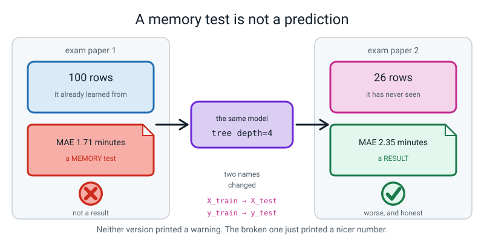
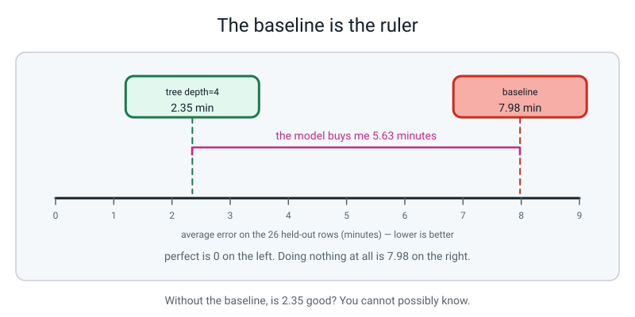
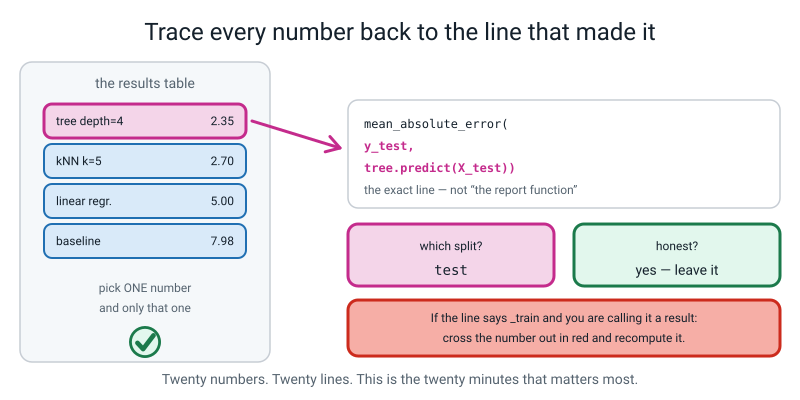
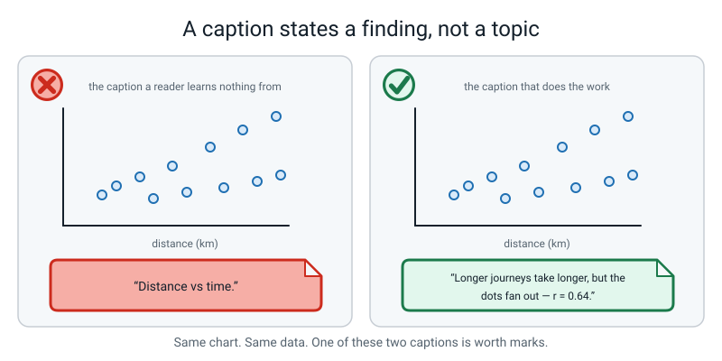
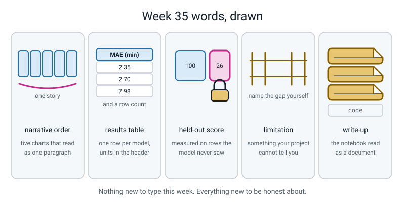

# Week 35 — Data Detective, Part 2: Charts, Models, and What I Got Wrong

[⬅ Week 34](week-34.md) · [Course Home](../README.md) · [Next ➡](week-36.md) · [Workbook](../workbook/week-35.md)

---

> ### This week in one sentence
> **The most valuable page in any data project is the one titled "what I got wrong".**
>
> **By the end of this chapter you will be able to:**
> - Put five captioned charts in **narrative order**, so that read aloud they are one paragraph
> - Make **one** train/test split, once, and name every later line that reads from it
> - Run three models plus a baseline through **one** scoring function, into **one** results table
> - Report every score with its metric, its units, its row count, and which split it came from
> - Run a **Score Audit**: trace every number back to the line that made it, in red pen
> - Write a "what I got wrong" section that names a real mistake and has numbers in it
>
> **New syntax this week:** **none.** Not one new thing. Everything here is something you already have from Weeks 21–33, and that is deliberate.
>
> **Reading time:** about 30 minutes. **Homework:** about 3 hours, spread across the week.

---

## 🪝 Start Here

I built a model that predicts how long a journey to school takes. Here is what it printed.

```text
MAE: 1.71 minutes
```

Off by **1.71 minutes** on average. I am quite pleased with that. If I tell you I will be at your house in twenty minutes, I will be there between eighteen and twenty-two.

I would like you to believe that number.

**What do you want to ask me before you do?**

...

The right question is: *which rows was it measured on, and had the model seen them already?*

Here is the line that produced it.

```python
guess = tree.predict(X_train)
print("MAE:", round(mean_absolute_error(y_train, guess), 2), "minutes")
```

`X_train`. The hundred rows the model **learned from**.

So what I actually measured is how well my model remembers homework it has already done. Of course it is good at that. It has seen every one of those journeys, some of them twice.

Now watch. I change two words. `X_train` becomes `X_test`. `y_train` becomes `y_test`. Nothing else — same model, same data, same everything.

```python
guess = tree.predict(X_test)
print("MAE:", round(mean_absolute_error(y_test, guess), 2), "minutes on",
      len(y_test), "held-out rows")
```

```text
MAE: 2.35 minutes on 26 held-out rows
```


*Figure 35.1 — Same model, two exam papers. Only the honest one is a result.*

**2.35.** My model just got worse and I did not touch it.

That is the honest number, and honest numbers are usually worse — that is how you know they are honest. **If your score goes *up* after you fix a bug like this, look again**, because something else is wrong.

Now here is the thing I actually want you to take away from this week.

Did the broken version crash? Did it warn me? Did it print anything at all suspicious?

**No.** It printed a lovely number, in a nice font, and it would have printed that same lovely number every day for a year.

> **The most dangerous bugs in this whole subject do not produce error messages.**

So this week, in the last twenty minutes of the lesson, you are going to take every single number in your own results table and prove where it came from. With a red pen. That is called a **Score Audit**, and it is the most valuable thing in this project.

---

## 🧠 The Big Idea

This section explains the five habits behind the week: chart order, one split, the results table, the Score Audit and the "what I got wrong" page.

> **📌 About the code in this section.** The blocks below are **illustrations, not files**. They show you the shape of one idea, and each one carries on from the one above it — the `import` lines and the data are typed once, in the first block that needs them. **The complete, runnable file is in 💻 Type This.** If you copy a block from this section on its own and Python says `NameError`, that is why, and nothing is broken.

### 1. Narrative order — five charts that argue

**The plain explanation.**

> **Narrative order** — arranging your charts so that each one raises the question the next one answers.

Most people make five charts in whatever order they thought of them. Then they hand you five pictures and you have to work out the story yourself.

**The analogy.** Five charts in narrative order are five sentences in a paragraph. Five charts in random order are five sentences shuffled out of a paragraph — every word is still there and you cannot follow a thing.

**The recipe that works on almost any project:**

| # | The chart | The question it answers | Chart type |
|---|---|---|---|
| 1 | the shape of the target | What is typical? What is the spread? | histogram |
| 2 | the strongest numeric driver | Does the obvious explanation work? | scatter |
| 3 | the categories | Does the category matter more? | bar chart of the mean per category |
| 4 | inside the categories | What did the bar chart hide? | two histograms side by side |
| 5 | your own choice | Answer whatever charts 2–4 made you wonder | whatever fits |


*Figure 35.2 — Each caption states a finding and sets up the next chart. Together they are one paragraph.*

**And here is the test that decides whether your order is right.**

> **The five-caption test.** Copy your five captions into a plain text file with nothing else in it. Read it aloud. If it reads as a paragraph that answers your question, the order is right. If it reads as five unrelated sentences, reorder the charts.

**The concrete version.** Here are the five real captions from the demo journeys project, in order:

> *"Half the journeys are under 17 minutes, but the tail reaches 58.6. Longer journeys take longer, but the dots fan out. Walking averages 31.9 minutes against cycling's 12.6. Walk runs 6.3 to 58.6 minutes; cycle only 4.0 to 22.6. Two slopes: a walked kilometre costs 11.8 minutes, a wheeled one 3.9."*

That is a paragraph. It starts somewhere, it raises a question in the middle — *why do the dots fan out?* — and it lands on an answer.

**A caption states a finding, not a topic.**

| ❌ Topic caption | ✅ Finding caption |
|---|---|
| "Distance vs time." | "Longer journeys take longer, but the dots fan out badly — distance alone explains about 41% of the variation." |
| "Journey times by mode." | "Walking averages 31.9 minutes against cycling's 12.6, so mode matters more than distance does." |

Titles work the same way. `ax.set_title("Chart")` is worth nothing. `ax.set_title("Walking averages 31.9 min against cycling's 12.6")` is worth full marks.

> **⚠️ Watch out:** every axis label carries **units**. `"journey time (minutes)"`, never `"minutes"` on its own, and certainly never `"y"`. A number without units is a rumour.

### 2. One split, made once — and every line that drinks from it

**The plain explanation.** You have been doing this since Week 29. What is new is the discipline of it at project scale.

```python
X_train, X_test, y_train, y_test = train_test_split(
    X, y, test_size=0.2, random_state=42)
```

Line by line:

- `train_test_split(...)` shuffles the rows and cuts them into two piles.
- `test_size=0.2` — the second pile gets 20% of the rows. With 126 rows that is 26.
- `random_state=42` — fixes the shuffle, so **the same 26 rows land in the test pile every single time you run the file.** Without it, every run gives a different answer and nothing can be compared to anything. The 42 is arbitrary; any number works, as long as it never changes.
- The four names on the left are four boxes: features-to-learn-from, features-to-be-tested-on, answers-to-learn-from, answers-to-be-tested-on.

**The analogy.** You cut the deck **once**. Then every player in the game plays from that same cut. If each player cuts their own deck, nobody's score can be compared with anybody else's — you have four games, not one competition.


*Figure 35.3 — One cut. Four models learn from the same 100 rows and are judged on the same 26.*

**The rule, and you can check it with your eyes:**

> **Search your whole file for the text `train_test_split(` — with the opening bracket, so the `import` line does not count. It must appear exactly once.**

If it appears twice, one of your models sat a different exam paper, and your results table is comparing nothing to nothing.

**And from the moment you make that split, those 26 rows are radioactive.**

- Nothing calls `.fit()` on them.
- No scaler learns their averages.
- Nothing computes a mean or a median from them.
- They exist to be scored, at the end, once.

> **🧑‍🏫 If a student asks:** *"why `KNeighborsRegressor` and not `KNeighborsClassifier`?"* Because the target is a number, not a category. Same idea as Week 29 — find the five most similar rows — but instead of the five *voting* on a label, it **averages** their five answers. Same with `DecisionTreeRegressor` against Week 31's classifier: the leaf holds an average instead of a winner.

### 3. The results table — and why the row count is a column

**The plain explanation.**

> **Results table** — one row per model, with the metric named and its units in the column header, and both a train score and a test score.
> **Held-out score** — a score measured on rows the model never learned from.


*Figure 35.4 — A metric with no units, no baseline and no row count is a rumour, not a result.*

**Four things a good results table has**, and every one of them is a mark:

1. **The metric name and its units in the header.** `MAE (min)`, not `score`.
2. **Both a train score and a test score for every model.** The gap between them is the Week 33 story, showing up on your own data.
3. **A baseline row.** Without it, "MAE 2.35" is a number floating in space.
4. **The test row count**, so a reader can work out what one row is worth.

**The analogy for the baseline.** A ruler with no zero on it is not a ruler. The baseline is the zero.


*Figure 35.5 — 7.98 minutes is what "no model at all" costs. That is what makes 2.35 mean something.*

**And the baseline is two lines you can write by hand.** "Always guess the mean of the training answers":

```python
guess = y_train.mean()                          # one number: the average of the 100 training answers
baseline_test = np.zeros(len(y_test)) + guess   # that same number, once per test row
```

`np.zeros(len(y_test))` makes 26 zeros; adding `guess` to an array adds it to every slot — that is Week 18 broadcasting. The result is 26 copies of the same guess. **That is genuinely all a baseline is.**

**The concrete version — the whole demo table:**

```text
                           model  MAE (min)  RMSE (min)  train R2  test R2  test rows
                    tree depth=4       2.35        2.82     0.974    0.879         26
                kNN k=5 (scaled)       2.70        3.91     0.938    0.769         26
               linear regression       5.00        5.82     0.884    0.487         26
baseline (always guess the mean)       7.98        9.53     0.000   -0.375         26
```

Now the sentence this table lets you say, and the sentence it forbids you from saying.

**Allowed:** *"Guessing the average is off by 7.98 minutes. My best model gets that down to 2.35. So the model buys me about five and a half minutes of accuracy."*

**Forbidden:** *"The tree is better than the kNN."* Look at the row count. Twenty-six test rows means **one row is worth 3.8%** of an accuracy-style percentage score. Our score is MAE in minutes, where one row moves the average by that journey's error ÷ 26, so the gap between 2.35 and 2.70, **0.35 minutes on 26 rows**, is just what a single journey 9 minutes out would cause. That is too small to trust. What you are allowed to say is: *"they are indistinguishable, and I would pick the tree because I can read its rules out loud."*

> **💡 Try this:** print this line in your own notebook, right under the split, and leave it there: `print(f"one test row is worth {100 / len(y_test):.1f}% of an accuracy score")`. Every time you are tempted to rank two models, that number is sitting there telling you how big a difference has to be before you are allowed to.

**One more thing in that table worth staring at:** the baseline's `test R2` is **−0.375**. R² can go negative. It means "worse than guessing the mean of the *test* rows" — and the baseline is guessing the mean of the *train* rows, which is slightly different. If one of your **real** models goes negative, something is badly wrong.

### 4. The Score Audit — the twenty most important minutes of the capstone

**The plain explanation.** For every number in your results table, find the exact line of code that produced it. Read that line out loud. Say which split it came from.

**The analogy.** A referee does not take your word for the goal. They check whether the ball crossed the line. The audit is you refereeing yourself, because nobody else is going to.


*Figure 35.6 — A number you cannot trace to a line is not a result. It is a rumour with a decimal point.*

**The rule:**

> For every number in your results table, find the exact line that produced it. If the words `_train` appear on the right-hand side of it **and you are calling the result a result** — cross the number out in red and recompute it from the test rows.

Note the "and you are calling the result a result". A number from `_train` is perfectly fine **in a column labelled `train R2`.** The same number in a column labelled `test R2` is a lie. Honesty is about the label matching the line.

**The concrete version.** Here is one filled-in row of the audit sheet:

```text
| the number   | the line that made it                               | split | honest? | corrected |
|--------------|-----------------------------------------------------|-------|---------|-----------|
| MAE 1.71 min | mean_absolute_error(y_train, tree.predict(X_train)) | train | NO      | 2.35 min  |
```

**And three questions you answer in writing at the bottom of the sheet:**

- How many times does `train_test_split` appear in my file? *(Must be 1.)*
- Is any scaler fitted before the split? *(Must be no.)*
- Could I know every feature before the target happened? *(Must be yes, for every one.)*

> **⚠️ Watch out:** a student who audits twenty numbers and finds nothing wrong has almost certainly not read the lines. Try this on yourself: point at the `train R2` column and find the line that made it. Then point at `test R2` and find that line. If you point at the same line twice, go back.

### 5. "What I got wrong" — weak versus strong

**The plain explanation.**

> **Limitation** — something your project cannot tell you, stated before anyone asks.
> **Write-up** — the notebook read as a document: a sentence of plain English above every code cell, saying why the cell exists.


*Figure 35.7 — An admission a reader can check is worth ten that they cannot.*

**The analogy.** "There might be some bias" is like a weather forecast that says "there might be weather". Technically true. Useless.

| ❌ Weak | ✅ Strong |
|---|---|
| "My dataset was quite small." | "126 rows, 26 held out. One journey 9 minutes out would move my MAE by 0.35, so the 0.35-minute gap between my tree and my kNN is too small to trust. I am not ranking them." |
| "There might be some bias." | "Every row is one of three people in one family. The model has learned *our* walking speed. My youngest brother walks about a third slower, so I would expect it to under-predict him by roughly 4 minutes per km." |
| "The model wasn't perfect." | "Linear regression predicted **1.7 minutes** for a 0.6 km bus journey that actually took 11.3. It has one minutes-per-km number for every mode, and a bus has a six-minute wait before it moves at all." |
| "I chose the best model." | "I picked depth 4 by looking at the test scores, which means my reported test MAE is optimistic. An honest number needs a third split I do not have." |

**Three specific, numeric admissions is the target.** And these are the words that mark an admission as content-free: *more data would help* · *there might be some bias* · *it could be improved* · *quite small*.

> **💡 Try this:** the fastest way to find a real admission is to look at your **five worst predictions** and hunt for one that is **physically impossible** — a negative time, a bus ride that takes two minutes, a shop trip that costs less than one item. If you find one, you have found something real, and it is your best paragraph.

**And one thing worth saying flatly, because everybody worries about it:** "what I got wrong" does **not** lose you marks. It earns the most of any section. Anyone can produce a table of numbers. Almost nobody your age can say *which number in their own table they do not believe, and why.*

---

## 💻 Type This

Everything here works on a **stand-in table of 126 journeys**, generated by the first file, so that your output matches this page exactly. When your own `data/clean.csv` from last week is ready, you delete that first file and read your own table instead. Nothing else changes.

Make the folders first:

```bash
mkdir -p data-detective/data data-detective/figures
cd data-detective
```

### Step 1 — a table to work on

```python
# make_stand_in.py - builds a stand-in clean.csv so the lesson runs on any laptop.
# YOUR VERSION: delete this file. You already have data/clean.csv from Week 34.
import csv

modes  = ["walk", "cycle", "bus"]                   # 3 modes
speeds = {"walk": 5.0, "cycle": 14.0, "bus": 18.0}  # km per hour
hours  = [7, 8, 8, 9, 8, 7, 8]                      # 7 departure hours
wobble = [0.4, -0.9, 1.3, -0.2, 0.7, -1.4, 0.1,
          1.0, -0.6, 0.3, -1.1, 0.8, -0.4]          # 13 "everything else" nudges

rows = []
for i in range(126):                                # 126 journeys
    mode     = modes[i % 3]
    distance = round(0.6 + (i % 11) * 0.38, 2)      # 0.60 km up to 4.40 km
    rain     = 1 if i % 5 == 0 else 0               # rain on every 5th journey
    hour     = hours[i % 7]

    minutes = distance / speeds[mode] * 60          # the physics: time = distance / speed
    if mode == "bus":
        minutes = minutes + 6.0                     # waiting at the stop
    minutes = minutes + rain * 3.5                  # rain slows everything
    if hour == 8:
        minutes = minutes + 2.5                     # the 8 a.m. crush
    minutes = minutes + wobble[i % 13]              # everything I did not measure

    rows.append({"distance_km": distance, "mode": mode, "rain": rain,
                 "depart_hour": hour, "minutes": round(minutes, 1)})

with open("data/clean.csv", "w", newline="") as f:
    writer = csv.DictWriter(f, fieldnames=list(rows[0].keys()))
    writer.writeheader()
    writer.writerows(rows)

print(len(rows), "rows written to data/clean.csv")
```

```text
126 rows written to data/clean.csv
```

**Why the odd numbers 3, 11, 5, 7 and 13?** They share no factors, so the mode, the distance, the rain and the hour never fall into step with each other. Use 3 and 3 instead and every walk gets the same distance — and then `mode` and `distance_km` would carry the same information, which would make the whole project meaningless. That is a real trap in made-up data.

### Step 2 — chart 1: what does the answer column even look like?

New file, `charts.py`:

```python
# charts.py - five charts, in the order they tell the story.
import pandas as pd
import matplotlib.pyplot as plt
from sklearn.linear_model import LinearRegression

df = pd.read_csv("data/clean.csv")

# --- Chart 1: what does the answer column even look like? --------------------
fig, ax = plt.subplots(figsize=(6, 4))
ax.hist(df["minutes"], bins=12, edgecolor="black")
ax.set_title("Half the journeys are under 17 min, but the tail reaches 58.6")
ax.set_xlabel("journey time (minutes)")
ax.set_ylabel("number of journeys")
fig.savefig("figures/01_target_shape.png", dpi=120, bbox_inches="tight")
```

- `ax.hist(..., bins=12)` — twelve buckets across the range. Week 26.
- `edgecolor="black"` — draws the line between buckets so you can count them.
- The **title states a finding**, with two numbers in it.
- `bbox_inches="tight"` — stops matplotlib clipping that long title.

Nothing prints yet. Open `figures/01_target_shape.png` and look at it.

### Step 3 — charts 2 to 5, and the numbers underneath them

Add all of this to `charts.py`, under what you already typed.

```python
# --- Chart 2: what drives it most? ------------------------------------------
fig, ax = plt.subplots(figsize=(6, 4))
ax.scatter(df["distance_km"], df["minutes"])
ax.set_title("Longer journeys take longer (r = 0.64), but the dots fan out")
ax.set_xlabel("distance (km)")
ax.set_ylabel("journey time (minutes)")
fig.savefig("figures/02_strongest_driver.png", dpi=120, bbox_inches="tight")
print("distance vs minutes correlation:", round(df["distance_km"].corr(df["minutes"]), 3))

# --- Chart 3: does the fan-out come from the mode? --------------------------
means  = df.groupby("mode")["minutes"].mean()
counts = df["mode"].value_counts()
print()
print(means.round(1))
print()
print(counts)
fig, ax = plt.subplots(figsize=(6, 4))
ax.bar(means.index, means.values)
ax.set_title("Walking averages 31.9 min against cycling's 12.6")
ax.set_xlabel("mode of travel")
ax.set_ylabel("mean journey time (minutes)")
ax.set_ylim(0, 40)                      # bars start at zero, always
fig.savefig("figures/03_mean_by_mode.png", dpi=120, bbox_inches="tight")

# --- Chart 4: what did the bar chart hide? ----------------------------------
walks  = df[df["mode"] == "walk"]["minutes"]
cycles = df[df["mode"] == "cycle"]["minutes"]
fig, axes = plt.subplots(1, 2, figsize=(9, 4))
axes[0].hist(walks, bins=8, edgecolor="black")
axes[0].set_title(f"walk: {walks.min()} to {walks.max()} min")
axes[0].set_xlabel("journey time (minutes)")
axes[0].set_ylabel("number of journeys")
axes[0].set_xlim(0, 60)                 # same x range on both, or you cannot compare
axes[1].hist(cycles, bins=8, edgecolor="black")
axes[1].set_title(f"cycle: {cycles.min()} to {cycles.max()} min")
axes[1].set_xlabel("journey time (minutes)")
axes[1].set_xlim(0, 60)
fig.savefig("figures/04_spread_inside_mode.png", dpi=120, bbox_inches="tight")
print()
print("walk  spread:", walks.min(), "to", walks.max())
print("cycle spread:", cycles.min(), "to", cycles.max())

# --- Chart 5: the question charts 2-4 raised --------------------------------
walk_rows  = df[df["mode"] == "walk"]
other_rows = df[df["mode"] != "walk"]
fig, ax = plt.subplots(figsize=(6, 4))
ax.scatter(walk_rows["distance_km"], walk_rows["minutes"],
           marker="o", label="walk")
ax.scatter(other_rows["distance_km"], other_rows["minutes"],
           marker="^", label="cycle or bus")
ax.set_title("Two slopes: a walked km costs 11.8 min, a wheeled km 3.9")
ax.set_xlabel("distance (km)")
ax.set_ylabel("journey time (minutes)")
ax.legend()
fig.savefig("figures/05_two_slopes.png", dpi=120, bbox_inches="tight")

print()
for label, part in [("walk", walk_rows), ("cycle or bus", other_rows)]:
    slope = LinearRegression().fit(part[["distance_km"]], part["minutes"]).coef_[0]
    print(f"{label:>12}: {slope:.2f} minutes per km")
print()
print("five charts saved in figures/")
```

```bash
python3 charts.py
```

```text
distance vs minutes correlation: 0.642

mode
bus      16.3
cycle    12.6
walk     31.9
Name: minutes, dtype: float64

walk     42
cycle    42
bus      42
Name: mode, dtype: int64

walk  spread: 6.3 to 58.6
cycle spread: 4.0 to 22.6

        walk: 11.83 minutes per km
cycle or bus: 3.93 minutes per km

five charts saved in figures/
```

**Two details in there that are worth marks.**

`ax.set_ylim(0, 40)` on chart 3, because a bar chart's meaning *is* its height from zero. That was Week 27, and it is not negotiable.

`set_xlim(0, 60)` on **both** halves of chart 4 — because two histograms drawn on different x ranges cannot be compared by eye, and your reader will not notice that they have different ranges. They will just draw the wrong conclusion.

**And notice what chart 4 exists for.** Chart 3 shows one number per mode and hides everything else. Chart 4 shows what it hid: walks run from 6.3 all the way to 58.6 minutes, while cycles only run 4.0 to 22.6. That spread is the thing chart 5 then explains.

### Step 4 — text into numbers, by hand

New file, `models.py`:

```python
# models.py - ONE split, four models, ONE results table.
import numpy as np
import pandas as pd
from sklearn.model_selection import train_test_split
from sklearn.neighbors import KNeighborsRegressor
from sklearn.tree import DecisionTreeRegressor
from sklearn.linear_model import LinearRegression
from sklearn.preprocessing import StandardScaler
from sklearn.metrics import mean_absolute_error, mean_squared_error, r2_score

df = pd.read_csv("data/clean.csv")

# --- 1. text into numbers, by hand so you can see it happen -------------------
df["is_walk"]  = (df["mode"] == "walk").astype(int)    # 1 if walk, else 0
df["is_cycle"] = (df["mode"] == "cycle").astype(int)   # 1 if cycle, else 0
# bus needs no column: is_walk 0 and is_cycle 0 already means "bus"

FEATURES = ["distance_km", "rain", "depart_hour", "is_walk", "is_cycle"]
TARGET   = "minutes"

X = df[FEATURES]
y = df[TARGET]
print("X shape:", X.shape, "  y shape:", y.shape)
```

```text
X shape: (126, 5)   y shape: (126,)
```

- `df["mode"] == "walk"` gives a column of True and False. Week 22.
- `.astype(int)` turns True into 1 and False into 0. Week 23.

Two lines, and you can look at the table and watch the new columns appear.

**And notice there is no `is_bus` column.** If both switches are off, it was a bus. Two columns hold three modes, and the model can still tell them apart.

> **⚠️ Watch out:** do **not** write `walk=0, cycle=1, bus=2`. That tells the model bus is twice cycle and three times nothing, which is nonsense. One yes/no column per value is the honest version.

### Step 5 — the split. Once.

Add this to `models.py`:

```python
# --- 2. THE split. One call. Once. -------------------------------------------
X_train, X_test, y_train, y_test = train_test_split(
    X, y, test_size=0.2, random_state=42)

print("train rows:", len(y_train), "  test rows:", len(y_test))
print(f"one test row is worth {100 / len(y_test):.1f}% of an accuracy score")
```

```text
train rows: 100   test rows: 26
one test row is worth 3.8% of an accuracy score
```

That second line is the most useful print statement in the whole project. Leave it in.

### Step 6 — one scoring function, used by everybody

Add this:

```python
# --- 3. one scoring function, used by every model ----------------------------
def report(name, train_guess, test_guess):
    """Turn one model's guesses into one row of the results table."""
    return {
        "model": name,
        "MAE (min)":  round(mean_absolute_error(y_test, test_guess), 2),
        "RMSE (min)": round(np.sqrt(mean_squared_error(y_test, test_guess)), 2),
        "train R2":   round(r2_score(y_train, train_guess), 3),
        "test R2":    round(r2_score(y_test, test_guess), 3),
        "test rows":  len(y_test),
    }

rows = []
```

**One function. Four models.** That is what makes the comparison fair — there is only one piece of scoring code in the whole file, so you cannot accidentally score two models differently. If you write four scoring blocks by hand, one of them will quietly differ, and you will never find it.

Notice the function returns **a dictionary** — one dict is one row of the table. That is Week 14, and in a moment `pd.DataFrame(rows)` turns the list of dicts into the table. Week 21.

### Step 7 — the four models

Add this:

```python
# --- 4a. baseline: always guess the average of the TRAINING minutes ----------
guess = y_train.mean()
rows.append(report("baseline (always guess the mean)",
                   np.zeros(len(y_train)) + guess,
                   np.zeros(len(y_test)) + guess))
print(f"the baseline always guesses {guess:.1f} minutes")

# --- 4b. kNN, k=5, on scaled features ---------------------------------------
scaler = StandardScaler().fit(X_train)         # learn the means from TRAIN only
X_train_scaled = scaler.transform(X_train)
X_test_scaled  = scaler.transform(X_test)
knn = KNeighborsRegressor(n_neighbors=5).fit(X_train_scaled, y_train)
rows.append(report("kNN k=5 (scaled)",
                   knn.predict(X_train_scaled), knn.predict(X_test_scaled)))

# --- 4c. decision tree, depth 4 ---------------------------------------------
tree = DecisionTreeRegressor(max_depth=4, random_state=0).fit(X_train, y_train)
rows.append(report("tree depth=4",
                   tree.predict(X_train), tree.predict(X_test)))

# --- 4d. linear regression ---------------------------------------------------
line = LinearRegression().fit(X_train, y_train)
rows.append(report("linear regression",
                   line.predict(X_train), line.predict(X_test)))

results = pd.DataFrame(rows).sort_values("MAE (min)")
print()
print(results.to_string(index=False))
```

```text
the baseline always guesses 21.3 minutes

                           model  MAE (min)  RMSE (min)  train R2  test R2  test rows
                    tree depth=4       2.35        2.82     0.974    0.879         26
                kNN k=5 (scaled)       2.70        3.91     0.938    0.769         26
               linear regression       5.00        5.82     0.884    0.487         26
baseline (always guess the mean)       7.98        9.53     0.000   -0.375         26
```

**Look at the scaler line, and where it sits.** `StandardScaler().fit(X_train)` is **below** the split and takes `X_train`, not `X`. If you fit it on all of `X`, it computes its averages using the 26 test rows too — those rows then influence how the training data was rescaled, and they are not unseen any more. That is **leakage** from Week 30, and it can flatter the score, which is exactly what makes it dangerous. It is not guaranteed to: on this demo it happens to make the kNN slightly *worse* (MAE 2.70 becomes 2.92). Nothing warns you either way.

### Step 8 — why the line loses, and the five worst rows

Add the last piece:

```python
print()
for i in range(len(FEATURES)):                 # one line per feature
    print(f"{FEATURES[i]:>12}  {line.coef_[i]:+7.3f}")
print(f"{'intercept':>12}  {line.intercept_:+7.3f}")

# --- 5. the five worst test predictions -------------------------------------
worst = df.loc[X_test.index, ["distance_km", "mode", "rain", "depart_hour"]].copy()
worst["actual"]    = y_test
worst["predicted"] = np.round(line.predict(X_test), 1)
worst["error"]     = np.round(y_test - line.predict(X_test), 1)
worst = worst.loc[worst["error"].abs().sort_values(ascending=False).index]
print()
print(worst.head(5).to_string())
```

```text
 distance_km   +7.056
        rain   +4.660
 depart_hour   -0.287
     is_walk  +16.581
    is_cycle   -2.301
   intercept   -0.279

    distance_km   mode  rain  depart_hour  actual  predicted  error
0          0.60   walk     1            7    11.1       23.2  -12.1
45         0.98   walk     1            9    15.4       25.3   -9.9
11         0.60    bus     0            8    11.3        1.7    9.6
10         4.40  cycle     1            9    21.3       30.5   -9.2
31         4.02  cycle     0            9    15.8       23.2   -7.4
```

**Read the coefficients as English.** *Every extra kilometre adds 7.06 minutes. Rain adds 4.66. Walking adds a flat 16.58 minutes on top.*

And there is the bug in the model's thinking. It has **one** minutes-per-kilometre number, and it applies it to walking, cycling and the bus alike. But a kilometre on foot really costs about **11.8** minutes and a kilometre on wheels about **3.9** — you printed both of those in chart 5. **A straight line cannot hold two slopes at once.** A tree can, because it splits on `is_walk` first and then asks about distance separately.

**Now look at row 11.** The line predicts **1.7 minutes** for a bus journey. That is not merely wrong, it is impossible — you cannot get on a bus in 1.7 minutes. Nobody had to tell you that; you know it because you have caught a bus.

That row is the best paragraph in the whole notebook, and you found it by **looking at five rows.**

### The complete finished program

Here is all of `models.py` in one piece.

```python
# models.py - ONE split, four models, ONE results table.
import numpy as np
import pandas as pd
from sklearn.model_selection import train_test_split
from sklearn.neighbors import KNeighborsRegressor
from sklearn.tree import DecisionTreeRegressor
from sklearn.linear_model import LinearRegression
from sklearn.preprocessing import StandardScaler
from sklearn.metrics import mean_absolute_error, mean_squared_error, r2_score

df = pd.read_csv("data/clean.csv")

# --- 1. text into numbers, by hand so you can see it happen -------------------
df["is_walk"]  = (df["mode"] == "walk").astype(int)    # 1 if walk, else 0
df["is_cycle"] = (df["mode"] == "cycle").astype(int)   # 1 if cycle, else 0
# bus needs no column: is_walk 0 and is_cycle 0 already means "bus"

FEATURES = ["distance_km", "rain", "depart_hour", "is_walk", "is_cycle"]
TARGET   = "minutes"

X = df[FEATURES]
y = df[TARGET]
print("X shape:", X.shape, "  y shape:", y.shape)

# --- 2. THE split. One call. Once. -------------------------------------------
X_train, X_test, y_train, y_test = train_test_split(
    X, y, test_size=0.2, random_state=42)

print("train rows:", len(y_train), "  test rows:", len(y_test))
print(f"one test row is worth {100 / len(y_test):.1f}% of an accuracy score")

# --- 3. one scoring function, used by every model ----------------------------
def report(name, train_guess, test_guess):
    """Turn one model's guesses into one row of the results table."""
    return {
        "model": name,
        "MAE (min)":  round(mean_absolute_error(y_test, test_guess), 2),
        "RMSE (min)": round(np.sqrt(mean_squared_error(y_test, test_guess)), 2),
        "train R2":   round(r2_score(y_train, train_guess), 3),
        "test R2":    round(r2_score(y_test, test_guess), 3),
        "test rows":  len(y_test),
    }

rows = []

# --- 4a. baseline: always guess the average of the TRAINING minutes ----------
guess = y_train.mean()
rows.append(report("baseline (always guess the mean)",
                   np.zeros(len(y_train)) + guess,
                   np.zeros(len(y_test)) + guess))
print(f"the baseline always guesses {guess:.1f} minutes")

# --- 4b. kNN, k=5, on scaled features ---------------------------------------
scaler = StandardScaler().fit(X_train)         # learn the means from TRAIN only
X_train_scaled = scaler.transform(X_train)
X_test_scaled  = scaler.transform(X_test)
knn = KNeighborsRegressor(n_neighbors=5).fit(X_train_scaled, y_train)
rows.append(report("kNN k=5 (scaled)",
                   knn.predict(X_train_scaled), knn.predict(X_test_scaled)))

# --- 4c. decision tree, depth 4 ---------------------------------------------
tree = DecisionTreeRegressor(max_depth=4, random_state=0).fit(X_train, y_train)
rows.append(report("tree depth=4",
                   tree.predict(X_train), tree.predict(X_test)))

# --- 4d. linear regression ---------------------------------------------------
line = LinearRegression().fit(X_train, y_train)
rows.append(report("linear regression",
                   line.predict(X_train), line.predict(X_test)))

results = pd.DataFrame(rows).sort_values("MAE (min)")
print()
print(results.to_string(index=False))

print()
for i in range(len(FEATURES)):                 # one line per feature
    print(f"{FEATURES[i]:>12}  {line.coef_[i]:+7.3f}")
print(f"{'intercept':>12}  {line.intercept_:+7.3f}")

# --- 5. the five worst test predictions -------------------------------------
worst = df.loc[X_test.index, ["distance_km", "mode", "rain", "depart_hour"]].copy()
worst["actual"]    = y_test
worst["predicted"] = np.round(line.predict(X_test), 1)
worst["error"]     = np.round(y_test - line.predict(X_test), 1)
worst = worst.loc[worst["error"].abs().sort_values(ascending=False).index]
print()
print(worst.head(5).to_string())
```

Real output, top to bottom:

```text
X shape: (126, 5)   y shape: (126,)
train rows: 100   test rows: 26
one test row is worth 3.8% of an accuracy score
the baseline always guesses 21.3 minutes

                           model  MAE (min)  RMSE (min)  train R2  test R2  test rows
                    tree depth=4       2.35        2.82     0.974    0.879         26
                kNN k=5 (scaled)       2.70        3.91     0.938    0.769         26
               linear regression       5.00        5.82     0.884    0.487         26
baseline (always guess the mean)       7.98        9.53     0.000   -0.375         26

 distance_km   +7.056
        rain   +4.660
 depart_hour   -0.287
     is_walk  +16.581
    is_cycle   -2.301
   intercept   -0.279

    distance_km   mode  rain  depart_hour  actual  predicted  error
0          0.60   walk     1            7    11.1       23.2  -12.1
45         0.98   walk     1            9    15.4       25.3   -9.9
11         0.60    bus     0            8    11.3        1.7    9.6
10         4.40  cycle     1            9    21.3       30.5   -9.2
31         4.02  cycle     0            9    15.8       23.2   -7.4
```

**Count the `train_test_split` calls in that file. One.** Check yours.

---

## 🔍 Worked Examples

Three small projects, each on a different topic, so you can see the same habits on data that is not journeys.

### Worked Example 1 — Pizza waits (food): when the straight line wins

**The question:** *Does the number of toppings change how long a pizza takes to arrive more than the distance does?* Target: `wait_min`, a number.

Sixty deliveries, generated inline so the numbers are the same on your laptop as on this page.

```python
# we35_1_pizza.py - 60 deliveries, one split, three models, one results table.
import numpy as np
import pandas as pd
from sklearn.model_selection import train_test_split
from sklearn.tree import DecisionTreeRegressor
from sklearn.linear_model import LinearRegression
from sklearn.metrics import mean_absolute_error, r2_score

sizes    = [23, 30, 38]                       # 3 sizes, in cm
toppings = [1, 2, 3, 4, 5]                    # 5 topping counts
days     = ["Mon", "Tue", "Wed", "Thu", "Fri", "Sat", "Sun"]
busy     = {"Mon": 0, "Tue": 0, "Wed": 0, "Thu": 0, "Fri": 1, "Sat": 1, "Sun": 0}
wobble   = [0.6, -1.2, 2.0, -0.4, 1.1, -2.1, 0.3, 1.7, -0.9, 0.5, -1.6]   # 11 nudges

rows = []
for i in range(60):
    size_cm  = sizes[i % 3]
    n_top    = toppings[i % 5]
    day      = days[i % 7]
    distance = round(1.1 + (i % 8) * 0.45, 2)          # 1.10 km up to 4.25 km

    wait = 12.0                                        # the oven never goes faster
    wait = wait + n_top * 1.4                          # every topping is a slice of time
    wait = wait + (size_cm - 23) * 0.25                # bigger pizza, longer bake
    wait = wait + distance * 2.6                       # the drive
    wait = wait + busy[day] * 7.0                      # Friday and Saturday
    wait = wait + wobble[i % 11]                       # everything I did not measure

    rows.append({"size_cm": size_cm, "toppings": n_top, "day": day,
                 "distance_km": distance, "busy_night": busy[day],
                 "wait_min": round(wait, 1)})

pizza = pd.DataFrame(rows)
print("shape:", pizza.shape)

FEATURES = ["size_cm", "toppings", "distance_km", "busy_night"]
X = pizza[FEATURES]
y = pizza["wait_min"]

X_train, X_test, y_train, y_test = train_test_split(
    X, y, test_size=0.2, random_state=42)
print("train rows:", len(y_train), "  test rows:", len(y_test))
print(f"one test row is worth {100 / len(y_test):.1f}% of an accuracy score")

def report(name, train_guess, test_guess):
    return {
        "model": name,
        "MAE (min)": round(mean_absolute_error(y_test, test_guess), 2),
        "train R2":  round(r2_score(y_train, train_guess), 3),
        "test R2":   round(r2_score(y_test, test_guess), 3),
        "test rows": len(y_test),
    }

results = []

guess = y_train.mean()
results.append(report("baseline (always guess the mean)",
                      np.zeros(len(y_train)) + guess,
                      np.zeros(len(y_test)) + guess))
print(f"the baseline always guesses {guess:.1f} minutes")

tree = DecisionTreeRegressor(max_depth=4, random_state=0).fit(X_train, y_train)
results.append(report("tree depth=4", tree.predict(X_train), tree.predict(X_test)))

line = LinearRegression().fit(X_train, y_train)
results.append(report("linear regression", line.predict(X_train), line.predict(X_test)))

table = pd.DataFrame(results).sort_values("MAE (min)")
print()
print(table.to_string(index=False))

print()
for i in range(len(FEATURES)):
    print(f"{FEATURES[i]:>12}  {line.coef_[i]:+7.3f}")
print(f"{'intercept':>12}  {line.intercept_:+7.3f}")
```

Real output:

```text
shape: (60, 6)
train rows: 48   test rows: 12
one test row is worth 8.3% of an accuracy score
the baseline always guesses 26.9 minutes

                           model  MAE (min)  train R2  test R2  test rows
               linear regression       1.42     0.941    0.922         12
                    tree depth=4       2.92     0.918    0.630         12
baseline (always guess the mean)       5.27     0.000   -0.010         12

     size_cm   +0.243
    toppings   +1.375
 distance_km   +2.780
  busy_night   +7.473
   intercept   +5.959
```

**Three things happened here, and two of them are the opposite of the journeys project.**

**One — the straight line won, and won easily.** MAE 1.42 minutes against the tree's 2.92. In the journeys project the line came *last*. Nothing is inconsistent: pizza waits genuinely *are* one flat rate per topping plus one flat rate per kilometre, all the way up and all the way down. There is only one slope, so a straight line is exactly the right shape. **The best model is the one whose shape matches the world, and you cannot know that in advance — you have to run all three.**

**Two — read the coefficients and check them against the recipe.** `toppings +1.375` against the 1.4 minutes per topping that built the table. `distance_km +2.780` against 2.6. `busy_night +7.473` against 7.0. **The line reconstructed the rules that made the data, from 48 rows, and it never saw the recipe.** That is worth sitting with for a moment.

**Three — and this is the honest problem.** Twelve test rows. **One row is worth 8.3%**, so here is the arithmetic you have to do before claiming anything. An MAE is a mean over 12 numbers, so for the MAE to shift by 1 minute, one single row's error has to shift by 12 minutes. The gap between the line at 1.42 and the tree at 2.92 is **1.50 minutes**, which would need one row to move by **18 minutes**. That is far more than any single delivery in this table could account for. **So this gap you are allowed to claim.**

But if the two had come out at 1.42 and 1.60, the gap of 0.18 minutes would need only one row to differ by about 2 minutes, and any one delivery could easily do that. Then you would not be allowed to rank them. **This is exactly why the capstone asks for 100 rows and not 60.** With 60 rows, half of the comparisons you actually want to make become unsayable.

### Worked Example 2 — Thirty innings (sport): the five findings, in order

**The question:** *Does batting position change how many runs I score more than the number of overs I face?* Target: `runs`, a number.

This one has no models in it at all. It is just the five findings, printed in narrative order — because getting that order right is what makes the models worth building.

```python
# we35_2_cricket.py - five findings, in the order that tells the story.
import pandas as pd

innings = pd.DataFrame({
    "position": [1, 3, 1, 4, 2, 1, 5, 3, 1, 2, 4, 1, 3, 2, 6,
                 1, 2, 3, 1, 4, 2, 1, 5, 3, 2, 1, 4, 2, 1, 3],
    "ground":   ["home", "away", "home", "away", "home", "home", "away", "home",
                 "away", "home", "away", "home", "away", "home", "away", "home",
                 "away", "home", "home", "away", "home", "away", "away", "home",
                 "home", "away", "home", "away", "home", "away"],
    "overs":    [12, 5, 18, 3, 9, 20, 1, 7, 15, 8, 4, 22, 6, 11, 2,
                 16, 10, 5, 19, 4, 9, 14, 2, 8, 12, 17, 5, 7, 21, 6],
    "runs":     [34, 12, 51, 4, 27, 63, 0, 19, 41, 22, 8, 77, 15, 30, 2,
                 44, 25, 14, 58, 6, 24, 39, 3, 21, 33, 47, 11, 18, 71, 16],
})

print("shape:", innings.shape)
print()
print("CHART 1 - the shape of the answer column")
print(innings["runs"].describe().round(2).to_string())
print()
print("CHART 2 - the obvious explanation")
print("overs vs runs correlation:", round(innings["overs"].corr(innings["runs"]), 3))
print()
print("CHART 3 - does the category matter?")
print(innings.groupby("ground")["runs"].mean().round(1).to_string())
print(innings["ground"].value_counts().to_string())
print()
print("CHART 4 - what the bar chart hid")
for place in ["home", "away"]:
    part = innings[innings["ground"] == place]["runs"]
    print(f"{place:>5}: {part.min()} to {part.max()} runs, {len(part)} innings")
print()
print("CHART 5 - the question charts 2-4 raised")
opener = innings[innings["position"] == 1]
rest   = innings[innings["position"] != 1]
print(f"opening   ({len(opener)} innings): mean {opener['runs'].mean():.1f} runs off {opener['overs'].mean():.1f} overs")
print(f"not first ({len(rest)} innings): mean {rest['runs'].mean():.1f} runs off {rest['overs'].mean():.1f} overs")
print("runs per over, opening   :", round(opener["runs"].sum() / opener["overs"].sum(), 2))
print("runs per over, not first :", round(rest["runs"].sum() / rest["overs"].sum(), 2))
```

Real output:

```text
shape: (30, 4)

CHART 1 - the shape of the answer column
count    30.00
mean     27.83
std      20.98
min       0.00
25%      12.50
50%      23.00
75%      40.50
max      77.00

CHART 2 - the obvious explanation
overs vs runs correlation: 0.991

CHART 3 - does the category matter?
ground
away    16.9
home    37.4
home    16
away    14

CHART 4 - what the bar chart hid
 home: 11 to 77 runs, 16 innings
 away: 0 to 47 runs, 14 innings

CHART 5 - the question charts 2-4 raised
opening   (10 innings): mean 52.5 runs off 17.4 overs
not first (20 innings): mean 15.5 runs off 6.2 overs
runs per over, opening   : 3.02
runs per over, not first : 2.5
```

**Now write the five captions and read them aloud as a paragraph:**

> *"Thirty innings, half of them under 23 runs, with a duck at one end and a 77 at the other. Overs faced explains almost all of it — the correlation is 0.991, which is suspiciously high. Home innings average 37.4 runs against away's 16.9, more than double. But home runs from 11 to 77 and away only 0 to 47, so 'home' is not one thing. And here is why: I faced 17.4 overs when I opened and 6.2 when I did not, and 7 of my 10 openings were at home."*

That is one paragraph, it has a beginning, it raises a suspicion in the middle, and it lands on an explanation.

**Two things in it worth learning from.**

**The correlation of 0.991 is a warning light, not a trophy.** Runs and overs are that tightly linked because you cannot score runs without facing overs. Ask the honest-feature question from Week 34: *could I know how many overs I faced before the innings finished?* No. **`overs` is partly the answer.** That belongs in "what I got wrong", loudly.

**And "home is better" is probably not about home at all.** Home innings averaged **12.62** overs and away innings **6.86**. Seven of the ten times you opened, you were at home. So the thing that looks like a ground effect is mostly an *overs* effect wearing a ground costume — that is a **confounder**, from Week 27, showing up in your own scorebook. Chart 5 exists precisely because charts 3 and 4 made you suspicious, and that is what narrative order feels like from the inside.

### Worked Example 3 — Homework minutes (school): the audit, in three numbers

**The question:** *Does the subject change how long homework takes more than the number of questions does?* Target: `minutes`, a number.

This one exists to show you the same model scored two ways, side by side, so you can see exactly what an audit is for.

```python
# we35_3_homework.py - the same model, scored two ways. Only two names change.
import numpy as np
import pandas as pd
from sklearn.model_selection import train_test_split
from sklearn.neighbors import KNeighborsRegressor
from sklearn.preprocessing import StandardScaler
from sklearn.metrics import mean_absolute_error

subjects = ["maths", "english", "science"]
per_q    = {"maths": 3.4, "english": 2.1, "science": 2.8}     # minutes per question
wobble   = [1.0, -2.3, 0.4, 3.1, -1.1, 2.0, -0.7, 1.6, -2.8]  # 9 nudges

rows = []
for i in range(90):
    subject   = subjects[i % 3]
    questions = 4 + (i % 13)                    # 4 up to 16 questions
    tired     = 1 if i % 4 == 0 else 0          # late-evening sessions

    minutes = questions * per_q[subject]        # the bulk of it
    minutes = minutes + tired * 6.0             # tired means slower
    minutes = minutes + wobble[i % 9]
    rows.append({"subject": subject, "questions": questions,
                 "tired": tired, "minutes": round(minutes, 1)})

hw = pd.DataFrame(rows)
hw["is_maths"]   = (hw["subject"] == "maths").astype(int)
hw["is_english"] = (hw["subject"] == "english").astype(int)

X = hw[["questions", "tired", "is_maths", "is_english"]]
y = hw["minutes"]

X_train, X_test, y_train, y_test = train_test_split(
    X, y, test_size=0.2, random_state=42)

scaler = StandardScaler().fit(X_train)          # TRAIN only. Always.
X_train_scaled = scaler.transform(X_train)
X_test_scaled  = scaler.transform(X_test)
knn = KNeighborsRegressor(n_neighbors=5).fit(X_train_scaled, y_train)

# --- the number I would like to report -------------------------------------
dishonest = mean_absolute_error(y_train, knn.predict(X_train_scaled))
# --- the number I am allowed to report -------------------------------------
honest    = mean_absolute_error(y_test,  knn.predict(X_test_scaled))
# --- the ruler that makes either of them mean anything ---------------------
base_guess = y_train.mean()
baseline   = mean_absolute_error(y_test, np.zeros(len(y_test)) + base_guess)

print(f"rows: {len(hw)}   train: {len(y_train)}   test: {len(y_test)}")
print(f"one test row is worth {100 / len(y_test):.1f}% of an accuracy score")
print()
print(f"MAE on X_train (a memory test): {dishonest:.2f} minutes   <- NOT a result")
print(f"MAE on X_test  (a prediction) : {honest:.2f} minutes   <- this one")
print(f"MAE of always guessing {base_guess:.1f}: {baseline:.2f} minutes   <- the ruler")
print()
print(f"the model buys me {baseline - honest:.2f} minutes of accuracy")
```

Real output:

```text
rows: 90   train: 72   test: 18
one test row is worth 5.6% of an accuracy score

MAE on X_train (a memory test): 2.52 minutes   <- NOT a result
MAE on X_test  (a prediction) : 4.23 minutes   <- this one
MAE of always guessing 30.2: 10.44 minutes   <- the ruler

the model buys me 6.20 minutes of accuracy
```

**Three numbers, and the whole week is in the gap between them.**

`2.52` is a memory test. It is not wrong arithmetic — it is a correct answer to a question nobody asked. If you report it as your result, you have not lied about a number; you have mislabelled one, which does exactly the same damage.

`4.23` is the honest one. It is **worse**, by 1.71 minutes, and that is the normal direction.

`10.44` is the ruler. Without it, is 4.23 good? You genuinely cannot tell. With it: *"guessing the average is off by ten and a half minutes; my model gets that to four and a quarter, on 18 sessions it had never seen."*

Notice how the code makes the audit easy. Each of the three numbers is computed on **one line**, and the variable names say what they are. When you have to trace a number back to the line that made it, code laid out like this takes four seconds and code with the scoring buried inside a loop takes four minutes.

---

## 🐞 When It Breaks

scikit-learn tracebacks are long, sometimes twenty lines. **Read the last line first** — that is the one written in English. Every message below came from actually running a broken version of this week's code.

### Error 1 — scikit-learn only eats numbers

You left `"mode"` in the features list:

```python
FEATURES = ["distance_km", "mode", "rain", "depart_hour"]
X = df[FEATURES]
DecisionTreeRegressor().fit(X, y)
```

```text
Traceback (most recent call last):
  ... fifteen more File lines, from inside pandas and sklearn ...
  File "/Library/Frameworks/Python.framework/Versions/3.10/lib/python3.10/site-packages/sklearn/utils/_array_api.py", line 757, in _asarray_with_order
    array = numpy.asarray(array, order=order, dtype=dtype)
  File "/Library/Frameworks/Python.framework/Versions/3.10/lib/python3.10/site-packages/pandas/core/generic.py", line 2070, in __array__
    return np.asarray(self._values, dtype=dtype)
ValueError: could not convert string to float: 'walk'
```

**What Python is telling you:** *"I was handed the word `walk` where I needed a number."*

That has been true since Week 28 and it is still true. Models do arithmetic; arithmetic needs numbers.

**The fix — 0/1 columns, one per value:**

```python
df["is_walk"]  = (df["mode"] == "walk").astype(int)
df["is_cycle"] = (df["mode"] == "cycle").astype(int)
FEATURES = ["distance_km", "rain", "depart_hour", "is_walk", "is_cycle"]
```

### Error 2 — 26 against 100

You predicted from the training rows and scored against the test answers:

```python
print(mean_absolute_error(y_test, tree.predict(X_train)))
```

```text
Traceback (most recent call last):
  ... four more File lines, from inside sklearn ...
  File "/Library/Frameworks/Python.framework/Versions/3.10/lib/python3.10/site-packages/sklearn/metrics/_regression.py", line 114, in _check_reg_targets
    check_consistent_length(y_true, y_pred, sample_weight)
  File "/Library/Frameworks/Python.framework/Versions/3.10/lib/python3.10/site-packages/sklearn/utils/validation.py", line 473, in check_consistent_length
    raise ValueError(
ValueError: Found input variables with inconsistent numbers of samples: [26, 100]
```

**What Python is telling you:** *"You gave me 26 real answers and 100 guesses. I cannot line them up."*

**Read the two numbers in the message — they tell you which side is which.** 26 is `y_test`; 100 is the prediction, so the prediction came from `X_train`.

**The fix — make the halves match:**

```python
print(mean_absolute_error(y_test, tree.predict(X_test)))
```

**And here is the useful thing about this error:** it is the *lucky* version of the Hook's bug. Mix up one half and it crashes and tells you. Mix up **both** halves — `mean_absolute_error(y_train, tree.predict(X_train))` — and it runs perfectly and prints 1.71. Same mistake, one is loud and one is silent.

### Error 3 — you asked it to predict before it learned anything

```python
line = LinearRegression()
print(line.predict(X))
```

```text
Traceback (most recent call last):
  ... three more File lines, from inside sklearn ...
    check_is_fitted(self)
  File "/Library/Frameworks/Python.framework/Versions/3.10/lib/python3.10/site-packages/sklearn/utils/validation.py", line 1754, in check_is_fitted
    raise NotFittedError(msg % {"name": type(estimator).__name__})
sklearn.exceptions.NotFittedError: This LinearRegression instance is not fitted yet. Call 'fit' with appropriate arguments before using this estimator.
```

**What Python is telling you:** exactly what it says, in a full English sentence. `LinearRegression()` builds an empty model; `.fit(...)` is where it learns. You skipped the learning.

**The fix — chain them, so you can never forget:**

```python
line = LinearRegression().fit(X_train, y_train)
```

> **🐞 If you see this error:** `ValueError: The feature names should match those that were passed during fit.` followed by `Feature names seen at fit time, yet now missing: - is_cycle - is_walk` — you fitted on five columns and predicted on three. The model learned from a different set of columns than the ones you have handed it. **The fix is never to type a column list twice.** Define `FEATURES` once and use that name on both sides.

### And the fourth one, which is the dangerous one — no error at all

```text
MAE: 1.71 minutes
```

It ran. It printed. Nothing is red. And it is meaningless.

**There is no traceback for this and there never will be.** The only thing that catches it is the Score Audit: trace every number to its line, and ask which split it came from.

**Errors are not you failing.** Three of the four above are Python handing you a sentence in English about exactly what it could not do. The one to be scared of is the fourth, because it says nothing at all.

---

## 🎲 What We Did In Class

This section is the lesson in three parts, for anyone who missed it.

Here is the whole thing. You need a laptop, your `clean.csv`, and **a red pen**. The red pen is not a joke — the audit does not work in pencil.

### Part 1 — put five charts in order (6 minutes)

Five printed charts, face down, shuffled. Put them in an order that tells one story — not the order you made them in, the order somebody who has never seen your project should read them in.

Then use the recipe: **shape of the target · the obvious driver · the categories · what the bar chart hid · your own choice.**

Then read the five titles out loud, in that order, as if they were sentences in a paragraph. If it is not a paragraph, reorder. **That is a five-minute fix, not a five-hour one.**

### Part 2 — assemble the notebook and read it out loud (8 minutes)

Seven sections, in this order:

```text
1. THE QUESTION      one sentence + the dated prediction
2. THE DATA          data card, raw load, shape, head()
3. THE CLEANING      the numbered log + before/after shape
4. THE CHARTS        five figures, five captions, in narrative order
5. THE MODELS        one split, four models, one results table
6. WHAT I GOT WRONG  three numeric admissions + the worst-five table
7. WHOSE DATA & COST the ethics paragraph
```

**The rules:**

1. Read it **out loud**, top to bottom, to a real human. Not silently in your head.
2. They say nothing except *"I didn't follow that"* — and they mark the spot.
3. **Every chart must earn its place.** For each one you answer: *"What question does this chart answer, and which chart raised it?"* A chart with no answer gets deleted. **Deleting a chart is a pass, not a failure.**

### Part 3 — the Score Audit (12 minutes, in red)

The most important part of the whole capstone. Printed results table on the left, code file on the right, audit sheet in the middle.

```text
| the number | the line that made it | which split? | honest? | corrected |
|------------|-----------------------|--------------|---------|-----------|
|            |                       |              |         |           |
```

1. **Every number in the results table gets a row.** Four models, five numbers each. Twenty rows. Yes, really.
2. For each one, write **the actual line of code** — not "the report function", the line.
3. Column 3: `train` or `test`, from reading that line.
4. Column 4: `yes` or `no`. A number is honest if it is labelled as a test score **and** came from the test rows, or labelled train and came from train.
5. **Any `no` gets the original crossed out in red**, recomputed, and the new value written in column 5.

Then the three questions, answered in writing:

- How many times does `train_test_split` appear in my file? *(1)*
- Is any scaler fitted before the split? *(no)*
- Could I know every feature before the target happened? *(yes, for every one)*

### And the one question that ran all lesson

After every single number: **"And which split did that come from?"**

That is the whole week.

---

## 💬 Talk About It

Three questions to talk through with a partner or an adult. Each one has a hint.

**1. "Why is the honest score always worse? That feels like a punishment for being careful."**

*Hint:* it is not *always* worse, but it usually is. A model that has seen a row can lean on the details of that specific row — including the parts that are pure noise. On a row it has never seen, that leaning does not help. So the test score measures the part of what the model learned that actually **transfers**, and that is always less than everything it learned. If your test score comes out *higher*, that is the surprising case, and it is worth a second look.

**2. "Can I run the split again if I don't like the 26 rows I got?"**

*Hint:* think about who is choosing the exam questions. Trying `random_state` values until the score looks good is picking your own paper. But there is a genuinely good question hiding underneath — *how much does the split matter?* — and it has an honest answer: run five different `random_state` values, report **all five** scores, and say how much they wander. That range is the real uncertainty on your headline number, and almost no school project has one.

**3. "How many rows do I need before I'm allowed to say one model is better?"** *(Nobody agrees on a number, and that is the honest answer.)*

*Hint:* here is what is genuinely settled and what is genuinely argued about. **Settled:** with 26 test rows, one row moves an accuracy (percentage) score by 3.8 points, so two models within about one row of each other are indistinguishable. You can compute that yourself and nobody disputes it. **Argued about:** everything past that. Some people say you need a proper statistical test before claiming any difference at all.

Some say you need **cross-validation**, where every row gets a turn at being a test row — that is the right answer and it is the first thing Level 3 teaches you.

Some say that for a decision with real money attached you need a fresh dataset collected *after* you finished choosing. All three are defensible; they answer slightly different questions. What everybody agrees on is the bit you must do: **state your test-set size, state what one row is worth (for an MAE, that journey's error ÷ 26), and do not rank models whose gap is smaller than that.**

---

## ⚠️ Don't Get Tricked

Four sentences that sound sensible, each shown next to a better version.

### Trick 1 — "a caption describes the chart"


*Figure 35.8 — Same chart, twice. One of the captions does some work.*

| ❌ Wrong | ✅ Right |
|---|---|
| "Distance vs time." | "Longer journeys take longer, but the dots fan out badly — distance alone explains about 41% of the variation." |

The axis labels already describe the chart. That is their job. **A caption's job is to say what you concluded**, so the reader does not have to invent a conclusion of their own — and if you leave them to it, they will invent a different one from yours.

### Trick 2 — "the model with the best score is the one I should use"

| ❌ Wrong | ✅ Right |
|---|---|
| "The tree got 2.35 and the kNN got 2.70, so the tree is better." | "They differ by 0.35 minutes on 26 test rows where one journey 9 minutes out would cause the whole gap. That is too small to trust. I would use the tree because I can read its rules out loud to my mum, and she can tell me if one of them is silly." |

Do the arithmetic before you rank anything. And when the gap **is** inside the noise, you still have to choose a model — you have to choose it on grounds that are not the score. Saying that out loud is worth more than the score itself.

### Trick 3 — "a high score means I did well"

| ❌ Wrong | ✅ Right |
|---|---|
| "My R² was 0.99! Best in the class." | "0.99 on data I collected myself is a warning light. Let me check every feature: could I know this one before the target happened?" |

On self-collected data, a near-perfect score almost always means **one of your features contains the answer** — leakage, from Week 30. On the demo journeys, if `minutes` is left among the features, predicting `late = minutes > 25` scores exactly 1.000 (with only the honest features it scores about 0.96), because `late` is *defined from* `minutes`. **A high score is a thing to investigate, not a thing to celebrate.**

### Trick 4 — "'what I got wrong' will cost me marks"

| ❌ Wrong | ✅ Right |
|---|---|
| "I'll say 'more data would help' and move on." | "126 rows, 26 held out, one journey 9 minutes out could make a 0.35 gap, so I am not ranking my top two. And my line predicted 1.7 minutes for a bus journey, which is impossible, because it has one minutes-per-km number for three modes." |

The second one is longer, more uncomfortable, and worth about ten times as much. *"More data would help"* is true of every project that has ever existed, which is exactly why it says nothing.

---

## 🌍 Where You've Seen This

The same habits turn up well outside a classroom. Here are six places.

1. **A medicine leaflet.** Look at the side-effects section — it lists how many people in how many thousands, and it names the ones the trial could not rule out. That is a "what I got wrong" page written by lawyers.
2. **Football statistics on TV.** "He's scored 4 from 5 shots this season" — 5 shots. One shot is worth 20 percentage points. The number is real and it cannot support the sentence they are about to say with it.
3. **App store ratings.** "4.8 stars" next to "(12 reviews)" versus "(40,000 reviews)". Every app store puts the count next to the score, for exactly the reason your results table has a `test rows` column.
4. **Election night.** "Too close to call" is a broadcaster refusing to rank two numbers whose gap is smaller than their margin of error. It is the same refusal you make about 2.35 versus 2.70.
5. **Exam grade boundaries getting appealed.** The appeal is somebody auditing a number back to the line that produced it. Most appeals are about *which rows were counted*, not about arithmetic.
6. **The graph on the news with the y-axis starting at 92.** Week 27's trick, still going, still working. The numbers are never faked; the axis is.

---

## 🧭 Where This Fits

This section shows where this week sits on the course map.

It is the fourth week in the last tile, and every box on the map does something at once. Your own rows get held, cleaned, charted, modelled and scored, in that order. There is no new syntax anywhere in it. That is not a gap in the lesson. It *is* the lesson.


*Figure 35.0 — The pipeline in Week 35. Read the five stage names left to right: that is the running
order of your notebook. Every one of them is solid, and every one of them is working on data you
collected yourself.*

| | |
|---|---|
| **The mental model you now own** | The whole pipeline, end to end, on data you collected: **five captioned charts in narrative order**, where each caption raises the question the next chart answers; **three models plus a baseline on one split**; **one results table** with the test-row count in it — and a page titled **"what I got wrong"**, which is where the learning actually is. |
| **The one question it answers** | *"What did I get wrong, and how would I know if I had?"* |
| **What it plugs into** | Week 34's question and rows. Week 27's chart story and honest axes. Week 33's one-split bake-off, lifted almost unchanged. **No new syntax at all** — every line in this week's notebook is a line you have typed before. |
| **What carries forward** | Week 36, where you read these pages out loud to somebody who has never seen them. And Level 3, which reopens every one of them and asks harder questions about the same five stages. |
| **Spiral thread** | ⚖️ **Evaluation** — the Score Audit, where you trace one number back to the exact rows that produced it — and 🎯 **Learning signal**, because *"the best score"* and *"the model I should actually use"* turn out to be two different sentences. |

> **💡 Try this:** on your own copy of the map, write one line from your notebook under each of the five
> stage boxes — your question, your row count, one log line with its reason, one chart caption, one
> score with its units. Five short lines. If you can read those five aloud in order and they sound like
> a paragraph, next week's showcase is already written.

---

## 🔑 Remember This

The takeaways from the week, then a reminder card of the code you have already typed.

- **Five charts in narrative order are one paragraph.** Copy the five captions into a plain text file, read it aloud, and if it is not a paragraph, reorder the charts.
- **A caption states a finding, not a topic.** The axis labels already describe the chart.
- **One split, made once, `random_state` set.** Search your file for `train_test_split(` with its bracket — the call must appear exactly once. Every model reads the same four variables.
- **A metric with no units, no baseline and no row count is a rumour.** "MAE 2.35 minutes, against a baseline of 7.98, on 26 held-out rows" is a fact.
- **Work out what one test row is worth, and never rank two models inside that margin.** With 26 rows a percentage score moves 3.8 points per row, and an MAE moves by one journey's error ÷ 26 (a 0.35-minute gap is one journey 9 minutes out), so a gap that small is not a ranking.
- **The Score Audit: trace every number to the line that made it, and say which split.** If `_train` is on the right-hand side and you are calling it a result, cross it out in red.
- **The honest number is usually worse. That is how you know it is honest.**
- **"What I got wrong" earns the most marks of any section.** Three admissions, each with a number in it.

### Syntax reminder card

Nothing here is new. This is the whole modelling half of the project in one block.

```python
# ---- text into numbers, one 0/1 column per value -----------------------
df["is_walk"] = (df["mode"] == "walk").astype(int)

# ---- ONE split, ONCE, random_state set ---------------------------------
X_train, X_test, y_train, y_test = train_test_split(
    X, y, test_size=0.2, random_state=42)
print(f"one test row is worth {100 / len(y_test):.1f}% of an accuracy score")

# ---- the baseline: two lines, no library needed ------------------------
guess = y_train.mean()
baseline_test = np.zeros(len(y_test)) + guess

# ---- the scaler: fit on TRAIN only, transform both ---------------------
scaler = StandardScaler().fit(X_train)
X_train_scaled = scaler.transform(X_train)
X_test_scaled  = scaler.transform(X_test)

# ---- the three models -------------------------------------------------
KNeighborsRegressor(n_neighbors=5).fit(X_train_scaled, y_train)
DecisionTreeRegressor(max_depth=4, random_state=0).fit(X_train, y_train)
LinearRegression().fit(X_train, y_train)

# ---- the scores, with units in the header ------------------------------
mean_absolute_error(y_test, model.predict(X_test))            # MAE (min)
np.sqrt(mean_squared_error(y_test, model.predict(X_test)))    # RMSE (min)
r2_score(y_test, model.predict(X_test))                       # test R2
```

---

## 📓 New Words

Five words from this week, with what each one means.


*Figure 35.9 — This week's five words, drawn.*

| Word | What it means | Example |
|---|---|---|
| **narrative order** | Arranging charts so each one raises the question the next one answers | histogram → scatter → bar → two histograms → your own choice |
| **results table** | One row per model, metric and units in the header, train score and test score, and the row count | `MAE (min) 2.35 · train R2 0.974 · test R2 0.879 · test rows 26` |
| **held-out score** | A score measured on rows the model never learned from | *"2.35 minutes on 26 held-out rows"* — as opposed to 1.71 on the rows it studied |
| **limitation** | Something your project cannot tell you, said before anyone asks | *"Every row is one of three people in one family, so this is our walking speed, not walking speed"* |
| **write-up** | The notebook read as a document: plain English above every code cell, saying why the cell exists | Seven sections, in order, with the question at the top and the honesty at the bottom |

---

## 📤 Your Homework

This section tells you what to do before next week, and how long each part should take.

Go to **[the Week 35 workbook](../workbook/week-35.md)**. Milestones 4, 5 and 6 — about three hours, and it does not go in one sitting.

| Page | What to do | Time |
|---|---|---|
| **35.3** | **Five charts in narrative order.** Every title states a finding, every axis label has units, bars start at zero, one caption each. Then the five-caption test. | 60 min |
| **35.5** | **One split, four models, one results table.** Units in every header, a train score and a test score for every model, and the test row count as a column. | 60 min |
| **35.6** | **The Score Audit** on every number in your table, then "what I got wrong": three admissions, each with a number, plus your five worst predictions. | 40 min |
| — | **Restart and run the whole thing top to bottom**, on a fresh start. Fix whatever breaks. Then write one line: *"Ran clean, top to bottom, on [today's date]."* | 20 min |

**Total: about 3 hours across the week.**

**Bring to next week:** the assembled notebook, the five charts, the results table, the audit sheet with at least one number crossed out in red, and the "what I got wrong" page. Next week you read it out loud to a real adult, so it has to be readable by somebody who is not you.

> **💡 Try this:** hunt through your five worst predictions for one that is **physically impossible** — a negative time, a two-minute bus ride, a shop trip that cost less than one item. If you find one, that is the best paragraph in your project, and it took you thirty seconds.

> **⚠️ Watch out:** that last line — *"ran clean, top to bottom"* — is a **claim**. Make it true before you write it. Restarting and running everything in order is the only test that counts, and "it worked an hour ago" is not the same thing.

---

[⬅ Week 34](week-34.md) · [Course Home](../README.md) · [Week 36 ➡](week-36.md) · [📓 Workbook — Week 35](../workbook/week-35.md) · [Glossary](../../glossary.md)
